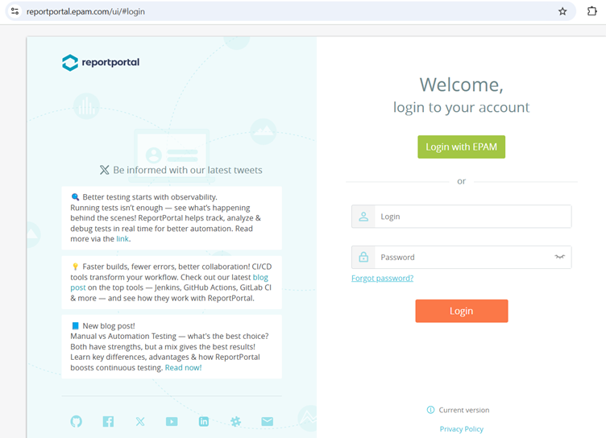
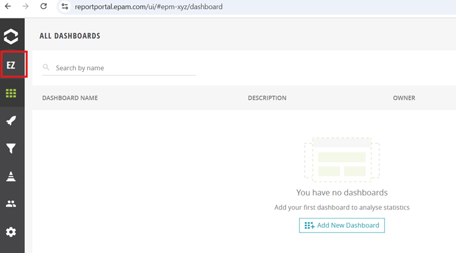
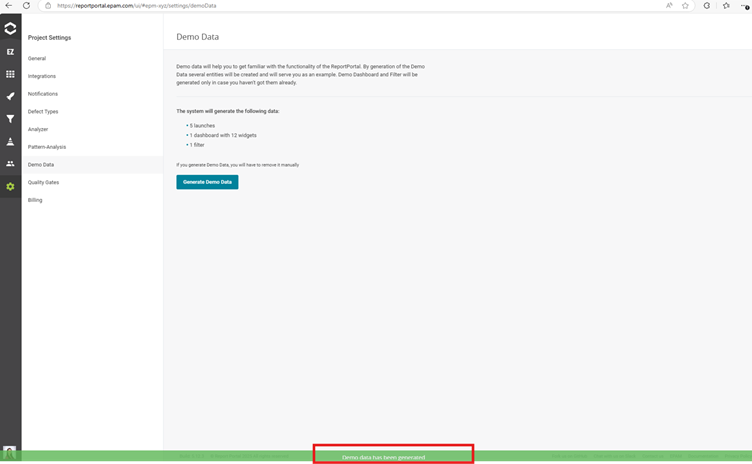
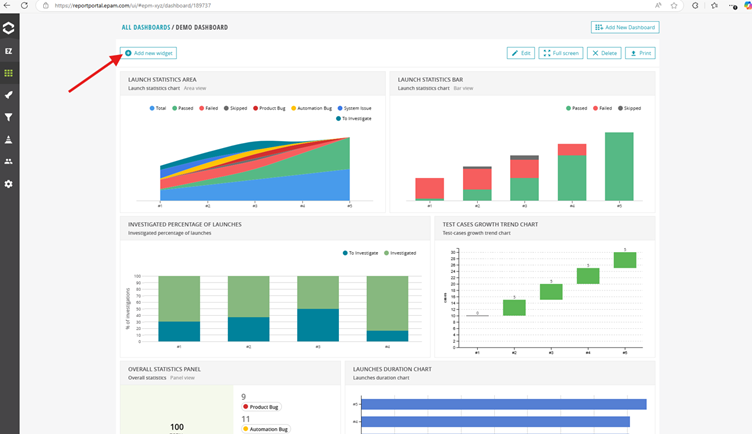
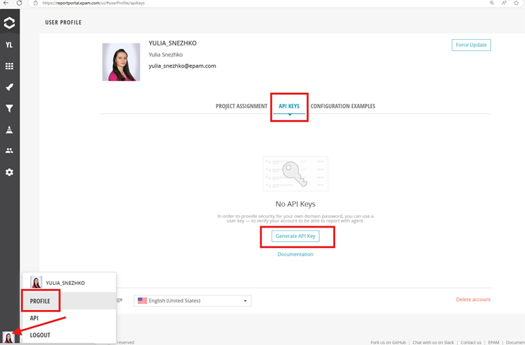
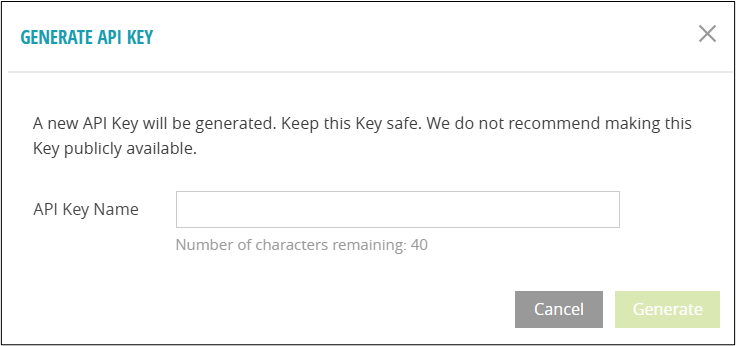
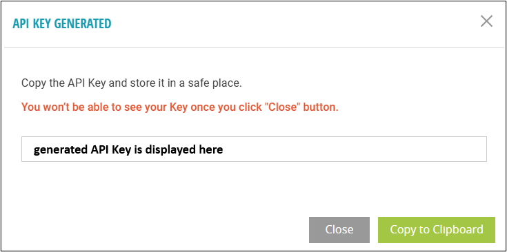
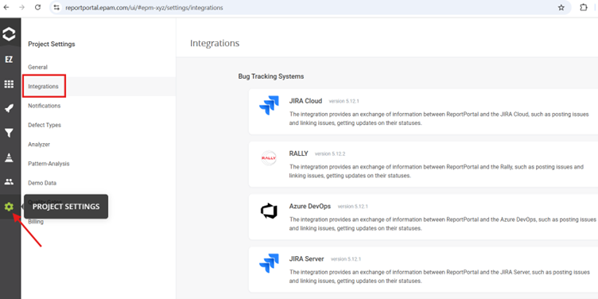
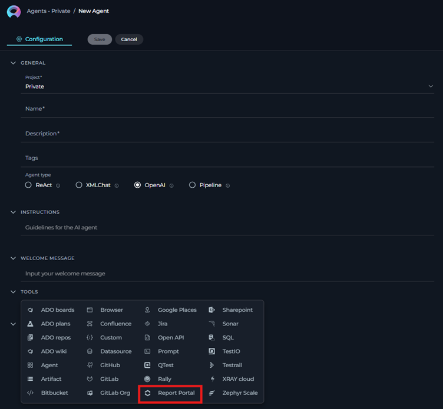
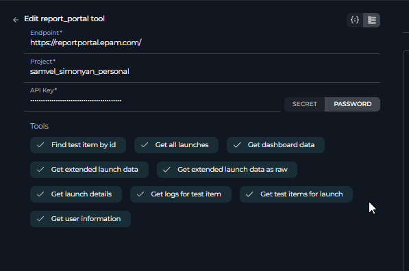

# ELITEA Toolkit Guide: ReportPortal Integration

## Introduction

### Purpose of this Guide

This guide is your definitive resource for integrating and effectively utilizing the **ReportPortal toolkit** within ELITEA. It provides a detailed, step-by-step walkthrough, from setting up your ReportPortal API token to configuring the toolkit in ELITEA and seamlessly incorporating it into your Agents. By following this guide, you will unlock the power of advanced test result reporting, detailed analytics, and streamlined quality assurance workflows, all directly within the ELITEA platform. This integration empowers you to leverage AI-driven automation to optimize your software testing lifecycle using the combined strengths of ELITEA and ReportPortal.

### Brief Overview of ReportPortal

ReportPortal is an AI-powered test automation analytics platform designed to aggregate and analyze test results from various automation frameworks. It provides real-time dashboards, detailed reports, and AI-driven insights to help teams understand test execution, identify trends, and improve software quality. Key features of ReportPortal include:

*   **Centralized Test Result Aggregation:** Collects test results from diverse automation frameworks and tools into a single platform.
*   **AI-Powered Analytics:** Utilizes artificial intelligence to analyze test data, identify patterns, and provide actionable insights.
*   **Real-time Dashboards and Reporting:** Offers customizable dashboards and reports for visualizing test execution status, trends, and key metrics.
*   **Test Failure Analysis:** Helps in identifying root causes of test failures and improving test stability.
*   **Collaboration and Teamwork:** Facilitates collaboration among QA teams, developers, and stakeholders through shared access to test results and analytics.

Integrating ReportPortal with ELITEA allows for seamless transfer of test data, enabling advanced reporting and analytics within your ELITEA workflows. Your ELITEA Agents can then interact with ReportPortal to automate test result analysis, generate reports, and gain AI-driven insights into your software quality directly within your automated workflows.

## ReportPortal Account Setup and Configuration

### Account Setup

If you don't have a ReportPortal account yet, here’s how to get started:

1.  **Go to ReportPortal:** Open your web browser and navigate to [https://reportportal.epam.com](https://reportportal.epam.com).
2.  **Sign Up:**
    *   **Option 1 (Standard Login):** Specify your desired **Login** and **Password** and click on the **'Login'** button.
    *   **Option 2 (EPAM Login):** If you are an EPAM employee or have EPAM credentials, click on the **'Login with EPAM'** button and use your EPAM credentials.
3.  **Access Requirements:** Ensure you have a valid email address to sign up for ReportPortal. Depending on your organization's policies, you might need approval from your administrator to use external tools like ReportPortal.



### Software-Specific Setup (Project and Dashboard Configuration)

After signing up and logging in, you may need to perform some initial setup steps within ReportPortal to organize your test data and visualizations:

1.  **Navigate to Projects:** Go to the **'Projects'** tab, typically located in the top navigation menu.

    

2.  **Create or Join a Project:**
    *   **Create New Project:** If you need a new project, click on the button to create a new project and follow the on-screen instructions to name and configure your project.
    *   **Join Existing Project:** If your team already has a project, request to join the existing project.
3.  **Set up Test Structure (Optional):**  While not mandatory for ELITEA integration, setting up test suites and cases in ReportPortal can help organize your test data within ReportPortal itself. You can do this under the **'Test Suites & Cases'** section if needed.
4.  **Generate Demo Data (Optional):** For exploring ReportPortal functionalities and testing the integration, you can generate demo data. Navigate to **Project Settings > Demo Data > Click on Generate Demo Data**. This will populate your project with sample test data.

    
    

5.  **Create Dashboards (Optional but Recommended):** Dashboards in ReportPortal are essential for visualizing your test data.
    *   Navigate to your **Project** and then to the **Dashboards** page.
    *   Click on the **‘Add New Dashboard’** button (usually top right).
    *   Give your dashboard a name and click **'Add'**.
    *   Once created, your new dashboard will appear in the list.

        

    *   Click on the dashboard name to open it and then click **'Edit'** to add widgets.
    *   Add relevant widgets (e.g., charts, graphs, metrics) to visualize the test data you want to monitor.




### Token/API Key Generation: Creating an API Token in ReportPortal

For secure integration with ELITEA, it is essential to use a ReportPortal **API token** for authentication. This method is more secure than using your primary ReportPortal account password directly and allows you to control access permissions.

**Follow these steps to generate an API Token:**

1.  **Access User Profile:** Click on your **User icon** and then select **'Profile'** from the menu.

    

2.  **Navigate to API Keys:** In your Profile page, select the **API Keys** tab.
3.  **Generate API Key:** Click on the **'Generate API Key'** button.

    

4.  **Name API Key:** In the **'API Key Name'** dialog, specify a descriptive name for your API Key (e.g., "ELITEA Integration Key") and click **'Generate'**.
5.  **Securely Copy and Store Your API Token:** **Immediately copy the generated API token** displayed in the pop-up window. **This is the only time you will see the full token value.** Store it securely using a password manager or, preferably, ELITEA's built-in Secrets feature (recommended for enhanced security within ELITEA). You will need this API token to configure the ReportPortal toolkit in ELITEA.

    

6.  **API Key Confirmation:** Once generated and saved, the API Key will be displayed in the table of API Keys in your profile.



## ReportPortal Integration with ELITEA

### Agent Creation/Configuration

To integrate ReportPortal functionalities into your workflows, you will need to configure the ReportPortal toolkit within an ELITEA Agent. You can either create a new Agent specifically for ReportPortal interactions or modify an existing Agent.

1.  **Navigate to Agents Menu:** In ELITEA, go to the **Agents** menu from the main navigation panel.
2.  **Create or Edit Agent:**
    *   **Create a New Agent:** Click on the **"+ Agent"** button to initiate the creation of a new Agent. Follow the on-screen prompts to define essential Agent attributes such as Agent name, a descriptive Agent description, the desired Agent type, and initial instructions for the Agent.
    *   **Edit an Existing Agent:** Select the Agent you intend to integrate with ReportPortal from your list of Agents. Click on the Agent's name to open its configuration settings for editing.
3.  **Access Tools Section:** Within the Agent configuration interface, scroll down until you locate the **"Tools"** section.




### Toolkit Configuration

This section provides detailed instructions on how to configure the ReportPortal toolkit within your ELITEA Agent.

1.  **Add Toolkit:** In the "Tools" section of the Agent configuration, click on the **"+" icon**.
2.  **Select ReportPortal Toolkit:** From the dropdown list of available toolkits, choose **"ReportPortal"**. Selecting "ReportPortal" will open the "New ReportPortal tool" configuration panel.
3.  **Configure ReportPortal Toolkit Settings:** Carefully fill in the following configuration fields within the "New ReportPortal tool" section:

    *   **ReportPortal URL:** Enter your ReportPortal instance **URL**. Ensure you use the correct format, including `https://` or `http://` and the full workspace URL (e.g., `https://your-reportportal.example.com/`).
    *   **Project Name:** Specify the exact **Project Name** in ReportPortal that you want to integrate with. This name must match the project name as it appears in ReportPortal.
    *   **API Key:** Enter your ReportPortal **API Key**. You can find this in your ReportPortal profile settings under the "API Keys" section (generated during the ‘Token/API Key Generation’ part of the "ReportPortal Account Setup and Configuration" section of this guide above). Choose **"Secret"** and select a pre-configured secret from the dropdown. You must first create and securely store your **API Key** as a Secret in ELITEA's [Secrets](../../platform-documentation/menus/settings.md#secrets) feature. Using Secrets prevents hardcoding sensitive credentials directly in the toolkit configuration and enhances security.

    

4.  **Complete Setup:** After configuring all the necessary settings, click the **arrow icon** to finalize the ReportPortal toolkit setup and return to the main Agent configuration menu.
5.  **Click Save:** Click **Save** in the Agent configuration to save all changes and activate the ReportPortal toolkit integration for your Agent.

## Tool Overview: ReportPortal Toolkit Functionalities

Once the ReportPortal toolkit is successfully configured and added to your Agent, you can leverage the following tools within your Agent's instructions to enable intelligent interaction with your ReportPortal instance:

*   **Export specified launch:** `export_specified_launch`
    *   **Description:** Allows users to export data from a specific test launch in ReportPortal to ELITEA.
    *   **Use Case:** Export detailed test launch data for in-depth analysis and custom reporting within ELITEA workflows.
    *   **Parameters:** `launch_id` (ID of the launch to export)

*   **Get launch details:** `get_launch_details`
    *   **Description:** Retrieves detailed information about a specific test launch in ReportPortal.
    *   **Use Case:** Retrieve comprehensive details of a specific test launch to understand test execution metrics, identify failure patterns, and track trends.
    *   **Parameters:** `launch_id` (ID of the launch to get details for)

*   **Get all launches:** `get_all_launches`
    *   **Description:** Fetches a list of all test launches within a specified project in ReportPortal.
    *   **Use Case:** Monitor overall project quality and test progress by fetching and analyzing lists of test launches and their statuses.
    *   **Parameters:** None

*   **Find test item by id:** `find_test_item_by_id`
    *   **Description:** Locates a specific test item within ReportPortal using its unique identifier.
    *   **Use Case:** Quickly access specific test results for detailed investigation and troubleshooting of individual test cases.
    *   **Parameters:** `test_item_id` (ID of the test item to find)

*   **Get test items for launch:** `get_test_items_for_launch`
    *   **Description:** Retrieves all test items associated with a particular test launch in ReportPortal.
    *   **Use Case:** Analyze test coverage and results for a particular test launch to assess the quality of a specific release or feature.
    *   **Parameters:** `launch_id` (ID of the launch to get test items for)

*   **Get logs for test item:** `get_logs_for_test_item`
    *   **Description:** Accesses execution logs for a specific test item in ReportPortal.
    *   **Use Case:** Access detailed execution logs for failed test cases to diagnose root causes and resolve issues efficiently.
    *   **Parameters:** `test_item_id` (ID of the test item to get logs for)

*   **Get user information:** `get_user_information`
    *   **Description:** Obtains user details from ReportPortal.
    *   **Use Case:** Manage user access and permissions to test data within ELITEA workflows, ensuring data security and compliance.
    *   **Parameters:** None

*   **Get dashboard data:** `get_dashboard_data`
    *   **Description:** Fetches data from ReportPortal dashboards.
    *   **Use Case:** Visualize key project metrics and performance trends from ReportPortal dashboards directly within ELITEA for real-time monitoring and reporting.
    *   **Parameters:** `dashboard_id` (ID of the dashboard to get data from)

*   **Get extended launch data as raw:** `get_extended_launch_data_as_raw`
    *   **Description:** Retrieves extended launch data in raw format from ReportPortal.
    *   **Use Case:** Export launch data in a specified format (HTML or PDF) for detailed analysis and reporting.
    *   **Parameters:** `launch_id` (Launch ID of the launch to export), `format` (Format of the exported data, may be one of 'pdf' or 'html', default is "html")

*   **Get extended launch data:** `get_extended_launch_data`
    *   **Description:** Uses the exported data from a specific launch to generate a comprehensive test report for management.
    *   **Use Case:** Analyze the results, highlight key metrics, and provide insights into test coverage, defect density, and test execution trends.
    *   **Parameters:** `launch_id` (Launch ID of the launch to export)

## Instructions for Using the Toolkit

To effectively utilize the ReportPortal toolkit within your ELITEA Agents, you need to provide clear and precise instructions within the Agent's "Instructions" field, telling the Agent how and when to use these tools.

### Instruction Creation for OpenAI Agents

When creating instructions for the ReportPortal toolkit for OpenAI-based Agents, focus on clear, action-oriented language. Break down tasks into simple steps and explicitly state the parameters required for each tool. OpenAI Agents respond best to instructions that are:

*   **Direct and Imperative:** Use action verbs and clear commands (e.g., "Use the 'get_launch_details' tool...", "Export launch with ID...").
*   **Parameter-Focused:** Clearly list each parameter and how the Agent should determine its value.
*   **Context-Aware:** Provide enough context so the Agent understands the overall goal and when to use specific tools within a workflow.

When instructing your Agent to use a ReportPortal toolkit, use this pattern:

```markdown
1. Identify the goal: [State the objective, e.g., "To get details of a specific test launch"].
2. Tool Selection: Use the "[tool_name]" tool.
3. Parameter Specification: Provide the following parameters:
    - Parameter Name 1: <value or description of value>
    - Parameter Name 2: <value or description of value>
    - ...
4. Expected Outcome: [Optionally, describe what should happen after the tool is used].
```

**Example Agent Instructions for ReportPortal Toolkit Tools (OpenAI Agent Friendly):**

*   **Agent Instructions for Getting Launch Details:**

```markdown
1. Goal: To retrieve detailed information about test launch with ID '12345'.
2. Tool: Use the "get_launch_details" tool.
3. Parameters:
    - launch_id: "12345"
4. Outcome: The Agent will retrieve and provide detailed information about the test launch with ID '12345' from ReportPortal.
```

*   **Agent Instructions for Exporting a Specified Launch:**

```markdown
1. Goal: To export the data from test launch with ID '67890' for further analysis.
2. Tool: Use the "export_specified_launch" tool.
3. Parameters:
    - launch_id: "67890"
4. Outcome: The Agent will export the data of the test launch with ID '67890' from ReportPortal and make it available within ELITEA.
```

*   **Agent Instructions for Getting All Launches:**

```markdown
1. Goal: To get a list of all test launches in the project to monitor test activity.
2. Tool: Use the "get_all_launches" tool.
3. Parameters: None
4. Outcome: The Agent will provide a list of all test launches from the configured ReportPortal project.
```

*   **Agent Instructions for Getting Dashboard Data:**

```markdown
1. Goal: To retrieve data from the ReportPortal dashboard with ID 'dashboard-abc'.
2. Tool: Use the "get_dashboard_data" tool.
3. Parameters:
    - dashboard_id: "dashboard-abc"
4. Outcome: The Agent will retrieve and provide the data from the ReportPortal dashboard with ID 'dashboard-abc'.
```

### Conversation Starters

Use these conversation starters to interact with your ReportPortal-integrated Agent.

**1. For Testing and Troubleshooting Connection:**

These starters are designed to verify if the ReportPortal toolkit is correctly configured and connected to your ReportPortal instance.

*   "Get all launches from ReportPortal." - *This tests basic connectivity and read permissions.*
*   "Get details for launch ID '12345' from ReportPortal." - *This further tests data retrieval for a specific launch.*
*   "Get data from dashboard with ID 'dashboard-abc' from ReportPortal." - *This tests dashboard data retrieval.*

**2. For General Agent Usage Scenarios:**

These starters demonstrate how to initiate agent execution for common ReportPortal-related tasks.

*   "I need a summary report of the latest test launch. Can you get the details of the most recent launch from ReportPortal?" - *This could trigger a workflow involving `get_all_launches` to find the latest launch and then `get_launch_details`.*
*   "Export the data from launch ID '77777' to analyze test failures in detail." - *This directly initiates the `export_specified_launch` tool.*
*   "Show me the key metrics from my 'Performance Dashboard' in ReportPortal." - *This would use the `get_dashboard_data` tool to visualize dashboard information.*
*   "Find the logs for test item with ID 'test-item-99' to troubleshoot a specific test failure." - *This would use the `get_logs_for_test_item` tool.*

These conversation starters provide a starting point for interacting with your ReportPortal-integrated ELITEA Agent and can be customized further based on your specific use cases and workflows.

## Use Cases

The ReportPortal toolkit unlocks numerous automation possibilities for software quality assurance workflows within ELITEA. Here are some key use cases, demonstrating how each tool can be applied:

*   **Automated Test Result Reporting and Summarization:**
    *   **Scenario:** After each automated test execution, the Agent automatically retrieves test launch details from ReportPortal and generates a summary report within ELITEA.
    *   **Tools Used:** `get_launch_details`
    *   **Example Use Case:**  "After running automated tests, the Agent uses `get_launch_details` to fetch the latest launch results and presents a summary of passed, failed, and skipped tests directly in the ELITEA chat interface."
    *   **Benefit:** Provides immediate feedback on test execution status without manually accessing ReportPortal.

*   **AI-Driven Failure Analysis and Root Cause Identification:**
    *   **Scenario:** When tests fail, the Agent can automatically retrieve logs for failed test items from ReportPortal and use AI to analyze these logs to identify potential root causes.
    *   **Tools Used:** `get_logs_for_test_item`
    *   **Example Use Case:** "If a test launch shows failures, the Agent uses `get_test_items_for_launch` to find failed tests, then uses `get_logs_for_test_item` to retrieve logs for those failures.  The Agent then analyzes the logs (potentially using other ELITEA tools or AI capabilities) to suggest possible root causes to the user."
    *   **Benefit:** Accelerates debugging and reduces time spent on manual log analysis.

*   **Customizable Test Dashboards within ELITEA:**
    *   **Scenario:** Users can create custom dashboards in ReportPortal and then use the ELITEA Agent to fetch data from these dashboards to display key QA metrics directly within ELITEA.
    *   **Tools Used:** `get_dashboard_data`
    *   **Example Use Case:** "A QA manager wants to monitor the 'Test Stability Dashboard' from ReportPortal within ELITEA. They instruct the Agent to use `get_dashboard_data` with the dashboard ID to fetch the latest metrics and display them in a structured format within ELITEA."
    *   **Benefit:** Brings key ReportPortal visualizations directly into ELITEA, providing a unified view of QA data.

*   **Proactive Test Monitoring and Alerting:**
    *   **Scenario:** The Agent can periodically check for new test launches in ReportPortal and, based on predefined criteria (e.g., failure rate exceeding a threshold), trigger alerts or notifications within ELITEA.
    *   **Tools Used:** `get_all_launches`, `get_launch_details`
    *   **Example Use Case:** "The Agent is configured to periodically use `get_all_launches` to check for new launches. If a new launch is detected, it uses `get_launch_details` to analyze the failure rate. If the failure rate is above 20%, the Agent sends a notification in ELITEA to the QA team."
    *   **Benefit:** Enables proactive monitoring of test quality and timely intervention when issues arise.

*   **Data Export for Advanced Analytics and Reporting:**
    *   **Scenario:** For in-depth analysis or integration with other reporting tools, users can export detailed test launch data from ReportPortal to ELITEA.
    *   **Tools Used:** `export_specified_launch`
    *   **Example Use Case:** "A data analyst needs to perform advanced analysis on historical test data. They use the Agent to `export_specified_launch` for several key test launches and then use other ELITEA tools to process and analyze this exported data."
    *   **Benefit:** Facilitates advanced data analysis and custom reporting beyond ReportPortal's built-in capabilities.

*   **User Access Management within ELITEA Workflows:**
    *   **Scenario:** To manage access to test data within ELITEA workflows, the Agent can retrieve user information from ReportPortal.
    *   **Tools Used:** `get_user_information`
    *   **Example Use Case:** "When setting up access controls for test reports within ELITEA, the Agent uses `get_user_information` to verify user roles and permissions in ReportPortal and apply corresponding access restrictions within ELITEA."
    *   **Benefit:** Enhances data security and ensures compliance by managing access to sensitive test information.

## Troubleshooting and Support

### Troubleshooting

*   **Connection Errors:**
    *   **Problem:** ELITEA Agent fails to connect to ReportPortal, resulting in errors during toolkit execution.
    *   **Troubleshooting Steps:**
        1.  **Verify ReportPortal URL:** Double-check that you have entered the correct ReportPortal workspace URL in the toolkit configuration, including `https://` or `http://` and the full workspace URL.
        2.  **Check API Key:** Ensure that the API Key you provided is correct and valid for your ReportPortal account and workspace. Carefully re-enter or copy-paste these credentials to rule out typos. **Important:** If using Secrets, verify the Secret value is correctly stored and retrieved.
        3.  **Network Connectivity:** Confirm that both your ELITEA environment and your ReportPortal instance are connected to the internet and that there are no network connectivity issues blocking the integration.
        4.  **ReportPortal Status:** Check if ReportPortal is operational and accessible outside of ELITEA by accessing the ReportPortal URL directly in your browser.
        5.  **Firewall/Proxy Issues:** If you are behind a corporate firewall or proxy, ensure that ELITEA's network requests to ReportPortal are not being blocked. You may need to configure proxy settings if applicable.

*   **Authorization Errors (Permission Denied/Unauthorized):**
    *   **Problem:** Agent execution fails with "Permission Denied" or "Unauthorized" errors when trying to access ReportPortal resources.
    *   **Troubleshooting Steps:**
        1.  **Verify API Key Permissions:** Ensure that the API Key has the necessary permissions within ReportPortal to access the project and data you are trying to retrieve. API Keys in ReportPortal typically have access to all projects associated with the user who generated the key. However, double-check user roles and project permissions within ReportPortal if issues persist.
        2.  **Project Access:** Confirm that the API Key is associated with a ReportPortal user who has access to the specified project in the toolkit configuration.
        3.  **Correct Project Name:** Double-check that the **Project Name** in the toolkit configuration exactly matches the project name in ReportPortal (case-sensitive).

*   **Incorrect Launch or Dashboard ID:**
    *   **Problem:** Tools that require `launch_id` or `dashboard_id` fail because of incorrect IDs.
    *   **Troubleshooting Steps:**
        1.  **Verify Launch ID:** Ensure that the `launch_id` you are using is a valid and existing Launch ID in your ReportPortal project. You can find Launch IDs in the ReportPortal UI when viewing launch details.
        2.  **Verify Dashboard ID:** Ensure that the `dashboard_id` you are using is a valid and existing Dashboard ID in your ReportPortal project. Dashboard IDs are usually visible in the URL when you are viewing a specific dashboard in ReportPortal.

### FAQ

1.  **Q: What type of API Key should I use for integration?**
    *   **A:** It is recommended to use a personal API key generated within your ReportPortal profile settings. Ensure this key has sufficient permissions to access the relevant projects and data. Using a personal API key is generally preferred over account passwords for security and manageability.

2.  **Q: Can I use different ReportPortal URLs for different Agents?**
    *   **A:** Yes, you can configure different ReportPortal URLs for different ELITEA Agents. This is useful if you need to connect to multiple ReportPortal instances or projects from different Agents. Simply configure a separate ReportPortal toolkit in each Agent with the respective URL and credentials.

3.  **Q: What happens if the ReportPortal connection is lost?**
    *   **A:** If the connection is lost, ELITEA Agents will not be able to retrieve data from ReportPortal. Agent executions that rely on the ReportPortal toolkit will likely fail and log error messages indicating connection failures. You will need to troubleshoot the connection issues (network, URL, API Key validity, ReportPortal service status) and re-establish the connection to resume data retrieval.

4.  **Q: How often is data synchronized between ELITEA and ReportPortal?**
    *   **A:** Data synchronization is typically initiated on-demand when an ELITEA Agent uses a ReportPortal toolkit tool. There is no automatic background synchronization. When an Agent executes a tool like `get_launch_details`, it makes a real-time API request to ReportPortal to fetch the latest data. Real-time synchronization depends on the responsiveness of the ReportPortal API and network conditions.

### Support Contact

For any issues, questions, or further assistance with the ReportPortal integration or ELITEA Agents, please reach out to our dedicated ELITEA Support Team. We are committed to providing prompt and effective support to ensure your success with ELITEA.

**Contact ELITEA Support:**

*   **Email:**  [SupportAlita@epam.com](mailto:SupportAlita@epam.com)

**Best Practices for Effective Support Requests:**

To help us understand and resolve your issue as quickly as possible, please ensure you provide the following information in your support email:

*   **ELITEA Environment:** Clearly specify the ELITEA environment you are using (e.g., "Nexus," "Alita Lab," "EYE").
*   **Project Details:**  Indicate the **Project Name** and whether you are working in your **Private** workspace or a **Team** project.
*   **Detailed Issue Description:** Provide a clear, concise, and detailed description of the problem you are encountering. Explain what you were trying to do, what you expected to happen, and what actually occurred.
*   **Relevant Configuration Information:**  To help us diagnose the issue, please include relevant configuration details, such as:
    *   **Agent Instructions (Screenshot or Text):** If the issue is with an Agent, provide a screenshot or copy the text of your Agent's "Instructions" field.
    *   **Toolkit Configurations (Screenshots):** If the issue involves the ReportPortal toolkit or other toolkits, include screenshots of the toolkit configuration settings within your Agent.
*   **Error Messages (Full Error Text):** If you are encountering an error message, please provide the **complete error text**. In the Chat window, expand the error details and copy the full error message. This detailed error information is crucial for diagnosis.
*   **Your Query/Prompt (Exact Text):** If the issue is related to Agent execution, provide the exact query or prompt you used to trigger the issue.

**Before Contacting Support:**

We encourage you to first explore the resources available within this guide and the broader ELITEA documentation. You may find answers to common questions or solutions to known issues in the documentation.

## Useful Links

To further enhance your understanding and skills in integrating ReportPortal with ELITEA, here are some helpful resources:

*   **[ReportPortal Website](https://reportportal.epam.com)**: Access the main ReportPortal platform website for product information and documentation.
*   **[ReportPortal API Documentation](https://reportportal.io/docs/api)**: Explore the official ReportPortal API documentation for detailed information on API endpoints and functionalities.
*   **[ELITEA Secrets](../../platform-documentation/menus/settings.md#secrets)**: Learn how to securely store your ReportPortal API Key using ELITEA's Secrets management feature for enhanced security.
*   **[ELITEA Agents Configuration](../../platform-documentation/menus/agents.md)**:  Find out more about creating and configuring Agents in ELITEA, where you integrate the ReportPortal toolkit to automate your workflows.
*   **[ELITEA Support Email](mailto:SupportAlita@epam.com)**: Contact the ELITEA support team for direct assistance with ReportPortal integration or any other questions and issues you may encounter.