# ELITEA Toolkit Guide: Sales Force Integration

## Introduction

### Purpose of this Guide

This guide is your definitive resource for integrating and utilizing the **Sales Force toolkit** within ELITEA. It provides a step-by-step walkthrough, from understanding necessary Sales Force prerequisites to configuring the toolkit in ELITEA and effectively using it within your Agents. By following this guide, you will unlock the power of automated CRM data management, record creation, updates, searches, and streamlined workflows focused on Leads, Cases, and general Sales Force interactions, all directly within the ELITEA platform. This integration empowers you to leverage AI-driven automation to optimize your Sales Force-related tasks using the combined strengths of ELITEA and Sales Force APIs.

### Brief Overview of Sales Force and its API

Sales Force is a leading cloud-based Customer Relationship Management (CRM) platform that helps companies manage customer interactions, streamline sales processes, track leads and opportunities, provide customer service, and much more. It centralizes customer data and business operations.

The Sales Force API provides programmatic access to your Sales Force data and functionality. It allows external applications like ELITEA to interact with your Sales Force organization to perform specific actions on records such as Leads and Cases, as well as conduct searches and generic updates. Key capabilities relevant to this toolkit include:

*   **Creating Records:** Programmatically create new Lead or Case records in Sales Force.
*   **Updating Records:** Modify existing Lead or Case records, or perform generic updates on other record types based on ID.
*   **Searching/Querying:** Find records across various Sales Force objects using search queries.

Integrating Sales Force with ELITEA brings these robust CRM capabilities directly into your AI-powered workflows. Your ELITEA Agents can then interact with the Sales Force API to automate tasks such as creating new leads from inquiries, logging customer support cases, updating record statuses, and retrieving specific Sales Force data based on user requests or automated triggers, enhancing application functionalities, and improving business processes through intelligent automation.
Before you can integrate Sales Force with ELITEA, you need:

1.  **A Sales Force Account:** Access to a Sales Force organization (Developer Edition, Enterprise Edition, Unlimited Edition, etc.) that supports API access.
## Sales Force API Access and Configuration: Setting up a Connected App (Alternative Method)

For secure integration with ELITEA using OAuth, it is highly recommended to use a Sales Force Connected App. This method provides a Client ID (Consumer Key) and Client Secret (Consumer Secret) that ELITEA can use to authenticate and gain API access without storing user credentials directly.

Here’s a step-by-step guide based on the provided screenshots to create a Connected App:

**Prerequisites:** You must have "Modify All Data" or "Customize Application" permissions in Sales Force to create Connected Apps.

**Steps:**

1.  **Access Salesforce Setup:**
    *   Click the **Gear icon** (Setup menu) in the top right corner of your Sales Force org. 
    *   From the dropdown menu, click **"Setup"**. 

        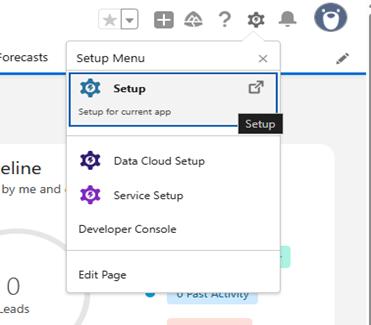

2.  **Navigate to App Manager:**
    *   Once in Setup Home, use the **"Quick Find"** search bar on the left sidebar.
    *   Type "App Manager" in the search bar.

        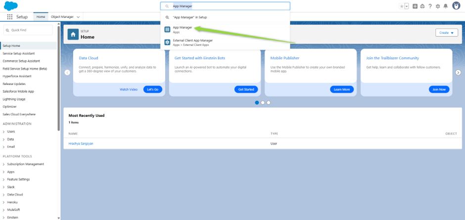

    *   Under "Apps" (or potentially "External Client Apps"), click the **"App Manager"** link.
    *   You will see a list of existing apps. 

        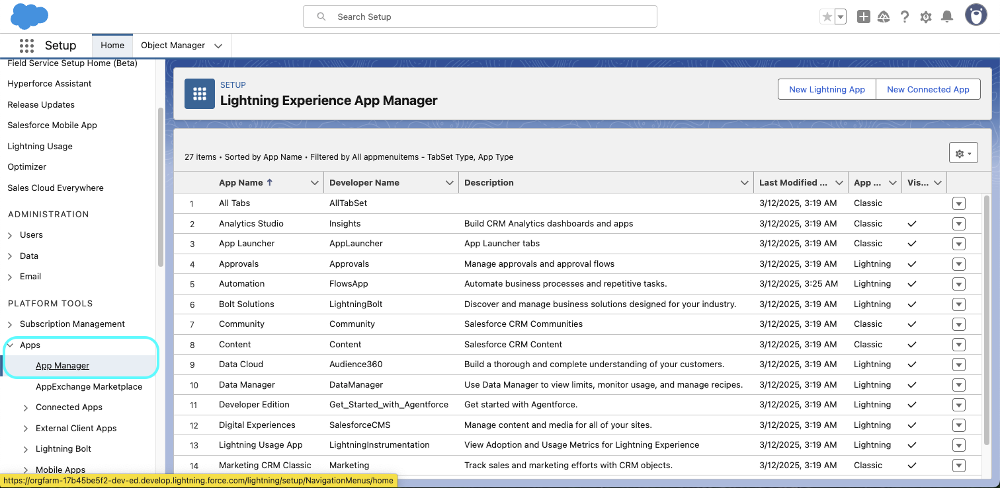

3.  **Initiate New Connected App Creation:**
    *   In the top right corner of the Lightning Experience App Manager page, click the **"New Connected App"** button. 
    *   A modal might appear asking to choose between "Create a Connected App" and "Create an External Client App". Select **"Create a Connected App"** 
    *   Click **"Continue"** (labeled '3').

        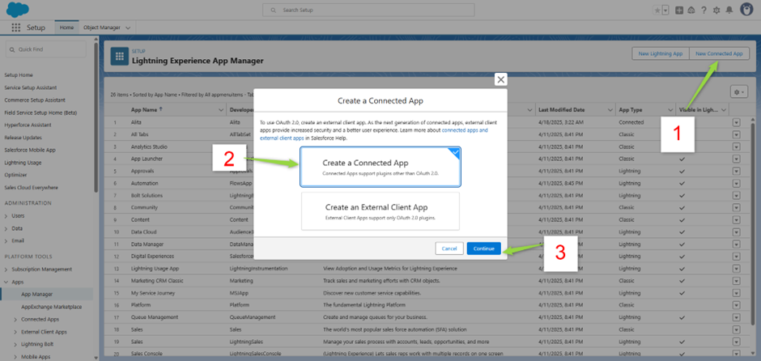

4.  **Enter Basic Information:**
    *   Fill in the required "Basic Information" fields for your new Connected App:
        *   **Connected App Name:** Enter a descriptive name (e.g., "ELITEA Integration App").
        *   **API Name:** This will auto-populate based on the Connected App Name but can be modified.
        *   **Contact Email:** Enter your email address or a relevant contact email.
            Fill in any other optional fields as needed (e.g., Description). 

        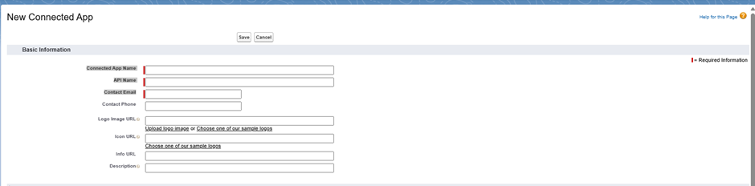

5.  **Enable OAuth Settings:**
    *   Scroll down to the "API (Enable OAuth Settings)" section.
    *   Check the **"Enable OAuth Settings"** checkbox. (Refer to Screenshots 6 and 7)
    *   Checking this box will reveal more fields, including "Callback URL" and "Available OAuth Scopes".

        

6.  **Configure Callback URL:**
    *   The **"Callback URL"** field is required when enabling OAuth, even if you primarily use a flow like Client Credentials that doesn't use a callback. Enter a placeholder URL or, if your ELITEA instance provides a specific callback URL for OAuth flows, use that. A common placeholder might be `https://login.salesforce.com/services/oauth2/success` or a generic secure URL related to your application. 

7.  **Select OAuth Scopes:**
    *   In the "Available OAuth Scopes" list, select the necessary permissions for ELITEA to interact with Sales Force. You will likely need at least:
        *   **"Access and manage your data (api)"**: This is fundamental for the toolkit's read/write operations (`create_case`, `update_lead`, `search_salesforce`, etc.).
        *   **"Access the identity URL service (id, profile, email, address, phone)"**: Often useful for identifying the connecting user.
    *   Select the desired scopes from the "Available OAuth Scopes" list and click the **right arrow** button to move them to the "Selected OAuth Scopes" list. 

        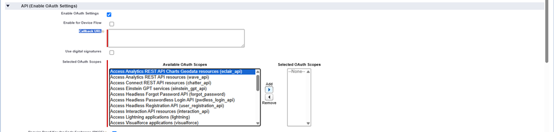

8.  **Enable Client Credentials Flow (Recommended for Server-to-Server):**
    *   Scroll down further in the "API (Enable OAuth Settings)" section.
    *   Check the **"Enable Client Credentials Flow"** checkbox. 

        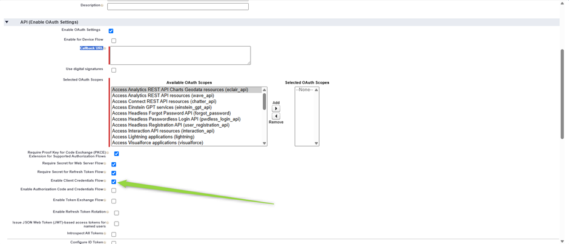
        
    *   This flow allows server-to-server authentication using only the Consumer Key and Consumer Secret.
    * Get Client ID and Secret
    After saving connected app and waiting a few minutes:

## Steps to Configure Connected App for Client Credentials Flow 

Follow these steps after saving your Connected App and waiting a few minutes:

* Go back to **App Manager**.
* Find your app in the list ➝ click the **▼ arrow** on the right ➝ choose **View**.

    
        
* From the connected app detail page, click "Manage".

    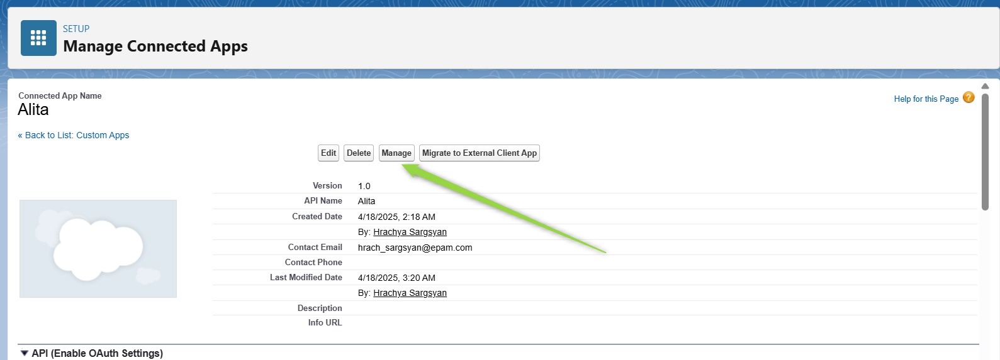

* Click Edit Policies.

    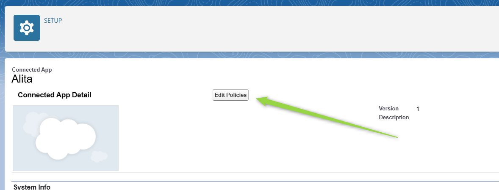

* Under **Client Credentials Flow**, for **Run As**, select the user that you want to assign to the client credentials flow.

    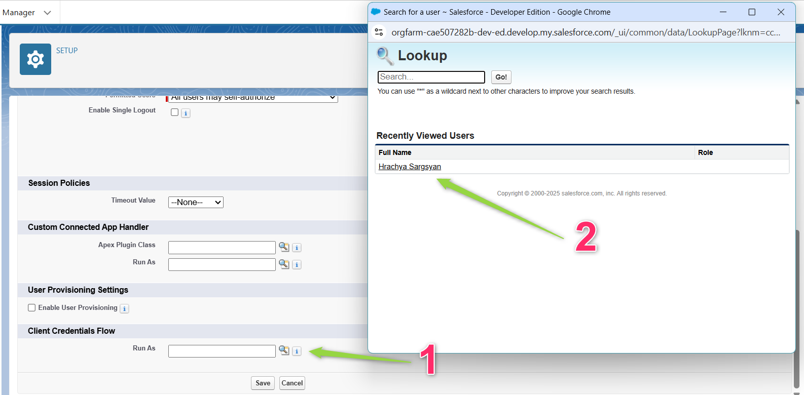

*  Click **Save**.
* Go back to **App Manager**.
11. **Retrieve Consumer Key and Secret:**
    *   Once saved, you will be taken to the Connected App Detail page.

        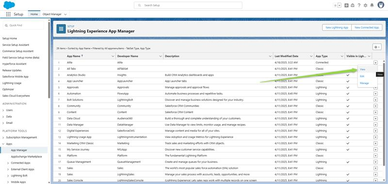

    *   To get the credentials, look for the "API (Enable OAuth Settings)" section again.
    *   Click the **"Manage Consumer Details"** button. 

        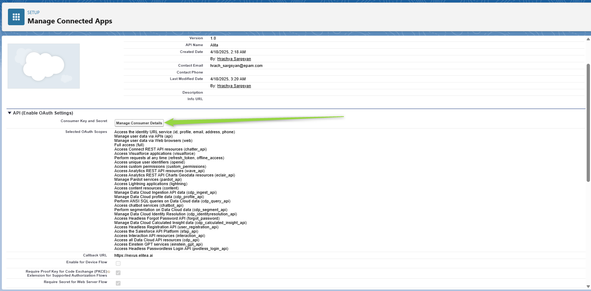

    *   After verification your Consumer Details will be displayed
    *   A new page or modal will display your **"Consumer Key"** (Client ID) and **"Consumer Secret"**      (Client Secret). 

        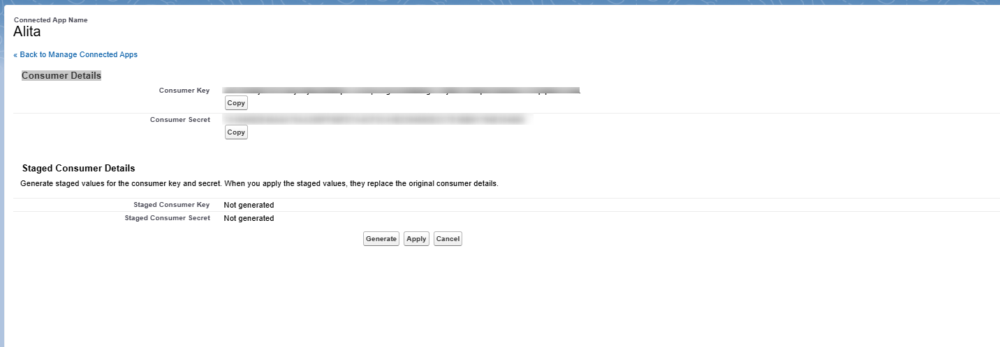

    *   **Securely Copy and Store these credentials.** You will need the Consumer Key and Consumer Secret to configure the Sales Force toolkit in ELITEA, preferably using ELITEA's Secrets feature.

This Connected App is now configured for API access, including potentially using the more secure Client Credentials Flow. You would then configure your ELITEA Sales Force toolkit using the Sales Force Domain/Instance URL, the Consumer Key, and the Consumer Secret, likely stored as Secrets. The Sales Force toolkit in ELAITEA would need to support OAuth Client Credentials flow for this method to work.
# Salesforce Integration with ELITEA

Integrating Salesforce with ELITEA allows your Agents to interact with your Salesforce data, automating tasks like retrieving records, creating leads, updating opportunities, and more. This document guides you through the process.

## Agent Creation/Configuration

To integrate Salesforce, you'll need to configure it within an ELITEA Agent. You can either create a new Agent or modify an existing one.

1.  **Navigate to Agents:** In ELITEA, go to the **Agents** menu.
2.  **Create or Edit Agent:**
    *   **New Agent:** Click **"+ Agent"** to create a new Agent. Follow the steps to define Agent details like name, description, type, and instructions.
    *   **Existing Agent:** Select the Agent you want to integrate with Salesforce and click on its name to edit.
3.  **Access Toolkits Section:** In the Agent configuration, scroll down to the **"Toolkits"** section.

## Toolkit Configuration

This section details how to configure the Salesforce toolkit within your ELITEA Agent.

1.  **Add Toolkit:** In the "Tools" section, click the **"+" icon**.
2.  **Select Salesforce:** Choose **"Salesforce"** from the dropdown list of available toolkits. This opens the "New Salesforce tool" configuration panel.
3.  **Configure Toolkit Details:** Fill in the following fields using the information from your Salesforce Connected App and instance:

    *   **Name:** Enter a **Name** for this Salesforce toolkit instance. Choose a descriptive name (e.g., "SalesforceCRM", "AccountManager"). This name might be referenced in your Agent's instructions.
    *   **Description:** Provide a **Description** for the toolkit, clarifying its purpose (e.g., "Toolkit to interact with Salesforce data").
    *   **Base Url:** Enter the **Base URL** of your Salesforce instance. This is typically in the format `https://[YourInstance].my.salesforce.com` or `https://[YourInstance].salesforce.com`. Ensure it points to your specific Salesforce environment.
    * For example:

*   If your Salesforce URL is `https://orgfarm-17b45be5f2-dev-ed.develop.my.salesforce.com`, use `https://orgfarm-17b45be5f2-dev-ed.develop.my.salesforce.com` as the Base Url.

    Avoid using `lightning.force.com` URLs that you might see when logged into the Lightning Experience interface.

    The Salesforce toolkit internally handles the specific API endpoints (like the token endpoint) based on the Base Url you provide and your Salesforce instance type (Production, Sandbox, My Domain). You do not need to configure these specific endpoint URLs such as:

     `https://test.salesforce.com/services/oauth2/token` (for Sandboxes)
     `https://login.salesforce.com/services/oauth2/token` (for Developer Edition or Production)
     `https://your-custom-domain.my.salesforce.com/services/oauth2/token` (for My Domain).The toolkit constructs these endpoints automatically.
    
    *   **Client Id:**
        *   Paste the **Consumer Key** you copied from your Salesforce Connected App's "Manage Consumer Details" (Step 11 in the Prerequisites) into the "Client Id" field.
        *   **Enhanced Security with Secrets:** For improved security, it's highly recommended to use **"Secret"**. Select **"Secret"** and choose a pre-configured secret from the dropdown. You must first create and securely store your **Consumer Key** as a Secret in ELITEA's [Secrets](../../atform-documentation/menus/settings.md#secrets) feature. Using Secrets prevents hardcoding sensitive credentials directly in the toolkit configuration.
    *   **Client Secret:**
        *   Paste the **Consumer Secret** you copied from your Salesforce Connected App's "Manage Consumer Details" (Step 12 in the Prerequisites) into the "Client Secret" field.
        *   **Enhanced Security with Secrets:** Similar to the Client ID, it's highly recommended to store your **Consumer Secret** as a Secret in ELITEA's feature and use it.
    *   **Api Version:** Enter the desired Salesforce **API Version** (e.g., `v59.0`). You can find the current API versions in Salesforce Developer documentation. Use a version supported by your Salesforce instance.

   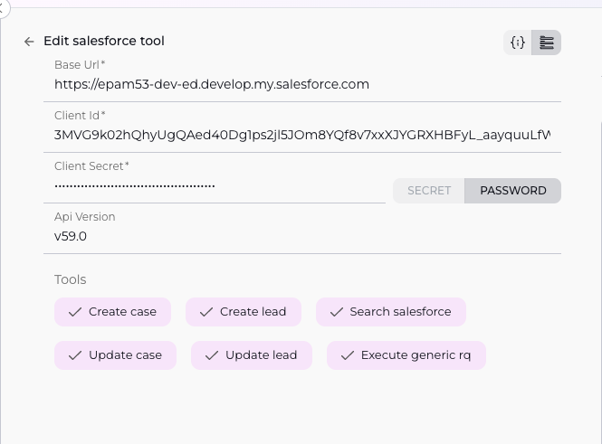
    
4.  **Enable Tools:** In the "Tools" section of the Salesforce toolkit configuration, **select the checkboxes next to the Salesforce tools** you want to enable for your Agent. **Enable only the tools your Agent will actually use** to adhere to the principle of least privilege and enhance security. The specific tools available depend on the ELITEA Salesforce toolkit implementation, but commonly include actions like:
5.  **Complete Configuration:** Click the **arrow icon** (at the top right of the toolkit configuration) to save the Salesforce toolkit setup and return to the main Agent configuration.
6.  Click **Save** to apply configuration and changes.

## Tool Overview

The Salesforce toolkit provides various tools for your ELITEA Agents to interact with your Salesforce data. Based on the tools you have enabled, the toolkit offers the following functionalities:

*   **Create case:** Creates a new Case record in Salesforce.
*   **create lead:** Creates a new Lead record in Salesforce.
*   **search salesforce:** A general tool to search or query records across Salesforce, potentially using SOSL or SOQL depending on the specific implementation.
*   **update case:** Updates an existing Case record in Salesforce.
*   **update lead:** Updates an existing Lead record in Salesforce.
*   **execute generic rq:** A powerful tool likely designed to execute arbitrary Salesforce API requests or queries (like complex SOQL/SOSL queries or DML operations) not covered by the specific `create`/`update` tools.

## Instructions and Prompts for Using the Toolkit

To instruct your ELITEA Agent to use the Salesforce toolkit, you need to provide clear instructions within the Agent's "Instructions" field. These instructions guide the Agent on *when* and *how* to use the available tools.

### Instruction Creation for OpenAI Agents

When creating instructions for the Salesforce toolkit for OpenAI-based Agents, focus on clear, action-oriented language. Break down tasks into simple steps and explicitly state the parameters required for each tool. OpenAI Agents respond best to instructions that are:

*   **Direct and Imperative:** Use action verbs and clear commands (e.g., "Use the 'search salesforce' tool...", "Create a new Lead for...").
*   **Parameter-Focused:** Clearly list each parameter required by the tool (e.g., Case details, Lead details, Search Query, Record ID, Fields to Update, API Request details). Explain how the Agent should determine the value for each parameter from the user's input or context.
*   **Context-Aware:** Provide enough context so the Agent understands the overall goal and when to use specific tools within a workflow (e.g., "If the user reports an issue, use the 'Create case' tool.").

**Example Agent Instructions for Salesforce Toolkit Tools (using the exact tool names you provided):**

*   **Agent Instructions for Creating a Lead:**

    ```
    1. Goal: To create a new Lead in Salesforce from user-provided information.
    2. Tool: Use the "create lead" tool.
    3. Parameters:
        - FirstName: <Extract first name from user input>
        - LastName: <Extract last name from user input>
        - Company: <Extract company from user input>
        - Email: <Extract email from user input>
        - Status: "Open - Not Contacted"
        - (Include any other required fields for Leads as parameters)
    4. Outcome: The Agent will confirm the Lead was created and provide the new Lead ID.
    ```

*   **Agent Instructions for Creating a Case:**

    ```
    1. Goal: To create a new Support Case in Salesforce based on a user's issue description.
    2. Tool: Use the "Create case" tool.
    3. Parameters:
        - Subject: <Summarize the user's issue, e.g., "Customer reported X problem">
        - Description: <Provide the full details of the user's issue>
        - Origin: "Chat" or "Email" (depending on interaction type, or extract if provided)
        - (Optionally include ContactId or AccountId if identifiable from user input or context)
    4. Outcome: The Agent will confirm the Case was created and provide the Case Number.
    ```

*   **Agent Instructions for Searching Salesforce:**

    ```
    1. Goal: To find information about a customer, record, or general data based on a user's query.
    2. Tool: Use the "search salesforce" tool.
    3. Parameters:
        - Query: <The search term or phrase provided by the user, e.g., "Acme Corporation account" or "open cases for John Smith">
    4. Outcome: The Agent will provide the results found in Salesforce that match the query.
    ```

*   **Agent Instructions for Updating a Lead:**

    ```
    1. Goal: To update specific fields on an existing Lead record.
    2. Tool: Use the "update lead" tool.
    3. Parameters:
        - LeadId: <Extract the Lead ID from user input or previous tool call>
        - FieldsToUpdate: <A structure containing the fields and their new values, e.g., { "Status": "Contacted", "Phone": "555-1212" } >
    4. Outcome: The Agent will confirm the Lead was updated.
    ```

*   **Agent Instructions for Updating a Case:**

    ```
    1. Goal: To update specific fields on an existing Case record.
    2. Tool: Use the "update case" tool.
    3. Parameters:
        - CaseId: <Extract the Case ID from user input or previous tool call>
        - FieldsToUpdate: <A structure containing the fields and their new values, e.g., { "Status": "Closed", "Reason": "Solved" } >
    4. Outcome: The Agent will confirm the Case was updated.
    ```

*   **Agent Instructions for Executing Generic Request:**
    *(Note: The parameters for this tool are highly dependent on its specific implementation. This example assumes it takes a method and a path/body.)*

    ```
    1. Goal: To execute a specific, potentially complex Salesforce API request, like running a SOQL query not covered by 'search salesforce'.
    2. Tool: Use the "execute generic rq" tool.
    3. Parameters:
        - Method: "GET" or "POST" (or other HTTP methods)
        - Path: <The Salesforce API endpoint path, e.g., "/services/data/vXX.X/query?q=SELECT+Name+FROM+Account+LIMIT+10">
        - Body: <Optional request body, e.g., for a POST request like creating a record>
    4. Outcome: The Agent will provide the response from the Salesforce API.
    ```

### Conversation Starters

Use these conversation starters to interact with your Salesforce-integrated Agent.

**1. For Testing and Troubleshooting Connection/Basic Functionality:**

These starters are designed to verify if the Salesforce toolkit is correctly configured and connected to your Salesforce instance, and if basic operations work.

*   "Create a test lead for Jane Doe at Testing Co." - *Tests the `create lead` tool.*
*   "Create a test case about login issue for user abc@example.com." - *Tests the `Create case` tool.*
*   "Search Salesforce for 'Acme Corporation'." - *Tests the `search salesforce` tool.*
*   "Update case number [Provide a valid Case ID] with status 'Closed'." - *Tests the `update case` tool (requires a valid case number).*
*   "Update lead ID [Provide a valid Lead ID] with email test@example.com." - *Tests the `update lead` tool (requires a valid lead ID).*
*   "Execute a generic request to get the first 5 Accounts." - *Tests the `execute generic rq` tool (requires Agent instructions to map this request to the tool parameters).*

**2. For General Agent Usage Scenarios:**

These starters demonstrate how to initiate agent execution for common Salesforce tasks.

*   "A customer is reporting an error when saving a record. Please create a support case detailing the issue." - *This triggers a `Create case` call.*
*   "We just met a potential client, John Doe from Example Corp. Can you create a lead for him? His email is john.doe@examplecorp.com." - *This triggers a `create lead` call.*
*   "Can you find me information about the 'Global Solutions' account?" - *This would likely use the `search salesforce` tool.*
*   "Update case 5678 to 'In Progress' and add a note that I am working on it." - *This triggers an `update case` call.*
*   "Mark Lead ID 00Q... as 'Qualified'." - *This triggers an `update lead` call.*
*   "Show me a list of all open opportunities for 'Acme Corporation'." - *This could use the `search salesforce` tool or potentially `execute generic rq` for a more precise SOQL query.*

These conversation starters provide a starting point for interacting with your Salesforce-integrated ELITEA Agent and can be customized further based on your specific use cases and workflows, and the parameters required by each tool.

## Use Cases

The Salesforce toolkit unlocks numerous automation possibilities for CRM-related workflows within ELITEA. Here are some key use cases, demonstrating how your available tools can be applied:

*   **Automated Lead Qualification and Creation:**
    *   **Scenario:** Automatically create and potentially update Leads based on interactions in other channels (e.g., chat, email).
    *   **Tools Used:** `create lead`, `update lead`
    *   **Example Instruction (Creation):** "When a user provides contact details for a potential lead (Name, Company, Email), use the 'create lead' tool to create a new Lead record..."
    *   **Example Instruction (Update):** "If the user confirms they are interested, use the 'update lead' tool with the Lead ID to update the Status to 'Qualified'."
    *   **Benefit:** Streamlines lead capture, qualification, and ensures data is immediately available and up-to-date in the CRM.

*   **Automated Case Management:**
    *   **Scenario:** Automatically create support cases from incoming requests and update them as the support process progresses.
    *   **Tools Used:** `Create case`, `update case`
    *   **Example Instruction (Creation):** "If a user reports a problem or asks for support, use the 'Create case' tool to create a new Case record, populating details from their request."
    *   **Example Instruction (Update):** "If a support agent or system indicates a case is resolved, use the 'update case' tool with the Case ID to set the Status to 'Closed'."
    *   **Benefit:** Ensures all support issues are logged and their status is accurately tracked in Salesforce.

*   **Customer Data Retrieval for Service/Sales:**
    *   **Scenario:** Quickly find and present relevant customer information (Account, Contact, Cases, Opportunities) to an Agent or user interacting with the system.
    *   **Tools Used:** `search salesforce`, `execute generic rq`
    *   **Example Instruction (Search):** "If a user provides a company name, use the 'search salesforce' tool with the company name to find matching Account and Contact records."
    *   **Example Instruction (Generic Query):** "If a user asks for a list of their open opportunities, use the 'execute generic rq' tool with a SOQL query to retrieve open opportunities linked to the identified Account/Contact."
    *   **Benefit:** Provides context-aware CRM data, enabling more efficient and personalized customer interactions.

*   **Streamlined Data Maintenance:**
    *   **Scenario:** Allow users or automated workflows to correct or update specific fields on Lead or Case records.
    *   **Tools Used:** `update lead`, `update case`
    *   **Example Instruction (Update Lead):** "If a user corrects the phone number for a Lead and provides the Lead ID, use the 'update lead' tool to update the Phone field."
    *   **Example Instruction (Update Case):** "If a user provides a more detailed description for an existing case and provides the Case ID, use the 'update case' tool to append the new information to the Description field."
    *   **Benefit:** Ensures data accuracy and allows for quick corrections directly within ELITEA workflows.

*   **Execution of Custom/Advanced Operations:**
    *   **Scenario:** Handle Salesforce interactions that fall outside the specific `create`/`update` tools, such as complex queries, potentially interacting with custom objects, or triggering specific Apex methods if the tool supports it.
    *   **Tools Used:** `execute generic rq`
    *   **Example Instruction:** (Highly dependent on tool capabilities and Salesforce setup) "If the user asks to run the 'Generate Quarterly Report' process for Account ID [AccountID], use the 'execute generic rq' tool to call the appropriate Salesforce API endpoint for that custom process, passing the Account ID as a parameter."
    *   **Benefit:** Provides flexibility to integrate ELITEA with more complex or custom Salesforce functionalities.

## Troubleshooting and Support

### Troubleshooting

*   **Connection Issues:**
    *   **Problem:** Agent fails to connect to Salesforce API, resulting in errors during toolkit execution.
    *   **Troubleshooting Steps:**
        1.  **Verify Base URL:** Ensure the Salesforce **Base Url** in the toolkit configuration is correct and accessible. It should match your Salesforce instance URL exactly.
        2.  **Check Connected App:** Verify the Connected App exists and is correctly configured for the Client Credentials Flow in Salesforce Setup.
        3.  **Network Access:** Ensure there are no network firewalls or proxy settings preventing ELITEA from reaching your Salesforce instance URL.

*   **Authorization Errors (Permission Denied):**
    *   **Problem:** Agent receives "Permission Denied" or "Unauthorized" errors when interacting with Salesforce data.
    *   **Troubleshooting Steps:**
        1.  **Verify Client ID/Secret:** Double-check the **Client Id** (Consumer Key) and **Client Secret** (Consumer Secret) in the ELITEA toolkit configuration against the Salesforce Connected App details. Ensure you are using Secrets correctly if configured that way.
        2.  **Check Run As User Permissions:** Crucially, verify the permissions and profile of the **Run As** user assigned to the Client Credentials Flow in the Salesforce Connected App policies. This user must have the necessary object and field permissions (for Case, Lead, and potentially others for `search salesforce` and `execute generic rq`), as well as access to the required API enabled profile/permission set, to perform the actions requested by the Agent (e.g., create Cases, update Leads, read data via search/query).
        3.  **API Enabled:** Ensure the profile or permission set assigned to the Run As user has the "API Enabled" permission.
        4.  **Token Introspection:** In the Salesforce Connected App policies, ensure the "Enable Token Introspection" setting is checked.

*   **No Results Found / Data Issues / Operation Failures:**
    *   **Problem:** Agent returns no results for a search or query, data is incorrect, or `create`/`update` operations fail.
    *   **Troubleshooting Steps:**
        1.  **Check Parameters:** If using `create lead`, `Create case`, `update lead`, or `update case`, verify the parameters provided in the Agent's instructions are correct and include all *required* fields for creating/updating those objects in your Salesforce instance. Check spelling of field names.
        2.  **Check Query/Parameters for Search/Generic Tool:** If using `search salesforce` or `execute generic rq`, verify the query syntax or parameters provided. Test the equivalent search/query directly in Salesforce Developer Console if possible using the Run As user's context if you can replicate it.
        3.  **Run As User Data Access:** The **Run As** user's sharing settings, profile permissions, and field-level security in Salesforce determine what data they can see and what operations they can perform. Ensure the user has access to create/update Cases/Leads and see/execute data via `search salesforce` and `execute generic rq`.
        4.  **Validation Rules/Flows:** Salesforce validation rules, triggers, or flows on the Case or Lead objects might be preventing creation or updates via the API. Check the Salesforce debug logs for the Run As user if you can replicate the issue to see if any automation is causing the failure.
        5.  **Object/Field Existence:** Ensure the Object Types (Case, Lead, etc.) and Field Names used actually exist and are spelled correctly in your Salesforce instance.

### Support Contact

For any issues, questions, or further assistance with the Salesforce integration or ELITEA Agents, please reach out to our dedicated ELITEA Support Team. We are committed to providing prompt and effective support to ensure your success with ELITEA.

**Contact ELITEA Support:**

*   **Email:** **[SupportAlita@epam.com](mailto:SupportAlita@epam.com)**

**Best Practices for Effective Support Requests:**

To help us understand and resolve your issue as quickly as possible, please ensure you provide the following information in your support email:

*   **ELITEA Environment:** Clearly specify the ELITEA environment you are using (e.g., "Nexus," "Alita Lab," "EYE").
*   **Project Details:** Indicate the **Project Name** and whether you are working in your **Private** workspace or a **Team** project.
*   **Detailed Issue Description:** Provide a clear, concise, and detailed description of the problem you are encountering. Explain what you were trying to do, what you expected to happen, and what actually occurred.
*   **Relevant Configuration Information:** To help us diagnose the issue, please include relevant configuration details, such as:
    *   **Agent Instructions (Screenshot or Text):** If the issue is with an Agent, provide a screenshot or copy the text of your Agent's "Instructions" field.
    *   **Toolkit Configurations (Screenshots):** Include screenshots of the Salesforce toolkit configuration settings within your Agent, showing **Base Url**, **Api Version**, and enabled **Tools**. (Sensitive credentials like Client ID/Secret do *not* need to be included in the screenshot if using Secrets).
    *   **Salesforce Connected App Details:** Mention the Salesforce instance type (e.g., Production, Sandbox) and confirm the Run As user's profile/permissions are configured, specifically mentioning permissions for Case and Lead objects and API access.
*   **Error Messages (Full Error Text):** If you are encountering an error message, please provide the **complete error text**. In the Chat window or Agent logs, expand the error details and copy the full error message. This detailed error information is crucial for diagnosis.
*   **Your Query/Prompt (Exact Text):** If the issue is related to Agent execution, provide the exact query or prompt you used to trigger the issue, as well as any parameters the Agent attempted to use for the Salesforce tool call.

**Before Contacting Support:**

We encourage you to first explore the resources available within this guide and the broader ELITEA documentation. You may find answers to common questions or solutions to known issues in the documentation.