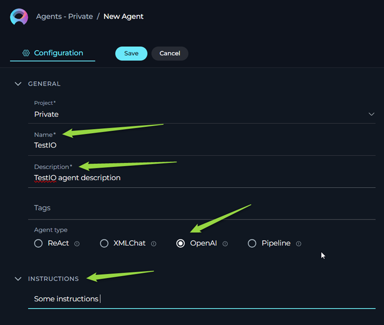
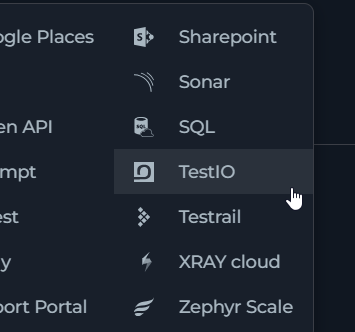
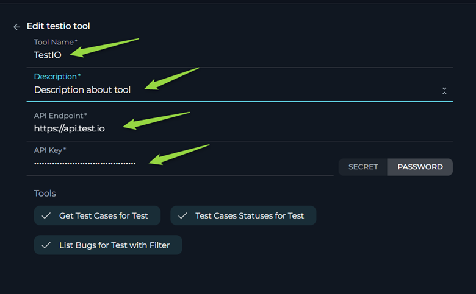

# ELITEA Toolkit Guide: TestIO Integration

## Introduction

### Purpose of this Guide

This guide is your comprehensive resource for integrating and effectively using the **TestIO toolkit** within ELITEA. It provides a detailed, step-by-step walkthrough, from configuration in TestIO platform to configuring the toolkit in ELITEA and seamlessly incorporating it into your Agents. By following this guide, you will unlock the power of automated test result analysis, streamlined QA workflows, and enhanced insights into your testing process, all directly within the ELITEA platform. This integration empowers you to leverage AI-driven automation to optimize your TestIO-driven quality assurance, enhance test visibility, and improve QA team productivity within your software development lifecycle.

### Brief Overview of TestIO

TestIO is a leading crowdtesting platform that connects businesses with a global community of testers. Clients submit their software products and request test runs for specific features or applications. During test runs, testers report bugs and provide test results directly on the TestIO platform. Analyzing the large volume of bug reports, identifying duplicates, and standardizing varied report styles can be time-consuming.

### Value of Integration

Integrating TestIO with ELITEA allows users and AI agents to directly access and process data from TestIO within the ELITEA environment. This integration provides:

*   **Retrieving Test Cases:** Obtain details of test cases designed for specific TestIO test runs.
*   **Fetching Test Case Statuses:** Get real-time statuses of test case executions (e.g., Passed, Failed, Pending).
*   **Listing Bugs with Filters:** Access detailed bug reports associated with test runs, with options to apply filters for focused analysis.

This integration streamlines the analysis of test execution status, bug trends, and overall test coverage, providing valuable insights for QA teams, development management, and stakeholders.

## Account Setup and Configuration in TestIO

### Account Setup

TestIO is a commercial crowdtesting platform. To use the TestIO Toolkit, you will need an active TestIO account. If you do not have a TestIO account, you will need to obtain one through your organization or directly with TestIO.

### Token/API Key Generation: Obtaining a TestIO Personal Access Token

For secure integration with ELITEA, it is essential to use a TestIO **Personal Access Token** for authentication. This method is more secure than using your primary TestIO account password directly and allows you to control access permissions for ELITEA.

**Follow these steps to obtain a Personal Access Token in TestIO:**

1.  **Request Access (if needed):** If you do not already have access to generate Personal Access Tokens, consult the TestIO documentation or contact TestIO support (or your TestIO Customer Success Manager/development team contact) to request access.

2.  **Generate Personal Access Token:** Once access is granted, navigate to the TestIO API Integrations page using the following URL (you may need to be logged into TestIO via SSO):  [https://epamglobal.test.io/api_integrations](https://epamglobal.test.io/api_integrations) *(Note: This URL may vary depending on your specific TestIO environment. Confirm with your TestIO contact if needed.)*

3.  **Sign in with SSO:** Log in to TestIO using your Single Sign-On credentials if prompted.

4.  **Create a New Token:** Follow the instructions on the TestIO API Integrations page to generate a new Personal Access Token. Give the token a descriptive name (e.g., "ELITEA Integration Token").

5.  **Securely Copy the Token:** **Important:** Copy the generated Personal Access Token and store it securely. You will need this token to configure the TestIO Toolkit in ELITEA. Treat this token like a password – keep it confidential.

## TestIO Integration with ELITEA

### Integration Steps

Follow these steps to integrate the TestIO Toolkit into an ELITEA agent:

1.  **Navigate to Alitea Agents:** Access the Agent section within your ELITEA instance.

2.  **Create or Edit an Agent:** Select an existing agent or create a new agent by clicking "Create Agent".

3.  **Agent Configuration:** Configure the agent with a relevant **Agent Name**, **Description**, **Instructions**, and **Agent Type** suitable for your intended use case (e.g., an "OpenAI Agent" type for general-purpose interaction).
    *   **Crucial: Agent Instructions:** Within the agent's instructions, clearly define any required parameters that the agent will need, to use the TestIO tools, such as `productId` and `testCaseTestId`. Provide examples of how to obtain these IDs from TestIO.

    

4.  **Add a New Tool:** In the Agent configuration, locate the "Tools" section and click the **"+" (Add Tool)** icon.

    

5.  **Select TestIO Toolkit:** From the dropdown list of available toolkits, choose **"TestIO"**.

6.  **TestIO Toolkit Configuration:** The "New TestIO tool configuration" section will appear. Configure the following:
    *   **Tool Name:** Enter a descriptive name for this TestIO Toolkit instance (e.g., "TestIO Integration", "QA Data Retriever").
    *   **Description:** Provide a brief description outlining the purpose of this toolkit integration (e.g., "Retrieves test results and bug data from TestIO").
    *   **API Endpoint:** Verify that the **"API Endpoint"** field is pre-filled with the correct TestIO API endpoint URL: `https://api.test.io`. *(Note: This endpoint URL may vary depending on your specific TestIO environment. Confirm with your TestIO contact if needed.)*
    *   **API Key:** This field is for your TestIO Personal Access Token. **Recommended Security Practice:**
        *   **Use Secrets (Preferred):** Click the "Secrets" icon to create or select a securely stored secret within ELITEA to hold your TestIO Personal Access Token. This is the most secure method.
        *   **Direct Input (Less Secure):** You can directly paste your Personal Access Token into the "API Key" field. However, using secrets is strongly recommended for enhanced security.

7.  **Select Tools:** Choose the specific tools from the TestIO Toolkit that you want to enable for this agent. Select all necessary tools:
    *   **Get Test Cases for Test**
    *   **Test Cases Statuses for Test**
    *   **List Bugs for Test with Filter**

    

8.  **Save Configuration:** Click the **"Save"** button to save the TestIO Toolkit configuration for your agent.

### Tools Overview

The TestIO Toolkit provides the following tools (actions) for interacting with the TestIO API:

1.  **Get Test Cases for Test:**
    *   **Description:** Retrieves a list of test cases defined for a specific TestIO test run (launch). Provides detailed information about each test case.
    *   **e.g. Parameters Required:**
        *   `productId` (string): The ID of the product in TestIO.
    *   **API Endpoint Used:** `GET /customer/v2/products/{productId}/test_case_tests/{testCaseTestId}`
    *   **Use Case Example:** To get a detailed list of test cases to understand the scope of a particular test launch.

2.  **Test Cases Statuses for Test:**
    *   **Description:** Retrieves the execution statuses of test cases for a specific TestIO test run. Provides information on whether each test case Passed, Failed, is Pending, etc.
    *   **API Endpoint:** `GET /customer/v2/products/{productId}/test_case_tests/{testCaseTestId}/results`
    *   **Use Case Example:** To analyze the overall pass/fail rate of a test run, identify failing test cases, and understand test execution progress.

3.  **List Bugs for Test with Filter:**
    *   **Description:** Retrieves a list of bug reports submitted by testers for a specific TestIO test run. Allows filtering of bugs based on various criteria 
    *   **Use Case Example:** To get a list of bugs reported in a specific test run, or to filter bugs based on a filter parameter.

## Use Cases

Here are practical use cases demonstrating how to leverage the TestIO Toolkit within ELITEA agents to enhance QA workflows:

1.  **Detailed Test Case Review:**
    *   **Scenario:** A QA lead wants to review the specific test cases included in a recent TestIO test launch to understand the test scope and coverage.
    *   **Tool:** Get Test Cases for Test
    *   **Example Agent Instruction:** "Use the 'Get Test Cases for Test' tool to retrieve the test cases for product ID 'YOUR_PRODUCT_ID' and test run ID 'YOUR_TEST_CASE_TEST_ID'. Provide a summary of the test case descriptions to the user."
    *   **Benefit:** Provides detailed insights into test case design and scope for better test planning and understanding.

2.  **Real-time Test Execution Monitoring:**
    *   **Scenario:** A project manager needs to track the progress of a TestIO test run in real-time, specifically focusing on the status of test cases (passed, failed, pending).
    *   **Tool:** Test Cases Statuses for Test
    *   **Example Agent Instruction:** "Use the 'Test Cases Statuses for Test' tool to get the execution statuses for product ID 'YOUR_PRODUCT_ID' and test run ID 'YOUR_TEST_CASE_TEST_ID'. Summarize the number of passed, failed, and pending test cases and present a progress report."
    *   **Benefit:** Enables proactive monitoring of test execution progress, allowing for timely intervention if issues arise.

3.  **Bug Triage and Analysis:**
    *   **Scenario:** A QA engineer needs to analyze bugs reported in a specific TestIO test run, potentially filtering bugs related to a specific product area or component for focused triage and defect management.
    *   **Tool:** List Bugs for Test with Filter
    *   **Example Agent Instruction:** "Use the 'List Bugs for Test with Filter' tool for product ID 'YOUR_PRODUCT_ID'. *(If filtering by specific product IDs is supported, add:)* Filter for bugs related to product IDs 'COMPONENT_A_PRODUCT_ID,COMPONENT_B_PRODUCT_ID'. Provide a list of bug titles and severities to the QA team."
    *   **Benefit:** Streamlines bug analysis and triage by providing filtered bug lists, allowing QA teams to focus on specific areas and manage defects efficiently.

4.  **Automated Test Summary Report Generation:**
    *   **Scenario:** An agent can automatically retrieve test case details, statuses, and bug lists for a TestIO test run and compile a comprehensive test summary report for stakeholders.
    *   **Tools Used:** Get Test Cases for Test, Test Cases Statuses for Test, List Bugs for Test with Filter
    *   **Example Agent Instructions:**
        1.  "Use 'Get Test Cases for Test' to get test case details."
        2.  "Use 'Test Cases Statuses for Test' to get test case statuses."
        3.  "Use 'List Bugs for Test with Filter' to get bug information."
        4.  "Compile a summary report including test case counts, pass/fail metrics, and a list of reported bugs."
    *   **Benefit:** Creates automated test summary reports, saving time and effort in manual report compilation and providing stakeholders with timely insights into test results and quality metrics.

# Troubleshooting and Support

## Troubleshooting

1.  **Integration Failure - Connection or Authentication Errors:**
    *   **Problem:** ELITEA agent fails to connect to TestIO or encounters authentication errors when using TestIO tools.
    *   **Troubleshooting Steps:**
        *   **Check API Key:** Verify that the Personal Access Token entered in the "API Key" field (or secret) is correct, has been copied accurately, and is valid.
        *   **API Endpoint URL:** Confirm that the "API Endpoint" URL is correctly set to `https://api.test.io` (or the correct environment-specific URL if applicable).
        *   **Token Validity and Permissions:** Ensure the Personal Access Token is still valid in TestIO and has not been revoked. While TestIO Personal Access Tokens generally have broad access, confirm with TestIO documentation if specific scopes are required for the API endpoints used by the toolkit.
        *   **Network Connectivity:** Check network connectivity between ELITEA and the TestIO API endpoint. Ensure there are no firewall rules or network issues blocking the connection.
        *   **ELITEA Error Logs:** Examine ELITEA's error logs for any specific error messages related to the TestIO Toolkit integration. These logs can provide more detailed clues about the failure.

2.  **Data Errors or Empty Data Retrieval:**
    *   **Problem:** Integration is successful (no connection errors), but the agent retrieves incorrect data, incomplete data, or empty datasets from TestIO.
    *   **Troubleshooting Steps:**
        *   **Verify Product ID and Test Run ID:** Double-check that the `productId` and `testCaseTestId` values being used in agent instructions and tool calls are absolutely correct and correspond to valid, *active* test runs and products in your TestIO project. Incorrect IDs are a common cause of data retrieval issues.
        *   **Test Run Status in TestIO:** Verify that the TestIO test run (specified by `testCaseTestId`) is not archived or in a state where data is no longer accessible via the API.
        *   **Instruction Accuracy:** Review the agent's instructions to ensure they are correctly using the TestIO tools and providing the required parameters (`productId`, `testCaseTestId`, filter parameters if applicable).
        *   **Tool Parameter Requirements:** Re-examine the documentation for each TestIO tool (`Get Test Cases for Test`, `Test Cases Statuses for Test`, `List Bugs for Test with Filter`) to confirm you are providing all *required* parameters and in the correct format.
        *   **Example Instructions and Testing:** Start with the example instruction provided in this guide and test it to ensure basic data retrieval works. Gradually increase complexity as needed.

3.  **Agent Type Compatibility:**
    *   **Problem:** If you are using a specific agent type in ELITEA (beyond a general "OpenAI Agent"), and the TestIO Toolkit is not functioning as expected, consider if there are any agent-type-specific limitations or compatibility issues.
    *   **Troubleshooting Step:** As a general troubleshooting step, especially when initially setting up the integration, **try using "OpenAI Agent" type**. This can help rule out issues related to more specialized agent types. If it works with a basic agent, then investigate if there are specific configurations needed for other agent types.

## FAQs

**Q: Can I use my regular TestIO username and password for the ELITEA integration?**

**A:** No, you should **not** use your regular TestIO username and password directly. For secure API access, you **must** use a TestIO Personal Access Token as described in the "Account Setup" section of this guide. Personal Access Tokens are designed for secure application integrations.

**Q: Where do I find the `productId` and `testCaseTestId` in TestIO?**

**A:** The `productId` and `testCaseTestId` are associated with your product and tests within TestIO. You can usually find them in the TestIO CSM portal (e.g., in the URL path). You may also find them in TestIO project settings or by contacting your TestIO CSM or project team.

**Q: What if I don't have access to generate a Personal Access Token in TestIO?**

**A:** If you do not have access to generate Personal Access Tokens in TestIO, you will need to request access. Contact TestIO support, your TestIO Customer Success Manager, or your internal project team/TestIO administrator to request the necessary permissions.

**Q: Is there a limit to the amount of data I can retrieve from TestIO using this toolkit?**

**A:** The TestIO API itself might have limitations on data retrieval volume or rate limits. While the ELITEA Toolkit itself doesn't impose specific limits, be mindful of potentially large data retrievals, especially for bug lists or test case details for very large test runs. LLM models also have limitations on data (tokens).

## Support and Contact Information

### ELITEA Support Team

If you encounter persistent issues, have questions not covered in this guide, or require further assistance with the TestIO Toolkit or ELITEA Agents, please contact the ELITEA Support Team:

*   **Email:**  **[SupportAlita@epam.com](mailto:SupportAlita@epam.com)**

To help us assist you efficiently, please provide the following details in your support request:

*   **ELITEA Environment:** (e.g., "Nexus," "Alita Lab," "EYE")
*   **Project Details:** Project Name, Private or Team project.
*   **Detailed Issue Description:** Clear explanation of the problem, steps to reproduce, expected vs. actual behavior.
*   **Relevant Configuration Information:**
    *   Agent Instructions (screenshot or text)
    *   TestIO Toolkit Configuration (screenshots, especially of API Key and Endpoint settings)
    *   Error Messages (full error text from chat window details)
*   **Your Query/Prompt:** Exact text used to trigger the issue.
*   **TestIO Product ID and Test Run ID (if relevant to the issue):**

**Before Contacting Support:**

We encourage you to first explore the resources available within this guide and the broader ELITEA documentation. You may find answers to common questions or solutions to known issues in the documentation.