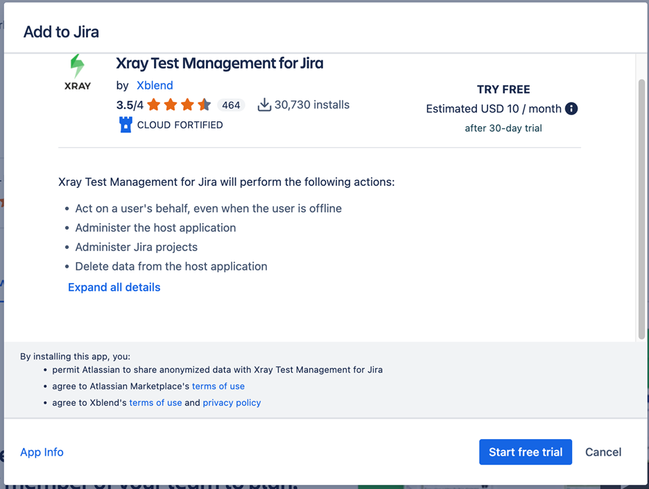

# ELITEA Toolkit Guide: Xray Cloud Integration

## Introduction

### Purpose of this Guide

This guide is your definitive resource for integrating and effectively utilizing the **Xray Cloud toolkit** within ELITEA. It provides a detailed, step-by-step walkthrough, from setting up your Xray Cloud API credentials to configuring the toolkit in ELITEA and seamlessly incorporating it into your Agents. By following this guide, you will unlock the power of automated test management, streamlined QA workflows, and enhanced collaboration between development and testing teams, all directly within the ELITEA platform. This integration empowers you to leverage AI-driven automation to optimize your Xray Cloud-driven workflows, enhance QA productivity, and improve software quality within your Jira projects.

### Brief Overview of Xray Cloud

Xray Test Management for Jira Cloud is a leading test management app for Jira Cloud, developed by Xray. It provides comprehensive test management capabilities directly within your Jira Cloud environment, seamlessly integrating with Jira's issue tracking and project management features. Xray Cloud is widely used by QA teams to:

*   **Native Jira Integration for Test Management:** Xray Cloud is seamlessly integrated within Jira Cloud, providing a unified platform for test management and issue tracking, allowing QA teams to manage all testing activities directly within their existing Jira environment.
*   **Centralized Test Case Management within Jira:** Provides a centralized test management repository within Jira, allowing QA teams to create, organize, and manage test cases, test cycles, and test executions all within the familiar Jira interface.
*   **Efficient Test Execution and Tracking:** Enables efficient test execution and real-time tracking of test runs, allowing QA teams to monitor progress, identify bottlenecks, and ensure timely test completion.
*   **Requirements Traceability and Coverage Analysis:** Xray Cloud ensures traceability by linking test cases to Jira requirements and user stories, providing clear visibility into test coverage, requirement verification, and ensuring alignment between testing efforts and project goals.
*   **Detailed Reporting and Analytics:** Offers robust reporting and analytics features, allowing QA teams to generate detailed reports on testing progress, quality metrics, defect trends, and test coverage, offering valuable insights for data-driven decision-making and continuous improvement.

Integrating Xray Cloud with ELITEA brings these powerful test management capabilities directly into your AI-driven workflows. Your ELITEA Agents can then intelligently interact with your Xray Cloud test assets to automate test management tasks, enhance QA processes, improve test coverage analysis, and leverage AI to optimize your entire software testing lifecycle within Jira and Xray Cloud.

## Toolkit's Account Setup and Configuration in Xray Cloud

### Account Setup and Xray Cloud Integration with Jira

Xray Cloud is an app for Jira and requires an active Jira Cloud instance with the Xray Test Management app installed. To set up your Xray Cloud account and integrate it with Jira Cloud, follow these steps:

1.  **Access Jira Cloud Instance:** Log in to your Jira Cloud instance (e.g., `your-workspace.atlassian.net`) where you want to install and use Xray Cloud. You will need Jira administrator privileges to install apps.
2.  **Navigate to Jira Apps Marketplace:** In Jira Cloud, go to the administration menu (usually by clicking the gear icon in the top right corner) and select **"Apps"** -> **"Explore more apps"**. This will take you to the Atlassian Marketplace.

    

3.  **Find Xray Test Management in Marketplace:** In the Atlassian Marketplace, use the search bar to search for **"Xray Test Management"** or simply **"Xray"**.

    

4.  **Select Xray App:** From the search results, choose **"Xray Test Management for Jira"** (or "Xray Test Management Cloud"). Click on the app listing to go to the app details page.
5.  **Start Free Trial or Install App:** On the Xray Test Management for Jira app details page, click on the **"Try it free"** button to start a free trial or **"Get app"** to install the app if you have a paid subscription.

    

6.  **Initiate Trial or Installation:** A modal window will appear. Click on **"Start trial"** to initiate the trial period or **"Get it now"** to proceed with the installation.

    

7.  **Verify Installation:** Upon successful addition, a pop-up message will confirm that Xray Test Management has been successfully added to your Jira Cloud instance. You should now see Xray-specific options within your Jira projects.

    

### Token/API Key Generation: Creating Xray Cloud API Keys (Client ID and Client Secret)

For secure integration with ELITEA, it is essential to use Xray Cloud **API Keys**, specifically a **Client ID** and **Client Secret**, for authentication. This method is more secure than using your primary Jira account password directly and allows you to control access permissions for ELITEA.

**Follow these steps to generate Xray Cloud API Keys (Client ID and Client Secret):**

1.  **Log in to Jira Cloud:** Access your Jira Cloud instance (e.g., `your-workspace.atlassian.net`) where Xray Cloud is installed and log in with your Jira Cloud credentials (you need to be a Jira administrator or have appropriate permissions to manage Xray settings).
2.  **Access Xray Settings:** In Jira Cloud, navigate to the top navigation bar and click on **"Apps"**. From the dropdown menu, select **"Xray"**. This will open the Xray main menu.

    

3.  **Navigate to API Keys:** In the Xray menu on the left-hand sidebar, click on **"Configure Project"**. Then, in the "Configuration" submenu, click on **"API Keys"**. This will take you to the API Keys management page within Xray settings.
4.  **Generate API Key:** On the "API Keys" page, you will see a section to generate new API keys. In the search box provided, enter your Jira Cloud **Username** (typically your email address used for Jira login). Select your username from the search results.

    

5.  **Create API Key:** After selecting your username, click the **"Generate API Key"** button. This will generate a new Client ID and Client Secret pair for your user.

    

6.  **Securely Copy and Store Client ID and Client Secret:**  A pop-up window will appear displaying your newly generated **Client ID** and **Client Secret**. **Immediately copy both the Client ID and Client Secret**. **This is the only time you will see the full Client Secret value.** Store both the Client ID and Client Secret securely in a password manager or, preferably, ELITEA's built-in Secrets feature for enhanced security within ELITEA. You will need both the Client ID and Client Secret to configure the Zephyr Scale toolkit in ELITEA.


### Xray Configuration in Jira

#### Configure Issue Types in Jira Project Settings for Xray

To fully utilize Xray's features, you need to configure specific Issue Types in your Jira project settings. This involves adding Issue Types for "Test", "Test Execution", "Test Set", and "Test Plan" and associating appropriate icons.

1.  **Download Issue Type Icons:** Before adding Issue Types, download the recommended icons for Xray Issue Types.
    *   **Access Icon Download Link:** Open your web browser and navigate to the following URL: [IssueTypeIcons](https://docs.getxray.app/display/XRAYCLOUD/Project+Settings%3A+Issue+Types+Mapping). This link provides a ZIP file containing PNG images for each Xray Issue Type.
    *   **Download Icons:** Download the ZIP file to your local computer and extract the image files. You will use these icons to visually identify Xray Issue Types in Jira.

    

2.  **Navigate to Jira Project Settings:** In your Jira project, navigate to **"Project settings"** (usually located in the bottom left corner of the Jira project sidebar). Click on **"Project settings"**.

    

3.  **Access Issue Types:** In the Project settings menu, click on **"Issue types"**. This will take you to the Issue types configuration page for your Jira project.

    

4.  **Add Issue Type:** On the "Issue types" page, click on the **"Add issue type"** button, typically located at the top right corner.
5.  **Select Issue Type Creation Option:** In the "Add issue type" dropdown menu, click on **"Add issue type"** again to create a new issue type from scratch.

    

6.  **Configure "Test" Issue Type:** In the "Add new issue type" panel, configure the following for the "Test" Issue Type:
    *   **Name:** Enter **"Test"** as the name for the Issue Type.
    *   **Description:** Provide a brief description, such as "Use this issue type to create test cases for software testing."
    *   **Icon:** Click on the **"Change Icon"** button. In the "Upload icon" modal window, click **"Upload new icon"** and upload the `test.png` icon file that you downloaded in Step 3.1. Click **"Upload"** to set the icon.
    *   Click **"Add"** to create the "Test" Issue Type.

    

7.  **Repeat for "Test Execution", "Test Set", and "Test Plan" Issue Types:** Repeat steps 4-6 to add the following additional Issue Types, using the corresponding downloaded icons for each:
    *   **Issue Type Name:** **"Test Execution"**, Icon: `test-execution.png`
    *   **Issue Type Name:** **"Test Set"**, Icon: `test-set.png`
    *   **Issue Type Name:** **"Test Plan"**, Icon: `test-plan.png`

    Ensure you upload the appropriate icon (e.g., `test-execution.png` for "Test Execution", `test-set.png` for "Test Set", and `test-plan.png` for "Test Plan") for each Issue Type when creating them.

8.  **Verify Issue Types:** After adding all four Issue Types ("Test", "Test Execution", "Test Set", "Test Plan"), verify that they are listed on the "Issue types" page in your Jira Project Settings with their corresponding icons.

    
#### Configure Issue Type Mapping in Xray Settings

To finalize the Xray configuration, you need to map the newly created Jira Issue Types to their corresponding Xray Issue Types within the Xray settings for your project.

1.  **Navigate to Xray Settings - Issue Type Mapping:** In Jira, navigate to the top navigation bar and click on **"Apps"**. From the dropdown menu, select **"Xray"**. This will open the Xray main menu. In the Xray menu on the left-hand sidebar, click on **"Configure Project"**. Then, navigate to the **"Issue Types Mapping"** section within the Xray Settings page.

        

2.  **Map Jira Issue Types to Xray Issue Types:** In the "Issue Types Mapping" section, use the dropdown lists to map the Jira Issue Types you created to the corresponding Xray Issue Types:
    *   **Test:** Select the **"Test"** Jira Issue Type you created from the dropdown list next to "Test".
    *   **Test Execution:** Select the **"Test Execution"** Jira Issue Type you created from the dropdown list next to "Test Execution".
    *   **Test Set:** Select the **"Test Set"** Jira Issue Type you created from the dropdown list next to "Test Set".
    *   **Test Plan:** Select the **"Test Plan"** Jira Issue Type you created from the dropdown list next to "Test Plan".

    

3.  **Save Configuration:** After mapping all the Issue Types, click the **"Save"** or **"Submit"** button (the button label may vary slightly depending on your Xray version) to save the Issue Type Mapping configuration.

After completing these configuration steps, your Xray tool will be successfully set up and integrated within your Jira project. You can now proceed to configure the ELITEA Xray Cloud toolkit and start automating your test management workflows.

## System Integration with ELITEA

### Agent Creation/Configuration

To integrate Xray Cloud functionalities into your workflows, you will need to configure the Xray Cloud toolkit within an ELITEA Agent. You can either create a new Agent specifically for Xray Cloud interactions or modify an existing Agent to incorporate Xray Cloud tools.

1.  **Navigate to Agents Menu:** In ELITEA, go to the **Agents** menu from the main navigation panel.
2.  **Create or Edit Agent:**
    *   **Create a New Agent:** Click on the **"+ Agent"** button to create a new Agent. Follow the on-screen prompts to define essential Agent attributes such as Agent name, a descriptive Agent description, the desired Agent type, and initial instructions for the Agent.
    *   **Edit an Existing Agent:** Select the Agent you intend to integrate with Xray Cloud from your list of Agents. Click on the Agent's name to open its configuration settings for editing.
3.  **Access Tools Section:** Within the Agent configuration interface, scroll down until you locate the **"Tools"** section. This section is where you will add and configure toolkits, including the Xray Cloud toolkit.

### Toolkit Configuration

This section provides detailed instructions on how to configure the Xray Cloud toolkit within your ELITEA Agent.

1.  **Add Toolkit:** In the "Tools" section of the Agent configuration, click on the **"+" icon**. This action will display a dropdown list of available toolkits that can be integrated with your Agent.
2.  **Select Xray Cloud Toolkit:** From the dropdown list of available toolkits, choose **"Xray Cloud"**. Selecting "Xray Cloud" will open the "New Xray cloud tool" configuration panel, where you will specify the settings for your Xray Cloud integration.

3.  **Configure Xray Cloud Toolkit Settings:** Carefully fill in the following configuration fields within the "New Xray cloud tool" section:


    *   **Base URL:**
        - Enter the **Xray Cloud API base URL** for your region. The correct endpoint depends on where your Xray Cloud instance is hosted. Use the table below to select the appropriate base URL:

        | Location   | Region Description                  | Endpoint                                 |
        |------------|-------------------------------------|------------------------------------------|
        | Global     | All Xray Cloud across regions       | https://xray.cloud.getxray.app/          |
        | USA        | USA region                          | https://us.xray.cloud.getxray.app/       |
        | EU         | Europe (Frankfurt) region           | https://eu.xray.cloud.getxray.app/       |
        | Australia  | Australia (Sydney) region           | https://au.xray.cloud.getxray.app/       |

        - **Important:** Use the correct base URL for your Xray Cloud region. If unsure, check your Xray Cloud account or contact your administrator.
        - Do **not** use your Jira Cloud workspace URL as the base URL for Xray Cloud toolkit configuration. The toolkit requires the Xray Cloud API endpoint as shown above.

    *   **Client ID:** Paste the **Client ID** of your registered Xray Cloud API Keys that you noted down into the **"Client ID"** field.
    *   **Client Secret:** Paste the **Client Secret** of your registered Xray Cloud API Keys that you generated in previous section into the **"Client Secret"** field.  **Important Security Note:** For enhanced security, it is strongly recommended to use ELITEA's **Secrets Management** feature to store your Xray Cloud Client ID and Client Secret securely. Instead of directly pasting them into the corresponding fields, select the **"Secret"** option and choose the pre-configured secrets containing your Xray Cloud credentials from the dropdown list. This prevents hardcoding sensitive credentials in your toolkit configuration.

    

4.  **Enable Desired Tools:** In the "Tools" section within the Xray Cloud toolkit configuration panel, **select the checkboxes next to the specific Xray Cloud tools** that you want to enable for your Agent. **It is crucial to enable only the tools that your Agent will actually need to use** to adhere to the principle of least privilege and minimize potential security risks. Available tools include:
    *   **Get tests** - Retrieves a list of all tests in Xray Cloud.
    *   **Create test** - Allows the Agent to create new test cases in Xray Cloud.   
    *   **Execute custom GraphQL** - Allows to send custom GraphQL requests to Xray Cloud API.
5.  **Complete Setup:** After configuring all the necessary settings and enabling the desired tools, click the **arrow icon** (located at the top right of the toolkit configuration section) to finalize the Xray Cloud toolkit setup and return to the main Agent configuration menu.
6.  Click **Save** in the Agent configuration to save all changes and activate the Xray Cloud toolkit integration for your Agent.

### Tool Overview: Xray Cloud Toolkit Functionalities

Once the Xray Cloud toolkit is successfully configured and added to your Agent, you can leverage the following tools within your Agent's instructions to enable intelligent interaction with your Xray Cloud test assets:

*   **Get tests:**  **Tool Name:** `get_tests`
    *   **Functionality:** Retrieves a list of all tests (test cases) available in the specified Jira project with Xray Cloud enabled. Returns a list of test case summaries, including key information like Test Case IDs and names.
    *   **Purpose:** Enables Agents to quickly access and review the entire test inventory within a Jira project managed by Xray Cloud, facilitating test case discovery, reporting on test coverage, or providing users with an overview of available tests.

*   **Create test:**  **Tool Name:** `create_test`
    *   **Functionality:** Automates the creation of a new test case in Xray Cloud within a specified Jira project and test suite. Requires parameters such as Test Issue Summary (Test Case Title) and optional details like description, preconditions, and test steps (JSON format).
    *   **Purpose:** Streamlines test case authoring and test plan creation by enabling Agents to automatically generate new test cases in Xray Cloud directly from ELITEA workflows, based on requirements, user stories, or automated test generation processes, improving test coverage and reducing manual test case creation effort.

*   **Execute custom GraphQL:**  **Tool Name:** `execute_custom_graphql`
    *   **Functionality:** Allows sending custom GraphQL requests to Xray Cloud API. Requires a GraphQL query as a parameter.
    *   **Purpose:** Enables advanced users to interact with Xray Cloud API directly and perform complex data queries or actions that are not covered by other pre-built tools, providing maximum flexibility for specialized Xray Cloud integrations and data manipulation.

## Instructions and Prompts for Using the Xray Cloud Toolkit

To effectively utilize the Xray Cloud toolkit within your ELITEA Agents, you need to provide clear and precise instructions within the Agent's "Instructions" field, telling the Agent *how* and *when* to use these tools.

**General Instruction Structure:**

When instructing your Agent to use an Xray Cloud tool, you will typically follow this pattern:

```
Use the "[tool_name]" tool to [describe the action you want to perform] in Xray Cloud.
Provide the following parameters:
- Parameter 1: <value or description of value>
- Parameter 2: <value or description of value>
- ...
```

**Example Agent Instructions for Xray Cloud Toolkit Tools:**

*   **Agent Instructions for Getting a List of Tests:**

    ```
    Use the "get_tests" tool to retrieve a list of all test cases in the Xray Cloud project.
    Provide the following parameters:
    - Project Key: "PA"
    ```

*   **Agent Instructions for Creating a New Test Case:**

    ```
    Use the "create_test_case" tool to create a new test case in Xray Cloud.
    Provide the following parameters:
    - Project Key: "PA"
    - Test Issue Summary: "Verify User Login Functionality"
    - Description: "This test case verifies the user login functionality with valid credentials."
    - Test Steps (JSON Array):
      [
        {
          "action": "Open Login Page",
          "data": "",
          "result": ""
        },
        {
          "action": "Enter valid username",
          "data": "",
          "result": ""
        },
        {
          "action": "Enter valid password",
          "data": "",
          "result": ""
        },
        {
          "action": "Click Login",
          "data": "",
          "result": "User should be logged in successfully."
        }
      ]
    ```

**Important Considerations for Agent Instructions:**

*   **Tool Name Accuracy:** Ensure you use the correct **Tool Name** (e.g., `"get_tests"`, `"create_test"`) as listed in the "Tool Overview" section. Typos or incorrect tool names will prevent the Agent from using the toolkit correctly.
*   **Parameter Clarity:** Clearly specify the **parameters** required for each tool and provide instructions on where the Agent should obtain the values for these parameters (e.g., from user input, from previous steps in the workflow, or hardcoded values).
*   **Context and Examples:** Provide sufficient context and examples within your Agent's "Instructions" to guide the LLM in understanding *when* and *how* to use the Xray Cloud toolkit tools effectively within your desired workflow.
*   **Project Key and Test Case Keys:** Ensure that you use the correct Project Keys and Test Case Keys that accurately correspond to your Jira project and Xray Cloud test assets. Incorrect keys will lead to errors or incorrect tool execution.
*   **JSON Format for Complex Parameters:** For tools like "Create Test Case" that require complex data structures like test steps, ensure you provide the parameters in valid JSON format as specified in the tool documentation and examples.

## Best Practices and Use Cases for Xray Cloud Integration

### Best Practices for Efficient Integration

*   **Test Integration Thoroughly:** After setting up the Xray Cloud toolkit and incorporating it into your Agents, **thoroughly test each tool** you intend to use to ensure seamless connectivity, correct authentication, and accurate execution of Xray Cloud actions.
*   **Monitor Agent Performance and Usage:**  Regularly **monitor the performance of Agents** utilizing Xray Cloud toolkits. Track metrics such as task completion success rate, execution time, and error rates to identify any potential issues or areas for optimization in Agent instructions or toolkit configurations.
*   **Follow Security Best Practices:**
    *   **Use API Keys:** Always use Xray Cloud API Keys (Client ID and Client Secret) instead of your main Jira account password for integrations.
    *   **Grant Least Privilege:** While Xray Cloud API Keys have fixed scopes based on the associated Jira user, ensure you are generating tokens specifically for ELITEA integration and not reusing tokens with broader access.
    *   **Securely Store Credentials:** Utilize ELITEA's Secrets Management feature to securely store and manage your Xray Cloud Client ID and Client Secret instead of hardcoding them directly in Agent configurations.
*   **Provide Clear Instructions and Prompts:**  Craft clear and unambiguous instructions within your ELITEA Agents to guide them in using the Xray Cloud toolkit effectively. Use the prompt examples provided in this guide as a starting point and adapt them to your specific use cases.
*   **Start with Simple Use Cases:** Begin by implementing Xray Cloud integration for simpler automation tasks, such as retrieving test case lists or reading test case details, and gradually progress to more complex workflows as you gain experience and confidence with the toolkit.

### Use Cases for Xray Cloud Toolkit Integration

The Xray Cloud toolkit opens up a range of automation possibilities for test management and QA workflows within ELITEA. Here are some compelling use cases:

*   **Automated Test Case Retrieval for Test Automation Engineers:**
    *   **Scenario:** Test automation engineers can use ELITEA Agents to quickly retrieve detailed test steps and expected results for specific test cases from Xray Cloud, providing them with the necessary information to develop automated tests based on existing manual test cases.
    *   **Tools Used:** `get_tests`
    *   **Example Instruction:** "Use the 'get_test_steps' tool to retrieve the execution steps for test case with Key 'XA-12345' from Xray Cloud Project 'QA Project'. Provide the test steps in a structured format suitable for test automation script generation."
    *   **Benefit:** Streamlines test automation development by providing automation engineers with quick access to test case details, reducing the time spent manually reviewing test cases in Xray Cloud and accelerating the test automation process.

*   **Dynamic Test Case Creation from User Stories or Requirements:**
    *   **Scenario:** When new user stories or requirements are created in Jira, automatically generate corresponding test case stubs in Xray Cloud, pre-populated with basic information extracted from the user story or requirement details, ensuring test coverage from the outset of development.
    *   **Tools Used:** `create_test`
    *   **Example Instruction:** "Use the 'create_test' tool to create a new test case in Xray Cloud Project 'QA Project' and Test Suite 'New Feature Tests' with the name 'Test User Story [User Story ID]' and description based on the user story description in Jira."
    *   **Benefit:** Automates test case creation, streamlining test planning and ensuring comprehensive test coverage from the initial stages of development. Reduces manual effort in test case authoring and improves alignment between requirements and test cases.

*   **Reporting on Test Case Inventory for QA Managers:**
    *   **Scenario:** QA managers can use ELITEA Agents to generate reports summarizing the total number of test cases and test inventory metrics from Xray Cloud, providing them with automated visibility into test assets and test coverage within ELITEA.
    *   **Tools Used:** `get_tests`
    *   **Example Instruction:** "Use the 'get_tests' tool to retrieve a list of all test cases in Xray Cloud Project 'QA Project'. Generate a report summarizing the total number of test cases and present it to the QA Manager for test inventory overview."
    *   **Benefit:** Provides project managers with automated visibility into test documentation stored in Xray Cloud, improving test case management and project oversight.

## Troubleshooting and Support

### Troubleshooting Common Issues

*   **Connection Errors:**
    *   **Problem:** ELITEA Agent fails to connect to Xray Cloud, resulting in errors during toolkit execution.
    *   **Possible Solutions:**
        1.  **Verify Jira Base URL:** Double-check that you have entered the correct Jira Cloud Base URL in the toolkit configuration, including `https://` or `http://` and the full workspace URL (e.g., `https://your-workspace.atlassian.net`). For Epam Jira, use `https://jira.epam.com`.
        2.  **Check Client ID and Client Secret:** Ensure that the **Client ID** and **Client Secret** you provided are correct and valid for your Xray Cloud API Keys. Carefully re-enter or copy-paste these credentials to rule out typos.
        3.  **Verify Jira and Xray Cloud Availability:** Confirm that both your ELITEA environment and your Jira Cloud/Xray Cloud instance are connected to the internet and that there are no service outages or connectivity issues on the Atlassian Cloud platform that might be blocking the integration.

*   **Authorization Errors (Permission Denied/Unauthorized):**
    *   **Problem:** Agent execution fails with "Permission Denied" or "Unauthorized" errors when trying to access or modify Xray Cloud resources.
    *   **Possible Solutions:**
        1.  **Verify API Key Validity:** Ensure that the Xray Cloud API Keys (Client ID and Client Secret) you are using are valid and have not been revoked in your Jira user profile settings. Generate new API Keys if necessary.
        2.  **Check Jira User Permissions:** Confirm that the Jira user account associated with the API Keys has the necessary permissions within Jira and Xray Cloud to access the specific projects and test assets your Agent is trying to interact with. Verify user roles and permissions within Jira project and Xray Cloud settings.
        3.  **Project Key Accuracy:** Double-check that you have entered the correct Project Key in the toolkit configuration and that the API Keys are valid for that specific Jira project with Xray Cloud enabled.

*   **Tool-Specific Parameter Errors:**
    *   **Problem:** Agent execution fails for specific Xray Cloud tools due to incorrect parameter values or formats.
    *   **Troubleshooting Steps:**
        1.  **Verify Project Key:** Ensure that you are using the correct Jira Project Key in your Agent's instructions when specifying project-related parameters for Xray Cloud tools. Project Keys are case-sensitive and must match the Project Key in Jira exactly.
        2.  **Verify Test Case Keys and Test Suite IDs:** Double-check that you are using the correct Test Case Keys (Jira Issue Keys) and Test Suite IDs when referencing specific test assets in your Agent's instructions. Test Case Keys and Test Suite IDs are alphanumeric and must match the IDs in Xray Cloud exactly.
        3.  **Parameter Format:** Verify that you are providing parameters in the correct format expected by each Xray Cloud tool (e.g., string values for names, numerical values for IDs, JSON format for test case data). Refer to the "Instructions and Prompts for Using the Toolkit" section for parameter details and examples.
        4.  **Jira Issue Key Format:** When using Test Case Keys (Jira Issue Keys), ensure you are using the correct format (e.g., "PA-TC-123") and that the Issue Keys are valid and exist in your Jira project with Xray Cloud enabled.

### FAQs

1.  **Q: Can I use my regular Jira password for the ELITEA integration with Xray Cloud?**
    *   **A:** No, it is **mandatory to use Xray Cloud API Keys (Client ID and Client Secret)** instead of your main Jira account password for secure integration. API Keys provide a more secure and controlled way to grant access to external applications like ELITEA.
2.  **Q: What permissions should I grant to the Xray Cloud API Keys?**
    *   **A:** Xray Cloud API Keys inherit the permissions of the Jira user account they are associated with. Ensure that the Jira user account associated with the API Keys has the necessary permissions within Jira and Xray Cloud to access the specific projects and test assets your Agent will be interacting with. You do not need to configure specific scopes during API Key generation as permissions are managed through Jira user roles and project permissions.
3.  **Q: What is the correct format for the Base URL in the Xray Cloud toolkit configuration?**
    *   **A:**  The Xray Cloud Base URL should be entered as the base URL of your Jira Cloud instance, including `https://` or `http://` and the full workspace URL (e.g., `https://your-workspace.atlassian.net`). For Epam Jira, use `https://jira.epam.com`. **Do not append any API endpoint paths to the Base URL.** The toolkit automatically constructs the API endpoint URL.
4.  **Q: How do I find the Project Key and Test Case Key for my Xray Cloud project and test cases?**
    *   **A:** The Project Key is the standard Jira Project Key, which is typically displayed in Jira project settings and URLs. Test Case Keys (Jira Issue Keys) are the standard Jira Issue Keys assigned to test case issues in your Jira project with Xray Cloud enabled. You can find these keys in Jira issue URLs or by inspecting issue details within Jira.
5.  **Q: Why is my Agent getting "Permission Denied" errors even though I think I have configured everything correctly?**
    *   **A:** Double-check the **API Key Validity**, **Jira User Permissions**, **Project Key Accuracy**, and **Base URL Accuracy** as described in the Troubleshooting section. Ensure all these configurations are correct and that the Jira user account associated with the API Keys has the necessary permissions within Jira and Xray Cloud.

### Support and Contact Information

If you encounter any issues, have questions, or require further assistance beyond what is covered in this guide regarding the Xray Cloud integration or ELITEA Agents in general, please do not hesitate to contact our dedicated ELITEA Support Team. We are here to help you resolve any problems quickly and efficiently and ensure you have a smooth and productive experience with ELITEA.

**How to Reach ELITEA Support:**

*   **Email:**  **[SupportAlita@epam.com](mailto:SupportAlita@epam.com)**

**Best Practices for Effective Support Requests:**

To help us understand and resolve your issue as quickly as possible, please ensure you provide the following information in your support email:

*   **ELITEA Environment:** Clearly specify the ELITEA environment you are using (e.g., "Nexus," "Alita Lab," "EYE").
*   **Project Details:**  Indicate the **Project Name** and whether you are working in your **Private** workspace or a **Team** project.
*   **Detailed Issue Description:** Provide a clear, concise, and detailed description of the problem you are encountering. Explain what you were trying to do, what you expected to happen, and what actually occurred.
*   **Relevant Configuration Information:**  To help us diagnose the issue, please include relevant configuration details, such as:
    *   **Agent Instructions (Screenshot or Text):** If the issue is with an Agent, provide a screenshot or copy the text of your Agent's "Instructions" field.
    *   **Toolkit Configurations (Screenshots):** If the issue involves the Xray Cloud toolkit or other toolkits, include screenshots of the toolkit configuration settings within your Agent.
*   **Error Messages (Full Error Text):** If you are encountering an error message, please provide the **complete error text**. In the Chat window, expand the error details and copy the full error message. This detailed error information is crucial for diagnosis.
*   **Your Query/Prompt (Exact Text):** If the issue is related to Agent execution, provide the exact query or prompt you used to trigger the issue.

**Before Contacting Support:**

We encourage you to first explore the resources available within this guide and the broader ELITEA documentation. You may find answers to common questions or solutions to known issues in the documentation.

## Useful Links

To further enhance your understanding and skills in integrating Xray Cloud with ELITEA, here are some helpful resources:

*   **[Xray Test Management for Jira Cloud Website](https://www.getxray.app/cloud/test-management-jira)**: Access the main Xray Cloud product website for product information and documentation.
*   **[Xray Cloud Documentation](https://docs.getxray.app/display/XRAYCLOUD/Xray+Cloud+Documentation)**: Explore the official Xray Cloud documentation for detailed information on Xray Cloud features, functionalities, and API.
*   **[Atlassian Jira Website](https://www.atlassian.com/software/jira)**: Access the main Jira product website for product information and documentation, as Xray Cloud is a Jira app.
*   **[ELITEA Secrets Management](../../platform-documentation/menus/settings.md#secrets)**: Learn how to securely store your Xray Cloud API Keys (Client ID and Client Secret) using ELITEA's Secrets management feature for enhanced security.
*   **[ELITEA Agents Configuration](../../platform-documentation/menus/agents.md)**:  Find out more about creating and configuring Agents in ELITEA, where you integrate the Xray Cloud toolkit to automate your workflows.
*   **[ELITEA Support Email](mailto:SupportAlita@epam.com)**: Contact the ELITEA support team for direct assistance with Xray Cloud integration or any other questions and issues you may encounter.
