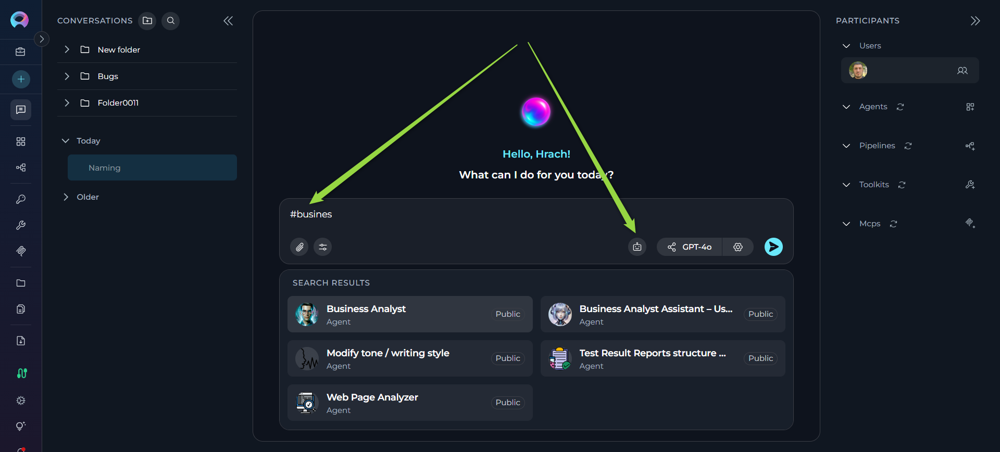
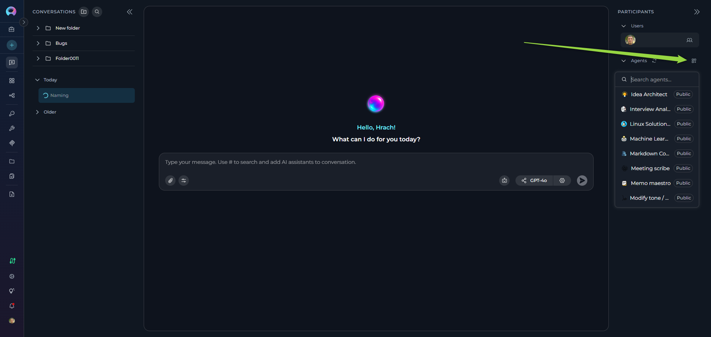
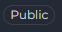

# How to Use Public Agents, Pipelines, and Toolkits from Chat

## Introduction

While the **Public Project** has been removed from Elitea, **public agents, pipelines, and toolkits** remain fully accessible and usable within **Elitea Chat**. These community-shared resources provide pre-built workflows, specialized capabilities, and integrations that you can leverage directly in your conversations without needing to create them from scratch.

This guide explains how to discover, access, and use these public entities from the Chat interface, as well as their permissions and limitations.

---

## Overview

### What Are Public Agents, Pipelines, and Toolkits?

**Public Agents:**

* Pre-configured AI assistants designed for specific tasks
* Created by community members and approved by moderators
* Contain specialized instructions, model configurations, and integrated toolkits
* Examples: Data analysis agents, code review assistants, documentation generators

**Public Pipelines:**

* Multi-step automated workflows that orchestrate agents and tools
* Published by users after moderation approval
* Designed to handle complex, sequential tasks
* Examples: Test case generation workflows, user story review pipelines

**Public Toolkits:**

* Collections of tools and integrations that extend chat capabilities
* Bundle reusable actions for external services (GitHub, Jira, Confluence, etc.)
* Can be shared for community reuse
* Examples: GitHub integration toolkit, Slack connector, custom API toolkits

### Key Characteristics

* **Community-Driven:** Shared by other Elitea users after quality review
* **Easily Identifiable:** Marked with a "Public" chip/badge for quick recognition
* **Read-Only Core Config:** Core configuration cannot be modified (with temporary adjustments noted below)
* **Immediately Usable:** Add to conversations and start using right away
* **Discoverable:** Browse Latest, My Likes, and Trending sections

---

## Accessing Public Entities from Chat

Public agents, pipelines, and toolkits are accessible directly within any conversation through the Chat interface.

### Method 1: Using the # Search

The quickest way to find and add public entities is using the `#` symbol:

1. **Open or Create a Conversation:**
     * Navigate to **Chat** in the main sidebar
      * Click **+ Create** for a new conversation, or open an existing one

2. **Search for Public Entities:**
      * In the message input box, type `#` followed by the name or keywords
      * A dropdown list appears showing matching agents, pipelines, and toolkits
      * The list includes both your own entities and public community entities
      * Public entities are marked with a **"Public"** chip/badge for easy identification

3. **Select the Entity:**
      * Click on the desired agent, pipeline, or toolkit from the dropdown
      * The selected entity appears as a chip above the input box

4. **Send Your Message:**
      * Type your message or question
      * Click **Send** or press Enter
      * The public item will process your request

### Method 2: Using the Participants Panel

You can also add public entities through the **PARTICIPANTS** panel on the right side:

1. **Locate the Participants Panel:**
      * On the right side of the chat interface, find the **PARTICIPANTS** section
      * You'll see collapsible sections for **Agents**, **Pipelines**, and **Toolkits**

2. **Add Public Entities:**
      * Click the **+** icon next to **Agents**, **Pipelines**, or **Toolkits**
      * A dropdown list appears with available entities, including public ones
      * Public entities are marked with a **"Public"** chip/badge
      * Select the public entity you want to add

3. **Interact with the Entity:**
      * Click on the participant in the **PARTICIPANTS** list to activate it
      * Type your message and send

---

## Using Public Agents / Pipelines / Toolkits

### Using Public Agents

**Step-by-Step:**

1. **Add the Public Agent:**
     * Use `#AgentName` in the input box, OR
     * Click **+** next to **Agents** in the PARTICIPANTS panel

2. **Activate the Agent:**
     * Click on the agent name in the **PARTICIPANTS** list
     * The active agent is highlighted in the list

3. **Interact:**
     * Type your message or click a conversation starter if available
     * Send your message
     * The public agent processes your request and responds

!!! info "Visual Indicators"
    - Public agents are marked with a **"Public"** chip/badge, making them easily identifiable. This badge appears on the agent card in lists and search results, helping you quickly distinguish between your private agents and community-shared public agents.
    

### Using Public Pipelines

**Step-by-Step:**

1. **Add the Public Pipeline:**
     * Type `#PipelineName` in the input box, OR
     * Click **+** next to **Pipelines** in the PARTICIPANTS panel

2. **Activate the Pipeline:**
     * Click the pipeline in the **PARTICIPANTS** list
     * Active pipeline is highlighted

3. **Execute Workflow:**
     * Type your input or instruction
     * Send your message
     * The pipeline executes its multi-step workflow
     * Monitor progress in the chat responses

!!! info "Pipeline Configuration"
    Public pipelines are marked with a **"Public"** chip/badge for easy identification. You can view pipeline workflow and settings using the settings icon (⚙️). Public pipelines open with limited editing capabilities when you click settings—you cannot modify or save the workflow, but you can inspect it to understand how it works.
    

### Using Public Toolkits

**Step-by-Step:**

1. **Add the Public Toolkit:**
     * Click **+** next to **Toolkits** in the PARTICIPANTS panel
     * Select the public toolkit from the dropdown

2. **Toolkit Appears in Conversation:**
     * The toolkit is added with all previously configured tools enabled
     * Individual tools within the toolkit become available to active agents/pipelines

3. **Use in Conversation:**
     * Public toolkits work in conjunction with agents or pipelines
     * When an agent/pipeline needs a capability, it can invoke tools from the public toolkit
     * You can also directly request actions: "Use GitHub toolkit to create an issue"

!!! tip "Toolkit Configuration"
    Public toolkits are marked with a **"Public"** chip/badge for easy identification. They may require credentials or configuration. Some public toolkits are published with demo/shared credentials for community use—check toolkit configuration to see what's available.
    

---

## Differences Between Public and Private Entities

### Functionality

| Aspect | Public Entities | Private Entities |
|--------|--------------|---------------|
| **Execution** | ✔️ Fully functional | ✔️ Fully functional |
| **Add to Chat** | ✔️ Via # search or + button | ✔️ Via # search or + button |
| **Temporary Model Changes** | ✔️ Change LLM & settings (session only) | ✔️ Full control |
| **Temporary Variables (Agents)** | ✔️ Modify variables (session only) | ✔️ Full control |
| **Temporary Credentials (Toolkits)** | ✔️ Select/create (session only) | ✔️ Full control |
| **Save Changes** | ✘ Cannot save any modifications | ✔️ Can save all changes |
| **Edit Core Configuration** | ✘ Prompts, workflows read-only | ✔️ Full edit access |
| **Duplication** | ✔️ Can create your own copy | ✔️ Can duplicate |

---

## Permissions and Limitations

### What You Can Do

✔️ **Execute Public Entities:**

* Run public agents, pipelines, and toolkits in your conversations
* Use them as many times as needed
* Combine multiple public entities in one conversation

✔️ **View and Temporarily Modify Configurations:**

Public entities open with limited editing capabilities. You can view configurations and make temporary adjustments for your current conversation:

**For Agents:**

   * Click the agent in **PARTICIPANTS** → Click **⚙️** settings icon
   * Agent Canvas opens with read-only core configuration
     * **You CAN temporarily modify:**
          * LLM model selection
          * Model settings (Temperature, Top P, Top K, etc.)
          * Variables
     * **You CANNOT modify or save:**
          * Agent prompt/instructions
          * Toolkit configurations
          * Other core settings

**For Pipelines:**

* Click the pipeline in **PARTICIPANTS** → Click **⚙️** settings icon
* Pipeline Canvas opens with read-only workflow
* **You CAN temporarily modify:**
    * LLM model selection
    * Model settings (Temperature, Top P, etc.)
* **You CANNOT modify or save:**
    * Pipeline workflow or nodes
    * Toolkit configurations
    * Agent/pipeline integrations
    * Other core settings

!!! warning "LLM and Settings Configuration"
    LLM model and settings selections become enabled only after selecting the pipeline as an active participant. Once the pipeline is active in the **PARTICIPANTS** list, you can then access and temporarily modify the LLM model and model settings for your current conversation session.    

**For Toolkits:**

* Click the toolkit in **PARTICIPANTS** → Click **Edit** icon (if available)
* Toolkit configuration opens with limited editing
* **You CAN temporarily configure:**
    * Select or create credentials
    * Select PG Vector configuration
    * Select embedding models
* **You CANNOT modify:**
    * Any configuration changes
    * Tool selection

!!! important "Session-Only Changes"
    All temporary modifications apply only to your current conversation. Starting a new conversation with the same public entity will revert to the original default configuration. This allows you to experiment without affecting the public version or other users.

✔️ **Create Your Own Versions:**

* While you cannot save modifications to public entities, you can create your own agent/pipeline/toolkit
* Copy concepts and adapt them to your needs in your Private or Team projects
* Save customized versions permanently in your workspace

### What You Cannot Do

✘ **Save Modifications to Public Entities:**

* Cannot save changes to model settings, variables, or credentials
* Temporary adjustments only last for the current conversation
* Each new conversation with the public entity starts with default configuration

✘ **Delete or Unpublish:**

* Only the original author and moderators can manage publication status
* Users cannot remove public entities from the community library

### Important Notes

**Credentials in Public Toolkits:**

* You can temporarily select different credentials or create new ones for your conversation
* Private/sensitive credentials are never exposed in public toolkits

**When Creating Your Own Versions:**

* **Learn from Public Entities:** Study how successful entities are structured, understand prompt engineering techniques, and learn effective workflow patterns
* **Adapt, Don't Copy Exactly:** Create variations suited to your specific needs, combine concepts from multiple public entities, and add your own improvements
* **Consider Publishing:** If you create something valuable, consider publishing it back to the community to share your improvements and help others

---

!!! note "Related Resources"
    * **[How to Use Chat Functionality](chat-conversations/how-to-use-chat-functionality.md)** - Complete guide to Chat features
    * **[How to Create and Edit Agents from Canvas](chat-conversations/how-to-create-and-edit-agents-from-canvas.md)** - Learn to create your own agents
    * **[How to Create and Edit Pipelines from Canvas](chat-conversations/how-to-create-and-edit-pipelines-from-canvas.md)** - Build custom pipelines
    * **[How to Create and Edit Toolkits from Canvas](chat-conversations/how-to-create-and-edit-toolkits-from-canvas.md)** - Configure toolkit integrations
    * **[Agents Menu Guide](../menus/agents.md)** - Browse and manage agents
    * **[Pipelines Menu Guide](../menus/pipelines.md)** - Explore pipeline workflows
    * **[Toolkits Menu Guide](../menus/toolkits.md)** - Configure integrations

---

## Summary

Public agents, pipelines, and toolkits provide immediate access to community-tested workflows and capabilities without the overhead of creating them yourself. While the Public Project interface has been removed, these resources remain accessible directly from Chat, where you can:

* ✔️ Search and add public entities using `#` or the Participants panel
* ✔️ Execute them freely in your conversations
* ✔️ Make temporary adjustments to model settings, variables, and credentials for your session
* ✔️ View their core configurations (prompts, workflows) in read-only mode
* ✔️ Learn from them to create your own custom versions with saved modifications

By leveraging public entities effectively, you can accelerate your workflows, experiment with different configurations, learn best practices from the community, and focus on solving your unique problems rather than reinventing common solutions.
