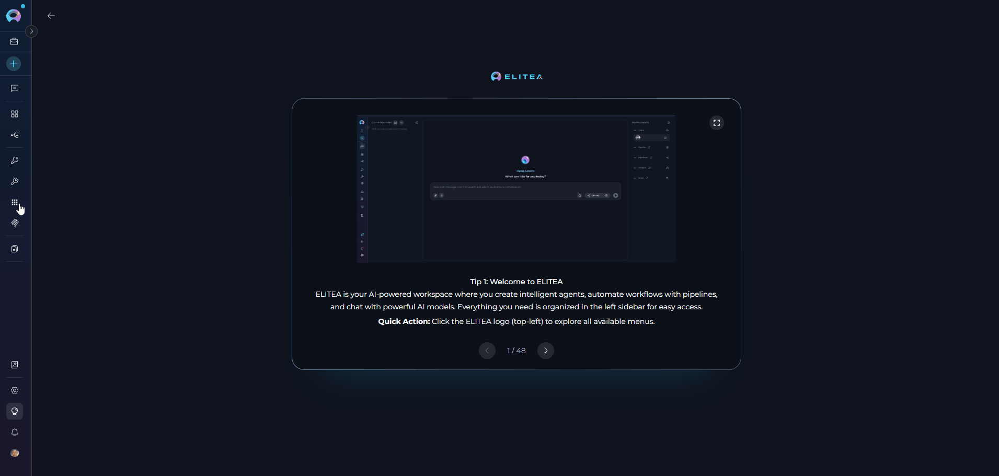
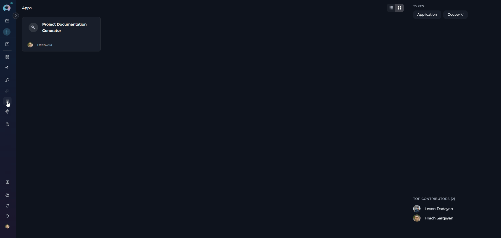
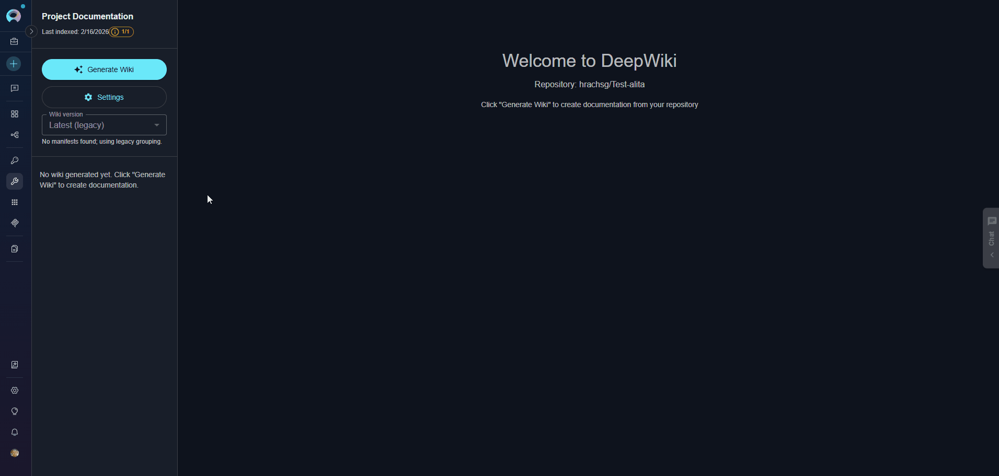
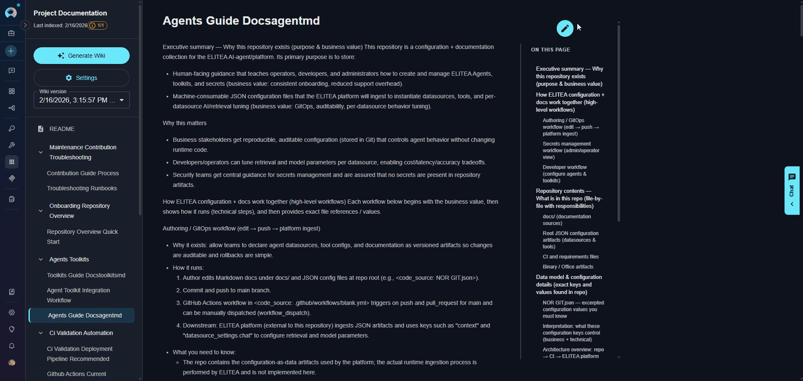
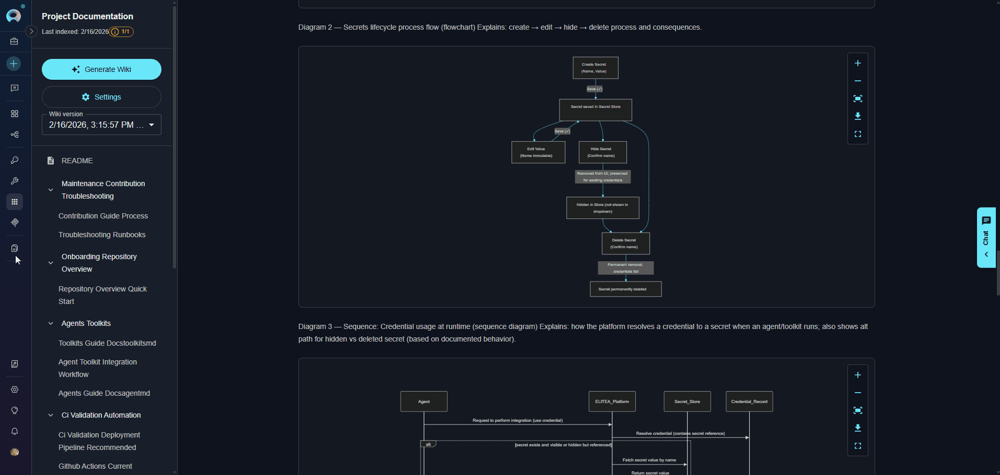
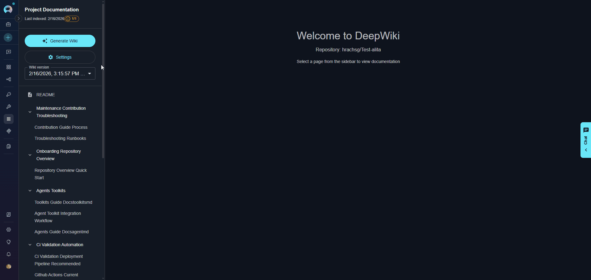

# DeepWiki Application Integration Guide

---

## Introduction

This guide provides comprehensive instructions for integrating and utilizing the **DeepWiki application** within ELITEA. DeepWiki is an advanced AI-powered documentation generator that analyzes code repositories (GitHub, GitLab, Bitbucket, ADO Repos) to create comprehensive wikis through intelligent code analysis and natural language processing. By following this guide, you will enable your ELITEA Agents to automatically generate documentation, answer questions about codebases, and perform deep research on repository functionality.

**Brief Overview of DeepWiki**

DeepWiki is a specialized application that transforms code repositories into searchable, structured documentation. It combines multiple AI technologies to provide:

*   **Automated Wiki Generation:** Creates comprehensive documentation from repository analysis, including architecture overviews, API documentation, and code explanations.
*   **Intelligent Code Analysis:** Uses Enhanced Unified Graph Builder (EUGB) to understand code structure, dependencies, and relationships across the repository.
*   **Interactive Q&A:** Enables natural language questions about the codebase with context-aware answers based on the generated knowledge base.
*   **Deep Research Capabilities:** Performs multi-step analysis with planning and investigation to answer complex questions about repository functionality.
*   **Diagram Generation:** Automatically creates Mermaid diagrams to visualize architecture and technical concepts.

Integrating DeepWiki with ELITEA empowers your Agents to understand, document, and explain codebases automatically, making it easier to onboard new team members, maintain documentation, and answer technical questions about your projects.

---

## Prerequisites

!!! note "Required Dependencies"
    Before setting up the DeepWiki application, ensure you have:
    
    1. **Code Repository Toolkit:** A configured toolkit for accessing your code repository (GitHub, GitLab, Bitbucket, or ADO Repos)
    2. **LLM Configuration:** Access to a configured LLM model for text generation
    3. **Embedding Model:** Configured embedding model for vector search

---

## System Integration with ELITEA

DeepWiki integrates with ELITEA as an **Application** accessible through the **Apps menu**. It provides specialized documentation generation and analysis tools with a built-in user interface for managing wiki content and repository analysis workflows.

### Create DeepWiki Application

1. **Navigate to Apps Menu:** Open the sidebar and select **Apps**.
2. **Create New App:** Click the **`+ Create`** button.
3. **Select DeepWiki:** Choose **Deepwiki** as the application type.
4. **Configure Application Settings:**

    | Parameter | Required | Description | Example |
    |-----------|----------|-------------|----------|
    | **Toolkit Name** | Yes | Descriptive name for the application | "Project Documentation Generator" |
    | **Description** | No | Optional description of the application's purpose | "Generates wiki documentation for main project repo" |
    | **LLM Model** | Yes | LLM model for text generation and wiki content creation | "gpt-4", "claude-sonnet-3-5" |
    | **Embedding Model** | No | Embedding model for vector search and retrieval (default: text-embedding-3-small) | "text-embedding-3-small" |
    | **Code Toolkit** | Yes | Code toolkit (GitHub, GitLab, Bitbucket, or ADO Repos) for accessing repository data | Select from configured toolkits |
    | **Max Tokens** | Yes | Maximum tokens for LLM responses (default: 64000) | 64000, 128000 |
    | **Tools** | No | Select which tools to enable (default: all tools) | generate_wiki, ask, deep_research |

5. **Save Application:** Click **Create** to save the configuration.

    

!!! info "Application Interface"
    The DeepWiki Application includes an integrated user interface accessible through the application detail page. This interface provides:
    
    * Visual wiki generation management
    * Progress monitoring for documentation generation
    * Access to generated wiki content
    * Repository analysis status

!!! note "Viewing DeepWiki Applications"
    All created DeepWiki applications are displayed in the **Apps menu**. Click on any DeepWiki app from the Apps list to access its interface and tools.

---

### Available Tools

DeepWiki provides three primary tools for documentation generation and repository analysis:

| **Tool Name** | **Description** | **Primary Use Case** |
|---------------|-----------------|----------------------|
| **generate_wiki** | Analyzes repository structure, code, and documentation to create comprehensive wiki with code indexing, knowledge graph building, and structured documentation pages | Generate comprehensive documentation from repository analysis including architecture overviews, API docs, and code explanations |
| **ask** | Queries the repository's vector store and knowledge graph to answer questions about code functionality, architecture, and implementation details | Ask targeted questions about the codebase with context-aware answers based on the generated knowledge base |
| **deep_research** | Conducts comprehensive multi-step analysis using planning, delegation, and investigation to provide detailed answers with supporting evidence from the codebase | Perform in-depth research on complex repository topics requiring advanced reasoning and thorough evidence gathering |

---

## How DeepWiki Analyzes Repositories

DeepWiki automatically analyzes your code repositories to create comprehensive documentation. The analysis process runs in the background when you use the `generate_wiki` tool and includes:

* **Code Structure Analysis:** Examines repository organization, file relationships, and dependencies
* **Content Extraction:** Processes source code, documentation files, and comments
* **Knowledge Graph Creation:** Builds connections between different parts of your codebase
* **Vector Store Generation:** Creates searchable indexes for intelligent question answering

!!! info "Automatic Process"
    Repository analysis happens automatically when you generate a wiki. No manual configuration is required. DeepWiki uses the code toolkit you configured to access repository data and processes it efficiently based on repository size.

---

## Using the DeepWiki Interface

Once you create a DeepWiki application, you can access its built-in user interface to generate documentation and interact with your repository's wiki.

**Accessing the Interface**

1. **Open DeepWiki App:** Navigate to the **Apps menu** in the sidebar
2. **Select Your App:** Click on your DeepWiki application from the list
3. **View Interface:** The DeepWiki interface opens, displaying:
       - **Left Sidebar:** Navigation panel for browsing generated wiki pages organized by sections
       - **Main Content Area:** Displays wiki content with formatted markdown, code blocks, and diagrams
       - **Chat Panel:** (Right side) For asking questions about your codebase using natural language

       

### Wiki Generation Workflow

Once you're in the DeepWiki application interface, follow these steps to generate documentation:

**Step 1: Initiate Wiki Generation**

1. In the left sidebar, locate the **"Generate Wiki"** button
2. Check the slot availability indicator:
      - Green indicator = slots available, generation can start
      - If all slots are busy, wait for running generations to complete
3. Click **"Generate Wiki"** button
4. A confirmation dialog appears: **"Generate Wiki Documentation?"**
      - Click **"Update"** to proceed with generation, or **"Cancel"** to abort

  
  
!!! note "Generation Time"
    Generation time depends on your repository size: small repos (< 100 files) take 2-5 minutes, medium repos (100-1000 files) take 5-15 minutes, and large repos (> 1000 files) may take 15-30+ minutes.

**Step 2: Monitor Generation Progress**

Once generation starts, monitor progress through the interface:

- **Progress Bar:** Appears below the Generate Wiki button
- **Status Messages:** Real-time updates show current operations (e.g., "Analyzing repository structure...", "Building knowledge graph...")
- **Elapsed Time:** Counter displays how long generation has been running

    

!!! tip "Background Processing"
    Generation continues in the background if you navigate away. Return to the application to check completion status. 

!!! Info "Stopping Generation"
    If you need to stop an in-progress generation, click the **"Stop Generation"** button in the sidebar. Note that partial results may not be saved. 

        

###  Access Generated Documentation

Once generation completes:

1. The left sidebar populates with navigation sections
2. Click on any section to expand and view wiki pages
3. Select a page to view its content in the main area
4. Generated content includes:
      - Formatted markdown documentation
      - Code examples with syntax highlighting
      - Mermaid diagrams for visualizations
      - Cross-references between related topics

#### Edit Wiki Pages

DeepWiki allows you to edit generated documentation directly in the interface to refine or customize content:

**To Edit a Page:**

1. Navigate to the wiki page you want to modify
2. Click the **Edit** button (pencil icon) in the top-right corner of the page
3. The page opens in an editor with markdown formatting
4. Make your changes to the content
5. Click **Save** to apply changes or **Cancel** to discard

**Editing Capabilities:**

- **Markdown Editing:** Full markdown support for formatting text, adding links, creating lists, and more
- **Code Blocks:** Modify or add code examples with syntax highlighting
- **Diagrams:** Edit Mermaid diagram definitions to update visualizations
- **Content Organization:** Restructure sections, add new information, or clarify existing content

!!! warning "Manual Edits and Regeneration"
    If you regenerate the wiki after making manual edits, your changes will be overwritten. Save important customizations separately or use version control to track modifications.

!!! tip "Best Practice"
    Use manual edits for minor corrections or additions. For significant changes, consider updating the source code comments and documentation in your repository, then regenerating the wiki to reflect those updates automatically.

#### Update Generated Wiki

When your repository code changes, you can regenerate the wiki to update all sections with the latest information from your codebase.

!!! info "Incremental Updates"
    DeepWiki automatically detects changes in your repository and updates relevant sections. The generation process is optimized to reuse cached analysis where possible, making updates faster than initial generation.

**To Update Documentation:**

1. Make changes to your repository code, comments, or documentation files
2. Commit and push your changes to the repository
3. Return to the DeepWiki application interface
4. Click the **"Generate Wiki"** button in the left sidebar
5. Confirm the regeneration in the dialog
6. DeepWiki will re-analyze the repository and update all sections

!!! note "Wiki Versions"
    The left sidebar includes a "Wiki version" dropdown that allows you to view different versions of generated documentation. Each generation creates a new version with timestamp and commit information.

!!! warning "Manual Edit Preservation"
    Regenerating the wiki will overwrite any manual edits you made to wiki pages. If you need to preserve custom content, save it separately before regenerating. 

#### Wiki Artifacts Storage

When you generate a wiki, DeepWiki automatically creates a bucket named `wiki_artifacts` and stores all generated documentation files there. You can access and manage these files through the **Artifacts Menu** in ELITEA.

**Generated Documentation Files:**

* **Wiki Pages:** Markdown files containing documentation about your repository (architecture, APIs, code explanations)
* **Diagrams:** Visual representations of your code structure and relationships
* **Organization Structure:** Files are grouped by sections and topics for easy navigation

All generated artifacts remain available in the bucket for download, sharing, or archival purposes.

### Managing Settings

The Settings panel allows you to view and modify your DeepWiki application configuration.

**Opening Settings:**

1. In the left sidebar, click the **"Settings"** button (below Generate Wiki button)
2. The Settings panel opens from the right side

**Settings Parameters:**

| Parameter | Type | Editable | Description |
|-----------|------|----------|-------------|
| **Project ID** | Information | No | Your ELITEA project identifier |
| **Toolkit ID** | Information | No | Unique identifier for this DeepWiki application |
| **Toolkit Name** | Information | No | Descriptive name of your application |
| **Repository** | Information | No | Connected code repository (from code toolkit) |
| **Bucket** | Configuration | No | Storage location for generated wiki artifacts **Validation:** Must use lowercase letters, numbers, and hyphens only |
| **LLM Model** | Configuration | No | Language model used for wiki generation |
| **Max Tokens** | Configuration | Yes | Token limit for LLM responses |
| **Code Toolkit ID** | Configuration | Yes | Identifier of the code toolkit used to access the repository |
| **Embedding Model** | Configuration | No | Model used for vector search |

**Managing Wiki Data:**

- **Delete Wiki:** Removes all generated wiki artifacts from the bucket
     - Use this to clean up old documentation before regenerating
     - This action cannot be undone
  
**Saving Changes:**

1. Modify any editable configuration field
2. Click **"Save Settings"** button at the bottom
3. Settings are immediately applied to the toolkit

!!! warning "Read-Only Fields"
    Some fields like code Repository and Bucket cannot be modified through the Settings panel. 

---
## Use the Chat Interface

!!! note "Generate Wiki First"
    To use the chat features, you must first generate a wiki for your repository. The chat tools query the generated documentation to answer questions.

After wiki generation completes, use the chat interface to query your repository's documentation and get AI-powered answers about your codebase.

**Opening the Chat:**

1. Click the **Chat** icon on the right edge of the interface
2. The chat panel slides open from the right side

**Selecting a Query Tool:**

DeepWiki provides two tools for different types of questions:

| Tool | Best For | Response Time | Depth |
|------|----------|---------------|-------|
| **ask** | Quick, focused questions about specific code, APIs, or functionality | Fast (seconds) | Concise answers with code references |
| **deep_research** | Complex analysis requiring investigation across multiple files and concepts | Slower (minutes) | Comprehensive answers with evidence and multi-step reasoning |

**Using the Chat:**

1. Select your preferred tool by clicking on the **Ask** or **Research** tab
2. Type your question in natural language
3. Press Enter or click Send
4. Review the AI-generated answer with references to the wiki content

!!! tip "Getting Better Answers"
    - **Be specific:** Instead of "How does this work?", ask "How does the user authentication flow work in the login module?"
    - **Reference components:** Mention specific files, classes, or modules you're interested in
    - **Use follow-ups:** Build on previous answers with more detailed questions
    - **Switch tools:** Start with `ask` for quick answers, then use `deep_research` for deeper investigation

!!! example "Example Questions by Type"
    **For `Ask` tool (Quick Queries):**
    
    - "What is the main architecture of this application?"
    - "What APIs are available in the UserService class?"
    - "How do I configure database connections?"
    - "What is the purpose of secrets in the ELITEA configuration?"
    
    **For `Research` tool (Complex Analysis):**
    
    - "How does the authentication system work across all modules?"
    - "Explain the complete data flow from API request to database"
    - "What are the security implications of the current session management?"
    - "Analyze the relationships between all microservices"

---
## Best Practices

??? tip "Wiki Generation"
    1. **Clear Query Descriptions:** Provide specific, detailed queries for `generate_wiki` to get focused documentation
    2. **Incremental Documentation:** Generate wikis for specific areas rather than entire large repositories at once
    3. **Asynchronous for Large Repos:** Use async invocation for repositories with thousands of files
    4. **Monitor Slots:** Check slot availability before starting generation to avoid queuing

??? tip "Question Asking"
    1. **Specific Questions:** Ask focused questions rather than broad "explain everything" queries
    2. **Use Context Overrides:** Pin to specific wiki versions when consistency is important
    3. **Progressive Refinement:** Start with `ask` for quick answers, use `deep_research` for complex topics
    4. **Reference Generated Wiki:** Review generated wiki pages before asking questions to understand available context

??? tip "Resource Management"
    1. **Cleanup Old Wikis:** Regularly remove outdated wiki artifacts from the bucket
    2. **Slot Monitoring:** Be aware of `DEEPWIKI_MAX_PARALLEL_WORKERS` limits in your environment
    3. **Cache Reuse:** Use `repo_identifier_override` to leverage existing caches across multiple queries
    4. **Bucket Organization:** Use separate buckets for different projects or teams

---

## Troubleshooting

??? warning "Wiki Generation Fails"
    **Possible causes:**
    
    * Repository too large or complex
    * Insufficient LLM token limits
    * Code toolkit authentication issues
    * Missing bucket permissions
    
    **Solutions:**
    
    * Verify code toolkit is properly configured and authenticated
    * Increase `max_tokens` parameter if needed
    * Check bucket exists and has write permissions
    * Review application configuration for correct code toolkit ID
    * Check server logs for detailed error messages

??? warning "Service Busy - Slots Full"
    **Possible causes:**
    
    * Maximum parallel workers reached (controlled by `DEEPWIKI_MAX_PARALLEL_WORKERS`)
    * Other wiki generations in progress
    
    **Solutions:**
    
    * Wait for current generations to complete
    * Check slot status in the UI
    * Contact administrator to increase worker limits if needed
    * Consider using asynchronous invocation and polling

??? warning "Ask/Deep Research Returns Empty or Incorrect Answers"
    **Possible causes:**
    
    * Wiki not generated yet
    * Question outside scope of indexed repository
    * Embedding model mismatch between generation and query
    
    **Solutions:**
    
    * Ensure `generate_wiki` completed successfully
    * Verify embedding model configuration matches generation
    * Check wiki artifacts were created in the bucket
    * Rephrase question to match repository context
    * Review generated wiki pages to understand available information

??? warning "Slow Performance"
    **Possible causes:**
    
    * Using GitHub API-based indexing instead of filesystem
    * Large repository with many files
    * Network latency issues
    
    **Solutions:**
    
    * Verify filesystem-based indexing is enabled (default)
    * Use asynchronous invocation for large repositories
    * Consider generating wikis for specific subdirectories
    * Check network connectivity if using API-based indexing

??? warning "Code Toolkit Configuration Error"
    **Possible causes:**
    
    * Code toolkit not properly configured or expanded
    * Missing repository authentication credentials
    * Invalid toolkit ID reference
    * Toolkit deleted or no longer accessible
    
    **Solutions:**
    
    * Verify code toolkit exists and is properly configured in Toolkits menu
    * Check authentication credentials (access tokens, SSH keys) are valid
    * Ensure toolkit has permissions to access the target repository
    * Re-select the code toolkit in DeepWiki application settings
    * Test code toolkit independently before using with DeepWiki

??? warning "LLM or Embedding Model Configuration Issues"
    **Possible causes:**
    
    * LLM model not accessible or quota exceeded
    * Embedding model mismatch between generation and querying
    * Model configuration changed after wiki generation
    * Insufficient tokens allocated for large repositories
    
    **Solutions:**
    
    * Verify LLM model is properly configured and accessible
    * Confirm API keys and credentials are valid
    * Check model quota limits haven't been exceeded
    * Ensure embedding model remains consistent across operations
    * Increase max_tokens setting for large codebases
    * Review model compatibility in ELITEA integrations

??? warning "Memory or Resource Exhaustion"
    **Possible causes:**
    
    * Repository too large for available memory
    * Too many concurrent wiki generations
    * Insufficient system resources allocated
    * Memory leak in long-running operations
    
    **Solutions:**
    
    * Generate wikis for specific subdirectories instead of entire repository
    * Reduce max_files parameter to limit scope
    * Wait for other generations to complete before starting new ones
    * Contact administrator to increase memory limits
    * Monitor system resources during generation
    * Consider using K8s deployment with resource limits

??? warning "Repository Access or Clone Failures"
    **Possible causes:**
    
    * Network connectivity issues
    * Repository authentication failures
    * Repository deleted or moved
    * Branch doesn't exist or is protected
    * Firewall blocking Git operations
    
    **Solutions:**
    
    * Verify repository URL and branch name are correct
    * Check network connectivity to repository host
    * Ensure access tokens have proper permissions (read access minimum)
    * Confirm repository still exists and is accessible
    * Test repository access using code toolkit independently
    * Check for firewall or proxy issues blocking Git operations
    * Verify branch exists in the repository

??? warning "Bucket or Storage Permission Issues"
    **Possible causes:**
    
    * Bucket doesn't exist or was deleted
    * Insufficient write permissions to bucket
    * Bucket name contains invalid characters
    * Storage quota exceeded
    * Network issues accessing storage
    
    **Solutions:**
    
    * Verify bucket exists in Artifacts menu
    * Check bucket name uses only lowercase letters, numbers, and hyphens
    * Ensure service account has write permissions to bucket
    * Confirm storage quota hasn't been exceeded
    * Test bucket access by uploading a test file
    * Contact administrator to verify storage configuration
    * Review bucket permissions in storage settings

---

## FAQ

??? question "How long does wiki generation take?"
    Generation time depends on repository size and complexity:
    
    * Small repositories (< 100 files): 2-5 minutes
    * Medium repositories (100-1000 files): 5-15 minutes  
    * Large repositories (> 1000 files): 15-30+ minutes
    
    Use asynchronous invocation for large repositories to avoid timeouts.

??? question "Can I generate wikis for private repositories?"
    Yes, as long as your configured code toolkit (GitHub, GitLab, etc.) has proper authentication and permissions to access the private repository.

??? question "How do I update the wiki when the repository changes?"
    Run `generate_wiki` again with the same or different query. DeepWiki will:
    
    * Detect repository changes
    * Update the vector store and knowledge graph
    * Regenerate wiki content
    * Preserve the analysis cache where appropriate

??? question "What happens if I run out of worker slots?"
    You'll receive a `[SERVICE_BUSY]` message indicating slots are full. You can:
    
    * Wait for current generations to complete
    * Contact your administrator to increase `DEEPWIKI_MAX_PARALLEL_WORKERS`

??? question "Can multiple agents use the same DeepWiki application?"
    Yes, multiple agents can use the same application for `ask` and `deep_research` operations. However, `generate_wiki` operations are subject to slot limits and may need to queue.

??? question "What LLM models work best with DeepWiki?"
    DeepWiki works with any configured LLM model in ELITEA. For best results:
    
    * Use models with large context windows (32k+ tokens)
    * GPT-4 or Claude Sonnet recommended for complex documentation
    * Ensure `max_tokens` is set appropriately for your model

---

!!! related "Additional Resources"
    For more information about DeepWiki and related features:

    * **[Artifacts Menu](../../menus/artifacts.md)** - Managing generated wiki artifacts
    * **[Agents Menu](../../menus/agents.md)** - Using DeepWiki tools in agents
    * **[GitHub Toolkit](../toolkits/github_toolkit.md)** - Setting up GitHub code access
    * **[GitLab Toolkit](../toolkits/gitlab_toolkit.md)** - Setting up GitLab code access
    * **[Indexing Overview](../../how-tos/indexing/indexing-overview.md)** - Understanding indexing in ELITEA
