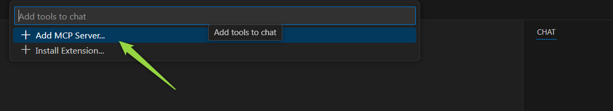
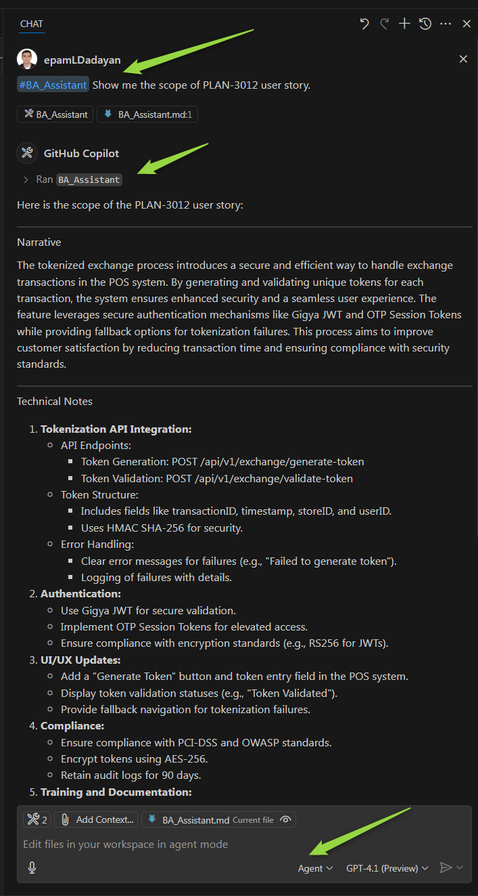

# Quick Start: Setting Up Your First MCP Server

## What You'll Accomplish

By the end of this guide, you'll have a working MCP server that connects Elitea to VS Code, allowing you to use Elitea agents directly in your coding environment.

---

## Before You Start

Before you begin, make sure you have:

- ☑️ **VS Code installed** (version 1.99 or newer)
- ☑️ **GitHub Copilot** installed and configured in VS Code
- ☑️ **Python installed** on your computer (version 3.8 or newer) - [Download Python](https://www.python.org/downloads/)
- ☑️ **Your Elitea Project ID** (find this in Elitea Settings → [Configuration](../../menus/settings/ai-configuration.md#key-configuration-fields))
- ☑️ **Your Elitea Authentication Token** (create one in Elitea Settings → [Personal Tokens](../../getting-started/create-personal-access-token.md))
- ☑️ **Your Elitea deployment URL** (example: `https://next.elitea.ai`)

---

## What is MCP and Why Do I Need It?

**MCP** stands for Model Context Protocol. It's a way for different AI tools to talk to each other.

**Why it matters to you:** By setting up an MCP server, you can use your Elitea agents directly inside VS Code while you code. No need to switch windows or copy-paste between apps.

---

## Step-by-Step Setup

### Part 1: Install the Alita MCP Client

The "client" is a small program that handles communication between VS Code and Elitea.

1. **Open PowerShell**
     - Press `Windows key`, type "PowerShell", and press Enter
     - This opens a window where you'll type commands

2. **Install pipx** (a tool that helps install Python programs)
     - Copy this command and paste it into PowerShell, then press Enter:
       ```powershell
       python -m pip install --user pipx
       ```
     - Wait for it to finish

   

3. **Set up pipx's path**
     - This makes sure your computer can find pipx. Copy and run:
       ```powershell
       python -m pipx ensurepath
       ```

   

4. **Install alita-mcp**
     - This is the actual client program. Copy and run:
       ```powershell
       pipx install alita-mcp
       ```
     - Wait for installation to complete

   

5. **Close and reopen PowerShell**
     - This refreshes your environment so the new program is recognized

---

### Part 2: Configure the Client

Now you'll tell the client how to connect to your Elitea account.

1. **Run the setup wizard**
     - In PowerShell, type:
       ```powershell
       alita-mcp bootstrap
       ```
     - Press Enter
2. **Answer the prompts**
     - **Deployment URL:** Type your Elitea URL (example: `https://next.elitea.ai`) and press Enter
     - **Authentication token:** Paste your token (the one you copied earlier) and press Enter
     - **Host:** Just press Enter to accept the default (`0.0.0.0`)
     - **Port:** Just press Enter to accept the default (`8000`)
     - **Project ID:** You can either:
       - Enter your Project ID number now (find it in Elitea Settings → Configuration), OR
       - Press `Ctrl+C` to skip this step and add the Project ID later in VS Code (see Part 4)


3. **Verify success**
     - You should see a message confirming the configuration was saved
     - If you see errors, double-check your URL and token

{ loading=lazy }

!!! note "Skipping Project ID During Bootstrap"
    If the Project ID prompt keeps asking for a valid integer and won't accept an empty value, press `Ctrl+C` to cancel. Don't worry—your Deployment URL and Authentication Token have already been saved. You'll add the Project ID in VS Code's configuration file in Part 4 of this guide.

---

### Part 3: Connect to VS Code

Now you'll add the MCP server to VS Code so it can talk to Elitea.

1. **Open VS Code**
     - Launch the VS Code application

2. **Open your project**
     - Open the folder or workspace where you want to use Elitea agents

3. **Open GitHub Copilot Chat**
     - Click the chat icon in the left sidebar (or press `Ctrl+Alt+I`)

     

4. **Switch to Agent mode**
     - In the chat panel, look for "Agent mode" and click it
     - This enables the use of tools (like your Elitea agents)

5. **Add the MCP server**
     - Click the **Select Tools** icon (looks like a wrench or tools)
     - Click **Add MCP Server** icon
     - Click **+ Add MCP Server**

     

     

     - Select **Command stdio**

     

     - For "Command", type: `alita-mcp` and press Enter

     

     - For "Server ID", use the suggested name or type something like `elitea`

     

6. **Choose where to save the settings**
     - You'll see two options:
       - **Workspace** – Only works in this project folder
       - **Global** – Works in all your VS Code projects
     - Choose based on your needs (Workspace is good for team projects)

     

---

### Part 4: Add Your Project ID

This tells the server which Elitea project to connect to.

#### Option A: If You Chose Workspace

1. **The config file opens automatically**
     - After selecting Workspace, VS Code will automatically open `.vscode/mcp.json`
     - If it doesn't open automatically, look for the file at `.vscode/mcp.json` and click to open it

2. **Add your project ID**
     - Find the line that says `"args": []`
     - Replace it with:
       ```json
       "args": ["run", "--project_id", "YOUR_PROJECT_ID"]
       ```
     - Replace `YOUR_PROJECT_ID` with your actual number (example: `25`)

     

3. **Save the file**
     - Press `Ctrl+S`

4. **Start the server**
     - In Copilot Chat, click the **Start** button

     

!!! warning "Before Starting the Server"
    Make sure you have at least one agent tagged with `mcp`. Otherwise, no tools will be available when the server starts. See Part 5 for tagging instructions.

---

#### Option B: If You Chose Global

1. **The settings file opens automatically**
     - After selecting Global, VS Code will automatically open your global `mcp.json` configuration file
     - If it doesn't open automatically, look for a new tab in the VS Code editor with the file

2. **Add your project ID**
     - Find the MCP server section you just added
     - Find the line that says `"args": []`
     - Replace it with:
       ```json
       "args": ["run", "--project_id", "YOUR_PROJECT_ID"]
       ```
     - Replace `YOUR_PROJECT_ID` with your actual number

     


3. **Save the file**
     - Press `Ctrl+S`

4. **Start the server**
     - In Copilot Chat, click the **Start** button

   

!!! Warning "Before Starting the Server"
    Make sure you have at least one agent tagged with `mcp`. Otherwise, no tools will be available when the server starts. See Part 5 for setup instructions.

---

### Part 5: Tag Your Agents

For an agent to be available as a tool, it must be tagged in Elitea.

#### Tagging Agents:

1. **Log into Elitea**
     - Open your Elitea deployment in a web browser

2. **Find your agent**
     - Navigate to the agent or pipeline you want to use

3. **Add the "mcp" tag**
     - Look for the tags section
     - Add a tag named `mcp` (all lowercase)
     - Save your changes

   { loading=lazy }

!!! important "Agent Tool Visibility"
    Only agents with the `mcp` tag will be visible in VS Code. Make sure to tag the agents you want to use before starting the server.

#### Complete Setup:

4. **Restart the MCP server in VS Code**
     - Go back to VS Code
     - In Copilot Chat, stop the server and start it again
     - This syncs the newly tagged agents

{ loading=lazy }

---

### Part 6: Use Your Agent

Now you're ready to use your Elitea agent from VS Code!

1. **Open Copilot Chat**
     - Make sure you're in Agent mode

2. **Click the Tools icon**
     - You should see your tagged agents listed

   

3. **Select the tools you want to use**
     - All tools are selected by default
     - You can deselect any you don't need right now

4. **Type your request**
     - In the chat box, type `#` followed by your agent's name
     - Example: `#BA Assistant Show me the scope of PLAN-3012`

   

5. **Run the tool**
     - Click **Run [tool name]** when prompted

   

6. **Confirm execution**
     - The first time, you'll be asked to confirm
     - Click **Continue** (you can choose to auto-confirm for future runs)

7. **Review the results**
     - Your agent will execute and return results directly in the chat

   

---

## How to Know It's Working

✔️ **You've succeeded if:**

- The MCP server shows as "Running" in VS Code
- Your tagged agents appear in the Tools list
- When you call an agent, you see output in the chat
- No error messages appear

✘ **Something's wrong if:**

- You see "Command not found" errors → Reinstall the client
- No agents appear in the Tools list → Check that they're tagged with `mcp`
- Server won't start → Check your Project ID and authentication token

---

## Common Problems & Fixes

### Problem: "alita-mcp: command not found"
**Fix:** Make sure you completed all installation steps, including `pipx ensurepath`. Close and reopen PowerShell.

### Problem: No agents showing up
**Fix:** 

1. Make sure your agents are tagged with `mcp` in Elitea
2. Restart the MCP server in VS Code
3. Check you're using the correct Project ID

### Problem: "Error indicator" in VS Code
**Fix:**

1. Click the error in the Chat view
2. Select **Show Output** to see details

   

3. Look for specific error messages in the log

   

### Problem: Server keeps disconnecting
**Fix:**

1. Verify your authentication token is still valid
2. Check your internet connection
3. Confirm your Elitea deployment URL is correct

### Problem: Multiple alita-mcp versions installed (pip and pipx conflict)
**Fix:**

If you see errors or unexpected behavior, you may have multiple versions of `alita-mcp` installed. This happens when you installed it with both `pip` and `pipx`.

1. **Check for multiple installations:**
   ```powershell
   pip list | Select-String alita-mcp
   pipx list | Select-String alita-mcp
   ```

2. **Remove the pip version (keep pipx):**
   ```powershell
   pip uninstall alita-mcp -y
   ```

3. **Verify the correct version is active:**
   ```powershell
   where.exe alita-mcp
   ```
   
   You should see: `C:\Users\<YourUsername>\.local\bin\alita-mcp.exe`

4. **Restart VS Code and the MCP server**

!!! tip "Why this happens"
    The pipx installation is the recommended method as it isolates the tool in its own environment. If you previously installed with `pip`, it may conflict with the pipx version and cause the system to use the wrong (often outdated) version.

---

## What You Can Do Next

Now that your MCP server is running, you can:
- Call multiple agents in one conversation
- Use agents to analyze code, create documentation, or fetch data
- Automate repetitive tasks directly from VS Code
- Combine Elitea agents with other Copilot features

---

## Advanced Options

<details>
<summary>Click to expand advanced configuration options</summary>
**Using a Specific Application**
If you want to limit the MCP server to a single agent or pipeline, use this configuration:

```json
"args": ["run", "--project_id", "25", "--app_id", "12", "--version_id", "3"]
```

- `app_id` is the ID of your specific agent
- `version_id` is the version number you want to use

### Multiple MCP Servers

You can set up multiple MCP servers for different projects:
1. Repeat the setup process
2. Use a different Server ID for each
3. Each server can point to a different Project ID

</details>

---


!!! tip "Helpful Resources"

    - [Full MCP STDIO Documentation](mcp-server-stdio.md)
    - [Elitea Settings & Configuration](../../menus/settings/ai-configuration.md)
    - [MCP Protocol Official Docs](https://modelcontextprotocol.io/)

---
