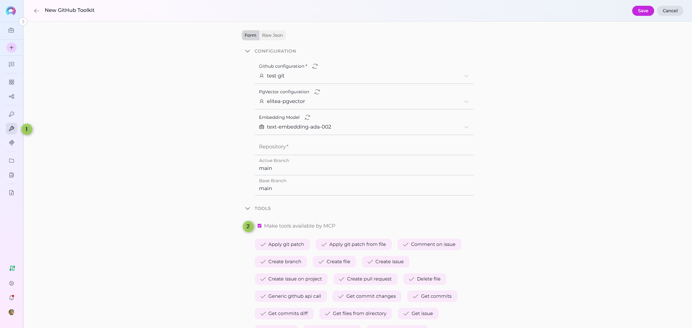
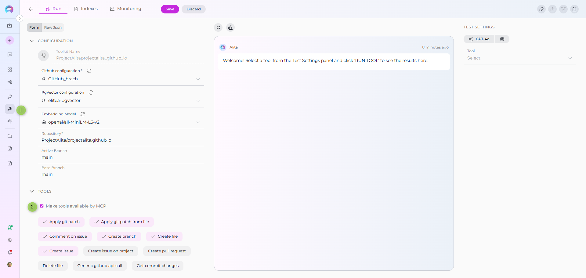
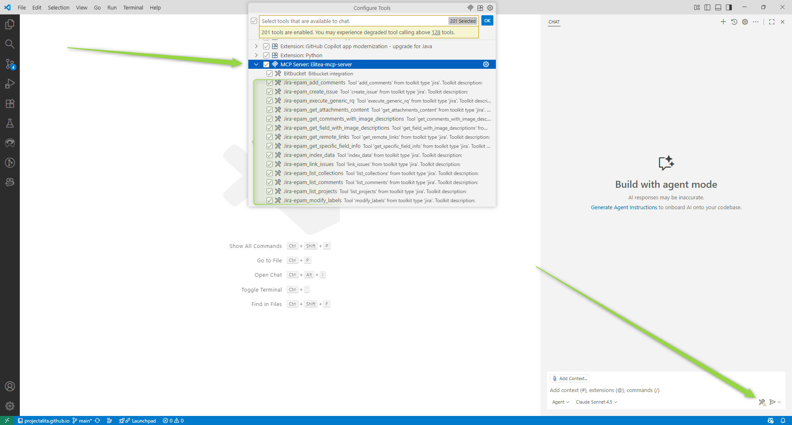

# Make Tools Available by MCP

## Overview

The **Make tools available by MCP** feature enables you to expose selected toolkit tools through the Model Context Protocol (MCP) interface. When enabled, these tools become accessible to external MCP clients (such as VS Code with GitHub Copilot) that connect to Elitea's MCP Server.

This feature is particularly useful when you want to:

* Share toolkit tools with external development environments
* Enable team members to access specific tools through VS Code
* Build MCP-based integrations that leverage Elitea's native toolkit capabilities
* Extend your Elitea toolkits to external MCP-compatible applications

!!! info "MCP Overview"
    The Model Context Protocol (MCP) is an open standard for communication between AI-powered tools, agents, and client applications. Elitea implements both MCP Server (exposing agents and tools) and MCP Client (consuming external MCP servers) capabilities.

---

## How It Works

When you enable **Make tools available by MCP** for a toolkit:

1. The toolkit configuration is saved with MCP availability metadata (`meta.mcp_options.available_by_mcp: true`)
2. Tools from this toolkit become discoverable through Elitea's MCP Server endpoint
3. External MCP clients can connect to your project and access these tools
4. The tools appear alongside agents and pipelines tagged with `mcp` in the client application

---

## Prerequisites

Before enabling this feature, ensure you have:

* **Toolkit Configuration Access** – Permissions to create or edit toolkits in your project
* **Project Access** – Working within a project that supports MCP Server integration
* **Understanding of Tool Scope** – Knowledge of which tools should be exposed externally
* **MCP Client Setup** (for verification) – VS Code with GitHub Copilot or another compatible MCP client

!!! warning "Security Consideration"
    Only enable this feature for tools that are safe to expose externally. Ensure that sensitive operations or credentials are properly managed and that tool exposure aligns with your organization's security policies.

---

## Enabling the Feature

### For New Toolkits

When creating a new toolkit:

1. Navigate to **Menus → Toolkits**
2. Click **+ Create**
3. Select the toolkit type (e.g., Jira, Confluence, GitHub)
4. Configure the toolkit settings:
    * **Name**: Enter a descriptive name for the toolkit
    * **Connection Details**: Provide required credentials and configuration
5. In the **TOOLS** section:
    * Select the specific tools you want to enable
    * Locate the **"Make tools available by MCP"** checkbox
    * Check the box to enable MCP availability
6. Click **Save**

 
### For Existing Toolkits
To enable MCP availability for an existing toolkit:

1. Navigate to **Menus → Toolkits**
2. Select the toolkit you want to modify
3. Scroll to the **TOOLS** section
4. Locate the **"Make tools available by MCP"** checkbox
5. Check the box to enable MCP availability (or uncheck to disable)
6. Click **Save** to apply changes

 

!!! tip "Selective Tool Exposure"
    You can control which tools from a toolkit are available by adjusting the **selected_tools** list. Only checked tools will be exposed through MCP, even if MCP availability is enabled.

---

### Testing with an MCP Client

To verify tools are accessible through MCP:

2. **Set Up MCP Server Connection**:
    * Configure an MCP client (e.g., VS Code) to connect to your Elitea project
    * Use your project's MCP Server endpoint: `[ELITEA_SERVER_URL]/mcp_sse/[PROJECT_ID]/sse`
    * Provide your authentication token
    * See the [MCP Server Integration Guide](mcp-server-sse.md) for detailed setup

2. **Verify Tool Discovery**:
    * Open GitHub Copilot Chat in Agent mode
    * Click the **Tools** icon
    * Look for your toolkit tools in the available tools list
    * They should appear alongside agents and pipelines tagged with `mcp`

3. **Test Tool Invocation**:
    * Select one of the exposed tools
    * Provide required parameters
    * Execute the tool and verify it functions correctly

---

## Use Cases

### Scenario 1: Exposing Jira Tools to Development Teams

**Objective**: Allow developers to access Jira tools directly from VS Code.

**Steps**:

1. Create a Jira toolkit with connection details
2. Select tools: `create_issue`, `search_issues`, `update_issue`
3. Enable **Make tools available by MCP**
4. Team members connect their VS Code to the project's MCP Server
5. Developers can now create and update Jira issues without leaving their IDE

**Benefits**: Streamlined workflow, reduced context switching, improved productivity.

### Scenario 2: Sharing Confluence Documentation Tools

**Objective**: Enable technical writers to access Confluence through MCP clients.

**Steps**:

1. Configure a Confluence toolkit
2. Select tools: `create_page`, `update_page`, `search_content`
3. Enable **Make tools available by MCP**
4. Writers use VS Code to query and update documentation

**Benefits**: Centralized toolkit configuration, consistent access patterns.

### Scenario 3: Testing and QA Integration

**Objective**: Provide QA teams with access to TestRail or Report Portal tools.

**Steps**:

1. Set up a testing toolkit (TestRail, Report Portal, etc.)
2. Select relevant tools for test case management
3. Enable **Make tools available by MCP**
4. QA engineers access tools through their preferred MCP client

**Benefits**: Unified testing workflow, better collaboration with development.

---

## Effects and Limitations

### When Enabled

* **Tool Visibility**: Selected tools become discoverable via Elitea's MCP Server
* **External Access**: Any MCP client with proper authentication can invoke these tools
* **No Agent Changes**: Agents using this toolkit are unaffected; the feature only impacts external MCP clients

### When Disabled

* **Default Behavior**: Tools are only accessible within Elitea (agents, pipelines, conversations)
* **MCP Server Exclusion**: Tools will not appear in external MCP client tool lists
* **No External Invocation**: External clients cannot discover or execute these tools

### Limitations

* **Authentication Required**: All external access requires valid authentication tokens
* **Project Scope**: Tools are only available to MCP clients connected to the same project
* **Tool Selection**: Only explicitly selected tools are exposed (partial toolkit exposure supported)
* **No Granular Permissions**: MCP availability is all-or-nothing for the selected tools

!!! note "Agent vs. MCP Tagging"
    This feature is different from tagging agents/pipelines with `mcp`. Agent tagging exposes entire agents as tools, while this feature exposes individual toolkit tools.

---

## Troubleshooting

### Tools Not Appearing in MCP Client

**Problem**: Tools are not visible in VS Code or another MCP client.

**Solutions**:

1. **Verify Checkbox**: Ensure **"Make tools available by MCP"** is checked and saved
2. **Restart MCP Server**: In VS Code, restart the MCP server connection
3. **Check Authentication**: Verify your MCP client is using a valid authentication token
4. **Confirm Project ID**: Ensure the MCP client is connected to the correct project endpoint
5. **Review Tool Selection**: Verify that tools are actually selected in the toolkit configuration

### Tools Invocation Fails

**Problem**: Tools appear in the list but fail when executed.

**Solutions**:

1. **Validate Credentials**: Check that toolkit credentials (API keys, tokens) are correct and active
2. **Test in Elitea**: Verify the toolkit works within Elitea first (use Test Settings panel)
3. **Check Parameters**: Ensure required parameters are provided correctly from the MCP client
4. **Review Logs**: Check Elitea logs for error messages related to tool invocation
5. **Network Connectivity**: Verify that Elitea can reach the external service (e.g., Jira, Confluence)

### Checkbox Not Visible

**Problem**: The **"Make tools available by MCP"** checkbox does not appear.

**Solutions**:

1. **Update Elitea**: Ensure you're running a version that supports this feature (v10+)
2. **Check Toolkit Type**: Some toolkit types may not support MCP exposure
3. **Permissions**: Verify you have edit permissions for the toolkit
4. **Refresh Page**: Try refreshing the toolkit configuration page

### Accidental Exposure

**Problem**: Tools were accidentally made available and need to be restricted.

**Solutions**:

1. **Immediate Action**: Uncheck **"Make tools available by MCP"** and save
2. **Verify Removal**: Restart MCP client connections to confirm tools are no longer listed
3. **Review Security**: Audit any external access that may have occurred
4. **Update Tokens**: If needed, regenerate project authentication tokens to revoke access

---

## Best Practices

* **Principle of Least Privilege**: Only expose tools that external users genuinely need
* **Regular Audits**: Periodically review which toolkits have MCP availability enabled
* **Clear Naming**: Use descriptive toolkit names so users can identify tool sources in MCP clients
* **Test First**: Always test toolkit functionality within Elitea before exposing via MCP
* **Document Access**: Maintain documentation about which tools are exposed and why
* **Credential Management**: Use secure credential storage and rotate tokens regularly
* **Monitor Usage**: Track tool invocations through MCP to understand usage patterns

---

## Related Documentation

!!! info "Learn More"
    * **[MCP Server Integration via SSE](mcp-server-sse.md)** – Connect external MCP clients to Elitea
    * **[MCP Server Integration via STDIO](mcp-server-stdio.md)** – Alternative MCP connection method
    * **[Toolkits](../../menus/toolkits.md)** – Complete guide to toolkit configuration
    * **[MCPs Menu](../../menus/mcps.md)** – Managing external MCP servers (reverse direction)

---