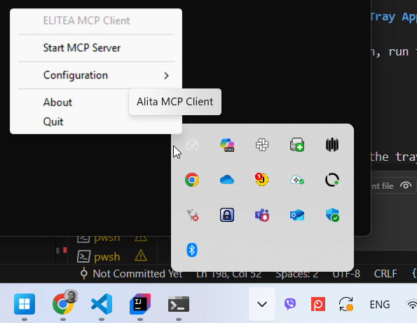

# Elitea MCP Client Integration via STDIO

## Overview

The Elitea platform offers powerful bidirectional integration capabilities through its MCP Client functionality, allowing you to connect external MCP servers to extend Elitea's capabilities with specialized tools and services. This integration enables Elitea to act as an MCP Client, connecting to and orchestrating multiple external MCP servers such as Playwright for browser automation and GitHub for repository management.

Using Standard Input/Output (STDIO) transport, Elitea can communicate with various MCP servers, making it an ideal orchestration platform for complex workflows that require integration with multiple external services. Whether you're automating web testing with Playwright or managing GitHub repositories, this guide will walk you through setting up and leveraging Elitea's MCP Client capabilities.

## What is the MCP Protocol?

The Model Context Protocol (MCP) is an open standard designed to enable seamless communication between AI-powered tools, agents, and client applications. By following the MCP protocol, different systems can exchange context, tasks, and results in a consistent and interoperable way.

MCP is widely adopted in the AI ecosystem, making it easier to integrate various tools and platforms with AI agents. Elitea's implementation allows it to act as both an MCP Server (providing agents as tools) and an MCP Client (connecting to external MCP servers).

To learn more about the technical details and capabilities of MCP, visit the official documentation: [MCP Protocol](https://modelcontextprotocol.io/).

## Architecture and Communication Flow

### Elitea as an MCP Client

When Elitea acts as an MCP Client, it establishes connections to external MCP servers and makes their tools available to Elitea agents and workflows. This creates a powerful ecosystem where Elitea can orchestrate complex multi-tool workflows.

```
┌─────────────────┐    STDIO      ┌──────────────────┐
│  Elitea Agent   │◄─────────────►│ Playwright MCP   │
│                 │               │ Server           │
└─────────────────┘               └──────────────────┘
         │
         │ STDIO
         ▼
┌─────────────────┐               ┌──────────────────┐
│ GitHub MCP      │◄─────────────►│ Other MCP        │
│ Server          │    STDIO      │ Servers          │
└─────────────────┘               └──────────────────┘
```

### Stateful & Stateless Sessions – Flexible Server Connection Modes

Elitea supports both **stateful** and **stateless** session modes when connecting to external MCP servers:

- **Stateful sessions** keep a persistent connection open, allowing context and data to be shared across multiple tool calls. This is ideal for workflows that require continuity, such as browser automation, multi-step testing, or working with sessions that need to remember previous actions.

- **Stateless sessions** start fresh for each tool call, ensuring a clean environment every time. This is best for simple, independent operations where you want to avoid any leftover state or side effects between runs.

You can choose the mode that fits your workflow best—stateful for complex, ongoing tasks, or stateless for isolated, repeatable actions. Configuration is simple and can be set per server in your Elitea MCP Client settings.

### Key Benefits

- **Multi-tool Orchestration**: Connect multiple specialized MCP servers simultaneously
- **Stateful Session Management**: Maintain persistent connections for complex workflows  
- **Bidirectional Communication**: Elitea can both provide and consume MCP services
- **Extensible Architecture**: Easily add new capabilities by connecting additional MCP servers

## Prerequisites

Before setting up Elitea as an MCP Client, ensure you have the following:

- **Elitea Project Access**  
  You'll need access to an Elitea project with the ability to configure MCP client connections. Contact your Elitea administrator if you need project access.

- **Authentication Token**  
  An authentication token is required to configure the MCP client connections. You can generate and manage tokens in the Elitea web interface under the [Settings & Configuration – Personal Tokens](../../menus/settings/personal-tokens.md) section.

- **External MCP Servers**  
  You'll need access to the external MCP servers you want to connect (e.g., Playwright MCP, GitHub MCP). Each server may have its own authentication requirements.

- **Project Configuration Access**  
  The ability to modify your Elitea project's MCP client configuration, typically done through the Elitea web interface or configuration files.


## Step-by-Step Setup: Installation, Configuration & Execution

### Prerequisites

- **Python 3.10+** installed
- **pipx** (recommended) or pip
- Elitea Project ID & Authentication Token ([how to get Project ID](../../menus/settings/ai-configuration.md))

---

### 1. Installation

#### pip (all platforms)

```bash
pip install alita-mcp
```
If the provided command faild try following 

#### macOS

!!! info "Installing Homebrew"
    If you don't have Homebrew installed on your Mac, you'll need to install it first:
    
    1. Open the Terminal app (you can find it in Applications > Utilities)
    2. Copy and paste the following command into the Terminal, then press Enter:
    
    ```sh
    /bin/bash -c "$(curl -fsSL https://raw.githubusercontent.com/Homebrew/install/HEAD/install.sh)"
    ```
    
    3. Follow the on-screen instructions in the Terminal. You may be asked to enter your password
    4. Once the installation is complete, verify it by running:
    
    ```sh
    brew --version
    ```
    
    For more information, see the [Homebrew installation guide](https://mac.install.guide/homebrew/3).

```bash
brew install pipx
pipx ensurepath
pipx install alita-mcp
```
If needed, add to your shell profile:
```bash
echo 'export PATH="$PATH:$HOME/.local/bin"' >> ~/.zprofile
source ~/.zprofile
```
#### Windows

```powershell
pip install --user pipx
python -m pipx ensurepath
pipx install alita-mcp
```

#### Linux

```bash
sudo apt install pipx   # or: sudo dnf install pipx
pipx ensurepath
pipx install alita-mcp
```

---

### 2. Configuration

#### Interactive (Recommended for All Platforms)

Run the bootstrap wizard to set up your Elitea connection and MCP servers:

```bash
alita-mcp bootstrap
```
You’ll be prompted for:

- Deployment URL (e.g., https://next.elitea.ai)
- Authentication Token
- Host/Port (accept defaults unless needed)
- Project ID
- MCP Server Configuration (add Server Name, Server Type, Command, Args and Keep Connection alive)

**Example:**  
For Playwright:
```
{
  "deployment_url": "https://next.elitea.ai",
  "auth_token": "eyJhbGciOi.....",
  "host": "0.0.0.0",
  "port": 8000,
  "project_id": 6,
  "servers": {
    "Playwright_MCP": {
      "type": "stdio",
      "command": "npx",
      "args": [
        "@playwright/mcp@latest"
      ],
      "stateful": true
    }
  }
}
```

#### Configuration File Locations

- **macOS:** `~/Library/Application Support/alita-mcp-client/config.json`
- **Linux:** `~/.config/alita-mcp-client/config.json`
- **Windows:** `%APPDATA%\\alita-mcp-client\\config.json`

You can edit this file manually for advanced setups.

---

### 3. Execution & Usage

#### System Tray Application (GUI, Recommended for Most Users)

- **Start the tray app:**  
  ```bash
  alita-mcp tray
  ```
  or

- **Run in background:**  
  ```bash
  alita-mcp tray --daemon
  ```
  or 

- **Auto-start on login:**  
  - **macOS:** Copy `scripts/launch-tray-macos.sh` to `~/Applications/` and add to Login Items.
  - **Linux:** Copy `.desktop` file to `~/.config/autostart/`.
  - **Windows:** Copy `launch-tray-windows.bat` to the Startup folder (`Win+R`, type `shell:startup`).

#### Optional configurations using Command Line

- **Run with all project agents:**  
  ```bash
  alita-mcp run --project_id YOUR_PROJECT_ID
  ```
- **Run with a specific agent:**  
  ```bash
  alita-mcp run --project_id YOUR_PROJECT_ID --app_id YOUR_APP_ID
  ```
- **Start in background (daemon):**  
  ```bash
  alita-mcp serve --daemon
  ```


After "alita-mcp tray",  the terminal will look like following


Now you need to interact with the application through your system's tray menu to **start MCP server**:

- **On Windows:**  
  Go to the system tray in the bottom-right corner of your desktop. Find the application with the Alita icon and right-click on it. Click the **Start MCP Server** option to start the server.

  

- **On macOS:**  
  Go to the menu bar in the top-right corner of your screen and find the application with the Alita icon. Click on it to open the menu.

  

**Troubleshooting on macOS:**  
In some cases, the tray app icon may not be visible on the macOS menu bar, especially if you have many other applications running. Go to **System Settings > Control Center** and check the settings for menu bar icons to ensure the ELITEA tray app is not hidden.

**Tray Menu Features:**  
- Start/stop, restart MCP servers, open/view config, run bootstrap, view status, quit.

---

**Tip:**  
The tray app is the easiest way to manage your MCP client, especially for non-technical users. Use the CLI for automation or advanced workflows.

---

## Using MCP Servers from the Elitea UI

Once your MCP server is set up and running, you can connect it to your Elitea agents directly from the Elitea web interface. This allows you to use powerful external tools as part of your agent workflows.

### How to Create an MCP in Elitea

Create the MCP entry in the ELITEA UI so your project can reference and use the external server.

1. Ensure the **Elitea MCP Client** is installed and started.
2. Open the **MCPs** menu.
3. Select the **available MCP servers** you want to add after they are running locally and connected to your project.
4. Click **`+ Create`**.
5. Fill in details:
      * **Name:** Clear, descriptive label (e.g., "Playwright Browser Automation").
      * **Description:** Optional purpose note.
6. Review the **Tools** list and unselect anything not needed (least privilege).
7. Click **Save**.


!!! tip "Disconnected Creation"
  If the MCP Client is not running at creation time, tool discovery may be empty. Start the client and refresh the MCP entry to load tools.

For more UI details, see the [MCPs menu guide](../../menus/mcps.md).

### How to Add MCP Server as a Toolkit to an Agent

1. **Navigate to Elitea** and select the project where you have configured MCP servers.
2. **Create a new agent** or select an existing one.
      1. Go to the **Configuration** tab of the agent.
      2. Scroll down to the **Toolkits** section.
      3. Click **+MCP**.
      4. Your configured MCP server(s) will appear in the list, using the names you set during setup.
          
      5. Select the desired MCP server as a toolkit.
      6. Review and select the suggested tools for that toolkit. By default, all tools are selected.
         
3.  Click **Save** to apply the toolkit to the agent.
4.  Configure the agent’s settings, instructions, etc., and save your changes.

You can now use the MCP server’s tools directly from Elitea—triggering actions, automations, or integrations as part of your agent’s workflow.

### Project and User Scope Notes


* **Private Project Setup:**
     * If you set up an MCP server in your Private project, it becomes available in your Private project and in all "Team" projects where you are a member. However, only you will see and be able to use these MCP servers.
* **Team Project Setup:**
     * If you set up an MCP server in a Team project, it becomes available to all users of that Team project, as well as in your Private project and any other Team projects you are involved in. Still, only you will see and be able to use the MCP servers you configured.

!!! tip "Tip"
    This ensures your MCP integrations are both flexible and secure—available where you need them, but only visible to you unless shared in a Team project.

---

**You’re now ready to leverage external MCP tools in your Elitea agents, all from the Elitea UI!**

## Use Cases:

### Use Case 1: Web Application Testing with Playwright MCP

**Goal:**
Automate browser-based testing of a web application directly from Elitea, enabling agents to perform UI checks, capture screenshots, and validate workflows without writing code.

#### Setup Steps

1. **Ensure Playwright MCP Server is running** and configured in your Elitea MCP Client (see earlier setup instructions).
2. **In Elitea UI:**
    * Select your project.
    * Create a new agent (e.g., "Web Tester") or select an existing one.
    * Go to the agent's **Configuration** tab.
    * In the **Toolkits** section, click **+MCP**.
    * Select your Playwright MCP server from the list (named as you configured it).
    * Review the available Playwright tools (e.g., navigate, click, fill, screenshot) and select those you want to enable (all are selected by default).
    * Click **Save** to add the toolkit to your agent.
    * Configure the agent's instructions (e.g., "Test the login page and capture a screenshot after login.").
    * Save the agent.

#### How to Use

* Trigger the agent from the Elitea UI, providing the target website or scenario as input.
* The agent will use Playwright MCP to automate browser actions, perform checks, and return results (such as screenshots or status messages) directly in Elitea.

#### Results

* Automated, repeatable browser tests run from Elitea—no coding required.
* Visual feedback (screenshots, pass/fail status) is available in the agent's output.
* Great for regression testing, smoke tests, or validating deployments.

---

### Use Case 2: Repository Management and Issue Automation with GitHub MCP

**Goal:**
Empower Elitea agents to interact with GitHub repositories—creating issues, managing pull requests, or tracking project status—without leaving the Elitea UI.

#### Setup Steps

1. **Ensure GitHub MCP Server is running** and configured in your Elitea MCP Client (see earlier setup instructions).
2. **In Elitea UI:**
    * Select your project.
    * Create a new agent (e.g., "GitHub Manager") or select an existing one.
    * Go to the agent's **Configuration** tab.
    * In the **Toolkits** section, click **+MCP**.
    * Select your GitHub MCP server from the list (named as you configured it).
    * Review the available GitHub tools (e.g., create issue, list repositories, manage pull requests) and select those you want to enable (all are selected by default).
    * Click **Save** to add the toolkit to your agent.
    * Configure the agent's instructions (e.g., "Create a new issue in the selected repository with the provided details.").
    * Save the agent.

#### How to Use

* Trigger the agent from the Elitea UI, providing repository details, issue descriptions, or pull request information as needed.
* The agent will use GitHub MCP to perform the requested actions and return results (such as issue links, PR status, or repository lists) directly in Elitea.

#### Results

* Seamless GitHub management from Elitea—no need to switch tools or write code.
* Agents can automate repetitive tasks, track project progress, or facilitate team collaboration.
* Ideal for product owners, QA, or anyone managing GitHub workflows within Elitea.

---

## Troubleshooting

### "MCP server not found" error

**Problem:**
After clicking the **Start MCP Server** option in tray app to start the server. you encounter an error stating that the MCP server is not found or could not be started.
     

**Solution:**
This issue typically occurs when the `servers` configuration is missing or empty in your `config.json` file. This can happen if the `bootstrap` process was interrupted or conflicted with another program (like Visual Studio Code) that had the file open.

   

1.  **Locate your `config.json` file.** (See "Configuration File Locations" section for paths).
2.  **Open the file** and inspect the `"servers"` object. If it's empty (`"servers": {}`) or missing, you need to add the server configuration manually.
3.  **Add the server configuration.** You can re-run `alita-mcp bootstrap` or copy the server object manually. The configuration for a server should look like this:

    

    Here is an example of a correctly filled-in `playwright` server configuration:

```json
{
  "deployment_url": "https://next.elitea.ai",
  "auth_token": "eyJhbGciOi.....",
  "host": "0.0.0.0",
  "port": 8000,
  "project_id": 6,
  "servers": {
    "Playwright": {
      "type": "stdio",
      "command": "npx",
      "args": [
        "@playwright/mcp@latest"
      ],
      "stateful": true
    }
  }
}
```

 **Save the `config.json` file** and try running the MCP client again.

### Playwright Toolkit Issues

#### Node.js Not Installed Error

**Problem:**
You encounter an error when trying to use the Playwright toolkit, and the error message indicates that Node.js is not available on your system.

  

**Cause:**
The Playwright MCP server requires Node.js to be installed on your computer to function properly. Without Node.js, the `npx` command cannot execute the Playwright toolkit.

**Solution:**
1. **Install Node.js** from the official website: [https://nodejs.org/](https://nodejs.org/)
2. **Download and install** the LTS (Long Term Support) version for your operating system
3. **Restart your terminal** or command prompt after installation
4. **Verify installation** by running: `node --version` and `npm --version`
5. **Retry** configuring and running the Playwright MCP server

#### File Not Found on Windows

**Problem:**
You're getting an error in your terminal indicating that the `npx` command cannot be found or executed, particularly on Windows systems.

 

**Cause:**
On some Windows systems, the `npx` command may not be properly recognized due to file extension handling or PATH configuration issues.

**Solution:**
1. **Open your `config.json` file** (see "Configuration File Locations" section for paths)
2. **Change the command** from `"npx"` to `"npx.cmd"` in your Playwright server configuration:

```json
{
  "servers": {
    "Playwright": {
      "type": "stdio",
      "command": "npx.cmd",
      "args": [
        "@playwright/mcp@latest"
      ],
      "stateful": true
    }
  }
}
```

3. **Save the file** and restart the MCP client
4. **Test the configuration** to ensure the Playwright server starts correctly

## Additional Resources and Support

For further reading and to deepen your understanding of Elitea MCP Client and related technologies, explore the following resources:

- [MCP Protocol – Official Documentation](https://modelcontextprotocol.io/)
- [Playwright MCP Server Documentation](https://github.com/microsoft/playwright-mcp)
- [GitHub MCP Server Documentation](https://github.com/github/github-mcp-server)
- [Elitea Platform Documentation](../../home/introduction.md)
- [Elitea Settings & Configuration](../../menus/settings/ai-configuration.md)


