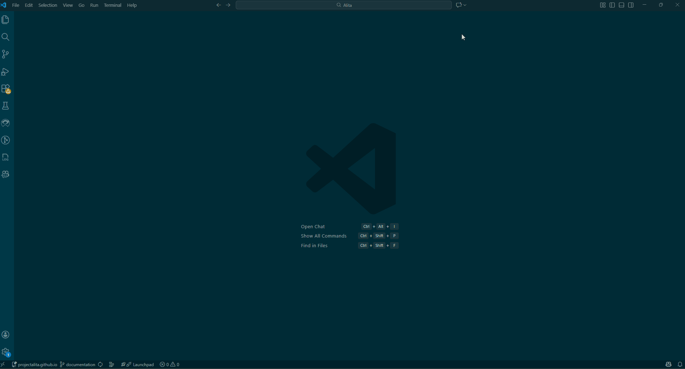
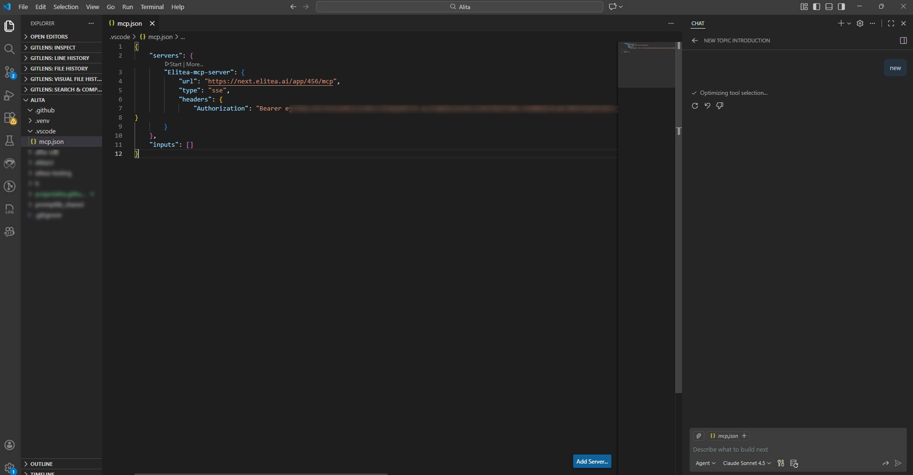
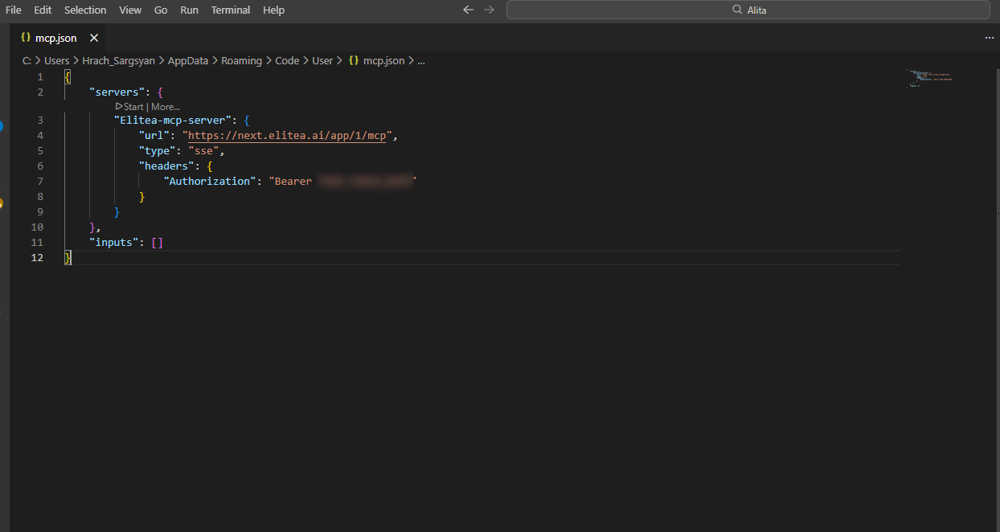
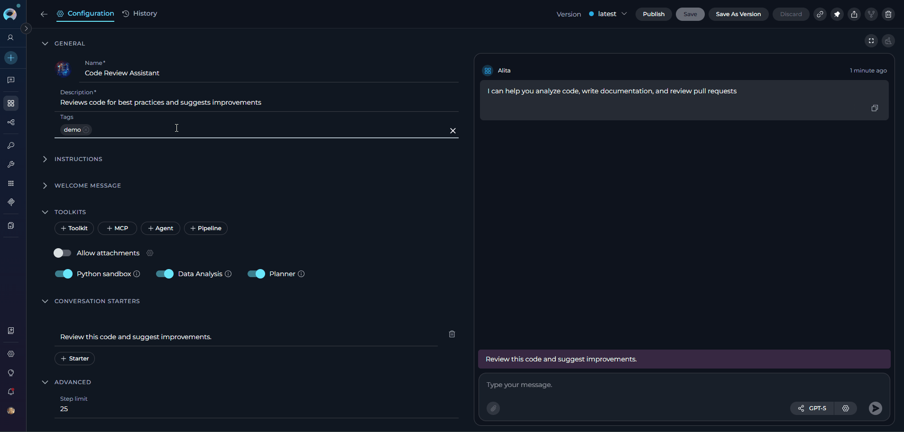
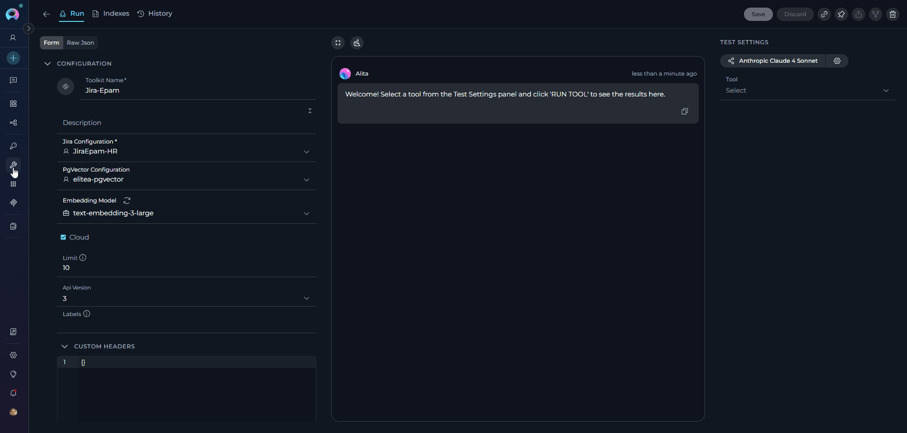
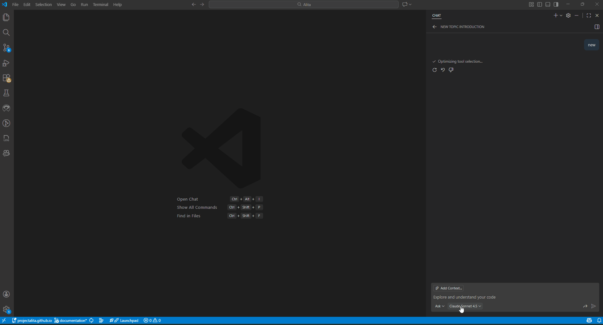
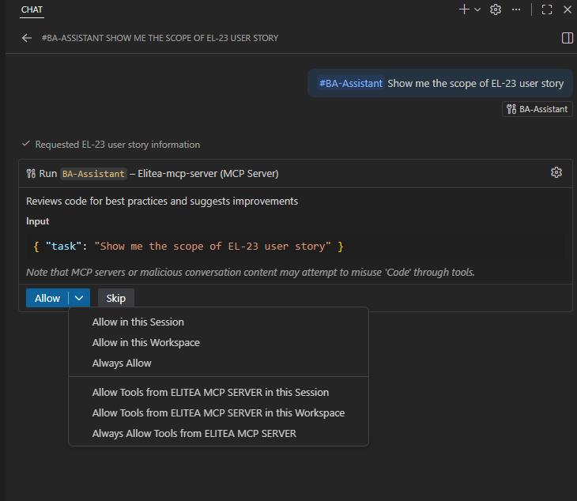
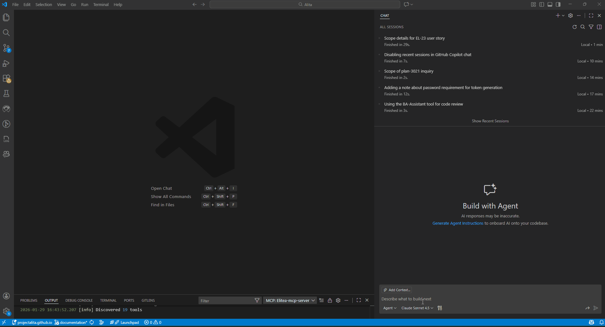
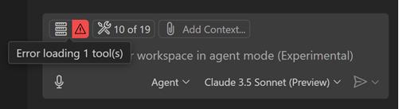
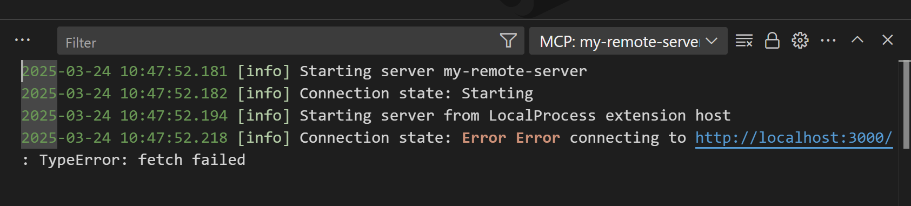

# Elitea MCP Server Integration via SSE Transport

## Overview

The Elitea platform now supports integration with MCP clients through its dedicated MCP Server, using Server-Sent Events (SSE) for real-time communication. This integration makes it easy to connect your favorite MCP-compatible tools to Elitea, enabling seamless, live interactions powered by the open Model Context Protocol (MCP).

With SSE transport, you receive updates and responses from Elitea agents as they happen, making your workflows more interactive and efficient. Whether you’re using Visual Studio Code or another MCP client, this guide will walk you through connecting and making the most of Elitea’s MCP Server capabilities.

## What is the MCP Protocol?

The Model Context Protocol (MCP) is an open standard designed to enable seamless communication between AI-powered tools, agents, and client applications. By following the MCP protocol, different systems can exchange context, tasks, and results in a consistent and interoperable way.

MCP is widely adopted in the AI ecosystem, making it easier to integrate various tools and platforms—like Elitea—with your favorite development environments and assistants.

To learn more about the technical details and capabilities of MCP, visit the official documentation: [MCP Protocol](https://modelcontextprotocol.io/).

## Prerequisites

Before you begin, ensure you have the following:

- **MCP Server Endpoint**  
  Your project's MCP Server URL in the format:
  ```
  https://your-elitea-server.com/app/PROJECT_ID/mcp
  ```
  Find your endpoint in Elitea → [Settings → AI Configuration](../../menus/settings/ai-configuration.md).

- **Authentication Token**  
  A personal access token from Elitea → [Settings → Personal Tokens](../../menus/settings/personal-tokens.md). Copy and store it securely as it will only be shown once.

- **VS Code Requirements**  
      - VS Code version 1.99 or later
      - `chat.mcp.enabled` setting turned on (enabled by default)
      - GitHub Copilot subscription with Agent mode enabled

!!! note "MCP Client Compatibility"
    Only MCP clients that support custom HTTP headers (specifically `Authorization: Bearer [TOKEN]`) can connect to Elitea's SSE MCP Server. VS Code is currently the primary supported client.

## How to Connect to ELITEA MCP Server

You can add and configure an Elitea MCP Server in VS Code using either **Workspace** or **User** settings. This flexibility allows you to share configurations with your team or keep them global for all your projects.

### Step-by-Step Setup

1. **Open Your Project**  
   Launch VS Code and open the project or workspace where you want to use the Elitea MCP Server.

1. **Open GitHub Copilot Chat**  
   Access the Copilot Chat panel in VS Code.  


1. **Switch to Agent Mode**  
   In Copilot Chat, select **Agent mode**.  

1. **Select Tools**  
   Click the **Select Tools** icon.  

1. **Add MCP Server**  
    - Click **Add More Tools**.
    - Choose **+ Add MCP Server**.
    - Select **HTTP (Server Sent Events)**.
    - Enter your Server URL (e.g., `https://next.elitea.ai/app/PROJECT_ID/mcp`).
    - Enter a Server ID (use the default generated one or provide a descriptive name).

1. **Choose Configuration Scope**  
   You can save your MCP server configuration in either:
    - **Workspace Settings** (shared with your team, local to the project)
    - **User Settings** (applies globally to all VS Code workspaces)




### Option 1: Workspace Settings

If you choose **Workspace Settings**, VS Code will create a `.vscode/mcp.json` file in your project.
This MCP server will only be available within this workspace.

1. **Open `.vscode/mcp.json`**  
   Navigate to the file in your workspace and open it.  
2. **Add Your Token**  
   Add the `"headers"` section to your server configuration exactly as shown below. Make sure to keep the word `Bearer` (with a space after it) and replace `[Your Token]` with your actual authentication token. Do not remove `Bearer`—it is required for authorization to work correctly.
   ```json
   "headers": {
       "Authorization": "Bearer YOUR_TOKEN_HERE"
   }
   ```

    !!! example "Example"
        if your token is `abc123`, it should look like:
        ```json
        "headers": {
            "Authorization": "Bearer abc123"
        }
        ```

3. **Save and Start**  
   Save the file, then click the **Start** button in the json file to activate the server.

      

!!! note "Important"
    If you are using VS Code version 1.100.1 or higher, you'll also need to manually add `"type": "sse"` to your configuration file, as shown below:
    ```json
    "type": "sse",
    "url": "https://next.elitea.ai/app/1/mcp",
    "headers": {
        "Authorization": "Bearer abc123"
    }
    ```

---

### Option 2: User Settings

If you choose **User Settings**, VS Code will create a global `mcp.json` file in your user configuration directory (`%APPDATA%\Code\User\mcp.json` on Windows).
This MCP server will be available globally for all your projects and workspaces in VS Code.

1. **Open Global `mcp.json`**  
   Navigate to your global `mcp.json` file in VS Code (typically located at `%APPDATA%\Code\User\mcp.json`).

2. **Add Your Token**  
   Add the `"headers"` section to your server configuration exactly as shown below. Make sure to keep the word `Bearer` (with a space after it) and replace `[Your Token]` with your actual authentication token. Do not remove `Bearer`—it is required for authorization to work correctly.
   ```json
   "headers": {
       "Authorization": "Bearer YOUR_TOKEN_HERE"
   }
   ```

    !!! example "Example"
        if your token is `abc123`, it should look like:
        ```json
        "headers": {
            "Authorization": "Bearer abc123"
        }
        ```

3. **Save and Start**  
   Save the file, then click the **Start** button in the mcp.json file to activate the server.

   

!!! note "Important"
    If you are using VS Code version 1.100.1 or higher, you'll also need to manually add `"type": "sse"` to your configuration file, as shown below:
    ```json
    "type": "sse",
    "url": "https://next.elitea.ai/app/1/mcp",
    "headers": {
        "Authorization": "Bearer abc123"
    }
    ```

---

!!! note "Multiple MCP Servers"
    You can add as many MCP servers as you need. For example, if you have several Elitea projects and want to use different agents from each, simply repeat the above steps for each server—regardless of whether you use workspace or user settings.

---

## Using Elitea Agents as MCP Tools

To use Elitea agents, pipelines, and toolkit tools in VS Code via MCP, they must be made available through MCP in Elitea.

> **Note:** If you add or update agents/pipelines with the `mcp` tag, or enable toolkit tools for MCP after starting your MCP server, restart the server to sync and make them available as tools.

### Tagging Agents and Pipelines

1. In the Elitea web interface, tag your agents or pipelines with `mcp`.
   
2. Only tagged agents and pipelines will be synced and available as tools in VS Code.

!!! note "Important Notes"
    - Only the "**latest**" version of each agent or pipeline tagged with `mcp` will be pulled and used. If you have multiple versions of the same agent/pipeline, ensure the version you want to use is the "**latest**".
    - If you have several agents with the same name, only one will be fetched and shown in VS Code. Please consider renaming your agents with unique names if you need them all to be fetched and used.

### Making Toolkit Tools Available by MCP

Besides agents and pipelines, you can also expose selected toolkit tools through the MCP interface.

1. When creating or editing a toolkit in Elitea, navigate to the **TOOLS** section.
2. Select the **Make tools available by MCP** checkbox to enable MCP access for the selected tools.
  
   


Only the tools you select in your toolkit configuration are exposed via MCP and made available in VS Code; they appear alongside your tagged agents and pipelines in the MCP client's tool list.


!!! tip "Learn More"
    For detailed instructions on making toolkit tools available by MCP, including security considerations and testing procedures, see [Make Tools Available by MCP](make-tools-available-by-mcp.md).

---

### Using MCP Tools in Agent Mode

Once your MCP server is connected and your agents, pipelines, and toolkit tools are made available:

1. **Open GitHub Copilot Chat**  
   Open the Copilot Chat panel in VS Code.

2. **Switch to Agent Mode**  
   In the chat mode selector, choose **Agent** mode.

3. **Select Tools**  
   Click the **Select Tools** icon in the chat interface.

4. **Choose Your Tools**  
    - All synced tools (tagged with `mcp`) will appear in the list.
    - By default, all are selected. You can search, select, or deselect tools as needed.

    

5. **Reference Tools in Chat**  
    - In the chat input, write your instructions. You can reference a tool directly by typing `#` followed by the tool name (e.g., `#my_agent`).
    - Copilot will automatically suggest matching tools as you type.
    - Copilot can also intelligently select and invoke appropriate tools based on your request.

6. **Confirm and Execute the Tool**  
    - When Copilot proposes to use a tool, it will show the tool call with parameters.
    - You'll be asked to confirm the tool execution for security.
    - Click **Aloww** to proceed with running the tool.

7. **Configure Auto-Confirm (Optional)**  
    - Use the **Allow** button dropdown to configure auto-confirm preferences if desired.
    - Options include: current session only, this workspace, or always auto-confirm.
        {width="300"}

8. **Review Output**  
    - After execution, review the tool's output in the chat.
    - Use the results to continue your workflow or refine your request.

    


!!! tip "Tip:" 
    You can reference any available tool in your prompt by typing `#` and the tool name. This works in all chat modes (ask, edit, and agent mode).

---
## Use Cases

Here are practical examples demonstrating how to use Elitea MCP tools in your daily workflow:

??? example "Enhancing Jira User Stories with BA Assistant Agent"
    **Scenario:** You want to improve the acceptance criteria of a Jira User Story using the BA Assistant agent.
    
    1. **Select the BA Assistant Tool**  
       - Open GitHub Copilot Chat in Agent mode
       - Click **Select Tools** and ensure **BA Assistant** is selected from your MCP server
    
    2. **Request Enhancement**  
       In the chat, reference the tool and provide your instruction:
       ```
       #BA Assistant
       Show me the scope of PLAN-3012 user story. Enhance ACs.
       ```
    
    3. **Review and Confirm**  
       - Copilot will propose using the BA Assistant tool to retrieve and enhance the user story
       - Click **Allow** to confirm the tool execution
       - The agent will fetch the Jira ticket, analyze it, and present enhanced acceptance criteria
    
    4. **Save Results**  
       - Copilot will offer to save the enhanced user story as a file (e.g., `PLAN-3012_enhanced.md`)
       - Confirm to save it to your workspace

??? example "Analyzing Confluence Documentation with Content Analyzer"
    **Scenario:** You need to analyze a Confluence page and extract key information for a technical specification.
    
    1. **Select the Content Analyzer Tool**  
       - Open GitHub Copilot Chat in Agent mode
       - Click **Select Tools** and choose **Content Analyzer** from your Elitea MCP server
    
    2. **Request Analysis**  
       In the chat, provide your instruction:
       ```
       #Content Analyzer
       Analyze the API documentation page in Confluence space "TECH" titled "REST API v2 Specification". 
       Extract all endpoint definitions and create a summary table.
       ```
    
    3. **Confirm and Execute**  
       - Review the tool call parameters
       - Click **Allow** to run the analysis
       - The tool will fetch the Confluence page and extract structured information
    
    4. **Use Results**  
       - Review the generated summary table
       - Ask Copilot to save it as a markdown file or incorporate it into your documentation

??? example "Running Test Cases with QTest Integration"
    **Scenario:** You want to retrieve test case details from QTest and update their execution status.
    
    1. **Select QTest Tools**  
       - Open GitHub Copilot Chat in Agent mode
       - Click **Select Tools** and enable QTest toolkit tools from your MCP server
    
    2. **Retrieve Test Case**  
       In the chat, request test case information:
       ```
       #Get test case
       Get details for test case TC-12345 from QTest project "Mobile App Testing"
       ```
    
    3. **Review and Update**  
       - Copilot will show the test case details including steps, expected results, and current status
       - Click **Allow** to confirm
       - Request an update if needed:
       ```
       Update the execution status to "Passed" and add a comment: "All scenarios verified successfully in build 2.3.1"
       ```
    
    4. **Confirm Changes**  
       - Review the proposed update
       - Click **Allow** to apply changes to QTest
       - Verify the update was successful

---
## Troubleshooting

??? warning "No Agents or Pipelines Are Shown"
    **Problem:** MCP tools (agents, pipelines, or toolkit tools) don't appear in the VS Code tool list after connecting the MCP server.
    
    **Solution:**
    
    1. **Check MCP Tag:** Ensure your agents and pipelines in Elitea are tagged with `mcp`. Only tagged items will sync and appear as tools in VS Code.
    2. **Check Toolkit MCP Checkbox:** For toolkit tools, verify that the "Make tools available by MCP" checkbox is enabled in the toolkit's TOOLS section.
    3. **Restart the Server:** If you add or update tags or enable MCP for toolkit tools after starting the MCP server, restart the server to sync the changes:
        - In VS Code, go to the MCP server list
        - Click the **Stop** button for your Elitea MCP server
        - Click the **Start** button to restart it
    4. **Scope of MCP Server:** Verify whether your MCP server is configured for the correct scope (User or Workspace). Sometimes, tools may not appear if the configuration is not in the expected location.
    5. **Check Server Status:** Ensure the MCP server shows as "Running" in VS Code. If it shows an error status, check the server logs for details.

??? warning "Token Authentication Issues"
    **Problem:** Connection fails with authentication errors or "401 Unauthorized" messages.
    
    **Solution:**
    
    1. **Correct Token:** Double-check that you have copied and pasted the correct authentication token into your configuration. Tokens are case-sensitive and should not have extra spaces.
    2. **Token Expiry:** Ensure your token has not expired. Check the token's expiration date in Elitea Settings under [Personal Tokens](../../menus/settings/personal-tokens.md).
    3. **Token Placement:** Verify the token is added under the `"headers"` section in your MCP server configuration with the exact format:
        ```json
        "headers": {
            "Authorization": "Bearer YOUR_TOKEN_HERE"
        }
        ```
    4. **Bearer Prefix:** Ensure the word "Bearer" (with a capital B and a space after it) appears before your token. Do not include extra colons or quotes around "Bearer".
    5. **Generate New Token:** If the issue persists, generate a new token in Elitea and update your configuration.

??? warning "VS Code MCP Server Connection Errors"
    **Problem:** VS Code shows error indicators for the MCP server or fails to connect.
    
    **Solution:**
    
    1. **Check Error Indicator:** If VS Code encounters an issue with an MCP server, an error indicator will appear in the Chat view.
       
    
    2. **View Server Logs:** 
        - Select the error notification in the Chat view
        - Choose **Show Output** to view detailed server logs
        - Look for specific error messages that indicate the root cause
       
    
    3. **Command Palette Access:** Alternatively, run `MCP: List Servers` from the Command Palette, select your Elitea server, and choose **Show Output** for troubleshooting details.
    
    4. **Verify Server URL:** Ensure your server URL is correctly formatted:
        - Should be: `https://your-elitea-server.com/app/PROJECT_ID/mcp`
        - Should NOT include extra paths or trailing slashes
    
    5. **Check VS Code Version:** Verify you're using VS Code 1.99 or later with `chat.mcp.enabled` setting turned on.

??? warning "Configuration File Issues"
    **Problem:** MCP server configuration not loading or showing syntax errors.
    
    **Solution:**
    
    1. **Validate JSON Syntax:** Ensure your `mcp.json` file contains valid JSON. Common issues include:
        - Missing commas between properties
        - Extra commas after the last property
        - Mismatched quotes or brackets
        - Incorrect escape characters
    
    2. **Check File Location:**
        - **Workspace:** `.vscode/mcp.json` in your project root
        - **User/Global:** `%APPDATA%\Code\User\mcp.json` (Windows) or `~/.config/Code/User/mcp.json` (Linux/Mac)
    
    3. **Verify Type Property:** For VS Code 1.100.1 or higher, ensure you have `"type": "sse"` in your configuration:
        ```json
        {
            "servers": {
                "Elitea-mcp-server": {
                    "type": "sse",
                    "url": "https://next.elitea.ai/app/1/mcp",
                    "headers": {
                        "Authorization": "Bearer YOUR_TOKEN"
                    }
                }
            }
        }
        ```
    
    4. **Reload VS Code:** After making configuration changes, reload VS Code window (Command Palette → "Developer: Reload Window").

??? warning "Network and Connectivity Issues"
    **Problem:** MCP server fails to connect due to network-related errors.
    
    **Solution:**
    
    1. **Check Internet Connection:** Ensure your internet connection is stable and active.
    2. **Firewall and Proxy Settings:** 
        - Verify that your firewall is not blocking the MCP server URL
        - If behind a corporate proxy, ensure VS Code proxy settings are configured correctly
        - Check that SSE (Server-Sent Events) connections are allowed through your firewall
    3. **VPN Considerations:** If using a VPN, try connecting with and without it to identify if the VPN is causing issues.
    4. **Test Server Accessibility:** Open the MCP server URL in a web browser to verify it's accessible from your network.
    5. **SSL/TLS Issues:** Ensure your system trusts the SSL certificate of your Elitea server. Self-signed certificates may cause connection failures.

??? warning "Tools Not Executing or Hanging"
    **Problem:** MCP tools appear in the list but don't execute or hang when invoked.
    
    **Solution:**
    
    1. **Check Tool Selection:** Ensure the tool is selected (checked) in the **Select Tools** menu before trying to use it.
    2. **Verify Agent Mode:** Confirm you're in **Agent mode** in GitHub Copilot Chat. MCP tools only work in Agent mode.
    3. **Review Tool Parameters:** Some tools may hang if required parameters are missing or invalid. Check the tool call preview before clicking Allow.
    4. **Server Timeout:** If tools consistently timeout, check the Elitea server logs for performance issues or rate limiting.
    5. **Restart Server and VS Code:** Try restarting both the MCP server and VS Code completely.

??? warning "Multiple Servers Conflict"
    **Problem:** Issues when multiple MCP servers are configured.
    
    **Solution:**
    
    1. **Verify Active Server:** Use `MCP: List Servers` from Command Palette to see all configured servers and their status.
    2. **Check Server Names:** Ensure each MCP server has a unique name/ID to avoid conflicts.
    3. **Scope Conflicts:** If you have the same server configured in both User and Workspace settings, the Workspace setting takes precedence.
    4. **Disable Unused Servers:** Stop or remove MCP servers you're not currently using to simplify troubleshooting.

### Support Contact

If you encounter issues not covered in this guide or need additional assistance with MCP Server integration, please refer to **[Contact Support](../../support/contact-support.md)** for detailed information on how to reach the ELITEA Support Team.

**Email:** SupportAlita@epam.com

---

## FAQ

??? question "What is the difference between Workspace and User MCP server configuration?"
    **Workspace configuration** (`.vscode/mcp.json`) is project-specific and can be shared with your team via version control. It only works when you open that specific workspace.
    
    **User/Global configuration** (`%APPDATA%\Code\User\mcp.json`) applies to all VS Code workspaces on your machine and is not shared with others. It's ideal for personal tokens and servers you use across multiple projects.
    
    **Which should I use?**
    - Use **Workspace** if you want team members to have the same MCP servers configured (they'll need to add their own tokens)
    - Use **User** for personal MCP servers or when working across multiple projects with the same Elitea instance

??? question "Can I use the same Elitea token for both Workspace and User configurations?"
    Yes, you can use the same Elitea personal token in both configurations. However, for security reasons, it's recommended to:
    - Store the token in **[Secrets](../../menus/settings/secrets.md)** in Elitea
    - Use different tokens for different environments (development vs. production)
    - Regularly rotate tokens and update configurations accordingly

??? question "How do I know which version of my agent/pipeline will be used via MCP?"
    Only the **"latest"** version of each agent or pipeline tagged with `mcp` will be pulled and used in VS Code. If you have multiple versions:
    
    1. Ensure the version you want to use is marked as "latest" in Elitea
    2. If you have multiple agents/pipelines with the same name, only one will be fetched
    3. Consider renaming agents with unique names if you need multiple versions accessible via MCP

??? question "Can I use MCP tools outside of Agent mode?"
    No, MCP tools can only be invoked in **Agent mode** in GitHub Copilot Chat. However, you can reference tools in all chat modes (ask, edit, agent) by typing `#` followed by the tool name, but the actual execution requires Agent mode.

??? question "Why do I need to restart the MCP server after tagging new agents?"
    The MCP server caches the list of available tools when it starts. When you add new tags (`mcp`) to agents/pipelines or enable toolkit tools for MCP, the server needs to be restarted to:
    
    1. Re-scan the Elitea project for MCP-tagged items
    2. Refresh its internal tool registry
    3. Make newly tagged items available in VS Code's tool list
    
    Simply stop and start the server from VS Code's MCP server list to sync the changes.

??? question "What's the difference between agents, pipelines, and toolkit tools in MCP?"
    **Agents** are AI assistants with specific instructions and capabilities that can be invoked as tools via MCP. They can use toolkits and perform complex reasoning.
    
    **Pipelines** are multi-step workflows that chain together agents and other operations. They can also be exposed as MCP tools when tagged.
    
    **Toolkit Tools** are individual functions from integrated services (like Jira, Confluence, QTest) that can be made available directly through MCP by enabling the "Make tools available by MCP" checkbox.
    
    All three types appear in the same MCP tool list in VS Code and can be used interchangeably in your workflows.

??? question "How many MCP servers can I configure in VS Code?"
    There's no hard limit on the number of MCP servers you can configure. You can add multiple Elitea MCP servers (for different projects), as well as other MCP servers from different providers. Each server appears separately in the tools list, grouped by server name.
    
    **Best practice:** Give each server a descriptive name (e.g., "Elitea-Production", "Elitea-Development") to easily identify them in the tool selection menu.

??? question "Do I need GitHub Copilot subscription to use Elitea MCP Server?"
    Yes, you need an active GitHub Copilot subscription to use MCP tools in VS Code. The MCP integration works through GitHub Copilot's Agent mode, which is a Copilot feature. Without Copilot, you won't be able to access the MCP tool interface in VS Code.

??? question "Can I control which toolkit tools are exposed via MCP?"
    Yes! When configuring a toolkit in Elitea, you can selectively enable the "Make tools available by MCP" checkbox for specific toolkits. Only the tools you've selected in that toolkit will be exposed through MCP. This allows you to:
    
    1. Limit exposure of sensitive operations
    2. Keep the MCP tool list focused and manageable
    3. Follow the principle of least privilege
    
    For more details, see [Make Tools Available by MCP](make-tools-available-by-mcp.md).

??? question "What should I do if my token expires?"
    When your Elitea personal token expires:
    
    1. Go to Elitea → [Settings → Personal Tokens](../../menus/settings/personal-tokens.md)
    2. Generate a new token with an appropriate expiration date
    3. Update your `mcp.json` file with the new token in the `"Authorization": "Bearer NEW_TOKEN"` field
    4. Save the file
    5. Restart the MCP server in VS Code
    
    **Tip:** Set token expiration dates based on your security policies, and consider calendar reminders to rotate tokens before they expire.

??? question "Why does the Allow button dropdown offer different auto-confirm options?"
    The Allow button dropdown provides flexibility in how you want to handle tool execution confirmations:
    
    - **Current session only:** Auto-confirms for this VS Code session only (until you close VS Code)
    - **This workspace:** Auto-confirms whenever you're working in this specific project/workspace
    - **Always auto-confirm:** Auto-confirms for all workspaces and sessions
    
    **Security recommendation:** Use "Current session only" or "This workspace" for better security control, especially when working with tools that modify data (like creating issues or updating tickets).

---

!!! reference "Additional Resources and Useful Links:"
    For further reading and to deepen your understanding of Elitea MCP Server integration and related technologies, explore the following resources:

    - [MCP Protocol – Official Documentation](https://modelcontextprotocol.io/)
    - [VS Code MCP Server Documentation](https://code.visualstudio.com/docs/copilot/chat/mcp-servers)
    - [Creating and Using MCP Client (STDIO)](create-and-use-client-stdio.md)
    - [Creating and Using MCP Server (STDIO)](create-and-use-server-stdio.md)
    - [Creating and Using Remote MCP](create-and-use-remote-mcp.md)
