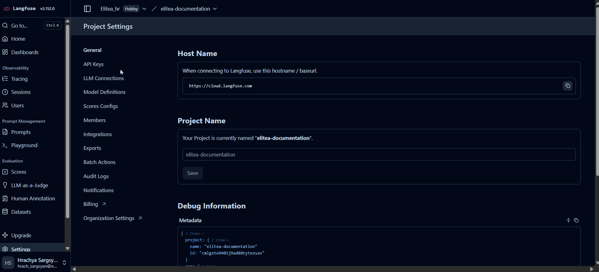
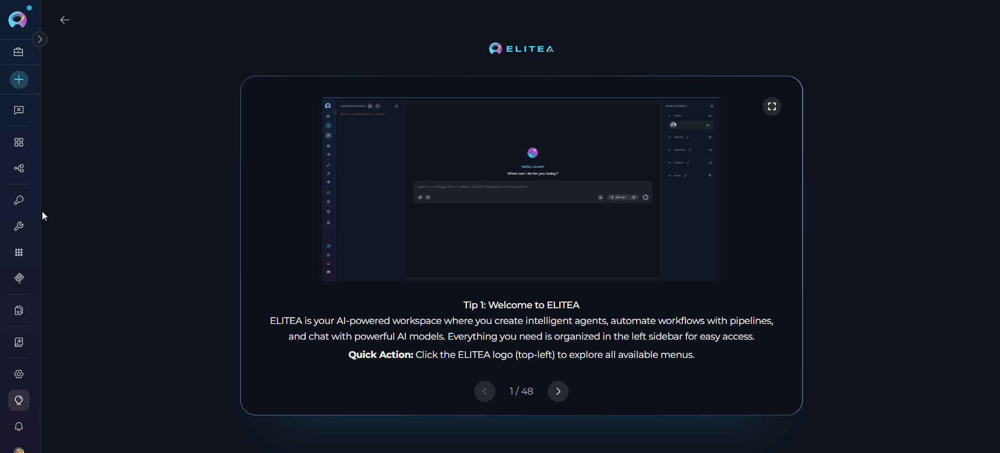

# Langfuse

## Introduction

**Langfuse** is an observability and monitoring platform for Large Language Model (LLM) applications. It provides comprehensive tracing capabilities that help you understand, debug, and optimize your AI applications by capturing detailed execution traces, tracking token usage, monitoring latency, and analyzing model performance.

The Langfuse integration in ELITEA enables you to:

- **Track LLM interactions** - Monitor all API calls, prompts, and responses
- **Analyze performance** - Measure latency, token consumption, and costs
- **Debug issues** - Trace execution flows and identify bottlenecks
- **Monitor quality** - Evaluate model outputs and track accuracy over time

---

## Prerequisites

Before configuring Langfuse credentials in ELITEA, you need:

1. **Langfuse Account** - Sign up at [Langfuse Cloud](https://cloud.langfuse.com) or deploy a self-hosted instance
2. **API Credentials** - Generate API keys from your Langfuse project dashboard (see detailed instructions below in the [Obtaining Langfuse API Keys](#obtaining-langfuse-api-keys) section):
     - Public Key - Used for client identification
     - Secret Key - Used for authentication

---

## Obtaining Langfuse API Keys

This section provides detailed, step-by-step instructions for generating the API credentials required to integrate Langfuse with ELITEA.

### Langfuse Cloud

If you're using Langfuse Cloud, follow these steps to obtain your API keys:

#### Step 1: Log In to Langfuse Cloud

1. **Visit Langfuse Cloud:** Open your web browser and navigate to [https://cloud.langfuse.com](https://cloud.langfuse.com)
2. **Log In or Create Account:** If you don't have an account, create one. If you already have an account, log in using your credentials.

#### Step 2: Create or Select a Project

Once logged in to Langfuse Cloud:

!!! note "Organization Selection"
    When you first log in, you may need to select or create an organization. Organizations are the top-level entity that contains projects. If prompted, select an existing organization or create a new one before proceeding to project creation.

1. **Access Projects:** You'll be directed to the projects overview page
2. **Create New Project (if needed):**
     - Click the **"New Project"** button
     - Enter a **Project Name** (e.g., "ELITEA Production")
     - Optionally add a description
     - Click **"Create"** to create the project
3. **Select Existing Project:** If you already have a project, click on it to open the project dashboard


!!! note "Project Organization"
    Projects in Langfuse organize your traces and analytics. You can create separate projects for different environments (development, staging, production) or different applications.

#### Step 3: Generate API Keys

1. **Open Project Settings:** In your project dashboard, locate and click on the **"Settings"** icon or menu (usually in the left sidebar or top navigation)
2. **Access API Keys:** In the settings menu, click on **"API Keys"** to view the API keys management page
3. **Create New Keys:** Click the **"Create New API Key"** or **"+ New API Key"** button
4. **Name Your Key (Optional):** Some versions allow you to provide a descriptive name for the key set (e.g., "ELITEA Integration")
5. **Generate Keys:** Click **"Generate"** or **"Create"**
6. **Copy Both Keys Immediately:**
     - **Public Key:** Copy the public key (typically starts with `pk-lf-`)
     - **Secret Key:** Copy the secret key (typically starts with `sk-lf-`)

    !!! warning "Important: Secret Key Security"
        **The secret key is only displayed once at creation time.** You will not be able to view it again after you leave this page. Make sure to:
    
        - Copy and store the secret key immediately in a secure location
        - Use an ELITEA's **[Secrets](../../menus/settings/secrets.md)** feature
        - Never commit keys to version control systems
        - If you lose the secret key, you must generate a new key pair




!!! note "Next Steps"
    After obtaining your keys, verify they work correctly:

    1. **Note the Base URL:** For Langfuse Cloud, the base URL is `https://cloud.langfuse.com`
    2. **Test in ELITEA:** Use these credentials when creating your Langfuse credential in ELITEA (as described in the [Creating Langfuse Credentials](#creating-langfuse-credentials-in-elitea) section)


---

### Self-Hosted Langfuse

For self-hosted Langfuse deployments, the API key generation process is identical to Langfuse Cloud. Follow these steps:

1. **Deploy Langfuse:** Follow the [Langfuse Self-Hosting Guide](https://langfuse.com/docs/deployment/self-host) using Docker Compose, Kubernetes, or your preferred cloud provider
2. **Access Your Instance:** Navigate to your deployment URL (e.g., `https://langfuse.yourcompany.com`) and log in
3. **Create/Select Organization and Project:** Follow the same organization and project creation steps as Langfuse Cloud (Step 2 above)
4. **Generate API Keys:** Follow Step 3 above to generate your public and secret keys

!!! tip "Self-Hosted Configuration"
    When creating your Langfuse credential in ELITEA:
    
    - Use your custom deployment URL as the Base URL (e.g., `https://langfuse.yourcompany.com`)
    - Ensure SSL/TLS certificates are properly configured
    - Verify firewall rules allow ELITEA to access your instance
    - Test connectivity before proceeding with credential configuration

---


## Creating Langfuse Credentials in Elitea

To integrate Langfuse with ELITEA for LLM tracing and observability:

**Access Credentials Configuration**

1. Navigate to **Settings** → **Credentials** from the main navigation sidebar
2. Click the **+ (Create New)** button
3. Select **Langfuse** from the credential type list

      

**Configure and Save Langfuse Credential**

1. Fill in the required connection details:

     | Field | Description |
     |-------|-------------|
     | **Display Name** | Enter a descriptive name for this configuration (e.g., "Production Langfuse Tracing") |
     | **ID** | Auto-generated from the Display Name |
     | **Base URL** | Langfuse server endpoint URL.<br> For Langfuse Cloud: `https://cloud.langfuse.com`.<br> For Self-Hosted: Your custom deployment URL (e.g., `https://langfuse.yourcompany.com`).<br> Do not include trailing slashes. |
     | **Public Key** | Your Langfuse public API key (see [Generate API Keys](#step-3-generate-api-keys) section for details). Used to identify your project/organization. Typically starts with `pk-lf-` (e.g., `pk-lf-...`) |
     | **Secret Key** | Your Langfuse secret API key (see [Generate API Keys](#step-3-generate-api-keys) section for details). Provides authentication for API access. Stored securely and masked in the UI. Typically starts with `sk-lf-` (e.g., `sk-lf-...`) |

2. **Test Connection:** Click **Test Connection** to verify that your credentials are valid and ELITEA can successfully connect to Langfuse
3. **Save Credential:** Click **Save** to create the credential. After saving, your Langfuse credential will be added to the credentials dashboard and will be ready to use in agent configurations, pipeline configurations, and toolkit integrations requiring LLM tracing. You can view, edit, or delete it from the **Credentials** menu at any time.

      

---

## Usage in ELITEA

Once your Langfuse credential is configured in ELITEA (via **Settings** → **Credentials**), it enables LLM observability and tracing capabilities for your AI applications. Langfuse automatically captures execution traces, providing deep insights into your agent's behavior, performance, and costs.

### How Langfuse Tracing Works

When Langfuse credentials are configured in your ELITEA project:

**Automatic Trace Capture:**

- **LLM API Calls**: Every interaction with language models (GPT-4, Claude, etc.) is logged with full request/response details
- **Token Usage**: Input and output token counts are tracked for each model call
- **Latency Metrics**: Response times are measured for performance analysis
- **Tool Invocations**: External toolkit calls (GitHub, Jira, etc.) are captured in the execution trace
- **Conversation Context**: Full conversation history and context windows are preserved
- **Error Tracking**: Failed requests and exceptions are logged with stack traces

**Trace Hierarchy:**

Langfuse organizes execution data in a hierarchical structure:

```
Trace (Conversation Session)
├── Generation (LLM Call 1)
│   ├── Input: User prompt + system instructions
│   ├── Output: Model response
│   ├── Metadata: Model name, temperature, max tokens
│   └── Metrics: Tokens (input/output), latency, cost
├── Span (Tool Execution)
│   ├── Tool: github_create_issue
│   ├── Input: Repository, title, description
│   ├── Output: Issue URL and ID
│   └── Duration: Execution time
└── Generation (LLM Call 2)
    ├── Input: Tool result + follow-up prompt
    └── Output: Final response to user
```

### Viewing Traces in Langfuse

After agents or pipelines execute with Langfuse credentials configured, access detailed traces in your Langfuse dashboard:

**Access Langfuse Traces**

1. Navigate to your Langfuse instance:
      - **Langfuse Cloud**: [https://cloud.langfuse.com](https://cloud.langfuse.com)
      - **Self-Hosted**: Your custom deployment URL
2. Log in with your Langfuse account credentials
3. Select the project matching your ELITEA Langfuse credential configuration
4. Click **Traces** in the left sidebar to open the Trace Explorer
5. View the list of all captured execution traces with:
     - Trace ID and timestamp
     - User information (if available)
     - Execution status (success/error)
     - Total token count and estimated cost
     - Execution duration

**Analyze Individual Traces**

Click on any trace to view detailed execution breakdown:

**Trace Overview Panel:**

| Field | Description | Example |
|-------|-------------|---------|
| **Trace ID** | Unique identifier for the execution | `trace_abc123xyz` |
| **Name** | Trace name or conversation identifier | "Agent Execution: Deploy Feature" |
| **Timestamp** | When the execution started | `2026-02-11 14:30:22 UTC` |
| **Duration** | Total execution time | `3.4 seconds` |
| **User ID** | User who triggered the execution | `user@company.com` |
| **Tags** | Custom metadata tags | `environment:production`, `agent:deployment` |

**Generation Details (LLM Calls):**

For each LLM API call in the trace:

- **Prompt**: Complete input including system instructions, user message, and conversation history
- **Completion**: Full model response
- **Model**: Specific model used (e.g., `gpt-4o`, `claude-3-5-sonnet-20241022`)
- **Token Metrics**:
     - Input tokens: Number of tokens in the prompt
     - Output tokens: Number of tokens in the response
     - Total tokens: Sum of input and output
- **Cost**: Calculated based on model pricing (e.g., `$0.0045`)
- **Latency**: Time taken to receive the response (e.g., `1.2s`)

**Span Details (Tool Executions):**

For each tool or external service call:

- **Tool Name**: Identifier of the tool used (e.g., `github_create_pull_request`)
- **Input Parameters**: Arguments passed to the tool
- **Output Result**: Data returned by the tool
- **Duration**: Execution time for the tool call
- **Status**: Success or error indication

### Example Use Cases

??? example "Use Case 1: Debugging Agent Failures"
    When an agent execution fails or produces unexpected results:

    1. **Find the Trace**: Search Langfuse by trace ID, user, or timestamp
    2. **Review LLM Prompts**: Examine the exact prompts sent to the model
         - Check if system instructions are correct
         - Verify context window contains relevant information
         - Identify missing or incorrect data in the prompt
    3. **Analyze Tool Calls**: Inspect tool execution results
         - Verify tool was called with correct parameters
         - Check for tool execution errors
         - Validate tool output matches expectations
    4. **Identify Root Cause**: Pinpoint where the execution diverged from expected behavior

    **Example Scenario:**

    ```
    Problem: Agent fails to create GitHub issue

    Trace Analysis:
    ├── Generation 1: User asks to create issue ✓
    │   └── Model decides to call github_create_issue tool ✓
    ├── Span: github_create_issue
    │   ├── Input: repository="wrong-repo", title="Bug Report"
    │   └── Error: "Repository not found" ✗
    └── Root Cause: Agent selected wrong repository name
        Solution: Update agent instructions to verify repo names
    ```

??? example "Use Case 2: Optimizing Token Usage and Costs"
    Monitor and reduce LLM API costs:

    1. **Filter by Model**: View traces for expensive models (GPT-4, Claude)
    2. **Sort by Token Count**: Identify conversations with high token usage
    3. **Analyze Prompt Efficiency**:
         - Review prompts with excessive token counts
         - Identify redundant information in system instructions
         - Find opportunities to compress context
    4. **Calculate ROI**: Compare costs across different models and configurations

    **Example Analysis:**

    ```
    Before Optimization:
    - Average tokens per conversation: 8,500
    - Average cost per conversation: $0.12
    - Monthly cost (10,000 conversations): $1,200

    After Optimization:
    - Compressed system instructions (saved 1,200 tokens)
    - Removed redundant examples (saved 800 tokens)
    - Average tokens per conversation: 6,500
    - Average cost per conversation: $0.09
    - Monthly cost: $900 (25% reduction)
    ```

??? example "Use Case 3: Performance Monitoring"
    Track agent response times and identify bottlenecks:

    1. **Dashboard Overview**: View average latency trends over time
    2. **Slow Trace Analysis**: Filter traces by duration to find slowest executions
    3. **Bottleneck Identification**:
         - Compare LLM response times across models
         - Measure tool execution durations
         - Identify network latency issues
    4. **Performance Optimization**: Switch to faster models for time-sensitive tasks

### Filtering and Searching Traces

Langfuse provides powerful filtering capabilities:

**Filter by Time Range:**
```
Last 24 hours | Last 7 days | Last 30 days | Custom range
```

**Filter by Status:**
```
✓ Successful executions only
✗ Failed executions only
⚠ Executions with warnings
```

**Search by Metadata:**
```
user_id:john@company.com
model:gpt-4o
environment:production
agent_name:deployment-assistant
```

**Filter by Cost:**
```
Cost > $0.10 (expensive executions)
Tokens > 10,000 (large conversations)
```

---

## Best Practices

??? tip "API Key Management"
    - **Separate Keys by Environment** - Use different API keys for development, staging, and production
    - **Rotate Keys Regularly** - Periodically regenerate keys for enhanced security
    - **Limit Key Permissions** - Use project-specific keys rather than organization-wide keys
    - **Monitor Key Usage** - Track API key activity in Langfuse dashboard

??? tip "Base URL Configuration"
    - **Use HTTPS** - Always use encrypted connections
    - **Verify URL** - Ensure the Base URL is accessible from your ELITEA deployment
    - **No Trailing Slashes** - Remove any trailing `/` from the URL
    - **Check Firewall Rules** - Ensure network policies allow outbound connections to Langfuse

??? tip "Integration Testing"
    - **Test Before Production** - Validate configuration in development environment first
    - **Monitor First Traces** - Verify traces appear correctly in Langfuse after setup
    - **Check Trace Completeness** - Ensure all expected data (tokens, latency, metadata) is captured
    - **Validate Cost Tracking** - Confirm cost calculations align with provider billing

??? tip "Organize Traces with Tags"
    Add custom metadata tags to traces for better organization:
    
    - **Environment tags**: `production`, `staging`, `development`
    - **Feature tags**: `deployment`, `code-review`, `testing`
    - **User tags**: Team names, departments, or user roles
    - **Version tags**: Agent version numbers for A/B testing

??? tip "Set Up Alerts and Monitoring"
    Configure Langfuse alerts for:
    
    - **High Cost Executions**: Alert when single trace exceeds cost threshold
    - **Error Rate Spikes**: Notification when error rate increases
    - **Latency Issues**: Alert on slow execution times
    - **Token Limit Warnings**: Notification when approaching model token limits

??? tip "Regular Trace Analysis"
    Establish a routine for trace review:
    
    - **Daily**: Check for new errors and failures
    - **Weekly**: Review cost trends and optimization opportunities
    - **Monthly**: Analyze performance metrics and model effectiveness
    - **Quarterly**: Comprehensive audit of agent behavior and improvements

??? tip "Use Trace Data for Continuous Improvement"
    Leverage captured traces to:
    
    - **Refine Prompts**: Improve system instructions based on observed behavior
    - **Update Training Data**: Export successful interactions for fine-tuning
    - **Validate Changes**: Compare traces before and after agent updates
    - **Document Edge Cases**: Identify and document unusual execution patterns

---

## Troubleshooting

??? warning "Authentication Failed: Invalid public_key or secret_key"
    **Cause:** The provided API keys are incorrect or have been revoked.
    
    **Solution:**

    1. Log in to your Langfuse dashboard
    2. Navigate to **Project Settings** → **API Keys**
    3. Verify the keys match exactly (no extra spaces)
    4. If keys are expired or revoked, generate new ones
    5. Update the configuration in ELITEA with the new keys

??? warning "Access Forbidden: Check your API key permissions"
    **Cause:** The API keys lack necessary permissions for the project.
    
    **Solution:**

    1. Verify the keys are from the correct Langfuse project
    2. Check key permissions in Langfuse dashboard
    3. Ensure the keys have read/write access to tracing data
    4. Generate new keys with appropriate permissions if needed

??? warning "Connection Error: Unable to reach Langfuse at [URL]"
    **Cause:** The Base URL is incorrect or the Langfuse server is unreachable.
    
    **Solution:**

    1. **Verify Base URL:**
         - For Langfuse Cloud: `https://cloud.langfuse.com`
         - For Self-Hosted: Check your deployment URL
         - Remove any trailing slashes
    
    2. **Check Network Connectivity:**
         - Verify ELITEA can access the URL (firewall rules, network policies)
         - Test the URL in a browser from the ELITEA server
         - Ensure DNS resolution works correctly
    
    3. **Self-Hosted Issues:**
         - Verify the Langfuse instance is running
         - Check SSL certificate validity
         - Ensure the deployment is accessible externally (if ELITEA is remote)

??? warning "Connection Timeout: Langfuse did not respond in time"
    **Cause:** The Langfuse server is slow to respond or experiencing issues.
    
    **Solution:**

    1. **Check Server Status:**
         - For Langfuse Cloud: Check [status page](https://status.langfuse.com)
         - For Self-Hosted: Verify server health and resources
    
    2. **Network Latency:**
         - Test connection speed to the server
         - Check for network congestion
         - Consider timeout settings if on slow connection
    
    3. **Server Performance:**
         - Monitor Langfuse server resource usage (CPU, memory)
         - Check for high load or ongoing maintenance
         - Retry connection after a few minutes

??? warning "No Traces Appearing in Langfuse"
    **Cause:** Configuration is saved but traces are not being sent to Langfuse.
    
    **Solution:**

    1. **Verify Agent/Pipeline Configuration:**
         - Ensure the Langfuse credential is selected in agent or pipeline settings
         - Check that observability is enabled for the execution
    
    2. **Check Langfuse Project:**
         - Verify you're looking at the correct project in Langfuse dashboard
         - Check the project ID matches your API keys
    
    3. **Test with Simple Execution:**
         - Run a simple test agent or pipeline
         - Check Langfuse dashboard within a few minutes
         - Look for error messages in ELITEA logs

??? warning "Incorrect Cost Calculations"
    **Cause:** Token counts or pricing information may not be accurate.
    
    **Solution:**

    1. **Verify Model Pricing:**
         - Check that model pricing is configured correctly in Langfuse
         - Update pricing information if provider costs change
    
    2. **Token Counting:**
         - Ensure token counts are being captured accurately
         - Compare with provider billing statements
    
    3. **Currency Settings:**
         - Verify currency configuration in Langfuse matches your provider's billing currency

---

## Additional Resources

!!! related "Related Documentation"
    - **[Langfuse Documentation](https://langfuse.com/docs)** - Official Langfuse documentation
    - **[Langfuse API Reference](https://api.reference.langfuse.com)** - API endpoints and authentication
    - **[Self-Hosting Guide](https://langfuse.com/docs/deployment/self-host)** - Deploy your own Langfuse instance
    - **[Credentials Menu](../../menus/credentials.md)** - General credentials management documentation
    - **[AI Configuration](../../menus/settings/ai-configuration.md)** - AI model and integration setup
