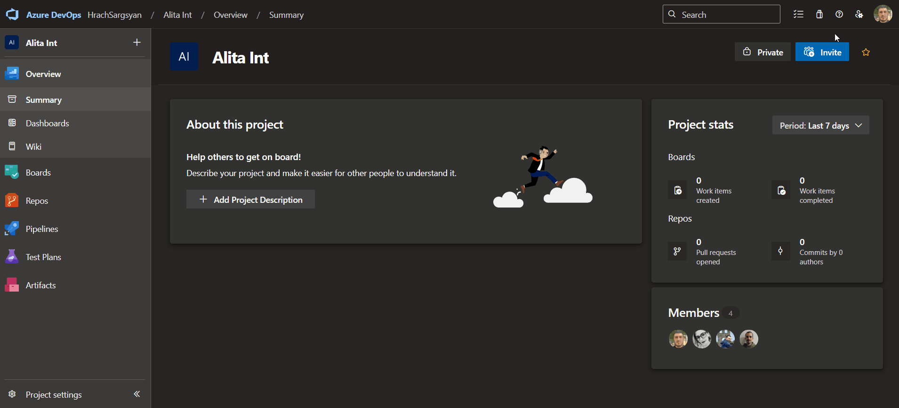
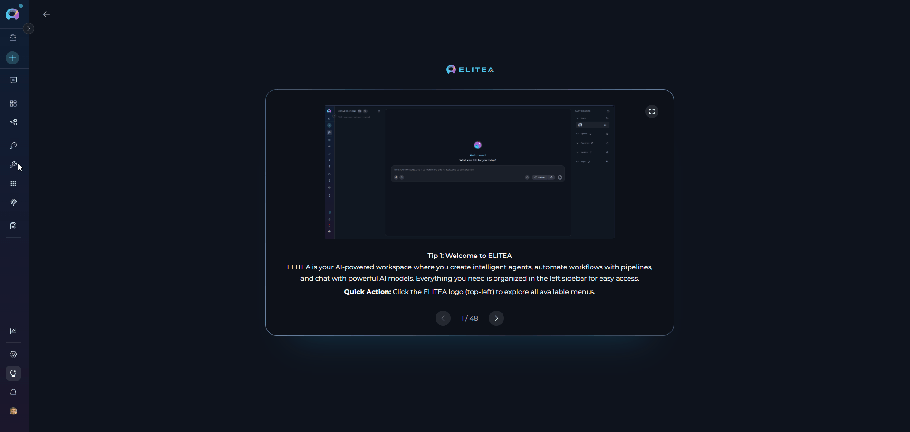
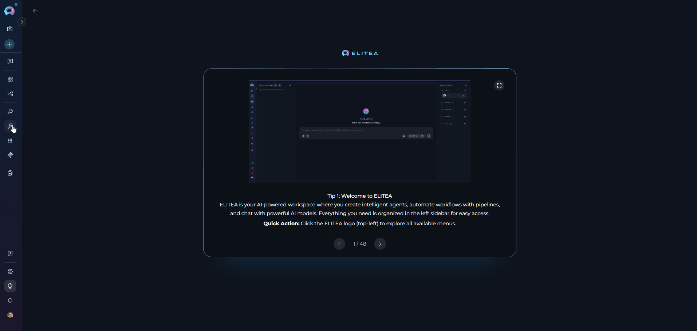
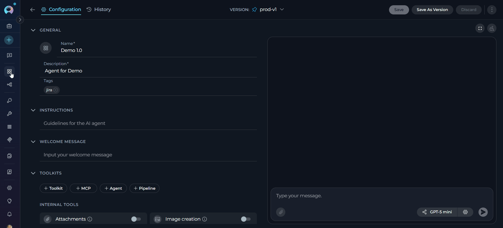
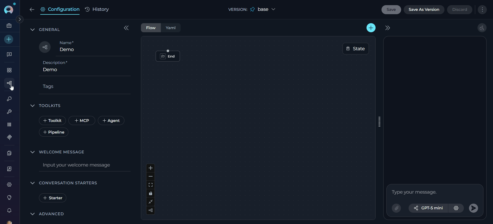
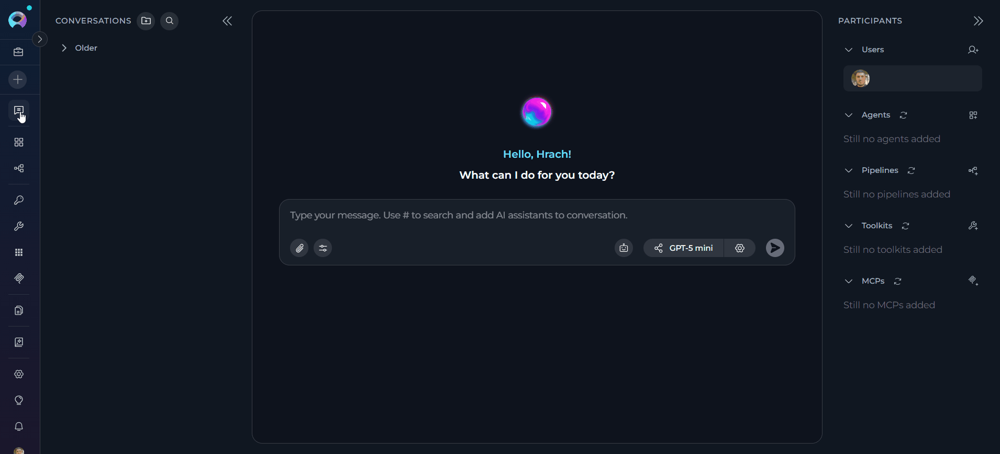

# Azure Repos (ADO Repos) Toolkit Integration Guide

---

## Introduction

This guide is your definitive resource for integrating and utilizing the **Azure Repos (ADO Repos) toolkit** within ELITEA. It provides a comprehensive, step-by-step walkthrough, from generating an Azure DevOps Personal Access Token to configuring the toolkit in ELITEA and effectively using it within your Agents, Pipelines, and Chat conversations. By following this guide, you will unlock the power of automated code management, streamlined Azure DevOps workflows, and enhanced team collaboration, all directly within the ELITEA platform.

**Brief Overview of Azure Repos**

Azure Repos is a core service within Azure DevOps, providing a robust and scalable cloud-hosted platform for version control and collaborative code management. It offers essential tools for development teams to manage their codebase efficiently and collaborate effectively throughout the software development lifecycle. Azure Repos includes features for:

*   **Versatile Version Control:** Supports both Git (distributed) and Team Foundation Version Control (TFVC - centralized), providing flexibility for diverse team preferences and project requirements.
*   **Enhanced Collaborative Development:** Facilitates team-based software development with Pull Requests for code review, Branch Policies for quality enforcement, and Code Search for efficient code discovery.
*   **Seamless Azure DevOps Integration:** Integrates with Azure Boards for work item tracking, Azure Pipelines for CI/CD, and Azure Test Plans for testing, creating a unified DevOps platform.
*   **Scalability and Reliability:** Built on Azure cloud infrastructure, providing a highly scalable and reliable platform for repositories of any size.
*   **Advanced Security and Compliance:** Offers granular access control, branch permissions, audit logging, and compliance certifications.

Integrating Azure Repos with ELITEA brings these powerful version control capabilities directly into your AI-driven workflows. Your ELITEA Agents, Pipelines, and Chat conversations can intelligently interact with Azure Repos repositories to automate code-related tasks, enhance DevOps workflows, and improve team collaboration.

---

## Toolkit's Account Setup and Configuration in Azure DevOps

**Account Setup**

If you do not yet have an Azure DevOps account and organization, please follow these steps to create one:

1.  **Visit Azure DevOps Website:** Open your web browser and navigate to the Azure DevOps website: [https://azure.devops.com/](https://dev.azure.com/).
2.  **Start Free or Sign In:** Click on the **"Start free"** button to create a new Azure DevOps organization, or click **"Sign in to Azure DevOps"** if you already have an organization and wish to sign in.
3.  **Create an Organization (If Needed):**
    *   If you are creating a new organization, click **"Create an Organization"** and follow the prompts to set up your new Azure DevOps organization. You will typically need to provide an organization name, choose a hosting region, and link it to an Azure account (if you have one).
    *   If you are signing into an existing organization, click **"Sign in to Azure DevOps"** and log in using your Microsoft account credentials.
4.  **Enter Account Details:** Provide the required details as prompted during the organization creation or sign-in process. This may include your email address, organization name, and region for hosting your Azure DevOps organization.
5.  **Email Verification (If Prompted):** Verify your email address if prompted by the Azure DevOps signup process. This usually involves clicking a confirmation link sent to your email inbox.
6.  **Log In to Azure DevOps:** Log in to the Azure DevOps dashboard using your newly created or existing Microsoft account credentials.
7.  **Enable Basic Subscription (If Needed):** Ensure that you have a **Basic Azure DevOps subscription** enabled for your account to access Azure Repos and related Azure DevOps services. For new organizations, the Basic subscription is typically enabled by default. For existing organizations, you may need to verify or enable it in the organization settings.
8.  **Add Users and Assign Basic Subscription (If Needed):** To grant access to other users within your organization, navigate to your organization settings:
    *   Go to `https://dev.azure.com/{YourOrganizationName}/_settings/users` (replace `{YourOrganizationName}` with your actual Azure DevOps organization name).
    *   Click **"Add users"**.
    *   Enter the user's email address or Microsoft account.
    *   Select **"Basic"** from the "Access level" dropdown to assign a Basic subscription to the user.
    *   Choose the relevant project(s) to grant the user access to.
    *   Click **"Add"** to add the user to your Azure DevOps organization.
9.  **Add User to Project Member Group (If Needed):** To ensure newly added users have the necessary permissions within a specific project:
    *   Navigate to **"Project settings"** for your desired project (located at the bottom left of the Azure DevOps interface).
    *   Select **"Groups"** under "Security" in the Project settings menu.
    *   Locate the **"Project Valid Users"** group (or a relevant group for your project's members) and click on the group name.
    *   Click on the **"Members"** tab within the group details.
    *   Click **"Add users or groups"**.
    *   Enter the email address or name of the user you want to add to the project member group and click **"Add"**.
10. **Verify Repo Access:** After completing user setup, refresh the Azure DevOps page and ensure that the **"Repos"** feature is enabled and visible for your account within your Azure DevOps project. This confirms that you have successfully set up your Azure DevOps account and have access to Azure Repos.

     {loading=lazy}

!!! note "Note:"
    If the "Repos" feature is not available, you may need to create a new project within your Azure DevOps organization or verify that Azure Repos is enabled for your organization and project.

### Generate a Personal Access Token (PAT)

For secure integration with ELITEA, it is essential to use an Azure DevOps **Personal Access Token (PAT)**. This method is significantly more secure than using your primary Azure DevOps account password directly and allows you to precisely control the permissions granted to ELITEA.

**Follow these steps to generate a Personal Access Token (PAT) in Azure DevOps:**

1.  **Log in to Azure DevOps:** Access your Azure DevOps organization by navigating to `https://dev.azure.com/` and logging in with your credentials.
2.  **Access User Settings:** Click on the **User settings** icon in the top right corner, next to your profile picture. From the dropdown menu, select **"Personal access tokens"**.
3.  **Generate New Token:** Click the **"+ New Token"** button to create a new PAT.
4.  **Configure Token Details:** In the "Create a new personal access token" panel, configure the following:
    *   **Name:** Enter a descriptive label (e.g., "ELITEA Integration" or "ELITEA ADO Access")
    *   **Organization:** Select "All accessible organizations" or choose specific organizations
    *   **Expiration:** Set an expiration date for enhanced security
    *   **Scopes:** Grant only the minimum necessary permissions

    !!! tip "Token Scopes"
        **Minimal Scopes for Common Use Cases:**
    
        * **Custom Defined** - Select to manually choose granular scopes
        * **Code**:
            * **Read & write** (For full repository access)
            * **Read** (If agent only needs to read repository content)
        * **Work items**:
            * **Read** (To read work item details)
            * **Write** (To create or update work items - only if needed)    
        * **Additional Scopes for Specific Functionality (Grant only if needed):**    
            * **Build** (For Azure Pipelines builds interaction)
            * **Release** (For Azure Pipelines releases interaction)
            * **Test Management** (For Azure Test Plans interaction)

5.  **Create Token:** Click the **"Create"** button to generate your PAT.
6.  **Copy and Store Token:** **Copy the generated token immediately** - this is your only chance to see it. Store it securely in a password manager or ELITEA's **[Secrets](../../menus/settings/secrets.md)** feature.

    {loading=lazy}

!!! warning "Important Security Practices"
    **Principle of Least Privilege:** Grant only the scopes absolutely essential for your ELITEA integration tasks.
    
    **Avoid "Full Access" Scopes:** Never grant full access unless absolutely necessary and with clear understanding of security implications.
    
    **Regular Token Review and Rotation:** Regularly review generated tokens and their scopes. Rotate tokens periodically as a security best practice.

---

## System Integration with ELITEA

To integrate Azure Repos with ELITEA, you need to follow a three-step process: **Create Credentials → Create Toolkit → Use in Agents/Pipelines/Chat**. This workflow ensures secure authentication and proper configuration.

### Step 1: Create Azure DevOps Credentials
Before creating a toolkit, you must first create Azure DevOps credentials in ELITEA:

1. **Navigate to Credentials Menu:** Open the sidebar and select **[Credentials](../../menus/credentials.md)**.
2. **Create New Credential:** Click the **`+ Create`** button.
3. **Select Azure DevOps:** Choose **Ado** as the credential type.
4. **Configure Credential Details:**

    | Field | Description | Example |
    |-------|-------------|---------|
    | **Display Name** | Enter a descriptive name (e.g., "Azure DevOps - Team Project Access") | `Azure DevOps - Team Project Access` |
    | **ID** | Unique identifier for the credential | 	Auto-populated from the Display Name |
    | **Organization Url** | Enter your Azure DevOps organization URL (e.g., `https://dev.azure.com/YourOrganization`) | `https://dev.azure.com/MyCompany` |
    | **Project** | Enter your Azure DevOps project name (e.g., `MyProject`) | `ProjectAlpha` |
    | **Token** | Enter your PAT or select a secret containing your PAT | `ghp_1234...` |

5. **Test Connection:** Click **Test Connection** to verify your credentials are valid and ELITEA can connect to Azure DevOps
6. **Save Credential:** Click **Save** to create the credential. It will be available in the Credentials dashboard for use in toolkit configurations.

     { loading=lazy }

!!! tip "Security Recommendation"
    Use **[Secrets](../../menus/settings/secrets.md)** for your PAT instead of entering values directly. Create a secret first, then reference it in your credential configuration.

### Step 2: Create Azure Repos Toolkit

Once your credentials are configured, create the Azure Repos toolkit:

1. **Navigate to Toolkits Menu:** Open the sidebar and select **[Toolkits](../../menus/toolkits.md)**.
2. **Create New Toolkit:** Click the **`+ Create`** button.
3. **Select Azure Repos:** Choose **Azure Repos (ADO Repos)** from the list of available toolkit types.
4. **Configure Toolkit Settings:**

    | Field | Description | Example |
    |-------|-------------|---------|
    | **Toolkit Name** | Enter a descriptive name (required) | `Azure Repos - ProjectX` |
    | **Description** | Provide an optional description | `Toolkit for managing ProjectX repository - handles code reviews and deployments` |
    | **ADO configuration** | Select your previously created Azure DevOps credential from the dropdown | `Azure DevOps - Team Project Access` |
    | **PgVector Configuration** | Select the PgVector configuration for embedding storage | `elitea-pgvector` |
    | **Embedding Model** | Select the embedding model to use | `amazon.titan-embed-text-v2:0` |
    | **Repository Id** | Enter your repository ID (required - see note below on how to obtain it) | `a1b2c3d4-e5f6-7890-abcd-ef1234567890` |
    | **Base branch** | Set the default branch | `main` |
    | **Active branch** | Set the active working branch | `main` |

5. **Enable Desired Tools:** In the **"Tools"** section, select the checkboxes next to the specific Azure Repos tools you want to enable. **Enable only the tools your agents will actually use** to follow the principle of least privilege
       * **[Make Tools Available by MCP](../mcp/make-tools-available-by-mcp.md)** - (optional checkbox) Enable this option to make the selected tools accessible through the external MCP clients to use the toolkit's capabilities
6. **Save Toolkit:** Click **Save** to create the toolkit.

     {loading=lazy}

!!! info "How to Get Repository ID"
    To find your Repository ID, run this curl command in your terminal:
    
    ```bash
    curl -u {PAT}: https://dev.azure.com/{organization}/{project}/_apis/git/repositories?api-version=7.1-preview.1
    ```
    
    Replace `{PAT}`, `{organization}`, and `{project}` with your actual values. Look for the `"id"` field in the JSON response.
    
    **Example:**
    ```bash
    curl -u mytoken: https://dev.azure.com/MyOrg/MyProject/_apis/git/repositories?api-version=7.1-preview.1
    ```

#### Available Tools:

The Azure Repos toolkit provides the following tools for interacting with Azure DevOps repositories, organized by functional categories:

| **Tool Category** | **Tool Name** | **Description** | **Primary Use Case** |
|:-----------------:|---------------|-----------------|----------------------|
| **Branch Management** | | | |
| | **List branches in repo** | Retrieves all branches in the repository | View available branches for project management |
| | **Set active branch** | Sets a specific branch as active for operations | Switch context for file operations |
| | **Create branch** | Creates a new branch in the repository | Start new feature development or bug fixes |
| **File Operations** | | | |
| | **List files** | Lists files in the active branch | Browse repository contents |
| | **Read file** | Reads content of a specific file | Retrieve code or configuration files |
| | **Create file** | Creates a new file in the repository | Add new code or documentation files |
| | **Update file** | Updates content of an existing file | Modify code or configuration |
| | **Delete file** | Deletes a file from the repository | Remove obsolete or temporary files |
| **Pull Request Management** | | | |
| | **List open pull requests** | Retrieves list of open pull requests | Track pending code reviews |
| | **Get pull request** | Retrieves details of a specific pull request | Get PR information for review |
| | **List pull request files** | Lists files changed in a pull request | See what files were modified in PR |
| | **Create pull request** | Creates a new pull request | Initiate code review process |
| | **Comment on pull request** | Adds comments to a pull request | Provide feedback on code changes |
| **Commit Operations** | | | |
| | **Get commits** | Retrieves commit history and details | Track code changes and commit information |
| **Work Item Integration** | | | |
| | **Get work items** | Retrieves work items linked to pull requests | View associated issues and tasks |
| **Search & Index Operations** | | | |
| | **Index data** | Indexes repository data for semantic search | Enable AI-powered code search capabilities |
| | **Search index** | Searches indexed repository data | Find code patterns and relevant files |
| | **Remove index** | Removes indexed data from the system | Clean up outdated search indexes |
| | **Stepback search index** | Performs advanced stepback search on indexed data | Complex multi-step code analysis |
| | **Stepback summary index** | Generates summaries from stepback search results | Summarize complex search findings |
| **Collections** | | | |
| | **List collections** | Lists available collections in the repository | Manage and view collection structures |

!!! tip "Vector Search Tools"
    The tools **Index data**, **List collections**, **Remove index**, **Search index**, **Stepback search index**, and **Stepback summary index** require PgVector configuration and an embedding model. These enable advanced semantic search capabilities across your ADO repositories.

#### Testing Toolkit Tools

After configuring your Azure Repos toolkit, you can test individual tools directly from the Toolkit detailed page using the **Test Settings** panel. This allows you to verify that your credentials are working correctly and validate tool functionality before adding the toolkit to your workflows.

**General Testing Steps:**

1. **Select LLM Model:** Choose a Large Language Model from the model dropdown in the Test Settings panel
2. **Configure Model Settings:** Adjust model parameters like Creativity, Max Completion Tokens, and other settings as needed
3. **Select a Tool:** Choose the specific Azure Repos tool you want to test from the available tools
4. **Provide Input:** Enter any required parameters or test queries for the selected tool
5. **Run the Test:** Execute the tool and wait for the response
6. **Review the Response:** Analyze the output to verify the tool is working correctly and returning expected results

!!! tip "Key benefits of testing toolkit tools:"
    * Verify that Azure DevOps credentials and connection are configured correctly
    * Test tool parameters and see actual responses from your Azure Repos repositories
    * Debug tool behavior and understand output formats
    * Optimize tool settings before integrating with agents or pipelines
    > For detailed instructions on how to use the Test Settings panel, see **[How to Test Toolkit Tools](../../how-tos/credentials-toolkits/how-to-test-toolkit-tools.md)**.

---
### Step 3: Add Azure Repos Toolkit to Your Workflows

Now you can add the configured Azure Repos toolkit to your agents, pipelines, or use it directly in chat:

---
#### In Agents:

1. **Navigate to Agents:** Open the sidebar and select **[Agents](../../menus/agents.md)**.
2. **Create or Edit Agent:** Either create a new agent or select an existing agent to edit.
3. **Add Azure Repos Toolkit:** 
     * In the **"TOOLKITS"** section of the agent configuration, click the **"+Toolkit"** icon
     * Select your configured Azure Repos toolkit from the dropdown list
     * The toolkit will be added to your agent with the previously configured tools enabled

    {loading=lazy}     

Your agent can now interact with Azure DevOps Repos using the configured toolkit and enabled tools.

---
#### In Pipelines:

1. **Navigate to Pipelines:** Open the sidebar and select **[Pipelines](../../menus/pipelines.md)**.
2. **Create or Edit Pipeline:** Either create a new pipeline or select an existing pipeline to edit.
3. **Add Azure Repos Toolkit:** 
     * In the **"TOOLKITS"** section of the pipeline configuration, click the **"+Toolkit"** icon
     * Select your configured Azure Repos toolkit from the dropdown list
     * The toolkit will be added to your pipeline with the previously configured tools enabled

     {loading=lazy} 

---
#### In Chat:

1. **Navigate to Chat:** Open the sidebar and select **[Chat](../../menus/chat.md)**.
2. **Start New Conversation:** Click **+Create** or open an existing conversation.
3. **Add Toolkit to Conversation:**
     * In the chat Participants section, look for the **Toolkits** element
     * Click the **"Add Tools"** Icon to open the tools selection dropdown
     * Select your configured Azure Repos toolkit from the dropdown list
     * The toolkit will be added to your conversation with all previously configured tools enabled
4. **Use Toolkit in Chat:** You can now directly interact with your Azure DevOps repositories by asking questions or requesting actions that will trigger the Azure Repos toolkit tools.

     {loading=lazy} 

!!! example "Example Chat Usage:"
    - "List all open pull requests in the repository that are in review."
    - "Create a new branch called 'feature-authentication' from the main branch."
    - "Show me the content of the README.md file."
    - "Create a pull request to merge 'feature-login' into 'develop' with the title 'Add user authentication'."

---

## Instructions and Prompts for Using the Azure Repos Toolkit

To effectively instruct your ELITEA Agent to use the Azure Repos toolkit, you need to provide clear and precise instructions within the Agent's "Instructions" field. These instructions are crucial for guiding the Agent on *when* and *how* to utilize the available Azure Repos tools to achieve your desired automation goals.

### Instruction Creation for Agents

When crafting instructions for the Azure Repos toolkit, especially for OpenAI-based Agents, clarity and precision are paramount. Break down complex tasks into a sequence of simple, actionable steps. Explicitly define all parameters required for each tool and guide the Agent on how to obtain or determine the values for these parameters. OpenAI Agents respond best to instructions that are:

*   **Direct and Action-Oriented:** Employ strong action verbs and clear commands to initiate actions. For example, "Use the 'read_file' tool...", "Create a branch named...", "List all open pull requests...".

*   **Parameter-Centric:** Clearly enumerate each parameter required by the tool. For each parameter, specify:
    *   Its name (exactly as expected by the tool)
    *   The format or type of value expected
    *   How the Agent should obtain the value – whether from user input, derived from previous steps in the conversation, retrieved from an external source, or a predefined static value

*   **Contextually Rich:** Provide sufficient context so the Agent understands the overarching objective and the specific scenario in which each Azure Repos tool should be applied within the broader workflow. Explain the desired outcome or goal for each tool invocation.

*   **Step-by-Step Structure:** Organize instructions into a numbered or bulleted list of steps for complex workflows. This helps the Agent follow a logical sequence of actions.

*   **Add Conversation Starters:** Include example conversation starters that users can use to trigger this functionality. For example, "Conversation Starters: 'Show me the README file', 'What's in the README.md?', 'Display the project documentation'"

When instructing your Agent to use an Azure Repos toolkit tool, adhere to this structured pattern:

1. **State the Goal:** Begin by clearly stating the objective you want to achieve with this step. For example, "Goal: To retrieve the content of the 'README.md' file."

2. **Specify the Tool:** Clearly indicate the specific Azure Repos tool to be used for this step. For example, "Tool: Use the 'read_file' tool."

3. **Define Parameters:** Provide a detailed list of all parameters required by the selected tool. For each parameter:
   - **Parameter Name:** `<Parameter Name as defined in tool documentation>`
   - **Value or Source:** `<Specify the value or how to obtain the value. Examples: "user input", "from previous step", "hardcoded value 'main'", "value of variable X">`

4. **Describe Expected Outcome (Optional but Recommended):** Briefly describe the expected result or outcome after the tool is successfully executed. For example, "Outcome: The Agent will provide the content of the 'README.md' file."

5. **Add Conversation Starters:** Include example conversation starters that users can use to trigger this functionality. For example, "Conversation Starters: 'Show me the README file', 'What's in the README.md?', 'Display the project documentation'"

!!! example "Example Agent Instructions"
    **Agent Instructions for Updating a File:**
    ```
    Goal: Update the content of a specific file in the Azure Repos repository.
    
    Tool: Use the 'update_file' tool.
    
    Parameters:
    - file_path: <Obtain from user input or specify the file path, e.g., "docs/api-guide.md">
    - content: <The new content for the file. This should be the complete updated file content as provided by the user or generated by the agent.>
    - commit_message: <A descriptive commit message, e.g., "Updated API documentation with new endpoints">
    
    Outcome: The file will be updated in the repository with the new content, and a commit will be created with the specified message.
    
    Conversation Starters: "Update the API documentation", "Modify the README file", "Change the configuration settings"
    ```

---
### Chat Usage Examples by Tool Category

The following examples demonstrate how to interact with the Azure Repos toolkit in ELITEA Chat, organized by functional categories. Each example shows the user request and the expected agent behavior.

??? example "Branch Management - Create Branch"

    **User Request:**
    ```
    Create a new feature branch called 'feature-user-authentication' from the main branch.
    ```
    
    **Agent Actions:**
    1. Uses `create_branch` tool with parameters:
       - branch_name: "feature-user-authentication"
       - base_branch: "main"
    
    **Agent Response:**
    ```
    I've successfully created a new branch 'feature-user-authentication' from the main branch. 
    You can now switch to this branch to start working on the user authentication feature.
    ```

??? example "File Operations - Read File"

    **User Request:**
    ```
    Show me the content of the README.md file.
    ```
    
    **Agent Actions:**
    1. Uses `read_file` tool with parameters:
       - file_path: "README.md"
    
    **Agent Response:**
    ```
    Here's the content of README.md:
    
    # Project Name
    
    This is the main documentation file for our project...
    [displays full file content]
    ```

??? example "File Operations - Update File"

    **User Request:**
    ```
    Update the version number in package.json to 2.0.0
    ```
    
    **Agent Actions:**
    1. Uses `read_file` to get current package.json content
    2. Updates the version field
    3. Uses `update_file` tool with parameters:
       - file_path: "package.json"
       - content: [updated content]
       - commit_message: "Update version to 2.0.0"
    
    **Agent Response:**
    ```
    I've successfully updated the version number in package.json to 2.0.0. 
    The change has been committed with the message "Update version to 2.0.0".
    ```

??? example "Pull Request Management - Create Pull Request"

    **User Request:**
    ```
    Create a pull request to merge the 'feature-login' branch into 'develop' with the title 'Add user login functionality'.
    ```
    
    **Agent Actions:**
    1. Uses `create_pull_request` tool with parameters:
       - source_branch: "feature-login"
       - target_branch: "develop"
       - title: "Add user login functionality"
       - description: [generated or provided description]
    
    **Agent Response:**
    ```
    I've created pull request #247 to merge 'feature-login' into 'develop'. 
    Title: "Add user login functionality"
    
    You can review and approve the PR in Azure DevOps.
    ```

??? example "Pull Request Management - List Open Pull Requests"

    **User Request:**
    ```
    Show me all open pull requests that need review.
    ```
    
    **Agent Actions:**
    1. Uses `list_open_pull_requests` tool
    2. Filters and formats the results
    
    **Agent Response:**
    ```
    Here are the currently open pull requests:
    
    1. PR #245 - "Fix authentication timeout issue" (feature-auth-fix → develop)
       - Created 2 days ago by John Smith
       - Status: Waiting for review
    
    2. PR #246 - "Add user profile page" (feature-profile → main)
       - Created 1 day ago by Jane Doe
       - Status: Changes requested
    
    3. PR #247 - "Update API documentation" (docs-update → main)
       - Created 3 hours ago by Mike Johnson
       - Status: Ready for review
    ```

??? example "Work Item Integration - Get Work Items"

    **User Request:**
    ```
    Show me the work items linked to PR #247.
    ```
    
    **Agent Actions:**
    1. Uses `get_work_items` tool with parameters:
       - pull_request_id: 247
    
    **Agent Response:**
    ```
    The following work items are linked to PR #247:
    
    1. Work Item #1234 - Bug: Login timeout after 5 minutes
       - Type: Bug
       - Priority: High
       - Assigned to: John Smith
       - State: Active
    
    2. Work Item #1235 - Task: Update session management documentation
       - Type: Task
       - Priority: Medium
       - Assigned to: Jane Doe
       - State: In Progress
    ```

---

## Troubleshooting

??? warning "Credential Not Appearing in Toolkit Configuration"
    **Problem:** When creating a toolkit, your Azure DevOps credential doesn't appear in the credentials dropdown.
    
    **Troubleshooting Steps:**
    
    1. **Check Credential Scope:** Ensure you're working in the same workspace/project where the credential was created. Private credentials are only visible in your Private workspace, while project credentials are visible within the specific team project.
    2. **Verify Credential Creation:** Go to the Credentials menu and confirm that your Azure DevOps credential was successfully saved.
    3. **Credential Type Match:** Ensure you selected "Ado" as the credential type when creating the credential.

??? warning "Connection Errors"
    **Problem:** ELITEA Agent fails to establish a connection with Azure DevOps, resulting in errors during toolkit execution.
    
    **Troubleshooting Steps:**
    
    1. **Verify Organization URL:** Ensure that the **Organization Url** field in the credential configuration is correctly set to your Azure DevOps organization URL in the format: `https://dev.azure.com/YourOrganization`. Double-check spelling and capitalization.
    2. **Check Personal Access Token (PAT):** Double-check that the **Personal Access Token** you have provided is accurate, has not expired, and is valid for your Azure DevOps account and the target project. Carefully re-enter or copy-paste the token to rule out typos.
    3. **Verify Token Scopes:** Review the **scopes/permissions** granted to your Personal Access Token in Azure DevOps. Ensure that the token has the necessary scopes (e.g., `vso.code`, `vso.code_write`, `vso.work`) for the specific Azure Repos tools your Agent is attempting to use. Insufficient scopes are a common cause of connection and permission errors.
    4. **Network Connectivity:** Confirm that both your ELITEA environment and the Azure DevOps service are connected to the internet and that there are no network connectivity issues, firewalls, or proxies blocking the integration.

??? warning "Authorization Errors (Permission Denied/Unauthorized)"
    **Problem:** Agent execution fails with "Permission Denied" or "Unauthorized" errors when attempting to access or modify Azure Repos resources, even with a seemingly valid token.
    
    **Troubleshooting Steps:**
    
    1. **Re-verify Token Scopes:** Double-check the **scopes/permissions** granted to your Personal Access Token with extreme care. Ensure that the token possesses the precise scopes required for the specific Azure Repos actions your Agent is trying to perform. For example:
        - `vso.code_full` or `vso.code` (Read) + `vso.code_write` (Write) for repository operations
        - `vso.work` for work item operations
        - `vso.code_manage` for pull request management
    2. **Project Access Permissions:** Confirm that the Azure DevOps account associated with the Personal Access Token has the necessary access permissions to the specified project and repository. Verify that the account is a project member with appropriate roles (e.g., Contributor for write access). Check project and repository settings in Azure DevOps to confirm access levels.
    3. **Token Revocation or Expiration:** Ensure that the Personal Access Token has not been accidentally revoked in Azure DevOps settings or that it has not reached its expiration date if you set one. Generate a new token if necessary.

??? warning "Incorrect Repository or Project Names"
    **Problem:** Agent tools fail to operate on the intended repository or project, often resulting in "Repository not found" or "Project not found" errors.
    
    **Troubleshooting Steps:**
    
    1. **Verify Project Name:** Carefully verify that you have entered the correct Azure DevOps Project name in the credential configuration. Pay close attention to capitalization, spelling, and spacing. Even minor typos can cause errors.
    2. **Check Repository ID Format:** Ensure that you are using the correct Repository ID (UUID format) in the toolkit configuration. Use the provided curl command or alternative methods (see "How to Get Repository ID" in FAQ) to retrieve the exact repository ID.
    3. **Verify Branch Names:** Ensure branch names are spelled correctly and exist in the repository. Branch names in Git are case-sensitive. Use `list_branches_in_repo` to verify available branches.

??? warning "Repository ID Retrieval Issues"
    **Problem:** Unable to retrieve the Repository ID using the provided curl command or other methods.
    
    **Troubleshooting Steps:**
    
    1. **Verify curl Command Format:** Double-check that you've correctly replaced `{PAT}`, `{organization}`, and `{project}` placeholders in the curl command with your actual values.
    2. **Authentication in curl:** Ensure the PAT is formatted correctly in the curl command: `curl -u {PAT}:` (note the colon after PAT).
    3. **Use Alternative Methods:** Try the Azure DevOps UI method:
        - Navigate to your repository in Azure DevOps
        - Click the "Clone" button
        - Look for the repository ID in the URL or clone dialog
    4. **Browser Method:** Visit `https://dev.azure.com/{Org}/{Project}/_apis/git/repositories?api-version=7.1` in your browser, authenticate, and find the repository ID in the JSON response.

??? warning "Toolkit Configuration Issues"
    **Problem:** The toolkit fails to load or shows configuration errors after creation.
    
    **Troubleshooting Steps:**
    
    1. **Verify Repository ID Format:** Ensure the repository ID is a valid UUID format (e.g., `a1b2c3d4-e5f6-7890-abcd-ef1234567890`).
    2. **Check Branch Names:** Verify that the base branch and active branch names match actual branches in your repository (commonly `main` or `master`).
    3. **Credential Selection:** Ensure you have selected the correct credential from the dropdown in the toolkit configuration.
    4. **Refresh Configuration:** After updating credential details, refresh or recreate the toolkit to ensure it picks up the latest configuration.
    5. **PgVector Configuration:** If using vector search tools, ensure PgVector configuration and embedding model are properly configured.

### Support Contact

If you encounter issues not covered in this guide or need additional assistance with Azure Repos integration, please refer to **[Contact Support](../../support/contact-support.md)** for detailed information on how to reach the ELITEA Support Team.    

---

## FAQ

??? question "Can I use my regular Azure DevOps password directly for the ELITEA integration instead of a Personal Access Token?"
    **No, password authentication is not supported for Azure DevOps integration.** You must use a Personal Access Token (PAT) for secure authentication. Personal Access Tokens provide a more secure and controlled method for granting access to external applications like ELITEA, without exposing your primary account credentials.
    
    **To create a PAT:**
    
    1. Navigate to Azure DevOps User Settings → Personal Access Tokens
    2. Click "New Token"
    3. Configure name, expiration, and scopes
    4. Copy the generated token immediately (you won't be able to see it again)
    5. Store it securely in ELITEA Secrets or a password manager

??? question "What scopes/permissions are absolutely necessary for the Azure DevOps Personal Access Token to work with ELITEA?"
    The minimum required scopes depend on the specific Azure Repos tools your ELITEA Agent will be using:
    
    **Read-Only Operations** (`read_file`, `list_files`, `get_pull_request`):
    
    - `vso.code` (Code - Read)
    - `vso.work` (Work Items - Read) - if using work item tools
    
    **Write Operations** (`create_file`, `update_file`, `delete_file`):
    
    - `vso.code` (Code - Read)
    - `vso.code_write` (Code - Read & Write)
    
    **Pull Request Operations** (`create_pull_request`, `comment_on_pull_request`):
    
    - `vso.code` (Code - Read)
    - `vso.code_write` (Code - Read & Write)
    
    **Work Item Operations** (`get_work_items`):
    
    - `vso.work` (Work Items - Read)
    - `vso.work_write` (Work Items - Read & Write) if creating/updating work items
    
    **For Full Functionality:**
    
    - `vso.code_full` (Full access to code)
    - `vso.work` (Work Items access)
    
    **Always adhere to the principle of least privilege and grant only the scopes that are strictly necessary for your Agent's intended functionalities.**

??? question "What is the correct format for the Repository ID in the Azure Repos toolkit configuration?"
    The Repository ID must be a **UUID (Universally Unique Identifier)** in the format: `xxxxxxxx-xxxx-xxxx-xxxx-xxxxxxxxxxxx`
    
    **Example:** `a1b2c3d4-e5f6-7890-abcd-ef1234567890`
    
    **How to obtain the Repository ID:**
    
    **Method 1 - curl command:**
    ```bash
    curl -u {PAT}: https://dev.azure.com/{organization}/{project}/_apis/git/repositories?api-version=7.1-preview.1
    ```
    
    **Method 2 - Azure DevOps UI:**
    1. Navigate to your repository in Azure DevOps
    2. Click "Clone" button
    3. Look for the repository ID in the clone URL or dialog
    
    **Method 3 - Browser:**
    Visit `https://dev.azure.com/{Org}/{Project}/_apis/git/repositories?api-version=7.1` and find the `"id"` field in the JSON response.
    
    **Important:** Do NOT use the repository name - you must use the UUID format ID.

??? question "How do I switch from the old Agent-based configuration to the new Credentials + Toolkit workflow?"
    The new workflow provides better security, reusability, and organization:
    
    **New Workflow Steps:**
    
    1. **Create an Azure DevOps Credential:** Navigate to Credentials menu → Create new credential → Select "Ado" type → Add your Organization URL, Project, and PAT
    2. **Create an Azure Repos Toolkit:** Navigate to Toolkits menu → Create toolkit → Select "Azure Repos (ADO Repos)" → Link your credential → Configure repository ID and branches → Select tools to enable
    3. **Add Toolkit to Workflows:** Add the toolkit to your agents, pipelines, or chat sessions
    
    **Benefits over old approach:**
    
    - Credentials stored securely in one place
    - Reuse same credential across multiple toolkits
    - Easier to update authentication without reconfiguring agents
    - Better audit trail and access control
    - Separate concerns: authentication vs. toolkit configuration

??? question "Can I use the same Azure DevOps credential across multiple toolkits and agents?"
    **Yes!** This is one of the key benefits of the new workflow.
    
    **Credential Reusability:**
    
    - One Azure DevOps credential can be used by multiple Azure Repos toolkits
    - Each toolkit can be configured for different repositories or with different tool selections
    - Each toolkit can be added to multiple agents, pipelines, and chat sessions
    
    **Example Use Case:**
    
    1. Create one Azure DevOps credential with your Personal Access Token
    2. Create multiple toolkits using the same credential:
        - Toolkit A: Frontend repository
        - Toolkit B: Backend repository
        - Toolkit C: Documentation repository
    3. Add different toolkits to different agents based on their purpose
    
    This promotes better credential management, reduces duplication, and simplifies updates when credentials need to be rotated.

??? question "Can I use Azure Repos toolkits with private repositories?"
    **Yes**, Azure Repos toolkits fully support private repositories with proper authentication.
    
    **Requirements:**
    
    - Personal Access Token with appropriate scopes (`vso.code` for read, `vso.code_write` for write operations)
    - Your Azure DevOps account must have appropriate access to the private repository (project member with Contributor or higher role)
    - The project containing the repository must be accessible to your account
    
    **Note:** Ensure your PAT has the necessary permissions and hasn't expired. Private repositories require explicit project membership.

??? question "Can I use the same toolkit across different workspaces (Private vs. Team Projects)?"
    Credential and toolkit visibility depends on where they're created:
    
    **Private Workspace:**
    
    - Credentials created in Private workspace are only visible to you
    - Toolkits using private credentials are only accessible in your private workspace
    - Cannot be shared with team members
    
    **Team Project Workspace:**
    
    - Credentials created in a team project are visible to all project members
    - Toolkits using project credentials can be used by all project members
    - Ideal for team collaboration
    
    **Best Practice:**
    
    - Use Private workspace credentials for personal repositories or testing
    - Use Team Project credentials for shared repositories and team collaboration
    - Create separate toolkits for different repositories even if using the same credential

??? question "Why am I getting 'Repository not found' errors even though the repository exists?"
    This error typically occurs due to one of the following reasons:
    
    **1. Incorrect Repository ID:**
    
    - Verify you're using the repository UUID, not the repository name
    - Re-run the repository ID retrieval command to get the correct ID
    - Ensure there are no extra spaces or characters in the repository ID
    
    **2. Project Name Mismatch:**
    
    - Verify the project name in your credential matches exactly (case-sensitive)
    - Check for spelling errors or extra spaces
    - Ensure you're using the project name, not the project ID
    
    **3. Access Permissions:**
    
    - Confirm your account has access to the project and repository
    - Verify you're a member of the project in Azure DevOps
    - Check that the repository hasn't been deleted or moved
    
    **4. Organization URL:**
    
    - Ensure the organization URL is correct: `https://dev.azure.com/YourOrganization`
    - Check for typos in the organization name
    
    **Debugging Steps:**
    
    1. Test the credential connection in ELITEA Credentials menu
    2. Verify you can access the repository directly in Azure DevOps web interface
    3. Re-create the credential with fresh values
    4. Contact your Azure DevOps administrator to verify access permissions

??? question "How do I handle PAT expiration and rotation?"
    Regular PAT rotation is a security best practice. Here's how to manage it:
    
    **When PAT Expires:**
    
    1. **Generate New PAT:** Create a new PAT in Azure DevOps with the same scopes
    2. **Update Secret (Recommended):** If using ELITEA Secrets, update the secret value with the new PAT
    3. **Update Credential (Alternative):** If not using Secrets, edit the credential and update the PAT directly
    4. **Test Connection:** Use the "Test Connection" button to verify the new PAT works
    5. **No Toolkit Changes Needed:** All toolkits using this credential will automatically use the new PAT
    
    **Proactive Rotation:**
    
    - Set PAT expiration dates (recommended: 90 days or less)
    - Document when PATs need renewal
    - Use ELITEA Secrets for easier rotation
    - Consider using service accounts for production agents
    
    **Benefits of Using Secrets:**
    
    - Update token in one place
    - All credentials referencing the secret automatically updated
    - Better audit trail
    - Reduced risk of exposing tokens

---

!!! reference "Useful ELITEA Resources"
    To further enhance your understanding and skills in using the Azure Repos toolkit with ELITEA, here are helpful internal resources:
    
    * **[How to Use Chat Functionality](../../how-tos/chat-conversations/how-to-use-chat-functionality.md)** - *Complete guide to using ELITEA Chat with toolkits for interactive GitHub operations.*
     * **[Create and Edit Agents from Canvas](../../how-tos/chat-conversations/how-to-create-and-edit-agents-from-canvas.md)** - *Learn how to quickly create and edit agents directly from chat canvas for rapid prototyping and workflow automation.*
     * **[Create and Edit Toolkits from Canvas](../../how-tos/chat-conversations/how-to-create-and-edit-toolkits-from-canvas.md)** - *Discover how to create and configure GitHub toolkits directly from chat interface for streamlined workflow setup.*
     * **[Create and Edit Pipelines from Canvas](../../how-tos/chat-conversations/how-to-create-and-edit-pipelines-from-canvas.md)** - *Guide to building and modifying pipelines from chat canvas for automated GitHub workflows.*
     * **[Indexing Overview](../../how-tos/indexing/indexing-overview.md)** - *Comprehensive guide to understanding ELITEA's indexing capabilities and how to leverage them for enhanced search and discovery.*
     * **[Index Repo Data](../../how-tos/indexing/index-github-data.md)** - *Detailed instructions for indexing repository data to enable advanced search, analysis, and AI-powered insights across your codebase.*

---

!!! reference "External Resources"
    *   **Azure DevOps REST API Documentation:** [https://learn.microsoft.com/en-us/rest/api/azure/devops/](https://learn.microsoft.com/en-us/rest/api/azure/devops/) - *Navigate to the official Azure DevOps REST API reference for comprehensive endpoint documentation and usage examples.*
    *   **Personal Access Tokens Guide:** [https://learn.microsoft.com/en-us/azure/devops/organizations/accounts/use-personal-access-tokens-to-authenticate](https://learn.microsoft.com/en-us/azure/devops/organizations/accounts/use-personal-access-tokens-to-authenticate) - *Learn how to create, manage, and secure Personal Access Tokens for Azure DevOps authentication.*
    *   **Repository Permissions Reference:** [https://learn.microsoft.com/en-us/azure/devops/repos/git/set-git-repository-permissions](https://learn.microsoft.com/en-us/azure/devops/repos/git/set-git-repository-permissions) - *Understand Azure DevOps repository permission levels and how to configure access control.*
    *   **Azure DevOps Services REST API Overview:** [https://learn.microsoft.com/en-us/azure/devops/integrate/](https://learn.microsoft.com/en-us/azure/devops/integrate/) - *Access comprehensive integration documentation, including REST APIs, webhooks, and service hooks.*

---
