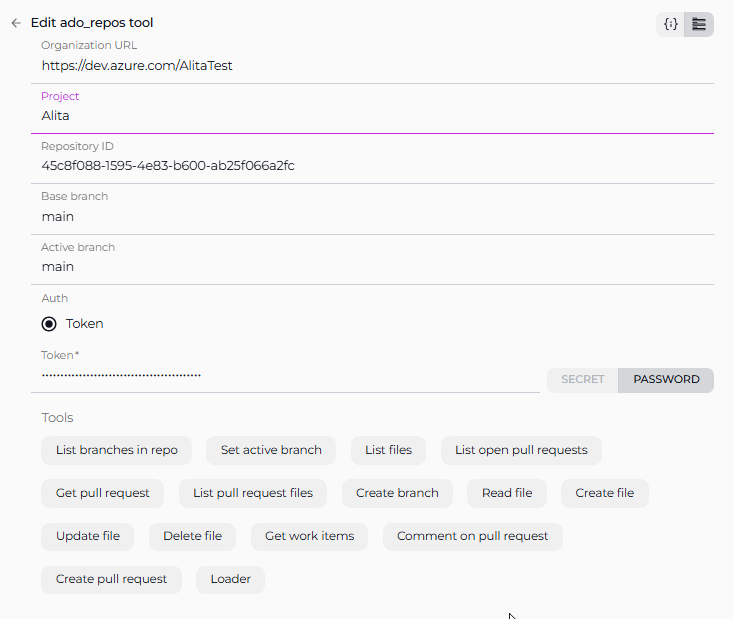

# ELITEA Toolkit Guide: Azure Repos (ADO Repos) Integration

## Introduction

### Purpose of this Guide

This guide is your definitive resource for integrating and effectively utilizing the **Azure Repos (ADO Repos) toolkit** within ELITEA. It provides a detailed, step-by-step walkthrough, from setting up your Azure DevOps Personal Access Token to configuring the toolkit in ELITEA and seamlessly incorporating it into your Agents. By following this guide, you will unlock the power of automated code management, streamlined Azure DevOps workflows, and enhanced team collaboration, all directly within the ELITEA platform. This integration empowers you to leverage AI-driven automation to optimize your software development lifecycle within the Azure DevOps ecosystem, harnessing the combined strengths of ELITEA and Azure Repos.

### Brief Overview of Azure Repos (ADO Repos)

Azure Repos, a core service within Azure DevOps, is a robust and scalable cloud-hosted platform for version control and collaborative code management. It provides development teams with the essential tools to manage their codebase efficiently and collaborate effectively throughout the software development lifecycle. Azure Repos offers a comprehensive set of features, including:

*   **Versatile Version Control:** Supports both Git, the industry-standard distributed version control system, and Team Foundation Version Control (TFVC), a centralized version control system, providing flexibility to accommodate diverse team preferences and project requirements.
*   **Enhanced Collaborative Development:** Facilitates seamless team-based software development with powerful collaboration features such as Pull Requests for code review, Branch Policies to enforce code quality and workflow standards, and Code Search for efficient code discovery and navigation.
*   **Seamless Azure DevOps Integration:** Integrates seamlessly with the broader Azure DevOps ecosystem, including Azure Pipelines for Continuous Integration and Continuous Delivery (CI/CD), Azure Boards for agile work item tracking and project management, and Azure Test Plans for comprehensive testing, creating a unified DevOps platform.
*   **Scalability and Reliability:** Built on the Azure cloud infrastructure, Azure Repos provides a highly scalable and reliable platform for managing code repositories of any size, from small projects to large enterprise-scale applications, ensuring code availability and data integrity.
*   **Advanced Security and Compliance:** Offers robust security features, including granular access control, branch permissions, and audit logging, along with compliance certifications, ensuring the security and compliance of your codebase and development processes.

Integrating Azure Repos with ELITEA brings these powerful version control and DevOps capabilities directly into your AI-driven workflows. Your ELITEA Agents can then intelligently interact with your Azure Repos repositories to automate code-related tasks, enhance Azure DevOps pipelines, improve team collaboration, and leverage AI to optimize your entire software development lifecycle within the Azure ecosystem.

## Toolkit's Account Setup and Configuration in Azure Repos

### Account Setup

If you do not yet have an Azure DevOps account and organization, please follow these steps to create one:

1.  **Visit Azure DevOps Website:** Open your web browser and navigate to the Azure DevOps website: [https://azure.devops.com/](https://dev.azure.com/).
2.  **Start Free or Sign In:** Click on the **"Start free"** button to create a new Azure DevOps organization, or click **"Sign in to Azure DevOps"** if you already have an organization and wish to sign in.
3.  **Create an Organization (If Needed):**
    *   If you are creating a new organization, click **"Create an Organization"** and follow the prompts to set up your new Azure DevOps organization. You will typically need to provide an organization name, choose a hosting region, and link it to an Azure account (if you have one).
    *   If you are signing into an existing organization, click **"Sign in to Azure DevOps"** and log in using your Microsoft account credentials.
4.  **Enter Account Details:** Provide the required details as prompted during the organization creation or sign-in process. This may include your email address, organization name, and region for hosting your Azure DevOps organization.
5.  **Email Verification (If Prompted):** Verify your email address if prompted by the Azure DevOps signup process. This usually involves clicking a confirmation link sent to your email inbox.
6.  **Log In to Azure DevOps:** Log in to the Azure DevOps dashboard using your newly created or existing Microsoft account credentials.
7.  **Enable Basic Subscription (If Needed):** Ensure that you have a **Basic Azure DevOps subscription** enabled for your account to access Azure Repos and related Azure DevOps services. For new organizations, the Basic subscription is typically enabled by default. For existing organizations, you may need to verify or enable it in the organization settings.
8.  **Add Users and Assign Basic Subscription (If Needed):** To grant access to other users within your organization, navigate to your organization settings:
    *   Go to `https://dev.azure.com/{YourOrganizationName}/_settings/users` (replace `{YourOrganizationName}` with your actual Azure DevOps organization name).
    *   Click **"Add users"**.
    *   Enter the user's email address or Microsoft account.
    *   Select **"Basic"** from the "Access level" dropdown to assign a Basic subscription to the user.
    *   Choose the relevant project(s) to grant the user access to.
    *   Click **"Add"** to add the user to your Azure DevOps organization.
9.  **Add User to Project Member Group (If Needed):** To ensure newly added users have the necessary permissions within a specific project:
    *   Navigate to **"Project settings"** for your desired project (located at the bottom left of the Azure DevOps interface).
    *   Select **"Groups"** under "Security" in the Project settings menu.
    *   Locate the **"Project Valid Users"** group (or a relevant group for your project's members) and click on the group name.
    *   Click on the **"Members"** tab within the group details.
    *   Click **"Add users or groups"**.
    *   Enter the email address or name of the user you want to add to the project member group and click **"Add"**.
10. **Verify Repo Access:** After completing user setup, refresh the Azure DevOps page and ensure that the **"Repos"** feature is enabled and visible for your account within your Azure DevOps project. This confirms that you have successfully set up your Azure DevOps account and have access to Azure Repos.

**Note:** If the "Repos" feature is not available, you may need to create a new project within your Azure DevOps organization or verify that Azure Repos is enabled for your organization and project.

### Token/API Key Generation: Creating a Personal Access Token in Azure DevOps

For secure integration with ELITEA, it is essential to use an Azure DevOps **Personal Access Token (PAT)**. This method is significantly more secure than using your primary Azure DevOps account password directly and allows you to precisely control the permissions granted to ELITEA.

**Follow these steps to generate a Personal Access Token (PAT) in Azure DevOps:**

1.  **Log in to Azure DevOps:** Access your Azure DevOps organization by navigating to `https://dev.azure.com/` and logging in with your credentials.
2.  **Access User Settings:** Click on the **User settings** icon, typically located in the top right corner of the Azure DevOps interface, next to your profile picture. From the dropdown menu, select **"Personal access tokens"**.
3.  **Generate New Token:** On the "Personal Access Tokens" page, click the **"+ New Token"** button to create a new PAT.
4.  **Configure Token Details:** In the "Create a new personal access token" panel, configure the following settings:
    *   **Name:** In the "Name" field, enter a descriptive label for your token. For example, use "ELITEA Integration Token" or "ELITEA Agent Access." This label will help you easily identify the purpose of this token in the future.
    *   **Organization (Optional):** Select the Azure DevOps organization for which this token will be valid. In most cases, you will select "All accessible organizations" to allow the token to access resources across your organizations.
    *   **Expiration (Recommended):** For enhanced security, it is highly recommended to set an **Expiration date** for your token. Choose a reasonable validity period that aligns with your security policies. Shorter expiration periods are generally more secure.
    *   **Scopes - Grant Least Privilege (Crucial for Security):** Carefully and deliberately select the **scopes** or permissions you grant to this token. **It is paramount to grant only the absolute minimum necessary permissions** required for your ELITEA Agent's intended interactions with Azure Repos. Overly permissive tokens pose a significant security risk. For typical ELITEA integration with Azure Repos, consider these minimal scopes:

        *   **Minimal Scopes for Common Use Cases:**
            *   **Custom Defined:** Select "Custom defined" to manually choose granular scopes.
            *   **Code:** Expand the "Code" section and select:
                *   **Read & write:** (Grants read and write access to code repositories. If possible, for enhanced security, consider using more granular code scopes instead of full "Read & write" if your agent only needs read access.)
                    *   **Read:** (If your agent only needs to read repository content and not modify it, select "Read" instead of "Read & write" for even tighter security.)
            *   **Work items:** Expand the "Work items" section and select:
                *   **Read:** (If your agent needs to read work item details, select "Read")
                *   **Write:** (If your agent needs to create or update work items, select "Write". Only include this if your Agent needs to manage work items.)

        *   **Additional Scopes for Specific Functionality (Grant only when needed):**
            *   **Build:** (If your Agent needs to interact with Azure Pipelines builds)
            *   **Release:** (If your Agent needs to interact with Azure Pipelines releases)
            *   **Test Management:** (If your Agent needs to interact with Azure Test Plans)

    **Important Security Best Practices:**

    *   **Principle of Least Privilege:** **Strictly adhere to the principle of least privilege.** Grant only the absolute minimum set of scopes necessary for your ELITEA Agent to perform its specific, intended tasks. Avoid granting broad or unnecessary permissions.
    *   **Avoid Full Access Scopes:** **Avoid granting full access scopes like "Full access" unless absolutely necessary and with a clear and thorough understanding of the significant security implications.** Full access scopes provide extensive administrative privileges and should be avoided for integration purposes whenever possible.
    *   **Regular Token Review and Rotation:** Implement a process for regularly reviewing the Personal Access Tokens you have generated, their associated scopes, and their usage. Rotate tokens periodically (generate new tokens and revoke older ones) as a proactive security measure, especially for integrations that handle sensitive data or critical operations.
    *   **Secure Storage:** Store the generated Personal Access Token securely, preferably using ELITEA's built-in Secrets Management feature, rather than hardcoding it directly in Agent configurations or less secure storage locations.

5.  **Create Token:** Click the **"Create"** button at the bottom of the panel to generate your Personal Access Token.
6.  **Securely Copy and Store the Token:** **Immediately copy the generated token** that is displayed in the "Success!" pop-up window. **This is the only time you will be able to view and copy the full token value.** Store it securely using a robust password manager or, ideally, ELITEA's built-in Secrets feature for enhanced security within the ELITEA platform. You will require this token to configure the Azure Repos toolkit within ELITEA.


## System Integration with ELITEA

### Agent Creation/Configuration

To integrate Azure Repos functionalities into your workflows, you will need to configure the Azure Repos toolkit within an ELITEA Agent. You can either create a new Agent specifically for Azure Repos interactions or modify an existing Agent to incorporate Azure Repos tools.

1.  **Navigate to Agents Menu:** In ELITEA, access the **Agents** menu from the main navigation panel.
2.  **Create or Edit Agent:**
    *   **Create a New Agent:** Click on the **"+ Agent"** button to initiate the creation of a new Agent. Follow the on-screen prompts to define essential Agent attributes such as Agent name, a descriptive Agent description, the desired Agent type, and initial instructions for the Agent.
    *   **Edit an Existing Agent:** Select the Agent you intend to integrate with Azure Repos from your list of Agents. Click on the Agent's name to open its configuration settings for editing.
3.  **Access Tools Section:** Within the Agent configuration interface, scroll down until you locate the **"Tools"** section. This section is where you will add and configure toolkits, including the Azure Repos toolkit.

### Toolkit Configuration

This section provides detailed instructions on how to configure the Azure Repos toolkit within your ELITEA Agent.

1.  **Add Toolkit:** In the "Tools" section of the Agent configuration, click on the **"+" icon**. This action will display a dropdown list of available toolkits that can be integrated with your Agent.
2.  **Select Azure Repos (ADO Repos) Toolkit:** From the dropdown list of available toolkits, choose **"Azure Repos (ADO Repos)"**. Selecting "Azure Repos (ADO Repos)" will open the "New Azure Repos (ADO Repo) tool" configuration panel, where you will specify the settings for your Azure Repos integration.
3.  **Configure Azure Repos (ADO Repos) Toolkit Settings:** Carefully fill in the following configuration fields within the "New Azure Repos (ADO Repo) tool" section:

    *   **Organization URL:** Enter the base URL of your Azure DevOps organization. **It is crucial to use the correct format**, including your organization name: `https://dev.azure.com/{YourOrganizationName}` (Replace `{YourOrganizationName}` with your actual Azure DevOps organization name).
    *   **Personal Access Token:** In the "Personal Access Token" field, paste the **Personal Access Token** that you generated in Azure DevOps during the "Software-Specific Setup" section of this guide.
        *   **Enhanced Security with Secrets (Recommended):** For enhanced security, it is strongly recommended to use ELITEA's **Secrets Management** feature to store your Azure DevOps Personal Access Token securely. Instead of directly pasting the token into the "Personal Access Token" field, select the **"Secret"** option and choose the pre-configured secret containing your Azure DevOps token from the dropdown list. This prevents hardcoding sensitive credentials in your toolkit configuration.
    *   **Organization Name:** Enter your Azure DevOps **Organization Name**. This is the name you used when creating your Azure DevOps organization (e.g., `AlitaTest` in `https://dev.azure.com/AlitaTest/`).
    *   **Project Name:** Enter the **Project Name** within your Azure DevOps organization that contains the repository you want to access (e.g., `MyProject`).
    *   **Repository ID:**  This field requires the **Repository ID**, which is a unique identifier for your Azure Repos repository. To obtain the Repository ID, you need to run a `curl` command as described below:

        **Steps to Obtain Repository ID:**

        1.  **Open a Terminal or Command Prompt:** Open your command-line interface on your local machine.
        2.  **Execute the `curl` Command:**  Run the following `curl` command, replacing `{PAT}`, `{organization}`, and `{project}` with your actual values:

            ```bash
            curl -u {PAT}:  https://dev.azure.com/{organization}/{project}/_apis/git/repositories?api-version=7.1-preview.1
            ```

            *   **`{PAT}`:** Replace this with your **Personal Access Token** that you generated in Azure DevOps.
            *   **`{organization}`:** Replace this with your Azure DevOps **Organization Name** (e.g., `AlitaTest`).
            *   **`{project}`:** Replace this with your Azure DevOps **Project Name** (e.g., `MyProject`).

            **Example Command:**

            ```bash
            curl -u your_personal_access_token:  https://dev.azure.com/AlitaTest/MyProject/_apis/git/repositories?api-version=7.1-preview.1
            ```

        3.  **Extract Repository ID from Output:** After executing the `curl` command, you will receive a JSON response in your terminal. Look for the `Repository ID` within the JSON output. It will be a GUID (Globally Unique Identifier) string, typically found within the `"value"` array, for example: `"id": "xxxxxxxx-xxxx-xxxx-xxxx-xxxxxxxxxxxx"`.
        4.  **Copy and Paste Repository ID:** Copy the **Repository ID** value from the JSON output and paste it into the **"Repository ID"** field in the ELITEA toolkit configuration.

    
4.  **Enable Desired Tools:** In the "Tools" section within the Azure Repos toolkit configuration panel, **select the checkboxes next to the specific Azure Repos tools** that you want to enable for your Agent. **It is crucial to enable only the tools that your Agent will actually need to use** to adhere to the principle of least privilege and minimize potential security risks. Available tools include:
    *   **List branches** - Allows the Agent to list branches in the repository.
    *   **Set active branch** - Enables the Agent to set a specific branch as active for subsequent operations.
    *   **Create Branch** - Enables the Agent to create new branches in the repository.
    *   **Get pull request** - Enables the Agent to retrieve details of a specific pull request.
    *   **List pull request files** - Allows the Agent to list files changed in a pull request.
    *   **Comment Pull Request** - Allows the Agent to add comments to pull requests.
    *   **Create Pull Request** - Enables the Agent to create new pull requests.
    *   **List files** - Allows the Agent to list files within the repository.
    *   **Read File** - Allows the Agent to read the content of files within the repository.
    *   **Create File** - Enables the Agent to create new files within the repository.
    *   **Update File** - Allows the Agent to update the content of existing files within the repository.
    *   **Delete File** - Allows the Agent to delete files from the repository.
    *   **Get Work Items** - Allows the Agent to retrieve lists of work items (issues).
    *   **Loader** - Allows the agent to retrieve data from repo.

5.  **Complete Setup:** After configuring all the necessary settings and enabling the desired tools, click the **arrow icon** (located at the top right of the toolkit configuration section) to finalize the Azure Repos toolkit setup and return to the main Agent configuration menu.
6.  Click **Save** in the Agent configuration to save all changes and activate the Azure Repos toolkit integration for your Agent.



### Tool Overview: Azure Repos (ADO Repos) Toolkit Functionalities

Once the Azure Repos toolkit is successfully configured and added to your Agent, you can utilize the following tools within your Agent's instructions to enable intelligent interaction with your Azure DevOps repositories:

*   **List Branches:**  **Tool Name:** `list_branches`
    *   **Functionality:** Retrieves a list of all branches available in the specified Azure Repos repository.
    *   **Purpose:** Enables Agents to fetch branch lists for branch management tasks, reporting, or to provide users with branch options within ELITEA workflows.

*   **Set Active Branch:** **Tool Name:** `set_active_branch`
    *   **Functionality:** Sets a specific branch as the active branch in the specified Azure Repos repository for subsequent operations.
    *   **Purpose:** Allows Agents to switch the active branch for file operations or pull request creation within your ELITEA Agent workflows, ensuring actions are performed in the correct branch context.

*   **List Files:** **Tool Name:** `list_files`
    *   **Functionality:** Retrieves a list of files in the active branch of the specified Azure Repos repository.
    *   **Purpose:** Allows Agents to browse repository contents, provide users with file lists for navigation, or analyze file structures within ELITEA workflows.

*   **Get Pull Request:** **Tool Name:** `get_pull_request`
    *   **Functionality:** Retrieves detailed information about a specific pull request from an Azure Repos repository.
    *   **Purpose:** Enable Agents to fetch PR details for code review assistance, providing context on specific pull requests, or incorporating PR information into ELITEA workflows.

*   **List Pull Request Files:** **Tool Name:** `list_pull_request_files`
    *   **Functionality:** Retrieves a list of files changed in a specific pull request from an Azure Repos repository.
    *   **Purpose:** Allow Agents to provide summaries of files changed in a PR, facilitate code review by listing modified files, or analyze the scope of code changes within ELITEA.

*   **Create Branch:**  **Tool Name:** `create_branch`
    *   **Functionality:** Creates a new branch in the specified Azure Repos repository.
    *   **Purpose:** Automate the creation of new branches for feature development, bug fixes, or experimental code changes directly from ELITEA.

*   **Read File:**  **Tool Name:** `read_file`
    *   **Functionality:** Reads the content of a file from the specified Azure Repos repository.
    *   **Purpose:** Retrieve code snippets, configuration files, or documentation content from your repository to provide context or data to your ELITEA Agent or to users within ELITEA conversations.

*   **Create File:**  **Tool Name:** `create_file`
    *   **Functionality:** Creates a new file in the specified Azure Repos repository.
    *   **Purpose:** Automate the creation of new code files, documentation files, or configuration files within your repository directly from ELITEA workflows.

*   **Update File:**  **Tool Name:** `update_file`
    *   **Functionality:** Updates the content of a specific file in an Azure Repos repository.
    *   **Purpose:** Automate updating code files, documentation, or configuration files within your repository based on ELITEA workflow outputs or user requests.

*   **Delete File:**  **Tool Name:** `delete_file`
    *   **Functionality:** Deletes a specific file from an Azure Repos repository.
    *   **Purpose:** Automate file deletion tasks within your repository, such as removing obsolete files or cleaning up temporary files generated by ELITEA workflows.

*   **Comment Pull Request:** **Tool Name:** `comment_pull_request`
    *   **Functionality:** Adds a comment to a specific pull request in an Azure Repos repository or to a specific line of a pull request.
    *   **Purpose:** Automate adding comments to Azure Repos pull requests directly from ELITEA, facilitating communication, updates, and feedback within code review workflows.

*   **Create Pull Request:**  **Tool Name:** `create_pull_request`
    *   **Functionality:** Creates a new pull request in the specified Azure Repos repository.
    *   **Purpose:** Automate pull request creation for code contributions, feature branches, or bug fixes directly from ELITEA, streamlining the code review and merging process.

*   **Get Work Items:** **Tool Name:** `get_work_items`
    *   **Functionality:** Retrieves a list of work items (issues) from the specified Azure DevOps project.
    *   **Purpose:** Allow Agents to fetch work item lists for task prioritization, reporting, or to provide users with issue summaries within ELITEA workflows.

*   **Loader:** **Tool Name:** `loader`
    *   **Functionality:** Generates file content from a branch, respecting whitelist and blacklist patterns.
    *   **Purpose:** Allows Agents to list and fetch content from files in a specified branch, filtered by whitelist and blacklist patterns, to facilitate tasks like code analysis, reporting, or content extraction within ELITEA workflows.

## Instructions and Prompts for Using the Toolkit

To effectively utilize the Azure Repos toolkit within your ELITEA Agents, you need to provide clear instructions within the Agent's "Instructions" field, telling the Agent *how* and *when* to use these tools.

### Instruction Creation for OpenAI Agents

When creating instructions for the Azure Repos toolkit for OpenAI-based Agents, focus on clear, action-oriented language. Break down tasks into simple steps and explicitly state the parameters required for each tool.  OpenAI Agents respond best to instructions that are:

*   **Direct and Imperative:** Use action verbs and clear commands (e.g., "Use the 'read_file' tool...", "Create a branch named...").
*   **Parameter-Focused:** Clearly list each parameter and how the Agent should determine its value.
*   **Context-Aware:** Provide enough context so the Agent understands the overall goal and when to use specific tools within a workflow.

When instructing your Agent to use a Azure Repos toolkit, use this pattern:
Use code with caution.
Markdown
Identify the goal: [State the objective, e.g., "To read the content of a file"].

Tool Selection: Use the "[tool_name]" tool.

Parameter Specification: Provide the following parameters:

Parameter Name 1: <value or description of value>

Parameter Name 2: <value or description of value>

...

Expected Outcome: [Optionally, describe what should happen after the tool is used].

**Example Agent Instructions for Azure Repos Toolkit Tools (OpenAI Agent Friendly):**

*   **Agent Instructions for Updating a File:**

    ```
    1. Goal: To update the content of the 'config.json' file in the 'settings' branch.
    2. Tool: Use the "update_file" tool.
    3. Parameters:
        - Repository Name: "your-azure-devops-organization/your-repository-name"
        - File Path: "config.json"
        - Branch Name: "settings"
        - New Content: "Provide the new JSON configuration content here. For example: {\"setting\": \"new_value\"}"
    4. Outcome: The 'config.json' file in the 'settings' branch will be updated with the new content.
    ```

*   **Agent Instructions for Creating a New Branch:**

    ```
    1. Goal: To create a new feature branch for user authentication.
    2. Tool: Use the "create_branch" tool.
    3. Parameters:
        - Repository Name: "your-azure-devops-organization/your-repository-name"
        - New Branch Name: "feature-user-auth"
        - Base Branch: "main"
    4. Outcome: A new branch named 'feature-user-auth' will be created based on the 'main' branch.
    ```

*   **Agent Instructions for Listing Branches in a Repository:**

    ```
    1. Goal: To get a list of all branches in the repository to understand the current project structure.
    2. Tool: Use the "list_branches" tool.
    3. Parameters:
        - Repository Name: "your-azure-devops-organization/your-repository-name"
    4. Outcome: The Agent will provide a list of all branches in the repository.
    ```

*   **Agent Instructions for Reading a File from a Repository:**

    ```
    1. Goal: To read the content of the 'README.md' file to understand the project's overview.
    2. Tool: Use the "read_file" tool.
    3. Parameters:
        - Repository Name: "your-azure-devops-organization/your-repository-name"
        - File Path: "README.md"
        - Branch Name: "main"
    4. Outcome: The Agent will provide the content of the 'README.md' file from the 'main' branch.
    ```

### Conversation Starters

Use these conversation starters to interact with your Azure Repos-integrated Agent.

**1. For Testing and Troubleshooting Connection:**

These starters are designed to verify if the Azure Repos toolkit is correctly configured and connected to your Azure Repos repository.

*   "List branches in the repository." - *This tests basic connectivity and read permissions.*
*   "Read the file 'README.md' from the main branch." - *This further tests read permissions and file access.*
*   "Create a new branch named 'test-connection' based on main." - *This tests write permissions (if enabled) and branch creation functionality. Remember to delete the test branch afterwards.*
*   "List open pull requests." - *Tests the ability to retrieve pull request data, verifying permissions for PR access.*
*   "Get work items." - *Tests the ability to retrieve work item data, verifying permissions for issue access.*

**2. For General Agent Usage Scenarios & Workflow Initiation:**

These conversation starters demonstrate how to initiate agent execution for common, practical Azure Repos-related tasks and workflows. They represent typical user requests and showcase the agent's ability to perform useful actions within Azure Repos.

*   "I need to update the documentation file 'user_guide.md' with details about the new API endpoints. Can you help me update it in Azure Repos?" - *This could trigger a workflow involving `read_file` to get the current documentation content, potentially some content modification steps, and then `update_file` to save the updated documentation back to the repository.*
*   "Create a pull request to merge my 'feature-x' branch into 'develop' for code review and integration." - *This directly initiates the `create_pull_request` tool to automate the pull request creation process.*
*   "What are the currently open feature branches in the repository that need code review?" - *This would utilize the `list_branches` tool (potentially combined with pull request data) to provide a project status overview, specifically focusing on feature branches awaiting review.*
*   "I need to add a new configuration file 'deploy.config' to the 'config' directory in the main branch with these settings: [provide configuration settings here]. Can you create this file for me?" - *This would use the `create_file` tool to automate the creation of a new configuration file with user-specified content in the designated repository location.*
*   "Get me a list of all open work items assigned to me." - *This would use the `get_work_items` tool to retrieve and summarize assigned work items for task management.*

## Use Cases

The Azure Repos toolkit unlocks a vast array of automation possibilities for your software development workflows within ELITEA. Here are compelling use cases, demonstrating how each tool can be effectively applied to streamline development processes and enhance productivity:

*   **Automated Feature Branching:**
    *   **Scenario:** When a new feature is planned, the Agent can automatically create a dedicated feature branch in Azure Repos.
    *   **Tools Used:** `create_branch`
    *   **Example Instruction:** "Use the 'create_branch' tool to create a new branch named 'feature-branch-name' based on the 'main' branch."
    *   **Benefit:** Streamlines branch management, ensures organized feature development.

*   **Contextual Code Retrieval for Support:**
    *   **Scenario:** During a support conversation, an Agent can retrieve relevant code snippets from Azure Repos to provide context or examples to the user.
    *   **Tools Used:** `read_file`
    *   **Example Instruction:** "Use the 'read_file' tool to read the content of the file 'src/components/UserComponent.js' from the 'main' branch and show it to the user."
    *   **Benefit:** Enhances support interactions with direct access to codebase information.

*   **Automated Documentation Updates:**
    *   **Scenario:** When code changes are made, the Agent can automatically update related documentation files in the repository.
    *   **Tools Used:** `read_file`, `update_file`
    *   **Example Instruction:** "Use the 'read_file' tool to get the current content of 'docs/api.md'. Update it with the new API changes and use 'update_file' to save the updated content back to 'docs/api.md' in the 'main' branch."
    *   **Benefit:** Keeps documentation synchronized with the latest codebase, reducing manual effort and errors.

*   **Pull Request Automation for Code Review:**
    *   **Scenario:** After a developer completes a task, the Agent can automatically create a pull request for code review.
    *   **Tools Used:** `create_pull_request`
    *   **Example Instruction:** "Use the 'create_pull_request' tool to create a pull request from branch 'feature-branch-name' to 'develop' branch with the title 'Feature Branch Review' and description 'Please review the changes for the new feature.'"
    *   **Benefit:** Automates the pull request process, facilitating timely code reviews and improving code quality.

*   **Listing Branches for Project Overview:**
    *   **Scenario:** A project manager wants a quick overview of all active branches in the repository.
    *   **Tools Used:** `list_branches_in_repo`
    *   **Example Instruction:** "Use the 'list_branches_in_repo' tool to list all branches in the repository and present them to the user."
    *   **Benefit:** Provides easy access to branch information for project management and monitoring.

*   **Setting Active Branch for Focused Operations:**
    *   **Scenario:** Before performing a series of file operations, ensure the Agent is working on the correct branch.
    *   **Tools Used:** `set_active_branch`
    *   **Example Instruction:** "First, use 'set_active_branch' to set the active branch to 'develop'. Then, use 'read_file' to read 'config.json' from the active branch."
    *   **Benefit:** Ensures operations are performed in the intended branch context, reducing errors and improving workflow reliability.

*   **Automated Work Item Status Updates:**
    *   **Scenario:** Automatically update the status of an Azure DevOps work item (issue) to "Resolved" when a linked code change (e.g., pull request merge) is completed in ELITEA, reflecting the issue resolution in the Azure Boards tracking system.
    *   **Tools Used:** `set_issue_status`
    *   **Example Instruction:** "Use the 'set_issue_status' tool to update issue number [issue_number]. Set the issue status to 'Resolved'."
    *   **Benefit:** Automates work item lifecycle management, ensuring work item statuses are always synchronized with the actual development progress. Reduces manual status updates, improves issue tracking accuracy, and provides a clear audit trail of issue resolution.

*   **Retrieving Work Item Details for Context:**
    *   **Scenario:** During a task discussion or troubleshooting session, provide users with quick access to detailed information about a specific Azure DevOps work item to understand the task context and status.
    *   **Tools Used:** `get_issue`
    *   **Example Instruction:** "Use the 'get_issue' tool to get details for work item number [issue_number]. Summarize the work item title, description, and status for the user."
    *   **Benefit:** Provides users with quick, contextual access to detailed work item information directly within ELITEA, improving understanding, facilitating faster problem-solving, and enhancing communication around specific tasks.

*   **Automated Work Item Commenting for Updates:**
    *   **Scenario:** Allow ELITEA Agents to automatically add comments to Azure DevOps work items to provide status updates, request information, or log actions taken within ELITEA workflows, keeping work item discussions current.
    *   **Tools Used:** `add_comments`
    *   **Example Instruction:** "Use the 'add_comments' tool to add a comment to work item number [issue_number] with the text '[comment_text]'."
    *   **Benefit:** Streamlines communication within work item tracking, enabling automated updates and feedback directly within Azure DevOps work items. Keeps all stakeholders informed, reduces manual communication overhead, and centralizes work item-related discussions.

## Troubleshooting and Support

### Troubleshooting Common Issues

*   **Connection Errors:**
    *   **Problem:** ELITEA Agent fails to connect to Azure Repos, resulting in errors during toolkit execution.
    *   **Troubleshooting Steps:**
        1.  **Verify Azure DevOps URL:** Double-check that the **Azure DevOps URL** field in the toolkit configuration is correctly set to your Azure DevOps organization URL (e.g., `https://dev.azure.com/YourOrganizationName`). Ensure it includes `https://dev.azure.com/` and your organization name.
        2.  **Check Personal Access Token:** Ensure that the **Personal Access Token** you provided is correct, has not expired, and is valid for your Azure DevOps account and project. Carefully re-enter or copy-paste the token to rule out typos.
        3.  **Verify Token Scopes:** Review the **scopes/permissions** granted to your Azure DevOps Personal Access Token in Azure DevOps. Ensure it has the necessary scopes (e.g., `vso.code_full`, `vso.work_full`) for the specific Azure Repos tools your Agent is trying to use. Insufficient scopes are a common cause of connection and permission errors.
        4.  **Network Connectivity:** Confirm that both your ELITEA environment and the Azure DevOps instance are connected to the internet and that there are no network connectivity issues, firewalls, or proxies blocking the integration. Test network connectivity to `dev.azure.com` from your ELITEA environment if possible.

*   **Authorization Errors (Permission Denied/Unauthorized):**
    *   **Problem:** Agent execution fails with "Permission Denied" or "Unauthorized" errors when trying to access or modify Azure Repos resources.
    *   **Troubleshooting Steps:**
        1.  **Re-verify Token Scopes:** Double-check the **scopes/permissions** granted to your Azure DevOps Personal Access Token with extreme care. Ensure it grants sufficient access for the specific Azure Repos actions your Agent is trying to perform. For example, creating files or pull requests requires scopes that grant write access (`vso.code_full` scope).
        2.  **Project and Repository Access Permissions:** Confirm that the Azure DevOps account associated with the Personal Access Token has the necessary access permissions to the specified project and repository within Azure DevOps. Verify that the account is a member of the project and has the necessary roles and permissions (e.g., Contributor or Project Administrator role for write access). Check project settings in Azure DevOps to confirm access levels.
        3.  **Token Revocation or Expiration:** Ensure that the Personal Access Token has not been accidentally revoked in Azure DevOps settings or that it has not reached its expiration date if you set one. Generate a new token as a test if unsure.

*   **Incorrect Repository or Branch Names:**
    *   **Problem:** Agent tools fail to operate on the intended repository or branch, often resulting in "Repository not found" or "Branch not found" errors.
    *   **Troubleshooting Steps:**
        1.  **Double-Check Repository Name:** Carefully and meticulously verify that you have entered the correct Azure Repos Repository name in the toolkit configuration within ELITEA. Pay close attention to capitalization, spelling, and the `repository_name`.
        2.  **Verify Branch Name Spelling and Case:** Ensure that you are using the correct branch name (e.g., `main`, `develop`, `feature-branch`) in your Agent's instructions when specifying branch-related parameters for Azure Repos tools. Branch names in Git are case-sensitive. Double-check the spelling and capitalization of branch names against your repository in Azure DevOps.
        3.  **Branch Existence:** Confirm that the specified branch actually exists in your Azure Repos repository. It's possible the branch name is correct but the branch was deleted or renamed.

*   **Invalid Repository ID:**
    *   **Problem:** Agent execution fails because of an invalid or incorrect Repository ID in the toolkit configuration.
    *   **Troubleshooting Steps:**
        1.  **Re-obtain Repository ID:** Double-check that you have correctly obtained the **Repository ID** using the `curl` command as described in the "Integration Steps" section of this guide. Follow the steps precisely to ensure you retrieve the correct ID.
        2.  **Verify Repository ID Value:** Carefully verify that you have pasted the correct Repository ID into the **"Repository ID"** field in the ELITEA toolkit configuration. Ensure there are no typos, missing characters, or extra spaces in the Repository ID field. Copy and paste the ID again to rule out transcription errors.

### FAQs

1.  **Q: Can I use my regular Azure DevOps password directly for the ELITEA integration instead of a Personal Access Token?**
    *   **A:** **No, using an Azure DevOps Personal Access Token is mandatory and strongly recommended for security.** Direct password authentication is not supported for ELITEA's Azure Repos toolkit integration. Personal Access Tokens provide a significantly more secure and controlled method for granting access to external applications like ELITEA, without exposing your primary account credentials.

2.  **Q: What scopes/permissions are absolutely necessary and minimally sufficient for the Azure DevOps Personal Access Token to work with ELITEA?**
    *   **A:** The minimum required scopes depend on the specific Azure Repos tools your ELITEA Agent will be using. For basic read-only access to repositories (e.g., using `read_file`, `list_files`), the `vso.code_read` scope might suffice. However, for most common integration scenarios involving modifications (e.g., `create_file`, `update_file`, `create_pull_request`), you will need the `vso.code_full` scope. For work item (issue) management, include `vso.work_full` scope. **Always adhere to the principle of least privilege and grant only the scopes that are strictly necessary for your Agent's tasks.** Refer to the Azure DevOps documentation for detailed scope descriptions.

3.  **Q: What is the correct format for specifying the Azure DevOps Organization URL in the ELITEA toolkit configuration?**
    *   **A:**  The Azure DevOps Organization URL must be entered in the format `https://dev.azure.com/{YourOrganizationName}`. Replace `{YourOrganizationName}` with your actual Azure DevOps organization name. Ensure you include `https://dev.azure.com/` and your organization name.

4.  **Q: How do I find the Repository ID for my Azure Repos repository?**
    *   **A:**  You need to use the `curl` command provided in the "Integration Steps" section of this guide to retrieve the Repository ID from the Azure DevOps API. Follow the detailed steps in section 3.2 "Integration Steps: Configuring the Azure Repos (ADO Repo) Toolkit in ELITEA" to correctly obtain the Repository ID. Pay close attention to replacing the placeholders with your actual PAT, organization name, and project name in the `curl` command.

5.  **Q: Why am I consistently getting "Permission Denied" errors, even though I think I have configured everything correctly and granted the right permissions?**
    *   **A:** If you are still facing "Permission Denied" errors despite careful configuration, systematically re-examine the following:
        *   **Token Scope Accuracy:** Double and triple-check the **scopes/permissions** granted to your Azure DevOps Personal Access Token in your Azure DevOps user settings. Ensure that the token possesses the *exact* scopes required for *each* Azure Repos tool your Agent is attempting to use. Pay close attention to write vs. read permissions and ensure you have granted sufficient scopes.
        *   **Project and Repository Access Verification:** Explicitly verify that the Azure DevOps account associated with the Personal Access Token has the necessary access rights to the *specific target project and repository* within Azure DevOps itself. Confirm project membership, assigned roles, and repository permissions within the Azure DevOps project settings.
        *   **Token Validity and Revocation:** Double-check that the Personal Access Token is still valid, has not expired, and has not been accidentally revoked in your Azure DevOps settings. Generate a new token as a test if unsure.
        *   **Typographical Errors:** Carefully review all configuration fields in ELITEA, especially the Azure DevOps URL, Organization Name, Project Name, Repository ID, and the Personal Access Token itself for any hidden typographical errors or accidental whitespace.

If, after meticulously checking all of these points, you still encounter "Permission Denied" errors, please reach out to ELITEA Support with detailed information for further assistance.


### Support and Contact Information

If you encounter any issues, have questions, or require further assistance beyond what is covered in this guide regarding the Azure Repos integration or ELITEA Agents in general, please do not hesitate to contact our dedicated ELITEA Support Team. We are here to help you resolve any problems quickly and efficiently and ensure you have a smooth and productive experience with ELITEA.

**How to Reach ELITEA Support:**

*   **Email:**  **[SupportAlita@epam.com](mailto:SupportAlita@epam.com)**

**Best Practices for Effective Support Requests:**

To help us understand and resolve your issue as quickly as possible, please ensure you provide the following information in your support email:

*   **ELITEA Environment:** Clearly specify the ELITEA environment you are using (e.g., "Nexus," "Alita Lab," "EYE").
*   **Project Details:**  Indicate the **Project Name** and whether you are working in your **Private** workspace or a **Team** project.
*   **Detailed Issue Description:** Provide a clear, concise, and detailed description of the problem you are encountering. Explain what you were trying to do, what you expected to happen, and what actually occurred.
*   **Relevant Configuration Information:**  To help us diagnose the issue, please include relevant configuration details, such as:
    *   **Agent Instructions (Screenshot or Text):** If the issue is with an Agent, provide a screenshot or copy the text of your Agent's "Instructions" field.
    *   **Toolkit Configurations (Screenshots):** If the issue involves the Azure Repos toolkit or other toolkits, include screenshots of the toolkit configuration settings within your Agent.
*   **Error Messages (Full Error Text):** If you are encountering an error message, please provide the **complete error text**. In the Chat window, expand the error details and copy the full error message. This detailed error information is crucial for diagnosis.
*   **Your Query/Prompt (Exact Text):** If the issue is related to Agent execution, provide the exact query or prompt you used to trigger the issue.

**Before Contacting Support:**

We encourage you to first explore the resources available within this guide and the broader ELITEA documentation. You may find answers to common questions or solutions to known issues in the documentation.

## Useful Links

To further enhance your understanding and skills in integrating Azure Repos (ADO Repos) with ELITEA, here are some helpful resources:

*   **[Azure DevOps Website](https://dev.azure.com/)**: Access the main Azure DevOps platform to create an account or sign in.
*   **[Azure DevOps Organization URL Example](https://dev.azure.com/{YourOrganizationName})**: Example URL to understand the structure of Azure DevOps Organization URLs.
*   **[ELITEA Secrets Management](../../menus/settings/secrets.md)**: Learn how to securely store your Azure DevOps Personal Access Token using ELITEA's Secrets management feature for enhanced security.
*   **[ELITEA Agents Configuration](../../menus/agents.md)**:  Find out more about creating and configuring Agents in ELITEA, where you integrate the Azure Repos toolkit to automate your workflows.
*   **[ELITEA Support Email](mailto:SupportAlita@epam.com)**: Contact the ELITEA support team for direct assistance with Azure Repos integration or any other questions and issues you may encounter.