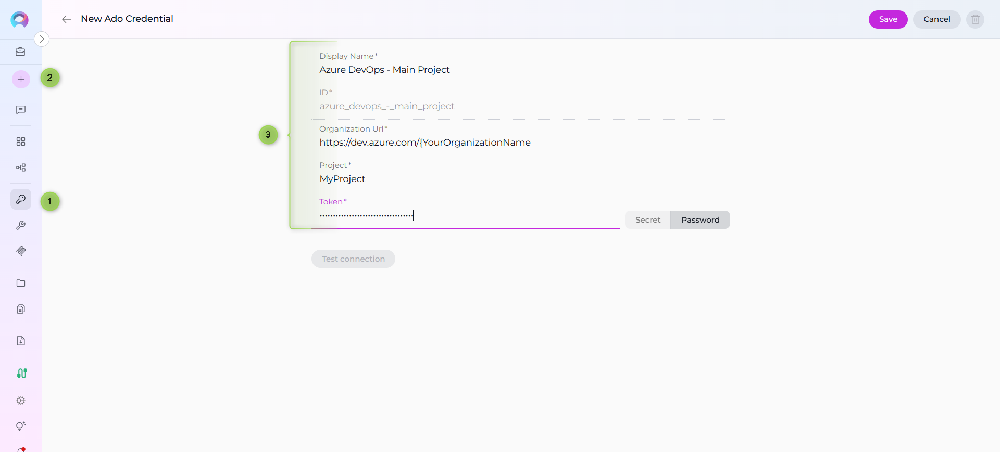
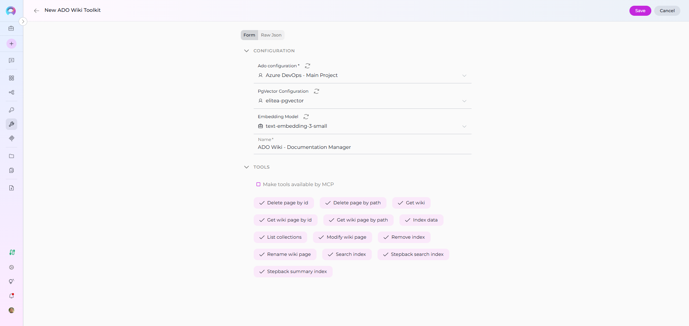
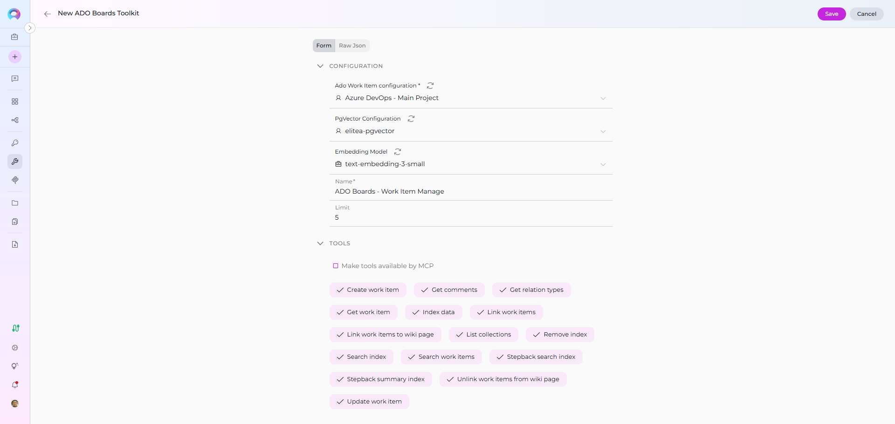
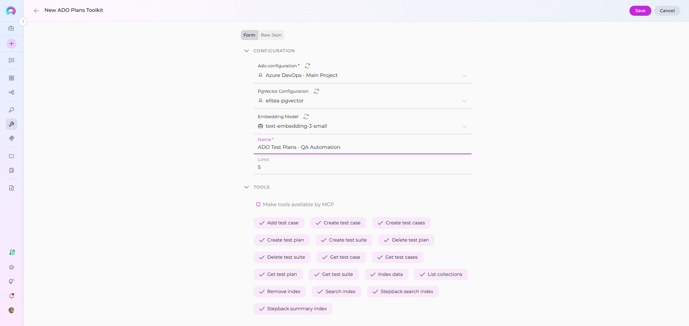
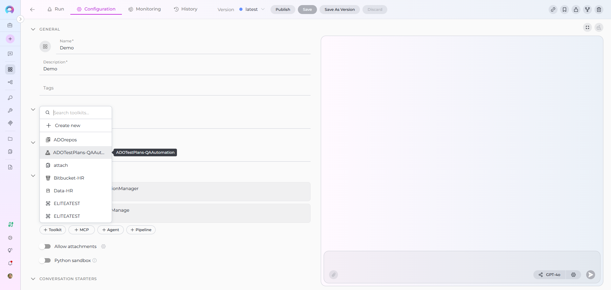
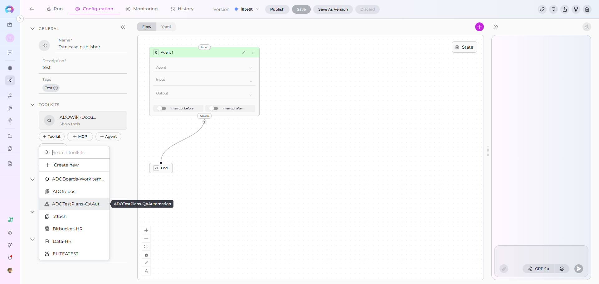
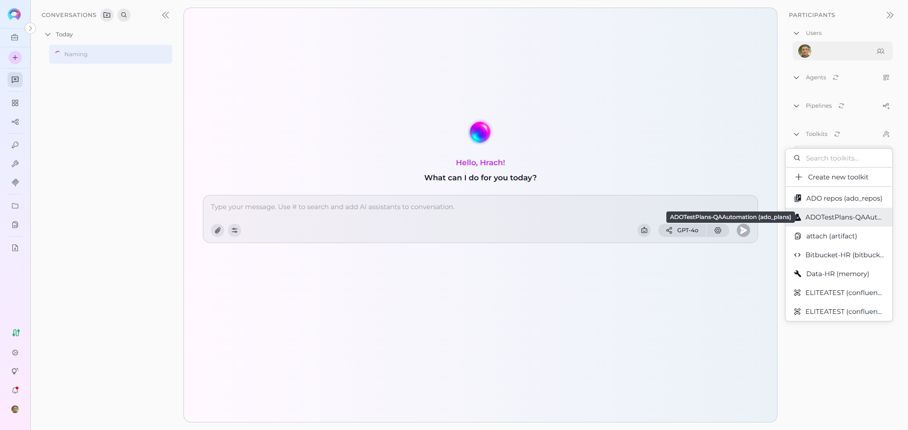

# ELITEA Toolkit Guide: Azure DevOps Wiki, Boards, and Plans Integration

## Introduction

### Purpose of the Guide

This guide is your comprehensive resource for integrating and utilizing the **Azure DevOps (ADO) Wiki, Boards, and Plans toolkits** within ELITEA. It provides detailed, step-by-step instructions, from setting up your Azure DevOps Personal Access Token to configuring these toolkits in ELITEA and seamlessly incorporating them into your Agents. By following this guide, you will unlock the power of automated knowledge management, streamlined project planning, and enhanced workflow automation within Azure DevOps, all directly from the ELITEA platform. This integration empowers you to leverage AI-driven automation to optimize your DevOps processes, enhance team collaboration, and improve overall project visibility within the Azure DevOps ecosystem.

### Brief Overview of Azure DevOps (ADO) Services for Wiki, Boards, and Plans

ELITEA's integration with Azure DevOps focuses on empowering users to leverage key Azure DevOps services for enhanced project management, knowledge sharing, and workflow automation. This guide specifically covers integration with:

*   **Azure Wiki (ADO Wiki):** A collaborative, team-based wiki service within Azure DevOps that allows teams to create, share, and manage project documentation, knowledge bases, release notes, meeting minutes, and other essential project information directly within Azure DevOps. Azure Wiki promotes knowledge sharing and collaboration by providing a central, version-controlled repository for project documentation.
*   **Azure Boards (ADO Boards):** A powerful work tracking and project management service within Azure DevOps that enables teams to plan, organize, track, and manage project tasks, user stories, bugs, features, and epics. Azure Boards provides agile planning tools, customizable dashboards, and workflow automation capabilities to streamline project execution and improve team collaboration.
*   **Azure Test Plans (ADO Test Plans):** A comprehensive test management solution within Azure DevOps that provides tools for planning, executing, and tracking software testing efforts. Azure Test Plans enables teams to define test plans, create test suites, author test cases, execute manual and automated tests, and track test results, ensuring software quality and release readiness.

ELITEA's integration with ADO Wiki, Boards, and Plans allows you to bring these powerful Azure DevOps services directly into your AI-driven workflows, enabling agents to:

*   **Centralize Project Information Access:** Retrieve and utilize up-to-date information directly from ADO Wiki pages, Boards work items, and Test Plans within ELITEA Agents, providing a unified view of project knowledge and status.
*   **Automate Key DevOps Tasks:** Automate routine and time-consuming DevOps tasks such as creating and updating wiki pages, managing work items in Boards (creating, updating, searching), and interacting with Test Plans (creating test plans, suites, cases, retrieving test details), freeing up valuable team time for more strategic activities.
*   **Enhance Collaboration and Communication:** Streamline team collaboration and communication by enabling agents to automatically update work item statuses, add comments to work items and pull requests, and generate reports based on data from Azure DevOps services, ensuring all stakeholders are informed and aligned.
*   **Improve Project Visibility and Reporting:** Generate insightful reports and extract key metrics from Azure DevOps data using ELITEA Agents, providing data-driven visibility into project status, progress, testing efforts, and overall project health, enabling better decision-making and proactive project management.

## Toolkit's Account Setup and Configuration

### Account Creation and Access

### Account Setup

If you do not yet have an Azure DevOps account and organization, please follow these steps to create one, ensuring you have access to Azure DevOps Wiki, Boards, and Plans services:

1.  **Visit Azure DevOps Website:** Open your web browser and navigate to the Azure DevOps website: [https://azure.devops.com/](https://dev.azure.com/).
2.  **Start Free or Sign In:** Click on the **"Start free"** button to create a new Azure DevOps organization, or click **"Sign in to Azure DevOps"** if you already have an organization and wish to sign in.
3.  **Create an Organization (If Needed):**
    *   If you are creating a new organization, click **"Create an Organization"** and follow the prompts to set up your new Azure DevOps organization. You will typically need to provide an organization name, choose a hosting region, and link it to an Azure account (if you have one).
    *   If you are signing into an existing organization, click **"Sign in to Azure DevOps"** and log in using your Microsoft account credentials.
4.  **Enter Account Details:** Provide the required details as prompted during the organization creation or sign-in process. This may include your email address, organization name, and region for hosting your Azure DevOps organization.
5.  **Email Verification (If Prompted):** Verify your email address if prompted by the Azure DevOps signup process. This usually involves clicking a confirmation link sent to your email inbox.
6.  **Log In to Azure DevOps:** Log in to the Azure DevOps dashboard using your newly created or existing Microsoft account credentials.
7.  **Enable Basic Subscription (Essential for Boards, Plans and Wiki):** Ensure that you have a **Basic Azure DevOps subscription** enabled for your account. The Basic subscription is required to access Azure Boards, Azure Repos, Azure Pipelines, Azure Test Plans, and Azure Artifacts. For new organizations, the Basic subscription is typically enabled by default. For existing organizations, you may need to verify or enable it in the organization settings to ensure access to all required services.
8.  **Add Users and Assign Basic Subscription (If Needed):** To grant access to other users within your organization who will be using ELITEA integrations with Azure DevOps Wiki, Boards, and Plans, navigate to your organization settings:
    *   Go to `https://dev.azure.com/{YourOrganizationName}/_settings/users` (replace `{YourOrganizationName}` with your actual Azure DevOps organization name).
    *   Click **"Add users"**.
    *   Enter the user's email address or Microsoft account.
    *   Select **"Basic"** from the "Access level" dropdown to assign a Basic subscription to the user, granting them access to Boards, Plans and Wiki services.
    *   Choose the relevant project(s) to grant the user access to.
    *   Click **"Add"** to add the user to your Azure DevOps organization.
9.  **Add User to Project Member Group (If Needed):** To ensure newly added users have the necessary permissions within a specific project to access and utilize Wiki, Boards, and Plans:
    *   Navigate to **"Project settings"** for your desired project (located at the bottom left of the Azure DevOps interface).
    *   Select **"Groups"** under "Security" in the Project settings menu.
    *   Locate the **"Project Valid Users"** group (or a relevant group for your project's members) and click on the group name.
    *   Click on the **"Members"** tab within the group details.
    *   Click **"Add users or groups"**.
    *   Enter the email address or name of the user you want to add to the project member group and click **"Add"**.
10. **Verify Wiki, Boards and Plans Access:** After completing user setup, refresh the Azure DevOps page and ensure that the **"Boards"**, **"Wiki"** and **"Test Plans"** features are now enabled and visible for your account within your Azure DevOps project. You should see "Boards", "Repos", "Pipelines", "Test Plans", and "Wiki" in the left-hand sidebar of your project. This confirms that you have successfully set up your Azure DevOps account and have access to Azure DevOps Services required for ELITEA integration.

**Note:** If the "Boards", "Wiki", or "Test Plans" features are not available, you may need to create a new project within your Azure DevOps organization or verify that these services are enabled for your organization and project in the Azure DevOps organization settings under "General" -> "Services".

### Token/API Key Generation: Creating a Personal Access Token in Azure DevOps

For secure integration with ELITEA, it is essential to use an Azure DevOps **Personal Access Token (PAT)**. This method is significantly more secure than using your primary Azure DevOps account password directly and allows you to precisely control the permissions granted to ELITEA for accessing Azure DevOps Wiki, Boards, and Plans services.

**Follow these steps to generate a Personal Access Token (PAT) in Azure DevOps:**

1.  **Log in to Azure DevOps:** Access your Azure DevOps organization by navigating to `https://dev.azure.com/` and logging in with your credentials.
2.  **Access User Settings:** Click on the **User settings** icon, typically located in the top right corner of the Azure DevOps interface, next to your profile picture. From the dropdown menu, select **"Personal access tokens"**.
3.  **Generate New Token:** On the "Personal Access Tokens" page, click the **"+ New Token"** button to create a new PAT.
4.  **Configure Token Details:** In the "Create a new personal access token" panel, configure the following settings:
    *   **Name:** In the "Name" field, enter a descriptive label for your token. For example, use "ELITEA Wiki Boards Plans Token" or "ELITEA Agent Access for ADO Services." This label will help you easily identify the purpose of this token in the future.
    *   **Organization (Optional):** Select the Azure DevOps organization for which this token will be valid. In most cases, you will select "All accessible organizations" to allow the token to access resources across your organizations.
    *   **Expiration (Recommended):** For enhanced security, it is highly recommended to set an **Expiration date** for your token. Choose a reasonable validity period that aligns with your security policies. Shorter expiration periods are generally more secure.
    *   **Scopes - Grant Least Privilege (Crucial for Security):** Carefully and deliberately select the **scopes** or permissions you grant to this token. **It is paramount to grant only the minimum necessary permissions** required for your ELITEA Agent's intended interactions with Azure DevOps Wiki, Boards, and Plans. Overly permissive tokens pose a significant security risk. For typical ELITEA integration with ADO Wiki, Boards, and Plans, consider these minimal scopes, selecting **"Custom defined"** and then choosing granular scopes:

        *   **Minimal Scopes for Common Use Cases:**
            *   **Work items:** Expand the "Work items" section and select:
                *   **Read:** (If your Agent only needs to retrieve information from Azure Boards, select "Read")
                *   **Write:** (If your Agent needs to create, update, or manage work items in Azure Boards, select "Write". Only include this if your Agent needs to modify Boards content.)
            *   **Wiki:** Expand the "Wiki" section and select:
                *   **Read & write:** (Grants read and write access to Azure DevOps Wiki, allowing Agents to both retrieve and modify wiki content. If your Agent only needs to read Wiki content, you can select "Read" for tighter security.)
            *   **Test Management:** Expand the "Test Management" section and select:
                 *   **Read:** (If your Agent only needs to retrieve information from Azure Test Plans, select "Read")
                *   **Read & write:** (If your Agent needs to create, update, or manage test plans, test suites, or test cases in Azure Test Plans, select "Read & write". Only include write access if your Agent needs to modify Test Plans content.)

        *   **Important Scope Considerations:**
            *   **Granular Scopes:** Whenever possible, opt for granular scopes (e.g., "Work items - Read", "Wiki - Read") over broader scopes (e.g., "Work items - Full access", "Wiki - Read & write") to adhere to the principle of least privilege.
            *   **Tool-Specific Scopes:**  Select scopes based on the specific Azure DevOps toolkits you intend to use in ELITEA. If you are only using the ADO Wiki toolkit, you only need to grant Wiki scopes, and so on. Avoid granting scopes for toolkits you are not using.

    **Important Security Best Practices:**

    *   **Principle of Least Privilege:** **Strictly adhere to the principle of least privilege.** Grant only the absolute minimum set of scopes necessary for your ELITEA Agent to perform its specific, intended tasks with Azure DevOps Wiki, Boards, and Plans. Avoid granting broad or unnecessary permissions.
    *   **Avoid Full Access Scopes:** **Avoid granting full access scopes like "Full access" unless absolutely necessary and with a clear and thorough understanding of the significant security implications.** Full access scopes provide extensive administrative privileges and should be avoided for integration purposes whenever possible.
    *   **Regular Token Review and Rotation:** Implement a process for regularly reviewing the Personal Access Tokens you have generated, their associated scopes, and their usage. Rotate tokens periodically (generate new tokens and revoke older ones) as a proactive security measure, especially for integrations that handle sensitive data or critical operations within Azure DevOps.
    *   **Secure Storage:** Store the generated Personal Access Token securely, preferably using ELITEA's built-in Secrets Management feature, rather than hardcoding it directly in Agent configurations or less secure storage locations.

5.  **Create Token:** Click the **"Create"** button at the bottom of the panel to generate your Personal Access Token.
6.  **Securely Copy and Store the Token:** **Immediately copy the generated token** that is displayed in the "Success!" pop-up window. **This is the only time you will be able to view and copy the full token value.** Store it securely using a robust password manager or, ideally, ELITEA's built-in Secrets feature for enhanced security within the ELITEA platform. You will require this token to configure the Azure DevOps Wiki, Boards, and Plans toolkits within ELITEA.

## System Integration with ELITEA

To integrate Azure DevOps with ELITEA, you need to follow a three-step process: **Create Credentials → Create Toolkit → Use in Agents**. This workflow ensures secure authentication and proper configuration for Wiki, Boards, and Test Plans toolkits.

### Step 1: Create Azure DevOps Credentials

Before creating any toolkit, you must first create Azure DevOps credentials in ELITEA:

1. **Navigate to Credentials Menu:** Open the sidebar and select **[Credentials](../../menus/credentials.md)**.
2. **Create New Credential:** Click the **`+ Create`** button.
3. **Select Ado:** Choose **Ado** as the credential type.
4. **Configure Credential Details:**
     * **Display Name:** Enter a descriptive name (e.g., "Azure DevOps - Main Project")
     * **Base API URL:** Enter your Azure DevOps organization URL: `https://dev.azure.com/{YourOrganizationName}` (replace `{YourOrganizationName}` with your actual organization name)
     * **ADO Project:** Enter the project name within your Azure DevOps organization (e.g., "MyProject")
     * **ADO Token:** Enter your Personal Access Token (the one you generated in the previous section)
5. **Save Credential:** Click **Save** to create the credential

!!! tip "Security Recommendation"
    It's highly recommended to use **[Secrets](../../menus/settings/secrets.md)** for Personal Access Tokens instead of entering them directly. Create a secret first, then reference it in your credential configuration.

    

### Step 2: Create Azure DevOps Toolkits

Once your credentials are configured, you can create one or more Azure DevOps toolkits depending on your needs. ELITEA provides three separate toolkits for different Azure DevOps services:

#### Azure DevOps Wiki Toolkit

1. **Navigate to Toolkits Menu:** Open the sidebar and select **[Toolkits](../../menus/toolkits.md)**.
2. **Create New Toolkit:** Click the **`+ Create`** button.
3. **Select ADO Wiki:** Choose **Azure Wiki (ADO Wiki)** from the list of available toolkit types.
4. **Configure Toolkit Details:**
     * **Name:** Enter a descriptive name (e.g., "ADO Wiki - Documentation Manager")
5. **Configure Credentials:**
     * In the **Configuration** section, select your previously created Azure DevOps credential from the **Credentials** dropdown
6. **Enable Desired Tools:** In the **"Tools"** section, select the checkboxes next to the specific Wiki tools you want to enable. **Enable only the tools your agents will actually use**
7. **Save Toolkit:** Click **Save** to create the toolkit



##### Available Wiki Tools:

The ADO Wiki toolkit provides the following tools for interacting with Azure DevOps Wiki, organized by functional categories:

| **Tool Category** | **Tool Name** | **Description** | **Primary Use Case** |
|:-----------------:|---------------|-----------------|----------------------|
| **Wiki Access** | | | |
| | **Get wiki** | Extract ADO wiki information | Retrieve list of all wikis available in the project |
| **Wiki Page Retrieval** | | | |
| | **Get wiki page by path** | Extract ADO wiki page content | Fetch a specific wiki page using its hierarchical path |
| | **Get wiki page by id** | Extract ADO wiki page content | Fetch a specific wiki page using its unique ID |
| **Wiki Page Management** | | | |
| | **Modify wiki page** | Create or Update ADO wiki page content | Create new or update existing wiki page content |
| | **Rename wiki page** | Rename page | Rename an existing wiki page to a new name |
| | **Delete page by path** | Extract ADO wiki page content | Delete a specific wiki page using its path |
| | **Delete page by id** | Extract ADO wiki page content | Delete a specific wiki page using its unique ID |
| **Indexing & Search** | | | |
| | **Index data** | Loads Azure DevOps wiki data to index for semantic search | Enable advanced search and discovery across wiki pages with AI-powered semantic search |
| | **Search index** | Performs searches across indexed content | Find specific wiki content across indexed data |
| | **Stepback search index** | Performs advanced contextual searches with broader scope | Execute sophisticated searches with expanded context |
| | **Stepback summary index** | Creates comprehensive summaries of indexed content | Generate intelligent summaries of wiki information |
| | **Remove index** | Removes previously created search indexes | Clean up and manage indexed content |
| | **List collections** | Lists available indexed collections | View and manage indexed data collections |

#### Azure DevOps Boards Toolkit

1. **Navigate to Toolkits Menu:** Open the sidebar and select **[Toolkits](../../menus/toolkits.md)**.
2. **Create New Toolkit:** Click the **`+ Create`** button.
3. **Select ADO Boards:** Choose **Azure Boards (ADO Board)** from the list of available toolkit types.
4. **Configure Toolkit Details:**
     * **Name:** Enter a descriptive name (e.g., "ADO Boards - Work Item Manager")
5. **Configure Credentials:**
     * In the **Configuration** section, select your previously created Azure DevOps credential from the **Credentials** dropdown
6. **Enable Desired Tools:** In the **"Tools"** section, select the checkboxes next to the specific Boards tools you want to enable
7. **Save Toolkit:** Click **Save** to create the toolkit



##### Available Boards Tools:

The ADO Boards toolkit provides the following tools for interacting with Azure DevOps Boards (Work Items), organized by functional categories:

| **Tool Category** | **Tool Name** | **Description** | **Primary Use Case** |
|:-----------------:|---------------|-----------------|----------------------|
| **Work Item Search & Retrieval** | | | |
| | **Search work items** | Search for work items using a WIQL query and dynamically fetch fields based on the query | Find specific tasks, bugs, or user stories matching criteria |
| | **Get work item** | Get a single work item by ID | Retrieve detailed information about a specific work item |
| | **Get comments** | Get comments for work item by ID | Access discussion and collaboration history |
| **Work Item Management** | | | |
| | **Create work item** | Creates new work items per defined data | Add new tasks, bugs, or features programmatically |
| | **Update work item** | Updates existing work item per defined data | Modify work item status, fields, or properties |
| **Work Item Linking** | | | |
| | **Link work items** | Add the relation to the source work item with an appropriate attributes if any | Establish relationships between work items |
| | **Get relation types** | Returns dict of possible relation types per syntax: 'relation name': 'relation reference name' | Discover valid link types for work items |
| | **Link work items to wiki page** | Links one or more work items to a specific wiki page using an ArtifactLink | Connect work items with wiki documentation |
| | **Unlink work items from wiki page** | Unlinks one or more work items from a specific wiki page by removing the ArtifactLink | Remove work item associations from wiki pages |
| **Indexing & Search** | | | |
| | **Index data** | Loads Azure DevOps work item data to index for semantic search | Enable advanced search and discovery across work items with AI-powered semantic search |
| | **Search index** | Performs searches across indexed content | Find specific work item content across indexed data |
| | **Stepback search index** | Performs advanced contextual searches with broader scope | Execute sophisticated searches with expanded context |
| | **Stepback summary index** | Creates comprehensive summaries of indexed content | Generate intelligent summaries of work item information |
| | **Remove index** | Removes previously created search indexes | Clean up and manage indexed content |
| | **List collections** | Lists available indexed collections | View and manage indexed data collections |

#### Azure DevOps Test Plans Toolkit

1. **Navigate to Toolkits Menu:** Open the sidebar and select **[Toolkits](../../menus/toolkits.md)**.
2. **Create New Toolkit:** Click the **`+ Create`** button.
3. **Select ADO Test Plans:** Choose **Azure Test Plans (ADO Test Plan)** from the list of available toolkit types.
4. **Configure Toolkit Details:**
     * **Name:** Enter a descriptive name (e.g., "ADO Test Plans - QA Automation")
5. **Configure Credentials:**
     * In the **Configuration** section, select your previously created Azure DevOps credential from the **Credentials** dropdown
6. **Enable Desired Tools:** In the **"Tools"** section, select the checkboxes next to the specific Test Plans tools you want to enable
7. **Save Toolkit:** Click **Save** to create the toolkit



##### Available Test Plans Tools:

The ADO Test Plans toolkit provides the following tools for interacting with Azure DevOps Test Plans, organized by functional categories:

| **Tool Category** | **Tool Name** | **Description** | **Primary Use Case** |
|:-----------------:|---------------|-----------------|----------------------|
| **Test Plan Management** | | | |
| | **Create test plan** | Create a test plan in Azure DevOps | Set up new test plans for releases or sprints |
| | **Get test plan** | Get a test plan or list of test plans in Azure DevOps | Retrieve test plan details and information |
| | **Delete test plan** | Delete a test plan in Azure DevOps | Remove obsolete test plans |
| **Test Suite Management** | | | |
| | **Create test suite** | Create a test suite in Azure DevOps | Organize test cases into test suites |
| | **Get test suite** | Get a test suite or list of test suites in Azure DevOps | Retrieve test suite details and structure |
| | **Delete test suite** | Delete a test suite in Azure DevOps | Remove obsolete test suites |
| **Test Case Management** | | | |
| | **Add test case** | Add a test case to a suite in Azure DevOps | Link existing test cases to test suites |
| | **Create test case** | Creates a new test case in specified suite in Azure DevOps | Create new test cases with steps and expected results |
| | **Create test cases** | Creates new test cases in specified suite in Azure DevOps | Bulk create multiple test cases at once |
| | **Get test case** | Get a test case from a suite in Azure DevOps | Retrieve detailed test case information |
| | **Get test cases** | Get test cases from a suite in Azure DevOps | List all test cases in a test suite |
| **Indexing & Search** | | | |
| | **Index data** | Loads Azure DevOps test case data to index for semantic search | Enable advanced search and discovery across test cases with AI-powered semantic search |
| | **Search index** | Performs searches across indexed content | Find specific test case content across indexed data |
| | **Stepback search index** | Performs advanced contextual searches with broader scope | Execute sophisticated searches with expanded context |
| | **Stepback summary index** | Creates comprehensive summaries of indexed content | Generate intelligent summaries of test case information |
| | **Remove index** | Removes previously created search indexes | Clean up and manage indexed content |
| | **List collections** | Lists available indexed collections | View and manage indexed data collections |

### Step 3: Use Azure DevOps Toolkits in Agents

Once your Azure DevOps toolkits are created, you can use them in various ELITEA features:

#### **In Agents:**
1. **Navigate to Agents:** Open the sidebar and select **[Agents](../../menus/agents.md)**.
2. **Create or Edit Agent:** Click **`+ Create`** for a new agent or select an existing agent to edit.
3. **Add Azure DevOps Toolkit:**
     * In the **"Tools"** section of the agent configuration, click the **"+Toolkit"** icon
     * Select your desired Azure DevOps toolkit (Wiki, Boards, or Test Plans) from the dropdown menu
     * The toolkit will be added to your agent with the previously configured tools enabled

Your agent can now interact with Azure DevOps using the configured toolkit and enabled tools.



#### **In Pipelines:**

1. **Navigate to Pipelines:** Open the sidebar and select **[Pipelines](../../menus/pipelines.md)**.
2. **Create or Edit Pipeline:** Either create a new pipeline or select an existing pipeline to edit.
3. **Add Azure DevOps Toolkit:**
     * In the **"Tools"** section of the pipeline configuration, click the **"+Toolkit"** icon
     * Select your desired Azure DevOps toolkit from the dropdown menu
     * The toolkit will be added to your pipeline with the previously configured tools enabled




#### **In Chat:**

1. **Navigate to Chat:** Open the sidebar and select **[Chat](../../menus/chat.md)**.
2. **Start New Conversation:** Click **+Create** or open an existing conversation.
3. **Add Toolkit to Conversation:**
     * In the chat Participants section, look for the **Toolkits** element
     * Click to add a toolkit and select your desired Azure DevOps toolkit from the available options
     * The toolkit will be added to your conversation with all previously configured tools enabled
4. **Use Toolkit in Chat:** You can now directly interact with Azure DevOps by asking questions or requesting actions that will trigger the toolkit tools.



## Instructions and Prompts for Using the Toolkit

To instruct your ELITEA Agent to use the Azure DevOps toolkits, you need to provide clear instructions within the Agent's "Instructions" field. These instructions guide the Agent on *when* and *how* to use the available tools.

### Instruction Creation for OpenAI Agents

When creating instructions for the Azure DevOps toolkits for OpenAI-based Agents, focus on clear, action-oriented language. Break down tasks into simple steps and explicitly state the parameters required for each tool. OpenAI Agents respond best to instructions that are:

*   **Direct and Imperative:** Use action verbs and clear commands (e.g., "Use the 'get_wiki_page_by_path' tool...", "Create a work item using 'create_work_item'...").
*   **Parameter-Focused:** Clearly list each parameter and how the Agent should determine its value.
*   **Context-Aware:** Provide enough context so the Agent understands the overall goal and when to use specific tools within a workflow.

When providing instructions to agents using the Azure DevOps toolkits, follow these structured steps to ensure clarity and proper tool usage:

1. **Define the Goal:** Clearly state the objective or what the agent needs to accomplish. For example, "Goal: Retrieve content from a specific wiki page in Azure DevOps."

2. **Specify the Tool:** Clearly indicate the specific Azure DevOps tool to be used for this step. For example, "Tool: Use the 'get_wiki_page_by_path' tool."

3. **Define Parameters:** Provide a detailed list of all parameters required by the selected tool. For each parameter:
   - **Parameter Name:** `<Parameter Name as defined in tool documentation>`
   - **Value or Source:** `<Specify the value or how to obtain the value. Examples: "user input", "from previous step", "hardcoded value", "value of variable X">`

4. **Describe Expected Outcome (Optional but Recommended):** Briefly describe the expected result or outcome after the tool is successfully executed. For example, "Outcome: The Agent will display the wiki page content to the user."

5. **Add Conversation Starters:** Include example conversation starters that users can use to trigger this functionality. For example, "Conversation Starters: 'Show me the release notes', 'Create a bug report', 'List all test plans'"

#### Example Agent Instructions

**Agent Instructions for Retrieving a Wiki Page:**

```markdown
1. Goal: Retrieve content from a specific wiki page in Azure DevOps Wiki.
2. Tool: Use the "get_wiki_page_by_path" tool.
3. Parameters:
    - wiki_path: "Get the wiki page path from the user. Example: '/Release Notes/Latest'"
    - wiki_identifier: "Use the default wiki or ask the user which wiki to access"
4. Outcome: The agent will display the wiki page content to the user with proper formatting.
```

**Agent Instructions for Creating a Work Item:**

```markdown
1. Goal: Create a new work item in Azure Boards based on user requirements.
2. Tool: Use the "create_work_item" tool.
3. Parameters:
    - work_item_type: "Ask the user for the work item type (Task, Bug, User Story, etc.)"
    - title: "Get the work item title from the user"
    - description: "Ask the user for work item details"
    - assigned_to: "Optional - ask if the work item should be assigned to someone"
4. Outcome: A new work item will be created in Azure Boards. Confirm the creation to the user with the work item ID.
```

### Chat Usage Examples by Tool Category

The following examples demonstrate how to interact with the Azure DevOps toolkits in ELITEA Chat, organized by functional categories. Each example shows the user request and the expected agent behavior.

#### Wiki Tools - Get Wiki Page by Path

**Chat Example:**
```
User: "Show me the latest release notes from our project wiki."

Agent Response: [Agent uses get_wiki_page_by_path tool]

📄 **Release Notes - Version 2.5.0**

**Released**: November 10, 2025

**New Features**:
- Enhanced user authentication with OAuth 2.0 support
- Real-time collaboration features in document editing
- Advanced search capabilities with AI-powered suggestions

**Bug Fixes**:
- Fixed issue with file upload timeouts
- Resolved memory leak in background processes
- Corrected timezone display in activity logs

**Known Issues**:
- Mobile app may experience slow loading on 3G connections
- Some users report intermittent sync delays

For detailed technical documentation, please refer to the Technical Release Notes section.
```

#### Wiki Tools - Modify Wiki Page

**Chat Example:**
```
User: "Add today's meeting notes to the 'Team Meetings' wiki page."

Agent Response: [Agent uses modify_wiki_page tool]

✅ **Wiki Page Updated Successfully!**

- **Page**: Team Meetings
- **Path**: /Project Documentation/Team Meetings
- **Updated**: November 12, 2025

**Added Content**:
```markdown
## Meeting - November 12, 2025

**Attendees**: John, Sarah, Mike, Lisa
**Duration**: 1 hour

**Agenda**:
1. Sprint review and retrospective
2. Planning for next release
3. Technical debt discussion

**Key Decisions**:
- Approved migration to new testing framework
- Set release date for Version 2.6.0 to December 1st
- Allocated resources for performance optimization

**Action Items**:
- John: Update API documentation by Nov 15
- Sarah: Review security audit findings
- Mike: Prepare deployment checklist

The meeting notes have been successfully added to the Team Meetings wiki page.
```

#### Boards Tools - Search Work Items

**Chat Example:**
```
User: "Find all high-priority bugs assigned to me."

Agent Response: [Agent uses search_work_items tool]

🔍 **Search Results: High-Priority Bugs** (3 items):

1. **Bug #1234**: Application crashes on file upload
   - **Priority**: High (Priority 1)
   - **State**: Active
   - **Assigned To**: You
   - **Created**: Nov 8, 2025

2. **Bug #1245**: Memory leak in background service
   - **Priority**: High (Priority 1)
   - **State**: Active
   - **Assigned To**: You
   - **Created**: Nov 10, 2025

3. **Bug #1251**: Data validation error in user registration
   - **Priority**: High (Priority 1)
   - **State**: Active
   - **Assigned To**: You
   - **Created**: Nov 11, 2025

These high-priority bugs require immediate attention. Would you like details on any specific bug?
```

#### Boards Tools - Create Work Item

**Chat Example:**
```
User: "Create a new task to update the API documentation."

Agent Response: [Agent uses create_work_item tool]

✅ **Work Item Created Successfully!**

- **Work Item ID**: #1256
- **Type**: Task
- **Title**: Update API documentation
- **State**: New
- **Priority**: Medium (Priority 2)
- **Assigned To**: Unassigned

**Description**:
Update the REST API documentation to reflect recent changes in authentication endpoints and add examples for new OAuth 2.0 flows.

**Created**: November 12, 2025

The task has been added to your Azure Boards backlog and is ready for assignment and planning.
```

#### Boards Tools - Update Work Item

**Chat Example:**
```
User: "Change the status of work item #1234 to 'In Progress'."

Agent Response: [Agent uses update_work_item tool]

✅ **Work Item Updated Successfully!**

- **Work Item ID**: #1234
- **Title**: Application crashes on file upload
- **Updated Field**: State
- **New Value**: In Progress
- **Previous Value**: Active

The work item status has been updated. The team will be notified of this progress update.
```

#### Test Plans Tools - Create Test Plan

**Chat Example:**
```
User: "Create a new test plan for the upcoming 2.6.0 release."

Agent Response: [Agent uses create_test_plan tool]

✅ **Test Plan Created Successfully!**

- **Test Plan ID**: #45
- **Name**: Regression Tests - Release 2.6.0
- **State**: Active
- **Start Date**: November 12, 2025
- **End Date**: November 30, 2025

**Details**:
- **Area Path**: ProjectAlpha/Release 2.6.0
- **Iteration**: Sprint 15
- **Description**: Comprehensive regression testing for Version 2.6.0 including new authentication features and bug fixes

The test plan is now ready for test suite and test case creation. Next steps:
1. Create test suites for different functional areas
2. Add or link test cases to the suites
3. Assign testers and begin test execution

Would you like me to create test suites for this plan?
```

#### Test Plans Tools - Get Test Cases

**Chat Example:**
```
User: "Show me all test cases in test suite #12."

Agent Response: [Agent uses get_test_cases tool]

📋 **Test Cases in Suite #12: Authentication Tests** (8 cases):

1. **TC-101**: Verify login with valid credentials
   - **Priority**: High
   - **State**: Ready

2. **TC-102**: Verify login with invalid password
   - **Priority**: High
   - **State**: Ready

3. **TC-103**: Verify OAuth 2.0 login flow
   - **Priority**: High
   - **State**: Design

4. **TC-104**: Verify session timeout handling
   - **Priority**: Medium
   - **State**: Ready

5. **TC-105**: Verify multi-factor authentication
   - **Priority**: High
   - **State**: Ready

6. **TC-106**: Verify password reset functionality
   - **Priority**: Medium
   - **State**: Ready

7. **TC-107**: Verify account lockout after failed attempts
   - **Priority**: High
   - **State**: Ready

8. **TC-108**: Verify SSO integration
   - **Priority**: Medium
   - **State**: Design

**Summary**: 6 test cases ready for execution, 2 in design phase. All high-priority cases are ready.
```

## Best Practices and Use Cases for Azure DevOps (ADO) Integration

### Best Practices for Efficient Integration

*   **Test Integration Thoroughly:** After setting up the Azure DevOps toolkits and incorporating them into your Agents, **thoroughly test each tool** you intend to use to ensure seamless connectivity, correct authentication, and accurate execution of Azure DevOps actions.
*   **Monitor Agent Performance and Usage:**  Regularly **monitor the performance of Agents** utilizing Azure DevOps toolkits. Track metrics such as task completion success rate, execution time, and error rates to identify any potential issues or areas for optimization in Agent instructions or toolkit configurations.
*   **Follow Security Best Practices:**
    *   **Use Personal Access Tokens:** Always use Azure DevOps Personal Access Tokens instead of your main account password for integrations.
    *   **Grant Least Privilege:** Grant only the minimum necessary scopes/permissions to the Personal Access Token to limit potential security risks.
    *   **Securely Store Credentials:** Utilize ELITEA's Secrets Management feature to securely store and manage your Azure DevOps Personal Access Tokens instead of hardcoding them directly in Agent configurations.
*   **Provide Clear Instructions and Prompts:**  Craft clear and unambiguous instructions within your ELITEA Agents to guide them in using the Azure DevOps toolkits effectively. Use the prompt examples provided in this guide as a starting point and adapt them to your specific use cases.
*   **Start with Simple Use Cases:** Begin by implementing Azure DevOps integration for simpler automation tasks, such as retrieving information or updating work item statuses, and gradually progress to more complex workflows as you gain experience and confidence with the toolkits.

### Use Cases

The Azure DevOps toolkits open up a wide range of automation possibilities for project management, documentation, and testing workflows within ELITEA. Here are some compelling use cases categorized by toolkit type:

**ADO Wiki Toolkit Use Cases:**

*   **Automated Retrieval of Release Notes for Support:**
    *   **Scenario:** During a support interaction, an Agent can automatically retrieve the latest release notes from the project wiki to provide users with up-to-date information on new features and bug fixes.
    *   **Tools Used:** `get_wiki_page_by_path`
    *   **Example Instruction:** "Use the 'get_wiki_page_by_path' tool to read the content of the wiki page at path '/Release Notes/Latest Release' and display it to the user."
    *   **Benefit:** Enhances support interactions by providing agents with immediate access to current release information, improving support efficiency and user satisfaction.

*   **Dynamic Content Creation for Project Dashboards:**
    *   **Scenario:** Agents can dynamically generate content for project dashboards within ELITEA by retrieving data from various sources and formatting it into wiki pages for display.
    *   **Tools Used:** `modify_wiki_page`
    *   **Example Instruction:** "Use the 'modify_wiki_page' tool to update the wiki page 'Project Dashboard' with the latest build status and test results summarized from other ELITEA workflows."
    *   **Benefit:** Enables dynamic and automated dashboard updates, ensuring project dashboards within ELITEA always display the most current information, improving project visibility and awareness.

*   **Automated Wiki Cleanup for Content Management:**
    *   **Scenario:** Implement a workflow to automatically delete outdated meeting minutes or temporary documentation pages from the project wiki after a certain period to maintain wiki cleanliness.
    *   **Tools Used:** `delete_wiki_page_by_path`
    *   **Example Instruction:** "Use the 'delete_wiki_page_by_path' tool to delete wiki pages in the '/Meeting Minutes/Archive' path that are older than 90 days."
    *   **Benefit:** Automates wiki maintenance tasks, ensuring the project wiki remains organized, relevant, and easy to navigate by automatically removing outdated content.

**ADO Board Tools Use Cases:**

*   **Intelligent Work Item Search for Task Prioritization:**
    *   **Scenario:** Developers can use ELITEA Agents to quickly search for work items assigned to them, filtered by priority or status, to efficiently prioritize their tasks for the day.
    *   **Tools Used:** `search_work_item`
    *   **Example Instruction:** "Use the 'search_work_item' tool to find all 'Task' work items assigned to me that are currently in 'Active' state and sorted by 'Priority'."
    *   **Benefit:** Improves developer efficiency by providing a fast and intelligent way to find and prioritize their work items directly within ELITEA, streamlining daily task management.

*   **Contextual Work Item Details for Team Discussions:**
    *   **Scenario:** During team meetings or project discussions within ELITEA, Agents can provide immediate access to detailed information about specific work items to provide context and facilitate informed decision-making.
    *   **Tools Used:** `get_work_item`
    *   **Example Instruction:** "Use the 'get_work_item' tool to get details for work item with ID [work_item_id] and display the 'Title', 'Description', and 'Status' to the team."
    *   **Benefit:** Enhances team collaboration by providing immediate access to relevant work item details within ELITEA, improving context and facilitating more focused and productive discussions.

*   **Automated Bug Logging from ELITEA Workflows:**
    *   **Scenario:** When automated tests within ELITEA workflows detect a bug, automatically create a new Bug work item in Azure Boards, pre-populated with error details and relevant context from the test execution.
    *   **Tools Used:** `create_work_item`
    *   **Example Instruction:** "Use the 'create_work_item' tool to create a new 'Bug' work item with the title 'Automated Test Failure Detected' and description containing the error logs and test details from the failed workflow step."
    *   **Benefit:** Streamlines bug reporting and issue tracking by automating bug logging directly from ELITEA workflows, ensuring timely and consistent bug reporting and accelerating the bug triage process.

*   **Automated Work Item Updates Based on Workflow Progress:**
    *   **Scenario:** As tasks progress through ELITEA workflows, automatically update the status of linked work items in Azure Boards to reflect the current progress and keep project status up-to-date.
    *   **Tools Used:** `update_work_item`
    *   **Example Instruction:** "Use the 'update_work_item' tool to update work item with ID [work_item_id]. Set the 'Status' field to 'In Progress' when the workflow reaches the 'Development' stage."
    *   **Benefit:** Automates work item status management, ensuring work item statuses are always synchronized with the actual project progress. Reduces manual status updates and improves project tracking accuracy and real-time visibility.

*   **Automated Linking of Related Work Items:**
    *   **Scenario:** When a new feature request work item is created in ELITEA, automatically link it to related User Story work items in Azure Boards to establish clear relationships and dependencies between features and user stories.
    *   **Tools Used:** `link_work_item`
    *   **Example Instruction:** "Use the 'link_work_item' tool to link work item with ID [feature_work_item_id] to work item with ID [user_story_work_item_id] using the 'Relates to' link type."
    *   **Benefit:** Enhances work item traceability and project management by automating the creation of links between related work items, providing a clear view of dependencies and relationships between different aspects of the project.

**ADO Test Plan Tools Use Cases:**

*   **Automated Test Plan Creation for Release Cycles:**
    *   **Scenario:** At the start of each release cycle, automatically create a new test plan in Azure Test Plans, pre-populated with a predefined set of test suites and test cases, to streamline test planning for new releases.
    *   **Tools Used:** `create_test_plan`, `create_test_suite`, `add_test_case`
    *   **Example Instruction:** "Use the 'create_test_plan' tool to create a new test plan named 'Regression Tests - Release [release_version]'. Then, use 'create_test_suite' and 'add_test_case' to populate the test plan with standard regression test suites and test cases."
    *   **Benefit:** Automates test planning and setup for each release cycle, saving significant time and effort in test planning and ensuring consistent test coverage for every release.

*   **Dynamic Test Suite Creation Based on Feature Scope:**
    *   **Scenario:** When a new feature is developed, automatically create a dedicated test suite within the project's test plan in Azure Test Plans to organize test cases specific to that feature.
    *   **Tools Used:** `create_test_suite`
    *   **Example Instruction:** "Use the 'create_test_suite' tool to create a new test suite named 'Feature [feature_name] Tests' within the test plan 'Regression Test Plan'."
    *   **Benefit:** Enables dynamic and organized test case management by automatically creating test suites tailored to specific features, improving test organization and focus.

*   **Automated Test Case Updates from Requirements Changes:**
    *   **Scenario:** When requirements for a specific feature change, automatically update the corresponding test cases in Azure Test Plans to ensure test cases remain aligned with the latest requirements.
    *   **Tools Used:** `get_test_case`
    *   **Example Instruction:** "Use the 'get_test_case' tool to retrieve the test case with ID [test_case_id].
    *   **Benefit:** Automates test case maintenance, ensuring test cases are always up-to-date with the latest requirements, reducing manual effort in test case updates and improving test accuracy.

*   **Reporting on Test Plan Status and Progress:**
    *   **Scenario:** Project managers can use ELITEA Agents to generate reports summarizing the status and progress of test execution within specific test plans, providing real-time visibility into testing efforts.
    *   **Tools Used:** `get_test_plan`, `get_test_suite`, `get_test_case`
    *   **Example Instruction:** "Use the 'get_test_plan' tool to get details for test plan 'Regression Test Plan'. Summarize the overall test execution status and progress for each test suite within the plan and present a report to the project manager."
    *   **Benefit:** Provides project managers with automated and up-to-date reports on test plan status and progress directly within ELITEA, improving project visibility and enabling data-driven decision-making regarding release readiness.

## Troubleshooting and Support

### Troubleshooting

*   **Connection Issues:**
    *   **Problem:** Agent fails to connect to Azure DevOps services
    *   **Troubleshooting Steps:**
        1. Verify Azure DevOps URL is correct (e.g., `https://dev.azure.com/{YourOrganizationName}`)
        2. Check that Personal Access Token is accurate and not expired
        3. Regenerate Personal Access Token in Azure DevOps if needed
        4. Verify network connectivity between ELITEA and Azure DevOps

*   **Authorization Errors:**
    *   **Problem:** "Permission Denied" or "Unauthorized" errors
    *   **Troubleshooting Steps:**
        1. Ensure Personal Access Token is valid and not revoked
        2. Verify the token has necessary scopes (e.g., `vso.work_full`, `vso.wiki_full`, `vso.test_full`)
        3. Check Azure DevOps account has necessary permissions in the project
        4. Confirm the account is a member of the project with appropriate roles

*   **Incorrect Organization or Project Names:**
    *   **Problem:** Cannot find specified organization or project
    *   **Troubleshooting Steps:**
        1. Verify organization name matches the Azure DevOps URL
        2. Ensure project name is correct (project names are case-sensitive)
        3. Check that the project exists in the specified organization

*   **Wiki/Work Item/Test Plan Access Issues:**
    *   **Problem:** Cannot access specific resources within Azure DevOps
    *   **Troubleshooting Steps:**
        1. Verify the resource exists in the specified project
        2. Ensure Personal Access Token has appropriate scopes for the service
        3. Check that the service (Wiki, Boards, Test Plans) is enabled for the project
        4. Confirm correct resource IDs or paths are being used

### FAQ

1.  **Q: Can I use my regular Azure DevOps password instead of a Personal Access Token?**
    *   **A:** No, you must use an Azure DevOps Personal Access Token for secure integration. Regular passwords are not supported and using PATs provides better security and control.

2.  **Q: What scopes/permissions should I grant to the Personal Access Token?**
    *   **A:** Grant only the minimum necessary scopes required for your intended use. Common scopes include `vso.work_full` (for Boards), `vso.wiki_full` (for Wiki), and `vso.test_full` (for Test Plans). Avoid granting "Full access" unless absolutely necessary.

3.  **Q: What is the correct format for the Azure DevOps Organization URL?**
    *   **A:** The URL should be in the format `https://dev.azure.com/{YourOrganizationName}`. Replace `{YourOrganizationName}` with your actual Azure DevOps organization name.

4.  **Q: Can I use the same credential for Wiki, Boards, and Test Plans toolkits?**
    *   **A:** Yes, you can create one Azure DevOps credential and reuse it across all three toolkits (Wiki, Boards, and Test Plans), as long as the Personal Access Token has the necessary scopes for all services.

5.  **Q: How do I find my Azure DevOps organization and project names?**
    *   **A:** Your organization name is visible in the URL when you navigate to Azure DevOps (e.g., `https://dev.azure.com/YourOrgName`). Project names are listed in the Azure DevOps interface when you log in.

6.  **Q: Why am I getting "Permission Denied" errors even with a valid token?**
    *   **A:** Verify that your Personal Access Token has the specific scopes required for the operations you're trying to perform (e.g., `vso.work_write` for creating work items, `vso.wiki_write` for modifying wiki pages). Also ensure your Azure DevOps account has the necessary permissions within the project itself.

### Support and Contact Information

If you encounter any issues, have questions, or require further assistance beyond what is covered in this guide regarding the Azure DevOps integration or ELITEA Agents in general, please do not hesitate to contact our dedicated ELITEA Support Team. We are here to help you resolve any problems quickly and efficiently and ensure you have a smooth and productive experience with ELITEA.

**How to Reach ELITEA Support:**

*   **Email:**  **[SupportAlita@epam.com](mailto:SupportAlita@epam.com)**

**Best Practices for Effective Support Requests:**

To help us understand and resolve your issue as quickly as possible, please ensure you provide the following information in your support email:

*   **ELITEA Environment:** Clearly specify the ELITEA environment you are using (e.g., "Next").
*   **Project Details:**  Indicate the **Project Name** and whether you are working in your **Private** workspace or a **Team** project.
*   **Detailed Issue Description:** Provide a clear, concise, and detailed description of the problem you are encountering. Explain what you were trying to do, what you expected to happen, and what actually occurred.
*   **Relevant Configuration Information:**  To help us diagnose the issue, please include relevant configuration details, such as:
    *   **Agent Instructions (Screenshot or Text):** If the issue is with an Agent, provide a screenshot or copy the text of your Agent's "Instructions" field.
    *   **Toolkit Configurations (Screenshots):** If the issue involves the Azure DevOps toolkits or other toolkits, include screenshots of the toolkit configuration settings within your Agent.
*   **Error Messages (Full Error Text):** If you are encountering an error message, please provide the **complete error text**. In the Chat window, expand the error details and copy the full error message. This detailed error information is crucial for diagnosis.
*   **Your Query/Prompt (Exact Text):** If the issue is related to Agent execution, provide the exact query or prompt you used to trigger the issue.

**Before Contacting Support:**

We encourage you to first explore the resources available within this guide and the broader ELITEA documentation. You may find answers to common questions or solutions to known issues in the documentation.

## Useful Links

!!! info "Useful Links"

    To further enhance your understanding and skills in integrating Azure DevOps with ELITEA, here are some helpful resources:

    *   **[Azure DevOps Website](https://azure.devops.com/)** - Access the main Azure DevOps platform to create an account or log in
    *   **[Azure DevOps Login Page](https://azure.devops.com/)** - Directly access the login page for Azure DevOps
    *   **[ELITEA Secrets Management](../../menus/settings/secrets.md)** - Learn how to securely store your Azure DevOps Personal Access Token using ELITEA's Secrets management feature for enhanced security
    *   **[ELITEA Agents Configuration](../../menus/agents.md)** - Find out more about creating and configuring Agents in ELITEA, where you integrate the Azure DevOps toolkits to automate your workflows
    *   **[ELITEA Toolkit Guide: Azure Repos (ADO Repos) Integration](ado_repos_toolkit.md)** - Refer to the Azure Repos Integration Guide for additional information on Azure DevOps setup
    *   **[ELITEA Support Email](mailto:SupportAlita@epam.com)** - Contact the ELITEA support team for direct assistance with Azure DevOps integration or any other questions and issues you may encounter
