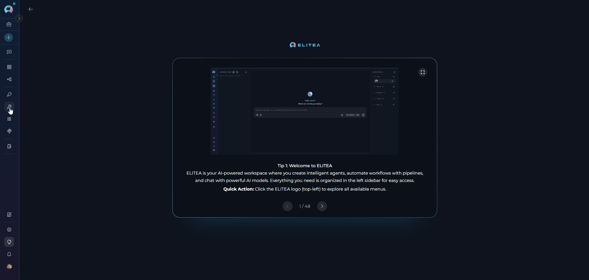
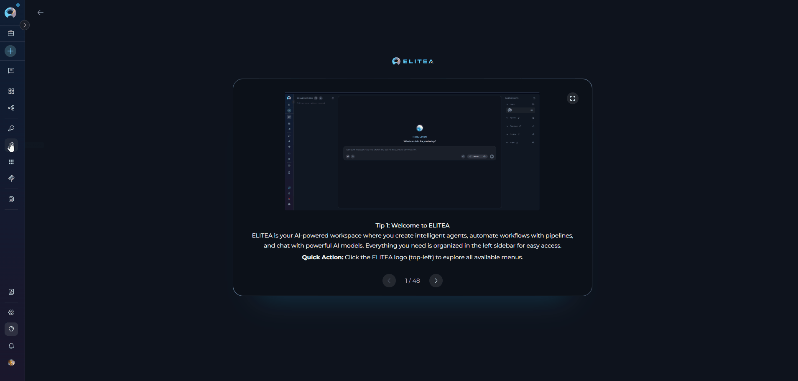
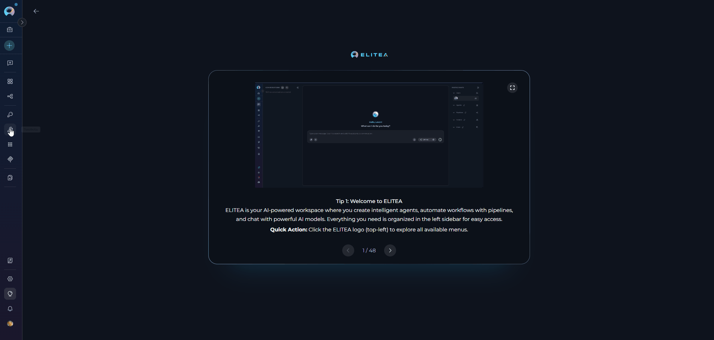
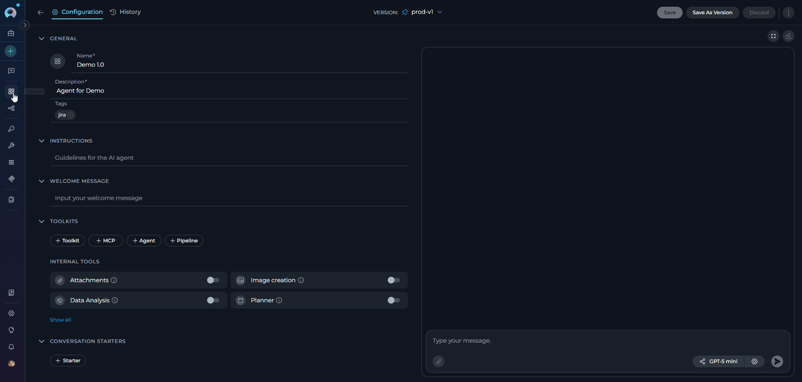
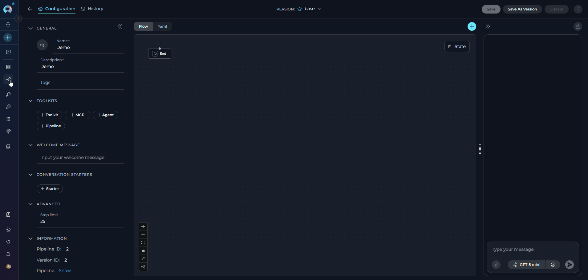
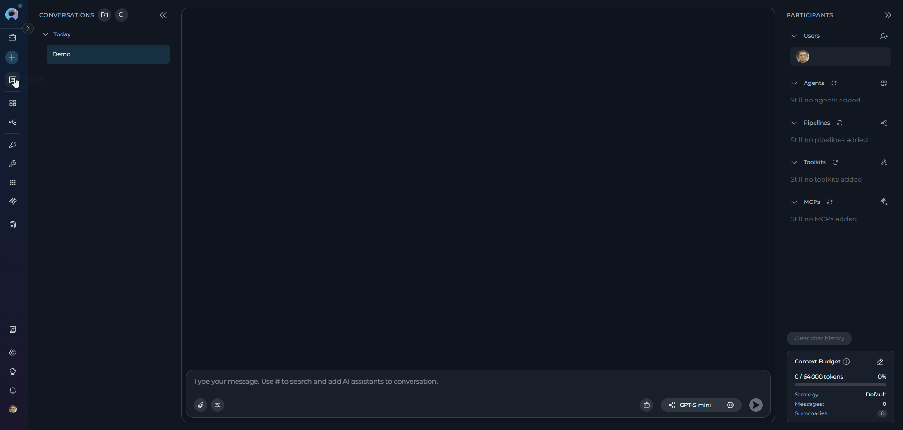

# ELITEA Toolkit Guide: Azure DevOps Wiki, Boards, and Plans Integration

## Introduction

This guide is your comprehensive resource for integrating and utilizing the **Azure DevOps (ADO) Wiki, Boards, and Plans toolkits** within ELITEA. It provides detailed, step-by-step instructions, from setting up your Azure DevOps Personal Access Token to configuring these toolkits in ELITEA and effectively using them within your Agents, Pipelines, and Chat conversations. By following this guide, you will unlock the power of automated knowledge management, streamlined project planning, and enhanced workflow automation, all directly within the ELITEA platform.

**Brief Overview of Azure DevOps Services**

Azure DevOps provides integrated services for project management, knowledge sharing, and quality assurance. This guide covers integration with three core services:

*   **Azure Wiki (ADO Wiki):** Collaborative wiki service for creating and managing project documentation, knowledge bases, release notes, and meeting minutes. Provides version-controlled repository for team documentation.

*   **Azure Boards (ADO Boards):** Work tracking and project management service for planning, organizing, and tracking tasks, user stories, bugs, features, and epics. Includes agile planning tools, customizable dashboards, and workflow automation.

*   **Azure Test Plans (ADO Test Plans):** Comprehensive test management solution for planning, executing, and tracking software testing. Enables test plan creation, test suite organization, test case authoring, and test execution tracking.

Integrating these Azure DevOps services with ELITEA brings powerful capabilities directly into your AI-driven workflows. Your ELITEA Agents, Pipelines, and Chat conversations can intelligently interact with Azure DevOps to automate tasks, enhance collaboration, and improve project visibility.

## Toolkit's Account Setup and Configuration

### Account Setup

Create an Azure DevOps account and organization to access Wiki, Boards, and Test Plans services.

1.  **Visit Azure DevOps:** Navigate to [https://azure.devops.com/](https://dev.azure.com/)
2.  **Start Free or Sign In:** Click **"Start free"** to create a new organization, or **"Sign in to Azure DevOps"** for existing accounts
3.  **Create Organization:** Follow prompts to set up your organization (provide name, select hosting region, optionally link to Azure account)
4.  **Verify Email:** Confirm your email address if prompted by clicking the verification link
5.  **Enable Basic Subscription:** Verify **Basic subscription** is enabled (typically enabled by default for new organizations). This grants access to Boards, Repos, Pipelines, Test Plans, and Artifacts
6.  **Add Users (Optional):** To grant access to team members:
    *   Navigate to `https://dev.azure.com/{YourOrganizationName}/_settings/users`
    *   Click **"Add users"**
    *   Enter user's email address or Microsoft account
    *   Select **"Basic"** access level
    *   Choose relevant project(s)
    *   Click **"Add"**
         {loading=lazy}
7.  **Configure Project Permissions (Optional):** To ensure users have project access:
    *   Open **"Project settings"** (bottom left)
    *   Select **"Groups"** under Security
    *   Add users to **"Project Valid Users"** or relevant group
8.  **Verify Access:** Confirm **"Boards"**, **"Wiki"**, and **"Test Plans"** appear in the left sidebar

!!! note "Service Availability"
    If services aren't visible, create a new project or verify services are enabled in organization settings under General → Services.

### Generate a Personal Access Token (PAT)

For secure integration with ELITEA, it is essential to use an Azure DevOps **Personal Access Token (PAT)**. This method is significantly more secure than using your primary Azure DevOps account password directly and allows you to precisely control the permissions granted to ELITEA.

**Follow these steps to generate a Personal Access Token (PAT) in Azure DevOps:**

1.  **Log in to Azure DevOps:** Access your Azure DevOps organization by navigating to `https://dev.azure.com/` and logging in with your credentials.
2.  **Access User Settings:** Click on the **User settings** icon in the top right corner, next to your profile picture. From the dropdown menu, select **"Personal access tokens"**.
3.  **Generate New Token:** Click the **"+ New Token"** button to create a new PAT.
4.  **Configure Token Details:** In the "Create a new personal access token" panel, configure the following:
    *   **Name:** Enter a descriptive label (e.g., "ELITEA Integration" or "ELITEA ADO Access")
    *   **Organization:** Select "All accessible organizations" or choose specific organizations
    *   **Expiration:** Set an expiration date for enhanced security
    *   **Scopes:** Grant only the minimum necessary permissions

    !!! tip "Token Scopes"
        **Minimal Scopes for Common Use Cases:**
    
        * **Custom Defined** - Select to manually choose granular scopes
        * **Work items**:
            * **Read** (To read work item details)
            * **Write** (To create or update work items - only if needed)
        * **Wiki**:
            * **Read & write** (For full wiki access)
            * **Read** (If agent only needs to read wiki content)
        * **Test Management**:
            * **Read** (To read test plans and cases)
            * **Read & write** (To create or update test plans - only if needed)    
        * **Additional Scopes for Specific Functionality (Grant only if needed):**    
            * **Build** (For Azure Pipelines builds interaction)
            * **Release** (For Azure Pipelines releases interaction)

5.  **Create Token:** Click the **"Create"** button to generate your PAT.
6.  **Copy and Store Token:** **Copy the generated token immediately** - this is your only chance to see it. Store it securely in a password manager or ELITEA's **[Secrets](../../menus/settings/secrets.md)** feature.

    {loading=lazy}

!!! warning "Important Security Practices"
    **Principle of Least Privilege:** Grant only the scopes absolutely essential for your ELITEA integration tasks.
    
    **Avoid "Full Access" Scopes:** Never grant full access unless absolutely necessary and with clear understanding of security implications.
    
    **Regular Token Review and Rotation:** Regularly review generated tokens and their scopes. Rotate tokens periodically as a security best practice.

## System Integration with ELITEA

To integrate Azure DevOps with ELITEA, you need to follow a three-step process: **Create Credentials → Create Toolkit → Use in Agents**. This workflow ensures secure authentication and proper configuration for Wiki, Boards, and Test Plans toolkits.

### Step 1: Create Azure DevOps Credentials

Before creating any toolkit, you must first create Azure DevOps credentials in ELITEA:

1. **Navigate to Credentials Menu:** Open the sidebar and select **[Credentials](../../menus/credentials.md)**.
2. **Create New Credential:** Click the **`+ Create`** button.
3. **Select Azure DevOps:** Choose **Ado** as the credential type.
4. **Configure Credential Details:**

    | Field | Description | Example |
    |-------|-------------|---------|
    | **Display Name** | Enter a descriptive name (e.g., "Azure DevOps - Team Project Access") | `Azure DevOps - Team Project Access` |
    | **ID** | Unique identifier for the credential | 	Auto-populated from the Display Name |
    | **Organization Url** | Enter your Azure DevOps organization URL (e.g., `https://dev.azure.com/YourOrganization`) | `https://dev.azure.com/MyCompany` |
    | **Project** | Enter your Azure DevOps project name (e.g., `MyProject`) | `ProjectAlpha` |
    | **Token** | Enter your PAT or select a secret containing your PAT | `ghp_1234...` |

5. **Test Connection:** Click **Test Connection** to verify your credentials are valid and ELITEA can connect to Azure DevOps
6. **Save Credential:** Click **Save** to create the credential. It will be available in the Credentials dashboard for use in toolkit configurations.

     { loading=lazy }

!!! tip "Security Recommendation"
    Use **[Secrets](../../menus/settings/secrets.md)** for your PAT instead of entering values directly. Create a secret first, then reference it in your credential configuration.

### Step 2: Create Azure DevOps Toolkits

Once your credentials are configured, you can create one or more Azure DevOps toolkits depending on your needs. ELITEA provides three separate toolkits for different Azure DevOps services:

#### Azure DevOps Wiki Toolkit

1. **Navigate to Toolkits Menu:** Open the sidebar and select **[Toolkits](../../menus/toolkits.md)**.
2. **Create New Toolkit:** Click the **`+ Create`** button.
3. **Select Azure Wiki:** Choose **Azure Wiki (ADO Wiki)** from the list of available toolkit types.
4. **Configure Toolkit Settings:**

    | **Field** | **Description** | **Example** |
    |-----------|-----------------|-------------|
    | **Toolkit Name** | Enter a descriptive name for your toolkit | `ADO Wiki - Documentation Manager` |
    | **Description** | Optional description of the toolkit's purpose | `Toolkit for managing project wiki documentation and knowledge base` |
    | **Credentials** | Select your Azure DevOps credential | `Azure DevOps - Team Project Access` |
    | **PgVector Configuration** | Select a PgVector connection for vector database (required for indexing tools) | `elitea-pgvector` |
    | **Embedding Model** | Select an embedding model for text processing and semantic search | `text-embedding-3-small` |
    | **Default Wiki Identifier** | Default Wiki Identifier (Wiki ID or wiki name). If provided, this identifier will be used when tools are invoked without explicitly specifying a wiki identifier. | `ProjectWiki` |

5. **Enable Desired Tools:** In the **"Tools"** section, select the checkboxes next to the specific Wiki tools you want to enable. **Enable only the tools your agents will actually use** to follow the principle of least privilege
       * **[Make Tools Available by MCP](../mcp/make-tools-available-by-mcp.md)** - (optional checkbox) Enable this option to make the selected tools accessible through external MCP clients
6. **Save Toolkit:** Click **Save** to create the toolkit.

{loading=lazy}

##### Available Wiki Tools:

The ADO Wiki toolkit provides the following tools for interacting with Azure DevOps Wiki, organized by functional categories:

| **Tool Category** | **Tool Name** | **Description** | **Primary Use Case** |
|:-----------------:|---------------|-----------------|----------------------|
| **Wiki Access** | | | |
| | **Get wiki** | Extract ADO wiki information | Retrieve list of all wikis available in the project |
| **Wiki Page Retrieval** | | | |
| | **Get wiki page** | Extract ADO wiki page content | Fetch a wiki page with general parameters |
| | **Get wiki page by path** | Extract ADO wiki page content | Fetch a specific wiki page using its hierarchical path |
| | **Get wiki page by id** | Extract ADO wiki page content | Fetch a specific wiki page using its unique ID |
| **Wiki Page Management** | | | |
| | **Modify wiki page** | Create or Update ADO wiki page content | Create new or update existing wiki page content |
| | **Rename wiki page** | Rename page | Rename an existing wiki page to a new name |
| | **Delete page by path** | Extract ADO wiki page content | Delete a specific wiki page using its path |
| | **Delete page by id** | Extract ADO wiki page content | Delete a specific wiki page using its unique ID |
| **Indexing & Search** | | | |
| | **Index data** | Loads Azure DevOps wiki data to index for semantic search | Enable advanced search and discovery across wiki pages with AI-powered semantic search |
| | **Search index** | Performs searches across indexed content | Find specific wiki content across indexed data |
| | **Stepback search index** | Performs advanced contextual searches with broader scope | Execute sophisticated searches with expanded context |
| | **Stepback summary index** | Creates comprehensive summaries of indexed content | Generate intelligent summaries of wiki information |
| | **Remove index** | Removes previously created search indexes | Clean up and manage indexed content |
| | **List collections** | Lists available indexed collections | View and manage indexed data collections |

#### Azure DevOps Boards Toolkit

1. **Navigate to Toolkits Menu:** Open the sidebar and select **[Toolkits](../../menus/toolkits.md)**.
2. **Create New Toolkit:** Click the **`+ Create`** button.
3. **Select Azure Boards:** Choose **Azure Boards (ADO Board)** from the list of available toolkit types.
4. **Configure Toolkit Settings:**

    | **Field** | **Description** | **Example** |
    |-----------|-----------------|-------------|
    | **Toolkit Name** | Enter a descriptive name for your toolkit | `ADO Boards - Work Item Manager` |
    | **Description** | Optional description of the toolkit's purpose | `Toolkit for managing work items, bugs, and user stories` |
    | **Credentials** | Select your Azure DevOps credential | `Azure DevOps - Team Project Access` |
    | **PgVector Configuration** | Select a PgVector connection for vector database (required for indexing tools) | `elitea-pgvector` |
    | **Embedding Model** | Select an embedding model for text processing and semantic search | `text-embedding-3-small` |
    | **Limit** | Default ADO boards result limit (can be overridden by agent instructions) | `5` |

5. **Enable Desired Tools:** In the **"Tools"** section, select the checkboxes next to the specific Boards tools you want to enable. **Enable only the tools your agents will actually use**
       * **[Make Tools Available by MCP](../mcp/make-tools-available-by-mcp.md)** - (optional checkbox) Enable this option to make the selected tools accessible through external MCP clients
6. **Save Toolkit:** Click **Save** to create the toolkit.

{loading=lazy}

##### Available Boards Tools:

The ADO Boards toolkit provides the following tools for interacting with Azure DevOps Boards (Work Items), organized by functional categories:

| **Tool Category** | **Tool Name** | **Description** | **Primary Use Case** |
|:-----------------:|---------------|-----------------|----------------------|
| **Work Item Search & Retrieval** | | | |
| | **Search work items** | Search for work items using a WIQL query and dynamically fetch fields based on the query | Find specific tasks, bugs, or user stories matching criteria |
| | **Get work item** | Get a single work item by ID | Retrieve detailed information about a specific work item |
| | **Get comments** | Get comments for work item by ID | Access discussion and collaboration history |
| | **Get work item type fields** | Get fields for a specific work item type | Retrieve field definitions and metadata for work item types |
| **Work Item Management** | | | |
| | **Create work item** | Creates new work items per defined data | Add new tasks, bugs, or features programmatically |
| | **Update work item** | Updates existing work item per defined data | Modify work item status, fields, or properties |
| | **Delete work item** | Deletes a work item by ID | Remove obsolete or incorrect work items |
| **Work Item Linking** | | | |
| | **Link work items** | Add the relation to the source work item with an appropriate attributes if any | Establish relationships between work items |
| | **Get relation types** | Returns dict of possible relation types per syntax: 'relation name': 'relation reference name' | Discover valid link types for work items |
| | **Link work items to wiki page** | Links one or more work items to a specific wiki page using an ArtifactLink | Connect work items with wiki documentation |
| | **Unlink work items from wiki page** | Unlinks one or more work items from a specific wiki page by removing the ArtifactLink | Remove work item associations from wiki pages |
| **Indexing & Search** | | | |
| | **Index data** | Loads Azure DevOps work item data to index for semantic search | Enable advanced search and discovery across work items with AI-powered semantic search |
| | **Search index** | Performs searches across indexed content | Find specific work item content across indexed data |
| | **Stepback search index** | Performs advanced contextual searches with broader scope | Execute sophisticated searches with expanded context |
| | **Stepback summary index** | Creates comprehensive summaries of indexed content | Generate intelligent summaries of work item information |
| | **Remove index** | Removes previously created search indexes | Clean up and manage indexed content |
| | **List collections** | Lists available indexed collections | View and manage indexed data collections |

#### Azure DevOps Test Plans Toolkit

1. **Navigate to Toolkits Menu:** Open the sidebar and select **[Toolkits](../../menus/toolkits.md)**.
2. **Create New Toolkit:** Click the **`+ Create`** button.
3. **Select Azure Test Plans:** Choose **Azure Test Plans (ADO Test Plan)** from the list of available toolkit types.
4. **Configure Toolkit Settings:**

    | **Field** | **Description** | **Example** |
    |-----------|-----------------|-------------|
    | **Toolkit Name** | Enter a descriptive name for your toolkit | `ADO Test Plans - QA Automation` |
    | **Description** | Optional description of the toolkit's purpose | `Toolkit for managing test plans, suites, and test cases` |
    | **Credentials** | Select your Azure DevOps credential | `Azure DevOps - Team Project Access` |
    | **PgVector Configuration** | Select a PgVector connection for vector database (required for indexing tools) | `elitea-pgvector` |
    | **Embedding Model** | Select an embedding model for text processing and semantic search | `text-embedding-3-small` |
    | **Limit** | ADO plans limit used for limitation of the list with results | `5` |

5. **Enable Desired Tools:** In the **"Tools"** section, select the checkboxes next to the specific Test Plans tools you want to enable. **Enable only the tools your agents will actually use**
       * **[Make Tools Available by MCP](../mcp/make-tools-available-by-mcp.md)** - (optional checkbox) Enable this option to make the selected tools accessible through external MCP clients
6. **Save Toolkit:** Click **Save** to create the toolkit.

{loading=lazy}

##### Available Test Plans Tools:

The ADO Test Plans toolkit provides the following tools for interacting with Azure DevOps Test Plans, organized by functional categories:

| **Tool Category** | **Tool Name** | **Description** | **Primary Use Case** |
|:-----------------:|---------------|-----------------|----------------------|
| **Test Plan Management** | | | |
| | **Create test plan** | Create a test plan in Azure DevOps | Set up new test plans for releases or sprints |
| | **Get test plan** | Get a test plan or list of test plans in Azure DevOps | Retrieve test plan details and information |
| | **Delete test plan** | Delete a test plan in Azure DevOps | Remove obsolete test plans |
| **Test Suite Management** | | | |
| | **Create test suite** | Create a test suite in Azure DevOps | Organize test cases into test suites |
| | **Get test suite** | Get a test suite or list of test suites in Azure DevOps | Retrieve test suite details and structure |
| | **Delete test suite** | Delete a test suite in Azure DevOps | Remove obsolete test suites |
| **Test Case Management** | | | |
| | **Add test case** | Add a test case to a suite in Azure DevOps | Link existing test cases to test suites |
| | **Create test case** | Creates a new test case in specified suite in Azure DevOps | Create new test cases with steps and expected results |
| | **Create test cases** | Creates new test cases in specified suite in Azure DevOps | Bulk create multiple test cases at once |
| | **Get test case** | Get a test case from a suite in Azure DevOps | Retrieve detailed test case information |
| | **Get test cases** | Get test cases from a suite in Azure DevOps | List all test cases in a test suite |
| | **Get all test case fields for project** | Get all available test case fields for the project | Retrieve field definitions and metadata for test case work item types |
| **Indexing & Search** | | | |
| | **Index data** | Loads Azure DevOps test case data to index for semantic search | Enable advanced search and discovery across test cases with AI-powered semantic search |
| | **Search index** | Performs searches across indexed content | Find specific test case content across indexed data |
| | **Stepback search index** | Performs advanced contextual searches with broader scope | Execute sophisticated searches with expanded context |
| | **Stepback summary index** | Creates comprehensive summaries of indexed content | Generate intelligent summaries of test case information |
| | **Remove index** | Removes previously created search indexes | Clean up and manage indexed content |
| | **List collections** | Lists available indexed collections | View and manage indexed data collections |

!!! tip "Vector Search Tools"
    The tools **Index data**, **List collections**, **Remove index**, **Search index**, **Stepback search index**, and **Stepback summary index** require PgVector configuration and an embedding model. These enable advanced semantic search capabilities across your Azure DevOps data.

#### Testing Toolkit Tools

After configuring your Azure DevOps toolkits, you can test individual tools directly from the Toolkit detailed page using the **Test Settings** panel. This allows you to verify that your credentials are working correctly and validate tool functionality before adding the toolkit to your workflows.

**General Testing Steps:**

1. **Select LLM Model:** Choose a Large Language Model from the model dropdown in the Test Settings panel
2. **Configure Model Settings:** Adjust model parameters like Creativity, Max Completion Tokens, and other settings as needed
3. **Select a Tool:** Choose the specific Azure DevOps tool you want to test from the available tools
4. **Provide Input:** Enter any required parameters or test queries for the selected tool
5. **Run the Test:** Execute the tool and wait for the response
6. **Review the Response:** Analyze the output to verify the tool is working correctly and returning expected results

!!! tip "Key benefits of testing toolkit tools:"
    * Verify that Azure DevOps credentials and connection are configured correctly
    * Validate that tools function as expected with your Azure DevOps environment
    * Test different parameter combinations and edge cases before production use
    * Familiarize yourself with tool capabilities and expected outputs
    
    > For detailed instructions on how to use the Test Settings panel, see **[How to Test Toolkit Tools](../../how-tos/credentials-toolkits/how-to-test-toolkit-tools.md)**.

---
### Step 3: Add Azure DevOps Toolkits to Your Workflows

Now you can add the configured Azure DevOps toolkits to your agents, pipelines, or use them directly in chat:

---
#### In Agents:

1. **Navigate to Agents:** Open the sidebar and select **[Agents](../../menus/agents.md)**.
2. **Create or Edit Agent:** Either create a new agent or select an existing agent to edit.
3. **Add Azure DevOps Toolkit:**
     * In the **"TOOLKITS"** section of the agent configuration, click the **"+Toolkit"** icon
     * Select your desired Azure DevOps toolkit (Wiki, Boards, or Test Plans) from the dropdown menu
     * The toolkit will be added to your agent with the previously configured tools enabled

{loading=lazy}

Your agent can now interact with Azure DevOps using the configured toolkit and enabled tools.

---
#### In Pipelines:

1. **Navigate to Pipelines:** Open the sidebar and select **[Pipelines](../../menus/pipelines.md)**.
2. **Create or Edit Pipeline:** Either create a new pipeline or select an existing pipeline to edit.
3. **Add Azure DevOps Toolkit:**
     * In the **"TOOLKITS"** section of the pipeline configuration, click the **"+Toolkit"** icon
     * Select your desired Azure DevOps toolkit from the dropdown menu
     * The toolkit will be added to your pipeline with the previously configured tools enabled

{loading=lazy}

---
#### In Chat:

1. **Navigate to Chat:** Open the sidebar and select **[Chat](../../menus/chat.md)**.
2. **Start New Conversation:** Click **+Create** or open an existing conversation.
3. **Add Toolkit to Conversation:**
     * In the chat Participants section, look for the **Toolkits** element
     * Click to add a toolkit and select your desired Azure DevOps toolkit from the available options
     * The toolkit will be added to your conversation with all previously configured tools enabled
4. **Use Toolkit in Chat:** You can now directly interact with Azure DevOps by asking questions or requesting actions that will trigger the toolkit tools.

{loading=lazy}

!!! example "Example Chat Usage:"
    - "Show me the latest release notes from the project wiki."
    - "Create a new bug for the login issue I just found."
    - "List all high-priority tasks assigned to me."
    - "Create a new test plan for the upcoming release."

## Instructions and Prompts for Using the Azure DevOps Toolkits

When crafting instructions for the Azure DevOps toolkits, especially for OpenAI-based Agents, clarity and precision are paramount. Break down complex tasks into a sequence of simple, actionable steps. Explicitly define all parameters required for each tool and guide the Agent on how to obtain or determine the values for these parameters. OpenAI Agents respond best to instructions that are:

*   **Direct and Action-Oriented:** Employ strong action verbs and clear commands to initiate actions. For example, "Use the 'get_wiki_page_by_path' tool...", "Create a work item using 'create_work_item'...", "List all open pull requests...".

*   **Parameter-Centric:** Clearly enumerate each parameter required by the tool. For each parameter, specify:
    *   Its name (exactly as expected by the tool)
    *   How the Agent should obtain the value – whether from user input, derived from previous steps in the conversation, retrieved from an external source, or a predefined static value

*   **Contextually Rich:** Provide sufficient context so the Agent understands the overarching objective and the specific scenario in which each Azure DevOps tool should be applied within the broader workflow. Explain the desired outcome or goal for each tool invocation.

*   **Step-by-Step Structure:** Organize instructions into a numbered or bulleted list of steps for complex workflows. This helps the Agent follow a logical sequence of actions.

*   **Add Conversation Starters:** Include example conversation starters that users can use to trigger this functionality. For example, "Conversation Starters: 'Show me the release notes', 'Create a bug report', 'List all test plans'"

When instructing your Agent to use an Azure DevOps toolkit tool, adhere to this structured pattern:

1. **State the Goal:** Begin by clearly stating the objective you want to achieve with this step. For example, "Goal: To retrieve the content of a specific wiki page in Azure DevOps."

2. **Specify the Tool:** Clearly indicate the specific Azure DevOps tool to be used for this step. For example, "Tool: Use the 'get_wiki_page_by_path' tool."

3. **Define Parameters:** Provide a detailed list of all parameters required by the selected tool. For each parameter:
   - **Parameter Name:** `<Parameter Name as defined in tool documentation>`
   - **Value or Source:** `<Specify the value or how to obtain the value. Examples: "user input", "from previous step", "hardcoded value 'main'", "value of variable X">`

4. **Describe Expected Outcome (Optional but Recommended):** Briefly describe the expected result or outcome after the tool is successfully executed. For example, "Outcome: The Agent will display the wiki page content to the user."

5. **Add Conversation Starters:** Include example conversation starters that users can use to trigger this functionality. For example, "Conversation Starters: 'Show me the release notes', 'What are the latest updates?', 'Display the project wiki'"

!!! example "Example Agent Instructions"
    **Agent Instructions for Retrieving a Wiki Page:**
    ```markdown
    1. Goal: Retrieve content from a specific wiki page in Azure DevOps Wiki.
    2. Tool: Use the "get_wiki_page_by_path" tool.
    3. Parameters:
        - wiki_path: "Get the wiki page path from the user. Example: '/Release Notes/Latest'"
        - wiki_identifier: "Use the default wiki or ask the user which wiki to access"
    4. Outcome: The agent will display the wiki page content to the user with proper formatting.
    ```

    **Agent Instructions for Creating a Work Item:**
    ```markdown
    1. Goal: Create a new work item in Azure Boards based on user requirements.
    2. Tool: Use the "create_work_item" tool.
    3. Parameters:
        - work_item_type: "Ask the user for the work item type (Task, Bug, User Story, etc.)"
        - title: "Get the work item title from the user"
        - description: "Ask the user for work item details"
        - assigned_to: "Optional - ask if the work item should be assigned to someone"
    4. Outcome: A new work item will be created in Azure Boards. Confirm the creation to the user with the work item ID.
    ```

---

---
### Chat Usage Examples by Tool Category

The following examples demonstrate how to interact with the Azure DevOps toolkits in ELITEA Chat, organized by functional categories. Each example shows the user request and the expected agent behavior.

??? example "Wiki Tools - Get Wiki Page by Path"

    **Chat Example:**
    ```
    User: "Show me the latest release notes from our project wiki."

    Agent Response: [Agent uses get_wiki_page_by_path tool]

    📄 **Release Notes - Version 2.5.0**

    **Released**: November 10, 2025

    **New Features**:
    - Enhanced user authentication with OAuth 2.0 support
    - Real-time collaboration features in document editing
    - Advanced search capabilities with AI-powered suggestions

    **Bug Fixes**:
    - Fixed issue with file upload timeouts
    - Resolved memory leak in background processes
    - Corrected timezone display in activity logs

    **Known Issues**:
    - Mobile app may experience slow loading on 3G connections
    - Some users report intermittent sync delays

    For detailed technical documentation, please refer to the Technical Release Notes section.
    ```

??? example "Wiki Tools - Modify Wiki Page"

    **Chat Example:**
    ```
    User: "Add today's meeting notes to the 'Team Meetings' wiki page."

    Agent Response: [Agent uses modify_wiki_page tool]

    ✅ **Wiki Page Updated Successfully!**

    - **Page**: Team Meetings
    - **Path**: /Project Documentation/Team Meetings
    - **Updated**: November 12, 2025

    **Added Content**:
    ```markdown
    ## Meeting - November 12, 2025

    **Attendees**: John, Sarah, Mike, Lisa
    **Duration**: 1 hour

    **Agenda**:
    1. Sprint review and retrospective
    2. Planning for next release
    3. Technical debt discussion

    **Key Decisions**:
    - Approved migration to new testing framework
    - Set release date for Version 2.6.0 to December 1st
    - Allocated resources for performance optimization

    **Action Items**:
    - John: Update API documentation by Nov 15
    - Sarah: Review security audit findings
    - Mike: Prepare deployment checklist

    The meeting notes have been successfully added to the Team Meetings wiki page.
    ```

??? example "Boards Tools - Search Work Items"

    **Chat Example:**
    ```
    User: "Find all high-priority bugs assigned to me."
    User: "Find all high-priority bugs assigned to me."

    Agent Response: [Agent uses search_work_items tool]

    🔍 **Search Results: High-Priority Bugs** (3 items):

    1. **Bug #1234**: Application crashes on file upload
       - **Priority**: High (Priority 1)
       - **State**: Active
       - **Assigned To**: You
       - **Created**: Nov 8, 2025

    2. **Bug #1245**: Memory leak in background service
       - **Priority**: High (Priority 1)
       - **State**: Active
       - **Assigned To**: You
       - **Created**: Nov 10, 2025

    3. **Bug #1251**: Data validation error in user registration
       - **Priority**: High (Priority 1)
       - **State**: Active
       - **Assigned To**: You
       - **Created**: Nov 11, 2025

    These high-priority bugs require immediate attention. Would you like details on any specific bug?
    ```

??? example "Boards Tools - Create Work Item"

    **Chat Example:**
    ```
    User: "Create a new task to update the API documentation."

    Agent Response: [Agent uses create_work_item tool]

    ✅ **Work Item Created Successfully!**

    - **Work Item ID**: #1256
    - **Type**: Task
    - **Title**: Update API documentation
    - **State**: New
    - **Priority**: Medium (Priority 2)
    - **Assigned To**: Unassigned

    **Description**:
    Update the REST API documentation to reflect recent changes in authentication endpoints and add examples for new OAuth 2.0 flows.

    **Created**: November 12, 2025

    The task has been added to your Azure Boards backlog and is ready for assignment and planning.
    ```

??? example "Boards Tools - Update Work Item"

    **Chat Example:**
    ```
    User: "Change the status of work item #1234 to 'In Progress'."

    Agent Response: [Agent uses update_work_item tool]

    ✅ **Work Item Updated Successfully!**

    - **Work Item ID**: #1234
    - **Title**: Application crashes on file upload
    - **Updated Field**: State
    - **New Value**: In Progress
    - **Previous Value**: Active

    The work item status has been updated. The team will be notified of this progress update.
    ```

??? example "Test Plans Tools - Create Test Plan"

    **Chat Example:**
    ```
    User: "Create a new test plan for the upcoming 2.6.0 release."

    Agent Response: [Agent uses create_test_plan tool]

    ✅ **Test Plan Created Successfully!**

    - **Test Plan ID**: #45
    - **Name**: Regression Tests - Release 2.6.0
    - **State**: Active
    - **Start Date**: November 12, 2025
    - **End Date**: November 30, 2025

    **Details**:
    - **Area Path**: ProjectAlpha/Release 2.6.0
    - **Iteration**: Sprint 15
    - **Description**: Comprehensive regression testing for Version 2.6.0 including new authentication features and bug fixes

    The test plan is now ready for test suite and test case creation. Next steps:
    1. Create test suites for different functional areas
    2. Add or link test cases to the suites
    3. Assign testers and begin test execution

    Would you like me to create test suites for this plan?
    ```

??? example "Test Plans Tools - Get Test Cases"

    **Chat Example:**
    ```
    User: "Show me all test cases in test suite #12."

    Agent Response: [Agent uses get_test_cases tool]

    📋 **Test Cases in Suite #12: Authentication Tests** (8 cases):

    1. **TC-101**: Verify login with valid credentials
       - **Priority**: High
       - **State**: Ready

    2. **TC-102**: Verify login with invalid password
       - **Priority**: High
       - **State**: Ready

    3. **TC-103**: Verify OAuth 2.0 login flow
       - **Priority**: High
       - **State**: Design

    4. **TC-104**: Verify session timeout handling
       - **Priority**: Medium
       - **State**: Ready

    5. **TC-105**: Verify multi-factor authentication
       - **Priority**: High
       - **State**: Ready

    6. **TC-106**: Verify password reset functionality
       - **Priority**: Medium
       - **State**: Ready

    7. **TC-107**: Verify account lockout after failed attempts
       - **Priority**: High
       - **State**: Ready

    8. **TC-108**: Verify SSO integration
       - **Priority**: Medium
       - **State**: Design

    **Summary**: 6 test cases ready for execution, 2 in design phase. All high-priority cases are ready.
    ```

---

## Best Practices and Use Cases

??? tip "Test Integration Thoroughly"
    After setting up the Azure DevOps toolkits and incorporating them into your Agents, **thoroughly test each tool** you intend to use to ensure seamless connectivity, correct authentication, and accurate execution of Azure DevOps actions.

??? tip "Monitor Agent Performance and Usage"
    Regularly **monitor the performance of Agents** utilizing Azure DevOps toolkits. Track metrics such as task completion success rate, execution time, and error rates to identify any potential issues or areas for optimization in Agent instructions or toolkit configurations.

??? tip "Follow Security Best Practices"
    *   **Use Personal Access Tokens:** Always use Azure DevOps Personal Access Tokens instead of your main account password for integrations.
    *   **Grant Least Privilege:** Grant only the minimum necessary scopes/permissions to the Personal Access Token to limit potential security risks.
    *   **Securely Store Credentials:** Utilize ELITEA's Secrets Management feature to securely store and manage your Azure DevOps Personal Access Tokens instead of hardcoding them directly in Agent configurations.

??? tip "Provide Clear Instructions and Prompts"
    Craft clear and unambiguous instructions within your ELITEA Agents to guide them in using the Azure DevOps toolkits effectively. Use the prompt examples provided in this guide as a starting point and adapt them to your specific use cases.

??? tip "Start with Simple Use Cases"
    Begin by implementing Azure DevOps integration for simpler automation tasks, such as retrieving information or updating work item statuses, and gradually progress to more complex workflows as you gain experience and confidence with the toolkits.

??? tip "Automated Retrieval of Release Notes for Support"
    *   **Scenario:** During a support interaction, an Agent can automatically retrieve the latest release notes from the project wiki to provide users with up-to-date information on new features and bug fixes.
    *   **Tools Used:** `get_wiki_page_by_path`
    *   **Example Instruction:** "Use the 'get_wiki_page_by_path' tool to read the content of the wiki page at path '/Release Notes/Latest Release' and display it to the user."
    *   **Benefit:** Enhances support interactions by providing agents with immediate access to current release information, improving support efficiency and user satisfaction.

??? tip "Dynamic Content Creation for Project Dashboards"
    *   **Scenario:** Agents can dynamically generate content for project dashboards within ELITEA by retrieving data from various sources and formatting it into wiki pages for display.
    *   **Tools Used:** `modify_wiki_page`
    *   **Example Instruction:** "Use the 'modify_wiki_page' tool to update the wiki page 'Project Dashboard' with the latest build status and test results summarized from other ELITEA workflows."
    *   **Benefit:** Enables dynamic and automated dashboard updates, ensuring project dashboards within ELITEA always display the most current information, improving project visibility and awareness.

??? tip "Automated Wiki Cleanup for Content Management"
    *   **Scenario:** Implement a workflow to automatically delete outdated meeting minutes or temporary documentation pages from the project wiki after a certain period to maintain wiki cleanliness.
    *   **Tools Used:** `delete_wiki_page_by_path`
    *   **Example Instruction:** "Use the 'delete_wiki_page_by_path' tool to delete wiki pages in the '/Meeting Minutes/Archive' path that are older than 90 days."
    *   **Benefit:** Automates wiki maintenance tasks, ensuring the project wiki remains organized, relevant, and easy to navigate by automatically removing outdated content.

??? tip "Intelligent Work Item Search for Task Prioritization"
    *   **Scenario:** Developers can use ELITEA Agents to quickly search for work items assigned to them, filtered by priority or status, to efficiently prioritize their tasks for the day.
    *   **Tools Used:** `search_work_item`
    *   **Example Instruction:** "Use the 'search_work_item' tool to find all 'Task' work items assigned to me that are currently in 'Active' state and sorted by 'Priority'."
    *   **Benefit:** Improves developer efficiency by providing a fast and intelligent way to find and prioritize their work items directly within ELITEA, streamlining daily task management.

??? tip "Contextual Work Item Details for Team Discussions"
    *   **Scenario:** During team meetings or project discussions within ELITEA, Agents can provide immediate access to detailed information about specific work items to provide context and facilitate informed decision-making.
    *   **Tools Used:** `get_work_item`
    *   **Example Instruction:** "Use the 'get_work_item' tool to get details for work item with ID [work_item_id] and display the 'Title', 'Description', and 'Status' to the team."
    *   **Benefit:** Enhances team collaboration by providing immediate access to relevant work item details within ELITEA, improving context and facilitating more focused and productive discussions.

??? tip "Automated Bug Logging from ELITEA Workflows"
    *   **Scenario:** When automated tests within ELITEA workflows detect a bug, automatically create a new Bug work item in Azure Boards, pre-populated with error details and relevant context from the test execution.
    *   **Tools Used:** `create_work_item`
    *   **Example Instruction:** "Use the 'create_work_item' tool to create a new 'Bug' work item with the title 'Automated Test Failure Detected' and description containing the error logs and test details from the failed workflow step."
    *   **Benefit:** Streamlines bug reporting and issue tracking by automating bug logging directly from ELITEA workflows, ensuring timely and consistent bug reporting and accelerating the bug triage process.

??? tip "Automated Work Item Updates Based on Workflow Progress"
    *   **Scenario:** As tasks progress through ELITEA workflows, automatically update the status of linked work items in Azure Boards to reflect the current progress and keep project status up-to-date.
    *   **Tools Used:** `update_work_item`
    *   **Example Instruction:** "Use the 'update_work_item' tool to update work item with ID [work_item_id]. Set the 'Status' field to 'In Progress' when the workflow reaches the 'Development' stage."
    *   **Benefit:** Automates work item status management, ensuring work item statuses are always synchronized with the actual project progress. Reduces manual status updates and improves project tracking accuracy and real-time visibility.

??? tip "Automated Linking of Related Work Items"
    *   **Scenario:** When a new feature request work item is created in ELITEA, automatically link it to related User Story work items in Azure Boards to establish clear relationships and dependencies between features and user stories.
    *   **Tools Used:** `link_work_item`
    *   **Example Instruction:** "Use the 'link_work_item' tool to link work item with ID [feature_work_item_id] to work item with ID [user_story_work_item_id] using the 'Relates to' link type."
    *   **Benefit:** Enhances work item traceability and project management by automating the creation of links between related work items, providing a clear view of dependencies and relationships between different aspects of the project.

??? tip "Automated Test Plan Creation for Release Cycles"
    *   **Scenario:** At the start of each release cycle, automatically create a new test plan in Azure Test Plans, pre-populated with a predefined set of test suites and test cases, to streamline test planning for new releases.
    *   **Tools Used:** `create_test_plan`, `create_test_suite`, `add_test_case`
    *   **Example Instruction:** "Use the 'create_test_plan' tool to create a new test plan named 'Regression Tests - Release [release_version]'. Then, use 'create_test_suite' and 'add_test_case' to populate the test plan with standard regression test suites and test cases."
    *   **Benefit:** Automates test planning and setup for each release cycle, saving significant time and effort in test planning and ensuring consistent test coverage for every release.

??? tip "Dynamic Test Suite Creation Based on Feature Scope"
    *   **Scenario:** When a new feature is developed, automatically create a dedicated test suite within the project's test plan in Azure Test Plans to organize test cases specific to that feature.
    *   **Tools Used:** `create_test_suite`
    *   **Example Instruction:** "Use the 'create_test_suite' tool to create a new test suite named 'Feature [feature_name] Tests' within the test plan 'Regression Test Plan'."
    *   **Benefit:** Enables dynamic and organized test case management by automatically creating test suites tailored to specific features, improving test organization and focus.

??? tip "Automated Test Case Updates from Requirements Changes"
    *   **Scenario:** When requirements for a specific feature change, automatically update the corresponding test cases in Azure Test Plans to ensure test cases remain aligned with the latest requirements.
    *   **Tools Used:** `get_test_case`
    *   **Example Instruction:** "Use the 'get_test_case' tool to retrieve the test case with ID [test_case_id].
    *   **Benefit:** Automates test case maintenance, ensuring test cases are always up-to-date with the latest requirements, reducing manual effort in test case updates and improving test accuracy.

??? tip "Reporting on Test Plan Status and Progress"
    *   **Scenario:** Project managers can use ELITEA Agents to generate reports summarizing the status and progress of test execution within specific test plans, providing real-time visibility into testing efforts.
    *   **Tools Used:** `get_test_plan`, `get_test_suite`, `get_test_case`
    *   **Example Instruction:** "Use the 'get_test_plan' tool to get details for test plan 'Regression Test Plan'. Summarize the overall test execution status and progress for each test suite within the plan and present a report to the project manager."
    *   **Benefit:** Provides project managers with automated and up-to-date reports on test plan status and progress directly within ELITEA, improving project visibility and enabling data-driven decision-making regarding release readiness.

---

## Troubleshooting

??? warning "Connection Issues"
    **Problem:** Agent fails to connect to Azure DevOps services
    
    **Solution:**
    
    1. **Verify Azure DevOps URL:** Ensure the organization URL is correct (e.g., `https://dev.azure.com/YourOrganizationName`)
    2. **Check Personal Access Token:** Verify that your PAT is accurate and not expired
    3. **Regenerate Token:** If needed, create a new Personal Access Token in Azure DevOps and update your ELITEA credential
    4. **Test Network Connectivity:** Verify network connectivity between ELITEA and Azure DevOps
    5. **Check Firewall Settings:** Ensure your firewall or proxy isn't blocking access to Azure DevOps

??? warning "Authorization Errors"
    **Problem:** "Permission Denied" or "Unauthorized" errors when using toolkit tools
    
    **Solution:**
    
    1. **Validate Token:** Ensure your Personal Access Token is valid and not revoked
    2. **Check Token Scopes:** Verify the token has necessary scopes:
        - `vso.work_full` for Boards
        - `vso.wiki_full` for Wiki
        - `vso.test_full` for Test Plans
    3. **Verify Account Permissions:** Check that your Azure DevOps account has the necessary permissions in the project
    4. **Confirm Project Membership:** Ensure the account is a member of the project with appropriate roles
    5. **Review Token Expiration:** Check if the token has expired and regenerate if necessary

??? warning "Incorrect Organization or Project Names"
    **Problem:** Cannot find specified organization or project
    
    **Solution:**
    
    1. **Verify Organization Name:** Ensure the organization name matches your Azure DevOps URL exactly
    2. **Check Project Name:** Confirm the project name is correct (project names are case-sensitive)
    3. **Confirm Project Exists:** Verify that the project exists in the specified organization
    4. **Check URL Format:** Ensure your Base API URL follows the format: `https://dev.azure.com/YourOrganizationName`

??? warning "Wiki/Work Item/Test Plan Access Issues"
    **Problem:** Cannot access specific resources within Azure DevOps
    
    **Solution:**
    
    1. **Verify Resource Exists:** Confirm the resource (wiki page, work item, test plan) exists in the specified project
    2. **Check Token Scopes:** Ensure your Personal Access Token has appropriate scopes for the service you're accessing
    3. **Verify Service Enabled:** Check that the service (Wiki, Boards, Test Plans) is enabled for the project
    4. **Confirm Resource IDs:** Verify you're using correct resource IDs or paths in your requests
    5. **Check Resource Permissions:** Ensure your account has permission to access the specific resource

??? warning "Indexing and Search Tool Errors"
    **Problem:** Indexing tools fail or search functionality doesn't work
    
    **Solution:**
    
    1. **Verify PgVector Configuration:** Ensure PgVector is properly configured in your toolkit settings
    2. **Check Embedding Model:** Verify an embedding model is selected in the toolkit configuration
    3. **Validate Index Creation:** Confirm the index was created successfully before attempting to search
    4. **Review Collection Names:** Ensure you're using the correct collection names when searching
    5. **Check Data Availability:** Verify there is data available to index from your Azure DevOps resources

### Support Contact

If you encounter issues not covered in this guide or need additional assistance with Azure DevOps integration, please refer to **[Contact Support](../../support/contact-support.md)** for detailed information on how to reach the ELITEA Support Team.

**Email:** SupportAlita@epam.com

---

## ## FAQ

??? question "Can I use my regular Azure DevOps password instead of a Personal Access Token?"
    No, you must use an Azure DevOps Personal Access Token for secure integration. Regular passwords are not supported, and using PATs provides better security and control over permissions.

??? question "What scopes/permissions should I grant to the Personal Access Token?"
    Grant only the minimum necessary scopes required for your intended use. Common scopes include:
    
    - **`vso.work_full`** - For Azure Boards (read and write access to work items)
    - **`vso.wiki_full`** - For Azure Wiki (read and write access to wiki pages)
    - **`vso.test_full`** - For Azure Test Plans (read and write access to test plans, suites, and cases)
    
    Avoid granting "Full access" unless absolutely necessary, following the principle of least privilege.

??? question "What is the correct format for the Azure DevOps Organization URL?"
    The URL should be in the format `https://dev.azure.com/YourOrganizationName`. Replace `YourOrganizationName` with your actual Azure DevOps organization name. Do not include the project name in the Base API URL.

??? question "Can I use the same credential for Wiki, Boards, and Test Plans toolkits?"
    Yes, you can create one Azure DevOps credential and reuse it across all three toolkits (Wiki, Boards, and Test Plans), as long as the Personal Access Token has the necessary scopes for all services you plan to use.

??? question "How do I find my Azure DevOps organization and project names?"
    Your organization name is visible in the URL when you navigate to Azure DevOps (e.g., `https://dev.azure.com/YourOrgName`). Project names are listed in the Azure DevOps interface when you log in. You can also find them under your organization's Projects page.

??? question "Why am I getting 'Permission Denied' errors even with a valid token?"
    Verify that your Personal Access Token has the specific scopes required for the operations you're trying to perform:
    
    - `vso.work_write` for creating/updating work items
    - `vso.wiki_write` for modifying wiki pages
    - `vso.test_write` for managing test plans
    
    Also ensure your Azure DevOps account has the necessary permissions within the project itself. Having a valid token doesn't automatically grant project-level permissions.

??? question "Do I need PgVector configuration for all toolkit tools?"
    No, PgVector configuration is only required for indexing and semantic search tools:
    
    - Index data
    - Search index
    - Stepback search index
    - Stepback summary index
    - Remove index
    - List collections
    
    All other tools work without PgVector configuration.

??? question "Can I use multiple Azure DevOps toolkits in the same agent?"
    Yes, you can add multiple Azure DevOps toolkits to the same agent. For example, you might add both the Wiki toolkit and the Boards toolkit to an agent that needs to update documentation and create work items.

??? question "How do I update my Personal Access Token if it expires?"
    When your PAT expires:
    
    1. Generate a new Personal Access Token in Azure DevOps (see the Token Generation section)
    2. Navigate to **Credentials** in ELITEA
    3. Edit your existing Azure DevOps credential
    4. Update the **ADO Token** field with the new token (or update the secret if you're using Secrets Management)
    5. Save the credential
    
    All toolkits using this credential will automatically use the updated token.

??? question "What's the difference between 'get_wiki_page_by_path' and 'get_wiki_page_by_id'?"
    Both tools retrieve wiki page content, but they use different identifiers:
    
    - **get_wiki_page_by_path**: Uses the hierarchical path of the wiki page (e.g., `/Project Documentation/Getting Started`). This is more user-friendly and intuitive.
    - **get_wiki_page_by_id**: Uses the unique numeric ID of the wiki page. This is more precise but requires knowing the page ID in advance.
    
    Use the path-based method for most cases unless you specifically have the page ID and want to ensure you're accessing the exact page regardless of any path changes.

---

!!! reference "Useful ELITEA Resources"
    To further enhance your understanding and skills in using the Azure DevOps Wiki, Boards, and Test Plans toolkits with ELITEA, here are helpful internal resources:
    
    * **[How to Use Chat Functionality](../../how-tos/chat-conversations/how-to-use-chat-functionality.md)** - *Complete guide to using ELITEA Chat with toolkits for interactive Azure DevOps operations.*
    * **[Create and Edit Agents from Canvas](../../how-tos/chat-conversations/how-to-create-and-edit-agents-from-canvas.md)** - *Learn how to quickly create and edit agents directly from chat canvas for rapid prototyping and workflow automation.*
    * **[Create and Edit Toolkits from Canvas](../../how-tos/chat-conversations/how-to-create-and-edit-toolkits-from-canvas.md)** - *Discover how to create and configure Azure DevOps toolkits directly from chat interface for streamlined workflow setup.*
    * **[Create and Edit Pipelines from Canvas](../../how-tos/chat-conversations/how-to-create-and-edit-pipelines-from-canvas.md)** - *Guide to building and modifying pipelines from chat canvas for automated Azure DevOps workflows.*
    * **[Indexing Overview](../../how-tos/indexing/indexing-overview.md)** - *Comprehensive guide to understanding ELITEA's indexing capabilities and how to leverage them for enhanced search and discovery.*
    * **[Index ADO Wiki Data](../../how-tos/indexing/index-ado-wiki-data.md)** - *Detailed instructions for indexing Azure DevOps Wiki data to enable advanced search, analysis, and AI-powered insights across your documentation.*
    * **[Azure Repos (ADO Repos) Toolkit Integration Guide](ado_repos_toolkit.md)** - *Learn how to integrate Azure Repos for comprehensive Azure DevOps version control capabilities.*

---

!!! reference "External Resources"
    To deepen your understanding of Azure DevOps services and best practices, explore these official Microsoft resources:
    
    * **[Azure DevOps Documentation](https://learn.microsoft.com/en-us/azure/devops/)** - *Official Microsoft documentation for Azure DevOps services and features.*
    * **[Azure Boards Documentation](https://learn.microsoft.com/en-us/azure/devops/boards/)** - *Complete guide to work item tracking, backlogs, sprints, and Kanban boards.*
    * **[Azure Wiki Documentation](https://learn.microsoft.com/en-us/azure/devops/project/wiki/)** - *Learn about creating and managing project wikis for documentation and collaboration.*
    * **[Azure Test Plans Documentation](https://learn.microsoft.com/en-us/azure/devops/test/)** - *Comprehensive guide to test planning, execution, and tracking in Azure DevOps.*
    * **[Azure DevOps REST API Reference](https://learn.microsoft.com/en-us/rest/api/azure/devops/)** - *Technical API documentation for Azure DevOps services integration.*
    * **[Personal Access Tokens Guide](https://learn.microsoft.com/en-us/azure/devops/organizations/accounts/use-personal-access-tokens-to-authenticate)** - *Best practices for creating and managing PATs for secure authentication.*