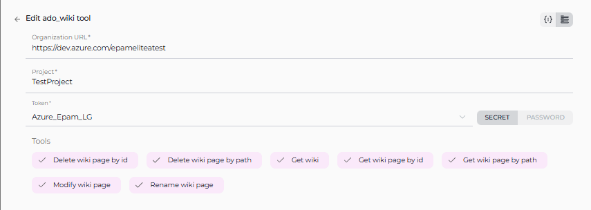
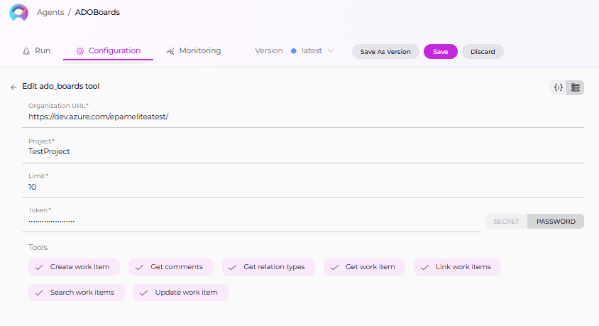
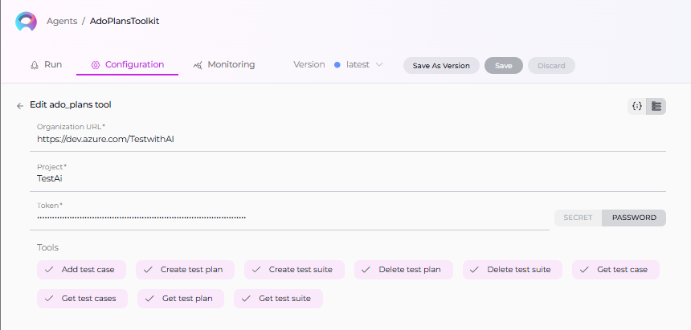

# ELITEA Toolkit Guide: Azure DevOps Wiki, Boards, and Plans Integration

## Introduction

### Purpose of the Guide

This guide is your comprehensive resource for integrating and utilizing the **Azure DevOps (ADO) Wiki, Boards, and Plans toolkits** within ELITEA. It provides detailed, step-by-step instructions, from setting up your Azure DevOps Personal Access Token to configuring these toolkits in ELITEA and seamlessly incorporating them into your Agents. By following this guide, you will unlock the power of automated knowledge management, streamlined project planning, and enhanced workflow automation within Azure DevOps, all directly from the ELITEA platform. This integration empowers you to leverage AI-driven automation to optimize your DevOps processes, enhance team collaboration, and improve overall project visibility within the Azure DevOps ecosystem.

### Brief Overview of Azure DevOps (ADO) Services for Wiki, Boards, and Plans

ELITEA's integration with Azure DevOps focuses on empowering users to leverage key Azure DevOps services for enhanced project management, knowledge sharing, and workflow automation. This guide specifically covers integration with:

*   **Azure Wiki (ADO Wiki):** A collaborative, team-based wiki service within Azure DevOps that allows teams to create, share, and manage project documentation, knowledge bases, release notes, meeting minutes, and other essential project information directly within Azure DevOps. Azure Wiki promotes knowledge sharing and collaboration by providing a central, version-controlled repository for project documentation.
*   **Azure Boards (ADO Boards):** A powerful work tracking and project management service within Azure DevOps that enables teams to plan, organize, track, and manage project tasks, user stories, bugs, features, and epics. Azure Boards provides agile planning tools, customizable dashboards, and workflow automation capabilities to streamline project execution and improve team collaboration.
*   **Azure Test Plans (ADO Test Plans):** A comprehensive test management solution within Azure DevOps that provides tools for planning, executing, and tracking software testing efforts. Azure Test Plans enables teams to define test plans, create test suites, author test cases, execute manual and automated tests, and track test results, ensuring software quality and release readiness.

ELITEA's integration with ADO Wiki, Boards, and Plans allows you to bring these powerful Azure DevOps services directly into your AI-driven workflows, enabling agents to:

*   **Centralize Project Information Access:** Retrieve and utilize up-to-date information directly from ADO Wiki pages, Boards work items, and Test Plans within ELITEA Agents, providing a unified view of project knowledge and status.
*   **Automate Key DevOps Tasks:** Automate routine and time-consuming DevOps tasks such as creating and updating wiki pages, managing work items in Boards (creating, updating, searching), and interacting with Test Plans (creating test plans, suites, cases, retrieving test details), freeing up valuable team time for more strategic activities.
*   **Enhance Collaboration and Communication:** Streamline team collaboration and communication by enabling agents to automatically update work item statuses, add comments to work items and pull requests, and generate reports based on data from Azure DevOps services, ensuring all stakeholders are informed and aligned.
*   **Improve Project Visibility and Reporting:** Generate insightful reports and extract key metrics from Azure DevOps data using ELITEA Agents, providing data-driven visibility into project status, progress, testing efforts, and overall project health, enabling better decision-making and proactive project management.

## Toolkit's Account Setup and Configuration

### Account Creation and Access

### Account Setup

If you do not yet have an Azure DevOps account and organization, please follow these steps to create one, ensuring you have access to Azure DevOps Wiki, Boards, and Plans services:

1.  **Visit Azure DevOps Website:** Open your web browser and navigate to the Azure DevOps website: [https://azure.devops.com/](https://dev.azure.com/).
2.  **Start Free or Sign In:** Click on the **"Start free"** button to create a new Azure DevOps organization, or click **"Sign in to Azure DevOps"** if you already have an organization and wish to sign in.
3.  **Create an Organization (If Needed):**
    *   If you are creating a new organization, click **"Create an Organization"** and follow the prompts to set up your new Azure DevOps organization. You will typically need to provide an organization name, choose a hosting region, and link it to an Azure account (if you have one).
    *   If you are signing into an existing organization, click **"Sign in to Azure DevOps"** and log in using your Microsoft account credentials.
4.  **Enter Account Details:** Provide the required details as prompted during the organization creation or sign-in process. This may include your email address, organization name, and region for hosting your Azure DevOps organization.
5.  **Email Verification (If Prompted):** Verify your email address if prompted by the Azure DevOps signup process. This usually involves clicking a confirmation link sent to your email inbox.
6.  **Log In to Azure DevOps:** Log in to the Azure DevOps dashboard using your newly created or existing Microsoft account credentials.
7.  **Enable Basic Subscription (Essential for Boards, Plans and Wiki):** Ensure that you have a **Basic Azure DevOps subscription** enabled for your account. The Basic subscription is required to access Azure Boards, Azure Repos, Azure Pipelines, Azure Test Plans, and Azure Artifacts. For new organizations, the Basic subscription is typically enabled by default. For existing organizations, you may need to verify or enable it in the organization settings to ensure access to all required services.
8.  **Add Users and Assign Basic Subscription (If Needed):** To grant access to other users within your organization who will be using ELITEA integrations with Azure DevOps Wiki, Boards, and Plans, navigate to your organization settings:
    *   Go to `https://dev.azure.com/{YourOrganizationName}/_settings/users` (replace `{YourOrganizationName}` with your actual Azure DevOps organization name).
    *   Click **"Add users"**.
    *   Enter the user's email address or Microsoft account.
    *   Select **"Basic"** from the "Access level" dropdown to assign a Basic subscription to the user, granting them access to Boards, Plans and Wiki services.
    *   Choose the relevant project(s) to grant the user access to.
    *   Click **"Add"** to add the user to your Azure DevOps organization.
9.  **Add User to Project Member Group (If Needed):** To ensure newly added users have the necessary permissions within a specific project to access and utilize Wiki, Boards, and Plans:
    *   Navigate to **"Project settings"** for your desired project (located at the bottom left of the Azure DevOps interface).
    *   Select **"Groups"** under "Security" in the Project settings menu.
    *   Locate the **"Project Valid Users"** group (or a relevant group for your project's members) and click on the group name.
    *   Click on the **"Members"** tab within the group details.
    *   Click **"Add users or groups"**.
    *   Enter the email address or name of the user you want to add to the project member group and click **"Add"**.
10. **Verify Wiki, Boards and Plans Access:** After completing user setup, refresh the Azure DevOps page and ensure that the **"Boards"**, **"Wiki"** and **"Test Plans"** features are now enabled and visible for your account within your Azure DevOps project. You should see "Boards", "Repos", "Pipelines", "Test Plans", and "Wiki" in the left-hand sidebar of your project. This confirms that you have successfully set up your Azure DevOps account and have access to Azure DevOps Services required for ELITEA integration.

**Note:** If the "Boards", "Wiki", or "Test Plans" features are not available, you may need to create a new project within your Azure DevOps organization or verify that these services are enabled for your organization and project in the Azure DevOps organization settings under "General" -> "Services".

### Token/API Key Generation: Creating a Personal Access Token in Azure DevOps

For secure integration with ELITEA, it is essential to use an Azure DevOps **Personal Access Token (PAT)**. This method is significantly more secure than using your primary Azure DevOps account password directly and allows you to precisely control the permissions granted to ELITEA for accessing Azure DevOps Wiki, Boards, and Plans services.

**Follow these steps to generate a Personal Access Token (PAT) in Azure DevOps:**

1.  **Log in to Azure DevOps:** Access your Azure DevOps organization by navigating to `https://dev.azure.com/` and logging in with your credentials.
2.  **Access User Settings:** Click on the **User settings** icon, typically located in the top right corner of the Azure DevOps interface, next to your profile picture. From the dropdown menu, select **"Personal access tokens"**.
3.  **Generate New Token:** On the "Personal Access Tokens" page, click the **"+ New Token"** button to create a new PAT.
4.  **Configure Token Details:** In the "Create a new personal access token" panel, configure the following settings:
    *   **Name:** In the "Name" field, enter a descriptive label for your token. For example, use "ELITEA Wiki Boards Plans Token" or "ELITEA Agent Access for ADO Services." This label will help you easily identify the purpose of this token in the future.
    *   **Organization (Optional):** Select the Azure DevOps organization for which this token will be valid. In most cases, you will select "All accessible organizations" to allow the token to access resources across your organizations.
    *   **Expiration (Recommended):** For enhanced security, it is highly recommended to set an **Expiration date** for your token. Choose a reasonable validity period that aligns with your security policies. Shorter expiration periods are generally more secure.
    *   **Scopes - Grant Least Privilege (Crucial for Security):** Carefully and deliberately select the **scopes** or permissions you grant to this token. **It is paramount to grant only the minimum necessary permissions** required for your ELITEA Agent's intended interactions with Azure DevOps Wiki, Boards, and Plans. Overly permissive tokens pose a significant security risk. For typical ELITEA integration with ADO Wiki, Boards, and Plans, consider these minimal scopes, selecting **"Custom defined"** and then choosing granular scopes:

        *   **Minimal Scopes for Common Use Cases:**
            *   **Work items:** Expand the "Work items" section and select:
                *   **Read:** (If your Agent only needs to retrieve information from Azure Boards, select "Read")
                *   **Write:** (If your Agent needs to create, update, or manage work items in Azure Boards, select "Write". Only include this if your Agent needs to modify Boards content.)
            *   **Wiki:** Expand the "Wiki" section and select:
                *   **Read & write:** (Grants read and write access to Azure DevOps Wiki, allowing Agents to both retrieve and modify wiki content. If your Agent only needs to read Wiki content, you can select "Read" for tighter security.)
            *   **Test Management:** Expand the "Test Management" section and select:
                 *   **Read:** (If your Agent only needs to retrieve information from Azure Test Plans, select "Read")
                *   **Read & write:** (If your Agent needs to create, update, or manage test plans, test suites, or test cases in Azure Test Plans, select "Read & write". Only include write access if your Agent needs to modify Test Plans content.)

        *   **Important Scope Considerations:**
            *   **Granular Scopes:** Whenever possible, opt for granular scopes (e.g., "Work items - Read", "Wiki - Read") over broader scopes (e.g., "Work items - Full access", "Wiki - Read & write") to adhere to the principle of least privilege.
            *   **Tool-Specific Scopes:**  Select scopes based on the specific Azure DevOps toolkits you intend to use in ELITEA. If you are only using the ADO Wiki toolkit, you only need to grant Wiki scopes, and so on. Avoid granting scopes for toolkits you are not using.

    **Important Security Best Practices:**

    *   **Principle of Least Privilege:** **Strictly adhere to the principle of least privilege.** Grant only the absolute minimum set of scopes necessary for your ELITEA Agent to perform its specific, intended tasks with Azure DevOps Wiki, Boards, and Plans. Avoid granting broad or unnecessary permissions.
    *   **Avoid Full Access Scopes:** **Avoid granting full access scopes like "Full access" unless absolutely necessary and with a clear and thorough understanding of the significant security implications.** Full access scopes provide extensive administrative privileges and should be avoided for integration purposes whenever possible.
    *   **Regular Token Review and Rotation:** Implement a process for regularly reviewing the Personal Access Tokens you have generated, their associated scopes, and their usage. Rotate tokens periodically (generate new tokens and revoke older ones) as a proactive security measure, especially for integrations that handle sensitive data or critical operations within Azure DevOps.
    *   **Secure Storage:** Store the generated Personal Access Token securely, preferably using ELITEA's built-in Secrets Management feature, rather than hardcoding it directly in Agent configurations or less secure storage locations.

5.  **Create Token:** Click the **"Create"** button at the bottom of the panel to generate your Personal Access Token.
6.  **Securely Copy and Store the Token:** **Immediately copy the generated token** that is displayed in the "Success!" pop-up window. **This is the only time you will be able to view and copy the full token value.** Store it securely using a robust password manager or, ideally, ELITEA's built-in Secrets feature for enhanced security within the ELITEA platform. You will require this token to configure the Azure DevOps Wiki, Boards, and Plans toolkits within ELITEA.

## System Integration with ELITEA

### Overview and Usage of Azure DevOps (ADO) Toolkits Integration with ELITEA

ELITEA's integration with Azure DevOps provides a suite of toolkits that allow your AI Agents to seamlessly interact with various Azure DevOps services, including Wiki, Boards, and Test Plans. This integration empowers your Agents to:

*   **Access Azure DevOps Data:** Retrieve and utilize information from Azure DevOps Wiki pages, Boards work items, and Test Plans directly within ELITEA workflows.
*   **Automate DevOps Tasks:** Automate tasks such as creating and updating wiki pages, managing work items in Boards, and interacting with Test Plans, streamlining your DevOps processes.
*   **Enhance Project Management:** Integrate AI-powered automation into your project management workflows, improving efficiency and collaboration within Azure DevOps projects.
*   **Improve Reporting and Insights:** Generate reports and extract insights from Azure DevOps data using ELITEA Agents, providing data-driven visibility into project status and progress.

### Integration Steps: Configuring Azure DevOps (ADO) Toolkits in ELITEA

To integrate Azure DevOps Wiki, Boards, and Test Plans with ELITEA and enable your Agents to interact with these services, follow these configuration steps within ELITEA:

1.  **Navigate to Agents Menu:** In ELITEA, go to the **Agents** menu and either **create a new Agent** or **edit an existing Agent** that you want to integrate with Azure DevOps services.
2.  **Access Toolkits Section:** Within the Agent configuration, scroll down to the **"Tools"** section.
3.  **Add Toolkit:** Click the **"+" icon** under the "TOOLS" section to add a new toolkit.
4.  **Select Azure DevOps Toolkit:** From the dropdown list of available toolkits, choose the specific Azure DevOps toolkit you want to configure:
    *   **"Azure Wiki (ADO Wiki)"** (for Azure DevOps Wiki)
    *   **"Azure Boards (ADO Board)"** (for Azure DevOps Boards)
    *   **"Azure Test Plans (ADO Test Plan)"** (for Azure DevOps Test Plans)
5.  **Configure Azure DevOps Toolkit Settings:**  Fill in the configuration fields for the selected Azure DevOps toolkit. The configuration steps are similar for all ADO toolkits:

    *   **ADO Organization URL:** Enter your Azure DevOps organization URL. **Ensure you use the correct format**, including your organization name: `https://dev.azure.com/{YourOrganizationName}` (Replace `{YourOrganizationName}` with your actual Azure DevOps organization name).
    *   **Project Name:** Enter the **Project Name** within your Azure DevOps organization that contains the Wiki, Boards, or Test Plans you want to access (e.g., `MyProject`).
    *   **Personal Access Token:** Paste the **Personal Access Token** you generated in Azure DevOps (during the "Software-Specific Setup" section of this guide) into the **"Personal Access Token"** field.  **Important Security Note:** For enhanced security, consider using the **"Secret"** option instead and storing your Personal Access Token securely as a Secret within [Secrets](../../menus/settings/secrets.md) feature.

    

    

    

6.  **Enable Desired Tools:** In the **"Tools"** section within the Azure DevOps toolkit configuration, **check the boxes next to the specific Azure DevOps tools** you want to enable for your Agent. Select only the tools that your Agent will actually need to use to minimize unnecessary permissions and maintain security.  The available tools vary depending on the specific Azure DevOps toolkit you are configuring (Wiki, Boards, or Test Plans). Refer to the "Tool Overview" section below for details on the tools available for each toolkit type.

7.  **Complete Setup:** Click the **arrow icon** (located at the top right of the toolkit configuration section) to complete the Azure DevOps toolkit setup and return to the main Agent configuration menu.

### 3.3 Tool Overview: Azure DevOps (ADO) Toolkit Functionalities

Once the Azure DevOps toolkits are configured and added to your Agent, you can leverage the following tools within your Agent's instructions to interact with Azure DevOps services:

#### ADO Wiki Tools:

*   **Get Wiki:**  **Tool Name:** `get_wiki`
    *   **Functionality:** Retrieves the list of all wikis available in the Azure DevOps Wiki for the specified project.
    *   **Purpose:** Enables Agents to list available wikis for navigation, reporting, or to provide users with a choice of wikis to interact with.
*   **Get Wiki Page by Path:**  **Tool Name:** `get_wiki_page_by_path`
    *   **Functionality:** Fetches a specific wiki page from Azure DevOps Wiki using its path within the wiki.
    *   **Purpose:** Retrieve content from specific wiki pages to provide context, answer user questions, or incorporate wiki content into ELITEA workflows.
*   **Get Wiki Page by ID:**  **Tool Name:** `get_wiki_page_by_id`
    *   **Functionality:** Fetches a specific wiki page from Azure DevOps Wiki using its unique page ID.
    *   **Purpose:** Retrieve content from specific wiki pages when you have the Page ID available, ensuring accurate retrieval of the intended wiki page.
*   **Delete Wiki Page by Path:**  **Tool Name:** `delete_wiki_page_by_path`
    *   **Functionality:** Deletes a specific wiki page from Azure DevOps Wiki using its path.
    *   **Purpose:** Automate wiki page cleanup tasks, removing obsolete or outdated documentation pages based on workflow triggers or user requests.
*   **Delete Wiki Page by ID:**  **Tool Name:** `delete_wiki_page_by_id`
    *   **Functionality:** Deletes a specific wiki page from Azure DevOps Wiki using its unique page ID.
    *   **Purpose:** Automate precise wiki page deletion when you have the Page ID, ensuring accurate removal of specific wiki pages.
*   **Modify Wiki Page:**  **Tool Name:** `modify_wiki_page`
    *   **Functionality:** Allows modifications to the content of an existing wiki page in Azure DevOps Wiki.
    *   **Purpose:** Automate wiki updates, allowing Agents to dynamically update documentation, add meeting notes, or modify wiki content based on workflow events or user interactions.
*   **Rename Wiki Page:**  **Tool Name:** `Rename_Wiki_Page`
    *   **Functionality:** Allows renaming of the wiki pages.
    *   **Purpose:** Automate wiki updates, allowing Agents to dynamically update documentation, or modify wiki content based on workflow events or user interactions.

#### ADO Board Tools:

*   **Search Work Item:**  **Tool Name:** `search_work_item`
    *   **Functionality:** Allows users to search for specific work items within Azure DevOps Boards based on various criteria such as keywords, status, and assigned user.
    *   **Purpose:** Enable Agents to search for work items based on user queries, keywords, or specific criteria, facilitating efficient work item retrieval and information access within ELITEA workflows.
*   **Get Work Item:**  **Tool Name:** `get_work_item`
    *   **Functionality:** Retrieves detailed information about a specific work item from Azure DevOps Boards, including its status, description, and associated tasks.
    *   **Purpose:** Allow Agents to fetch detailed work item information to provide context, summarize task status, or incorporate work item details into ELITEA conversations or reports.
*   **Create Work Item:**  **Tool Name:** `create_work_item`
    *   **Functionality:** Enables users to create new work items directly within Azure DevOps Boards, specifying details such as title, description, priority, and assigned user.
    *   **Purpose:** Automate work item creation based on ELITEA workflow triggers or user requests, streamlining task management and issue reporting processes.
*   **Update Work Item:** **Tool Name:** `update_work_item`
    *   **Functionality:** Enables users to update fields of existing work items directly within Azure DevOps Boards, specifying fields and values.
    *   **Purpose:** Automate work item updates based on ELITEA workflow triggers or user requests, streamlining task management and issue resolution processes.
*   **Link Work Item:** **Tool Name:** `link_work_item`
    *   **Functionality:** Enables users to create links between two existing work items in Azure DevOps Boards, specifying the target and source work items and link type.
    *   **Purpose:** Automate linking work items to represent relationships between tasks, user stories, bugs, or other work items, enhancing traceability and project management within ELITEA workflows.
*   **Get Relation Types:** **Tool Name:** `get_relation_types`
    *   **Functionality:** Retrieves a list of available relation types for work items in Azure DevOps Boards.
    *   **Purpose:** Allows Agents to dynamically retrieve valid relation types for work items, enabling dynamic link creation and providing users with valid linking options within ELITEA workflows.
*   **Get Comments:** **Tool Name:** `get_comments`
    *   **Functionality:** Retrieves comments from Azure DevOps Boards.
    *   **Purpose:** Allow Agents to fetch work item information to provide context, summarize task status, or incorporate work item details into ELITEA conversations or reports.

#### ADO Test Plan Tools:

*   **Create Test Plan:**  **Tool Name:** `create_test_plan`
    *   **Functionality:** Allows users to create new test plans within Azure DevOps Test Plans.
    *   **Use Case:** Automate the creation of test plans for new features, releases, or testing cycles directly from ELITEA workflows.
*   **Delete Test Plan:**  **Tool Name:** `delete_test_plan`
    *   **Functionality:** Enables users to delete existing test plans from Azure DevOps Test Plans.
    *   **Use Case:** Automate the removal of obsolete or outdated test plans, keeping your test management environment clean and organized.
*   **Get Test Plan:**  **Tool Name:** `get_test_plan`
    *   **Functionality:** Retrieves detailed information about a specific test plan from Azure DevOps Test Plans.
    *   **Use Case:** Allow Agents to fetch test plan details for reporting, analysis, or to provide users with summaries of test plan status and progress within ELITEA.
*   **Create Test Suite:**  **Tool Name:** `create_test_suite`
    *   **Functionality:** Allows users to create new test suites within a specific test plan in Azure DevOps Test Plans.
    *   **Use Case:** Automate the creation of test suites to organize test cases logically within test plans, streamlining test planning and management.
*   **Delete Test Suite:**  **Tool Name:** `delete_test_suite`
    *   **Functionality:** Enables users to delete existing test suites from Azure DevOps Test Plans.
    *   **Use Case:** Automate the removal of obsolete test suites, keeping your test plans organized and focused on relevant test cases.
*   **Get Test Suite:**  **Tool Name:** `get_test_suite`
    *   **Functionality:** Retrieves detailed information about a specific test suite from Azure DevOps Test Plans.
    *   **Use Case:** Enable Agents to fetch test suite details for reporting, analysis, or to provide users with summaries of test suite contents and status within ELITEA.
*   **Add Test Case:**  **Tool Name:** `add_test_case`
    *   **Functionality:** Allows users to add new test cases to a specific test suite in Azure DevOps Test Plans.
    *   **Use Case:** Automate the creation of test cases based on requirements, user stories, or other triggers within ELITEA workflows, streamlining test case authoring.
*   **Get Test Case:**  **Tool Name:** `get_test_case`
    *   **Functionality:** Retrieves detailed information about a specific test case from Azure DevOps Test Plans.
    *   **Use Case:** Allow Agents to fetch test case details for test execution guidance, reporting, or to provide users with specific test case information within ELITEA.
*   **Get Test Cases:**  **Tool Name:** `get_test_cases`
    *   **Functionality:** Retrieves a list of test cases from Azure DevOps Test Plans, allowing for filtering and retrieval of test cases based on various criteria.
    *   **Use Case:** Enables Agents to fetch test case lists for test management, reporting, or to provide users with a selection of test cases within ELITEA workflows.

## 4. Instructions and Prompts for Using the Azure DevOps (ADO) Toolkits

To effectively utilize the Azure DevOps toolkits within your ELITEA Agents, you need to provide clear instructions within the Agent's "Instructions" field, telling the Agent *how* and *when* to use these tools.

**General Instruction Structure:**

When instructing your Agent to use an Azure DevOps toolkit, you will typically follow this pattern:

```
Use the "[tool_name]" tool to [describe the action you want to perform] in ADO [Wiki/Boards/Test Plans].
Provide the following parameters:
- Parameter 1: <value or description of value>
- Parameter 2: <value or description of value>
- ...
```

**Example Agent Instructions for Azure DevOps (ADO) Toolkits Tools:**

*   **Agent Instructions for Getting a Wiki Page by Path:**

    ```
    Use the "get_wiki_page_by_path" tool to retrieve content from a specific wiki page in Azure DevOps Wiki.
    Provide the following parameters:
    - Organization Name: "your-azure-devops-organization-name"
    - Project Name: "your-azure-devops-project-name"
    - Wiki Path: "/path/to/your/wiki/page"
    - Wiki Name or ID: "your-wiki-name-or-id"
    ```

*   **Agent Instructions for Creating a Work Item in Azure Boards:**

    ```
    Use the "create_work_item" tool to create a new User Story work item in Azure Boards.
    Provide the following parameters:
    - Organization Name: "your-azure-devops-organization-name"
    - Project Name: "your-azure-devops-project-name"
    - Title: "Implement new user authentication flow"
    - Work Item Type: "User Story"
    - Description: "As a user, I want to be able to log in using my social media account..."
    ```

*   **Agent Instructions for Creating a Test Plan in Azure Test Plans:**

    ```
    Use the "create_test_plan" tool to create a new test plan in Azure Test Plans.
    Provide the following parameters:
    - Organization Name: "your-azure-devops-organization-name"
    - Project Name: "your-azure-devops-project-name"
    - Test Plan Name: "Regression Tests - Release 1.5"
    - Area Path: "ProjectAlpha\\Release 1.5"
    ```

**Important Considerations for Agent Instructions:**

*   **Tool Name Accuracy:** Ensure you use the correct **Tool Name** (e.g., `"get_wiki_page_by_path"`, `"create_work_item"`, `"create_test_plan"`) as listed in the "Tool Overview" section. Typos or incorrect tool names will prevent the Agent from using the toolkit correctly.
*   **Parameter Clarity:** Clearly specify the **parameters** required for each tool and provide instructions on where the Agent should obtain the values for these parameters (e.g., from user input, from previous steps in the workflow, or hardcoded values).
*   **Context and Examples:** Provide sufficient context and examples within your Agent's "Instructions" to guide the LLM in understanding *when* and *how* to use the Azure DevOps toolkit tools effectively within your desired workflow.
*   **Azure DevOps Hierarchy:** Be mindful of the Azure DevOps organization, project, and Wiki/Boards/Test Plans hierarchy when providing parameters like "Organization Name," "Project Name," "Wiki Name or ID," etc. Ensure these parameters accurately reflect the location of the resource you are trying to access or modify.

## Best Practices and Use Cases for Azure DevOps (ADO) Integration

### Best Practices for Efficient Integration

*   **Test Integration Thoroughly:** After setting up the Azure DevOps toolkits and incorporating them into your Agents, **thoroughly test each tool** you intend to use to ensure seamless connectivity, correct authentication, and accurate execution of Azure DevOps actions.
*   **Monitor Agent Performance and Usage:**  Regularly **monitor the performance of Agents** utilizing Azure DevOps toolkits. Track metrics such as task completion success rate, execution time, and error rates to identify any potential issues or areas for optimization in Agent instructions or toolkit configurations.
*   **Follow Security Best Practices:**
    *   **Use Personal Access Tokens:** Always use Azure DevOps Personal Access Tokens instead of your main account password for integrations.
    *   **Grant Least Privilege:** Grant only the minimum necessary scopes/permissions to the Personal Access Token to limit potential security risks.
    *   **Securely Store Credentials:** Utilize ELITEA's Secrets Management feature to securely store and manage your Azure DevOps Personal Access Tokens instead of hardcoding them directly in Agent configurations.
*   **Provide Clear Instructions and Prompts:**  Craft clear and unambiguous instructions within your ELITEA Agents to guide them in using the Azure DevOps toolkits effectively. Use the prompt examples provided in this guide as a starting point and adapt them to your specific use cases.
*   **Start with Simple Use Cases:** Begin by implementing Azure DevOps integration for simpler automation tasks, such as retrieving information or updating work item statuses, and gradually progress to more complex workflows as you gain experience and confidence with the toolkits.

### Use Cases

The Azure DevOps toolkits open up a wide range of automation possibilities for project management, documentation, and testing workflows within ELITEA. Here are some compelling use cases categorized by toolkit type:

**ADO Wiki Toolkit Use Cases:**

*   **Automated Retrieval of Release Notes for Support:**
    *   **Scenario:** During a support interaction, an Agent can automatically retrieve the latest release notes from the project wiki to provide users with up-to-date information on new features and bug fixes.
    *   **Tools Used:** `get_wiki_page_by_path`
    *   **Example Instruction:** "Use the 'get_wiki_page_by_path' tool to read the content of the wiki page at path '/Release Notes/Latest Release' and display it to the user."
    *   **Benefit:** Enhances support interactions by providing agents with immediate access to current release information, improving support efficiency and user satisfaction.

*   **Dynamic Content Creation for Project Dashboards:**
    *   **Scenario:** Agents can dynamically generate content for project dashboards within ELITEA by retrieving data from various sources and formatting it into wiki pages for display.
    *   **Tools Used:** `modify_wiki_page`
    *   **Example Instruction:** "Use the 'modify_wiki_page' tool to update the wiki page 'Project Dashboard' with the latest build status and test results summarized from other ELITEA workflows."
    *   **Benefit:** Enables dynamic and automated dashboard updates, ensuring project dashboards within ELITEA always display the most current information, improving project visibility and awareness.

*   **Automated Wiki Cleanup for Content Management:**
    *   **Scenario:** Implement a workflow to automatically delete outdated meeting minutes or temporary documentation pages from the project wiki after a certain period to maintain wiki cleanliness.
    *   **Tools Used:** `delete_wiki_page_by_path`
    *   **Example Instruction:** "Use the 'delete_wiki_page_by_path' tool to delete wiki pages in the '/Meeting Minutes/Archive' path that are older than 90 days."
    *   **Benefit:** Automates wiki maintenance tasks, ensuring the project wiki remains organized, relevant, and easy to navigate by automatically removing outdated content.

**ADO Board Tools Use Cases:**

*   **Intelligent Work Item Search for Task Prioritization:**
    *   **Scenario:** Developers can use ELITEA Agents to quickly search for work items assigned to them, filtered by priority or status, to efficiently prioritize their tasks for the day.
    *   **Tools Used:** `search_work_item`
    *   **Example Instruction:** "Use the 'search_work_item' tool to find all 'Task' work items assigned to me that are currently in 'Active' state and sorted by 'Priority'."
    *   **Benefit:** Improves developer efficiency by providing a fast and intelligent way to find and prioritize their work items directly within ELITEA, streamlining daily task management.

*   **Contextual Work Item Details for Team Discussions:**
    *   **Scenario:** During team meetings or project discussions within ELITEA, Agents can provide immediate access to detailed information about specific work items to provide context and facilitate informed decision-making.
    *   **Tools Used:** `get_work_item`
    *   **Example Instruction:** "Use the 'get_work_item' tool to get details for work item with ID [work_item_id] and display the 'Title', 'Description', and 'Status' to the team."
    *   **Benefit:** Enhances team collaboration by providing immediate access to relevant work item details within ELITEA, improving context and facilitating more focused and productive discussions.

*   **Automated Bug Logging from ELITEA Workflows:**
    *   **Scenario:** When automated tests within ELITEA workflows detect a bug, automatically create a new Bug work item in Azure Boards, pre-populated with error details and relevant context from the test execution.
    *   **Tools Used:** `create_work_item`
    *   **Example Instruction:** "Use the 'create_work_item' tool to create a new 'Bug' work item with the title 'Automated Test Failure Detected' and description containing the error logs and test details from the failed workflow step."
    *   **Benefit:** Streamlines bug reporting and issue tracking by automating bug logging directly from ELITEA workflows, ensuring timely and consistent bug reporting and accelerating the bug triage process.

*   **Automated Work Item Updates Based on Workflow Progress:**
    *   **Scenario:** As tasks progress through ELITEA workflows, automatically update the status of linked work items in Azure Boards to reflect the current progress and keep project status up-to-date.
    *   **Tools Used:** `update_work_item`
    *   **Example Instruction:** "Use the 'update_work_item' tool to update work item with ID [work_item_id]. Set the 'Status' field to 'In Progress' when the workflow reaches the 'Development' stage."
    *   **Benefit:** Automates work item status management, ensuring work item statuses are always synchronized with the actual project progress. Reduces manual status updates and improves project tracking accuracy and real-time visibility.

*   **Automated Linking of Related Work Items:**
    *   **Scenario:** When a new feature request work item is created in ELITEA, automatically link it to related User Story work items in Azure Boards to establish clear relationships and dependencies between features and user stories.
    *   **Tools Used:** `link_work_item`
    *   **Example Instruction:** "Use the 'link_work_item' tool to link work item with ID [feature_work_item_id] to work item with ID [user_story_work_item_id] using the 'Relates to' link type."
    *   **Benefit:** Enhances work item traceability and project management by automating the creation of links between related work items, providing a clear view of dependencies and relationships between different aspects of the project.

**ADO Test Plan Tools Use Cases:**

*   **Automated Test Plan Creation for Release Cycles:**
    *   **Scenario:** At the start of each release cycle, automatically create a new test plan in Azure Test Plans, pre-populated with a predefined set of test suites and test cases, to streamline test planning for new releases.
    *   **Tools Used:** `create_test_plan`, `create_test_suite`, `add_test_case`
    *   **Example Instruction:** "Use the 'create_test_plan' tool to create a new test plan named 'Regression Tests - Release [release_version]'. Then, use 'create_test_suite' and 'add_test_case' to populate the test plan with standard regression test suites and test cases."
    *   **Benefit:** Automates test planning and setup for each release cycle, saving significant time and effort in test planning and ensuring consistent test coverage for every release.

*   **Dynamic Test Suite Creation Based on Feature Scope:**
    *   **Scenario:** When a new feature is developed, automatically create a dedicated test suite within the project's test plan in Azure Test Plans to organize test cases specific to that feature.
    *   **Tools Used:** `create_test_suite`
    *   **Example Instruction:** "Use the 'create_test_suite' tool to create a new test suite named 'Feature [feature_name] Tests' within the test plan 'Regression Test Plan'."
    *   **Benefit:** Enables dynamic and organized test case management by automatically creating test suites tailored to specific features, improving test organization and focus.

*   **Automated Test Case Updates from Requirements Changes:**
    *   **Scenario:** When requirements for a specific feature change, automatically update the corresponding test cases in Azure Test Plans to ensure test cases remain aligned with the latest requirements.
    *   **Tools Used:** `get_test_case`
    *   **Example Instruction:** "Use the 'get_test_case' tool to retrieve the test case with ID [test_case_id].
    *   **Benefit:** Automates test case maintenance, ensuring test cases are always up-to-date with the latest requirements, reducing manual effort in test case updates and improving test accuracy.

*   **Reporting on Test Plan Status and Progress:**
    *   **Scenario:** Project managers can use ELITEA Agents to generate reports summarizing the status and progress of test execution within specific test plans, providing real-time visibility into testing efforts.
    *   **Tools Used:** `get_test_plan`, `get_test_suite`, `get_test_case`
    *   **Example Instruction:** "Use the 'get_test_plan' tool to get details for test plan 'Regression Test Plan'. Summarize the overall test execution status and progress for each test suite within the plan and present a report to the project manager."
    *   **Benefit:** Provides project managers with automated and up-to-date reports on test plan status and progress directly within ELITEA, improving project visibility and enabling data-driven decision-making regarding release readiness.

## Troubleshooting and Support

### Troubleshooting Common Issues

*   **Connection Errors:**
    *   **Problem:** ELITEA Agent fails to connect to Azure DevOps services (Wiki, Boards, Test Plans), resulting in errors during toolkit execution.
    *   **Possible Solutions:**
        1.  **Verify Azure DevOps URL:** Double-check that you have entered the correct Azure DevOps organization URL in the toolkit configuration, including `https://dev.azure.com/{YourOrganizationName}` format.
        2.  **Check Personal Access Token:** Ensure that the **Personal Access Token** you provided is correct, has not expired, and is valid for your Azure DevOps account and project.
        3.  **Verify Token Scopes:** Review the **scopes/permissions** granted to your Personal Access Token. Ensure it has the necessary scopes (e.g., `vso.work_full`, `vso.wiki_full`, `vso.test_full`) for the Azure DevOps tools your Agent is trying to use.
        4.  **Network Connectivity:** Confirm that both your ELITEA environment and your Azure DevOps instance are connected to the internet and that there are no network connectivity issues blocking the integration.

*   **Permission Denied Errors:**
    *   **Problem:** Agent execution fails with "Permission Denied" or "Unauthorized" errors when trying to access or modify Azure DevOps resources.
    *   **Possible Solutions:**
        1.  **Verify Token Scopes:**  Double-check the **scopes/permissions** granted to your Azure DevOps Personal Access Token. Ensure it has the necessary scopes for the specific Azure DevOps actions your Agent is trying to perform (e.g., `vso.work_write` scope for creating work items, `vso.wiki_write` for modifying wiki pages, `vso.test_write` for managing test plans).
        2.  **Project and User Permissions:** Confirm that the Azure DevOps account associated with the Personal Access Token has the required access to the specified project and the specific Azure DevOps services (Wiki, Boards, Test Plans). Verify that the account is a member of the project and has the necessary roles or permissions within Azure DevOps project settings.

*   **Incorrect Organization or Project Names:**
    *   **Problem:** Agent tools fail to operate on the intended Azure DevOps organization or project.
    *   **Possible Solutions:**
        1.  **Double-Check Organization Name:** Carefully verify that you have entered the correct Azure DevOps Organization Name in the toolkit configuration, ensuring it matches your Azure DevOps organization URL (e.g., `AlitaTest` in `https://dev.azure.com/AlitaTest/`). Pay attention to capitalization and spelling.
        2.  **Verify Project Name:** Ensure that you are using the correct Azure DevOps Project Name in the toolkit configuration. Project names are case-sensitive in Azure DevOps.

### FAQs

1.  **Q: Can I use my regular Azure DevOps password for the ELITEA integration?**
    *   **A:** No, it is **strongly recommended to use an Azure DevOps Personal Access Token** instead of your main account password for security reasons. Personal Access Tokens provide a more secure and controlled way to grant access to external applications like ELITEA.
2.  **Q: What scopes/permissions should I grant to the Azure DevOps Personal Access Token?**
    *   **A:** Grant only the **minimum necessary scopes** required for your ELITEA Agent's intended interactions with Azure DevOps services. For typical integration with ADO Wiki, Boards, and Test Plans, the `vso.work_full`, `vso.wiki_full`, and `vso.test_full` scopes are commonly needed. Avoid granting "Full access" or unnecessary permissions.
3.  **Q: What is the correct format for the Azure DevOps Organization URL in the toolkit configuration?**
    *   **A:**  The Azure DevOps URL should be entered in the format `https://dev.azure.com/{YourOrganizationName}`. Replace `{YourOrganizationName}` with your actual Azure DevOps organization name.
4.  **Q: Why is my Agent getting "Permission Denied" errors even though I think I have configured everything correctly?**
    *   **A:** Double-check the **scopes/permissions** granted to your Azure DevOps Personal Access Token. Ensure that the token has the specific scopes required for the Azure DevOps tools your Agent is trying to use (e.g., `vso.work_write` scope for creating work items, `vso.wiki_write` for modifying wiki pages, `vso.test_write` for managing test plans). Also, verify that the Azure DevOps account associated with the token has the necessary access to the target project and the specific Azure DevOps services (Wiki, Boards, Test Plans).

### Support and Contact Information

If you encounter any issues, have questions, or require further assistance beyond what is covered in this guide regarding the Azure DevOps integration or ELITEA Agents in general, please do not hesitate to contact our dedicated ELITEA Support Team. We are here to help you resolve any problems quickly and efficiently and ensure you have a smooth and productive experience with ELITEA.

**How to Reach ELITEA Support:**

*   **Email:**  **[SupportAlita@epam.com](mailto:SupportAlita@epam.com)**

**Best Practices for Effective Support Requests:**

To help us understand and resolve your issue as quickly as possible, please ensure you provide the following information in your support email:

*   **ELITEA Environment:** Clearly specify the ELITEA environment you are using (e.g., "Nexus," "Alita Lab," "EYE").
*   **Project Details:**  Indicate the **Project Name** and whether you are working in your **Private** workspace or a **Team** project.
*   **Detailed Issue Description:** Provide a clear, concise, and detailed description of the problem you are encountering. Explain what you were trying to do, what you expected to happen, and what actually occurred.
*   **Relevant Configuration Information:**  To help us diagnose the issue, please include relevant configuration details, such as:
    *   **Agent Instructions (Screenshot or Text):** If the issue is with an Agent, provide a screenshot or copy the text of your Agent's "Instructions" field.
    *   **Toolkit Configurations (Screenshots):** If the issue involves the Azure DevOps toolkits or other toolkits, include screenshots of the toolkit configuration settings within your Agent.
*   **Error Messages (Full Error Text):** If you are encountering an error message, please provide the **complete error text**. In the Chat window, expand the error details and copy the full error message. This detailed error information is crucial for diagnosis.
*   **Your Query/Prompt (Exact Text):** If the issue is related to Agent execution, provide the exact query or prompt you used to trigger the issue.

**Before Contacting Support:**

We encourage you to first explore the resources available within this guide and the broader ELITEA documentation. You may find answers to common questions or solutions to known issues in the documentation.

## Useful Links

To further enhance your understanding and skills in integrating Azure DevOps with ELITEA, here are some helpful resources:

*   **[Azure DevOps Website](https://azure.devops.com/)**: Access the main Azure DevOps platform to create an account or log in.
*   **[Azure DevOps Login Page](https://azure.devops.com/)**: Directly access the login page for Azure DevOps.
*   **[ELITEA Secrets Management](../../menus/settings/secrets.md)**: Learn how to securely store your Azure DevOps Personal Access Token using ELITEA's Secrets management feature for enhanced security.
*   **[ELITEA Agents Configuration](../../menus/agents.md)**:  Find out more about creating and configuring Agents in ELITEA, where you integrate the Azure DevOps toolkits to automate your workflows.
*   **[ELITEA Toolkit Guide: Azure Repos (ADO Repos) Integration](ado_repos_toolkit.md#elitea-toolkit-guide-azure-repos-ado-repos-integration)**: Refer to the Azure Repos Integration Guide for detailed information on setting up Azure DevOps accounts, organizations, and Personal Access Tokens.
*   **[ELITEA Support Email](mailto:SupportAlita@epam.com)**: Contact the ELITEA support team for direct assistance with Azure DevOps integration or any other questions and issues you may encounter.
