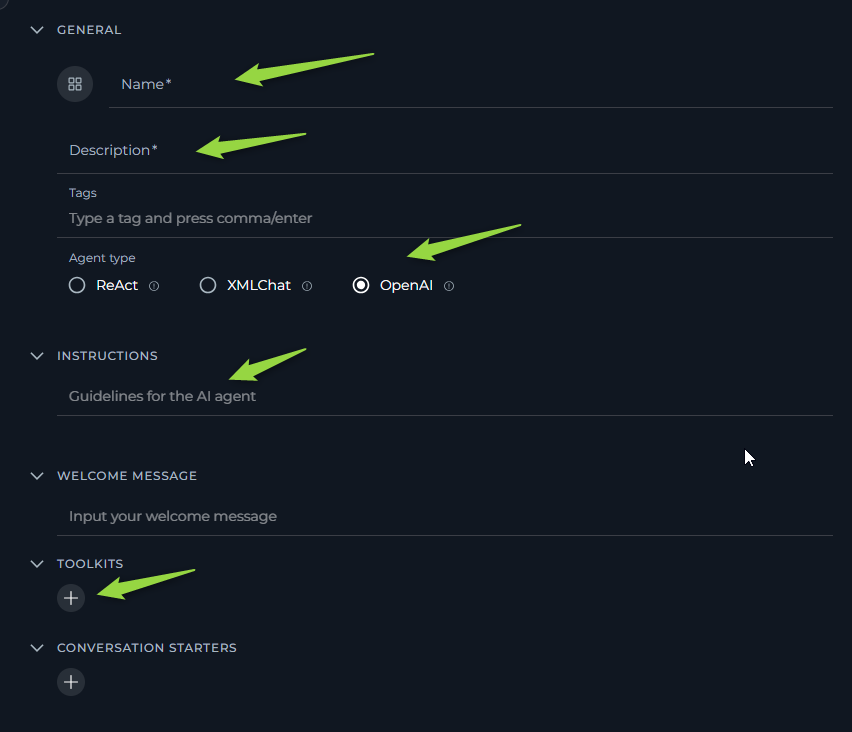
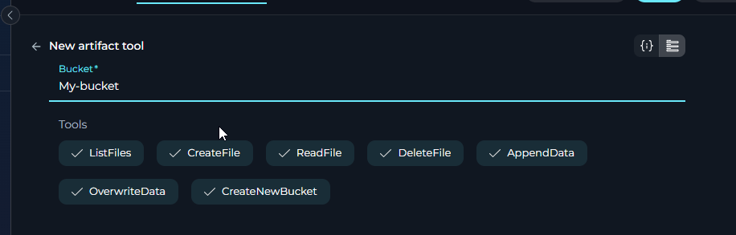
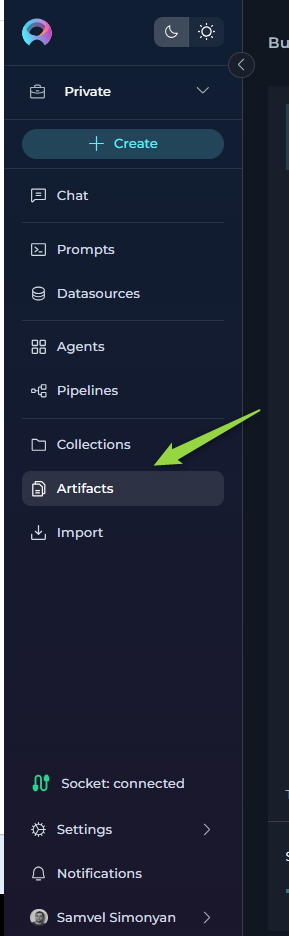
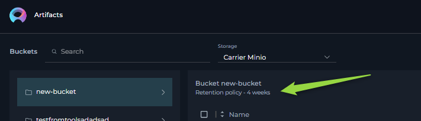
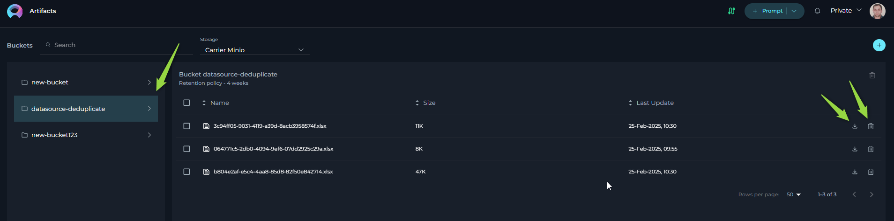

# ELITEA Agent Toolkit: Artifact Toolkit Guide

## Introduction

## Purpose and Overview

This guide is designed to assist users in setting up and utilizing the Artifact Toolkit within the ELITEA application. It provides detailed instructions on configuring the toolkit and integrating it into ELITEA agents. This integration empowers agents to leverage artifacts for temporary data storage, context management, and inter-agent data sharing, enhancing the efficiency of data handling within AI-driven workflows.

## Brief Overview of the Artifact Toolkit

The Artifact Toolkit within ELITEA provides a simple yet powerful data storage mechanism for AI agents. It allows agents to create, read, update, and delete text-based files within project-specific buckets. Think of buckets as folders where agents can store temporary data files. This toolkit is particularly useful for:

*   **Temporary Data Storage:** Storing intermediate results, generated content, or data retrieved during agent operations.
*   **Context Management:** Preserving context across multiple agent actions or workflow steps by storing and retrieving relevant information from artifacts.
*   **Data Sharing Between Agents:** Enabling different agents within the same project to share data by accessing and modifying files within a common bucket.

**Important Note:** Artifact storage is designed for *temporary* data and operational context. It is *not* intended for long-term data archival or as a primary database. Files are subject to retention policies and potential manual deletion.

### Key Terms

*   **Artifact:** In the context of the Artifact Toolkit, an artifact refers to a text-based file stored within a project-specific bucket. These are used for temporary data storage and context management during agent operations.
*   **Bucket (Folder):** A project-specific storage container within the Artifact system where artifacts (files) are organized. Buckets act like folders to group related files.
*   **Retention Period:** The duration for which artifacts are automatically stored before being deleted. The default retention period is 30 days, but it can be modified.

## Setup and Configuration

To configure the Artifact Toolkit for use with an ELITEA agent, follow these steps:

### Integration with ELITEA

1.  **Navigate to ELITEA Agents:** Access the Agent configuration section within your ELITEA instance.

2.  **Configure a New Agent (or Edit Existing):**
    *   Create a new agent or modify an existing one.
    *   Define the **Agent Name**, **Description**, and **Instructions** that guide the agent's behavior when using the Artifact Toolkit.
    *   Select the appropriate **Agent Type** for your workflow ( e.g. OpenAI ) .

    

3.  **Add Artifact Tool:** Within the Agent configuration, locate the "Tools" section and click the **"+" (Add Tool)** icon.

4.  **Select Artifact Toolkit:** From the dropdown list of available toolkits, choose **"Artifact"**.

5.  **Artifact Tool Configuration:** The "New artifact tool configuration" section will appear. Configure the following:
    
    *   **Bucket:**  Specify the name of the bucket (folder) you want to use.
        *   **Creating a New Bucket:** If you enter a bucket name that does not already exist within the project, a new bucket with that name will be automatically created when the tool is first used by the agent. The bucket will initially be empty.
        *   **Using an Existing Bucket:** If you enter the name of an existing bucket, the toolkit will connect to and use that bucket.
        *   **Default Bucket:** Re Enter "test", if you want to leave the bucket name as "test". However, for better organization and to avoid potential conflicts, it is highly recommended to use descriptive and unique bucket names.

    

6.  **Select Tools:** Choose the specific tools you want to enable within this Artifact Toolkit instance. You can select all tools or only the ones your agent will need:

    The Artifact Toolkit provides the following tools (actions) that your agent can use:

    *   **List Files:**  
        *   **Functionality:** Retrieves a list of all files currently stored within the specified bucket (folder).
        *   **Purpose:** To check which files are available in the bucket before reading or processing them.

    *   **Create File:** 
        *   **Functionality:** Creates a new text file within the specified bucket.
        *   **Parameters:** The desired name for the new file (e.g., `test_cases.txt`) and the initial text content to be written into the file.
        *   **Purpose:** To store initial data, generated content, or start a new log file.

    *   **Read File:** 
        *   **Functionality:** Reads and retrieves the text content of a specified file from the bucket.
        *   **Parameters:** The name of the file to read (e.g., `report_data.json`).
        *   **Purpose:** To access and process data previously stored in an artifact file.

    *   **Delete File:** 
        *   **Functionality:** Permanently deletes a specified file from the bucket.
        *   **Parameters:** The name of the file to delete (e.g., `temp_data.csv`).
        *   **Purpose:** To remove temporary files that are no longer needed, or to clean up artifact storage. **Caution:** Deletion is permanent and files cannot be recovered.

    *   **Append Data:** 
        *   **Functionality:** Adds (appends) text data to the end of an existing file in the bucket. If the file does not exist, it might create the file (behavior depends on specific ELITEA implementation, check documentation).
        *   **Parameters:** The name of the file to append data to (e.g., `log_entries.txt`) and the text content to append to the file.
        *   **Purpose:** To incrementally build up a file, such as adding log entries, accumulating test cases, or expanding a dataset over time.

    *   **Create New Bucket:** 
        *   **Functionality:** Creates new buckets within the project. It can also create a new file in the bucket for better organization of completed tasks.
        *   **Parameters:** The name of the bucket to create (e.g., Results), expiration_measure tring or null (optional) e.g. days, months , and expiration_value integer or null, optional e.g  1, 10
        *   **Retention period:** Default retention period is 30 days, but it can be changed if the corresponding parameter is sent during creation
        *   **Purpose:** To create buckets during task execution, dedicated to organizing different file groups.

    *   **Overwrite Data:**  
        *   **Functionality:** Replaces all the content of a specified file with new content.  
        *   **Parameters:**  filename - The name of the file you want to overwrite (e.g., `example.txt`), filedata - The new content that will replace the existing content in the file.  bucket_name string or null (optional) - The name of the bucket where the file is located. If not provided, it will be taken from the chat history or tool configuration.  
        *   **Purpose:** To completely update a file with new information. For example, if a file has "Hello World" and you overwrite it with "Goodbye World," the file will only show "Goodbye World" after the operation.

7.  **Save Configuration:** Click the **"Save"** button to save the Artifact Toolkit configuration for your agent.

## File Types Supported

The Artifact Toolkit has different capabilities for reading and creating files, offering enhanced flexibility for various data processing needs.

### File Types Supported for Reading

The Artifact Toolkit can read and process a wide variety of file formats, organized by category:

#### **Text and Document Files**
*   **`.txt`** (Plain Text)
*   **`.md`** (Markdown)
*   **`.rtf`** (Rich Text Format)
*   **`.docx`** (Microsoft Word Documents)
*   **`.pdf`** (Portable Document Format)

#### **Data and Spreadsheet Files**
*   **`.csv`** (Comma Separated Values)
*   **`.xlsx`** (Microsoft Excel Spreadsheets)
*   **`.json`** (JSON Data)
*   **`.xml`** (XML Data)
*   **`.yaml`** or **`.yml`** (YAML Data)

#### **Presentation Files**
*   **`.pptx`** (Microsoft PowerPoint Presentations)

#### **Programming and Code Files**
*   **`.py`** (Python)
*   **`.js`** (JavaScript)
*   **`.html`** (HTML)
*   **`.css`** (CSS)
*   **`.java`** (Java)
*   **`.cpp`** (C++)
*   **`.php`** (PHP)
*   **`.sql`** (SQL)
*   **`.sh`** (Shell Scripts)
*   **`.bat`** (Batch Files)
*   And other common programming language file extensions

#### **Image Files**
*   **`.jpg`** / **`.jpeg`** (JPEG Images)
*   **`.png`** (PNG Images)
*   **`.gif`** (GIF Images)
*   **`.bmp`** (Bitmap Images)
*   **`.webp`** (WebP Images)

!!! note "Image Processing Requirements"
    When reading image files, the image is sent to the LLM for analysis. The LLM describes the image content and provides the description in the context. **Important**: For image processing to work properly, the LLM must be multimodal with image reading capabilities (such as GPT-4 Vision, Claude 3, or Gemini Pro Vision).

### File Types Supported for Creation

The Artifact Toolkit can create **plain text files only**. Supported formats for file creation include:

#### **Text-Based Files**
*   **`.txt`** (Plain Text)
*   **`.md`** (Markdown)
*   **`.csv`** (Comma Separated Values)
*   **`.json`** (JSON Data)
*   **`.yaml`** or **`.yml`** (YAML Data)
*   **`.html`** (HTML)
*   **`.css`** (CSS)
*   **`.js`** (JavaScript)
*   **`.py`** (Python)
*   **`.sql`** (SQL)
*   Other file extensions containing unformatted plain text or code

#### **Unsupported File Types for Creation**

The toolkit **cannot create** binary files or formatted document types. Examples of unsupported file types for creation include:
*   **`.docx`** (Word Documents)
*   **`.pdf`** (PDF Files)
*   **`.xlsx`** (Excel Spreadsheets)
*   **`.pptx`** (PowerPoint Presentations)
*   **Images** (`.jpg`, `.png`, `.gif`, etc.)
*   **Binary files** and other complex formatted documents

!!! tip "File Processing Workflow"
    Use the read capabilities to extract content from complex file formats (Excel, Word, PDF, images), process the information, and then create new plain text files with the processed results using the creation capabilities.

### Bucket Accessibility and Security

*   **Project-Specific Buckets:** Buckets created using the Artifact Toolkit are specific to the ELITEA project in which they are created. Buckets and files within one project cannot be directly accessed from another separate ELITEA project.
*   **Project Member Access using agents** Within a project, all project members who have access to agents using the Artifact Toolkit can potentially access the files within the buckets configured for those agents.
*    **Project Member Access:** Within a project, all project members who have access to artifacts page can potentially access the files within the buckets download and delete them.
*   **Shared Bucket Usage (Caution):** If multiple agents or users within a project configure Artifact Toolkits to use the *same* bucket name, they will be sharing the same storage space. While the toolkit aims to prevent accidental data corruption, it's crucial to be mindful of potential conflicts.
    *   **Recommendation:** For agents performing independent tasks, use unique bucket names to avoid unintended data interference. If agents are designed to collaborate and share data, using a shared bucket is intentional and acceptable.
*   **Security Considerations:** Be aware that within a project, users with access to agent configurations can potentially access and manipulate data in Artifact buckets. Avoid storing highly sensitive or confidential information in Artifact storage without appropriate security measures and understanding the access controls within your ELITEA project environment.

### Artifact Retention

*   **Default Retention:** Files created in Artifact buckets have a default retention period of **30 days**. After 30 days, files are automatically deleted and cannot be recovered.
*   **Retention Management:** You can view and potentially modify the retention period for artifacts within the "Artifacts" section of the ELITEA application.(More details on managing retention can be found in [ELITEA Artifacts page](../../menus/artifacts.md#artifacts)).
*   **Manual Deletion:** Files and entire buckets can also be manually deleted at any time from the [ELITEA Artifacts page](../../menus/artifacts.md#artifacts).

 

 

### Deduplication Artifacts

After the first execution of the [Datasource deduplication](../../archive/datasources.md#deduplicate) functionality, an Artifact bucket named **"datasource-deduplicate"** is automatically created.  The result files from each deduplication process of current project are saved within this bucket.

It is possible to:

*   **Download Results:** Download the Excel (.xlsx) files containing the deduplication results for further analysis or record-keeping.
*   **Delete Results:** Delete individual result files or clear out older deduplication results from the bucket as needed.

**Bucket Management:**

*   **Automatic Creation:** The **"datasource-deduplicate"** bucket is created automatically the first time the Datasource deduplication feature is used within the project.
*   **Recreation after Deletion:** If **"datasource-deduplicate"** bucket will be deleted manually from the Artifacts menu, it will be automatically recreated the next time you perform a datasource deduplication operation. 

 
## Artifact Functionality Section

### Use Cases

The Artifact Toolkit provides a versatile set of tools to enhance agent workflows within ELITEA. Below are key use cases, illustrating how each tool can be applied to streamline data handling and improve agent capabilities:

*   **Automated Retrieval of High-Priority Issues:**

    *   **1. Storing Large Generated Outputs:**
        *   **Scenario:** An agent generates a large volume of text data, such as a detailed report, a long list of items, or extensive test cases, that exceeds the LLM's context window or is too large to be efficiently managed in memory.
        *   **Tools Used:** `create_file`, `append_data`
        *   **Example Instruction:** "Use the 'create_file' tool to create a file named 'detailed_report.txt' to store the generated report data. Append each section of the report to this file using the 'append_data' tool as it is generated."
        *   **Benefit:** Enables agents to handle and persist large outputs that would otherwise be impractical to manage directly within the agent's memory or context, allowing for later retrieval, download, or further processing.

    *   **2. Managing Workflow Context and State:**
        *   **Scenario:**  An agent needs to maintain state or context across multiple interactions or steps within a workflow execution. For example, tracking progress in a multi-stage process, remembering user preferences, or managing temporary variables.
        *   **Tools Used:** `create_file`, `read_file`, `append_data`, `delete_file`
        *   **Example Instruction:** "At the beginning of the workflow, use 'create_file' to create 'workflow_state.json' to store the initial workflow state as JSON. In subsequent steps, use 'read_file' to retrieve and update this state using 'append_data', and 'delete_file' at the end of workflow if state is no longer needed."
        *   **Benefit:** Provides a persistent yet temporary storage mechanism for agents to maintain and access workflow context, enabling more complex, stateful interactions and workflows.

    *   **3. Facilitating Data Sharing Between Agents:**
        *   **Scenario:**  A workflow involves multiple agents that need to collaborate and exchange data. For example, one agent might generate data, and another agent needs to analyze or process it.
        *   **Tools Used:** `create_file`, `append_data` (by Agent 1), `read_file` (by Agent 2)
        *   **Example Instruction (Agent 1 - Data Creator):** "Use 'create_file' to save the processed data into 'shared_data.json' for the analysis agent to access."
        *   **Example Instruction (Agent 2 - Data Analyzer):** "Use 'read_file' to retrieve the data from 'shared_data.json' to perform analysis on it."
        *   **Benefit:** Enables seamless data exchange and collaboration between different agents within a project, allowing for the creation of more sophisticated multi-agent workflows.

    *   **4. Implementing Extended Clipboard Functionality:**
        *   **Scenario:** Agents need to manage and access multiple text snippets or pieces of information beyond the limitations of a single system clipboard.
        *   **Tools Used:** `create_file`, `append_data`, `read_file`, `list_files`
        *   **Example Instruction:** "When the user copies text, use 'create_file' with a filename like 'clipboard_item_1.txt' to save it. Use 'list_files' to show available clipboard items and 'read_file' to retrieve a specific item based on filename."
        *   **Benefit:** Extends the agent's ability to handle and recall multiple pieces of textual information, improving flexibility in tasks involving text manipulation and data reuse.

    *   **5. Storing Temporary Logs and Audit Trails:**
        *   **Scenario:**  Agents need to record execution logs, audit trails, or debugging information during their operation for monitoring, troubleshooting, or compliance purposes.
        *   **Tools Used:** `create_file`, `append_data`
        *   **Example Instruction:** "Use 'create_file' to create a log file named 'agent_log.txt' at the start of the agent execution. Use 'append_data' to add timestamped log entries to this file throughout the agent's operation."
        *   **Benefit:** Provides a simple way to automatically generate and persist execution logs, improving traceability, debugging capabilities, and auditability of agent actions.

    *   **6. Utilizing Pre-existing Data Files:**
        *   **Scenario:** Agents need to process data that is already available as text files, perhaps uploaded by a user or generated by an external system.
        *   **Tools Used:** `list_files`, `read_file`
        *   **Example Instruction:** "First, use 'list_files' to see available data files. Then, use 'read_file' to read the content of 'data_file_1.txt' from the 'input_data' bucket for processing."
        *   **Benefit:** Allows agents to readily integrate with and process existing text-based data, making them more versatile and adaptable to different data sources and workflows.

## Troubleshooting and Support

### Troubleshooting

1.  **File Not Found Errors:**

    *   **Problem:** Agent execution fails with "File Not Found" errors when attempting to use `read_file`, `delete_file`, or `append_data` tools.
    *   **Troubleshooting Steps:**
        *   **Verify Filename:** Double-check the filename specified in the agent instruction. Ensure it exactly matches the filename of the artifact in the bucket.
        *   **Check Bucket Name:** Confirm that the correct bucket name is configured for the Artifact Toolkit.
        *   **List Files:** Use the `list_files` tool to list the contents of the bucket and verify if the file actually exists and if the filename is spelled correctly.
        *   **File Deletion or Retention:** Ensure the file has not been accidentally deleted by another agent/user or automatically deleted due to exceeding the retention period. Check the [ELITEA Artifacts page](../../menus/artifacts.md#artifacts) fore more details about files and retention settings.

2.  **Bucket Not Found or Access Issues:**

    *   **Problem:** Bucket is empty.
    *   **Troubleshooting Steps:**
        *   **Verify Bucket Name:** Double-check the bucket name configured in the Artifact Toolkit settings. Ensure it is spelled correctly and matches the intended bucket name.
        *   **Project Scope:** Remember that buckets are project-specific. Ensure you are trying to access a bucket within the correct ELITEA project. Buckets from other projects are not directly accessible.

3.  **Data Not Appending or Creating as Expected:**

    *   **Problem:**  `append_data` or `create_file` tools do not seem to be creating or modifying files correctly. Data is missing, incomplete, or not being saved.
    *   **Troubleshooting Steps:**
        *   **Check Tool Output/Errors:** Carefully examine the agent's execution logs or chat output for any error messages or warnings related to the `append_data` or `create_file` tool calls. Errors can provide clues about why the operation failed.
        *   **File Type Limitations:** Confirm that you are working with supported text file types. The Artifact Toolkit is designed for plain text files. Attempting to write binary data or complex formatted files might lead to unexpected results.
        *   **Instructions provided to LLM:** Verify that the instructions given to the language model are clear and capable of effectively carrying out the intended operations. Ensure that commands are precise and aligned with tool capabilities.

## FAQs

**Q: Can I create binary files e.g. excel or images in Artifacts?**

**A:** No, the Artifact Toolkit is designed for plain text files only. It does not support binary files creation, images, or formatted document types like `.docx` or `.pdf`. You can create text-based data in formats like `.txt`, `.csv`, `.json`, `.yaml`, etc.

**Q: What is the maximum file size for artifacts?**

**A:** While there isn't a strict file size limit documented for individual artifacts, there is a project-wide storage limit of **9 GB** for all artifacts within a project. It is best practice to keep individual artifact files reasonably sized for optimal performance. Extremely large files might impact agent performance and processing efficiency.

**Q: How long are files stored in Artifacts?**

**A:** By default, files stored in Artifact buckets have a retention period of **30 days**. After 30 days, they are automatically deleted. You can potentially modify the retention period from the [ELITEA Artifacts page](../../menus/artifacts.md#artifacts).

**Q: Can I recover deleted files from Artifacts?**

**A:** No, files deleted from Artifact buckets (either manually or due to retention) are permanently deleted and cannot be recovered. It is important to download and back up any important data stored in artifacts if you need to retain it beyond the retention period. More information how to download artifacs can be found in [ELITEA Artifacts page](../../menus/artifacts.md#artifacts)

**Q: How do I access and download files stored in Artifacts?**

**A:** You can access and manage artifact files through the [ELITEA Artifacts page](../../menus/artifacts.md#artifacts) within the ELITEA application. Refer to the "Artifact Functionality Section" of the main ELITEA documentation for detailed instructions on browsing buckets, viewing file lists, downloading files, and managing artifact retention.

## Support and Contact Information

If you encounter any persistent issues, have questions not covered in this guide, or require further assistance with the Artifact Toolkit or ELITEA Agents, please contact the ELITEA Support Team:

*   **Email:** SupportAlita@epam.com

Please provide the following details in your support request to help us assist you efficiently:

*   **ELITEA Environment:** (e.g., "Next)
*   **Project Details:** Project Name, Private or Team project.
*   **Detailed Issue Description:** Clear explanation of the problem, steps to reproduce, expected vs. actual behavior.
*   **Relevant Configuration Information:**
    *   Agent Instructions (screenshot or text)
    *   Artifact Toolkit Configuration (screenshots)
    *   Error Messages (full error text from chat window details)
*   **Your Query/Prompt:** Exact text used to trigger the issue.

**Before Contacting Support:**

We encourage you to first explore the resources available within this guide and the broader ELITEA documentation. You may find answers to common questions or solutions to known issues in the documentation.