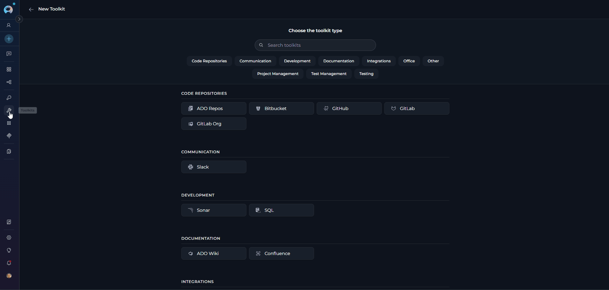
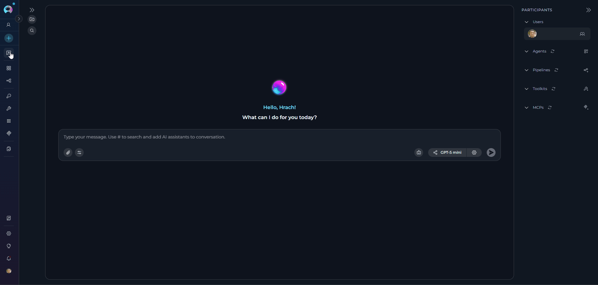
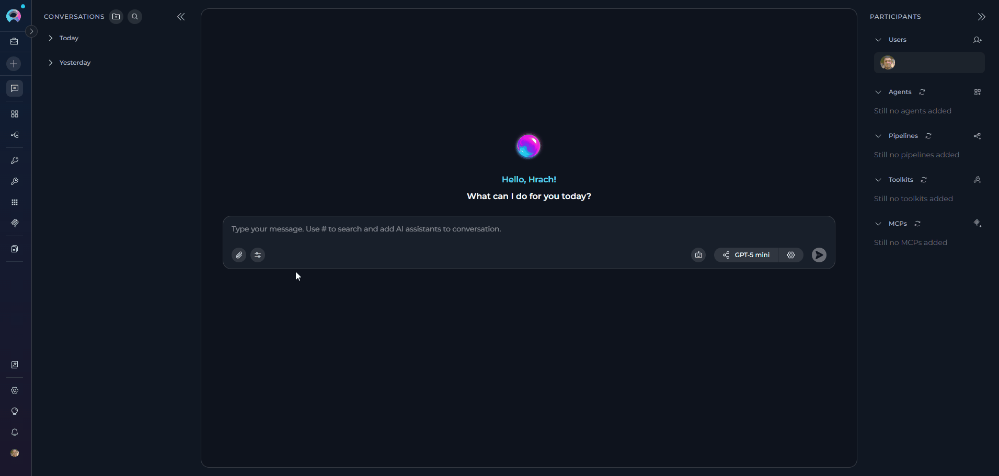
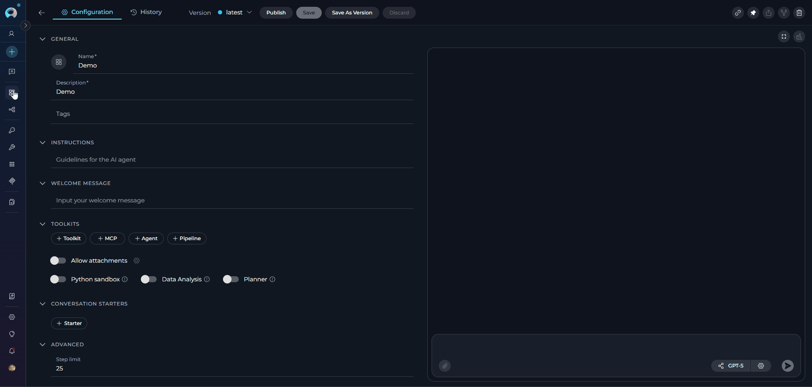
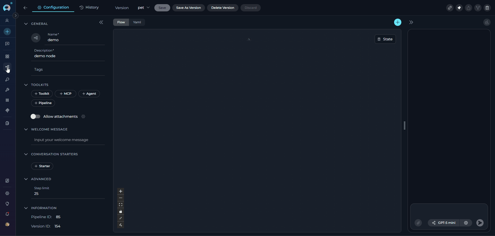
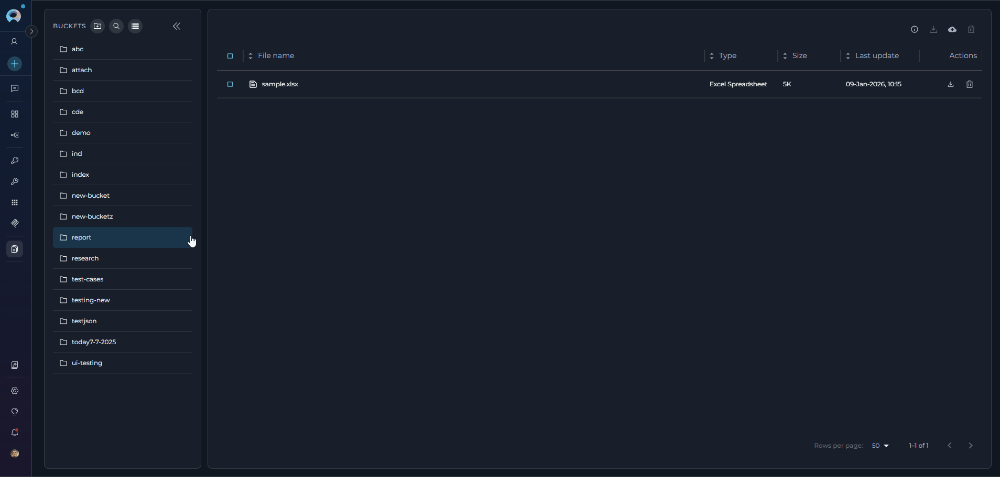
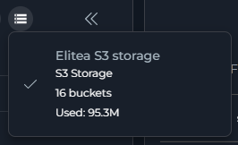

# ELITEA Toolkit Guide: Artifact Integration

## Introduction

This guide is your comprehensive resource for integrating and effectively utilizing the **Artifact Toolkit** within ELITEA. It provides detailed, step-by-step instructions from initial setup to advanced usage scenarios, enabling you to leverage artifacts for temporary data storage, context management, and inter-agent data sharing. By following this guide, you will unlock powerful capabilities for handling data within AI-driven workflows, enhancing your agents' ability to process, store, and share information efficiently across your ELITEA environment.

### Brief Overview of the Artifact Toolkit

The Artifact Toolkit provides a versatile file storage mechanism designed specifically for AI agent workflows within ELITEA. It allows agents to create, read, update, and delete files within project-specific buckets (storage containers). This toolkit serves as a temporary workspace for agents, enabling them to:

*   **Store Temporary Data:** Save intermediate results, generated content, logs, and data retrieved during agent operations
*   **Manage Context:** Preserve and retrieve context across multiple agent interactions or workflow steps
*   **Share Data Between Agents:** Enable collaboration by allowing different agents to access and modify files in shared buckets
*   **Process Multiple File Formats:** Read from various document types (PDF, Excel, Word, images) and create text-based files
*   **Handle Large Outputs:** Store data that exceeds LLM context windows or requires persistent access

!!! note "Important: Temporary Storage"
    Artifact storage is designed for *temporary* data and operational workflows. It is *not* intended for long-term data archival or as a primary database. Files are subject to configurable retention policies (default: 30 days) and can be manually deleted at any time.

---

## System Integration with ELITEA

To integrate the Artifact Toolkit with ELITEA, follow a streamlined process: **Create Toolkit → Use in Agents, Pipelines, or Chat**. Unlike other toolkits, the Artifact Toolkit does not require credentials since it uses ELITEA's internal storage system.

### Step 1: Create Artifact Toolkit

You can create an Artifact Toolkit through multiple methods:

#### Method 1: Create from Toolkits Menu

1. **Navigate to Toolkits Menu:** Open the sidebar and select **[Toolkits](../../menus/toolkits.md)**.
2. **Create New Toolkit:** Click the **`+ Create`** button.
3. **Select Artifact:** Choose **Artifact** from the list of available toolkit types.
4. **Configure Toolkit Details:**
     * **Toolkit Name:** Enter a descriptive name for the toolkit (e.g., "Report Storage", "Data Processing Artifacts")
     * **Description:** Add an optional description explaining the toolkit's purpose
     * **PgVector Configuration:** Select a PgVector connection for vector database integration and semantic search (optional)
     * **Embedding Model:** Select an embedding model for text processing and semantic search capabilities (optional)
     * **Bucket Name:** Specify the bucket (storage container) name
         - **Creating a New Bucket:** Enter a new bucket name, and it will be automatically created when first used
         - **Using an Existing Bucket:** Enter an existing bucket name to connect to it
         - **Naming Convention:** Use lowercase letters, numbers, and hyphens only (underscores are automatically converted to hyphens)
         - **Best Practice:** Use descriptive, unique names to avoid conflicts between different agents or workflows

5. **Select Tools:** In the **"Tools"** section, select the checkboxes next to the specific tools you want to enable. **Enable only the tools your agents will actually use** to follow the principle of least privilege.
6. **Save Toolkit:** Click **Save** to create the toolkit.



#### Available Tools:

The Artifact Toolkit provides the following tools for file and data management:

| **Tool Name** | **Functionality** | **Parameters** | **Use Case** |
|---------------|-------------------|----------------|--------------|
| **ListFiles** | Retrieves a list of all files in the bucket with download links | `bucket_name` (optional) | Check available files before processing |
| **CreateFile** | Creates a new file in the bucket | `filename`<br>`filedata`<br>`bucket_name` (optional) | Store generated content, reports, or initial data |
| **ReadFile** | Reads and retrieves file content from the bucket | `filename` (required)<br>`bucket_name` (optional)<br>`is_capture_image` (optional)<br>`page_number` (optional)<br>`sheet_name` (optional) | Access previously stored data for processing, with image capture and pagination support |
| **DeleteFile** | Permanently deletes a file from the bucket | `filename`<br>`bucket_name` (optional) | Remove temporary or obsolete files |
| **AppendData** | Adds content to the end of an existing file | `filename`<br>`filedata`<br>`bucket_name` (optional) | Build log files, accumulate test cases, expand datasets |
| **OverwriteData** | Replaces entire file content with new data | `filename`<br>`filedata`<br>`bucket_name` (optional) | Update configuration files, replace reports |
| **CreateNewBucket** | Creates a new storage bucket with custom retention | `bucket_name`<br>`expiration_measure` (optional)<br>`expiration_value` (optional) | Organize different file groups, set custom retention periods |
| **Edit file** | Modifies specific content within an existing file | `file_path` (required)<br>`file_query` (required)<br>`branch` (optional)<br>`commit_message` (optional) | Make targeted changes to file content with version control |
| **Read file chunk** | Reads a specific portion of a file | `file_path` (required)<br>`branch` (optional)<br>`start_line` (required)<br>`end_line` (optional) | Access large files incrementally by line number |
| **Read multiple files** | Reads content from multiple files simultaneously | `file_paths` (required, list)<br>`branch` (optional)<br>`offset` (optional)<br>`limit` (optional) | Batch processing multiple files with pagination support |
| **Index data** | Indexes file content for vector search | `index_name` (required)<br>`clean_index` (optional)<br>`progress_step` (optional)<br>`chunking_config` (optional)<br>`include_extensions` (optional)<br>`skip_extensions` (optional) | Enable semantic search capabilities with customizable indexing options |
| **List collections** | Lists all indexed collections in the vector database |   | View available indexed data collections |
| **Remove index** | Removes indexed data from the vector database | `Index_name` | Clean up obsolete indexes |
| **Search file** | Searches for files by name or pattern | `file_path` (required)<br>`pattern` (required)<br>`branch` (optional)<br>`is_regex` (optional)<br>`context_lines` (optional) | Find specific content within files with regex support and context |
| **Search index** | Performs semantic search across indexed content | `query` (required)<br>`index_name` (optional)<br>`filter` (optional)<br>`cut_off` (optional, 0-1)<br>`search_top` (optional)<br>`full_text_search` (optional)<br>`extended_search` (optional)<br>`reranker` (optional)<br>`reranking_config` (optional) | Find relevant information semantically with advanced filtering and reranking |
| **Stepback search index** | Advanced search with step-back prompting technique | `query` (required)<br>`index_name` (optional)<br>`messages` (optional)<br>`filter` (optional)<br>`cut_off` (optional, 0-1)<br>`search_top` (optional)<br>`full_text_search` (optional)<br>`extended_search` (optional)<br>`reranker` (optional)<br>`reranking_config` (optional) | Complex semantic queries with reasoning and message context |
| **Stepback summary index** | Generates summaries using step-back search | `query` (required)<br>`index_name` (optional)<br>`messages` (optional)<br>`filter` (optional)<br>`cut_off` (optional, 0-1)<br>`search_top` (optional)<br>`full_text_search` (optional)<br>`extended_search` (optional)<br>`reranker` (optional)<br>`reranking_config` (optional) | Create summaries from indexed content |

!!! tip "Vector Search Tools"
    The tools **Index data**, **List collections**, **Remove index**, **Search index**, **Stepback search index**, and **Stepback summary index** require PgVector configuration and an embedding model. These enable advanced semantic search capabilities across your artifact files.

#### Method 2: Create from Canvas (During Conversation)

You can create an Artifact Toolkit directly from a chat conversation using the canvas interface:

1. **Navigate to Chat:** Open the sidebar and select **[Chat](../../menus/chat.md)**.
2. **Start or Open Conversation:** Create a new conversation or open an existing one.
3. **Access Toolkit Selection:** In the **PARTICIPANTS** section, locate **Toolkits** and click the **+ Add toolkit** icon.
4. **Create New Toolkit:** In the "New Toolkit" dialog, click **+ Create new Toolkit**.
5. **Choose Toolkit Type:** The canvas interface displays available toolkit categories. Navigate to the appropriate category and select **Artifact**.
6. **Configure Settings:** Follow the same configuration steps as Method 1 (display name, bucket name, tool selection).
7. **Save and Use:** Click **Save** to create the toolkit. It will be immediately available in your current conversation.



!!! tip "Canvas Advantage"
    Creating toolkits through the canvas interface allows for immediate use in your conversation without navigating away from the chat. This is ideal for ad-hoc data storage needs during active conversations.

!!! note "Reference"
    For more details on canvas-based toolkit creation, see [How to Create and Edit Toolkits from Canvas](../../how-tos/chat-conversations/how-to-create-and-edit-toolkits-from-canvas.md).

#### Method 3: Automatic Creation via Attachment Settings

When enabling attachments for agents, pipelines, or conversations, an Artifact Toolkit is automatically created if needed:

1. **Enable Attachments:** When configuring an agent, pipeline, or conversation, toggle the **Allow attachments** option.
2. **Configure Attachment Storage:** In the **Attachment settings** popup:
     - **Option A:** Select an existing Artifact Toolkit from the dropdown
     - **Option B:** Select "Create new" and enter a bucket name to automatically create a new Artifact Toolkit
3. **Automatic Integration:** The toolkit is created and linked to handle file uploads. Files attached in conversations are automatically stored in the specified bucket.

{loading=lazy}

!!! info "Attachment Integration"
    Files uploaded through the attachment feature are stored in the linked Artifact Toolkit's bucket and can be accessed by agents using the toolkit's file management tools. This provides seamless integration between user uploads and agent file processing capabilities.

!!! note "Reference"
    For comprehensive details on attachment functionality, see [Attach Images and Files in Chat](../../how-tos/chat-conversations/attach-images-and-files-in-chat.md).

---

### Step 2: Use Toolkit in Agents, Pipelines, or Chat

Once created, the Artifact Toolkit can be integrated into your agents, pipelines, or used directly in chat conversations:

#### **In Agents:**

1. **Navigate to Agents:** Open the sidebar and select **[Agents](../../menus/agents.md)**.
2. **Create or Edit Agent:** Click **`+ Create`** for a new agent or select an existing agent to edit.
3. **Add Artifact Toolkit:** 
     * In the **"TOOLKITS"** section of the agent configuration, click the **"+Toolkit"** icon
     * Select your Artifact toolkit from the dropdown list
     * The toolkit will be added to your agent with the previously configured tools enabled

Your agent can now use artifact storage for data management, context preservation, and file operations.



#### **In Pipelines:**

1. **Navigate to Pipelines:** Open the sidebar and select **[Pipelines](../../menus/pipelines.md)**.
2. **Create or Edit Pipeline:** Either create a new pipeline or select an existing pipeline to edit.
3. **Add Artifact Toolkit:** 
     * In the **"TOOLKITS"** section of the pipeline configuration, click the **"+Toolkit"** icon
     * Select your Artifact toolkit from the dropdown list
     * The toolkit will be added to your pipeline with the previously configured tools enabled

     

Your pipeline can now leverage artifact storage for intermediate data handling across pipeline stages.

#### **In Chat:**

1. **Navigate to Chat:** Open the sidebar and select **[Chat](../../menus/chat.md)**.
2. **Start New Conversation:** Click **+Create** or open an existing conversation.
3. **Add Toolkit to Conversation:**
     * In the chat Participants section, look for the **Toolkits** element
     * Click the **"Add Tools"** icon to open the tools selection dropdown
     * Select your configured Artifact toolkit from the list
     * The toolkit will be added to the conversation

You can now interact with artifact storage directly in your conversation, asking the AI to create, read, or manage files.

 

!!! example "Chat Usage Example"
    ```
    User: "Create a file called meeting_notes.txt with today's agenda"
    Agent: [Uses createFile tool to store the agenda in the artifact bucket]
    
    User: "Now append the action items we discussed"
    Agent: [Uses appendData tool to add new content to meeting_notes.txt]
    
    User: "Show me all files we've created today"
    Agent: [Uses listFiles tool to display all files in the bucket]
    ```

---

---

## File Types and Capabilities

The Artifact Toolkit has different capabilities for reading and creating files, offering flexibility for various data processing workflows.

**File Types Supported for Reading**

The Artifact Toolkit can read and process a wide variety of file formats:

| **Category** | **File Extensions** | **Description** |
|--------------|---------------------|-----------------|
| **Text and Document Files** | `.txt`, `.md`, `.rtf`, `.docx`, `.pdf` | Plain text, Markdown, Rich Text Format, Microsoft Word Documents, Portable Document Format |
| **Data and Spreadsheet Files** | `.csv`, `.xlsx`, `.json`, `.xml`, `.yaml`, `.yml` | Comma Separated Values, Microsoft Excel Spreadsheets, JSON Data, XML Data, YAML Data |
| **Presentation Files** | `.pptx` | Microsoft PowerPoint Presentations |
| **Programming and Code Files** | `.py`, `.js`, `.html`, `.css`, `.java`, `.cpp`, `.php`, `.sql`, `.sh`, `.bat` | Python, JavaScript, HTML, CSS, Java, C++, PHP, SQL, Shell Scripts, Batch Files, and other common programming language file extensions |
| **Image Files** | `.jpg`, `.jpeg`, `.png`, `.gif`, `.bmp`, `.webp` | JPEG Images, PNG Images, GIF Images, Bitmap Images, WebP Images |

!!! note "Image Processing Requirements"
    When reading image files, the image is sent to the LLM for analysis. The LLM describes the image content and provides the description in the context. 
    
    **Important Requirements:**
    
    - The LLM must be **multimodal** with image reading capabilities
    - Compatible models: GPT-4 Vision, Claude 3, Gemini Pro Vision, or similar
    - The image description is returned as text in the agent's context
    
    For best results, provide clear instructions about what information to extract from images.

### File Types Supported for Creation

The Artifact Toolkit can create the following file types:

| **Category** | **File Extensions** | **Description** |
|--------------|---------------------|-----------------|
| **Text-Based Files** | `.txt`, `.md`, `.csv`, `.json`, `.yaml`, `.yml`, `.html`, `.css`, `.js`, `.py`, `.sql` | Plain Text, Markdown, Comma Separated Values, JSON Data, YAML Data, HTML, CSS, JavaScript, Python, SQL, and other unformatted plain text or code files |
| **Spreadsheet Files** | `.xlsx` | Microsoft Excel Spreadsheets |

#### **Unsupported File Types for Creation**

The toolkit **cannot create** the following binary files or formatted document types:

| **Category** | **File Extensions** | **Description** |
|--------------|---------------------|------------------|
| **Unsupported Files** | `.docx`, `.pdf`, `.pptx`, `.jpg`, `.png`, `.gif` | Word Documents, PDF Files, PowerPoint Presentations, Images, and other binary or complex formatted documents |

!!! tip "Recommended Workflow"
    1. **Read** complex file formats (Excel, Word, PDF, images) to extract content
    2. **Process** the extracted information using agent logic
    3. **Create** new plain text files with processed results
    
    This workflow allows you to transform complex documents into structured text formats that are easier to work with in automated workflows.

---

## Security and Access Control

### Bucket Accessibility and Security

*   **Project-Specific Buckets:** Buckets created using the Artifact Toolkit are specific to the ELITEA project in which they are created. Buckets and files within one project **cannot** be directly accessed from another separate ELITEA project.

*   **Agent Access:** Within a project, all agents configured with the Artifact Toolkit can potentially access files within their configured buckets. Agents can only access buckets specified in their toolkit configuration.

*   **User Access via Artifacts Page:** All project members with access to the Artifacts page can view, download, and delete files within project buckets, regardless of which agent created them.

*   **Shared Bucket Usage:** If multiple agents or users within a project configure Artifact Toolkits to use the **same bucket name**, they will share the same storage space.
    
    **Recommendations:**
    
    - **For independent tasks:** Use **unique bucket names** per agent to avoid unintended data interference
    - **For collaborative workflows:** Use **shared buckets** intentionally to enable data exchange
    - **File naming conventions:** Use clear, descriptive filenames with identifiers to prevent accidental overwrites
    - **Regular cleanup:** Remove obsolete files to maintain organization

*   **Security Considerations:** 
    
    - Users with agent configuration access can potentially access and manipulate bucket data
    - **Do not store highly sensitive data** in artifacts without additional security measures
    - Consider encryption for sensitive information before storing
    - Be aware of project-level access controls
    - Regularly review and audit artifact usage

!!! warning "Data Sensitivity"
    Artifact storage is designed for temporary operational data. Avoid storing:
    
    - Passwords or API keys (use [Secrets](../../menus/settings/secrets.md) instead)
    - Personal Identifiable Information (PII) without proper safeguards
    - Confidential business data requiring strict access controls
    - Data subject to compliance regulations (GDPR, HIPAA, etc.) without proper security measures

### Artifact Retention and Lifecycle

*   **Default Retention:** Files created in Artifact buckets have a default retention period of **30 days**. After this period, files are automatically deleted and **cannot be recovered**.

*   **Custom Retention:** You can set custom retention periods when creating buckets:
    
    ```
    Using createNewBucket tool:
    - expiration_measure: "days", "weeks", "months", or "years"
    - expiration_value: numeric value (e.g., 7, 30, 90)
    ```

*   **Retention Management:** View and modify retention settings through the **[Artifacts page](../../menus/artifacts.md)**:
    
    - View current retention settings per bucket
    - Modify retention periods for existing buckets
    - Monitor days remaining until file expiration

*   **Manual Deletion:** Files and buckets can be manually deleted at any time:
    
    - By agents using the `deleteFile` tool
    - By users through the Artifacts page
    - Bulk deletion by removing entire buckets

!!! tip "Retention Best Practices"
    - Set retention based on data lifecycle needs
    - Download important files before expiration
    - Use longer retention (e.g., 90 days) for audit logs
    - Use shorter retention (e.g., 7 days) for temporary processing files
    - Regularly review and clean up unused buckets

 

**Storage Limits**

*   **Project Limit:** Each project has a total storage limit of **9 GB** for all artifacts combined
*   **Individual Files:** No strict per-file size limit, but best practice is to keep files reasonably sized
*   **Performance Impact:** Very large files may impact agent processing speed
*   **Monitoring:** Check storage usage in the Artifacts page to avoid exceeding limits

!!! warning "Storage Management"
    Monitor your project's artifact storage usage regularly. When approaching the 9 GB limit:
    
    - Delete obsolete files
    - Download and remove archived data
    - Review retention policies
    - Consider using external storage for large datasets 
    
    {width="150"}

---
 
## Real-World Usage Examples

The Artifact Toolkit provides versatile capabilities to enhance agent workflows within ELITEA. Here are key use cases and examples demonstrating how to leverage the toolkit effectively:

??? example "1. Storing Large Generated Outputs"
    **Scenario:** An agent generates extensive text data (reports, lists, test cases) that exceeds the LLM's context window.
    
    **Tools Used:** `createFile`, `appendData`
    
    **Implementation:**
    ```
    Agent Instruction: "Create a file named 'detailed_report.txt' to store the generated report. 
    Append each section incrementally as it's generated."
    ```
    
    **Benefits:**
    - Handle outputs exceeding context window limits
    - Persistent storage for later retrieval
    - Downloadable results for external use
    
    **Chat Interaction Example:**
    ```
    User: "Analyze all our Q4 sales data and create a comprehensive report"
    
    Agent: "I'll analyze the Q4 sales data and create a detailed report."
    [Agent uses createFile tool to create "Q4_Sales_Report.txt"]
    [Agent appends sections incrementally using appendData tool]
    
    Agent: "I've created a comprehensive Q4 sales report with the following sections:
    - Executive Summary
    - Sales by Region
    - Top Performing Products
    - Year-over-Year Comparison
    - Recommendations
    
    The report has been saved to 'Q4_Sales_Report.txt' in your artifacts."
    
    User: "Can you add a section about customer demographics?"
    
    Agent: [Uses appendData tool to add new section]
    "I've added the customer demographics section to the report."
    ```

??? example "2. Managing Workflow Context and State"
    **Scenario:** An agent maintains state across multiple interactions in a multi-stage workflow.
    
    **Tools Used:** `createFile`, `readFile`, `appendData`, `deleteFile`
    
    **Implementation:**
    ```
    Agent Instruction: "Create 'workflow_state.json' to store the initial state. 
    Read and update this state in subsequent steps. 
    Delete when workflow completes."
    ```
    
    **Benefits:**
    - Persistent context across interactions
    - Complex stateful workflows
    - Progress tracking and recovery

??? example "3. Multi-Agent Collaboration"
    **Scenario:** Multiple agents collaborate by exchanging data through shared buckets.
    
    **Tools Used:** `createFile`, `appendData` (Agent 1), `readFile` (Agent 2)
    
    **Implementation:**
    ```
    Agent 1: "Save processed data to 'shared_data.json' for the analysis agent."
    Agent 2: "Retrieve data from 'shared_data.json' to perform analysis."
    ```
    
    **Benefits:**
    - Seamless inter-agent data exchange
    - Sophisticated multi-agent workflows
    - Clear data handoff between processing stages
    
    **Chat Interaction Example:**
    
    **Agent 1 (Data Collector):**
    ```
    User: "Gather all customer feedback from last month"
    
    Agent 1: [Uses createFile to save "customer_feedback_march.json"]
    "I've collected and stored 247 customer feedback entries in 'customer_feedback_march.json'."
    ```
    
    **Agent 2 (Data Analyzer):**
    ```
    User: "Analyze the sentiment of last month's customer feedback"
    
    Agent 2: [Uses readFile to access "customer_feedback_march.json"]
    [Analyzes data and creates "sentiment_analysis_march.txt"]
    "Based on 247 feedback entries:
    - Positive: 68%
    - Neutral: 22%
    - Negative: 10%
    
    Full analysis saved to 'sentiment_analysis_march.txt'."
    ```
    
    !!! tip "Shared Bucket Best Practices"
        When multiple agents share a bucket, use clear file naming conventions with timestamps or agent identifiers to prevent conflicts. Example: `agent1_results_2024-01-09.json`

??? example "4. Extended Clipboard Functionality"
    **Scenario:** Agents manage multiple text snippets beyond a single clipboard.
    
    **Tools Used:** `createFile`, `appendData`, `readFile`, `listFiles`
    
    **Implementation:**
    ```
    Agent Instruction: "Save copied text as 'clipboard_item_1.txt'. 
    Use 'listFiles' to show available items. 
    Retrieve specific items by filename."
    ```
    
    **Benefits:**
    - Multiple clipboard entries
    - Organized snippet management
    - Easy retrieval and reuse

??? example "5. Automated Logging and Audit Trails"
    **Scenario:** Agents record execution logs for monitoring, troubleshooting, or compliance.
    
    **Tools Used:** `createFile`, `appendData`
    
    **Implementation:**
    ```
    Agent Instruction: "Create 'agent_log.txt' at execution start. 
    Append timestamped log entries throughout operation."
    ```
    
    **Benefits:**
    - Automatic log generation
    - Improved traceability
    - Debugging and compliance support
    
    **Chat Interaction Example:**
    ```
    User: "Start processing the customer orders"
    
    Agent: [Creates "order_processing_log.txt" using createFile]
    "Started processing. Created log file."
    
    User: "Process order #1234"
    
    Agent: [Processes order, uses appendData to add log entry]
    "Order #1234 processed successfully. Updated log."
    
    User: "Process order #1235"
    
    Agent: [Processes order, uses appendData to add log entry]
    "Order #1235 processed successfully. Updated log."
    
    User: "Show me the processing log"
    
    Agent: [Uses readFile to retrieve "order_processing_log.txt"]
    "Here's the complete processing log:
    
    2024-01-09 10:15:23 - Processing started
    2024-01-09 10:16:45 - Order #1234: Processed successfully
    2024-01-09 10:18:12 - Order #1235: Processed successfully"
    ```
    
    !!! note "Log Retention"
        For long-term log storage, consider downloading logs before the retention period expires or use a longer retention setting when creating the bucket.

??? example "6. Processing Pre-existing Data Files"
    **Scenario:** Agents process existing files uploaded by users or external systems.
    
    **Tools Used:** `listFiles`, `readFile`
    
    **Implementation:**
    ```
    Agent Instruction: "Use 'listFiles' to see available data files. 
    Read 'data_file_1.txt' for processing."
    ```
    
    **Benefits:**
    - Integration with existing data
    - Versatile data source handling
    - Support for uploaded user files

??? example "7. Document Analysis and Extraction"
    **Scenario:** Extract and store information from uploaded documents.
    
    **Tools Used:** `readFile` (with attachments), `createFile`, `appendData`
    
    **Implementation:**
    ```
    User uploads document → Agent reads it → Agent extracts key information → 
    Agent creates structured output file
    ```
    
    **Benefits:**
    - Automated document processing
    - Structured data extraction
    - Persistent analysis results
    
    **Chat Interaction Example:**
    ```
    User: [Attaches contract.pdf] "Extract key terms from this contract"
    
    Agent: [Reads the attached PDF using readFile with attachment integration]
    [Creates "contract_key_terms.txt" using createFile]
    "I've analyzed the contract and extracted the key terms:
    
    - Contract Duration: 24 months
    - Payment Terms: Net 30
    - Renewal Clause: Automatic with 60-day notice
    - Termination: 90-day written notice required
    
    Full extraction saved to 'contract_key_terms.txt' for reference."
    
    User: "Add a summary of the liability clauses"
    
    Agent: [Uses appendData to add to existing file]
    "Added liability clause summary to the document."
    ```
    
    !!! tip "Multimodal Document Processing"
        For processing images within documents or analyzing image files, ensure your LLM supports multimodal capabilities (GPT-4 Vision, Claude 3, Gemini Pro Vision).

??? example "8. Configuration Management"
    **Scenario:** Agent manages and updates configuration files.
    
    **Tools Used:** `createFile`, `readFile`, `overwriteData`, `listFiles`
    
    **Chat Interaction Example:**
    ```
    User: "Create a configuration file for the production environment"
    
    Agent: [Uses createFile to create "prod_config.json"]
    "Created production configuration with default settings."
    
    User: "Update the API timeout to 60 seconds"
    
    Agent: [Uses readFile to get current config]
    [Uses overwriteData to update the entire file with new timeout]
    "Updated API timeout in production configuration."
    
    User: "Show me all configuration files"
    
    Agent: [Uses listFiles tool]
    "Available configuration files:
    - prod_config.json
    - staging_config.json
    - dev_config.json"
    ```

??? example "9. UI Test Execution and Results Storage"
    **Scenario:** Agent executes UI test cases using Playwright MCP toolkit and stores comprehensive test results in artifacts for analysis and reporting.
    
    **Tools Used:** `createFile`, `appendData`, `listFiles`
    
    **Implementation:**
    ```
    Agent uses Playwright MCP toolkit to execute UI tests → 
    Captures test results, screenshots, and logs → 
    Stores all data in artifact bucket for review
    ```
    
    **Benefits:**
    - Automated test execution and result storage
    - Persistent test history for trend analysis
    - Centralized test artifacts for team review
    - Easy access to screenshots and error logs
    
    **Chat Interaction Example:**
    ```
    User: "Run the UI tests for the login flow and save the results"
    
    Agent: [Uses Playwright MCP toolkit to execute test cases]
    [Creates "ui_test_results_2026-01-09.json" using createFile]
    [Creates "test_execution_log.txt" using createFile]
    [Saves screenshots for failed tests]
    
    Agent: "I've completed the UI test execution for the login flow:
    
    Test Summary:
    - Total Tests: 15
    - Passed: 13
    - Failed: 2
    - Duration: 2m 34s
    
    Failed Tests:
    1. Login with invalid credentials - Expected error message not displayed
    2. Password reset flow - Email field validation failed
    
    All results have been saved to your artifacts:
    - ui_test_results_2026-01-09.json (detailed test results)
    - test_execution_log.txt (execution logs)
    - screenshot_login_error.png (failed test screenshot)
    - screenshot_password_reset.png (failed test screenshot)"
    
    User: "Append a summary to the execution log"
    
    Agent: [Uses appendData to add summary]
    "Summary appended to test_execution_log.txt:
    
    === Test Execution Summary ===
    Date: 2026-01-09
    Environment: Staging
    Browser: Chrome 120
    Pass Rate: 86.7%
    
    Action Required:
    - Investigate error message display logic in login component
    - Review email validation regex in password reset form"
    
    User: "Run the checkout flow tests and save results to the same log"
    
    Agent: [Executes checkout tests using Playwright MCP toolkit]
    [Uses appendData to add results to existing log]
    [Creates new test results file]
    
    Agent: "Checkout flow tests completed:
    
    Test Summary:
    - Total Tests: 8
    - Passed: 8
    - Failed: 0
    - Duration: 1m 47s
    
    Results appended to test_execution_log.txt
    Detailed results saved to ui_test_results_checkout_2026-01-09.json
    
    All tests passed! ✓"
    ```
    
!!! tip "Best Practices from Examples"
    - Use descriptive filenames with dates or identifiers
    - Create log files at the start of operations for traceability
    - Use `listFiles` before creating files to avoid duplicates
    - Leverage `appendData` for incremental updates (logs, reports)
    - Use `overwriteData` for configuration updates
    - Share buckets between agents for collaborative workflows

## Troubleshooting and Support

### Troubleshooting

??? warning "File Not Found Errors"
    **Problem:** Agent execution fails with "File Not Found" errors when attempting to use `read_file`, `delete_file`, or `append_data` tools.
    
    **Solutions:**
    
    - **Verify Filename:** Double-check the filename specified in the agent instruction. Ensure it exactly matches the filename of the artifact in the bucket (including file extension)
    - **Check Bucket Name:** Confirm that the correct bucket name is configured for the Artifact Toolkit
    - **List Files First:** Use the `list_files` tool to verify the file exists and check the exact filename spelling
    - **Check Retention:** Ensure the file hasn't been automatically deleted due to exceeding the retention period
    - **Manual Deletion:** Verify the file wasn't accidentally deleted by another agent or user. Check the [Artifacts page](../../menus/artifacts.md) for file history

??? warning "Bucket Access Issues"
    **Problem:** Unable to access bucket or bucket appears empty.
    
    **Solutions:**
    
    - **Verify Bucket Name:** Double-check the bucket name in the toolkit configuration. Ensure correct spelling and format (lowercase, hyphens instead of underscores)
    - **Project Scope:** Buckets are project-specific. Ensure you're accessing the bucket within the correct ELITEA project
    - **First Use:** If the bucket is newly created, it will be empty until files are added
    - **Permissions:** Verify you have the necessary project permissions to access artifacts

??? warning "Data Not Saving or Appending Correctly"
    **Problem:** `append_data` or `create_file` tools don't create or modify files as expected. Data is missing, incomplete, or not being saved.
    
    **Solutions:**
    
    - **Check Execution Logs:** Examine the agent's execution logs or chat output for error messages related to tool calls
    - **File Type Limitations:** Confirm you're working with supported text file types. The toolkit cannot create binary files (Excel, PDF, images)
    - **Review Instructions:** Verify that instructions given to the LLM are clear and align with tool capabilities
    - **Test with Simple Operations:** Try creating a simple text file first to confirm basic functionality
    - **Check Bucket Configuration:** Ensure the bucket is properly configured in the toolkit settings

??? warning "Toolkit Not Appearing in Dropdown"
    **Problem:** Created Artifact Toolkit doesn't appear when trying to add it to an agent, pipeline, or chat.
    
    **Solutions:**
    
    - **Verify Toolkit Saved:** Ensure you clicked Save after creating the toolkit configuration
    - **Refresh Interface:** Refresh your browser or reload the page
    - **Check Project Context:** Toolkits are project-specific. Ensure you're in the correct project
    - **Review Toolkit List:** Navigate to the Toolkits menu to verify the toolkit was successfully created

??? warning "File Upload/Attachment Issues"
    **Problem:** Files uploaded through attachments aren't accessible or don't appear in the bucket.
    
    **Solutions:**
    
    - **Verify Attachment Settings:** Ensure attachments are enabled and linked to the correct Artifact Toolkit
    - **Check Bucket Name:** Confirm the attachment settings point to the correct bucket
    - **File Size Limits:** Verify files don't exceed project storage limits (9 GB total per project)
    - **Review Artifacts Page:** Check the [Artifacts page](../../menus/artifacts.md) to see if files were uploaded successfully

### Support Contact

For issues, questions, or assistance with Artifact toolkit integration, please refer to **[Contact Support](../../support/contact-support.md)** for detailed information on how to reach the ELITEA Support Team.

---

## Frequently Asked Questions

??? question "Can I create binary files like Excel or images in Artifacts?"
    The Artifact Toolkit supports creating text-based files and Excel spreadsheets. It does not support creating most binary files, images, or formatted document types like `.docx` or `.pdf`.
    
    **You can create:**
    
    - Plain text (`.txt`)
    - CSV (`.csv`)
    - JSON (`.json`)
    - YAML (`.yaml`, `.yml`)
    - Markdown (`.md`)
    - Code files (`.py`, `.js`, `.html`, `.css`, `.sql`, etc.)
    - **Excel files (`.xlsx`)**
    
    **You can read** many binary file formats including Excel, Word, PDF, and images (with multimodal LLM support).

??? question "What is the maximum file size for artifacts?"
    While there isn't a strict file size limit for individual artifacts, there is a **project-wide storage limit of 9 GB** for all artifacts within a project.
    
    **Best Practices:**
    
    - Keep individual files reasonably sized for optimal performance
    - Extremely large files may impact agent processing efficiency
    - Monitor your project's total storage usage in the Artifacts page
    - Delete unnecessary files regularly to maintain available space

??? question "How long are files stored in Artifacts?"
    By default, files stored in Artifact buckets have a retention period of **30 days**. After 30 days, they are automatically deleted.
    
    You can customize the retention period:
    
    - When creating a new bucket using the `createNewBucket` tool
    - By modifying bucket settings in the [Artifacts page](../../menus/artifacts.md)
    - Supported retention measures: days, weeks, months, years
    
    **Important:** Files approaching expiration should be downloaded or backed up if you need to retain them longer.

??? question "Can I recover deleted files from Artifacts?"
    No, files deleted from Artifact buckets are **permanently deleted and cannot be recovered**. This applies to:
    
    - Manual deletions (by agents or users)
    - Automatic deletions due to retention period expiration
    
    **Recommendation:** Download and back up any important data stored in artifacts before it's deleted or if you need to retain it beyond the retention period.

??? question "How do I access and download files stored in Artifacts?"
    You can access and manage artifact files through the **[Artifacts page](../../menus/artifacts.md)** in ELITEA:
    
    1. Navigate to **Artifacts** from the sidebar
    2. Browse buckets and view file lists
    3. Download individual files
    4. View file metadata (size, creation date, retention)
    5. Delete files or entire buckets
    6. Modify retention settings
    
    Files can also be accessed programmatically by agents using the `readFile` tool.

??? question "Can multiple agents share the same bucket?"
    Yes, multiple agents within the same project can use the same bucket name, allowing them to share data. This enables:
    
    - **Collaborative Workflows:** One agent creates data, another processes it
    - **Data Handoffs:** Sequential agents passing information through shared storage
    - **Shared Context:** Multiple agents accessing common reference data
    
    **Recommendations:**
    
    - For independent tasks, use **unique bucket names** to avoid conflicts
    - For collaborative workflows, use **shared buckets** intentionally
    - Use clear file naming conventions to prevent accidental overwrites
    - Consider using the `listFiles` tool to check existing files before creating new ones

??? question "Do I need credentials to use the Artifact Toolkit?"
    No, the Artifact Toolkit does not require any credentials. It uses ELITEA's internal storage system and authenticates based on your project access.
    
    This is different from external integration toolkits (like GitHub, Jira, Confluence) which require API credentials.

??? question "Can I use artifacts across different projects?"
    No, artifact buckets and files are **project-specific**. Buckets created in one project cannot be accessed from another project.
    
    If you need to share data across projects:
    
    - Download files from one project's Artifacts page
    - Upload them to the other project
    - Consider using external storage integrations for cross-project data sharing

??? question "What happens when I enable attachments in a conversation?"
    When you enable attachments and configure an Artifact Toolkit:
    
    1. Files you upload are automatically stored in the specified bucket
    2. The AI agent can access these files using the toolkit's `readFile` tool
    3. Files are subject to the bucket's retention policy
    4. You can manage uploaded files through the Artifacts page
    
    This creates a seamless integration between user uploads and agent file processing capabilities.

??? question "Can agents read image files?"
    Yes, agents can read and analyze image files, but with specific requirements:
    
    **Requirements:**
    
    - The LLM must be **multimodal** with image reading capabilities
    - Supported models: GPT-4 Vision, Claude 3, Gemini Pro Vision, or similar
    - Supported formats: `.jpg`, `.jpeg`, `.png`, `.gif`, `.bmp`, `.webp`
    
    **How it works:**
    
    - The image is sent to the LLM for analysis
    - The LLM describes the image content
    - The description is provided in the agent's context
    
    **Note:** Agents cannot **create** image files, only read and analyze them.

---

!!! info "Additional Resources"
    - **[Artifacts Menu Documentation](../../menus/artifacts.md)** - Comprehensive guide to managing artifacts through the UI
    - **[Agents Menu Documentation](../../menus/agents.md)** - Complete guide to creating and configuring agents
    - **[Pipelines Menu Documentation](../../menus/pipelines.md)** - Guide to building and managing pipelines
    - **[Chat Documentation](../../menus/chat.md)** - Using chat conversations with toolkits
    - **[Secrets Management](../../menus/settings/secrets.md)** - Secure storage for sensitive data
    - **[How to Create and Edit Toolkits from Canvas](../../how-tos/chat-conversations/how-to-create-and-edit-toolkits-from-canvas.md)** - Creating toolkits from conversations
    - **[Attach Files in Chat](../../how-tos/chat-conversations/attach-images-and-files-in-chat.md)** - Using attachments with artifacts