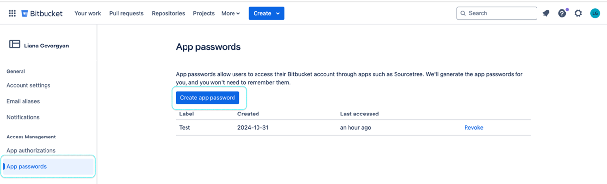
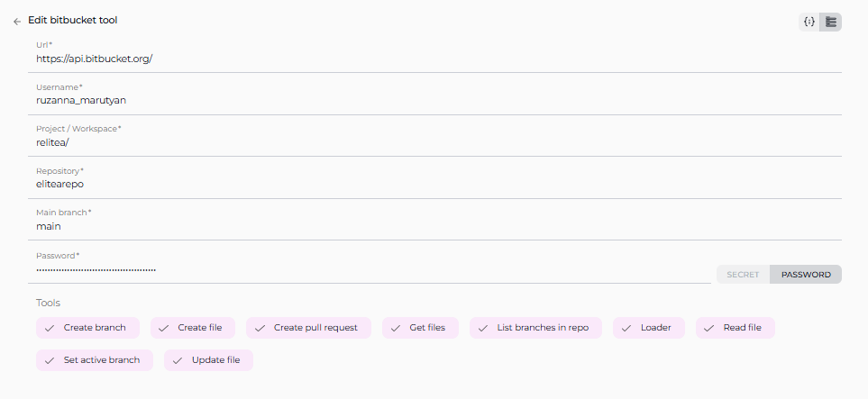

# ELITEA Toolkit Guide: Bitbucket Integration

## Introduction

### Purpose of this Guide

This guide is your definitive resource for integrating and utilizing the **Bitbucket toolkit** within ELITEA. It provides a step-by-step walkthrough, from setting up your Bitbucket App Password to configuring the toolkit in ELITEA and effectively using it within your Agents.  By following this guide, you will unlock the power of automated code management, streamlined development workflows, and enhanced team collaboration, all directly within the ELITEA platform. This integration empowers you to leverage AI-driven automation to optimize your software development lifecycle using the combined strengths of ELITEA and Bitbucket.

### Brief Overview of Bitbucket

Bitbucket, by Atlassian, is a leading web-based platform for version control and code collaboration. It's designed for professional teams working on software development projects using Git. Bitbucket provides a central place to manage your entire development process, offering features for:

*   **Efficient Version Control:** Track every change to your code, enabling easy collaboration, rollback to previous versions, and a clear history of project evolution.
*   **Seamless Code Collaboration:** Facilitate teamwork with features like pull requests, in-line code reviews, and branch-based development workflows.
*   **Organized Branch Management:** Structure your development with branches for features, bug fixes, and releases, ensuring a clear and manageable development process.
*   **Workflow Automation:** Integrate with CI/CD pipelines and other tools to automate building, testing, and deploying your software.

Integrating Bitbucket with ELITEA brings these robust code management capabilities directly into your AI-powered workflows. Your ELITEA Agents can then interact with your Bitbucket repositories to automate code-related tasks, enhance development processes, and improve team collaboration through intelligent automation.

## BitBucket Account Setup and Configuration

### Account Setup

If you don't have a Bitbucket account yet, here’s how to get started:

1.  **Go to Bitbucket:** Open your web browser and navigate to [bitbucket.org](https://bitbucket.org).
2.  **Sign Up for Free:** Click the **"Sign up for Free"** button.
3.  **Enter Your Email:** Provide your email address. **For professional use, it's highly recommended to use your company email.**
4.  **Create Your Account:** Follow the prompts to set up your account, including entering your name and creating a secure password.
5.  **Verify Your Email:** Check your inbox for a verification email from Bitbucket and click the verification link to activate your account.
6.  **Log In:** Once verified, log in to Bitbucket with your new credentials.

### Token/API Key Generation: Creating an App Password in Bitbucket

For secure integration with ELITEA, we strongly recommend using a Bitbucket **App Password**. This method is more secure than using your primary account password directly and allows you to control the permissions granted to ELITEA.

**Follow these steps to create an App Password:**

1.  **Log in to Bitbucket:** Access your Bitbucket account at [bitbucket.org](https://bitbucket.org).
2.  **Access Personal Settings:** Click on your profile avatar in the bottom left corner and select **"Personal settings"**.
3.  **Navigate to App Passwords:** In the left-hand menu under "Security," click on **"App passwords"**.
4.  **Create App Password:** Click the **"Create app password"** button.
5.  **Name the App Password:** In the "Label" field, enter a descriptive name like "ELITEA Integration" to easily identify its purpose.
6.  **Define Permissions - Grant Least Privilege:**  This is crucial for security. **Carefully select only the necessary permissions** for ELITEA to interact with Bitbucket.  For typical ELITEA integration, consider these minimal permissions:
    *   **Account permissions:**
        *   **Account:** Read
    *   **Project permissions:**
        *   **Projects:** Read
    *   **Repository permissions:**
        *   **Repository:** Read
        *   **Repository:** Write (Only if your Agent needs to modify repositories, e.g., create files, branches, or pull requests)
        *   **Pull requests:** Write (If your Agent will create pull requests)
        *   **Issues:** Read (If your Agent needs to access issues)
        *   **Wiki:** Read (If your Agent needs to read wiki content)

    **Security Best Practice:**  **Avoid granting "Admin" or any unnecessary permissions.** Limiting permissions significantly reduces potential security risks.

7.  **Create Password:** Click **"Create"** by using the following [link](https://bitbucket.org/account/settings/app-passwords/).
8.  **Securely Store Your App Password:** **Immediately copy the generated App Password.** This is the only time it will be displayed in full. Store it securely using a password manager or ELITEA's built-in Secrets feature (recommended for enhanced security within ELITEA). You will need this App Password to configure the Bitbucket toolkit in ELITEA.



## BitBucket Integration with ELITEA

### Agent Creation/Configuration

To integrate Bitbucket, you'll need to configure it within an ELITEA Agent. You can either create a new Agent or modify an existing one.

1.  **Navigate to Agents:** In ELITEA, go to the **Agents** menu.
2.  **Create or Edit Agent:**
    *   **New Agent:** Click **"+ Agent"** to create a new Agent. Follow the steps to define Agent details like name, description, type, and instructions.
    *   **Existing Agent:** Select the Agent you want to integrate with Bitbucket and click on its name to edit.
3.  **Access Tools Section:** In the Agent configuration, scroll down to the **"Tools"** section.

### Toolkit Configuration

This section details how to configure the Bitbucket toolkit within your ELITEA Agent.

1.  **Add Toolkit:** In the "Tools" section, click the **"+" icon**.
2.  **Select Bitbucket:** Choose **"Bitbucket"** from the dropdown list of available toolkits. This opens the "New Bitbucket tool" configuration panel.
3.  **Configure Toolkit Details:** Fill in the following fields:


    *   **URL:**  Enter the Bitbucket API URL. **It is crucial to use the correct format:** `https://api.bitbucket.org/`. This is the base URL for the Bitbucket API endpoint.
    *   **Username:** Enter your Bitbucket **Username**. This is the username associated with the Bitbucket account for which you created the App Password.
    *   **Project / Workspace:**  Specify the **Project or Workspace** in Bitbucket where your repository is located.
        *   For **personal accounts or teams**, this is your **Workspace ID**. You can find your Workspace ID in Bitbucket URL after login, e.g., `https://bitbucket.org/your_workspace_id/`.
        *   For **organizations using Bitbucket Cloud Premium/Enterprise**, this is the **Project Key**. You can find the Project Key in the Project settings in Bitbucket.

    

    *   **Repository:** Specify the **Repository name** you want to access. Use the format: `repository_owner/repository_name` (e.g., `MyOrganization/MyProjectRepo`). This refers to the specific repository within your Bitbucket **Workspace** or **Project** that you want to integrate with ELITEA.
    *   **Main branch:**  Indicate the **Main branch** of your repository. Typically, this is `main` or `master`.
    *   **Authentication - Password:** Select **"Password"** as the authentication method.
        *   **Password/Secret:** Choose **"Password"** and paste the **App Password** you generated in Bitbucket into the **"Password"** field.
        *   **Enhanced Security with Secrets:** For improved security, it's highly recommended to use **"Secret"**. Select **"Secret"** and choose a pre-configured secret from the dropdown. You must first create and securely store your **App Password** as a Secret in ELITEA's [Secrets](../../menus/settings/secrets.md) feature. Using Secrets prevents hardcoding sensitive credentials directly in the toolkit configuration.

    

4.  **Enable Tools:** In the "Tools" section of the Bitbucket toolkit configuration, **select the checkboxes next to the Bitbucket tools** you want to enable for your Agent. **Enable only the tools your Agent will actually use** to adhere to the principle of least privilege and enhance security. Available tools are:
    *   **Create pull request:**  Allows the Agent to create pull requests.
    *   **Create file:** Enables the Agent to create new files in the repository.
    *   **Read file:**  Allows the Agent to read file content from the repository.
    *   **Update file:**  Allows the Agent to update existing files content in the repository.
    *   **List branches in repo:** Enables the Agent to list branches in the repository.
    *   **Set active branch:** Allows the Agent to set a specific branch as active.
    *   **Create branch:** Enables the Agent to create new branches.
    *   **Get Files:**  Allows the Agent to get file from the repository.
    *   **Loader:**  Allows the Agent to load repository data.

5.  **Complete Configuration:** Click the **arrow icon** (at the top right of the toolkit configuration) to save the Bitbucket toolkit setup and return to the main Agent configuration.
6.  Click **Save** to apply configuration and changes.

### Tool Overview

The Bitbucket toolkit provides the following tools for your ELITEA Agents:

*   **Create pull request:** `create_pull_request` -  Automates the creation of pull requests for code changes.
*   **Create file:** `create_file` -  Enables automated creation of new files within your repository.
*   **Read file:** `read_file` -  Allows Agents to retrieve and utilize file contents from your repository.
*   **Update file:** `update_file` -  Allows Agents to update the content of existing files within your repository.
*   **List branches in repo:** `list_branches_in_repo` - Provides a list of all branches in the repository for branch management tasks.
*   **Set active branch:** `set_active_branch` - Sets a specific branch as the target for subsequent repository operations.
*   **Create branch:** `create_branch` -  Automates the creation of new branches for feature development or bug fixes.
*   **Get Files:** `get_files`  Allows the Agent to get file from the repository.
*   **Loader:**  `loader` Allows the Agent to load repository data.

## Instructions and Prompts for Using the Toolkit

To instruct your ELITEA Agent to use the Bitbucket toolkit, you need to provide clear instructions within the Agent's "Instructions" field. These instructions guide the Agent on *when* and *how* to use the available tools.

### Instruction Creation for OpenAI Agents

When creating instructions for the Bitbucket toolkit for OpenAI-based Agents, focus on clear, action-oriented language. Break down tasks into simple steps and explicitly state the parameters required for each tool.  OpenAI Agents respond best to instructions that are:

*   **Direct and Imperative:** Use action verbs and clear commands (e.g., "Use the 'read_file' tool...", "Create a branch named...").
*   **Parameter-Focused:** Clearly list each parameter and how the Agent should determine its value.
*   **Context-Aware:** Provide enough context so the Agent understands the overall goal and when to use specific tools within a workflow.

When instructing your Agent to use a Bitbucket toolkit, use this pattern:

```markdown
1. Identify the goal: [State the objective, e.g., "To read the content of a file"].
2. Tool Selection: Use the "[tool_name]" tool.
3. Parameter Specification: Provide the following parameters:
    - Parameter Name 1: <value or description of value>
    - Parameter Name 2: <value or description of value>
    - ...
4. Expected Outcome: [Optionally, describe what should happen after the tool is used].
```

**Example Agent Instructions for Bitbucket Toolkit Tools (OpenAI Agent Friendly):**

*   **Agent Instructions for Updating a File:**

```markdown
1. Goal: To update the content of the 'config.json' file in the 'settings' branch.
2. Tool: Use the "update_file" tool.
3. Parameters:
    - Repository Name: "your-bitbucket-username/your-repository-name"
    - File Path: "config.json"
    - Branch Name: "settings"
    - New Content: "Provide the new JSON configuration content here. For example: {\"setting\": \"new_value\"}"
4. Outcome: The 'config.json' file in the 'settings' branch will be updated with the new content.
```

*   **Agent Instructions for Creating a New Branch:**

```markdown
1. Goal: To create a new feature branch for user authentication.
2. Tool: Use the "create_branch" tool.
3. Parameters:
    - Repository Name: "your-bitbucket-username/your-repository-name"
    - New Branch Name: "feature-user-auth"
    - Base Branch: "develop"
4. Outcome: A new branch named 'feature-user-auth' will be created based on the 'develop' branch.
```

*   **Agent Instructions for Listing Branches in a Repository:**

```markdown
1. Goal: To get a list of all branches in the repository to understand the current project structure.
2. Tool: Use the "list_branches_in_repo" tool.
3. Parameters:
    - Repository Name: "your-bitbucket-username/your-repository-name"
4. Outcome: The Agent will provide a list of all branches in the repository.
```

*   **Agent Instructions for Reading a File from a Repository:**

```markdown
1. Goal: To read the content of the 'README.md' file to understand the project's overview.
2. Tool: Use the "read_file" tool.
3. Parameters:
    - Repository Name: "your-bitbucket-username/your-repository-name"
    - File Path: "README.md"
    - Branch Name: "main"
4. Outcome: The Agent will provide the content of the 'README.md' file from the 'main' branch.
```

### Conversation Starters

Use these conversation starters to interact with your Bitbucket-integrated Agent.

**1. For Testing and Troubleshooting Connection:**

These starters are designed to verify if the Bitbucket toolkit is correctly configured and connected to your Bitbucket repository.

*   "List branches in the repository." - *This tests basic connectivity and read permissions.*
*   "Read the file 'README.md' from the main branch." - *This further tests read permissions and file access.*
*   "Create a new branch named 'test-connection' based on main." - *This tests write permissions (if enabled) and branch creation functionality. Remember to delete the test branch afterwards.*

**2. For General Agent Usage Scenarios:**

These starters demonstrate how to initiate agent execution for common Bitbucket-related tasks.

*   "I want to update the documentation file 'user_guide.md' with the new feature details. Can you help me with that?" - *This could trigger a workflow involving `read_file`, content modification, and `update_file`.*
*   "Create a pull request to merge my 'feature-x' branch into 'develop' for review." - *This directly initiates the `create_pull_request` tool.*
*   "What are the active feature branches currently in the repository?" - *This would use the `list_branches_in_repo` tool to provide a project status overview.*
*   "I need to add a new configuration file 'deploy.config' to the 'config' directory in the main branch." - *This would use the `create_file` tool.*

These conversation starters provide a starting point for interacting with your Bitbucket-integrated ELITEA Agent and can be customized further based on your specific use cases and workflows.

## Use Cases

The Bitbucket toolkit unlocks numerous automation possibilities for software development workflows within ELITEA. Here are some key use cases, demonstrating how each tool can be applied:

*   **Automated Feature Branching:**
    *   **Scenario:** When a new feature is planned, the Agent can automatically create a dedicated feature branch in Bitbucket.
    *   **Tools Used:** `create_branch`
    *   **Example Instruction:** "Use the 'create_branch' tool to create a new branch named 'feature-branch-name' based on the 'develop' branch."
    *   **Benefit:** Streamlines branch management, ensures organized feature development.

*   **Contextual Code Retrieval for Support:**
    *   **Scenario:** During a support conversation, an Agent can retrieve relevant code snippets from Bitbucket to provide context or examples to the user.
    *   **Tools Used:** `read_file`
    *   **Example Instruction:** "Use the 'read_file' tool to read the content of the file 'src/components/UserComponent.js' from the 'main' branch and show it to the user."
    *   **Benefit:** Enhances support interactions with direct access to codebase information.

*   **Automated Documentation Updates:**
    *   **Scenario:** When code changes are made, the Agent can automatically update related documentation files in the repository.
    *   **Tools Used:** `read_file`, `update_file`
    *   **Example Instruction:** "Use the 'read_file' tool to get the current content of 'docs/api.md'. Update it with the new API changes and use 'update_file' to save the updated content back to 'docs/api.md' in the 'main' branch."
    *   **Benefit:** Keeps documentation synchronized with the latest codebase, reducing manual effort and errors.

*   **Pull Request Automation for Code Review:**
    *   **Scenario:** After a developer completes a task, the Agent can automatically create a pull request for code review.
    *   **Tools Used:** `create_pull_request`
    *   **Example Instruction:** "Use the 'create_pull_request' tool to create a pull request from branch 'feature-branch-name' to 'develop' branch with the title 'Feature Branch Review' and description 'Please review the changes for the new feature.'"
    *   **Benefit:** Automates the pull request process, facilitating timely code reviews and improving code quality.

*   **Listing Branches for Project Overview:**
    *   **Scenario:** A project manager wants a quick overview of all active branches in the repository.
    *   **Tools Used:** `list_branches_in_repo`
    *   **Example Instruction:** "Use the 'list_branches_in_repo' tool to list all branches in the repository and present them to the user."
    *   **Benefit:** Provides easy access to branch information for project management and monitoring.

*   **Setting Active Branch for Focused Operations:**
    *   **Scenario:** Before performing a series of file operations, ensure the Agent is working on the correct branch.
    *   **Tools Used:** `set_active_branch`
    *   **Example Instruction:** "First, use 'set_active_branch' to set the active branch to 'develop'. Then, use 'read_file' to read 'config.json' from the active branch."
    *   **Benefit:** Ensures operations are performed in the intended branch context, reducing errors and improving workflow reliability.

## Troubleshooting and Support

### Troubleshooting

*   **Connection Issues:**
    *   **Problem:** Agent fails to connect to Bitbucket, resulting in errors during toolkit execution.
    *   **Troubleshooting Steps:**
        1.  **Verify Bitbucket API URL:** Ensure the URL is correctly entered as `https://api.bitbucket.org/`.
        2.  **Check Authentication:** Double-check the Bitbucket Username and App Password for accuracy.
        3.  **App Password Permissions:** Review the App Password permissions in Bitbucket. Ensure they include the necessary permissions (Read, Write, etc.) for the tools you are using.
        4.  **Network Connectivity:** Verify that both ELITEA and Bitbucket have internet access and no network issues are blocking the connection.
        5.  **Hosting Option (If Applicable):** For self-hosted Bitbucket Server instances, ensure the URL and network settings are correctly configured.

*   **Authorization Errors (Permission Denied):**
    *   **Problem:** Agent receives "Permission Denied" or "Unauthorized" errors when accessing or modifying Bitbucket resources.
    *   **Troubleshooting Steps:**
        1.  **App Password Permissions:** Re-verify the App Password permissions. Ensure they grant sufficient access for the specific actions the Agent is trying to perform (e.g., "Repository: Write" for creating files).
        2.  **Repository Access:** Confirm that the Bitbucket account associated with the App Password has the necessary access to the target repository. Check repository membership and permissions within Bitbucket.

*   **Incorrect Repository or Branch:**
    *   **Problem:** Agent operates on the wrong repository or branch.
    *   **Troubleshooting Steps:**
        1.  **Repository Name:** Double-check the Repository name in the toolkit configuration. It should be in the format `repository_owner/repository_name`.
        2.  **Branch Names in Instructions:** Verify that branch names used in Agent instructions (e.g., for `read_file`, `create_branch`) are correct and exist in the repository.

### FAQ

1.  **Q: Can I use my regular Bitbucket password instead of an App Password?**
    *   **A:** While possible, **using a Bitbucket App Password is strongly recommended for security.** App Passwords are more secure and allow you to limit the permissions granted to ELITEA.
2.  **Q: What are the minimum permissions I should grant to the App Password?**
    *   **A:** Grant only the **essential permissions** needed for your Agent's tasks. For read-only access, "Repository: Read" and "Account: Read" might suffice. If your Agent needs to modify the repository, include "Repository: Write" and other relevant permissions like "Pull requests: Write" as needed.
3.  **Q: Can I use this toolkit with both Bitbucket Cloud and Bitbucket Server?**
    *   **A:** Yes, the ELITEA Bitbucket toolkit is designed to work with both **Bitbucket Cloud** and **Bitbucket Server** instances. Ensure your URL is correctly pointing to your specific Bitbucket instance.
4.  **Q: Why am I getting "Permission Denied" errors even though I think I have the right permissions?**
    *   **A:** Carefully re-examine the App Password permissions in Bitbucket. Ensure that the specific permissions required for the actions your Agent is performing are granted. Also, double-check that the Bitbucket account associated with the App Password has the necessary repository access.

### Support Contact

For any issues, questions, or further assistance with the Bitbucket integration or ELITEA Agents, please reach out to our dedicated ELITEA Support Team. We are committed to providing prompt and effective support to ensure your success with ELITEA.

**Contact ELITEA Support:**

*   **Email:**  **[SupportAlita@epam.com](mailto:SupportAlita@epam.com)**

**Best Practices for Effective Support Requests:**

To help us understand and resolve your issue as quickly as possible, please ensure you provide the following information in your support email:

*   **ELITEA Environment:** Clearly specify the ELITEA environment you are using (e.g., "Nexus," "Alita Lab," "EYE").
*   **Project Details:**  Indicate the **Project Name** and whether you are working in your **Private** workspace or a **Team** project.
*   **Detailed Issue Description:** Provide a clear, concise, and detailed description of the problem you are encountering. Explain what you were trying to do, what you expected to happen, and what actually occurred.
*   **Relevant Configuration Information:**  To help us diagnose the issue, please include relevant configuration details, such as:
    *   **Agent Instructions (Screenshot or Text):** If the issue is with an Agent, provide a screenshot or copy the text of your Agent's "Instructions" field.
    *   **Toolkit Configurations (Screenshots):** If the issue involves the Bitbucket toolkit or other toolkits, include screenshots of the toolkit configuration settings within your Agent.
*   **Error Messages (Full Error Text):** If you are encountering an error message, please provide the **complete error text**. In the Chat window, expand the error details and copy the full error message. This detailed error information is crucial for diagnosis.
*   **Your Query/Prompt (Exact Text):** If the issue is related to Agent execution, provide the exact query or prompt you used to trigger the issue.

**Before Contacting Support:**

We encourage you to first explore the resources available within this guide and the broader ELITEA documentation. You may find answers to common questions or solutions to known issues in the documentation.


## Useful Links

To further enhance your understanding and skills in integrating Bitbucket with ELITEA, here are some helpful resources:

*   **[Bitbucket Website](https://bitbucket.org)**: Access the main Bitbucket platform to create an account or log in.
*   **[Bitbucket Workspace URL Example](https://bitbucket.org/your_workspace_id/)**:  Example URL to understand the structure of a Bitbucket Workspace URL and locate your Workspace ID.
*   **[Bitbucket API URL](https://api.bitbucket.org/)**: Access the base URL for the Bitbucket API endpoint, necessary for configuring the Bitbucket toolkit in ELITEA.
*   **[Bitbucket App Passwords Settings](https://bitbucket.org/account/settings/app-passwords/)**: Directly navigate to the App Passwords settings page in Bitbucket to create and manage app passwords for secure integrations.
*   **[ELITEA Secrets](../../menus/settings/secrets.md)**: Learn how to securely store your Bitbucket App Password using ELITEA's Secrets management feature for enhanced security.
*   **[ELITEA Agents Configuration](../../menus/agents.md)**:  Find out more about creating and configuring Agents in ELITEA, where you integrate the Bitbucket toolkit to automate your workflows.
*   **[ELITEA Support Email](mailto:SupportAlita@epam.com)**: Contact the ELITEA support team for direct assistance with Bitbucket integration or any other questions and issues you may encounter.

