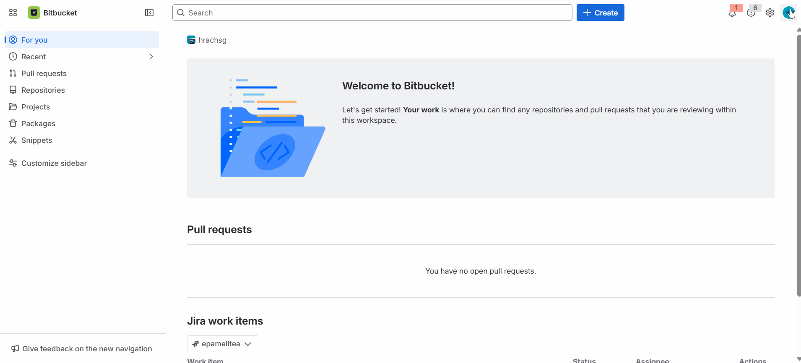
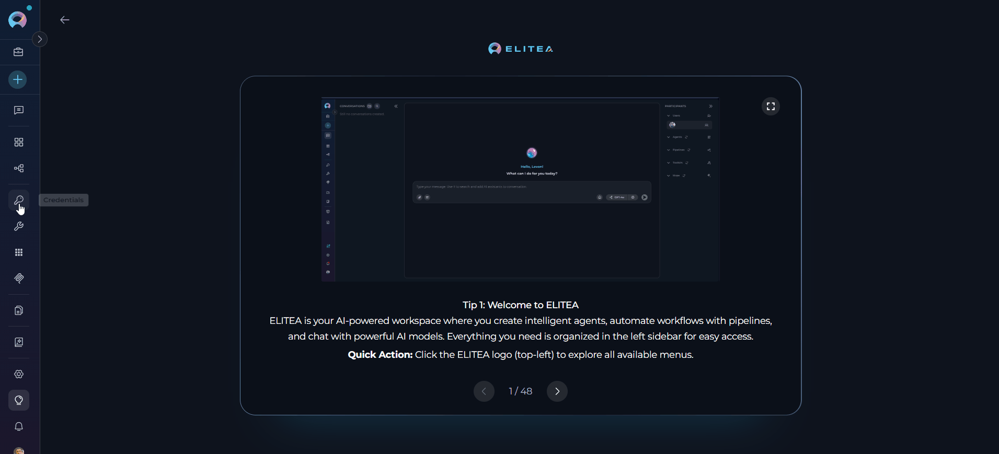
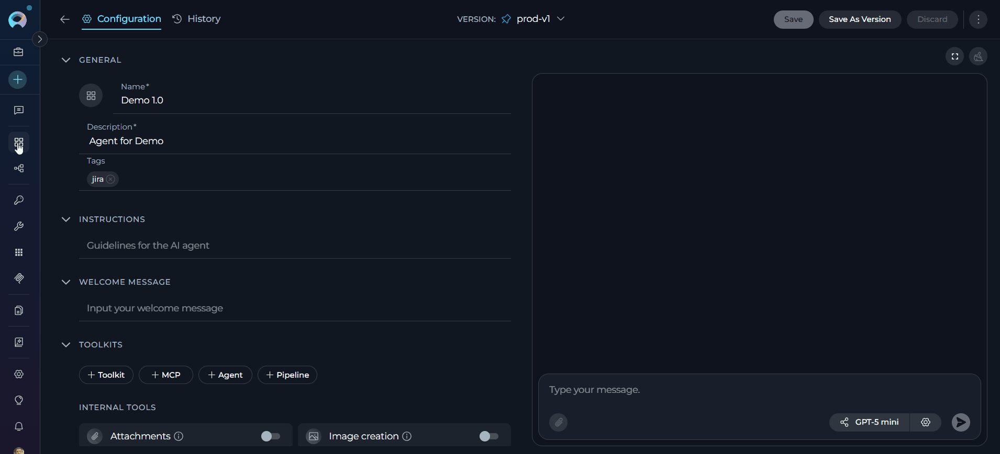
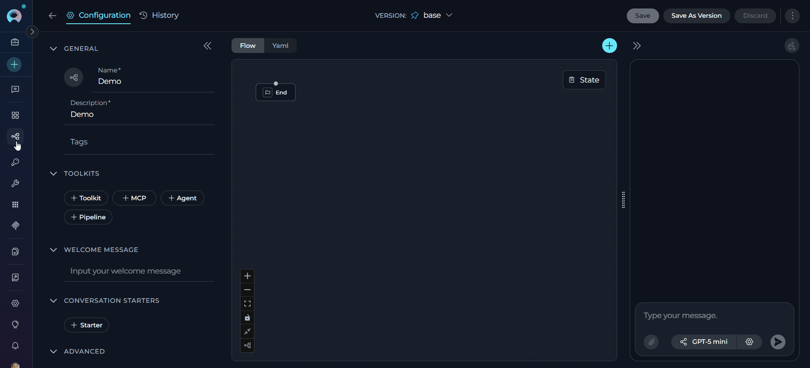
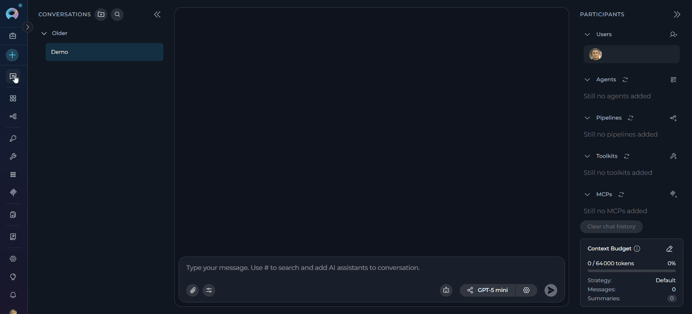

# Bitbucket Toolkit Integration Guide

---

## Introduction

This guide is your comprehensive resource for integrating and utilizing the **Bitbucket toolkit** within ELITEA. It provides detailed, step-by-step instructions, from setting up your Bitbucket API Token to configuring the toolkit in ELITEA and effectively using it within your Agents, Pipelines, and Chat conversations. By following this guide, you will unlock the power of automated code management, streamlined development workflows, and enhanced team collaboration, all directly within the ELITEA platform.

**Brief Overview of Bitbucket**

Bitbucket, by Atlassian, is a leading web-based platform for version control and code collaboration built around Git. It provides a comprehensive ecosystem for professional teams working on software development projects, offering features for:

*   **Robust Version Control:** Leveraging Git, Bitbucket meticulously tracks every change to your code, enabling seamless collaboration, easy rollback to previous states, and a complete history of project evolution.
*   **Streamlined Code Collaboration:** Facilitate effective teamwork with features like pull requests for code review, in-line commenting, and branch-based development workflows, fostering a collaborative coding environment.
*   **Centralized Repository Management:** Provides a secure, reliable platform for hosting and managing your Git repositories, ensuring code availability and integrity.
*   **Workflow Automation:** Integrate with CI/CD pipelines (Bitbucket Pipelines) and other tools to automate building, testing, and deploying your software directly from your repositories.
*   **Issue Tracking and Project Management:** Integrated tools help teams organize tasks, track bugs, and manage projects within the Bitbucket platform.

Integrating Bitbucket with ELITEA brings these powerful development capabilities directly into your AI-driven workflows. Your ELITEA Agents, Pipelines, and Chat conversations can intelligently interact with your Bitbucket repositories to automate code-related tasks, enhance development processes, and improve team collaboration.

---

## Toolkit's Account Setup and Configuration

**Account Setup**

If you don't already have a Bitbucket account, follow these steps to create one:

1.  **Visit Bitbucket:** Navigate to [bitbucket.org](https://bitbucket.org)
2.  **Sign Up:** Click the **"Sign up for Free"** button
3.  **Enter Details:** Provide your email address (use your company email for professional use), enter your name, and create a secure password
4.  **Verify Email:** Check your inbox for a verification email from Bitbucket and click the verification link to activate your account
5.  **Log In:** Once verified, log in to Bitbucket with your credentials

### Generate an API Token

For secure integration with ELITEA, it is essential to use a Bitbucket **API Token**. This method is significantly more secure than using your primary Bitbucket account password directly and allows you to precisely control the permissions granted to ELITEA.

!!! warning "App Passwords Deprecated"
    As of September 9, 2025, app passwords can no longer be created. Use API tokens with scopes instead. All existing app passwords will be disabled on June 9, 2026. Migrate any integrations before then to avoid disruptions.

**Follow these steps to generate an API Token in Bitbucket:**

1.  **Log in to Bitbucket:** Access your Bitbucket account at [bitbucket.org](https://bitbucket.org).
2.  **Navigate to Atlassian Account Settings:** Click on **"Settings"** in the top left corner, then select **"Atlassian account settings"** from the dropdown menu.
3.  **Switch to Security Tab:** Click on the **"Security"** tab in the left sidebar.
4.  **Access API Token Management:** Click on **"Create and manage API tokens"**.
5.  **Create API Token with Scopes:** Click the **"Create API token with scopes"** button.
6.  **Enter Token Name and Expiration:** 
    *   In the "Token name" field, enter a descriptive name like "ELITEA Integration" to easily identify its purpose
    *   Set the expiration date for the token (recommended for security) or choose "No expiration"
    *   Click **"Next"**
6.  **Select the App:** 
    *   From the list of Atlassian products, select **"Bitbucket"**
    *   Click **"Next"**
7.  **Select Bitbucket Scopes:** Carefully select only the necessary scopes for ELITEA to interact with Bitbucket. **Following the principle of least privilege is crucial for security.**

    !!! tip "Token Scopes"
        **Minimal Scopes for Common Use Cases:**
        
        * **Account scopes:**
            * **account:read** — Read account information
        * **Project scopes:**
            * **project:read** — Read project information
        * **Repository scopes:**
            * **repository:read** — Read repository content
            * **repository:write** — Write to repositories (only if your Agent needs to modify repositories)
        * **Pull Request scopes:**
            * **pullrequest:read** — Read pull requests
            * **pullrequest:write** — Create and modify pull requests (only if needed)
        * **Issue scopes:**
            * **issue:read** — Read issues (only if needed)
        * **Wiki scopes:**
            * **wiki:read** — Read wiki content (only if needed)
    
    After selecting the required scopes, click **"Next"**

8.  **Review and Create Token:** Review all the token details including name, expiration, app selection, and scopes. Click **"Create token"** to generate the API token.

9.  **Copy and Store Token:** **Copy the generated API Token immediately** — this is your only chance to see it. Store it securely in a password manager or ELITEA's **[Secrets](../../menus/settings/secrets.md)** feature.

    {loading=lazy}

!!! warning "Important Security Practices"
    **Principle of Least Privilege:** Grant only the scopes absolutely essential for your ELITEA integration tasks.
    
    **Avoid Overly Broad Permissions:** Never grant excessive permissions unless absolutely necessary and with clear understanding of security implications.
    
    **Regular Token Review and Rotation:** Regularly review generated tokens and their scopes. Rotate tokens periodically as a security best practice.

---

## System Integration with ELITEA

To integrate Bitbucket with ELITEA, you need to follow a three-step process: **Create Credentials → Create Toolkit → Use in Agents**. This workflow ensures secure authentication and proper configuration.

### Step 1: Create Bitbucket Credentials

Before creating a toolkit, you must first create Bitbucket credentials in ELITEA:

1. **Navigate to Credentials Menu:** Open the sidebar and select **[Credentials](../../menus/credentials.md)**.
2. **Create New Credential:** Click the **`+ Create`** button.
3. **Select Bitbucket:** Choose **Bitbucket** as the credential type.
4. **Configure Credential Details:**

    | **Field** | **Description** | **Example** |
    |-------|-------------|---------|
    | **Display Name** | Enter a descriptive name | `Bitbucket - Main Workspace` |
    | **ID** | Unique identifier for the credential | Auto-populated from the Display Name |
    | **URL** | Enter the Bitbucket API URL (for Bitbucket Cloud) or your server URL (for Bitbucket Server) | `https://api.bitbucket.org/` |
    | **Auth** | Authentication method | Username & Password |
    | **Username** | Enter your Bitbucket username | `your-username` |
    | **Password** | Enter your Bitbucket API Token | `your-api-token` |

5. **Test Connection:** Click **Test Connection** to verify your credentials are valid and ELITEA can connect to Bitbucket
6. **Save Credential:** Click **Save** to create the credential

     {loading=lazy}

!!! tip "Security Recommendation"
    It's highly recommended to use **[Secrets](../../menus/settings/secrets.md)** for API Tokens instead of entering them directly. Create a secret first, then reference it in your credential configuration.


### Step 2: Create Bitbucket Toolkit

Once your credentials are configured, create the Bitbucket toolkit:

1. **Navigate to Toolkits Menu:** Open the sidebar and select **[Toolkits](../../menus/toolkits.md)**.
2. **Create New Toolkit:** Click the **`+ Create`** button.
3. **Select Bitbucket:** Choose **Bitbucket** from the list of available toolkit types.
4. **Configure Toolkit Settings:**

    | **Field** | **Description** | **Example** |
    |-------|-------------|---------|
    | **Toolkit Name** | Enter a descriptive name for your toolkit | `Bitbucket - MyProject Repo` |
    | **Description** | Add a detailed description of the toolkit's purpose (optional) | `Toolkit for managing code in the MyProject repository` |
    | **Bitbucket Configuration** | Select credentials | `Bitbucket - Main Workspace` |
    | **PgVector Configuration** | Select a PgVector connection for vector database integration (required for indexing features) | `elitea-pgvector` |
    | **Embedding Model** | Select an embedding model for text processing and semantic search (required for indexing features) | `amazon.titan-embed-text-v2:0` |
    | **Project** | Enter your Bitbucket workspace ID | `my-workspace` |
    | **Repository** | Enter the repository name | `my-project-repo` |
    | **Branch** | Enter the main branch name | `main` |
    | **Cloud** | Check this checkbox if using Bitbucket Cloud (leave unchecked for Bitbucket Server) | ✓ (checked) |

5. **Enable Desired Tools:** In the **"Tools"** section, select the checkboxes next to the specific Bitbucket tools you want to enable. **Enable only the tools your agents will actually use** 
       * **[Make Tools Available by MCP](../mcp/make-tools-available-by-mcp.md)** - (optional checkbox) Enable this option to make the selected tools accessible through external MCP clients
6. **Save Toolkit:** Click **Save** to create the toolkit
   
     {loading=lazy}

#### Available Tools:

The Bitbucket toolkit provides the following tools for interacting with Bitbucket repositories, organized by functional categories:

| **Tool Category** | **Tool Name** | **Description** | **Primary Use Case** |
|:-----------------:|---------------|-----------------|----------------------|
| **Branch Management** | | | |
| | **Create branch** | Creates a new branch from the active branch. Automatically sets the new branch as active after creation. Returns success message or handles conflicts if branch already exists | Set up new feature branches or bug fix branches for development work |
| | **Delete branch** | Deletes a branch from the repository with safety checks. Prevents deletion of main/master branches and cannot delete the currently active branch | Remove obsolete or merged feature branches to keep repository clean |
| | **List branches in repo** | Lists branches in the repository with optional limit parameter (default: 20) and wildcard filtering support (e.g., '*dev') | View all branches or find specific branches matching a pattern for branch management |
| | **Set active branch** | Switches the active branch for subsequent operations. Validates branch existence before switching and provides helpful error messages with available branches | Switch context to work on a specific branch for file operations and pull requests |
| **File Operations** | | | |
| | **Create file** | Creates a new file on the Bitbucket repository at the specified path with provided contents and commits it to the specified branch | Add new configuration files, documentation, or source code to the repository |
| | **Edit file** | Edits an existing file using OLD/NEW marker format. Supports multiple edits in a single operation with markers on dedicated lines (e.g., OLD <<<< content >>>> OLD, NEW <<<< content >>>> NEW) | Apply precise changes to existing files with clear before/after content specification |
| | **Grep file** | Searches for text patterns or regular expressions within a specific file in the repository | Find specific code patterns, function definitions, or configuration values in files |
| | **List files** | Lists files in the repository with optional path filter, recursive/non-recursive search control, and branch specification. Non-recursive mode returns only direct children | Browse repository structure, explore directories, or locate specific file paths |
| | **Read file** | Reads and returns the complete contents of a file from the repository at the specified branch | Retrieve file contents for review, analysis, or processing by the AI agent |
| | **Read multiple files** | Reads multiple files from the repository in a single operation, improving efficiency when accessing several files | Efficiently retrieve contents of related files for comprehensive code review or analysis |
| | **Update file** | Updates an existing file using OLD/NEW marker format for content replacement. Validates changes and provides detailed error messages if markers are malformed | Modify existing file contents with explicit old-to-new content transformations |
| **Pull Request Management** | | | |
| | **Add pull request comment** | Adds a comment to a pull request with support for multiple content types (raw text, markup, HTML) and inline comments with line numbers | Provide code review feedback, ask questions, or discuss specific changes in pull requests |
| | **Close pull request** | Closes (declines) a pull request without merging. Optionally adds a comment explaining the closure reason | Reject pull requests that don't meet requirements or are no longer needed |
| | **Create pull request** | Creates a pull request from the bot's branch to the base branch using JSON data specification. Returns PR details including URL upon success | Initiate code review process for changes made by the agent or automation |
| | **Get pull request** | Retrieves complete details of a specific pull request including metadata, status, author, and links | Inspect pull request information to understand changes or status before taking action |
| | **Get pull requests changes** | Retrieves the diff/changes from a pull request showing file modifications, additions, and deletions | Examine specific file changes and modifications included in a pull request |
| | **Get pull requests commits** | Retrieves the list of commits included in a pull request with commit details and metadata | Review commit history and individual commits that make up a pull request |
| **Indexing & Search** | | | |
| | **Index data** | Loads Bitbucket repository data into PgVector for semantic search. Requires PgVector configuration and embedding model to create searchable code index | Enable AI-powered semantic search across repository code for intelligent code discovery |
| | **List collections** | Lists all available indexed collections in the PgVector database to identify searchable datasets | View and manage indexed data collections to understand what code bases are searchable |
| | **Remove index** | Removes previously created search indexes from PgVector to free resources or refresh data | Clean up outdated indexes or prepare for re-indexing with updated repository content |
| | **Search index** | Performs semantic searches across indexed repository content using natural language queries | Find specific code patterns, implementations, or documentation using AI-powered search |
| | **Stepback search index** | Performs advanced contextual searches with broader scope, using step-back prompting to generate better search queries | Execute sophisticated searches requiring broader context understanding and query refinement |
| | **Stepback summary index** | Creates comprehensive summaries of indexed content using step-back prompting for more thorough analysis | Generate intelligent, context-aware summaries of repository code and documentation |

!!! tip "Vector Search Tools"
    The tools **Index data**, **List collections**, **Remove index**, **Search index**, **Stepback search index**, and **Stepback summary index** require PgVector configuration and an embedding model. These enable advanced semantic search capabilities across your Bitbucket repository.

#### Testing Toolkit Tools

After configuring your Bitbucket toolkit, you can test individual tools directly from the Toolkit detailed page using the **Test Settings** panel. This allows you to verify that your credentials are working correctly and validate tool functionality before adding the toolkit to your workflows.

**General Testing Steps:**

1. **Select LLM Model:** Choose a Large Language Model from the model dropdown in the Test Settings panel
2. **Configure Model Settings:** Adjust model parameters like Creativity, Max Completion Tokens, and other settings as needed
3. **Select a Tool:** Choose the specific Bitbucket tool you want to test from the available tools
4. **Provide Input:** Enter any required parameters or test queries for the selected tool
5. **Run the Test:** Execute the tool and wait for the response
6. **Review the Response:** Analyze the output to verify the tool is working correctly and returning expected results

!!! tip "Key benefits of testing toolkit tools:"
    * Verify that Bitbucket credentials and connection are configured correctly
    * Validate that tools function as expected with your Bitbucket repository
    * Test different parameter combinations and edge cases before production use
    * Familiarize yourself with tool capabilities and expected outputs
    
    > For detailed instructions on how to use the Test Settings panel, see **[How to Test Toolkit Tools](../../how-tos/credentials-toolkits/how-to-test-toolkit-tools.md)**.

---
### Step 3: Add Bitbucket Toolkit to Your Workflows

Now you can add the configured Bitbucket toolkit to your agents, pipelines, or use it directly in chat:

---
#### In Agents:

1. **Navigate to Agents:** Open the sidebar and select **[Agents](../../menus/agents.md)**
2. **Create or Edit Agent:** Either create a new agent or select an existing agent to edit
3. **Add Bitbucket Toolkit:**
     * In the **"TOOLKITS"** section of the agent configuration, click the **"+Toolkit"** icon
     * Select your desired Bitbucket toolkit from the dropdown menu
     * The toolkit will be added to your agent with the previously configured tools enabled

     {loading=lazy}

---

#### In Pipelines:

1. **Navigate to Pipelines:** Open the sidebar and select **[Pipelines](../../menus/pipelines.md)**
2. **Create or Edit Pipeline:** Either create a new pipeline or select an existing pipeline to edit
3. **Add Bitbucket Toolkit:**
     * In the **"TOOLKITS"** section of the pipeline configuration, click the **"+Toolkit"** icon
     * Select your desired Bitbucket toolkit from the dropdown menu
     * The toolkit will be added to your pipeline with the previously configured tools enabled

     {loading=lazy}

---

#### In Chat:

1. **Navigate to Chat:** Open the sidebar and select **[Chat](../../menus/chat.md)**
2. **Start New Conversation:** Click **+Create** or open an existing conversation
3. **Add Toolkit to Conversation:**
     * In the chat Participants section, look for the **Toolkits** element
     * Click to add a toolkit and select your desired Bitbucket toolkit from the available options
     * The toolkit will be added to your conversation with all previously configured tools enabled
4. **Use Toolkit in Chat:** You can now directly interact with your Bitbucket repository by asking questions or requesting actions that will trigger the toolkit tools

     {loading=lazy}

!!! example "Example Chat Usage:"
    - "Create a new feature branch called 'user-authentication'"
    - "Show me the contents of the README.md file"
    - "List all open pull requests in the repository"
    - "Create a new pull request from my feature branch to main"

## Instructions and Prompts for Using the Bitbucket Toolkit

To effectively instruct your ELITEA Agent to use the Bitbucket toolkit, you need to provide clear and precise instructions within the Agent's "Instructions" field. These instructions are crucial for guiding the Agent on *when* and *how* to utilize the available Bitbucket tools to achieve your desired automation goals.

### Instruction Creation for Agents

When crafting instructions for the Bitbucket toolkit, especially for OpenAI-based Agents, clarity and precision are paramount. Break down complex tasks into a sequence of simple, actionable steps. Explicitly define all parameters required for each tool and guide the Agent on how to obtain or determine the values for these parameters. OpenAI Agents respond best to instructions that are:

*   **Direct and Action-Oriented:** Employ strong action verbs and clear commands to initiate actions. For example, "Use the 'read_file' tool...", "Create a branch using 'create_branch'...", "List all open pull requests...".

*   **Parameter-Centric:** Clearly enumerate each parameter required by the tool. For each parameter, specify:
    *   Its name (exactly as expected by the tool)
    *   How the Agent should obtain the value — whether from user input, derived from previous steps in the conversation, retrieved from an external source, or a predefined static value

*   **Contextually Rich:** Provide sufficient context so the Agent understands the overarching objective and the specific scenario in which each Bitbucket tool should be applied within the broader workflow. Explain the desired outcome or goal for each tool invocation.

*   **Step-by-Step Structure:** Organize instructions into a numbered or bulleted list of steps for complex workflows. This helps the Agent follow a logical sequence of actions.

*   **Add Conversation Starters:** Include example conversation starters that users can use to trigger this functionality. For example, "Conversation Starters: 'Create a feature branch', 'Show me the README', 'List all pull requests'"

When instructing your Agent to use a Bitbucket toolkit tool, adhere to this structured pattern:

1. **State the Goal:** Begin by clearly stating the objective you want to achieve with this step. For example, "Goal: To create a new feature branch in the repository."

2. **Specify the Tool:** Clearly indicate the specific Bitbucket tool to be used for this step. For example, "Tool: Use the 'create_branch' tool."

3. **Define Parameters:** Provide a detailed list of all parameters required by the selected tool. For each parameter:
   - **Parameter Name:** `<Parameter Name as defined in tool documentation>`
   - **Value or Source:** `<Specify the value or how to obtain the value. Examples: "user input", "from previous step", "hardcoded value 'main'", "value of variable X">`

4. **Describe Expected Outcome (Optional but Recommended):** Briefly describe the expected result or outcome after the tool is successfully executed. For example, "Outcome: The Agent will display the file content to the user."

5. **Add Conversation Starters:** Include example conversation starters that users can use to trigger this functionality.

!!! example "Example Agent Instructions"
    **Agent Instructions for Creating a Branch:**

    ```markdown
    1. Goal: Create a new feature branch based on the main branch.
    2. Tool: Use the "create_branch" tool.
    3. Parameters:
        - branch_name: "Ask the user for the feature branch name, or use a default naming convention like 'feature-<feature-name>'."
    4. Outcome: A new branch will be created and automatically set as the active branch for subsequent operations.
    5. Conversation Starters: "Create a new feature branch", "Start a new branch for user authentication"
    ```

    **Agent Instructions for Reading a File:**

    ```markdown
    1. Goal: Read the content of a specific file to provide information to the user.
    2. Tool: Use the "read_file" tool.
    3. Parameters:
        - file_path: "Ask the user which file they want to read, or specify a default file like 'README.md'."
        - branch: "Use the currently active branch, or ask the user to specify a branch name."
    4. Outcome: The file contents will be retrieved and displayed to the user.
    5. Conversation Starters: "Show me the README file", "Read the config.json file"
    ```

---

### Chat Usage Examples by Tool Category

The following examples demonstrate how to interact with the Bitbucket toolkit in ELITEA Chat, organized by functional categories. Each example shows the user request and the expected agent behavior.

??? example "Branch Management - Create Branch"

    **Chat Example:**
    ```
    User: "Create a new feature branch called 'feature-login-page'"

    Agent Response: [Agent uses create_branch tool]

    ✔️ **Branch Created Successfully!**

    Branch `feature-login-page` created successfully and set as active.

    You can now start making changes to this branch. All subsequent file operations will be performed on this branch.
    ```

??? example "Branch Management - List Branches"

    **Chat Example:**
    ```
    User: "Show me all branches in the repository"

    Agent Response: [Agent uses list_branches_in_repo tool]

    **Repository Branches:**

    Found branches: main, develop, feature-user-auth, feature-dashboard, bugfix-login, hotfix-security

    Total: 6 branches found in the repository.
    ```

??? example "File Operations - Create File"

    **Chat Example:**
    ```
    User: "Create a new file called 'deployment.yaml' with basic deployment configuration"

    Agent Response: [Agent uses create_file tool]

    ✔️ **File Created Successfully!**

    - **File Path**: deployment.yaml
    - **Branch**: feature-login-page (active branch)
    - **Status**: File has been created

    The file has been added to the repository on the current active branch.
    ```

??? example "File Operations - Read File"

    **Chat Example:**
    ```
    User: "Show me the contents of the README.md file"

    Agent Response: [Agent uses read_file tool]

    **File Contents: README.md**
    **Branch**: main

    My Project

    This is a sample project demonstrating...
    [... file contents ...]

    The README file provides an overview of the project structure and setup instructions.
    ```

??? example "Pull Request Management - Create Pull Request"

    **Chat Example:**
    ```
    User: "Create a pull request to merge feature-login-page into develop"

    Agent Response: [Agent uses create_pull_request tool]

    ✔️ **Pull Request Created Successfully!**

    - **Source Branch**: feature-login-page
    - **Target Branch**: develop
    - **Title**: Merge feature-login-page
    - **Status**: Open
    - **URL**: https://bitbucket.org/workspace/repo/pull-requests/123

    The pull request is ready for review. Team members can now review and approve the changes.
    ```

??? example "Pull Request Management - Add PR Comment"

    **Chat Example:**
    ```
    User: "Add a comment to pull request #123 saying 'LGTM, approved'"

    Agent Response: [Agent uses add_pull_request_comment tool]

    ✔️ **Comment Added Successfully!**

    - **Pull Request**: #123
    - **Comment**: "LGTM, approved"
    - **Posted By**: bot-user

    Your comment has been added to the pull request.
    ```

---

## Troubleshooting

??? warning "Connection Issues"
    **Problem:** Agent fails to connect to Bitbucket or experiences timeout errors
    
    **Possible Error Messages:**
    
    - "Cannot connect to Bitbucket at [URL]: connection refused"
    - "Connection to Bitbucket at [URL] timed out"
    - "SSL certificate verification failed"
    - "Bitbucket API endpoint not found"
    
    **Solutions:**
    
    1. **Verify URL Format:**
        - Cloud: Use `https://api.bitbucket.org/` (default)
        - Server/Data Center: Use your server URL (e.g., `https://bitbucket.company.com`)
        - Ensure URL starts with `http://` or `https://`
        - Remove trailing slashes from URL
    
    2. **Check Network Connectivity:**
        - Verify you can access the Bitbucket URL in a browser
        - Check firewall settings and proxy configuration
        - Ensure the server is not blocking API requests
    
    3. **SSL Certificate Issues:**
        - For self-hosted Bitbucket Server with self-signed certificates, verify SSL setup
        - Contact your IT department if certificate validation fails
    
    4. **API Endpoint Validation:**
        - Cloud uses `/2.0/user` endpoint for connection testing
        - Server uses `/rest/api/1.0/users/{username}` endpoint
        - Verify the correct endpoint is accessible

??? warning "Authentication Errors"
    **Problem:** "Permission Denied", "Unauthorized", or authentication-related errors
    
    **Possible Error Messages:**
    
    - "Authentication failed: invalid username or password" (401)
    - "Access forbidden: check user permissions" (403)
    - "not permitted to access this resource"
    - "Please, verify you token/password"
    
    **Solutions:**
    
    1. **Verify Credentials:**
        - Username must match the account that created the API Token
        - Ensure API Token is copied correctly without extra spaces
        - Check that the API Token hasn't expired
        - Password field cannot be empty
    
    2. **API Token Scopes (Cloud):**
        - Minimum read-only: `account:read`, `project:read`, `repository:read`
        - For write operations: add `repository:write`
        - For pull requests: add `pullrequest:write`
        - Verify scopes at: https://bitbucket.org/account/settings/api-tokens/
    
    3. **Permissions Check:**
        - Ensure the user has access to the workspace/project
        - Verify repository access rights (read or write as needed)
        - For Server, check if the user has project permissions
    
    4. **Token Regeneration:**
        - If token is compromised or old, generate a new one
        - Update the toolkit configuration with the new token
        - Delete old tokens for security

??? warning "Repository Access Issues"
    **Problem:** Cannot access specific repositories or branches
    
    **Possible Error Messages:**
    
    - "Unable to connect to the repository '[name]' due to error"
    - "Error branch `[name]` does not exist, in repo with current branches: [list]"
    - "Branch '[name]' does not exist in the repository"
    
    **Solutions:**
    
    1. **Workspace/Project Configuration:**
        - **Cloud:** Use workspace slug (e.g., `my-workspace`)
        - **Server:** Use project key (e.g., `PROJ`)
        - Verify case sensitivity - names must match exactly
    
    2. **Repository Name:**
        - Use repository slug, not display name
        - Check spelling and case sensitivity
        - Example: `my-repo` not `My Repo`
    
    3. **Branch Name Validation:**
        - Branch names are case-sensitive
        - Use `list_branches_in_repo` tool to see all available branches
        - For branches with slashes (e.g., `feature/login`), ensure correct encoding
        - Set correct branch using `set_active_branch` tool
    
    4. **Access Rights:**
        - Verify the user has at least read access to the repository
        - Check repository visibility settings (private vs public)
        - Ensure workspace/project membership is active

??? warning "Branch Operation Failures"
    **Problem:** Branch creation, deletion, or switching fails
    
    **Possible Error Messages:**
    
    - "Branch [name] already exists. set it as active"
    - "Cannot delete branch '[name]'. Deletion of main or master branches is forbidden"
    - "Branch '[name]' cannot be deleted because it is currently the active branch"
    - "Failed to validate branch '[name]'"
    
    **Solutions:**
    
    1. **Branch Creation Issues:**
        - If branch already exists, it will be set as active automatically
        - Ensure active branch is set correctly before creating from it
        - Verify you have write permissions to create branches
    
    2. **Branch Deletion Protection:**
        - **Cannot delete:** `main` or `master` branches (safety feature)
        - **Cannot delete:** Currently active branch
        - Switch to a different branch before deleting
        - Use `set_active_branch` to switch context first
    
    3. **Branch Switching:**
        - Verify branch exists before switching to it
        - Check branch name spelling and case sensitivity
        - Review list of available branches if unsure

??? warning "File Operation Failures"
    **Problem:** File creation, reading, or updates fail unexpectedly
    
    **Possible Error Messages:**
    
    - "File was not created due to error: [details]"
    - "Can't extract file content (`[path]`) due to error"
    - "File '[path]' from branch '[branch]' is empty or could not be retrieved"
    - "Failed to retrieve text from file '[path]' from branch '[branch]'"
    - "File was not updated due to error: [details]"
    
    **Solutions:**
    
    1. **File Path Format:**
        - Use relative paths from repository root
        - **Correct:** `src/config.json` or `README.md`
        - **Incorrect:** `/src/config.json` (no leading slash)
        - Avoid special characters in file names
    
    2. **Active Branch:**
        - Ensure active branch is set correctly using `set_active_branch`
        - Verify the branch exists using `list_branches_in_repo`
        - File operations use the currently active branch by default
    
    3. **Write Permissions:**
        - Check API Token has `repository:write` scope
        - Verify user has write access to the repository
        - Branch protection rules may prevent direct commits
    
    4. **Update File Format:**
        - Use OLD/NEW markers on dedicated lines:
          ```
          OLD <<<<
          old content here
          >>>> OLD
          NEW <<<<
          new content here
          >>>> NEW
          ```
        - Markers must be on their own lines, not inline with content
        - Multiple OLD/NEW pairs are supported for multiple edits
    
    5. **Empty File Handling:**
        - Some tools may fail on empty files
        - Verify file exists before reading
        - Check file is not binary or too large

??? warning "Pull Request Issues"
    **Problem:** Pull request creation or management fails
    
    **Possible Error Messages:**
    
    - "Make sure your pr_json matches to data json format"
    - "Bad request" error when creating PR
    - "Can't get pull request `[id]` due to error"
    - "Can't add comment to pull request `[id]` due to error"
    
    **Solutions:**
    
    1. **PR Creation Format:**
        - Use correct JSON format for `create_pull_request`
        - Verify source and target branches exist
        - Ensure you have `pullrequest:write` scope (Cloud)
    
    2. **PR Access:**
        - Verify pull request ID is correct
        - Check user has access to view the PR
        - Ensure PR exists and hasn't been deleted
    
    3. **Comment Format:**
        - Content can be string (raw text) or dict with 'raw', 'markup', 'html' keys
        - For inline comments, provide line numbers and file path
        - Verify PR is open and accepting comments

??? warning "Indexing and Search Issues"
    **Problem:** Repository indexing or semantic search fails
    
    **Solutions:**
    
    1. **PgVector Configuration:**
        - Ensure PgVector Configuration is set in toolkit settings
        - Verify PgVector database is accessible and running
        - Check connection credentials for PgVector
    
    2. **Embedding Model:**
        - Embedding Model must be specified in toolkit configuration
        - Common models: `amazon.titan-embed-text-v2:0`, `text-embedding-ada-002`
        - Verify model is available in your environment
    
    3. **Index Operations:**
        - Index must be created before searching (`index_data` tool)
        - Use `list_collections` to verify index exists
        - Remove and recreate index if data is stale
    
    4. **Search Queries:**
        - Use natural language for semantic search
        - Be specific in queries for better results
        - Try stepback search for broader context

### Support Contact

If you encounter issues not covered in this guide or need additional assistance with Bitbucket integration, please refer to **[Contact Support](../../support/contact-support.md)** for detailed information on how to reach the ELITEA Support Team.     

---

## FAQ

??? question "Can I use my regular Bitbucket password instead of an API Token?"
    No, **you must use an API Token for Bitbucket Cloud**. API Tokens are more secure and allow you to limit permissions through granular scopes. For Bitbucket Server/Data Center, you can use either API tokens or user passwords depending on your server configuration.
    
    **Why API Tokens are recommended:**
    
    - More secure than passwords
    - Granular permission control through scopes
    - Can be revoked without changing password
    - Activity tracking and audit capabilities
    - No need to share actual account password

??? question "What are the minimum scopes needed for the API Token?"
    **Bitbucket Cloud API Token Scopes:**
    
    **Read-Only Operations:**
    
    - `account:read` — Read account information
    - `project:read` — Read project/workspace data
    - `repository:read` — Read repository content
    
    **Write Operations (Full Functionality):**
    
    - `repository:write` — Create/modify files and branches
    - `pullrequest:write` — Create and manage pull requests
    
    **Recommended Scope Combinations:**
    
    - **Basic file reading:** `account:read`, `repository:read`
    - **Code changes:** Add `repository:write`
    - **PR workflows:** Add `pullrequest:write`
    - **Full automation:** All scopes above
    
    Configure scopes at: https://bitbucket.org/account/settings/api-tokens/
    
    **Note:** Bitbucket Server uses permission levels rather than scopes.

??? question "What happened to App Passwords?"
    **App Passwords are deprecated** as of September 9, 2025. Bitbucket Cloud has transitioned to API Tokens with granular scopes for better security and control.
    
    **Timeline:**
    
    - **September 9, 2025:** App Passwords deprecated, new tokens use API Token system
    - **June 9, 2026:** All existing App Passwords will be disabled
    
    **Migration Steps:**
    
    1. Go to https://bitbucket.org/account/settings/api-tokens/
    2. Create new API Token with appropriate scopes
    3. Update your toolkit configuration with the new token
    4. Delete old App Passwords for security
    
    **Why the change:**
    
    - Better security with scope-based permissions
    - Improved audit and activity tracking
    - Alignment with modern authentication standards

??? question "Can I use this toolkit with Bitbucket Server or Data Center?"
    Yes, the toolkit **fully supports both Bitbucket Cloud and Bitbucket Server/Data Center**.
    
    **Configuration Differences:**
    
    **Bitbucket Cloud:**
    
    - URL: `https://api.bitbucket.org/` (default)
    - Cloud checkbox: ✔️ Checked (or auto-detected)
    - Project: Workspace slug (e.g., `my-workspace`)
    - Authentication: API Token with scopes
    - API: REST API v2.0 endpoints
    
    **Bitbucket Server/Data Center:**
    
    - URL: Your server URL (e.g., `https://bitbucket.company.com`)
    - Cloud checkbox: ✘ Unchecked
    - Project: Project key (e.g., `PROJ`)
    - Authentication: Username and password/token
    - API: REST API v1.0 endpoints
    
    The toolkit automatically detects which API to use based on the URL and Cloud setting.

??? question "How do I know which branch is currently active?"
    The active branch is determined in this order:
    
    1. **Initial Setup:** Branch specified in toolkit configuration (default: `main`)
    2. **During Operations:** Last branch set using `set_active_branch` tool
    3. **After Branch Creation:** Newly created branch automatically becomes active
    
    **Best Practices:**
    
    - Always verify active branch before file operations using `set_active_branch`
    - Use `list_branches_in_repo` to see all available branches
    - The agent maintains branch context throughout the conversation
    - File operations default to the active branch unless specified otherwise
    
    **Example Workflow:**
    ```
    1. Create branch "feature-login" → Becomes active
    2. Create/edit files → Operations use "feature-login"
    3. Switch to "main" → File operations now use "main"
    ```

??? question "Why can't my Agent create pull requests?"
    **Common Causes and Solutions:**
    
    **1. Missing Permissions:**
    
    - Bitbucket Cloud: Ensure API Token has `pullrequest:write` scope
    - Bitbucket Server: Verify user has write access to target repository
    
    **2. Branch Issues:**
    
    - Verify source branch exists and has commits
    - Ensure target branch exists (usually `main` or `develop`)
    - Check both branches are in the same repository
    - Source branch must have changes not in target branch
    
    **3. JSON Format:**
    
    - Pull request requires JSON data with title, description, source, and destination
    - Ensure JSON format matches Bitbucket API requirements
    - Check for syntax errors in the JSON data
    
    **4. Repository Settings:**
    
    - Some repositories may have branch protection rules
    - Pull requests might require approvals or checks
    - Verify user is not restricted from creating PRs
    
    **Troubleshooting Steps:**
    ```
    1. Verify API Token scopes
    2. Check source and target branches exist
    3. Ensure source branch has commits
    4. Review PR creation JSON format
    5. Check repository permissions and settings
    ```

??? question "Can I use this toolkit with multiple repositories?"
    Each toolkit instance is configured for **one repository only**. To work with multiple repositories:
    
    **Multi-Repository Setup:**
    
    1. **Create Multiple Toolkit Configurations:**
        - Create separate toolkit for each repository
        - Use descriptive names (e.g., "Bitbucket - Frontend", "Bitbucket - Backend")
        - Each can use the same credentials but different repository settings
    
    2. **Agent Configuration:**
        - Add all needed toolkits to your agent
        - Agent can access all repositories through their respective toolkits
        - Specify toolkit name when needed for clarity
    
    3. **Best Practices:**
        - Use naming convention to identify repository purpose
        - Share credentials across toolkits if accessing same workspace
        - Consider separate embeddings for each repo when indexing
    
    **Example Setup:**
    ```
    Toolkit 1: "Bitbucket - Frontend"
    - Repository: frontend-app
    - Branch: main
    
    Toolkit 2: "Bitbucket - Backend API"
    - Repository: backend-api
    - Branch: develop
    ```

??? question "What's the difference between 'edit_file' and 'update_file' tools?"
    Both tools modify file contents but use the same underlying mechanism:
    
    **Both Tools:**
    
    - Use OLD/NEW marker format for content replacement
    - Support multiple edits in single operation
    - Validate changes before applying
    - Require markers on dedicated lines
    
    **Usage Pattern:**
    ```
    OLD <<<<
    content to replace
    >>>> OLD
    NEW <<<<
    new content
    >>>> NEW
    ```
    
    **Key Points:**
    
    - Markers must be on their own lines (not inline)
    - Multiple OLD/NEW pairs supported
    - Validates that old content exists before replacement
    - Provides detailed error messages if markers are malformed
    - Both tools are functionally equivalent for file updates

??? question "How do I handle branch names with special characters or slashes?"
    Branch names with special characters (especially forward slashes) are automatically handled:
    
    **Automatic Handling:**
    
    - Branch names like `feature/login-page` are URL-encoded internally
    - Use the full branch name as-is when calling tools
    - No manual encoding required from your side
    
    **Examples:**
    ```
    feature/login-page → Works automatically
    bugfix/user-auth → Works automatically
    release/v2.0 → Works automatically
    ```
    
    **Best Practices:**
    
    - Use forward slashes for hierarchical naming: `feature/`, `bugfix/`, `release/`
    - Avoid special characters: `@`, `#`, `$`, `&`, `*`
    - Use hyphens instead of spaces: `feature-login` not `feature login`
    - Keep branch names descriptive but concise

??? question  "Can I use this toolkit for repository indexing and semantic search?"
    Yes, the toolkit includes powerful **semantic search capabilities** through PgVector integration:
    
    **Requirements:**
    
    1. **PgVector Configuration:** Must be set up and accessible
    2. **Embedding Model:** Specified in toolkit configuration
    3. **Index Creation:** Use `index_data` tool to create searchable index
    
    **Available Search Tools:**
    
    - **Index data:** Load repository into vector database
    - **Search index:** Find code using natural language queries
    - **Stepback search:** Advanced contextual search with broader scope
    - **Stepback summary:** Generate intelligent summaries of code
    - **List collections:** View available indexed repositories
    - **Remove index:** Clean up or refresh indexes
    
    **Use Cases:**
    
    - Find similar code patterns across large repositories
    - Discover implementations of specific features
    - Generate documentation from code
    - Analyze code structure and dependencies
    - Search using natural language instead of exact keywords
    
    **Note:** Indexing tools require additional configuration beyond basic file operations.

??? question "What file operations are supported and are there any size limits?"
    The toolkit supports comprehensive file operations with the following capabilities:
    
    **Supported Operations:**
    
    - **Read:** `read_file`, `read_multiple_files`, `read_file_chunk`
    - **Write:** `create_file`, `update_file`, `edit_file`
    - **Search:** `grep_file` (pattern search within files)
    - **List:** `list_files` (with recursive/non-recursive options)
    
    **File Handling:**
    
    - **Text Files:** Full support for all text-based files
    - **Binary Files:** Limited support, may cause issues
    - **Empty Files:** Can be created but read operations may fail
    - **Large Files:** No explicit size limit, but consider performance
    
    **Best Practices:**
    
    - Use `read_file_chunk` for partial reads of large files
    - Use `read_multiple_files` for efficiency when reading several files
    - Avoid operations on binary files (images, executables, etc.)
    - For very large files, consider using grep instead of full reads
    
    **Limitations:**
    
    - No direct file deletion tool (use update with empty content if needed)
    - No file move/rename operation (create new + delete old)
    - File paths must be relative to repository root

---

!!! reference "Useful ELITEA Resources"
    * **[How to Use Chat Functionality](../../how-tos/chat-conversations/how-to-use-chat-functionality.md)** — Learn interactive Bitbucket operations in Chat
    * **[Create and Edit Agents from Canvas](../../how-tos/chat-conversations/how-to-create-and-edit-agents-from-canvas.md)** — Quick agent creation for Bitbucket automation
    * **[Create and Edit Toolkits from Canvas](../../how-tos/chat-conversations/how-to-create-and-edit-toolkits-from-canvas.md)** — Streamline Bitbucket toolkit configuration
    * **[Create and Edit Pipelines from Canvas](../../how-tos/chat-conversations/how-to-create-and-edit-pipelines-from-canvas.md)** — Build automated Bitbucket workflows
    * **[Indexing Overview](../../how-tos/indexing/indexing-overview.md)** — Enable semantic search across Bitbucket repositories
    * **[Index Repo Data](../../how-tos/indexing/index-github-data.md)** — Instructions for indexing repository content (applicable to Bitbucket)

!!! reference "External Resources"
    * **[Bitbucket Website](https://bitbucket.org)** — Access the main Bitbucket platform
    * **[Bitbucket API Tokens Settings](https://bitbucket.org/account/settings/api-tokens/)** — Create and manage API tokens
    * **[Bitbucket REST API Documentation](https://developer.atlassian.com/cloud/bitbucket/rest/)** — Official API reference
    * **[Bitbucket Cloud Documentation](https://support.atlassian.com/bitbucket-cloud/)** — Comprehensive Bitbucket guides
    * **[ELITEA Support](mailto:SupportAlita@epam.com)** — Contact support team for assistance

