# ELITEA Toolkit Guide: Bitbucket Integration

## Introduction

### Purpose of this Guide

This guide is your definitive resource for integrating and utilizing the **Bitbucket toolkit** within ELITEA. It provides a step-by-step walkthrough, from setting up your Bitbucket API Token to configuring the toolkit in ELITEA and effectively using it within your Agents.  By following this guide, you will unlock the power of automated code management, streamlined development workflows, and enhanced team collaboration, all directly within the ELITEA platform. This integration empowers you to leverage AI-driven automation to optimize your software development lifecycle using the combined strengths of ELITEA and Bitbucket.

### Brief Overview of Bitbucket

Bitbucket, by Atlassian, is a leading web-based platform for version control and code collaboration. It's designed for professional teams working on software development projects using Git. Bitbucket provides a central place to manage your entire development process, offering features for:

*   **Efficient Version Control:** Track every change to your code, enabling easy collaboration, rollback to previous versions, and a clear history of project evolution.
*   **Seamless Code Collaboration:** Facilitate teamwork with features like pull requests, in-line code reviews, and branch-based development workflows.
*   **Organized Branch Management:** Structure your development with branches for features, bug fixes, and releases, ensuring a clear and manageable development process.
*   **Workflow Automation:** Integrate with CI/CD pipelines and other tools to automate building, testing, and deploying your software.

Integrating Bitbucket with ELITEA brings these robust code management capabilities directly into your AI-powered workflows. Your ELITEA Agents can then interact with your Bitbucket repositories to automate code-related tasks, enhance development processes, and improve team collaboration through intelligent automation.

## BitBucket Account Setup and Configuration

### Account Setup

If you don't have a Bitbucket account yet, here’s how to get started:

1.  **Go to Bitbucket:** Open your web browser and navigate to [bitbucket.org](https://bitbucket.org).
2.  **Sign Up for Free:** Click the **"Sign up for Free"** button.
3.  **Enter Your Email:** Provide your email address. **For professional use, it's highly recommended to use your company email.**
4.  **Create Your Account:** Follow the prompts to set up your account, including entering your name and creating a secure password.
5.  **Verify Your Email:** Check your inbox for a verification email from Bitbucket and click the verification link to activate your account.
6.  **Log In:** Once verified, log in to Bitbucket with your new credentials.

### Token/API Key Generation: Creating an API Token in Bitbucket

For secure integration with ELITEA, you need to create a Bitbucket **API Token**. This method is more secure than using your primary account password directly and allows you to control the permissions (scopes) granted to ELITEA.

!!! warning "App Passwords Has Been Replaced by API Tokens"
    As of September 9, 2025, app passwords can no longer be created. Use API tokens with scopes instead. All existing app passwords will be disabled on June 9, 2026. Migrate any integrations before then to avoid disruptions.
    
    [Go to API tokens]

**Follow these steps to create an API Token:**

1.  **Log in to Bitbucket:** Access your Bitbucket account at [bitbucket.org](https://bitbucket.org).
2.  **Navigate to Atlassian Account Settings:** Click on **"Settings"** in the top left corner, then select **"Atlassian account settings"** from the dropdown menu.

    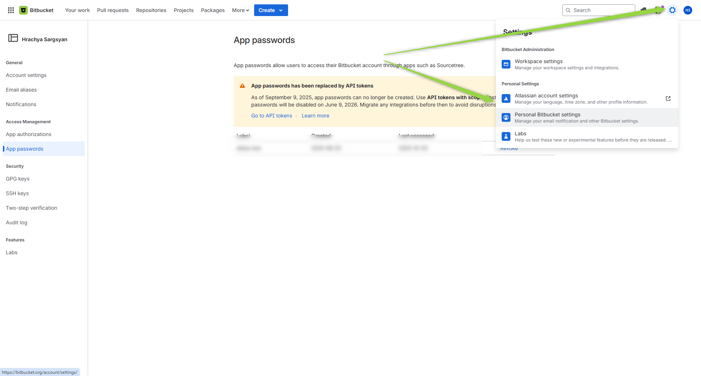

3.  **Switch to Security Tab:** Click on the **"Security"** tab in the left sidebar.
4.  **Access API Token Management:** Click on **"Create and manage API tokens"**.

    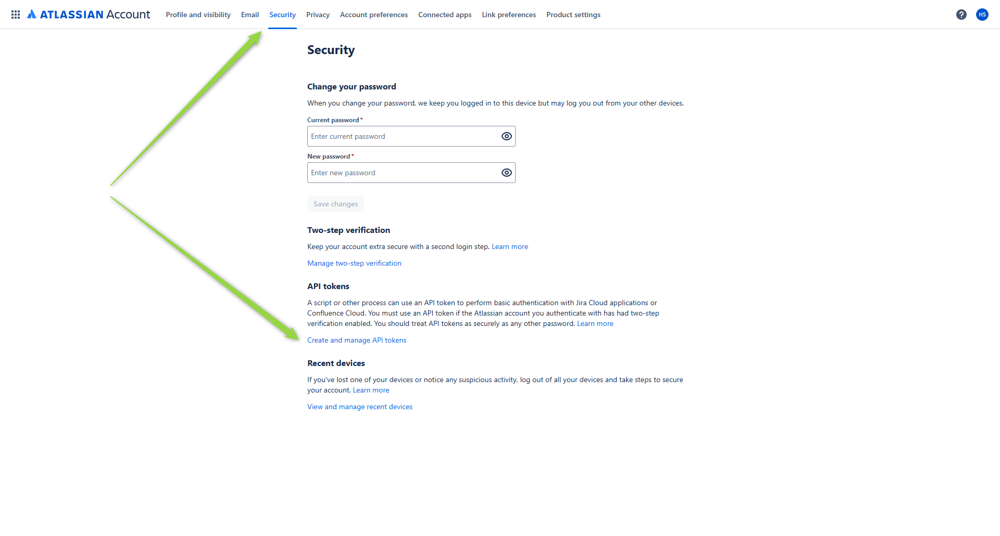


5.  **Create API Token with Scopes:** Click the **"Create API token with scopes"** button.

    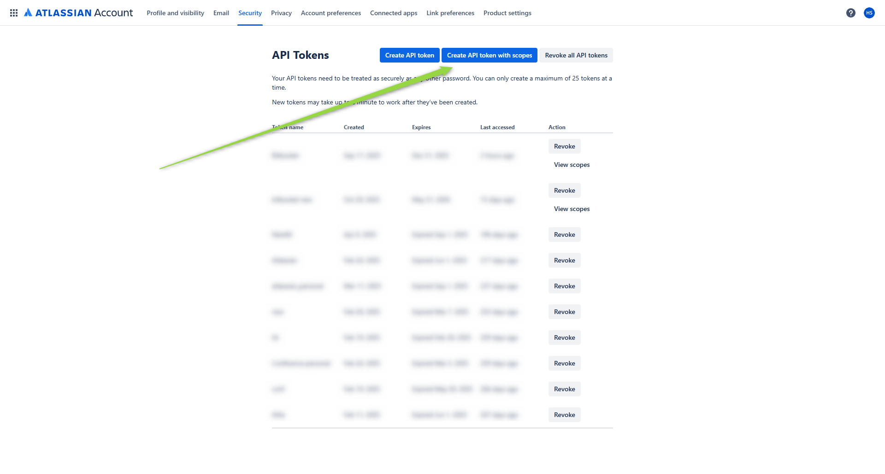

6.  **Enter Token Name and Expiration:** 
    *   In the "Token name" field, enter a descriptive name like "ELITEA Integration" to easily identify its purpose
    *   Set the expiration date for the token (recommended for security) or choose "No expiration"
    *   Click **"Next"**
6.  **Select the App:** 
    *   From the list of Atlassian products, select **"Bitbucket"**
    *   Click **"Next"**

    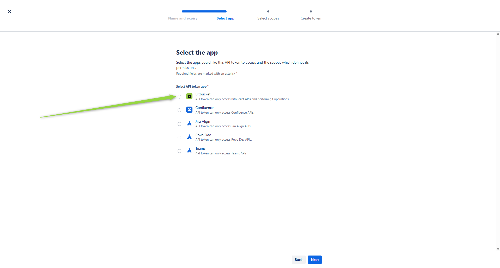

7.  **Select Bitbucket Scopes - Grant Least Privilege:**  This is crucial for security. **Carefully select only the necessary scopes** for ELITEA to interact with Bitbucket.  For typical ELITEA integration, consider these minimal scopes:
    *   **Account scopes:**
        *   **account:read** - Read account information
    *   **Project scopes:**
        *   **project:read** - Read project information
    *   **Repository scopes:**
        *   **repository:read** - Read repository content
        *   **repository:write** - Write to repositories (Only if your Agent needs to modify repositories, e.g., create files, branches, or pull requests)
    *   **Pull Request scopes:**
        *   **pullrequest:read** - Read pull requests
        *   **pullrequest:write** - Create and modify pull requests (If your Agent will create pull requests)
    *   **Issue scopes:**
        *   **issue:read** - Read issues (If your Agent needs to access issues)
    *   **Wiki scopes:**
        *   **wiki:read** - Read wiki content (If your Agent needs to read wiki content)

    **Security Best Practice:**  **Avoid granting "Admin" or any unnecessary scopes.** Limiting scopes significantly reduces potential security risks.
    
    After selecting the required scopes, click **"Next"**

    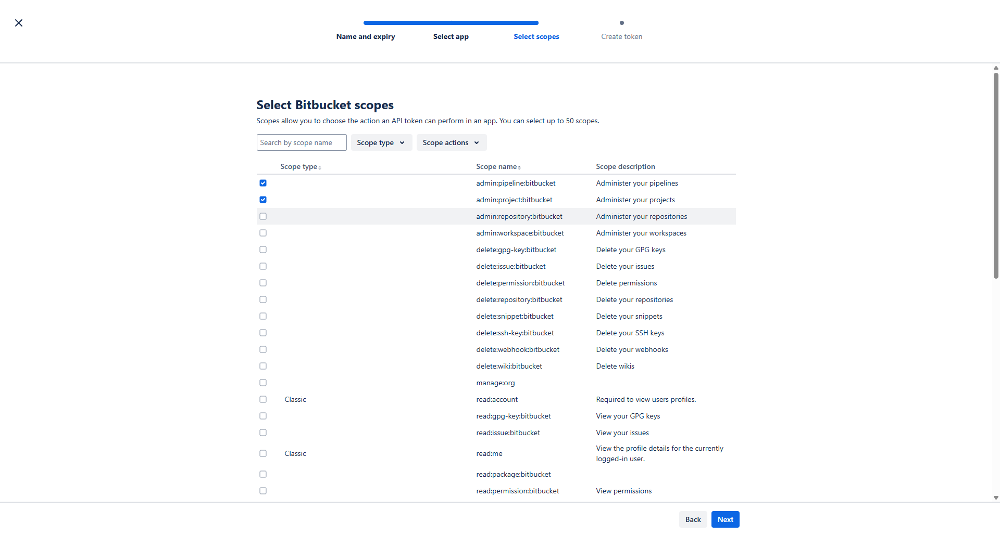
8.  **Review and Create Token:** Review all the token details including name, expiration, app selection, and scopes. Click **"Create token"** to generate the API token.

9.  **Copy and Store Your API Token:** **Immediately copy the generated API Token.** This is the only time it will be displayed in full. Store it securely using a password manager or ELITEA's built-in Secrets feature (recommended for enhanced security within ELITEA). You will need this API Token to configure the Bitbucket toolkit in ELITEA.

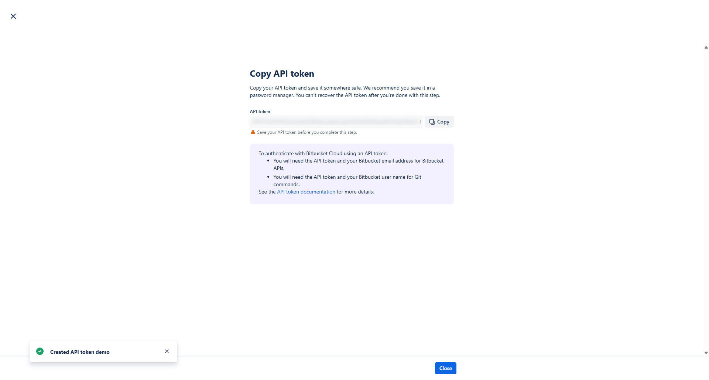


## System Integration with ELITEA

To integrate Bitbucket with ELITEA, you need to follow a three-step process: **Create Credentials → Create Toolkit → Use in Agents**. This workflow ensures secure authentication and proper configuration.

### Step 1: Create Bitbucket Credentials

Before creating a toolkit, you must first create Bitbucket credentials in ELITEA:

1. **Navigate to Credentials Menu:** Open the sidebar and select **[Credentials](../../menus/credentials.md)**.
2. **Create New Credential:** Click the **`+ Create`** button.
3. **Select Bitbucket:** Choose **Bitbucket** as the credential type.
4. **Configure Credential Details:**
     * **Display Name:** Enter a descriptive name (e.g., "Bitbucket - Main Workspace")
     * **URL:** Enter the Bitbucket API URL: `https://api.bitbucket.org/` (for Bitbucket Cloud) or your server URL (for Bitbucket Server)
     * **Username:** Enter your Bitbucket username
     * **Password:** Enter your Bitbucket API Token (the one you generated in the previous section)
5. **Save Credential:** Click **Save** to create the credential

!!! tip "Security Recommendation"
    It's highly recommended to use **[Secrets](../../menus/settings/secrets.md)** for API Tokens instead of entering them directly. Create a secret first, then reference it in your credential configuration.

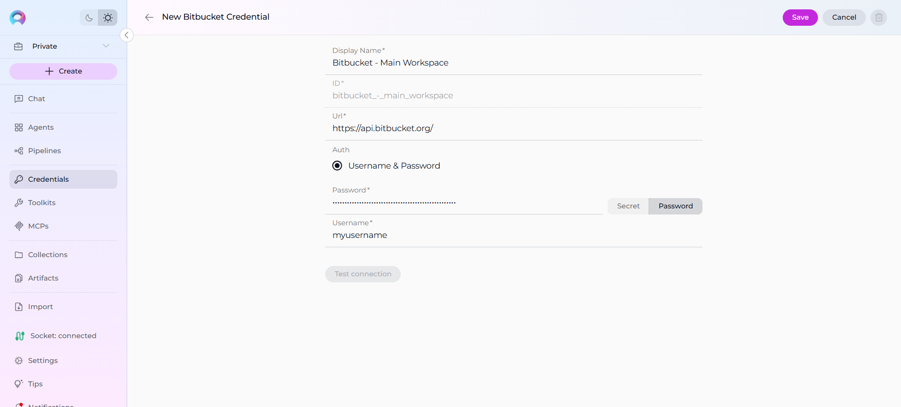


### Step 2: Create Bitbucket Toolkit

Once your credentials are configured, create the Bitbucket toolkit:

1. **Navigate to Toolkits Menu:** Open the sidebar and select **[Toolkits](../../menus/toolkits.md)**.
2. **Create New Toolkit:** Click the **`+ Create`** button.
3. **Select Bitbucket:** Choose **Bitbucket** from the list of available toolkit types.
4. **Configure Toolkit Details:**
     * **Name:** Enter a descriptive name for your toolkit (e.g., "Bitbucket - MyProject Repo")
     * **Description:** (Optional) Add a detailed description of the toolkit's purpose (e.g., "Toolkit for managing code in the MyProject repository")
5. **Configure Credentials:** 
     * In the **Configuration** section, select your previously created Bitbucket credential from the **Credentials** dropdown
6. **Select Bitbucket Type:**
     * **Cloud:** Check this checkbox if using Bitbucket Cloud (leave unchecked for Bitbucket Server)
7. **Configure Repository Settings:**
     * **Project/Workspace:** Enter your Bitbucket workspace ID (e.g., "my-workspace")
     * **Repository:** Enter the repository name (e.g., "my-project-repo")
     * **Branch:** Enter the main branch name (typically "main" or "master")
8. **Configure Advanced Options (Optional):**
     * **PgVector Configuration:** Select a PgVector connection for vector database integration (required for indexing features)
     * **Embedding Model:** Select an embedding model for text processing and semantic search capabilities (required for indexing features)
9. **Enable Desired Tools:** In the **"Tools"** section, select the checkboxes next to the specific Bitbucket tools you want to enable. **Enable only the tools your agents will actually use** to follow the principle of least privilege
10. **Save Toolkit:** Click **Save** to create the toolkit

#### Available Tools:

The Bitbucket toolkit provides the following tools for interacting with Bitbucket repositories, organized by functional categories:

| **Tool Category** | **Tool Name** | **Description** | **Primary Use Case** |
|:-----------------:|---------------|-----------------|----------------------|
| **Branch Management** | | | |
| | **Create branch** | Create a new branch in the repository | Set up new feature branches or bug fix branches |
| | **List branches in repo** | Lists branches in the repository with optional limit and wildcard filtering | View all branches or find specific branches matching a pattern |
| | **Set active branch** | Set the active branch for the bot | Switch context to work on a specific branch |
| **File Operations** | | | |
| | **Create file** | Creates a new file on the bitbucket repo | Add new files to the repository |
| | **Read file** | Reads a file from the bitbucket repo | Retrieve file contents for review or processing |
| | **Update file** | Updates file on the bitbucket repo | Modify existing file contents |
| | **List files** | List files in the repository with optional path, recursive search, and branch | Browse repository structure and file organization |
| **Pull Request Management** | | | |
| | **Create pull request** | Makes a pull request from the bot's branch to the base branch | Initiate code review process |
| | **Get pull request** | Get details of a pull request | Retrieve information about a specific pull request |
| | **Get pull requests commits** | Get commits from a pull request | Review commits included in a pull request |
| | **Get pull requests changes** | Get changes of a pull request | Examine file changes in a pull request |
| | **Add pull request comment** | Add a comment to a pull request. Supports multiple content types and inline comments | Provide feedback or discussion on pull requests |
| **Indexing & Search** | | | |
| | **Index data** | Loads Bitbucket repository data to index for semantic search | Enable advanced search and discovery across repository code with AI-powered semantic search |
| | **Search index** | Performs searches across indexed content | Find specific code content across indexed data |
| | **Stepback search index** | Performs advanced contextual searches with broader scope | Execute sophisticated searches with expanded context |
| | **Stepback summary index** | Creates comprehensive summaries of indexed content | Generate intelligent summaries of repository information |
| | **Remove index** | Removes previously created search indexes | Clean up and manage indexed content |
| | **List collections** | Lists available indexed collections | View and manage indexed data collections |

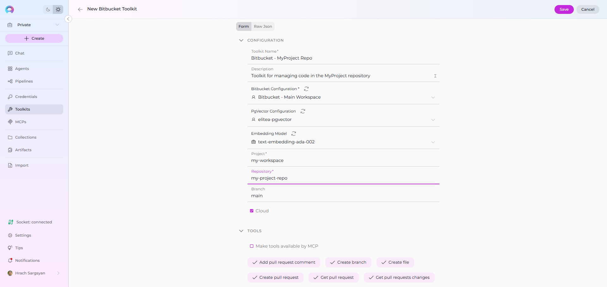


### Step 3: Use Bitbucket Toolkit in Agents

Once your Bitbucket toolkit is created, you can use it in various ELITEA features:

#### **In Agents:**
1. **Navigate to Agents:** Open the sidebar and select **[Agents](../../menus/agents.md)**.
2. **Create or Edit Agent:** Click **`+ Create`** for a new agent or select an existing agent to edit.
3. **Add Bitbucket Toolkit:** 
     * In the **"Tools"** section of the agent configuration, click the **"+Toolkit"** icon
     * Select your Bitbucket toolkit from the list
     * The toolkit will be added to your agent with the previously configured tools enabled

Your agent can now interact with Bitbucket using the configured toolkit and enabled tools.

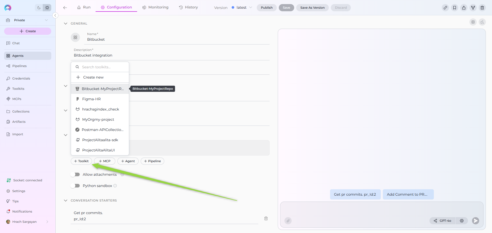

#### **In Pipelines:**

1. **Navigate to Pipelines:** Open the sidebar and select **[Pipelines](../../menus/pipelines.md)**.
2. **Create or Edit Pipeline:** Either create a new pipeline or select an existing pipeline to edit.
3. **Add Bitbucket Toolkit:** 
     * In the **"Tools"** section of the pipeline configuration, click the **"+Toolkit"** icon
     * Select your Bitbucket toolkit from the list
     * The toolkit will be added to your pipeline with the previously configured tools enabled

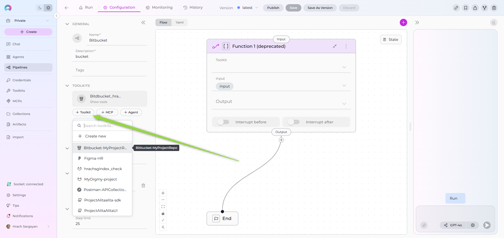     

#### **In Chat:**

1. **Navigate to Chat:** Open the sidebar and select **[Chat](../../menus/chat.md)**.
2. **Start New Conversation:** Click **+Create** or open an existing conversation.
3. **Add Toolkit to Conversation:**
     * In the chat Participants section, look for the **Toolkits** element
     * Click the **"+"** icon and select your Bitbucket toolkit
     * The toolkit will be added to your conversation with all previously configured tools enabled
4. **Use Toolkit in Chat:** You can now directly interact with your Bitbucket repository by asking questions or requesting actions that will trigger the Bitbucket toolkit tools.

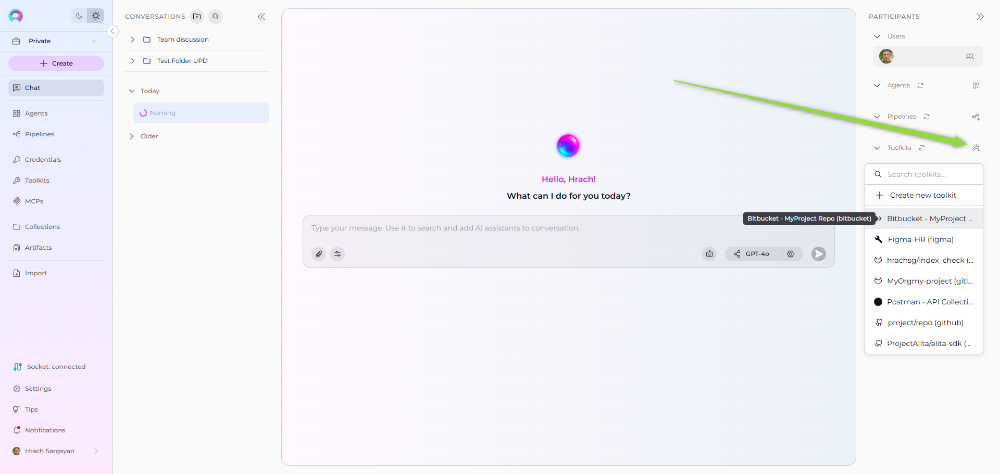

## Instructions and Prompts for Using the Bitbucket Toolkit

To effectively instruct your ELITEA Agent to use the Bitbucket toolkit, you need to provide clear and precise instructions within the Agent's "Instructions" field. These instructions are crucial for guiding the Agent on *when* and *how* to utilize the available Bitbucket tools to achieve your desired automation goals.

### Instruction Creation for OpenAI Agents

When crafting instructions for the Bitbucket toolkit, especially for OpenAI-based Agents, clarity and precision are paramount. Break down complex tasks into a sequence of simple, actionable steps. Explicitly define all parameters required for each tool and guide the Agent on how to obtain or determine the values for these parameters. OpenAI Agents respond best to instructions that are:

*   **Direct and Action-Oriented:** Employ strong action verbs and clear commands to initiate actions. For example, "Use the 'read_file' tool...", "Create a branch named...", "Update the file...".

*   **Parameter-Centric:** Clearly enumerate each parameter required by the tool. For each parameter, specify:
    *   Its name (exactly as expected by the tool)
    *   Its expected data type and format
    *   How the Agent should obtain the value – whether from user input, derived from previous steps in the conversation, retrieved from an external source, or a predefined static value

*   **Contextually Rich:** Provide sufficient context so the Agent understands the overarching objective and the specific scenario in which each Bitbucket tool should be applied within the broader workflow. Explain the desired outcome or goal for each tool invocation.

*   **Step-by-Step Structure:** Organize instructions into a numbered or bulleted list of steps for complex workflows. This helps the Agent follow a logical sequence of actions.

*   **Add Conversation Starters:** Include example conversation starters that users can use to trigger this functionality.

When instructing your Agent to use a Bitbucket toolkit tool, adhere to this structured pattern:

1. **State the Goal:** Begin by clearly stating the objective you want to achieve with this step. For example, "Goal: To create a new feature branch."

2. **Specify the Tool:** Clearly indicate the specific Bitbucket tool to be used for this step. For example, "Tool: Use the 'create_branch' tool."

3. **Define Parameters:** Provide a detailed list of all parameters required by the selected tool. For each parameter:
   - **Parameter Name:** `<Parameter Name as defined in tool documentation>`
   - **Value or Source:** `<Specify the value or how to obtain the value. Examples: "user input", "from previous step", "hardcoded value 'main'", "value of variable X">`

4. **Describe Expected Outcome (Optional but Recommended):** Briefly describe the expected result or outcome after the tool is successfully executed. For example, "Outcome: A new branch will be created and set as active."

5. **Add Conversation Starters:** Include example conversation starters that users can use to trigger this functionality.

#### Example Agent Instructions

**Agent Instructions for Creating a Branch:**

```markdown
1. Goal: Create a new feature branch based on the main branch.
2. Tool: Use the "create_branch" tool.
3. Parameters:
    - branch_name: "Ask the user for the feature branch name, or use a default naming convention like 'feature-<feature-name>'."
4. Outcome: A new branch will be created and automatically set as the active branch for subsequent operations.
5. Conversation Starters: "Create a new feature branch", "Start a new branch for user authentication"
```

**Agent Instructions for Reading a File:**

```markdown
1. Goal: Read the content of a specific file to provide information to the user.
2. Tool: Use the "read_file" tool.
3. Parameters:
    - file_path: "Ask the user which file they want to read, or specify a default file like 'README.md'."
    - branch: "Use the currently active branch, or ask the user to specify a branch name."
4. Outcome: The file contents will be retrieved and displayed to the user.
5. Conversation Starters: "Show me the README file", "Read the config.json file"
```

### Chat Usage Examples by Tool Category

The following examples demonstrate how to interact with your Bitbucket-integrated Agent in Chat to utilize different tool categories:

#### Branch Management Tools - Create Branch

**Chat Example:**
```
User: "Create a new feature branch called 'feature-login-page'"

Agent Response: [Agent uses create_branch tool]

✅ **Branch Created Successfully!**

Branch `feature-login-page` created successfully and set as active.

You can now start making changes to this branch. All subsequent file operations will be performed on this branch.
```

#### Branch Management Tools - List Branches

**Chat Example:**
```
User: "Show me all branches in the repository"

Agent Response: [Agent uses list_branches_in_repo tool]

**Repository Branches:**

Found branches: main, develop, feature-user-auth, feature-dashboard, bugfix-login, hotfix-security

Total: 6 branches found in the repository.
```

#### File Operations Tools - Create File

**Chat Example:**
```
User: "Create a new file called 'deployment.yaml' with basic deployment configuration"

Agent Response: [Agent uses create_file tool]

✅ **File Created Successfully!**

- **File Path**: deployment.yaml
- **Branch**: feature-login-page (active branch)
- **Status**: File has been created

The file has been added to the repository on the current active branch.
```

#### File Operations Tools - Read File

**Chat Example:**
```
User: "Show me the contents of the README.md file"

Agent Response: [Agent uses read_file tool]

**File Contents: README.md**
**Branch**: main

My Project

This is a sample project demonstrating...
[... file contents ...]

The README file provides an overview of the project structure and setup instructions.
```

#### Pull Request Management Tools - Create Pull Request

**Chat Example:**
```
User: "Create a pull request to merge feature-login-page into develop"

Agent Response: [Agent uses create_pull_request tool]

✅ **Pull Request Created Successfully!**

- **Source Branch**: feature-login-page
- **Target Branch**: develop
- **Title**: Merge feature-login-page
- **Status**: Open
- **URL**: https://bitbucket.org/workspace/repo/pull-requests/123

The pull request is ready for review. Team members can now review and approve the changes.
```

#### Pull Request Management Tools - Add PR Comment

**Chat Example:**
```
User: "Add a comment to pull request #123 saying 'LGTM, approved'"

Agent Response: [Agent uses add_pull_request_comment tool]

✅ **Comment Added Successfully!**

- **Pull Request**: #123
- **Comment**: "LGTM, approved"
- **Posted By**: bot-user

Your comment has been added to the pull request.
```

## Troubleshooting and Support

### Troubleshooting

*   **Connection Issues:**
    *   **Problem:** Agent fails to connect to Bitbucket or experiences timeout errors.
    *   **Solution:** 
        1. Verify the Bitbucket API URL is correct (`https://api.bitbucket.org/` for Cloud)
        2. Check your network connectivity
        3. Ensure credentials are correct and not expired
        4. For Bitbucket Server, verify the server URL is accessible

*   **Authentication Errors:**
    *   **Problem:** "Permission Denied" or "Unauthorized" errors when accessing resources.
    *   **Solution:**
        1. Verify API Token scopes include the necessary permissions
        2. Regenerate API Token if it may have been compromised
        3. Check that the username matches the account that created the API Token
        4. Ensure the API Token hasn't expired (check expiration date)

*   **Repository Access Issues:**
    *   **Problem:** Cannot access specific repositories or branches.
    *   **Solution:**
        1. Verify workspace/project name is correct in toolkit configuration
        2. Ensure repository name follows the correct format
        3. Check that the account has proper access rights to the repository
        4. Verify branch names are spelled correctly and exist

*   **File Operation Failures:**
    *   **Problem:** File creation, reading, or updates fail unexpectedly.
    *   **Solution:**
        1. Ensure the active branch is set correctly
        2. Verify file paths use correct format (no leading slash for file paths)
        3. Check that write permissions are granted if creating/updating files
        4. Ensure file names don't contain invalid characters

### FAQ

1.  **Q: Can I use my regular Bitbucket password instead of an API Token?**
    *   **A:** No, **you must use an API Token for security and authentication**. API Tokens are more secure and allow you to limit permissions through scopes.

2.  **Q: What are the minimum scopes needed for the API Token?**
    *   **A:** For read-only operations: account:read, project:read, and repository:read. For full functionality including writes: add repository:write and pullrequest:write.

3.  **Q: What happened to App Passwords?**
    *   **A:** As of September 9, 2025, Bitbucket deprecated App Passwords in favor of API Tokens with scopes. All existing app passwords will be disabled on June 9, 2026.

4.  **Q: Can I use this toolkit with Bitbucket Server?**
    *   **A:** Yes, the toolkit supports both Bitbucket Cloud and Bitbucket Server. Set the correct URL and uncheck the "Cloud" option for Server instances.

5.  **Q: How do I know which branch is currently active?**
    *   **A:** The active branch is either the one you set in the toolkit configuration or the last branch set using the "set_active_branch" tool.

6.  **Q: Why can't my Agent create pull requests?**
    *   **A:** Ensure your API Token has "pullrequest:write" scope and verify the source and target branches exist.

7.  **Q: Can I use this toolkit with multiple repositories?**
    *   **A:** Each toolkit instance is configured for one repository. Create multiple toolkit configurations to work with multiple repositories.

### Support Contact

For assistance with the Bitbucket integration or ELITEA, contact the ELITEA Support Team at **[SupportAlita@epam.com](mailto:SupportAlita@epam.com)**.

## Useful Links

!!! info "Useful Links"

    To further enhance your understanding and skills in integrating Bitbucket with ELITEA, here are some helpful resources:

    *   **[Bitbucket Website](https://bitbucket.org)** - Access the main Bitbucket platform to create an account or log in
    *   **[Bitbucket API Tokens Settings](https://bitbucket.org/account/settings/api-tokens/)** - Directly navigate to create and manage API tokens for secure integrations
    *   **[Bitbucket API Documentation](https://developer.atlassian.com/cloud/bitbucket/rest/)** - Official Bitbucket REST API documentation
    *   **[ELITEA Secrets Management](../../menus/settings/secrets.md)** - Learn how to securely store your Bitbucket API Token using ELITEA's Secrets feature
    *   **[ELITEA Agents Configuration](../../menus/agents.md)** - Find out more about creating and configuring Agents in ELITEA to integrate the Bitbucket toolkit
    *   **[ELITEA Support Email](mailto:SupportAlita@epam.com)** - Contact the ELITEA support team for direct assistance with Bitbucket integration

