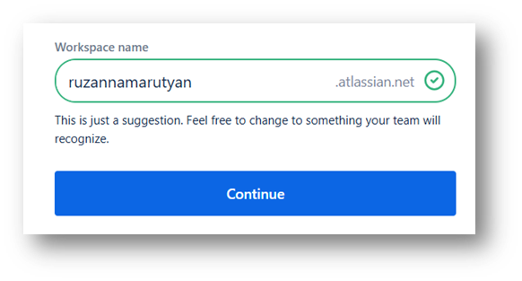
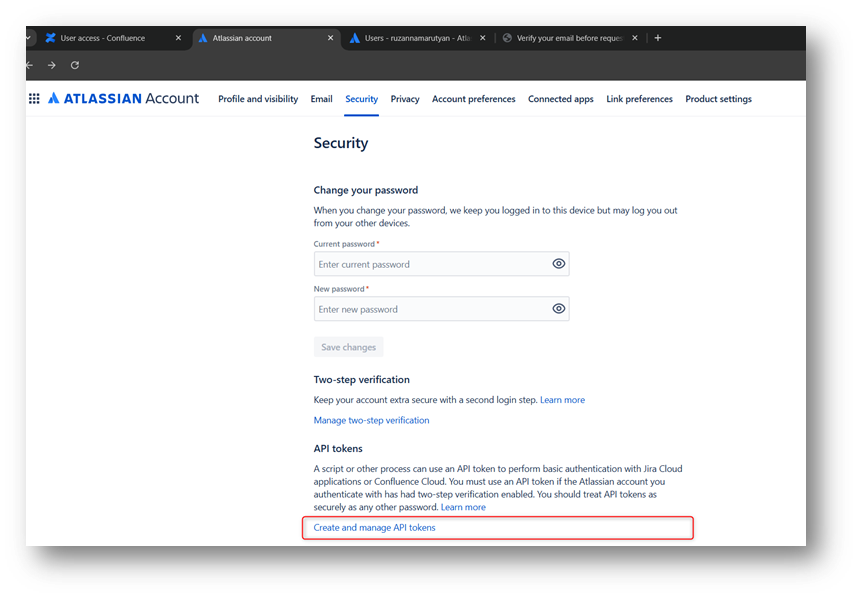
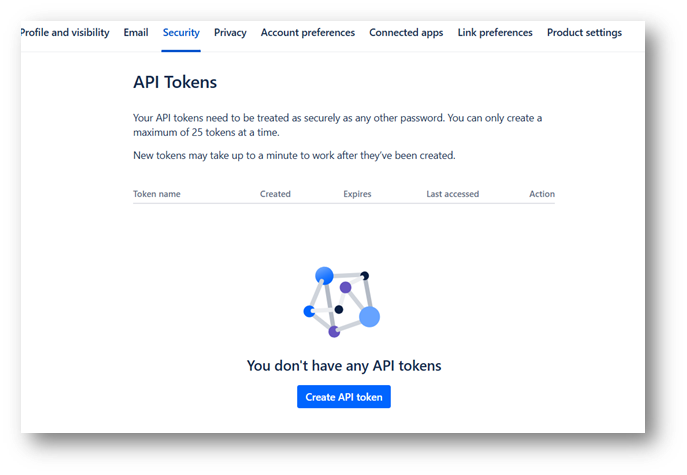
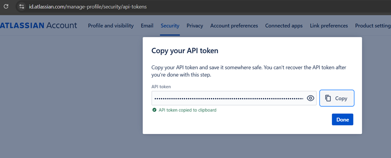
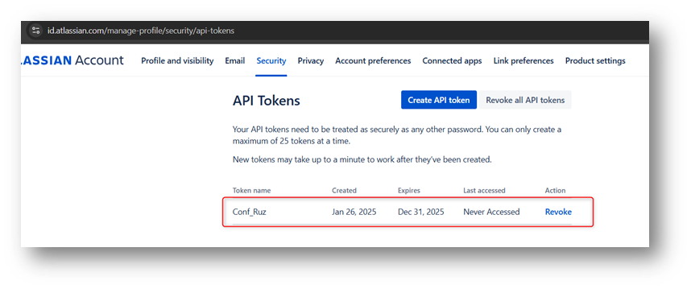
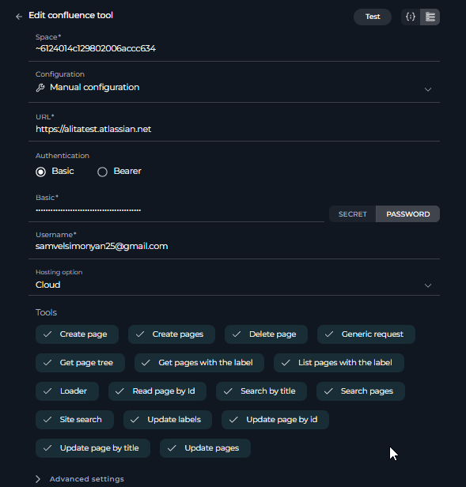
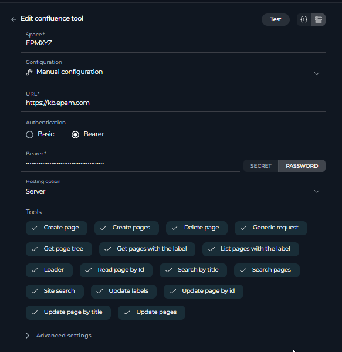

# ELITEA Toolkit Guide: Confluence Integration

## Introduction

### Purpose of this Guide

This guide is your definitive resource for integrating and effectively utilizing the **Confluence toolkit** within ELITEA. It provides a detailed, step-by-step walkthrough, from setting up your Confluence API token to configuring the toolkit in ELITEA and seamlessly incorporating it into your Agents. By following this guide, you will unlock the power of automated knowledge management, streamlined collaboration workflows, and enhanced information access, all directly within the ELITEA platform. This integration empowers you to leverage AI-driven automation to optimize your Confluence-driven workflows, enhance team productivity, and improve knowledge sharing within your organization.

### Brief Overview of Confluence

Confluence, by Atlassian, is a leading team collaboration and knowledge management platform widely used by organizations to create, organize, and share information. It serves as a central hub for teams to collaborate on projects, document knowledge, and build a comprehensive knowledge base. Confluence offers a wide array of functionalities, including:

*   **Centralized Knowledge Base:** Confluence provides a centralized platform for creating, storing, and organizing all types of project and organizational knowledge, including project plans, meeting notes, documentation, how-to guides, and best practices.
*   **Collaborative Page Editing:** Enables real-time collaborative editing of pages, allowing teams to work together simultaneously on documents, plans, and other content, fostering teamwork and co-creation.
*   **Organized Spaces and Pages:** Confluence uses a structured hierarchy of Spaces and Pages to organize information logically. Spaces can represent teams, projects, or departments, while Pages within spaces hold specific content, making it easy to navigate and find information.
*   **Rich Content Creation and Formatting:** Confluence provides a rich text editor with various formatting options, templates, and macros, allowing users to create visually appealing and informative pages with diverse content types, including text, images, tables, and multimedia.
*   **Powerful Search Capabilities:** Confluence offers robust search functionality, enabling users to quickly find relevant information across all spaces and pages based on keywords, labels, and content, improving information discovery and knowledge retrieval.

Integrating Confluence with ELITEA brings these powerful collaboration and knowledge management capabilities directly into your AI-driven workflows. Your ELITEA Agents can then intelligently interact with your Confluence spaces and pages to automate knowledge-related tasks, enhance collaboration processes, and improve information accessibility through AI-powered automation.

## Toolkit's Account Setup and Configuration in Confluence

### Account Setup

If you do not yet have a Confluence account, please follow these steps to create one:

1.  **Visit Atlassian Website:** Open your web browser and navigate to the official [Atlassian website](https://www.atlassian.com/software/confluence).
2.  **Sign Up for Confluence:** Click on the **"Try Confluence free"** or **"Get it free"** button to start the sign-up process.
3.  **Create an Atlassian Account:** Follow the prompts to create an Atlassian account. You can sign up using your email address, Google account, or Apple account. For professional use, it's recommended to use your company email address.
4.  **Choose a Workspace Name:** During the signup process, you will be asked to choose a workspace name for your Confluence site. Enter a suitable name for your workspace.
5.  **Set Up Your Workspace:** Follow the remaining onboarding steps to set up your Confluence workspace, including defining its purpose and inviting team members if needed.
6.  **Explore Confluence Features:** Once your workspace is set up, explore the onboarding tips and familiarize yourself with Confluence features, spaces, pages, and navigation.



### Token/API Key Generation: Creating an API Token in Confluence

For secure integration with ELITEA, it is essential to use a Confluence **API token** for authentication. This method is more secure than using your primary Confluence account password directly and allows you to control access permissions.

**Follow these steps to generate an API token in Confluence:**

1.  **Log in to Confluence:** Access your Confluence workspace by navigating to your Confluence URL (e.g., `your-workspace.atlassian.net/wiki`) and logging in with your credentials.
2.  **Access Account Settings:** Click on your profile avatar in the top right corner of the Confluence interface. From the dropdown menu, select **"Manage account"**.


3.  **Navigate to Security Settings:** In the Atlassian account settings page, navigate to the **"Security"** section in the left-hand sidebar.



4.  **Access API Tokens:** Within the "Security" settings, locate the **"API tokens"** section and click on **"Create and manage API tokens"**.
5.  **Create API Token:** On the "API tokens" page, click the **"Create API token"** button.



6.  **Name Your Token:** In the "Create API token" dialog, enter a descriptive **Label** for your token, such as "ELITEA Integration Token" or "ELITEA Agent Access." This label will help you identify the purpose of this token later. You can also set an optional expiration date if needed.
7.  **Create Token:** Click the **"Create"** button to generate the API token.
8.  **Securely Copy and Store Your API Token:**  **Immediately copy the generated API token** that is displayed in the pop-up window. **This is the only time you will see the full token value.** Store it securely in a password manager or, preferably, ELITEA's built-in Secrets feature for enhanced security within ELITEA. You will need this API token to configure the Confluence toolkit in ELITEA.





## System Integration with ELITEA

### Agent Creation/Configuration

To integrate Confluence functionalities into your workflows, you will need to configure the Confluence toolkit within an ELITEA Agent. You can either create a new Agent specifically for Confluence interactions or modify an existing Agent to incorporate Confluence tools.

1.  **Navigate to Agents Menu:** In ELITEA, go to the **Agents** menu from the main navigation panel.
2.  **Create or Edit Agent:**
    *   **Create a New Agent:** Click on the **"+ Agent"** button to create a new Agent. Follow the on-screen prompts to define essential Agent attributes such as Agent name, a descriptive Agent description, the desired Agent type, and initial instructions for the Agent.
    *   **Edit an Existing Agent:** Select the Agent you intend to integrate with Confluence from your list of Agents. Click on the Agent's name to open its configuration settings for editing.
3.  **Access Tools Section:** Within the Agent configuration interface, scroll down until you locate the **"Tools"** section. This section is where you will add and configure toolkits, including the Confluence toolkit.

### Toolkit Configuration

This section provides detailed instructions on how to configure the Confluence toolkit within your ELITEA Agent.

1.  **Add Toolkit:** In the "Tools" section of the Agent configuration, click on the **"+" icon**. This action will display a dropdown list of available toolkits that can be integrated with your Agent.
2.  **Select Confluence Toolkit:** From the dropdown list of available toolkits, choose **"Confluence"**. Selecting "Confluence" will open the "New Confluence tool" configuration panel, where you will specify the settings for your Confluence integration.
3.  **Configure Confluence Toolkit Settings:** Carefully fill in the following configuration fields within the "New Confluence tool" section:

    *   **URL:** Enter the base URL of your Confluence instance. **Ensure you use the correct format**, including `https://` or `http://` and the full workspace URL (e.g., `https://your-workspace.atlassian.net/wiki`).
    *   **Username:** Enter the **Username** associated with your Confluence account for which you generated the API token. This is typically your email address used for Confluence login.
    *   **Authentication Options - Basic:** Select the **"Basic"** authentication option.
        *   **Password/Secret:** Choose **"Password"** and paste your Confluence password or app password in the **"Password"** field.
        *   **Enhanced Security with Secrets (Recommended):** For enhanced security, use ELITEA's **Secrets Management** feature to store your Confluence password securely. Instead of directly pasting the password, select the **"Secret"** option and choose the pre-configured secret containing your Confluence password from the dropdown list. This prevents hardcoding sensitive credentials in your toolkit configuration.
    *   **Authentication Options - Bearer:** Select the **"Bearer"** authentication option.
        *   **Password/Secret:** Choose **"Password"** and paste your Confluence Bearer token in the **"Password"** field.
        *   **Enhanced Security with Secrets (Recommended):** For enhanced security, use ELITEA's **Secrets Management** feature to store your Confluence Bearer token securely. Instead of directly pasting the token, select the **"Secret"** option and choose the pre-configured secret containing your Confluence Bearer token from the dropdown list.
    *   **Space:** Enter the **Space name** in Confluence that you want to access with this toolkit. This is the Space Key, which is typically found in the URL of your Confluence space (e.g., for URL `https://your-workspace.atlassian.net/wiki/spaces/DOCS/overview`, the Space Key is `DOCS`).
    *   **Hosting Option:** Select the appropriate **"Hosting option"** for your Confluence instance:
        *   **Cloud:** Select "Cloud" if you are using Confluence Cloud (e.g., accessed via `atlassian.net`).
        *   **Server:** Select "Server" if you are using a self-hosted Confluence Server or Data Center instance(e.g., https://kb.epam.com/ ). 
        **Note:** When connecting to an Epam Confluence instance, ensure you select "Server" as the Hosting option.
    *   **Advanced Settings:** Configure additional settings to control data fetching and presentation:
         * **Pages limit per request**: Set the maximum number of pages to retrieve per request (e.g., `5`).
         * **Max total pages**: Define the maximum number of pages to retrieve in total (e.g., `10`).
         * **Number of retries**: Specify how many times the tool should retry after a failure (e.g., `2`).
         * **Min retry, sec**: Set the minimum number of seconds to wait before retrying (e.g., `10`).
         * **Max retry, sec**: Set the maximum number of seconds to wait before retrying (e.g., `60`).

    
    

4.  **Enable Desired Tools:** In the "Tools" section within the Confluence toolkit configuration panel, **select the checkboxes next to the specific Confluence tools** that you want to enable for your Agent. **It is crucial to enable only the tools that your Agent will actually need to use** to adhere to the principle of least privilege and minimize potential security risks. Available tools include:

    *   **Get pages with label** - Retrieves all pages that have a specific label.
    *   **List pages with label** - Lists all pages that contain a specific label.
    *   **Search pages** - Searches for pages based on keywords or phrases.
    *   **Create page** - Creates a single new page in Confluence.
    *   **Create pages** - Creates multiple pages in Confluence.
    *   **Get page tree** - Retrieves the hierarchical structure of pages.
    *   **Delete page** - Deletes a specific page.
    *   **Update page by id** - Updates the content of a page identified by its ID.
    *   **Update page by title** - Updates the content of a page identified by its title.
    *   **Update labels** - Adds or removes labels from a page.
    *   **Update pages** - Updates multiple pages at once.
    *   **Site search** - Performs a search across the entire Confluence site.
    *   **Search by title** - Searches for pages based on their title.
    *   **Read page by id** - Retrieves the content of a page using its unique ID.
    *   **Generic request** - Allows to send custom HTTP requests to Confluence API.
    *   **Loader** - Allows to load content from Confluence based on specified parameters.

5.  **Complete Setup:** After configuring all the necessary settings and enabling the desired tools, click the **arrow icon** (typically located at the top right of the toolkit configuration section) to finalize the Confluence toolkit setup and return to the main Agent configuration menu.
6.  Click **Save** in the Agent configuration to save all changes and activate the Confluence toolkit integration for your Agent.

### Tool Overview: Confluence Toolkit Functionalities

Once the Confluence toolkit is successfully configured and added to your Agent, you can leverage the following tools within your Agent's instructions to enable intelligent interaction with your Confluence workspace:

*   **Get Pages with Label:**  **Tool Name:** `get_pages_with_label`
    *   **Functionality:** Retrieves a list of Confluence pages within a specified space that are tagged with a specific label.
    *   **Purpose:** Enables Agents to quickly access and retrieve related content based on labels, facilitating content organization, topic-based information retrieval, and automated content aggregation for specific projects or topics.

*   **List Pages with Label:**  **Tool Name:** `list_pages_with_label`
    *   **Functionality:** Lists the titles of all Confluence pages within a specified space that have a specific label. Returns a simple list of page titles.
    *   **Purpose:** Provides Agents with a concise overview of pages categorized by labels, enabling efficient content discovery, quick identification of relevant pages for review or further action, and streamlined content management based on labels.

*   **Search Pages:**  **Tool Name:** `search_pages`
    *   **Functionality:** Searches for Confluence pages across a specified space based on keywords or phrases provided in a query.
    *   **Purpose:** Enables Agents to perform targeted searches for information within a Confluence space, allowing for efficient retrieval of relevant pages based on user queries, keywords, or specific information needs, improving information discovery and access.

*   **Create Page:**  **Tool Name:** `create_page`
    *   **Functionality:** Creates a new Confluence page within a specified space with a given title and content.
    *   **Purpose:** Automates page creation in Confluence, allowing Agents to automatically generate new documentation pages, meeting notes, project plans, or any other type of Confluence page directly from ELITEA workflows, streamlining content creation and collaboration.

*   **Create Pages:**  **Tool Name:** `create_pages`
    *   **Functionality:** Creates multiple Confluence pages within a specified space based on a list of page titles and content. Allows for bulk creation of pages.
    *   **Purpose:** Enables efficient bulk creation of Confluence pages, saving time and effort when setting up new project spaces, creating documentation sets, or generating multiple pages with similar structures, improving content creation efficiency for large-scale documentation efforts.

*   **Get Page Tree:**  **Tool Name:** `get_page_tree`
    *   **Functionality:** Retrieves the hierarchical structure of pages within a Confluence space, showing parent-child relationships between pages.
    *   **Purpose:** Allows Agents to understand and visualize the organization of content within a Confluence space, facilitating navigation, content management, and analysis of information architecture within Confluence.

*   **Delete Page:**  **Tool Name:** `delete_page`
    *   **Functionality:** Deletes a specific Confluence page identified by its page ID.
    *   **Purpose:** Enables automated deletion of outdated or obsolete Confluence pages, helping maintain a clean and up-to-date knowledge base, removing irrelevant content, and ensuring the Confluence workspace remains organized and efficient.

*   **Update Page by ID:**  **Tool Name:** `update_page_by_id`
    *   **Functionality:** Updates the content of an existing Confluence page, identified by its unique Page ID, with new content.
    *   **Purpose:** Allows for precise and automated updates to specific Confluence pages based on their Page ID, ensuring accurate content modification, enabling dynamic content updates, and streamlining the process of keeping critical information current.

*   **Update Page by Title:**  **Tool Name:** `update_page_by_title`
    *   **Functionality:** Updates the content of a Confluence page, identified by its title, with new content. Useful when you know the page title but not the Page ID.
    *   **Purpose:** Provides flexibility in updating Confluence pages by allowing content updates based on page titles, simplifying content maintenance when page titles are readily available, and enabling user-friendly page updates within automated workflows.

*   **Update Labels:**  **Tool Name:** `update_labels`
    *   **Functionality:** Adds or removes labels from a specific Confluence page, identified by its Page ID. Allows for automated label management.
    *   **Purpose:** Enables automated categorization and tagging of Confluence pages, improving content organization, searchability, and discoverability through automated label management, streamlining content classification and information retrieval.

*   **Update Pages:**  **Tool Name:** `update_pages`
    *   **Functionality:** Updates the content of multiple Confluence pages at once, based on a list of Page IDs and their corresponding new content. Enables bulk content updates.
    *   **Purpose:** Facilitates efficient bulk updates of Confluence pages, saving time and effort when applying changes to multiple pages simultaneously, ensuring consistency across related documentation, and streamlining large-scale content updates.

*   **Site Search:**  **Tool Name:** `site_search`
    *   **Functionality:** Performs a search across the entire Confluence site for content matching specific keywords or phrases. Searches across all spaces and pages within the Confluence instance.
    *   **Purpose:** Enables broad, site-wide searches for information across Confluence, allowing Agents to locate content that matches specific keywords or user queries, even when the location of the information is unknown, improving information discovery across the entire Confluence knowledge base.

*   **Search by Title:**  **Tool Name:** `search_by_title`
    *   **Functionality:** Searches for Confluence pages specifically by their titles within a specified space. Filters search results to only include pages matching the provided title.
    *   **Purpose:** Allows for targeted searches for specific pages when you know the title, enabling quick and precise retrieval of pages based on their names, improving search accuracy and efficiency when looking for pages with known titles.

*   **Read Page by ID:**  **Tool Name:** `read_page_by_id`
    *   **Functionality:** Retrieves and returns the content of a Confluence page, identified by its unique Page ID.
    *   **Purpose:** Enables Agents to access and utilize content from specific Confluence pages, allowing retrieval of documentation, meeting notes, project information, or any page content to provide context, data, or instructions within ELITEA workflows and conversations, facilitating dynamic and context-aware automation.

*   **Generic Request:**  **Tool Name:** `generic_confluence`
    *   **Functionality:** A generic tool to interact with the official Atlassian Confluence REST API. Allows for executing various operations like searching, creating, updating, or deleting pages by specifying the HTTP method, relative URL, and parameters.
    *   **Purpose:** Provides flexibility to perform any Confluence API operation, enabling advanced and custom use cases beyond predefined tools.

*   **Loader Tool:**  **Tool Name:** `loader`
    *   **Functionality:** Loads content from Confluence based on specified parameters such as content format, page IDs, labels, CQL queries, and more. It can also include restricted content, archived content, attachments, comments, and labels.
    *   **Purpose:** Enables efficient retrieval of content from Confluence with advanced filtering options, making it ideal for bulk data extraction or targeted content loading.

## Instructions and Prompts for Using the Confluence Toolkit

To effectively utilize the Confluence toolkit within your ELITEA Agents, you need to provide clear and precise instructions within the Agent's "Instructions" field, telling the Agent *how* and *when* to use these tools.

**General Instruction Structure:**

When instructing your Agent to use a Confluence tool, you will typically follow this pattern:

```
Use the "[tool_name]" tool to [describe the action you want to perform] in Confluence.
Provide the following parameters:
- Parameter 1: <value or description of value>
- Parameter 2: <value or description of value>
- ...
```

**Example Agent Instructions for Confluence Toolkit Tools:**

*   **Agent Instructions for Getting Pages with a Label:**

    ```
    Use the "get_pages_with_label" tool to retrieve all Confluence pages labeled with "project-alpha" in the "Project Documentation" space.
    Provide the following parameters:
    - Space Name: "Project Documentation"
    - Label Name: "project-alpha"
    ```

*   **Agent Instructions for Searching Pages:**

    ```
    Use the "search_pages" tool to search for Confluence pages containing the keyword "ELITEA Agents" in the "ELITEA Knowledge Base" space.
    Provide the following parameters:
    - Space Name: "ELITEA Knowledge Base"
    - Query: "ELITEA Agents"
    ```

*   **Agent Instructions for Creating a New Page:**

    ```
    Use the "create_page" tool to create a new Confluence page in the "Meeting Notes" space.
    Provide the following parameters:
    - Space Name: "Meeting Notes"
    - Title: "Project Alpha - Weekly Meeting - [Current Date]"
    - Content: "Meeting notes will be added here..."
    ```

**Important Considerations for Agent Instructions:**

*   **Tool Name Accuracy:** Ensure you use the correct **Tool Name** (e.g., `"get_pages_with_label"`, `"search_pages"`, `"create_page"`) as listed in the "Tool Overview" section. Typos or incorrect tool names will prevent the Agent from using the toolkit correctly.
*   **Parameter Clarity:** Clearly specify the **parameters** required for each tool and provide instructions on where the Agent should obtain the values for these parameters (e.g., from user input, from previous steps in the workflow, or hardcoded values).
*   **Context and Examples:** Provide sufficient context and examples within your Agent's "Instructions" to guide the LLM in understanding *when* and *how* to use the Confluence toolkit tools effectively within your desired workflow.
*   **Space and Page Identifiers:** Ensure that you use the correct Space Names, Page Titles, and Page IDs in your Agent instructions. Space Names and Page Titles are case-sensitive and must exactly match the names in your Confluence workspace. When using Page IDs, ensure you are using the correct numerical ID for the intended page.

## Best Practices and Use Cases for Confluence Integration

### Best Practices for Efficient Integration

*   **Test Integration Thoroughly:** After setting up the Confluence toolkit and incorporating it into your Agents, **thoroughly test each tool** you intend to use to ensure seamless connectivity, correct authentication, and accurate execution of Confluence actions.
*   **Monitor Agent Performance and Usage:**  Regularly **monitor the performance of Agents** utilizing Confluence toolkits. Track metrics such as task completion success rate, execution time, and error rates to identify any potential issues or areas for optimization in Agent instructions or toolkit configurations.
*   **Follow Security Best Practices:**
    *   **Use API Tokens:** Always use Confluence API tokens instead of your main account password for integrations.
    *   **Grant Least Privilege:** Grant only the minimum necessary scopes/permissions to the API token to limit potential security risks. While Confluence API tokens have limited scope control, ensure you are generating tokens specifically for ELITEA integration and not reusing tokens with broader access.
    *   **Securely Store Credentials:** Utilize ELITEA's Secrets Management feature to securely store and manage your Confluence API tokens instead of hardcoding them directly in Agent configurations.
*   **Provide Clear Instructions and Prompts:**  Craft clear and unambiguous instructions within your ELITEA Agents to guide them in using the Confluence toolkit effectively. Use the prompt examples provided in this guide as a starting point and adapt them to your specific use cases.
*   **Start with Simple Use Cases:** Begin by implementing Confluence integration for simpler automation tasks, such as retrieving page content or listing pages with labels, and gradually progress to more complex workflows as you gain experience and confidence with the toolkit.
*   **Utilize Advanced Settings for Performance Tuning:**  Leverage the "Advanced Settings" in the toolkit configuration to fine-tune data fetching parameters like "Pages limit per request" and "Max total pages" to optimize performance and avoid overloading the Confluence API, especially when working with large Confluence workspaces.

### Use Cases for Confluence Toolkit Integration

The Confluence toolkit opens up a wide range of automation possibilities for knowledge management, documentation workflows, and information retrieval within ELITEA. Here are some compelling use cases:

*   **Automated Meeting Notes Archival and Summarization:**
    *   **Scenario:** After team meetings, ELITEA Agents can automatically archive meeting notes pages in Confluence by adding a "meeting-minutes-archive" label and create a summary of key discussion points and action items to share with stakeholders.
    *   **Tools Used:** `get_pages_with_label`, `update_labels`, `read_page_by_id`, `create_page`
    *   **Example Instruction:** "Use the 'get_pages_with_label' tool to find pages labeled 'meeting-notes-pending-archive'. For each page, use 'update_labels' to add the 'meeting-minutes-archive' label and remove 'meeting-notes-pending-archive'. Then, use 'read_page_by_id' to read the content of each archived page and generate a summary of key discussion points and action items. Finally, use 'create_page' to create a new page named 'Meeting Minutes Summary - [Date]' with the generated summary in the 'Meeting Minutes Summaries' space."
    *   **Benefit:** Automates meeting notes archival and summarization, saving time on manual documentation tasks, ensuring meeting notes are properly archived and key insights are readily accessible in summarized form.

*   **Dynamic FAQ Generation from Confluence Knowledge Base:**
    *   **Scenario:** ELITEA Agents can dynamically generate FAQs for user support by searching Confluence for pages labeled "faq" and extracting question-answer pairs to create a dynamic FAQ resource within ELITEA.
    *   **Tools Used:** `get_pages_with_label`, `read_page_by_id`, `site_search`, `search_pages`
    *   **Example Instruction:** "Use the 'get_pages_with_label' tool to retrieve all Confluence pages labeled 'faq' in the 'Knowledge Base' space. For each page, use 'read_page_by_id' to extract question-answer pairs from the page content. Compile these pairs to generate a dynamic FAQ resource within ELITEA. If no 'faq' labeled pages are found in the 'Knowledge Base' space, use 'site_search' to search for pages containing 'Frequently Asked Questions' across the entire Confluence site and extract FAQ content from those pages instead."
    *   **Benefit:** Enables dynamic and automated FAQ generation, ensuring users always have access to the most up-to-date FAQ information from Confluence, improving self-service support and reducing the workload on support teams.

*   **Automated Content Updates Based on External Data Sources:**
    *   **Scenario:** ELITEA Agents can automatically update Confluence pages with information retrieved from external data sources, such as real-time metrics, reports, or database information, ensuring Confluence pages always display the latest data.
    *   **Tools Used:** `read_page_by_id`, `update_page_by_id`, `generic_request` (for external data retrieval)
    *   **Example Instruction:** "Use the 'generic_request' tool to retrieve the latest sales metrics from the external sales database API. Then, use 'read_page_by_id' to get the current content of the 'Sales Dashboard' Confluence page. Update the 'Sales Metrics' section of the page with the newly retrieved sales data using 'update_page_by_id'."
    *   **Benefit:** Enables dynamic and data-driven Confluence pages, ensuring that critical dashboards, reports, and information pages always display the most current data, improving data accuracy and real-time visibility for stakeholders.

*   **Streamlined Content Migration and Bulk Updates:**
    *   **Scenario:** When migrating content to Confluence or performing bulk updates across multiple pages, ELITEA Agents can automate the creation or updating of numerous Confluence pages based on structured data or templates.
    *   **Tools Used:** `create_pages`, `update_pages`
    *   **Example Instruction:** "Use the 'create_pages' tool to create new Confluence pages in the 'Project Documentation' space based on the following JSON data: `[{\"page1_name\": \"Page 1 Content\"}, {\"page2_name\": \"Page 2 Content\"}, ...]`. For bulk updates, use 'update_pages' tool with the following JSON data: `[{\"page_id_1\": \"new content for page 1\"}, {\"page_id_2\": \"new content for page 2\"}, ...]`."
    *   **Benefit:** Streamlines content migration and bulk update tasks, saving significant time and effort when managing large Confluence workspaces, ensuring consistency across content, and improving efficiency for large-scale content operations.

## Troubleshooting and Support

### Troubleshooting Common Issues

*   **Connection Errors:**
    *   **Problem:** ELITEA Agent fails to connect to Confluence, resulting in errors during toolkit execution.
    *   **Possible Solutions:**
        1.  **Verify Confluence URL:** Double-check that you have entered the correct Confluence workspace URL in the toolkit configuration, including `https://` or `http://` and the full workspace URL (e.g., `https://your-workspace.atlassian.net/wiki`).
        2.  **Check Username and API Token:** Ensure that the **Username** and **API Token** you provided are correct and valid for your Confluence account and workspace. Carefully re-enter or copy-paste these credentials to rule out typos.
        3.  **Verify Hosting Option:** Double-check that you have selected the correct **Hosting option** (Cloud or Server) in the Confluence toolkit configuration, especially when connecting to Epam's Confluence (use "Server").
        4.  **Network Connectivity:** Confirm that both your ELITEA environment and your Confluence instance are connected to the internet and that there are no network connectivity issues blocking the integration.

*   **Authorization Errors (Permission Denied/Unauthorized):**
    *   **Problem:** Agent execution fails with "Permission Denied" or "Unauthorized" errors when trying to access or modify Confluence resources.
    *   **Possible Solutions:**
        1.  **Verify API Token Validity:** Ensure that the Confluence API token you are using is still valid and has not been revoked in your Atlassian account settings. Generate a new token if necessary.
        2.  **Check Confluence Permissions:** Confirm that the Confluence account associated with the Username and API Token has the necessary permissions to access and modify the specific Confluence space and pages your Agent is trying to interact with. Verify space and page permissions within Confluence.
        3.  **Hosting Option Mismatch:** Double-check that you have selected the correct "Hosting option" (Cloud or Server) in the Confluence toolkit configuration. Using the wrong hosting option can lead to authentication and connection errors.

*   **Tool-Specific Parameter Errors:**
    *   **Problem:** Agent execution fails for specific Confluence tools due to incorrect parameter values.
    *   **Troubleshooting Steps:**
        1.  **Verify Space Name:** Ensure that you are using the correct Confluence Space Name in your Agent's instructions and toolkit configuration. Space Names are case-sensitive and must exactly match the space name in Confluence.
        2.  **Verify Page Titles and IDs:** Double-check that you are using the correct Page Titles or Page IDs when referencing Confluence pages in your Agent's instructions. Page Titles are case-sensitive and must match the page titles in Confluence exactly. When using Page IDs, ensure you are using the correct numerical ID for the intended page.
        3.  **Parameter Format:** Verify that you are providing parameters in the correct format expected by each Confluence tool (e.g., string values for names, numerical values for IDs, JSON format for bulk updates). Refer to the "Instructions and Prompts for Using the Toolkit" section for parameter details and examples.

### FAQs

1.  **Q: Can I use my regular Confluence password for the ELITEA integration?**
    *   **A:** No, it is **strongly recommended to use a Confluence API token** instead of your main account password for security reasons. API tokens provide a more secure and controlled way to grant access to external applications like ELITEA.
2.  **Q: What permissions should I grant to the Confluence API Token?**
    *   **A:** Confluence API tokens have a fixed scope (access to Confluence REST API). You don't need to select specific scopes when generating the token. However, ensure that the Confluence account associated with the API token has the necessary permissions within Confluence to access and modify the spaces and pages your Agent will be interacting with.
3.  **Q: What is the correct format for the Confluence URL in the toolkit configuration?**
    *   **A:**  The Confluence URL should be entered in the full format, including `https://` or `http://` and the complete workspace URL (e.g., `https://your-workspace.atlassian.net/wiki`). Ensure there are no typos or missing parts in the URL. For Epam Confluence, use `https://kb.epam.com/`.
4.  **Q: Why is my Agent getting "Permission Denied" errors even though I think I have configured everything correctly?**
    *   **A:** Double-check the following:
        *   **API Token Validity:** Ensure that the API token is valid and has not been revoked.
        *   **Confluence Account Permissions:** Verify that the Confluence account associated with the API token has the necessary permissions to access the specific spaces and pages your Agent is trying to interact with.
        *   **Hosting Option:** Double-check that you have selected the correct "Hosting option" (Cloud or Server) in the toolkit configuration, especially for self-hosted or Epam Confluence instances.

### Support and Contact Information

If you encounter any issues, have questions, or require further assistance beyond what is covered in this guide regarding the Confluence integration or ELITEA Agents in general, please do not hesitate to contact our dedicated ELITEA Support Team. We are here to help you resolve any problems quickly and efficiently and ensure you have a smooth and productive experience with ELITEA.

**How to Reach ELITEA Support:**

*   **Email:**  **[SupportAlita@epam.com](mailto:SupportAlita@epam.com)**

**Best Practices for Effective Support Requests:**

To help us understand and resolve your issue as quickly as possible, please ensure you provide the following information in your support email:

*   **ELITEA Environment:** Clearly specify the ELITEA environment you are using (e.g., "Nexus," "Alita Lab," "EYE").
*   **Project Details:**  Indicate the **Project Name** and whether you are working in your **Private** workspace or a **Team** project.
*   **Detailed Issue Description:** Provide a clear, concise, and detailed description of the problem you are encountering. Explain what you were trying to do, what you expected to happen, and what actually occurred.
*   **Relevant Configuration Information:**  To help us diagnose the issue, please include relevant configuration details, such as:
    *   **Agent Instructions (Screenshot or Text):** If the issue is with an Agent, provide a screenshot or copy the text of your Agent's "Instructions" field.
    *   **Toolkit Configurations (Screenshots):** If the issue involves the Confluence toolkit or other toolkits, include screenshots of the toolkit configuration settings within your Agent.
*   **Error Messages (Full Error Text):** If you are encountering an error message, please provide the **complete error text**. In the Chat window, expand the error details and copy the full error message. This detailed error information is crucial for diagnosis.
*   **Your Query/Prompt (Exact Text):** If the issue is related to Agent execution, provide the exact query or prompt you used to trigger the issue.

**Before Contacting Support:**

We encourage you to first explore the resources available within this guide and the broader ELITEA documentation. You may find answers to common questions or solutions to known issues in the documentation.

## Useful Links

To further enhance your understanding and skills in integrating Confluence with ELITEA, here are some helpful resources:

*   **[Atlassian Confluence Website](https://www.atlassian.com/software/confluence)**: Access the main Confluence product website for product information and documentation.
*   **[Atlassian Account Settings](https://id.atlassian.com/manage-profile/security)**: Access your Atlassian account settings to manage your profile and API tokens.
*   **[ELITEA Secrets Management](../../menus/settings/secrets.md)**: Learn how to securely store your Confluence API Token using ELITEA's Secrets management feature for enhanced security.
*   **[ELITEA Agents Configuration](../../menus/agents.md)**:  Find out more about creating and configuring Agents in ELITEA, where you integrate the Confluence toolkit to automate your workflows.
*   **[ELITEA Support Email](mailto:SupportAlita@epam.com)**: Contact the ELITEA support team for direct assistance with Confluence integration or any other questions and issues you may encounter.
