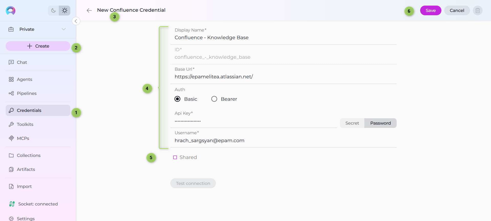
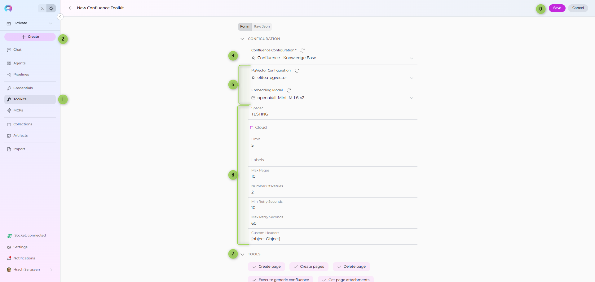
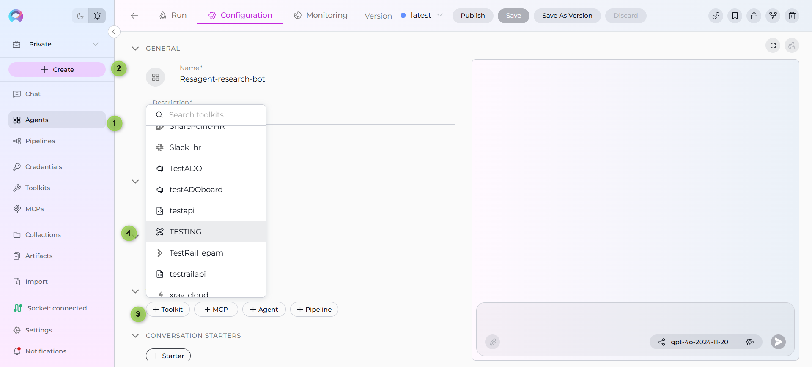
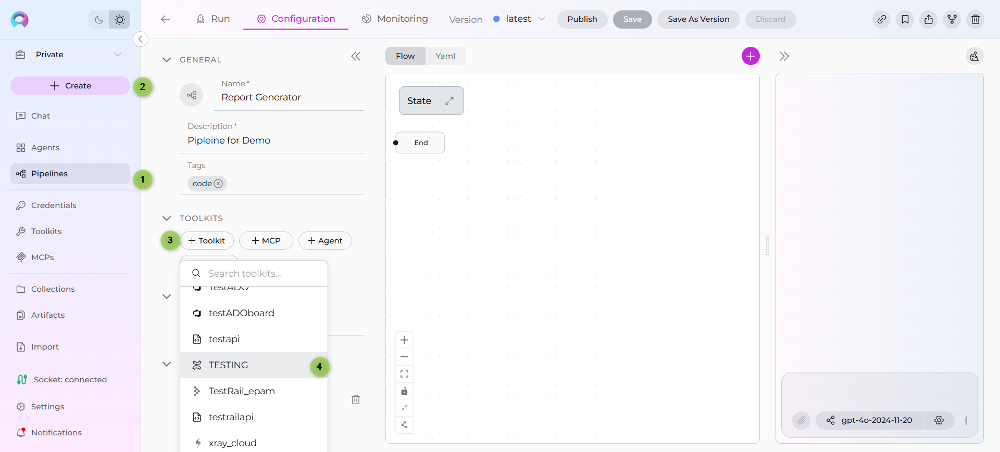
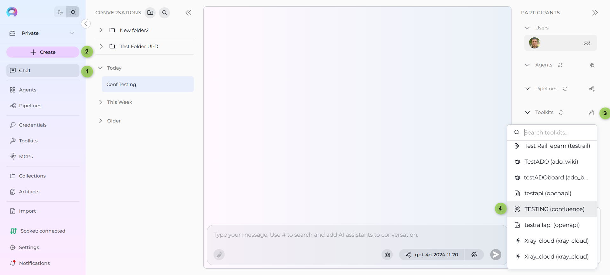

# ELITEA Toolkit Guide: Confluence Integration

## Introduction

### Purpose of this Guide

This guide is your definitive resource for integrating and utilizing the **Confluence toolkit** within ELITEA. It provides a comprehensive, step-by-step walkthrough, from generating a Confluence API token to configuring the toolkit in ELITEA and effectively using it within your Agents. By following this guide, you will unlock the power of automated knowledge management, streamlined collaboration workflows, and enhanced information access, all directly within the ELITEA platform. This integration empowers you to leverage AI-driven automation to optimize your Confluence-driven workflows using the combined strengths of ELITEA and Confluence.

### Brief Overview of Confluence

Confluence is Atlassian's powerful collaboration and documentation platform that helps teams create, organize, and share knowledge effectively. It serves as a centralized hub for modern knowledge management, offering features for:

*   **Centralized Knowledge Management:** Confluence provides a structured platform for creating, storing, and organizing all types of organizational knowledge, including project documentation, meeting notes, processes, and best practices.
*   **Collaborative Content Creation:** Enables real-time collaborative editing of pages, allowing teams to work together simultaneously on documents, plans, and other content, fostering teamwork and co-creation.
*   **Organized Spaces and Pages:** Confluence uses a hierarchical structure of Spaces and Pages to organize information logically. Spaces can represent teams, projects, or departments, while Pages within spaces hold specific content, making navigation and information discovery efficient.
*   **Rich Content Creation and Formatting:** Confluence provides a powerful editor with various formatting options, templates, and macros, allowing users to create visually appealing and informative pages with diverse content types, including text, images, tables, and multimedia.
*   **Advanced Search and Discovery:** Confluence offers robust search functionality with filtering and labeling capabilities, enabling users to quickly find relevant information across all spaces and pages, improving knowledge retrieval and content discoverability.

Integrating Confluence with ELITEA brings these powerful knowledge management capabilities directly into your AI-driven workflows. Your ELITEA Agents can then intelligently interact with your Confluence spaces and pages to automate knowledge-related tasks, enhance documentation processes, and improve information accessibility through intelligent automation, making your knowledge management workflows smarter and more efficient.

## Toolkit's Account Setup and Configuration in Confluence

!!! note "Integration with ELITEA"
    The credentials you create in this section will be used when creating your Confluence credential in ELITEA (Step 1 of the integration process).

### Account Setup

If you do not yet have a Confluence account, please follow these steps to create one:

1.  **Visit Atlassian Website:** Open your web browser and navigate to the official [Atlassian website](https://www.atlassian.com/software/confluence).
2.  **Sign Up for Confluence:** Click on the **"Try Confluence free"** or **"Get it free"** button to start the sign-up process.
3.  **Create an Atlassian Account:** Follow the prompts to create an Atlassian account. You can sign up using your email address, Google account, or Apple account. For professional use, it's recommended to use your company email address.
4.  **Choose a Workspace Name:** During the signup process, you will be asked to choose a workspace name for your Confluence site. Enter a suitable name for your workspace.
5.  **Set Up Your Workspace:** Follow the remaining onboarding steps to set up your Confluence workspace, including defining its purpose and inviting team members if needed.
6.  **Explore Confluence Features:** Once your workspace is set up, explore the onboarding tips and familiarize yourself with Confluence features, spaces, pages, and navigation.


### Token/API Key Generation: Creating an API Token in Confluence

For secure integration with ELITEA, it is essential to use a Confluence **API token** for authentication. This method is more secure than using your primary Confluence account password directly and allows you to control access permissions.

**Follow these steps to generate an API token in Confluence:**

1.  **Log in to Confluence:** Access your Confluence workspace by navigating to your Confluence URL (e.g., `your-workspace.atlassian.net/wiki`) and logging in with your credentials.
2.  **Access Account Settings:** Click on your profile avatar in the top right corner of the Confluence interface. From the dropdown menu, select **"Manage account"**.


3.  **Navigate to Security Settings:** In the Atlassian account settings page, navigate to the **"Security"** section in the left-hand sidebar.


4.  **Access API Tokens:** Within the "Security" settings, locate the **"API tokens"** section and click on **"Create and manage API tokens"**.
5.  **Create API Token:** On the "API tokens" page, click the **"Create API token"** button.


6.  **Name Your Token:** In the "Create API token" dialog, enter a descriptive **Label** for your token, such as "ELITEA Integration Token" or "ELITEA Agent Access." This label will help you identify the purpose of this token later. You can also set an optional expiration date if needed.
7.  **Create Token:** Click the **"Create"** button to generate the API token.
8.  **Securely Copy and Store Your API Token:**  **Immediately copy the generated API token** that is displayed in the pop-up window. **This is the only time you will see the full token value.** Store it securely in a password manager or, preferably, ELITEA's built-in Secrets feature for enhanced security within ELITEA. You will need this API token to configure the Confluence toolkit in ELITEA.


## System Integration with ELITEA

To integrate Confluence with ELITEA, you need to follow a three-step process: **Create Credentials → Create Toolkit → Use in Agents**. This workflow ensures secure authentication and proper configuration.

### Step 1: Create Confluence Credentials

Before creating a toolkit, you must first create Confluence credentials in ELITEA:

1. **Navigate to Credentials Menu:** Open the sidebar and select **[Credentials](../../menus/credentials.md)**.
2. **Create New Credential:** Click the **`+ Create`** button.
3. **Select Confluence:** Choose **Confluence** as the credential type.
4. **Configure Credential Details:**
     * **Display Name:** Enter a descriptive name (e.g., "Confluence - Knowledge Base")
     * **Base URL:** Enter the base URL of your Confluence instance (e.g., `https://yourcompany.atlassian.net/wiki` for Confluence Cloud or `https://kb.epam.com/` for Epam Confluence)
     * **Authentication Method:** Choose your preferred authentication method:
         * **Basic:** Enter your username and API key
         * **Bearer:** Enter your token
5. **Shared Credential:** Check the **Shared** checkbox if you want this credential to be accessible by all team members in the current project
6. **Save Credential:** Click **Save** to create the credential



!!! tip "Security Recommendation"
    It's highly recommended to use **[Secrets](../../menus/settings/secrets.md)** for API keys and tokens instead of entering them directly. Create a secret first, then reference it in your credential configuration.


### Step 2: Create Confluence Toolkit

Once your credentials are configured, create the Confluence toolkit:

1. **Navigate to Toolkits Menu:** Open the sidebar and select **[Toolkits](../../menus/toolkits.md)**.
2. **Create New Toolkit:** Click the **`+ Create`** button.
3. **Select Confluence:** Choose **Confluence** from the list of available toolkit types.
4. **Configure Credentials:** 
     * In the **Configuration** section, select your previously created Confluence credential from the **Credentials** dropdown
5. **Configure Advanced Options:**
     * **PgVector Configuration:** Select a PgVector connection for vector database integration 
     * **Embedding Model:** Select an embedding model for text processing and semantic search capabilities
6. **Configure Confluence Settings:**
     * **Space:** Enter the Space key for the Confluence space you want to access (e.g., `DOCS`, `TEAM`)
     * **Hosting Option:** Select the appropriate hosting option:
         * **Cloud:** For Confluence Cloud (e.g., `atlassian.net`)
         * **Server:** For self-hosted Confluence Server or Data Center instances (e.g., `https://kb.epam.com/`)
     * **Advanced Settings:**
         * **Pages limit per request:** Set the maximum number of pages to retrieve per request (default: 5)
          * **Labels:** Specify labels to filter content retrieval (optional, comma-separated list e.g., `meeting-notes, documentation`)
         * **Max total pages:** Define the maximum number of pages to retrieve in total (default: 10)
         * **Number of retries:** Specify how many times the tool should retry after a failure (default: 2)
         * **Min retry, sec:** Set the minimum number of seconds to wait before retrying (default: 10)
         * **Max retry, sec:** Set the maximum number of seconds to wait before retrying (default: 60)
7. **Enable Desired Tools:** In the **"Tools"** section, select the checkboxes next to the specific Confluence tools you want to enable. **Enable only the tools your agents will actually use** to follow the principle of least privilege
8. **Save Toolkit:** Click **Save** to create the toolkit



#### Available Tools:

The Confluence toolkit provides the following tools for interacting with Confluence spaces and pages, organized by functional categories:

| **Tool Category** | **Tool Name** | **Description** | **Primary Use Case** |
|:-----------------:|---------------|-----------------|----------------------|
| **Search & Discovery** | | | |
| | **Site search** | Performs a search across the entire Confluence site | Find content across all spaces and pages based on keywords |
| | **Search by title** | Searches for pages based on their title | Locate specific pages by title within the workspace |
| | **Search pages** | Searches for pages within a specified space based on keywords | Find relevant pages within a specific space or project |
| | **Get page id by title** | Retrieves the page ID using the page title | Get page ID when you only know the page title |
| **Content Access** | | | |
| | **Read page by id** | Retrieves the content of a page using its unique ID | Access specific page content for analysis or processing |
| | **Get pages with label** | Retrieves pages within a space that have a specific label | Access related content organized by labels |
| | **List pages with label** | Lists titles of pages within a space that have a specific label | Get overview of pages categorized by labels |
| | **Get page tree** | Retrieves the hierarchical structure of pages within a space | Understand content organization and page relationships |
| | **Get page attachments** | Retrieves attachments from a specific page | Access files and documents attached to pages |
| | **Get page with image descriptions** | Retrieves page content with image descriptions | Access pages with detailed image information |
| **Content Management** | | | |
| | **Create page** | Creates a new page within a specified space | Generate new documentation, meeting notes, or project pages |
| | **Create pages** | Creates multiple pages within a space in bulk | Efficiently create large sets of related documentation |
| | **Update page by id** | Updates content of a page using its unique ID | Modify specific page content programmatically |
| | **Update page by title** | Updates content of a page using its title | Update pages when you know the title but not the ID |
| | **Update pages** | Updates content of multiple pages in bulk | Efficiently modify large sets of related pages |
| | **Delete page** | Deletes a specific page identified by its ID | Remove outdated or obsolete content |
| **Organization & Metadata** | | | |
| | **Update labels** | Adds or removes labels from a specific page | Categorize and organize content for better discoverability |
| **Indexing & Search** | | | |
| | **Index data** | Creates searchable indexes of Confluence content | Enable advanced search and discovery across pages |
| | **List collections** | Lists available indexed collections | View and manage indexed data collections |
| | **Remove index** | Removes previously created search indexes | Clean up and manage indexed content |
| | **Search index** | Performs searches across indexed content | Find specific content across indexed pages |
| | **Stepback search index** | Performs advanced contextual searches with broader scope | Execute sophisticated searches with expanded context |
| | **Stepback summary index** | Creates comprehensive summaries of indexed content | Generate intelligent summaries of page information |
| **Advanced Operations** | | | |
| | **Execute generic confluence** | Sends custom HTTP requests to Confluence API | Access any Confluence API endpoint not covered by specific tools |

### Step 3: Use Toolkit in Agents, Pipelines, or Chat

Now you can add the configured Confluence toolkit to your agents, pipelines, or use it directly in chat:

**For Agents:**

1. **Navigate to Agents:** Open the sidebar and select **Agents**.
2. **Create or Edit Agent:** Either create a new agent or select an existing agent to edit.
3. **Add Confluence Toolkit:** 
     * In the **"Tools"** section of the agent configuration, click the **"+Toolkit"** icon
     * Select your configured Confluence toolkit from the dropdown list
     * The toolkit will be added to your agent with the previously configured tools enabled

Your agent can now interact with Confluence using the configured toolkit and space.



**For Pipelines:**

1. **Navigate to Pipelines:** Open the sidebar and select **Pipelines**.
2. **Create or Edit Pipeline:** Either create a new pipeline or select an existing pipeline to edit.
3. **Add Confluence Toolkit:** 
     * In the **"Tools"** section of the pipeline configuration, click the **"+Toolkit"** icon
     * Select your configured Confluence toolkit from the dropdown list
     * The toolkit will be added to your pipeline with the previously configured tools enabled

     

**For Chat:**

1. **Navigate to Chat:** Open the sidebar and select **Chat**.
2. **Add Confluence Toolkit:** 
     * In the chat Participants section, look for the **Toolkits** element
     * Click the **"Add Tools"** Icon to open the tools selection dropdown
     * Select your configured Confluence toolkit from the dropdown list
     * The toolkit will be added to your conversation with all previously configured tools enabled

     


## Instructions and Prompts for Using the Confluence Toolkit

To effectively instruct your ELITEA Agent to use the Confluence toolkit, you need to provide clear and precise instructions within the Agent's "Instructions" field. These instructions are crucial for guiding the Agent on *when* and *how* to utilize the available Confluence tools to achieve your desired automation goals.

### Instruction Creation for OpenAI Agents

When crafting instructions for the Confluence toolkit, especially for OpenAI-based Agents, clarity and precision are paramount. Break down complex tasks into a sequence of simple, actionable steps. Explicitly define all parameters required for each tool and guide the Agent on how to obtain or determine the values for these parameters. OpenAI Agents respond best to instructions that are:

*   **Direct and Action-Oriented:** Employ strong action verbs and clear commands to initiate actions. For example, "Use the 'read_page_by_id' tool...", "Create a page named...", "Search for pages containing...".

*   **Parameter-Centric:** Clearly enumerate each parameter required by the tool. For each parameter, specify:
    *   Its name (exactly as expected by the tool)
    *   The format or type of value expected
    *   How the Agent should obtain the value – whether from user input, derived from previous steps in the conversation, retrieved from an external source, or a predefined static value

*   **Contextually Rich:** Provide sufficient context so the Agent understands the overarching objective and the specific scenario in which each Confluence tool should be applied within the broader workflow. Explain the desired outcome or goal for each tool invocation.

*   **Step-by-Step Structure:** Organize instructions into a numbered or bulleted list of steps for complex workflows. This helps the Agent follow a logical sequence of actions.

*   **Add Conversation Starters:** Include example conversation starters that users can use to trigger this functionality. For example, "Conversation Starters: 'Show me the project documentation', 'What's in the meeting notes?', 'Search for information about the new feature'"

When instructing your Agent to use a Confluence toolkit tool, adhere to this structured pattern:

1. **State the Goal:** Begin by clearly stating the objective you want to achieve with this step. For example, "Goal: To retrieve the content of the 'Project Overview' page."

2. **Specify the Tool:** Clearly indicate the specific Confluence tool to be used for this step. For example, "Tool: Use the 'read_page_by_id' tool."

3. **Define Parameters:** Provide a detailed list of all parameters required by the selected tool. For each parameter:
   - **Parameter Name:** `<Parameter Name as defined in tool documentation>`
   - **Value or Source:** `<Specify the value or how to obtain the value. Examples: "user input", "from previous step", "hardcoded value 'DOCS'", "value of variable X">`

4. **Describe Expected Outcome (Optional but Recommended):** Briefly describe the expected result or outcome after the tool is successfully executed. For example, "Outcome: The Agent will provide the content of the 'Project Overview' page."

5. **Add Conversation Starters:** Include example conversation starters that users can use to trigger this functionality. For example, "Conversation Starters: 'Show me the project overview', 'What's in the project documentation?', 'Display the project summary'"

#### Example Agent Instructions

**Agent Instructions for Reading a Page:**

```markdown
1. Goal: Read the content of a specific Confluence page to provide information to the user.
2. Tool: Use the "read_page_by_id" tool.
3. Parameters:
    - Page ID: "Ask the user for the page ID or use the page ID obtained from a previous search"
4. Outcome: The Agent will retrieve and display the content of the specified Confluence page.
5. Conversation Starters: 'Show me page 12345', 'Read the project documentation', 'What's in the meeting notes?'
```

### Chat Usage Examples by Tool Category

The following examples demonstrate how to interact with the Confluence toolkit in ELITEA Chat, organized by functional categories. Each example shows the user request and the expected agent behavior.

#### Search & Discovery - Site Search

**Chat Example:**
```
User: "Search for any documentation about the authentication system in our Confluence."

Agent Response: [Agent uses site_search tool]

🔍 **Search Results for "authentication system"**:

**📄 Found 4 relevant pages**:

1. **"User Authentication Guide"** (DOCS space)
   - **Summary**: Comprehensive guide covering login processes and security protocols
   - **Last Updated**: 3 days ago
   - **URL**: https://yourcompany.atlassian.net/wiki/spaces/DOCS/pages/123456

2. **"API Authentication Documentation"** (DEV space)
   - **Summary**: Technical documentation for API authentication methods
   - **Last Updated**: 1 week ago
   - **URL**: https://yourcompany.atlassian.net/wiki/spaces/DEV/pages/789012

Would you like me to read the content of any specific page for more details?
```

#### Content Access - Read Page by ID

**Chat Example:**
```
User: "Can you show me the content of page 123456 from our Confluence?"

Agent Response: [Agent uses read_page_by_id tool]

📄 **Page Content - "Project Alpha Overview"**:

# Project Alpha Overview

## Project Objectives
- Develop a new customer portal with enhanced user experience
- Implement real-time analytics dashboard
- Integrate with existing CRM systems

## Current Status
✅ **Phase 1**: Requirements gathering (Complete)
🔄 **Phase 2**: Design and prototyping (In Progress)
⏳ **Phase 3**: Development (Planned for Q2)

## Team Members
- **Project Manager**: Sarah Johnson
- **Lead Developer**: Mike Chen
- **UX Designer**: Emily Rodriguez


The page was last updated 2 days ago by Sarah Johnson.
```

#### Content Management - Create Page

**Chat Example:**
```
User: "Create a new meeting notes page for today's project standup in the TEAM space."

Agent Response: [Agent uses create_page tool]

✅ **Page Created Successfully!**

**📄 New Page Details**:
- **Title**: "Project Standup - September 10, 2025"
- **Space**: TEAM
- **Page ID**: 987654
- **URL**: https://yourcompany.atlassian.net/wiki/spaces/TEAM/pages/987654

**📝 Initial Content Added**:
```markdown
# Project Standup - September 10, 2025

## Attendees
- [ ] Add attendee names

## Agenda
1. Sprint progress review
2. Blockers and challenges
3. Next sprint planning
4. Action items

## Discussion Notes
(Add notes here during the meeting)


The page is ready for your team to add meeting notes and action items!
```

#### Organization & Metadata - Update Labels

**Chat Example:**
```
User: "Add the labels 'archived' and 'project-alpha' to page 123456."

Agent Response: [Agent uses update_labels tool]

🏷️ **Labels Updated Successfully!**

**Page 123456** now has the following labels:
- ✅ **archived** (newly added)
- ✅ **project-alpha** (newly added)
- 📋 **documentation** (existing)
- 📋 **meeting-notes** (existing)

```

#### Indexing & Search - Index Data

**Chat Example:**
```
User: "Create a searchable index of all documentation in our DOCS space so we can find information more easily. Set collection suffix 'doc' "

Agent Response: [Agent uses index_data tool]

🔍 **Data Indexing Complete!**

**📊 Indexing Summary**:
- **Space Indexed**: DOCS
- **Pages Processed**: 45 pages
- **Content Types**: Documentation, guides, procedures, meeting notes
- **Index Status**: Successfully created
- **Search Capabilities**: Full-text search, semantic search, content relationships


Your DOCS space content is now fully indexed and searchable! You can use the search tools to find specific information quickly across all documentation.

```

#### Advanced Operations - Generic Request

**Chat Example:**
```
User: "Can you get the list of all spaces in our Confluence instance?"

Agent Response: [Agent uses generic_request tool]

🏢 **Confluence Spaces Overview**:

**📊 Total Spaces**: 8

**Active Spaces**:
1. **DOCS** - "Documentation Hub"
   - **Type**: Global space
   - **Pages**: 45 pages
   - **Last Activity**: Today

2. **TEAM** - "Team Collaboration"
   - **Type**: Team space  
   - **Pages**: 23 pages
   - **Last Activity**: 2 hours ago

3. **DEV** - "Development Resources"
   - **Type**: Project space
   - **Pages**: 67 pages
   - **Last Activity**: Yesterday

**📈 Activity Summary**: Your Confluence instance shows healthy usage with regular content updates across all active spaces.
```

## Troubleshooting and Support

### Troubleshooting

*   **Credential Not Appearing in Toolkit Configuration:**
    *   **Problem:** When creating a toolkit, your Confluence credential doesn't appear in the credentials dropdown.
    *   **Troubleshooting Steps:**
        *   **Check Credential Scope:** Ensure you're working in the same workspace/project where the credential was created. Private credentials are only visible in your Private workspace, while project credentials are visible within the specific team project.
        *   **Verify Credential Creation:** Go to the Credentials menu and confirm that your Confluence credential was successfully saved.
        *   **Credential Type Match:** Ensure you selected "Confluence" as the credential type when creating the credential.

*   **Connection Errors:**
    *   **Problem:** ELITEA Agent fails to establish a connection with Confluence, resulting in errors during toolkit execution.
    *   **Troubleshooting Steps:**
        1.  **Verify Confluence URL:** Ensure that the **Base URL** field in the credential configuration is correctly set to your Confluence instance URL (e.g., `https://yourcompany.atlassian.net/wiki` for Cloud or `https://kb.epam.com/` for Server). Avoid modifying this URL format unless necessary.
        2.  **Check API Token:** Double-check that the **API Token** you have provided is accurate, has not expired, and is valid for your Confluence account and the target space. Carefully re-enter or copy-paste the token to rule out typos.
        3.  **Verify Authentication Method:** Review the **authentication method** selected in your credential configuration. Ensure it matches the type of credentials you've provided (Basic for username+API key, Bearer for token).
        4.  **Network Connectivity:** Confirm that both your ELITEA environment and the Confluence service are connected to the internet and that there are no network connectivity issues, firewalls, or proxies blocking the integration.

*   **Authorization Errors (Permission Denied/Unauthorized):**
    *   **Problem:** Agent execution fails with "Permission Denied" or "Unauthorized" errors when attempting to access or modify Confluence resources, even with a seemingly valid token.
    *   **Troubleshooting Steps:**
        1.  **Re-verify API Token Validity:** Ensure that the API token is valid and has not been revoked in your Atlassian account settings. Generate a new token if necessary.
        2.  **Space Access Permissions:** Confirm that the Confluence account associated with the API token has the necessary access permissions to the specified space. Verify that the account can access, view, and modify content in the space you're targeting.
        3.  **Hosting Option Verification:** Double-check that you have selected the correct **Hosting option** (Cloud or Server) in the toolkit configuration. Using the wrong hosting option can lead to authentication and connection errors.
        4.  **Space Key Accuracy:** Ensure you're using the correct Space key (not the space name) in your toolkit configuration. Space keys are typically short codes like "DOCS" or "TEAM".

*   **Incorrect Space or Page Names:**
    *   **Problem:** Agent tools fail to operate on the intended space or page, often resulting in "Space not found" or "Page not found" errors.
    *   **Troubleshooting Steps:**
        1.  **Double-Check Space Key:** Carefully verify that you have entered the correct Confluence Space key in the toolkit configuration. Pay close attention to capitalization and exact spelling. Space keys are typically short codes like "DOCS", "TEAM", or "DEV".
        2.  **Verify Page Titles and IDs:** Ensure that you are using the correct page titles or page IDs when referencing Confluence pages. Page titles are case-sensitive and must match exactly. When using page IDs, ensure you are using the correct numerical ID for the intended page.
        3.  **Page Existence:** Confirm that the specified page actually exists in your Confluence space. It's possible the page name is correct but the page was deleted or moved.

*   **Toolkit Configuration Issues:**
    *   **Problem:** The toolkit fails to load or shows configuration errors after creation.
    *   **Troubleshooting Steps:**
        1.  **Verify Space Key Format:** Ensure the space key follows the correct format: a short alphanumeric code (e.g., "DOCS", "TEAM"). Do not use the full space name or special characters.
        2.  **Check Hosting Option:** Verify that the hosting option matches your Confluence instance type (Cloud for *.atlassian.net, Server for self-hosted instances).
        3.  **Credential Selection:** Ensure you have selected the correct credential from the dropdown in the toolkit configuration.

### FAQ

1.  **Q: Can I use my regular Confluence password directly for the ELITEA integration instead of an API token?**
    *   **A:** **While ELITEA supports password authentication, using a Confluence API token is strongly recommended for security.** API tokens provide a significantly more secure and controlled method for granting access to external applications like ELITEA, without exposing your primary account credentials. You can configure this in the credential's authentication method selection.

2.  **Q: What permissions are absolutely necessary for the Confluence API token to work with ELITEA?**
    *   **A:** Confluence API tokens have a fixed scope and provide access to the Confluence REST API. The specific permissions depend on what your ELITEA Agent will be doing. For basic read-only access (e.g., using `read_page_by_id`, `site_search`), standard API access is sufficient. For modifications (e.g., `create_page`, `update_page_by_id`), ensure your Confluence account has write permissions to the target spaces. **Always adhere to the principle of least privilege and grant only the permissions that are strictly necessary for your Agent's intended functionalities.**

3.  **Q: What is the correct format for specifying the Confluence Space key in the ELITEA toolkit configuration?**
    *   **A:** The Confluence Space key must be entered as the short alphanumeric code assigned to the space (e.g., "DOCS", "TEAM", "DEV"). Do not use the full space name or special characters. You can find the space key in your Confluence space settings or in the URL when viewing the space.

4.  **Q: How do I switch from the old Agent-based configuration to the new Credentials + Toolkit workflow?**
    *   **A:** The new workflow is: (1) Create a Confluence credential with your authentication details, (2) Create a Confluence toolkit that uses this credential, and (3) Add the toolkit to your agents, pipelines, or chat. This provides better security, reusability, and organization compared to configuring authentication directly in agents.

5.  **Q: Can I use the same Confluence credential across multiple toolkits and agents?**
    *   **A:** Yes! This is one of the key benefits of the new workflow. Once you create a Confluence credential, you can reuse it across multiple Confluence toolkits, and each toolkit can be used by multiple agents, pipelines, and chat sessions. This promotes better credential management and reduces duplication.

6.  **Q: Why am I consistently encountering "Permission Denied" errors, even though I believe I have configured everything correctly?**
    *   **A:** If you are still facing "Permission Denied" errors despite careful configuration, systematically re-examine the following:
        *   **API Token Validity:** Double-check that the **API token** is still valid and has not been revoked in your Atlassian account settings.
        *   **Space Access Verification:** Explicitly verify that the Confluence account associated with the API token has the necessary access rights to the *specific target space* within Confluence itself. Confirm space membership, permissions, and assigned roles within the Confluence space settings.
        *   **Hosting Option Match:** Double-check that you have selected the correct "Hosting option" (Cloud or Server) in the toolkit configuration, especially for self-hosted or enterprise Confluence instances.
        *   **Credential Configuration:** Carefully review the credential configuration in ELITEA, especially the authentication method selection and token/password fields for any hidden typographical errors or accidental whitespace.

If, after meticulously checking all of these points, you still encounter "Permission Denied" errors, please reach out to ELITEA Support with detailed information for further assistance.

### Support and Contact Information

If you encounter any persistent issues, have further questions, or require additional assistance beyond the scope of this guide regarding the Confluence integration or ELITEA Agents in general, please do not hesitate to contact our dedicated ELITEA Support Team. We are committed to providing timely and effective support to ensure you have a seamless and productive experience with ELITEA.

**How to Reach ELITEA Support:**

*   **Email:**  **[SupportAlita@epam.com](mailto:SupportAlita@epam.com)**

**Best Practices for Submitting Effective Support Requests:**

To enable our support team to understand and resolve your issue as efficiently as possible, please include the following critical information in your support email:

*   **ELITEA Environment Details:** Clearly specify the ELITEA environment you are currently using (e.g., "Next" or the specific name of your ELITEA instance).
*   **Project Context:**  Indicate the **Project Name** within ELITEA where you are experiencing the issue and specify whether you are working in your **Private** workspace or a **Team** project.
*   **Detailed Issue Description:** Provide a clear, concise, and comprehensive description of the problem you are encountering. Articulate precisely what you were attempting to do, what behavior you expected to observe, and what actually occurred (the unexpected behavior or error). Step-by-step descriptions are highly valuable.
*   **Relevant Configuration Information (Screenshots Preferred):** To facilitate efficient diagnosis, please include relevant configuration details, ideally as screenshots:
    *   **Agent Instructions (Screenshot or Text Export):** If the issue is related to a specific Agent's behavior, provide a screenshot of the Agent's "Instructions" field or export the instructions as text.
    *   **Toolkit Configurations (Screenshots):** If the issue involves the Confluence toolkit or any other toolkits, include clear screenshots of the toolkit configuration settings as they appear within your Agent's configuration in ELITEA.
*   **Complete Error Messages (Full Text):** If you are encountering any error messages, please provide the **complete and unabridged error text**. In the ELITEA Chat window, expand the error details section (if available) and copy the entire error message text. Detailed error information is often crucial for accurate diagnosis.
*   **Your Query/Prompt (Exact Text):** If the issue is related to Agent execution or an unexpected response, provide the exact query or prompt you used to trigger the Agent's action that led to the problem.

**Before Contacting Support:**

We encourage you to first explore the resources available within this guide and the broader ELITEA documentation. You may find answers to common questions or solutions to known issues in the documentation.

---

## Summary

The Confluence toolkit integration with ELITEA follows a streamlined three-step workflow:

1. **🔐 Create Credentials** - Set up secure authentication with your Confluence API token
2. **🔧 Create Toolkit** - Configure the Confluence toolkit using your credentials and enable the tools you need
3. **🚀 Use in Modules** - Add the toolkit to Agents, Pipelines, and use them directly in Chat for automated knowledge management

This integration enables your AI agents to interact intelligently with Confluence spaces and pages, automate knowledge-related tasks, and enhance collaboration within your documentation workflows. By following the principle of least privilege and enabling only the tools you need, you maintain both security and performance while unlocking powerful automation capabilities for knowledge management.


!!! reference "External Resources"
    *   **Confluence Website:** [https://www.atlassian.com/software/confluence](https://www.atlassian.com/software/confluence) - *Access the main Confluence product website for product information and documentation.*
    *   **Atlassian Account Settings:** [https://id.atlassian.com/manage-profile/security](https://id.atlassian.com/manage-profile/security) - *Navigate to your Atlassian account settings to manage API tokens and other security configurations.*
    *   **Confluence API Tokens:** [https://id.atlassian.com/manage-profile/security/api-tokens](https://id.atlassian.com/manage-profile/security/api-tokens) - *Directly access the section in Atlassian settings to manage your API tokens for secure integrations.*
    *   **Confluence REST API Documentation:** [https://developer.atlassian.com/cloud/confluence/rest/v1/](https://developer.atlassian.com/cloud/confluence/rest/v1/) - *Explore the official Confluence API documentation for detailed information on API endpoints, authentication, data structures, and developer guides.*
    *   **Atlassian Community:** [https://community.atlassian.com/t5/Confluence/ct-p/confluence](https://community.atlassian.com/t5/Confluence/ct-p/confluence) - *Access the official Atlassian Community for comprehensive articles, FAQs, best practices, and troubleshooting guides on all aspects of Confluence usage.*
