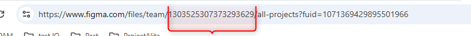

# ELITEA Toolkit Guide: Figma Integration

## Introduction

**Purpose of this Guide**

This guide is your definitive resource for integrating and effectively utilizing the **Figma toolkit** within ELITEA. It provides a detailed, step-by-step walkthrough, from setting up your Figma API credentials to creating and configuring the toolkit in ELITEA and seamlessly incorporating it into your Agents, Pipelines, or other modules. By following this guide, you will unlock the power of automated design interaction, enhanced collaboration with design assets, all directly within the ELITEA platform. This integration empowers you to leverage AI-driven automation to optimize your workflows involving Figma designs, enhance design productivity, and improve design-related processes within your projects.

### Brief Overview of Figma

Figma is a leading cloud-based design platform for collaborative interface design. It is widely used by designers and teams to create, prototype, and share user interface and user experience designs. Key features of Figma include:

*   **Collaborative Design:** Figma enables real-time collaboration, allowing multiple users to work on the same design file simultaneously, fostering teamwork and efficient design iterations.
*   **Vector Graphics and Prototyping:** Provides powerful vector graphics editing tools and robust prototyping capabilities to create interactive and realistic design mockups.
*   **Web-Based Platform:** As a web-based application, Figma is accessible from any modern web browser across different operating systems, facilitating seamless access and collaboration.
*   **Version History and Team Libraries:** Maintains a comprehensive version history of design files and enables the creation of shared team libraries for reusable design components and styles, ensuring design consistency and efficient asset management.

Integrating Figma with ELITEA brings these powerful design collaboration and management capabilities directly into your AI-driven workflows. Your ELITEA Agents can then intelligently interact with your Figma design files and assets to automate design-related tasks, enhance design workflows, improve design asset management, and leverage AI to optimize your entire design lifecycle within Figma.

## Toolkit Account Setup and Configuration in Figma

!!! note "Note"
    The credentials you create in this section will be used when creating your Figma toolkit in ELITEA. This is part of the **[Create Credentials](#step-1-create-figma-credentials)** step in the integration workflow.

### Account Setup

To use the Figma Toolkit, you will need an active Figma account. To set up your Figma account, follow these steps:

1.  **Visit Figma Website:** Open your web browser and navigate to the official Figma website: [https://www.figma.com/](https://www.figma.com/).


2.  **Get Started for Free or Log In:** Click on the **"Get started for free"** button to create a new account or use the **"Log in"** option if you have an existing Figma account.


3.  **Follow Registration Process:** Follow the on-screen instructions to complete the registration process and create your Figma account. You can sign up using your email address or connect with your Google account.

    {loading=lazy}

4.  **Access Figma Home Page:** Once your account is created and verified, you will be redirected to your Figma home page.

### Token/API Key Generation: Creating a Figma Personal Access Token

For secure integration with ELITEA, users will need to use a Figma **Personal Access Token**.

**Follow these steps to generate a Figma Personal Access Token:**

1.  **Access Figma Settings:** In Figma, click on your profile icon (typically your avatar or initials) located in the top left corner of the Figma interface and navigate to **"Settings"**. **Note:** Ensure you have the correct Figma account selected if you are logged into multiple Figma accounts.

    {loading=lazy}

2.  **Navigate to Security Tab:** In the Settings menu, click on the **"Security"** tab.


3.  **Generate New Personal Access Token:** Scroll down to the "Personal access tokens" section and click on the **"Generate new token"** button.

    {loading=lazy}

4.  **Configure Token Permissions (If Required):** In the "New personal access token" window, enter a **Token name** to identify the token (e.g., "ELITEA Integration Token").  
**Note:** While the documentation mentions selecting permissions for comment posting, the Figma Personal Access Tokens currently have broad access and specific permission scopes are not configurable during token creation through the UI. Ensure you understand the access granted by Personal Access Tokens.  You can set an **Expiration date** for the token if desired for security best practices.

    {loading=lazy}

5.  **Create Token:** Click the **"Generate token"** button to create the Personal Access Token.

6.  **Securely Copy and Store Your API Token:**  A dialog box will appear displaying your newly generated Personal Access Token. **Immediately copy the generated API token**. **This is the only time you will see the full token value.** Store it securely in a password manager or, preferably, ELITEA's built-in [Secrets](../../menus/settings/secrets.md) feature for enhanced security within ELITEA. You will need this API token to configure the Figma toolkit in ELITEA.

**Additional Information on Figma Access Tokens:**

!!! info "Additional Information"
    For more detailed information on managing Figma Personal Access Tokens, refer to the official Figma documentation: [figma.com/Manage-personal-access-tokens](https://help.figma.com/hc/en-us/articles/8085703771159-Manage-personal-access-tokens)


## System Integration with ELITEA

To integrate the Figma Toolkit with ELITEA, follow a streamlined process: **Create Credentials ‚Üí Create Toolkit ‚Üí Use in Agents, Pipelines, or Chat**. This workflow ensures secure authentication and proper configuration.

### Step 1: Create Figma Credentials

Before creating a toolkit, you must first create Figma credentials in ELITEA:

1. **Navigate to Credentials Menu:** Open the sidebar and select [Credentials](../../how-tos/credentials-toolkits/how-to-use-credentials.md#figma-credential-setup).
2. **Create New Credential:** Click the **`+ Create`** button.
3. **Select Figma:** Choose **Figma** as the credential type.
4. **Configure Credential Details:**
     * **Display Name:** Enter a descriptive name (e.g., "Figma - Design Team Access")
     * **Token:** Enter your Figma Personal Access Token (starts with `figd_`)
5. **Test Connection:** Click the **Test Connection** button to verify your credentials are valid and can successfully connect to Figma's API.
     * ✔️ **Success:** You'll see a confirmation message indicating the connection was successful
     * ‚úò **Failure:** Check that your token is correct, hasn't expired, and has the necessary permissions
6. **Save Credential:** Once the test is successful, click **Save** to create the credential.

      {loading=lazy}

!!! tip "Security Recommendation"
    It's highly recommended to use **[Secrets](../../menus/settings/secrets.md)** for tokens instead of entering them directly. Create a secret first, then reference it in your credential configuration.

### Step 2: Create Figma Toolkit

Once your credentials are configured, create the Figma toolkit:

1. **Navigate to Toolkits Menu:** Open the sidebar and select **[Toolkits](../../menus/toolkits.md)**.
2. **Create New Toolkit:** Click the **`+ Create`** button.
3. **Select Figma:** Choose **Figma** from the list of available toolkit types.
4. **Configure Toolkit Details:**
     * **Name:** Enter a descriptive name for your toolkit (e.g., "Design Asset Manager")
     * **Description:** Provide a brief description (e.g., "Toolkit for accessing and managing Figma design files")
5. **Configure Credentials:** 
     * In the **Configuration** section, select your previously created Figma credential from the **Credentials** dropdown
6. **Configure Advanced Options (Optional):**
     * **PgVector Configuration:** Select a PgVector connection for vector database integration
     * **Embedding Model:** Select an embedding model for text processing and semantic search capabilities
     * **Number of Threads:** Set the number of worker threads (1-5) for downloading and processing Figma images (default: 5)     
     * **Global Limit:** Set a character limit for API responses to ensure manageable content size
     * **Global Regexp:** Enter a Regular Expression to filter results from Figma API responses (leave blank for no filtering)
7. **Enable Desired Tools:** In the **"Tools"** section, select the checkboxes next to the specific Figma tools you want to enable. **Enable only the tools your agents will actually use** to follow the principle of least privilege
8. **Save Toolkit:** Click **Save** to create the toolkit.

     {loading=lazy}

!!! info "Alternative: Create from Canvas"
    You can also create a Figma Toolkit directly from a chat conversation using the canvas interface. This allows immediate use without navigating away from your conversation. For details, see [How to Create and Edit Toolkits from Canvas](../../how-tos/chat-conversations/how-to-create-and-edit-toolkits-from-canvas.md).

#### Available Tools:

The Figma toolkit provides the following tools for interacting with Figma design files and managing design data, organized by functional categories:

| **Tool Category** | **Tool Name** | **Description** | **Primary Use Case** |
|:-----------------:|---------------|-----------------|----------------------|
| **File Analysis** | | | |
| | **Analyze file** | LLM-powered file analyzer providing file/page/frame structure, screen explanations with visual insights, user flow analysis, and design recommendations. Supports drill-down by node_id for detailed page or frame analysis | Deep analysis of design files with AI-powered insights for UX research, documentation, and design review |
| | **Get file** | Retrieves the complete details and structure of a Figma file | Access comprehensive file structure for analysis and data extraction |
| | **Get file nodes** | Retrieves specific design elements (frames, layers, groups) from a Figma file | Analyze specific design components and their properties |
| | **Get file versions** | Retrieves the version history of a Figma file | Track design evolution, compare versions, and analyze changes over time |
| **Asset Management** | | | |
| | **Get file images** | Extracts images and visual assets from a Figma file | Export design assets for documentation, presentations, or development |
| **Collaboration** | | | |
| | **Get file comments** | Retrieves all comments from a Figma file | Access feedback, discussions, and review threads for collaboration analysis |
| | **Post file comment** | Adds a new comment to a Figma file | Provide automated feedback, annotations, or notifications |
| **Project & Team Management** | | | |
| | **Get project files** | Lists all files within a specific Figma project | Discover and organize design files within project contexts |
| | **Get team projects** | Retrieves a list of projects within a Figma team | Get organizational overview and manage team-level design assets |
| **Indexing & Search** | | | |
| | **Index data** | Creates searchable indexes of Figma design content | Enable advanced search and discovery across design files |
| | **List collections** | Lists available design collections and libraries | Organize and access design system components and shared assets |
| | **Remove index** | Removes previously created search indexes | Clean up and manage indexed design data |
| | **Search index** | Performs searches across indexed Figma content | Find specific design elements, components, or content across files |
| | **Stepback search index** | Performs advanced contextual searches with broader scope | Execute sophisticated searches with expanded context and relevance |
| | **Stepback summary index** | Creates comprehensive summaries of indexed design content | Generate intelligent summaries of design files and collections |

!!! tip "Analyze File tool"
    The **Analyze file** tool is the most powerful tool in the Figma toolkit. It provides:
    
    - LLM-powered screen explanations with visual insights
    - Automatic user flow analysis identifying key user journeys
    - Design pattern recognition and recommendations
    - Comprehensive file/page/frame structure analysis
    
    This tool requires an LLM to be configured for your agent/chat to work properly.

!!! tip "Vector Search Tools"
    The tools **Index data**, **List collections**, **Remove index**, **Search index**, **Stepback search index**, and **Stepback summary index** require PgVector configuration and an embedding model. These enable advanced semantic search capabilities across your Figma files.


### Step 3: Use Toolkit in Agents, Pipelines, or Chat

Now you can add the configured Figma toolkit to your agents, pipelines, or use it directly in chat:

#### **In Agents:**

1. **Navigate to Agents:** Open the sidebar and select **[Agents](../../menus/agents.md)**.
2. **Create or Edit Agent:** Either create a new agent or select an existing agent to edit.
3. **Add Figma Toolkit:** 
     * In the **"TOOLKITS"** section of the agent configuration, click the **"+Toolkit"** icon
     * Select your configured Figma toolkit from the dropdown list
     * The toolkit will be added to your agent with the previously configured tools enabled

{loading=lazy}

Your agent can now interact with Figma using the configured toolkit and enabled tools.

!!! note "Reference"
    For more information on agent configuration and management, see the [Agent Guide](../../menus/agents.md).

#### **In Pipelines:**

1. **Navigate to Pipelines:** Open the sidebar and select **[Pipelines](../../menus/pipelines.md)**.
2. **Create or Edit Pipeline:** Either create a new pipeline or select an existing pipeline to edit.
3. **Add Figma Toolkit:** 
     * In the **"TOOLKITS"** section of the pipeline configuration, click the **"+Toolkit"** icon
     * Select your configured Figma toolkit from the dropdown list
     * The toolkit will be added to your pipeline with the previously configured tools enabled

Your pipeline can now leverage Figma data for design automation workflows across pipeline stages.

{loading=lazy}

#### **In Chat:**

1. **Navigate to Chat:** Open the sidebar and select **[Chat](../../menus/chat.md)** or use the main chat interface.
2. **Start New Conversation:** Click **+Create** or open an existing conversation.
3. **Add Toolkit to Conversation:**
     * In the chat Participants section, look for the **Toolkits** element
     * Click the **"Add Tools"** icon to open the tools selection dropdown
     * Select your configured Figma toolkit from the dropdown list
     * The toolkit will be added to your conversation with all previously configured tools enabled
4. **Use Toolkit in Chat:** You can now directly interact with your Figma files by asking questions or requesting actions that will trigger the Figma toolkit tools.

{loading=lazy}


!!! note "Reference"
    For more information on chat functionality, see the [Chat Guide](../../menus/chat.md).

---

## Figma Key Parameters

**Common Parameters Used Across Tools:**

| **Parameter** | **Type** | **Requirement** | **Description** |
|---------------|----------|-----------------|-----------------|
| `file_key` | string | Required for file-based tools | The unique identifier extracted from Figma file URLs |
| `url` | string | Optional | Full Figma URL with file key and optional node-id. Example: `https://www.figma.com/file/<FILE_KEY>/...?node-id=<NODE_ID>`. If provided, overrides file_key parameter |
| `node_ids` | string | Optional | Comma-separated list of specific design element IDs |
| `team_id` | string | Required for team tools | Figma team identifier |
| `project_id` | string | Required for project tools | Figma project identifier |
| `message` | string | Required for comments | Content for posting comments |
| `query` | string | Required for search tools | Search terms and criteria |


 **Figma Toolkit Functionalities**

Once the Figma toolkit is successfully configured and added to your Agent, you can leverage the following tools within your Agent's instructions to enable intelligent interaction with Figma design files:

### How to Find Figma Project ID:

For tools that require a **Project ID**, you can obtain the following ways:

1. **From Project URL (If You Are Project Admin) - Web & Desktop:** When viewing a project in Figma (web or desktop app), the Project ID is in the URL:
    ```
    https://www.figma.com/files/project/[PROJECT_ID]/[PROJECT_NAME]
    ```
    For example, from `https://www.figma.com/files/project/123456789/Design-System`, the Project ID is `123456789`.
   
    **Desktop App:** Use **File ‚Üí Copy link** or **Share** to get the project URL with the same format.

     {loading=lazy}

2. **Request from Project Administrator:** If you don't have admin access to the project, contact the project administrator or team owner to provide you with the **Project ID**.

!!! info "Project ID Usage Note"
    Providing Project ID in tools is optional. It's generally better to filter results using **File Key** instead, because projects may contain many files. Use Project ID only when you specifically need to work with all files in a project or get project-level information.

### How to Find Figma File Key:

To use the Figma tools, you'll need the **File Key** from your Figma file. You can extract it using either the web version or desktop app:

**Web Version:**
```
https://www.figma.com/file/[FILE_KEY]/[FILE_NAME]
```
For example, from `https://www.figma.com/file/ABC123DEF456/My-Design-File`, the File Key is `ABC123DEF456`.

**Desktop App:**

1. **From File Menu:** Open the file in Figma desktop app, go to **File ‚Üí Copy link** or **File ‚Üí Share**
2. **From Share Button:** Click the **Share** button in the top-right corner, then **Copy link**
3. **Extract from URL:** The copied link will have the same format as the web version: `https://www.figma.com/file/[FILE_KEY]/[FILE_NAME]`
4. **From Recent Files:** Right-click on a file in your recent files list and select **Copy link**

      {loading=lazy}


### How to Find Node IDs:

Node IDs are required for tools that target specific design elements. Here's how to find them:

**Web Version:**

1. **Extract from URL:** The copied URL contains the node ID: `https://www.figma.com/file/[FILE_KEY]/[FILE_NAME]?node-id=[NODE_ID]`
2. **From Layers Panel:** Select an element and use **Copy as** ‚Üí **Copy link**

**Desktop App:**

1. **Right-click Method:** Right-click on any design element and select **Copy link**
2. **Layer Selection:** Select a layer in the layers panel, right-click, and choose **Copy link**
3. **Multiple Selection:** Select multiple elements while holding Ctrl (Windows) or Cmd (Mac), then right-click and **Copy link** to get multiple node IDs
4. **From Properties Panel:** With an element selected, you can sometimes see the node ID in the properties panel or developer tools

**Node ID Format:** Node IDs typically appear as `123:456` in the URL parameter `node-id=123%3A456` (where `%3A` is the URL-encoded colon).
 
  {loading=lazy}

### How to Find Figma Team ID:

For the `get_team_projects` tool, you need a **Team ID**:

**Web Version:**

1. **From Team URL:** When viewing your team in Figma, the Team ID is in the URL:
   ```
   https://www.figma.com/files/team/[TEAM_ID]/[TEAM_NAME]
   ```

2. **From Organization Settings:** In your Figma organization settings, you can find the team ID in the team management section.

**Desktop App:**

1. **From Team Navigation:** Navigate to your team view in the desktop app, then use **File ‚Üí Show in browser** to open the web version with the team URL
2. **From Share Team:** In team view, use the **Share** feature to get a team link containing the Team ID
3. **From Account Settings:** Access your account settings in the desktop app and navigate to team management where Team IDs may be displayed

 {loading=lazy}

---

## Real-World Usage Examples

The Figma toolkit provides versatile capabilities to enhance design workflows within ELITEA. Below are practical examples demonstrating how to leverage the toolkit in chat conversations and agents.

??? example "1. Quick Design Analysis in Chat"
    **Scenario:** Quickly analyze a design file and get AI-powered insights during a chat conversation.
    
    **Tools Used:** `analyze_file`, `get_file_comments`
    
    **Chat Interaction:**
    ```
    User: "Analyze the design file with key ABC123DEF456 and provide insights"
    
    Agent: [Uses analyze_file tool to get comprehensive LLM-powered analysis]
    
    Agent: "I've analyzed the design file. Here are the key insights:
    
    üì± File Structure:
    - 5 main pages covering onboarding, home, and checkout flows
    - 23 unique screens identified
    - Consistent use of design system components
    
    🎯 User Flows Detected:
    1. Onboarding ‚Üí Account Creation ‚Üí Profile Setup
    2. Browse Products ‚Üí Product Details ‚Üí Add to Cart ‚Üí Checkout
    3. Search ‚Üí Filter Results ‚Üí Product Comparison
    
    üí° Design Insights:
    - Strong visual hierarchy with clear CTAs
    - Consistent spacing and typography
    - Mobile-first approach with responsive patterns
    
    ⚠️ Recommendations:
    - Consider adding loading states for checkout flow
    - Error handling screens need more detail
    - Accessibility: increase contrast on secondary buttons"
    ```
    
    {width=600 loading=lazy}
    
    ---
    
    User: "Get all comments from this file to see what feedback needs addressing"
    
    Agent: [Uses get_file_comments tool]
    
    Agent: "Found 12 comments:
    - 5 resolved (design approved)
    - 4 pending (awaiting developer input on feasibility)
    - 3 open issues: color contrast, button sizing, missing states"
    ```

??? example "2. Automated Design Review and Documentation in Chat"
    **Scenario:** Review design files and create handoff documentation through chat interaction.
    
    **Tools Used:** `analyze_file`, `get_file_comments`, `post_file_comment`
    
    **Chat Interaction:**
    ```
    User: "Review the mobile app designs in file ABC123 and create handoff documentation"
    
    Agent: [Uses analyze_file tool for comprehensive analysis]
    Agent: "Design Review Complete! 
    
    üì± App Structure:
    - 18 screens across 4 main flows
    - Login/Onboarding (4 screens)
    - Home & Navigation (6 screens)
    - Product Catalog (5 screens)
    - Checkout Process (3 screens)
    
    üé® Design System Usage:
    - Primary Button Component: 24 instances
    - Input Field Component: 15 instances
    - Navigation Card: 12 instances
    - Consistent 8px grid system throughout
    
    ‚ôø Accessibility Notes:
    - All buttons have minimum 44x44 touch targets ‚úì
    - Color contrast ratios meet WCAG AA standards ‚úì
    - Action: Review contrast on secondary CTAs (borderline)
    
    Created full handoff documentation ready for development."
    ```
    
    **Benefits:**
    - Automated design documentation generation
    - Consistent review process
    - Faster developer handoff
    - Improved design-dev communication

??? example "3. Design System Audit in Chat"
    **Scenario:** Audit multiple design files for design system consistency through chat.
    
    **Tools Used:** `analyze_file`, `get_project_files`, `search_index`
    
    **Chat Interaction:**
    ```
    User: "Audit all files in project 123456 for design system compliance"
    
    Agent: [Uses get_project_files then analyze_file for each file]
    Agent: "Design System Audit Results:
    
    üìä Component Usage:
    - Button/Primary: 156 instances across 12 files ‚úì
    - Button/Secondary: 89 instances across 10 files ‚úì
    - Input/Text: 45 instances across 8 files ‚úì
    
    ⚠️ Inconsistencies Found:
    - File 'Checkout-v2.fig': Using custom button (not from library)
    - File 'Settings.fig': Mix of old and new input components
    - File 'Onboarding.fig': Custom navigation pattern (not standardized)
    
    üí° Recommendations:
    1. Update Checkout-v2 to use standard Button/Primary component
    2. Migrate Settings to new input component set
    3. Consider standardizing navigation pattern from Onboarding"
    ```
    
    **Benefits:**
    - Design system governance
    - Identify inconsistencies early
    - Track component adoption
    - Maintain design consistency

??? example "4. UX Research and User Flow Analysis in Chat"
    **Scenario:** Analyze user flows and generate UX research insights through chat interaction.
    
    **Tools Used:** `analyze_file`
    
    **Chat Interaction:**
    ```
    User: "Analyze user flows in the e-commerce app design (file XYZ789)"
    
    Agent: [Uses analyze_file tool with LLM-powered flow analysis]
    Agent: "UX Flow Analysis Complete:
    
    🛤️ Primary User Journeys Identified:
    
    1. **First-Time User Journey**
       Splash ‚Üí Sign Up ‚Üí Profile Setup ‚Üí Home ‚Üí Tutorial ‚Üí Browse
       - Strengths: Clear onboarding, guided tutorial
       - Gaps: No skip option for tutorial
    
    2. **Purchase Flow**
       Browse ‚Üí Product Detail ‚Üí Add to Cart ‚Üí Cart Review ‚Üí Checkout ‚Üí Payment ‚Üí Confirmation
       - Strengths: Linear flow, clear CTAs
       - Gaps: Missing 'Continue Shopping' from cart
       - Missing: Save for later option
    
    3. **Search & Discovery**
       Search ‚Üí Results ‚Üí Filters ‚Üí Product ‚Üí Compare ‚Üí Decision
       - Strengths: Advanced filtering
       - Gaps: No recent searches, no search suggestions
    
    ⚠️ UX Concerns:
    - Back navigation unclear in checkout flow
    - No loading states for product images
    - Error messages lack actionable guidance
    
    üí° Recommended Improvements:
    1. Add exit points in tutorial flow
    2. Include 'Save for Later' in cart
    3. Add breadcrumb navigation in checkout
    4. Design comprehensive error state library"
    ```
    
    **Benefits:**
    - Automated UX documentation
    - Flow visualization and analysis
    - Early identification of UX gaps
    - Research-backed design decisions

??? example "5. Accessibility Compliance Check in Chat"
    **Scenario:** Review designs for accessibility compliance through chat before development.
    
    **Tools Used:** `analyze_file`, `post_file_comment`
    
    **Chat Interaction:**
    ```
    User: "Check the designs in file ABC123 for WCAG AA compliance"
    
    Agent: [Uses analyze_file tool to analyze accessibility]
    Agent: "Accessibility Audit Results:
    
    ✔️ Passing:
    - Touch targets: All interactive elements ‚â• 44x44px
    - Text sizing: Body text ‚â• 16px throughout
    - Heading hierarchy: Logical H1-H4 structure
    
    ⚠️ Issues Found:
    
    1. Color Contrast - 8 instances
       - Secondary button text: 3.2:1 (needs 4.5:1)
       - Placeholder text: 2.8:1 (needs 4.5:1)
       - Disabled state labels: 3.0:1 (needs 4.5:1)
    
    2. Focus Indicators - 5 screens missing
       - Form inputs lack visible focus state
       - Navigation items need focus indicators
    
    3. Alt Text Requirements
       - 12 decorative images need alt=''
       - 6 informative images need descriptive alt text
    
    [Posts comments to Figma file highlighting specific issues]
    
    Created detailed remediation checklist with 23 action items."
    ```

??? example "6. Version Comparison in Chat"
    **Scenario:** Track design changes between versions through chat for review meetings.
    
    **Tools Used:** `get_file_versions`, `analyze_file`, `get_file_comments`
    
    **Chat Interaction:**
    ```
    User: "Compare the last two versions of file DEF456 and summarize changes"
    
    Agent: [Uses get_file_versions and analyze_file]
    Agent: "Version Comparison Summary:
    
    üìÖ Version History:
    - Current: v2.3 (Jan 9, 2026)
    - Previous: v2.2 (Jan 5, 2026)
    
    🔄 Key Changes:
    
    1. Home Screen Redesign
       - New hero section layout
       - Updated CTA button placement
       - Added promotional banner slot
    
    2. Navigation Updates
       - Bottom nav icons redesigned
       - Added 5th nav item (Profile)
       - Updated active state styling
    
    3. Component Updates
       - Button corner radius: 8px ‚Üí 12px
       - Card shadows: Updated depth/elevation
       - Typography: Headlines increased 2px
    
    4. New Screens Added
       - User Profile (new)
       - Settings > Notifications (new)
       - Empty States library (new)
    
    💬 Related Comments:
    - 4 comments resolved between versions
    - 2 new comments on current version (navigation feedback)
    
    Overall Direction: Moving toward rounder, friendlier aesthetic"
    ```

??? example "7. Design Search with Indexing in Chat"
    **Scenario:** Index design files and perform semantic searches to find specific design elements or patterns across multiple files.
    
    **Tools Used:** `index_data`, `search_index`, `list_collections`
    
    **Chat Interaction:**
    ```
    User: "Index all design files from project 789012 so I can search through them"
    
    Agent: [Uses index_data tool to create searchable index]
    Agent: "Indexing Complete! 
    
    üìä Indexing Summary:
    - Files indexed: 15
    - Total screens: 87
    - Components indexed: 234
    - Text content indexed: ~12,500 words
    - Collection name: 'project_789012_designs'
    
    Your designs are now searchable. You can search for components, patterns, text, or design elements across all indexed files."
    
    ---
    
    User: "Search for all login screens and authentication flows"
    
    Agent: [Uses search_index tool]
    Agent: "Search Results for 'login screens and authentication flows':
    
    üîç Found 8 relevant screens:
    
    1. **Mobile App - Login Screen** (File: MobileApp-v3.fig)
       - Email/password login form
       - Social login options (Google, Apple)
       - "Forgot password" link
       - Relevance: 95%
    
    2. **Web Portal - Sign In** (File: WebPortal.fig)
       - Username/password fields
       - Remember me checkbox
       - Two-factor authentication option
       - Relevance: 92%
    
    3. **Onboarding Flow - Authentication** (File: Onboarding-Complete.fig)
       - Multi-step auth process
       - Phone verification screen
       - Biometric setup option
       - Relevance: 88%
    
    4. **Settings - Security** (File: Settings-Screens.fig)
       - Change password interface
       - Session management
       - Relevance: 72%
    
    üí° Patterns Detected:
    - All screens use consistent button styling
    - 6/8 screens include social login options
    - Error states present in 5/8 screens"
    
    ---
    
    User: "Show me all collections available"
    
    Agent: [Uses list_collections tool]
    Agent: "Available Design Collections:
    
    üìö Collections List:
    1. project_789012_designs (15 files, indexed today)
    2. design_system_library (8 files, indexed Jan 10)
    3. marketing_assets (12 files, indexed Jan 8)
    
    You can search any of these collections or create new ones by indexing additional projects."
    ```
    
    **Benefits:**
    - Fast semantic search across multiple design files
    - Find design patterns and components quickly
    - Discover inconsistencies in design implementation
    - Enable design system audits at scale
    - Support cross-project design research

??? example "8. Automated Design Review Agent (Agent Configuration Example)"
    **Scenario:** Configure an agent to automatically review design files and provide comprehensive feedback on a schedule or when triggered.
    
    **Tools Used:** `analyze_file`, `get_file_comments`, `post_file_comment`
    
    **Agent Configuration:**
    
    **Agent Name:** Design Review Assistant
    
    **Agent Instructions:**
    ```
    You are a design review assistant that analyzes Figma files and provides comprehensive feedback.
    
    When reviewing a design file:
    1. Use analyze_file to get overall file structure and insights
    2. Identify screen structure and user flows
    3. Analyze component inventory and design patterns
    4. Check accessibility considerations
    5. Review outstanding comments using get_file_comments
    6. Post summary feedback using post_file_comment
    
    Always provide:
    - File structure overview
    - Design system usage analysis
    - Accessibility notes
    - UX improvement recommendations
    - Summary of pending feedback and comments
    
    Format your responses with clear sections and emoji indicators for better readability.
    ```
    
    **Usage Example:**
    ```
    User triggers agent with: "Review file ABC123DEF456"
    
    Agent automatically:
    1. Analyzes the complete file structure
    2. Generates design review documentation
    3. Posts summary comment to Figma file
    4. Returns comprehensive report to user
    ```
    
    **Benefits:**
    - Consistent automated review process
    - Scheduled design audits
    - Automatic feedback posting to Figma
    - Standardized documentation format
    - Scalable across multiple projects

!!! tip "Best Practices from Examples"
    - Use `analyze_file` as your primary tool for comprehensive design analysis
    - Combine multiple tools for complete workflows (e.g., analysis + comments + documentation)
    - Leverage LLM-powered insights for UX research and design recommendations
    - Automate repetitive review processes to maintain design quality
    - Use indexing tools for large-scale design system management

!!! note "Agent Instructions Guidelines"
    When configuring agents to use Figma tools, keep these best practices in mind:
    
    - **File Structure Dependency:** Instructions depend on how designers organize and name elements in Figma files
    - **Descriptive Naming:** Ensure designers use clear, meaningful names for components and frames
    - **Large Files:** Use "Global Regexp" filter in toolkit configuration to focus on required information
    - **Start with Get File:** Begin by understanding overall file structure before detailed analysis
    - **Specific Node IDs:** Target specific elements rather than entire files when possible
    - **Leverage Indexing:** For large projects, create indexes first, then search for efficiency

---

## Troubleshooting and Support

### Troubleshooting

??? warning "Credential Not Appearing in Toolkit Configuration"
    **Problem:** When creating a toolkit, your Figma credential doesn't appear in the credentials dropdown.
    
    **Troubleshooting Steps:**
    
    1. **Check Credential Scope:** Ensure you're working in the same workspace/project where the credential was created. Private credentials are only visible in your Private workspace, while project credentials are visible within the specific team project.
    2. **Verify Credential Creation:** Go to the Credentials menu and confirm that your Figma credential was successfully saved.
    3. **Credential Type Match:** Ensure you selected "Figma" as the credential type when creating the credential.

??? warning "No File or Nodes Found Using Correct Request IDs"
    **Problem:** Agent returns "No file found" or "No nodes found" even when using the correct File Key and Node IDs.
    
    **Troubleshooting Steps:**
    
    1. **Verify Credentials:** Check that your Figma API credentials (Personal Access Token) are correct, valid, and not expired.
    2. **Account Access:** Ensure the Figma account associated with the token has access to the file and nodes. For private team files, verify the token has necessary permissions.
    3. **File Key and ID Accuracy:** Verify File Key and Node IDs are case-sensitive and match exactly. Copy them directly from the Figma UI to avoid typos.
    4. **File Visibility:** Ensure the Figma file sharing settings allow API access for your account.

??? warning "Receiving Partial JSON or Incomplete Answers"
    **Problem:** Agent returns only a portion of the expected JSON response or incomplete answers based on Figma data.
    
    **Troubleshooting Steps:**
    
    1. **Increase Global Limit:** The toolkit configuration includes a "Global Limit" filter that restricts the character count of the output. Try increasing the "Global Limit" value to a larger number (e.g., 5000, 10000, or higher).
    2. **Remove Global Limit (for testing):** Temporarily set the "Global Limit" to a very high value to see if you receive the full JSON response.

??? warning "Values Cut by Global Regex Filter"
    **Problem:** Receiving data, but certain values or sections are missing or truncated due to the "Global Regexp" filter.
    
    **Troubleshooting Steps:**
    
    1. **Verify Global Regex:** Review the "Global Regexp" value in your toolkit configuration. Ensure the regular expression is correctly written and matches your intended filtering.
    2. **Test Regex:** Use online regex testers with example Figma API JSON responses to verify your regex pattern.
    3. **Refine or Remove Regex:** If the regex is cutting off desired data, refine it or temporarily remove it (leave blank) to see the full response.

??? warning "Toolkit Connection Fails"
    **Problem:** Toolkit fails to connect to Figma or encounters authentication errors.
    
    **Troubleshooting Steps:**
    
    1. **Check Token Validity:** Ensure your Personal Access Token is still valid and hasn't been revoked in Figma.
    2. **Verify Token Format:** Personal Access Tokens should start with "figd_". Ensure you've copied the complete token.
    3. **Network Connectivity:** Check that ELITEA can reach the Figma API endpoints.
    4. **Credential Configuration:** Verify that the credential is properly configured and selected in your toolkit.

??? warning "Toolkit Fails to Post Comments"
    **Problem:** The `post_file_comment` tool fails to post comments to Figma files.
    
    **Troubleshooting Steps:**
    
    1. **Check Permissions:** Ensure the account associated with the token has commenting permissions on the Figma file.
    2. **Verify Token Scope:** Confirm your Personal Access Token has the necessary permissions for commenting.
    3. **Test Manual Comment:** Try posting a comment manually in Figma with the same account to verify permissions.

### FAQ

??? question "Can I use multiple Figma toolkits in the same agent?"
    Yes, you can add multiple Figma toolkits to a single agent, each configured with different files or credentials.

??? question "Does the toolkit support Figma Community files?"
    Yes, as long as your Personal Access Token has permission to access the file. Note that some community files may be read-only.

??? question "Can I use YAML for the Global Regexp filter?"
    No, the Global Regexp field accepts standard regular expression syntax only. Use tools like [regex101.com](https://regex101.com/) to test your patterns.

??? question "What happens if my Figma file is very large (hundreds of frames)?"
    The toolkit supports large files, but you may encounter response size limits. Use the "Global Limit" setting and "Global Regexp" filter to focus on specific data, or use `max_frames` parameter in the Analyze file tool to limit frames analyzed per page.

??? question "Can I update my Figma credentials after creating the toolkit?"
    Yes, edit your credential in the Credentials menu, then the toolkit will automatically use the updated credentials for all subsequent API calls.

??? question "How do I handle multiple Figma teams or organizations?"
    Create separate credentials for each Figma organization/team, then create separate toolkits referencing the appropriate credential for each.

??? question "Can I use the toolkit with Figma files that require OAuth 2.0?"
    Currently, the toolkit supports Personal Access Token authentication. OAuth 2.0 support may be added in future releases.

??? question "What if my Figma file uses custom plugins or extensions?"
    The toolkit accesses Figma's standard REST API and retrieves the rendered design data. Custom plugin data may not be available unless exposed through the standard API.

??? question "How do I test if my Figma toolkit is configured correctly?"
    Use the Test Connection button when creating credentials to verify authentication. After creating the toolkit, test it in a chat conversation with a simple query like "Get file details for [file_key]".

??? question "Can I use the same Figma credential across multiple toolkits?"
    Yes, that's the recommended approach! Create one credential and reuse it across all toolkits that access the same Figma account.

??? question "How do I find my Figma file key?"
    The file key is in the URL when viewing a file in Figma. For example, in `https://www.figma.com/file/ABC123DEF456/My-Design`, the file key is `ABC123DEF456`. See the [How to Find Figma File Key](#how-to-find-figma-file-key) section for detailed instructions.

??? question "Can I restrict which Figma tools are available to an agent?"
    Currently, all tools enabled in the toolkit configuration are available to agents. You can control tool usage through agent instructions by explicitly specifying which tools to use for specific scenarios.
  
### Support Contact

If you encounter issues not covered in this guide or need additional assistance with Figma integration, please refer to **[Contact Support](../../support/contact-support.md)** for detailed information on how to reach the ELITEA Support Team.

---


!!! reference "Useful ELITEA Resources"
    To further enhance your understanding and skills in using the Figma toolkit with ELITEA, here are helpful internal resources:

      * **[ELITEA Credentials Management](../../how-tos/credentials-toolkits/how-to-use-credentials.md)** - *Learn how to securely store your Figma API Token using ELITEA's Credentials management feature for enhanced security within ELITEA.*
      * **[Indexing Overview](../../how-tos/indexing/indexing-overview.md)** - *Comprehensive guide to understanding ELITEA's indexing capabilities and how to leverage them for enhanced search and discovery.*
      * **[Index Figma Data](../../how-tos/indexing/index-figma-data.md)** - *Detailed instructions for indexing Figma design files to enable advanced search, analysis, and AI-powered insights across your design assets.*

!!! reference "External Resources"
    *   **Figma Website:** [https://www.figma.com/](https://www.figma.com/) - *Access the main Figma product website for product information, documentation, tutorials, and community resources.*
    *   **Figma for Developers Documentation:** [https://www.figma.com/developers/api](https://www.figma.com/developers/api) - *Explore the official Figma API documentation for detailed information on Figma API endpoints, authentication, data structures, and developer guides.*
    *   **Figma OAuth 2.0 Documentation:** [https://www.figma.com/plugin-docs/oauth-with-plugins/](https://www.figma.com/plugin-docs/oauth-with-plugins/) - *Learn more about implementing OAuth 2.0 authentication for Figma applications and integrations.*
    *   **Figma Help Center:** [https://help.figma.com/hc/en-us](https://help.figma.com/hc/en-us) - *Access the official Figma Help Center for comprehensive articles, FAQs, and troubleshooting guides on all aspects of Figma usage.*