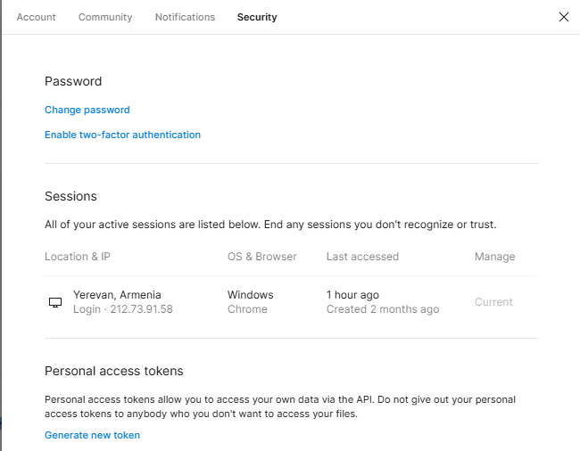
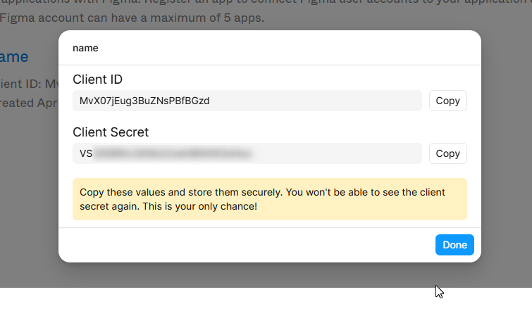
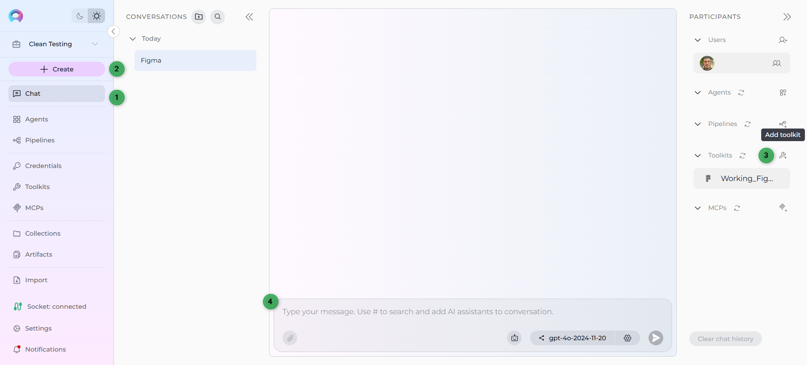

# ELITEA Toolkit Guide: Figma Integration

## Introduction

### Purpose of this Guide

This guide is your definitive resource for integrating and effectively utilizing the **Figma toolkit** within ELITEA. It provides a detailed, step-by-step walkthrough, from setting up your Figma API credentials to creating and configuring the toolkit in ELITEA and seamlessly incorporating it into your Agents, Pipelines, or other modules. By following this guide, you will unlock the power of automated design interaction, enhanced collaboration with design assets, all directly within the ELITEA platform. This integration empowers you to leverage AI-driven automation to optimize your workflows involving Figma designs, enhance design productivity, and improve design-related processes within your projects.

### Brief Overview of Figma

Figma is a leading cloud-based design platform for collaborative interface design. It is widely used by designers and teams to create, prototype, and share user interface and user experience designs. Key features of Figma include:

*   **Collaborative Design:** Figma enables real-time collaboration, allowing multiple users to work on the same design file simultaneously, fostering teamwork and efficient design iterations.
*   **Vector Graphics and Prototyping:** Provides powerful vector graphics editing tools and robust prototyping capabilities to create interactive and realistic design mockups.
*   **Web-Based Platform:** As a web-based application, Figma is accessible from any modern web browser across different operating systems, facilitating seamless access and collaboration.
*   **Version History and Team Libraries:** Maintains a comprehensive version history of design files and enables the creation of shared team libraries for reusable design components and styles, ensuring design consistency and efficient asset management.

Integrating Figma with ELITEA brings these powerful design collaboration and management capabilities directly into your AI-driven workflows. Your ELITEA Agents can then intelligently interact with your Figma design files and assets to automate design-related tasks, enhance design workflows, improve design asset management, and leverage AI to optimize your entire design lifecycle within Figma.

## Toolkit Account Setup and Configuration in Figma

!!! note "Note"
    The credentials you create in this section will be used when creating your Figma toolkit in ELITEA. This is part of the **[Create Credentials](#step-1-create-figma-credentials)** step in the integration workflow.

### Account Setup

To use the Figma Toolkit, you will need an active Figma account. To set up your Figma account, follow these steps:

1.  **Visit Figma Website:** Open your web browser and navigate to the official Figma website: [https://www.figma.com/](https://www.figma.com/).


2.  **Get Started for Free or Log In:** Click on the **"Get started for free"** button to create a new account or use the **"Log in"** option if you have an existing Figma account.


3.  **Follow Registration Process:** Follow the on-screen instructions to complete the registration process and create your Figma account. You can sign up using your email address or connect with your Google account.

    

4.  **Access Figma Home Page:** Once your account is created and verified, you will be redirected to your Figma home page.

### Token/API Key Generation: Creating a Figma Personal Access Token

For secure integration with ELITEA, user will need to use a Figma **Personal Access Token**.

**Follow these steps to generate a Figma Personal Access Token:**

1.  **Access Figma Settings:** In Figma, click on your profile icon (typically your avatar or initials) located in the top left corner of the Figma interface and navigate to **"Settings"**. **Note:** Ensure you have the correct Figma account selected if you are logged into multiple Figma accounts.

    

2.  **Navigate to Security Tab:** In the Settings menu, click on the **"Security"** tab.


3.  **Generate New Personal Access Token:** Scroll down to the "Personal access tokens" section and click on the **"Generate new token"** button.

    

4.  **Configure Token Permissions (If Required):** In the "New personal access token" window, enter a **Token name** to identify the token (e.g., "ELITEA Integration Token").  **Note:** While the documentation mentions selecting permissions for comment posting, the Figma Personal Access Tokens currently have broad access and specific permission scopes are not configurable during token creation through the UI. Ensure you understand the access granted by Personal Access Tokens.  You can set an **Expiration date** for the token if desired for security best practices.

    

5.  **Create Token:** Click the **"Generate token"** button to create the Personal Access Token.

6.  **Securely Copy and Store Your API Token:**  A dialog box will appear displaying your newly generated Personal Access Token. **Immediately copy the generated API token**. **This is the only time you will see the full token value.** Store it securely in a password manager or, preferably, ELITEA's built-in Secrets feature for enhanced security within ELITEA. You will need this API token to configure the Figma toolkit in ELITEA.

**Additional Information on Figma Access Tokens:**

!!! info "Additional Information"
    For more detailed information on managing Figma Personal Access Tokens, refer to the official Figma documentation: [figma.com/Manage-personal-access-tokens](https://help.figma.com/hc/en-us/articles/8085703771159-Manage-personal-access-tokens)

### OAuth 2.0 Setup for Figma (Application-Specific Authentication)

For more secure and application-specific authentication, you can also configure OAuth 2.0 for the Figma Toolkit. This method is generally recommended for applications and integrations that require more granular control over access and user authorization.

**Follow these steps to set up OAuth 2.0 for Figma:**

1.  **Access Figma Developers Apps Page:** Open your web browser and navigate to the Figma Developers Apps page: [figma.com/developers/apps](https://www.figma.com/developers/apps). Ensure you are logged in with the correct Figma account.


2.  **Create a New App:** Click on the **"Create new app"** button.

    

3.  **Configure App Details:** In the "Create a new app" dialog:
      *   **App name:** Enter a descriptive name for your application (e.g., "ELITEA Figma Integration").
      *   **Website URL:** Enter the website URL of your ELITEA instance or a placeholder URL if you don't have a specific website for your integration.
      *   **Logo:** Upload a logo for your application.
      *   Click **"Create"**.

    

4.  **Obtain Client ID and Client Secret:** After creating the app, you will be provided with a **Client ID** and **Client Secret**. **Securely keep these credentials.** You will need them to configure OAuth 2.0 authentication in ELITEA.

    

5.  **Configure Redirect URL:** Click on the name of your newly created app to access its settings. Navigate to the **"OAuth 2.0 redirect URLs"** section and click **"Add redirect URL"**. Enter the appropriate **Redirect URL** for your instance.  **Note:** The Redirect URL depends on how your third-party app handles OAuth 2.0 flows and might require specific configuration within your third-party app.

    

6.  **Obtain OAuth 2.0 Token (through ELITEA):** To obtain an OAuth 2.0 token, you will typically need to initiate the OAuth 2.0 flow from within your third-party app using your configured Client ID, Client Secret, and Redirect URL. The exact steps for obtaining the OAuth 2.0 token will depend on your integration implementation with Figma. Refer to [figma.com/oauth-with-plugins](https://www.figma.com/plugin-docs/oauth-with-plugins/) for instructions on completing the OAuth 2.0 authorization flow and obtaining the OAuth 2.0 token for Figma.

## System Integration with ELITEA

To integrate Figma with ELITEA, you need to follow a three-step process: **Create Credentials → Create Toolkit → Use in Agents**. This workflow ensures secure authentication and proper configuration.

### Step 1: Create Figma Credentials

Before creating a toolkit, you must first create Figma credentials in ELITEA:

1. **Navigate to Credentials Menu:** Open the sidebar and select **Credentials**.
2. **Create New Credential:** Click the **`+ Create`** button.
3. **Select Figma:** Choose **Figma** as the credential type.
4. **Configure Credential Details:**
     * **Display Name:** Enter a descriptive name (e.g., "Figma - Design Team Access")
     * **Authentication Method:** Choose your preferred authentication method:
         * **Token:** Enter your Figma Personal Access Token (starts with `figd_`)
         * **OAuth2:** Enter your OAuth2 token obtained through the OAuth 2.0 flow
     * **Shared Credential:** Check the **Shared** checkbox if you want this credential to be accessible by all team members in the current project
5. **Save Credential:** Click **Save** to create the credential.

!!! tip "Security Recommendation"
    It's highly recommended to use **Secrets** for tokens instead of entering them directly. Create a secret first, then reference it in your credential configuration.

!!! note "Reference"
    For detailed instructions on creating credentials, refer to the [Credentials Guide](../../how-tos/how-to-use-credentials.md#figma-credential-setup).

 

### Step 2: Create Figma Toolkit

Once your credentials are configured, create the Figma toolkit:

1. **Navigate to Toolkits Menu:** Open the sidebar and select **Toolkits**.
2. **Create New Toolkit:** Click the **`+ Create`** button.
3. **Select Figma:** Choose **Figma** from the list of available toolkit types.
4. **Configure Toolkit Details:**
     * **Name:** Enter a descriptive name for your toolkit (e.g., "Design Asset Manager")
     * **Description:** Provide a brief description (e.g., "Toolkit for accessing and managing Figma design files")

     

5. **Configure Credentials:** 
     * In the **Configuration** section, select your previously created Figma credential from the **Credentials** dropdown
6. **Configure Advanced Options (Optional):**
     * **Global Regexp:** Enter a Regular Expression to filter results from Figma API responses (leave blank for no filtering)
     * **Global Limit:** Set a character limit for API responses to ensure manageable content size
     * **PgVector Configuration:** If available, select a PgVector connection for vector database integration
     * **Embedding Model:** Select an embedding model for text processing and semantic search capabilities
7. * **Enable Desired Tools:** In the **"Tools"** section, select the checkboxes next to the specific Figma tools you want to enable. **Enable only the tools your agents will actually use** to follow the principle of least privilege
8. **Save Toolkit:** Click **Save** to create the toolkit.

     


**Available Tools:**

The Figma toolkit provides the following tools for interacting with Figma design files and managing design data:

| **Tool Name** | **Description** | **Primary Use Case** |
|---------------|-----------------|----------------------|
| **Get file** | Retrieves the complete details and structure of a Figma file | Access comprehensive file structure for analysis and data extraction |
| **Get file comments** | Retrieves all comments from a Figma file | Access feedback, discussions, and review threads for collaboration analysis |
| **Get file images** | Extracts images and visual assets from a Figma file | Export design assets for documentation, presentations, or development |
| **Get file nodes** | Retrieves specific design elements (frames, layers, groups) from a Figma file | Analyze specific design components and their properties |
| **Get file versions** | Retrieves the version history of a Figma file | Track design evolution, compare versions, and analyze changes over time |
| **Get project files** | Lists all files within a specific Figma project | Discover and organize design files within project contexts |
| **Get team projects** | Retrieves a list of projects within a Figma team | Get organizational overview and manage team-level design assets |
| **Index data** | Creates searchable indexes of Figma design content | Enable advanced search and discovery across design files |
| **List collections** | Lists available design collections and libraries | Organize and access design system components and shared assets |
| **Post file comment** | Adds a new comment to a Figma file | Provide automated feedback, annotations, or notifications |
| **Remove index** | Removes previously created search indexes | Clean up and manage indexed design data |
| **Search index** | Performs searches across indexed Figma content | Find specific design elements, components, or content across files |
| **Stepback search index** | Performs advanced contextual searches with broader scope | Execute sophisticated searches with expanded context and relevance |
| **Stepback summary index** | Creates comprehensive summaries of indexed design content | Generate intelligent summaries of design files and collections |


### Step 3: Use Toolkit in Agents, Pipelines, or Chat

Now you can add the configured Figma toolkit to your agents, pipelines, or use it directly in chat:

**For Agents:**

1. **Navigate to Agents:** Open the sidebar and select **Agents**.
2. **Create or Edit Agent:** Either create a new agent or select an existing agent to edit.
3. **Add Figma Toolkit:** 
     * In the **"Tools"** section of the agent configuration, click the **"+Toolkit"** icon
     * Select your configured Figma toolkit from the dropdown list
     * The toolkit will be added to your agent with the previously configured tools enabled


Your agent now interact with Figma using the configured toolkit and enabled tools.

!!! note "Reference"
    For more information on toolkit configuration and management, see the [Agent Guide](../../menus/agents.md).


**For Chat:**

1. **Navigate to Chat:** Open the sidebar and select **Chat** or use the main chat interface.
2. **Start New Conversation:** Click **+Create** or open an existing conversation.
3. **Add Toolkit to Conversation:**
     * In the chat Partisipants section, look for the **Toolkits** element
     * Click the **"Add Tools"** Icon to open the tools selection dropdown
     * Select your configured Figma toolkit from the dropdown list
     * The toolkit will be added to your conversation with all previously configured tools enabled
4. **Use Toolkit in Chat:** You can now directly interact with your Figma files by asking questions or requesting actions that will trigger the Figma toolkit tools.



**Example Chat Usage:**
```
"Please analyze the design file with key ABC123DEF456 and provide a summary of the main components used."

"Get all comments from the Figma file XYZ789 and identify any outstanding issues that need attention."

"Export images from nodes 123:456 and 789:012 in the design file DEF456GHI."
```

You can now interact with Figma using the configured toolkit and enabled tools.

!!! note "Reference"
    For more information on toolkit configuration and management, see the [Chat Guide](../../menus/chat.md).


### Key Parameters

**Common Parameters Used Across Tools:**

- **`file_key`** *(string, required for file-based tools)*: The unique identifier extracted from Figma file URLs
- **`node_ids`** *(string, optional)*: Comma-separated list of specific design element IDs
- **`team_id`** *(string, required for team tools)*: Figma team identifier  
- **`project_id`** *(string, required for project tools)*: Figma project identifier
- **`message`** *(string, required for comments)*: Content for posting comments
- **`query`** *(string, required for search tools)*: Search terms and criteria


### Figma Toolkit Functionalities

Once the Figma toolkit is successfully configured and added to your Agent, you can leverage the following tools within your Agent's instructions to enable intelligent interaction with Figma design files:

**How to Find Figma Project ID:**

For tools that require a **Project ID**, you can find it using both web and desktop versions:

**Web Version:**

1. **From Project URL:** When viewing a project in Figma, the Project ID is in the URL:
   ```
   https://www.figma.com/files/project/[PROJECT_ID]/[PROJECT_NAME]
   ```
   For example, from `https://www.figma.com/files/project/123456789/Design-System`, the Project ID is `123456789`.

2. **Using Browser Developer Tools:**
     * Open your browser's developer tools (F12)
     * Go to the Network tab
     * Navigate to your Figma project
     * Look for API calls that include the project ID in the URL

3. **From View Page Source:**
     * Right-click on the Figma project page and select "View Page Source"
     * Search for "projectId" or "project_id"(or folder_id) in the page source (Ctrl+F)
     * The Project ID(or folder_id) will appear in various JavaScript objects and API endpoint URLs within the page source

**Desktop App:**

1. **From File Location:** When you open a file in the desktop app, go to **File → Show in browser** to open the web version with the full URL containing project information
2. **From Project Navigation:** Navigate to your team/project view in the desktop app, then use **File → Copy link** or **Share** to get the project URL
3. **From File Properties:** Right-click on a file within a project and select **Copy link**, which may include project context in the URL
4. **Using Share Feature:** In project view, click **Share** and copy the project link to extract the Project ID

**Team-based Discovery:**

4. **From Figma API:** Use the `get_team_projects` tool to list all projects in a team, which will return project IDs along with project names.

    

**How to Find Figma File Key:**

To use the Figma tools, you'll need the **File Key** from your Figma file. You can extract it using either the web version or desktop app:

**Web Version:**
```
https://www.figma.com/file/[FILE_KEY]/[FILE_NAME]
```
For example, from `https://www.figma.com/file/ABC123DEF456/My-Design-File`, the File Key is `ABC123DEF456`.

**Desktop App:**

1. **From File Menu:** Open the file in Figma desktop app, go to **File → Copy link** or **File → Share**
2. **From Share Button:** Click the **Share** button in the top-right corner, then **Copy link**
3. **Extract from URL:** The copied link will have the same format as the web version: `https://www.figma.com/file/[FILE_KEY]/[FILE_NAME]`
4. **From Recent Files:** Right-click on a file in your recent files list and select **Copy link**

      


**How to Find Node IDs:**

Node IDs are required for tools that target specific design elements. Here's how to find them:

**Web Version:**

1. **Right-click Method:** Right-click on any design element (frame, component, layer) and select **Copy link**
2. **Extract from URL:** The copied URL contains the node ID: `https://www.figma.com/file/[FILE_KEY]/[FILE_NAME]?node-id=[NODE_ID]`
3. **From Layers Panel:** Select an element and use **Copy as** → **Copy link**

**Desktop App:**

1. **Right-click Method:** Right-click on any design element and select **Copy link**
2. **Layer Selection:** Select a layer in the layers panel, right-click, and choose **Copy link**
3. **Multiple Selection:** Select multiple elements while holding Ctrl (Windows) or Cmd (Mac), then right-click and **Copy link** to get multiple node IDs
4. **From Properties Panel:** With an element selected, you can sometimes see the node ID in the properties panel or developer tools

**Node ID Format:** Node IDs typically appear as `123:456` in the URL parameter `node-id=123%3A456` (where `%3A` is the URL-encoded colon).
 
  
s
**How to Find Figma Team ID:**

For the `get_team_projects` tool, you need a **Team ID**:

**Web Version:**

1. **From Team URL:** When viewing your team in Figma, the Team ID is in the URL:
   ```
   https://www.figma.com/files/team/[TEAM_ID]/[TEAM_NAME]
   ```

2. **From Organization Settings:** In your Figma organization settings, you can find the team ID in the team management section.

**Desktop App:**

1. **From Team Navigation:** Navigate to your team view in the desktop app, then use **File → Show in browser** to open the web version with the team URL
2. **From Share Team:** In team view, use the **Share** feature to get a team link containing the Team ID
3. **From Account Settings:** Access your account settings in the desktop app and navigate to team management where Team IDs may be displayed


## Instructions and Prompts for Using the Figma Toolkit

To effectively utilize the Figma toolkit within your ELITEA Agents, you need to provide clear and precise instructions within the Agent's "Instructions" field, telling the Agent *how* and *when* to use these tools.

**Important Notes:**
* Instructions highly depend on the information that can be retrieved from the Figma file, as well as its structure and content, which rely on the details provided by the designer when creating the Figma file.
* For better results, designers should provide valid and descriptive information, along with clear and meaningful names for components.
* For large files, utilize a "global regexp" filter to remove unnecessary data and focus only on the required information.

**General Instruction Structure:**

When instructing your Agent to use a Figma tool, you will typically follow this pattern:

```
Use the "[tool_name]" tool to [describe the action you want to perform] in Figma.
Parameters:
- File Key: [the_file_key_from_figma_url]
- Node ID: [node_id_if_required] (optional)

Output format (optional):
Provide the result in JSON format
```

**Detailed Instructions for All Figma Tools:**

**Get File Tool**

**Purpose:** Retrieve complete file structure and metadata
```
Use the "get_file" tool to retrieve the complete structure of the Figma design file.
Parameters:
- File Key: ABC123DEF456

Analyze the file structure and provide a summary of:
- Main pages and their purposes
- Frame hierarchy and organization
- Design system components used
- Overall file complexity and structure
```

**Get File Comments Tool**

**Purpose:** Access all comments and feedback on a file
```
Use the "get_file_comments" tool to retrieve all comments from the Figma file.
Parameters:
- File Key: ABC123DEF456

Analyze the comments to identify:
- Outstanding feedback that needs addressing
- Common design concerns or suggestions
- Collaboration patterns and review status
- Action items for the design team
```

**Get File Images Tool**

**Purpose:** Extract visual assets and images from designs
```
Use the "get_file_images" tool to extract images from the Figma file.
Parameters:
- File Key: ABC123DEF456
- Node IDs: 123:456,789:012 (optional - specific elements)
- Format: png (optional - image format)
- Scale: 2 (optional - export scale)

Export the images for:
- Documentation purposes
- Development handoff
- Presentation materials
- Asset library creation
```

**Get File Nodes Tool**

**Purpose:** Retrieve specific design elements and their properties
```
Use the "get_file_nodes" tool to get detailed information about specific design components.
Parameters:
- File Key: ABC123DEF456
- Node IDs: 123:456,789:012

Analyze the selected nodes for:
- Design properties (colors, typography, spacing)
- Component structure and variants
- Layout and positioning details
- Styling consistency across elements
```

**Get File Versions Tool**

**Purpose:** Track design evolution and version history
```
Use the "get_file_versions" tool to retrieve the version history of the Figma file.
Parameters:
- File Key: ABC123DEF456

Review the version history to:
- Track design evolution over time
- Identify major design milestones
- Compare changes between versions
- Understand design decision progression
```

**Get Project Files Tool**

**Purpose:** List and organize files within a project
```
Use the "get_project_files" tool to list all files in a specific project.
Parameters:
- Project ID: 123456789

Organize the project files by:
- File types and purposes
- Last modification dates
- Team collaboration status
- Project completion progress
```

**Get Team Projects Tool**

**Purpose:** Get overview of team's project structure
```
Use the "get_team_projects" tool to retrieve all projects within a team.
Parameters:
- Team ID: 987654321

Analyze team projects for:
- Project organization and structure
- Team workload distribution
- Active vs. completed projects
- Resource allocation insights
```

**Index Data Tool**

**Purpose:** Create searchable indexes for design content
```
Use the "index_data" tool to create searchable indexes of Figma content.
Parameters:
- File Key: ABC123DEF456
- Content types: components, text, styles (specify what to index)

Create indexes to enable:
- Fast content discovery
- Design system auditing
- Component usage tracking
- Text content analysis
```

**List Collections Tool**

**Purpose:** Access design system libraries and collections
```
Use the "list_collections" tool to retrieve available design collections and libraries.
Parameters:
- Team ID: 987654321

Review collections for:
- Design system components
- Shared asset libraries
- Style guide resources
- Component documentation
```

 **Post File Comment Tool**

**Purpose:** Add automated feedback and annotations
```
Use the "post_file_comment" tool to add comments to the design file.
Parameters:
- File Key: ABC123DEF456
- Message: "Automated accessibility review: Consider increasing color contrast ratio for better accessibility compliance."
- Client X: 100 (optional - x coordinate for comment placement)
- Client Y: 200 (optional - y coordinate for comment placement)

Use for automated:
- Design review feedback
- Accessibility audits
- Brand compliance checks
- Development notes
```

**Remove Index Tool**

**Purpose:** Clean up and manage indexed data
```
Use the "remove_index" tool to clean up previously created indexes.
Parameters:
- Index ID: index_abc123 (specify which index to remove)

Remove indexes when:
- Data is outdated
- Storage optimization is needed
- Index structure needs rebuilding
- Project cleanup is required
```

**Search Index Tool**

**Purpose:** Find specific content across indexed designs
```
Use the "search_index" tool to search through indexed Figma content.
Parameters:
- Query: "button primary blue" (search terms)
- Index ID: index_abc123 (which index to search)
- Limit: 10 (optional - number of results)

Search for:
- Specific design components
- Text content across files
- Style patterns and usage
- Component variations
```

**Stepback Search Index Tool**

**Purpose:** Advanced contextual search with broader scope
```
Use the "stepback_search_index" tool for sophisticated contextual searches.
Parameters:
- Query: "navigation components with accessibility features"
- Index ID: index_abc123
- Context depth: 3 (optional - search context expansion)

Use for complex searches requiring:
- Contextual understanding
- Related component discovery
- Pattern analysis across designs
- Comprehensive design audits
```

**Stepback Summary Index Tool**

**Purpose:** Generate intelligent summaries of indexed content
```
Use the "stepback_summary_index" tool to create comprehensive summaries.
Parameters:
- Index ID: index_abc123
- Summary type: "component_usage" (specify summary focus)
- Depth: detailed (optional - summary detail level)

Generate summaries for:
- Design system documentation
- Project overview reports
- Component usage analytics
- Design pattern analysis
```

**Best Practices for Tool Usage:**

1. **Start with Get File** - Always begin by understanding the overall file structure
2. **Use Specific Node IDs** - When possible, target specific elements rather than entire files
3. **Leverage Indexing** - For large projects, create indexes first, then search for efficiency
4. **Combine Tools** - Use multiple tools together for comprehensive analysis
5. **Filter Results** - Use Global Regexp and Global Limit settings to manage large responses

## Integration Helpdesk and Troubleshooting

### Troubleshooting Common Issues

1.  **Credential Not Appearing in Toolkit Configuration:**
    *   **Problem:** When creating a toolkit, your Figma credential doesn't appear in the credentials dropdown.
    *   **Troubleshooting Steps:**
        *   **Check Credential Scope:** Ensure you're working in the same workspace/project where the credential was created. Private credentials are only visible in your Private workspace, while project credentials are visible within the specific team project.
        *   **Verify Credential Creation:** Go to the Credentials menu and confirm that your Figma credential was successfully saved.
        *   **Credential Type Match:** Ensure you selected "Figma" as the credential type when creating the credential.

2.  **No File or Nodes Found Using Correct Request IDs:**
    *   **Problem:** Agent returns "No file found" or "No nodes found" even when you believe you are using the correct File Key and Node IDs.
    *   **Troubleshooting Steps:**
        *   **Verify Credentials:** Check that your Figma API credentials (Personal Access Token or OAuth 2.0 token) in the credential configuration are correct, valid, and not expired.
        *   **Account Access:** Make sure the Figma account associated with the token has access to the Figma file and the specified nodes. If the file is in a private Figma team or project, ensure the token has the necessary permissions.
        *   **File Key and ID Accuracy:** Verify the File Key and Node IDs are case-sensitive and match exactly. Copy them directly from the Figma UI to avoid typos.
        *   **File Visibility:** Ensure the Figma file sharing settings allow API access for your account.

3.  **Receiving Partial JSON or Incomplete Answers:**
    *   **Problem:** The Agent returns only a portion of the expected JSON response or provides incomplete answers based on Figma data.
    *   **Troubleshooting Steps:**
        *   **Increase Global Limit:** The toolkit configuration includes a "Global Limit" filter that restricts the character count of the output. **Try increasing the "Global Limit" value** in the toolkit configuration to a larger number (e.g., 5000, 10000, or higher).
        *   **Remove Global Limit (for testing):** Temporarily set the "Global Limit" to a very high value to see if you receive the full JSON response.

4.  **Getting Values Cut by Global Regex Filter:**
    *   **Problem:** You are receiving data, but certain values or sections seem to be missing or truncated due to the "Global Regexp" filter.
    *   **Troubleshooting Steps:**
        *   **Verify Global Regex:** Review the **"Global Regexp"** value in your toolkit configuration. Ensure the regular expression is correctly written and matches your intended filtering.
        *   **Test Regex:** Use online regex testers with example Figma API JSON responses to verify your regex pattern.
        *   **Refine or Remove Regex:** If the regex is cutting off desired data, refine it or temporarily remove it (leave blank) to see the full response.

5.  **Toolkit Connection Fails:**
    *   **Problem:** The toolkit fails to connect to Figma or encounters authentication errors.
    *   **Troubleshooting Steps:**
        *   **Check Token Validity:** Ensure your Personal Access Token or OAuth2 token is still valid and hasn't been revoked in Figma.
        *   **Verify Token Format:** Personal Access Tokens should start with "figd_". Ensure you've copied the complete token.
        *   **Network Connectivity:** Check that ELITEA can reach the Figma API endpoints.
        *   **Credential Configuration:** Verify that the credential is properly configured and selected in your toolkit.

6.  **Toolkit Fails to Post Comments:**
    *   **Problem:** The `post_file_comment` tool fails to post comments to Figma files.
    *   **Troubleshooting Steps:**
        *   **Check Permissions:** Ensure the account associated with the token has commenting permissions on the Figma file.
        *   **Verify Token Scope:** Confirm your Personal Access Token has the necessary permissions for commenting.
        *   **Test Manual Comment:** Try posting a comment manually in Figma with the same account to verify permissions.

## Support and Contact Information

### ELITEA Support Team

If you encounter persistent issues, have questions not covered in this guide, or require further assistance with the Figma Toolkit or ELITEA Agents, please do not hesitate to contact our dedicated ELITEA Support Team. We are here to help you resolve any problems quickly and efficiently and ensure you have a smooth and productive experience with ELITEA.

**How to Reach ELITEA Support:**

*   **Email:** **[SupportAlita@epam.com](mailto:SupportAlita@epam.com)**

**Best Practices for Effective Support Requests:**

To help us understand and resolve your issue as quickly as possible, please provide the following information in your support email:

*   **ELITEA Environment:** Clearly specify the ELITEA environment you are using (e.g., "Nexus").
*   **Project Details:** Indicate the **Project Name** and whether you are working in your **Private** workspace or a **Team** project.
*   **Detailed Issue Description:** Provide a clear, concise, and detailed description of the problem you are encountering. Explain what you were trying to do, what you expected to happen, and what actually occurred.
*   **Relevant Configuration Information:** To help us diagnose the issue, please include relevant configuration details, such as:
    *   **Credential Configuration (Screenshots):** If the issue involves credentials, include screenshots of your credential configuration (obscure sensitive information like tokens).
    *   **Toolkit Configuration (Screenshots):** Include screenshots of your Figma toolkit configuration settings, especially the "Credentials" and "Advanced Options" sections.
    *   **Agent Instructions (Screenshot or Text):** If the issue is with an Agent, provide a screenshot or copy the text of your Agent's "Instructions" field.
*   **Error Messages (Full Error Text):** If you are encountering an error message, please provide the **complete error text**. In the Chat window, expand the error details and copy the full error message. This detailed error information is crucial for diagnosis.
*   **Your Query/Prompt (Exact Text):** If the issue is related to Agent execution, provide the exact query or prompt you used to trigger the issue.
*   **Figma File Key and Node IDs (if applicable):** If the issue is related to accessing specific non-private Figma files or nodes, please provide the **Figma File Key** and the **Node IDs** you are using in your instructions.

**Before Contacting Support:**

We encourage you to first explore the resources available within this guide and the broader ELITEA documentation. You may find answers to common questions or solutions to known issues in the documentation.

---

## Summary

The Figma toolkit integration with ELITEA follows a streamlined three-step workflow:

1. **🔐 Create Credentials** - Set up secure authentication with your Figma Personal Access Token or OAuth2 token
2. **🔧 Create Toolkit** - Configure the Figma toolkit using your credentials and enable the tools you need
3. **🚀 Use in Modules** - Add the toolkit to Agents, Pipelines, and use them directly in Chat for automated design workflows

This integration enables your AI agents to interact intelligently with Figma design files, automate design-related tasks, and enhance collaboration within your design workflows. By following the principle of least privilege and enabling only the tools you need, you maintain both security and performance while unlocking powerful design automation capabilities.

!!! reference "Useful ELITEA Resources"
    To further enhance your understanding and skills in using the Figma toolkit with ELITEA, here are helpful internal resources:

      * **[ELITEA Credentials Management](../../how-tos/how-to-use-credentials.md)** - *Learn how to securely store your Figma API Token using ELITEA's Credentials management feature for enhanced security within ELITEA.*
      * **[ELITEA Toolkits Guide](../../menus/toolkits.md)** - *Comprehensive guide on creating and managing toolkits in ELITEA, including advanced configuration options.*
      * **[ELITEA Agents Configuration](../../menus/agents.md)** - *Find out more about creating and configuring Agents in ELITEA, where you integrate the Figma toolkit to automate your design workflows.*
      * **[ELITEA Secrets Management](../../menus/settings/secrets.md)** - *Learn how to securely store sensitive information like API tokens using ELITEA's Secrets management feature.*
      * **[Create a Credential and Add It to a Toolkit](../../getting-started/create-credential.md)** - *Step-by-step guide for the credentials and toolkit creation workflow.*
      * **[Indexing Overview](../../how-tos/indexing/indexing-overview.md)** - *Comprehensive guide to understanding ELITEA's indexing capabilities and how to leverage them for enhanced search and discovery.*
      * **[Index Figma Data](../../how-tos/indexing/index-figma-data.md)** - *Detailed instructions for indexing Figma design files to enable advanced search, analysis, and AI-powered insights across your design assets.*

!!! reference "External Resources"
    *   **Figma Website:** [https://www.figma.com/](https://www.figma.com/) - *Access the main Figma product website for product information, documentation, tutorials, and community resources.*
    *   **Figma for Developers Documentation:** [https://www.figma.com/developers/api](https://www.figma.com/developers/api) - *Explore the official Figma API documentation for detailed information on Figma API endpoints, authentication, data structures, and developer guides.*
    *   **Figma OAuth 2.0 Documentation:** [https://www.figma.com/plugin-docs/oauth-with-plugins/](https://www.figma.com/plugin-docs/oauth-with-plugins/) - *Learn more about implementing OAuth 2.0 authentication for Figma applications and integrations.*
    *   **Figma Help Center:** [https://help.figma.com/hc/en-us](https://help.figma.com/hc/en-us) - *Access the official Figma Help Center for comprehensive articles, FAQs, and troubleshooting guides on all aspects of Figma usage.*