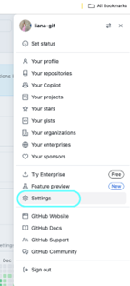
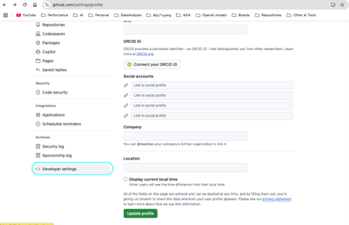
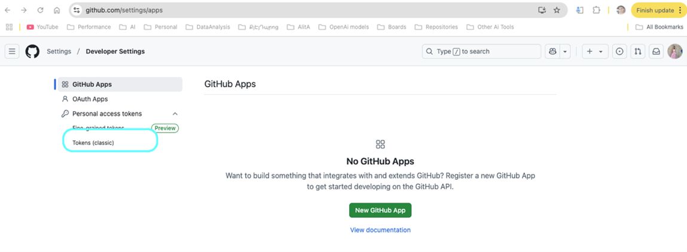
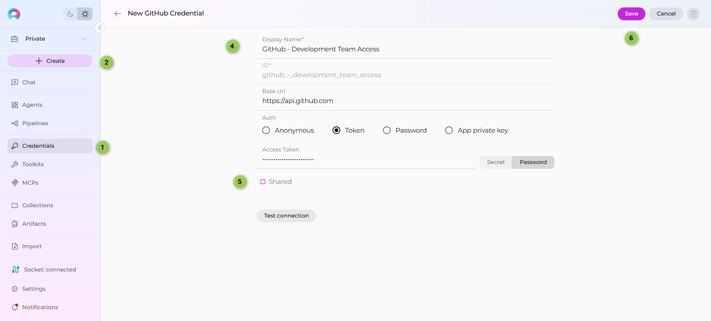
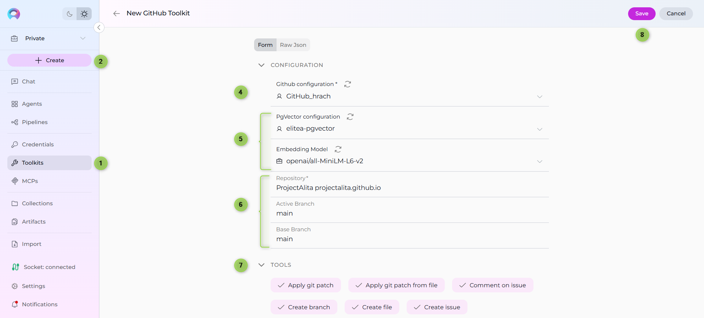
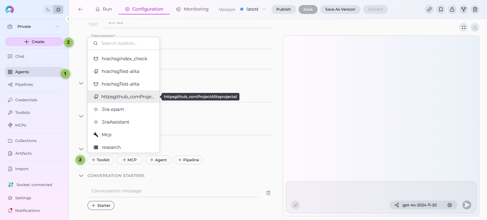
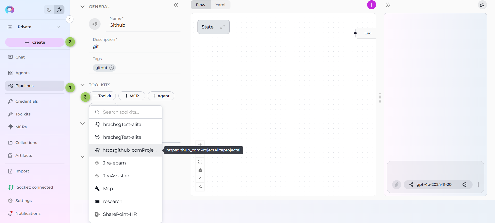
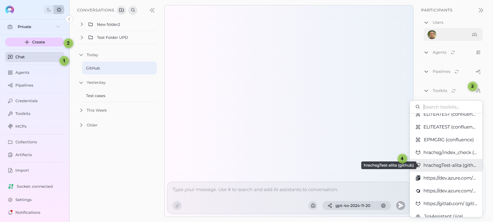

# ELITEA Toolkit Guide: GitHub Integration

## Introduction

### Purpose of this Guide

This guide is your definitive resource for integrating and utilizing the **GitHub toolkit** within ELITEA. It provides a comprehensive, step-by-step walkthrough, from generating a GitHub Personal Access Token to configuring the toolkit in ELITEA and effectively using it within your Agents. By following this guide, you will unlock the power of automated code management, streamlined development workflows, and enhanced team collaboration, all directly within the ELITEA platform. This integration empowers you to leverage AI-driven automation to optimize your software development lifecycle using the combined strengths of ELITEA and GitHub.

### Brief Overview of GitHub

GitHub is the world's leading web-based platform for version control, collaboration, and software development.  It is built around Git and provides a rich ecosystem for developers to host, manage, and collaborate on code. GitHub is essential for modern software development, offering features for:

*   **Robust Version Control:** Leveraging Git, GitHub meticulously tracks every change to your code, enabling seamless collaboration, easy rollback to previous states, and a complete history of project evolution.
*   **Streamlined Code Collaboration:** Facilitate effective teamwork with features like pull requests for code review, in-line commenting, and branch-based development workflows, fostering a collaborative coding environment.
*   **Centralized Code Hosting:** Provides a secure, reliable, and globally accessible platform for hosting and managing your Git repositories, ensuring code availability and integrity.
*   **Powerful Workflow Automation (GitHub Actions):** Enables you to automate your software development lifecycle with GitHub Actions, including building, testing, and deploying code directly from your repositories.
*   **Issue Tracking and Project Management:** Integrated issue tracking and project management tools help teams organize tasks, track bugs, and manage projects directly within the GitHub platform.

Integrating GitHub with ELITEA brings these powerful development capabilities directly into your AI-driven workflows. Your ELITEA Agents can then interact with your GitHub repositories to automate code-related tasks, enhance development processes, and improve team collaboration through intelligent automation, making your development workflows smarter and more efficient.

## Toolkit's Account Setup and Configuration in GitHub

### Account Setup

If you don't already have a GitHub account, follow these steps to create one:

1.  **Visit GitHub Website:** Open your web browser and go to [github.com](https://github.com).
2.  **Sign Up:** Click on the **"Sign up"** button, located in the top right corner of the homepage.
3.  **Enter Details:** Follow the on-screen instructions to create your account. You will need to choose a username, provide your email address, and create a strong password.
4.  **Verify Email:** Check your inbox for a verification email from GitHub. Click the verification link in the email to activate your account.
5.  **Log In:** Once your email is verified, log in to GitHub using your newly created username and password.

### Token/API Key Generation: Creating a Personal Access Token (Classic) in GitHub

For secure integration with ELITEA, it is essential to use a GitHub **Personal Access Token (Classic)**. This method is significantly more secure than using your primary GitHub account password directly and allows you to precisely control the permissions granted to ELITEA.

**Follow these steps to generate a Personal Access Token (Classic) in GitHub:**

1.  **Log in to GitHub:** Access your GitHub account at [github.com](https://github.com).
2.  **Access Settings:** Click on your profile avatar in the top right corner and then click on **"Settings"**.
3.  **Navigate to Developer Settings:** In the left-hand sidebar, scroll down and click on **"Developer settings"**.
4.  **Access Personal Access Tokens (Classic):** In the left-hand sidebar under "Personal access tokens," click on **"Tokens (classic)"**.
5.  **Generate New Token:** Click the **"Generate new token (classic)"** button.
    *   **Note:** If you have previously created tokens, you might see a "Generate new token" button instead.
6.  **Provide Token Details:**
    *   **Note (Description):** In the "Note" field, enter a descriptive label for your token, such as "ELITEA Integration" or "ELITEA Agent Access." This will help you easily identify the purpose of this token in the future.
    *   **Expiration (Recommended):** For enhanced security, it is highly recommended to set an **Expiration** date for your token. Choose a reasonable validity period to limit the token's lifespan. If compromised, a token with a shorter lifespan poses less risk.
    *   **Select Scopes - Grant Least Privilege (Crucial for Security):** Carefully and deliberately select the **scopes** or permissions you grant to this token. **It is paramount to grant only the absolute minimum necessary permissions** required for your ELITEA Agent's intended interactions with GitHub. Overly permissive tokens pose a significant security risk. For typical ELITEA integration, consider these minimal scopes:
        *   **Minimal Scopes for Common Use Cases:**
            *   **repo** (For full access to private and public repositories. If possible, select more granular `repo` scopes instead of full `repo`):
                *   **repo:status** (Access commit statuses)
                *   **public_repo** (Access public repositories)
            *   **workflow** (Access GitHub Actions workflows if your Agent needs to interact with workflows)
            *   **read:user** (To read user profile information, often needed for basic interactions)

        *   **Additional Scopes for Specific Functionality (Grant only if needed):**
            *   **issues** (To access and manage issues)
            *   **pull_request** (To access and manage pull requests)
            *   **gist** (To access gists, if your Agent needs to work with gists)
            *   **read:org** (To read organization membership and information, if your Agent needs organization-level access)

    **Important Security Practices:**
        
    *   **Principle of Least Privilege:**  **Strictly adhere to the principle of least privilege.** Grant only the scopes that are absolutely essential for your ELITEA Agent to perform its intended tasks.
    *   **Avoid "admin" or Broad Scopes:** **Never grant "admin" or overly broad permissions unless absolutely necessary and with a clear understanding of the security implications.**  Broad scopes significantly increase the potential security impact if the token is compromised.
    *   **Regular Token Review and Rotation:** Regularly review the tokens you have generated and their associated scopes. Rotate tokens periodically (generate new ones and revoke old ones) as a security best practice, especially for sensitive integrations.

8.  **Generate Token:** Click the **"Generate token"** button at the bottom of the page.
9.  **Securely Copy and Store the Personal Access Token:**  **Immediately copy the generated token** that is displayed on the next page. **This is the only time you will be able to see and copy the full token value.** Store it securely using a robust password manager or, preferably, ELITEA's built-in Secrets feature for enhanced security within the ELITEA platform. You will need this token to configure the GitHub toolkit in ELITEA.






### Authentication Using a GitHub App (Private Key)

For more granular control and enhanced security, especially in organizational or automated contexts, using a GitHub App for authentication is the recommended approach. This method authenticates as the app itself, not as a user, and its permissions are precisely defined within the app's settings.

!!! note "Integration with ELITEA"
    Once you create a GitHub App and generate its private key, you'll use these credentials when creating your GitHub credential in ELITEA (Step 1 of the integration process).

#### Step 1: Create and Configure a GitHub App

1.  **Navigate to Developer Settings:** Log in to your GitHub account, click your profile photo in the top-right corner, and go to **Settings** > **Developer settings**.
2.  **Register a New App:** Select **GitHub Apps** from the left-hand menu and click **New GitHub App**.
3.  **Fill in App Details:**
    *   **App Name:** Enter a unique name for your application (e.g., "ELITEA Integration App").
    *   **Homepage URL:** Provide a valid URL. A placeholder like `https://www.example.com` is sufficient if you don't have a dedicated homepage.
4.  **Configure Permissions:** This is the most critical step. Scroll down to the **"Permissions"** section. For the toolkit to function correctly, you must grant the following permissions. Under **Repository permissions**, set the following:
    *   **Actions:** Read & Write
    *   **Contents:** Read & Write
    *   **Issues:** Read & Write
    *   **Metadata:** Read-only (This is a minimum requirement)
    *   **Pull requests:** Read & Write
    *   **Projects:** Read & Write
5.  **Set Installation Options:** Under **"Where can this GitHub App be installed?"**, choose **"Only on this account"** for private use.
6.  **Create the App:** Click **Create GitHub App** at the bottom of the page.

#### Step 2: Generate Private Key and Install the App

After creating the app, you will be redirected to its settings page.

1.  **Generate a Private Key:**
    *   Scroll down to the **"Private keys"** section.
    *   Click **Generate a private key**.
    *   A `.pem` file will be immediately downloaded to your computer. **This is your private key. Treat it like a password and store it securely.** You will only be able to download it once.

2.  **Get the App ID:**
    *   Note the **App ID** displayed at the top of your GitHub App's settings page. You'll need this along with the private key when creating your ELITEA credential.

3.  **Install the App:**
    *   In your GitHub App's settings, click the **Install App** tab in the left sidebar.
    *   Click **Install** next to your organization or personal account.
    *   On the next screen, you can choose to install the app on **All repositories** or **Only select repositories**.
    *   Click **Install** to complete the process. The app can now interact with the selected repositories.

!!! note "Next Steps"
    Once you have created your GitHub App and generated the private key, you can use these credentials when creating your GitHub credential in ELITEA. Choose the **App Private Key** authentication method in Step 1 of the System Integration process.

## System Integration with ELITEA

To integrate GitHub with ELITEA, you need to follow a three-step process: **Create Credentials → Create Toolkit → Use in Agents**. This workflow ensures secure authentication and proper configuration.

### Step 1: Create GitHub Credentials

Before creating a toolkit, you must first create GitHub credentials in ELITEA:

1. **Navigate to Credentials Menu:** Open the sidebar and select **Credentials**.
2. **Create New Credential:** Click the **`+ Create`** button.
3. **Select GitHub:** Choose **GitHub** as the credential type.
4. **Configure Credential Details:**
     * **Display Name:** Enter a descriptive name (e.g., "GitHub - Development Team Access")
     * **Base URL:**
         - GitHub.com: leave empty to use the default `https://api.github.com`.
         - GitHub Enterprise Server: set your REST v3 endpoint, for example `https://<your-ghes-domain>/api/v3`.
     * **Authentication Method:** Choose your preferred authentication method:
         * **Anonymous:** No authentication required (limited to public repositories and rate-limited)
         * **Token:** Enter your GitHub Personal Access Token (recommended)
         * **Password:** Enter your GitHub username and password (not recommended)
         * **App Private Key:** Enter GitHub App ID and private key for app-based authentication
5. **Shared Credential:** Check the **Shared** checkbox if you want this credential to be accessible by all team members in the current project
6. **Save Credential:** Click **Save** to create the credential. After saving, your GitHub credential will be added to the credentials dashboard and will be ready to use in toolkit configurations. You can view, edit, or delete it from the **Credentials** menu at any time.

!!! info "GitHub.com vs GitHub Enterprise (Endpoints)"
    When configuring GitHub credentials, the Base URL depends on whether you use GitHub.com or a self‑hosted GitHub Enterprise Server (GHES).

    | API | Enterprise | GitHub.com |
    | --- | --- | --- |
    | v3 (REST) | `https://[YOUR_HOST]/api/v3` | `https://api.github.com` |
    | v4 (GraphQL) | `https://[YOUR_HOST]/api/graphql` | `https://api.github.com/graphql` |

    - For **GitHub.com**: Leave the Base URL blank to use the default `https://api.github.com`.
    - For **GitHub Enterprise Server**: Set the Base URL to your REST v3 endpoint (example: `https://ghe.company.com/api/v3`). GraphQL requests use `https://ghe.company.com/api/graphql`.
    - Ensure your token scopes match your use case (e.g., `repo`, `workflow`, `read:org`) and that your GHES certificate is trusted by your environment.




!!! tip "Security Recommendation"
    Use **[Secrets](../../menus/settings/secrets.md)** for sensitive authentication data (tokens, passwords, and private keys) instead of entering values directly. Create a secret first, then reference it in your credential configuration.

### Step 2: Create GitHub Toolkit

Once your credentials are configured, create the GitHub toolkit:

1. **Navigate to Toolkits Menu:** Open the sidebar and select **Toolkits**.
2. **Create New Toolkit:** Click the **`+ Create`** button.
3. **Select GitHub:** Choose **GitHub** from the list of available toolkit types.
4. **Configure Credentials:** 
     * In the **Configuration** section, select your previously created GitHub credential from the **Credentials** dropdown
5. **Configure Advanced Options:**
     * **PgVector Configuration:** Select a PgVector connection for vector database integration
     * **Embedding Model:** Select an embedding model for text processing and semantic search capabilities
6. **Configure Repository Settings:**
     * **Repository:** Enter the repository name in the format `owner/repository-name` (e.g., `MyOrg/my-project`)
     * **Main Branch:** Specify the main branch name (typically `main` or `master`)
     * **Active Branch:** Set the active working branch (defaults to `main`)
7. **Enable Desired Tools:** In the **"Tools"** section, select the checkboxes next to the specific GitHub tools you want to enable. **Enable only the tools your agents will actually use** to follow the principle of least privilege
8. **Save Toolkit:** Click **Save** to create the toolkit.



#### Available Tools:

The GitHub toolkit provides the following tools for interacting with GitHub repositories and managing development workflows, organized by functional categories:

| **Tool Category** | **Tool Name** | **Description** | **Primary Use Case** |
|:-----------------:|---------------|-----------------|----------------------|
| **Issue Management** | | | |
| | **Get issues** | Retrieves a list of issues from the repository | View all issues for project management and task tracking |
| | **Get issue** | Retrieves details of a specific issue by number | Access detailed information about a particular issue |
| | **Search issues** | Searches for issues based on keywords and criteria | Find issues related to specific topics, bugs, or features |
| | **Create issue** | Creates a new issue in the repository | Automate bug reporting and task creation |
| | **Update issue** | Updates an existing issue's properties | Modify issue status, labels, assignees, and other attributes |
| | **Comment on issue** | Adds a comment to an existing issue | Provide automated updates and feedback on issues |
| **Pull Request Management** | | | |
| | **List open pull requests** | Lists all currently open pull requests | Monitor pending code changes and review requests |
| | **Get pull request** | Retrieves details of a specific pull request | Access comprehensive information about a PR |
| | **List pull request diffs** | Lists files changed in a pull request | Review code changes and assess impact of modifications |
| | **Create pull request** | Creates a new pull request | Automate the code review and integration process |
| **File Operations** | | | |
| | **Create file** | Creates a new file in the repository | Generate code files, documentation, or configuration files |
| | **Read file** | Reads the content of a specific file | Access file content for analysis or processing |
| | **Update file** | Updates the content of an existing file | Modify code, documentation, or configuration files |
| | **Delete file** | Deletes a file from the repository | Remove obsolete or unnecessary files |
| | **List files in main branch** | Lists all files in the main branch | Browse repository structure and discover files |
| | **List files in bot branch** | Lists files in the active working branch | View files in the current development branch |
| | **Get files from directory** | Retrieves files from a specific directory | Access files within particular folder structures |
| **Branch Management** | | | |
| | **List branches in repo** | Lists all branches in the repository | Manage and overview repository branching structure |
| | **Set active branch** | Sets the active working branch for operations | Control which branch file operations target |
| | **Create branch** | Creates a new branch from a base branch | Set up new development branches for features or fixes |
| **Version Control** | | | |
| | **Get commits** | Retrieves commit history and information | Analyze repository history and track changes |
| | **Get commit changes** | Gets detailed changes for a specific commit | Review what was modified in a particular commit |
| | **Get commits diff** | Compares changes between two commits | Analyze differences between code versions |
| | **Apply git patch** | Applies a git patch to the repository | Automate code changes using patch format |
| | **Apply git patch from file** | Applies a git patch from an artifact file | Apply pre-generated patches from stored files |
| **Workflow Automation** | | | |
| | **Trigger workflow** | Triggers a GitHub Actions workflow | Automate CI/CD and other repository workflows |
| | **Get workflow status** | Retrieves the status of a workflow run | Monitor automated workflow execution |
| | **Get workflow logs** | Gets logs from a workflow execution | Debug and analyze workflow performance |
| **Project Management** | | | |
| | **Create issue on project** | Creates an issue within a GitHub project board | Manage project-specific issue creation with custom fields |
| | **Update issue on project** | Updates an issue within a GitHub project board | Modify project-specific issue properties and custom fields |
| | **List project issues** | Lists all issues in a GitHub project | View project-specific issue collections with custom fields |
| | **Search project issues** | Searches for issues within a GitHub project | Find specific issues within project contexts |
| **Indexing & Search** | | | |
| | **Index data** | Creates searchable indexes of GitHub repository content | Enable advanced search and discovery across repository files |
| | **List collections** | Lists available indexed collections in the repository | View and manage indexed data collections |
| | **Remove index** | Removes previously created search indexes | Clean up and manage indexed repository data |
| | **Search index** | Performs searches across indexed repository content | Find specific code, comments, or content across the repository |
| | **Stepback search index** | Performs advanced contextual searches with broader scope | Execute sophisticated searches with expanded context |
| | **Stepback summary index** | Creates comprehensive summaries of indexed repository content | Generate intelligent summaries of code and repository information |
| **Advanced Operations** | | | |
| | **Generic github api call** | Makes custom calls to the GitHub API | Access any GitHub API endpoint not covered by specific tools |

### Step 3: Use Toolkit in Agents, Pipelines, or Chat

Now you can add the configured GitHub toolkit to your agents, pipelines, or use it directly in chat:

**For Agents:**

1. **Navigate to Agents:** Open the sidebar and select **[Agents](../../menus/agents.md)**.
2. **Create or Edit Agent:** Either create a new agent or select an existing agent to edit.
3. **Add GitHub Toolkit:** 
     * In the **"Tools"** section of the agent configuration, click the **"+Toolkit"** icon
     * Select your configured GitHub toolkit from the dropdown list
     * The toolkit will be added to your agent with the previously configured tools enabled

Your agent can now interact with GitHub using the configured toolkit and enabled tools.




**For Pipelines:**

1. **Navigate to Pipelines:** Open the sidebar and select **[Pipelines](../../menus/pipelines.md)**.
2. **Create or Edit Pipeline:** Either create a new pipeline or select an existing pipeline to edit.
3. **Add GitHub Toolkit:** 
     * In the **"Tools"** section of the pipeline configuration, click the **"+Toolkit"** icon
     * Select your configured GitHub toolkit from the dropdown list
     * The toolkit will be added to your pipeline with the previously configured tools enabled

     


**For Chat:**

1. **Navigate to Chat:** Open the sidebar and select **[Chat](../../menus/chat.md)**.
2. **Start New Conversation:** Click **+Create** or open an existing conversation.
3. **Add Toolkit to Conversation:**
     * In the chat Participants section, look for the **Toolkits** element
     * Click the **"Add Tools"** Icon to open the tools selection dropdown
     * Select your configured GitHub toolkit from the dropdown list
     * The toolkit will be added to your conversation with all previously configured tools enabled
4. **Use Toolkit in Chat:** You can now directly interact with your GitHub repositories by asking questions or requesting actions that will trigger the GitHub toolkit tools.
    * **Example Chat Usage:**
        - Please list all open issues in the repository that are labeled as 'bug' and 'high-priority'."
        - Create a new branch called 'feature-user-authentication' from the main branch."
        - Show me the recent commits in the main branch and summarize what changes were made."
        - Create a pull request to merge the 'feature-login' branch into 'develop' with the title 'Add user login functionality'."




## Instructions and Prompts for Using the GitHub Toolkit

To effectively instruct your ELITEA Agent to use the GitHub toolkit, you need to provide clear and precise instructions within the Agent's "Instructions" field. These instructions are crucial for guiding the Agent on *when* and *how* to utilize the available GitHub tools to achieve your desired automation goals.

### Instruction Creation for OpenAI Agents

When crafting instructions for the GitHub toolkit, especially for OpenAI-based Agents, clarity and precision are paramount. Break down complex tasks into a sequence of simple, actionable steps. Explicitly define all parameters required for each tool and guide the Agent on how to obtain or determine the values for these parameters. OpenAI Agents respond best to instructions that are:

*   **Direct and Action-Oriented:** Employ strong action verbs and clear commands to initiate actions. For example, "Use the 'read_file' tool...", "Create a branch named...", "List all open pull requests...".

*   **Parameter-Centric:** Clearly enumerate each parameter required by the tool. For each parameter, specify:
    *   Its name (exactly as expected by the tool)
    *   The format or type of value expected
    *   How the Agent should obtain the value – whether from user input, derived from previous steps in the conversation, retrieved from an external source, or a predefined static value

*   **Contextually Rich:** Provide sufficient context so the Agent understands the overarching objective and the specific scenario in which each GitHub tool should be applied within the broader workflow. Explain the desired outcome or goal for each tool invocation.

*   **Step-by-Step Structure:** Organize instructions into a numbered or bulleted list of steps for complex workflows. This helps the Agent follow a logical sequence of actions.

*   **Add Conversation Starters:** Include example conversation starters that users can use to trigger this functionality. For example, "Conversation Starters: 'Show me the README file', 'What's in the README.md?', 'Display the project documentation'"

When instructing your Agent to use a GitHub toolkit tool, adhere to this structured pattern:

1. **State the Goal:** Begin by clearly stating the objective you want to achieve with this step. For example, "Goal: To retrieve the content of the 'README.md' file."

2. **Specify the Tool:** Clearly indicate the specific GitHub tool to be used for this step. For example, "Tool: Use the 'read_file' tool."

3. **Define Parameters:** Provide a detailed list of all parameters required by the selected tool. For each parameter:
   - **Parameter Name:** `<Parameter Name as defined in tool documentation>`
   - **Value or Source:** `<Specify the value or how to obtain the value. Examples: "user input", "from previous step", "hardcoded value 'main'", "value of variable X">`

4. **Describe Expected Outcome (Optional but Recommended):** Briefly describe the expected result or outcome after the tool is successfully executed. For example, "Outcome: The Agent will provide the content of the 'README.md' file."

5. **Add Conversation Starters:** Include example conversation starters that users can use to trigger this functionality. For example, "Conversation Starters: 'Show me the README file', 'What's in the README.md?', 'Display the project documentation'"

#### Example Agent Instructions

**Agent Instructions for Updating a File:**

```markdown
1. Goal: Update the 'config.json' file in the 'settings' branch with new configuration values provided by the user.
2. Tool: Use the "update_file" tool.
3. Parameters:
    - Repository Name: "Specify the repository name in 'owner/repo' format. Use the repository configured in the GitHub toolkit."
    - File Path: "config.json"
    - Branch Name: "settings"
    - New Content: "Ask the user for the new JSON configuration content. Ensure it is valid JSON format. Example: {\"setting\": \"new_value\"}"
4. Outcome: The 'config.json' file in the 'settings' branch will be updated with the user-provided JSON configuration. Confirm the update to the user.
```


### Chat Usage Examples by Tool Category

The following examples demonstrate how to interact with the GitHub toolkit in ELITEA Chat, organized by functional categories. Each example shows the user request and the expected agent behavior.

#### Issue Management - Create Issue

**Chat Example:**
```
User: "I found a bug in the login system where users can't reset their passwords. Can you create an issue for this?"

Agent Response: I'll create a GitHub issue for the password reset bug you've identified.

[Agent uses create_issue tool]

✅ Issue created successfully!
- **Issue #47**: "Bug: Password reset not working in login system"
- **Description**: User reported that the password reset functionality is not working properly in the login system
- **Labels**: bug, login, high-priority
- **Status**: Open
- **URL**: https://github.com/yourorg/yourrepo/issues/47

The development team will be notified and can begin investigating this issue.
```

#### Pull Request Management - List Open Pull Requests

**Chat Example:**
```
User: "What pull requests are currently open and waiting for review?"

Agent Response: Let me check the open pull requests in the repository.


Here are the currently open pull requests awaiting review:

📋 **Open Pull Requests** (3 total):

1. **PR #23**: "Add user authentication middleware"
   - **Author**: @johndev
   - **Branch**: feature/auth-middleware → main
   - **Created**: 2 days ago
   - **Status**: Ready for review

2. **PR #24**: "Fix database connection timeout"
   - **Author**: @sarah-engineer
   - **Branch**: bugfix/db-timeout → develop
   - **Created**: 1 day ago
   - **Status**: Draft

Would you like me to provide more details about any specific pull request?
```

#### File Operations - Read File

**Chat Example:**
```
User: "Can you show me the contents of the README.md file?"

Agent Response: I'll retrieve the README.md file from the repository for you.

[Agent uses read_file tool]

📄 **README.md Contents**:

```markdown
# Project Name

A comprehensive web application for managing user accounts and data.

## Features
- User authentication and authorization
- Data visualization dashboard
- RESTful API endpoints
- Real-time notifications

## Installation
```bash
npm install
npm start
```

#### Branch Management - Create Branch

**Chat Example:**
```
User: "I need to create a new feature branch called 'user-profile-enhancement' based on the develop branch."

Agent Response: I'll create the new feature branch for you.

[Agent uses create_branch tool]

🌟 **Branch created successfully!**
- **Branch Name**: user-profile-enhancement
- **Based on**: develop branch

Would you like me to help you with any initial setup or file creation in this new branch?
```

#### Version Control - Get Commits

**Chat Example:**
```
User: "Show me the recent commits from the last week and summarize what changes were made."

Agent Response: Let me retrieve the recent commit history for you.

[Agent uses get_commits tool]

📈 **Recent Commits (Last 7 Days)**:

1. **Latest**: `a7b3f2c` - "Fix user login validation" 
   - **Author**: @johndev
   - **Date**: 2 hours ago
   - **Changes**: Updated authentication logic to handle edge cases

2. `9d4e1a8` - "Add responsive design for mobile devices"
   - **Author**: @ui-designer
   - **Date**: Yesterday
   - **Changes**: Implemented mobile-first CSS and responsive breakpoints

**Summary**: The team has been focusing on stability improvements, performance optimization, and mobile user experience enhancements this week.
```

#### Workflow Automation - Trigger Workflow

**Chat Example:**
```
User: "Please trigger the deployment workflow to push the latest changes to the staging environment."

Agent Response: I'll trigger the deployment workflow for the staging environment.

[Agent uses trigger_workflow tool]

🚀 **Deployment Workflow Triggered**:
- **Workflow**: "Deploy to Staging"
- **Trigger**: Manual (via ELITEA)
- **Branch**: main
- **Status**: Running
- **Workflow Run ID**: #12345

The deployment process has started and typically takes 3-5 minutes to complete. You can monitor the progress at:
https://github.com/yourorg/yourrepo/actions/runs/12345

I'll notify you once the deployment is complete. Would you like me to check the workflow status in a few minutes?
```

#### Project Management - List Project Issues

**Chat Example:**
```
User: "Show me all the issues in our 'Sprint 23' project board."

Agent Response: Let me retrieve all issues from the Sprint 23 project board.

[Agent uses list_project_issues tool]

📊 **Sprint 23 Project Issues** (8 total):

**🔴 To Do** (3 issues):
- **Issue #45**: Implement user profile editing
  - **Assignee**: @frontend-dev
  - **Priority**: High
  - **Story Points**: 5
**🟡 In Progress** (3 issues):
- **Issue #42**: Database migration for user tables
- **Issue #43**: Integration tests for payment system
- **Issue #44**: Performance optimization

**🟢 Done** (2 issues):
- **Issue #40**: User authentication bug fix ✅
- **Issue #41**: Mobile responsive layout ✅

**Sprint Progress**: 25% complete (2/8 issues done)
```

#### Indexing & Search - Search Index

**Chat Example:**
```
User: "Search the codebase for any references to 'authentication' and 'security' to help me understand our current security implementation."

Agent Response: I'll search through the indexed repository content for authentication and security references.

[Agent uses search_index tool]

🔍 **Search Results for "authentication" and "security"**:

**📁 Authentication Files** (5 matches):
1. `src/auth/authentication.js` - Main authentication module
2. `src/middleware/auth.middleware.js` - Authentication middleware
3. `tests/auth.test.js` - Authentication unit tests
4. `docs/AUTH.md` - Authentication documentation
5. `config/auth.config.js` - Authentication configuration

**🔒 Security References** (8 matches):
1. `src/security/validation.js` - Input validation and sanitization
2. `src/security/encryption.js` - Password hashing and encryption
3. `src/middleware/security.headers.js` - Security headers middleware
4. `package.json` - Security-related dependencies
5. `docs/SECURITY.md` - Security guidelines and policies

**🔑 Key Implementation Patterns Found**:
- JWT token-based authentication
- bcrypt password hashing
- Rate limiting for login attempts
- CORS configuration
- Input validation middleware
- Security headers (CSRF, XSS protection)

Would you like me to read the contents of any specific files to dive deeper into the security implementation?
```

#### Advanced Operations - Generic GitHub API Call

**Chat Example:**
```
User: "Can you check the repository's current rate limit status using the GitHub API?"

Agent Response: I'll check the current GitHub API rate limit status for this repository.

[Agent uses generic_github_api_call tool]

📊 **GitHub API Rate Limit Status**:

**Core API**:
- **Limit**: 5,000 requests per hour
- **Used**: 1,247 requests
- **Remaining**: 3,753 requests
- **Reset Time**: 42 minutes from now

✅ **Status**: All APIs are within normal usage limits. You have plenty of requests remaining for continued GitHub operations.
```

## Troubleshooting and Support

### Troubleshooting

*   **Credential Not Appearing in Toolkit Configuration:**
    *   **Problem:** When creating a toolkit, your GitHub credential doesn't appear in the credentials dropdown.
    *   **Troubleshooting Steps:**
        *   **Check Credential Scope:** Ensure you're working in the same workspace/project where the credential was created. Private credentials are only visible in your Private workspace, while project credentials are visible within the specific team project.
        *   **Verify Credential Creation:** Go to the Credentials menu and confirm that your GitHub credential was successfully saved.
        *   **Credential Type Match:** Ensure you selected "GitHub" as the credential type when creating the credential.

*   **Connection Errors:**
    *   **Problem:** ELITEA Agent fails to establish a connection with GitHub, resulting in errors during toolkit execution.
    *   **Troubleshooting Steps:**
        1.  **Verify GitHub API URL:** Ensure that the **Base URL** field in the credential configuration is correctly set to the standard GitHub API URL: `https://api.github.com`. Avoid modifying this URL unless you are using GitHub Enterprise Server.
        2.  **Check Personal Access Token (PAT):** Double-check that the **Personal Access Token (Classic)** you have provided is accurate, has not expired, and is valid for your GitHub account and the target repository. Carefully re-enter or copy-paste the token to rule out typos.
        3.  **Verify Token Scopes:** Review the **scopes/permissions** granted to your Personal Access Token in GitHub. Ensure that the token has the necessary scopes (e.g., `repo`, `workflow`, `issues`, `pull_request`) for the specific GitHub tools your Agent is attempting to use. Insufficient scopes are a common cause of connection and permission errors.
        4.  **Network Connectivity:** Confirm that both your ELITEA environment and the GitHub service are connected to the internet and that there are no network connectivity issues, firewalls, or proxies blocking the integration. Test network connectivity to `api.github.com` from your ELITEA environment if possible.

*   **Authorization Errors (Permission Denied/Unauthorized):**
    *   **Problem:** Agent execution fails with "Permission Denied" or "Unauthorized" errors when attempting to access or modify GitHub resources, even with a seemingly valid token.
    *   **Troubleshooting Steps:**
        1.  **Re-verify Token Scopes:** Double-check the **scopes/permissions** granted to your Personal Access Token with extreme care. Ensure that the token possesses the precise scopes required for the specific GitHub actions your Agent is trying to perform. For example, creating files or pull requests requires scopes that grant write access (`repo` scope or granular `write:repo` scopes).
        2.  **Repository Access Permissions:** Confirm that the GitHub account associated with the Personal Access Token has the necessary access permissions to the specified repository. Verify that the account is a collaborator, member of the organization that owns the repository, or has the appropriate roles and permissions (e.g., write access for modifying repositories). Check repository settings in GitHub to confirm access levels.
        3.  **Token Revocation or Expiration:** Ensure that the Personal Access Token has not been accidentally revoked in GitHub settings or that it has not reached its expiration date if you set one. Generate a new token if necessary.

*   **Incorrect Repository or Branch Names:**
    *   **Problem:** Agent tools fail to operate on the intended repository or branch, often resulting in "Repository not found" or "Branch not found" errors.
    *   **Troubleshooting Steps:**
        1.  **Double-Check Repository Name:** Carefully and meticulously verify that you have entered the correct GitHub Repository name in the toolkit configuration within ELITEA. Pay close attention to capitalization, spelling, and the `repository_owner/repository_name` format. Even minor typos can cause errors.
        2.  **Verify Branch Name Spelling and Case:** Ensure that you are using the correct branch name (e.g., `main`, `develop`, `feature-branch`) in your Agent's instructions when specifying branch-related parameters for GitHub tools. Branch names in Git are case-sensitive. Double-check the spelling and capitalization of branch names against your repository in GitHub.
        3.  **Branch Existence:** Confirm that the specified branch actually exists in your GitHub repository. It's possible the branch name is correct but the branch was deleted or renamed.

*   **Toolkit Configuration Issues:**
    *   **Problem:** The toolkit fails to load or shows configuration errors after creation.
    *   **Troubleshooting Steps:**
        1.  **Verify Repository Format:** Ensure the repository name follows the correct format: `owner/repository-name`. Do not include the full GitHub URL or `.git` extension.
        2.  **Check Main Branch Name:** Verify that the main branch name matches the actual main branch in your repository (commonly `main` or `master`).
        3.  **Credential Selection:** Ensure you have selected the correct credential from the dropdown in the toolkit configuration.


### FAQ

1.  **Q: Can I use my regular GitHub password directly for the ELITEA integration instead of a Personal Access Token?**
    *   **A:** **While ELITEA supports password authentication, using a GitHub Personal Access Token (Classic) is strongly recommended for security.** Personal Access Tokens provide a significantly more secure and controlled method for granting access to external applications like ELITEA, without exposing your primary account credentials. You can configure this in the credential's authentication method selection.

2.  **Q: What scopes/permissions are absolutely necessary and minimally sufficient for the GitHub Personal Access Token to work with ELITEA?**
    *   **A:** The minimum required scopes depend on the specific GitHub tools your ELITEA Agent will be using. For basic read-only access to repositories (e.g., using `read_file`, `list_files_in_main_branch`), the `repo:status` and `public_repo` scopes might suffice. However, for most common integration scenarios involving modifications (e.g., `create_file`, `update_file`, `create_pull_request`), you will need the broader `repo` scope or more granular `repo` write scopes. For issue and pull request management, include `issues` and `pull_request` scopes respectively. **Always adhere to the principle of least privilege and grant only the scopes that are strictly necessary for your Agent's intended functionalities.** Refer to the GitHub documentation for detailed scope descriptions.

3.  **Q: What is the correct format for specifying the GitHub Repository name in the ELITEA toolkit configuration?**
    *   **A:** The GitHub Repository name must be entered in the format `repository_owner/repository_name` (e.g., `MyOrganization/my-project-repo`). Ensure you include both the repository owner's username or organization name and the repository name, separated by a forward slash `/`. This format is crucial for ELITEA to correctly identify and access your repository on GitHub.

4.  **Q: How do I switch from the old Agent-based configuration to the new Credentials + Toolkit workflow?**
    *   **A:** The new workflow is: (1) Create a GitHub credential with your authentication details, (2) Create a GitHub toolkit that uses this credential, and (3) Add the toolkit to your agents, pipelines, or chat. This provides better security, reusability, and organization compared to configuring authentication directly in agents.

5.  **Q: Can I use the same GitHub credential across multiple toolkits and agents?**
    *   **A:** Yes! This is one of the key benefits of the new workflow. Once you create a GitHub credential, you can reuse it across multiple GitHub toolkits, and each toolkit can be used by multiple agents, pipelines, and chat sessions. This promotes better credential management and reduces duplication.

6.  **Q: Why am I consistently encountering "Permission Denied" errors, even though I believe I have configured everything correctly and granted the necessary permissions?**
    *   **A:** If you are still facing "Permission Denied" errors despite careful configuration, systematically re-examine the following:
        *   **Token Scope Accuracy:** Double and triple-check the **scopes/permissions** granted to your GitHub Personal Access Token in your GitHub Developer Settings. Ensure that the token possesses the *exact* scopes required for *each* GitHub tool your Agent is attempting to use. Pay close attention to write vs. read permissions.
        *   **Repository Access Verification:** Explicitly verify that the GitHub account associated with the Personal Access Token has the necessary access rights to the *specific target repository* within GitHub itself. Confirm repository membership, collaborator status, and assigned roles/permissions within the GitHub repository settings.
        *   **Token Validity and Revocation:** Double-check that the Personal Access Token is still valid, has not expired, and has not been accidentally revoked in your GitHub settings. Generate a new token as a test if unsure.
        *   **Credential Configuration:** Carefully review the credential configuration in ELITEA, especially the authentication method selection and token/password fields for any hidden typographical errors or accidental whitespace.

If, after meticulously checking all of these points, you still encounter "Permission Denied" errors, please reach out to ELITEA Support with detailed information for further assistance.

### Support and Contact Information

If you encounter any persistent issues, have further questions, or require additional assistance beyond the scope of this guide regarding the GitHub integration or ELITEA Agents in general, please do not hesitate to contact our dedicated ELITEA Support Team. We are committed to providing timely and effective support to ensure you have a seamless and productive experience with ELITEA.

**How to Reach ELITEA Support:**

*   **Email:**  **[SupportAlita@epam.com](mailto:SupportAlita@epam.com)**

**Best Practices for Submitting Effective Support Requests:**

To enable our support team to understand and resolve your issue as efficiently as possible, please include the following critical information in your support email:

*   **ELITEA Environment Details:** Clearly specify the ELITEA environment you are currently using (e.g., "Next" or the specific name of your ELITEA instance).
*   **Project Context:**  Indicate the **Project Name** within ELITEA where you are experiencing the issue and specify whether you are working in your **Private** workspace or a **Team** project.
*   **Detailed Issue Description:** Provide a clear, concise, and comprehensive description of the problem you are encountering. Articulate precisely what you were attempting to do, what behavior you expected to observe, and what actually occurred (the unexpected behavior or error). Step-by-step descriptions are highly valuable.
*   **Relevant Configuration Information (Screenshots Preferred):** To facilitate efficient diagnosis, please include relevant configuration details, ideally as screenshots:
    *   **Agent Instructions (Screenshot or Text Export):** If the issue is related to a specific Agent's behavior, provide a screenshot of the Agent's "Instructions" field or export the instructions as text.
    *   **Toolkit Configurations (Screenshots):** If the issue involves the GitHub toolkit or any other toolkits, include clear screenshots of the toolkit configuration settings as they appear within your Agent's configuration in ELITEA.
*   **Complete Error Messages (Full Text):** If you are encountering any error messages, please provide the **complete and unabridged error text**. In the ELITEA Chat window, expand the error details section (if available) and copy the entire error message text. Detailed error information is often crucial for accurate diagnosis.
*   **Your Query/Prompt (Exact Text):** If the issue is related to Agent execution or an unexpected response, provide the exact query or prompt you used to trigger the Agent's action that led to the problem.

**Pre-Support Request Actions (Self-Help):**

Before contacting support, we strongly encourage you to first thoroughly explore the resources available within this comprehensive guide and the broader ELITEA documentation. You may find readily available answers to common questions, solutions to known issues, or configuration guidance within these resources, potentially resolving your issue more quickly.

---

## Summary

The GitHub toolkit integration with ELITEA follows a streamlined three-step workflow:

1. **🔐 Create Credentials** - Set up secure authentication with your GitHub Personal Access Token, password, or GitHub App credentials
2. **🔧 Create Toolkit** - Configure the GitHub toolkit using your credentials and enable the tools you need
3. **🚀 Use in Modules** - Add the toolkit to Agents, Pipelines, and use them directly in Chat for automated development workflows

This integration enables your AI agents to interact intelligently with GitHub repositories, automate development-related tasks, and enhance collaboration within your software development workflows. By following the principle of least privilege and enabling only the tools you need, you maintain both security and performance while unlocking powerful development automation capabilities.

!!! reference "Useful ELITEA Resources"
    To further enhance your understanding and skills in using the GitHub toolkit with ELITEA, here are helpful internal resources:

      * **[ELITEA Credentials Management](../../how-tos/how-to-use-credentials.md)** - *Learn how to securely store your GitHub tokens using ELITEA's Credentials management feature for enhanced security within ELITEA.*
      * **[ELITEA Toolkits Guide](../../menus/toolkits.md)** - *Comprehensive guide on creating and managing toolkits in ELITEA, including advanced configuration options.*
      * **[ELITEA Agents Configuration](../../menus/agents.md)** - *Find out more about creating and configuring Agents in ELITEA, where you integrate the GitHub toolkit to automate your development workflows.*
      * **[ELITEA Chat Guide](../../menus/chat.md)** - *Learn how to use the GitHub toolkit directly in Chat conversations for interactive repository management and development assistance.*
      * **[ELITEA Secrets Management](../../menus/settings/secrets.md)** - *Learn how to securely store sensitive information like API tokens using ELITEA's Secrets management feature.*
      * **[Create a Credential and Add It to a Toolkit](../../getting-started/create-credential.md)** - *Step-by-step guide for the credentials and toolkit creation workflow.*
      * **[Indexing Overview](../../how-tos/indexing/indexing-overview.md)** - *Comprehensive guide to understanding ELITEA's indexing capabilities and how to leverage them for enhanced search and discovery.*
      * **[Index GitHub Data](../../how-tos/indexing/index-github-data.md)** - *Detailed instructions for indexing GitHub repository data to enable advanced search, analysis, and AI-powered insights across your codebase.*

!!! reference "External Resources"
    *   **GitHub Website:** [https://github.com](https://github.com) - *Access the main GitHub platform to create an account or log in.*
    *   **GitHub Developer Settings:** [https://github.com/settings/developers](https://github.com/settings/developers) - *Navigate to the Developer settings in your GitHub account to manage Personal Access Tokens and other developer-related configurations.*
    *   **GitHub Personal Access Tokens (Classic):** [https://github.com/settings/tokens](https://github.com/settings/tokens) - *Directly access the section in GitHub settings to manage your Personal Access Tokens (Classic) for secure integrations.*
    *   **GitHub API Documentation:** [https://docs.github.com/en/rest](https://docs.github.com/en/rest) - *Explore the official GitHub API documentation for detailed information on GitHub API endpoints, authentication, data structures, and developer guides.*
    *   **GitHub Help Center:** [https://docs.github.com](https://docs.github.com) - *Access the official GitHub documentation for comprehensive articles, FAQs, and troubleshooting guides on all aspects of GitHub usage.*
