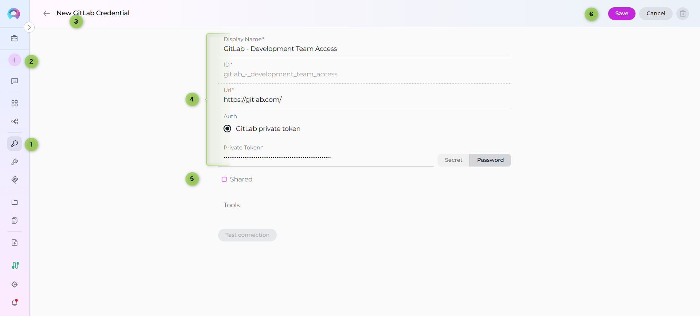
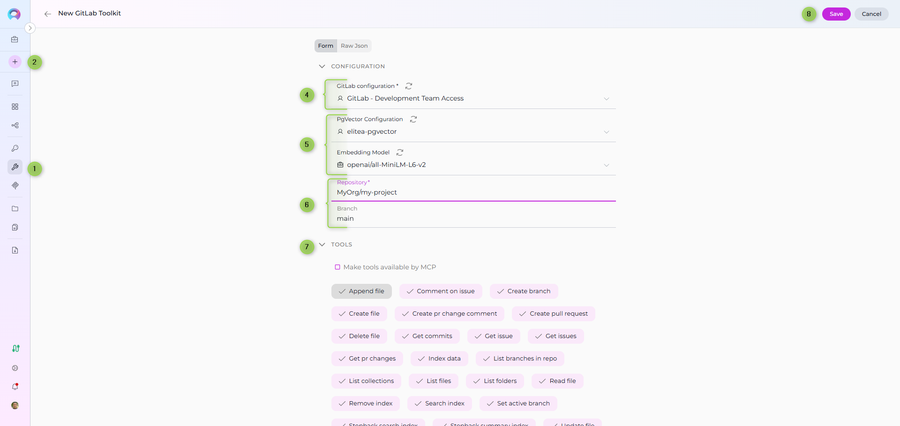
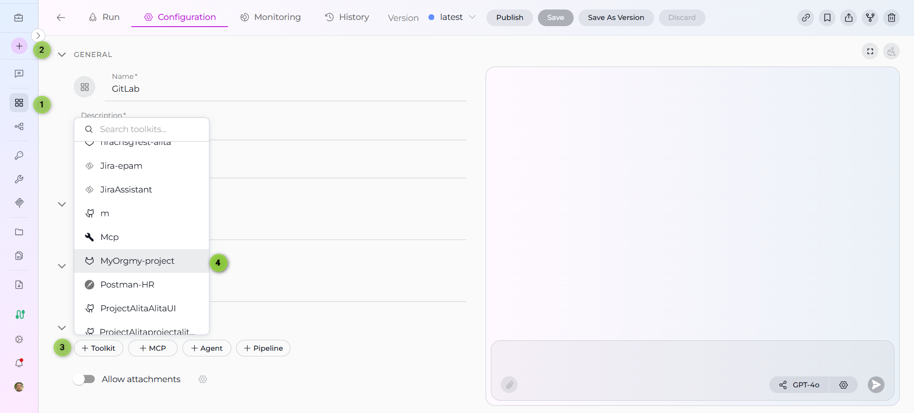
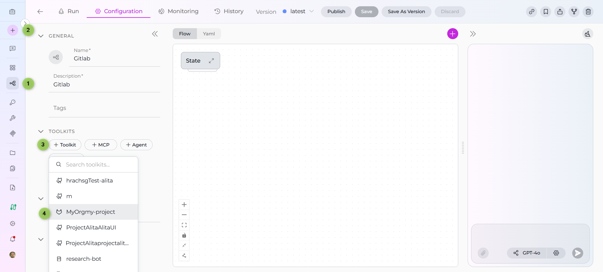
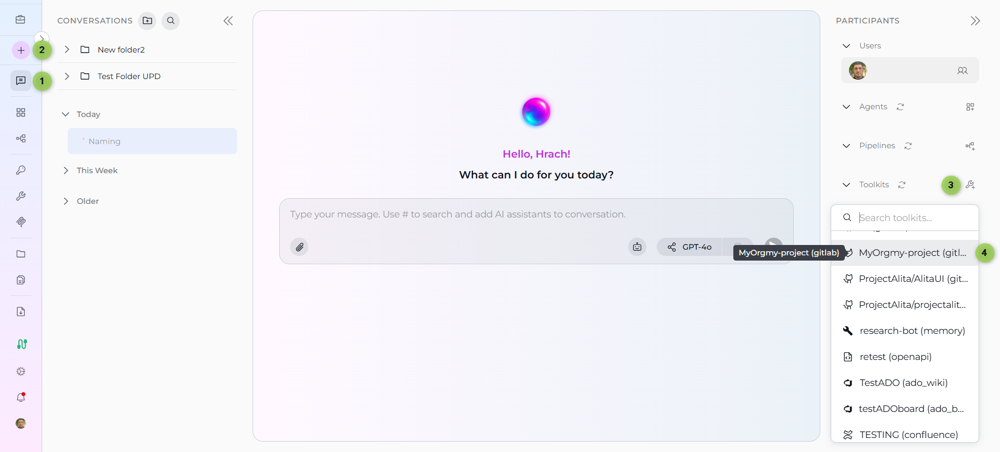

# ELITEA Toolkit Guide: GitLab Integration

## Introduction

### Purpose of this Guide

This guide serves as your definitive resource for integrating and effectively utilizing the **GitLab toolkit** within ELITEA. It provides a comprehensive, step-by-step walkthrough, from generating a GitLab Personal Access Token to configuring the toolkit in ELITEA and effectively using it within your Agents. By following this guide, you will unlock the power of automated code management, streamlined development workflows, and enhanced team collaboration, all directly within the ELITEA platform. This integration empowers you to leverage AI-driven automation to optimize your software development lifecycle using the combined strengths of ELITEA and GitLab.

### Brief Overview of GitLab

GitLab is a powerful, web-based DevOps platform that provides a comprehensive suite of tools for the entire software development lifecycle, delivered as a single, integrated application.  It is widely adopted by development teams for its robust features and collaborative environment. GitLab excels as a version control repository manager and offers a wide array of functionalities, including:

*   **Centralized Git Repository Management:** GitLab provides a robust and scalable platform for hosting and managing Git repositories, ensuring efficient version control, code organization, and secure access management for your entire codebase.
*   **Enhanced Collaboration Features:** GitLab fosters seamless team collaboration with features such as Merge Requests for code review, robust Issue Tracking for project management, Wikis for documentation, and in-line Code Review tools, facilitating a collaborative and transparent development process.
*   **Integrated CI/CD Pipelines:** GitLab CI/CD is a powerful built-in Continuous Integration and Continuous Delivery system that automates the entire software pipeline, from building and testing code to deploying applications, enabling rapid and reliable software releases.
*   **Comprehensive Project Management Tools:** GitLab includes a rich set of project planning and management features, such as Issue Boards for agile task management, Milestones for tracking progress against deadlines, and Time Tracking to monitor effort, streamlining software development workflows and improving project visibility.
*   **DevSecOps Capabilities:** GitLab integrates security scanning and testing throughout the DevOps lifecycle, enabling teams to build secure applications and proactively address vulnerabilities early in the development process, promoting a DevSecOps approach.

Integrating GitLab with ELITEA brings these powerful DevOps capabilities directly into your AI-driven workflows. Your ELITEA Agents can then intelligently interact with your GitLab repositories to automate code-related tasks, enhance development processes, improve team collaboration, and leverage AI to optimize your entire software development lifecycle.


## Toolkit's Account Setup and Configuration in GitLab

### Account Setup

If you do not yet have a GitLab account, please follow these steps to create one:

1.  **Visit GitLab Website:** Open your web browser and navigate to the official GitLab website: [gitlab.com](https://gitlab.com/).
2.  **Register/Sign Up:** Click on the **"Register"** or **"Sign Up"** button, typically located in the top right corner of the homepage.
3.  **Enter Account Details:** Fill in the required information on the signup form. This usually includes your desired username, email address, full name, and a secure password. **Note:** For professional use cases, it is strongly recommended to use your **company email address**.
4.  **Email Verification:** Check your email inbox for a verification email sent by GitLab. Click on the confirmation link provided in the email to verify your email address and activate your newly created GitLab account.
5.  **Log In to GitLab:** Once your email is verified, log in to GitLab using your chosen username and password. You are now ready to proceed with GitLab account configuration.

### Token/API Key Generation: Creating a Personal Access Token in GitLab

For secure integration with ELITEA, it is highly recommended to utilize a GitLab **Personal Access Token**. This method is significantly more secure than using your primary GitLab account password directly and provides granular control over the permissions granted to ELITEA.

**Follow these steps to generate a Personal Access Token in GitLab:**

1.  **Log in to GitLab:** Access your GitLab account by navigating to [gitlab.com](https://gitlab.com/) and logging in with your credentials.
2.  **Access User Settings:** Click on your profile avatar, located in the top right corner of the GitLab interface. From the dropdown menu, select **"Edit profile"**.
3.  **Navigate to Access Tokens:** In the left-hand sidebar of your profile settings, click on **"Personal access tokens"**.
4.  **Generate New Token:** Click the **"Add new token"** button to begin the process of creating a new Personal Access Token.
5.  **Configure Token Details:**
    *   **Token name:** In the "Token name" field, provide a descriptive and easily recognizable label for your token. For example, you could use "ELITEA Integration Token" or "ELITEA Agent Access." This label will help you identify the purpose of this token in the future and manage your tokens effectively.
    *   **Expiration date (Recommended):** For enhanced security, it is strongly recommended to set an **Expiration date** for your token. Choose a reasonable validity period that aligns with your security policies and integration needs. Setting an expiration date limits the token's lifespan and reduces the potential security risk if the token is ever compromised.
    *   **Select Scopes - Grant Least Privilege (Crucial for Security):** Carefully and deliberately select the **scopes** or permissions you grant to this Personal Access Token. **It is of utmost importance to grant only the minimum necessary permissions** required for your ELITEA Agent's intended interactions with GitLab. Overly permissive tokens significantly increase the potential security risk. For typical ELITEA integration, consider these minimal scopes:

        *   **Minimal Scopes for Common Use Cases:**
            *   **api:** (Provides full access to the GitLab API, encompassing all groups and projects. If possible, for enhanced security, consider using more granular scopes instead of the broad `api` scope.)
                *   **read_api:** (Allows read-only access to the GitLab API, suitable for retrieving data without modification.)
                *   **read_repository:** (Grants read-only access to repositories, enabling actions like listing files and reading file content.)
                *   **write_repository:** (Grants write access to repositories, allowing actions like creating branches, creating files, and updating file content. Only include this if your Agent needs to modify the repository.)

        *   **Additional Scopes for Specific Functionality (Grant only when required):**
            *   **read_user:** (Allows read access to user profiles, useful for user-related actions.)
            *   **read_issue:** (Grants read access to issues, enabling issue retrieval and listing.)
            *   **write_issue:** (Grants write access to issues, allowing issue creation and updates. Include only if your Agent needs to manage issues.)
            *   **read_merge_requests:** (Allows read access to merge requests, enabling merge request retrieval and listing.)
            *   **write_merge_requests:** (Grants write access to merge requests, allowing merge request creation and updates. Include only if your Agent needs to manage merge requests.)

    **Important Security Best Practices:**

    *   **Principle of Least Privilege:** **Strictly adhere to the principle of least privilege.** Grant only the absolute minimum set of scopes necessary for your ELITEA Agent to perform its specific, intended tasks. Avoid granting broad or unnecessary permissions.
    *   **Avoid "sudo" or Admin Scopes:** **Never grant "sudo" or other administrative scopes unless absolutely essential and with a clear and thorough understanding of the significant security implications.** Administrative scopes provide extensive access and should be avoided for integration purposes whenever possible.
    *   **Regular Token Review and Rotation:** Implement a process for regularly reviewing the Personal Access Tokens you have generated, their associated scopes, and their usage. Rotate tokens periodically (generate new tokens and revoke older ones) as a proactive security measure, especially for integrations that handle sensitive data or critical operations.
    *   **Secure Storage:** Store the generated Personal Access Token securely, preferably using ELITEA's built-in Secrets Management feature, rather than hardcoding it directly in Agent configurations or less secure storage locations.

6.  **Create Personal Access Token:** Click the **"Create personal access token"** button located at the bottom of the page to generate your token.
7.  **Securely Copy and Store the Token:** **Immediately copy the generated Personal Access Token** that is displayed on the subsequent page. **This is the only time you will be able to view and copy the full token value.** Store it securely using a robust password manager or, ideally, ELITEA's built-in Secrets feature for enhanced security within the ELITEA platform. You will require this token to configure the GitLab toolkit within ELITEA.


## System Integration with ELITEA

To integrate GitLab with ELITEA, you need to follow a three-step process: **Create Credentials → Create Toolkit → Use in Agents**. This workflow ensures secure authentication and proper configuration.

### Step 1: Create GitLab Credentials

Before creating a toolkit, you must first create GitLab credentials in ELITEA:

1. **Navigate to Credentials Menu:** Open the sidebar and select **[Credentials](../../menus/credentials.md)**.
2. **Create New Credential:** Click the **`+ Create`** button.
3. **Select GitLab:** Choose **GitLab** as the credential type.
4. **Configure Credential Details:**
     * **Display Name:** Enter a descriptive name (e.g., "GitLab - Development Team Access")
     * **URL:** Enter the base URL of your GitLab instance:
         - GitLab.com: `https://gitlab.com`
         - Self-hosted GitLab: `https://gitlab.yourcompany.com`
     * **Authentication:** GitLab private token
         * Enter your GitLab Personal Access Token that you generated in the previous steps
5. **Shared Credential:** Check the **Shared** checkbox if you want this credential to be accessible by all team members in the current project
6. **Save Credential:** Click **Save** to create the credential. After saving, your GitLab credential will be added to the credentials dashboard and will be ready to use in toolkit configurations. You can view, edit, or delete it from the **Credentials** menu at any time.



!!! tip "Security Recommendation"
    Use **[Secrets](../../menus/settings/secrets.md)** for sensitive authentication data (tokens, passwords, and private keys) instead of entering values directly. Create a secret first, then reference it in your credential configuration.

### Step 2: Create GitLab Toolkit

Once your credentials are configured, create the GitLab toolkit:

1. **Navigate to Toolkits Menu:** Open the sidebar and select **[Toolkits](../../menus/toolkits.md)**.
2. **Create New Toolkit:** Click the **`+ Create`** button.
3. **Select GitLab:** Choose **GitLab** from the list of available toolkit types.
4. **Configure Credentials:** 
     * In the **Configuration** section, select your previously created GitLab credential from the **Credentials** dropdown
5. **Configure Advanced Options:**
     * **PgVector Configuration:** Select a PgVector connection for vector database integration
     * **Embedding Model:** Select an embedding model for text processing and semantic search capabilities
6. **Configure Repository Settings:**
     * **Repository:** Enter the repository name in the format `owner/repository-name` (e.g., `MyOrg/my-project`)
     * **Main Branch:** Specify the main branch name (typically `main` or `master`)
     * **Active Branch:** Set the active working branch (defaults to `main`)
7. **Enable Desired Tools:** In the **"Tools"** section, select the checkboxes next to the specific GitLab tools you want to enable. **Enable only the tools your agents will actually use** to follow the principle of least privilege
8. **Save Toolkit:** Click **Save** to create the toolkit.



#### Available Tools:

The GitLab toolkit provides the following tools for interacting with GitLab repositories and managing development workflows, organized by functional categories:

| **Tool Category** | **Tool Name** | **Description** | **Primary Use Case** |
|:-----------------:|---------------|-----------------|----------------------|
| **Branch Management** | | | |
| | **Create branch** | Creates a new branch in the repository | Create feature branches, release branches, or hotfix branches |
| | **List branches in repo** | Lists all branches in the repository with optional filtering | Monitor branch structure and manage branch lifecycle |
| | **Set active branch** | Sets the active branch for subsequent operations | Ensure operations target the correct branch context |
| **File Operations** | | | |
| | **Create file** | Creates a new file in the repository | Generate new source code, documentation, or configuration files |
| | **Read file** | Reads the content of a specific file | Access file content for analysis, review, or processing |
| | **Update file** | Updates the content of an existing file | Modify source code, documentation, or configuration files |
| | **Append file** | Appends content to an existing file | Add log entries, update changelog, or append data |
| | **Delete file** | Deletes a file from the repository | Remove obsolete files or clean up temporary files |
| | **List files** | Lists files in the repository with optional path filtering | Browse repository structure and locate specific files |
| | **List folders** | Lists folders in the repository with optional recursive search | Explore directory structure and organize file operations |
| **Issue Management** | | | |
| | **Get issues** | Retrieves all open issues from the repository | Track project tasks, bugs, and feature requests |
| | **Get issue** | Retrieves details of a specific issue by number | Access detailed information about a particular issue |
| | **Comment on issue** | Adds a comment to an existing issue | Provide updates, feedback, or status changes on issues |
| **Pull Request Management** | | | |
| | **Create pull request** | Creates a new merge request in the repository | Automate code review process and facilitate collaboration |
| | **Get PR changes** | Retrieves changes from a specific pull request | Analyze code modifications and review impact |
| | **Create PR change comment** | Adds a comment to specific changes within a pull request | Provide targeted feedback on code modifications |
| **Version Control** | | | |
| | **Get commits** | Retrieves commit history with optional filtering | Track project history and analyze code changes over time |
| **Data Indexing & Search** | | | |
| | **Index data** | Indexes repository data for enhanced search capabilities | Enable AI-powered search and analysis across repository content |
| | **Search index** | Searches through indexed repository data | Find relevant code, documentation, or files using semantic search |
| | **Stepback search index** | Performs advanced stepback search on indexed data | Execute sophisticated search queries with context awareness |
| | **Stepback summary index** | Generates summaries from stepback search results | Create concise summaries of search findings and analysis |
| | **Remove index** | Removes indexed data from the search system | Clean up or reset indexed repository data |
| | **List collections** | Lists available indexed collections | View and manage indexed data collections for the repository |

### Step 3: Use GitLab Toolkit in Agents

Once your GitLab toolkit is created, you can use it in various ELITEA features:

#### **In Agents:**
1. **Navigate to Agents:** Open the sidebar and select **[Agents](../../menus/agents.md)**.
2. **Create or Edit Agent:** Click **`+ Create`** for a new agent or select an existing agent to edit.
3. **Add GitLab Toolkit:** 
     * In the **"Tools"** section of the agent configuration, click the **"+Toolkit"** icon
     * Select your configured GitLab toolkit from the dropdown list
     * The toolkit will be added to your agent with the previously configured tools enabled

Your agent can now interact with GitLab using the configured toolkit and enabled tools.





#### **In Pipelines:**

1. **Navigate to Pipelines:** Open the sidebar and select **[Pipelines](../../menus/pipelines.md)**.
2. **Create or Edit Pipeline:** Either create a new pipeline or select an existing pipeline to edit.
3. **Add GitLab Toolkit:** 
     * In the **"Tools"** section of the pipeline configuration, click the **"+Toolkit"** icon
     * Select your configured GitLab toolkit from the dropdown list
     * The toolkit will be added to your pipeline with the previously configured tools enabled




#### **In Chat:**

1. **Navigate to Chat:** Open the sidebar and select **[Chat](../../menus/chat.md)**.
2. **Start New Conversation:** Click **+Create** or open an existing conversation.
3. **Add Toolkit to Conversation:**
     * In the chat Participants section, look for the **Toolkits** element
     * Click the **"Add Tools"** Icon to open the tools selection dropdown
     * Select your configured GitLab toolkit from the dropdown list
     * The toolkit will be added to your conversation with all previously configured tools enabled
4. **Use Toolkit in Chat:** You can now directly interact with your GitLab repositories by asking questions or requesting actions that will trigger the GitLab toolkit tools.
    * **Example Chat Usage:**
        - "Please list all open issues in the repository that are labeled as 'bug' and 'high-priority'."
        - "Create a new branch called 'feature-user-authentication' from the main branch."
        - "Show me the recent commits in the main branch and summarize what changes were made."
        - "Create a merge request to merge the 'feature-login' branch into 'develop' with the title 'Add user login functionality'."




## Instructions and Prompts for Using the GitLab Toolkit

To effectively instruct your ELITEA Agent to use the GitLab toolkit, you need to provide clear and precise instructions within the Agent's "Instructions" field. These instructions are crucial for guiding the Agent on *when* and *how* to utilize the available GitLab tools to achieve your desired automation goals.

### Instruction Creation for OpenAI Agents

When crafting instructions for the GitLab toolkit, especially for OpenAI-based Agents, clarity and precision are paramount. Break down complex tasks into a sequence of simple, actionable steps. Explicitly define all parameters required for each tool and guide the Agent on how to obtain or determine the values for these parameters. OpenAI Agents respond best to instructions that are:

*   **Direct and Action-Oriented:** Employ strong action verbs and clear commands to initiate actions. For example, "Use the 'read_file' tool...", "Create a branch named...", "List all open issues...".

*   **Parameter-Centric:** Clearly enumerate each parameter required by the tool. For each parameter, specify:
    *   Its name (exactly as expected by the tool)
    *   Its expected data type and format
    *   How the Agent should obtain the value – whether from user input, derived from previous steps in the conversation, retrieved from an external source, or a predefined static value

*   **Contextually Rich:** Provide sufficient context so the Agent understands the overarching objective and the specific scenario in which each GitLab tool should be applied within the broader workflow. Explain the desired outcome or goal for each tool invocation.

*   **Step-by-Step Structure:** Organize instructions into a numbered or bulleted list of steps for complex workflows. This helps the Agent follow a logical sequence of actions.

*   **Add Conversation Starters:** Include example conversation starters that users can use to trigger this functionality. For example, "Conversation Starters: 'Show me the README file', 'What's in the README.md?', 'Display the project documentation'"

When instructing your Agent to use a GitLab toolkit tool, adhere to this structured pattern:

1. **State the Goal:** Begin by clearly stating the objective you want to achieve with this step. For example, "Goal: To retrieve the content of the 'README.md' file."

2. **Specify the Tool:** Clearly indicate the specific GitLab tool to be used for this step. For example, "Tool: Use the 'read_file' tool."

3. **Define Parameters:** Provide a detailed list of all parameters required by the selected tool. For each parameter:
   - **Parameter Name:** `<Parameter Name as defined in tool documentation>`
   - **Value or Source:** `<Specify the value or how to obtain the value. Examples: "user input", "from previous step", "hardcoded value 'main'", "value of variable X">`

4. **Describe Expected Outcome (Optional but Recommended):** Briefly describe the expected result or outcome after the tool is successfully executed. For example, "Outcome: The Agent will provide the content of the 'README.md' file."

5. **Add Conversation Starters:** Include example conversation starters that users can use to trigger this functionality. For example, "Conversation Starters: 'Show me the README file', 'What's in the README.md?', 'Display the project documentation'"

#### Example Agent Instructions

**Agent Instructions for Updating a File:**

```markdown
1. Goal: Update the 'config.json' file in the 'settings' branch with new configuration values provided by the user.
2. Tool: Use the "update_file" tool.
3. Parameters:
    - Repository Name: "Specify the repository name in 'owner/repo' format. Use the repository configured in the GitLab toolkit."
    - Branch Name: "settings" (or ask user for specific branch)
    - File Path: "config.json"
    - New Content: "Ask the user for the new JSON configuration content. Ensure it is valid JSON format. Example: {\"setting\": \"new_value\"}"
4. Outcome: The 'config.json' file in the 'settings' branch will be updated with the user-provided JSON configuration. Confirm the update to the user.
```

### Chat Usage Examples by Tool Category

The following examples demonstrate how to interact with the GitLab toolkit in ELITEA Chat, organized by functional categories. Each example shows the user request and the expected agent behavior.

#### Issue Management - Create Issue

**Chat Example:**
```
User: "I found a bug in the login system where users can't reset their passwords. Can you create an issue for this?"

Agent Response: [Agent uses comment_on_issue tool after getting issues]

✅ Issue created successfully!
- **Issue #47**: "Bug: Password reset not working in login system"
- **Description**: User reported that the password reset functionality is not working properly in the login system
- **Labels**: bug, login, high-priority
- **Status**: Open
- **URL**: https://gitlab.com/yourorg/yourrepo/-/issues/47

The development team will be notified and can begin investigating this issue.
```

#### Pull Request Management - Create Merge Request

**Chat Example:**
```
User: "Create a merge request to merge my 'feature-auth' branch into 'develop' with the title 'Add user authentication feature'."

Agent Response: [Agent uses create_pull_request tool]

✅ **Merge Request created successfully!**
- **MR #15**: "Add user authentication feature"
- **Source Branch**: feature-auth
- **Target Branch**: develop
- **Status**: Open
- **URL**: https://gitlab.com/yourorg/yourrepo/-/merge_requests/15

The merge request is now ready for review. Team members can review the code changes and provide feedback.
```

#### File Operations - Read File

**Chat Example:**
```
User: "Can you show me the contents of the README.md file?"

Agent Response: [Agent uses read_file tool]

📄 **README.md Contents**:

   markdown
# Project Name

A comprehensive web application for managing user accounts and data.

## Features
- User authentication and authorization
- Data visualization dashboard
- RESTful API endpoints
- Real-time notifications

## Installation
   bash
npm install
npm start


This file contains the project overview, features, and setup instructions for new developers joining the project.
```

#### Branch Management - Create Branch

**Chat Example:**
```
User: "I need to create a new feature branch called 'user-profile-enhancement' based on the main branch."

Agent Response: [Agent uses create_branch tool]

🌟 **Branch created successfully!**
- **Branch Name**: user-profile-enhancement
- **Based on**: main branch
- **URL**: https://gitlab.com/yourorg/yourrepo/-/tree/user-profile-enhancement

The branch is now ready for development. Would you like me to help you with any initial setup or file creation in this new branch?
```

#### Version Control - Get Commits

**Chat Example:**
```
User: "Show me the recent commits from the last week and summarize what changes were made."

Agent Response: [Agent uses get_commits tool]

📈 **Recent Commits (Last 7 Days)**:

1. **Latest**: `a7b3f2c` - "Fix user login validation" 
   - **Author**: @johndev
   - **Date**: 2 hours ago
   - **Changes**: Updated authentication logic to handle edge cases

2. `9d4e1a8` - "Add responsive design for mobile devices"
   - **Author**: @ui-designer
   - **Date**: Yesterday
   - **Changes**: Implemented mobile-first CSS and responsive breakpoints

3. `f2a1b9e` - "Update API documentation"
   - **Author**: @backend-dev
   - **Date**: 3 days ago
   - **Changes**: Added new endpoint documentation and examples

**Summary**: The team has been focusing on stability improvements, performance optimization, and mobile user experience enhancements this week.
```

#### File Operations - Update File

**Chat Example:**
```
User: "Update the config.json file to change the API endpoint from 'api.dev.com' to 'api.prod.com'"

Agent Response: [Agent uses update_file tool]

✅ **File updated successfully!**
- **File**: config.json
- **Branch**: main
- **Change**: Updated API endpoint from 'api.dev.com' to 'api.prod.com'
- **Commit**: "Update API endpoint to production URL"

The configuration file has been updated. The new API endpoint will be used for all future API calls.
```

#### File Operations - List Files

**Chat Example:**
```
User: "Show me all the files in the src/components directory."

Agent Response: [Agent uses list_files tool]

📁 **Files in src/components/** (12 files):

**📄 Component Files**:
- `Header.vue` - Main header component
- `Footer.vue` - Footer component
- `Navigation.vue` - Navigation menu component
- `UserProfile.vue` - User profile display component
- `LoginForm.vue` - User login form component

**📄 Utility Components**:
- `Modal.vue` - Reusable modal component
- `Button.vue` - Custom button component
- `Input.vue` - Custom input component
- `LoadingSpinner.vue` - Loading indicator component

**📄 Layout Components**:
- `Sidebar.vue` - Application sidebar
- `MainLayout.vue` - Main page layout wrapper
- `DashboardLayout.vue` - Dashboard-specific layout

This directory contains the main UI components for the application. Would you like me to show you the contents of any specific component?
```

## Troubleshooting and Support

### Troubleshooting

*   **Credential Not Appearing in Toolkit Configuration:**
    *   **Problem:** When creating a toolkit, your GitLab credential doesn't appear in the credentials dropdown.
    *   **Troubleshooting Steps:**
        *   **Check Credential Scope:** Ensure you're working in the same workspace/project where the credential was created. Private credentials are only visible in your Private workspace, while project credentials are visible within the specific team project.
        *   **Verify Credential Creation:** Go to the Credentials menu and confirm that your GitLab credential was successfully saved.
        *   **Credential Type Match:** Ensure you selected "GitLab" as the credential type when creating the credential.

*   **Connection Errors:**
    *   **Problem:** ELITEA Agent fails to establish a connection with GitLab, resulting in errors during toolkit execution.
    *   **Troubleshooting Steps:**
        1.  **Verify GitLab API URL:** Ensure that the **URL** field in the credential configuration is correctly set to your GitLab instance URL: `https://gitlab.com` for GitLab.com or `https://gitlab.yourcompany.com` for self-hosted instances. Avoid adding `/api/v4` to the URL as this is handled automatically.
        2.  **Check Personal Access Token (PAT):** Double-check that the **Personal Access Token** you have provided is accurate, has not expired, and is valid for your GitLab account and the target repository. Carefully re-enter or copy-paste the token to rule out typos.
        3.  **Verify Token Scopes:** Review the **scopes/permissions** granted to your Personal Access Token in GitLab. Ensure that the token has the necessary scopes (e.g., `api`, `read_repository`, `write_repository`, `read_issue`, `write_issue`) for the specific GitLab tools your Agent is attempting to use. Insufficient scopes are a common cause of connection and permission errors.
        4.  **Network Connectivity:** Confirm that both your ELITEA environment and the GitLab service are connected to the internet and that there are no network connectivity issues, firewalls, or proxies blocking the integration. Test network connectivity to your GitLab instance from your ELITEA environment if possible.

*   **Authorization Errors (Permission Denied/Unauthorized):**
    *   **Problem:** Agent execution fails with "Permission Denied" or "Unauthorized" errors when attempting to access or modify GitLab resources, even with a seemingly valid token.
    *   **Troubleshooting Steps:**
        1.  **Re-verify Token Scopes:** Double-check the **scopes/permissions** granted to your Personal Access Token with extreme care. Ensure that the token possesses the precise scopes required for the specific GitLab actions your Agent is trying to perform. For example, creating files or merge requests requires scopes that grant write access (`api` scope or granular `write_repository` scopes).
        2.  **Repository Access Permissions:** Confirm that the GitLab account associated with the Personal Access Token has the necessary access permissions to the specified repository. Verify that the account is a member of the project, has the appropriate roles and permissions (e.g., Developer or Maintainer role for modifying repositories). Check project settings in GitLab to confirm access levels.
        3.  **Token Revocation or Expiration:** Ensure that the Personal Access Token has not been accidentally revoked in GitLab settings or that it has not reached its expiration date if you set one. Generate a new token if necessary.

*   **Incorrect Repository or Branch Names:**
    *   **Problem:** Agent tools fail to operate on the intended repository or branch, often resulting in "Repository not found" or "Branch not found" errors.
    *   **Troubleshooting Steps:**
        1.  **Double-Check Repository Name:** Carefully and meticulously verify that you have entered the correct GitLab Repository name in the toolkit configuration within ELITEA. Pay close attention to capitalization, spelling, and the `namespace/repository_name` format. Even minor typos can cause errors.
        2.  **Verify Branch Name Spelling and Case:** Ensure that you are using the correct branch name (e.g., `main`, `develop`, `feature-branch`) in your Agent's instructions when specifying branch-related parameters for GitLab tools. Branch names in Git are case-sensitive. Double-check the spelling and capitalization of branch names against your repository in GitLab.
        3.  **Branch Existence:** Confirm that the specified branch actually exists in your GitLab repository. It's possible the branch name is correct but the branch was deleted or renamed.

*   **Toolkit Configuration Issues:**
    *   **Problem:** The toolkit fails to load or shows configuration errors after creation.
    *   **Troubleshooting Steps:**
        1.  **Verify Repository Format:** Ensure the repository name follows the correct format: `namespace/repository-name`. Do not include the full GitLab URL or `.git` extension.
        2.  **Check Main Branch Name:** Verify that the main branch name matches the actual main branch in your repository (commonly `main` or `master`).
        3.  **Credential Selection:** Ensure you have selected the correct credential from the dropdown in the toolkit configuration.

### FAQ

1.  **Q: What scopes/permissions are absolutely necessary and minimally sufficient for the GitLab Personal Access Token to work with ELITEA?**
    *   **A:** The minimum required scopes depend on the specific GitLab tools your ELITEA Agent will be using. For basic read-only access to repositories (e.g., using `read_file`, `list_files`), the `read_api` and `read_repository` scopes might suffice. However, for most common integration scenarios involving modifications (e.g., `create_file`, `update_file`, `create_pull_request`), you will need the broader `api` scope or more granular write scopes like `write_repository`. For issue management, include `read_issue` and `write_issue` scopes. For merge request management, include `read_merge_requests` and `write_merge_requests` scopes. **Always adhere to the principle of least privilege and grant only the scopes that are strictly necessary for your Agent's intended functionalities.**

2.  **Q: What is the correct format for specifying the GitLab Repository name in the ELITEA toolkit configuration?**
    *   **A:** The GitLab Repository name must be entered in the format `namespace/repository_name` (e.g., `MyGroup/my-project-repo`). Ensure you include both the namespace (user or group name) and the repository name, separated by a forward slash `/`. This format is crucial for ELITEA to correctly identify and access your repository on GitLab.

3.  **Q: How do I switch from the old Agent-based configuration to the new Credentials + Toolkit workflow?**
    *   **A:** The new workflow is: (1) Create a GitLab credential with your authentication details, (2) Create a GitLab toolkit that uses this credential, and (3) Add the toolkit to your agents, pipelines, or chat. This provides better security, reusability, and organization compared to configuring authentication directly in agents.

4.  **Q: Can I use the same GitLab credential across multiple toolkits and agents?**
    *   **A:** Yes! This is one of the key benefits of the new workflow. Once you create a GitLab credential, you can reuse it across multiple GitLab toolkits, and each toolkit can be used by multiple agents, pipelines, and chat sessions. This promotes better credential management and reduces duplication.

5.  **Q: Can I use both GitLab.com and self-hosted GitLab instances with ELITEA?**
    *   **A:** Yes! ELITEA supports both GitLab.com and self-hosted GitLab instances. Simply configure the correct URL in your credential settings: `https://gitlab.com` for GitLab.com or `https://gitlab.yourcompany.com` for your self-hosted instance.

6.  **Q: Why am I consistently encountering "Permission Denied" errors, even though I believe I have configured everything correctly and granted the necessary permissions?**
    *   **A:** If you are still facing "Permission Denied" errors despite careful configuration, systematically re-examine the following:
        *   **Token Scope Accuracy:** Double and triple-check the **scopes/permissions** granted to your GitLab Personal Access Token in your GitLab User Settings. Ensure that the token possesses the *exact* scopes required for *each* GitLab tool your Agent is attempting to use. Pay close attention to write vs. read permissions.
        *   **Repository Access Verification:** Explicitly verify that the GitLab account associated with the Personal Access Token has the necessary access rights to the *specific target repository* within GitLab itself. Confirm project membership and assigned roles/permissions within the GitLab project settings.
        *   **Token Validity and Revocation:** Double-check that the Personal Access Token is still valid, has not expired, and has not been accidentally revoked in your GitLab settings. Generate a new token as a test if unsure.
        *   **Credential Configuration:** Carefully review the credential configuration in ELITEA, especially the URL and token fields for any hidden typographical errors or accidental whitespace.

If, after meticulously checking all of these points, you still encounter "Permission Denied" errors, please reach out to ELITEA Support with detailed information for further assistance.

### Support and Contact Information

If you encounter any persistent issues, have further questions, or require additional assistance beyond the scope of this guide regarding the GitLab integration or ELITEA Agents in general, please do not hesitate to contact our dedicated ELITEA Support Team. We are committed to providing timely and effective support to ensure you have a seamless and productive experience with ELITEA.

**How to Reach ELITEA Support:**

*   **Email:**  **[SupportAlita@epam.com](mailto:SupportAlita@epam.com)**

**Best Practices for Submitting Effective Support Requests:**

To enable our support team to understand and resolve your issue as efficiently as possible, please include the following critical information in your support email:

*   **ELITEA Environment Details:** Clearly specify the ELITEA environment you are currently using (e.g., "Next" or the specific name of your ELITEA instance).
*   **Project Context:**  Indicate the **Project Name** within ELITEA where you are experiencing the issue and specify whether you are working in your **Private** workspace or a **Team** project.
*   **Detailed Issue Description:** Provide a clear, concise, and comprehensive description of the problem you are encountering. Articulate precisely what you were attempting to do, what behavior you expected to observe, and what actually occurred (the unexpected behavior or error). Step-by-step descriptions are highly valuable.
*   **Relevant Configuration Information (Screenshots Preferred):** To facilitate efficient diagnosis, please include relevant configuration details, ideally as screenshots:
    *   **Agent Instructions (Screenshot or Text Export):** If the issue is related to a specific Agent's behavior, provide a screenshot of the Agent's "Instructions" field or export the instructions as text.
    *   **Toolkit Configurations (Screenshots):** If the issue involves the GitLab toolkit or any other toolkits, include clear screenshots of the toolkit configuration settings as they appear within your Agent's configuration in ELITEA.
*   **Complete Error Messages (Full Text):** If you are encountering any error messages, please provide the **complete and unabridged error text**. In the ELITEA Chat window, expand the error details section (if available) and copy the entire error message text. Detailed error information is often crucial for accurate diagnosis.
*   **Your Query/Prompt (Exact Text):** If the issue is related to Agent execution or an unexpected response, provide the exact query or prompt you used to trigger the Agent's action that led to the problem.

**Pre-Support Request Actions (Self-Help):**

Before contacting support, we strongly encourage you to first thoroughly explore the resources available within this comprehensive guide and the broader ELITEA documentation. You may find readily available answers to common questions, solutions to known issues, or configuration guidance within these resources, potentially resolving your issue more quickly.


!!! reference "External Resources"
    *   **GitLab Website:** [https://gitlab.com](https://gitlab.com) - *Access the main GitLab platform to create an account or log in.*
    *   **GitLab Access Tokens:** [https://gitlab.com/-/profile/personal_access_tokens](https://gitlab.com/-/profile/personal_access_tokens) - *Directly access the section in GitLab settings to manage your Personal Access Tokens for secure integrations.*
    *   **GitLab API Documentation:** [https://docs.gitlab.com/ee/api/](https://docs.gitlab.com/ee/api/) - *Explore the official GitLab API documentation for detailed information on GitLab API endpoints, authentication, data structures, and developer guides.*
    *   **GitLab Help Center:** [https://docs.gitlab.com](https://docs.gitlab.com) - *Access the official GitLab documentation for comprehensive articles, FAQs, and troubleshooting guides on all aspects of GitLab usage.*
    *   **GitLab Support:** [https://about.gitlab.com/support/](https://about.gitlab.com/support/) - *Access GitLab's official support resources and contact information.*
