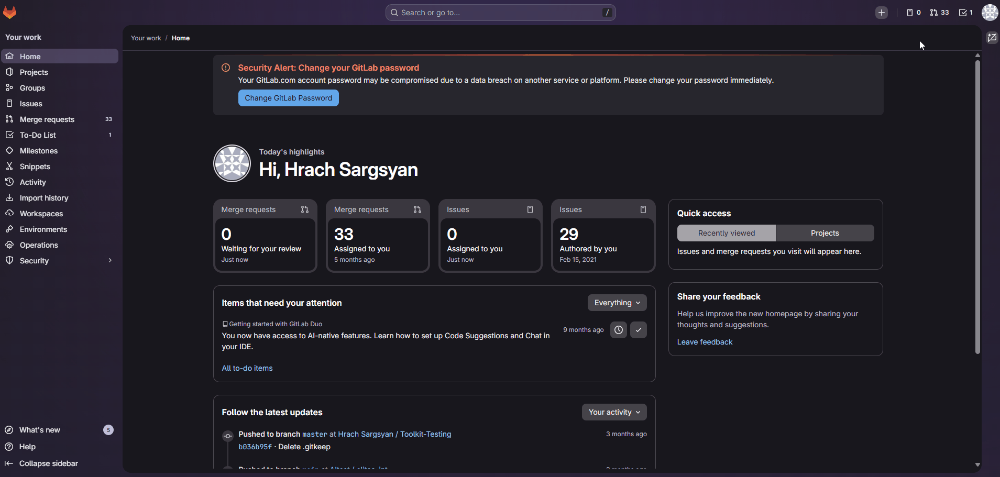
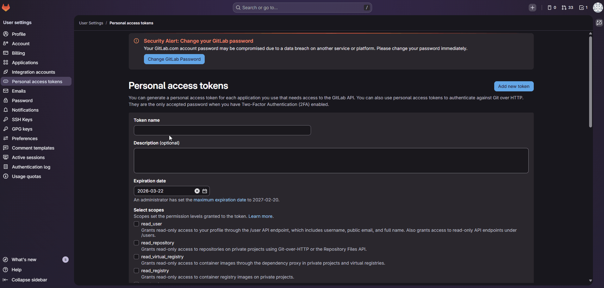
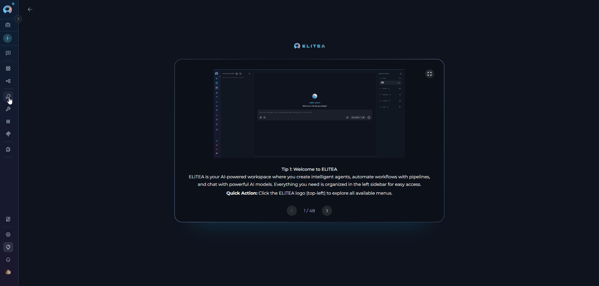
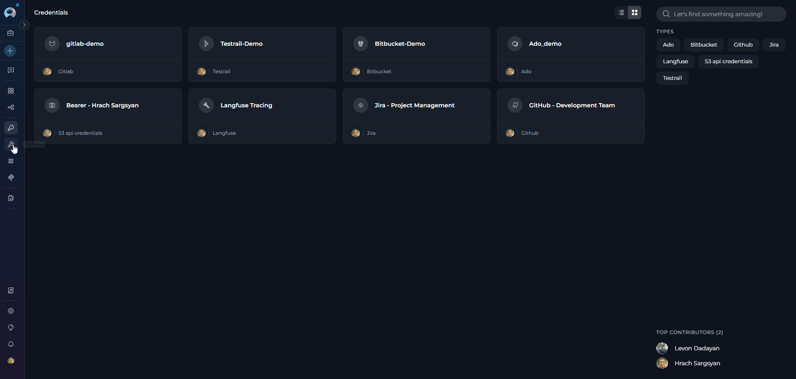
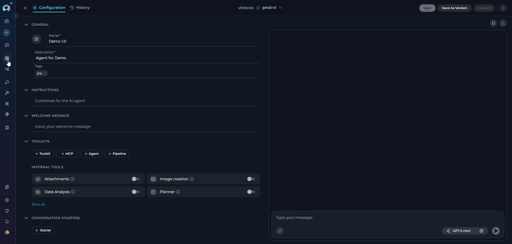
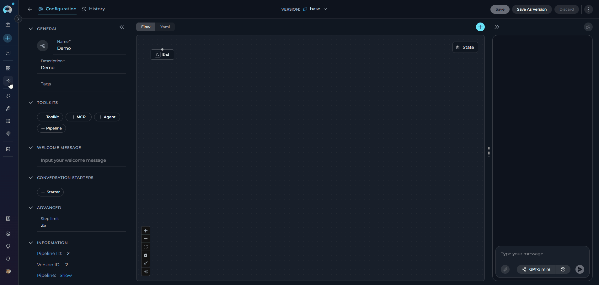
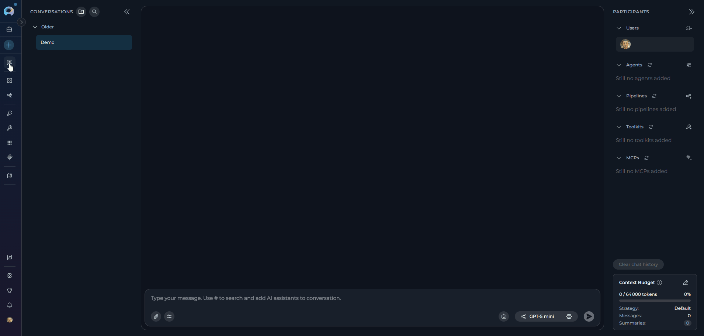

# GitLab Toolkit Integration Guide

---

## Introduction

This guide is your comprehensive resource for integrating and utilizing the **GitLab toolkit** within ELITEA. It provides detailed, step-by-step instructions, from setting up your GitLab Personal Access Token to configuring the toolkit in ELITEA and effectively using it within your Agents, Pipelines, and Chat conversations. By following this guide, you will unlock the power of automated code management, streamlined development workflows, and enhanced team collaboration, all directly within the ELITEA platform.

**Brief Overview of GitLab**

GitLab is a powerful, web-based DevOps platform that provides a comprehensive suite of tools for the entire software development lifecycle, delivered as a single, integrated application. It is widely adopted by development teams for its robust features and collaborative environment, offering features for:

*   **Centralized Git Repository Management:** GitLab provides a robust and scalable platform for hosting and managing Git repositories, ensuring efficient version control, code organization, and secure access management for your entire codebase.
*   **Enhanced Collaboration Features:** GitLab fosters seamless team collaboration with features such as Merge Requests for code review, robust Issue Tracking for project management, Wikis for documentation, and in-line Code Review tools, facilitating a collaborative and transparent development process.
*   **Integrated CI/CD Pipelines:** GitLab CI/CD is a powerful built-in Continuous Integration and Continuous Delivery system that automates the entire software pipeline, from building and testing code to deploying applications, enabling rapid and reliable software releases.
*   **Comprehensive Project Management Tools:** GitLab includes a rich set of project planning and management features, such as Issue Boards for agile task management, Milestones for tracking progress against deadlines, and Time Tracking to monitor effort, streamlining software development workflows and improving project visibility.
*   **DevSecOps Capabilities:** GitLab integrates security scanning and testing throughout the DevOps lifecycle, enabling teams to build secure applications and proactively address vulnerabilities early in the development process.

Integrating GitLab with ELITEA brings these powerful DevOps capabilities directly into your AI-driven workflows. Your ELITEA Agents, Pipelines, and Chat conversations can intelligently interact with your GitLab repositories to automate code-related tasks, enhance development processes, and improve team collaboration.

---

## Toolkit's Account Setup and Configuration

**Account Setup**

If you don't have a GitLab account yet, here's how to get started:

1.  **Visit GitLab Website:** Open your web browser and navigate to [GitLab's official website](https://gitlab.com/).
2.  **Sign Up:** Click on the **"Register"** or **"Sign Up"** button, typically located in the top right corner of the homepage.
3.  **Fill Out the Registration Form:** Provide your details in the registration form. This typically includes your username, email address, full name, and a secure password. **For professional use, it's highly recommended to use your company email.**
4.  **Submit the Form:** Click on the **"Register"** or similar button to submit the form. GitLab will send a confirmation email to the email address you provided.
5.  **Verify Your Email:** Open the confirmation email from GitLab and click on the verification link provided within the email. This step is crucial to activate your GitLab account.
6.  **Access Your Account:** After email verification, you will be redirected to your GitLab account or prompted to log in. You are now ready to proceed with GitLab configuration.

### Generate a Personal Access Token

For secure integration with ELITEA, it is essential to use a GitLab **Personal Access Token**. This method is significantly more secure than using your primary GitLab account password directly and allows you to precisely control the permissions granted to ELITEA.

**Follow these steps to generate a Personal Access Token in GitLab:**

1.  **Log in to GitLab:** Access your GitLab account using your credentials.
2.  **Access User Settings:** Click on your profile avatar in the top right corner of the GitLab interface. From the dropdown menu, select **"Edit profile"**.
3.  **Navigate to Access Tokens:** In the left-hand sidebar of your profile settings, click on **"Access Tokens"**.
4.  **Add New Token:** Click the **"Add new token"** button to create a new Personal Access Token.

     {loading=lazy}

5.  **Configure Token Details:**
    *   **Token name:** In the "Token name" field, enter a descriptive name for the token, such as "ELITEA Integration Token". This will help you identify the purpose of this token later.
    *   **Expiration date (Recommended):** For enhanced security, it is strongly recommended to set an **Expiration date** for your token. Choose a reasonable validity period that aligns with your security policies and integration needs.
    *   **Select Scopes - Grant Least Privilege (Crucial for Security):** Carefully select the **scopes** or permissions you grant to this Personal Access Token. **It is crucial to grant only the minimum necessary permissions** required for your ELITEA Agent's intended interactions with GitLab.

        !!! tip "Token Scopes"
            **Minimal Scopes for Common Use Cases:**
        
            - **api:** Provides full access to the GitLab API. If possible, for enhanced security, consider using more granular scopes
            - **read_api:** Read-only access to the API
            - **read_repository:** Read-only access to repositories
            - **write_repository:** Write access to repositories. Include only if your Agent needs to modify repositories

            **Additional Scopes for Specific Functionality (Grant only when required):**
        
            - **read_user:** Read access to user profiles
            - **read_issue:** Read access to issues
            - **write_issue:** Write access to issues. Include only if your Agent needs to manage issues
            - **read_merge_requests:** Read access to merge requests
            - **write_merge_requests:** Write access to merge requests. Include only if your Agent needs to manage merge requests

6.  **Create Personal Access Token:** Click the **"Create personal access token"** button to generate your token.
7.  **Securely Copy and Store Your Token:** **Immediately copy the generated Personal Access Token.** This is the only time it will be displayed in full. Store it securely in a password manager or, preferably, ELITEA's built-in **[Secrets](../../menus/settings/secrets.md)** feature for enhanced security within ELITEA. You will need this token to configure the GitLab toolkit in ELITEA.

     {loading=lazy}

!!! warning "Important Security Practices"
    **Principle of Least Privilege:** Grant only the permissions absolutely essential for your ELITEA integration tasks.
    
    **Never Share Tokens:** Treat your Personal Access Token like a password. Do not share it publicly or commit it to version control systems.
    
    **Regular Token Review and Rotation:** Regularly review generated tokens and rotate them periodically as a security best practice.

---

## System Integration with ELITEA

To integrate GitLab with ELITEA, you need to follow a three-step process: **Create Credentials → Create Toolkit → Use in Agents**. This workflow ensures secure authentication and proper configuration.

### Step 1: Create GitLab Credentials

Before creating a toolkit, you must first create GitLab credentials in ELITEA:

1. **Navigate to Credentials Menu:** Open the sidebar and select **[Credentials](../../menus/credentials.md)**.
2. **Create New Credential:** Click the **`+ Create`** button.
3. **Select GitLab:** Choose **GitLab** as the credential type.
4. **Configure Credential Details:**

    | **Field** | **Description** | **Example** |
    |-----------|----------------|-------------|
    | **Display Name** | Descriptive name for easy identification | `GitLab - Development Team` |
    | **ID** | Unique identifier for the credential | Auto-generated |
    | **URL** | Your GitLab instance URL | `https://gitlab.com` or `https://gitlab.yourcompany.com` |
    | **Private Token** | Your GitLab Personal Access Token | `your-personal-access-token` |

5. **Test Connection:** Click **Test Connection** to verify your credentials are valid and ELITEA can connect to GitLab
6. **Save Credential:** Click **Save** to create the credential

     {loading=lazy}

     !!! tip "Security Recommendation"
         It's highly recommended to use **[Secrets](../../menus/settings/secrets.md)** for Personal Access Tokens instead of entering them directly. Create a secret first, then reference it in your credential configuration.

### Step 2: Create GitLab Toolkit

Once your credentials are configured, create the GitLab toolkit:

1. **Navigate to Toolkits Menu:** Open the sidebar and select **[Toolkits](../../menus/toolkits.md)**.
2. **Create New Toolkit:** Click the **`+ Create`** button.
3. **Select GitLab:** Choose **GitLab** from the list of available toolkit types.
4. **Configure Toolkit Settings:**

    | **Field** | **Description** | **Example** |
    |-----------|----------------|-------------|
    | **Toolkit Name** | Descriptive name for your toolkit | `GitLab - MyProject Repo` |
    | **Description** | Optional description for the toolkit | `GitLab toolkit for development team` |
    | **GitLab Configuration** | Select your previously created GitLab credential | `GitLab - Development Team` |
    | **PgVector Configuration** | (Optional) Select PgVector for indexing features | Your PgVector configuration |
    | **Embedding Model** | (Optional) Select embedding model for semantic search | `amazon.titan-embed-text-v2:0` |
    | **Repository** | Enter repository name in format `namespace/repository` | `mygroup/my-project` |
    | **Branch** | Enter the main branch name | `main` |

5. **Enable Desired Tools:** In the **"Tools"** section, select the checkboxes next to the specific GitLab tools you want to enable. **Enable only the tools your agents will actually use**
       * **[Make Tools Available by MCP](../mcp/make-tools-available-by-mcp.md)** - (optional checkbox) Enable this option to make the selected tools accessible through external MCP clients
6. **Save Toolkit:** Click **Save** to create the toolkit
   
     {loading=lazy}

#### Available Tools:

The GitLab toolkit provides the following tools for interacting with GitLab repositories, organized by functional categories:

| **Tool Category** | **Tool Name** | **Description** | **Primary Use Case** |
|:-----------------:|---------------|-----------------|----------------------|
| **Branch Management** | | | |
| | **Create branch** | Creates a new branch from the active branch. Automatically sets the new branch as active after creation. Returns success message or handles conflicts if branch already exists | Set up new feature branches or bug fix branches for development work |
| | **Delete branch** | Deletes a branch from the repository with proper validation and error handling | Remove obsolete or merged feature branches to maintain repository cleanliness |
| | **List branches in repo** | Lists branches in the repository with optional limit parameter (default: 20) and wildcard filtering support (e.g., '*dev') | View all branches or find specific branches matching a pattern for branch management |
| | **Set active branch** | Switches the active branch for subsequent operations. Validates branch existence before switching and provides helpful error messages with available branches | Switch context to work on a specific branch for file operations and merge requests |
| **File Operations** | | | |
| | **Append file** | Appends new content to the end of an existing file without overwriting existing content | Add log entries, update changelog files, or append data to existing files |
| | **Create file** | Creates a new file in the GitLab repository at the specified path with provided contents and commits it to the specified branch | Add new configuration files, documentation, or source code to the repository |
| | **Delete file** | Deletes a file from the repository with proper commit message and branch specification | Remove obsolete files, clean up temporary files, or maintain repository hygiene |
| | **Edit file** | Edits an existing file with enhanced validation and error handling capabilities | Modify file contents with improved change tracking and validation |
| | **Grep file** | Searches for patterns within files using grep-like functionality across the repository | Find specific code patterns, text occurrences, or search within file contents |
| | **List files** | Lists files in the repository with optional path filter and branch specification. Supports filtering by directory path | Browse repository structure, explore directories, or locate specific file paths |
| | **List folders** | Lists folders in the repository with optional path filter, recursive/non-recursive search control, and branch specification | Explore directory structure and organize file operations |
| | **Read file** | Reads and returns the complete contents of a file from the repository at the specified branch | Retrieve file contents for review, analysis, or processing by the AI agent |
| | **Read multiple files** | Reads and returns contents of multiple files in a single operation for improved efficiency | Retrieve multiple file contents simultaneously for batch processing or analysis |
| | **Update file** | Updates an existing file using OLD/NEW marker format for content replacement. Validates changes and provides detailed error messages if markers are malformed | Modify existing file contents with explicit old-to-new content transformations |
| **Issue Management** | | | |
| | **Comment on issue** | Adds a comment to an existing GitLab issue with support for markdown formatting | Provide updates, feedback, or status changes on issues |
| | **Get issue** | Retrieves complete details of a specific issue by number including the first 10 comments | Access detailed information about a particular issue for review or analysis |
| | **Get issues** | Retrieves all open issues from the repository with their titles, descriptions, labels, and metadata | Track project tasks, bugs, and feature requests across the project |
| **Merge Request Management** | | | |
| | **Comment on pr** | Adds a general comment to a merge request for discussion or feedback | Provide overall feedback or discussion points on a merge request |
| | **Create pr change comment** | Adds a comment to specific changes within a merge request at a particular file path and line number | Provide targeted feedback on code modifications during code review |
| | **Create pull request** | Creates a merge request from the specified branch to the main branch using JSON data specification. Returns MR details including URL upon success | Initiate code review process for changes made by the agent or automation |
| | **Get pr changes** | Retrieves the diff/changes from a merge request showing file modifications, additions, and deletions | Examine specific file changes and modifications included in a merge request |
| **Version Control** | | | |
| | **Get commits** | Retrieves a list of commits from the repository with optional filtering by SHA, path, date range, and author | Track project history, analyze code changes over time, and understand development activity |
| **Indexing & Search** | | | |
| | **Index data** | Loads GitLab repository data into PgVector for semantic search. Requires PgVector configuration and embedding model to create searchable code index | Enable AI-powered semantic search across repository code for intelligent code discovery |
| | **List collections** | Lists all available indexed collections in the PgVector database to identify searchable datasets | View and manage indexed data collections to understand what code bases are searchable |
| | **Remove index** | Removes previously created search indexes from PgVector to free resources or refresh data | Clean up outdated indexes or prepare for re-indexing with updated repository content |
| | **Search index** | Performs semantic searches across indexed repository content using natural language queries | Find specific code patterns, implementations, or documentation using AI-powered search |
| | **Stepback search index** | Performs advanced contextual searches with broader scope, using step-back prompting to generate better search queries | Execute sophisticated searches requiring broader context understanding and query refinement |
| | **Stepback summary index** | Creates comprehensive summaries of indexed content using step-back prompting for more thorough analysis | Generate intelligent, context-aware summaries of repository code and documentation |

!!! tip "Vector Search Tools"
    The tools **Index data**, **List collections**, **Remove index**, **Search index**, **Stepback search index**, and **Stepback summary index** require PgVector configuration and an embedding model. These enable advanced semantic search capabilities across your GitLab repository.

#### Testing Toolkit Tools

After configuring your GitLab toolkit, you can test individual tools directly from the Toolkit detailed page using the **Test Settings** panel. This allows you to verify that your credentials are working correctly and validate tool functionality before adding the toolkit to your workflows.

**General Testing Steps:**

1. **Select LLM Model:** Choose a Large Language Model from the model dropdown in the Test Settings panel
2. **Configure Model Settings:** Adjust model parameters like Creativity, Max Completion Tokens, and other settings as needed
3. **Select a Tool:** Choose the specific GitLab tool you want to test from the available tools
4. **Provide Input:** Enter any required parameters or test queries for the selected tool
5. **Run the Test:** Execute the tool and wait for the response
6. **Review the Response:** Analyze the output to verify the tool is working correctly and returning expected results

!!! tip "Key benefits of testing toolkit tools:"
    * Verify that GitLab credentials and connection are configured correctly
    * Validate that tools function as expected with your GitLab repository
    * Test different parameter combinations and edge cases before production use
    * Familiarize yourself with tool capabilities and expected outputs
    
    > For detailed instructions on how to use the Test Settings panel, see **[How to Test Toolkit Tools](../../how-tos/credentials-toolkits/how-to-test-toolkit-tools.md)**.

---
### Step 3: Use GitLab Toolkit in Agents

---
### Step 3: Use GitLab Toolkit in Agents

Once your GitLab toolkit is created, you can use it in various ELITEA features:

#### **In Agents:**
1. **Navigate to Agents:** Open the sidebar and select **[Agents](../../menus/agents.md)**.
2. **Create or Edit Agent:** Click **`+ Create`** for a new agent or select an existing agent to edit.
3. **Add GitLab Toolkit:** 
     * In the **"TOOLKITS"** section of the agent configuration, click the **"+Toolkit"** icon
     * Select your GitLab toolkit from the dropdown menu
     * The toolkit will be added to your agent with the previously configured tools enabled

Your agent can now interact with GitLab using the configured toolkit and enabled tools.


{loading=lazy}


#### **In Pipelines:**

1. **Navigate to Pipelines:** Open the sidebar and select **[Pipelines](../../menus/pipelines.md)**.
2. **Create or Edit Pipeline:** Either create a new pipeline or select an existing pipeline to edit.
3. **Add GitLab Toolkit:** 
     * In the **"TOOLKITS"** section of the pipeline configuration, click the **"+Toolkit"** icon
     * Select your GitLab toolkit from the dropdown menu
     * The toolkit will be added to your pipeline with the previously configured tools enabled

{loading=lazy}


#### **In Chat:**

1. **Navigate to Chat:** Open the sidebar and select **[Chat](../../menus/chat.md)**.
2. **Start New Conversation:** Click **+Create** or open an existing conversation.
3. **Add Toolkit to Conversation:**
     * In the chat Participants section, look for the **Toolkits** element
     * Click to add a toolkit and select your GitLab toolkit from the available options
     * The toolkit will be added to your conversation with all previously configured tools enabled
4. **Use Toolkit in Chat:** You can now directly interact with your GitLab repositories by asking questions or requesting actions that will trigger the GitLab toolkit tools.

{loading=lazy}


## Instructions and Prompts for Using the GitLab Toolkit

To effectively instruct your ELITEA Agent to use the GitLab toolkit, you need to provide clear and precise instructions within the Agent's "Instructions" field. These instructions are crucial for guiding the Agent on *when* and *how* to utilize the available GitLab tools to achieve your desired automation goals.

### Instruction Creation for Agents

When crafting instructions for the GitLab toolkit, especially for OpenAI-based Agents, clarity and precision are paramount. Break down complex tasks into a sequence of simple, actionable steps. Explicitly define all parameters required for each tool and guide the Agent on how to obtain or determine the values for these parameters. Agents respond best to instructions that are:

*   **Direct and Action-Oriented:** Employ strong action verbs and clear commands to initiate actions. For example, "Use the 'read_file' tool...", "Create a branch named...", "List all open issues...".

*   **Parameter-Centric:** Clearly enumerate each parameter required by the tool. For each parameter, specify:
    *   Its name (exactly as expected by the tool)
    *   Its expected data type (string, integer, JSON object, etc.)
    *   How the Agent should obtain the value – whether from user input, derived from previous steps in the conversation, retrieved from an external source, or a predefined static value

*   **Contextually Rich:** Provide sufficient context so the Agent understands the overarching objective and the specific scenario in which each GitLab tool should be applied within the broader workflow. Explain the desired outcome or goal for each tool invocation.

*   **Step-by-Step Structure:** Organize instructions into a numbered or bulleted list of steps for complex workflows. This helps the Agent follow a logical sequence of actions.

*   **Add Conversation Starters:** Include example conversation starters that users can use to trigger this functionality. For example, "Conversation Starters: 'Create a new branch', 'Show me the README', 'List all open issues'"

When instructing your Agent to use a GitLab toolkit tool, adhere to this structured pattern:

1. **State the Goal:** Begin by clearly stating the objective you want to achieve with this step. For example, "Goal: To retrieve the content of the 'README.md' file."

2. **Specify the Tool:** Clearly indicate the specific GitLab tool to be used for this step. For example, "Tool: Use the 'read_file' tool."

3. **Define Parameters:** Provide a detailed list of all parameters required by the selected tool. For each parameter:
   - **Parameter Name:** `<Parameter Name as defined in tool documentation>`
   - **Value or Source:** `<Specify the value or how to obtain the value. Examples: "user input", "from previous step", "hardcoded value 'main'", "value of variable X">`

4. **Describe Expected Outcome (Optional but Recommended):** Briefly describe the expected result or outcome after the tool is successfully executed. For example, "Outcome: The Agent will display the file content to the user."

5. **Add Conversation Starters:** Include example conversation starters that users can use to trigger this functionality.

!!! example "Example Agent Instructions"

    **Agent Instructions for Creating a Branch:**

    ```markdown
    1. Goal: Create a new feature branch based on the main branch.
    2. Tool: Use the "create_branch" tool.
    3. Parameters:
        - branch_name: "Ask the user for the feature branch name, or use a default naming convention like 'feature-<feature-name>'."
        - repository: "Use the repository configured in the GitLab toolkit, or ask user to specify."
    4. Outcome: A new branch will be created and automatically set as the active branch for subsequent operations.
    5. Conversation Starters: "Create a new feature branch", "Start a new branch for user authentication"
    ```

    **Agent Instructions for Reading a File:**

    ```markdown
    1. Goal: Read the content of a specific file to provide information to the user.
    2. Tool: Use the "read_file" tool.
    3. Parameters:
        - file_path: "Ask the user which file they want to read, or specify a default file like 'README.md'."
        - branch: "Use the currently active branch, or ask the user to specify a branch name."
        - repository: "Use the repository configured in the GitLab toolkit."
    4. Outcome: The file contents will be retrieved and displayed to the user.
    5. Conversation Starters: "Show me the README file", "Read the config.json file"
    ```

### Chat Usage Examples by Tool Category

The following examples demonstrate how to interact with the GitLab toolkit in ELITEA Chat, organized by functional categories. Each example shows the user request and the expected agent behavior.

??? example "Branch Management - Create Branch"

    **Chat Example:**
    ```
    User: "Create a new feature branch called 'feature-user-authentication'"

    Agent Response: [Agent uses create_branch tool]

    ✔️ **Branch Created Successfully!**

    Branch `feature-user-authentication` created successfully and set as active.

    You can now start making changes to this branch. All subsequent file operations will be performed on this branch.
    ```

??? example "Branch Management - List Branches"

    **Chat Example:**
    ```
    User: "Show me all branches in the repository"

    Agent Response: [Agent uses list_branches_in_repo tool]

    **Repository Branches:**

    Found branches: main, develop, feature-user-auth, feature-dashboard, bugfix-login, hotfix-security

    Total: 6 branches found in the repository.
    ```

??? example "File Operations - Create File"

    **Chat Example:**
    ```
    User: "Create a new file called 'deployment.yaml' with basic deployment configuration"

    Agent Response: [Agent uses create_file tool]

    ✔️ **File Created Successfully!**

    - **File Path**: deployment.yaml
    - **Branch**: feature-user-authentication (active branch)
    - **Status**: File has been created

    The file has been added to the repository on the current active branch.
    ```

??? example "File Operations - Read File"

    **Chat Example:**
    ```
    User: "Show me the contents of the README.md file"

    Agent Response: [Agent uses read_file tool]

    **File Contents: README.md**
    **Branch**: main

    \`\`\`markdown
    # My Project

    This is a sample project demonstrating...
    [... file contents ...]
    \`\`\`

    The README file provides an overview of the project structure and setup instructions.
    ```

??? example "Issue Management - Get Issues"

    **Chat Example:**
    ```
    User: "Show me all open issues in the repository"

    Agent Response: [Agent uses get_issues tool]

    **Open Issues (15 total):**

    1. **Issue #42**: "Implement user authentication"
       - **Labels**: enhancement, high-priority
       - **Created**: 3 days ago

    2. **Issue #41**: "Fix login bug on mobile devices"
       - **Labels**: bug, mobile
       - **Created**: 5 days ago

    3. **Issue #40**: "Add documentation for API endpoints"
       - **Labels**: documentation
       - **Created**: 1 week ago

    [... additional issues ...]

    These issues are currently open and awaiting action.
    ```

??? example "Merge Request Management - Create Merge Request"

    **Chat Example:**
    ```
    User: "Create a merge request to merge feature-user-authentication into develop"

    Agent Response: [Agent uses create_pull_request tool]

    ✔️ **Merge Request Created Successfully!**

    - **Source Branch**: feature-user-authentication
    - **Target Branch**: develop
    - **Title**: Merge feature-user-authentication
    - **Status**: Open
    - **URL**: https://gitlab.com/workspace/repo/-/merge_requests/123

    The merge request is ready for review. Team members can now review and approve the changes.
    ```

??? example "Version Control - Get Commits"

    **Chat Example:**
    ```
    User: "Show me the recent commits from the last week"

    Agent Response: [Agent uses get_commits tool]

    📈 **Recent Commits (Last 7 Days)**:

    1. **Latest**: `a7b3f2c` - "Fix user login validation" 
       - **Author**: @johndev
       - **Date**: 2 hours ago
       - **Changes**: Updated authentication logic to handle edge cases

    2. `9d4e1a8` - "Add responsive design for mobile devices"
       - **Author**: @ui-designer
       - **Date**: Yesterday
       - **Changes**: Implemented mobile-first CSS and responsive breakpoints

    3. `f2a1b9e` - "Update API documentation"
       - **Author**: @backend-dev
       - **Date**: 3 days ago
       - **Changes**: Added new endpoint documentation and examples

    **Summary**: The team has been focusing on stability improvements and mobile user experience enhancements this week.
    ```

---

## Use Cases

The GitLab toolkit unlocks numerous automation possibilities for software development workflows within ELITEA. Here are some key use cases:

??? tip "Automated Branch Creation"

    **Scenario:** Development team needs to create feature branches consistently for new tasks

    **Tools Used:** `create_branch`, `set_active_branch`

    **Benefit:** Ensure consistent branch naming and automatic branch activation

    **Example Workflow:**

    1. User requests new feature branch through Chat
    2. Agent creates branch with standardized naming (e.g., `feature-<description>`)
    3. Branch automatically becomes active for subsequent operations
    4. User can immediately start working on the new branch

??? tip "Code Review Automation"

    **Scenario:** Automate creation and management of merge requests for code reviews

    **Tools Used:** `create_pull_request`, `get_pr_changes`, `create_pr_change_comment`

    **Benefit:** Streamline code review process and provide automated feedback

    **Example Workflow:**
    
    1. Agent creates merge request from feature branch to develop
    2. Retrieves changes using get_pr_changes
    3. Analyzes code modifications
    4. Adds targeted comments on specific lines
    5. Notifies reviewers of merge request creation

??? tip "Issue Tracking and Management"

    **Scenario:** Monitor and manage project issues through AI-powered analysis

    **Tools Used:** `get_issues`, `get_issue`, `comment_on_issue`

    **Benefit:** Efficient issue triage and automated status updates

    **Example Workflow:**
    
    1. Agent retrieves all open issues
    2. Analyzes issue content and labels
    3. Provides summary and prioritization recommendations
    4. Automatically adds comments with analysis or status updates
    5. Links related issues for better context

??? tip "Documentation Generation"

    **Scenario:** Automatically generate or update project documentation

    **Tools Used:** `read_file`, `create_file`, `update_file`, `list_files`

    **Benefit:** Keep documentation synchronized with code changes

    **Example Workflow:**
    
    1. Agent scans repository structure using list_files
    2. Reads source files to extract documentation comments
    3. Generates or updates README, API documentation, or changelog
    4. Creates new documentation files or updates existing ones
    5. Commits changes with descriptive messages

??? tip "Repository Analysis"

    **Scenario:** Analyze repository structure and codebase for insights

    **Tools Used:** `list_files`, `list_folders`, `read_file`, `get_commits`

    **Benefit:** Understand codebase structure and development patterns

    **Example Workflow:**
    
    1. Agent explores directory structure with list_folders
    2. Identifies key files and their purposes
    3. Analyzes commit history for development activity
    4. Provides insights on code organization and hotspots
    5. Recommends refactoring or architectural improvements

??? tip "Semantic Code Search"

    **Scenario:** Enable intelligent code discovery through semantic search

    **Tools Used:** `index_data`, `search_index`, `stepback_search_index`

    **Benefit:** Find code patterns and implementations using natural language

    **Example Workflow:**
    
    1. Index repository content using index_data
    2. User asks natural language questions about codebase
    3. Agent performs semantic search across indexed content
    4. Returns relevant code snippets and files
    5. Provides context and explanations for found code

??? tip "Continuous Integration Support"

    **Scenario:** Monitor commits and trigger automated workflows

    **Tools Used:** `get_commits`, `read_file`, `comment_on_issue`

    **Benefit:** Automate CI/CD processes and provide intelligent feedback

    **Example Workflow:**
    
    1. Agent monitors recent commits using get_commits
    2. Analyzes commit messages and changed files
    3. Triggers appropriate CI/CD pipelines
    4. Reviews test results and code quality metrics
    5. Updates related issues with commit references and status

??? tip "File Management Automation"

    **Scenario:** Bulk file operations and repository maintenance

    **Tools Used:** `create_file`, `update_file`, `delete_file`, `append_file`

    **Benefit:** Efficiently manage multiple files and maintain repository hygiene

    **Example Workflow:**
    
    1. Agent identifies obsolete or temporary files
    2. Creates new configuration or documentation files as needed
    3. Updates multiple files with consistent changes
    4. Appends log entries or changelog updates
    5. Removes deprecated files to keep repository clean

---

## Troubleshooting

??? warning "Connection Issues"
    **Possible Error Messages:**
    
    - "Cannot connect to GitLab"
    - "Connection timeout"
    - "Network error"

    **Common Causes and Solutions:**

    1. **Incorrect GitLab URL**
       
       **Solution:** Verify the URL in credential configuration matches your GitLab instance:
       
       - GitLab.com: `https://gitlab.com`
       - Self-hosted: `https://gitlab.yourcompany.com`
       - Remove any trailing slashes or `/api/v4` paths

    2. **Network Connectivity Issues**
       
       **Solution:** Verify network connectivity to GitLab
       
       - Check firewall settings and proxy configuration
       - Test access to GitLab from your browser

    3. **SSL Certificate Issues**
       
       **Solution:** For self-hosted GitLab with custom certificates
       
       - Ensure certificates are properly configured
       - Contact your GitLab administrator if certificate validation fails

??? warning "Authentication Errors"
    **Possible Error Messages:**
    
    - "Authentication failed: invalid private token"
    - "Access forbidden: token lacks required permissions"
    - "401 Unauthorized"
    - "403 Forbidden"

    **Common Causes and Solutions:**

    1. **Invalid or Expired Token**
       
       **Solution:** Verify your Personal Access Token in GitLab settings
       
       - Check token expiration date
       - Generate a new token if necessary
       - Update credential configuration with new token

    2. **Insufficient Token Scopes**
       
       **Solution:** Review token scopes in GitLab
       
       - Ensure token has required permissions:
         - `api` for full API access
         - `read_repository` for reading files
         - `write_repository` for modifying repositories
         - Additional scopes for issues and merge requests as needed
       - Generate new token with appropriate scopes

    3. **Token Not Properly Configured**
       
       **Solution:** Verify token is correctly entered in credential configuration
       
       - Check for extra spaces or hidden characters
       - Use Secrets feature for secure token storage

??? warning "Repository Access Issues"
    **Possible Error Messages:**
    
    - "Repository not found"
    - "Project not found"
    - "Permission denied"

    **Common Causes and Solutions:**

    1. **Incorrect Repository Format**
       
       **Solution:** Ensure repository name follows format: `namespace/repository-name`
       
       - Examples: `mygroup/my-project`, `username/repo-name`
       - Verify namespace and repository name spelling
       - Check for correct capitalization

    2. **Insufficient Repository Permissions**
       
       **Solution:** Verify GitLab account has access to repository
       
       - Check project membership and role (Guest, Reporter, Developer, Maintainer)
       - Ensure token has appropriate repository access permissions

    3. **Repository Doesn't Exist**
       
       **Solution:** Verify repository exists in GitLab
       
       - Check repository hasn't been renamed or deleted
       - Confirm you're accessing correct GitLab instance

??? warning "Branch Operation Failures"
    **Possible Error Messages:**
    
    - "Branch not found"
    - "Branch already exists"
    - "Cannot delete active branch"
    - "Cannot delete main branch"

    **Common Causes and Solutions:**

    1. **Branch Name Issues**
       
       **Solution:** Verify branch name spelling and capitalization
       
       - Check branch exists in repository
       - Use list_branches_in_repo to see available branches

    2. **Protected Branch Restrictions**
       
       **Solution:** Check if branch is protected in GitLab settings
       
       - Protected branches may have restrictions on:
         - Who can push
         - Who can merge
         - Who can delete
       - Request appropriate permissions or use unprotected branches

    3. **Branch Creation Conflicts**
       
       **Solution:** Choose a different branch name if branch already exists
       
       - Delete old branch first if intentionally replacing
       - Use unique, descriptive branch names

??? warning "File Operation Failures"
    **Possible Error Messages:**
    
    - "File not found"
    - "File already exists"
    - "Permission denied"
    - "Invalid file path"

    **Common Causes and Solutions:**

    1. **File Path Issues**
       
       **Solution:** Verify file path is correct and relative to repository root
       
       - Use forward slashes `/` in file paths
       - Check file actually exists before reading/updating
       - Use list_files to verify file locations

    2. **File Already Exists**
       
       **Solution:** Use update_file instead of create_file for existing files
       
       - Check if file exists first before creating
       - Delete old file before creating new one if intentionally replacing

    3. **Encoding Issues**
       
       **Solution:** Ensure file content uses proper encoding (UTF-8)
       
       - Avoid special characters that may cause encoding problems
       - Binary files may require special handling

??? warning "Merge Request Issues"
    **Possible Error Messages:**
    
    - "Merge request creation failed"
    - "Source branch not found"
    - "Target branch not found"
    - "Merge conflicts detected"

    **Common Causes and Solutions:**

    1. **Branch Issues**
       
       **Solution:** Verify source and target branches exist
       
       - Ensure branches are specified correctly
       - Check that source branch has commits different from target

    2. **Merge Conflicts**
       
       **Solution:** Resolve conflicts manually in GitLab
       
       - Update source branch to incorporate target branch changes
       - Use Git merge tools to resolve conflicts locally

    3. **Insufficient Permissions**
       
       **Solution:** Verify token has write_merge_requests scope
       
       - Check project permissions allow merge request creation
       - Ensure user role permits creating merge requests

??? warning "Indexing and Search Issues"
    **Possible Error Messages:**
    
    - "PgVector configuration not found"
    - "Embedding model not configured"
    - "Index creation failed"
    - "Search failed"

    **Common Causes and Solutions:**

    1. **Missing Configuration**
       
       **Solution:** Configure PgVector in toolkit settings
       
       - Select appropriate embedding model
       - Ensure PgVector database is accessible

    2. **Indexing Failures**
       
       **Solution:** Check repository size and content
       
       - Verify sufficient resources for indexing
       - Review indexing logs for specific errors
       - Try indexing smaller subsets if needed

    3. **Search Limitations**
       
       **Solution:** Ensure data is indexed before searching
       
       - Use appropriate search queries
       - Consider stepback search for complex queries
       - Review indexed collections with list_collections

??? warning "Python-GitLab Library Issues"
    **Possible Error Messages:**
    
    - "python-gitlab is not installed"
    - "ModuleNotFoundError: No module named 'gitlab'"
    - "Import error"

    **Common Causes and Solutions:**

    1. **Missing Python-GitLab Package**
       
       **Solution:** Install the required python-gitlab library
       
       - Run: `pip install python-gitlab`
       - Verify installation: `pip show python-gitlab`
       - Ensure package is installed in correct Python environment

    2. **Version Compatibility Issues**
       
       **Solution:** Check python-gitlab version compatibility
       
       - Update to latest version: `pip install --upgrade python-gitlab`
       - Verify Python version is compatible (Python 3.7+)
       - Check for conflicting package versions

    3. **Environment Issues**
       
       **Solution:** Ensure correct Python environment is active
       
       - Activate virtual environment if using one
       - Verify pip is installing to correct environment
       - Use `python -m pip install python-gitlab` to ensure correct Python

### Support Contact

If you encounter issues not covered in this guide or need additional assistance with GitLab integration, please refer to **[Contact Support](../../support/contact-support.md)** for detailed information on how to reach the ELITEA Support Team.

---

## FAQ

??? question "Q: Can I use my regular GitLab password instead of a Personal Access Token?"
    **A:** No, you must use a GitLab **Personal Access Token** for secure integration with ELITEA. Regular passwords are not supported.

    **Why Personal Access Tokens?**
    
    - More secure than using account passwords
    - Allow granular permission control through scopes
    - Can be easily revoked without changing password
    - Support expiration dates for enhanced security
    - Enable audit trails for API access

    Generate your Personal Access Token in GitLab: **Profile → Access Tokens → Add new token**

??? question "Q: What are the minimum required scopes for the Personal Access Token?"
    **A:** The minimum required scopes depend on your intended use. For most common scenarios:

    **Basic Read-Only Access:**
    
    - `read_api` - Read-only API access
    - `read_repository` - Read repository content

    **Read and Write Access:**
    
    - `api` - Full API access (recommended for most integrations)
    - Alternatively, use granular scopes:
          - `read_repository` + `write_repository` for repository operations
          - `read_issue` + `write_issue` for issue management
          - `read_merge_requests` + `write_merge_requests` for MR operations

    **Always follow the principle of least privilege:** Grant only the scopes your Agent actually needs.

??? question "Q: What is the correct format for specifying the repository name?"
    **A:** The repository name must follow the format `namespace/repository-name`:

    **Examples:**
    
    - User repository: `username/my-project`
    - Group repository: `mygroup/project-name`
    - Subgroup repository: `mygroup/subgroup/repo-name`

    **Important Notes:**
    
    - Include both namespace and repository name
    - Use forward slashes to separate components
    - Match exact capitalization as it appears in GitLab
    - Do not include the GitLab URL or `.git` extension

??? question "Q: Can I use both GitLab.com and self-hosted GitLab instances?"
    **A:** Yes! ELITEA supports both GitLab.com and self-hosted GitLab instances.

    **Configuration:**
    
    - **GitLab.com**: Use URL `https://gitlab.com`
    - **Self-hosted**: Use your instance URL like `https://gitlab.yourcompany.com`

    **Important:**
    
    - Ensure URL includes `https://` prefix
    - Do not include `/api/v4` or other API paths
    - Self-hosted instances may require additional network configuration
    - Verify SSL certificates are properly configured for self-hosted instances

??? question "Q: How do I switch the active branch for operations?"
    **A:** Use the `set_active_branch` tool to switch the active branch:

    **Example Agent Instruction:**
    ```
    Use the set_active_branch tool with branch parameter set to "develop"
    ```

    **How it works:**
    
    - Sets the specified branch as active for subsequent operations
    - All file operations will use the active branch unless explicitly specified
    - Validates branch exists before switching
    - Returns error if branch not found

    **Tip:** Always set the correct branch before performing file operations to ensure changes are made to the intended branch.

??? question "Q: Why am I getting 'Permission Denied' errors?"
    **A:** Permission denied errors typically occur due to insufficient permissions. Follow these troubleshooting steps:

    **1. Verify Token Scopes:**

    - Check your Personal Access Token scopes in GitLab
    - Ensure token has required permissions for the operation:
          - `write_repository` for creating/modifying files
          - `write_issue` for managing issues
          - `write_merge_requests` for creating merge requests

    **2. Check Repository Access:**

    - Verify your GitLab account has access to the repository
    - Confirm you have appropriate role (Developer or Maintainer for write operations)
    - Check project visibility settings

    **3. Verify Token Validity:**

    - Ensure token hasn't expired
    - Confirm token wasn't revoked
    - Check for any typos in token value

    **4. Protected Branch Restrictions:**

    - Some branches may be protected from direct modifications
    - Check GitLab project settings → Repository → Protected branches
    - Use merge requests for protected branches instead

??? question "Q: How do merge requests (MRs) work in GitLab vs pull requests (PRs) in other platforms?"
    **A:** GitLab uses "Merge Requests" (MRs) which are equivalent to "Pull Requests" (PRs) in GitHub or Bitbucket.

    **Key Points:**
    
    - Terminology: GitLab uses "Merge Request" instead of "Pull Request"
    - Functionality is identical: propose changes from one branch to another
    - The toolkit tool is named `create_pull_request` for consistency with other integrations
    - In GitLab UI, you'll see these as "Merge Requests"

    **Creating MRs:**
    ```
    Use create_pull_request tool:
    - pr_title: "Add user authentication feature"
    - pr_body: "This MR adds user login and registration"
    - branch: "feature-auth"
    - repository: "mygroup/myproject"
    ```

??? question "Q: Can I work with multiple repositories in one toolkit?"
    **A:** Yes, the GitLab toolkit supports multiple repositories.

    **Configuration:**
    
    - In toolkit settings, enter multiple repositories separated by commas or semicolons
    - Example: `mygroup/repo1,mygroup/repo2,mygroup/repo3`

    **Usage:**
    
    - Specify `repository` parameter in tool calls to target specific repository
    - If only one repository configured, it's used by default
    - If multiple repositories configured without specifying, agent may need clarification

    **Best Practice:**
    
    - For complex multi-repository workflows, consider creating separate toolkits for better organization
    - Use descriptive toolkit names to identify which repositories they manage

??? question "Q: How does semantic search work with GitLab repositories?"
    **A:** Semantic search uses AI embeddings to find code based on meaning, not just keywords.

    **Setup Requirements:**
    
    1. Configure PgVector in toolkit settings
    2. Select an embedding model (e.g., `amazon.titan-embed-text-v2:0`)
    3. Run `index_data` tool to index repository content

    **How It Works:**
    
    - Indexes all repository files and content
    - Creates vector embeddings of code and documentation
    - Enables natural language searches
    - Finds semantically similar code even without exact keyword matches

    **Example Searches:**
    
    - "Find authentication logic" - locates auth-related code
    - "Database connection code" - finds DB connection implementations
    - "Error handling patterns" - discovers error handling approaches

    **Benefits:**
    
    - Discover code without knowing exact function names
    - Find similar implementations across codebase
    - Understand unfamiliar codebases quickly
    - Generate insights from code patterns

??? question "Q: What's the difference between update_file, edit_file, and append_file?"
    **A:** These tools serve different purposes for file modifications:

    **update_file:**
    
    - Replaces specific content using OLD/NEW markers
    - Delegates to `edit_file` internally for processing
    - Accepts file path on first line followed by OLD/NEW blocks
    - Precise control over what changes
    - Best for modifying existing code sections
    - Requires old content to match exactly

    **Example:**
    ```
    path/to/file.py
    OLD <<<<
    const API_URL = "https://api.dev.com"
    >>>> OLD
    NEW <<<<
    const API_URL = "https://api.prod.com"
    >>>> NEW
    ```

    **edit_file:**
    
    - Direct file editing method using OLD/NEW markers
    - More flexible - supports multiple replacements in one call
    - Accepts file path as parameter and edit content separately
    - Used internally by update_file
    - Validates OLD content exists before making changes

    **append_file:**
    
    - Adds new content to end of file
    - Does not modify existing content
    - Best for log files, changelogs, or incremental additions
    - Simpler than update_file for adding new content

    **Example:**
    ```
    Append to CHANGELOG.md:
    ## [1.2.0] - 2024-02-20
    - Added user authentication feature
    - Fixed mobile responsiveness
    ```

    **Choosing Between Them:**
    
    - Use `update_file` or `edit_file` when modifying existing content
    - Use `append_file` when adding new content to end
    - Use `create_file` for entirely new files
    - Avoid editing protected branches directly - use merge requests instead

??? question "Q: How do I handle errors in file operations?"
    **A:** File operation errors usually provide clear messages about what went wrong. Follow these guidelines:

    **File Not Found:**
    
    - Verify file path is correct relative to repository root
    - Use `list_files` to confirm file location
    - Check you're on the correct branch
    - Ensure file hasn't been renamed or deleted

    **File Already Exists:**
    
    - Use `update_file` instead of `create_file` for existing files
    - Check with `list_files` before creating files
    - Delete old file first if intentionally replacing

    **Permission Denied:**
    
    - Verify token has `write_repository` scope
    - Check repository permissions (need Developer role or higher)
    - Confirm branch isn't protected (use MRs for protected branches)

    **Invalid Content:**
    
    - Check file encoding (use UTF-8)
    - Verify content format is appropriate for file type
    - Avoid special characters that may cause issues

    **Best Practice:**
    
    - Always check file existence before operations
    - Use descriptive commit messages
    - Test file operations on non-protected branches first
    - Handle errors gracefully with user-friendly messages

??? question "Q: Can I delete branches, and are there any restrictions?"
    **A:** Yes, you can delete branches using the `delete_branch` tool, but there are important restrictions and considerations:

    **Restrictions:**
    
    - Cannot delete the currently active branch
    - Cannot delete the main/default branch (usually `main` or `master`)
    - Cannot delete protected branches without proper permissions
    - Requires Developer role or higher in the repository

    **How to Delete a Branch:**
    
    1. Switch to a different branch first using `set_active_branch`
    2. Use `delete_branch` tool with branch name parameter
    3. Verify deletion was successful

    **Common Errors:**
    
    - "Cannot delete active branch" - Switch to another branch first
    - "Cannot delete main branch" - Main branch is protected from deletion
    - "Permission denied" - Check repository permissions and token scopes
    - "Branch not found" - Verify branch name spelling and existence

    **Best Practices:**
    
    - Always merge or back up important changes before deleting
    - Use `list_branches_in_repo` to see available branches
    - Delete obsolete feature branches after merging
    - Consider branch naming conventions to identify deletable branches

??? question "Q: What are read_file_chunk and read_multiple_files tools used for?"
    **A:** These advanced file reading tools provide more efficient ways to read repository content:

    **read_file_chunk:**
    
    - Reads a specific portion of a file using offset and limit
    - Useful for large files where you only need specific sections
    - Reduces data transfer and processing time
    - Supports head/tail options for reading beginning or end of files

    **Parameters:**
    
    - `file_path`: Path to the file
    - `branch`: Branch to read from
    - `offset`: Starting byte position (optional)
    - `limit`: Maximum bytes to read (optional)
    - `head`: Number of lines from start (optional)
    - `tail`: Number of lines from end (optional)

    **read_multiple_files:**
    
    - Reads multiple files in a single operation
    - More efficient than calling read_file multiple times
    - Returns dictionary mapping file paths to their contents
    - Useful for comparing files or reading related files together

    **Parameters:**
    
    - `file_paths`: List of file paths to read
    - `branch`: Branch to read from

    **Use Cases:**
    
    - Reading configuration files and their related documentation
    - Comparing multiple versions or implementations
    - Analyzing large log files (read specific sections)
    - Batch processing multiple related files

    **Example:**
    ```
    Read multiple configuration files:
    - config/database.yml
    - config/application.yml
    - config/environments/production.yml
    ```

??? question "Q: How do commit messages work, and can I customize them?"
    **A:** Commit messages are automatically generated for most operations, but can be customized in some tools:

    **Automatic Commit Messages:**
    
    - `create_file`: "Create {file_path}"
    - `update_file`: "Update {file_path}"
    - `append_file`: "Append {file_path}"
    - `delete_file`: "Delete {file_path}" (customizable)

    **Customizable Commit Messages:**
    
    - `delete_file` accepts optional `commit_message` parameter
    - `edit_file` accepts optional `commit_message` parameter
    - Provide descriptive messages for better version history

    **Best Practices:**
    
    - Use clear, descriptive commit messages
    - Follow conventional commit format when possible
    - Include ticket/issue numbers for traceability
    - Describe what changed and why

    **Examples of Good Commit Messages:**
    
    - "Update API endpoint URL for production environment"
    - "Fix authentication bug in login handler - ISSUE-123"
    - "Add error handling to file upload function"
    - "Remove deprecated configuration settings"

    **Protected Branch Behavior:**
    
    - Direct commits to protected branches (like `main`) are blocked
    - Error message: "Cannot commit directly to the {branch} branch"
    - Solution: Create a feature branch and use merge requests

??? question "Q: What should I do about 'Change for file wasn't found in PR' errors?"
    **A:** This error occurs when trying to comment on merge request changes for a file that isn't in the MR diff:

    **Common Causes:**
    
    - File path doesn't match the path shown in the diff
    - File wasn't actually changed in the merge request
    - Incorrect file path format (old_path vs new_path)

    **Solution Steps:**
    
    1. **Get the PR changes first:**
           - Use `get_pr_changes` tool with the merge request number
           - Review the diff output to see which files changed
           - Note the exact file paths as shown in the diff

    2. **Verify file path format:**
           - Check if file was renamed (old_path vs new_path)
           - Use exact path from diff output
           - Include full path relative to repository root

    3. **Check line number:**
           - `line_number` parameter is 0-based index from diff
           - Count lines in the diff output to find correct index
           - Use get_pr_changes output as reference

    **Example Workflow:**
    ```
    1. Call get_pr_changes with pr_number: 123
    2. Review output to find file: "src/api/auth.py"
    3. Count lines in diff to find target line index: 15
    4. Call create_pr_change_comment:
       - pr_number: 123
       - file_path: "src/api/auth.py"
       - line_number: 15
       - comment: "Consider adding error handling here"
    ```

    **Important Notes:**
    
    - Always call `get_pr_changes` before `create_pr_change_comment`
    - Line numbers are diff line indices, not file line numbers
    - Comments can only be added to lines that appear in the diff

---

!!! reference "Useful ELITEA Resources"
    * **[How to Use Chat Functionality](../../how-tos/chat-conversations/how-to-use-chat-functionality.md)** — Learn interactive GitLab operations in Chat
    * **[Create and Edit Agents from Canvas](../../how-tos/chat-conversations/how-to-create-and-edit-agents-from-canvas.md)** — Quick agent creation for GitLab automation
    * **[Create and Edit Toolkits from Canvas](../../how-tos/chat-conversations/how-to-create-and-edit-toolkits-from-canvas.md)** — Streamline GitLab toolkit configuration
    * **[Create and Edit Pipelines from Canvas](../../how-tos/chat-conversations/how-to-create-and-edit-pipelines-from-canvas.md)** — Build automated GitLab workflows
    * **[Indexing Overview](../../how-tos/indexing/indexing-overview.md)** — Enable semantic search across GitLab repositories
    * **[Index Repo Data](../../how-tos/indexing/index-github-data.md)** — Instructions for indexing repository content (applicable to GitLab)

!!! reference "External Resources"
    * **[GitLab Website](https://gitlab.com)** — Main GitLab platform and product information
    * **[GitLab API Documentation](https://docs.gitlab.com/ee/api/)** — Official API reference and endpoints
    * **[GitLab Personal Access Tokens](https://docs.gitlab.com/ee/user/profile/personal_access_tokens.html)** — Token creation and management documentation
    * **[GitLab Help Center](https://docs.gitlab.com)** — Official GitLab documentation and guides
    * **[ELITEA Support](mailto:SupportAlita@epam.com)** — Contact support team for assistance
