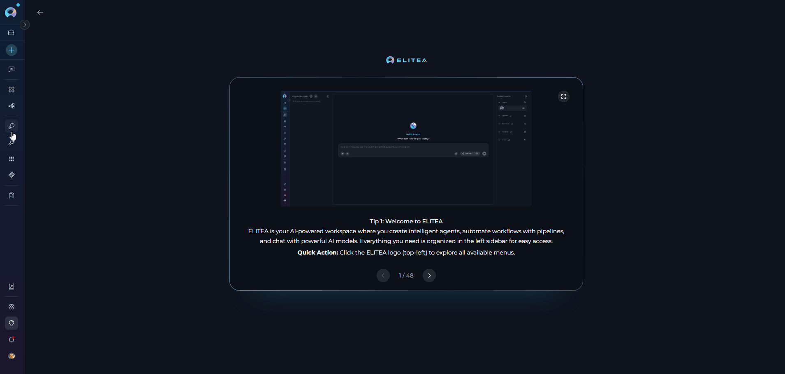
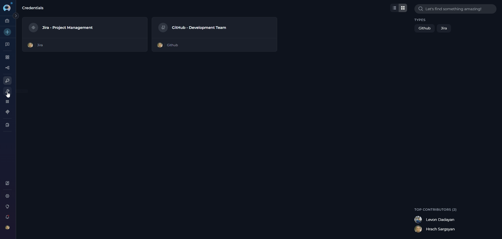
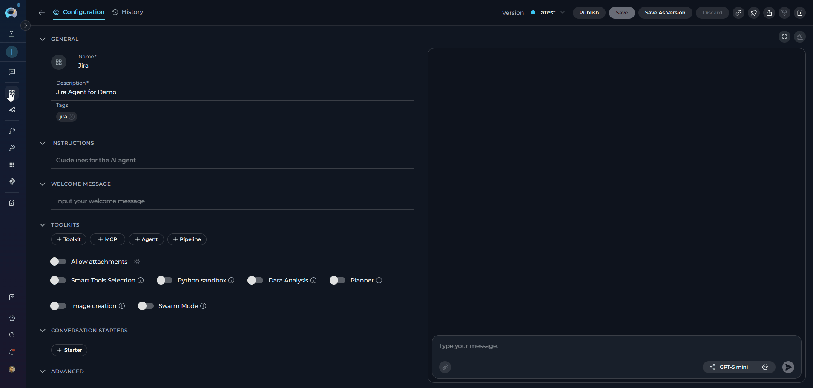
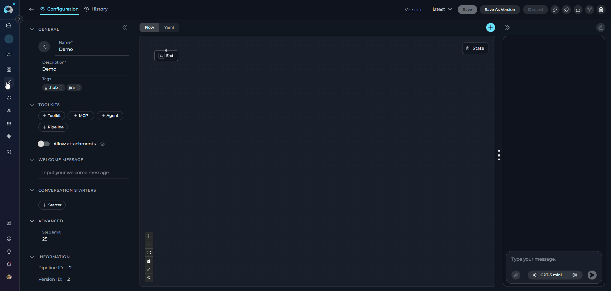
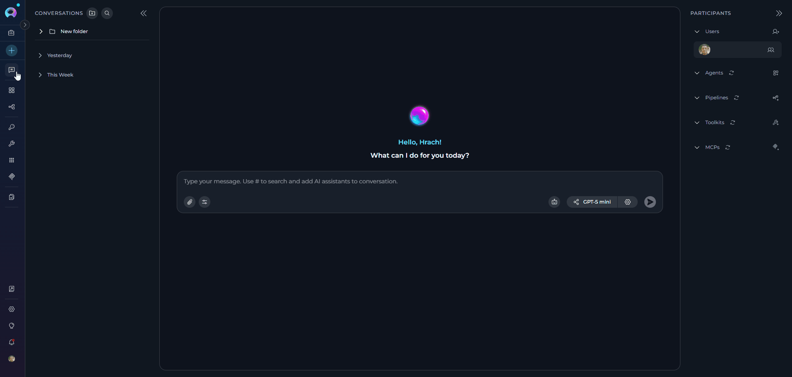
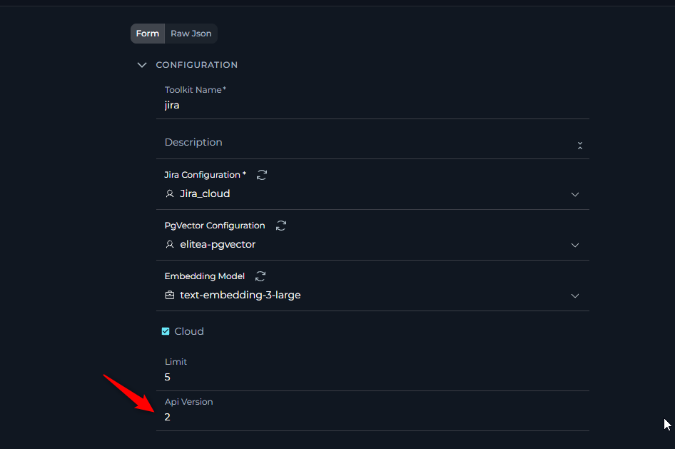

# Jira Toolkit Integration Guide

---

## Introduction

This guide is your definitive resource for integrating and effectively utilizing the **Jira toolkit** within ELITEA. It provides a detailed, step-by-step walkthrough, from setting up your Jira API token to configuring the toolkit in ELITEA and seamlessly incorporating it into your Agents. By following this guide, you will unlock the power of automated issue tracking, streamlined project management workflows, and enhanced team collaboration, all directly within the ELITEA platform. This integration empowers you to leverage AI-driven automation to optimize your Jira-driven workflows, enhance team productivity, and improve project visibility within your organization.

**Brief Overview of Jira**

Jira, by Atlassian, is a leading project management and issue tracking platform widely used by software development teams and various business teams for planning, tracking, and managing work. It serves as a central hub for teams to collaborate on projects, manage tasks, track bugs, and streamline workflows. Jira offers a wide array of functionalities, including:

*   **Robust Issue Tracking:** Jira provides a powerful and customizable issue tracking system that allows teams to capture, organize, and track all types of work items, including bugs, tasks, user stories, and feature requests, ensuring comprehensive issue management throughout the project lifecycle.
*   **Agile Project Management:** Jira is designed to support Agile methodologies like Scrum and Kanban, offering features such as Scrum boards, Kanban boards, sprint planning tools, and backlog management, enabling teams to effectively plan, execute, and track agile projects.
*   **Customizable Workflows:** Jira allows for the creation of highly customizable workflows to match specific project needs and team processes. Workflows can be tailored to reflect different stages of work items, approval processes, and automated transitions, streamlining project workflows and improving efficiency.
*   **Comprehensive Reporting and Analytics:** Jira provides a wide range of reporting and analytics features, offering real-time insights into project progress, team performance, issue resolution times, and other key metrics, enabling data-driven decision-making and continuous improvement.
*   **Seamless Integration Ecosystem:** Jira integrates seamlessly with a vast ecosystem of Atlassian tools and third-party applications, including Confluence, Bitbucket, and various development and collaboration tools, creating a unified and connected DevOps environment.

Integrating Jira with ELITEA brings these powerful project management and issue tracking capabilities directly into your AI-driven workflows. Your ELITEA Agents can then intelligently interact with your Jira projects and issues to automate task management, enhance project tracking, improve team collaboration, and leverage AI to optimize your entire project management lifecycle within Jira.

---

## Toolkit's Account Setup and Configuration in Jira

**Account Setup**

If you do not yet have a Jira account, please follow these steps to create one:

1.  **Visit Atlassian Website:** Open your web browser and navigate to the official Atlassian website: [https://www.atlassian.com/software/jira](https://www.atlassian.com/software/jira).
2.  **Sign Up for Jira:** Click on the **"Try Jira free"** or **"Get it free"** button to start the sign-up process for Jira.
3.  **Create an Atlassian Account:** Follow the prompts to create an Atlassian account. You can sign up using your email address, Google account, or Apple account. For professional use, it's recommended to use your company email address.
4.  **Choose a Workspace/Site Name:** During the signup process, you will be asked to choose a workspace or site name for your Jira instance. Enter a suitable name for your workspace.
5.  **Set Up Your Project:** Follow the remaining onboarding steps to set up your first Jira project. You will be prompted to choose a project template (e.g., Scrum, Kanban) and provide a project name.
6.  **Explore Jira Features:** Once your Jira board is ready, explore the onboarding tips and familiarize yourself with Jira features, projects, boards, and navigation.

### Generate an API Token

For secure integration with ELITEA, it is essential to use a Jira **API token** for authentication. This method is more secure than using your primary Jira account password directly and allows you to control access permissions.

**Follow these steps to generate an API token in Jira:**

1.  **Log in to Jira:** Access your Jira workspace by navigating to your Jira URL (e.g., `your-workspace.atlassian.net`) and logging in with your credentials.
2.  **Access Account Settings:** Click on your profile avatar in the top right corner of the Jira interface. From the dropdown menu, select **"Manage account"**.

    

3.  **Navigate to Security Settings:** In the Atlassian account settings page, navigate to the **"Security"** section in the left-hand sidebar.
4.  **Access API Tokens:** Within the "Security" settings, locate the **"API tokens"** section and click on **"Create and manage API tokens"**.
5.  **Create API Token:** On the "API tokens" page, click the **"Create API token"** button.
6.  **Name Your Token:** In the "Create API token" dialog, enter a descriptive **Label** for your token, such as "ELITEA Integration Token" or "ELITEA Agent Access." This label will help you identify the purpose of this token later.
7.  **Create Token:** Click the **"Create"** button to generate the API token.
8.  **Securely Copy and Store Your API Token:**  **Immediately copy the generated API token** that is displayed in the pop-up window. **This is the only time you will see the full token value.** Store it securely in a password manager or, preferably, ELITEA's built-in Secrets feature for enhanced security within ELITEA. You will need this API token to configure the Jira toolkit in ELITEA.

    

## System Integration with ELITEA

To integrate Jira with ELITEA, you need to follow a three-step process: **Create Credentials → Create Toolkit → Use in Agents**. This workflow ensures secure authentication and proper configuration.

### Step 1: Create Jira Credentials

Before creating a toolkit, you must first create Jira credentials in ELITEA:

1. **Navigate to Credentials Menu:** Open the sidebar and select **[Credentials](../../menus/credentials.md)**.
2. **Create New Credential:** Click the **`+ Create`** button.
3. **Select Jira:** Choose **Jira** as the credential type.
4. **Configure Credential Details:**
     * **Display Name:** Enter a descriptive name (e.g., "Jira - Project Management")
     * **Base URL:** Enter the base URL of your Jira instance (e.g., `https://yourcompany.atlassian.net` for Jira Cloud or `https://jira.epam.com` for Epam Jira)
     * **Authentication Method:** Choose your preferred authentication method:
         * **Basic:** Enter your username and API key
         * **Bearer:** Enter your token
5. **Test Connection:** Click **Test Connection** to verify that your credentials are valid and ELITEA can successfully connect to Jira
6. **Save Credential:** Click **Save** to create the credential. After saving, your Jira credential will be added to the credentials dashboard and will be ready to use in toolkit configurations. You can view, edit, or delete it from the **Credentials** menu at any time.



!!! tip "Security Recommendation"
    It's highly recommended to use **[Secrets](../../menus/settings/secrets.md)** for API keys and tokens instead of entering them directly. Create a secret first, then reference it in your credential configuration.

---

### Step 2: Create Jira Toolkit

Once your credentials are configured, create the Jira toolkit:

1. **Navigate to Toolkits Menu:** Open the sidebar and select **[Toolkits](../../menus/toolkits.md)**.
2. **Create New Toolkit:** Click the **`+ Create`** button.
3. **Select Jira:** Choose **Jira** from the list of available toolkit types.
4. **Configure Toolkit Details:**
     * **Toolkit Name:** Enter a descriptive name for your toolkit (e.g., "Jira Project Management", "Development Team Jira")
     * **Description:** Provide a brief description of the toolkit's purpose (e.g., "Jira integration for automated issue tracking and project management")
5. **Configure Credentials:** 
     * In the **Configuration** section, select your previously created Jira credential from the **Credentials** dropdown
6. **Configure Advanced Options:**
     * **PgVector Configuration:** Select a PgVector connection for vector database integration 
     * **Embedding Model:** Select an embedding model for text processing and semantic search capabilities
7. **Configure Jira Settings:**
     * **Hosting Option:** Select the appropriate hosting option:
         * **Cloud:** For Jira Cloud (e.g., `atlassian.net`)
         * **Server:** For self-hosted Jira Server or Data Center instances (e.g., `https://jira.epam.com`)
     * **Advanced Settings:**
         * **Limit:** Set the maximum number of issues to retrieve per request (default: 5)
         * **API version:** REST API version ( Currentl for jira cloud , you need to use 3 as api version, for Epam Jira version 2 )
         * **Labels:** Specify labels to apply to created or updated entities (comma-separated list e.g., `alita,elitea`)
         * **Additional fields:** Custom field IDs accessible within the toolkit (e.g., `customfield_100450`)
         * **Custom Headers:** Additional HTTP headers to include with API requests (JSON format e.g., `{"X-Custom-Header": "value"}`)
         * **Verify SSL:** Enable SSL verification for secure connections (recommended: enabled)
8. **Enable Desired Tools:** In the **"Tools"** section, select the checkboxes next to the specific Jira tools you want to enable. **Enable only the tools your agents will actually use** to follow the principle of least privilege
       * **[Make Tools Available by MCP](../mcp/make-tools-available-by-mcp.md)** - (optional checkbox) Enable this option to make the selected tools accessible through the external MCP clients to use the toolkit's capabilities
9. **Save Toolkit:** Click **Save** to create the toolkit



#### Available Tools:

The Jira toolkit provides the following tools for interacting with Jira projects and issues, organized by functional categories:

| **Tool Category** | **Tool Name** | **Description** | **Primary Use Case** |
|:-----------------:|---------------|-----------------|----------------------|
| **Search & Discovery** | | | |
| | **Search using JQL** | Search for Jira issues using Jira Query Language (JQL) queries | Find issues based on complex criteria using JQL |
| | **List projects** | Retrieve a list of all projects available in the Jira instance | Discover and list available Jira projects |
| **Issue Management** | | | |
| | **Create issue** | Create new Jira issues within a specified project | Automate issue creation from workflows |
| | **Update issue** | Modify fields of existing Jira issues | Update issue status, assignees, priorities, and custom fields |
| | **Set issue status** | Change the status of a specific Jira issue | Transition issues through workflow states |
| | **Get specific field info** | Retrieve information from a specific field of a Jira issue | Extract specific data points from issues |
| | **Get field with image descriptions** | Retrieve field information with enhanced image description support | Extract field data with visual content analysis |
| | **Modify labels** | Add or remove labels from a specific Jira issue | Categorize and organize issues with labels |
| **Communication** | | | |
| | **List comments** | Retrieve comments associated with a specific Jira issue | Access discussion history for issues |
| | **Add comments** | Add new comments to a Jira issue | Automate communication and updates |
| | **Update comment with file** | Update existing comments with file attachments | Enhance comments with supporting documentation |
| | **Get comments with image descriptions** | Retrieve comments with enhanced image description support | Access comments with visual content analysis |
| **Content & Attachments** | | | |
| | **Get attachments content** | Retrieve content of attachments from a Jira issue | Access and process attached files |
| | **Get remote links** | Retrieve remote links associated with a Jira issue | Access external resources linked to issues |
| **Relationship Management** | | | |
| | **Link issues** | Create links between Jira issues | Establish relationships and dependencies |
| **Data Management & Indexing** | | | |
| | **Index data** | Index Jira data for enhanced search and analytics | Create searchable indexes of project data |
| | **Search index** | Search through indexed Jira data for enhanced discovery | Find indexed content and data across Jira projects |
| | **Stepback search index** | Perform stepback search through indexed data | Advanced search with contextual stepback functionality |
| | **List collections** | Retrieve available data collections | Access and manage data collection listings |
| | **Remove index** | Remove existing data indexes | Clean up and manage index storage |
| | **Stepback summary index** | Generate stepback summaries for indexed data | Create contextual summaries of indexed content |
| **Advanced Operations** | | | |
| | **Execute generic rq** | Send custom HTTP requests to Jira API | Access any Jira API endpoint not covered by specific tools |

!!! tip "Vector Search Tools"
    The tools **Index data**, **List collections**, **Remove index**, **Search index**, **Stepback search index**, and **Stepback summary index** require PgVector configuration and an embedding model. These enable advanced semantic search capabilities across your Jira projects.

#### Testing Toolkit Tools

After configuring your Jira toolkit, you can test individual tools directly from the Toolkit detailed page using the **Test Settings** panel. This allows you to verify that your credentials are working correctly and validate tool functionality before adding the toolkit to your workflows.

**General Testing Steps:**

1. **Select LLM Model:** Choose a Large Language Model from the model dropdown in the Test Settings panel
2. **Configure Model Settings:** Adjust model parameters like Creativity, Max Completion Tokens, and other settings as needed
3. **Select a Tool:** Choose the specific Jira tool you want to test from the available tools
4. **Provide Input:** Enter any required parameters or test queries for the selected tool
5. **Run the Test:** Execute the tool and wait for the response
6. **Review the Response:** Analyze the output to verify the tool is working correctly and returning expected results

!!! tip "Key benefits of testing toolkit tools:"
    * Verify that Jira credentials and connection are configured correctly
    * Test tool parameters and see actual responses from your Jira instance
    * Debug tool behavior and understand output formats
    * Optimize tool settings before integrating with agents or pipelines
    > For detailed instructions on how to use the Test Settings panel, see **[How to Test Toolkit Tools](../../how-tos/credentials-toolkits/how-to-test-toolkit-tools.md)**.

---

### Step 3: Add Jira Toolkit to Your Workflows

Now you can add the configured Jira toolkit to your agents, pipelines, or use it directly in chat:

---
#### In Agents:

1. **Navigate to Agents:** Open the sidebar and select **[Agents](../../menus/agents.md)**.
2. **Create or Edit Agent:** Either create a new agent or select an existing agent to edit.
3. **Add Jira Toolkit:** 
     * In the **"TOOLKITS"** section of the agent configuration, click the **"+Toolkit"** icon
     * Select your configured Jira toolkit from the dropdown list
     * The toolkit will be added to your agent with the previously configured tools enabled

Your agent can now interact with Jira using the configured toolkit and enabled tools.



---
#### In Pipelines:

1. **Navigate to Pipelines:** Open the sidebar and select **[Pipelines](../../menus/pipelines.md)**.
2. **Create or Edit Pipeline:** Either create a new pipeline or select an existing pipeline to edit.
3. **Add Jira Toolkit:** 
     * In the **"TOOLKITS"** section of the pipeline configuration, click the **"+Toolkit"** icon
     * Select your configured Jira toolkit from the dropdown list
     * The toolkit will be added to your pipeline with the previously configured tools enabled

 

---
#### In Chat:

1. **Navigate to Chat:** Open the sidebar and select **[Chat](../../menus/chat.md)**.
2. **Start New Conversation:** Click **+Create** or open an existing conversation.
3. **Add Toolkit to Conversation:**
     * In the chat Participants section, look for the **Toolkits** element
     * Click the **"Add Tools"** Icon to open the tools selection dropdown
     * Select your configured Jira toolkit from the dropdown list
     * The toolkit will be added to your conversation with all previously configured tools enabled
4. **Use Toolkit in Chat:** You can now directly interact with your Jira projects and issues by asking questions or requesting actions that will trigger the Jira toolkit tools.

!!! example "Example Chat Usage:"
    - "Show me all open bugs in project DEMO that are assigned to me."
    - "Create a new high-priority bug report for the login issue."
    - "Add a comment to issue DEMO-123 saying I've started working on it."
    - "Search for all user stories related to authentication."



---
## Instructions and Prompts for Using the Jira Toolkit

To effectively instruct your ELITEA Agent to use the Jira toolkit, you need to provide clear and precise instructions within the Agent's "Instructions" field. These instructions are crucial for guiding the Agent on *when* and *how* to utilize the available Jira tools to achieve your desired automation goals.

### Instruction Creation for Agents

When crafting instructions for the Jira toolkit, especially for OpenAI-based Agents, clarity and precision are paramount. Break down complex tasks into a sequence of simple, actionable steps. Explicitly define all parameters required for each tool and guide the Agent on how to obtain or determine the values for these parameters. OpenAI Agents respond best to instructions that are:

*   **Direct and Action-Oriented:** Employ strong action verbs and clear commands to initiate actions. For example, "Use the 'search_using_jql' tool...", "Create an issue with...", "Update issue with key...".

*   **Parameter-Centric:** Clearly enumerate each parameter required by the tool. For each parameter, specify:
    *   Its name (exactly as expected by the tool)
    *   The format or type of value expected
    *   How the Agent should obtain the value – whether from user input, derived from previous steps in the conversation, retrieved from an external source, or a predefined static value

*   **Contextually Rich:** Provide sufficient context so the Agent understands the overarching objective and the specific scenario in which each Jira tool should be applied within the broader workflow. Explain the desired outcome or goal for each tool invocation.

*   **Step-by-Step Structure:** Organize instructions into a numbered or bulleted list of steps for complex workflows. This helps the Agent follow a logical sequence of actions.

*   **Add Conversation Starters:** Include example conversation starters that users can use to trigger this functionality. For example, "Conversation Starters: 'Create a new bug issue', 'Search for issues assigned to me', 'What's the status of project tasks?'"

When instructing your Agent to use a Jira toolkit tool, adhere to this structured pattern:

1. **State the Goal:** Begin by clearly stating the objective you want to achieve with this step. For example, "Goal: To find all open issues assigned to the current user."

2. **Specify the Tool:** Clearly indicate the specific Jira tool to be used for this step. For example, "Tool: Use the 'search_using_jql' tool."

3. **Define Parameters:** Provide a detailed list of all parameters required by the selected tool. For each parameter:
   - **Parameter Name:** `<Parameter Name as defined in tool documentation>`
   - **Value or Source:** `<Specify the value or how to obtain the value. Examples: "user input", "from previous step", "hardcoded value 'PROJECT-123'", "value of variable X">`

4. **Describe Expected Outcome (Optional but Recommended):** Briefly describe the expected result or outcome after the tool is successfully executed. For example, "Outcome: The Agent will provide a list of all open issues assigned to the user."

5. **Add Conversation Starters:** Include example conversation starters that users can use to trigger this functionality.

!!! example "Example Agent Instructions"
    **Agent Instructions for Searching Issues using JQL:**

    ```markdown
    1. Goal: Search for Jira issues using JQL to find specific issues based on user criteria.
    2. Tool: Use the "search_using_jql" tool.
    3. Parameters:
        - JQL Query: "Ask the user for search criteria or use predefined JQL like 'project = PROJECT AND status = \"In Progress\" AND assignee = currentUser()'"
    4. Outcome: The Agent will provide a list of issues matching the JQL criteria.
    5. Conversation Starters: 'Show me my open issues', 'Find all bugs in the project', 'Search for high priority tasks'
    ```

    **Agent Instructions for Creating a New Issue:**

    ```markdown
    1. Goal: Create a new issue in Jira based on user requirements.
    2. Tool: Use the "create_issue" tool.
    3. Parameters:
        - Issue JSON: "Collect required information from user (summary, description, issue type, priority) and format as JSON"
    4. Outcome: The Agent will create a new issue and provide the issue key and URL.
    5. Conversation Starters: 'Create a new bug report', 'Add a task to the project', 'Report a new issue'
    ```

---

### Chat Usage Examples by Tool Category

The following examples demonstrate how to interact with the Jira toolkit in ELITEA Chat, organized by functional categories. Each example shows the user request and the expected agent behavior.

??? example "Search & Discovery - Search using JQL"

    **Chat Example:**
    ```
    User: "Find all open bugs assigned to me in the DEMO project."

    Agent Response: [Agent uses search_using_jql tool]

    🔍 **JQL Search Results**:

    **📋 Found 3 open bugs assigned to you**:

    1. **DEMO-456** - "Login button not responsive on mobile"
       - **Status**: In Progress
       - **Priority**: High
       - **Assignee**: john.doe@company.com
       - **URL**: https://yourcompany.atlassian.net/browse/DEMO-456

    2. **DEMO-789** - "Database connection timeout error"
       - **Status**: Open
       - **Priority**: Critical
       - **Assignee**: john.doe@company.com
       - **URL**: https://yourcompany.atlassian.net/browse/DEMO-789

    Would you like me to get more details about any specific issue?
    ```

??? example "Issue Management - Create Issue"

    **Chat Example:**
    ```
    User: "Create a new bug report for the checkout process failing on Safari browser."

    Agent Response: [Agent uses create_issue tool]

    ✅ **Issue Created Successfully!**

    **🐛 New Bug Report Details**:
    - **Issue Key**: DEMO-123
    - **Summary**: "Checkout process failing on Safari browser"
    - **Issue Type**: Bug
    - **Priority**: High
    - **Status**: Open
    - **URL**: https://yourcompany.atlassian.net/browse/DEMO-123

    **📝 Issue Description**:
    Bug report for checkout process failure specifically occurring on Safari browser. Investigation needed to identify root cause and implement fix.

    The issue is now ready for assignment and tracking!
    ```

??? example "Communication - Add Comments"

    **Chat Example:**
    ```
    User: "Add a comment to issue DEMO-123 saying that I've started investigating the Safari compatibility issue."

    Agent Response: [Agent uses add_comments tool]

    💬 **Comment Added Successfully!**

    **Issue**: DEMO-123 - "Checkout process failing on Safari browser"
    **Comment Added**: "Started investigating the Safari compatibility issue. Will check browser-specific JavaScript errors and CSS rendering differences."

    You can view the updated issue at: https://yourcompany.atlassian.net/browse/DEMO-123
    ```

??? example "Relationship Management - Link Issues"

    **Chat Example:**
    ```
    User: "Link issue DEMO-123 to DEMO-456 with 'Relates to' relationship."

    Agent Response: [Agent uses link_issues tool]

    🔗 **Issues Linked Successfully!**

    **Link Created**:
    - **Inward Issue**: DEMO-123 (Checkout process failing on Safari browser)
    - **Outward Issue**: DEMO-456 (Login button not responsive on mobile)
    - **Link Type**: Relates to

    Both issues are now connected, showing their relationship in the issue view. This helps track related problems and their potential common solutions.
    ```

---

## Troubleshooting

??? warning "Credential Not Appearing in Toolkit Configuration"
    **Problem:** When creating a toolkit, your Jira credential doesn't appear in the credentials dropdown.
    
    **Troubleshooting Steps:**
    
    1. **Check Credential Scope:** Ensure you're working in the same workspace/project where the credential was created. Private credentials are only visible in your Private workspace, while project credentials are visible within the specific team project.
    2. **Verify Credential Creation:** Go to the Credentials menu and confirm that your Jira credential was successfully saved.
    3. **Credential Type Match:** Ensure you selected "Jira" as the credential type when creating the credential.

??? warning "Connection Errors"
    **Problem:** ELITEA Agent fails to establish a connection with Jira, resulting in errors during toolkit execution.
    
    **Troubleshooting Steps:**
    
    1. **Verify Jira URL:** Ensure that the **Base URL** field in the credential configuration is correctly set to your Jira instance URL (e.g., `https://yourcompany.atlassian.net` for Cloud or `https://jira.epam.com` for Server). Avoid including `/jira` at the end unless necessary for your specific setup.
    2. **Check API Token:** Double-check that the **API Token** you have provided is accurate, has not expired, and is valid for your Jira account. Carefully re-enter or copy-paste the token to rule out typos.
    3. **Verify Authentication Method:** Review the **authentication method** selected in your credential configuration. Ensure it matches the type of credentials you've provided (Basic for username+API key, Bearer for token).
    4. **Network Connectivity:** Confirm that both your ELITEA environment and the Jira service are connected to the internet and that there are no network connectivity issues, firewalls, or proxies blocking the integration.

??? warning "Authorization Errors (Permission Denied/Unauthorized)"
    **Problem:** Agent execution fails with "Permission Denied" or "Unauthorized" errors when attempting to access or modify Jira resources, even with a seemingly valid token.
    
    **Troubleshooting Steps:**
    
    1. **Re-verify API Token Validity:** Ensure that the API token is valid and has not been revoked in your Atlassian account settings. Generate a new token if necessary.
    2. **Jira Account Permissions:** Confirm that the Jira account associated with the API token has the necessary access permissions within Jira to access and modify the specific projects and issues your Agent is trying to interact with. Verify project and issue permissions within Jira project settings.
    3. **Hosting Option Verification:** Double-check that you have selected the correct **Hosting option** (Cloud or Server) in the toolkit configuration. Using the wrong hosting option can lead to authentication and connection errors.

??? warning "Tool-Specific Parameter Errors"
    **Problem:** Agent execution fails for specific Jira tools due to incorrect parameter values or formats.
    
    **Troubleshooting Steps:**
    
    1. **Verify Project Keys:** Ensure that you are using the correct Jira Project Keys in your Agent's instructions. Project Keys are case-sensitive and must exactly match the project keys in your Jira instance. Use the "List projects" tool to verify project keys if needed.
    2. **Verify Issue Keys:** Double-check that you are using the correct Jira Issue Keys when referencing specific issues in your Agent's instructions. Issue Keys are case-sensitive and must match the issue keys in Jira exactly (e.g., "DEMO-123", "PROJECT-456").
    3. **Parameter Format:** Verify that you are providing parameters in the correct format expected by each Jira tool (e.g., string values for names, numerical values for IDs, JSON format for issue updates). Refer to the "Instructions and Prompts for Using the Toolkit" section for parameter details and examples.
    4. **Custom Fields:** If you are using custom fields in your Agent instructions, ensure that you have added the correct **Additional Fields** IDs in the toolkit's "Advanced Settings" and that you are using the correct custom field IDs and values in your Agent instructions. Use the "Get specific field info" tool to verify custom field IDs and values if needed.

??? warning "Toolkit Configuration Issues"
    **Problem:** The toolkit fails to load or shows configuration errors after creation.
    
    **Troubleshooting Steps:**
    
    1. **Verify Credential Selection:** Ensure you have selected the correct credential from the dropdown in the toolkit configuration.
    2. **Check Hosting Option:** Verify that the hosting option matches your Jira instance type (Cloud for *.atlassian.net, Server for self-hosted instances).
    3. **Review Advanced Settings:** Check that custom field IDs and other advanced settings are properly formatted.

??? warning "Limited Number of Issues Returned"
    **Problem:** When using JQL search or listing issues, the toolkit returns only a limited number of issues (e.g., not more than 5) even when more issues match the criteria.
    
    **Symptoms:**
    
    - JQL searches return fewer results than expected
    - Issue lists appear incomplete
    - Large projects show only partial issue sets
    
    **Troubleshooting Steps:**
    
    1. **Check Limit Configuration:** In the toolkit configuration, locate the **"Limit"** field in the Advanced Settings section.
    2. **Increase Limit Value:** Change the limit from the default value (typically 5) to a higher value that meets your needs (e.g., 50, 100, or 500).
    3. **Save Configuration:** Save the toolkit configuration to apply the new limit.
    4. **Test Results:** Run your JQL query or list operation again to verify more issues are returned.
    
    

??? warning "Atlassian API Connection Issues (Too Many Redirects)"
    **Error Message:**
    ```
    requests.exceptions.TooManyRedirects: Exceeded 30 redirects
    ```
    
    **Symptoms:**
    
    - Jira or Confluence tools refuse to connect
    - Multiple redirect errors during connection attempts
    - Some tools work while others fail (e.g., basic operations work but image-related tools fail)
    
    **Cause:**
    The API version is set incorrectly or is null in the toolkit configuration. As of November 2025:
    
    - **Atlassian Cloud:** API version 3
    - **EPAM Jira platform:** API version 2
    
    **Troubleshooting Steps:**
    
    1. **Check API Version:** In the toolkit configuration, locate the **"API version"** field in the Advanced Settings section.
    2. **Set Correct Version:** Update the API version to match your deployment:
        - For Atlassian Cloud instances: Set to **3**
        - For EPAM Jira or self-hosted instances: Set to **2**
    3. **Save Configuration:** Save the toolkit configuration to apply the new API version.
    4. **Contact Support:** If unsure about your deployment type, contact your system administrator or ELITEA support to confirm the correct API version.
    5. **Test Functionality:** Note that some requests may work with both v2 and v3, so partial functionality doesn't guarantee the configuration is correct. Test multiple tools to ensure full compatibility.
    
    

### Support Contact

If you encounter issues not covered in this guide or need additional assistance with Jira integration, please refer to **[Contact Support](../../support/contact-support.md)** for detailed information on how to reach the ELITEA Support Team.

---

## FAQ

??? question "Can I use my regular Jira password for the ELITEA integration?"
    **While ELITEA supports password authentication, using a Jira API token is strongly recommended for security.** API tokens provide a significantly more secure and controlled method for granting access to external applications like ELITEA, without exposing your primary account credentials. You can configure this in the credential's authentication method selection.

??? question "What permissions are absolutely necessary for the Jira API token to work with ELITEA?"
    Jira API tokens have a fixed scope and provide access to the Jira REST API. The specific permissions depend on what your ELITEA Agent will be doing:
    
    - For basic read-only access (e.g., using `search_using_jql`, `list_projects`), standard API access is sufficient.
    - For modifications (e.g., `create_issue`, `update_issue`), ensure your Jira account has write permissions to the target projects.
    
    **Always adhere to the principle of least privilege and grant only the permissions that are strictly necessary for your Agent's intended functionalities.**

??? question "What is the correct format for the Jira URL in the ELITEA credential configuration?"
    The Jira URL should be entered as the base URL without the `/jira` suffix:
    
    - For Jira Cloud: `https://yourcompany.atlassian.net`
    - For Jira Server: `https://jira.epam.com`
    
    Ensure there are no typos or missing parts in the URL.

??? question "How do I switch from the old Agent-based configuration to the new Credentials + Toolkit workflow?"
    The new workflow is:
    
    1. Create a Jira credential with your authentication details
    2. Create a Jira toolkit that uses this credential
    3. Add the toolkit to your agents, pipelines, or chat
    
    This provides better security, reusability, and organization compared to configuring authentication directly in agents.

??? question "Can I use the same Jira credential across multiple toolkits and agents?"
    Yes! This is one of the key benefits of the new workflow. Once you create a Jira credential, you can reuse it across multiple Jira toolkits, and each toolkit can be used by multiple agents, pipelines, and chat sessions. This promotes better credential management and reduces duplication.

??? question "Why am I consistently encountering 'Permission Denied' errors, even though I believe I have configured everything correctly?"
    If you are still facing "Permission Denied" errors despite careful configuration, systematically re-examine the following:
    
    - **API Token Validity:** Double-check that the API token is still valid and has not been revoked in your Atlassian account settings.
    - **Jira Account Permissions:** Explicitly verify that the Jira account associated with the API token has the necessary access rights to the specific target projects within Jira itself. Confirm project membership, permissions, and assigned roles within the Jira project settings.
    - **Hosting Option Match:** Double-check that you have selected the correct "Hosting option" (Cloud or Server) in the toolkit configuration, especially for self-hosted or enterprise Jira instances.
    - **Credential Configuration:** Carefully review the credential configuration in ELITEA, especially the authentication method selection and token/password fields for any hidden typographical errors or accidental whitespace.
    
    If, after meticulously checking all of these points, you still encounter "Permission Denied" errors, please reach out to ELITEA Support with detailed information for further assistance.

??? question "Why do I get 'Permission Denied' when using EPAM Jira (https://jiraeu.epam.com), even though my token worked before?"
    This is a known EPAM Jira behavior and is **not an ELITEA issue**.

    **Root cause (confirmed by EPAM Support): floating license management**

    - EPAM Jira licenses are limited and shared across employees.
    - If your account is inactive for a period (often ~30 minutes), your license can be automatically reallocated to another active user.
    - How quickly this happens can depend on how many other users become active after your last session.
    - When this happens, your API token can effectively stop working and the toolkit can start returning **Permission Denied/Unauthorized** errors.
    - Logging in via browser reclaims an active license, after which the toolkit typically works again.

    **What you can do**

    1. **Before running agents/pipelines that use Jira**, open a browser and log in to `https://jiraeu.epam.com/`.
    2. For stable automation, **request a dedicated service account** and coordinate with support to assign a **permanent Jira license** to that account.

    Service account request form:
    [Managing service accounts](https://support.epam.com/ess?id=sc_cat_item&sys_id=76f3375797795d10386e3a871153affa&name=ManagingServiceAccounts&sysparm_copy_vars=%7B%22u_employee_account_management%22%3A%22%22%2C%22u_Actiontobeperformed%22%3A%22%22%2C%22u_select_item%22%3A%22Service%20account%20management%22%2C%22u_action%22%3A%22Create%20service%20account%22%2C%22u_keyword_order_guide%22%3A%22%7B%5Cr%5Cn%20%20%5C%22contains%5C%22%3A%20%5C%22password%2Cprivileged%20account%2Clegacy%2Cauthentication%2CPIN%2Cservice%20account%5C%22%2C%5Cr%5Cn%20%20%5C%22notContains%5C%22%3A%20%5C%22CyberArk%2Clocal%20admin%5C%22%5Cr%5Cn%7D%22%7D)

??? question "What are some best practices for using the Jira toolkit effectively?"
    **Test Integration Thoroughly:**
    
    - After setting up the Jira toolkit and incorporating it into your Agents, thoroughly test each tool you intend to use to ensure seamless connectivity, correct authentication, and accurate execution of Jira actions.
    
    **Monitor Agent Performance:**
    
    - Regularly monitor the performance of Agents utilizing Jira toolkits. Track metrics such as task completion success rate, execution time, and error rates to identify any potential issues or areas for optimization.
    
    **Follow Security Best Practices:**
    
    - Use API Tokens instead of your main account password for integrations
    - Grant only the minimum necessary permissions (principle of least privilege)
    - Securely Store Credentials using ELITEA's Secrets Management feature
    
    **Provide Clear Instructions:**
    
    - Craft clear and unambiguous instructions within your ELITEA Agents to guide them in using the Jira toolkit effectively. Use the prompt examples provided in this guide as a starting point.
    
    **Start Simple:**
    
    - Begin by implementing Jira integration for simpler automation tasks, such as retrieving issue lists or updating issue statuses, and gradually progress to more complex workflows as you gain experience.
    
    **Leverage Advanced Settings:**
    
    - Utilize the "Advanced Settings" in the toolkit configuration, specifically the "Additional Fields" option, to ensure your Agent can interact with and manage custom fields specific to your Jira projects.

??? question "What are common use cases for Jira toolkit integration?"
    **Automated Issue Reporting:**
    
    - When automated tests detect bugs, automatically create Jira issues pre-populated with error information, logs, and environment details.
    
    **Dynamic Task Prioritization:**
    
    - Dynamically reprioritize Jira issues based on real-time data from monitoring systems, customer feedback, or changing business priorities.
    
    **Automated Status Updates:**
    
    - As tasks progress through ELITEA workflows, automatically update the status of linked Jira issues to reflect current progress in real-time.
    
    **Intelligent Commenting:**
    
    - Automatically add comments to Jira issues to provide status updates, notify assignees of new tasks, or request clarification.
    
    **Dependency Management:**
    
    - When creating new Jira issues for sub-tasks or related features, automatically link them to parent issues or related user stories to establish clear dependencies.

---

!!! reference "Documentation and Guides"
    - **[How to Use Chat Functionality](../../how-tos/chat-conversations/how-to-use-chat-functionality.md)** - *Complete guide to using ELITEA Chat with toolkits for interactive GitHub operations.*
    - **[Create and Edit Agents from Canvas](../../how-tos/chat-conversations/how-to-create-and-edit-agents-from-canvas.md)** - *Learn how to quickly create and edit agents directly from chat canvas for rapid prototyping and workflow automation.*
    - **[Create and Edit Toolkits from Canvas](../../how-tos/chat-conversations/how-to-create-and-edit-toolkits-from-canvas.md)** - *Discover how to create and configure GitHub toolkits directly from chat interface for streamlined workflow setup.*
    - **[Create and Edit Pipelines from Canvas](../../how-tos/chat-conversations/how-to-create-and-edit-pipelines-from-canvas.md)** - *Guide to building and modifying pipelines from chat canvas for automated GitHub workflows.*
    - **[Indexing Overview](../../how-tos/indexing/indexing-overview.md)** - *Comprehensive guide to understanding ELITEA's indexing capabilities and how to leverage them for enhanced search and discovery.*
    - **[How to Index Jira Data](../../how-tos/indexing/index-jira-data.md)** - *Complete guide for indexing your Jira projects and issues to enable advanced search and AI-powered analysis capabilities.*
    - **[Secrets Management](../../menus/settings/secrets.md)** - *Best practices for securely storing API tokens and sensitive credentials.*
    - **[AI Configuration](../../menus/settings/ai-configuration.md)** - *Essential settings and configurations for optimizing AI performance with integrations.*

!!! reference "External Jira Resources"
    - **[Atlassian Account Settings](https://id.atlassian.com/manage-profile/security)** - *Manage API tokens and security configurations.*
    - **[Jira API Tokens](https://id.atlassian.com/manage-profile/security/api-tokens)** - *Create and manage API tokens for secure integrations.*
    - **[Jira REST API Documentation](https://developer.atlassian.com/cloud/jira/platform/rest/v2/)** - *Official API documentation for developers.*
    - **[JQL Documentation](https://confluence.atlassian.com/jirasoftwareserver/advanced-searching-jql-reference-765593971.html)** - *Learn advanced search queries with Jira Query Language.*
    - **[Atlassian Community](https://community.atlassian.com/t5/Jira/ct-p/jira)** - *Community support, articles, FAQs, and troubleshooting guides.*