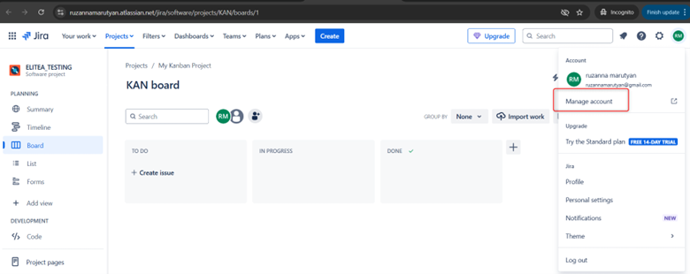
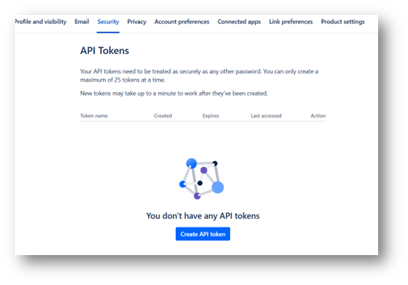
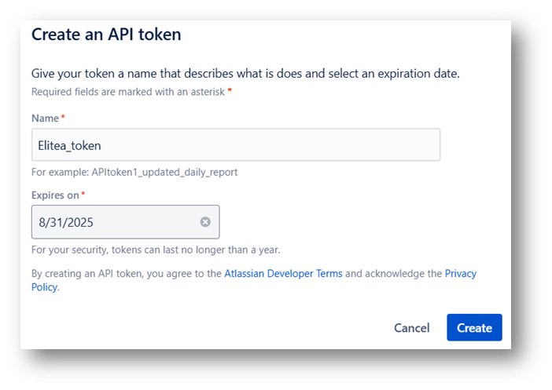
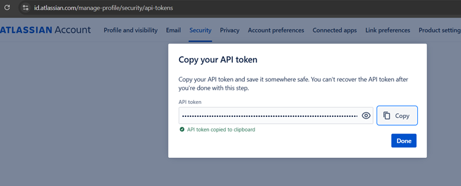
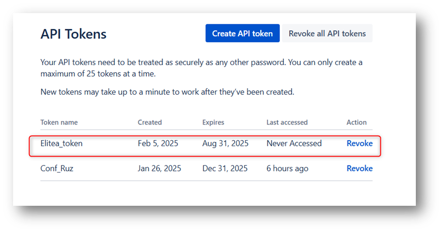
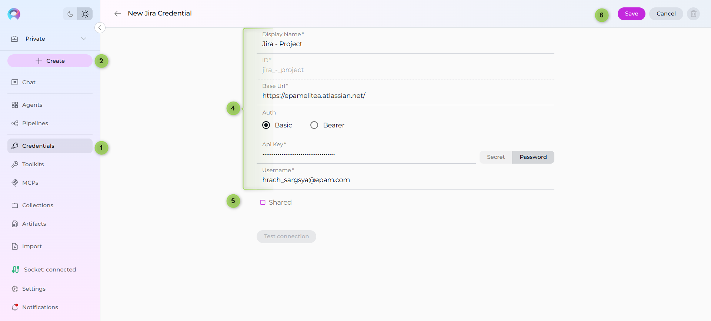
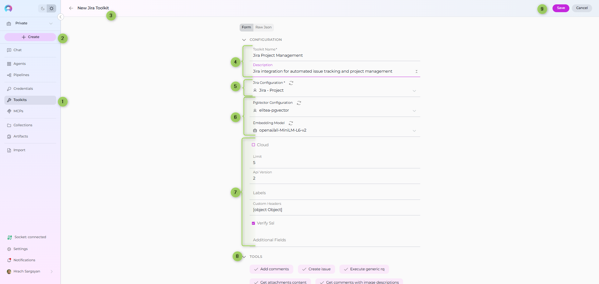
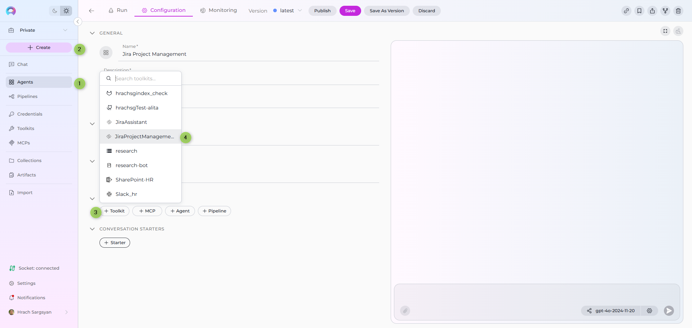
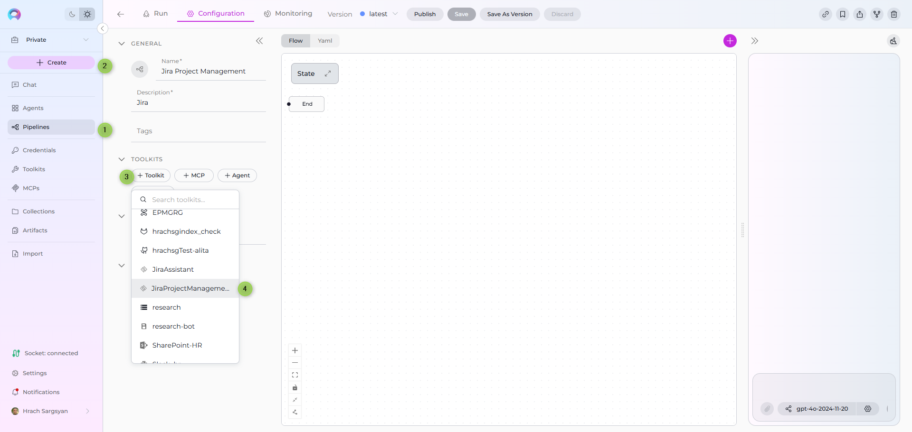
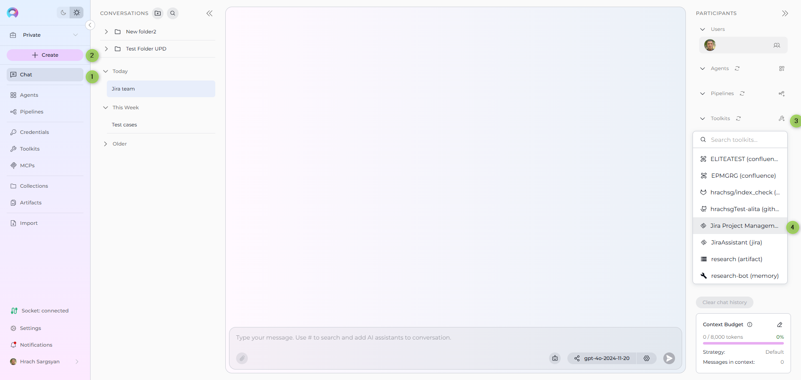

# ELITEA Toolkit Guide: Jira Integration

## Introduction

### Purpose of this Guide

This guide is your definitive resource for integrating and effectively utilizing the **Jira toolkit** within ELITEA. It provides a detailed, step-by-step walkthrough, from setting up your Jira API token to configuring the toolkit in ELITEA and seamlessly incorporating it into your Agents. By following this guide, you will unlock the power of automated issue tracking, streamlined project management workflows, and enhanced team collaboration, all directly within the ELITEA platform. This integration empowers you to leverage AI-driven automation to optimize your Jira-driven workflows, enhance team productivity, and improve project visibility within your organization.

### Brief Overview of Jira

Jira, by Atlassian, is a leading project management and issue tracking platform widely used by software development teams and various business teams for planning, tracking, and managing work. It serves as a central hub for teams to collaborate on projects, manage tasks, track bugs, and streamline workflows. Jira offers a wide array of functionalities, including:

*   **Robust Issue Tracking:** Jira provides a powerful and customizable issue tracking system that allows teams to capture, organize, and track all types of work items, including bugs, tasks, user stories, and feature requests, ensuring comprehensive issue management throughout the project lifecycle.
*   **Agile Project Management:** Jira is designed to support Agile methodologies like Scrum and Kanban, offering features such as Scrum boards, Kanban boards, sprint planning tools, and backlog management, enabling teams to effectively plan, execute, and track agile projects.
*   **Customizable Workflows:** Jira allows for the creation of highly customizable workflows to match specific project needs and team processes. Workflows can be tailored to reflect different stages of work items, approval processes, and automated transitions, streamlining project workflows and improving efficiency.
*   **Comprehensive Reporting and Analytics:** Jira provides a wide range of reporting and analytics features, offering real-time insights into project progress, team performance, issue resolution times, and other key metrics, enabling data-driven decision-making and continuous improvement.
*   **Seamless Integration Ecosystem:** Jira integrates seamlessly with a vast ecosystem of Atlassian tools and third-party applications, including Confluence, Bitbucket, and various development and collaboration tools, creating a unified and connected DevOps environment.

Integrating Jira with ELITEA brings these powerful project management and issue tracking capabilities directly into your AI-driven workflows. Your ELITEA Agents can then intelligently interact with your Jira projects and issues to automate task management, enhance project tracking, improve team collaboration, and leverage AI to optimize your entire project management lifecycle within Jira.

## Toolkit's Account Setup and Configuration in Jira

!!! note "Integration with ELITEA"
    The credentials you create in this section will be used when creating your Jira credential in ELITEA (Step 1 of the integration process).

### Account Setup

If you do not yet have a Jira account, please follow these steps to create one:

1.  **Visit Atlassian Website:** Open your web browser and navigate to the official Atlassian website: [https://www.atlassian.com/software/jira](https://www.atlassian.com/software/jira).
2.  **Sign Up for Jira:** Click on the **"Try Jira free"** or **"Get it free"** button to start the sign-up process for Jira.
3.  **Create an Atlassian Account:** Follow the prompts to create an Atlassian account. You can sign up using your email address, Google account, or Apple account. For professional use, it's recommended to use your company email address.
4.  **Choose a Workspace/Site Name:** During the signup process, you will be asked to choose a workspace or site name for your Jira instance. Enter a suitable name for your workspace.
5.  **Set Up Your Project:** Follow the remaining onboarding steps to set up your first Jira project. You will be prompted to choose a project template (e.g., Scrum, Kanban) and provide a project name.
6.  **Explore Jira Features:** Once your Jira board is ready, explore the onboarding tips and familiarize yourself with Jira features, projects, boards, and navigation.

### Token/API Key Generation: Creating an API Token in Jira

For secure integration with ELITEA, it is essential to use a Jira **API token** for authentication. This method is more secure than using your primary Jira account password directly and allows you to control access permissions.

**Follow these steps to generate an API token in Jira:**

1.  **Log in to Jira:** Access your Jira workspace by navigating to your Jira URL (e.g., `your-workspace.atlassian.net`) and logging in with your credentials.
2.  **Access Account Settings:** Click on your profile avatar in the top right corner of the Jira interface. From the dropdown menu, select **"Manage account"**.

    

3.  **Navigate to Security Settings:** In the Atlassian account settings page, navigate to the **"Security"** section in the left-hand sidebar.

    

4.  **Access API Tokens:** Within the "Security" settings, locate the **"API tokens"** section and click on **"Create and manage API tokens"**.

    

5.  **Create API Token:** On the "API tokens" page, click the **"Create API token"** button.
6.  **Name Your Token:** In the "Create API token" dialog, enter a descriptive **Label** for your token, such as "ELITEA Integration Token" or "ELITEA Agent Access." This label will help you identify the purpose of this token later.
7.  **Create Token:** Click the **"Create"** button to generate the API token.

    

8.  **Securely Copy and Store Your API Token:**  **Immediately copy the generated API token** that is displayed in the pop-up window. **This is the only time you will see the full token value.** Store it securely in a password manager or, preferably, ELITEA's built-in Secrets feature for enhanced security within ELITEA. You will need this API token to configure the Jira toolkit in ELITEA.





## System Integration with ELITEA

To integrate Jira with ELITEA, you need to follow a three-step process: **Create Credentials → Create Toolkit → Use in Agents**. This workflow ensures secure authentication and proper configuration.

### Step 1: Create Jira Credentials

Before creating a toolkit, you must first create Jira credentials in ELITEA:

1. **Navigate to Credentials Menu:** Open the sidebar and select **[Credentials](../../menus/credentials.md)**.
2. **Create New Credential:** Click the **`+ Create`** button.
3. **Select Jira:** Choose **Jira** as the credential type.
4. **Configure Credential Details:**
     * **Display Name:** Enter a descriptive name (e.g., "Jira - Project Management")
     * **Base URL:** Enter the base URL of your Jira instance (e.g., `https://yourcompany.atlassian.net` for Jira Cloud or `https://jira.epam.com` for Epam Jira)
     * **Authentication Method:** Choose your preferred authentication method:
         * **Basic:** Enter your username and API key
         * **Bearer:** Enter your token
5. **Shared Credential:** Check the **Shared** checkbox if you want this credential to be accessible by all team members in the current project
6. **Save Credential:** Click **Save** to create the credential



!!! tip "Security Recommendation"
    It's highly recommended to use **[Secrets](../../menus/settings/secrets.md)** for API keys and tokens instead of entering them directly. Create a secret first, then reference it in your credential configuration.

### Step 2: Create Jira Toolkit

Once your credentials are configured, create the Jira toolkit:

1. **Navigate to Toolkits Menu:** Open the sidebar and select **[Toolkits](../../menus/toolkits.md)**.
2. **Create New Toolkit:** Click the **`+ Create`** button.
3. **Select Jira:** Choose **Jira** from the list of available toolkit types.
4. **Configure Toolkit Details:**
     * **Toolkit Name:** Enter a descriptive name for your toolkit (e.g., "Jira Project Management", "Development Team Jira")
     * **Description:** Provide a brief description of the toolkit's purpose (e.g., "Jira integration for automated issue tracking and project management")
5. **Configure Credentials:** 
     * In the **Configuration** section, select your previously created Jira credential from the **Credentials** dropdown
6. **Configure Advanced Options:**
     * **PgVector Configuration:** Select a PgVector connection for vector database integration 
     * **Embedding Model:** Select an embedding model for text processing and semantic search capabilities
7. **Configure Jira Settings:**
     * **Hosting Option:** Select the appropriate hosting option:
         * **Cloud:** For Jira Cloud (e.g., `atlassian.net`)
         * **Server:** For self-hosted Jira Server or Data Center instances (e.g., `https://jira.epam.com`)
     * **Advanced Settings:**
         * **Limit:** Set the maximum number of issues to retrieve per request (default: 5)
         * **API version:** REST API version, optional (default: 2) ( Currentl for jira cloud , you need to use 3 as api version)
         * **Labels:** Specify labels to apply to created or updated entities (comma-separated list e.g., `alita,elitea`)
         * **Additional fields:** Custom field IDs accessible within the toolkit (e.g., `customfield_100450`)
         * **Custom Headers:** Additional HTTP headers to include with API requests (JSON format e.g., `{"X-Custom-Header": "value"}`)
         * **Verify SSL:** Enable SSL verification for secure connections (recommended: enabled)
8. **Enable Desired Tools:** In the **"Tools"** section, select the checkboxes next to the specific Jira tools you want to enable. **Enable only the tools your agents will actually use** to follow the principle of least privilege
9. **Save Toolkit:** Click **Save** to create the toolkit




The Jira toolkit provides the following tools for interacting with Jira projects and issues, organized by functional categories:

| **Tool Category** | **Tool Name** | **Description** | **Primary Use Case** |
|:-----------------:|---------------|-----------------|----------------------|
| **Search & Discovery** | | | |
| | **Search using JQL** | Search for Jira issues using Jira Query Language (JQL) queries | Find issues based on complex criteria using JQL |
| | **List projects** | Retrieve a list of all projects available in the Jira instance | Discover and list available Jira projects |
| **Issue Management** | | | |
| | **Create issue** | Create new Jira issues within a specified project | Automate issue creation from workflows |
| | **Update issue** | Modify fields of existing Jira issues | Update issue status, assignees, priorities, and custom fields |
| | **Set issue status** | Change the status of a specific Jira issue | Transition issues through workflow states |
| | **Get specific field info** | Retrieve information from a specific field of a Jira issue | Extract specific data points from issues |
| | **Get field with image descriptions** | Retrieve field information with enhanced image description support | Extract field data with visual content analysis |
| | **Modify labels** | Add or remove labels from a specific Jira issue | Categorize and organize issues with labels |
| **Communication** | | | |
| | **List comments** | Retrieve comments associated with a specific Jira issue | Access discussion history for issues |
| | **Add comments** | Add new comments to a Jira issue | Automate communication and updates |
| | **Get comments with image descriptions** | Retrieve comments with enhanced image description support | Access comments with visual content analysis |
| **Content & Attachments** | | | |
| | **Get attachments content** | Retrieve content of attachments from a Jira issue | Access and process attached files |
| | **Get remote links** | Retrieve remote links associated with a Jira issue | Access external resources linked to issues |
| **Relationship Management** | | | |
| | **Link issues** | Create links between Jira issues | Establish relationships and dependencies |
| **Data Management & Indexing** | | | |
| | **Index data** | Index Jira data for enhanced search and analytics | Create searchable indexes of project data |
| | **Search index** | Search through indexed Jira data for enhanced discovery | Find indexed content and data across Jira projects |
| | **Stepback search index** | Perform stepback search through indexed data | Advanced search with contextual stepback functionality |
| | **List collections** | Retrieve available data collections | Access and manage data collection listings |
| | **Remove index** | Remove existing data indexes | Clean up and manage index storage |
| | **Stepback summary index** | Generate stepback summaries for indexed data | Create contextual summaries of indexed content |
| **Advanced Operations** | | | |
| | **Execute generic rq** | Send custom HTTP requests to Jira API | Access any Jira API endpoint not covered by specific tools |

### Step 3: Use Toolkit in Agents, Pipelines, or Chat

Now you can add the configured Jira toolkit to your agents, pipelines, or use it directly in chat:

**For Agents:**

1. **Navigate to Agents:** Open the sidebar and select **[Agents](../../menus/agents.md)**.
2. **Create or Edit Agent:** Either create a new agent or select an existing agent to edit.
3. **Add Jira Toolkit:** 
     * In the **"Tools"** section of the agent configuration, click the **"+Toolkit"** icon
     * Select your configured Jira toolkit from the dropdown list
     * The toolkit will be added to your agent with the previously configured tools enabled

Your agent can now interact with Jira using the configured toolkit.




**For Pipelines:**

1. **Navigate to Pipelines:** Open the sidebar and select **[Pipelines](../../menus/pipelines.md)**.
2. **Create or Edit Pipeline:** Either create a new pipeline or select an existing pipeline to edit.
3. **Add Jira Toolkit:** 
     * In the **"Tools"** section of the pipeline configuration, click the **"+Toolkit"** icon
     * Select your configured Jira toolkit from the dropdown list
     * The toolkit will be added to your pipeline with the previously configured tools enabled

 


**For Chat:**

1. **Navigate to Chat:** Open the sidebar and select **[Chat](../../menus/chat.md)**.
2. **Add Jira Toolkit:** 
     * In the chat Participants section, look for the **Toolkits** element
     * Click the **"Add Tools"** Icon to open the tools selection dropdown
     * Select your configured Jira toolkit from the dropdown list
     * The toolkit will be added to your conversation with all previously configured tools enabled




## Instructions and Prompts for Using the Jira Toolkit

To effectively instruct your ELITEA Agent to use the Jira toolkit, you need to provide clear and precise instructions within the Agent's "Instructions" field. These instructions are crucial for guiding the Agent on *when* and *how* to utilize the available Jira tools to achieve your desired automation goals.

### Instruction Creation for OpenAI Agents

When crafting instructions for the Jira toolkit, especially for OpenAI-based Agents, clarity and precision are paramount. Break down complex tasks into a sequence of simple, actionable steps. Explicitly define all parameters required for each tool and guide the Agent on how to obtain or determine the values for these parameters. OpenAI Agents respond best to instructions that are:

*   **Direct and Action-Oriented:** Employ strong action verbs and clear commands to initiate actions. For example, "Use the 'search_using_jql' tool...", "Create an issue with...", "Update issue with key...".

*   **Parameter-Centric:** Clearly enumerate each parameter required by the tool. For each parameter, specify:
    *   Its name (exactly as expected by the tool)
    *   The format or type of value expected
    *   How the Agent should obtain the value – whether from user input, derived from previous steps in the conversation, retrieved from an external source, or a predefined static value

*   **Contextually Rich:** Provide sufficient context so the Agent understands the overarching objective and the specific scenario in which each Jira tool should be applied within the broader workflow. Explain the desired outcome or goal for each tool invocation.

*   **Step-by-Step Structure:** Organize instructions into a numbered or bulleted list of steps for complex workflows. This helps the Agent follow a logical sequence of actions.

*   **Add Conversation Starters:** Include example conversation starters that users can use to trigger this functionality. For example, "Conversation Starters: 'Create a new bug issue', 'Search for issues assigned to me', 'What's the status of project tasks?'"

When instructing your Agent to use a Jira toolkit tool, adhere to this structured pattern:

1. **State the Goal:** Begin by clearly stating the objective you want to achieve with this step. For example, "Goal: To find all open issues assigned to the current user."

2. **Specify the Tool:** Clearly indicate the specific Jira tool to be used for this step. For example, "Tool: Use the 'search_using_jql' tool."

3. **Define Parameters:** Provide a detailed list of all parameters required by the selected tool. For each parameter:
   - **Parameter Name:** `<Parameter Name as defined in tool documentation>`
   - **Value or Source:** `<Specify the value or how to obtain the value. Examples: "user input", "from previous step", "hardcoded value 'PROJECT-123'", "value of variable X">`

4. **Describe Expected Outcome (Optional but Recommended):** Briefly describe the expected result or outcome after the tool is successfully executed. For example, "Outcome: The Agent will provide a list of all open issues assigned to the user."

5. **Add Conversation Starters:** Include example conversation starters that users can use to trigger this functionality.

#### Example Agent Instructions

**Agent Instructions for Searching Issues using JQL:**

```markdown
1. Goal: Search for Jira issues using JQL to find specific issues based on user criteria.
2. Tool: Use the "search_using_jql" tool.
3. Parameters:
    - JQL Query: "Ask the user for search criteria or use predefined JQL like 'project = PROJECT AND status = \"In Progress\" AND assignee = currentUser()'"
4. Outcome: The Agent will provide a list of issues matching the JQL criteria.
5. Conversation Starters: 'Show me my open issues', 'Find all bugs in the project', 'Search for high priority tasks'
```

**Agent Instructions for Creating a New Issue:**

```markdown
1. Goal: Create a new issue in Jira based on user requirements.
2. Tool: Use the "create_issue" tool.
3. Parameters:
    - Issue JSON: "Collect required information from user (summary, description, issue type, priority) and format as JSON"
4. Outcome: The Agent will create a new issue and provide the issue key and URL.
5. Conversation Starters: 'Create a new bug report', 'Add a task to the project', 'Report a new issue'

```

### Chat Usage Examples by Tool Category

The following examples demonstrate how to interact with the Jira toolkit in ELITEA Chat, organized by functional categories. Each example shows the user request and the expected agent behavior.

#### Search & Discovery - Search using JQL

**Chat Example:**
```
User: "Find all open bugs assigned to me in the DEMO project."

Agent Response: [Agent uses search_using_jql tool]

🔍 **JQL Search Results**:

**📋 Found 3 open bugs assigned to you**:

1. **DEMO-456** - "Login button not responsive on mobile"
   - **Status**: In Progress
   - **Priority**: High
   - **Assignee**: john.doe@company.com
   - **URL**: https://yourcompany.atlassian.net/browse/DEMO-456

2. **DEMO-789** - "Database connection timeout error"
   - **Status**: Open
   - **Priority**: Critical
   - **Assignee**: john.doe@company.com
   - **URL**: https://yourcompany.atlassian.net/browse/DEMO-789

Would you like me to get more details about any specific issue?
```

#### Issue Management - Create Issue

**Chat Example:**
```
User: "Create a new bug report for the checkout process failing on Safari browser."

Agent Response: [Agent uses create_issue tool]

✅ **Issue Created Successfully!**

**🐛 New Bug Report Details**:
- **Issue Key**: DEMO-123
- **Summary**: "Checkout process failing on Safari browser"
- **Issue Type**: Bug
- **Priority**: High
- **Status**: Open
- **URL**: https://yourcompany.atlassian.net/browse/DEMO-123

**📝 Issue Description**:
Bug report for checkout process failure specifically occurring on Safari browser. Investigation needed to identify root cause and implement fix.

The issue is now ready for assignment and tracking!
```

#### Communication - Add Comments

**Chat Example:**
```
User: "Add a comment to issue DEMO-123 saying that I've started investigating the Safari compatibility issue."

Agent Response: [Agent uses add_comments tool]

💬 **Comment Added Successfully!**

**Issue**: DEMO-123 - "Checkout process failing on Safari browser"
**Comment Added**: "Started investigating the Safari compatibility issue. Will check browser-specific JavaScript errors and CSS rendering differences."

You can view the updated issue at: https://yourcompany.atlassian.net/browse/DEMO-123
```

#### Relationship Management - Link Issues

**Chat Example:**
```
User: "Link issue DEMO-123 to DEMO-456 with 'Relates to' relationship."

Agent Response: [Agent uses link_issues tool]

🔗 **Issues Linked Successfully!**

**Link Created**:
- **Inward Issue**: DEMO-123 (Checkout process failing on Safari browser)
- **Outward Issue**: DEMO-456 (Login button not responsive on mobile)
- **Link Type**: Relates to

Both issues are now connected, showing their relationship in the issue view. This helps track related problems and their potential common solutions.
```

## Best Practices and Use Cases for Jira Integration

### Best Practices for Efficient Integration

*   **Test Integration Thoroughly:** After setting up the Jira toolkit and incorporating it into your Agents, **thoroughly test each tool** you intend to use to ensure seamless connectivity, correct authentication, and accurate execution of Jira actions.
*   **Monitor Agent Performance and Usage:**  Regularly **monitor the performance of Agents** utilizing Jira toolkits. Track metrics such as task completion success rate, execution time, and error rates to identify any potential issues or areas for optimization in Agent instructions or toolkit configurations.
*   **Follow Security Best Practices:**
    *   **Use API Tokens:** Always use Jira API tokens instead of your main account password for integrations.
    *   **Grant Least Privilege:** Grant only the minimum necessary scopes/permissions to the API token to limit potential security risks. While Jira API tokens have limited scope control, ensure you are generating tokens specifically for ELITEA integration and not reusing tokens with broader access.
    *   **Securely Store Credentials:** Utilize ELITEA's Secrets Management feature to securely store and manage your Jira API tokens instead of hardcoding them directly in Agent configurations.
*   **Provide Clear Instructions and Prompts:**  Craft clear and unambiguous instructions within your ELITEA Agents to guide them in using the Jira toolkit effectively. Use the prompt examples provided in this guide as a starting point and adapt them to your specific use cases.
*   **Start with Simple Use Cases:** Begin by implementing Jira integration for simpler automation tasks, such as retrieving issue lists or updating issue statuses, and gradually progress to more complex workflows as you gain experience and confidence with the toolkit.
*   **Leverage Advanced Settings for Custom Fields:**  Utilize the "Advanced Settings" in the toolkit configuration, specifically the "Additional Fields" option, to ensure your Agent can interact with and manage custom fields specific to your Jira projects, extending the toolkit's functionality to meet your unique Jira configurations.

### Use Cases for Jira Toolkit Integration

The Jira toolkit opens up a wide range of automation possibilities for project management, issue tracking, and workflow automation within ELITEA. Here are some compelling use cases:

*   **Automated Issue Reporting and Bug Logging:**
    *   **Scenario:** When automated tests within ELITEA workflows detect a bug or failure, automatically create a new Bug issue in Jira, pre-populated with detailed error information, logs, and environment details, streamlining bug reporting and ensuring timely issue logging.
    *   **Tools Used:** `create_issue`
    *   **Example Instruction:** "Use the 'create_issue' tool to create a new 'Bug' issue in Jira with the summary 'Automated Test Failure Detected' and description containing the full error logs and test execution details. Set priority to 'High'."
    *   **Benefit:** Streamlines bug reporting and issue tracking by automating issue creation directly from ELITEA workflows, reducing manual effort for developers and testers, ensuring consistent and structured bug reports, and accelerating the bug triage process.

*   **Dynamic Task Prioritization Based on Real-time Data:**
    *   **Scenario:** ELITEA Agents can dynamically reprioritize Jira issues based on real-time data from external monitoring systems, customer feedback, or changing business priorities, ensuring teams are always working on the most critical tasks.
    *   **Tools Used:** `search_using_jql`, `update_issue`, `generic_request` (for external data retrieval)
    *   **Example Instruction:** "Use the 'generic_request' tool to retrieve the latest customer support ticket volume from the support dashboard API. Use 'search_using_jql' to find all open 'Bug' issues in Jira. Analyze the support ticket volume and reprioritize 'Bug' issues related to areas with high ticket volume to 'Highest' priority using 'update_issue' tool."
    *   **Benefit:** Enables dynamic and data-driven task prioritization in Jira, ensuring development efforts are aligned with real-time business needs and customer feedback, improving responsiveness and resource allocation.

*   **Automated Issue Status Updates and Workflow Management:**
    *   **Scenario:** As tasks progress through ELITEA workflows, automatically update the status of linked Jira issues to reflect the current progress, keeping Jira project boards and dashboards up-to-date in real-time.
    *   **Tools Used:** `update_issue`, `set_issue_status`
    *   **Example Instruction:** "Use the 'update_issue' tool to update the 'Status' field of Jira issue with key [issue_key] to 'In Progress' when the ELITEA workflow reaches the 'Development' stage. When the workflow completes successfully, use 'set_issue_status' to set the issue status to 'Done'."
    *   **Benefit:** Automates issue lifecycle management, ensuring Jira issue statuses are always synchronized with the actual project progress. Reduces manual status updates, improves issue tracking accuracy, and provides real-time visibility into project workflow status.

*   **Intelligent Issue Commenting and Notifications:**
    *   **Scenario:** ELITEA Agents can automatically add comments to Jira issues to provide status updates to stakeholders, notify assignees of new tasks, or request clarification on issue details, streamlining communication and collaboration within Jira.
    *   **Tools Used:** `add_comments`, `get_specific_field_info`
    *   **Example Instruction:** "Use the 'add_comments' tool to add a comment to Jira issue with key [issue_key] with the text 'Automated status update: Workflow execution completed successfully. Please proceed with testing.' Also, use 'get_specific_field_info' to retrieve the 'Assignee' field value for the issue and send a notification to the assignee via ELITEA chat about the status update."
    *   **Benefit:** Streamlines communication and collaboration within Jira issue tracking by automating updates and notifications directly within Jira issues. Keeps all stakeholders informed of progress, reduces manual communication overhead, and ensures timely notifications for task assignments and status changes.

*   **Automated Issue Linking for Dependency Management:**
    *   **Scenario:** When creating new Jira issues for sub-tasks or related features, automatically link them to parent issues or related user stories to establish clear dependencies and relationships between work items.
    *   **Tools Used:** `create_issue`, `link_issues`
    *   **Example Instruction:** "Use the 'create_issue' tool to create a new 'Sub-task' issue for user story [user_story_key]. After creating the sub-task, use the 'link_issues' tool to link the new sub-task issue to the parent user story issue using the 'Sub-task' link type."
    *   **Benefit:** Enhances issue traceability and project management by automating the creation of links between related Jira issues, providing a clear view of dependencies and relationships between tasks, user stories, and features, improving project planning and dependency tracking.

## Troubleshooting and Support

### Troubleshooting Common Issues

*   **Credential Not Appearing in Toolkit Configuration:**
    *   **Problem:** When creating a toolkit, your Jira credential doesn't appear in the credentials dropdown.
    *   **Troubleshooting Steps:**
        *   **Check Credential Scope:** Ensure you're working in the same workspace/project where the credential was created. Private credentials are only visible in your Private workspace, while project credentials are visible within the specific team project.
        *   **Verify Credential Creation:** Go to the Credentials menu and confirm that your Jira credential was successfully saved.
        *   **Credential Type Match:** Ensure you selected "Jira" as the credential type when creating the credential.

*   **Connection Errors:**
    *   **Problem:** ELITEA Agent fails to establish a connection with Jira, resulting in errors during toolkit execution.
    *   **Troubleshooting Steps:**
        1.  **Verify Jira URL:** Ensure that the **Base URL** field in the credential configuration is correctly set to your Jira instance URL (e.g., `https://yourcompany.atlassian.net` for Cloud or `https://jira.epam.com` for Server). Avoid including `/jira` at the end unless necessary for your specific setup.
        2.  **Check API Token:** Double-check that the **API Token** you have provided is accurate, has not expired, and is valid for your Jira account. Carefully re-enter or copy-paste the token to rule out typos.
        3.  **Verify Authentication Method:** Review the **authentication method** selected in your credential configuration. Ensure it matches the type of credentials you've provided (Basic for username+API key, Bearer for token).
        4.  **Network Connectivity:** Confirm that both your ELITEA environment and the Jira service are connected to the internet and that there are no network connectivity issues, firewalls, or proxies blocking the integration.

*   **Authorization Errors (Permission Denied/Unauthorized):**
    *   **Problem:** Agent execution fails with "Permission Denied" or "Unauthorized" errors when attempting to access or modify Jira resources, even with a seemingly valid token.
    *   **Troubleshooting Steps:**
        1.  **Re-verify API Token Validity:** Ensure that the API token is valid and has not been revoked in your Atlassian account settings. Generate a new token if necessary.
        2.  **Jira Account Permissions:** Confirm that the Jira account associated with the API token has the necessary access permissions within Jira to access and modify the specific projects and issues your Agent is trying to interact with. Verify project and issue permissions within Jira project settings.
        3.  **Hosting Option Verification:** Double-check that you have selected the correct **Hosting option** (Cloud or Server) in the toolkit configuration. Using the wrong hosting option can lead to authentication and connection errors.

*   **Tool-Specific Parameter Errors:**
    *   **Problem:** Agent execution fails for specific Jira tools due to incorrect parameter values or formats.
    *   **Troubleshooting Steps:**
        1.  **Verify Project Keys:** Ensure that you are using the correct Jira Project Keys in your Agent's instructions. Project Keys are case-sensitive and must exactly match the project keys in your Jira instance. Use the "List projects" tool to verify project keys if needed.
        2.  **Verify Issue Keys:** Double-check that you are using the correct Jira Issue Keys when referencing specific issues in your Agent's instructions. Issue Keys are case-sensitive and must match the issue keys in Jira exactly (e.g., "DEMO-123", "PROJECT-456").
        3.  **Parameter Format:** Verify that you are providing parameters in the correct format expected by each Jira tool (e.g., string values for names, numerical values for IDs, JSON format for issue updates). Refer to the "Instructions and Prompts for Using the Toolkit" section for parameter details and examples.
        4.  **Custom Fields:** If you are using custom fields in your Agent instructions, ensure that you have added the correct **Additional Fields** IDs in the toolkit's "Advanced Settings" and that you are using the correct custom field IDs and values in your Agent instructions. Use the "Get specific field info" tool to verify custom field IDs and values if needed.

*   **Toolkit Configuration Issues:**
    *   **Problem:** The toolkit fails to load or shows configuration errors after creation.
    *   **Troubleshooting Steps:**
        1.  **Verify Credential Selection:** Ensure you have selected the correct credential from the dropdown in the toolkit configuration.
        2.  **Check Hosting Option:** Verify that the hosting option matches your Jira instance type (Cloud for *.atlassian.net, Server for self-hosted instances).
        3.  **Review Advanced Settings:** Check that custom field IDs and other advanced settings are properly formatted.

### FAQ

1.  **Q: Can I use my regular Jira password for the ELITEA integration?**
    *   **A:** **While ELITEA supports password authentication, using a Jira API token is strongly recommended for security.** API tokens provide a significantly more secure and controlled method for granting access to external applications like ELITEA, without exposing your primary account credentials. You can configure this in the credential's authentication method selection.

2.  **Q: What permissions are absolutely necessary for the Jira API token to work with ELITEA?**
    *   **A:** Jira API tokens have a fixed scope and provide access to the Jira REST API. The specific permissions depend on what your ELITEA Agent will be doing. For basic read-only access (e.g., using `search_using_jql`, `list_projects`), standard API access is sufficient. For modifications (e.g., `create_issue`, `update_issue`), ensure your Jira account has write permissions to the target projects. **Always adhere to the principle of least privilege and grant only the permissions that are strictly necessary for your Agent's intended functionalities.**

3.  **Q: What is the correct format for the Jira URL in the ELITEA credential configuration?**
    *   **A:** The Jira URL should be entered as the base URL without the `/jira` suffix (e.g., `https://yourcompany.atlassian.net` for Cloud or `https://jira.epam.com` for Server). Ensure there are no typos or missing parts in the URL.

4.  **Q: How do I switch from the old Agent-based configuration to the new Credentials + Toolkit workflow?**
    *   **A:** The new workflow is: (1) Create a Jira credential with your authentication details, (2) Create a Jira toolkit that uses this credential, and (3) Add the toolkit to your agents, pipelines, or chat. This provides better security, reusability, and organization compared to configuring authentication directly in agents.

5.  **Q: Can I use the same Jira credential across multiple toolkits and agents?**
    *   **A:** Yes! This is one of the key benefits of the new workflow. Once you create a Jira credential, you can reuse it across multiple Jira toolkits, and each toolkit can be used by multiple agents, pipelines, and chat sessions. This promotes better credential management and reduces duplication.

6.  **Q: Why am I consistently encountering "Permission Denied" errors, even though I believe I have configured everything correctly?**
    *   **A:** If you are still facing "Permission Denied" errors despite careful configuration, systematically re-examine the following:
        *   **API Token Validity:** Double-check that the **API token** is still valid and has not been revoked in your Atlassian account settings.
        *   **Jira Account Permissions:** Explicitly verify that the Jira account associated with the API token has the necessary access rights to the *specific target projects* within Jira itself. Confirm project membership, permissions, and assigned roles within the Jira project settings.
        *   **Hosting Option Match:** Double-check that you have selected the correct "Hosting option" (Cloud or Server) in the toolkit configuration, especially for self-hosted or enterprise Jira instances.
        *   **Credential Configuration:** Carefully review the credential configuration in ELITEA, especially the authentication method selection and token/password fields for any hidden typographical errors or accidental whitespace.

If, after meticulously checking all of these points, you still encounter "Permission Denied" errors, please reach out to ELITEA Support with detailed information for further assistance.

### Support and Contact Information

If you encounter any issues, have questions, or require further assistance beyond what is covered in this guide regarding the Jira integration or ELITEA Agents in general, please do not hesitate to contact our dedicated ELITEA Support Team. We are here to help you resolve any problems quickly and efficiently and ensure you have a smooth and productive experience with ELITEA.

**How to Reach ELITEA Support:**

*   **Email:**  **[SupportAlita@epam.com](mailto:SupportAlita@epam.com)**

**Best Practices for Effective Support Requests:**

To help us understand and resolve your issue as quickly as possible, please ensure you provide the following information in your support email:

*   **ELITEA Environment:** Clearly specify the ELITEA environment you are using (e.g., "Next" or the specific name of your ELITEA instance).
*   **Project Details:**  Indicate the **Project Name** and whether you are working in your **Private** workspace or a **Team** project.
*   **Detailed Issue Description:** Provide a clear, concise, and detailed description of the problem you are encountering. Explain what you were trying to do, what you expected to happen, and what actually occurred.
*   **Relevant Configuration Information:**  To help us diagnose the issue, please include relevant configuration details, such as:
    *   **Agent Instructions (Screenshot or Text):** If the issue is with an Agent, provide a screenshot or copy the text of your Agent's "Instructions" field.
    *   **Toolkit Configurations (Screenshots):** If the issue involves the Jira toolkit or other toolkits, include screenshots of the toolkit configuration settings within your Agent.
*   **Error Messages (Full Error Text):** If you are encountering an error message, please provide the **complete error text**. In the Chat window, expand the error details and copy the full error message. This detailed error information is crucial for diagnosis.
*   **Your Query/Prompt (Exact Text):** If the issue is related to Agent execution, provide the exact query or prompt you used to trigger the issue.

**Before Contacting Support:**

We encourage you to first explore the resources available within this guide and the broader ELITEA documentation. You may find answers to common questions or solutions to known issues in the documentation.

---

## Summary

The Jira toolkit integration with ELITEA follows a streamlined three-step workflow:

1. **🔐 Create Credentials** - Set up secure authentication with your Jira API token
2. **🔧 Create Toolkit** - Configure the Jira toolkit using your credentials and enable the tools you need
3. **🚀 Use in Modules** - Add the toolkit to Agents, Pipelines, and use them directly in Chat for automated project management

This integration enables your AI agents to interact intelligently with Jira projects and issues, automate issue tracking, enhance project management workflows, and improve team collaboration within your development processes. By following the principle of least privilege and enabling only the tools you need, you maintain both security and performance while unlocking powerful automation capabilities for project management.

!!! reference "Useful ELITEA Resources"
    *   **[How to Index Jira Data](../../how-tos/indexing/index-jira-data.md)** - *Complete guide for indexing your Jira projects and issues to enable advanced search and AI-powered analysis capabilities within ELITEA.*
    *   **[AI Configuration](../../menus/settings/ai-configuration.md)** - *Essential settings and configurations for optimizing AI performance when working with Jira integrations and other ELITEA features.*

!!! reference "External Resources"
    *   **Jira Website:** [https://www.atlassian.com/software/jira](https://www.atlassian.com/software/jira) - *Access the main Jira product website for product information and documentation.*
    *   **Atlassian Account Settings:** [https://id.atlassian.com/manage-profile/security](https://id.atlassian.com/manage-profile/security) - *Navigate to your Atlassian account settings to manage API tokens and other security configurations.*
    *   **Jira API Tokens:** [https://id.atlassian.com/manage-profile/security/api-tokens](https://id.atlassian.com/manage-profile/security/api-tokens) - *Directly access the section in Atlassian settings to manage your API tokens for secure integrations.*
    *   **Jira REST API Documentation:** [https://developer.atlassian.com/cloud/jira/platform/rest/v2/](https://developer.atlassian.com/cloud/jira/platform/rest/v2/) - *Explore the official Jira API documentation for detailed information on API endpoints, authentication, data structures, and developer guides.*
    *   **Jira Query Language (JQL) Documentation:** [https://confluence.atlassian.com/jirasoftwareserver/advanced-searching-jql-reference-765593971.html](https://confluence.atlassian.com/jirasoftwareserver/advanced-searching-jql-reference-765593971.html) - *Learn more about Jira Query Language (JQL) and how to construct advanced search queries in Jira.*
    *   **Atlassian Community:** [https://community.atlassian.com/t5/Jira/ct-p/jira](https://community.atlassian.com/t5/Jira/ct-p/jira) - *Access the official Atlassian Community for comprehensive articles, FAQs, best practices, and troubleshooting guides on all aspects of Jira usage.*