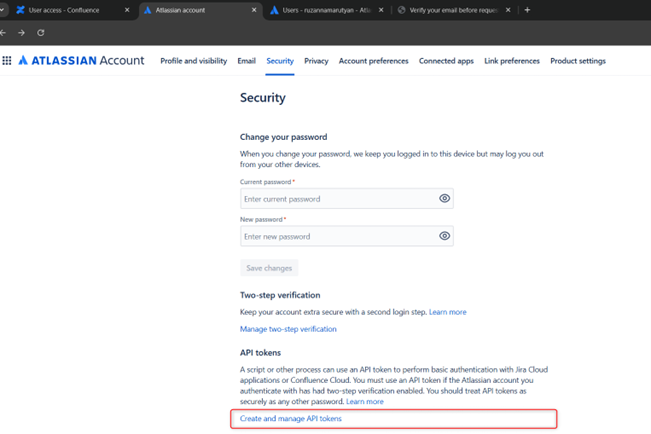

# ELITEA Toolkit Guide: Jira Integration

## Introduction

### Purpose of this Guide

This guide is your definitive resource for integrating and effectively utilizing the **Jira toolkit** within ELITEA. It provides a detailed, step-by-step walkthrough, from setting up your Jira API token to configuring the toolkit in ELITEA and seamlessly incorporating it into your Agents. By following this guide, you will unlock the power of automated issue tracking, streamlined project management workflows, and enhanced team collaboration, all directly within the ELITEA platform. This integration empowers you to leverage AI-driven automation to optimize your Jira-driven workflows, enhance team productivity, and improve project visibility within your organization.

### Brief Overview of Jira

Jira, by Atlassian, is a leading project management and issue tracking platform widely used by software development teams and various business teams for planning, tracking, and managing work. It serves as a central hub for teams to collaborate on projects, manage tasks, track bugs, and streamline workflows. Jira offers a wide array of functionalities, including:

*   **Robust Issue Tracking:** Jira provides a powerful and customizable issue tracking system that allows teams to capture, organize, and track all types of work items, including bugs, tasks, user stories, and feature requests, ensuring comprehensive issue management throughout the project lifecycle.
*   **Agile Project Management:** Jira is designed to support Agile methodologies like Scrum and Kanban, offering features such as Scrum boards, Kanban boards, sprint planning tools, and backlog management, enabling teams to effectively plan, execute, and track agile projects.
*   **Customizable Workflows:** Jira allows for the creation of highly customizable workflows to match specific project needs and team processes. Workflows can be tailored to reflect different stages of work items, approval processes, and automated transitions, streamlining project workflows and improving efficiency.
*   **Comprehensive Reporting and Analytics:** Jira provides a wide range of reporting and analytics features, offering real-time insights into project progress, team performance, issue resolution times, and other key metrics, enabling data-driven decision-making and continuous improvement.
*   **Seamless Integration Ecosystem:** Jira integrates seamlessly with a vast ecosystem of Atlassian tools and third-party applications, including Confluence, Bitbucket, and various development and collaboration tools, creating a unified and connected DevOps environment.

Integrating Jira with ELITEA brings these powerful project management and issue tracking capabilities directly into your AI-driven workflows. Your ELITEA Agents can then intelligently interact with your Jira projects and issues to automate task management, enhance project tracking, improve team collaboration, and leverage AI to optimize your entire project management lifecycle within Jira.

## Toolkit's Account Setup and Configuration in Jira

### Account Setup

If you do not yet have a Jira account, please follow these steps to create one:

1.  **Visit Atlassian Website:** Open your web browser and navigate to the official Atlassian website: [https://www.atlassian.com/software/jira](https://www.atlassian.com/software/jira).
2.  **Sign Up for Jira:** Click on the **"Try Jira free"** or **"Get it free"** button to start the sign-up process for Jira.
3.  **Create an Atlassian Account:** Follow the prompts to create an Atlassian account. You can sign up using your email address, Google account, or Apple account. For professional use, it's recommended to use your company email address.
4.  **Choose a Workspace/Site Name:** During the signup process, you will be asked to choose a workspace or site name for your Jira instance. Enter a suitable name for your workspace.
5.  **Set Up Your Project:** Follow the remaining onboarding steps to set up your first Jira project. You will be prompted to choose a project template (e.g., Scrum, Kanban) and provide a project name.
6.  **Explore Jira Features:** Once your Jira board is ready, explore the onboarding tips and familiarize yourself with Jira features, projects, boards, and navigation.

### Token/API Key Generation: Creating an API Token in Jira

For secure integration with ELITEA, it is essential to use a Jira **API token** for authentication. This method is more secure than using your primary Jira account password directly and allows you to control access permissions.

**Follow these steps to generate an API token in Jira:**

1.  **Log in to Jira:** Access your Jira workspace by navigating to your Jira URL (e.g., `your-workspace.atlassian.net`) and logging in with your credentials.
2.  **Access Account Settings:** Click on your profile avatar in the top right corner of the Jira interface. From the dropdown menu, select **"Manage account"**.

    

3.  **Navigate to Security Settings:** In the Atlassian account settings page, navigate to the **"Security"** section in the left-hand sidebar.

    

4.  **Access API Tokens:** Within the "Security" settings, locate the **"API tokens"** section and click on **"Create and manage API tokens"**.

    

5.  **Create API Token:** On the "API tokens" page, click the **"Create API token"** button.
6.  **Name Your Token:** In the "Create API token" dialog, enter a descriptive **Label** for your token, such as "ELITEA Integration Token" or "ELITEA Agent Access." This label will help you identify the purpose of this token later.
7.  **Create Token:** Click the **"Create"** button to generate the API token.

    

8.  **Securely Copy and Store Your API Token:**  **Immediately copy the generated API token** that is displayed in the pop-up window. **This is the only time you will see the full token value.** Store it securely in a password manager or, preferably, ELITEA's built-in Secrets feature for enhanced security within ELITEA. You will need this API token to configure the Jira toolkit in ELITEA.


## System Integration with ELITEA

### Agent Creation/Configuration

To integrate Jira functionalities into your workflows, you will need to configure the Jira toolkit within an ELITEA Agent. You can either create a new Agent specifically for Jira interactions or modify an existing Agent to incorporate Jira tools.

1.  **Navigate to Agents Menu:** In ELITEA, go to the **Agents** menu from the main navigation panel.
2.  **Create or Edit Agent:**
    *   **Create a New Agent:** Click on the **"+ Agent"** button to initiate the creation of a new Agent. Follow the on-screen prompts to define essential Agent attributes such as Agent name, a descriptive Agent description, the desired Agent type, and initial instructions for the Agent.
    *   **Edit an Existing Agent:** Select the Agent you intend to integrate with Jira from your list of Agents. Click on the Agent's name to open its configuration settings for editing.
3.  **Access Tools Section:** Within the Agent configuration interface, scroll down until you locate the **"Tools"** section. This section is where you will add and configure toolkits, including the Jira toolkit.

### Toolkit Configuration

This section provides detailed instructions on how to configure the Jira toolkit within your ELITEA Agent.

1.  **Add Toolkit:** In the "Tools" section of the Agent configuration, click on the **"+" icon**. This action will display a dropdown list of available toolkits that can be integrated with your Agent.
2.  **Select Jira Toolkit:** From the dropdown list of available toolkits, choose **"Jira"**. Selecting "Jira" will open the "New Jira tool" configuration panel, where you will specify the settings for your Jira integration.
3.  **Configure Jira Toolkit Settings:** Carefully fill in the following configuration fields within the "New Jira tool" section:

    *   **Name:**  Enter a descriptive **Name** for your Jira toolkit instance. Choose a name that is easily recognizable and helps you identify its purpose within your Agent's instructions (e.g., "ProjectJira", "IssueTrackerAccess", "JiraIntegration").
    *   **Description:** Provide a concise **Description** for the toolkit. This description should clarify the toolkit's purpose or the specific Jira project it is intended to access (e.g., "Toolkit for accessing and managing issues in Jira", "Integration for Jira Project 'Project Alpha'").
    *   **URL:** Enter the base URL of your Jira instance. **Ensure you use the correct format**, including `https://` or `http://` and the full workspace URL (e.g., `https://your-workspace.atlassian.net/jira` or `https://your-company.atlassian.net`). For Epam Jira, use `https://jira.epam.com/jira/`.
    *   **Username:** Enter the **Username** associated with your Jira account for which you generated the API token. This is typically your email address used for Jira login.
    *   **Authentication Options - Basic:** Select the **"Basic"** authentication option.
        *   **Password/Secret:** Choose **"Password"** and paste your Jira password or app password in the **"Password"** field.
        *   **Enhanced Security with Secrets (Recommended):** For enhanced security, use ELITEA's **Secrets Management** feature to store your Jira password securely. Instead of directly pasting the password, select the **"Secret"** option and choose the pre-configured secret containing your Jira password from the dropdown list. This prevents hardcoding sensitive credentials in your toolkit configuration.
    *   **Authentication Options - Bearer:** Select the **"Bearer"** authentication option.
        *   **Password/Secret:** Choose **"Password"** and paste your Jira Bearer token in the **"Password"** field.
        *   **Enhanced Security with Secrets (Recommended):** For enhanced security, use ELITEA's **Secrets Management** feature to store your Jira Bearer token securely. Instead of directly pasting the token, select the **"Secret"** option and choose the pre-configured secret containing your Jira Bearer token from the dropdown list.
    *   **Hosting Option:** Select the appropriate **"Hosting option"** for your Jira instance:
        *   **Cloud:** Select "Cloud" if you are using Jira Cloud (e.g., accessed via `atlassian.net`).
        *   **Server:** Select "Server" if you are using a self-hosted Jira Server or Data Center instance. **Note:** When connecting to an Epam Jira instance, ensure you select "Server" as the Hosting option.
    *   **Advanced Settings:** Adjust the advanced settings to fine-tune the toolkit's operation:
         * **Additional Fields**: Enumeration of custom fields which can be used (e.g. `customfield_100450`). Enter a comma-separated list of custom field IDs that you want to be accessible within the toolkit. This allows you to interact with custom fields specific to your Jira projects.
        * **Verify SSL**: Check this box to enable SSL verification for secure connections to your Jira instance. It is generally recommended to keep SSL verification enabled for enhanced security.

    
    

4.  **Enable Desired Tools:** In the "Tools" section within the Jira toolkit configuration panel, **select the checkboxes next to the specific Jira tools** that you want to enable for your Agent. **It is crucial to enable only the tools that your Agent will actually need to use** to adhere to the principle of least privilege and minimize potential security risks. Available tools include:
    *   **Search using JQL** - Allows searching for Jira issues using Jira Query Language (JQL).
    *   **Create issue** - Enables the Agent to create new Jira issues.
    *   **Update issue** - Allows the Agent to update existing Jira issues.
    *   **List comments** - Enables the Agent to list comments for a specific Jira issue.
    *   **Add comments** - Allows the Agent to add new comments to a Jira issue.
    *   **Get attachments content** - Enables the Agent to retrieve the content of attachments from a Jira issue.
    *   **List projects** - Allows the Agent to list all projects in the Jira instance.
    *   **Set issue status** - Allows the Agent to change the status of a Jira issue.
    *   **Get specific field info** - Enables the Agent to retrieve information from a specific field of a Jira issue.
    *   **Get remote links** - Allows the Agent to retrieve remote links associated with a Jira issue.
    *   **Link issues** - Enables the Agent to create links between Jira issues.
    *   **Modify labels** - Allows the Agent to add or remove labels from a Jira issue.
    *   **Generic request** - Allows to send custom HTTP requests to Jira API.
    *   **Loader** - Extracts content of jira issue and attachments related to Jira issue.

5.  **Complete Setup:** After configuring all the necessary settings and enabling the desired tools, click the **arrow icon** (typically located at the top right of the toolkit configuration section) to finalize the Jira toolkit setup and return to the main Agent configuration menu.
6.  Click **Save** in the Agent configuration to save all changes and activate the Jira toolkit integration for your Agent.

### Tool Overview: Jira Toolkit Functionalities

Once the Jira toolkit is successfully configured and added to your Agent, you can leverage the following tools within your Agent's instructions to enable intelligent interaction with your Jira projects and issues:

*   **Search using JQL:**  **Tool Name:** `search_using_jql`
    *   **Functionality:** Allows Agents to search for Jira issues using Jira Query Language (JQL) queries. Returns a list of Jira issues matching the JQL query.
    *   **Purpose:** Enables advanced and flexible issue searching based on complex criteria defined using JQL, allowing Agents to retrieve specific sets of issues for reporting, analysis, or workflow automation based on Jira data.

*   **Create issue:**  **Tool Name:** `create_issue`
    *   **Functionality:** Automates the creation of new Jira issues within a specified Jira project. Requires parameters such as Summary, Description, Issue Type, and Priority.
    *   **Purpose:** Streamlines issue reporting and task management by enabling Agents to automatically create new Jira issues directly from ELITEA workflows, based on user input, workflow triggers, or automated analysis, ensuring timely and consistent issue logging.

*   **Update issue:**  **Tool Name:** `update_issue`
    *   **Functionality:** Allows Agents to modify and update fields of existing Jira issues. Requires the Issue Key and a JSON object containing the fields to update and their new values.
    *   **Purpose:** Enables automated issue lifecycle management by allowing Agents to update issue statuses, assignees, priorities, custom fields, or any other issue attributes based on workflow progress, user actions, or external events, ensuring Jira issues are always up-to-date and accurately reflect project status.

*   **List comments:**  **Tool Name:** `list_comments`
    *   **Functionality:** Retrieves a list of comments associated with a specific Jira issue, identified by its Issue Key. Returns a list of comment texts and author information.
    *   **Purpose:** Enables Agents to access and summarize discussions and feedback related to specific Jira issues, facilitating efficient review of issue communication history, providing context for issue analysis, and enabling automated reporting on issue discussions.

*   **Add comments:**  **Tool Name:** `add_comments`
    *   **Functionality:** Adds a new comment to a specific Jira issue. Requires the Issue Key and the comment text as parameters.
    *   **Purpose:** Automates communication and updates within Jira issue tracking workflows by allowing Agents to add comments to Jira issues directly from ELITEA. Streamlines providing status updates, asking for clarifications, notifying stakeholders, or logging automated actions related to specific issues.

*   **Get attachments content:**  **Tool Name:** `get_attachments_content`
    *   **Functionality:** Retrieves the content of attachments from a specific Jira issue. Requires the Issue Key as a parameter.
    *   **Purpose:** Enables Agents to access and process attachments associated with Jira issues, allowing for automated analysis of attached files, extraction of data from attachments, or integration of attachment content into ELITEA workflows, enhancing data accessibility and processing for issue-related information.

*   **List projects:**  **Tool Name:** `list_projects`
    *   **Functionality:** Retrieves a list of all projects available in the connected Jira instance. Returns a list of project names and keys.
    *   **Purpose:** Enables Agents to dynamically discover and list available Jira projects, allowing for dynamic project selection in workflows, automated reporting across projects, or providing users with a list of projects to choose from within ELITEA.

*   **Set issue status:**  **Tool Name:** `set_issue_status`
    *   **Functionality:** Updates the status of a specific Jira issue. Requires the Issue Key and the desired Status name (e.g., "In Progress", "Done") as parameters.
    *   **Purpose:** Automates issue lifecycle management by allowing Agents to automatically transition Jira issues to different statuses based on workflow progress, events, or user actions, ensuring issue statuses are always aligned with the current state of work and streamlining issue workflow management.

*   **Get specific field info:**  **Tool Name:** `get_specific_field_info`
    *   **Functionality:** Retrieves information from a specific field of a Jira issue. Requires the Issue Key and the Field Name (or Field ID) as parameters.
    *   **Purpose:** Enables Agents to extract specific data points from Jira issues, allowing for targeted retrieval of information from particular fields, facilitating data extraction for reporting, analysis, or integration with other systems, and providing access to granular issue data.

*   **Get remote links:**  **Tool Name:** `get_remote_links`
    *   **Functionality:** Retrieves remote links associated with a specific Jira issue. Returns a list of URLs and link titles.
    *   **Purpose:** Enables Agents to access and utilize external web links associated with Jira issues, allowing for retrieval of related documentation, external resources, or linked information, providing a comprehensive view of issue context and related resources.

*   **Link issues:**  **Tool Name:** `link_issues`
    *   **Functionality:** Creates a link between two Jira issues. Requires the keys of the inward and outward issues and the Link Type (e.g., "Relates to", "Blocks").
    *   **Purpose:** Automates the process of linking related Jira issues, establishing relationships between tasks, bugs, user stories, or other work items, improving issue traceability, dependency management, and providing a clear view of issue relationships within ELITEA workflows.

*   **Modify labels:**  **Tool Name:** `modify_labels`
    *   **Functionality:** Adds or removes labels from a specific Jira issue. Requires the Issue Key and lists of labels to add and remove.
    *   **Purpose:** Enables automated categorization and tagging of Jira issues through label management, improving issue organization, searchability, and filtering based on labels, streamlining issue classification and enhancing issue discoverability.

*   **Generic request:**  **Tool Name:** `generic_request`
    *   **Functionality:** Allows sending custom HTTP requests to the Jira API endpoint. Provides advanced users with the flexibility to interact with the Jira API directly for actions not covered by other pre-built tools.
    *   **Purpose:** Enables advanced and customized interactions with the Jira API, allowing experienced users to extend the toolkit's capabilities, access specific Jira API endpoints, and perform actions beyond the scope of the standard Jira tools, providing maximum flexibility for complex or specialized Jira integrations.


*   **Loader:**  **Tool Name:** `Loader`
    *   **Functionality:** Extracts content of all attachments related to specified Jira issue key. NOTE: only parsable attachments will be considered.
    *   **Purpose:** Enables users to retrieve and analyze the content of attachments associated with a Jira issue, providing insights and information that may be contained within the attached files. This tool is useful for accessing detailed data and documentation that are linked to specific issues.


## Instructions and Prompts for Using the Jira Toolkit

To effectively utilize the Jira toolkit within your ELITEA Agents, you need to provide clear and precise instructions within the Agent's "Instructions" field, telling the Agent *how* and *when* to use these tools.

**General Instruction Structure:**

When instructing your Agent to use a Jira tool, you will typically follow this pattern:

```
Use the "[tool_name]" tool to [describe the action you want to perform] in Jira.
Provide the following parameters:
- Parameter 1: <value or description of value>
- Parameter 2: <value or description of value>
- ...
```

**Example Agent Instructions for Jira Toolkit Tools:**

*   **Agent Instructions for Searching Issues using JQL:**

    ```
    Use the "search_using_jql" tool to search for Jira issues using a JQL query.
    Provide the following parameters:
    - JQL Query: "project = 'Project Alpha' AND status = 'In Progress' AND assignee = currentUser()"
    ```

*   **Agent Instructions for Creating a New Issue:**

    ```
    Use the "create_issue" tool to create a new Bug issue in Jira.
    Provide the following parameters:
    - Summary: "User login failing after recent update"
    - Description: "Users are reporting login failures on both web and mobile platforms after the latest update. Password reset does not resolve the issue."
    - Issue Type: "Bug"
    - Priority: "High"
    ```

*   **Agent Instructions for Updating an Existing Issue:**

    ```
    Use the "update_issue" tool to update the description of an existing Jira issue.
    Provide the following parameters:
    - Issue Key: "PA-123"
    - Fields to Update: 
        {
          "description": "Updated description: After further investigation, the login issue seems to be related to a database connection problem."
        }
    ```

**Important Considerations for Agent Instructions:**

*   **Tool Name Accuracy:** Ensure you use the correct **Tool Name** (e.g., `"search_using_jql"`, `"create_issue"`, `"update_issue"`) as listed in the "Tool Overview" section. Typos or incorrect tool names will prevent the Agent from using the toolkit correctly.
*   **Parameter Clarity:** Clearly specify the **parameters** required for each tool and provide instructions on where the Agent should obtain the values for these parameters (e.g., from user input, from previous steps in the workflow, or hardcoded values).
*   **Context and Examples:** Provide sufficient context and examples within your Agent's "Instructions" to guide the LLM in understanding *when* and *how* to use the Jira toolkit tools effectively within your desired workflow.
*   **Jira Field Names and Values:** Ensure that you use the correct Jira Field Names (e.g., "Summary", "Description", "Status", custom field IDs) and valid values for those fields as defined in your Jira project configuration. Incorrect field names or invalid values will cause errors during tool execution.

## Best Practices and Use Cases for Jira Integration

### Best Practices for Efficient Integration

*   **Test Integration Thoroughly:** After setting up the Jira toolkit and incorporating it into your Agents, **thoroughly test each tool** you intend to use to ensure seamless connectivity, correct authentication, and accurate execution of Jira actions.
*   **Monitor Agent Performance and Usage:**  Regularly **monitor the performance of Agents** utilizing Jira toolkits. Track metrics such as task completion success rate, execution time, and error rates to identify any potential issues or areas for optimization in Agent instructions or toolkit configurations.
*   **Follow Security Best Practices:**
    *   **Use API Tokens:** Always use Jira API tokens instead of your main account password for integrations.
    *   **Grant Least Privilege:** Grant only the minimum necessary scopes/permissions to the API token to limit potential security risks. While Jira API tokens have limited scope control, ensure you are generating tokens specifically for ELITEA integration and not reusing tokens with broader access.
    *   **Securely Store Credentials:** Utilize ELITEA's Secrets Management feature to securely store and manage your Jira API tokens instead of hardcoding them directly in Agent configurations.
*   **Provide Clear Instructions and Prompts:**  Craft clear and unambiguous instructions within your ELITEA Agents to guide them in using the Jira toolkit effectively. Use the prompt examples provided in this guide as a starting point and adapt them to your specific use cases.
*   **Start with Simple Use Cases:** Begin by implementing Jira integration for simpler automation tasks, such as retrieving issue lists or updating issue statuses, and gradually progress to more complex workflows as you gain experience and confidence with the toolkit.
*   **Leverage Advanced Settings for Custom Fields:**  Utilize the "Advanced Settings" in the toolkit configuration, specifically the "Additional Fields" option, to ensure your Agent can interact with and manage custom fields specific to your Jira projects, extending the toolkit's functionality to meet your unique Jira configurations.

### Use Cases for Jira Toolkit Integration

The Jira toolkit opens up a wide range of automation possibilities for project management, issue tracking, and workflow automation within ELITEA. Here are some compelling use cases:

*   **Automated Issue Reporting and Bug Logging:**
    *   **Scenario:** When automated tests within ELITEA workflows detect a bug or failure, automatically create a new Bug issue in Jira, pre-populated with detailed error information, logs, and environment details, streamlining bug reporting and ensuring timely issue logging.
    *   **Tools Used:** `create_issue`
    *   **Example Instruction:** "Use the 'create_issue' tool to create a new 'Bug' issue in Jira with the summary 'Automated Test Failure Detected' and description containing the full error logs and test execution details. Set priority to 'High'."
    *   **Benefit:** Streamlines bug reporting and issue tracking by automating issue creation directly from ELITEA workflows, reducing manual effort for developers and testers, ensuring consistent and structured bug reports, and accelerating the bug triage process.

*   **Dynamic Task Prioritization Based on Real-time Data:**
    *   **Scenario:** ELITEA Agents can dynamically reprioritize Jira issues based on real-time data from external monitoring systems, customer feedback, or changing business priorities, ensuring teams are always working on the most critical tasks.
    *   **Tools Used:** `search_using_jql`, `update_issue`, `generic_request` (for external data retrieval)
    *   **Example Instruction:** "Use the 'generic_request' tool to retrieve the latest customer support ticket volume from the support dashboard API. Use 'search_using_jql' to find all open 'Bug' issues in Jira. Analyze the support ticket volume and reprioritize 'Bug' issues related to areas with high ticket volume to 'Highest' priority using 'update_issue' tool."
    *   **Benefit:** Enables dynamic and data-driven task prioritization in Jira, ensuring development efforts are aligned with real-time business needs and customer feedback, improving responsiveness and resource allocation.

*   **Automated Issue Status Updates and Workflow Management:**
    *   **Scenario:** As tasks progress through ELITEA workflows, automatically update the status of linked Jira issues to reflect the current progress, keeping Jira project boards and dashboards up-to-date in real-time.
    *   **Tools Used:** `update_issue`, `set_issue_status`
    *   **Example Instruction:** "Use the 'update_issue' tool to update the 'Status' field of Jira issue with key [issue_key] to 'In Progress' when the ELITEA workflow reaches the 'Development' stage. When the workflow completes successfully, use 'set_issue_status' to set the issue status to 'Done'."
    *   **Benefit:** Automates issue lifecycle management, ensuring Jira issue statuses are always synchronized with the actual project progress. Reduces manual status updates, improves issue tracking accuracy, and provides real-time visibility into project workflow status.

*   **Intelligent Issue Commenting and Notifications:**
    *   **Scenario:** ELITEA Agents can automatically add comments to Jira issues to provide status updates to stakeholders, notify assignees of new tasks, or request clarification on issue details, streamlining communication and collaboration within Jira.
    *   **Tools Used:** `add_comments`, `get_specific_field_info`
    *   **Example Instruction:** "Use the 'add_comments' tool to add a comment to Jira issue with key [issue_key] with the text 'Automated status update: Workflow execution completed successfully. Please proceed with testing.' Also, use 'get_specific_field_info' to retrieve the 'Assignee' field value for the issue and send a notification to the assignee via ELITEA chat about the status update."
    *   **Benefit:** Streamlines communication and collaboration within Jira issue tracking by automating updates and notifications directly within Jira issues. Keeps all stakeholders informed of progress, reduces manual communication overhead, and ensures timely notifications for task assignments and status changes.

*   **Automated Issue Linking for Dependency Management:**
    *   **Scenario:** When creating new Jira issues for sub-tasks or related features, automatically link them to parent issues or related user stories to establish clear dependencies and relationships between work items.
    *   **Tools Used:** `create_issue`, `link_issues`
    *   **Example Instruction:** "Use the 'create_issue' tool to create a new 'Sub-task' issue for user story [user_story_key]. After creating the sub-task, use the 'link_issues' tool to link the new sub-task issue to the parent user story issue using the 'Sub-task' link type."
    *   **Benefit:** Enhances issue traceability and project management by automating the creation of links between related Jira issues, providing a clear view of dependencies and relationships between tasks, user stories, and features, improving project planning and dependency tracking.

## Troubleshooting and Support

### Troubleshooting Common Issues

*   **Connection Errors:**
    *   **Problem:** ELITEA Agent fails to connect to Jira, resulting in errors during toolkit execution.
    *   **Possible Solutions:**
        1.  **Verify Jira URL:** Double-check that you have entered the correct Jira workspace URL in the toolkit configuration, including `https://` or `http://` and the full workspace URL (e.g., `https://your-workspace.atlassian.net/jira` or `https://your-company.atlassian.net`). For Epam Jira, use `https://jira.epam.com/jira/`.
        2.  **Check Username and API Token:** Ensure that the **Username** and **API Token** you provided are correct and valid for your Jira account and workspace. Carefully re-enter or copy-paste these credentials to rule out typos.
        3.  **Verify Hosting Option:** Double-check that you have selected the correct **Hosting option** (Cloud or Server) in the Jira toolkit configuration, especially when connecting to Epam's Jira (use "Server").
        4.  **Network Connectivity:** Confirm that both your ELITEA environment and your Jira instance are connected to the internet and that there are no network connectivity issues blocking the integration.

*   **Authorization Errors (Permission Denied/Unauthorized):**
    *   **Problem:** Agent execution fails with "Permission Denied" or "Unauthorized" errors when trying to access or modify Jira resources.
    *   **Possible Solutions:**
        1.  **Verify API Token Validity:** Ensure that the Jira API token you are using is still valid and has not been revoked in your Atlassian account settings. Generate a new token if necessary.
        2.  **Check Jira Permissions:** Confirm that the Jira account associated with the Username and API Token has the necessary permissions within Jira to access and modify the specific projects and issues your Agent is trying to interact with. Verify project and issue permissions within Jira project settings.
        3.  **Hosting Option Mismatch:** Double-check that you have selected the correct "Hosting option" (Cloud or Server) in the Jira toolkit configuration. Using the wrong hosting option can lead to authentication and connection errors.

*   **Tool-Specific Parameter Errors:**
    *   **Problem:** Agent execution fails for specific Jira tools due to incorrect parameter values or formats.
    *   **Troubleshooting Steps:**
        1.  **Verify Project Keys:** Ensure that you are using the correct Jira Project Keys in your Agent's instructions and toolkit configuration. Project Keys are case-sensitive and must exactly match the project keys in your Jira instance. Use the "List projects" tool to verify project keys if needed.
        2.  **Verify Issue Keys:** Double-check that you are using the correct Jira Issue Keys when referencing specific issues in your Agent's instructions. Issue Keys are case-sensitive and must match the issue keys in Jira exactly (e.g., "PA-123", "PROJECT-456").
        3.  **Parameter Format:** Verify that you are providing parameters in the correct format expected by each Jira tool (e.g., string values for names, numerical values for IDs, JSON format for issue updates). Refer to the "Instructions and Prompts for Using the Toolkit" section for parameter details and examples.
        4.  **Custom Fields:** If you are using custom fields in your Agent instructions, ensure that you have added the correct **Additional Fields** IDs in the toolkit's "Advanced Settings" and that you are using the correct custom field IDs and values in your Agent instructions. Use the "Get specific field info" tool to verify custom field IDs and values if needed.

### FAQs

1.  **Q: Can I use my regular Jira password for the ELITEA integration?**
    *   **A:** No, it is **strongly recommended to use a Jira API token** instead of your main account password for security reasons. API tokens provide a more secure and controlled way to grant access to external applications like ELITEA.
2.  **Q: What permissions should I grant to the Jira API Token?**
    *   **A:** Jira API tokens have a fixed scope (access to Jira REST API). You don't need to select specific scopes when generating the token. However, ensure that the Jira account associated with the API token has the necessary permissions within Jira to access and modify the projects and issues your Agent will be interacting with.
3.  **Q: What is the correct format for the Jira URL in the toolkit configuration?**
    *   **A:**  The Jira URL should be entered in the full format, including `https://` or `http://` and the complete workspace URL (e.g., `https://your-workspace.atlassian.net/jira` or `https://your-company.atlassian.net`). Ensure there are no typos or missing parts in the URL. For Epam Jira, use `https://jira.epam.com/jira/`.
4.  **Q: Why is my Agent getting "Permission Denied" errors even though I think I have configured everything correctly?**
    *   **A:** Double-check the following:
        *   **API Token Validity:** Ensure that the API token is valid and has not been revoked.
        *   **Jira Account Permissions:** Verify that the Jira account associated with the API token has the necessary permissions to access the specific projects and issues your Agent is trying to interact with.
        *   **Hosting Option:** Double-check that you have selected the correct "Hosting option" (Cloud or Server) in the Jira toolkit configuration, especially for self-hosted or Epam Jira instances.
        *   **Verify SSL Setting:** If you are connecting to a Jira Server instance, try toggling the "Verify SSL" setting in the "Advanced Settings" of the toolkit configuration, as SSL verification issues can sometimes cause connection problems.

### Support and Contact Information

If you encounter any issues, have questions, or require further assistance beyond what is covered in this guide regarding the Jira integration or ELITEA Agents in general, please do not hesitate to contact our dedicated ELITEA Support Team. We are here to help you resolve any problems quickly and efficiently and ensure you have a smooth and productive experience with ELITEA.

**How to Reach ELITEA Support:**

*   **Email:**  **[SupportAlita@epam.com](mailto:SupportAlita@epam.com)**

**Best Practices for Effective Support Requests:**

To help us understand and resolve your issue as quickly as possible, please ensure you provide the following information in your support email:

*   **ELITEA Environment:** Clearly specify the ELITEA environment you are using (e.g., "Nexus," "Alita Lab," "EYE").
*   **Project Details:**  Indicate the **Project Name** and whether you are working in your **Private** workspace or a **Team** project.
*   **Detailed Issue Description:** Provide a clear, concise, and detailed description of the problem you are encountering. Explain what you were trying to do, what you expected to happen, and what actually occurred.
*   **Relevant Configuration Information:**  To help us diagnose the issue, please include relevant configuration details, such as:
    *   **Agent Instructions (Screenshot or Text):** If the issue is with an Agent, provide a screenshot or copy the text of your Agent's "Instructions" field.
    *   **Toolkit Configurations (Screenshots):** If the issue involves the Jira toolkit or other toolkits, include screenshots of the toolkit configuration settings within your Agent.
*   **Error Messages (Full Error Text):** If you are encountering an error message, please provide the **complete error text**. In the Chat window, expand the error details and copy the full error message. This detailed error information is crucial for diagnosis.
*   **Your Query/Prompt (Exact Text):** If the issue is related to Agent execution, provide the exact query or prompt you used to trigger the issue.

**Before Contacting Support:**

We encourage you to first explore the resources available within this guide and the broader ELITEA documentation. You may find answers to common questions or solutions to known issues in the documentation.

## Useful Links

To further enhance your understanding and skills in integrating Jira with ELITEA, here are some helpful resources:

*   **[Atlassian Jira Website](https://www.atlassian.com/software/jira)**: Access the main Jira product website for product information and documentation.
*   **[Atlassian Account Settings](https://id.atlassian.com/manage-profile/security)**: Access your Atlassian account settings to manage your profile and API tokens.
*   **[Jira Query Language (JQL) Documentation](https://confluence.atlassian.com/jirasoftwareserver/advanced-searching-jql-reference-765593971.html)**: Learn more about Jira Query Language (JQL) and how to construct advanced search queries in Jira.
*   **[ELITEA Secrets Management](../../menus/settings/secrets.md)**: Learn how to securely store your Jira API Token using ELITEA's Secrets management feature for enhanced security.
*   **[ELITEA Agents Configuration](../../menus/agents.md)**:  Find out more about creating and configuring Agents in ELITEA, where you integrate the Jira toolkit to automate your workflows.
*   **[ELITEA Support Email](mailto:SupportAlita@epam.com)**: Contact the ELITEA support team for direct assistance with Jira integration or any other questions and issues you may encounter.