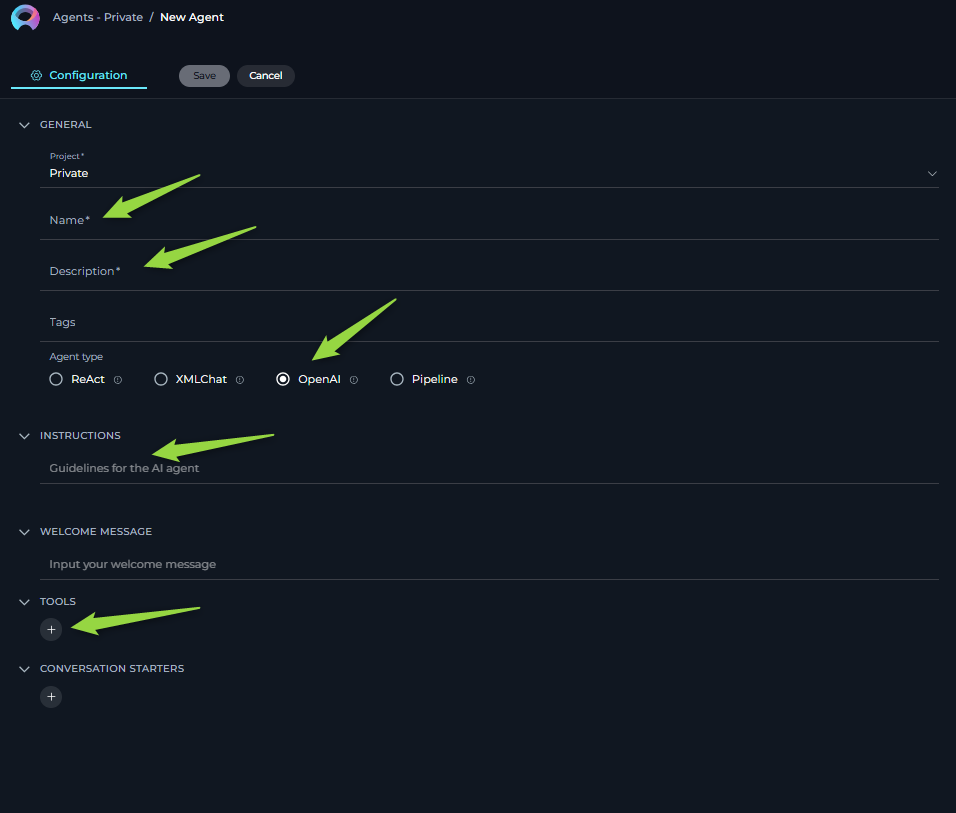

# ELITEA Toolkit Guide: OpenAPI Integration

## Introduction

### Purpose of this Guide

This guide is your comprehensive resource for integrating and effectively utilizing the **OpenAPI toolkit** within ELITEA. It provides a detailed, step-by-step walkthrough, from obtaining your OpenAPI specification file to configuring the toolkit in ELITEA and seamlessly incorporating it into your Agents. By following this guide, you will unlock the power of universal API integration, streamlined workflows, and enhanced data accessibility, all directly within the ELITEA platform. This integration empowers you to leverage AI-driven automation to interact with virtually any API, optimize data retrieval, and extend ELITEA's capabilities across diverse services.

### Brief Overview of OpenAPI

The **OpenAPI Toolkit** is a powerful toolkit of ELITEA, providing a universal interface for seamless integration with a vast range of APIs. By utilizing OpenAPI specifications, this toolkit allows ELITEA agents to understand and interact with diverse API endpoints, unlocking the potential to automate tasks and extend ELITEA's functionality across different platforms and services.


## Toolkit Data Setup and Configuration

### Data Requirements

To use the OpenAPI toolkit, you need an OpenAPI specification file in **JSON format** for the API you wish to integrate.

1.  **Obtain OpenAPI Specification (JSON):**
    *   **Conversion from YAML (if needed):** If you have a YAML OpenAPI specification, convert it to JSON format. You can use online tools like [Swagger Editor](https://editor.swagger.io/) or other OpenAPI specification converters.
    *   **Validation:** Ensure the JSON file is valid and adheres to OpenAPI specifications. This file defines the API's endpoints, parameters, request bodies, and security schemes, enabling ELITEA to understand how to interact with the API.

### Important Considerations for OpenAPI Specification

*   **Comprehensive Definition:** The OpenAPI file should be as complete as possible, including descriptions, parameter types, required fields, and security schemes. This ensures the Large Language Model (LLM) powering ELITEA agents has sufficient information to construct correct API requests.
*   **Security Schemas:** Properly define security schemes (API Key, OAuth, etc.) in your OpenAPI file. This is crucial for configuring authentication within ELITEA.
*   **Toolkit Limits:** While the OpenAPI toolkit is powerful, extremely large OpenAPI definitions with hundreds of endpoints might encounter processing limitations. If you experience issues, consider using a more focused OpenAPI definition or contact support.

## Integration with ELITEA

### OpenAPI Toolkit Configuration

1.  **Navigate to Alitea Agents:** Navigate to the Agents page within your ELITEA instance.

2.  **Configure a New Agent (or Edit Existing):**
    *   Create a new agent or modify an existing one.
    *   Define the **Agent Name**, **Description**, and relevant **Instructions** that guide the agent's behavior when using the OpenAPI toolkit.
    *   Select the appropriate **Agent Type** (e.g., consider an "OpenAI Agent" type for general API interaction, or a more specialized type if applicable within Alitea).

    #### Agent Instructions Guidance

    *   **Clarity is Key:** Provide clear and specific instructions to the agent. Instruct the agent on *what* API actions to perform and *how* to use the available tools (actions defined in your OpenAPI spec).
    *   **Parameter Handling:** If your API has specific requirements for parameter formats (e.g., numeric values as strings, specific date formats, required properties), explicitly mention these in the instructions. This helps the LLM generate valid requests.
    *   **Example Instructions:**

        ```
           ...
            1. To create a new task, use the "CreateTask" tool. Ensure you include a 'title' and 'description' for the task.
            2. To get details of a task, use the "GetTaskById" tool, providing the 'taskId' as input.
            3. If the user asks to update a task, use the "UpdateTask" tool. You will need the 'taskId' and the fields to update (e.g., 'status', 'dueDate').
        ```
    ..... rest of the instructions

    
    

3.  **Create an OpenAPI Toolkit Tool:** Within the Agent configuration, create a new tool and select the "OpenAPI Toolkit" type.

4.  **Tool Configuration:**
    *   **Tool Name:** Enter a descriptive name for your OpenAPI toolkit tool (e.g., "Task Management API", "Pet Store API").
    *   **Description (Schema):** This is where you provide the OpenAPI specification:
        *   **Copy and Paste:** Copy the entire JSON content of your OpenAPI specification file and paste it into the "Schema" field.
        *   **Drag and Drop:** Drag and drop your OpenAPI JSON file directly into the "Schema" field.
        *   **Choose File Link/Button:** Click the "Choose File" button and select your OpenAPI JSON file from your local system.


        

5.  **Actions Table Verification:** Once a valid OpenAPI schema is provided, the "Actions" table below the schema field will be populated. This table lists all the API endpoints (actions) defined in your OpenAPI specification.

       

6.  **Authentication Configuration:** Navigate to the "Authentication" section of the toolkit configuration. Choose the appropriate authentication method based on your API's requirements:

    

    *   **None:** Select "None" if the API does not require authentication (rare for production APIs).
    *   **API Key:**
        *   **API Key Field:** Enter your API key directly or, for enhanced security, select "From Secrets" to reference a securely stored secret within Alitea.
        *   **Auth Type:** Choose the API Key authentication type from the dropdown:
             
            *   **Basic Auth:** For APIs using Basic Authentication.
            *   **Bearer:** For APIs using Bearer tokens (e.g., JWT).
            *   **Custom Header:** For APIs requiring an API key in a custom header. If selected, an additional field will appear to enter the **Header Name** (e.g., `X-API-Key`).
            
    *   **OAuth:** Select "OAuth" if your API uses OAuth 2.0. You will need to fill in the OAuth-specific fields according to your API's OAuth configuration (e.g., Client ID, Client Secret, Token URL, Authorization URL, Scopes, Token exchange method). Consult your API's documentation for the required OAuth settings.

        

7.  **Save Toolkit:** Click the "Save" button to save the OpenAPI toolkit configuration.

## Tools of the OpenAPI Toolkit

After successfully loading your OpenAPI specification, the "Actions" table displays the available API operations as "tools" that your ELITEA agent can utilize.

*   **Name:** This column shows the name of each action, typically derived from the `operationId` in your OpenAPI specification. These names are how you refer to specific API endpoints in your agent instructions and user messages.
*   **Description:** Provides a brief description of the action, taken from the `description` field of the corresponding operation in your OpenAPI specification.
*   **Method:** Indicates the HTTP method (GET, POST, PUT, DELETE, etc.) for the API endpoint.
*   **Path:** Shows the API endpoint path.

  
### Using Actions in Instructions and Messages

To instruct your agent to use a specific API endpoint, refer to the **Name** from the Actions table as a "tool" in your agent instructions or in user messages.

*   **Example:** If the Actions table lists an action named "AddPet" (from a Pet Store API), you can instruct the agent like this: "Use the `AddPet` tool to create a new pet with the following properties: ...".
*   The LLM will then identify the "AddPet" action from the OpenAPI toolkit and attempt to use the corresponding API endpoint based on the provided OpenAPI specification and your instructions.

## Use Cases

The use cases for the OpenAPI toolkit are virtually limitless, constrained only by the capabilities of the integrated API and the LLM's ability to interact with it. Here are some common use cases:

1.  **Data Retrieval and Analysis:**
    *   **Scenario:** Agents can fetch data from a wide range of external services like databases, CRM systems, weather APIs, financial APIs, and more. This retrieved data can then be analyzed, summarized, or used to generate reports within ELITEA.
    *   **Tools Used:** API actions (defined in your OpenAPI spec) that perform GET requests to retrieve data. Examples include actions to list records, get details, search data, etc.
    *   **Example Instruction:** "Fetch the latest sales data from the CRM API using the 'getSalesData' tool and summarize the key trends for the past quarter." (Assuming 'getSalesData' is defined in your CRM API's OpenAPI spec).
    *   **Benefit:** Empowers agents to leverage external data sources for informed decision-making, insightful reporting, and data-driven task completion, enhancing the intelligence and utility of ELITEA workflows.

2.  **Resource Management:**
    *   **Scenario:** Agents can automate the creation, updating, and deletion of resources in external systems. This includes managing tasks in project management tools, customer records in CRM systems, controlling smart devices, and managing cloud infrastructure resources.
    *   **Tools Used:** API actions (defined in your OpenAPI spec) that perform POST, PUT, PATCH, and DELETE requests to manage resources. Examples include actions to create tasks, update records, start/stop services, etc.
    *   **Example Instruction:** "Create a new task in the project management system using the 'createTask' tool with the following details: task name 'Implement User Authentication', project 'Project Alpha', due date 'Next Friday'." (Assuming 'createTask' is defined in your Project Management API's OpenAPI spec).
    *   **Benefit:** Streamlines operations by automating resource management tasks across various systems, reducing manual effort, improving efficiency, and ensuring consistent resource states.

3.  **Workflow Automation and Orchestration:**
    *   **Scenario:** Agents can orchestrate complex workflows by interacting with multiple APIs in a sequence. This allows for automating end-to-end processes that span across different services and platforms, creating powerful and integrated automation solutions.
    *   **Tools Used:** Combinations of API actions from different OpenAPI specifications or from a single OpenAPI spec with multiple related actions. Agents can use sequences of tool calls to perform multi-step workflows.
    *   **Example Instruction:** "First, use the 'getNewOrders' tool from the Order Management API. Then, for each new order, use the 'updateInventory' tool from the Inventory API and the 'sendOrderConfirmationEmail' tool from the Email API." (Assuming these actions are defined in relevant OpenAPI specs).
    *   **Benefit:** Enables sophisticated automation of complex business processes by connecting different systems and automating multi-step workflows, significantly enhancing efficiency and reducing manual intervention.

4.  **Reporting and Visualization Generation:**
    *   **Scenario:** Agents can generate reports and visualizations based on data retrieved from APIs. This can involve creating summaries, charts, graphs, or dashboards using data from external services, potentially leveraging tools within ELITEA or external visualization services.
    *   **Tools Used:** API actions for data retrieval (GET requests), potentially combined with actions to trigger report generation or visualization creation in external services (if the API offers such actions). Agents might also use ELITEA's capabilities or external tools to process and visualize retrieved data.
    *   **Example Instruction:** "Retrieve website traffic data for the last month using the 'getWebsiteTraffic' tool from the Analytics API. Generate a report summarizing the key metrics and create a chart visualizing the traffic trends." (Assuming 'getWebsiteTraffic' is defined in your Analytics API's OpenAPI spec, and ELITEA or external tools can handle report generation and visualization).
    *   **Benefit:** Transforms raw API data into actionable insights through automated report generation and visualization, providing users with clear and understandable summaries of complex information.

5.  **Testing and Validation Automation:**
    *   **Scenario:** Agents can interact with APIs to perform automated testing and validation of external systems. This can involve sending test requests, validating API responses against expected outcomes, and ensuring the reliability and functionality of external services.
    *   **Tools Used:** API actions for sending requests (GET, POST, PUT, DELETE) and actions for retrieving data to validate responses. Agents can use assertions and logic within ELITEA to perform validation checks.
    *   **Example Instruction:** "Use the 'createAsset' tool from the User API to create a new test user. Then, use the 'getAsset' tool to get the asset.Validate if the asset details are ..." (Assuming 'getAsset' and 'createAsset' are defined in your User API's OpenAPI spec).
    *   **Benefit:** Automates API smoke testing and validation processes, improving software quality, reducing manual testing effort, and ensuring the robustness and reliability of integrated systems.

## Troubleshooting and Support

### Troubleshooting

1.  **"Description of schema is required" Error During Save:**
    *   **Problem:** ELITEA displays a "Description of schema is required" error in red when attempting to save the OpenAPI Toolkit configuration.
    *   **Troubleshooting Steps:**
        *   **Invalid JSON:** The OpenAPI schema you pasted or uploaded is not valid JSON. Verify the JSON syntax using a JSON validator tool online.
        *   **Missing Description (Misleading Error):** While the error message suggests a missing description, it often indicates a more general parsing error due to an invalid OpenAPI structure. Double-check your OpenAPI JSON file against the OpenAPI specification standards.

        

2.  **"JSON Schema cannot be parsed" Error During Tool Execution:**
    *   **Problem:** When executing an agent that uses the OpenAPI toolkit, you receive an error message indicating "JSON Schema cannot be parsed."
    *   **Troubleshooting Steps:**
        *   **Invalid JSON (Again!):** Even if the schema was initially accepted during toolkit creation, there might be subtle JSON errors that only surface during runtime parsing. Re-validate your JSON schema meticulously.
        *   **YAML Instead of JSON:** Ensure you are providing a JSON file, and not a YAML file. The ELITEA OpenAPI Toolkit primarily supports JSON.

        

3.  **Authentication Errors (403 Forbidden, 401 Unauthorized):**
    *   **Problem:** API requests consistently fail with "403 Forbidden" or "401 Unauthorized" errors.
    *   **Troubleshooting Steps:**
        *   **Incorrect Credentials:** Double-check your API key, OAuth tokens, or other authentication credentials. Ensure they are entered correctly in the toolkit configuration.
        *   **Expired Tokens:** OAuth tokens have expiration dates. Ensure your tokens are still valid and refresh them if necessary (depending on your OAuth flow).
        *   **Incorrect Authentication Type:** Verify that the authentication type configured in ELITEA (API Key, OAuth, etc.) precisely matches the API's authentication requirements as documented in the API's documentation and OpenAPI specification.
        *   **Missing Headers:** Some APIs require specific headers beyond basic authentication. Review the API documentation to see if you need to configure custom headers in ELITEA (Note: Custom header configuration for authentication might have limitations; contact support for advanced header needs).

4.  **API Request Errors (400 Bad Request, 500 Internal Server Error, etc.):**
    *   **Problem:** API requests are sent, but the API returns errors like "400 Bad Request," "500 Internal Server Error," or other HTTP error codes indicating issues with the request itself.
    *   **Troubleshooting Steps:**
        *   **Incorrect Parameters/Request Body:** The LLM might be generating API requests with incorrect parameters or request body formats. Thoroughly review the API documentation for the specific endpoint being used. Refine your agent instructions to explicitly guide the LLM to construct requests that precisely match the API's requirements (e.g., specify data types, required fields, allowed values, example values).
        *   **API Service Issues:** The external API itself might be temporarily experiencing issues, outages, or errors. Test the API endpoint directly using API testing tools like Postman or `curl` outside of ELITEA to isolate whether the problem originates from ELITEA's integration or the external API service.

5.  **"Definition contains too many actions (endpoints)" Error:**
    *   **Problem:** When attempting to execute a request, you receive an error message stating "The definition contains too many actions (endpoints). Please reduce the amount of endpoints so that they can be able to handle them."
    *   **Troubleshooting Steps:**
        *   **Reduce Endpoints in Schema:** The ELITEA OpenAPI Toolkit has a limitation on the number of endpoints it can process within a single OpenAPI specification.  **Currently, this limit is 128 endpoints.** Your OpenAPI definition exceeds this limit (e.g., your file contains 216 endpoints). You will need to reduce the number of endpoints in your OpenAPI specification.
        *   **Create Focused Schemas:** If possible, create smaller, more focused OpenAPI specifications that only include the specific API endpoints your agent needs to use for a particular workflow. Instead of using one large schema for an entire API, break it down into smaller schemas focused on specific functional areas.
        *   **Contact Support for Large Schemas:** If you have a legitimate need to use a very large OpenAPI schema and cannot reduce the endpoint count below the limit, contact ELITEA support to discuss potential solutions or optimizations.

        

6.  **Unexpected or Empty Data from Agent:**
    *   **Problem:** The integration appears to be working without errors, but the agent returns unexpected data, incomplete data, or empty responses when interacting with the API.
    *   **Troubleshooting Steps:**
        *   **Incorrect Instructions:** Carefully review your agent instructions. Are they sufficiently clear, precise, and detailed for the LLM to accurately understand *which* API actions to use and *how* to use them to achieve the desired data retrieval or action? Ambiguous instructions can lead to the LLM making incorrect API calls or misinterpreting API responses.
        *   **API Behavior Verification:** The external API itself might be returning empty or unexpected data, even for requests that are technically valid. Directly verify the API's behavior using tools like Postman by sending the *same* API requests that your agent *intends* to send. This helps determine if the issue lies with ELITEA's integration or the external API's response patterns.
        *   **Parameter Data Type and Mismatches:** Double-check that the parameters and data the LLM is providing to the API tools are of the *exact* data type, format, and structure that the API endpoint *expects*. Even subtle data type mismatches (e.g., sending a number as a string when the API expects an integer) can lead to API errors or unexpected responses. Refer to the API documentation for precise parameter requirements.


7.  **"Description is required" Error During Agent Execution:**
    *   **Problem:** When executing an agent that utilizes the OpenAPI toolkit, you encounter an error message indicating "Action description is required."
    *   **Troubleshooting Steps:**
        *   **Add Descriptions to OpenAPI Specification:**  This error indicates that your OpenAPI specification is missing descriptions for one or more API endpoints (actions).  LLMs rely on these descriptions to understand the purpose and functionality of each API endpoint.
        *   **Review OpenAPI Definition:** Carefully review your OpenAPI specification file (JSON). Ensure that *every* endpoint (path and method combination) within your `paths` section has a `description` field provided within its operation definition (e.g., under `get:`, `post:`, etc.).
        *   **Add Missing Descriptions:** For any endpoint lacking a `description`, add a concise and informative description explaining what that API endpoint does.
        *   **Update Toolkit Schema:** After adding descriptions to your OpenAPI specification, re-upload or re-paste the updated schema into the OpenAPI Toolkit configuration within ELITEA and save the toolkit.
        *   **Re-run Agent:** Try executing your agent again after updating the OpenAPI schema with descriptions.

        

### FAQs


**Q: Can I use OpenAPI specifications in YAML or JSON format?**

**A:**  The ELITEA OpenAPI Toolkit primarily supports OpenAPI specifications in **JSON format**. While YAML *might* be accepted in some limited cases, **JSON is the recommended and most reliable format** for optimal compatibility and parsing robustness within ELITEA.

**Q: How do I find the OpenAPI specification for an API?**

**A:** API providers often publish their OpenAPI specifications (also sometimes called Swagger files) within their API documentation. Look for sections typically labeled "API Reference," "Developer Documentation," or "Integration Guides." The specification file is usually linked for download as a `swagger.json`, `openapi.json`, `swagger.yaml`, or `openapi.yaml` file. If the OpenAPI specification is not publicly available in the API documentation, you may need to request it directly from the API provider or generate it from the API's codebase if you have access to the API implementation.

**Q: How do I determine which "action name" to use in my agent instructions?**

**A:** The "action names" (tool names) presented in the OpenAPI Toolkit are automatically derived from the `operationId` values defined within your OpenAPI specification file. When you successfully upload and parse your OpenAPI schema into the toolkit, the "Actions table" in the toolkit configuration interface will populate, listing these action names. Use these names directly and precisely in your agent instructions to refer to specific API endpoints. If the `operationId` is not explicitly defined in the OpenAPI specification for a particular endpoint, the "Name" column in the Actions table might be empty or auto-generated based on the HTTP method and path.

### Support Contact

If you encounter persistent issues, have questions not covered in this guide, or require further assistance with the OpenAPI Toolkit or ELITEA Agents, please do not hesitate to contact the dedicated ELITEA Support Team.

*   **Email:** SupportAlita@epam.com

To ensure efficient and effective support, please include the following details in your support request:

*   **ELITEA Environment:** (e.g., "Nexus," "Alita Lab," "EYE")
*   **Project Details:** Project Name, Private or Team project.
*   **Detailed Issue Description:** Provide a clear, concise, and detailed description of the problem you are encountering. Explain what you were trying to do, what you expected to happen, and what actually occurred.
*   **Relevant Configuration Information:**
    *   Agent Instructions (Screenshot or Text): If the issue is related to an Agent, please provide a screenshot or copy the text of your Agent's "Instructions" field.
    *   OpenAPI Toolkit Configuration (Screenshots): If the issue involves the OpenAPI toolkit, please include screenshots of the toolkit configuration settings within your Agent, especially the "Schema" and "Authentication" sections.
    *   Error Messages (Full Error Text): If you are encountering an error message, please provide the complete error text. In the Chat window, expand the error details and copy the full error message. This detailed error information is crucial for diagnosis.
*   **Your Query/Prompt:** If the issue is related to Agent execution, provide the exact query or prompt you used to trigger the issue.
*   **OpenAPI Specification (if applicable and safe to share):** If you suspect the issue might be related to your OpenAPI schema itself, providing your OpenAPI specification file (or a sanitized version if it contains sensitive information) can be exceptionally helpful for diagnosing schema-related problems.

**Before Contacting Support:**

We encourage you to first explore the resources available within this guide and the broader ELITEA documentation. You may find answers to common questions or solutions to known issues in the documentation.

## Useful Links

To further enhance your understanding and skills in using the OpenAPI Toolkit with ELITEA, here are some helpful external resources:

*   **OpenAPI Specification Official Website:** [https://swagger.io/specification/](https://swagger.io/specification/) - *The official source for the OpenAPI Specification documentation, versions, and updates, providing in-depth information on the OpenAPI standard.*
*   **Swagger Editor:** [https://editor.swagger.io/](https://editor.swagger.io/) - *Swagger Editor is a valuable online tool for creating, validating, and visualizing OpenAPI specifications in both JSON and YAML formats. It's highly useful for crafting and debugging your OpenAPI schemas before integrating them into ELITEA.*
*   **Swagger UI:** [https://swagger.io/tools/swagger-ui/](https://swagger.io/tools/swagger-ui/) - *Swagger UI is a powerful tool for visually exploring and interacting with APIs that are defined by OpenAPI specifications. It allows you to examine API endpoints, understand API structure, and even make test calls to APIs directly from your browser, aiding in API comprehension and testing.*