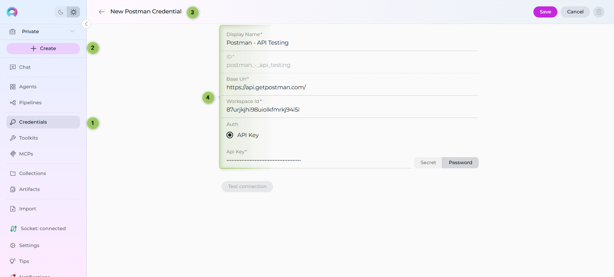
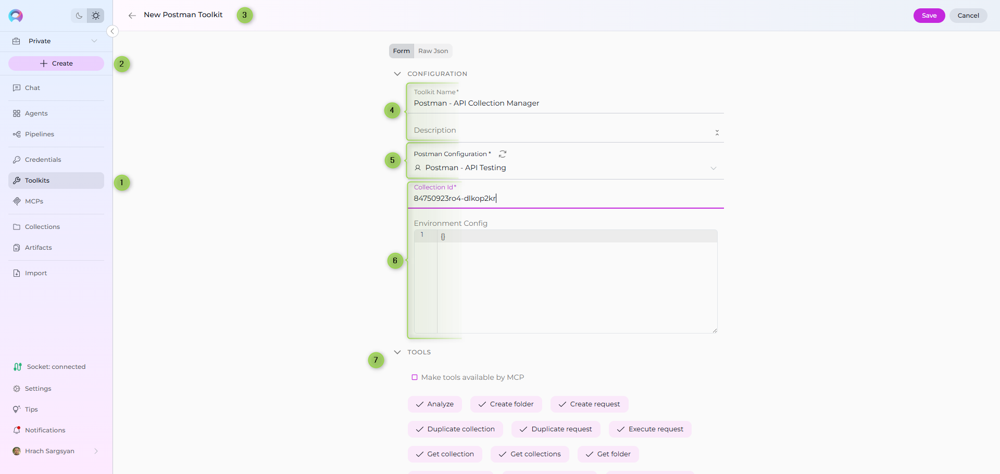
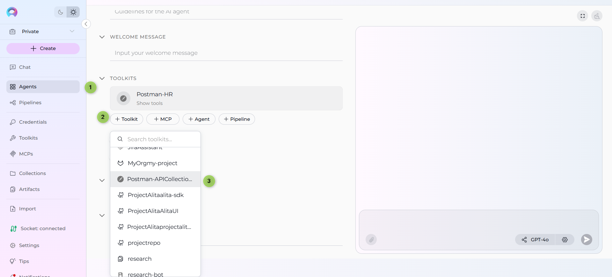
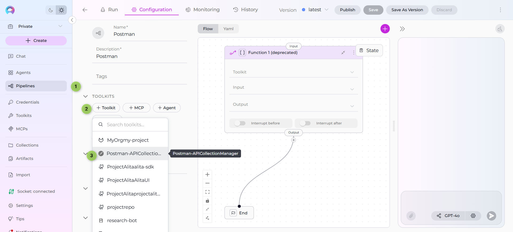
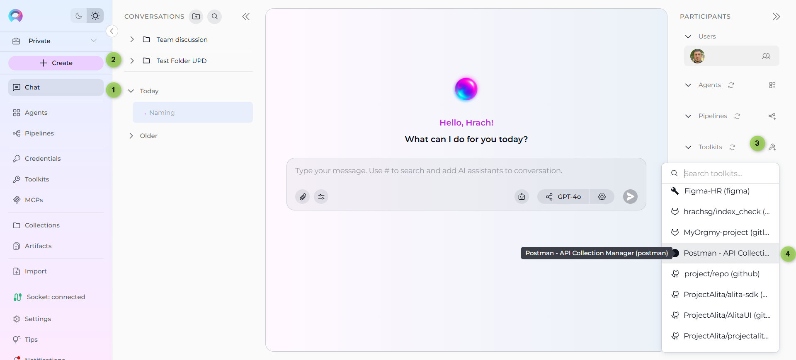

# ELITEA Toolkit Guide: Postman Integration

## Introduction

### Purpose of this Guide

This guide is your definitive resource for integrating and utilizing the **Postman toolkit** within ELITEA. It provides a step-by-step walkthrough, from setting up your Postman API Key to configuring the toolkit in ELITEA and effectively using it within your Agents. By following this guide, you will unlock the power of automated API testing, streamlined workflows, and enhanced team collaboration, all directly within the ELITEA platform. This integration empowers you to leverage AI-driven automation to optimize your API testing lifecycle using the combined strengths of ELITEA and Postman.

### Brief Overview of Postman

Postman is a popular, web-based API platform that helps teams of all sizes efficiently design, test, and manage APIs. It provides a centralized platform to streamline your API development and testing process, offering features for:

*   **API Request Management:** Create, organize, and manage API requests and collections with rich documentation and environment variables.
*   **Automated Testing:** Plan and execute automated API tests, track results in real-time, and integrate with CI/CD pipelines.
*   **Reporting & Metrics:** Generate insightful reports and metrics on API test coverage, results, and performance.
*   **Integration with Development Tools:** Seamlessly integrates with version control, CI/CD, and other tools, making it a central hub for your API ecosystem.
*   **Collaboration & Sharing:** Share collections, environments, and test results with your team for better collaboration.

Integrating Postman with ELITEA brings these robust API management capabilities directly into your AI-powered workflows. Your ELITEA Agents can then interact with your Postman workspace to automate API-related tasks, enhance testing processes, and improve team collaboration through intelligent automation.

## Postman Account Setup and Configuration

### Account Setup

If you don't have a Postman account yet, here’s how to get started:

1.  **Go to Postman Website:** Open your web browser and navigate to [Postman's official website](https://www.postman.com/).
2.  **Sign Up:** Click the **"Sign Up"** button and provide your details. You can sign up with an email address or use a Google account.
3.  **Verify Your Email:** Open the confirmation email from Postman and click on the verification link provided within the email.
4.  **Access Your Account:** After email verification, you will be redirected to your new Postman workspace. Follow any on-screen instructions to complete the setup.

### API Key Generation in Postman

To securely integrate Postman with ELITEA, you need to generate an API key within Postman. This API key will be used by ELITEA to authenticate and access your Postman workspace.

**Follow these steps to create an API Key:**

1.  **Log in to Postman:** Access your Postman account using your credentials.
2.  **Access API Keys:** Click on your profile icon in the top right corner, then select **"Settings"**. Navigate to the **"API Keys"** tab.
3.  **Create API Key:** Click the **"Create API Key"** button, provide a name for the key (e.g., "ELITEA Integration Key"), and set the desired scopes/permissions.
4.  **Copy and Store the API Key:** **Immediately copy the generated API key.** This is the only time it will be displayed in full. Store it securely using a password manager or ELITEA's built-in Secrets feature (recommended for enhanced security within ELITEA). You will need this API Key to configure the Postman toolkit in ELITEA.
     
     
     

### Get Collection Id and Workspace Id in Postman

To configure the Postman toolkit in ELITEA, you will need the Collection Id and Workspace Id. Here’s how to find them in the Postman web interface:

#### How to Find the Collection Id
1. **Open Postman** and navigate to the workspace containing your collection.
2. **Select the Collection** you want to use.
3. **Locate the Collection Id:**
    - In the browser URL, you will see a path like `https://web.postman.co/workspace/<workspace-name>/collection/<collection-id>`.
    - The value after `/collection/` is your Collection Id.
    - Alternatively, you can use the Postman API to list collections and retrieve their IDs.
4. **Example:**
    - URL: `https://web.postman.co/workspace/MyWorkspace/collection/12345678-90ab-cdef-1234-567890abcdef`
    - Collection Id: `12345678-90ab-cdef-1234-567890abcdef`
    

#### How to Find the Workspace Id
1. **Open Postman** and go to the workspace you want to use.
2. **Locate the Workspace Id:**
    - In the browser URL, you will see a path like `https://web.postman.co/workspace/<workspace-id>`.
    - The value after `/workspace/` is your Workspace Id.
    - Alternatively, you can use the Postman API to list workspaces and retrieve their IDs.
3. **Example:**
    - URL: `https://web.postman.co/workspace/abcdef12-3456-7890-abcd-ef1234567890`
    - Workspace Id: `abcdef12-3456-7890-abcd-ef1234567890`
    

> **Tip:** You can also use the [Postman API](https://docs.api.getpostman.com/) to programmatically list collections and workspaces, which will include their IDs in the response.

## System Integration with ELITEA

To integrate Postman with ELITEA, you need to follow a three-step process: **Create Credentials → Create Toolkit → Use in Agents**. This workflow ensures secure authentication and proper configuration.

### Step 1: Create Postman Credentials

Before creating a toolkit, you must first create Postman credentials in ELITEA:

1. **Navigate to Credentials Menu:** Open the sidebar and select **[Credentials](../../menus/credentials.md)**.
2. **Create New Credential:** Click the **`+ Create`** button.
3. **Select Postman:** Choose **Postman** as the credential type.
4. **Configure Credential Details:**
     * **Display Name:** Enter a descriptive name (e.g., "Postman - API Testing")
     * **Base URL:** Enter the Postman API base URL (typically `https://api.getpostman.com/`)
     * **Workspace ID:** Enter your Postman workspace ID (found in the workspace URL)
     * **API Key:** Enter your Postman API key (the one you generated in the previous section)
5. **Save Credential:** Click **Save** to create the credential

!!! tip "Security Recommendation"
    It's highly recommended to use **[Secrets](../../menus/settings/secrets.md)** for API keys instead of entering them directly. Create a secret first, then reference it in your credential configuration.



### Step 2: Create Postman Toolkit

Once your credentials are configured, create the Postman toolkit:

1. **Navigate to Toolkits Menu:** Open the sidebar and select **[Toolkits](../../menus/toolkits.md)**.
2. **Create New Toolkit:** Click the **`+ Create`** button.
3. **Select Postman:** Choose **Postman** from the list of available toolkit types.
4. **Configure Toolkit Details:**
     * **Name:** Enter a descriptive name for your toolkit (e.g., "Postman - API Collection Manager")
     * **Description:** Enter a brief description of the toolkit's purpose (e.g., "Manages Postman API collections and automates API testing workflows")
5. **Configure Credentials:** 
     * In the **Configuration** section, select your previously created Postman credential from the **Credentials** dropdown
6. **Configure Collection Settings (Optional):**
     * **Collection ID:** Enter a default collection ID to scope toolkit operations
     * **Environment Config:** Enter JSON configuration for request execution (auth headers, project IDs, base URLs, etc.)
7. **Enable Desired Tools:** In the **"Tools"** section, select the checkboxes next to the specific Postman tools you want to enable. **Enable only the tools your agents will actually use** to follow the principle of least privilege
8. **Save Toolkit:** Click **Save** to create the toolkit




#### Available Tools:

The Postman toolkit provides the following tools for interacting with Postman collections, folders, and requests, organized by functional categories:

| **Tool Category** | **Tool Name** | **Description** | **Primary Use Case** |
|:-----------------:|---------------|-----------------|----------------------|
| **Collection Access** | | | |
| | **Get collections** | Retrieves all collections accessible in the workspace | List and browse available API collections |
| | **Get collection** | Retrieves a specific collection in flattened format with path-based structure | Access collection structure and details |
| | **Duplicate collection** | Creates a copy of an existing collection | Create backups or variants of collections for testing |
| **Folder Management** | | | |
| | **Get folder** | Retrieves a specific folder in flattened format with path-based structure | Access folder structure and contents |
| | **Create folder** | Creates a new folder within a collection | Organize requests into logical groups |
| | **Update folder** | Updates folder properties (name, description, auth) | Modify folder metadata and settings |
| | **Move folder** | Moves a folder to a different location within the collection | Reorganize collection structure |
| **Request Access** | | | |
| | **Get request by path** | Retrieves a specific request by its path | Access requests using hierarchical paths |
| | **Get request by ID** | Retrieves a specific request by its unique ID | Direct access to specific requests |
| | **Get request script** | Retrieves the test or pre-request script content | Review automation scripts in requests |
| | **Search requests** | Searches for requests across the collection | Find requests by name or criteria |
| **Request Management** | | | |
| | **Create request** | Creates a new API request in a folder | Add new API endpoints to collections |
| | **Update request name** | Updates the name of a request | Rename requests for clarity |
| | **Update request method** | Updates the HTTP method (GET, POST, etc.) | Change request type |
| | **Update request URL** | Updates the request URL | Modify endpoint addresses |
| | **Update request description** | Updates the request description | Add or update documentation |
| | **Update request headers** | Updates request headers | Modify authentication and content headers |
| | **Update request body** | Updates the request body (payload) | Change request data |
| | **Update request auth** | Updates request authentication settings | Configure request-level auth |
| | **Update request tests** | Updates the test scripts for a request | Add or modify test automation |
| | **Update request pre script** | Updates the pre-request script | Add or modify pre-request setup |
| | **Duplicate request** | Creates a copy of an existing request | Create request variants or templates |
| | **Move request** | Moves a request to a different folder | Reorganize requests within collections |
| **Collection Management** | | | |
| | **Update collection description** | Updates the description of a collection | Add or update collection documentation |
| | **Update collection variables** | Updates the variables defined at the collection level | Manage collection-wide variables |
| | **Update collection auth** | Updates the authentication settings for a collection | Configure collection-level auth |
| **Execution & Analysis** | | | |
| | **Execute request** | Executes a Postman request with environment variables | Run API tests and validate responses |
| | **Analyze** | Analyzes collection, folder, or request for API quality and best practices | Identify issues and improvement opportunities |

### Step 3: Use Postman Toolkit in Agents

Once your Postman toolkit is created, you can use it in various ELITEA features:

#### **In Agents:**
1. **Navigate to Agents:** Open the sidebar and select **[Agents](../../menus/agents.md)**.
2. **Create or Edit Agent:** Click **`+ Create`** for a new agent or select an existing agent to edit.
3. **Add Postman Toolkit:** 
     * In the **"Tools"** section of the agent configuration, click the **"+Toolkit"** icon
     * Select your Postman toolkit from the dropdown menu
     * The toolkit will be added to your agent with the previously configured tools enabled

Your agent can now interact with Postman using the configured toolkit and enabled tools.



#### **In Pipelines:**

1. **Navigate to Pipelines:** Open the sidebar and select **[Pipelines](../../menus/pipelines.md)**.
2. **Create or Edit Pipeline:** Either create a new pipeline or select an existing pipeline to edit.
3. **Add Postman Toolkit:** 
     * In the **"Tools"** section of the pipeline configuration, click the **"+Toolkit"** icon
     * Select your Postman toolkit from the dropdown menu
     * The toolkit will be added to your pipeline with the previously configured tools enabled

     

#### **In Chat:**

1. **Navigate to Chat:** Open the sidebar and select **[Chat](../../menus/chat.md)**.
2. **Start New Conversation:** Click **+Create** or open an existing conversation.
3. **Add Toolkit to Conversation:**
     * In the chat Participants section, look for the **Toolkits** element
     * Click to add a toolkit and select your Postman toolkit from the available options
     * The toolkit will be added to your conversation with all previously configured tools enabled
4. **Use Toolkit in Chat:** You can now directly interact with your Postman collections by asking questions or requesting actions that will trigger the Postman toolkit tools.



## Instructions and Prompts for Using the Toolkit

To instruct your ELITEA Agent to use the Postman toolkit, you need to provide clear instructions within the Agent's "Instructions" field. These instructions guide the Agent on *when* and *how* to use the available tools.

### Instruction Creation for OpenAI Agents

When creating instructions for the Postman toolkit for OpenAI-based Agents, focus on clear, action-oriented language. Break down tasks into simple steps and explicitly state the parameters required for each tool. OpenAI Agents respond best to instructions that are:

*   **Direct and Imperative:** Use action verbs and clear commands (e.g., "Use the 'get_collections' tool...", "Update the request body using 'update_request_body'...").
*   **Parameter-Focused:** Clearly list each parameter and how the Agent should determine its value.
*   **Context-Aware:** Provide enough context so the Agent understands the overall goal and when to use specific tools within a workflow.

When instructing your Agent to use a Postman toolkit, use this pattern:

```markdown
1. Identify the goal: [State the objective, e.g., "To update the request headers for a specific API request"].
2. Tool Selection: Use the "[tool_name]" tool.
3. Parameter Specification: Provide the following parameters:
    - Parameter Name 1: <value or description of value>
    - Parameter Name 2: <value or description of value>
    - ...
4. Expected Outcome: [Optionally, describe what should happen after the tool is used].
```

When providing instructions to agents using the Postman toolkit, follow these structured steps to ensure clarity and proper tool usage:

1. **Define the Goal:** Clearly state the objective or what the agent needs to accomplish. For example, "Goal: Execute a specific API request and validate the response."

2. **Specify the Tool:** Clearly indicate the specific Postman tool to be used for this step. For example, "Tool: Use the 'execute_request' tool."

3. **Define Parameters:** Provide a detailed list of all parameters required by the selected tool. For each parameter:
   - **Parameter Name:** `<Parameter Name as defined in tool documentation>`
   - **Value or Source:** `<Specify the value or how to obtain the value. Examples: "user input", "from previous step", "hardcoded value 'req123'", "value of variable X">`

4. **Describe Expected Outcome (Optional but Recommended):** Briefly describe the expected result or outcome after the tool is successfully executed. For example, "Outcome: The Agent will execute the request and display the API response with status code and body."

5. **Add Conversation Starters:** Include example conversation starters that users can use to trigger this functionality. For example, "Conversation Starters: 'Execute request req123', 'List all collections', 'Analyze collection for best practices'"

#### Example Agent Instructions

**Agent Instructions for Executing an API Request:**

```markdown
1. Goal: Execute a specific API request in Postman and display the response.
2. Tool: Use the "execute_request" tool.
3. Parameters:
    - request_id: "Get the request ID from the user. Example: 'req_abc123'"
4. Outcome: The request will be executed and the agent will display the response status code, headers, and body. Confirm successful execution to the user.
```

### Chat Usage Examples by Tool Category

The following examples demonstrate how to interact with the Postman toolkit in ELITEA Chat, organized by functional categories. Each example shows the user request and the expected agent behavior.

#### Collection Access - Get Collections

**Chat Example:**
```
User: "Show me all Postman collections in my workspace."

Agent Response: [Agent uses get_collections tool]

📋 **Postman Collections** (3 collections):

1. **Collection #col_123**: User API
   - **Description**: API endpoints for user management and authentication
   - **Requests**: 12

2. **Collection #col_456**: Payment Gateway
   - **Description**: Integration endpoints for payment processing
   - **Requests**: 8

3. **Collection #col_789**: Analytics API
   - **Description**: Data analytics and reporting endpoints
   - **Requests**: 15

**Total Requests**: 35

These collections organize your API endpoints by functional area.
```

#### Request Access - Search Requests

**Chat Example:**
```
User: "Find all requests related to 'user authentication' in my collections."

Agent Response: [Agent uses search_requests tool]

🔍 **Search Results for "user authentication"** (4 matches):

1. **POST /api/auth/login** (Collection: User API)
   - **Description**: Authenticate user with email and password
   - **Request ID**: req_auth_001

2. **POST /api/auth/refresh** (Collection: User API)
   - **Description**: Refresh authentication token
   - **Request ID**: req_auth_002

3. **POST /api/auth/logout** (Collection: User API)
   - **Description**: Invalidate user session
   - **Request ID**: req_auth_003

4. **GET /api/auth/verify** (Collection: User API)
   - **Description**: Verify token validity
   - **Request ID**: req_auth_004

These requests cover the complete authentication flow for your application.
```

#### Execution & Analysis - Execute Request

**Chat Example:**
```
User: "Execute the login request req_auth_001 with test credentials."

Agent Response: [Agent uses execute_request tool]

✅ **Request Executed Successfully!**

**Request**: POST /api/auth/login
**Status Code**: 200 OK
**Response Time**: 145ms

**Response Body**:
```json
{
  "status": "success",
  "token": "eyJhbGciOiJIUzI1NiIsInR5cCI6IkpXVCJ9...",
  "user": {
    "id": "usr_12345",
    "email": "test@example.com",
    "name": "Test User"
  },
  "expires_in": 3600
}
```

**Headers**:
- Content-Type: application/json
- Authorization: Bearer [token]

The authentication was successful and the user token is valid for 1 hour.
```

#### Execution & Analysis - Analyze Collection

**Chat Example:**
```
User: "Analyze collection col_123 for best practices and issues."

Agent Response: [Agent uses analyze tool]

📊 **Analysis Report for Collection: User API**

**Summary**:
- **Total Requests**: 12
- **Issues Found**: 5
- **Warnings**: 3
- **Best Practices Score**: 75%

**Issues Identified**:
1. **Missing Documentation** (3 requests)
   - Requests without descriptions: POST /api/users/update, DELETE /api/users/:id, GET /api/users/search
   - **Recommendation**: Add clear descriptions explaining the purpose and usage of each endpoint

2. **Inconsistent Error Handling** (2 requests)
   - Missing error response examples for POST /api/auth/login, POST /api/auth/refresh
   - **Recommendation**: Document expected error responses and status codes

3. **Incomplete Test Scripts** (4 requests)
   - No automated tests found for POST /api/users/create, PUT /api/users/:id, etc.
   - **Recommendation**: Add test scripts to validate response structure and status codes

**Warnings**:
1. Some requests use hardcoded values instead of environment variables
2. Authentication headers not consistently applied across all requests
3. Missing pre-request scripts for token refresh logic

**Recommendations**:
- Use environment variables for base URLs and API keys
- Implement consistent authentication patterns across all requests
- Add comprehensive test coverage for critical endpoints

This analysis helps ensure your API collection follows best practices and maintains quality standards.
```

#### Request Management - Create Request

**Chat Example:**
```
User: "Create a new GET request for fetching user profile in folder fld_users."

Agent Response: [Agent uses create_request tool]

✅ **Request Created Successfully!**

- **Request ID**: req_new_001
- **Method**: GET
- **URL**: {{base_url}}/api/users/profile
- **Folder**: fld_users
- **Description**: Retrieve authenticated user profile information

**Request Details**:
- **Headers**: 
  - Authorization: Bearer {{auth_token}}
  - Content-Type: application/json
- **Query Parameters**: None
- **Body**: None

The request has been added to your collection and is ready for configuration and testing.
```

#### Request Management - Update Request Body

**Chat Example:**
```
User: "Update the request body for req_auth_001 to include email validation."

Agent Response: [Agent uses update_request_body tool]

✅ **Request Body Updated Successfully!**

- **Request ID**: req_auth_001
- **Method**: POST /api/auth/login
- **Updated Field**: Request Body

**New Request Body**:
```json
{
  "email": "{{user_email}}",
  "password": "{{user_password}}",
  "validate_email": true,
  "remember_me": false
}
```

**Changes Made**:
- Added `validate_email` field set to true
- Added `remember_me` field for session persistence

The request body has been updated with email validation. Test the request to ensure the API accepts the new format.
```

#### Folder Management - Create Folder

**Chat Example:**
```
User: "Create a new folder called 'Authentication' in collection col_123."

Agent Response: [Agent uses create_folder tool]

✅ **Folder Created Successfully!**

- **Folder ID**: fld_auth_001
- **Name**: Authentication
- **Collection**: User API (col_123)
- **Description**: Authentication and authorization endpoints

The folder has been created and is ready for organizing your authentication-related requests.
```

## Use Cases

The Postman toolkit unlocks extensive automation and management possibilities for API workflows within ELITEA. Here are some key use cases, demonstrating how each tool can be applied:

*   **API Inventory and Discovery:**
    *   **Scenario:** List all collections and requests to get an overview of available APIs.
    *   **Tools Used:** `get_collections`, `get_collection`, `get_request_by_id`, `search_requests`
    *   **Example Instruction:** "Use the 'get_collections' tool to list all collections, then use 'get_collection' to view details of collection col456."

*   **Automated Request Execution:**
    *   **Scenario:** Execute specific API requests and validate responses as part of automated workflows.
    *   **Tools Used:** `execute_request`, `get_request_by_id`
    *   **Example Instruction:** "Use the 'execute_request' tool to run request req123 and display the response."

*   **API Structure Management:**
    *   **Scenario:** Organize and update collections, folders, and requests for better maintainability.
    *   **Tools Used:** `create_folder`, `move_folder`, `update_folder`, `duplicate_collection`, `move_request`, `duplicate_request`
    *   **Example Instruction:** "Move folder folder789 to a new parent, or duplicate collection col456 for testing."

*   **Request and Collection Updates:**
    *   **Scenario:** Update request details, headers, authentication, or scripts to reflect new requirements.
    *   **Tools Used:** `update_request_headers`, `update_request_body`, `update_request_auth`, `update_request_tests`, `update_request_pre_script`, `update_collection_auth`, `update_collection_variables`, `update_collection_description`
    *   **Example Instruction:** "Update the request body for req123 to use the latest payload."

*   **Quality and Best Practice Analysis:**
    *   **Scenario:** Analyze collections or requests for best practices, missing documentation, or potential issues.
    *   **Tools Used:** `analyze`
    *   **Example Instruction:** "Analyze collection col456 for best practices and report any issues."

These use cases demonstrate how the Postman toolkit can streamline API management, automate testing, and improve the quality and organization of your API assets within ELITEA.

## Troubleshooting and Support

### Troubleshooting

*   **Connection Issues:**
    *   **Problem:** Agent fails to connect to Postman
    *   **Troubleshooting Steps:**
        1. Verify Postman API URL is correct (e.g., `https://api.getpostman.com/`)
        2. Check that API Key is accurate
        3. Regenerate API key in Postman if needed
        4. Verify network connectivity between ELITEA and Postman

*   **Authorization Errors:**
    *   **Problem:** "Permission Denied" or "Unauthorized" errors
    *   **Troubleshooting Steps:**
        1. Ensure API key is valid and not revoked
        2. Verify the Postman account has necessary permissions
        3. Check workspace-level permissions in Postman

*   **Invalid Collection or Request IDs:**
    *   **Problem:** Cannot find specified collection, folder, or request
    *   **Troubleshooting Steps:**
        1. Verify IDs by checking Postman URLs (IDs are typically visible in the URL)
        2. Ensure the workspace_id is correct in the toolkit configuration
        3. Confirm the resource exists within the specified workspace

*   **Request Execution Failures:**
    *   **Problem:** Execute request tool fails or returns unexpected errors
    *   **Troubleshooting Steps:**
        1. Verify the request configuration is valid in Postman
        2. Check that environment variables are properly set
        3. Ensure the target API endpoint is accessible
        4. Review request authentication settings

### FAQ

1.  **Q: Can I use my regular Postman password instead of an API Key?**
    *   **A:** No, you must use a Postman API Key for secure integration. Regular passwords are not supported.

2.  **Q: Where do I find Collection IDs, Folder IDs, and Request IDs?**
    *   **A:** These IDs are typically visible in the URL when navigating in Postman. You can also use Postman's API to query these IDs, or use the toolkit's search and list tools to find them.

3.  **Q: How do I know my Workspace ID?**
    *   **A:** Your Workspace ID can be found in the Postman web interface URL when viewing a workspace, or you can use the Postman API's `/workspaces` endpoint to list your workspaces.

4.  **Q: Can I execute requests that require authentication?**
    *   **A:** Yes, the execute_request tool will use the authentication settings configured in the Postman request. Ensure your request has proper authentication configured in Postman.

5.  **Q: What happens if I update a request while someone else is using it?**
    *   **A:** Postman uses collaborative editing. Changes are synchronized across users, but be aware that concurrent modifications may overwrite each other. Use version control practices for critical collections.

6.  **Q: Can I analyze private or team collections?**
    *   **A:** Yes, as long as your API key has the necessary permissions to access the workspace containing those collections. Verify your workspace access settings in Postman.

### Support Contact

For any issues, questions, or further assistance with the Postman integration or ELITEA Agents, please reach out to our dedicated ELITEA Support Team. We are committed to providing prompt and effective support to ensure your success with ELITEA.

**Contact ELITEA Support:**

*   **Email:**  **[SupportAlita@epam.com](mailto:SupportAlita@epam.com)**

**Best Practices for Effective Support Requests:**

To help us understand and resolve your issue as quickly as possible, please ensure you provide the following information in your support email:

*   **ELITEA Environment:** Clearly specify the ELITEA environment you are using (e.g., "Next" or the specific name of your ELITEA instance).
*   **Project Details:**  Indicate the **Project Name** and whether you are working in your **Private** workspace or a **Team** project.
*   **Detailed Issue Description:** Provide a clear, concise, and detailed description of the problem you are encountering. Explain what you were trying to do, what you expected to happen, and what actually occurred.
*   **Relevant Configuration Information:**  To help us diagnose the issue, please include relevant configuration details, such as:
    *   **Agent Instructions (Screenshot or Text):** If the issue is with an Agent, provide a screenshot or copy the text of your Agent's "Instructions" field.
    *   **Toolkit Configurations (Screenshots):** If the issue involves the Postman toolkit or other toolkits, include screenshots of the toolkit configuration settings within your Agent.
*   **Error Messages (Full Error Text):** If you are encountering an error message, please provide the **complete error text**. In the Chat window, expand the error details and copy the full error message. This detailed error information is crucial for diagnosis.
*   **Your Query/Prompt (Exact Text):** If the issue is related to Agent execution, provide the exact query or prompt you used to trigger the issue.

**Before Contacting Support:**

We encourage you to first explore the resources available within this guide and the broader ELITEA documentation. You may find answers to common questions or solutions to known issues in the documentation.

## Useful Links

!!! info "Useful Links"

    To further enhance your understanding and skills in integrating Postman with ELITEA, here are some helpful resources:

    *   **[Postman Website](https://www.postman.com/)** - Access the main Postman platform to create an account or log in and explore Postman features
    *   **[Postman API Documentation](https://docs.api.getpostman.com/)** - Refer to the official Postman API documentation for detailed information on API endpoints, data structures, and advanced usage
    *   **[ELITEA Secrets](../../menus/settings/secrets.md)** - Learn how to securely store your Postman API Key using ELITEA's Secrets management feature for enhanced security
    *   **[ELITEA Agents Configuration](../../menus/agents.md)** - Find out more about creating and configuring Agents in ELITEA, where you integrate the Postman toolkit to automate your workflows
    *   **[ELITEA Support Email](mailto:SupportAlita@epam.com)** - Contact the ELITEA support team for direct assistance with Postman integration or any other questions and issues you may encounter

