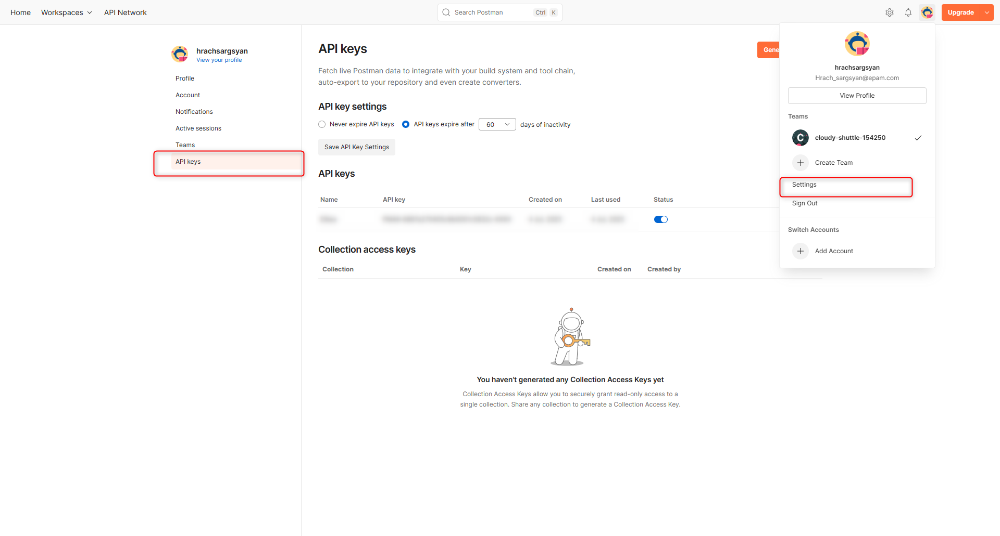
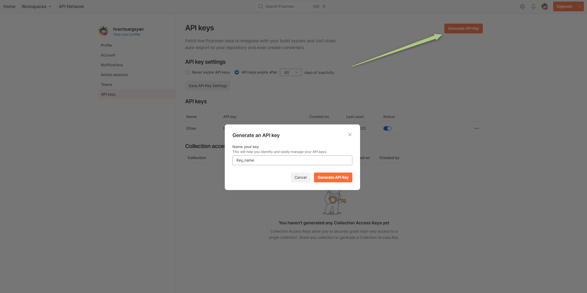
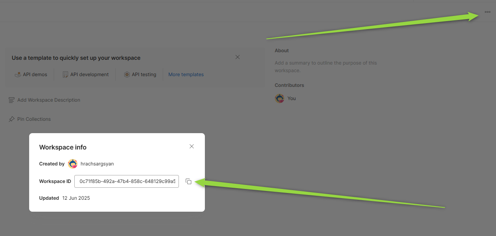
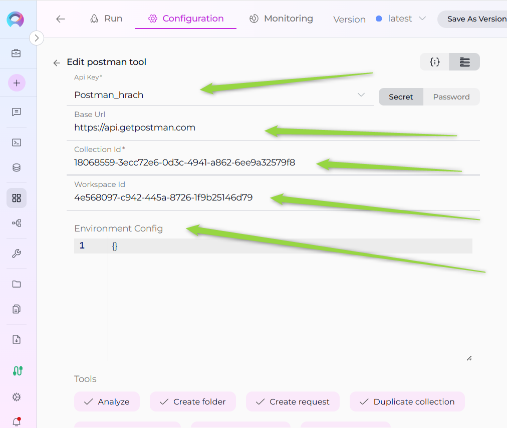

# ELITEA Toolkit Guide: Postman Integration

## Introduction

### Purpose of this Guide

This guide is your definitive resource for integrating and utilizing the **Postman toolkit** within ELITEA. It provides a step-by-step walkthrough, from setting up your Postman API Key to configuring the toolkit in ELITEA and effectively using it within your Agents. By following this guide, you will unlock the power of automated API testing, streamlined workflows, and enhanced team collaboration, all directly within the ELITEA platform. This integration empowers you to leverage AI-driven automation to optimize your API testing lifecycle using the combined strengths of ELITEA and Postman.

### Brief Overview of Postman

Postman is a popular, web-based API platform that helps teams of all sizes efficiently design, test, and manage APIs. It provides a centralized platform to streamline your API development and testing process, offering features for:

*   **API Request Management:** Create, organize, and manage API requests and collections with rich documentation and environment variables.
*   **Automated Testing:** Plan and execute automated API tests, track results in real-time, and integrate with CI/CD pipelines.
*   **Reporting & Metrics:** Generate insightful reports and metrics on API test coverage, results, and performance.
*   **Integration with Development Tools:** Seamlessly integrates with version control, CI/CD, and other tools, making it a central hub for your API ecosystem.
*   **Collaboration & Sharing:** Share collections, environments, and test results with your team for better collaboration.

Integrating Postman with ELITEA brings these robust API management capabilities directly into your AI-powered workflows. Your ELITEA Agents can then interact with your Postman workspace to automate API-related tasks, enhance testing processes, and improve team collaboration through intelligent automation.

## Postman Account Setup and Configuration

### Account Setup

If you don't have a Postman account yet, here’s how to get started:

1.  **Go to Postman Website:** Open your web browser and navigate to [Postman's official website](https://www.postman.com/).
2.  **Sign Up:** Click the **"Sign Up"** button and provide your details. You can sign up with an email address or use a Google account.
3.  **Verify Your Email:** Open the confirmation email from Postman and click on the verification link provided within the email.
4.  **Access Your Account:** After email verification, you will be redirected to your new Postman workspace. Follow any on-screen instructions to complete the setup.

### API Key Generation in Postman

To securely integrate Postman with ELITEA, you need to generate an API key within Postman. This API key will be used by ELITEA to authenticate and access your Postman workspace.

**Follow these steps to create an API Key:**

1.  **Log in to Postman:** Access your Postman account using your credentials.
2.  **Access API Keys:** Click on your profile icon in the top right corner, then select **"Settings"**. Navigate to the **"API Keys"** tab.
3.  **Create API Key:** Click the **"Create API Key"** button, provide a name for the key (e.g., "ELITEA Integration Key"), and set the desired scopes/permissions.
4.  **Copy and Store the API Key:** **Immediately copy the generated API key.** This is the only time it will be displayed in full. Store it securely using a password manager or ELITEA's built-in Secrets feature (recommended for enhanced security within ELITEA). You will need this API Key to configure the Postman toolkit in ELITEA.
     
     
     

### Get Collection Id and Workspace Id in Postman

To configure the Postman toolkit in ELITEA, you will need the Collection Id and Workspace Id. Here’s how to find them in the Postman web interface:

#### How to Find the Collection Id
1. **Open Postman** and navigate to the workspace containing your collection.
2. **Select the Collection** you want to use.
3. **Locate the Collection Id:**
    - In the browser URL, you will see a path like `https://web.postman.co/workspace/<workspace-name>/collection/<collection-id>`.
    - The value after `/collection/` is your Collection Id.
    - Alternatively, you can use the Postman API to list collections and retrieve their IDs.
4. **Example:**
    - URL: `https://web.postman.co/workspace/MyWorkspace/collection/12345678-90ab-cdef-1234-567890abcdef`
    - Collection Id: `12345678-90ab-cdef-1234-567890abcdef`
    

#### How to Find the Workspace Id
1. **Open Postman** and go to the workspace you want to use.
2. **Locate the Workspace Id:**
    - In the browser URL, you will see a path like `https://web.postman.co/workspace/<workspace-id>`.
    - The value after `/workspace/` is your Workspace Id.
    - Alternatively, you can use the Postman API to list workspaces and retrieve their IDs.
3. **Example:**
    - URL: `https://web.postman.co/workspace/abcdef12-3456-7890-abcd-ef1234567890`
    - Workspace Id: `abcdef12-3456-7890-abcd-ef1234567890`
    

> **Tip:** You can also use the [Postman API](https://docs.api.getpostman.com/) to programmatically list collections and workspaces, which will include their IDs in the response.

## Postman Integration with ELITEA

### Agent Creation/Configuration

To integrate Postman, you'll need to configure it within an ELITEA Agent. You can either create a new Agent or modify an existing one.

1.  **Navigate to Agents:** In ELITEA, go to the **Agents** menu.
2.  **Create or Edit Agent:**
    *   **New Agent:** Click **"+ Agent"** to create a new Agent. Follow the steps to define Agent details like name, description, type, and instructions.
    *   **Existing Agent:** Select the Agent you want to integrate with Postman and click on its name to edit.
3.  **Access Tools Section:** In the Agent configuration, scroll down to the **"Tools"** section.

### Toolkit Configuration

This section details how to configure the Postman toolkit within your ELITEA Agent.

1.  **Add Toolkit:** In the "Tools" section, click the **"+" icon**.
2.  **Select Postman:** Choose **"Postman"** from the dropdown list of available toolkits. This opens the "New Postman tool" configuration panel.
3.  **Configure Toolkit Details:** Fill in the following fields:

    *   **API Key:** Enter your Postman API Key. This is required for authenticating ELITEA with your Postman account. For best security, store your API Key as a Secret in ELITEA and select it from the dropdown. Alternatively, you can paste the API Key directly, but using Secrets is recommended.
    *   **Base Url:** The base URL for the Postman API. Typically, this is `https://api.getpostman.com/`. Only change this if you are using a custom Postman API endpoint.
    *   **Collection Id:** The unique identifier of the Postman collection you want the Agent to access or run. You can find the Collection ID in the Postman web interface (in the collection's URL or via the Postman API).
    *   **Workspace Id:** The unique identifier of your Postman workspace. This is required if you want to scope actions (like listing or running collections) to a specific workspace. You can find the Workspace ID in the Postman web interface or via the Postman API.
    *   **Environment Config:** (Optional) The ID or configuration for a Postman environment to use when running collections. This allows you to specify environment variables and settings for your API tests. You can find Environment IDs in the Postman web interface or via the API.

    

4.  **Enable Tools:** In the "Tools" section of the Postman toolkit configuration, **select the checkboxes next to the Postman tools** you want to enable for your Agent. **Enable only the tools your Agent will actually use** to adhere to the principle of least privilege and enhance security. Available tools may include:
    *   **Get collections:** Retrieve a list of all collections in your Postman workspace.
    *   **Get collection:** Retrieves details of a specific collection.
    *   **Get folder:** Retrieve details of a specific folder within a collection.

5.  **Complete Configuration:** Click the **arrow icon** (at the top right of the toolkit configuration) to save the Postman toolkit setup and return to the main Agent configuration.
6.  Click **Save** to apply configuration and changes to the Agent.

### Tool Overview

The Postman toolkit provides a wide range of tools for your ELITEA Agents. Below are the available tools and their purposes:

- **get_collections:** Retrieve a list of all collections in your Postman workspace.
- **get_collection:** Retrieve details of a specific collection by its ID.
- **get_folder:** Retrieve details of a specific folder within a collection.
- **get_request_by_path:** Retrieve a request by specifying its path within a collection/folder structure.
- **get_request_by_id:** Retrieve a request by its unique ID.
- **get_request_script:** Retrieve the pre-request or test script associated with a request.
- **search_requests:** Search for requests within collections by name or other criteria.
- **analyze:** Analyze a collection or request for best practices, issues, or structure.
- **execute_request:** Execute a specific request and return the response.
- **update_collection_description:** Update the description of a collection.
- **update_collection_variables:** Update the variables defined at the collection level.
- **update_collection_auth:** Update the authentication settings for a collection.
- **duplicate_collection:** Create a duplicate of an existing collection.
- **create_folder:** Create a new folder within a collection.
- **update_folder:** Update the name or description of a folder.
- **move_folder:** Move a folder to a different location within a collection.
- **create_request:** Create a new request within a collection or folder.
- **update_request_name:** Update the name of a request.
- **update_request_method:** Update the HTTP method (GET, POST, etc.) of a request.
- **update_request_url:** Update the URL of a request.
- **update_request_description:** Update the description of a request.
- **update_request_headers:** Update the headers for a request.
- **update_request_body:** Update the body (payload) of a request.
- **update_request_auth:** Update the authentication settings for a request.
- **update_request_tests:** Update the test scripts for a request.
- **update_request_pre_script:** Update the pre-request script for a request.
- **duplicate_request:** Create a duplicate of an existing request.
- **move_request:** Move a request to a different folder or collection.

These tools enable comprehensive management, automation, and analysis of your Postman collections, folders, and requests directly from ELITEA Agents.

## Instructions and Prompts for Using the Toolkit

To instruct your ELITEA Agent to use the Postman toolkit, you need to provide clear instructions within the Agent's "Instructions" field. These instructions guide the Agent on *when* and *how* to use the available tools.

### Instruction Creation for OpenAI Agents

When creating instructions for the Postman toolkit for OpenAI-based Agents, focus on clear, action-oriented language. Break down tasks into simple steps and explicitly state the parameters required for each tool. OpenAI Agents respond best to instructions that are:

*   **Direct and Imperative:** Use action verbs and clear commands (e.g., "Use the 'get_collections' tool...", "Update the request body using 'update_request_body'...").
*   **Parameter-Focused:** Clearly list each parameter and how the Agent should determine its value.
*   **Context-Aware:** Provide enough context so the Agent understands the overall goal and when to use specific tools within a workflow.

When instructing your Agent to use a Postman toolkit, use this pattern:

```markdown
1. Identify the goal: [State the objective, e.g., "To update the request headers for a specific API request"].
2. Tool Selection: Use the "[tool_name]" tool.
3. Parameter Specification: Provide the following parameters:
    - Parameter Name 1: <value or description of value>
    - Parameter Name 2: <value or description of value>
    - ...
4. Expected Outcome: [Optionally, describe what should happen after the tool is used].
```

**Example Agent Instructions for Postman Toolkit Tools (OpenAI Agent Friendly):**

*   **Get all collections:**

```markdown
1. Goal: To retrieve a list of all Postman collections in the workspace.
2. Tool: Use the "get_collections" tool.
3. Parameters: None
4. Outcome: The Agent will display all available collections.
```

*   **Get a specific request by ID:**

```markdown
1. Goal: To get details of the request with ID "req123".
2. Tool: Use the "get_request_by_id" tool.
3. Parameters:
    - Request ID: "req123"
4. Outcome: The Agent will retrieve and display the details of the specified request.
```

*   **Update request headers:**

```markdown
1. Goal: To update the headers for request ID "req123" to include a new Authorization token.
2. Tool: Use the "update_request_headers" tool.
3. Parameters:
    - Request ID: "req123"
    - Headers: '{"Authorization": "Bearer <token>"}'
4. Outcome: The Agent will update the request headers accordingly.
```

*   **Move a folder:**

```markdown
1. Goal: To move folder ID "folder789" to a new parent folder in collection ID "col456".
2. Tool: Use the "move_folder" tool.
3. Parameters:
    - Folder ID: "folder789"
    - Collection ID: "col456"
    - New Parent Folder ID: "parent123"
4. Outcome: The folder will be moved to the new location.
```

*   **Execute a request:**

```markdown
1. Goal: To execute the request with ID "req123" and view the response.
2. Tool: Use the "execute_request" tool.
3. Parameters:
    - Request ID: "req123"
4. Outcome: The Agent will execute the request and display the response.
```

### Conversation Starters

Use these conversation starters to interact with your Postman-integrated Agent and test the toolkit's capabilities:

*   "List all Postman collections."
*   "Get details for collection ID col456."
*   "Find the request named 'Get User Info' in collection col456."
*   "Update the request body for request ID req123 to use new JSON data."
*   "Move folder ID folder789 to a different parent folder."
*   "Duplicate the request with ID req123."
*   "Analyze collection col456 for best practices."
*   "Execute the request with ID req123 and show me the response."
*   "Update the authentication settings for collection col456."
*   "Create a new request in folder folder789."

## Use Cases

The Postman toolkit unlocks extensive automation and management possibilities for API workflows within ELITEA. Here are some key use cases, demonstrating how each tool can be applied:

*   **API Inventory and Discovery:**
    *   **Scenario:** List all collections and requests to get an overview of available APIs.
    *   **Tools Used:** `get_collections`, `get_collection`, `get_request_by_id`, `search_requests`
    *   **Example Instruction:** "Use the 'get_collections' tool to list all collections, then use 'get_collection' to view details of collection col456."

*   **Automated Request Execution:**
    *   **Scenario:** Execute specific API requests and validate responses as part of automated workflows.
    *   **Tools Used:** `execute_request`, `get_request_by_id`
    *   **Example Instruction:** "Use the 'execute_request' tool to run request req123 and display the response."

*   **API Structure Management:**
    *   **Scenario:** Organize and update collections, folders, and requests for better maintainability.
    *   **Tools Used:** `create_folder`, `move_folder`, `update_folder`, `duplicate_collection`, `move_request`, `duplicate_request`
    *   **Example Instruction:** "Move folder folder789 to a new parent, or duplicate collection col456 for testing."

*   **Request and Collection Updates:**
    *   **Scenario:** Update request details, headers, authentication, or scripts to reflect new requirements.
    *   **Tools Used:** `update_request_headers`, `update_request_body`, `update_request_auth`, `update_request_tests`, `update_request_pre_script`, `update_collection_auth`, `update_collection_variables`, `update_collection_description`
    *   **Example Instruction:** "Update the request body for req123 to use the latest payload."

*   **Quality and Best Practice Analysis:**
    *   **Scenario:** Analyze collections or requests for best practices, missing documentation, or potential issues.
    *   **Tools Used:** `analyze`
    *   **Example Instruction:** "Analyze collection col456 for best practices and report any issues."

These use cases demonstrate how the Postman toolkit can streamline API management, automate testing, and improve the quality and organization of your API assets within ELITEA.

## Troubleshooting and Support

### Troubleshooting

*   **Connection Issues:**
    *   **Problem:** Agent fails to connect to Postman, resulting in errors during toolkit execution.
    *   **Troubleshooting Steps:**
        1.  **Verify API Key:** Ensure the API Key is correctly entered and has the necessary permissions.
        2.  **Check Account Access:** Double-check your Postman account and workspace access.
        3.  **API Key Generation:** Re-generate a new API key in Postman and try using that if you suspect the key might be invalid.
        4.  **Network Connectivity:** Verify that both ELITEA and Postman have internet access and no network issues are blocking the connection.

*   **Authorization Errors (Permission Denied):**
    *   **Problem:** Agent receives "Permission Denied" or "Unauthorized" errors when accessing Postman resources.
    *   **Troubleshooting Steps:**
        1.  **API Key Validity:** Ensure the API key is valid and has not been revoked in Postman.
        2.  **Account Permissions:** Confirm that the Postman account associated with the API key has the necessary permissions to access the specified workspace and perform the requested actions.

*   **Incorrect Collection or Environment IDs:**
    *   **Problem:** Agent fails to find collections or environments, especially when running or retrieving details.
    *   **Troubleshooting Steps:**
        1.  **Verify Collection ID:** Double-check the Collection ID in your Postman workspace. You can usually find the Collection ID in the URL or via the Postman API.
        2.  **Verify Environment ID:** Similarly, verify the Environment ID. Ensure the Environment ID is valid within the specified workspace.

### FAQ

1.  **Q: Can I use my regular Postman password instead of an API Key?**
    *   **A:** No, for secure integration with ELITEA, you **must use a Postman API Key**. Using your regular password directly is not supported and is a security risk.
2.  **Q: Where do I find Collection and Environment IDs in Postman?**
    *   **A:** Collection and Environment IDs are typically visible in the URL when you navigate to a specific collection or environment within Postman. You can also find these IDs through the Postman API or by exporting the collection/environment.
3.  **Q: What if I don't know the exact permissions needed for the API Key?**
    *   **A:** Postman allows you to set scopes/permissions when creating an API key. For ELITEA integration, ensure the key has access to the collections and environments you want to manage. Contact your Postman administrator if you are unsure about these permissions.

### Support Contact

For any issues, questions, or further assistance with the Postman integration or ELITEA Agents, please reach out to our dedicated ELITEA Support Team. We are committed to providing prompt and effective support to ensure your success with ELITEA.

**Contact ELITEA Support:**

*   **Email:**  **[SupportAlita@epam.com](mailto:SupportAlita@epam.com)**

**Best Practices for Effective Support Requests:**

To help us understand and resolve your issue as quickly as possible, please ensure you provide the following information in your support email:

*   **ELITEA Environment:** Clearly specify the ELITEA environment you are using (e.g., "Next" or the specific name of your ELITEA instance).
*   **Project Details:**  Indicate the **Project Name** and whether you are working in your **Private** workspace or a **Team** project.
*   **Detailed Issue Description:** Provide a clear, concise, and detailed description of the problem you are encountering. Explain what you were trying to do, what you expected to happen, and what actually occurred.
*   **Relevant Configuration Information:**  To help us diagnose the issue, please include relevant configuration details, such as:
    *   **Agent Instructions (Screenshot or Text):** If the issue is with an Agent, provide a screenshot or copy the text of your Agent's "Instructions" field.
    *   **Toolkit Configurations (Screenshots):** If the issue involves the Postman toolkit or other toolkits, include screenshots of the toolkit configuration settings within your Agent.
*   **Error Messages (Full Error Text):** If you are encountering an error message, please provide the **complete error text**. In the Chat window, expand the error details and copy the full error message. This detailed error information is crucial for diagnosis.
*   **Your Query/Prompt (Exact Text):** If the issue is related to Agent execution, provide the exact query or prompt you used to trigger the issue.

**Before Contacting Support:**

We encourage you to first explore the resources available within this guide and the broader ELITEA documentation. You may find answers to common questions or solutions to known issues in the documentation.

## Useful Links

To further enhance your understanding and skills in integrating Postman with ELITEA, here are some helpful resources:

*   **[Postman Website](https://www.postman.com/)**: Access the main Postman platform to create an account or log in and explore Postman features.
*   **[Postman API Documentation](https://docs.api.getpostman.com/)**:  Refer to the official Postman API documentation for detailed information on API endpoints, data structures, and advanced usage.
*   **[ELITEA Secrets](../../menus/settings/secrets.md)**: Learn how to securely store your Postman API Key using ELITEA's Secrets management feature for enhanced security.
*   **[ELITEA Agents Configuration](../../menus/agents.md)**:  Find out more about creating and configuring Agents in ELITEA, where you integrate the Postman toolkit to automate your workflows.
*   **[ELITEA Support Email](mailto:SupportAlita@epam.com)**: Contact the ELITEA support team for direct assistance with Postman integration or any other questions and issues you may encounter.

