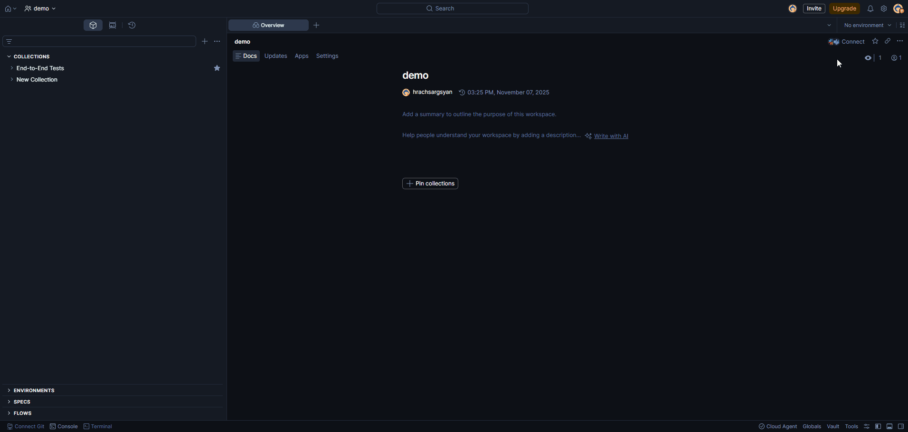
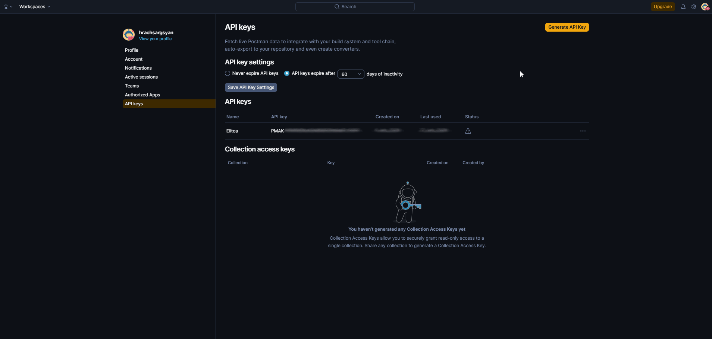
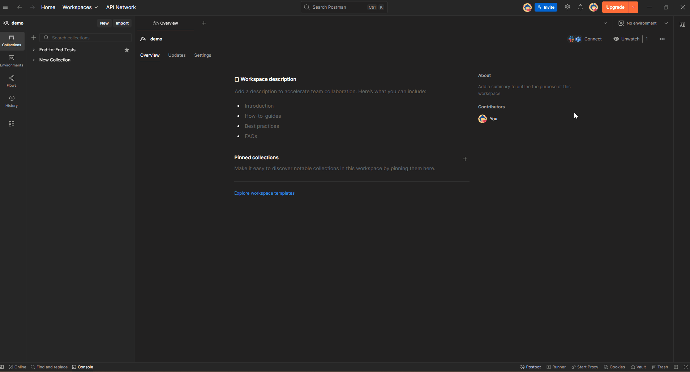
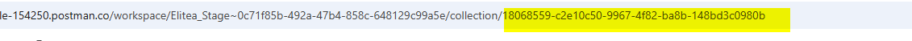
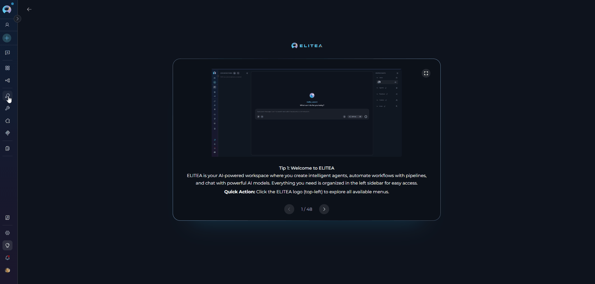
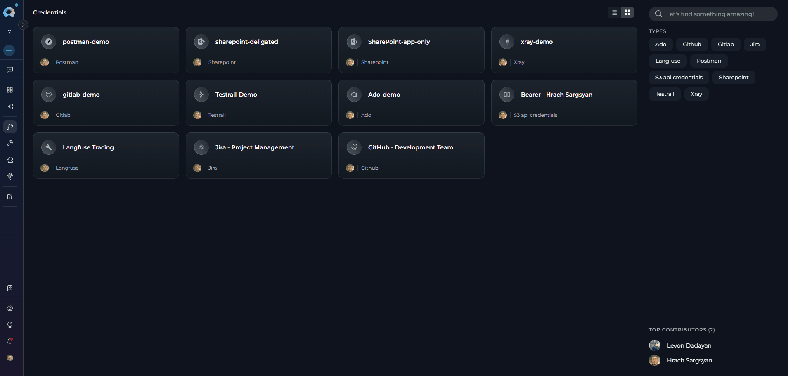
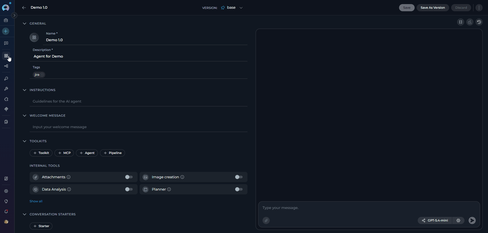
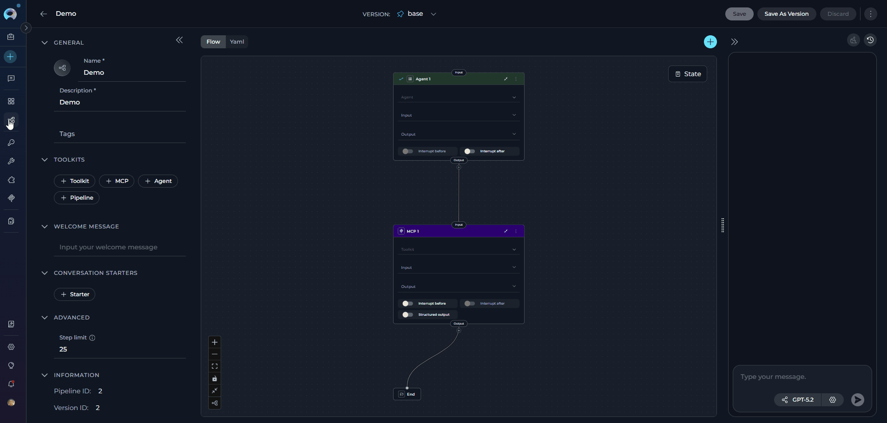
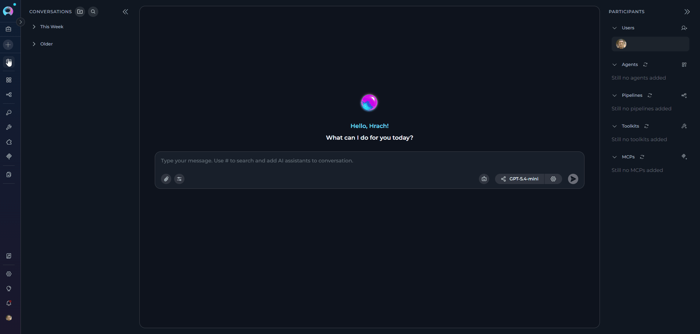

# Postman Toolkit Integration Guide

---

## Introduction

This guide is your comprehensive resource for integrating and utilizing the **Postman toolkit** within ELITEA. It provides detailed, step-by-step instructions, from setting up your Postman API Key to configuring the toolkit in ELITEA and effectively using it within your Agents, Pipelines, and Chat conversations. By following this guide, you will unlock the power of automated API collection management, streamlined API testing workflows, and enhanced team collaboration, all directly within the ELITEA platform.

**Brief Overview of Postman**

Postman is a leading web-based API platform that helps teams of all sizes efficiently design, test, document, and manage APIs. It provides a centralized platform to streamline your API development and testing process, offering features for:

*   **API Request Management:** Create, organize, and manage API requests and collections with rich documentation and environment variables.
*   **Automated Testing:** Define and execute automated API tests, track results in real-time, and integrate with CI/CD pipelines.
*   **Collection Organization:** Structure API requests into logical collections and folders for improved maintainability and discoverability.
*   **Integration with Development Tools:** Seamlessly integrates with version control, CI/CD, and other tools, making it a central hub for your API ecosystem.
*   **Collaboration & Sharing:** Share collections, environments, and test results with your team for better collaboration.

Integrating Postman with ELITEA brings these robust API management capabilities directly into your AI-driven workflows. Your ELITEA Agents, Pipelines, and Chat conversations can intelligently interact with your Postman workspace to automate API-related tasks, manage collections and requests, and improve team collaboration.

---

## Toolkit's Account Setup and Configuration

**Account Setup**

If you don't already have a Postman account, follow these steps to create one:

1.  **Visit Postman:** Navigate to [postman.com](https://www.postman.com)
2.  **Sign Up:** Click the **"Sign Up"** button
3.  **Enter Details:** Provide your email address, enter your name, and create a secure password
4.  **Verify Email:** Check your inbox for a verification email from Postman and click the verification link to activate your account
5.  **Log In:** Once verified, log in to Postman with your credentials

### Generate an API Key

For secure integration with ELITEA, you must use a Postman **API Key**. This method is significantly more secure than using your primary Postman account password directly.

**Follow these steps to generate an API Key in Postman:**

1.  **Log in to Postman:** Access your Postman account at [postman.com](https://www.postman.com).
2.  **Navigate to API Keys:**

    - **In the Postman app:** Click your **profile icon** in the top-right corner → **"Settings"** → **"API Keys"** tab.
    - **In the browser:** Click the **settings icon** → **"Account Settings"** → **"API Keys"** tab.

     {loading=lazy}

3.  **Create API Key:** Click the **"Generate API Key"** button and provide a descriptive name (e.g., "ELITEA Integration Key").
4.  **Copy and Store the API Key:** **Immediately copy the generated API key** — this is the only time it will be displayed in full. Store it securely in a password manager or ELITEA's **[Secrets](../../menus/settings/secrets.md)** feature.

     {loading=lazy}


!!! warning "Important Security Practices"
    **Principle of Least Privilege:** The Postman API Key grants access to your Postman workspace using your account's permissions. Store keys securely and rotate them periodically.
    
    **Use ELITEA Secrets:** Always reference your API key through ELITEA's Secrets feature rather than entering it directly in configuration fields.

### Find Your Collection ID and Workspace ID

To configure the Postman toolkit in ELITEA, you will need the **Collection ID** and **Workspace ID**. Here's how to find them in the Postman web interface:

#### How to Find the Workspace ID

**Option 1: From the Postman App**

1. **Open Postman** and navigate to the workspace you want to use.
2. **Open Workspace info:** Click the **ellipsis (`...`)** icon next to the workspace name, then select **"Workspace Info"**.
3. **Copy the Workspace ID:** The Workspace ID (UUID) is displayed in the modal window. Copy it directly.

    {loading=lazy}

**Option 2: From the Browser URL**

!!! note "Workspace ID location in URL"
    1. **Open Postman** in the browser and select the workspace you want to use.
    2. **Locate the Workspace ID in the URL:**
        - The URL follows the pattern: `https://<team>.postman.co/workspace/<workspace-name>~<workspace-id>/overview`
        - The UUID value **after the `~` symbol** is your Workspace ID.

    The workspace URL contains both the workspace name and its UUID separated by `~`. Copy only the UUID part that comes **after** the `~` symbol — do not include the workspace name or the `~` itself.

    !!! example

        - **URL**: `https://myteam.postman.co/workspace/MyWorkspace~12345678-abcd-efgh-ijkl-1234567890ab/overview`

        - **Workspace ID:** `12345678-abcd-efgh-ijkl-1234567890ab`

#### How to Find the Collection ID

1. **Open Postman** and navigate to the workspace containing your collection.
2. **Select the Collection** you want to use.
3. **Locate the Collection ID:**
    - In the browser URL, you will see a path like `https://web.postman.co/workspace/<workspace-name>/collection/<collection-id>`.
    - The UUID value after `/collection/` is your Collection ID.
!!! example
    - URL: `https://web.postman.co/workspace/MyWorkspace/collection/12345678-90ab-cdef-1234-567890abcdef`
    - Collection ID: `12345678-90ab-cdef-1234-567890abcdef`

    {loading=lazy}

!!! tip 
    You can also use the [Postman API](https://docs.api.getpostman.com/) to programmatically list collections and workspaces, which will include their IDs in the response.

---

## System Integration with ELITEA

To integrate Postman with ELITEA, you need to follow a three-step process: **Create Credentials → Create Toolkit → Use in Agents**. This workflow ensures secure authentication and proper configuration.

### Step 1: Create Postman Credentials

Before creating a toolkit, you must first create Postman credentials in ELITEA:

1. **Navigate to Credentials Menu:** Open the sidebar and select **[Credentials](../../menus/credentials.md)**.
2. **Create New Credential:** Click the **`+ Create`** button.
3. **Select Postman:** Choose **Postman** as the credential type.
4. **Configure Credential Details:**

    | **Field** | **Description** | **Example** |
    |-------|-------------|---------|
    | **Display Name** | Enter a descriptive name | `Postman - My Workspace` |
    | **ID** | Unique identifier for the credential | Auto-populated from the Display Name |
    | **Base URL** | Enter the Postman API base URL | `https://api.getpostman.com` |
    | **Workspace ID** | Enter your Postman Workspace ID | `abcdef12-3456-7890-abcd-ef1234567890` |
    | **API Key** | Enter your Postman API Key | `PMAK-xxxxxxxxxxxxxxxx` |

5. **Save Credential:** Click **Save** to create the credential

    {loading=lazy}

!!! tip "Security Recommendation"
    It's highly recommended to use **[Secrets](../../menus/settings/secrets.md)** for API Keys instead of entering them directly. Create a secret first, then reference it in your credential configuration.

---

### Step 2: Create Postman Toolkit

Once your credentials are configured, create the Postman toolkit:

1. **Navigate to Toolkits Menu:** Open the sidebar and select **[Toolkits](../../menus/toolkits.md)**.
2. **Create New Toolkit:** Click the **`+ Create`** button.
3. **Select Postman:** Choose **Postman** from the list of available toolkit types.
4. **Configure Toolkit Settings:**

    | **Field** | **Description** | **Example** |
    |-------|-------------|---------|
    | **Toolkit Name** | Enter a descriptive name for your toolkit | `Postman - API Collection Manager` |
    | **Description** | Add a description of the toolkit's purpose (optional) | `Manages Postman API collections and automates request workflows` |
    | **Postman Configuration** | Select your previously created Postman credential | `Postman - My Workspace` |
    | **Collection ID** | Enter the default collection ID to scope all toolkit operations | `12345678-90ab-cdef-1234-567890abcdef` |
    | **Environment Config** | Enter a JSON object with variables to override when executing requests (auth headers, base URLs, project IDs, etc.) | `{"base_url": "https://api.example.com", "api_key": "your-key"}` |

5. **Enable Desired Tools:** In the **"Tools"** section, select the checkboxes next to the specific Postman tools you want to enable. **Enable only the tools your agents will actually use** to follow the principle of least privilege.
       * **[Make Tools Available by MCP](../mcp/make-tools-available-by-mcp.md)** — (optional checkbox) Enable this option to make the selected tools accessible through external MCP clients.
6. **Save Toolkit:** Click **Save** to create the toolkit

    {loading=lazy}

!!! note "Collection ID Scope"
    The **Collection ID** is required and scopes the toolkit to a single Postman collection. All folder, request, and analysis operations work within this collection. To work with multiple collections, create separate toolkit instances with different Collection IDs.

#### Environment Config Format

The `Environment Config` field accepts a JSON object that provides variable values used when executing requests. The variable names should match the environment variables defined in your Postman environment (e.g., exported from **Environments** in Postman). There are two supported formats:

**Simple key-value variables** (used to resolve `{{variable}}` placeholders in requests):
```json
{
  "base_url": "https://api.example.com",
  "project_id": "12345",
  "auth_token": "your-auth-token"
}
```

!!! tip "Match your Postman environment variables"
    The keys in this JSON should match the variable names in your Postman environment. For example, if your Postman environment defines `base_url`, `project_id`, and `auth_token`, use those exact names here. The toolkit will substitute `{{base_url}}`, `{{project_id}}`, and `{{auth_token}}` placeholders in your requests with the values provided.


**Structured authentication** (used to inject auth headers directly when executing requests):
```json
{
  "base_url": "https://api.example.com",
  "project_id": "12345",
  "auth": {
    "type": "bearer",
    "bearer": [{"value": "your-auth-token"}]
  }
}
```

Supported `auth.type` values: `bearer`, `basic`, `api_key`, `oauth2`, `custom`.

!!! warning "Exported Postman environment files are not supported"
    The **Environment Config** field does **not** accept the raw JSON file exported from Postman (which contains `id`, `name`, `values` array, and metadata). You must manually extract the variable names and their values and build a flat key-value JSON object.

    **Exported Postman environment (not supported):**
    ```json
    {
      "name": "my_environment",
      "values": [
        { "key": "base_url", "value": "https://api.example.com", "enabled": true },
        { "key": "auth_token", "value": "your-token", "enabled": true },
        { "key": "project_id", "value": "12345", "enabled": true }
      ]
    }
    ```

    **Environment Config to paste in ELITEA (supported):**
    ```json
    {
      "base_url": "https://api.example.com",
      "auth_token": "your-token",
      "project_id": "12345"
    }
    ```


#### Available Tools

The Postman toolkit provides the following tools for interacting with Postman collections, folders, and requests, organized by functional category:

| **Tool Category** | **Tool Name** | **Description** | **Primary Use Case** |
|:-----------------:|---------------|-----------------|----------------------|
| **Collection Access** | | | |
| | **Get collections** | Retrieves all collections accessible in the configured workspace | List and browse available API collections |
| | **Get collection** | Retrieves the configured collection in flattened format with path-based structure. Accepts an optional collection ID; defaults to toolkit configuration | Inspect collection structure and full content |
| **Folder Management** | | | |
| | **Get folder** | Retrieves a specific folder in flattened format using a path-based identifier (e.g., `API/Users`) | Access folder structure and its requests |
| | **Create folder** | Creates a new folder within the collection, optionally nested under a parent path | Organize requests into logical groups |
| | **Update folder** | Updates folder properties: name, description, and/or authentication settings | Modify folder metadata |
| | **Delete folder** | Permanently deletes a folder and all its contents | Remove obsolete folder hierarchies |
| | **Move folder** | Moves a folder to a different location within the collection | Reorganize collection structure |
| **Request Access** | | | |
| | **Get request by path** | Retrieves a specific request using its hierarchical path (e.g., `API/Users/Get User`) | Access request details without knowing the ID |
| | **Get request by ID** | Retrieves a specific request by its unique Postman ID | Direct lookup of a known request |
| | **Get request script** | Retrieves the test or pre-request script content attached to a request | Review or audit automation scripts |
| | **Search requests** | Searches for requests across the collection by name, URL, description, or all fields; supports HTTP method filter | Find requests matching specific criteria |
| **Request Management** | | | |
| | **Create request** | Creates a new API request in a specified folder with method, URL, headers, body, auth, and scripts | Add new API endpoints to the collection |
| | **Update request name** | Renames a request identified by its path | Clarify request naming for readability |
| | **Update request method** | Changes the HTTP method of a request (GET, POST, PUT, etc.) | Correct or update request type |
| | **Update request URL** | Updates the URL of a request | Modify the target endpoint |
| | **Update request description** | Updates the description of a request | Add or improve inline documentation |
| | **Update request headers** | Replaces the header list of a request using `Header-Name: value` format (one per line) | Update authentication or content type headers |
| | **Update request body** | Updates the request body; supports `raw`, `formdata`, and `urlencoded` modes | Modify request payload |
| | **Update request auth** | Updates the authentication settings on a request (bearer, basic, apikey, etc.) | Configure request-level authentication |
| | **Update request tests** | Replaces the test (post-response) script on a request | Add or modify automated test assertions |
| | **Update request pre script** | Replaces the pre-request script on a request | Add or modify pre-execution setup logic |
| | **Duplicate request** | Creates a copy of an existing request, optionally in a different folder | Create variants or template-based requests |
| | **Move request** | Moves a request to a different folder within the collection | Reorganize requests |
| | **Delete request** | Permanently deletes an API request | Remove outdated or duplicate entries |
| **Collection Management** | | | |
| | **Update collection description** | Updates the description of the collection | Improve collection-level documentation |
| | **Update collection variables** | Replaces the variables defined at the collection level | Manage shared variable values across all requests |
| | **Update collection auth** | Updates the default authentication settings at the collection level | Configure collection-wide authentication |
| | **Duplicate collection** | Creates a copy of the configured collection with a new name | Back up or create test variants of collections |
| | **Delete collection** | Permanently deletes the configured collection | Remove an obsolete collection |
| **Execution & Analysis** | | | |
| | **Execute request** | Executes a request by path, resolving `{{variable}}` placeholders from the Environment Config and optional per-call overrides | Run requests and validate API responses in real-time |
| | **Analyze** | Analyzes the collection, a specific folder, or a specific request for API quality, documentation completeness, security issues, and best practices | Identify quality gaps and improvement opportunities |

!!! warning "Destructive Operations"
    The **Delete collection**, **Delete folder**, and **Delete request** tools permanently remove data from your Postman workspace. Enable only these tools if your agent genuinely requires deletion capabilities, and always follow the principle of least privilege.

#### Testing Toolkit Tools

After configuring your Postman toolkit, you can test individual tools directly from the Toolkit detail page using the **Test Settings** panel. This lets you verify credentials and validate tool behavior before deploying to your workflows.

**General Testing Steps:**

1. **Select LLM Model:** Choose a Large Language Model from the model dropdown in the Test Settings panel
2. **Configure Model Settings:** Adjust model parameters as needed
3. **Select a Tool:** Choose the specific Postman tool you want to test
4. **Provide Input:** Enter any required parameters for the selected tool
5. **Run the Test:** Execute the tool and wait for the response
6. **Review the Response:** Confirm the tool returns expected results

!!! tip "Key benefits of testing toolkit tools:"
    * Verify that Postman credentials and connection are configured correctly
    * Validate that tools function as expected with your Postman collection
    * Test different parameter combinations before production use
    * Familiarize yourself with tool capabilities and expected outputs
    
    > For detailed instructions on how to use the Test Settings panel, see **[How to Test Toolkit Tools](../../how-tos/credentials-toolkits/how-to-test-toolkit-tools.md)**.

---

### Step 3: Add Postman Toolkit to Your Workflows

Now you can add the configured Postman toolkit to your agents, pipelines, or use it directly in chat:

---

#### In Agents:

1. **Navigate to Agents:** Open the sidebar and select **[Agents](../../menus/agents.md)**
2. **Create or Edit Agent:** Either create a new agent or select an existing agent to edit
3. **Add Postman Toolkit:**
     * In the **"TOOLKITS"** section of the agent configuration, click the **"+Toolkit"** icon
     * Select your desired Postman toolkit from the dropdown menu
     * The toolkit will be added to your agent with the previously configured tools enabled

    {loading=lazy}

---

#### In Pipelines:

1. **Navigate to Pipelines:** Open the sidebar and select **[Pipelines](../../menus/pipelines.md)**
2. **Create or Edit Pipeline:** Either create a new pipeline or select an existing pipeline to edit
3. **Add Postman Toolkit:**
     * In the **"TOOLKITS"** section of the pipeline configuration, click the **"+Toolkit"** icon
     * Select your desired Postman toolkit from the dropdown menu
     * The toolkit will be added to your pipeline with the previously configured tools enabled

    {loading=lazy}

---

#### In Chat:

1. **Navigate to Chat:** Open the sidebar and select **[Chat](../../menus/chat.md)**
2. **Start New Conversation:** Click **+Create** or open an existing conversation
3. **Add Toolkit to Conversation:**
     * In the chat Participants section, look for the **Toolkits** element
     * Click to add a toolkit and select your desired Postman toolkit from the available options
     * The toolkit will be added to your conversation with all previously configured tools enabled
4. **Use Toolkit in Chat:** You can now directly interact with your Postman collection by asking questions or requesting actions that will trigger the toolkit tools

    {loading=lazy}

!!! example "Example Chat Usage:"
    - "Show me all collections in my Postman workspace"
    - "Find all GET requests related to authentication"
    - "Execute the login request and show me the response"
    - "Analyze the collection for best practices and missing documentation"
    - "Create a new folder called 'Webhooks' in the collection"

---

## Instructions and Prompts for Using the Postman Toolkit

To effectively instruct your ELITEA Agent to use the Postman toolkit, provide clear and precise instructions within the Agent's "Instructions" field. These instructions guide the Agent on *when* and *how* to utilize the available Postman tools.

### Instruction Creation for Agents

When crafting instructions for the Postman toolkit, clarity and precision are paramount. Break down complex tasks into a sequence of simple, actionable steps and explicitly define all parameters required for each tool. Agents respond best to instructions that are:

*   **Direct and Action-Oriented:** Use strong action verbs and clear commands, for example: "Use the `get_collections` tool...", "Execute the request using `execute_request`...", "Analyze the collection using `analyze`...".

*   **Parameter-Centric:** Enumerate each required parameter by name and specify how the Agent should determine its value — from user input, from a previous step, from a hardcoded value, or from a variable.

*   **Contextually Rich:** Provide sufficient background so the Agent understands the overarching objective and which tool to apply within each step of the workflow.

*   **Step-by-Step Structure:** Organize instructions into numbered steps for complex multi-tool workflows.

*   **Add Conversation Starters:** Include example conversation starters that users can use to trigger the functionality.

When instructing your Agent to use a Postman toolkit tool, follow this structured pattern:

1. **State the Goal:** Clearly state the objective. For example, "Goal: Execute a specific API request and display the response."

2. **Specify the Tool:** Indicate the tool to use. For example, "Tool: Use the `execute_request` tool."

3. **Define Parameters:** List all required parameters, including how the Agent should obtain each value.

4. **Describe Expected Outcome (Optional):** Briefly describe what should happen after tool execution.

5. **Add Conversation Starters:** Include example prompts that users can try.

!!! example "Example Agent Instructions"

    **Agent Instructions for Executing an API Request:**

    ```markdown
    1. Goal: Execute a specific API request in Postman and display the response.
    2. Tool: Use the "execute_request" tool.
    3. Parameters:
        - request_path: "Ask the user for the request path, e.g., 'Auth/Login' or 'Users/Get User'."
        - override_variables: "Ask the user if they want to override any variables, or pass '{}'."
    4. Outcome: Display the response status code, headers, and body. Confirm successful execution to the user.
    5. Conversation Starters: "Execute the login request", "Run the Get User request with user_id=123"
    ```

    **Agent Instructions for Analyzing a Collection:**

    ```markdown
    1. Goal: Analyze the Postman collection for API quality, documentation gaps, and best practices.
    2. Tool: Use the "analyze" tool.
    3. Parameters:
        - scope: "Use 'collection' to analyze the full collection, 'folder' for a specific folder, or 'request' for a single request."
        - target_path: "If scope is 'folder' or 'request', ask the user for the path. Leave empty for 'collection' scope."
        - include_improvements: "Set to true to include improvement suggestions."
    4. Outcome: Present the analysis report with score, issues found, and recommendations.
    5. Conversation Starters: "Analyze my Postman collection", "Check the Auth folder for best practices"
    ```

---

### Chat Usage Examples by Tool Category

The following examples demonstrate how to interact with the Postman toolkit in ELITEA Chat, organized by functional category.

??? example "Collection Access - Get Collections"

    **Chat Example:**
    ```
    User: "Show me all Postman collections in my workspace."

    Agent Response: [Agent uses get_collections tool]

    **Postman Collections** (3 collections):

    1. **User API** (col_123) — 12 requests
    2. **Payment Gateway** (col_456) — 8 requests
    3. **Analytics API** (col_789) — 15 requests
    ```

??? example "Collection Access - Get Collection"

    **Chat Example:**
    ```
    User: "Show me the structure of my collection."

    Agent Response: [Agent uses get_collection tool]

    **Collection: User API**

    - Auth/
      - POST Auth/Login
      - POST Auth/Refresh
      - POST Auth/Logout
    - Users/
      - GET Users/List
      - GET Users/Get User
      - POST Users/Create User
      - PUT Users/Update User
      - DELETE Users/Delete User
    ```

??? example "Request Access - Search Requests"

    **Chat Example:**
    ```
    User: "Find all requests related to 'authentication'."

    Agent Response: [Agent uses search_requests tool]

    **Search Results for "authentication"** (3 matches):

    1. **POST Auth/Login** — Authenticate user with email and password
    2. **POST Auth/Refresh** — Refresh authentication token
    3. **POST Auth/Logout** — Invalidate user session
    ```

??? example "Execution - Execute Request"

    **Chat Example:**
    ```
    User: "Execute the Auth/Login request."

    Agent Response: [Agent uses execute_request tool]

    **Request Executed Successfully!**

    - **Request**: POST /api/auth/login
    - **Status**: 200 OK
    - **Response Time**: 145ms

    **Response Body**:
    {
      "status": "success",
      "token": "eyJhbGci...",
      "expires_in": 3600
    }
    ```

??? example "Execution - Execute with Variable Overrides"

    **Chat Example:**
    ```
    User: "Execute the Users/Get User request with user_id set to 42."

    Agent Response: [Agent uses execute_request tool with override_variables='{"user_id": "42"}']

    **Request Executed Successfully!**

    - **Request**: GET /api/users/42
    - **Status**: 200 OK

    **Response Body**:
    {
      "id": 42,
      "name": "Jane Doe",
      "email": "jane@example.com"
    }
    ```

??? example "Analysis - Analyze Collection"

    **Chat Example:**
    ```
    User: "Analyze my collection for best practices and issues."

    Agent Response: [Agent uses analyze tool with scope='collection', include_improvements=true]

    **Analysis Report: User API**

    - **Quality Score**: 72%
    - **Security Score**: 80%
    - **Documentation Score**: 65%
    - **Total Requests**: 12

    **Issues Found**:
    1. Missing descriptions on 4 requests
    2. Hardcoded base URLs in 2 requests — use {{base_url}} variable instead
    3. No test scripts on 5 requests

    **Recommendations**:
    - Add descriptions to all requests for better discoverability
    - Replace hardcoded URLs with environment variables
    - Add test assertions to validate response structure and status codes
    ```

??? example "Folder Management - Create Folder"

    **Chat Example:**
    ```
    User: "Create a new folder called 'Webhooks' in my collection."

    Agent Response: [Agent uses create_folder tool]

    **Folder Created Successfully!**

    - **Name**: Webhooks
    - **Path**: Webhooks

    The folder is ready for organizing your webhook-related requests.
    ```

??? example "Request Management - Create Request"

    **Chat Example:**
    ```
    User: "Create a new GET request for fetching user profiles in the Users folder."

    Agent Response: [Agent uses create_request tool]

    **Request Created Successfully!**

    - **Method**: GET
    - **URL**: {{base_url}}/api/users/profile
    - **Folder**: Users
    - **Description**: Retrieve the authenticated user's profile
    ```

??? example "Request Management - Update Request Body"

    **Chat Example:**
    ```
    User: "Update the body of the Auth/Login request to add a 'remember_me' field."

    Agent Response: [Agent uses update_request_body tool]

    **Request Body Updated Successfully!**

    - **Request**: Auth/Login

    **New Body**:
    {
      "email": "{{user_email}}",
      "password": "{{user_password}}",
      "remember_me": false
    }
    ```

---

## Troubleshooting

??? warning "Connection Issues"
    **Problem:** Agent fails to connect to Postman or experiences timeout errors

    **Possible Error Messages:**

    - "Postman API request failed: connection refused"
    - "Postman API request failed: connection timed out"
    - "Invalid JSON response from Postman API"

    **Solutions:**

    1. **Verify Base URL Format:**
        - Use `https://api.getpostman.com` (without a trailing slash)
        - Ensure the URL starts with `https://`

    2. **Check Network Connectivity:**
        - Verify you can access `https://api.getpostman.com` from your environment
        - Check firewall or proxy settings that may block outbound API calls

    3. **API Endpoint Validation:**
        - Errors surface when the first API call is made (e.g., when a tool is first invoked after saving the toolkit)
        - Verify your API key and workspace settings are correctly configured if an initial tool call returns an error

??? warning "Authentication Errors"
    **Problem:** "Unauthorized", "Forbidden", or API key-related errors

    **Possible Error Messages:**

    - "401 Unauthorized"
    - "403 Forbidden"
    - "Authentication failed"

    **Solutions:**

    1. **Verify API Key:**
        - Ensure the API key is copied correctly without leading or trailing spaces
        - Confirm the API key has not been revoked or expired in Postman Settings → API Keys

    2. **Regenerate if Necessary:**
        - If the key is compromised or invalid, generate a new one in Postman Settings
        - Update the toolkit credential with the new key and delete the old key for security

??? warning "Collection or Resource Not Found"
    **Problem:** Cannot find specified collection, folder, or request

    **Possible Error Messages:**

    - `"Postman API request failed: 404 Client Error"` (invalid Collection or Workspace ID)
    - `"Folder '{folder_path}' not found in collection '{collection_id}'"` (incorrect folder path)
    - `"Request '{request_path}' not found"` (incorrect request path)
    - `"Parent folder '{parent_path}' not found"` (invalid parent path in `create_folder`)
    - `"Source folder '{source_path}' not found"` / `"Source request '{source_path}' not found"` (move or duplicate operations)

    **Solutions:**

    1. **Verify Collection ID:**
        - Confirm the Collection ID in the toolkit settings matches the UUID visible in the Postman URL
        - Collection IDs are case-sensitive UUIDs (e.g., `12345678-90ab-cdef-1234-567890abcdef`)

    2. **Verify Workspace ID:**
        - Confirm the Workspace ID in the credential matches the UUID in the Postman URL
        - Verify the collection belongs to the specified workspace

    3. **Path-Based Resources:**
        - Folder and request paths are case-sensitive and must exactly match the names in Postman
        - Use the `get_collection` tool to inspect the actual names before using path-based tools
        - Nested paths use `/` as separator: `ParentFolder/ChildFolder/RequestName`

??? warning "Request Execution Failures"
    **Problem:** The `execute_request` tool fails or returns unexpected results

    **Possible Error Messages:**

    - "Request not found at path"
    - HTTP error responses from the target API

    **Solutions:**

    1. **Verify Request Path:**
        - Use `get_request_by_path` or `search_requests` to confirm the correct path before executing
        - Paths are case-sensitive

    2. **Check Variable Resolution:**
        - If the request uses `{{variable}}` placeholders, ensure the Environment Config JSON contains matching keys
        - Use `override_variables` for per-call overrides: `'{"base_url": "https://api.example.com"}'`
        - If `override_variables` contains invalid JSON it is **silently ignored** — execution continues with no overrides applied. If variable substitution is not working, check the JSON syntax of the `override_variables` argument.

    3. **Authentication Configuration:**
        - Ensure the `auth` block in Environment Config is correctly structured for your authentication type
        - Supported types: `bearer`, `basic`, `api_key`, `oauth2`, `custom`
        - Example for bearer auth: `{"auth": {"type": "bearer", "bearer": [{"value": "your-token"}]}}`

    4. **Target API Availability:**
        - Verify the target API endpoint is accessible from the ELITEA environment
        - Check that all required variable values are provided in Environment Config

### Support Contact

If you encounter issues not covered in this guide or need additional assistance, please refer to **[Contact Support](../../support/contact-support.md)** for detailed information on how to reach the ELITEA Support Team.

---

## FAQ

??? question "Can I use my regular Postman password instead of an API Key?"
    No, **you must use a Postman API Key** for integration. Regular passwords are not supported. API Keys are more secure, can be individually revoked without changing your account password, and are the recommended authentication method for API integrations.

    Generate your API Key at: **Postman Settings → API Keys**.

??? question "Where do I find Collection IDs, Folder IDs, and Request IDs?"
    - **Collection ID:** Visible in the Postman web URL when viewing a collection: `.../collection/<collection-id>`
    - **Workspace ID:** Visible in the Postman web URL when viewing a workspace: `.../workspace/<workspace-id>`
    - **Request paths:** Use the `get_collection` tool to list all paths in the collection in flattened format, then use those paths with path-based tools (e.g., `Auth/Login`)
    - **Request IDs:** Use `search_requests` or `get_request_by_path` to discover request IDs programmatically

??? question "Can the toolkit work with multiple collections?"
    Each toolkit instance is scoped to a **single collection** via the Collection ID setting. To work with multiple collections, create separate toolkit instances — each can reference the same credential but point to a different collection.

    **Example Setup:**
    ```
    Toolkit 1: "Postman - User API"
    - Collection ID: 12345678-...
    
    Toolkit 2: "Postman - Payment API"
    - Collection ID: abcdef12-...
    ```

??? question "Can I execute requests that require authentication?"
    Yes. The `execute_request` tool resolves authentication at execution time using:
    
    1. **Environment Config variables** — Simple key-value pairs that replace `{{variable}}` placeholders in the request
    2. **Environment Config auth object** — A structured `auth` block that injects authentication headers into the outbound HTTP call
    3. **Override variables** — Per-call overrides passed as a JSON string to the `override_variables` parameter

    Example Environment Config with bearer authentication:
    ```json
    {
      "auth": {
        "type": "bearer",
        "bearer": [{"value": "your-token"}]
      },
      "base_url": "https://api.example.com"
    }
    ```

    Other supported auth types use a `params` key:

    === "Basic"
        ```json
        {
          "auth": {
            "type": "basic",
            "params": {
              "username": "your-username",
              "password": "your-password"
            }
          }
        }
        ```

    === "API Key"
        ```json
        {
          "auth": {
            "type": "api_key",
            "params": {
              "key": "X-API-Key",
              "value": "your-api-key",
              "in": "header"
            }
          }
        }
        ```
        `"in"` accepts `"header"` (default), `"query"`, or `"cookie"`.

    === "OAuth2"
        ```json
        {
          "auth": {
            "type": "oauth2",
            "params": {
              "access_token": "your-oauth2-access-token"
            }
          }
        }
        ```

    === "Custom"
        ```json
        {
          "auth": {
            "type": "custom",
            "params": {
              "headers": {"X-Custom-Header": "value"},
              "query": {"api_flag": "1"},
              "cookies": {"session": "abc123"}
            }
          }
        }
        ```

??? question "What happens if I update a request while someone else is editing it?"
    Postman uses collaborative, last-write-wins editing. Changes made through the ELITEA toolkit are synchronized to the Postman workspace immediately. Be aware that concurrent modifications may overwrite each other. For critical collections, coordinate changes with your team or use Postman's fork and pull request features.

??? question "Can the toolkit analyze private or team collections?"
    Yes, as long as the API key used in the credential has access to the collection's workspace. The `analyze` tool works on any collection accessible to the API key. Verify your workspace membership and collection visibility settings in Postman if access issues arise.

??? question "Why are some tools not available (e.g., create_collection)?"
    The Available Tools table reflects only the tools that are currently active in the SDK implementation. Some capabilities (such as `create_collection` and `update_collection_name`) are not yet exposed as toolkit tools. The list will expand as the toolkit evolves.

---

!!! reference "Useful ELITEA Resources"
    * **[How to Use Chat Functionality](../../how-tos/chat-conversations/how-to-use-chat-functionality.md)** — Learn interactive Postman operations in Chat
    * **[Create and Edit Agents from Canvas](../../how-tos/chat-conversations/how-to-create-and-edit-agents-from-canvas.md)** — Quick agent creation for Postman automation
    * **[Create and Edit Toolkits from Canvas](../../how-tos/chat-conversations/how-to-create-and-edit-toolkits-from-canvas.md)** — Streamline Postman toolkit configuration
    * **[Create and Edit Pipelines from Canvas](../../how-tos/chat-conversations/how-to-create-and-edit-pipelines-from-canvas.md)** — Build automated Postman workflows
    * **[Toolkit Run History](../../how-tos/credentials-toolkits/toolkit_history_tab.md)** — Track, review, and audit Postman toolkit execution runs

!!! reference "External Resources"
    * **[Postman Website](https://www.postman.com)** — Access the main Postman platform
    * **[Postman API Key Settings](https://web.postman.co/settings/me/api-keys)** — Create and manage API keys
    * **[Postman API Documentation](https://docs.api.getpostman.com/)** — Official Postman REST API reference
    * **[ELITEA Support](mailto:SupportAlita@epam.com)** — Contact support team for assistance
