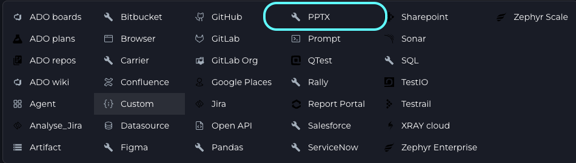
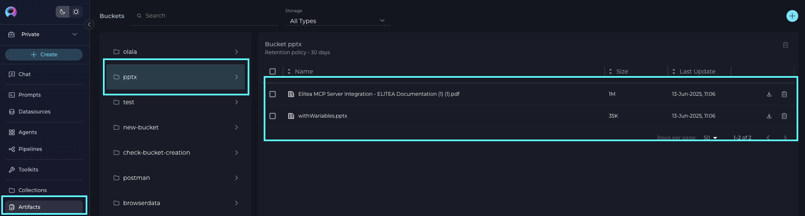
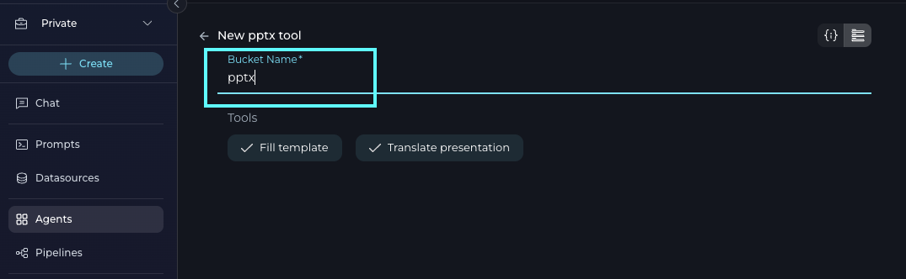
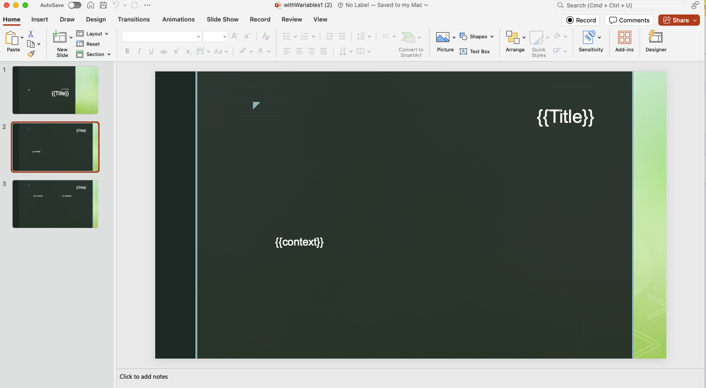

# ELITEA Toolkit Guide: PPTX Integration

## Introduction

### Purpose of this Guide

This guide is your comprehensive resource for integrating and utilizing the **PPTX toolkit** within ELITEA. It provides a step-by-step walkthrough for configuring the toolkit and effectively using it within your Agents. By following this guide, you will unlock the power of automated PowerPoint (PPTX) file translation and dynamic presentation generation, all directly within the ELITEA platform. This integration empowers you to leverage AI-driven automation to streamline your presentation workflows using the combined strengths of ELITEA and the PPTX toolkit.

### Brief Overview of the PPTX Toolkit

The PPTX toolkit enables your ELITEA Agents to interact with PowerPoint files for two main purposes:

*   **Translate PPTX:** Automatically translate the content of a PPTX file into a target language.
*   **Fill PPTX by Template:** Generate a new PPTX file by filling a provided template with dynamic content, based on user instructions and variable placeholders.

Integrating the PPTX toolkit with ELITEA brings these capabilities directly into your AI-powered workflows, allowing your Agents to automate presentation creation and translation tasks.

## PPTX Toolkit Setup and Configuration

### Toolkit Configuration

To use the PPTX toolkit, you need to configure it within an ELITEA Agent. You can either create a new Agent or modify an existing one.

1.  **Navigate to Agents:** In ELITEA, go to the **Agents** menu.
2.  **Create or Edit Agent:**
    *   **New Agent:** Click **"+ Agent"** to create a new Agent. Follow the steps to define Agent details like name, description, type, and instructions.
    *   **Existing Agent:** Select the Agent you want to integrate with the PPTX toolkit and click on its name to edit.
3.  **Access Toolkits Section:** In the Agent configuration, scroll down to the **"Toolkits"** section.
4.  **Add Toolkit:** In the "Toolkits" section, click the **"+" icon**.
5.  **Select PPTX Toolkit:** Choose **"PPTX"** from the list of available toolkits. This opens the configuration panel for the PPTX toolkit.

    

6.  **Specify Artifact/Bucket Name:** Enter the name of the Artifact or bucket where your PPTX files are stored. This bucket must already contain:

    * The PPTX file you want to translate.
    * The PPTX template file you want to use for creating new presentations.

    
    

7.  **Enable Tools:** In the PPTX toolkit configuration, select the checkboxes next to the tools you want to enable for your Agent:
    *   **Translate presentation**
    *   **Fill template**
8.  **Complete Configuration:** Click the **arrow icon** (at the top right of the toolkit configuration) to save the PPTX toolkit setup and return to the main Agent configuration.
9.  Click **Save** to apply configuration and changes.

## Tool Overview

The PPTX toolkit provides the following tools for your ELITEA Agents:

*   **Translate PPTX:** Automatically translates the content of a PPTX file into a specified language.
*   **Fill PPTX by Template:** Generates a new PPTX file by filling a template with dynamic content based on user-provided variables and instructions.

## Instructions and Prompts for Using the Toolkit

To instruct your ELITEA Agent to use the PPTX toolkit, you need to provide clear instructions within the Agent's "Instructions" field. These instructions guide the Agent on *when* and *how* to use the available tools.

### Guidance for Configuring PPTX Templates

To use the "fill template" function effectively, your PPTX template must be set up with variable placeholders. Here’s how to prepare your template:

1. **Variable Placeholders:**
    * On each slide where you want dynamic content, insert variables using double curly braces, e.g., `{{Title}}`, `{{context}}`, `{{date}}`, etc.
    * Each variable should be unique per slide if you want to fill different content on each slide (e.g., `{{Title1}}`, `{{context1}}`, `{{Title2}}`, etc.), or you can reuse the same variable names if the structure is consistent.

    
2. **Instruction Mapping:**
    * In your Agent instructions or user prompt, specify the content for each variable. For example:
        - Slide 1:
            Title: "Welcome to ELITEA"
            context: "Introduction to the platform."
        - Slide 2:
            Title: "Key Features"
            context: "Automation, Collaboration, AI Integration."
3. **Consistency:**
    * Ensure the variable names in your instructions match exactly with those in the PPTX template.
4. **Template Storage:**
    * The template PPTX file (`file_name`) must be stored in the designated bucket accessible by ELITEA.

## Conversation Starters

Use these conversation starters to interact with your PPTX-integrated Agent. These examples also illustrate how to provide clear, action-oriented instructions for the toolkit's capabilities:

*   "Translate the file 'your_file_name.pptx' to Spanish."
    - The Agent will use the 'translate PPTX' tool with parameters:
        - file_name: "your_file_name.pptx"
        - target_language: "Spanish"
    - The translated PPTX file will be saved in the same bucket specified during toolkit configuration and on the file name will add target lang.

*   "Fill the template 'eltea_template.pptx' to create a new presentation with the following content: Slide 1 Title: 'Welcome', context: 'Introduction to ELITEA'. Slide 2 Title: 'Features', context: 'AI-powered automation.'"
    - The Agent will use the 'fill PPTX by template' tool with parameters:
        - file_name: "eltea_template.pptx"
        - output_file_name: "eltea_presentation.pptx"
        - content_description:
            Slide 1:
                Title: "Provide Title here"
                context: "Provide context here"
            Slide 2:
                Title: "Provide Title here"
                context: "Your Context here"
    - The generated PPTX file will be saved in the same bucket specified during toolkit configuration.

These conversation starters provide a starting point for interacting with your PPTX-integrated ELITEA Agent and can be customized further based on your specific use cases and workflows.

**Output Location:** Translated PPTX files and newly generated files from the template will be saved in the same Artifact/bucket specified during toolkit configuration. Ensure you have access to this bucket to retrieve your results.

## Troubleshooting and Support

### Troubleshooting

*   **File Not Found:** Ensure the `file_name` provided exists in the designated bucket and is accessible.
*   **Variable Mismatch:** Double-check that all variables in your content description match those in the PPTX template.
*   **Output Issues:** If the generated PPTX does not look as expected, review the template structure and the mapping of variables.

### Support Contact

For any issues, questions, or further assistance with the PPTX integration or ELITEA Agents, please reach out to our dedicated ELITEA Support Team.

**Contact ELITEA Support:**

*   **Email:** [SupportAlita@epam.com](mailto:SupportAlita@epam.com)

**Best Practices for Effective Support Requests:**

To help us understand and resolve your issue as quickly as possible, please provide the following information in your support email:

*   **ELITEA Environment:** Specify the environment you are using (e.g., "Nexus,").
*   **Project Details:** Indicate the Project Name and workspace type (Private or Team).
*   **Detailed Issue Description:** Clearly describe the problem, what you expected, and what actually occurred.
*   **Relevant Configuration Information:** Include the Agent's instructions, toolkit configuration, and template details.
*   **Error Messages:** Provide the full error text if available.
*   **Your Query/Prompt:** Include the exact query or prompt you used.

**Before Contacting Support:**

We encourage you to first explore the resources available within this guide and the broader ELITEA documentation. You may find answers to common questions or solutions to known issues in the documentation.
