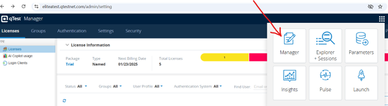
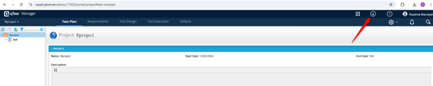
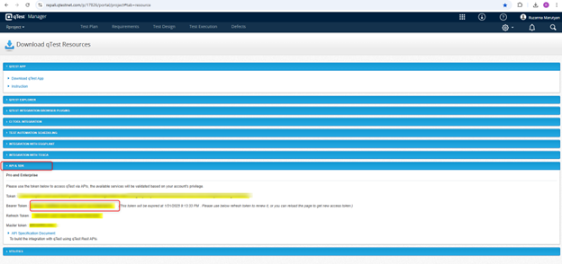
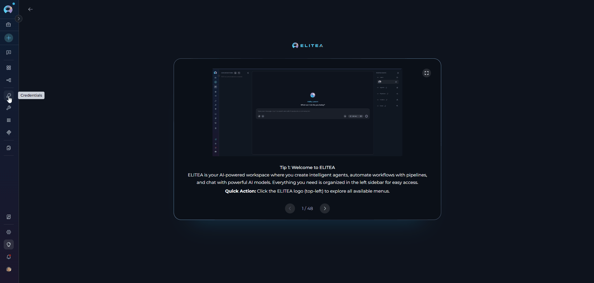
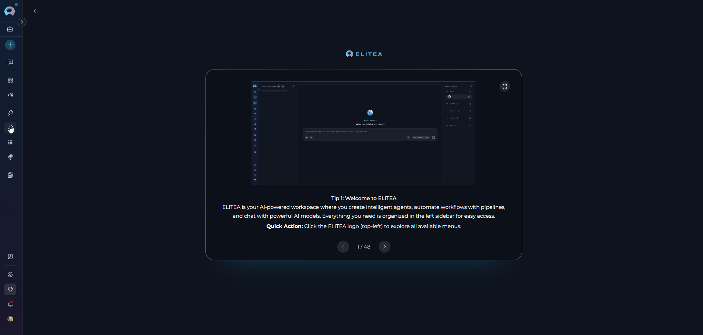
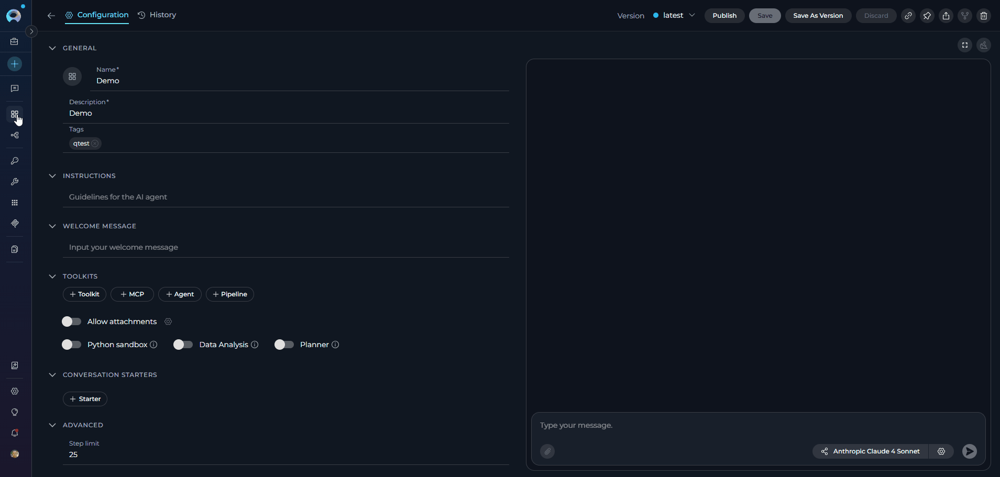
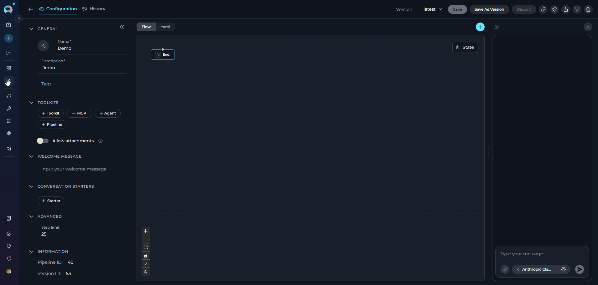
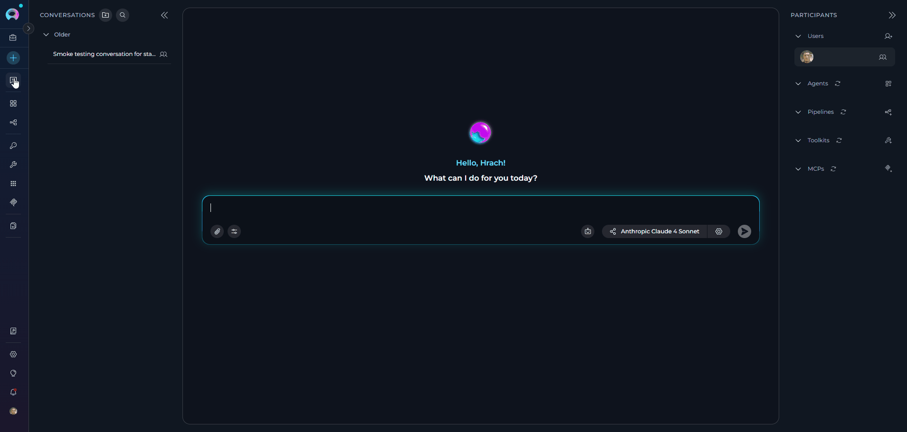
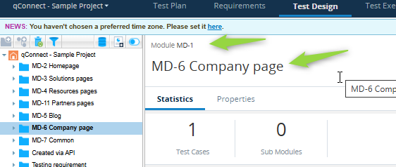

# qTest Toolkit Integration Guide

---

## Introduction

This guide is your definitive resource for integrating and effectively utilizing the **qTest toolkit** within ELITEA. It provides a detailed, step-by-step walkthrough, from setting up your qTest API token to configuring the toolkit in ELITEA and seamlessly incorporating it into your Agents. By following this guide, you will unlock the power of automated test management, streamlined testing workflows, and enhanced test coverage, all directly within the ELITEA platform. This integration empowers you to leverage AI-driven automation to optimize your qTest-driven workflows, enhance test quality, and improve project visibility within your organization.

**Brief Overview of qTest**

qTest, by Tricentis, is a leading cloud-based test management platform that centralizes software testing activities and enables comprehensive quality management. It serves as a central hub for teams to manage test cases, track test execution, and ensure comprehensive test coverage. qTest offers a wide array of functionalities, including:

- **Test Case Management:** Create, organize, and manage test cases in a centralized repository
- **Test Execution Tracking:** Monitor test runs and track execution status in real-time  
- **Requirements Traceability:** Link test cases to requirements and defects for complete audit trails
- **Reporting & Analytics:** Generate comprehensive reports on test coverage and quality metrics
- **Agile Integration:** Support for iterative testing and CI/CD pipeline integration

By integrating qTest with ELITEA, your ELITEA Agents can then intelligently interact with your qTest projects and test assets to automate test management tasks, enhance test tracking, improve team collaboration, and leverage AI to optimize your entire test management lifecycle within qTest.

---

##  Account Setup and Configuration in qTest

**Account Setup**

If you do not yet have a qTest account, please follow these steps to create one:

1.  **Visit Tricentis Website:** Open your web browser and navigate to the official Tricentis qTest website: [https://www.tricentis.com/](https://www.tricentis.com/).
2.  **Sign Up for qTest:** Navigate to **"Trials & demos"** and click on **"Try qTest free"** to start a **free 14-day trial**.
3.  **Create an Account:** Follow the prompts to create your qTest account. Complete the registration form with your business details.
4.  **Create Workspace:** During the signup process, you will be asked to create your qTest web address and account credentials.
5.  **Verify Email:** Check your inbox for a verification email from qTest. Click the verification link in the email to activate your account.
6.  **Access qTest:** Once your email is verified, log in to qTest using your newly created credentials and access your qTest instance.

### Generate an API Token

For secure integration with ELITEA, it is essential to use a qTest **API token** (Bearer Token) for authentication. This method is more secure than using your primary qTest account password directly and allows you to control access permissions.

**Follow these steps to generate an API token in qTest:**

1.  **Log in to qTest:** Access your qTest workspace by navigating to your qTest URL (e.g., `your-subdomain.qtestnet.com`) and logging in with your credentials.
2.  **Navigate to API Settings:** Go to **"Manager"** → **"API & SDK"** from the main navigation menu.
3.  **Copy Your API Token:** Find and copy your Bearer Token from the API settings page. This is your API token that will be used for authentication.
4.  **Securely Store Your API Token:** **Immediately copy the generated API token**. Store it securely in a password manager or, preferably, ELITEA's built-in Secrets feature for enhanced security within ELITEA. You will need this API token to configure the qTest toolkit in ELITEA.







## System Integration with ELITEA

To integrate qTest with ELITEA, you need to follow a three-step process: **Create Credentials → Create Toolkit → Use in Agents**. This workflow ensures secure authentication and proper configuration.

### Step 1: Create qTest Credentials

Before creating a toolkit, you must first create qTest credentials in ELITEA:

1. **Navigate to Credentials Menu:** Open the sidebar and select **[Credentials](../../menus/credentials.md)**.
2. **Create New Credential:** Click the **`+ Create`** button.
3. **Select qTest:** Choose **qTest** as the credential type.
4. **Configure Credential Details:**
     * **Display Name:** Enter a descriptive name (e.g., "qTest - Test Management")
     * **Base URL:** Enter your qTest instance URL (e.g., `https://your-subdomain.qtestnet.com`)
     * **qTest API Token:** Enter your Bearer token from qTest
5. **Test Connection:** Click **Test Connection** to verify that your credentials are valid and ELITEA can successfully connect to qTest
6. **Save Credential:** Click **Save** to create the credential. After saving, your qTest credential will be added to the credentials dashboard and will be ready to use in toolkit configurations. You can view, edit, or delete it from the **Credentials** menu at any time.



!!! tip "Security Recommendation"
    It's highly recommended to use **[Secrets](../../menus/settings/secrets.md)** for API tokens instead of entering them directly. Create a secret first, then reference it in your credential configuration.

---

### Step 2: Create qTest Toolkit

Once your credentials are configured, create the qTest toolkit:

1. **Navigate to Toolkits Menu:** Open the sidebar and select **[Toolkits](../../menus/toolkits.md)**.
2. **Create New Toolkit:** Click the **`+ Create`** button.
3. **Select qTest:** Choose **qTest** from the list of available toolkit types.
4. **Configure Basic Information:**
     * **Toolkit Name:** Enter a descriptive name for your toolkit (required). Example: "qTest - Project Testing"
     * **Description:** Provide an optional description to explain the toolkit's purpose. Example: "Toolkit for managing test cases and test execution in qTest for Project Alpha"
5. **Configure Credentials:** 
     * In the **Configuration** section, select your previously created qTest credential from the **Credentials** dropdown
6. **Configure Advanced Options:**
     * **PgVector Configuration:** Select a PgVector connection for vector database integration
     * **Embedding Model:** Select an embedding model for text processing and semantic search capabilities
7. **Configure qTest Settings:**
     * **qTest Project ID:** Enter the numerical Project ID of your qTest project
     * **No Of Tests Shown In DQL Search:** **[Required Field]** Set the maximum number of test cases to retrieve in DQL queries (recommended: 100-200)
    
    !!! warning "Required Field"
        The "No Of Tests Shown In DQL Search" field is mandatory and must be filled in. This setting controls the maximum number of test cases returned from DQL queries to prevent context overflow and improve performance.

8. **Enable Desired Tools:** In the **"Tools"** section, select the checkboxes next to the specific qTest tools you want to enable. **Enable only the tools your agents will actually use** to follow the principle of least privilege
       * **[Make Tools Available by MCP](../mcp/make-tools-available-by-mcp.md)** - (optional checkbox) Enable this option to make the selected tools accessible through the external MCP clients to use the toolkit's capabilities
9. **Save Toolkit:** Click **Save** to create the toolkit



#### DQL Search Limit Configuration: "No Of Tests Shown In DQL Search"

!!! important "Mandatory Field"
    The "No Of Tests Shown In DQL Search" field is a **mandatory setting** that controls the maximum number of test cases retrieved when using DQL queries. This field **must be filled in** for the toolkit to function properly.

**Purpose and Usage:**

- **Context Management:** Prevents LLM context limits from being exceeded when retrieving large datasets
- **Performance Optimization:** Smaller result sets improve query response times and Agent processing speed
- **Resource Control:** Manages the amount of data transferred and processed during DQL operations
- **Image Handling:** Especially important when "Extract Images" is enabled, as images significantly increase context size

!!! warning "Common Issues"
    - **Field left empty:** Queries may fail or return no results
    - **Value too low:** You may miss important test cases in your search results
    - **Value too high:** Risk of context overflow, especially with images enabled

!!! tip "DQL Search Limit Best Practices"
    - **Start Conservative:** Begin with 100 test cases for text-only queries, 20-50 for image extraction
    - **Monitor Context Usage:** Watch for context warnings in Agent responses
    - **Image Considerations:** 
      - Use much lower limits (20-50) when extracting images
      - Only enable image extraction when visual analysis is essential
      - Consider expensive token usage with multiple images
    - **Query Specificity:** Use precise DQL filters and module names to reduce unnecessary data
    - **Folder References:** Always use complete module names in folder queries (e.g., "MD-3 MD-11 Partners pages")

#### Available Tools:

The qTest toolkit provides the following tools for interacting with qTest projects and test cases, organized by functional categories:

| **Tool Category** | **Tool Name** | **Description** | **Primary Use Case** |
|:-----------------:|---------------|-----------------|----------------------|
| **Search & Discovery** | | | |
| | **Search by DQL** | Search for test cases using qTest Data Query Language (DQL) queries | Find test cases based on complex criteria using DQL |
| | **Search entities by DQL** | Search for various qTest entities using DQL queries | Find requirements, test runs, defects, and other entities |
| | **Get modules** | Retrieve module IDs and names from the qTest project | Discover project module structure for accurate DQL queries |
| | **Find entity by ID** | Retrieve any qTest entity by its unique identifier | Access detailed information for any entity type |
| **Test Case Management** | | | |
| | **Create test cases** | Create new test cases in qTest within a specified project and folder | Automate test case creation from requirements or user stories |
| | **Update test case** | Modify fields of existing test cases | Update test case steps, expected results, and attributes |
| | **Find test case by ID** | Retrieve detailed information about a specific test case | Access comprehensive test case details for analysis |
| | **Delete test case** | Delete a test case from qTest | Clean up obsolete or redundant test cases |
| | **Add file to test case** | Upload file from artifact storage to qTest test case or specific test step | Attach files, screenshots, or documents to test cases or individual test steps |
| | **Get all test cases fields for project** | Retrieve all available custom and standard fields for test cases | Understand available fields for creating or updating test cases |
| **Test Run & Defect Management** | | | |
| | **Find test runs by test case ID** | Retrieve all test run instances for a specific test case | Track execution history and test run results |
| | **Find defects by test run ID** | Retrieve all defects associated with a specific test run | Analyze defects found during test execution |
| **Requirements & Traceability** | | | |
| | **Find requirements by test case ID** | Retrieve all requirements linked to a specific test case | Verify test coverage for requirements |
| | **Find test cases by requirement ID** | Retrieve all test cases linked to a specific requirement | Assess requirement testing completeness |
| | **Link tests to Jira requirement** | Link test cases to Jira requirements | Maintain traceability between qTest tests and Jira requirements |
| | **Link tests to qTest requirement** | Link test cases to qTest requirements | Maintain traceability between tests and qTest requirements |
| **Advanced Search (Vector/Index)** | | | |
| | **Index data** | Index test case data into vector database for semantic search | Enable AI-powered semantic search across test cases |
| | **Search index** | Perform semantic search across indexed test case data | Find relevant test cases using natural language queries |
| | **Stepback search index** | Perform stepback semantic search with query refinement | Enhanced search with automatic query optimization |
| | **Stepback summary index** | Generate summaries from stepback search results | Get concise summaries of search results |
| | **List collections** | List all available vector database collections | Discover indexed data collections |
| | **Remove index** | Delete indexed data from vector database | Clean up or refresh indexed data |

!!! tip "Vector Search Tools"
    The tools **Index data**, **List collections**, **Remove index**, **Search index**, **Stepback search index**, and **Stepback summary index** require PgVector configuration and an embedding model. These enable advanced semantic search capabilities across your Jira projects.

!!! warning "Image Extraction Considerations"
    The **Search by DQL** tool includes an "Extract Images" property:
    
    - Images must be **pasted directly** into test steps (not attachments)
    - Large image datasets significantly increase **token usage** and processing time
    - Monitor for **context overflow** when extracting images from multiple test cases
    - Use specific DQL queries to limit results when working with image-heavy test cases
    - Custom image analysis prompts can be configured to optimize token usage

#### Testing Toolkit Tools

After configuring your qTest toolkit, you can test individual tools directly from the Toolkit detailed page using the **Test Settings** panel. This allows you to verify that your credentials are working correctly and validate tool functionality before adding the toolkit to your workflows.

**General Testing Steps:**

1. **Select LLM Model:** Choose a Large Language Model from the model dropdown in the Test Settings panel
2. **Configure Model Settings:** Adjust model parameters like Creativity, Max Completion Tokens, and other settings as needed
3. **Select a Tool:** Choose the specific qTest tool you want to test from the available tools
4. **Provide Input:** Enter any required parameters or test queries for the selected tool
5. **Run the Test:** Execute the tool and wait for the response
6. **Review the Response:** Analyze the output to verify the tool is working correctly and returning expected results

!!! tip "Key benefits of testing toolkit tools:"
    * Verify that qTest credentials and connection are configured correctly
    * Test tool parameters and see actual responses from your qTest instance
    * Debug tool behavior and understand output formats
    * Optimize tool settings before integrating with agents or pipelines
    > For detailed instructions on how to use the Test Settings panel, see **[How to Test Toolkit Tools](../../how-tos/credentials-toolkits/how-to-test-toolkit-tools.md)**.

---

### Step 3: Add qTest Toolkit to Your Workflows

Now you can add the configured qTest toolkit to your agents, pipelines, or use it directly in chat:

---
#### In Agents:

1. **Navigate to Agents:** Open the sidebar and select **[Agents](../../menus/agents.md)**.
2. **Create or Edit Agent:** Either create a new agent or select an existing agent to edit.
3. **Add qTest Toolkit:** 
     * In the **"TOOLKITS"** section of the agent configuration, click the **"+Toolkit"** icon
     * Select your configured qTest toolkit from the dropdown list
     * The toolkit will be added to your agent with the previously configured tools enabled

Your agent can now interact with qTest using the configured toolkit and enabled tools.



---
#### In Pipelines:

1. **Navigate to Pipelines:** Open the sidebar and select **[Pipelines](../../menus/pipelines.md)**.
2. **Create or Edit Pipeline:** Either create a new pipeline or select an existing pipeline to edit.
3. **Add qTest Toolkit:** 
     * In the **"TOOLKITS"** section of the pipeline configuration, click the **"+Toolkit"** icon
     * Select your configured qTest toolkit from the dropdown list
     * The toolkit will be added to your pipeline with the previously configured tools enabled



---
#### In Chat:

1. **Navigate to Chat:** Open the sidebar and select **[Chat](../../menus/chat.md)**.
2. **Start New Conversation:** Click **+Create** or open an existing conversation.
3. **Add Toolkit to Conversation:**
     * In the chat Participants section, look for the **Toolkits** element
     * Click the **"Add Tools"** Icon to open the tools selection dropdown
     * Select your configured qTest toolkit from the dropdown list
     * The toolkit will be added to your conversation with all previously configured tools enabled
4. **Use Toolkit in Chat:** You can now directly interact with your qTest projects and test cases by asking questions or requesting actions that will trigger the qTest toolkit tools.




!!! example "Example Chat Usage:"
    - "Search for all test cases in module 'Partners pages' with status 'Ready for Testing'."
    - "Create a new test case for the login functionality with steps and expected results."
    - "Find test case with ID TC-12345 and show me its details."
    - "Link test cases TC-100, TC-101, and TC-102 to Jira requirement PROJ-456."

---

## Instructions and Prompts for Using the qTest Toolkit

To effectively instruct your ELITEA Agent to use the qTest toolkit, you need to provide clear and precise instructions within the Agent's "Instructions" field. These instructions are crucial for guiding the Agent on *when* and *how* to utilize the available qTest tools to achieve your desired automation goals.

### Instruction Creation for Agents

When crafting instructions for the qTest toolkit, especially for OpenAI-based Agents, clarity and precision are paramount. Break down complex tasks into a sequence of simple, actionable steps. Explicitly define all parameters required for each tool and guide the Agent on how to obtain or determine the values for these parameters. OpenAI Agents respond best to instructions that are:

*   **Direct and Action-Oriented:** Employ strong action verbs and clear commands to initiate actions. For example, "Use the 'search_by_dql' tool...", "Create a test case with...", "Find test case by ID...".

*   **Parameter-Centric:** Clearly enumerate each parameter required by the tool. For each parameter, specify:
    *   Its name (exactly as expected by the tool)
    *   The format or type of value expected
    *   How the Agent should obtain the value – whether from user input, derived from previous steps in the conversation, retrieved from an external source, or a predefined static value

*   **Contextually Rich:** Provide sufficient context so the Agent understands the overarching objective and the specific scenario in which each qTest tool should be applied within the broader workflow. Explain the desired outcome or goal for each tool invocation.

*   **Step-by-Step Structure:** Organize instructions into a numbered or bulleted list of steps for complex workflows. This helps the Agent follow a logical sequence of actions.

*   **Add Conversation Starters:** Include example conversation starters that users can use to trigger this functionality.

When instructing your Agent to use a qTest toolkit tool, adhere to this structured pattern:

1. **State the Goal:** Begin by clearly stating the objective you want to achieve with this step.
2. **Specify the Tool:** Clearly indicate the specific qTest tool to be used for this step.
3. **Define Parameters:** Provide a detailed list of all parameters required by the selected tool.
4. **Describe Expected Outcome:** Briefly describe the expected result or outcome after the tool is successfully executed.
5. **Add Conversation Starters:** Include example conversation starters that users can use to trigger this functionality.

!!! example "Example Agent Instructions"
    **Agent Instructions for Searching Test Cases using DQL:**

    ```markdown
    1. Goal: Search for qTest test cases using DQL to find specific test cases based on user criteria.
    2. Tool: Use the "search_by_dql" tool.
    3. Parameters:
        - DQL Query: "Ask the user for search criteria or use predefined DQL like 'Module = \"MD-1 MD-6 Company page\" AND Status = \"Ready for Testing\"'"
    4. Outcome: The Agent will provide a list of test cases matching the DQL criteria.
    5. Conversation Starters: 'Show me test cases ready for testing', 'Find all test cases in Partners module', 'Search for automated test cases'
    ```

    **Agent Instructions for Creating a New Test Case:**

    ```markdown
    1. Goal: Create a new test case in qTest based on user requirements.
    2. Tool: Use the "create_test_cases" tool.
    3. Parameters:
        - Project ID: "Use the configured Project ID from toolkit settings"
        - Folder Path: "Ask user for target folder or use 'MD-3 MD-11 Partners pages' format"
        - Test Case Data: "Collect test case name, description, steps, and expected results from user and format as JSON"
    4. Outcome: The Agent will create a new test case and provide the test case ID and details.
    5. Conversation Starters: 'Create a new test case', 'Add a test for login functionality', 'Generate test case for feature X'
    ```

---

### Chat Usage Examples by Tool Category

The following examples demonstrate how to interact with the qTest toolkit in ELITEA Chat, organized by functional categories. Each example shows the user request and the expected agent behavior.

??? example "Search & Discovery - Search by DQL"

    **Chat Example:**
    ```
    User: "Find all test cases in the 'Partners pages' module that are ready for testing."

    Agent Response: [Agent uses search_by_dql tool]

    🔍 **DQL Search Results**:

    **📋 Found 5 test cases ready for testing**:

    1. **TC-101** - "Verify partner login functionality"
       - **Status**: Ready for Testing
       - **Module**: MD-3 MD-11 Partners pages
       - **Priority**: High
       - **URL**: https://yourcompany.qtestnet.com/p/12345/portal/project#id=12345&object=0&tab=testcase&id=101

    2. **TC-102** - "Test partner profile update"
       - **Status**: Ready for Testing
       - **Module**: MD-3 MD-11 Partners pages
       - **Priority**: Medium
       - **URL**: https://yourcompany.qtestnet.com/p/12345/portal/project#id=12345&object=0&tab=testcase&id=102

    Would you like me to get more details about any specific test case?
    ```

??? example "Test Case Management - Create Test Cases"

    **Chat Example:**
    ```
    User: "Create a new test case for verifying the password reset functionality."

    Agent Response: [Agent uses create_test_cases tool]

    ✅ **Test Case Created Successfully!**

    **📝 New Test Case Details**:
    - **Test Case ID**: TC-456
    - **Name**: "Verify password reset functionality"
    - **Module**: MD-1 MD-6 Company page
    - **Status**: Draft
    - **URL**: https://yourcompany.qtestnet.com/p/12345/portal/project#id=12345&object=0&tab=testcase&id=456

    **Test Steps**:
    1. Navigate to login page
    2. Click "Forgot Password" link
    3. Enter valid email address
    4. Click "Reset Password" button
    5. Check email for reset link
    6. Click reset link and enter new password
    7. Submit new password

    **Expected Result**: User successfully resets password and can log in with new credentials.

    The test case is now ready for review and execution!
    ```

??? example "Requirements & Traceability - Link Tests to Jira Requirement"

    **Chat Example:**
    ```
    User: "Link test cases TC-101 and TC-102 to Jira requirement PROJ-789."

    Agent Response: [Agent uses link_tests_to_jira_requirement tool]

    🔗 **Test Cases Linked Successfully!**

    **Traceability Created**:
    - **qTest Test Cases**: TC-101, TC-102
    - **Jira Requirement**: PROJ-789
    - **Link Type**: Tests requirement

    **Linked Test Cases**:
    1. **TC-101** - "Verify partner login functionality"
    2. **TC-102** - "Test partner profile update"

    Both test cases are now linked to the Jira requirement, ensuring full traceability between requirements and test coverage.
    ```

??? example "Test Run & Defect Management - Find Defects by Test Run ID"

    **Chat Example:**
    ```
    User: "Show me all defects found during test run TR-550."

    Agent Response: [Agent uses find_defects_by_test_run_id tool]

    🐛 **Defects Found in Test Run TR-550**:

    **📋 Found 3 defects**:

    1. **DEF-201** - "Login button misaligned on mobile"
       - **Severity**: Medium
       - **Status**: Open
       - **Detected**: 2026-01-20
       - **URL**: https://yourcompany.qtestnet.com/p/12345/portal/project#id=12345&object=3&id=201

    2. **DEF-202** - "Password validation error message unclear"
       - **Severity**: Low
       - **Status**: In Progress
       - **Detected**: 2026-01-20
       - **URL**: https://yourcompany.qtestnet.com/p/12345/portal/project#id=12345&object=3&id=202

    3. **DEF-203** - "Session timeout causes data loss"
       - **Severity**: Critical
       - **Status**: Open
       - **Detected**: 2026-01-21
       - **URL**: https://yourcompany.qtestnet.com/p/12345/portal/project#id=12345&object=3&id=203

    Would you like more details about any specific defect?
    ```

??? example "Advanced Search - Search Index"

    **Chat Example:**
    ```
    User: "Find all test cases related to authentication using semantic search."

    Agent Response: [Agent uses search_index tool]

    🔎 **Semantic Search Results**:

    **📋 Found 8 test cases related to authentication**:

    1. **TC-301** - "Verify user login with valid credentials" (Relevance: 95%)
    2. **TC-302** - "Test SSO authentication flow" (Relevance: 92%)
    3. **TC-303** - "Validate two-factor authentication" (Relevance: 90%)
    4. **TC-304** - "Check password complexity requirements" (Relevance: 87%)
    5. **TC-305** - "Test account lockout after failed attempts" (Relevance: 85%)

    These results are ranked by semantic similarity to your search query. Would you like to see the full details of any test case?
    ```

---

## Best Practices and Use Cases for qTest Integration

**Best Practices for Efficient Integration**

??? tip "Test Integration Thoroughly"
    After setup, test each enabled tool to ensure proper connectivity and authentication. Verify that:
    
    - Credentials are correctly configured
    - API token is valid and not expired
    - All enabled tools function as expected
    - Responses match your qTest instance data

??? tip "Security Best Practices"
    Follow these security guidelines for qTest integration:
    
    - **Use API Tokens:** Always use API tokens instead of passwords for integration
    - **Secure Storage:** Store credentials securely using ELITEA's Credentials feature and Secrets Management
    - **Least Privilege:** Enable only the tools your Agent actually needs
    - **Regular Audits:** Periodically review and rotate API tokens
    - **Access Control:** Ensure proper permissions are set in qTest for the integration account

??? tip "Optimize Performance"
    Maximize toolkit performance with these optimization strategies:
    
    - **DQL Search Limits:** Set appropriate "No Of Tests Shown In DQL Search" limits (100-200 for most cases, 20-50 with images)
    - **Image Extraction:** Disable "Extract Images" when visual analysis isn't needed to reduce token usage
    - **Query Specificity:** Use specific DQL queries instead of broad searches to minimize data transfer
    - **Incremental Complexity:** Start with simple use cases and gradually increase complexity
    - **Monitor Usage:** Track token usage and adjust settings based on actual needs

??? tip "Provide Clear Agent Instructions"
    Ensure effective Agent behavior with well-crafted instructions:
    
    - Use the prompt examples in this guide as templates
    - Adapt instructions to your specific workflows
    - Include conversation starters for user guidance
    - Define clear parameters and expected outcomes
    - Test instructions thoroughly before production deployment

---

**Use Cases for qTest Toolkit Integration**

The qTest toolkit opens up a wide range of automation possibilities for test management, QA workflows, and reporting within ELITEA. Here are some compelling use cases:

??? tip "Automated Test Case Retrieval for Test Execution Guidance"
    **Scenario:** Testers can use ELITEA Agents to quickly retrieve detailed steps and expected results for specific test cases from qTest, providing them with immediate access to test execution guidance directly within ELITEA.
    
    **Tools Used:** `find_test_case_by_id`, `read_file` (if test data is in external files)
    
    **Example Instruction:** 
    ```
    Use the 'find_test_case_by_id' tool to retrieve the test case with ID 'TC-12345'. 
    Display the 'Name', 'Description', 'Steps', and 'Expected Result' fields to the tester.
    ```
    
    **Benefit:** Improves tester efficiency by providing instant access to test case details, eliminating the need to switch between ELITEA and qTest interfaces, streamlining test execution and reducing context switching.

??? tip "Dynamic Test Case Creation from Requirements or User Stories"
    **Scenario:** When new requirements or user stories are created in ELITEA or linked systems, automatically generate corresponding test case stubs in qTest, pre-populated with basic information extracted from the requirements, streamlining test planning and ensuring test coverage from the outset.
    
    **Tools Used:** `create_test_cases`
    
    **Example Instruction:** 
    ```
    Use the 'create_test_cases' tool to create new test cases in qTest Project 'Project Alpha' 
    and folder 'MD-3 MD-11 New Features' based on the following data extracted from the new user story: 
    [{
      "Name": "Test User Story [User Story ID] - Scenario 1", 
      "Description": "Test scenario 1 for user story [User Story ID]"
    }]
    ```
    
    **Benefit:** Automates test case creation, streamlining test planning and ensuring comprehensive test coverage from the initial stages of development. Reduces manual effort in test case authoring and improves alignment between requirements and test cases.

??? tip "Automated Test Case Updates Based on Test Feedback or Requirements Changes"
    **Scenario:** When test execution reveals issues or requirements change, ELITEA Agents can automatically update existing test cases in qTest with new steps, expected results, or status changes, ensuring test cases remain current and accurate.
    
    **Tools Used:** `update_test_case`, `read_document` (if updates are based on external documents)
    
    **Example Instruction:** 
    ```
    Use the 'update_test_case' tool to update test case with ID 'TC-56789'. 
    Update the 'Steps' field with the following new steps: 
    '1. Open application
    2. Navigate to updated UI element
    3. Verify new functionality' 
    and set the 'Status' field to 'Draft' for review.
    ```
    
    **Benefit:** Automates test case maintenance, ensuring test cases are always up-to-date with the latest requirements and test feedback. Reduces manual effort in test case updates and improves test case accuracy and relevance over time.

??? tip "Reporting on Test Case Coverage and Status using DQL Queries"
    **Scenario:** QA managers can use ELITEA Agents to generate custom reports on test case coverage, execution status, or other test metrics by leveraging the "Search by DQL" tool to query qTest and extract specific test case data based on DQL queries.
    
    **Tools Used:** `search_by_dql`
    
    **Example Instruction:** 
    ```
    Use the 'search_by_dql' tool to search for test cases in qTest using the DQL query: 
    'Project = 'Project Alpha' AND Status IN ('Passed', 'Failed')'. 
    Generate a report summarizing the number of passed and failed test cases and calculate the test pass rate.
    ```
    
    **Benefit:** Enables automated and customized test reporting and analysis, providing QA managers and stakeholders with real-time visibility into test coverage, test execution progress, and quality metrics directly within ELITEA, improving test management and reporting efficiency.

??? tip "Module-Specific Test Case Retrieval with Image Analysis"
    **Scenario:** QA teams need to analyze test cases from specific modules, including any images embedded in test steps, to understand visual requirements and expected UI behaviors.
    
    **Tools Used:** `get_modules`, `search_by_dql` (with Extract Images enabled)
    
    **Example Workflow:** 
    
    1. "Use the 'get_modules' tool to retrieve all available modules and their full names."
    2. "Use the 'search_by_dql' tool with Extract Images enabled to search for test cases using: 'Module = 'MD-1 MD-6 Company page' AND Status = 'Ready for Testing''. Analyze any embedded images to provide insights on UI testing requirements."
    
    **Benefit:** Provides comprehensive test case analysis including visual elements, enabling better understanding of UI requirements and more effective test execution guidance. Helps teams identify visual regression testing needs and understand expected UI behaviors.

---

## Troubleshooting

??? warning "Connection Errors"
    **Problem:** ELITEA Agent fails to connect to qTest, resulting in errors during toolkit execution.
    
    **Troubleshooting Steps:**
    
    1. **Verify Credentials:** Ensure your qTest credentials are correctly configured and the API token is valid
    2. **Check Base URL:** Verify the qTest Base URL in your credentials matches your instance (e.g., `https://yourcompany.qtestnet.com`)
    3. **Verify Project ID:** Double-check that you have entered the correct **Project ID** for your qTest project
    4. **Network Connectivity:** Confirm network connectivity between ELITEA and your qTest instance

??? warning "Authorization Errors (Permission Denied/Unauthorized)"
    **Problem:** Agent execution fails with "Permission Denied" or "Unauthorized" errors.
    
    **Troubleshooting Steps:**
    
    1. **API Token Validity:** Generate a new API token in qTest and update your credentials
    2. **Check Permissions:** Verify the qTest account has proper permissions for the target project
    3. **Credential Selection:** Ensure you've selected the correct credential in the toolkit configuration

??? warning "Context and DQL Search Limit Issues"
    **Problem:** Queries return incomplete data, no results, or cause context overflow errors.
    
    **Troubleshooting Steps:**
    
    **Missing or Invalid DQL Search Limit:**
    
    - **Issue:** "No Of Tests Shown In DQL Search" field is empty or set to 0
    - **Solution:** Set a valid number (recommended: 100-200 for most use cases)
    
    **Context Overflow with Images:**
    
    - **Issue:** Large responses when "Extract Images" is enabled overwhelm the AI context
    - **Root Cause:** Images significantly increase token usage and context size
    - **Solutions:** 
      - Reduce DQL search limit to 20-50 when images are enabled (much lower than text-only queries)
      - Disable "Extract Images" checkbox if visual analysis isn't required
      - Use highly specific DQL queries to target only necessary test cases
      - Focus on single modules or specific test case criteria
      - Monitor token usage and adjust limits accordingly
    - **Image-Specific Considerations:**
      - Only pasted images in test steps are retrieved (not attachments)
      - Multiple images per test case multiply the context impact
      - Custom image description prompts can help optimize token usage
    
    **Performance Issues with Large Datasets:**
    
    - **Issue:** Slow response times or timeouts with high search limits
    - **Solution:**
      - Start with lower limits (50-100) and increase gradually
      - Use targeted DQL queries instead of broad searches
      - Consider pagination for large result sets

??? warning "DQL Query Syntax and Module Issues"
    **Problem:** DQL queries fail or return unexpected results.
    
    **Troubleshooting Steps:**
    
    1. **Use Full Module Names:** Always use complete module paths (e.g., `'MD-1 MD-6 Company page'` not just `'Company page'`)
    2. **Get Modules First:** Use the "Get Modules" tool to retrieve exact module names for your queries
    3. **Verify DQL Syntax:** Ensure proper DQL syntax following qTest documentation standards
    
    

??? warning "No Data Retrieved from Queries"
    **Problem:** DQL searches return empty results despite matching test cases existing.
    
    **Troubleshooting Steps:**
    
    1. **Check Search Limit:** Verify "No Of Tests Shown In DQL Search" is set to appropriate value (>0)
    2. **Test Simple Query:** Start with basic queries like `Project = 'YourProject'` 
    3. **Verify Project ID:** Ensure the Project ID in toolkit matches the target project
    4. **Check Permissions:** Confirm the API token has read access to the target test cases

??? warning "Toolkit Configuration Issues"
    **Problem:** Toolkit fails to save or function after configuration.
    
    **Troubleshooting Steps:**
    
    1. **Complete Required Fields:** Ensure all mandatory fields are filled:
       - qTest API Token (credential selection)
       - Project ID (numerical value)
       - No Of Tests Shown In DQL Search (positive number)
    2. **Credential Validation:** Test the credential independently before using in toolkit
    3. **Tool Selection:** Enable at least one tool for the toolkit to be functional

### Support Contact

If you encounter issues not covered in this guide or need additional assistance with qTest integration, please refer to **[Contact Support](../../support/contact-support.md)** for detailed information on how to reach the ELITEA Support Team.

---

## FAQ

??? question "How do I create a qTest toolkit in ELITEA?"
    Toolkit creation requires a **two-step process**: 
    
    1. First create qTest credentials in the Credentials menu with your API token and Base URL
    2. Then create the toolkit by selecting those credentials and configuring the Project ID and DQL search limit

??? question "What is the 'No Of Tests Shown In DQL Search' field and why is it required?"
    This is a **mandatory field** that controls the maximum number of test cases retrieved in DQL queries. It's essential for preventing context overflow and ensuring optimal performance. Set it to 100-200 for most use cases, or lower (20-50) when extracting images.

??? question "Can I use my regular qTest username and password for the ELITEA integration?"
    No, you **must use a qTest API token** (Bearer Token) for secure integration. API tokens provide secure, controlled access specifically designed for external applications like ELITEA. Password authentication is not supported for qTest integration.

??? question "Where do I find the Project ID for my qTest project?"
    The Project ID is a numerical identifier found in your qTest project settings, project URL, or in the browser address bar when inside your qTest project. You can typically find it in the URL as a number (e.g., `https://yourcompany.qtestnet.com/p/12345`).

??? question "Why am I getting 'Permission Denied' errors?"
    Check these items:
    
    - **API Token Validity:** Ensure the token hasn't been revoked in qTest
    - **qTest Account Permissions:** Verify your account has proper permissions for the target project
    - **Correct Project ID:** Ensure the Project ID in toolkit configuration matches your target project
    - **Proper Credential Selection:** Confirm you've selected the correct credential in the toolkit

??? question "My DQL queries return no results, but I know test cases exist. What's wrong?"
    Most commonly this is due to the "No Of Tests Shown In DQL Search" field being empty, set to 0, or set too low. Ensure it's set to an appropriate value (e.g., 100-200 for text-only queries, 20-50 when extracting images).

??? question "Can I use the same qTest credential across multiple toolkits and agents?"
    Yes! This is one of the key benefits of the new workflow. Once you create a qTest credential, you can reuse it across multiple qTest toolkits, and each toolkit can be used by multiple agents, pipelines, and chat sessions. This promotes better credential management and reduces duplication.

??? question "What are some best practices for using the qTest toolkit effectively?"
    **Test Integration Thoroughly:**
    
    - After setting up the qTest toolkit, thoroughly test each tool you intend to use to ensure seamless connectivity, correct authentication, and accurate execution
    
    **Monitor Agent Performance:**
    
    - Regularly monitor the performance of Agents utilizing qTest toolkits to identify any potential issues or areas for optimization
    
    **Follow Security Best Practices:**
    
    - Use API Tokens for integrations
    - Grant only the minimum necessary permissions (principle of least privilege)
    - Securely Store Credentials using ELITEA's Secrets Management feature
    
    **Provide Clear Instructions:**
    
    - Craft clear and unambiguous instructions within your ELITEA Agents to guide them in using the qTest toolkit effectively
    
    **Start Simple:**
    
    - Begin with simpler automation tasks and gradually progress to more complex workflows as you gain experience

??? question "What are common use cases for qTest toolkit integration?"
    **Automated Test Case Retrieval:**
    
    - Quickly retrieve detailed test case steps and expected results for test execution guidance
    
    **Dynamic Test Case Creation:**
    
    - Automatically generate test cases from requirements or user stories to ensure comprehensive test coverage
    
    **Automated Test Case Updates:**
    
    - Automatically update test cases based on changing requirements, test feedback, or workflow progress
    
    **Reporting and Analytics:**
    
    - Generate custom reports on test case coverage, execution status, and quality metrics using DQL queries
    
    **Requirements Traceability:**
    
    - Link test cases to Jira requirements for complete traceability between testing and requirements
    
    **Visual Analysis:**
    
    - Analyze test cases with embedded images to understand visual requirements and expected UI behaviors

---

!!! reference "Documentation and Guides"
    - **[How to Use Chat Functionality](../../how-tos/chat-conversations/how-to-use-chat-functionality.md)** - *Complete guide to using ELITEA Chat with toolkits for interactive qTest operations.*
    - **[Create and Edit Agents from Canvas](../../how-tos/chat-conversations/how-to-create-and-edit-agents-from-canvas.md)** - *Learn how to quickly create and edit agents directly from chat canvas for rapid prototyping and workflow automation.*
    - **[Create and Edit Toolkits from Canvas](../../how-tos/chat-conversations/how-to-create-and-edit-toolkits-from-canvas.md)** - *Discover how to create and configure qTest toolkits directly from chat interface for streamlined workflow setup.*
    - **[Create and Edit Pipelines from Canvas](../../how-tos/chat-conversations/how-to-create-and-edit-pipelines-from-canvas.md)** - *Guide to building and modifying pipelines from chat canvas for automated qTest workflows.*
    - **[How to Test Toolkit Tools](../../how-tos/credentials-toolkits/how-to-test-toolkit-tools.md)** - *Detailed instructions on testing toolkit tools before deploying to production workflows.*
    - **[Secrets Management](../../menus/settings/secrets.md)** - *Best practices for securely storing API tokens and sensitive credentials.*
    - **[Credentials Documentation](../../menus/credentials.md)** - *Comprehensive guide to creating and managing credentials in ELITEA.*
    - **[Toolkits Documentation](../../menus/toolkits.md)** - *Complete reference for toolkit configuration and management.*

!!! reference "External qTest Resources"
    - **[Tricentis qTest Website](https://www.tricentis.com/software/test-management/qtest/)** - *Main product website for qTest information and documentation.*
    - **[qTest Documentation](https://support.tricentis.com/community/manuals_qtest.do)** - *Official qTest documentation for features, functionalities, and API.*
    - **[qTest API Documentation](https://api.qasymphony.com/)** - *Official API documentation for developers.*
    - **[Tricentis Support](https://support.tricentis.com/)** - *Community support, articles, FAQs, and troubleshooting guides.*

---
