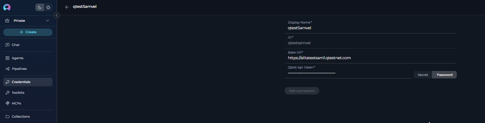
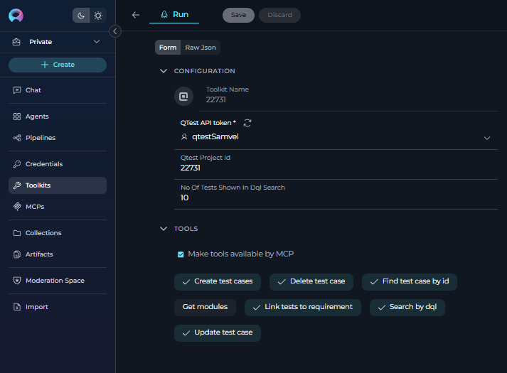
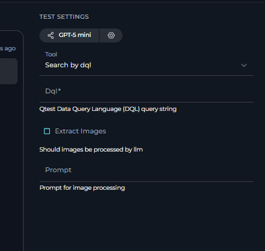
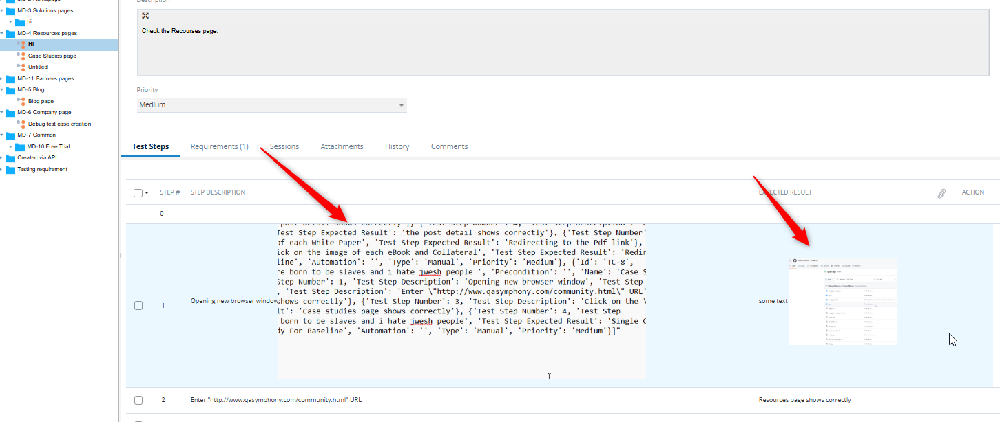
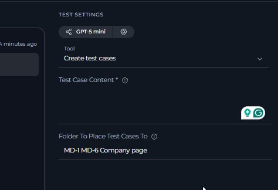
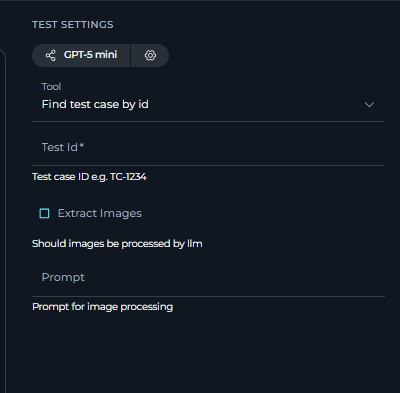

# ELITEA Toolkit Guide: qTest Integration

## Introduction

The qTest toolkit enables seamless integration between ELITEA and Tricentis qTest, allowing your AI Agents to automate test management workflows. This guide covers setup, configuration, and effective usage of the qTest integration.

### About qTest

qTest is a cloud-based test management platform that centralizes software testing activities. Key capabilities include:

- **Test Case Management:** Create, organize, and manage test cases in a centralized repository
- **Test Execution Tracking:** Monitor test runs and track execution status in real-time  
- **Requirements Traceability:** Link test cases to requirements and defects for complete audit trails
- **Reporting & Analytics:** Generate comprehensive reports on test coverage and quality metrics
- **Agile Integration:** Support for iterative testing and CI/CD pipeline integration

By integrating qTest with ELITEA, your Agents can intelligently interact with test assets to automate test management tasks and optimize testing workflows.

## qTest Setup Requirements

### Account Setup

qTest is a commercial test management tool available as a trial version. To create a qTest account:

1. Visit the [Tricentis qTest website](https://www.tricentis.com/)
2. Navigate to **"Trials & demos"** and start a **free 14-day trial**  
3. Complete the registration form with your business details
4. Create your qTest web address and account credentials
5. Verify your email and access your qTest instance

### API Token Generation

To integrate ELITEA with qTest, you need an API token:

1. **Log in to qTest** using your credentials
2. **Navigate to API Settings:** Go to **"Manager"** → **"API & SDK"**  
3. **Copy Your API Token:** Find and copy your Bearer Token from the API settings page
4. **Store Securely:** Save this token for use in ELITEA credentials configuration


## System Integration with ELITEA

### Agent Creation/Configuration

To integrate qTest functionalities into your workflows, you will need to configure the qTest toolkit within an ELITEA Agent. You can either create a new Agent specifically for qTest interactions or modify an existing Agent to incorporate qTest tools.

1.  **Navigate to Agents Menu:** In ELITEA, go to the **Agents** menu from the main navigation panel.
2.  **Create or Edit Agent:**
    *   **Create a New Agent:** Click on the **"+ Agent"** button to create a new Agent. Follow the on-screen prompts to define essential Agent attributes such as Agent name, a descriptive Agent description, the desired Agent type, and initial instructions for the Agent.
    *   **Edit an Existing Agent:** Select the Agent you intend to integrate with qTest from your list of Agents. Click on the Agent's name to open its configuration settings for editing.
3.  **Access Tools Section:** Within the Agent configuration interface, scroll down until you locate the **"Tools"** section. This section is where you will add and configure toolkits, including the qTest toolkit.

### Toolkit Configuration

Creating a qTest toolkit in ELITEA requires a **two-step process**:

1. **Create Credentials** (see [Credentials documentation](../../menus/credentials.md) for detailed steps)
2. **Create Toolkit** using the credentials

#### Step 1: Create qTest Credentials

Before creating the toolkit, you must first create credentials for your qTest integration:

1. Navigate to **Credentials** menu in ELITEA
2. Click **"+ Credential"** to create a new credential
3. Configure the following fields:
   - **Display Name:** Enter a descriptive name (e.g., "qTest API Token")
   - **ID:** Provide a unique identifier (e.g., "qtest_api_token") 
   - **Base URL:** Enter your qTest instance URL: `https://your-subdomain.qtestnet.com`
   - **qTest API Token:** Select this option and enter your Bearer token from qTest



#### Step 2: Create qTest Toolkit

After creating credentials, configure the qTest toolkit within your ELITEA Agent:

1. **Add Toolkit:** In the "Tools" section of the Agent configuration, click the **"+" icon**
2. **Select qTest Toolkit:** Choose **"qTest"** from the dropdown list
3. **Configure Toolkit Settings:**
   - **qTest API Token:** Select the credential you created in Step 1 from the dropdown
   - **qTest Project ID:** Enter the numerical Project ID of your qTest project
   - **No Of Tests Shown In DQL Search:** **[Required Field]** Set the maximum number of test cases to retrieve in DQL queries (recommended: 100-200)

!!! warning "Required Field"
    The "No Of Tests Shown In DQL Search" field is mandatory and must be filled in. This setting controls the maximum number of test cases returned from DQL queries to prevent context overflow and improve performance.



4.  **Enable Desired Tools:** In the "Tools" section within the qTest toolkit configuration panel, **select the checkboxes next to the specific qTest tools** that you want to enable for your Agent. **It is crucial to enable only the tools that your Agent will actually need to use** to adhere to the principle of least privilege and minimize potential security risks. Available tools include:
    *   **Search by DQL** - Allows searching for test cases using qTest DQL queries. Includes an "Extract Images" property that can be enabled to retrieve embedded images from test case steps and expected results.
    *   **Create test cases** - Enables the Agent to create new test cases in qTest.
    *   **Update test case** - Allows the Agent to update existing test cases in qTest.
    *   **Find test case by ID** - Enables the Agent to retrieve a specific test case by its ID.
    *   **Delete test case** - Allows the Agent to delete test cases from qTest.
    *   **Link tests to requirement** - Allows the Agent to Link tests to requirement in qTest.
    *   **Get modules** - Retrieves module IDs and names from the qTest project.

#### DQL Search Limit Configuration: "No Of Tests Shown In DQL Search"

!!! important "Mandatory Field"
    The "No Of Tests Shown In DQL Search" field is a **mandatory setting** that controls the maximum number of test cases retrieved when using DQL queries. This field **must be filled in** for the toolkit to function properly.

**Purpose and Usage:**

- **Context Management:** Prevents LLM context limits from being exceeded when retrieving large datasets
- **Performance Optimization:** Smaller result sets improve query response times and Agent processing speed
- **Resource Control:** Manages the amount of data transferred and processed during DQL operations
- **Image Handling:** Especially important when "Extract Images" is enabled, as images significantly increase context size


!!! warning "Common Issues"
    - **Field left empty:** Queries may fail or return no results
    - **Value too low:** You may miss important test cases in your search results
    - **Value too high:** Risk of context overflow, especially with images enabled
    
5.  **Complete Setup:** After configuring all the necessary settings and enabling the desired tools, click the **arrow icon** (located at the top right of the toolkit configuration section) to finalize the qTest toolkit setup and return to the main Agent configuration menu.
6.  Click **Save** in the Agent configuration to save all changes and activate the qTest toolkit integration for your Agent.

### Tool Overview: qTest Toolkit Functionalities

Once the qTest toolkit is successfully configured and added to your Agent, you can leverage the following tools within your Agent's instructions to enable intelligent interaction with your qTest projects and test assets:

*   **Search by DQL:**  **Tool Name:** `search_by_dql`
    *   **Functionality:** Allows Agents to search for test cases in qTest using Data Query Language (DQL) queries. Returns a list of test cases matching the DQL query with comprehensive test case data.
    *   **Folder Specification:** When searching by folder/module, the folder must be mentioned with the complete module name (e.g., "MD-3 MD-11 Partners pages")
    *   **Image Extraction:** 
        - **Available Images:** Only images that are directly pasted into test steps are retrievable (not step attachments, not test case attachments )
        - **Enable Extraction:** Check the "Extract Images" checkbox in the tool configuration to retrieve images
        - **Image Processing:** Retrieved images are automatically described by LLM and attached to the test step context
        - **Custom Prompts:** You can modify the default image description prompt by providing your own prompt in the corresponding section
    *   **Performance Considerations:**
        - **Token Usage:** Large amounts of images can cause expensive token usage
        - **Context Limits:** DQL queries returning many test cases with images may cause context fitting issues
        - **Optimization:** Decrease test case list using more specific DQL queries or reduce the "No Of Tests Shown In DQL Search" field value
    *   **Purpose:** Enables advanced and flexible test case searching based on complex criteria defined using DQL, allowing Agents to retrieve specific sets of test cases for reporting, analysis, test planning, or workflow automation. When image extraction is enabled, provides comprehensive visual analysis capabilities.

!!! warning "Image Extraction Considerations"
    - Images must be **pasted directly** into test steps, not attached as step attachments
    - Large image datasets can significantly increase **token usage** and processing time
    - Monitor for **context overflow** when extracting images from multiple test cases
    - Use specific DQL queries to limit results when working with image-heavy test cases

 

 

 

 

*   **Create test cases:**  **Tool Name:** `create_test_cases`
    *   **Functionality:** Automates the creation of new test cases in qTest within a specified project and test suite. Allows for bulk creation of test cases using a list of test case details. Includes:
        - **Test Case Content:** Define test case name, description, steps, and expected results
        - **Folder Path:** Specify the target folder using the full folder name format
    *   **Folder Name Format:** When specifying the folder path, use the complete folder name containing both module and folder name separated by space (e.g., "MD-3 MD-11 Partners pages")
    *   **Purpose:** Streamlines test case authoring by enabling Agents to automatically generate new test cases in qTest directly from ELITEA workflows, based on requirements, user stories, or automated test generation processes, improving test coverage and reducing manual test case creation effort.

!!! warning "Folder Path Validation"
    If the test case folder path is specified incorrectly or the folder doesn't exist, test cases will be created in the default folder called **"Created via API"**. Always verify the exact folder name format using the "Get Modules" tool before creating test cases.

    

    

*   **Update test case:**  **Tool Name:** `update_test_case`
    *   **Functionality:** Allows Agents to modify and update fields of existing test cases in qTest. Requires the Test Case ID and a JSON object containing the fields to update and their new values.
    *   **Purpose:** Enables automated test case maintenance, allowing Agents to update test case steps, expected results, statuses, custom fields, or any other test case attributes based on changing requirements, test feedback, or workflow progress, ensuring test cases are always up-to-date and accurately reflect current testing needs.

*   **Find test case by ID:**  **Tool Name:** `find_test_case_by_id`
    *   **Functionality:** Retrieves detailed information about a specific test case from qTest using its unique Test Case ID. Returns comprehensive test case details, including steps, parameters, and custom fields.
    *   **Purpose:** Provides Agents with a quick and precise way to access detailed information for specific test cases, enabling efficient retrieval of test case details for test execution guidance, reporting, analysis, or incorporating test case information into ELITEA workflows.
      **Image Analysis Configuration:** When the "Extract Images" property is enabled for the "Search by DQL" tool, you can also configure a custom image analysis prompt. If not specified, a default prompt will be used to describe the extracted images. You can provide your own image analysis prompt either in the toolkit configuration or when interacting with the Agent to customize how images are analyzed and described.

      

*   **Delete test case:**  **Tool Name:** `delete_test_case`
    *   **Functionality:** Automates the deletion of a specific test case from qTest, identified by its Test Case ID.
    *   **Purpose:** Enables automated test case cleanup and test data management by allowing Agents to delete obsolete or redundant test cases from qTest, helping maintain a clean, organized, and efficient test case repository and reducing test data clutter.
 
*   **Link tests to Jira requirements:**  **Tool Name:** `link_tests_to_requirement`
    *   **Functionality:** Automates the linking of test cases to Jira requirements by specifying the Jira issue ID and a list of test case IDs.
    *   **Purpose:** Facilitates seamless integration between Jira and qTest by allowing Agents to link test cases to specific Jira requirements, ensuring traceability and alignment between test cases and project requirements. This helps in maintaining a clear connection between testing activities and project goals, improving overall project management and tracking.

*   **Get Modules:**  **Tool Name:** `get_modules`
    *   **Functionality:** Retrieves a list of all modules within the qTest project, including their module IDs and full module names.
    *   **Purpose:** Enables Agents to discover and reference the complete module structure of a qTest project, providing the necessary module identifiers and full names required for accurate DQL queries and module-specific operations.

## Instructions and Prompts for Using the qTest Toolkit

To effectively utilize the qTest toolkit within your ELITEA Agents, you need to provide clear and precise instructions within the Agent's "Instructions" field, telling the Agent *how* and *when* to use these tools.

**General Instruction Structure:**

When instructing your Agent to use a qTest tool, you will typically follow this pattern:

```
Use the "[tool_name]" tool to [describe the action you want to perform] in qTest.
Provide the following parameters:
- Parameter 1: <value or description of value>
- Parameter 2: <value or description of value>
- ...
```

**Example Agent Instructions for qTest Toolkit Tools:**

*   **Agent Instructions for Searching Test Cases using DQL:**

    ```
    Use the "search_by_dql" tool to search for test cases in qTest using a DQL query.
    Provide the following parameters:
    - DQL Query: "Project = 'Project Alpha' AND Status = 'Ready for Automation' AND Priority = 'High'"
    ```

*   **Agent Instructions for Creating New Test Cases:**

    ```
    Use the "create_test_cases" tool to create new test cases in qTest.
    Provide the following parameters:
    - Project ID: "12345"
    - Folder Path: "MD-3 MD-11 Partners pages" (use full folder name format: module + folder name separated by space)
    - Test Cases Data (JSON Array):
      [
        {
          "Name": "Test Login Functionality - Positive Case",
          "Description": "Verify user login with valid credentials.",
          "Steps": "1. Open Login Page\n2. Enter valid username\n3. Enter valid password\n4. Click Login",
          "Expected Result": "User should be logged in successfully."
        },
        {
          "Name": "Test Login Functionality - Negative Case",
          "Description": "Verify user login with invalid credentials.",
          "Steps": "1. Open Login Page\n2. Enter invalid username\n3. Enter invalid password\n4. Click Login",
          "Expected Result": "Error message should be displayed."
        }
      ]
    ```

*   **Agent Instructions for Updating an Existing Test Case:**

    ```
    Use the "update_test_case" tool to update the description and status of an existing test case in qTest.
    Provide the following parameters:
    - Test Case ID: "7"
    - Fields to Update (JSON):
        {
          "description": "Updated description: Added more detailed steps for test execution.",
          "properties": {
            "Status": "Ready for Review"
          }
        }
    ```

*   **Agent Instructions for Retrieving Module Information:**

    ```
    Use the "get_modules" tool to retrieve all available modules from the qTest project.
    This will provide you with the complete module structure including module IDs and full module names that can be used in subsequent DQL queries.
    ```

**Important Considerations for Agent Instructions:**

*   **Tool Name Accuracy:** Ensure you use the correct **Tool Name** (e.g., `"search_by_dql"`, `"create_test_cases"`, `"update_test_case"`) as listed in the "Tool Overview" section. Typos or incorrect tool names will prevent the Agent from using the toolkit correctly.
*   **Parameter Clarity:** Clearly specify the **parameters** required for each tool and provide instructions on where the Agent should obtain the values for these parameters (e.g., from user input, from previous steps in the workflow, or hardcoded values).
*   **Context and Examples:** Provide sufficient context and examples within your Agent's "Instructions" to guide the LLM in understanding *when* and *how* to use the qTest toolkit tools effectively within your desired workflow.
*   **qTest IDs and Names:** Ensure that you use the correct Project IDs, Test Suite IDs, Test Case IDs, Field Names, and other identifiers that accurately correspond to your qTest project and test assets. Incorrect IDs or names will lead to errors or incorrect tool execution.
*   **DQL Query Syntax:** When using the "Search by DQL" tool, ensure that you provide valid Data Query Language (DQL) query strings that adhere to qTest DQL syntax. Incorrect DQL syntax will result in search errors. Refer to qTest documentation for DQL syntax details. Use DWL to pre-filter data retrieved from qTest before it is processed by ELITEA Agents. Enter a valid DQL query string to filter test cases based on specific criteria. This ensures that only relevant data is fetched and processed, improving efficiency and reducing noise. Leave this field empty if no pre-filtering is needed.

## Best Practices and Use Cases for qTest Integration

### Best Practices for Efficient Integration

*   **Test Integration Thoroughly:** After setup, test each enabled tool to ensure proper connectivity and authentication
*   **Security Best Practices:**
    - Use API tokens instead of passwords for integration
    - Store credentials securely using ELITEA's Credentials feature  
    - Enable only the tools your Agent actually needs
*   **Optimize Performance:**
    - Set appropriate "No Of Tests Shown In DQL Search" limits (100-200 for most cases)
    - Disable "Extract Images" when visual analysis isn't needed
    - Use specific DQL queries instead of broad searches
    - Start with simple use cases and gradually increase complexity
*   **Provide Clear Agent Instructions:** Use the prompt examples in this guide and adapt them to your specific workflows

### Use Cases for qTest Toolkit Integration

The qTest toolkit opens up a wide range of automation possibilities for test management, QA workflows, and reporting within ELITEA. Here are some compelling use cases:

*   **Automated Test Case Retrieval for Test Execution Guidance:**
    *   **Scenario:** Testers can use ELITEA Agents to quickly retrieve detailed steps and expected results for specific test cases from qTest, providing them with immediate access to test execution guidance directly within ELITEA.
    *   **Tools Used:** `find_test_case_by_id`, `read_file` (if test data is in external files)
    *   **Example Instruction:** "Use the 'find_test_case_by_id' tool to retrieve the test case with ID 'TC-12345'. Display the 'Name', 'Description', 'Steps', and 'Expected Result' fields to the tester."
    *   **Benefit:** Improves tester efficiency by providing instant access to test case details, eliminating the need to switch between ELITEA and qTest interfaces, streamlining test execution and reducing context switching.

*   **Dynamic Test Case Creation from Requirements or User Stories:**
    *   **Scenario:** When new requirements or user stories are created in ELITEA or linked systems, automatically generate corresponding test case stubs in qTest, pre-populated with basic information extracted from the requirements, streamlining test planning and ensuring test coverage from the outset.
    *   **Tools Used:** `create_test_cases`
    *   **Example Instruction:** "Use the 'create_test_cases' tool to create new test cases in qTest Project 'Project Alpha' and Test Suite 'New Feature Tests' based on the following data extracted from the new user story: `[{\"Name\": \"Test User Story [User Story ID] - Scenario 1\", \"Description\": \"Test scenario 1 for user story [User Story ID]\"}, {\"Name\": \"Test User Story [User Story ID] - Scenario 2\", \"Description\": \"Test scenario 2 for user story [User Story ID]\"}]`."
    *   **Benefit:** Automates test case creation, streamlining test planning and ensuring comprehensive test coverage from the initial stages of development. Reduces manual effort in test case authoring and improves alignment between requirements and test cases.

*   **Automated Test Case Updates Based on Test Feedback or Requirements Changes:**
    *   **Scenario:** When test execution reveals issues or requirements change, ELITEA Agents can automatically update existing test cases in qTest with new steps, expected results, or status changes, ensuring test cases remain current and accurate.
    *   **Tools Used:** `update_test_case`, `read_document` (if updates are based on external documents)
    *   **Example Instruction:** "Use the 'update_test_case' tool to update test case with ID 'TC-56789'. Update the 'Steps' field with the following new steps: '1. Open application\n2. Navigate to updated UI element\n3. ...' and set the 'Status' field to 'Draft' for review."
    *   **Benefit:** Automates test case maintenance, ensuring test cases are always up-to-date with the latest requirements and test feedback. Reduces manual effort in test case updates and improves test case accuracy and relevance over time.

*   **Reporting on Test Case Coverage and Status using DQL Queries:**
    *   **Scenario:** QA managers can use ELITEA Agents to generate custom reports on test case coverage, execution status, or other test metrics by leveraging the "Search by DQL" tool to query qTest and extract specific test case data based on DQL queries.
    *   **Tools Used:** `search_by_dql`
    *   **Example Instruction:** "Use the 'search_by_dql' tool to search for test cases in qTest using the DQL query: 'Project = 'Project Alpha' AND Test Suite = 'Regression Tests' AND Status IN ('Passed', 'Failed')'. Generate a report summarizing the number of passed and failed test cases and calculate the test pass rate."
    *   **Benefit:** Enables automated and customized test reporting and analysis, providing QA managers and stakeholders with real-time visibility into test coverage, test execution progress, and quality metrics directly within ELITEA, improving test management and reporting efficiency.

*   **Module-Specific Test Case Retrieval with Image Analysis:**
    *   **Scenario:** QA teams need to analyze test cases from specific modules, including any images embedded in test steps, to understand visual requirements and expected UI behaviors.
    *   **Tools Used:** `get_modules`, `search_by_dql` (with Extract Images enabled)
    *   **Example Workflow:** 
        1. "Use the 'get_modules' tool to retrieve all available modules and their full names."
        2. "Use the 'search_by_dql' tool with Extract Images enabled to search for test cases using: 'Module = 'MD-1 MD-6 Company page' AND Status = 'Ready for Testing''. Analyze any embedded images to provide insights on UI testing requirements."
    *   **Benefit:** Provides comprehensive test case analysis including visual elements, enabling better understanding of UI requirements and more effective test execution guidance. Helps teams identify visual regression testing needs and understand expected UI behaviors.

## Troubleshooting and Support

### Troubleshooting Common Issues

*   **Connection Errors:**
    *   **Problem:** ELITEA Agent fails to connect to qTest, resulting in errors during toolkit execution.
    *   **Possible Solutions:**
        1.  **Verify Credentials:** Ensure your qTest credentials are correctly configured and the API token is valid
        2.  **Check Base URL:** Verify the qTest Base URL in your credentials matches your instance (e.g., `https://yourcompany.qtestnet.com`)
        3.  **Verify Project ID:** Double-check that you have entered the correct **Project ID** for your qTest project
        4.  **Network Connectivity:** Confirm network connectivity between ELITEA and your qTest instance

*   **Authorization Errors (Permission Denied/Unauthorized):**
    *   **Problem:** Agent execution fails with "Permission Denied" or "Unauthorized" errors.
    *   **Possible Solutions:**
        1.  **API Token Validity:** Generate a new API token in qTest and update your credentials
        2.  **Check Permissions:** Verify the qTest account has proper permissions for the target project
        3.  **Credential Selection:** Ensure you've selected the correct credential in the toolkit configuration

*   **Context and DQL Search Limit Issues:**
    *   **Problem:** Queries return incomplete data, no results, or cause context overflow errors.
    *   **Root Causes and Solutions:**
        
        **Missing or Invalid DQL Search Limit:**
        - **Issue:** "No Of Tests Shown In DQL Search" field is empty or set to 0
        - **Solution:** Set a valid number (recommended: 100-200 for most use cases)
        
        **Context Overflow with Images:**
        - **Issue:** Large responses when "Extract Images" is enabled overwhelm the AI context
        - **Root Cause:** Images significantly increase token usage and context size
        - **Solutions:** 
          - Reduce DQL search limit to 20-50 when images are enabled (much lower than text-only queries)
          - Disable "Extract Images" checkbox if visual analysis isn't required
          - Use highly specific DQL queries to target only necessary test cases
          - Focus on single modules or specific test case criteria
          - Monitor token usage and adjust limits accordingly
        - **Image-Specific Considerations:**
          - Only pasted images in test steps are retrieved (not attachments)
          - Multiple images per test case multiply the context impact
          - Custom image description prompts can help optimize token usage
        
        **Performance Issues with Large Datasets:**
        - **Issue:** Slow response times or timeouts with high search limits
        - **Solution:**
          - Start with lower limits (50-100) and increase gradually
          - Use targeted DQL queries instead of broad searches
          - Consider pagination for large result sets

!!! tip "DQL Search Limit Best Practices"
    - **Start Conservative:** Begin with 100 test cases for text-only queries, 20-50 for image extraction
    - **Monitor Context Usage:** Watch for context warnings in Agent responses
    - **Image Considerations:** 
      - Use much lower limits (20-50) when extracting images
      - Only enable image extraction when visual analysis is essential
      - Consider expensive token usage with multiple images
    - **Query Specificity:** Use precise DQL filters and module names to reduce unnecessary data
    - **Folder References:** Always use complete module names in folder queries (e.g., "MD-3 MD-11 Partners pages")

**Example Use Cases for DQL Search Limit:**

- **Context Management:** Set to 100 to ensure queries don't overwhelm the AI context when working with text-only test suites
- **Image-Heavy Test Cases:** Set to 20-50 when test cases contain pasted screenshots or diagrams to prevent context overflow and manage expensive token usage
- **Performance Optimization:** Use higher values (200-300) for text-only test cases in well-structured projects with minimal visual content
- **Large Dataset Handling:** Start with conservative limits and gradually increase based on Agent performance and response quality
- **Module-Specific Queries:** Use complete folder names (e.g., "MD-3 MD-11 Partners pages") and adjust limits based on expected image content

*   **DQL Query Syntax and Module Issues:**
    *   **Problem:** DQL queries fail or return unexpected results.
    *   **Solutions:**
        1.  **Use Full Module Names:** Always use complete module paths (e.g., `'MD-1 MD-6 Company page'` not just `'Company page'`)
        2.  **Get Modules First:** Use the "Get Modules" tool to retrieve exact module names for your queries
        3.  **Verify DQL Syntax:** Ensure proper DQL syntax following qTest documentation standards
        
        

*   **No Data Retrieved from Queries:**
    *   **Problem:** DQL searches return empty results despite matching test cases existing.
    *   **Diagnostic Steps:**
        1.  **Check Search Limit:** Verify "No Of Tests Shown In DQL Search" is set to appropriate value (>0)
        2.  **Test Simple Query:** Start with basic queries like `Project = 'YourProject'` 
        3.  **Verify Project ID:** Ensure the Project ID in toolkit matches the target project
        4.  **Check Permissions:** Confirm the API token has read access to the target test cases

*   **Toolkit Configuration Issues:**
    *   **Problem:** Toolkit fails to save or function after configuration.
    *   **Solutions:**
        1.  **Complete Required Fields:** Ensure all mandatory fields are filled:
           - qTest API Token (credential selection)
           - Project ID (numerical value)
           - No Of Tests Shown In DQL Search (positive number)
        2.  **Credential Validation:** Test the credential independently before using in toolkit
        3.  **Tool Selection:** Enable at least one tool for the toolkit to be functional

### FAQs

*   **Q: How do I create a qTest toolkit in ELITEA?**
    *   **A:** Toolkit creation requires a **two-step process**: 1) First create qTest credentials in the Credentials menu with your API token and Base URL, 2) Then create the toolkit by selecting those credentials and configuring the Project ID and DQL search limit.

*   **Q: What is the "No Of Tests Shown In DQL Search" field and why is it required?**
    *   **A:** This is a **mandatory field** that controls the maximum number of test cases retrieved in DQL queries. It's essential for preventing context overflow and ensuring optimal performance. Set it to 100-200 for most use cases, or lower (50-100) when extracting images.

*   **Q: Can I use my regular qTest username and password for the ELITEA integration?**
    *   **A:** No, you **must use a qTest API token** for secure integration. API tokens provide secure, controlled access specifically designed for external applications like ELITEA.

*   **Q: Where do I find the Project ID for my qTest project?**
    *   **A:** The Project ID is a numerical identifier found in your qTest project settings, project URL, or in the browser address bar when inside your qTest project.

*   **Q: Why am I getting "Permission Denied" errors?**
    *   **A:** Check these items:
        - API token validity (hasn't been revoked)
        - qTest account permissions for the target project
        - Correct Project ID in toolkit configuration  
        - Proper credential selection in toolkit

*   **Q: My DQL queries return no results, but I know test cases exist. What's wrong?**
    *   **A:** Most commonly this is due to the "No Of Tests Shown In DQL Search" field being empty, set to 0, or set too low. Ensure it's set to an appropriate value (e.g., 100-200).

### Support and Contact Information

If you encounter any issues, have questions, or require further assistance beyond what is covered in this guide regarding the qTest integration or ELITEA Agents in general, please do not hesitate to contact our dedicated ELITEA Support Team. We are here to help you resolve any problems quickly and efficiently and ensure you have a smooth and productive experience with ELITEA.

**How to Reach ELITEA Support:**

*   **Email:**  **[SupportAlita@epam.com](mailto:SupportAlita@epam.com)**

**Best Practices for Effective Support Requests:**

To help us understand and resolve your issue as quickly as possible, please ensure you provide the following information in your support email:

*   **ELITEA Environment:** Clearly specify the ELITEA environment you are using (e.g., "Next" or the specific name of your ELITEA instance).
*   **Project Details:**  Indicate the **Project Name** and whether you are working in your **Private** workspace or a **Team** project.
*   **Detailed Issue Description:** Provide a clear, concise, and detailed description of the problem you are encountering. Explain what you were trying to do, what you expected to happen, and what actually occurred.
*   **Relevant Configuration Information:**  To help us diagnose the issue, please include relevant configuration details, such as:
    *   **Agent Instructions (Screenshot or Text):** If the issue is with an Agent, provide a screenshot or copy the text of your Agent's "Instructions" field.
    *   **Toolkit Configurations (Screenshots):** If the issue involves the qTest toolkit or other toolkits, include screenshots of the toolkit configuration settings within your Agent.
*   **Error Messages (Full Error Text):** If you are encountering an error message, please provide the **complete error text**. In the Chat window, expand the error details and copy the full error message. This detailed error information is crucial for diagnosis.
*   **Your Query/Prompt (Exact Text):** If the issue is related to Agent execution, provide the exact query or prompt you used to trigger the issue.

**Before Contacting Support:**

We encourage you to first explore the resources available within this guide and the broader ELITEA documentation. You may find answers to common questions or solutions to known issues in the documentation.

## Useful Links

To further enhance your understanding and skills in integrating qTest with ELITEA, here are some helpful resources:

*   **[Tricentis qTest Website](https://www.tricentis.com/software/test-management/qtest/)**: Access the main Tricentis qTest product website for product information and documentation.
*   **[Tricentis qTest Documentation](https://support.tricentis.com/community/manuals_qtest.do)**: Explore the official qTest documentation for detailed information on qTest features, functionalities, and API.
*   **[ELITEA Secrets Management](../../menus/settings/secrets.md)**: Learn how to securely store your qTest API Token using ELITEA's Secrets management feature for enhanced security.
*   **[ELITEA Agents Configuration](../../menus/agents.md)**:  Find out more about creating and configuring Agents in ELITEA, where you integrate the qTest toolkit to automate your workflows.
*   **[ELITEA Support Email](mailto:SupportAlita@epam.com)**: Contact the ELITEA support team for direct assistance with qTest integration or any other questions and issues you may encounter.
