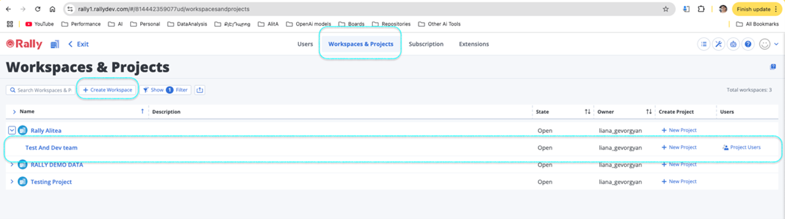
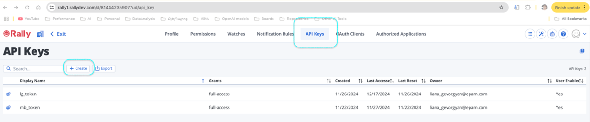
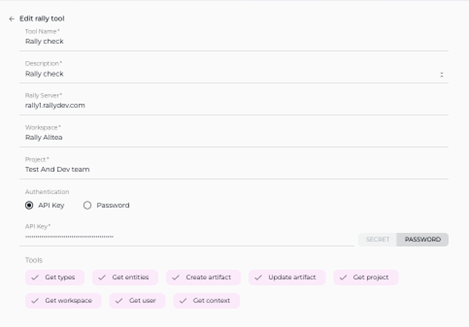

Here is the enhanced User Guide for ELITEA Toolkit integration with Rally, incorporating your feedback and requirements:
# ELITEA Toolkit Guide: Rally Integration

## Introduction

### Purpose of this Guide

This guide is your definitive resource for integrating and effectively utilizing the **Rally toolkit** within ELITEA. It provides a detailed, step-by-step walkthrough, from setting up your Rally API Key to configuring the toolkit in ELITEA and seamlessly incorporating it into your Agents. By following this guide, you will unlock the power of automated Agile project management, streamlined workflows, and enhanced team collaboration, all directly within the ELITEA platform. This integration empowers you to leverage AI-driven automation to optimize your Rally-driven workflows, enhance project visibility, and improve team productivity within your Agile development environment.

### Brief Overview of Rally

Rally, by Broadcom, is a leading Agile project management platform designed to support and streamline Agile software development methodologies. It provides a comprehensive suite of tools for planning, tracking, and managing Agile projects at scale. Rally is widely used by Agile teams to:

*   **Agile Project and Portfolio Management:** Rally provides robust features for managing Agile projects and portfolios, supporting various Agile frameworks like Scrum and Kanban, and enabling organizations to scale Agile practices across multiple teams and projects.
*   **Backlog and Iteration Planning:** Enables efficient backlog management, sprint planning, and iteration management, allowing Agile teams to effectively plan and prioritize work, manage sprint backlogs, and track progress against sprint goals.
*   **User Story and Task Management:** Facilitates the creation, management, and tracking of user stories, tasks, and other work items, providing a central repository for managing all aspects of project work and ensuring clear task ownership and accountability.
*   **Real-time Progress Tracking and Reporting:** Offers real-time dashboards, customizable reports, and visual progress tracking tools, providing Agile teams and stakeholders with up-to-date visibility into project status, sprint progress, team velocity, and other key Agile metrics, enabling data-driven decision-making and continuous improvement.
*   **Collaborative Agile Environment:** Rally promotes collaboration and communication within Agile teams by providing a shared platform for project planning, task management, issue tracking, and team communication, fostering transparency and alignment across the development team and stakeholders.

Integrating Rally with ELITEA brings these powerful Agile project management capabilities directly into your AI-driven workflows. Your ELITEA Agents can then intelligently interact with your Rally workspaces and projects to automate Agile task management, enhance project tracking, improve team collaboration, and leverage AI to optimize your entire Agile development lifecycle within Rally.

## Toolkit's Account Setup and Configuration in Rally

### Account Setup

Rally is a commercial Agile project management platform. To create a Rally account, follow these steps:

1.  **Visit Broadcom Rally Website:** Open your web browser and navigate to the official Broadcom Rally website (e.g., `rallydev.com` or your organization's specific Rally URL).
2.  **Sign Up or Request Access:** Click on the **"Sign Up"**, **"Free Trial"**, or **"Request Demo"** button, depending on your organization's access and trial requirements.
3.  **Follow Registration Process:** Follow the on-screen instructions to create an account or request access. You will typically need to provide your business email address and other required information.
4.  **Email Verification and Account Setup:** After submitting the registration form, you should receive a confirmation email from the Rally team. This email may include instructions on how to verify your email address and set up your Rally account. Follow the instructions in the email to complete the account creation process.
5.  **Log In to Rally:** Once your account is set up and verified, log in to Rally using your newly created credentials.

### Token/API Key Generation: Creating an API Key in Rally

For secure integration with ELITEA, it is essential to use a Rally **API Key** for authentication. This method is more secure than using your primary Rally account password directly and allows you to control access permissions for ELITEA.

**Follow these steps to generate an API Key in Rally:**

For secure integration with ELITEA, it is essential to use a Rally **API Key** for authentication. This method is more secure than using your primary Rally account password directly and allows you to control access permissions for ELITEA.

**Follow these steps to generate an API Key in Rally:**

1.  **Sign in to Rally and Access Setup Icon:** Begin by **signing in to your Rally workspace**. Once logged in, locate and click on the **Setup icon** (⚙️). This icon is typically found in the top right corner of the Rally interface and provides access to user and workspace settings.

    

2.  **Access My Settings via Avatar:** After clicking the Setup icon, click on your **Avatar** (your profile picture or initials), located in the top right corner of the Rally interface, next to the Setup icon. From the dropdown menu that appears, select **"My Settings"**.

    

3.  **Locate API Keys Section in Top Banner:** On the "My Settings" page, look for the **"API Keys"** section. This section is prominently displayed in a **banner at the top** of the "My Settings" page, making it easily accessible.

4.  **Create API Key:** Once you have located the "API Keys" section, click on the **"Create"** button. This button will initiate the generation of a new API key for your Rally account.

    

5.  **Securely Copy and Store Your API Key:**  A new API Key will be generated and displayed. **Immediately copy the newly generated API Key**. **This is the only time you will see the full API Key value.** It is crucial to store it securely in a password manager or, preferably, ELITEA's built-in Secrets feature for enhanced security within ELITEA. You will need this API Key to configure the Rally toolkit in ELITEA.


## System Integration with ELITEA

### Agent Creation/Configuration

To integrate Rally functionalities into your workflows, you will need to configure the Rally toolkit within an ELITEA Agent. You can either create a new Agent specifically for Rally interactions or modify an existing Agent to incorporate Rally tools.

1.  **Navigate to Agents Menu:** In ELITEA, go to the **Agents** menu from the main navigation panel.
2.  **Create or Edit Agent:**
    *   **Create a New Agent:** Click on the **"+ Agent"** button to create a new Agent. Follow the on-screen prompts to define essential Agent attributes such as Agent name, a descriptive Agent description, the desired Agent type, and initial instructions for the Agent.
    *   **Edit an Existing Agent:** Select the Agent you intend to integrate with Rally from your list of Agents. Click on the Agent's name to open its configuration settings for editing.
3.  **Access Tools Section:** Within the Agent configuration interface, scroll down until you locate the **"Tools"** section. This section is where you will add and configure toolkits, including the Rally toolkit.

### Toolkit Configuration

This section provides detailed instructions on how to configure the Rally toolkit within your ELITEA Agent.

1.  **Add Toolkit:** In the "Tools" section of the Agent configuration, click on the **"+" icon**. This action will display a dropdown list of available toolkits that can be integrated with your Agent.
2.  **Select Rally Toolkit:** From the dropdown list of available toolkits, choose **"Rally"**. Selecting "Rally" will open the "New Rally tool" configuration panel, where you will specify the settings for your Rally integration.
3.  **Configure Rally Toolkit Settings:** Carefully fill in the following configuration fields within the "New Rally tool" section:

    *   **Name:**  Enter a descriptive **Name** for your Rally toolkit instance. Choose a name that is easily recognizable and helps you identify its purpose within your Agent's instructions (e.g., "ProjectRally", "AgileManagementAccess", "RallyIntegration").
    *   **Description:** Provide a concise **Description** for the toolkit. This description should clarify the toolkit's purpose or the specific Rally workspace or project it is intended to access (e.g., "Toolkit for accessing and managing user stories in Rally", "Integration for Rally Workspace 'Project Alpha'").
    *   **Rally Server URL:** Enter the base URL of your Rally instance. **Ensure you use the correct format**, including `https://` or `http://` and the full workspace URL (e.g., `https://rally1.rallydev.com`). For Epam Rally, use `https://rally.epam.com`.
    *   **Workspace Name:** Enter the **Workspace Name** in Rally that you want to access with this toolkit. The Workspace Name is the name of your Rally workspace (e.g., "My Workspace").
    *   **Project Name:** Enter the **Project Name** within your Rally workspace that you want to access with this toolkit. The Project Name is the name of your Rally project (e.g., "Project Alpha").
    *   **Authentication Options - API Key:** Select the **"API Key"** authentication option.
        *   **Password/Secret:** Choose **"Password"** and paste the **API Key** you generated in Rally (during the "Software-Specific Setup" section of this guide) into the **"Password"** field.
        *   **Enhanced Security with Secrets (Recommended):** For enhanced security, it is strongly recommended to use ELITEA's **Secrets Management** feature to store your Rally API Key securely. Instead of directly pasting the token into the "Password" field, select the **"Secret"** option and choose the pre-configured secret containing your Rally API Key from the dropdown list. This prevents hardcoding sensitive credentials in your toolkit configuration.

    

4.  **Enable Desired Tools:** In the "Tools" section within the Rally toolkit configuration panel, **select the checkboxes next to the specific Rally tools** that you want to enable for your Agent. **It is crucial to enable only the tools that your Agent will actually need to use** to adhere to the principle of least privilege and minimize potential security risks. Available tools include:
    *   **Get types** - Retrieves the types of artifacts available in Rally.
    *   **Get entities** - Fetches specific entities from Rally based on provided criteria.
    *   **Create artifact** - Allows the Agent to create new artifacts (e.g., user stories, tasks) in Rally.
    *   **Update artifact** - Enables the Agent to update existing artifacts in Rally.
    *   **Get project** - Allows the Agent to retrieve details of a specific project in Rally.
    *   **Get workspace** - Fetches information about the workspace in Rally.
    *   **Get user** - Retrieves user details from Rally.
    *   **Get context** - Provides context-specific information from Rally.    
5.  **Complete Setup:** After configuring all the necessary settings and enabling the desired tools, click the **arrow icon** (typically located at the top right of the toolkit configuration section) to finalize the Rally toolkit setup and return to the main Agent configuration menu.
6.  Click **Save** in the Agent configuration to save all changes and activate the Rally toolkit integration for your Agent.

### Tool Overview: Rally Toolkit Functionalities

Once the Rally toolkit is successfully configured and added to your Agent, you can leverage the following tools within your Agent's instructions to enable intelligent interaction with your Rally workspaces and projects:

*   **Get types:**  **Tool Name:** `get_types`
    *   **Functionality:** Retrieves a list of artifact types available in Rally. Returns a list of artifact type names (e.g., "UserStory", "Task", "Defect").
    *   **Purpose:** Enables Agents to dynamically discover and list available artifact types in Rally, allowing for dynamic workflow creation, user guidance on artifact creation, or automated reporting on artifact types within a Rally project or workspace.

*   **Get entities:**  **Tool Name:** `get_entities`
    *   **Functionality:** Fetches specific entities (artifacts) from Rally based on provided criteria, such as artifact type, query parameters, and fetch parameters. Returns a list of Rally artifacts matching the specified criteria.
    *   **Purpose:** Enables advanced and flexible data retrieval from Rally, allowing Agents to query and retrieve specific sets of artifacts based on various filters and parameters, facilitating data extraction for reporting, analysis, or workflow automation based on Rally data.

*   **Create artifact:**  **Tool Name:** `create_artifact`
    *   **Functionality:** Automates the creation of new artifacts (e.g., User Stories, Tasks, Defects) in Rally within a specified project and workspace. Requires parameters such as Artifact Type and a JSON object containing artifact fields and values.
    *   **Purpose:** Streamlines artifact creation and project planning by enabling Agents to automatically generate new artifacts in Rally directly from ELITEA workflows, based on user input, workflow triggers, or automated analysis, ensuring timely and consistent artifact creation and improving project management efficiency.

*   **Update artifact:**  **Tool Name:** `update_artifact`
    *   **Functionality:** Allows Agents to modify and update fields of existing artifacts in Rally. Requires the Artifact Reference (e.g., US12345, DE56789) and a JSON object containing the fields to update and their new values.
    *   **Purpose:** Enables automated artifact lifecycle management by allowing Agents to update artifact statuses, priorities, assignees, custom fields, or any other artifact attributes based on workflow progress, user actions, or external events, ensuring Rally artifacts are always up-to-date and accurately reflect project status and changes.

*   **Get project:**  **Tool Name:** `get_project`
    *   **Functionality:** Retrieves detailed information about a specific project in Rally, identified by its Project Name. Returns comprehensive project details, including project description, start date, end date, and project owner.
    *   **Purpose:** Allows Agents to access project-level information from Rally, providing context for project-related workflows, enabling automated reporting on project details, or incorporating project information into ELITEA conversations and dashboards, facilitating project monitoring and awareness.

*   **Get workspace:**  **Tool Name:** `get_workspace`
    *   **Functionality:** Fetches information about a specific workspace in Rally, identified by its Workspace Name. Returns workspace details, including workspace description, owner, and creation date.
    *   **Purpose:** Enables Agents to retrieve workspace-level information from Rally, providing context for workspace-related workflows, enabling automated reporting on workspace details, or providing users with workspace information within ELITEA, facilitating workspace management and understanding.

*   **Get user:**  **Tool Name:** `get_user`
    *   **Functionality:** Retrieves user details from Rally based on a provided query (e.g., username, email address, user ID). Returns user information, including username, display name, and email address.
    *   **Purpose:** Allows Agents to retrieve user information from Rally, enabling user identification, automated task assignment to specific users, user-based reporting, or incorporating user details into ELITEA workflows, facilitating user-centric automation and workflow personalization.

*   **Get context:**  **Tool Name:** `get_context`
    *   **Functionality:** Retrieves context-specific information from Rally based on a provided context type and context tag. Returns context-specific data, such as iteration details, release information, or workspace context.
    *   **Purpose:** Enables Agents to access dynamic and context-aware information from Rally, allowing for retrieval of iteration details for sprint planning, release information for release management workflows, or workspace context for workspace-specific operations, facilitating context-aware automation and dynamic workflow execution.

## Instructions and Prompts for Using the Rally Toolkit

To effectively utilize the Rally toolkit within your ELITEA Agents, you need to provide clear and precise instructions within the Agent's "Instructions" field, telling the Agent *how* and *when* to use these tools.

**General Instruction Structure:**

When instructing your Agent to use a Rally tool, you will typically follow this pattern:

```
Use the "[tool_name]" tool to [describe the action you want to perform] in Rally.
Provide the following parameters:
- Parameter 1: <value or description of value>
- Parameter 2: <value or description of value>
- ...
```

**Example Agent Instructions for Rally Toolkit Tools:**

*   **Agent Instructions for Getting Artifact Types:**

    ```
    Use the "get_types" tool to retrieve a list of artifact types available in Rally.
    No parameters are needed for this tool.
    ```

*   **Agent Instructions for Getting Entities (User Stories):**

    ```
    Use the "get_entities" tool to retrieve a list of User Stories from Rally Project "Project Alpha".
    Provide the following parameters:
    - Artifact Type: "UserStory"
    - Query: "(Project.Name = \"Project Alpha\")"
    - Fetch: "Name,FormattedID,ScheduleState"
    ```

*   **Agent Instructions for Creating a New User Story:**

    ```
    Use the "create_artifact" tool to create a new User Story in Rally Project "Project Alpha".
    Provide the following parameters:
    - Artifact Type: "UserStory"
    - Fields (JSON):
      {
        "Name": "Implement User Authentication Feature",
        "Description": "As a user, I want to be able to log in using my username and password.",
        "Project": "/project/123456789"  // Replace with actual Project Ref
      }
    ```

**Important Considerations for Agent Instructions:**

*   **Tool Name Accuracy:** Ensure you use the correct **Tool Name** (e.g., `"get_types"`, `"get_entities"`, `"create_artifact"`) as listed in the "Tool Overview" section. Typos or incorrect tool names will prevent the Agent from using the toolkit correctly.
*   **Parameter Clarity:** Clearly specify the **parameters** required for each tool and provide instructions on where the Agent should obtain the values for these parameters (e.g., from user input, from previous steps in the workflow, or hardcoded values).
*   **Context and Examples:** Provide sufficient context and examples within your Agent's "Instructions" to guide the LLM in understanding *when* and *how* to use the Rally toolkit tools effectively within your desired workflow.
*   **Rally Artifact Types, Field Names, and Values:** Ensure that you use the correct Rally Artifact Types (e.g., "UserStory", "Task", "Defect"), Field Names (e.g., "Name", "Description", "ScheduleState"), and valid values for those fields as defined in your Rally workspace and project configuration. Incorrect artifact types or field names will cause errors during tool execution.
*   **Rally API Query Syntax:** When using the "Get Entities" tool with a Query parameter, ensure that you provide valid Rally API query strings that adhere to Rally's WSAPI query syntax. Incorrect query syntax will result in search errors. Refer to Rally WSAPI documentation for query syntax details and examples.

## Best Practices and Use Cases for Rally Integration

### Best Practices for Efficient Integration

*   **Test Integration Thoroughly:** After setting up the Rally toolkit and incorporating it into your Agents, **thoroughly test each tool** you intend to use to ensure seamless connectivity, correct authentication, and accurate execution of Rally actions.
*   **Monitor Agent Performance and Usage:**  Regularly **monitor the performance of Agents** utilizing Rally toolkits. Track metrics such as task completion success rate, execution time, and error rates to identify any potential issues or areas for optimization in Agent instructions or toolkit configurations.
*   **Follow Security Best Practices:**
    *   **Use API Keys:** Always use Rally API Keys instead of your main account password for integrations.
    *   **Grant Least Privilege:** While Rally API Keys have limited scope control, ensure you are generating tokens specifically for ELITEA integration and not reusing tokens with broader access.
    *   **Securely Store Credentials:** Utilize ELITEA's Secrets Management feature to securely store and manage your Rally API Keys instead of hardcoding them directly in Agent configurations.
*   **Provide Clear Instructions and Prompts:**  Craft clear and unambiguous instructions within your ELITEA Agents to guide them in using the Rally toolkit effectively. Use the prompt examples provided in this guide as a starting point and adapt them to your specific use cases.
*   **Start with Simple Use Cases:** Begin by implementing Rally integration for simpler automation tasks, such as retrieving artifact lists or reading project details, and gradually progress to more complex workflows as you gain experience and confidence with the toolkit.

### Use Cases for Rally Toolkit Integration

The Rally toolkit opens up a wide range of automation possibilities for Agile project management, workflow automation, and reporting within ELITEA. Here are some compelling use cases:

*   **Automated Backlog Analysis and Task Prioritization Suggestions:**
    *   **Scenario:** Project managers or product owners can use ELITEA Agents to analyze the project backlog in Rally, identify high-priority user stories or tasks based on criteria like urgency, business value, or dependencies, and suggest a prioritized backlog for sprint planning.
    *   **Tools Used:** `get_entities`
    *   **Example Instruction:** "Use the 'get_entities' tool to retrieve a list of User Stories from Rally Project 'Project Alpha' that are currently in 'Backlog' state. Analyze the 'Priority' and 'Blocked' fields for each user story and suggest a prioritized backlog list based on these factors."
    *   **Benefit:** Improves sprint planning efficiency by automating backlog analysis and prioritization, providing project managers and product owners with AI-driven recommendations for backlog prioritization, and ensuring sprint planning is data-driven and aligned with project goals.

*   **Dynamic Task Assignment Based on Team Capacity and Skills:**
    *   **Scenario:** ELITEA Agents can dynamically assign new tasks or defects in Rally to team members based on their current workload, skills, availability, and project role, optimizing resource allocation and workload balancing within Agile teams.
    *   **Tools Used:** `create_artifact`, `get_user`, `get_entities` (to assess workload)
    *   **Example Instruction:** "Use the 'get_user' tool to retrieve a list of available developers in Rally Project 'Project Alpha'. Analyze their current workload by retrieving their assigned 'Task' entities using 'get_entities'. Create a new 'Task' artifact using 'create_artifact' and automatically assign it to the developer with the lowest current workload and relevant skills based on user profile data."
    *   **Benefit:** Enables intelligent and automated task assignment, optimizing resource allocation, balancing workload across team members, and improving team efficiency by ensuring tasks are assigned to the most appropriate and available resources.

*   **Automated Project Status Reporting and Progress Updates:**
    *   **Scenario:** Project managers or stakeholders can use ELITEA Agents to generate automated project status reports directly from Rally data, providing real-time visibility into project progress, sprint burndown, and key Agile metrics without manual report generation.
    *   **Tools Used:** `get_project`, `get_entities`
    *   **Example Instruction:** "Use the 'get_project' tool to retrieve details for Rally Project 'Project Beta'. Use 'get_entities' to retrieve lists of User Stories and Tasks in the current sprint. Generate a project status report summarizing sprint progress, completed user stories, remaining tasks, and sprint burndown chart data. Send the report to project stakeholders daily."
    *   **Benefit:** Provides automated and up-to-date project status reporting, improving project visibility for stakeholders, reducing manual effort in report generation, and enabling proactive project monitoring and risk identification.

*   **Contextual Information Retrieval for User Stories and Tasks:**
    *   **Scenario:** Developers or testers can use ELITEA Agents to quickly retrieve detailed information about specific user stories or tasks in Rally, providing them with immediate access to requirements, acceptance criteria, and related documentation directly within ELITEA.
    *   **Tools Used:** `get_entities`
    *   **Example Instruction:** "Use the 'get_entities' tool to retrieve details for User Story with FormattedID 'US-98765' from Rally Project 'Project Gamma'. Display the 'Name', 'Description', 'Acceptance Criteria', and 'Tasks' associated with this user story to the user."
    *   **Benefit:** Improves team efficiency by providing instant access to relevant artifact details directly within ELITEA, streamlining information retrieval, reducing context switching, and ensuring team members have all necessary information at their fingertips for task execution and collaboration.

## Troubleshooting and Support

### Troubleshooting Common Issues

*   **Connection Errors:**
    *   **Problem:** ELITEA Agent fails to connect to Rally, resulting in errors during toolkit execution.
    *   **Possible Solutions:**
        1.  **Verify Rally Server URL:** Double-check that you have entered the correct Rally Server URL in the toolkit configuration, including `https://` or `http://` and the full workspace URL (e.g., `https://rally1.rallydev.com` or `https://rally.epam.com`).
        2.  **Check API Key:** Ensure that the **API Key** you provided is correct and valid for your Rally account and workspace. Carefully re-enter or copy-paste the API Key to rule out typos.
        3.  **Verify Workspace and Project Names:** Double-check that you have entered the correct **Workspace Name** and **Project Name** in the toolkit configuration. Workspace and Project Names are case-sensitive and must exactly match the names in your Rally instance.
        4.  **Network Connectivity:** Confirm that both your ELITEA environment and your Rally instance are connected to the internet and that there are no network connectivity issues blocking the integration.

*   **Authorization Errors (Permission Denied/Unauthorized):**
    *   **Problem:** Agent execution fails with "Permission Denied" or "Unauthorized" errors when trying to access or modify Rally resources.
    *   **Possible Solutions:**
        1.  **Verify API Key Validity:** Ensure that the Rally API Key you are using is valid and has not been revoked in your Rally user settings. Generate a new API Key if necessary.
        2.  **Check Rally User Permissions:** Confirm that the Rally user account associated with the API Key has the necessary permissions within Rally to access and modify the specific workspaces and projects your Agent is trying to interact with. Verify user roles and permissions within Rally workspace and project settings.
        3.  **Workspace and Project Access:** Double-check that the Workspace Name and Project Name specified in the toolkit configuration are correct and that the API Key is valid for that specific Rally workspace and project.

*   **Tool-Specific Parameter Errors:**
    *   **Problem:** Agent execution fails for specific Rally tools due to incorrect parameter values or formats.
    *   **Troubleshooting Steps:**
        1.  **Verify Workspace and Project Names:** Ensure that you are using the correct Rally Workspace Names and Project Names in your Agent's instructions when specifying workspace or project-related parameters for Rally tools. Workspace and Project Names are case-sensitive and must match the names in Rally exactly.
        2.  **Verify Artifact Types and Field Names:** Double-check that you are using the correct Rally Artifact Types (e.g., "UserStory", "Task", "Defect") and Field Names (e.g., "Name", "Description", "ScheduleState") in your Agent's instructions. Artifact Types and Field Names are case-sensitive and must match the Rally API schema. Use the "Get Types" tool to verify available Artifact Types and Field Names if needed.
        3.  **Parameter Format:** Verify that you are providing parameters in the correct format expected by each Rally tool (e.g., string values for names, JSON format for artifact fields). Refer to the "Instructions and Prompts for Using the Toolkit" section for parameter details and examples.
        4.  **WSAPI Query Syntax Errors:** When using the "Get Entities" tool with a Query parameter, ensure that you provide valid Rally WSAPI query strings that adhere to Rally's WSAPI query syntax. Incorrect query syntax will result in search errors. Refer to Rally WSAPI documentation for query syntax details and examples.

### FAQs

1.  **Q: Can I use my regular Rally username and password for the ELITEA integration?**
    *   **A:** No, it is **mandatory to use a Rally API Key** instead of your main account password for secure integration with ELITEA. Direct password authentication is not supported. API Keys provide a more secure and controlled way to grant access to external applications like ELITEA.
2.  **Q: What permissions should I grant to the Rally API Key?**
    *   **A:** Rally API Keys, when generated through the user profile, inherently provide access based on the user's permissions within Rally. Ensure that the Rally user account associated with the API Key has the necessary permissions within Rally to access and modify the workspaces and projects your Agent will be interacting with. You do not need to configure specific scopes during API Key generation as permissions are managed through Rally user roles and project access control.
3.  **Q: What is the correct format for the Rally Server URL in the toolkit configuration?**
    *   **A:**  The Rally Server URL should be entered in the full format, including `https://` or `http://` and the complete workspace URL (e.g., `https://rally1.rallydev.com` or `https://rally.epam.com`). Ensure there are no typos or missing parts in the URL.
4.  **Q: How do I find the Workspace Name and Project Name for my Rally project?**
    *   **A:** The Workspace Name and Project Name are typically displayed in the Rally web interface when you are logged in and viewing your Rally project. The Workspace Name is usually visible in the top navigation bar, and the Project Name is displayed on the project dashboard or project selection menus. You can also find these names in the URL when you are within your Rally workspace or project.
5.  **Q: Why is my Agent getting "Permission Denied" errors even though I think I have configured everything correctly?**
    *   **A:** Double-check the following:
        *   **API Key Validity:** Ensure that the API Key is valid and has not been revoked in your Rally user settings.
        *   **Rally Account Permissions:** Verify that the Rally account associated with the API Key has the necessary permissions to access the specific workspaces and projects your Agent is trying to interact with.
        *   **Workspace and Project Names Accuracy:** Double-check that you have entered the correct Workspace Name and Project Name in the toolkit configuration and that they correspond to the Rally workspace and project you intend to access.
        *   **Server URL Accuracy:** Ensure that the Server URL is correctly entered and points to the base URL of your Rally instance.

### Support and Contact Information

If you encounter any issues, have questions, or require further assistance beyond what is covered in this guide regarding the Rally integration or ELITEA Agents in general, please do not hesitate to contact our dedicated ELITEA Support Team. We are here to help you resolve any problems quickly and efficiently and ensure you have a smooth and productive experience with ELITEA.

**How to Reach ELITEA Support:**

*   **Email:**  **[SupportAlita@epam.com](mailto:SupportAlita@epam.com)**

**Best Practices for Effective Support Requests:**

To help us understand and resolve your issue as quickly as possible, please ensure you provide the following information in your support email:

*   **ELITEA Environment:** Clearly specify the ELITEA environment you are using (e.g., "Next" or the specific name of your ELITEA instance).
*   **Project Details:**  Indicate the **Project Name** and whether you are working in your **Private** workspace or a **Team** project.
*   **Detailed Issue Description:** Provide a clear, concise, and detailed description of the problem you are encountering. Explain what you were trying to do, what you expected to happen, and what actually occurred.
*   **Relevant Configuration Information:**  To help us diagnose the issue, please include relevant configuration details, such as:
    *   **Agent Instructions (Screenshot or Text):** If the issue is with an Agent, provide a screenshot or copy the text of your Agent's "Instructions" field.
    *   **Toolkit Configurations (Screenshots):** If the issue involves the Rally toolkit or other toolkits, include screenshots of the toolkit configuration settings within your Agent.
*   **Error Messages (Full Error Text):** If you are encountering an error message, please provide the **complete error text**. In the Chat window, expand the error details and copy the full error message. This detailed error information is crucial for diagnosis.
*   **Your Query/Prompt (Exact Text):** If the issue is related to Agent execution, provide the exact query or prompt you used to trigger the issue.

**Before Contacting Support:**

We encourage you to first explore the resources available within this guide and the broader ELITEA documentation. You may find answers to common questions or solutions to known issues in the documentation.

## Useful Links

To further enhance your understanding and skills in integrating Rally with ELITEA, here are some helpful resources:

*   **[Broadcom Rally Website](https://www.broadcom.com/products/agile-operations-software/valueops-platform/rally-software)**: Access the main Broadcom Rally product website for product information and documentation.
*   **[Rally Help and Documentation](https://help.rallydev.com/)**: Explore the official Rally documentation for detailed information on Rally features, functionalities, and API.
*   **[Rally WSAPI Documentation](https://help.rallydev.com/api/webservice/dev/)**: Refer to the Rally Web Services API (WSAPI) documentation for detailed information on Rally API endpoints, query syntax, and data models.
*   **[ELITEA Secrets Management](../../menus/settings/secrets.md)**: Learn how to securely store your Rally API Key using ELITEA's Secrets management feature for enhanced security.
*   **[ELITEA Agents Configuration](../../menus/agents.md)**:  Find out more about creating and configuring Agents in ELITEA, where you integrate the Rally toolkit to automate your workflows.
*   **[ELITEA Support Email](mailto:SupportAlita@epam.com)**: Contact the ELITEA support team for direct assistance with Rally integration or any other questions and issues you may encounter.
