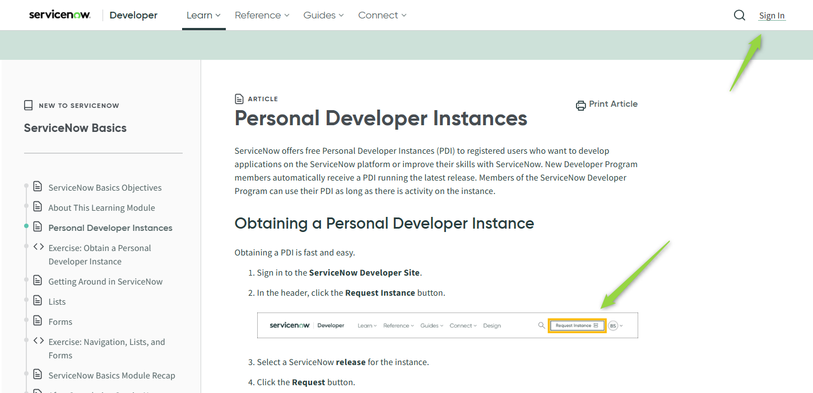
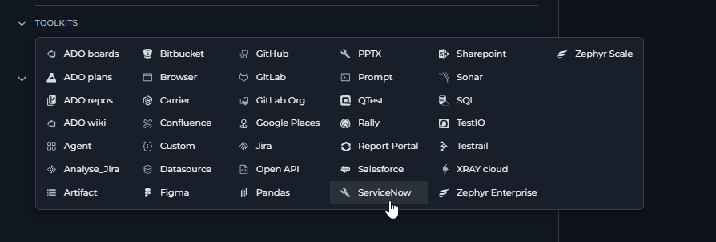
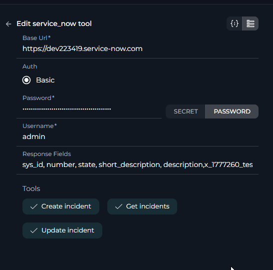
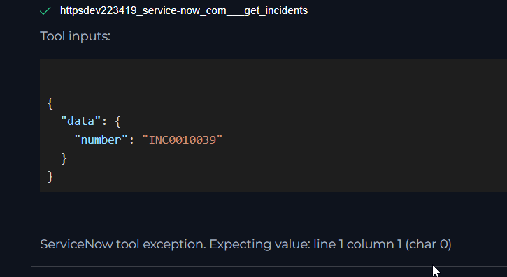
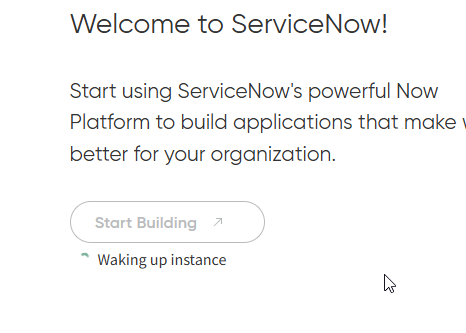

# ELITEA Toolkit Guide: ServiceNow Integration

## Introduction

### Purpose of this Guide

This guide is your definitive resource for integrating and utilizing the **ServiceNow toolkit** within ELITEA. It provides a walkthrough, from setting up a ServiceNow Personal Developer Instance (PDI) to configuring the toolkit in ELITEA and effectively using it within your Agents. This integration empowers you to leverage AI-driven automation to optimize your ITSM processes using the combined strengths of ELITEA and ServiceNow.

### Brief Overview of ServiceNow

ServiceNow is a leading cloud-based platform that automates and manages digital workflows for enterprise operations. It is renowned for its powerful IT Service Management (ITSM) capabilities, helping organizations streamline IT services, manage infrastructure, and improve user support. ServiceNow is essential for modern IT operations, offering features for:

*   **Incident Management:** A structured approach to logging, tracking, and resolving IT service disruptions to restore normal service operation as quickly as possible.
In addition to incident management, ServiceNow supports features like problem management, change management, service catalog, and workflow automation to streamline and enhance IT service delivery.

Integrating ServiceNow with ELITEA brings these powerful ITSM capabilities directly into your AI-driven workflows. Your ELITEA Agents can interact with your ServiceNow instance to automate incident creation, updates, and retrieval, making your IT support and operations workflows smarter and more efficient.

## Toolkit's Account Setup and Configuration in ServiceNow

### Account Setup: Getting a Personal Developer Instance (PDI)

To use the ServiceNow toolkit, you need a ServiceNow instance. You can get a free, fully-featured Personal Developer Instance (PDI) from the ServiceNow Developer Program for testing purposes.

1.  **Visit the ServiceNow Developer Portal:** Open your web browser and go to [https://developer.servicenow.com/dev.do](https://developer.servicenow.com/dev.do).
2.  **Sign Up or Sign In:** Create a new account or sign in with your existing credentials for the Developer Program.
3.  **Request an Instance:** Once logged in, navigate to the dashboard and click the **"Request Instance"** button. Follow the prompts to select the latest available release version.
4.  **Receive Instance Details:** After a few minutes, your instance will be ready. The platform will provide you with three critical pieces of information:
    *   **Instance URL:** The base URL for your ServiceNow instance (e.g., `https://devXXXXXX.service-now.com`).
    *   **Username:** The admin username for your instance (usually `admin`).
    *   **Password:** A temporary password for the admin user. You will be prompted to change this on your first login.

**Important:** Securely store your instance URL, username, and the new password you set. You will need these credentials to configure the toolkit in ELITEA. Note that these are the credentials for your **ServiceNow instance**, not your Developer Program account.

### Authentication Details

The ELITEA ServiceNow toolkit uses **Basic Authentication** to connect to your instance. This method uses the **Username** and **Password** from the Personal Developer Instance you set up. Unlike some other integrations, you do not need to generate a separate API key or token for basic authentication.

## ServiceNow Integration with ELITEA

### Agent Creation/Configuration

To integrate ServiceNow, you'll need to configure it within an ELITEA Agent. You can integrate ServiceNow with a new Agent or modify an existing one.

1.  **Navigate to Agents Menu:** In ELITEA, go to the **Agents** menu.
2.  **Create or Edit Agent:**
    *   **New Agent:** Click **"+ Agent"** to create a new Agent. Follow the steps to define Agent details such as name, description, type, and instructions.
    *   **Existing Agent:** Select the Agent you wish to integrate with ServiceNow and click on its name to edit its configuration.
3.  **Access Toolkits Section:** Within the Agent configuration, scroll down to the **"Toolkits"** section.

### Toolkit Configuration

This section details how to configure the ServiceNow toolkit within your ELITEA Agent.

1.  **Add Toolkit:** In the "Tools" section, click the **"+" icon**.
2.  **Select ServiceNow Toolkit:** From the dropdown list of available toolkits, choose **"ServiceNow"**. This will open the "New ServiceNow tool" configuration section.
3.  **Configure ServiceNow Toolkit Settings:** Fill in the following configuration fields:

       

    *   **Base URL:** Enter the full base URL of your ServiceNow instance that you obtained from the Developer Portal (e.g., `https://dev223419.service-now.com/`).
    *   **Authentication Options - Basic Auth:** Select the **"Basic Auth"** authentication option.
        *   **Username:** Enter the **username** for your ServiceNow instance user (e.g., `admin`).
        *   **Password/Secret:** Choose **"Password"** and then paste the **password** for your ServiceNow instance user into the **"Password"** field.
        *   **Enhanced Security with Secrets (Recommended):** For significantly enhanced security, it is strongly recommended to use the **"Secret"** option. Select **"Secret"** and then choose a pre-configured secret from the dropdown list. You must first securely store your ServiceNow password as a Secret within ELITEA's [Secrets Management](../../menus/settings/secrets.md) feature.
    *   **Response Fields:** This optional field allows you to control which fields are returned when the `get_incidents` tool is used.
        *   **If left empty (Default):** The toolkit will retrieve a standard set of fields: `sys_id`, `number`, `state`, `short_description`, `description`, `priority`, `category`, `urgency`, `impact`, `creation_date`.
        *   **If populated:** The fields you list here will **override** the default list. You must provide the exact **Field IDs** (also known as column names), separated by commas, without brackets. For example: `sys_id,number,caller_id,assignment_group,state`.
        *   **Important:** Field IDs can differ from the labels you see on the ServiceNow UI. Ask your ServiceNow administrator for the correct IDs. If an invalid field ID is provided, it will be ignored by the toolkit.

    

4.  **Enable Desired Tools:** In the **"Tools"** section within the ServiceNow toolkit configuration, select the checkboxes next to the specific tools your Agent will need. **Enable only the tools that are absolutely necessary** to adhere to the principle of least privilege. Available tools for incident management include:
    *   **get_incidents**
    *   **create_incident**
    *   **update_incident**

5.  **Complete Setup:** Click the **arrow icon** to finalize the ServiceNow toolkit setup and return to the main Agent configuration menu.
6.  Click **Save** in the Agent configuration to save all changes.

### Tool Overview

Once the ServiceNow toolkit is configured, you can use the following tools to interact with incidents in your ServiceNow instance:

*   **Get Incidents:** **Tool Name:** `get_incidents`
    *   **Functionality:** Retrieves a list of incidents from your ServiceNow instance. You can filter incidents based on various criteria (e.g., state, priority, assignment group). The fields returned in the response are determined by the **"Response Fields"** setting in the toolkit configuration.
    *   **Purpose:** Enables Agents to fetch and review existing incidents, create summary reports, or check the status of ongoing issues directly within ELITEA.

*   **Create Incident:** **Tool Name:** `create_incident`
    *   **Functionality:** Creates a new incident in your ServiceNow instance. The Agent needs to be provided with the necessary field IDs and corresponding values to populate the new incident record.
    *   **Purpose:** Automates the creation of incident tickets from user conversations, system alerts, or other triggers within ELITEA, streamlining the incident logging process.

*   **Update Incident:** **Tool Name:** `update_incident`
    *   **Functionality:** Updates an existing incident in ServiceNow. This tool requires the unique `sys_id` of the incident you wish to modify. You can update various fields, such as state, priority, assignment group, or add work notes.
    *   **Purpose:** Allows Agents to automate incident lifecycle management by updating ticket statuses, adding diagnostic notes, or reassigning incidents based on workflow progress or user input.

## Use Cases

*   **Automated Incident Logging from Chat:**
    *   **Scenario:** A user interacts with an ELITEA-powered chatbot to report an IT issue. The Agent gathers the necessary details (user name, issue description) and automatically creates an incident.
    *   **Tools Used:** `create_incident`
    *   **Benefit:** Reduces the burden on service desk staff, provides immediate ticket creation for users, and ensures all necessary information is captured consistently.

*   **Proactive Incident Status Reporting:**
    *   **Scenario:** A manager wants a daily summary of all critical incidents assigned to their team.
    *   **Tools Used:** `get_incidents`
    *   **Benefit:** Provides automated, real-time visibility into critical issues without manual report generation, enabling faster decision-making and resource allocation.

*   **Intelligent Incident Triage and Updates:**
    *   **Scenario:** An Agent performs an automated diagnostic step (e.g., pinging a server). Based on the result, it updates the corresponding incident with the findings.
    *   **Tools Used:** `update_incident`
    *   **Benefit:** Enriches incident data with valuable diagnostic information automatically, speeding up the resolution process for human technicians by providing them with more context.

### Troubleshooting

*   **Connection Fails or Toolkit is Unresponsive:**
    *   **Problem:** The toolkit returns a connection error or fails to respond, especially after a period of inactivity. Your ServiceNow Personal Developer Instance may have gone into hibernation.
    *   **Solution:** ServiceNow hibernates PDIs that are not used frequently to conserve resources. To wake it up, simply **log in to your ServiceNow instance** using your instance URL. It may take a few minutes for the instance to become fully operational again. After waking it up, try using the toolkit again.

    

    

*   **AI Fails to Create or Update an Incident Correctly:**
    *   **Problem:** The Agent tries to create or update an incident, but a specific field is not being populated as expected.
    *   **Solution:** This often happens because the AI does not know the correct **Field ID** for a field, especially for custom fields.
        1.  **Provide Explicit Field IDs:** In your Agent instructions, explicitly tell the AI which field IDs to use.
        2.  **Use "Response Fields" for Context:** A powerful technique is to add all the fields you need for creation/updates into the **"Response Fields"** configuration of the toolkit. Then, ask the Agent to `get_incidents` for a similar ticket. The AI will see the exact field ID and value structure in the response and can use that as a template to `create_incident` or `update_incident` correctly.

*   **Field value mismatch or unexpected values:**
    *   **Problem:** The value you provide for a field (such as "state" or "status") does not seem to work, or the incident is not updated as expected. This often happens because the value shown in the ServiceNow UI can differ from the value required by the API. For example, the "State" field may display "Open" or "Closed" in the UI, but the API expects numeric values like `"state": "1"` for "Open" or `"state": "2"` for "In Progress".
    *   **Solution:** Retrieve an existing incident using the `get_incidents` tool and observe the exact value of the field in the API response. Use this value when creating or updating incidents. Alternatively, instruct the AI to fetch an incident and use the returned field value for consistency.

### FAQ

1.  **Q: Can I use this toolkit to work with other ticket types like Problems, Changes, or Service Requests?**
    *   **A:** For now, the ServiceNow toolkit is specifically designed to work with **incidents** only. Support for other ServiceNow tables and applications may be added in the future.

2.  **Q: Where do I find the "Field ID" for a field in ServiceNow?**
    *   **A:** The "Field ID" is the column name in the database table. The easiest way to find it is to ask your ServiceNow administrator. If you have admin access to your PDI, you can navigate to a form (e.g., an incident form), right-click the field's label (e.g., "Category"), and select **"Configure Dictionary"**. The value in the **"Column name"** field is the Field ID you need (e.g., `category`).Also it can be found in url's and browser dev tools section.

3.  **Q: Why am I getting an "Authentication failed" error?**
    *   **A:** This error is almost always due to incorrect credentials.
        *   Verify that the **Username** and **Password** in the toolkit configuration exactly match the user credentials for your **ServiceNow instance**, not your ServiceNow Developer Portal account.
        *   If you recently reset your instance password, ensure you have updated it in the toolkit configuration or the ELITEA Secret.
        *   Check for any extra spaces or typos in the URL, username, or password fields.

### Support and Contact Information

If you encounter any persistent issues, have further questions, or require additional assistance beyond the scope of this guide, please do not hesitate to contact our dedicated ELITEA Support Team.

*   **Email:**  **[SupportAlita@epam.com](mailto:SupportAlita@epam.com)**

To help us resolve your issue efficiently, please include the following in your support request:
*   **ELITEA Environment Details** (e.g., "Nexus," "Alita Lab")
*   **Project Name** and workspace type (**Private** or **Team**)
*   A **detailed description** of the problem, including the steps to reproduce it.
*   **Screenshots** of your Agent instructions and toolkit configuration.
*   The **full text of any error messages** you received.

## Useful Links

*   **[ServiceNow Developer Portal](https://developer.servicenow.com/)**: Your starting point for getting a Personal Developer Instance.
*   **[ServiceNow Product Documentation](https://docs.servicenow.com/)**: The official documentation for the ServiceNow platform.
*   **[ELITEA Secrets Management](../../menus/settings/secrets.md)**: Learn how to securely store your ServiceNow password using ELITEA's Secrets feature.
*   **[ELITEA Agents Configuration](../../menus/agents.md)**: Find out more about creating and configuring Agents in ELITEA.
*   **[ELITEA Support Email](mailto:SupportAlita@epam.com)**: Contact the ELITEA support team for direct assistance.