# SharePoint Toolkit Integration Guide

---

## Introduction

This guide is your definitive resource for integrating and utilizing the **SharePoint toolkit** within ELITEA. It provides a comprehensive, step-by-step walkthrough, from registering your SharePoint application in Azure Active Directory to configuring the toolkit in ELITEA and effectively using it within your Agents. By following this guide, you will unlock the power of automated document management, streamlined collaboration workflows, and enhanced information access, all directly within the ELITEA platform. This integration empowers you to leverage AI-driven automation to optimize your SharePoint-driven workflows using the combined strengths of ELITEA and Microsoft SharePoint.

**Brief Overview of Microsoft SharePoint**

Microsoft SharePoint is a powerful web-based collaboration and document management platform that enables organizations to create sites, document libraries, lists, and other collaborative resources. It is a cornerstone of modern digital workplaces, facilitating teamwork, information sharing, and workflow automation. Key features of SharePoint include:

*   **Centralized Document Management:** SharePoint provides a central repository for storing, organizing, and managing documents, ensuring version control, secure access, and efficient document retrieval. Document libraries offer features like check-in/check-out, version history, and metadata tagging for robust document lifecycle management.
*   **Collaborative Workspaces and Team Sites:** SharePoint enables the creation of team sites and collaboration workspaces, providing teams with a shared platform for communication, document sharing, task management, and project collaboration.
*   **Customizable Lists and Libraries:** SharePoint lists and libraries are highly customizable and can be tailored to meet specific business needs. Lists can track tasks, manage contacts, or hold custom data tables, while libraries organize documents and media of all types.
*   **Workflow Automation:** SharePoint supports workflow automation through Power Automate and SharePoint workflows, allowing organizations to automate business processes, streamline approvals, and automate document-centric workflows.
*   **Enterprise Search Capabilities:** SharePoint offers robust enterprise search capabilities, enabling users to quickly find relevant information across sites, document libraries, lists, and other content sources.

Integrating SharePoint with ELITEA brings these powerful collaboration and document management capabilities directly into your AI-driven workflows. Your ELITEA Agents can then intelligently interact with your SharePoint sites, lists, and libraries to automate document-related tasks, enhance collaboration processes, and improve information accessibility through intelligent automation.

---

## Toolkit's Account Setup and Configuration in SharePoint

### Registering an App in Azure Active Directory (Azure AD)

To enable secure integration between ELITEA and SharePoint, you need to register an application in Azure Active Directory (Azure AD). This app registration will represent ELITEA and allow it to authenticate and access SharePoint resources.

1.  **Access Azure Portal:** Open your web browser and navigate to the [Azure Portal](https://portal.azure.com/) and log in using an account with sufficient permissions to register applications in Azure AD.
2.  **Navigate to App Registrations:** In the Azure portal, use the search bar at the top to search for "App registrations" and select **"App registrations"** from the search results under "Services".
3.  **Create New Registration:** On the "App registrations" page, click on **"+ New registration"**.
 
    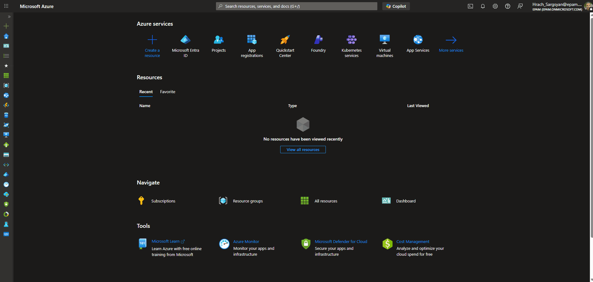

4.  **Configure App Registration Details:** On the "Register an application" page, provide the following information:
    *   **Name:** Enter a meaningful and descriptive name for your application registration. For example, use "ELITEA SharePoint Integration" or "ELITEA Agent Access to SharePoint". This name will help you identify the purpose of this app registration later.
    *   **Supported account types:** Select the appropriate account type based on your organization's requirements. In most cases, **"Accounts in this organizational directory only (\[Your Organization Name] only - Single tenant)"** is the recommended option for internal organizational use. If you need to access SharePoint resources across multiple organizations, you may need to select a different option.
    *   **Redirect URI:** If you plan to use **Delegated (User OAuth)** authentication, set the redirect URI here during registration:
          1. In the **"Select a platform"** dropdown, select **"Web"**.
          2. In the URI field, enter the ELITEA callback URL for your instance:(e.g.,`https://next.elitea.ai/app/mcp-auth-callback`)

        > If you are using **App-Only (Client Credentials)** mode only, leave this field blank.

5.  **Register Application:** After providing the application details, click the **"Register"** button at the bottom of the page to create the app registration.
 
     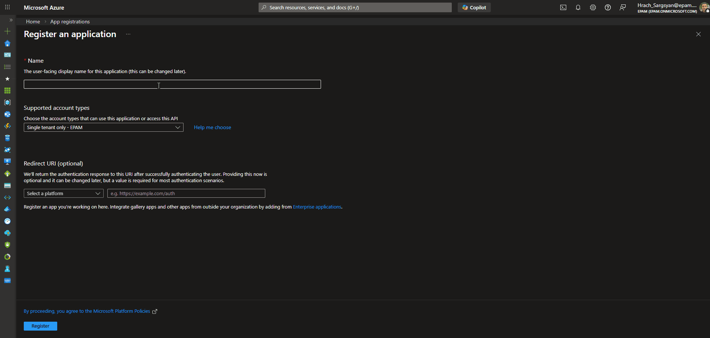

!!! warning "Confirm the exact Redirect URI with your ELITEA administrator"
    The redirect URI must exactly match what ELITEA sends during the OAuth flow. Contact your ELITEA administrator to confirm the correct value for your deployment.       

### Application Credentials

Once the app registration is created successfully, you will be redirected to the application's **Overview** page. Note down the following credentials, as you will need them to configure the SharePoint toolkit in ELITEA:

*   **Application (client) ID** — Copy and store this value securely.
*   **Directory (tenant) ID** — Copy and store this value securely.

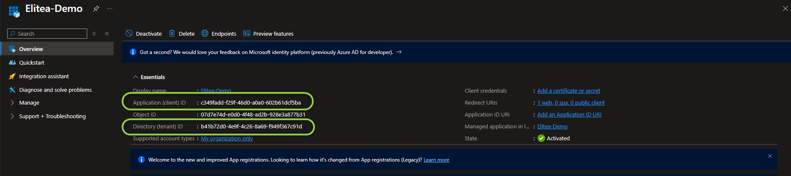
  

### Configure API Permissions for the Registered App

To allow ELITEA to access SharePoint resources, you need to configure API permissions for your registered application. This involves granting the application the necessary permissions to interact with Microsoft Graph and SharePoint APIs.

1.  **Navigate to API Permissions:** In your registered app within the Azure portal, navigate to the left-hand menu and click on **"API permissions"**.
2.  **Add Permissions:** On the "API permissions" page, click on **"+ Add a permission"**.
3.  **Select API Type - Microsoft Graph:** In the "Request API permissions" panel, select the **"Microsoft Graph"** API tile. Microsoft Graph provides access to various Microsoft 365 services, including SharePoint.

    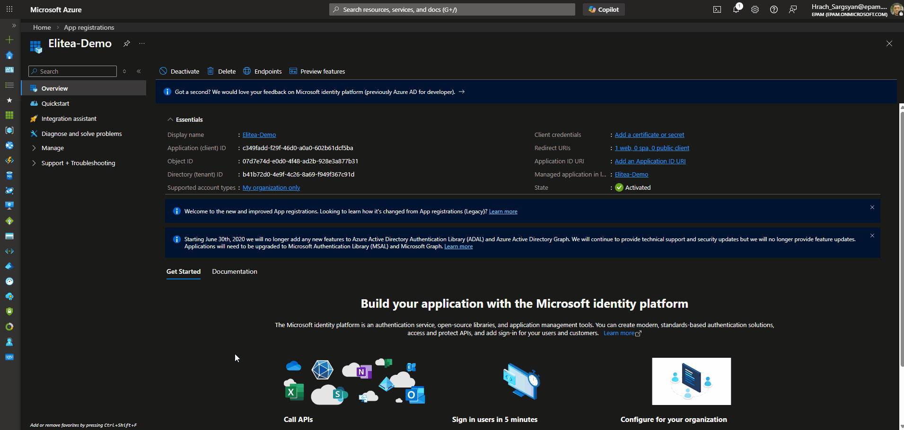

4.  **Select Permission Type - Application permissions:** Choose **"Application permissions"** as the permission type. Application permissions are used when the application acts without a signed-in user (App-Only mode). If you are using Delegated (User OAuth) mode, you may also need to add **Delegated permissions**.
5.  **Add Microsoft Graph Scopes:** In the "Application permissions" section, use the search bar to search for and select the following scopes:

    | **Scope** | **Description** | **When to Grant** |
    |-----------|-----------------|-------------------|
    | `Sites.Read.All` | Read all site collections, lists, and libraries without a signed-in user | Always — required for read access |
    | `Sites.ReadWrite.All` | Read and write all site collections, lists, and libraries without a signed-in user | Only if Agents need to create or modify SharePoint content |

    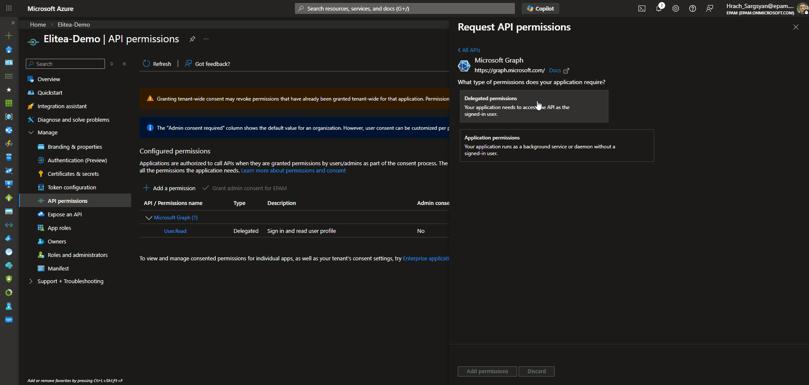

6.  **Add Permissions - SharePoint API:** Click **"+ Add a permission"** again to add SharePoint-specific permissions. This time, in the "Request API permissions" panel, select the **"SharePoint"** API tile (you may need to scroll down to find it).
7.  **Select Permission Type - Application permissions:** Choose **"Application permissions"** as the permission type for the SharePoint API as well. If you are using Delegated (User OAuth) mode, select **Delegated permissions** instead.
8.  **Add SharePoint Scopes:** In the "Application permissions" section for SharePoint API, use the search bar to search for and select the following scope:

    | **Scope** | **Description** | **When to Grant** |
    |-----------|-----------------|-------------------|
    | `Sites.FullControl.All` | Full control of all site collections without a signed-in user | Only if absolutely necessary — prefer Microsoft Graph scopes for better security |

9.  **Add Permissions:** After selecting the necessary scopes for both Microsoft Graph and SharePoint APIs, click the **"Add permissions"** button at the bottom of the "Request API permissions" panel to add the selected permissions to your application registration.

    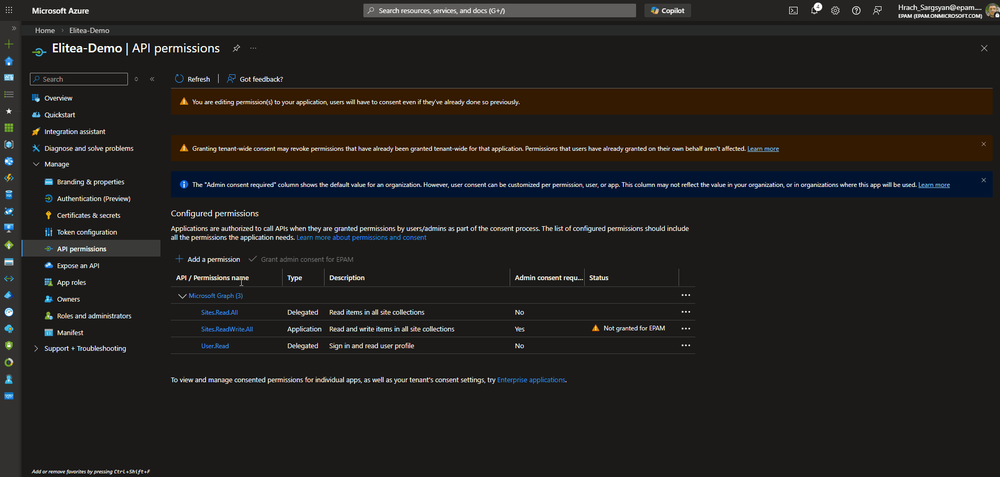

10. **Grant Admin Consent:** On the "API permissions" page, you will see the newly added permissions listed. Click the **"Grant admin consent for \[Your Organization Name]"** button and then click **"Yes"** to grant admin consent for these permissions. **Admin consent is required for application permissions to take effect.**


!!! note "Delegated Permissions"
    If you cannot obtain admin consent for application permissions, you can use **delegated permissions** instead. This allows ELITEA to access SharePoint resources on behalf of a signed-in user. This approach is commonly used when integrating with organizational SharePoint pages.


### Configure the Client Secret

To securely authenticate your ELITEA Agents with SharePoint, you need to create a Client Secret for your registered application. The Client Secret acts as a password for your application when authenticating with Azure AD.

1.  **Navigate to Certificates & secrets:** In your registered app within the Azure portal, navigate to the left-hand menu and click on **"Certificates & secrets"**.
2.  **Create New Client Secret:** On the "Certificates & secrets" page, click on **"Client secrets"** tab (if not already selected) and then click **"+ New client secret"**.
3.  **Configure Client Secret Details:** In the "Add a client secret" panel:
    *   **Description:** Enter a descriptive name for your client secret.
    *   **Expiration:** Choose an appropriate expiration period for the client secret from the "Expires" dropdown.
4.  **Add Client Secret:** Click the **"Add"** button at the bottom of the "Add a client secret" panel to create the client secret.
5.  **Securely Copy and Store Client Secret Value:** **Immediately copy the generated Client Secret Value** displayed in the **"Value"** column. **This is the only time you will see the full Client Secret Value.** Store it securely in a password manager or in ELITEA's **[Secrets](../../menus/settings/secrets.md)** feature. Do not store the value in plain text.

    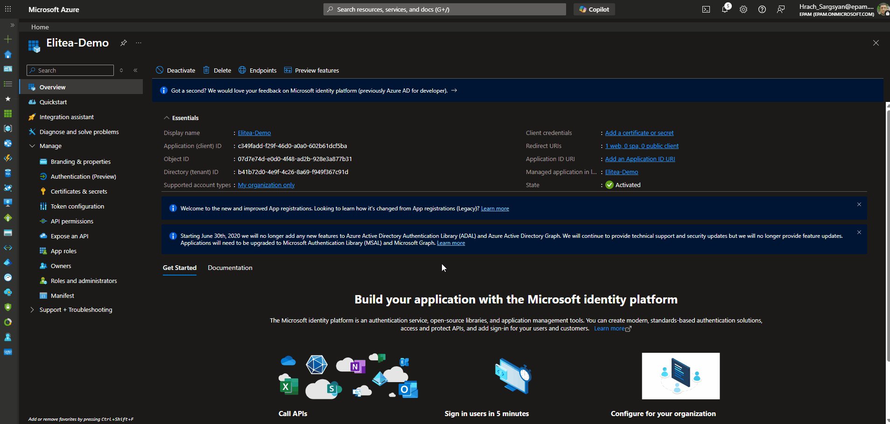

    !!! warning "Important"
        Copy the **"Value"** column — not the "Secret ID" column. The Value is the actual credential used for authentication.


### Grant App-Only Access to the SharePoint Site

!!! info "App-Only mode only"
    This step is **required for App-Only (Client Credentials)** authentication only. If you are using **Delegated (User OAuth)** mode, skip this section — access is governed by the signed-in user's own SharePoint permissions.

Grant your registered application access at the SharePoint site collection level via the `AppInv.aspx` page.

1.  **Navigate to the SharePoint AppInv.aspx page:** Open your browser and go to the following URL, replacing `{your-tenant}` and `{site}` with your values:

    ```
    https://{your-tenant}.sharepoint.com/sites/{site}/_layouts/15/appinv.aspx
    ```

    **Example:**
    ```
    https://contoso.sharepoint.com/sites/MyProjectSite/_layouts/15/appinv.aspx
    ```

2.  **Look Up the App:** In the **"App Id"** field, enter your **Application (client) ID** and click **"Lookup"**. Verify that the Title, App Domain, and Redirect URL are populated correctly.

3.  **Define Permissions using XML:** In the **"Permission Request XML"** field, enter one of the following XML blocks depending on the level of access your Agents require:

    !!! example "Permission Request XML Options"

        **Full Control (read and write operations):**
        ```xml
        <AppPermissionRequests AllowAppOnlyPolicy="true">
          <AppPermissionRequest Scope="http://sharepoint/content/sitecollection" Right="FullControl" />
        </AppPermissionRequests>
        ```

        **Read-Only Access:**
        ```xml
        <AppPermissionRequests AllowAppOnlyPolicy="true">
          <AppPermissionRequest Scope="http://sharepoint/content/sitecollection" Right="Read" />
        </AppPermissionRequests>
        ```

    !!! warning "Principle of Least Privilege"
        Grant only the minimum required permissions. Avoid `FullControl` unless your Agents need to create, modify, or delete SharePoint content.

4.  **Create and Trust the App:** Click **"Create"**, then click **"Trust It"** on the confirmation page to grant the requested permissions to your application.

     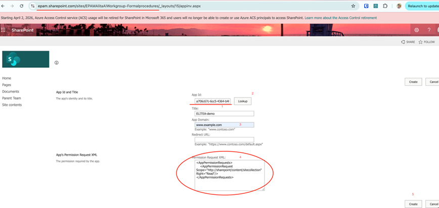

---

## System Integration with ELITEA

To integrate SharePoint with ELITEA, follow a three-step process: **Create Credentials → Create Toolkit → Use in Agents**. This workflow ensures secure authentication and proper configuration.

### Step 1: Create SharePoint Credentials

Before creating a toolkit, you must first create SharePoint credentials in ELITEA.

The SharePoint credential supports two authentication modes — **App-Only** (the application acts as itself) and **Delegated** (the application acts on behalf of a signed-in user). Select the tab in the ELITEA credential form that matches your organization's access policy:

**Steps to create a SharePoint credential:**

1. **Navigate to Credentials Menu:** Open the sidebar and select **[Credentials](../../menus/credentials.md)**.
2. **Create New Credential:** Click the **`+ Create`** button.
3. **Select SharePoint:** Choose **SharePoint** as the credential type.
4. **Configure credential fields:**

    | **Field** | **Description** | **Example** |
    |-----------|----------------|-------------|
    | **Display Name** | Descriptive name for this credential | `SharePoint - Contoso Marketing Site` |
    | **Client ID** | Application (client) ID from your Azure AD app registration | `xxxxxxxx-xxxx-xxxx-xxxx-xxxxxxxxxxxx` |
    | **Client Secret** | Client Secret Value generated in Azure AD | `your-client-secret-value` |
    | **Site URL** | Full URL of your SharePoint site | `https://contoso.sharepoint.com/sites/MarketingTeam` |

5. **Select the authentication tab:** In the credential form, choose either **"App-only"** or **"Delegated"** depending on your access model.    

#### App-Only (Client Credentials)

1. **Test Connection:** Click **Test Connection**to verify your credentials are valid and ELITEA can connect to SharePoint.
2. **Save Credential:** Click **Save**.

     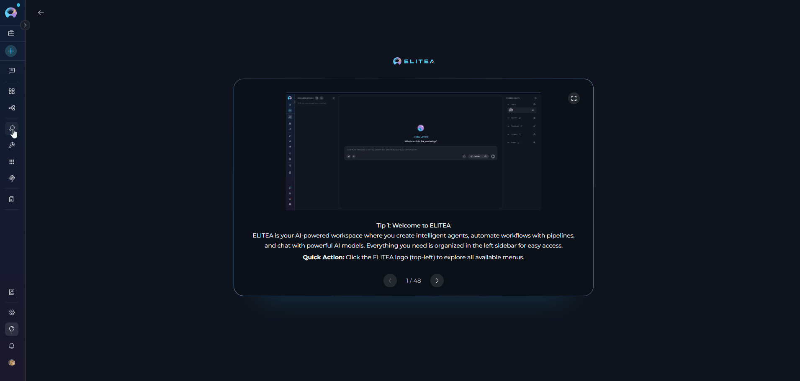

---

#### Delegated (User OAuth)

1. **Configure additional Delegated fields:**

    | **Field** | **Description** | **Example** |
    |-----------|----------------|-------------|
    | **OAuth Discovery Endpoint** | Azure AD tenant base URL in the format `https://login.microsoftonline.com/{tenant_id}`. The `{tenant_id}` is the **Directory (tenant) ID** from your Azure AD App Registration Overview page | `https://login.microsoftonline.com/xxxxxxxx-xxxx-xxxx-xxxx-xxxxxxxxxxxx` |
    | **Scopes** | Space-separated OAuth permission scopes the delegated token should request | `Sites.ReadWrite.All Files.ReadWrite.All Notes.ReadWrite.All` |

2. **Log in:** Once all fields are filled, a **Log in** button appears next to the **Test Connection** button. Click **Log in** to complete the OAuth authorization flow — ELITEA redirects to Azure AD for user sign-in, and after authorization the token is stored and the connection is verified via Microsoft Graph.
3. **Save Credential:** Click **Save**.

     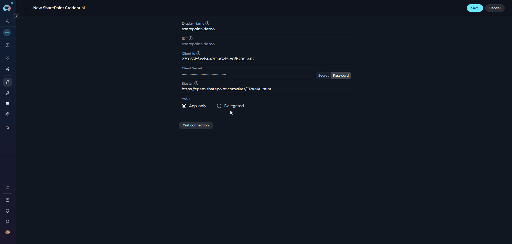

!!! warning "Re-login required after scope changes"
    If you add, remove, or modify the **Scopes** field after the initial login (e.g., to add `Notes.ReadWrite.All` for OneNote access), the existing token will not automatically include the new scopes. You must click **Log in** again to complete a new OAuth authorization flow and obtain a fresh token that reflects the updated scope list.

---

!!! info "Site URL Format"
    The Site URL must follow the format `https://<tenant>.sharepoint.com/sites/<site>`. For App-Only, the tenant name is extracted from this URL to construct the ACS endpoint. For Delegated, the full URL is passed to the Microsoft Graph sites API.

    | Example | URL |
    |---------|-----|
    | Contoso Marketing site | `https://contoso.sharepoint.com/sites/MarketingTeam` |
    | EPAM AlitaDoc site | `https://epam.sharepoint.com/sites/EPAMAlitaDoc` |

    Ensure there are no trailing slashes and that the URL is well-formed.

!!! tip "Security Recommendation"
    Use **[Secrets](../../menus/settings/secrets.md)** for sensitive values (Client Secret) instead of entering them directly. Create a secret first, then reference it in your credential configuration.

#### Choosing an Authentication Mode

**Use App-Only (Client Credentials) when:**

- Your workflow runs automatically, without a user actively involved (e.g., a nightly report, a scheduled file sync, or a background data processing pipeline).
- You want a single shared connection that doesn't depend on any individual user's account.
- You need to read from or write to public team sites where user identity doesn't matter.

    !!! example
        An ELITEA Agent that runs every morning, reads all items from a "Project Tasks" list, and generates a summary report — App-Only is the right choice here because no user interaction is needed.

**Use Delegated (User OAuth) when:**

- You need to access OneNote notebooks (only available in Delegated mode).
- Your organization's SharePoint permissions are user-based — only specific people can see certain sites or libraries.
- The workflow involves a user actively working in ELITEA and you want actions to be logged under their identity.
- You're building a personal assistant that reads documents or lists on behalf of the signed-in user.

    !!! example
        An ELITEA Agent helping a team member search their department's restricted SharePoint site and read OneNote meeting notes — Delegated is required because the site is access-controlled per user and OneNote needs a user token.

    | | **App-Only (Client Credentials)** | **Delegated (User OAuth)** |
    |---|---|---|
    | **How it works** | ELITEA connects as the application itself, with no user involved | ELITEA connects on behalf of a specific signed-in user |
    | **Best for** | Automation, background tasks, scheduled workflows | Workflows where user identity matters, or access is restricted to specific users |
    | **Example use case** | Nightly report generation, automated file archiving, batch list updates | Reading a user's personal SharePoint files, accessing sites restricted to certain team members |
    | **OneNote support** | ✘ Not supported | ✔️ Supported |
    | **Setup complexity** | Simpler — App registration + AppInv.aspx site grant | Requires Redirect URI + OAuth login step |
    | **Access scope** | Defined by permissions granted to the app | Defined by the permissions of the signed-in user |


### Step 2: Create SharePoint Toolkit

Once your credentials are configured, create the SharePoint toolkit:

1. **Navigate to Toolkits Menu:** Open the sidebar and select **[Toolkits](../../menus/toolkits.md)**.
2. **Create New Toolkit:** Click the **`+ Create`** button.
3. **Select SharePoint:** Choose **SharePoint** from the list of available toolkit types.
4. **Configure Toolkit Settings:**

    | **Field** | **Description** | **Example** |
    |-----------|----------------|-------------|
    | **Toolkit Name** | Descriptive name for your toolkit (required) | `SharePoint - Marketing Documents` |
    | **Description** | Optional description for the toolkit purpose | `Toolkit for accessing the Marketing Team SharePoint site` |
    | **Credentials** | Select your previously created SharePoint credential | `SharePoint - Contoso Marketing Site` |
    | **PgVector Configuration** | (Optional) Select PgVector connection for indexing and semantic search features | Your PgVector configuration |
    | **Embedding Model** | (Optional) Select embedding model for text processing and semantic search | `amazon.titan-embed-text-v2:0` |

5. **Enable Desired Tools:** In the **"Tools"** section, select the checkboxes next to the specific SharePoint tools you want to enable. **Enable only the tools your agents will actually use** to follow the principle of least privilege.
       * **[Make Tools Available by MCP](../mcp/make-tools-available-by-mcp.md)** — (optional checkbox) Enable this option to make the selected tools accessible through external MCP clients.
6. **Save Toolkit:** Click **Save** to create the toolkit.

     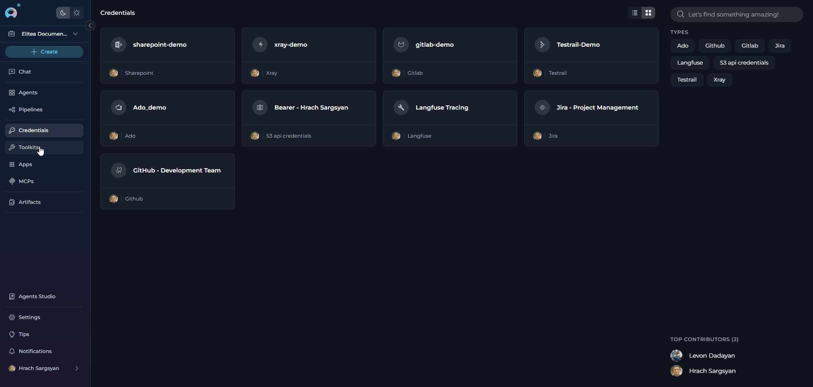

#### Available Tools

* The SharePoint toolkit provides the following tools for interacting with SharePoint sites, document libraries, and lists, organized by functional categories:

    | **Tool Category** | **Tool Name** | **Description** | **Primary Use Case** |
    |:-----------------:|---------------|-----------------|----------------------|
    | **File Operations** | | | |
    | | **Get files list** | Lists files in a SharePoint document library, optionally filtered by folder or library name | Browse and discover files across document libraries |
    | | **Read document** | Reads the content of a document at a given server-relative path; supports `.docx`, `.xlsx`, `.pptx`, `.pdf`, `.txt`, `.csv`, and more | Extract text content from SharePoint documents for analysis or summarization |
    | | **Upload file** | Uploads a file to a specified SharePoint document library folder, from artifact storage or direct string content | Automate file delivery and publishing to SharePoint |
    | **List & Data Operations** | | | |
    | | **Get lists** | Returns all visible SharePoint lists on the configured site with their titles, IDs, descriptions, and item counts | Discover lists on a site before reading or writing data |
    | | **Read list** | Reads items from a specified SharePoint list (up to a configurable limit) | Access and process data stored in SharePoint lists |
    | | **Get list columns** | Returns all column metadata for a specified list, including field names, display names, types, required flags, and valid choice values | Discover available columns before creating list items |
    | | **Create list item** | Creates a new item in a specified SharePoint list using a dictionary of field-value pairs | Automate data entry and record creation in SharePoint lists |
    | | **Add attachment to list item** | Attaches a file to an existing SharePoint list item, from artifact storage or direct string content | Link supporting documents or data files to list records |
    | **OneNote Operations** | | | |
    | | **Onenote get notebooks** | Lists all OneNote notebooks in the configured SharePoint site, returning ids, display names, creation dates, and web URLs | Discover notebooks on a site before reading or writing OneNote content |
    | | **Onenote get sections** | Lists all sections in a specific OneNote notebook, returning section ids, display names, and page URLs | Browse notebook structure to locate a section before reading pages |
    | | **Onenote get pages** | Lists page metadata (id, title, dates, webUrl) from a OneNote section; does not return page content | Discover pages in a section before reading their content |
    | | **Onenote get page content** | Retrieves the raw HTML content of a OneNote page as stored by the service | Access the raw XHTML of a page for programmatic processing or export |
    | | **Onenote list attachments** | Lists all file attachments on a OneNote page, returning filenames, resource IDs, and download URLs | Discover files attached to a page before downloading or reading them |
    | | **Onenote read attachment** | Downloads and parses a file attachment from a OneNote page; supports PDF, DOCX, XLSX, PPTX, images, and more | Extract text content from files attached to OneNote pages for analysis |
    | | **Onenote read page** | Reads and converts a OneNote page into beautified plain text with `-----` separators between content items, image descriptions, and attachment entries | Retrieve human-readable page content for summarization or analysis |
    | | **Onenote read page items** | Reads a OneNote page into a structured list of typed items (text, image, attachment) in document order | Process page content programmatically with fine-grained control over each element |
    | | **Onenote search pages** | Searches all OneNote pages in the site matching a full-text query and returns matching page metadata | Quickly locate OneNote pages by topic, keyword, or content across all notebooks |
    | | **Onenote create notebook** | Creates a new OneNote notebook in the SharePoint site, returning the notebook id, display name, and web URL | Set up new notebooks for organizing notes and content |
    | | **Onenote create section** | Creates a new section within an existing OneNote notebook, returning the section id and display name | Add organizational sections to an existing notebook |
    | | **Onenote create page** | Creates a new page in a OneNote section from an HTML document, returning the page id, title, and web URL | Publish AI-generated or automated content as OneNote pages |
    | | **Onenote update page** | Updates a OneNote page using Graph API PATCH commands to append, prepend, replace, or delete specific content elements | Make targeted incremental edits to existing OneNote pages |
    | | **Onenote replace page content** | Replaces the entire body of a OneNote page with new HTML content | Fully overwrite a page's content with a new version |
    | | **Onenote delete page** | Permanently deletes a OneNote page (this action is irreversible) | Remove outdated or incorrect OneNote pages |
    | **Indexing & Search** | | | |
    | | **Index data** | Creates searchable indexes of SharePoint document library content | Enable advanced semantic search across SharePoint files |
    | | **List collections** | Lists available indexed content collections | View and manage indexed SharePoint data collections |
    | | **Remove index** | Removes a previously created search index | Clean up indexed SharePoint data |
    | | **Search index** | Performs semantic searches across indexed SharePoint content | Find specific documents or file content across the site |
    | | **Stepback search index** | Performs advanced contextual searches with broader scope | Execute sophisticated searches with expanded context |
    | | **Stepback summary index** | Creates comprehensive summaries of indexed SharePoint content | Generate intelligent summaries of documents and files |

    !!! tip "Vector Search Tools"
        The tools **Index data**, **List collections**, **Remove index**, **Search index**, **Stepback search index**, and **Stepback summary index** require PgVector configuration and an embedding model. These enable advanced semantic search capabilities across your SharePoint documents.

#### Testing Toolkit Tools

After configuring your SharePoint toolkit, you can test individual tools directly from the Toolkit detail page using the **Test Settings** panel. This allows you to verify that your credentials are working correctly and validate tool functionality before adding the toolkit to your workflows.

**General Testing Steps:**

1. **Select LLM Model:** Choose a Large Language Model from the model dropdown in the Test Settings panel.
2. **Configure Model Settings:** Adjust model parameters like Creativity, Max Completion Tokens, and other settings as needed.
3. **Select a Tool:** Choose the specific SharePoint tool you want to test from the available tools.
4. **Provide Input:** Enter any required parameters or test queries for the selected tool.
5. **Run the Test:** Execute the tool and wait for the response.
6. **Review the Response:** Analyze the output to verify the tool is working correctly and returning expected results.

    !!! tip "Key benefits of testing toolkit tools:"
        * Verify that SharePoint credentials and connection are configured correctly
        * Test tool parameters and see actual responses from your SharePoint site
        * Debug tool behavior and understand output formats
        * Optimize tool settings before integrating with agents or pipelines
        > For detailed instructions on how to use the Test Settings panel, see **[How to Test Toolkit Tools](../../how-tos/credentials-toolkits/how-to-test-toolkit-tools.md)**.

---

### Step 3: Add SharePoint Toolkit to Your Workflows

Now you can add the configured SharePoint toolkit to your agents, pipelines, or use it directly in chat:

---

#### In Agents:

1. **Navigate to Agents:** Open the sidebar and select **[Agents](../../menus/agents.md)**.
2. **Create or Edit Agent:** Either create a new agent or select an existing agent to edit.
3. **Add SharePoint Toolkit:**
     * In the **"TOOLKITS"** section of the agent configuration, click the **"+Toolkit"** icon.
     * Select your configured SharePoint toolkit from the dropdown list.
     * The toolkit will be added to your agent with the previously configured tools enabled.

     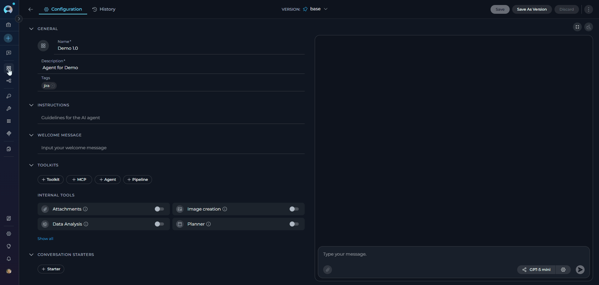


Your agent can now interact with SharePoint using the configured toolkit and enabled tools.

---

#### In Pipelines:

1. **Navigate to Pipelines:** Open the sidebar and select **[Pipelines](../../menus/pipelines.md)**.
2. **Create or Edit Pipeline:** Either create a new pipeline or select an existing pipeline to edit.
3. **Add SharePoint Toolkit:**
     * In the **"TOOLKITS"** section of the pipeline configuration, click the **"+Toolkit"** icon.
     * Select your configured SharePoint toolkit from the dropdown list.
     * The toolkit will be added to your pipeline with the previously configured tools enabled.

     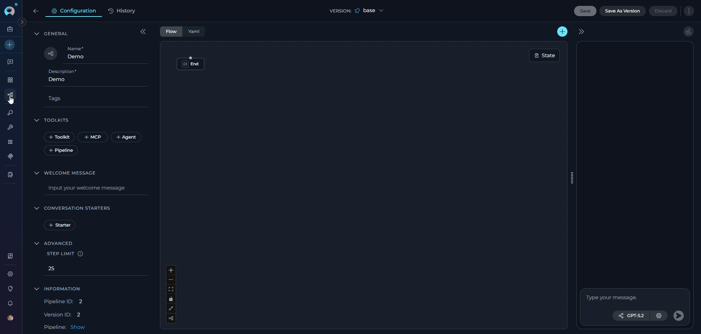

---

#### In Chat:

1. **Navigate to Chat:** Open the sidebar and select **[Chat](../../menus/chat.md)**.
2. **Start New Conversation:** Click **+Create** or open an existing conversation.
3. **Add Toolkit to Conversation:**
     * In the chat Participants section, look for the **Toolkits** element.
     * Click the **"Add Tools"** icon to open the tools selection dropdown.
     * Select your configured SharePoint toolkit from the dropdown list.
     * The toolkit will be added to your conversation with all previously configured tools enabled.
4. **Use Toolkit in Chat:** You can now directly interact with your SharePoint site by asking questions or requesting actions that will trigger the SharePoint toolkit tools.

     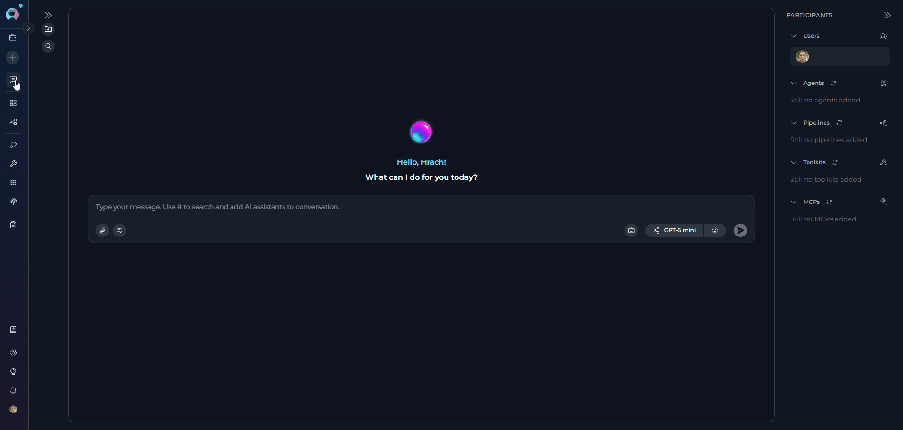


    !!! example "Example Chat Usage:"
        - "List all files in the 'Shared Documents' library"
        - "Read the content of the project proposal at /sites/Marketing/Shared Documents/Q3 Proposal.docx"
        - "Show me all items in the 'Project Tasks' list"
        - "Create a new item in the 'Bug Reports' list with Title 'Login page error' and Status 'Open'"

---

## Instructions and Prompts for Using the SharePoint Toolkit

To effectively instruct your ELITEA Agent to use the SharePoint toolkit, you need to provide clear and precise instructions within the Agent's "Instructions" field. These instructions guide the Agent on *when* and *how* to use the available SharePoint tools to achieve your desired automation goals.

### Instruction Creation for Agents

When crafting instructions for the SharePoint toolkit, especially for OpenAI-based Agents, clarity and precision are paramount. Break down complex tasks into a sequence of simple, actionable steps. Explicitly define all parameters required for each tool and guide the Agent on how to obtain or determine the values for these parameters. Effective instructions are:

*   **Direct and Action-Oriented:** Use strong action verbs and clear commands. For example, "Use the 'get_files_list' tool...", "Read the document at...", "Create a list item in...".

*   **Parameter-Centric:** Clearly enumerate each parameter required by the tool. For each parameter, specify:
    *   Its name (exactly as expected by the tool)
    *   The format or type of value expected
    *   How the Agent should obtain the value — whether from user input, from previous steps, or as a predefined value

*   **Contextually Rich:** Provide sufficient context so the Agent understands the overall objective and the scenario in which each SharePoint tool should be applied.

*   **Step-by-Step Structure:** Organize instructions into a numbered or bulleted list for complex workflows to help the Agent follow a logical sequence.

*   **Add Conversation Starters:** Include example conversation starters that users can use to trigger this functionality. For example, "Conversation Starters: 'List the files in the marketing folder', 'What's in the Q3 report?'"

When instructing your Agent to use a SharePoint toolkit tool, follow this structured pattern:

1. **State the Goal:** Clearly state the objective for this step.
2. **Specify the Tool:** Clearly indicate which SharePoint tool to use.
3. **Define Parameters:** List all required parameters with their values or how to obtain them.
4. **Describe Expected Outcome (Optional but Recommended):** Briefly describe the expected result.
5. **Add Conversation Starters:** Include examples that users can use.

    !!! example "Example Agent Instructions"
        **Agent Instructions for Reading a List and Summarizing Tasks:**

        ```markdown
        1. Goal: Retrieve all items from the 'Project Tasks' SharePoint list and summarize the current workload.
        2. Tool: Use the "read_list" tool.
        3. Parameters:
           - list_title: "Project Tasks"
           - limit: 200 (or as needed)
        4. Outcome: The Agent will retrieve all task items and produce a summary grouped by status
           (e.g., Not Started, In Progress, Completed), highlighting any overdue tasks.
        5. Conversation Starters: "Show me the project task summary", "What tasks are currently in progress?"
        ```

---

### Chat Usage Examples by Tool Category

The following examples demonstrate how to interact with the SharePoint toolkit in ELITEA Chat, organized by functional categories.

??? example "File Operations - Get All Files"

    **Chat Example:**
    ```
    User: "List all files in the Shared Documents library."

    Agent Response: I'll retrieve the file list from your SharePoint document library.

    [Agent uses get_files_list tool]

    📁 Files in Shared Documents (12 total):

    1. Q3 Financial Report.xlsx
       - Path: /sites/MarketingTeam/Shared Documents/Q3 Financial Report.xlsx
       - Modified: 2026-03-01
    2. Project Proposal - Alpha.docx
       - Path: /sites/MarketingTeam/Shared Documents/Project Proposal - Alpha.docx
       - Modified: 2026-02-28
    3. Team Roster.xlsx
       - Path: /sites/MarketingTeam/Shared Documents/Team Roster.xlsx
       - Modified: 2026-02-15

    Would you like me to read the content of any of these documents?
    ```

??? example "File Operations - Read Document"

    **Chat Example:**
    ```
    User: "Read the content of the Q3 Financial Report."

    Agent Response: I'll retrieve the document content for you.

    [Agent uses read_document tool with path="/sites/MarketingTeam/Shared Documents/Q3 Financial Report.xlsx"]

    📄 Q3 Financial Report.xlsx - Contents:

    Sheet: Summary

    Quarter | Revenue    | Expenses   | Net Profit
    Q1 2026 | $1,200,000 | $950,000   | $250,000
    Q2 2026 | $1,350,000 | $1,020,000 | $330,000
    Q3 2026 | $1,480,000 | $1,100,000 | $380,000

    Would you like me to analyze these figures or compare them with another period?
    ```

??? example "File Operations - Upload File"

    **Chat Example:**
    ```
    User: "Upload the meeting notes from artifact storage to the 'Meeting Notes' folder."

    Agent Response: I'll upload the file to your SharePoint document library.

    [Agent uses upload_file tool]

    ✔️ File uploaded successfully!
    - File: MeetingNotes_2026-03-10.docx
    - Location: /sites/MarketingTeam/Shared Documents/Meeting Notes/
    - Size: 45 KB

    The file is now available in the Meeting Notes folder on your SharePoint site.
    ```

??? example "List & Data Operations - Get Lists"

    **Chat Example:**
    ```
    User: "What lists are available on the SharePoint site?"

    Agent Response: Let me retrieve all visible lists from your SharePoint site.

    [Agent uses get_lists tool]

    📋 Available SharePoint Lists (6 total):

    1. Project Tasks — 142 items
    2. Bug Reports — 87 items
    3. Team Contacts — 34 items
    4. Meeting Agenda — 23 items
    5. Announcements — 12 items
    6. Vendor Contracts — 9 items

    Which list would you like to read or work with?
    ```

??? example "List & Data Operations - Read List"

    **Chat Example:**
    ```
    User: "Show me all open bug reports from the Bug Reports list."

    Agent Response: I'll retrieve the items from the Bug Reports list.

    [Agent uses read_list tool]

    🐛 Bug Reports — Open Items (14 total):

    1. BUG-0051: Login page times out on mobile
       - Status: Open | Priority: High | Assigned To: @alexdev
    2. BUG-0049: Export to CSV produces empty file
       - Status: In Review | Priority: Medium | Assigned To: @sara
    3. BUG-0047: Dashboard chart renders incorrectly in Firefox
       - Status: Open | Priority: Low | Assigned To: Unassigned

    Would you like me to create a summary report or filter by assignee?
    ```

??? example "List & Data Operations - Create List Item"

    **Chat Example:**
    ```
    User: "Create a new task: 'Review Q3 report', assigned to Maria, due April 1st, status Not Started."

    Agent Response: I'll create the new task in the Project Tasks list.

    [Agent uses get_list_columns tool first, then create_list_item tool]

    ✔️ Task created successfully!
    - Title: Review Q3 report
    - Assigned To: Maria
    - Due Date: 2026-04-01
    - Status: Not Started
    - Item ID: 143

    The task is now visible in the Project Tasks list on your SharePoint site.
    ```

??? example "Indexing & Search - Search Index"

    **Chat Example:**
    ```
    User: "Search the indexed SharePoint documents for anything related to 'budget approval process'."

    Agent Response: I'll search the indexed SharePoint content for budget approval process references.

    [Agent uses search_index tool]

    🔍 Search Results for "budget approval process" (5 matches):

    1. Budget_Policy_2026.docx — /sites/Finance/Shared Documents/Policies/
       Excerpt: "...all budget approvals above $10,000 must follow the standard approval workflow..."

    2. Q1 Review Notes.docx — /sites/Finance/Shared Documents/Meeting Notes/
       Excerpt: "...the budget approval process was revised in January to require two sign-offs..."

    3. Finance Procedures.xlsx — /sites/Finance/Shared Documents/Procedures/
       Excerpt: "...Sheet 'Approvals': defines the budget approval matrix by department..."

    Would you like me to read any of these documents in full?
    ```

---

## Troubleshooting

??? warning "Credential Not Appearing in Toolkit Configuration"
    **Problem:** When creating a toolkit, your SharePoint credential doesn't appear in the credentials dropdown.

    **Troubleshooting Steps:**

    1. **Check Credential Scope:** Ensure you are working in the same workspace/project where the credential was created. Private credentials are only visible in your Private workspace, while project credentials are visible within the specific team project.
    2. **Verify Credential Creation:** Go to the Credentials menu and confirm that your SharePoint credential was successfully saved.
    3. **Credential Type Match:** Ensure you selected **"SharePoint"** as the credential type when creating the credential.

??? warning "Connection Errors"
    **Problem:** ELITEA Agent fails to establish a connection with SharePoint, resulting in errors during toolkit execution.

    **Troubleshooting Steps:**

    1. **Verify Site URL Format:** Ensure the SharePoint Site URL follows the exact format `https://<tenant>.sharepoint.com/sites/<site>`. The URL must start with `https://` and contain `.sharepoint.com`. Remove any trailing slashes.
    2. **Check Client ID:** Double-check that the **Application (client) ID** is entered correctly, matching the value on the Azure AD app registration Overview page.
    3. **Check Client Secret:** Ensure the **Client Secret Value** (not the Secret ID) is accurate and has not expired. If the secret has expired, generate a new one in Azure AD.
    4. **Verify App-Only Access (App-Only mode only):** If using App-Only (Client Credentials) authentication, confirm that you completed the `AppInv.aspx` step to grant App-Only access to the SharePoint site collection. Without this step, authentication tokens will be issued but access to the site will be denied. This step is **not required** for Delegated (User OAuth) mode.
    5. **Network Connectivity:** Confirm that your ELITEA environment can reach SharePoint over the internet with no firewall or proxy blocking the connection.

??? warning "OAuth Login Fails with 'No Reply Address Is Registered' Error"
    **Problem:** When clicking **Log in** during Delegated credential setup, the OAuth flow fails with an error such as:
    > *AADSTS500113: No reply address is registered for the application.*

    **Cause:** This error occurs when no Redirect URI has been registered in your Azure AD App Registration. Azure AD requires the redirect URI to be explicitly registered before it will send the authorization response back to ELITEA.

    **Troubleshooting Steps:**

    1. **Open your App Registration:** In the [Azure Portal](https://portal.azure.com), go to **Microsoft Entra ID → App registrations** and select your app.
    2. **Navigate to Authentication:** In the left menu, click **"Authentication"**.
    3. **Add a Redirect URI:** If no Web platform exists, click **"+ Add a platform"** → **"Web"**. If Web is already listed, click the **Edit** pencil next to it.
    4. **Enter the ELITEA callback URL:** In the **"Redirect URIs"** field, enter the ELITEA callback URL for your instance (e.g., `https://next.elitea.ai/app/mcp-auth-callback`). Contact your ELITEA administrator to confirm the exact URI for your deployment.
    5. **Save:** Click **"Configure"** (or **"Save"** if editing), then click **"Save"** at the top of the page.
    6. **Retry the OAuth flow:** Return to your ELITEA SharePoint credential and click **Log in** again.

    !!! note
        This step is only required for **Delegated (User OAuth)** mode. App-Only (Client Credentials) authentication does not use a redirect URI.

??? warning "Authorization Errors (Permission Denied / Unauthorized)"
    **Problem:** Agent execution fails with "Permission Denied", "Unauthorized", or "403 Forbidden" errors when accessing SharePoint resources.

    **Troubleshooting Steps:**

    1. **Verify API Permissions:** Double-check the API permissions granted in Azure AD. Ensure at minimum `Sites.Read.All` (Microsoft Graph) is granted and admin consent has been applied.
    2. **Verify App-Only Permissions on the Site:** Check that the `AppInv.aspx` step was completed for the specific site collection. App-only permissions must be granted per site collection.
    3. **Check Permission Level:** If your Agent requires write operations (upload files, create list items), ensure you granted `Sites.ReadWrite.All` (Graph) and that the AppInv.aspx XML specifies `Right="Write"` or `Right="FullControl"`.
    4. **Token or Secret Expiry:** Ensure the Client Secret has not expired. Generate a new secret in Azure AD and update your ELITEA credential.

??? warning "Incorrect Library or List Name"
    **Problem:** Agent tools fail to operate on the intended SharePoint document library or list, with "not found" or empty results.

    **Troubleshooting Steps:**

    1. **Check Library/List Title:** Verify you are using the exact title of the document library or list as it appears in SharePoint. Titles must be spelled correctly.
    2. **Use `get_lists` First:** Run the `get_lists` tool to retrieve the exact title of all visible lists on your site before attempting to read a specific one.
    3. **Use `get_files_list` Without Filters:** Call `get_files_list` without specifying a folder to list all files and discover the correct library and path names.
    4. **Verify the Site URL:** Confirm the Site URL in your credential points to the root of the site collection where the target library or list lives.

??? warning "File Path Errors When Reading Documents"
    **Problem:** The `read_document` tool returns "File not found" even though the file exists.

    **Troubleshooting Steps:**

    1. **Use Server-Relative Path:** The `path` parameter for `read_document` must be a server-relative path (e.g., `/sites/MySite/Shared Documents/folder/file.docx`), not a full URL.
    2. **Retrieve Path from `get_files_list`:** Use `get_files_list` first. Each result includes a `Path` field containing the correct server-relative path to use with `read_document`.
    3. **Check for Special Characters:** Use the raw path as returned by `get_files_list` — do not URL-encode it when passing it to `read_document`.

??? warning "Create List Item Fails with Field Errors"
    **Problem:** The `create_list_item` tool returns errors about invalid fields or missing required fields.

    **Troubleshooting Steps:**

    1. **Call `get_list_columns` First:** Always call `get_list_columns` before `create_list_item` to discover available fields, their internal names, required flags, and valid choice values for the target list.
    2. **Use Internal Field Names:** The `fields` dictionary must use the **internal field name** (the `name` property returned by `get_list_columns`), not the display label.
    3. **Choice Field Values:** For choice fields, the value must exactly match one of the allowed choices returned by `get_list_columns`.
    4. **DateTime Format:** Use ISO 8601 format for date fields: `2026-04-01T00:00:00Z`.

??? warning "OneNote Tools Return 'Graph API Delegated Access Required' Error"
    **Problem:** OneNote tool calls fail with the message: *"OneNote operations require Graph API delegated access. Provide token + scopes to enable OneNote support."*

    **Cause:** All OneNote tools exclusively use the Microsoft Graph API with a delegated user token. They are not available when using App-Only (Client Credentials) authentication.

    **Troubleshooting Steps:**

    1. **Switch to Delegated credential:** In ELITEA, navigate to your SharePoint credential and switch to the **Delegated** tab.
    2. **Configure OAuth Discovery Endpoint:** Enter `https://login.microsoftonline.com/{tenant_id}` using your Directory (tenant) ID.
    3. **Configure Scopes:** Enter the required scopes: `Sites.ReadWrite.All Files.ReadWrite.All Lists.ReadWrite.All Notes.ReadWrite.All`.
    4. **Complete the OAuth flow:** Click **Log in** to authorize. Once authorized with Delegated credentials, all OneNote tools become available.

??? warning "OneNote Tools Return 401 Unauthorized Error"
    **Problem:** OneNote tool calls succeed with Delegated credentials but return a `401 Unauthorized` response from `graph.microsoft.com/.../onenote/...`.

    **Cause:** The OAuth token was issued without the `Notes.ReadWrite.All` delegated permission — either the scope was never added to the Azure AD app, admin consent was not granted, or the token was issued before the scope was added.

    **Troubleshooting Steps:**

    1. **Add the Notes permission in Azure AD:** In the [Azure Portal](https://portal.azure.com), go to **Microsoft Entra ID → App registrations → [your app] → API permissions**. Click **"+ Add a permission"** → **"Microsoft Graph"** → **"Delegated permissions"**, search for `Notes.ReadWrite.All`, and add it.
    2. **Grant admin consent:** On the API permissions page, click **"Grant admin consent for [Your Organization]"**. The `Notes.ReadWrite.All` entry must show a green checkmark.
    3. **Update the Scopes field in your ELITEA credential** to include all required OneNote scopes. Use the full URL format:
        ```
        https://graph.microsoft.com/Sites.ReadWrite.All https://graph.microsoft.com/Files.ReadWrite.All https://graph.microsoft.com/Notes.ReadWrite.All
        ```
    4. **Re-login:** Click **Log in** again in your ELITEA SharePoint credential to obtain a fresh token that includes the `Notes.ReadWrite.All` scope.

    !!! note "Required OneNote Scopes"
        The following scopes are required for OneNote indexing and tool operations:

        | **Scope** | **Purpose** |
        |-----------|-------------|
        | `Notes.ReadWrite.All` | Read and write access to all OneNote notebooks and pages |
        | `Sites.ReadWrite.All` | Access to the SharePoint site where notebooks are hosted |
        | `Files.ReadWrite.All` | Access to files referenced from OneNote pages |

    !!! note "Short vs. Full URL scope format"
        The ELITEA credential accepts scopes in both short (`Notes.ReadWrite.All`) and full URL (`https://graph.microsoft.com/Notes.ReadWrite.All`) formats. If short-format scopes do not resolve for your tenant, switch to the full URL format.

### Support Contact

If you encounter issues not covered in this guide or need additional assistance with SharePoint integration, please refer to **[Contact Support](../../support/contact-support.md)** for detailed information on how to reach the ELITEA Support Team.

---

## FAQ

??? question "Can I use my regular SharePoint username and password instead of an Azure AD App Registration?"
    **No — using an Azure AD App Registration with a Client Secret is the required and recommended method.** It provides secure App-Only access without exposing user credentials. The ELITEA SharePoint toolkit authenticates using the OAuth 2.0 client credentials flow (`client_id` + `client_secret` + `site_url`) and does not support username/password authentication.

??? question "What are the required credential fields for the SharePoint toolkit?"
    The required fields depend on the authentication mode:

    **App-Only (Client Credentials)** — three fields:

    * **Client ID** — The Application (client) ID from your Azure AD app registration.
    * **Client Secret** — The client secret value generated in Azure AD.
    * **Site URL** — The full URL of your SharePoint site in the format `https://<tenant>.sharepoint.com/sites/<site>`.

    **Delegated (User OAuth)** — five fields:

    * **Client ID**, **Client Secret**, and **Site URL** — same as above.
    * **OAuth Discovery Endpoint** — Azure AD base URL in the format `https://login.microsoftonline.com/{tenant_id}`.
    * **Scopes** — Space-separated OAuth permission scopes, e.g. `Sites.ReadWrite.All Files.ReadWrite.All Lists.ReadWrite.All`.

    For App-Only, the tenant is derived automatically from the Site URL; you do not need to enter it separately.

??? question "Do I need to complete the AppInv.aspx step even if I already granted Microsoft Graph permissions in Azure AD?"
    **Yes.** The Azure AD API permissions (Microsoft Graph `Sites.Read.All`, etc.) and the SharePoint App-Only access via `AppInv.aspx` are two separate authorization layers. Graph permissions allow the app to call the Microsoft Graph API, while `AppInv.aspx` grants the app direct access to the specific SharePoint site collection via the SharePoint REST API. The ELITEA toolkit uses the SharePoint REST API as its primary method and falls back to Graph API. Both steps are required for full functionality.

    **Important:** App-Only credentials will authenticate successfully (obtain a token) but receive **Access Forbidden (403)** responses from SharePoint unless the `AppInv.aspx` site collection grant has been completed. Authentication ≠ authorization — the token is issued, but access is denied until the site-level grant is in place.

??? question "Do I need to register a Redirect URI for the Delegated auth flow?"
    **Yes — for the Delegated (User OAuth) mode only.** The OAuth 2.0 authorization code flow requires that the ELITEA redirect URI is registered in your Azure AD App Registration under **Authentication → Redirect URIs**. Without it, Azure AD will reject the authorization request with `AADSTS500113: No reply address is registered`. This step is **not required** for App-Only (client credentials) authentication.

    You can set it during app registration (step 4 in [Registering an App](#registering-an-app-in-azure-active-directory-azure-ad)) or add it later to an existing registration:

    1. In the **[Azure Portal](https://portal.azure.com)**, go to **Microsoft Entra ID → App registrations** and select your app.
    2. In the left menu, click **"Authentication"**.
    3. If no Web platform exists yet, click **"+ Add a platform"** → **"Web"**. If Web already exists, click the **Edit** pencil next to it.
    4. In the **"Redirect URIs"** field, enter the ELITEA callback URL for your instance (e.g., `https://next.elitea.ai/app/mcp-auth-callback`). Contact your ELITEA administrator to confirm the exact URI for your deployment.
    5. Click **"Configure"** (or **"Save"** if editing), then click **"Save"** at the top of the page.
    6. Scroll down to verify the URI appears under **Web → Redirect URIs**.

??? question "How do I find my Directory (Tenant) ID?"
    The **Directory (tenant) ID** is needed for the **OAuth Discovery Endpoint** field in Delegated credentials. You can find it in two places:

    **Option 1 — Microsoft Entra ID Overview:**
    1. In the **[Azure Portal](https://portal.azure.com)**, search for **"Microsoft Entra ID"** and select it.
    2. On the **Overview** page, copy the **"Tenant ID"** value.

    **Option 2 — App Registration Overview:**
    1. In the Azure Portal, go to **Microsoft Entra ID → App registrations** and select your app.
    2. On the **Overview** page, copy the **"Directory (tenant) ID"** value.

    Use the Tenant ID in the **OAuth Discovery Endpoint** field as:
    ```
    https://login.microsoftonline.com/{tenant_id}
    ```

??? question "What is the correct format for the Site URL in the SharePoint credential?"
    The Site URL must follow the format `https://<tenant>.sharepoint.com/sites/<site>`:

    * ✔️ `https://contoso.sharepoint.com/sites/MarketingTeam`
    * ✔️ `https://epam.sharepoint.com/sites/EPAMAlitaDoc`
    * ✘ `https://contoso.sharepoint.com` (missing `/sites/<site>`)
    * ✘ `contoso.sharepoint.com/sites/Marketing` (missing `https://`)
    * ✘ `https://contoso.sharepoint.com/sites/Marketing/` (trailing slash)

??? question "Which tools require PgVector and an Embedding Model?"
    The six indexing and semantic search tools require both a PgVector configuration and an Embedding Model to be selected in the toolkit settings:

    * **Index data** — Indexes documents into the vector store.
    * **List collections** — Lists available indexed collections.
    * **Remove index** — Removes an indexed collection.
    * **Search index** — Searches the vector index semantically.
    * **Stepback search index** — Contextual search with broader scope.
    * **Stepback summary index** — Generates summaries from indexed content.

    The other tools (`get_files_list`, `read_document`, `read_list`, `get_lists`, `get_list_columns`, `create_list_item`, `upload_file`, `add_attachment_to_list_item`) work without a vector database configuration.

??? question "Do OneNote tools work with App-Only (Client Credentials) mode?"
    **No.** All OneNote tools (`onenote_get_notebooks`, `onenote_get_sections`, `onenote_get_pages`, `onenote_get_page_content`, `onenote_read_page`, `onenote_read_page_items`, `onenote_list_attachments`, `onenote_read_attachment`, `onenote_create_notebook`, `onenote_create_section`, `onenote_create_page`, `onenote_update_page`, `onenote_replace_page_content`, `onenote_delete_page`, `onenote_search_pages`) require **Delegated (User OAuth)** authentication. They communicate exclusively with the Microsoft Graph API using a user-context access token and will return an error when called with App-Only credentials.

    To use OneNote tools:
    1. Configure your SharePoint credential using the **Delegated** tab.
    2. Set the **OAuth Discovery Endpoint** to `https://login.microsoftonline.com/{tenant_id}`.
    3. Set **Scopes** to include at minimum: `Sites.ReadWrite.All Files.ReadWrite.All Lists.ReadWrite.All Notes.ReadWrite.All`.
    4. Complete the OAuth **Log in** flow to authorize.

??? question "Can I use the same SharePoint credential across multiple toolkits?"
    **Yes.** One SharePoint credential can be used by multiple SharePoint toolkits. Each toolkit can target the same site with different tools enabled, or you can create separate toolkits for different use cases (e.g., one for document reading, another for list management) while sharing the same credential.

??? question "Can I use the same toolkit across different workspaces (Private vs. Team Projects)?"
    Credential and toolkit visibility depends on where they are created:

    * **Private Workspace:** Credentials and toolkits are only visible to you.
    * **Team Project Workspace:** Credentials and toolkits are visible to all project members.

    **Best Practice:** Use Private workspace credentials for personal testing and Team Project credentials for shared, production use.

??? question "Why is `create_list_item` failing with a validation error?"
    The most common cause is using the wrong field name or an invalid choice value. Always call `get_list_columns` on the target list first — this returns each column's internal name (`name` field), its type, required flag, and valid choices. Use the internal name (not the display label) as the key in the `fields` dictionary passed to `create_list_item`.

??? question "Why am I consistently encountering 'Permission Denied' errors even though I believe I configured everything correctly?"
    Systematically re-examine the following:

    **1. App-Only Access via AppInv.aspx:**
    Confirm you completed the `AppInv.aspx` step for the exact site collection specified in your Site URL. App-Only permissions granted on one site collection do not apply to sub-sites or other site collections.

    **2. Azure AD Admin Consent:**
    Verify that admin consent was granted for the API permissions in Azure AD. Without admin consent, application permissions have no effect.

    **3. Client Secret Validity:**
    Check that the Client Secret has not expired. Review the expiration date in Azure AD under Certificates & Secrets and regenerate if needed.

    **4. Site URL Accuracy:**
    Confirm the Site URL in your ELITEA credential exactly matches the site collection where App-Only access was granted.

    **5. Permission Level:**
    If the error occurs on write operations (upload, create item), verify that `Right="FullControl"` or `Right="Write"` was specified in the AppInv.aspx XML — `Right="Read"` is insufficient for write operations.

---

!!! reference "Useful ELITEA Resources"
    To further enhance your understanding and skills in using the SharePoint toolkit with ELITEA, here are helpful internal resources:

      * **[How to Use Chat Functionality](../../how-tos/chat-conversations/how-to-use-chat-functionality.md)** — *Complete guide to using ELITEA Chat with toolkits for interactive SharePoint operations.*
      * **[Create and Edit Agents from Canvas](../../how-tos/chat-conversations/how-to-create-and-edit-agents-from-canvas.md)** — *Learn how to quickly create and edit agents directly from chat canvas for rapid prototyping and workflow automation.*
      * **[Create and Edit Toolkits from Canvas](../../how-tos/chat-conversations/how-to-create-and-edit-toolkits-from-canvas.md)** — *Discover how to create and configure SharePoint toolkits directly from the chat interface.*
      * **[Create and Edit Pipelines from Canvas](../../how-tos/chat-conversations/how-to-create-and-edit-pipelines-from-canvas.md)** — *Guide to building and modifying pipelines from chat canvas for automated SharePoint workflows.*
      * **[Indexing Overview](../../how-tos/indexing/indexing-overview.md)** — *Comprehensive guide to understanding ELITEA's indexing capabilities for enhanced search and discovery.*
      * **[Index SharePoint Data](../../how-tos/indexing/index-sharepoint-data.md)** — *Detailed instructions for indexing SharePoint document library data to enable advanced semantic search.*

---

!!! reference "External Resources"
    *   **Azure Portal:** [https://portal.azure.com](https://portal.azure.com) — *Manage your Azure AD App Registrations, API permissions, and Client Secrets.*
    *   **Azure AD App Registrations:** [https://portal.azure.com/#blade/Microsoft_AAD_RegisteredApps/ApplicationsListBlade](https://portal.azure.com/#blade/Microsoft_AAD_RegisteredApps/ApplicationsListBlade) — *View and manage your registered applications in Azure Active Directory.*
    *   **Microsoft Graph Permissions Reference:** [https://learn.microsoft.com/en-us/graph/permissions-reference](https://learn.microsoft.com/en-us/graph/permissions-reference) — *Detailed reference for Microsoft Graph API permission scopes.*
    *   **SharePoint REST API Reference:** [https://learn.microsoft.com/en-us/sharepoint/dev/sp-add-ins/get-to-know-the-sharepoint-rest-service](https://learn.microsoft.com/en-us/sharepoint/dev/sp-add-ins/get-to-know-the-sharepoint-rest-service) — *Official documentation for the SharePoint REST API.*
    *   **Microsoft SharePoint:** [https://www.microsoft.com/en-us/microsoft-365/sharepoint/collaboration](https://www.microsoft.com/en-us/microsoft-365/sharepoint/collaboration) — *Main Microsoft SharePoint product page.*
---


