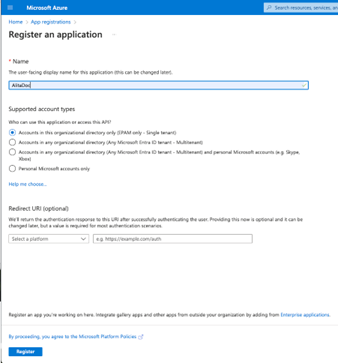
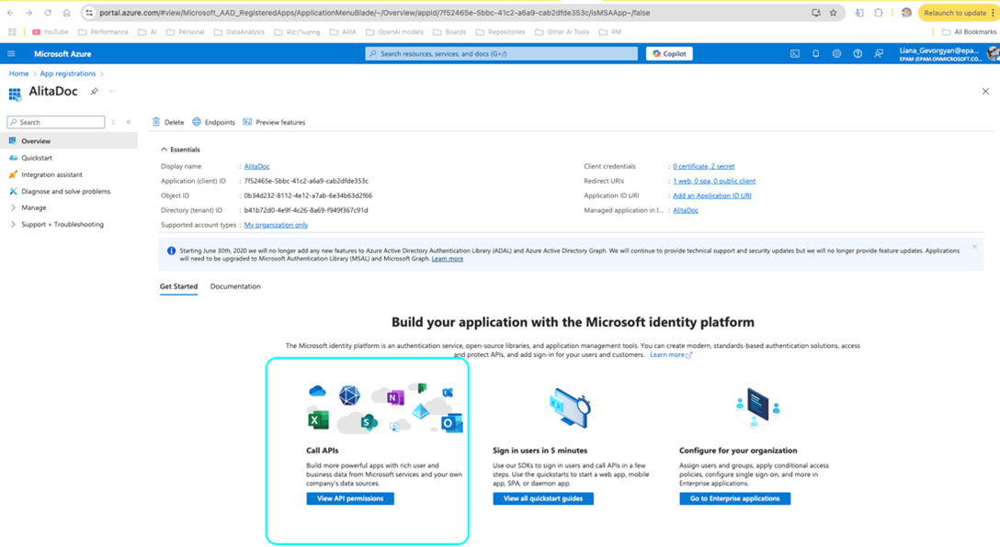
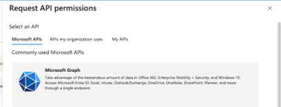
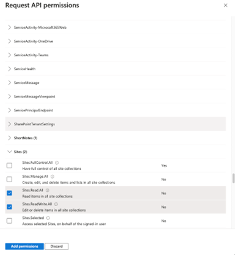
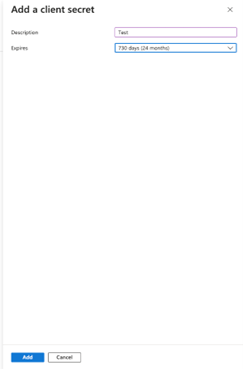
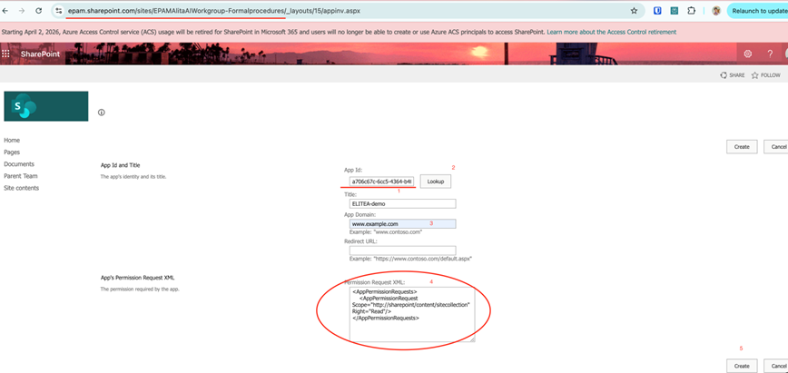
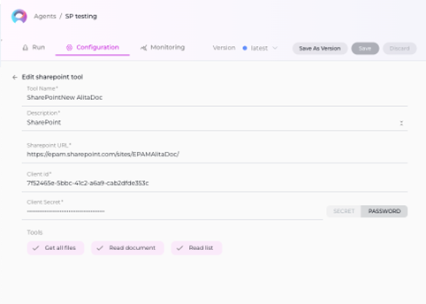

# ELITEA Toolkit Guide: SharePoint Integration

## Introduction

### Purpose of the Guide

This guide is your definitive resource for integrating and effectively utilizing the **SharePoint toolkit** within ELITEA. It provides a detailed, step-by-step walkthrough, from registering your SharePoint application in Azure Active Directory to configuring the toolkit in ELITEA and seamlessly incorporating it into your Agents. By following this guide, you will unlock the power of automated document management, streamlined collaboration workflows, and enhanced information access, all directly within the ELITEA platform. This integration empowers you to leverage AI-driven automation to optimize your SharePoint-driven workflows, enhance team productivity, and improve information management within your organization.

### Brief Overview of Microsoft SharePoint

Microsoft SharePoint is a powerful web-based collaboration and document management platform that enables organizations to create websites, document libraries, lists, and other collaborative resources. It is a cornerstone of modern digital workplaces, facilitating teamwork, information sharing, and workflow automation. Key features of SharePoint include:

*   **Centralized Document Management:** SharePoint provides a central repository for storing, organizing, and managing documents, ensuring version control, secure access, and efficient document retrieval. Document libraries in SharePoint offer features like check-in/check-out, version history, and metadata tagging for robust document lifecycle management.
*   **Collaborative Workspaces and Team Sites:** SharePoint enables the creation of team sites and collaboration workspaces, providing teams with a shared platform for communication, document sharing, task management, and project collaboration. Team sites facilitate teamwork and information sharing within project teams and departments.
*   **Customizable Lists and Libraries:** SharePoint lists and libraries are highly customizable and can be tailored to meet specific business needs. Lists can be used to track tasks, manage contacts, or create custom data tables, while libraries can be structured to organize various types of documents and media.
*   **Workflow Automation:** SharePoint supports workflow automation through Power Automate and SharePoint workflows, allowing organizations to automate business processes, streamline approvals, and automate document-centric workflows, improving efficiency and reducing manual tasks.
*   **Enterprise Search Capabilities:** SharePoint offers robust enterprise search capabilities, enabling users to quickly find relevant information across SharePoint sites, document libraries, lists, and other content sources, improving information discovery and knowledge sharing.

Integrating SharePoint with ELITEA brings these powerful collaboration and document management capabilities directly into your AI-driven workflows. Your ELITEA Agents can then intelligently interact with your SharePoint sites, lists, and libraries to automate document-related tasks, enhance collaboration processes, and improve information accessibility through AI-powered automation.

## Toolkit's Account Setup and Configuration in SharePoint

### Registering an App in Azure Active Directory (Azure AD)

To enable secure integration between ELITEA and SharePoint, you need to register an application in Azure Active Directory (Azure AD). This app registration will represent ELITEA and allow it to authenticate and access SharePoint resources.

1.  **Access Azure Portal:** Open your web browser and navigate to the [Azure Portal](https://portal.azure.com/) and log in using an account with sufficient permissions to register applications in Azure AD.
2.  **Navigate to App Registrations:** In the Azure portal, use the search bar at the top to search for "App registrations" and select **"App registrations"** from the search results under "Services".
3.  **Create New Registration:** On the "App registrations" page, click on **"+ New registration"**.
 
    

4.  **Configure App Registration Details:** On the "Register an application" page, provide the following information:
    *   **Name:** Enter a meaningful and descriptive name for your application registration. For example, use "ELITEA SharePoint Integration" or "ELITEA Agent Access to SharePoint". This name will help you identify the purpose of this app registration later.
    *   **Supported account types:** Select the appropriate account type based on your organization's requirements. In most cases, **"Accounts in this organizational directory only (\[Your Organization Name] only - Single tenant)"** is the recommended option for internal organizational use. If you need to access SharePoint resources across multiple organizations, you may need to select a different option.
    *   **Redirect URI (Optional):** You do not need to configure a Redirect URI for this integration as ELITEA will be authenticating as an application without user interaction. Leave the "Redirect URI" field blank.
5.  **Register Application:** After providing the application details, click the **"Register"** button at the bottom of the page to create the app registration.
 
    

6.  **Note Application Credentials:** Once the app registration is created successfully, you will be redirected to the application's "Overview" page. **Note down the following credentials from this page, as you will need them to configure the SharePoint toolkit in ELITEA:**
    *   **Application (client) ID:** This is the unique identifier for your registered application. Copy and store this value securely.
    *   **Directory (tenant) ID:** This is the unique identifier for your Azure AD tenant (your organization's Azure AD instance). Copy and store this value securely.

    

### Configure API Permissions for the Registered App

To allow ELITEA to access SharePoint resources, you need to configure API permissions for your registered application. This involves granting the application the necessary permissions to interact with Microsoft Graph and SharePoint APIs.

1.  **Navigate to API Permissions:** In your registered app within the Azure portal, navigate to the left-hand menu and click on **"API permissions"**.

    

2.  **Add Permissions:** On the "API permissions" page, click on **"+ Add a permission"**.

    

3.  **Select API Type - Microsoft Graph:** In the "Request API permissions" panel, select the **"Microsoft Graph"** API tile. Microsoft Graph provides access to various Microsoft 365 services, including SharePoint.
4.  **Select Permission Type - Application permissions:** Choose **"Application permissions"** as the permission type. Application permissions are used when the application acts without a signed-in user, which is the case for ELITEA's SharePoint integration.
5.  **Add Microsoft Graph Scopes:** In the "Application permissions" section, use the search bar to search for and select the following scopes. These scopes grant ELITEA Agents the necessary permissions to access SharePoint resources through Microsoft Graph:
    *   **`Sites.Read.All`**: Allows the application to read site collections and list all sites, lists, and libraries in all site collections without a signed-in user.
    *   **`Sites.ReadWrite.All`**: Allows the application to read and write site collections and list all sites, lists, and libraries in all site collections without a signed-in user. **Note:** Grant this scope only if your ELITEA Agents need to modify SharePoint content (e.g., create or update files). If you only need read-only access, only grant `Sites.Read.All`.

    

6.  **Add Permissions - SharePoint API:** Click **"+ Add a permission"** again to add SharePoint-specific permissions. This time, in the "Request API permissions" panel, select the **"SharePoint"** API tile (you may need to scroll down to find it).
7.  **Select Permission Type - Application permissions:** Choose **"Application permissions"** as the permission type again.
8.  **Add SharePoint Scopes:** In the "Application permissions" section for SharePoint API, use the search bar to search for and select the following scopes. These scopes grant ELITEA Agents direct SharePoint-specific access:
    *   **`Sites.FullControl.All`**: Allows the application to have full control of all site collections without a signed-in user. **Important Security Note:** Grant this scope with caution and only if absolutely necessary, as it provides extensive permissions. For most use cases, more granular scopes through Microsoft Graph are sufficient and recommended for better security.

    

    

9.  **Add Permissions:** After selecting the necessary scopes for both Microsoft Graph and SharePoint APIs, click the **"Add permissions"** button at the bottom of the "Request API permissions" panel to add the selected permissions to your application registration.
10. **Grant Admin Consent:** On the "API permissions" page, you will see the newly added permissions listed. Click the **"Grant admin consent for \[Your Organization Name]"** button and then click **"Yes"** to grant admin consent for these permissions. **Admin consent is required for application permissions to take effect.**



**Note:** If you are unable to obtain admin consent for application permissions, you can use **delegated permissions** instead. This allows ELITEA to access SharePoint resources on behalf of the signed-in user. For example, this approach can be used when integrating with EPAM SharePoint pages.


### Configure the Client Secret

To securely authenticate your ELITEA Agents with SharePoint, you need to create a Client Secret for your registered application. The Client Secret acts as a password for your application when authenticating with Azure AD.

1.  **Navigate to Certificates & secrets:** In your registered app within the Azure portal, navigate to the left-hand menu and click on **"Certificates & secrets"**.

    

2.  **Create New Client Secret:** On the "Certificates & secrets" page, click on **"Client secrets"** tab (if not already selected) and then click **"+ New client secret"**.

    

3.  **Configure Client Secret Details:** In the "Add a client secret" panel:
    *   **Description:** Enter a descriptive name for your client secret. For example, use "ELITEA Integration Client Secret" or "SharePoint Access Secret." This description will help you identify the purpose of this client secret later.
    *   **Expiration:** Choose an appropriate expiration period for the client secret from the "Expires" dropdown. For security best practices, it is recommended to set an expiration period and rotate client secrets regularly.
4.  **Add Client Secret:** Click the **"Add"** button at the bottom of the "Add a client secret" panel to create the client secret.
5.  **Securely Copy and Store Client Secret Value:** **Immediately copy the generated Client Secret Value** that is displayed in the "Client secrets" page. **This is the only time you will see the full Client Secret Value.**  **Important Security Note:** Store the Client Secret Value securely in a password manager or, preferably, ELITEA's built-in Secrets Management feature. **Do not store the Client Secret Value in plain text or in insecure locations.** You will need this Client Secret Value to configure the SharePoint toolkit in ELITEA.  **Note:** Take note of the **"Value"** column, not the "Secret ID" column. The "Value" is the actual client secret, while "Secret ID" is just an identifier for the secret itself.


### Granting Access Scope to SharePoint Site (App-Only Access)

To enable ELITEA Agents to access and interact with your SharePoint site and its content, you need to grant specific access permissions to your registered application at the SharePoint site collection level. This is done using the SharePoint App-Only Access via the `AppInv.aspx` page in the SharePoint Admin Center.

1.  **Navigate to SharePoint Site AppInv.aspx Page:** Open your web browser and navigate to the following URL, replacing `{your-tenant}` and `{site}` with your actual SharePoint tenant name and site name:

    

    ```
    https://{your-tenant}.sharepoint.com/sites/{site}/_layouts/15/appinv.aspx
    ```

    *   **`{your-tenant}`:** Replace this with your SharePoint tenant name (e.g., `epam` in `epam.sharepoint.com`).
    *   **`{site}`:** Replace this with the URL-encoded name of the specific SharePoint site collection you want to grant access to (e.g., `EPAMAlitaDoc` for a site named "EPAMAlitaDoc").

    **Example URL:**

    ```
    https://epam.sharepoint.com/sites/EPAMAlitaDoc/_layouts/15/appinv.aspx
    ```

2.  **Enter Client ID:** On the "App permissions request page," in the "App Id" field, enter the **Application (client) ID** of your registered application that you noted down in Step 1.3. Click **"Lookup"**.
3.  **Verify App Information:** After clicking "Lookup," SharePoint will retrieve information about your registered application. Verify that the "Title," "App Domain," and "Redirect URL" fields are populated correctly based on your app registration details.
4.  **Define Permissions using XML:** In the "Permission Request XML" field, define the permissions you want to grant to your application for the SharePoint site collection. Use XML format to specify the permission scopes.

    **Example XML Permission Request (Full Control at Site Collection Level):**

    ```xml
    <AppPermissionRequests AllowAppOnlyPolicy="true">
     <AppPermissionRequest Scope="http://sharepoint/content/sitecollection" Right="FullControl" />
    </AppPermissionRequests>
    ```

    **Explanation of Example XML:**

    *   **`<AppPermissionRequests AllowAppOnlyPolicy="true">`**: This element indicates that you are requesting app-only access, meaning the application will access SharePoint without a signed-in user context.
    *   **`<AppPermissionRequest Scope="http://sharepoint/content/sitecollection" Right="FullControl" />`**: This element defines the permission scope and right:
        *   **`Scope="http://sharepoint/content/sitecollection"`**: Specifies that the permission scope is the entire site collection.
        *   **`Right="FullControl"`**: Grants the application Full Control permissions over the site collection. **Important Security Note:** Grant FullControl only if absolutely necessary. For most use cases, more limited permissions like "Read" or "Write" might be sufficient and are recommended for better security.

    **More Granular Permission Scopes (Example - Read Only at Site Collection Level):**

    If you only need read-only access, you can use the following XML:

    ```xml
    <AppPermissionRequests AllowAppOnlyPolicy="true">
     <AppPermissionRequest Scope="http://sharepoint/content/sitecollection" Right="Read" />
    </AppPermissionRequests>
    ```

    **Important Security Practice:**  **Grant Least Privilege.** Carefully consider the necessary permissions and grant only the minimum required permissions for your ELITEA Agent's intended interactions with SharePoint. Avoid granting "FullControl" or overly broad permissions unless absolutely necessary.

5.  **Create and Grant Permissions:** After entering the XML permission request, click the **"Create"** button.
6.  **Trust the App:** A confirmation page will appear asking if you trust the application. Click **"Trust It"** to grant the requested permissions to your registered application for the specified SharePoint site collection.



## System Integration with ELITEA

### Overview and Usage of SharePoint Integration with ELITEA

The SharePoint toolkit integration in ELITEA provides a powerful bridge between your AI Agents and your Microsoft SharePoint Online environment. This integration empowers your Agents to:

*   **Access SharePoint Content:** Retrieve and analyze content from SharePoint document libraries and lists, including documents, list items, and metadata.
*   **Automate Document Management Tasks:** Automate routine document management tasks such as retrieving files, reading document content, and listing files within document libraries, streamlining document workflows.
*   **Enhance Collaboration Workflows:** Integrate AI-powered automation into your SharePoint-based collaboration workflows, improving efficiency and information sharing within teams and projects.
*   **Extract Data from SharePoint Lists:** Access and process data stored in SharePoint lists, enabling agents to utilize list data for analysis, reporting, or integration with other systems.

### Integration Steps: Configuring the SharePoint Toolkit in ELITEA

To integrate SharePoint with ELITEA and enable your Agents to interact with your SharePoint sites, lists, and libraries, follow these configuration steps within ELITEA:

1.  **Navigate to Agents Menu:** In ELITEA, go to the **Agents** menu and either **create a new Agent** or **edit an existing Agent** that you want to integrate with SharePoint.
2.  **Access Toolkits Section:** Within the Agent configuration, scroll down to the **"Tools"** section.
3.  **Add Toolkit:** Click the **"+" icon** under the "TOOLS" section to add a new toolkit.
4.  **Select SharePoint Toolkit:** From the dropdown list of available toolkits, choose **"SharePoint"**. This will open the "New SharePoint tool" configuration section.
5.  **Configure SharePoint Toolkit Settings:**  Fill in the following configuration fields in the "New SharePoint tool" section:

    *   **Name:**  Enter a descriptive **Name** for your SharePoint toolkit instance. This name will be used to reference the toolkit within your Agent's instructions (e.g., "MySharePointSite", "DocumentLibraryAccess").
    *   **Description:** Provide a brief **Description** of the toolkit's purpose or the specific SharePoint site it will access (e.g., "Access to Project Marketing SharePoint Site").
    *   **SharePoint Site URL:** Enter the full URL of your SharePoint site collection that you want to access with this toolkit. **Ensure you use the correct format**, including `https://` and the full site URL (e.g., `https://your-tenant.sharepoint.com/sites/YourSiteName`).
    *   **Client ID:** Paste the **Application (client) ID** of your registered Azure AD application that you noted down in Step 1.3 (during the "Software-Specific Setup" section of this guide) into the **"Client Id"** field.
    *   **Client Secret:** Paste the **Client Secret Value** of your registered Azure AD application that you generated in Step 1.4 (during the "Software-Specific Setup" section of this guide) into the **"Client Secret"** field.  **Important Security Note:** For enhanced security, consider using the **"Secret"** option instead and storing your Client Secret securely as a Secret within [Secrets](../../menus/settings/secrets.md) feature.

    

6.  **Enable Desired Tools:** In the **"Tools"** section within the SharePoint toolkit configuration, **check the boxes next to the specific SharePoint tools** you want to enable for your Agent. Select only the tools that your Agent will actually need to use to minimize unnecessary permissions and maintain security. Available tools include:
    *   **Get All Files**
    *   **Read Document**
    *   **Read List**

7.  **Complete Setup:** Click the **arrow icon** (located at the top right of the toolkit configuration section) to complete the SharePoint toolkit setup and return to the main Agent configuration menu.

### Tool Overview: SharePoint Toolkit Functionalities

Once the SharePoint toolkit is configured and added to your Agent, you can leverage the following tools within your Agent's instructions to interact with your SharePoint sites, lists, and libraries:

*   **Get all files:**  **Tool Name:** `get_all_files`
    *   **Functionality:** Retrieves a list of all files from a specified SharePoint document library.
    *   **Purpose:** Enables Agents to access and manage documents within SharePoint document libraries directly from ELITEA, facilitating document retrieval, reporting, or automated file processing workflows.

*   **Read document:** **Tool Name:** `read_document`
    *   **Functionality:** Reads the content of a specific document from a specified SharePoint document library. Supports various document formats including `.txt`, `.csv`, `.docx`, `.xlsx`, and `.pptx`.
    *   **Purpose:** Allows Agents to extract content from SharePoint documents for analysis, information extraction, content summarization, or to provide document content to users within ELITEA conversations, enabling AI-powered document processing and information retrieval.

*   **Read list:** **Tool Name:** `read_list`
    *   **Functionality:** Reads items from a specified SharePoint list. Returns list items with their fields and values in JSON format.
    *   **Purpose:** Enables Agents to access and process data stored in SharePoint lists, allowing for data extraction, reporting, list item analysis, or integration of SharePoint list data into ELITEA workflows, facilitating data-driven automation and insights from SharePoint lists.

## Instructions and Prompts for Using the SharePoint Toolkit

To effectively utilize the SharePoint toolkit within your ELITEA Agents, you need to provide clear instructions within the Agent's "Instructions" field, telling the Agent *how* and *when* to use these tools.

**General Instruction Structure:**

When instructing your Agent to use a SharePoint tool, you will typically follow this pattern:

```
Use the "[tool_name]" tool to [describe the action you want to perform] in SharePoint.
Provide the following parameters:
- Parameter 1: <value or description of value>
- Parameter 2: <value or description of value>
- ...
```

**Example Agent Instructions for SharePoint Toolkit Tools:**

*   **Agent Instructions for Getting All Files from a Document Library:**

    ```
    Use the "get_all_files" tool to retrieve a list of all files from a SharePoint document library.
    Provide the following parameters:
    - SharePoint Site URL: "your-sharepoint-site-url"
    - Library Name: "Marketing Documents"
    ```

*   **Agent Instructions for Reading a Document:**

    ```
    Use the "read_document" tool to read the content of a specific document from SharePoint.
    Provide the following parameters:
    - SharePoint Site URL: "your-sharepoint-site-url"
    - Library Name: "Financial Reports"
    - File Name: "Q3 Financial Report.xlsx"
    ```

*   **Agent Instructions for Reading a SharePoint List:**

    ```
    Use the "read_list" tool to read items from a SharePoint list.
    Provide the following parameters:
    - SharePoint Site URL: "your-sharepoint-site-url"
    - List Name: "Project Tasks"
    ```

**Important Considerations for Agent Instructions:**

*   **Tool Name Accuracy:** Ensure you use the correct **Tool Name** (e.g., `"get_all_files"`, `"read_document"`, `"read_list"`) as listed in the "Tool Overview" section. Typos or incorrect tool names will prevent the Agent from using the toolkit correctly.
*   **Parameter Clarity:** Clearly specify the **parameters** required for each tool and provide instructions on where the Agent should obtain the values for these parameters (e.g., from user input, from previous steps in the workflow, or hardcoded values).
*   **Context and Examples:** Provide sufficient context and examples within your Agent's "Instructions" to guide the LLM in understanding *when* and *how* to use the SharePoint toolkit tools effectively within your desired workflow.
*   **SharePoint Element Names:** Ensure that you use the correct SharePoint Site URL, Library Name, File Name, and List Name in your Agent instructions. These names are case-sensitive and must exactly match the names in your SharePoint site.

## Best Practices and Use Cases for SharePoint Integration

### Best Practices for Efficient Integration

*   **Test Integration Regularly:**  After setting up the SharePoint toolkit and incorporating it into your Agents, **thoroughly test the integration** to ensure it is functioning as expected. Test each tool you intend to use to verify connectivity, authentication, and correct execution of SharePoint actions.
*   **Monitor Agent Performance:**  After deploying Agents with SharePoint integration, **monitor their performance** regularly. Track metrics like task completion success rate, execution time, and error rates to identify any potential issues or areas for optimization in your Agent's instructions or toolkit configurations.
*   **Follow Security Best Practices:**
    *   **Use App Registration and Client Secrets:** Always use Azure AD App Registrations and Client Secrets for secure authentication instead of user credentials.
    *   **Grant Least Privilege:** Grant only the minimum necessary scopes/permissions to the App Registration to limit potential security risks.
    *   **Securely Store Credentials:** Utilize ELITEA's Secrets Management feature to securely store and manage your SharePoint Client IDs and Client Secrets instead of hardcoding them directly in Agent configurations.
*   **Provide Clear Instructions and Prompts:**  Craft clear and unambiguous instructions within your ELITEA Agents to guide them in using the SharePoint toolkit effectively. Use the prompt examples provided in this guide as a starting point and adapt them to your specific use cases.
*   **Start with Simple Use Cases:** Begin by implementing SharePoint integration for simpler automation tasks, such as retrieving document lists or reading document content, and gradually progress to more complex workflows as you gain experience and confidence with the toolkit.

## Use Cases

The SharePoint toolkit unlocks numerous automation possibilities for document management, collaboration, and information retrieval workflows within ELITEA. Here are some compelling use cases, demonstrating how each tool can be applied, formatted to match the Bitbucket and GitHub guide style:

*   **Automated Document Library File Listing and Reporting:**
    *   **Scenario:** Project managers need regular reports on the project documentation stored in SharePoint, including summaries of document types and sizes within specific libraries.
    *   **Tools Used:** `get_all_files`
    *   **Example Instruction:** "Use the 'get_all_files' tool to retrieve a list of all files from the 'Project Documentation' library in SharePoint. Generate a summary report showing the count of each document type (e.g., .docx, .pdf, .xlsx) and the total size of documents in the library. Send the report to the project manager weekly."
    *   **Benefit:** Provides project managers with automated, regular visibility into project documentation stored in SharePoint, improving document management oversight, enabling proactive monitoring of document storage, and facilitating better resource planning.

*   **AI-Powered Document Content Extraction and Summarization:**
    *   **Scenario:** Stakeholders need a quick summary of key information from lengthy project proposals or reports stored as documents in SharePoint, such as project goals, timelines, and budget.
    *   **Tools Used:** `read_document`
    *   **Example Instruction:** "Use the 'read_document' tool to read the content of the 'Project Proposal.docx' document from the 'Financial Reports' library in SharePoint. Extract key information related to project goals, timelines, and budget. Summarize this information into a concise report for stakeholders."
    *   **Benefit:** Enables AI-powered document analysis and information extraction from SharePoint documents, providing valuable insights and summaries directly within ELITEA workflows. Improves efficiency by automating information extraction, speeds up decision-making, and enhances stakeholder communication with readily available document summaries.

*   **Automated Project Task Progress Reporting from SharePoint Lists:**
    *   **Scenario:** Project teams require regular progress reports on project tasks managed within SharePoint lists for team meetings and status updates.
    *   **Tools Used:** `read_list`
    *   **Example Instruction:** "Use the 'read_list' tool to retrieve items from the 'Project Tasks' list in SharePoint. Analyze the 'Status', 'Due Date', and 'Assigned To' fields for each task. Generate a project task progress report summarizing tasks by status, highlighting overdue tasks, and listing tasks assigned to each team member. Send the report to the project team before each weekly meeting."
    *   **Benefit:** Provides automated reporting and analysis of SharePoint list data, enabling project managers and teams to track progress, identify potential bottlenecks, and improve task management directly within ELITEA. Reduces manual effort in report generation, ensures timely and accurate progress updates, and facilitates data-driven project management.


## Troubleshooting and Support

### Troubleshooting Common Issues

*   **Connection Errors:**
    *   **Problem:** ELITEA Agent fails to connect to SharePoint, resulting in errors during toolkit execution.
    *   **Possible Solutions:**
        1.  **Verify SharePoint Site URL:** Double-check that you have entered the correct SharePoint Site URL in the toolkit configuration, including `https://` and the full site URL (e.g., `https://your-tenant.sharepoint.com/sites/YourSiteName`).
        2.  **Check Client ID and Client Secret:** Ensure that the **Client ID** and **Client Secret** you provided are correct and valid for your registered Azure AD application. Carefully re-enter or copy-paste these credentials to rule out typos.
        3.  **Verify App Registration Permissions:** Review the API permissions configured for your registered Azure AD application. Ensure it has the necessary permissions (e.g., `Sites.Read.All`, `Sites.ReadWrite.All`) for the SharePoint tools your Agent is trying to use.
        4.  **Network Connectivity:** Confirm that both your ELITEA environment and your SharePoint Online instance are connected to the internet and that there are no network connectivity issues blocking the integration.

*   **Authorization Errors (Permission Denied/Unauthorized):**
    *   **Problem:** Agent execution fails with "Permission Denied" or "Unauthorized" errors when trying to access or modify SharePoint resources.
    *   **Possible Solutions:**
        1.  **Verify App Registration Permissions:** Double-check the **API permissions** granted to your registered Azure AD application. Ensure it has the necessary scopes for the specific SharePoint actions your Agent is trying to perform (e.g., `Sites.ReadWrite.All` for modifying documents).
        2.  **SharePoint Site Collection Permissions:** Confirm that the registered Azure AD application has been granted access to the specific SharePoint site collection using the `AppInv.aspx` page and that the granted permissions are sufficient for the actions your Agent is trying to perform.
        3.  **Client ID and Client Secret Validity:** Ensure that the Client ID and Client Secret you are using are still valid and have not expired or been revoked in Azure AD.

*   **Incorrect SharePoint Element Names:**
    *   **Problem:** Agent tools fail to operate on the intended SharePoint document library or list.
    *   **Possible Solutions:**
        1.  **Double-Check Library Name:** Carefully verify that you have entered the correct SharePoint Document Library Name in your Agent's instructions, ensuring it exactly matches the library name in SharePoint. Library names are case-sensitive.
        2.  **Verify List Name:** Ensure that you are using the correct SharePoint List Name in your Agent's instructions. List names are also case-sensitive and must match the list name in SharePoint exactly.
        3.  **SharePoint Site URL Accuracy:** Double-check that the SharePoint Site URL in the toolkit configuration is correct and points to the root site collection where your target libraries and lists are located.

### FAQs

1.  **Q: Can I use my regular SharePoint username and password for the ELITEA integration?**
    *   **A:** No, it is **strongly recommended to use Azure AD App Registration and Client Secrets** instead of user credentials for secure integration. App registration provides a more secure and controlled way to grant access to external applications like ELITEA without exposing user accounts.
2.  **Q: What permissions should I grant to the Azure AD App Registration for SharePoint integration?**
    *   **A:** Grant only the **minimum necessary scopes** required for your ELITEA Agent's intended interactions with SharePoint. For read-only access, `Sites.Read.All` scope in Microsoft Graph might be sufficient. If your Agent needs to modify SharePoint content, you might need to grant `Sites.ReadWrite.All` in Microsoft Graph or more granular SharePoint-specific permissions via `AppInv.aspx`. Avoid granting "FullControl" or unnecessary permissions.
3.  **Q: What is the correct format for the SharePoint Site URL in the toolkit configuration?**
    *   **A:**  The SharePoint Site URL should be entered in the full format, including `https://` and the complete site URL (e.g., `https://your-tenant.sharepoint.com/sites/YourSiteName`). Ensure there are no typos or missing parts in the URL.
4.  **Q: Why is my Agent getting "Permission Denied" errors even though I think I have configured everything correctly?**
    *   **A:** Double-check the following:
        *   **App Registration Permissions:** Verify that the API permissions granted to your Azure AD App Registration include the necessary scopes for the SharePoint tools your Agent is trying to use (e.g., `Sites.ReadWrite.All` for modifying documents).
        *   **SharePoint Site Collection Permissions:** Ensure that you have granted access to your registered App for the specific SharePoint site collection using `AppInv.aspx` and that the granted permissions are sufficient.
        *   **Client ID and Client Secret Validity:** Double-check that the Client ID and Client Secret are correct, valid, and have not expired or been revoked in Azure AD.

### Support and Contact Information

If you encounter any issues, have questions, or require further assistance beyond what is covered in this guide regarding the SharePoint integration or ELITEA Agents in general, please do not hesitate to contact our dedicated ELITEA Support Team. We are here to help you resolve any problems quickly and efficiently and ensure you have a smooth and productive experience with ELITEA.

**How to Reach ELITEA Support:**

*   **Email:**  **[SupportAlita@epam.com](mailto:SupportAlita@epam.com)**

**Best Practices for Effective Support Requests:**

To help us understand and resolve your issue as quickly as possible, please ensure you provide the following information in your support email:

*   **ELITEA Environment:** Clearly specify the ELITEA environment you are using (e.g., "Nexus," "Alita Lab," "EYE").
*   **Project Details:**  Indicate the **Project Name** and whether you are working in your **Private** workspace or a **Team** project.
*   **Detailed Issue Description:** Provide a clear, concise, and detailed description of the problem you are encountering. Explain what you were trying to do, what you expected to happen, and what actually occurred.
*   **Relevant Configuration Information:**  To help us diagnose the issue, please include relevant configuration details, such as:
    *   **Agent Instructions (Screenshot or Text):** If the issue is with an Agent, provide a screenshot or copy the text of your Agent's "Instructions" field.
    *   **Toolkit Configurations (Screenshots):** If the issue involves the SharePoint toolkit or other toolkits, include screenshots of the toolkit configuration settings within your Agent.
*   **Error Messages (Full Error Text):** If you are encountering an error message, please provide the **complete error text**. In the Chat window, expand the error details and copy the full error message. This detailed error information is crucial for diagnosis.
*   **Your Query/Prompt (Exact Text):** If the issue is related to Agent execution, provide the exact query or prompt you used to trigger the issue.

**Before Contacting Support:**

We encourage you to first explore the resources available within this guide and the broader ELITEA documentation. You may find answers to common questions or solutions to known issues in the documentation.

## Useful Links

To further enhance your understanding and skills in integrating SharePoint with ELITEA, here are some helpful resources:

*   **[Microsoft SharePoint Website](https://www.microsoft.com/en-us/microsoft-365/sharepoint/collaboration)**: Access the main Microsoft SharePoint website for product information and documentation.
*   **[Azure Portal](https://portal.azure.com/)**: Access the Azure portal to manage your Azure AD App Registrations and configure API permissions.
*   **[ELITEA Secrets Management](../../menus/settings/secrets.md)**: Learn how to securely store your SharePoint Client ID and Client Secret using ELITEA's Secrets management feature for enhanced security.
*   **[ELITEA Agents Configuration](../../menus/agents.md)**:  Find out more about creating and configuring Agents in ELITEA, where you integrate the SharePoint toolkit to automate your workflows.
*   **[ELITEA Support Email](mailto:SupportAlita@epam.com)**: Contact the ELITEA support team for direct assistance with SharePoint integration or any other questions and issues you may encounter.

