# ELITEA Toolkit Guide: Slack Integration

## Introduction

### Purpose of this Guide

This guide is your definitive resource for integrating and utilizing the **Slack** within ELITEA. It provides a step-by-step walkthrough, from setting up your Slack App and Bot Token to configuring the toolkit in ELITEA and effectively using it within your Agents. By following this guide, you will unlock the power of automated messaging, streamlined workflows, and enhanced team collaboration, all directly within the ELITEA platform. This integration empowers you to leverage AI-driven automation to optimize your communication and notification workflows using the combined strengths of ELITEA and Slack.

### Brief Overview of Slack

Slack is a leading messaging platform for teams, enabling real-time communication, collaboration, and integration with a wide range of tools. Its API allows you to automate messages, manage channels, upload files, and interact with users and bots, making it a central hub for team productivity.

* **Messaging & Notifications:** Send, receive, and manage messages in channels and direct messages.
* **Channel Management:** Create, archive, and manage channels for organized communication.
* **User & Team Management:** Retrieve user lists, manage user groups, and automate onboarding.
* **File Sharing:** Upload and share files within channels and direct messages.
* **Integration & Automation:** Connect Slack with other tools and automate workflows using bots and apps.

Integrating Slack with ELITEA brings these robust communication capabilities directly into your AI-powered workflows. Your ELITEA Agents can then interact with your Slack workspace to automate notifications, manage channels, and improve team collaboration through intelligent automation.

## Slack Account Setup and Configuration

### Account and Workspace Setup

If you don't have a Slack account or workspace yet, here’s how to get started:

1. **Go to Slack Website:** Open your web browser and navigate to [Slack's official website](https://slack.com/).
2. **Sign Up:** Click the **"Get Started"** button and provide your details. You can sign up with an email address or use Google/Apple accounts.
3. **Create a Workspace:** Follow the on-screen instructions to create a new workspace for your team.
4. **Access Your Workspace:** After setup, you will be redirected to your new Slack workspace.

### Create and Configure a Slack App

To securely integrate Slack with ELITEA, you need to create a Slack App and generate a Bot/User OAuth Token. This token will be used by ELITEA to authenticate and access your Slack workspace.

**Follow these steps to create a Slack App and get a Bot Token:**

There are two main options for authenticating your ELITEA integration with Slack:


**Option 1: Get a Bot User OAuth Token**

1. Log in to Slack and go to [Slack API: Your Apps](https://api.slack.com/apps).
2. Click "Create New App" and select your workspace.

   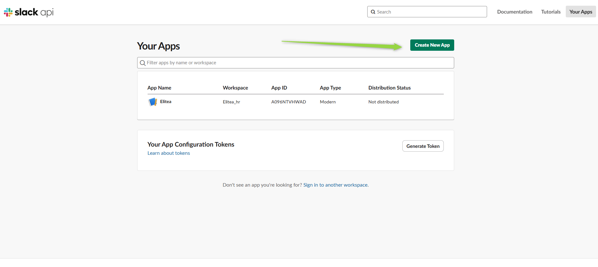

   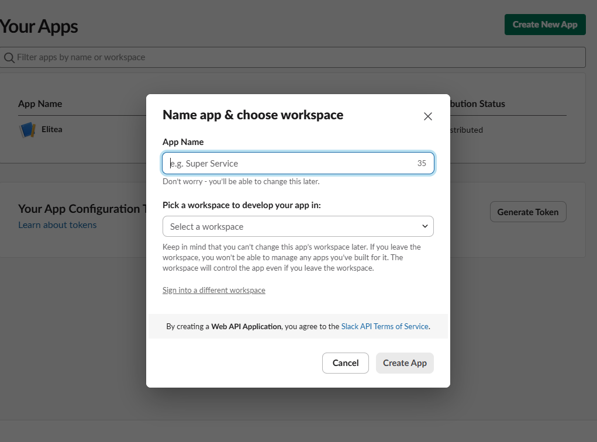

3. In your app settings, go to "OAuth & Permissions".

   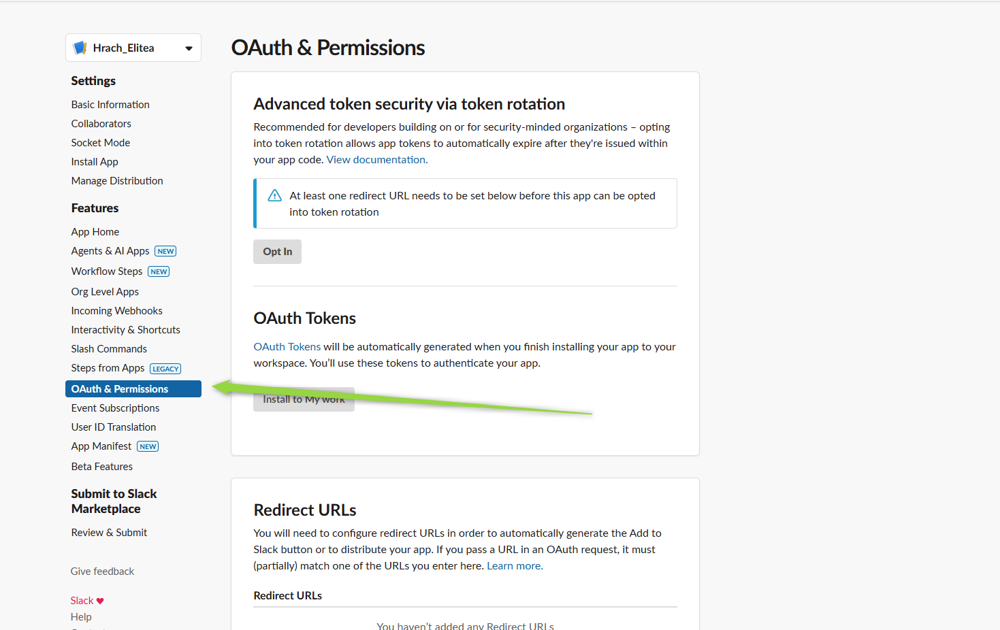

4. Under "Scopes", add the required bot scopes. For the available toolkit functionality, the following scopes are mandatory:
   - `channels:read` (List workspace conversations, List channel users)
   - `groups:read` (List workspace conversations for private channels)
   - `im:read` (List workspace conversations for direct messages)
   - `users:read` (List workspace users, Invite to conversation)
   - `chat:write` (Send message, Invite to conversation, Create slack channel)
   - `channels:write` (Create slack channel)
   - `groups:write` (Create private channel)
   - `conversations:read` (Read messages)
   - `conversations:write` (Send message, Invite to conversation)

   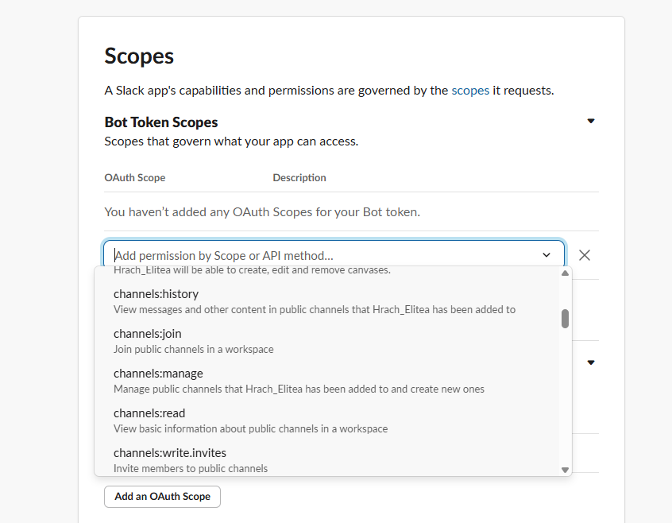

5. Click "Install App to Workspace" and authorize the app.

   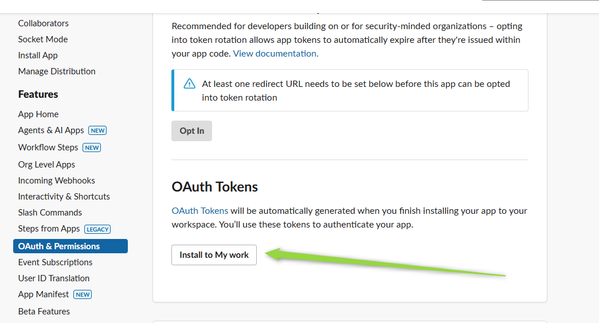

6. After installation, copy the **Bot User OAuth Token** (starts with `xoxb-`).

   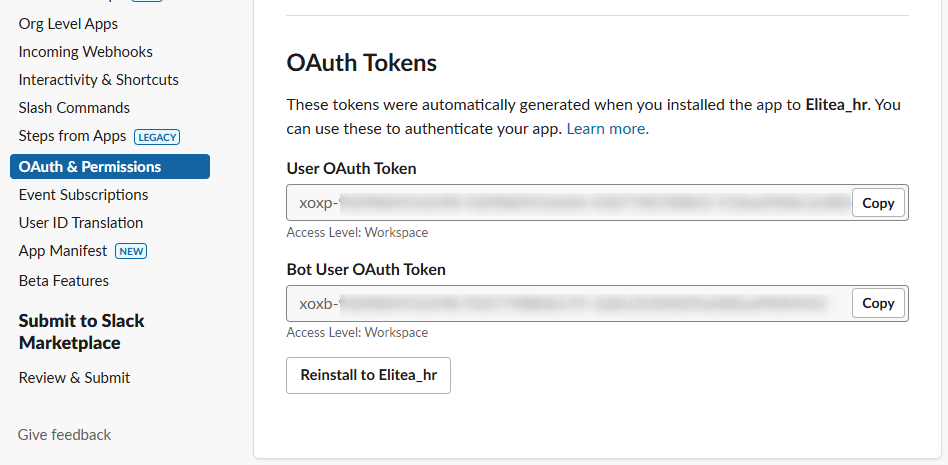

7. Store the token securely (recommended: ELITEA Secrets).
   

**Option 2: Get a User OAuth Token**

1. Log in to Slack and go to [Slack API: Your Apps](https://api.slack.com/apps).
2. Click "Create New App" and select your workspace.
3. In your app settings, go to "OAuth & Permissions".
4. Under "Scopes", add the required user scopes. For the available toolkit functionality, the following scopes are mandatory:
   - `channels:read` (List workspace conversations, List channel users)
   - `groups:read` (List workspace conversations for private channels)
   - `im:read` (List workspace conversations for direct messages)
   - `users:read` (List workspace users, Invite to conversation)
   - `chat:write` (Send message, Invite to conversation, Create slack channel)
   - `channels:write` (Create slack channel)
   - `groups:write` (Create private channel)
   - `conversations:read` (Read messages)
   - `conversations:write` (Send message, Invite to conversation)
    
    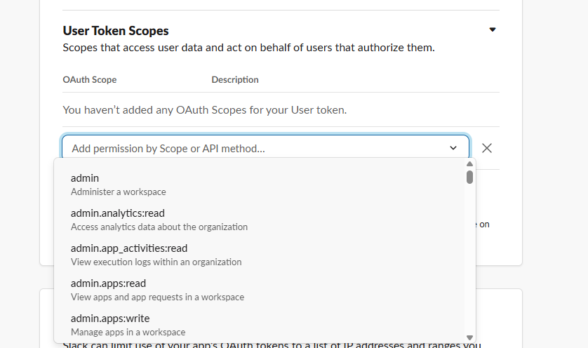

5. Click "Install App to Workspace" and authorize the app.
6. After installation, copy the **User OAuth Token** (starts with `xoxp-`).
7. Store the token securely (recommended: ELITEA Secrets).


> You can use either token type depending on your use case and required permissions. For most automation scenarios, the Bot User OAuth Token (`xoxb-`) is recommended.


## Get Channel ID in Slack

To configure the Slack toolkit in ELITEA, you will need the Channel ID. Here’s how to find it:

### How to Find the Channel ID
1. **Open Slack** and navigate to the channel you want to use.
2. **Locate the Channel ID:**
    - Click on the channel name, then **"View channel details"**. The Channel ID is usually shown in the URL as `https://app.slack.com/client/<workspace-id>/<channel-id>`.
    - Alternatively, use the Slack API (`conversations.list`) to list channels and retrieve their IDs.
3. **Example:**
    - URL: `https://app.slack.com/client/T12345678/C87654321`
    - Channel ID: `C87654321`

    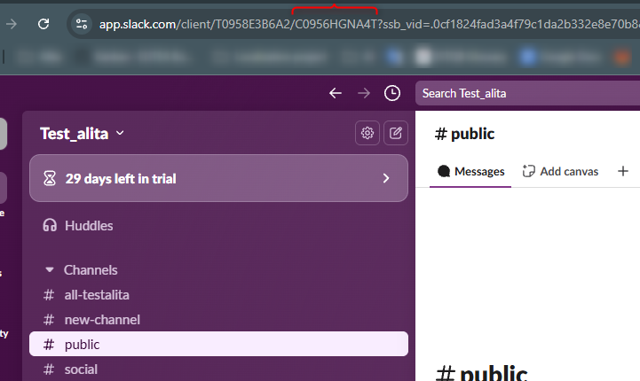

> **Note:** For ELITEA Slack toolkit configuration, you only need to provide the Channel ID. Workspace ID is not required.

### Invite Your Slack App to the Channel

**Purpose:**
Your Slack app (bot) must be a member of the channel to send and read messages, create channels, and perform other actions. Inviting the app ensures it has the necessary access to interact with the channel via the API.

**Steps to Invite the App:**

 1. In Slack, go to the channel you want your app to access.
 2. In the message input box, type `/invite @<your-app-name>` and press Enter.
    - Replace `<your-app-name>` with the name of your Slack app/bot (e.g., `/invite @MyBot`).
 3. You should see a confirmation that the app has been added to the channel.
 4. The app can now send and read messages, and perform other permitted actions in this channel.

> If you do not invite the app to the channel, API requests to post or read messages may fail with a "not_in_channel" error.

   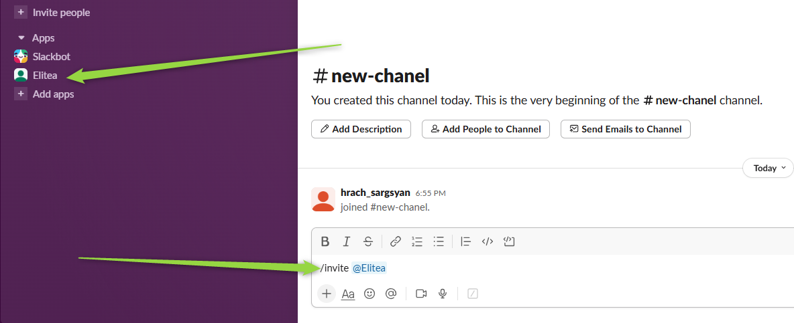

## Slack Integration with ELITEA

### Agent Creation/Configuration

To integrate Slack, you'll need to configure it within an ELITEA Agent. You can either create a new Agent or modify an existing one.

1. **Navigate to Agents:** In ELITEA, go to the **Agents** menu.
2. **Create or Edit Agent:**
    - **New Agent:** Click **"+ Agent"** to create a new Agent. Define Agent details like name, description, type, and instructions and save it.
    - **Existing Agent:** Select the Agent you want to integrate with Slack and click on its name to edit.
3. **Access Toolkits Section:** In the Agent configuration, scroll down to the **"Toolkits"** section.

### Toolkit Configuration

This section details how to configure the Slack toolkit within your ELITEA Agent.

1. **Add Toolkit:** In the "Toolkits" section, click the **"+ Toolkit" button**.
   *   Select **"Create new"**. You will be redirected to the new toolkit creation page.

       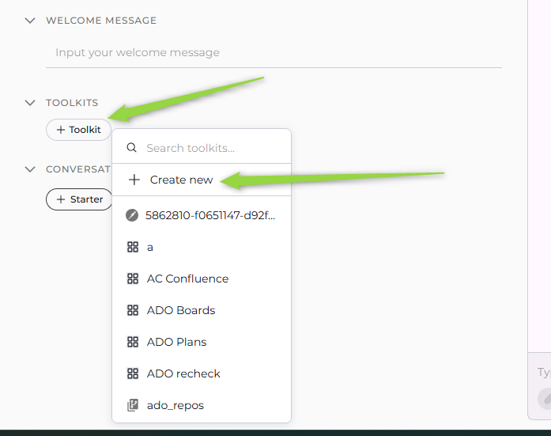

   *    Select **Slack** from the toolkits list.

      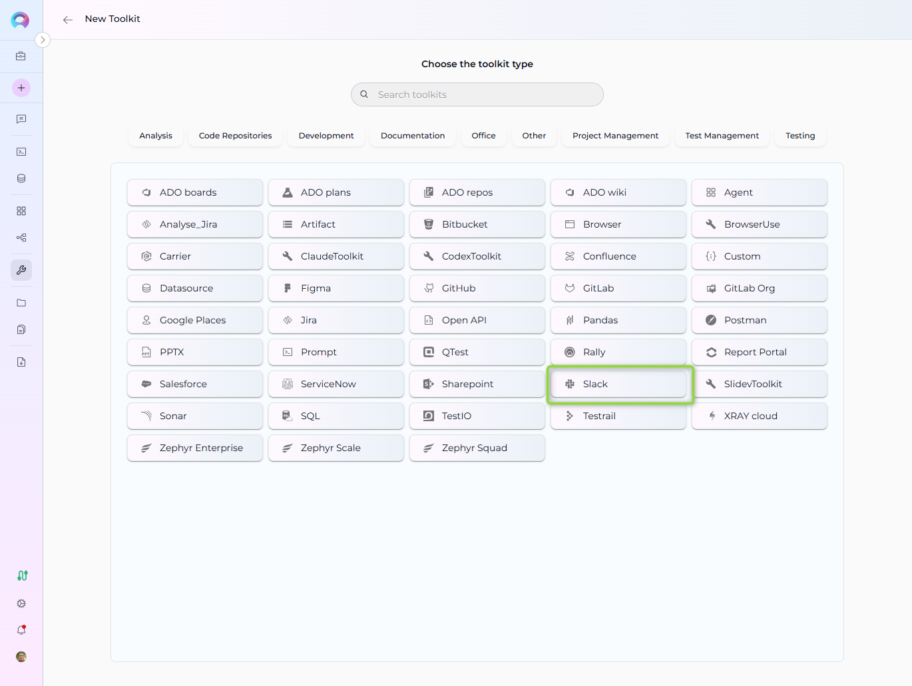

   *   Set the name of your toolkit.
   *   Open the **Credentials** dropdown and click **"Create new credentials"** to add your Slack  OAuth token securely.

    

2. **Configure Toolkit Credentials:** Fill in the following fields:

    *  **Name:** Set a name for your credential (e.g., "Slack Bot Credentials").
    *  **Slack Token:** Enter your Slack Bot/User OAuth Token. For best security, store your token as a Secret in ELITEA and select it from the dropdown. Alternatively, you can paste the token directly, but using Secrets is recommended.
    *  **Channel ID:** The unique identifier of the Slack channel you want the Agent to access or post messages to.
    *  **Save Credentials :** Click **"Save Credentials"** button (at the top right of the toolkit configuration) to save the Slack credentials

   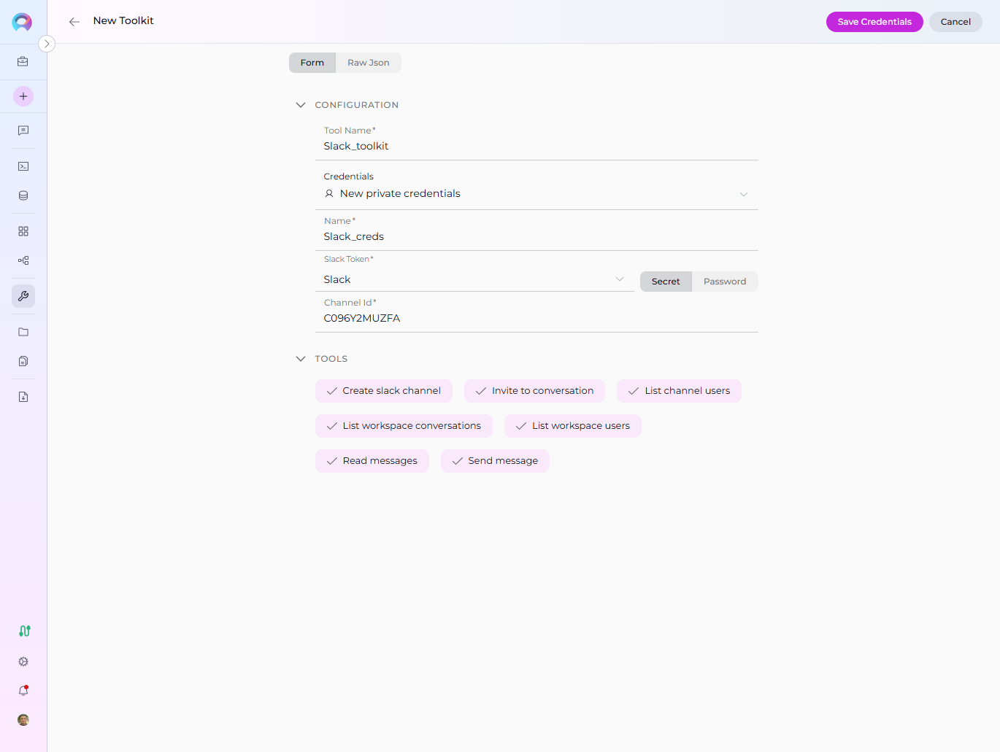

3. **Enable Tools:** In the "Tools" section of the Slack toolkit configuration, select the checkboxes next to the Slack tools you want to enable for your Agent. Enable only the tools your Agent will actually use to adhere to the principle of least privilege and enhance security. Available tools may include:

    *  **Create slack channel:** Create a new channel in your workspace.

    * **Invite to conversation:** Invite a user to a channel or conversation.
    * **List channel users:** Retrieve a list of users in a specific channel.
    * **List workspace users:** Retrieve a list of all users in your workspace.
    * **List workspace conversations:** Retrieve a list of all conversations (channels, groups, DMs) in your workspace.
    * **Read messages:** Retrieve messages from a channel.
    * **Send message:** Send a message to a channel or user.

4. **Complete Toolkit Configuration:** Click the **Save** (at the top right of the toolkit configuration) to save the Slack toolkit setup and return to the main Agent configuration.
5. Click **Save** to apply configuration and changes to the Agent.

   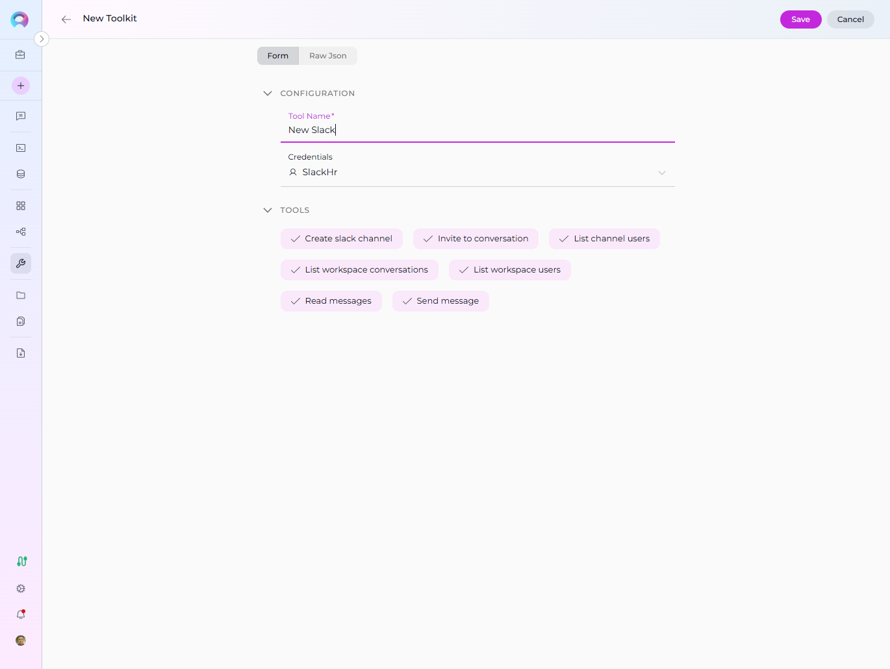

### Tool Overview

The Slack toolkit provides the following tools for your ELITEA Agents:

- **Create slack channel:** Create a new channel in your workspace.
- **Invite to conversation:** Invite a user to a channel or conversation.
- **List channel users:** Retrieve a list of users in a specific channel.
- **List workspace users:** Retrieve a list of all users in your workspace.
- **List workspace conversations:** Retrieve a list of all conversations (channels, groups, DMs) in your workspace.
- **Read messages:** Retrieve messages from a channel.
- **Send message:** Send a message to a channel or user.

These tools enable essential management, automation, and communication within your Slack workspace directly from ELITEA Agents.

## Instructions and Prompts for Using the Toolkit

To instruct your ELITEA Agent to use the Slack toolkit, you need to provide clear instructions within the Agent's "Instructions" field. These instructions guide the Agent on *when* and *how* to use the available tools.

### Instruction Creation for OpenAI Agents

When creating instructions for the Slack toolkit for OpenAI-based Agents, focus on clear, action-oriented language. Break down tasks into simple steps and explicitly state the parameters required for each tool. OpenAI Agents respond best to instructions that are:

* **Direct and Imperative:** Use action verbs and clear commands (e.g., "Use the 'send_message' tool...", "Retrieve channel info using 'get_channel_info'...").
* **Parameter-Focused:** Clearly list each parameter and how the Agent should determine its value.
* **Context-Aware:** Provide enough context so the Agent understands the overall goal and when to use specific tools within a workflow.

When instructing your Agent to use a Slack toolkit, use this pattern:

```
1. Identify the goal: [State the objective, e.g., "To send a message to a specific channel"].
2. Tool Selection: Use the "[tool_name]" tool.
3. Parameter Specification: Provide the following parameters:
    - Parameter Name 1: <value or description of value>
    - Parameter Name 2: <value or description of value>
    - ...
4. Expected Outcome: [Optionally, describe what should happen after the tool is used].
```
    - Parameter Name 2: <value or description of value>
    - ...
4. Expected Outcome: [Optionally, describe what should happen after the tool is used].
```

**Example Agent Instructions for Slack Toolkit Tools (OpenAI Agent Friendly):**

* **Send a message to a channel:**


```
1. Goal: To send a message to channel ID "C87654321".
2. Tool: Use the "Send message" tool.
3. Parameters:
    - Channel ID: "C87654321"
    - Message: "Hello team, the deployment is complete!"
4. Outcome: The Agent will post the message in the specified channel.
```

* **Create a new channel:**


```
1. Goal: To create a new channel named "project-updates".
2. Tool: Use the "Create slack channel" tool.
3. Parameters:
    - Channel Name: "project-updates"
    - Channel Type: "public" or "private"
4. Outcome: The Agent will create the new channel in the workspace.
```

* **Invite a user to a channel:**


```
1. Goal: To invite user ID "U12345678" to channel ID "C87654321".
2. Tool: Use the "Invite to conversation" tool.
3. Parameters:
    - Channel ID: "C87654321"
    - User ID: "U12345678"
4. Outcome: The Agent will invite the user to the specified channel.
```

* **List users in a channel:**


```
1. Goal: To list all users in channel ID "C87654321".
2. Tool: Use the "List channel users" tool.
3. Parameters:
    - Channel ID: "C87654321"
4. Outcome: The Agent will display all users in the specified channel.
```

* **List all users in the workspace:**


```
1. Goal: To list all users in the workspace.
2. Tool: Use the "List workspace users" tool.
3. Parameters: None
4. Outcome: The Agent will display all users in the workspace.
```

* **Read messages from a channel:**


```
1. Goal: To read the last 10 messages from channel ID "C87654321".
2. Tool: Use the "Read messages" tool.
3. Parameters:
    - Channel ID: "C87654321"
    - Limit: 10
4. Outcome: The Agent will display the last 10 messages from the specified channel.
```

### Conversation Starters

Use these conversation starters to interact with your Slack-integrated Agent and test the toolkit's capabilities:

* "Send a message to channel C87654321."
* "Create a new channel called project-updates."
* "Invite user U12345678 to channel C87654321."
* "List all users in channel C87654321."
* "List all users in the workspace."
* "Read the last 10 messages from channel C87654321."

## Use Cases

The Slack toolkit unlocks extensive automation and management possibilities for communication workflows within ELITEA. Here are some key use cases, demonstrating how each tool can be applied:

* **Automated Notifications:**
    * **Scenario:** Send deployment or incident notifications to a channel.
    * **Tools Used:** `Send message`
    * **Example Instruction:** "Use the 'Send message' tool to post a deployment update in channel C87654321."

* **Channel Creation and Management:**
    * **Scenario:** Create new channels for projects or teams.
    * **Tools Used:** `Create slack channel`, `Invite to conversation`
    * **Example Instruction:** "Create a channel called project-updates and invite user U12345678."

* **User Management:**
    * **Scenario:** List users in a channel or workspace for onboarding or reporting.
    * **Tools Used:** `List channel users`, `List workspace users`, `Invite to conversation`
    * **Example Instruction:** "List all users in channel C87654321 and invite new members."

* **Message Retrieval and Analysis:**
    * **Scenario:** Retrieve and analyze recent messages for sentiment or action items.
    * **Tools Used:** `Read messages`
    * **Example Instruction:** "Read the last 10 messages from channel C87654321."

These use cases demonstrate how the Slack toolkit can streamline communication, automate notifications, and improve team collaboration within ELITEA.

## Troubleshooting and Support

### Troubleshooting

* **Connection Issues:**
    * **Problem:** Agent fails to connect to Slack, resulting in errors during toolkit execution.
    * **Troubleshooting Steps:**
        1. **Verify OAuth Token:** Ensure the token is correctly entered and has the necessary permissions.
        2. **Check Workspace Access:** Double-check your Slack workspace and channel access.
        3. **Token Generation:** Re-generate a new token in Slack and try using that if you suspect the token might be invalid.
        4. **Network Connectivity:** Verify that both ELITEA and Slack have internet access and no network issues are blocking the connection.

* **Authorization Errors (Permission Denied):**
    * **Problem:** Agent receives "Permission Denied" or "Unauthorized" errors when accessing Slack resources.
    * **Troubleshooting Steps:**
        1. **Token Validity:** Ensure the token is valid and has not been revoked in Slack.
        2. **App Permissions:** Confirm that the Slack app associated with the token has the necessary permissions to access the specified workspace and perform the requested actions.

* **Incorrect Channel or Workspace IDs:**
    * **Problem:** Agent fails to find channels or workspaces, especially when posting or retrieving details.
    * **Troubleshooting Steps:**
        1. **Verify Channel ID:** Double-check the Channel ID in your Slack workspace. You can usually find the Channel ID in the URL or via the Slack API.
        2. **Verify Workspace ID:** Similarly, verify the Workspace ID. Ensure the Workspace ID is valid within the specified workspace.

### FAQ

1. **Q: Can I use my regular Slack password instead of a Bot/User OAuth Token?**
    * **A:** No, for secure integration with ELITEA, you **must use a Slack Bot/User OAuth Token**. Using your regular password directly is not supported and is a security risk.
2. **Q: Where do I find Channel and Workspace IDs in Slack?**
    * **A:** Channel and Workspace IDs are typically visible in the URL when you navigate to a specific channel or workspace within Slack. You can also find these IDs through the Slack API.
3. **Q: What if I don't know the exact permissions needed for the OAuth Token?**
    * **A:** Slack allows you to set scopes/permissions when creating an app. For ELITEA integration, ensure the token has access to the channels and actions you want to manage. Contact your Slack administrator if you are unsure about these permissions.

### Support Contact

For any issues, questions, or further assistance with the Slack integration or ELITEA Agents, please reach out to our dedicated ELITEA Support Team. We are committed to providing prompt and effective support to ensure your success with ELITEA.

**Contact ELITEA Support:**

* **Email:**  **[SupportAlita@epam.com](mailto:SupportAlita@epam.com)**

**Best Practices for Effective Support Requests:**

To help us understand and resolve your issue as quickly as possible, please ensure you provide the following information in your support email:

* **ELITEA Environment:** Clearly specify the ELITEA environment you are using (e.g., "Next" or the specific name of your ELITEA instance).
* **Project Details:**  Indicate the **Project Name** and whether you are working in your **Private** workspace or a **Team** project.
* **Detailed Issue Description:** Provide a clear, concise, and detailed description of the problem you are encountering. Explain what you were trying to do, what you expected to happen, and what actually occurred.
* **Relevant Configuration Information:**  To help us diagnose the issue, please include relevant configuration details, such as:
    * **Agent Instructions (Screenshot or Text):** If the issue is with an Agent, provide a screenshot or copy the text of your Agent's "Instructions" field.
    * **Toolkit Configurations (Screenshots):** If the issue involves the Slack toolkit or other toolkits, include screenshots of the toolkit configuration settings within your Agent.
* **Error Messages (Full Error Text):** If you are encountering an error message, please provide the **complete error text**. In the Chat window, expand the error details and copy the full error message. This detailed error information is crucial for diagnosis.
* **Your Query/Prompt (Exact Text):** If the issue is related to Agent execution, provide the exact query or prompt you used to trigger the issue.

**Before Contacting Support:**

We encourage you to first explore the resources available within this guide and the broader ELITEA documentation. You may find answers to common questions or solutions to known issues in the documentation.

## Useful Links

To further enhance your understanding and skills in integrating Slack with ELITEA, here are some helpful resources:

* **[Slack Website](https://slack.com/)**: Access the main Slack platform to create an account or log in and explore Slack features.
* **[Slack API Documentation](https://api.slack.com/methods)**:  Refer to the official Slack API documentation for detailed information on API endpoints, data structures, and advanced usage.
* **[ELITEA Secrets](../../menus/settings/secrets.md)**: Learn how to securely store your Slack OAuth Token using ELITEA's Secrets management feature for enhanced security.
* **[ELITEA Agents Configuration](../../menus/agents.md)**:  Find out more about creating and configuring Agents in ELITEA, where you integrate the Slack toolkit to automate your workflows.
* **[ELITEA Support Email](mailto:SupportAlita@epam.com)**: Contact the ELITEA support team for direct assistance with Slack integration or any other questions and issues you may encounter.
