# ELITEA Toolkit Guide: Sonar Integration

## Introduction

### Purpose of this Guide

This guide is your definitive resource for integrating and utilizing the **Sonar toolkit** within ELITEA. It provides a comprehensive, step-by-step walkthrough, from setting up your SonarQube cloud account and generating a Personal Access Token to configuring the toolkit in ELITEA and effectively using it within your Agents. By following this guide, you will unlock the power of automated code quality analysis, streamlined development workflows, and enhanced code quality management, all directly within the ELITEA platform. This integration empowers you to leverage AI-driven automation to optimize your software development lifecycle by integrating SonarQube's code analysis capabilities with ELITEA's intelligent agents, whether you are using SonarQube Cloud or SonarQube Server.

### Brief Overview of SonarQube

SonarQube is a leading platform for continuous inspection of code quality. It is available in both cloud-hosted (SonarQube Cloud) and self-hosted (SonarQube Server) versions. SonarQube is designed to detect coding issues in over 30 programming languages, frameworks, and Infrastructure-as-Code (IaC) platforms. By integrating directly with your CI pipeline or supported DevOps platforms, SonarQube automatically checks your code against an extensive set of rules on each merge/pull request. This ensures your code adheres to best practices and helps identify maintainability, reliability, and security vulnerabilities early in the development process.

Integrating SonarQube with ELITEA brings these powerful code quality analysis capabilities directly into your AI-driven workflows. Your ELITEA Agents can then intelligently interact with SonarQube to automate code quality checks, analyze code issues, and enhance your development processes through AI-powered insights.

## Toolkit Account Setup and Configuration in SonarQube Cloud

### Account Setup

This guide focuses on setting up the Sonar Toolkit for the cloud version of SonarQube, known as SonarQube Cloud. To create a SonarQube Cloud account, follow these steps:

1.  **Visit SonarQube Cloud Website:** Open your web browser and navigate to the official SonarQube Cloud website: [https://sonarcloud.io/](https://sonarcloud.io/).

2.  **Sign Up for SonarQube Cloud:** Login or click on the **"start free"** button.

    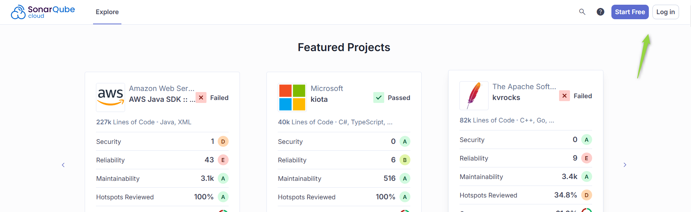

3.  **Choose Sign-Up Method:** Select your preferred method to sign up for SonarQube Cloud. You can sign up using your existing accounts with platforms like GitHub, GitLab, Bitbucket, or Azure DevOps.

    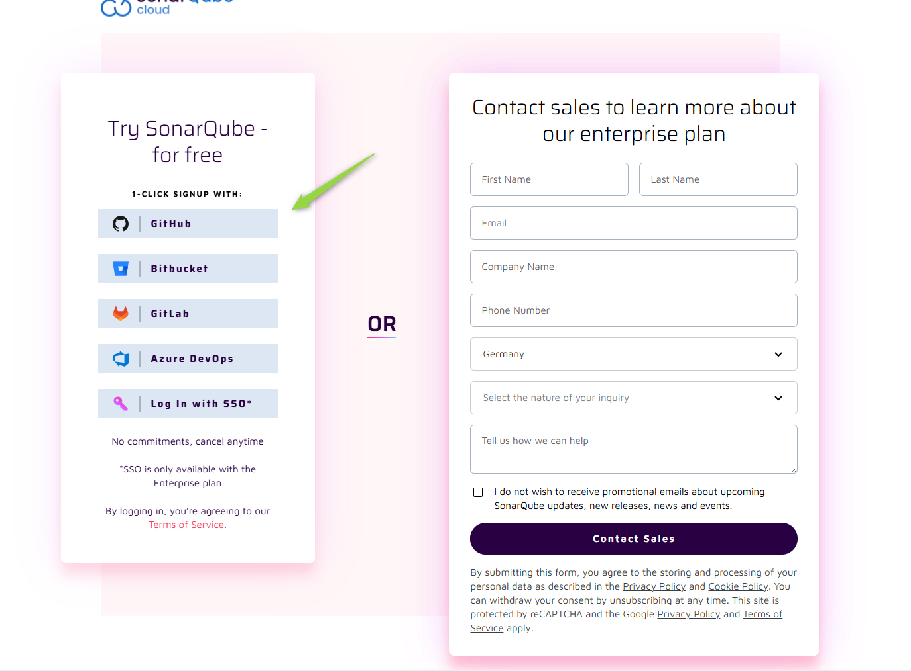

4.  **Create/Import Organization:** Depending on your chosen sign-up method, you may be prompted to create a new organization or import an existing one from your connected platform. Follow the on-screen instructions to create or import your organization.

    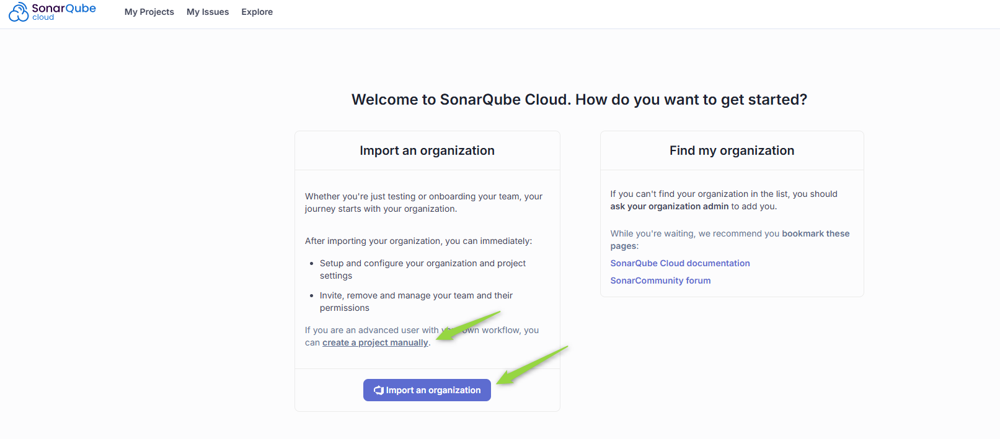

5.  **Create a New Project:** Once your organization is set up, you will need to create a new project in SonarQube Cloud to analyze your code. Click on **"Create"** project and choose **"Manually"**.

6.  **Configure Project Details:** Enter the required project details:
    *   **Project name:** Enter a descriptive name for your project.
    *   **Project key:** Enter a unique key for your project.
    *   **Select plan:** Choose the appropriate plan for your project based on your needs and go to the next bage 

    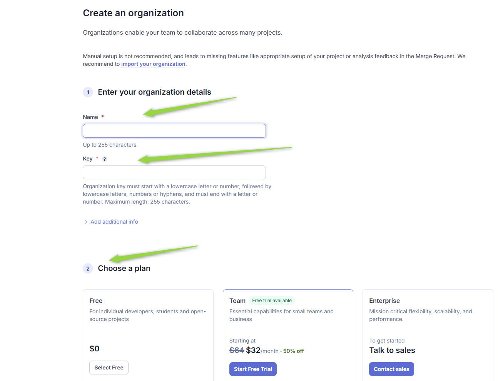

    *   **Display name:** Enter a display name for your project.
    *   **Project visibility:** Select the visibility of your project (Public or Private).

    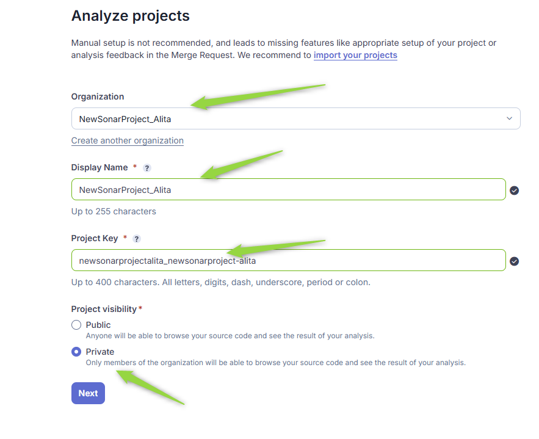

7.  **Define New Code and Complete Project Creation:** Select how you want to define "new code" for your project and complete the project creation process by clicking **"Create Project"**.

    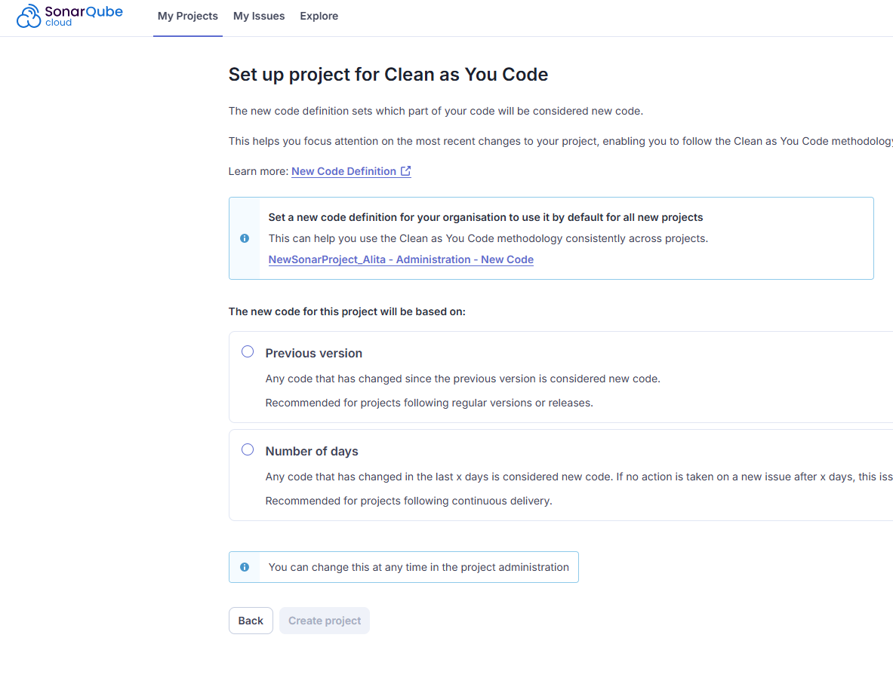

8.  **Choose Analysis Method:** Choose the analysis method you want to use for your project. For CI/CD integration, select **"With CI/CD pipeline"** or another relevant option depending on your CI/CD tools.

    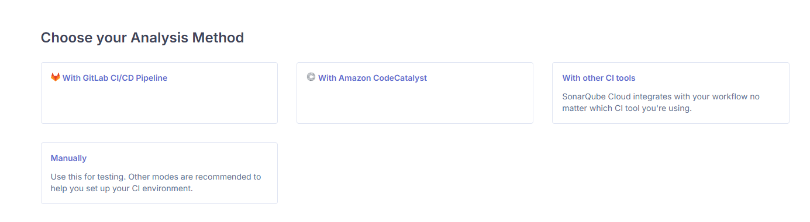

9.  **Configure CI/CD Pipeline (Optional):** If you selected a CI/CD pipeline integration method, follow the instructions provided by SonarQube Cloud to configure your CI/CD pipeline to automatically analyze your code. This typically involves creating environment variables and configuring SonarQube Scanner in your pipeline configuration files.

    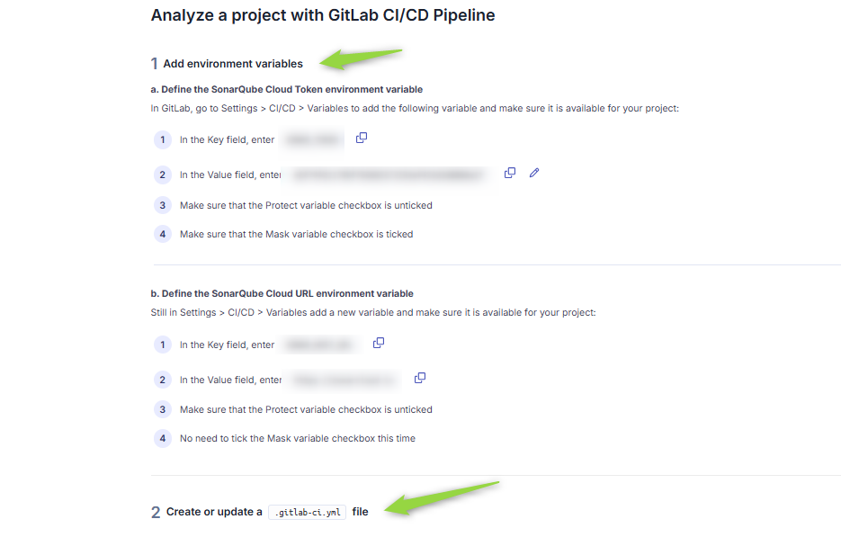

10. **Run Analysis in CI/CD (Optional):** After configuring your CI/CD pipeline, run your pipeline to trigger the initial code analysis in SonarQube Cloud. This will populate SonarQube Cloud with data about your project's code quality.

    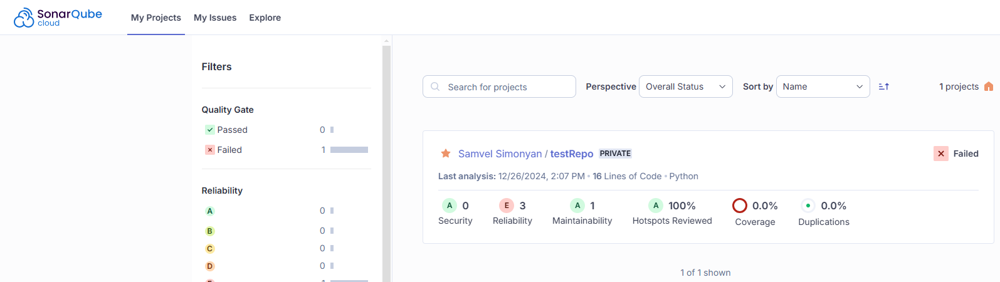

### Token/API Key Generation: Creating a SonarQube Cloud Token

For secure integration with ELITEA, it is essential to use a SonarQube Cloud **Token** (Personal Access Token) for authentication. This method is more secure than using your primary SonarQube Cloud account password directly and allows you to control access permissions for ELITEA.

**Follow these steps to generate a SonarQube Cloud Token:**

1.  **Sign in to SonarQube Cloud:** Log in to your SonarQube Cloud organization using your SonarQube Cloud credentials.
2.  **Access User Profile Settings:** Click on your **user avatar** located in the top right corner of the SonarQube Cloud page.

    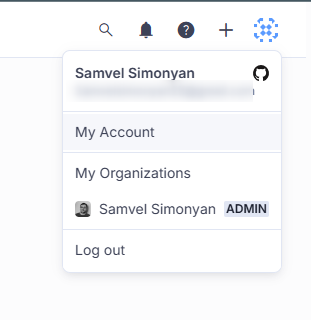

3.  **Navigate to Security Tab:** In the dropdown menu, click on **"My account"**. Then, navigate to the **"Security"** tab within your account settings.

4.  **Generate New Token:** Under the "Generate Tokens" section, enter a **Token name** (e.g., "ELITEA Integration Token") and click **"Generate"**.

    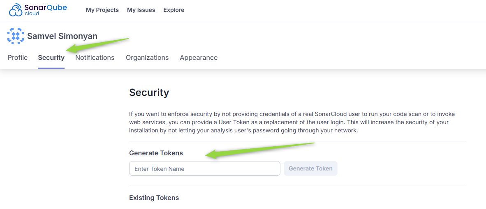

5.  **Securely Copy and Store Your Token:**  A new Token will be generated and displayed. **Immediately copy the newly generated token value**. **This is the only time you will see the full token value.** It is crucial to store it securely in a password manager or, preferably, ELITEA's built-in Secrets feature for enhanced security within ELITEA. You will need this Token to configure the Sonar Toolkit in ELITEA.


## System Integration with ELITEA

### Agent Creation/Configuration

To integrate SonarQube functionalities into your workflows, you will need to configure the Sonar Toolkit within an ELITEA Agent. You can either create a new Agent specifically for SonarQube interactions or modify an existing Agent to incorporate Sonar toolkit.

1.  **Navigate to Agents Menu:** In ELITEA, go to the **Agents** menu from the main navigation panel.
2.  **Create or Edit Agent:**
    *   **Create a New Agent:** Click on the **"+ Agent"** button to create a new Agent. Follow the on-screen prompts to define essential Agent attributes such as Agent name, a descriptive Agent description, the desired Agent type, and initial instructions for the Agent.
    *   **Edit an Existing Agent:** Select the Agent you intend to integrate with SonarQube from your list of Agents. Click on the Agent's name to open its configuration settings for editing.

    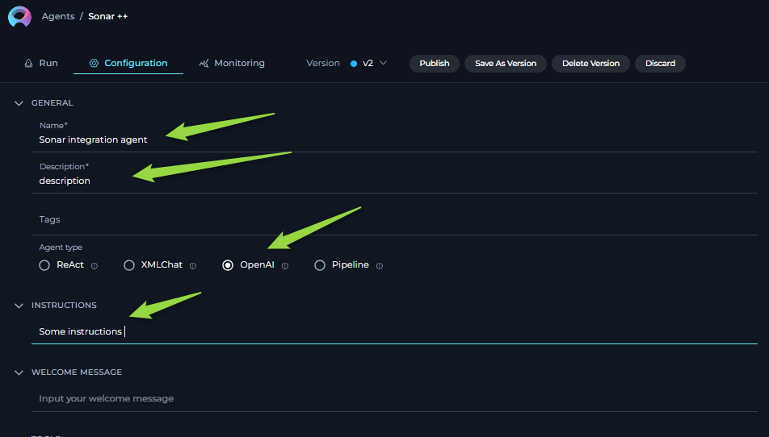

3.  **Access Tools Section:** Within the Agent configuration interface, scroll down until you locate the "Tools" section. This section is where you will add and configure toolkits, including the Sonar Toolkit.

   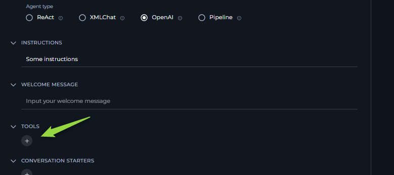

### Toolkit Configuration

This section provides detailed instructions on how to configure the Sonar Toolkit within your ELITEA Agent.

1.  **Add Toolkit:** In the "Tools" section of the Agent configuration, click on the **"+" icon**. This action will display a dropdown list of available toolkits that can be integrated with your Agent.
2.  **Select Sonar Toolkit:** From the dropdown list of available toolkits, choose **"Sonar"**. Selecting "Sonar" will open the "New Sonar tool" configuration panel, where you will specify the settings for your SonarQube integration.
3.  **Configure Sonar Toolkit Settings:** Carefully fill in the following configuration fields within the "New Sonar tool" section:

    *   **Name:** Enter a descriptive **Name** for your Sonar Toolkit instance.
    *   **Description:** Provide a concise **Description** for the toolkit.
    *   **URL:** Enter the base URL of your SonarQube instance.
        *   **For SonarQube Cloud:** Use `https://sonarcloud.io`.
        *   **For SonarQube Server:** Use the base URL of your SonarQube Server UI interface (e.g., `http://your-sonarqube-server:9000` or `https://your-sonarqube-domain.com`).

        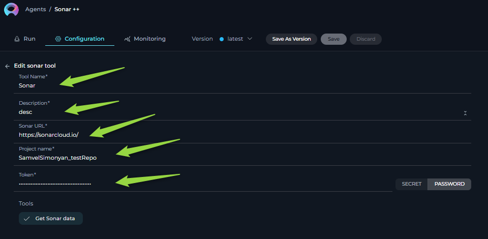

    *   **Project Name:** Enter the **Project Key** of your SonarQube project that you want to access. The Project Key can be copied from the URL when you open your project in SonarQube. It usually consists of your SonarQube organization name (for Cloud) or project identifier (for Server) followed by an underscore and the repository name (e.g., `your-org_your-repo` or `your-project-key`).

        

    *   **API Key:** In the "API Key" field, paste the **SonarQube Token** you generated in the previous steps or select a secure secret from ELITEA Secrets Management.

4.  **Enable Tool:** In the "Tools" section within the Sonar Toolkit configuration panel, ensure that the **"Get Sonar data"** tool is selected (checked). Currently, this toolkit offers a single tool for retrieving SonarQube data.

5.  **Complete Setup:** After configuring all the necessary settings and enabling the desired tool, click the **arrow icon** to finalize the Sonar Toolkit setup and return to the main Agent configuration menu.
6.  **Click Save** in the Agent configuration to save all changes and activate the Sonar Toolkit integration for your Agent.

## Tools of the Sonar Toolkit

### Available Tools

The Sonar Toolkit provides the following tool (action) for interacting with the SonarQube API:

*   **Get Sonar data:**  **Tool Name:** `get_sonar_data`
    *   **Description:** Retrieves data from SonarQube using the SonarQube REST API `/api/issues/search` endpoint. Allows you to filter and customize data retrieval using various parameters. This tool works with both SonarQube Cloud and SonarQube Server.
    *   **Parameters:**
        *   `relative_url`: The relative URL for the SonarQube API endpoint. For fetching issues, use: `api/issues/search`. This is consistent for both SonarQube Cloud and Server.
        *   parameters to filter and customize the data retrieval. Refer to the SonarQube API documentation for available parameters for the `/api/issues/search` endpoint (e.g., `{"severities": "MAJOR,CRITICAL", "statuses": "OPEN"}`). The available parameters are generally consistent across SonarQube Cloud and Server, but refer to your specific SonarQube version's API documentation for the most accurate parameter list.

### Toolkit Use Cases

Here are practical use cases demonstrating how to leverage the Sonar Toolkit within ELITEA agents to enhance development and code quality workflows:

1.  **Automated Code Failure Analysis and Solution Recommendations:**
    *   **Scenario:** When a CI/CD pipeline fails due to code quality issues detected by SonarQube (Cloud or Server), an ELITEA Agent can automatically analyze the SonarQube data to identify the root causes of the failure and provide developers with potential solutions or remediation steps.
    *   **Tools Used:** `get_sonar_data`
    *   **Example Instruction:** "Use the 'get_sonar_data' tool to retrieve critical and blocker issues from SonarQube project [project key] that are causing the CI pipeline failure. Analyze the issue descriptions and provide a summary of the root causes and potential code fixes to the developer."
    *   **Benefit:** Streamlines failure analysis in CI/CD pipelines, reduces debugging time, and helps developers quickly understand and address code quality issues flagged by SonarQube.

2.  **Proactive Code Quality Monitoring and Reporting:**
    *   **Scenario:** QA managers or development leads need regular reports on the overall code quality of a project, tracking trends, identifying hotspots, and proactively managing technical debt. They want automated reports delivered periodically without manual effort.
    *   **Tools Used:** `get_sonar_data`
    *   **Example Instruction:** "Use the 'get_sonar_data' tool to retrieve a summary of code quality metrics (e.g., number of blocker, critical, major issues, code coverage, technical debt) for SonarQube project [project key]. Generate a weekly code quality report summarizing these metrics and highlighting any significant changes or concerning trends. Send the report to the QA manager and development team lead."
    *   **Benefit:** Enables proactive code quality monitoring and reporting. Provides stakeholders with automated, regular insights into project health, code quality trends, and areas requiring attention, facilitating data-driven decisions for code improvement and technical debt management, aligning with SonarQube's "Real-time Reporting and Dashboards" feature and the principle of "Adaptability - Tested" (confidence in functionality).

3.  **Intelligent Code Issue Triage and Assignment:**
    *   **Scenario:** When new code quality issues are detected by SonarQube in a project, automatically triage and assign these issues to the appropriate developers or teams based on issue severity using e.g. jira toolkit. This helps ensure timely remediation and efficient issue management.
    *   **Tools Used:** `get_sonar_data`
    *   **Example Instruction:** "Use the 'get_sonar_data' tool to retrieve all newly created 'BLOCKER' and 'CRITICAL' issues in SonarQube project [project key] since the last analysis. For each issue, analyze its type, severity, and affected code component. Based on predefined rules or code ownership patterns [*(Note: This would require additional ELITEA agent logic or external data source for ownership rules, beyond the Sonar Toolkit itself)*], automatically create jira tasks /github tasks  and assign each issue to the relevant developer or team for remediation.
    *   **Benefit:** Streamlines code issue triage and assignment workflows, ensuring that newly detected issues are promptly addressed by the responsible teams or individuals. Improves issue tracking efficiency, reduces manual effort in issue assignment, and promotes faster remediation of critical code quality problems, aligning with SonarQube's "Quality Gate and Issue Tracking" feature and the principles of "Intentionality - Clear & Logical" (well-formed instructions for triage) and "Responsibility - Trustworthy" (managing security vulnerabilities effectively).

4.  **Automated Code Fix Generation and Merge Request Creation for Critical Issues:**
    *   **Scenario:** To automate the remediation of critical code quality issues. When SonarQube detects 'BLOCKER' or 'CRITICAL' issues in a project, an ELITEA Agent automatically:
        *   Retrieves the SonarQube report detailing these issues.
        *   Analyzes the code and SonarQube issue descriptions to understand the root cause and generate code fixes.  *(Note: This step relies on advanced AI capabilities within the ELITEA agent and other toolkits to understand code and generate meaningful fixes.)*
        *   Applies the generated code fixes to the codebase within the repository (using a code repository toolkit like GitHub or GitLab Toolkit).
        *   Creates a new branch with the automated fixes and submits a merge request to the repository for review and approval by a developer.
    *   **Tools Used:** `get_sonar_data` (Sonar Toolkit), *Code Repository Toolkit (e.g., GitHub Toolkit or GitLab Toolkit - implicitly used for code access and merge request creation)*
    *   **Example Agent Instructions (Conceptual - Requires Complex Agent Logic):**
        ```
        1. Use 'get_sonar_data' tool to retrieve 'BLOCKER' and 'CRITICAL' issues from SonarQube project [project key].
        2. Analyze the SonarQube issue details and relevant code snippets from the repository (Implicitly requires agent to access code repo, e.g., using the GitHub/GitLab Toolkit to understand the fixes needed).
        3. Generate code fixes for each critical/blocker issue.
        4. Using the [Code Repository Toolkit - e.g., GitHub Toolkit], create a new branch named 'automated-fix-sonar-issues'.
        5. In the new branch, apply the generated code fixes to the affected files (Requires agent to modify code in repo - e.g., using  GitHub/GitLab Toolkit).
        6. Create a merge request ( using e.g. gitHub or GitLab tookits).
        ```
    *   **Benefit:** Significantly accelerates the remediation of critical code quality issues. Automates the entire fix generation and submission process, reducing developer effort in addressing common and critical SonarQube findings. Improves code quality and security by proactively fixing issues and ensuring adherence to code quality standards.

## Troubleshooting

### Troubleshooting

1.  **General Connection Errors:**
    *   **Problem:** ELITEA Agent fails to connect to SonarQube (Cloud or Server), resulting in connection-related errors during toolkit execution.
    *   **Possible Solutions:**
        *   **Verify SonarQube URL:** Double-check that you have entered the correct SonarQube URL in the toolkit configuration. Currently SonarQube Cloud is using `https://sonarcloud.io`.For SonarQube Server, verify you are using the correct base URL for your self-hosted instance (e.g., `http://your-sonarqube-server:9000` or `https://your-sonarqube-domain.com`).
        *   **Agent Type:** Verify that the Agent Type in ELITEA is set to a compatible type, such as "Open AI Agent," which is generally suitable for toolkit integrations.
        *   **Relative URL:** Check instructions to provide valid relative url and search parametrs (e.g. relative_url='api/issues/search', params="{\"issueStatuses\":\"OPEN\""}).

        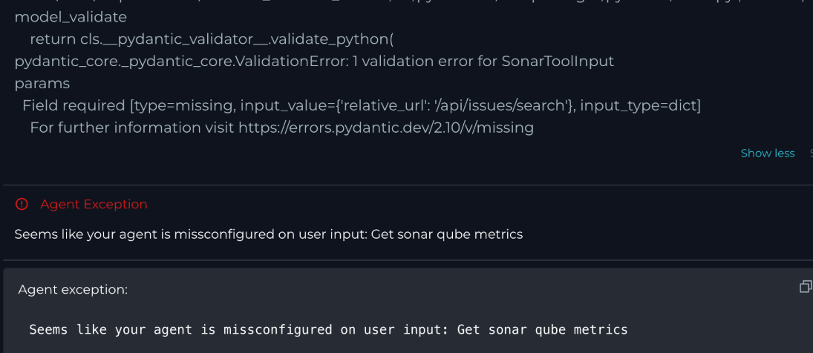

2.  **Authentication Errors (401 Unauthorized):**
    *   **Problem:** ELITEA Agent reports an "Authentication error (401 Unauthorized)" when attempting to fetch data from SonarQube. The agent response might explicitly indicate a 401 Unauthorized error.

        ```
        Example Agent Response:
        "It seems there was an authentication error (401 Unauthorized) when trying to fetch data from SonarQube."
        ```

    *   **Troubleshooting Steps:**
        *   **Verify API Key (Token) Correctness:** Double-check that the SonarQube Token (API Key) you entered in the toolkit configuration is **exactly correct**. Carefully re-enter or copy-paste the token to rule out any typos or accidental character omissions.
        *   **Verify Token Project Association:** Ensure that the SonarQube Token you are using is valid for the **specific SonarQube project** you are trying to access in ELITEA. Tokens might be project-specific or organization-wide, but ensure it has the necessary scope for the target project.
        *   **Check Token Expiration:**  SonarQube Tokens can have expiration dates. Verify that the SonarQube Token you are using is **still valid and has not expired**. If the token has expired, generate a new token in SonarQube and update the API Key in your ELITEA Sonar Toolkit configuration.

    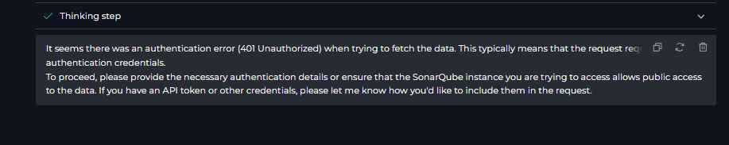

3.  **No Data Available Issue:**
    *   **Problem:** Agent executes successfully without connection errors, but no data is retrieved from SonarQube, or empty datasets are returned.
    *   **Troubleshooting Steps:**
        *   **Verify Project Name (Project Key):** Double-check that the **Project Name** (Project Key) field in the toolkit configuration accurately corresponds to your SonarQube project. The Project Key is case-sensitive and must match exactly. Copy the Project Key directly from your SonarQube project settings or URL.
        *   **Verify Filter Parameters:** Review the filter parameters in your Agent instructions and requests (within the `params` JSON string). Ensure that these filters are correctly formatted according to the SonarQube API documentation and that they are actually targeting issues or data that exist in your SonarQube project. Incorrect filters might result in empty datasets.
        *   **Data in SonarQube Project:** Confirm that your SonarQube project actually contains data and issues. Run a code analysis in SonarQube (Cloud or Server) (through your CI/CD pipeline or manually) to ensure that analysis results are available for your project. If no analysis has been run, there will be no data to retrieve.

        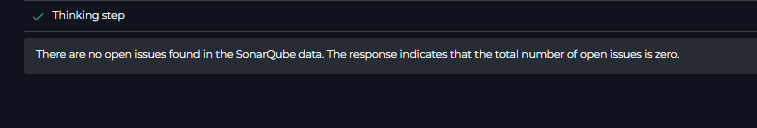

4.  **Incorrect Filtered Data Retrieval:**
    *   **Problem:** Agent retrieves data, but the data is not correctly filtered according to your instructions or requests. You might be getting more issues than expected, or issues of the wrong severity, status, etc.
    *   **Troubleshooting Steps:**
        *   **Use Exact API Filters:** Carefully review your filter parameters within the `params` JSON string in your Agent instructions. Ensure that you are using the correct parameter names and values as documented in the SonarQube API documentation for the `/api/issues/search` endpoint. Pay close attention to case sensitivity and data types for parameter values.
        *   **Test API Calls Directly (e.g., Postman/curl):** To isolate whether the issue is with ELITEA's integration or your filter parameters, test the SonarQube API `/api/issues/search` endpoint directly using tools like Postman, `curl`, or a web browser.
        *   **Refer to SonarQube API Documentation:** Consult the official SonarQube API documentation for the `/api/issues/search` endpoint to understand all available filter parameters, their valid values, and correct formatting. Ensure your Agent instructions are using supported parameters correctly.

### FAQs

1. **Q: Can I connect to a SonarQube Server instance that is only accessible within my private network?**
    *   **A:**  Unfortunately, direct access to SonarQube Server instances hosted on private networks is generally not possible with the standard ELITEA Sonar Toolkit configuration. ELITEA Agents operate from cloud servers and typically require web-accessible endpoints. To integrate with a privately hosted SonarQube Server, you would need to ensure that your SonarQube Server instance is accessible from the public internet.

2. **Q: Can I change SonarQube settings or trigger code analysis from ELITEA using this toolkit?**
    *   **A:** Currently, the ELITEA Sonar Toolkit supports only the **"Get Sonar data"** tool, which is designed for retrieving code quality data from SonarQube. The toolkit does not currently offer tools to change SonarQube settings, trigger code analysis, or perform other write operations. The toolkit is primarily focused on data retrieval for analysis and reporting within ELITEA workflows.

3. **Q: Where can I get the URL of my SonarQube instance?**
    *   **A:**  **SonarQube Cloud:** For SonarQube Cloud, the URL currently is **`https://sonarcloud.io`**.
        *   **SonarQube Server:** For SonarQube Server (self-hosted), the URL is the base URL of your organization's SonarQube Server web interface. This will vary depending on your organization's specific setup. Examples include: `http://your-sonarqube-server:9000` or `https://your-sonarqube-domain.com`. If you are unsure of your SonarQube Server URL, please contact your SonarQube administrator within your organization.

### Support and Contact Information

If you encounter persistent issues, have questions not covered in this guide, or require further assistance with the Sonar Toolkit or ELITEA Agents, please do not hesitate to contact our dedicated ELITEA Support Team. We are here to help you resolve any problems quickly and efficiently and ensure you have a smooth and productive experience with ELITEA.

**How to Reach ELITEA Support:**

*   **Email:** **[SupportAlita@epam.com](mailto:SupportAlita@epam.com)**

**Best Practices for Effective Support Requests:**

To help us understand and resolve your issue as quickly as possible, please ensure you provide the following information in your support email:

*   **ELITEA Environment:** Clearly specify the ELITEA environment you are using (e.g., "Nexus," "Alita Lab," "EYE").
*   **Project Details:** Indicate the **Project Name** and whether you are working in your **Private** workspace or a **Team** project.
*   **Detailed Issue Description:** Provide a clear, concise, and detailed description of the problem you are encountering. Explain what you were trying to do, what you expected to happen, and what actually occurred.
*   **Relevant Configuration Information:** To help us diagnose the issue, please include relevant configuration details, such as:
    *   **Agent Instructions (Screenshot or Text):** If the issue is with an Agent, provide a screenshot or copy the text of your Agent's "Instructions" field.
    *   **Toolkit Configurations (Screenshots):** If the issue involves the Sonar Toolkit or other toolkits, include screenshots of the toolkit configuration settings within your Agent.
*   **Error Messages (Full Error Text):** If you are encountering an error message, please provide the **complete error text**. In the Chat window, expand the error details and copy the full error message. This detailed error information is crucial for diagnosis.
*   **Your Query/Prompt (Exact Text):** If the issue is related to Agent execution, provide the exact query or prompt you used to trigger the issue.
*   **SonarQube Project Key:** If the issue is related to data retrieval or project access, please provide your **SonarQube Project Key**.
*   **SonarQube Deployment Type:** Please specify whether you are using **Cloud** or **Server** (self-hosted) versions.

**Before Contacting Support:**

We encourage you to first explore the resources available within this guide and the broader ELITEA documentation. You may find answers to common questions or solutions to known issues in the documentation.


## Useful Links

To further enhance your understanding and skills in integrating SonarQube with ELITEA, here are some helpful external resources:

*   **[SonarQube Website:](https://www.sonarqube.org/)** - *Access the main SonarQube product website for product information, documentation, and downloads for SonarQube Server.*
*   **[SonarQube Cloud Website:](https://sonarcloud.io/)** - *Access the SonarQube Cloud website for product information, documentation, and sign-up for the cloud-hosted version.*
*   **[SonarQube Documentation:](https://docs.sonarsource.com/sonarqube/latest/)** - *Explore the official SonarQube documentation for detailed information on both SonarQube Cloud and SonarQube Server features, functionalities, API, and best practices.*
*   **[SonarQube API Documentation (Web API):](https://sonarcloud.io/web_api/api/issues)** - *Direct link to the SonarQube Cloud API documentation, specifically for the `/api/issues/search` endpoint used by the ELITEA Sonar Toolkit.  For SonarQube Server API documentation, refer to your SonarQube Server instance's web API documentation*
*   **[ELITEA Secrets Management](../../menus/settings/secrets.md)**: Learn how to securely store your GitHub Personal Access Token using ELITEA's Secrets management feature for enhanced security.
*   **[ELITEA Agents Configuration](../../menus/agents.md)**:  Find out more about creating and configuring Agents in ELITEA, where you integrate the GitHub toolkit to automate your workflows.
*   **[ELITEA Toolkit Guide: GitHub Integration](github_toolkit.md)**  Learn how to integrate GitHub toolkit with ELITEA agents.
*   **[ELITEA Toolkit Guide: GitLab Integration](gitlab_toolkit.md)**  Learn how to integrate GitLab toolkit with ELITEA agents.
*   **[ELITEA Toolkit Guide: Bitbucket Integration](bitbucket_toolkit.md)** Learn how to integrate Bitbucket toolkit with ELITEA agents.