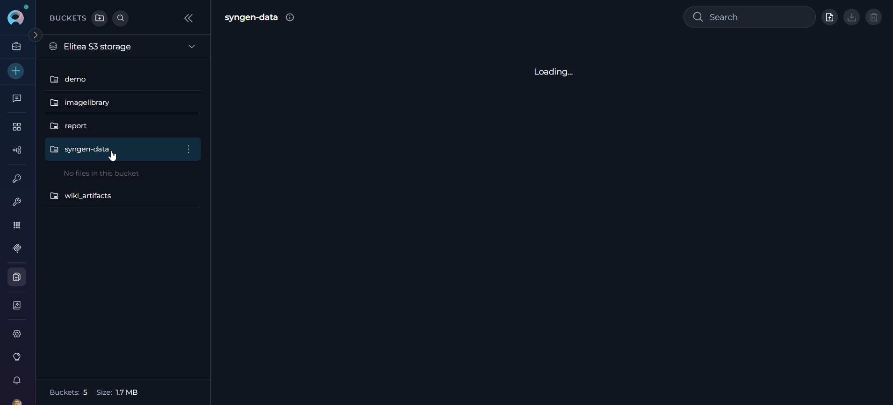
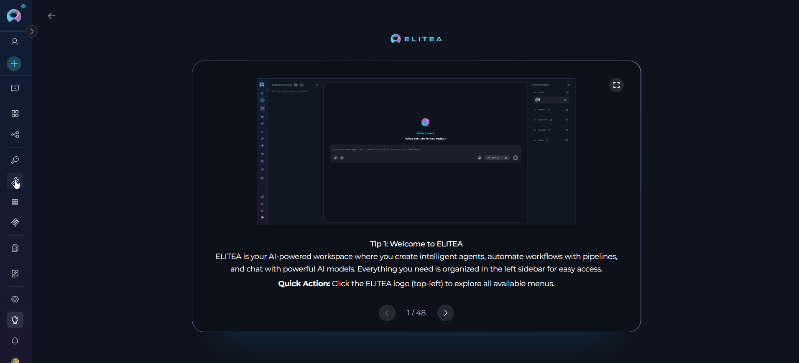
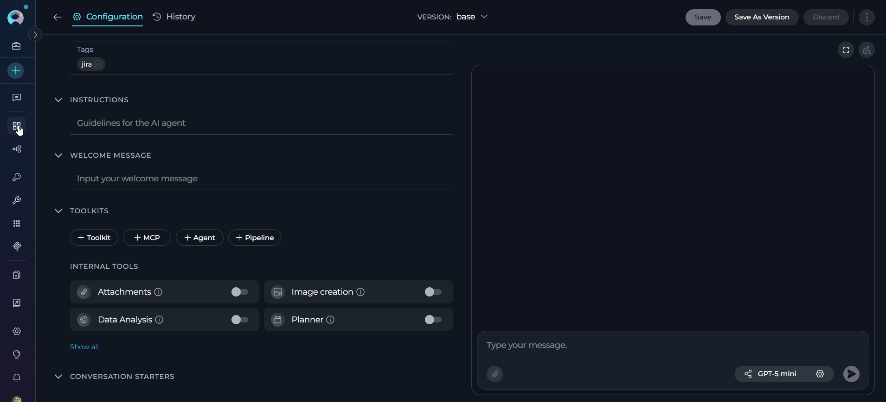
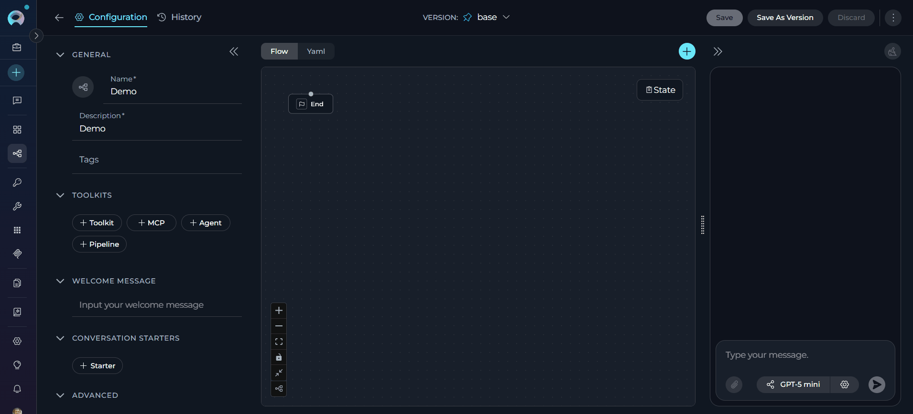
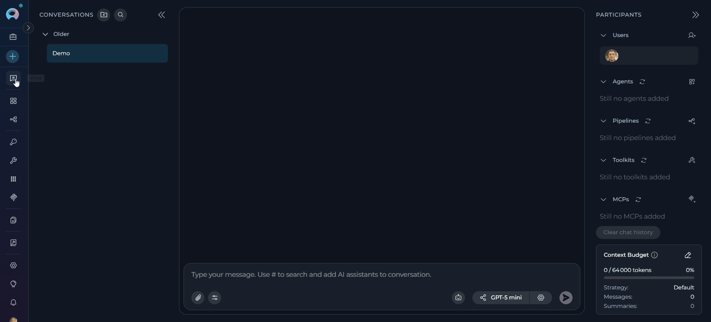
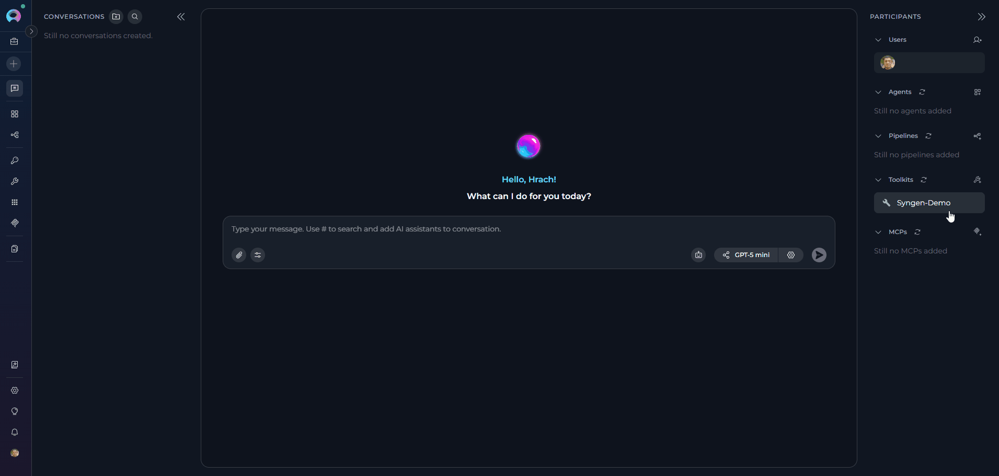
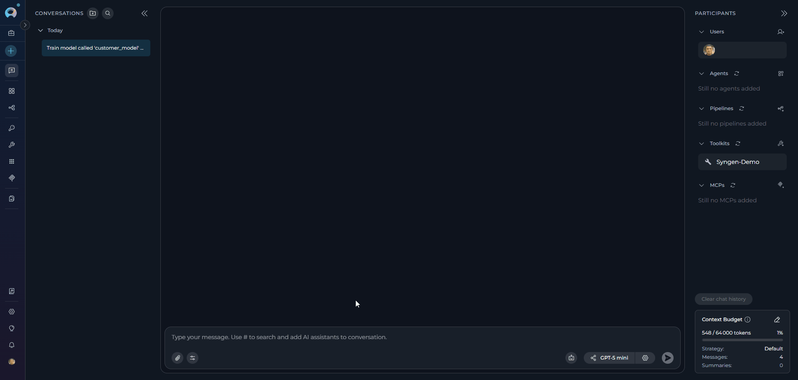
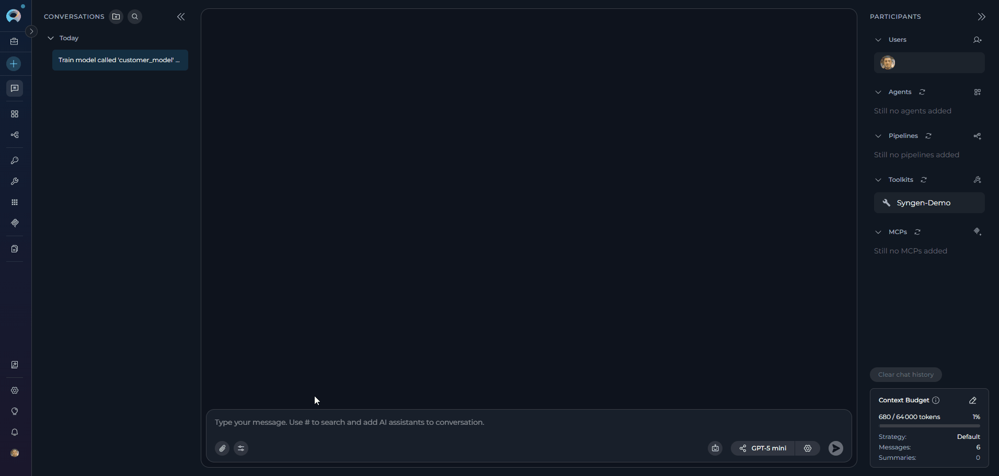

# Syngen Toolkit Integration Guide

---

## Introduction

This guide is your definitive resource for integrating and utilizing the **Syngen Toolkit** within ELITEA. It provides a comprehensive, step-by-step walkthrough — from uploading your training data to configuring the toolkit in ELITEA and effectively using it within your Agents, Pipelines, and Chat. By following this guide, you will unlock AI-driven **synthetic tabular data generation** capabilities directly within the ELITEA platform, enabling you to create realistic, privacy-preserving datasets without exposing real production data. This integration empowers you to leverage AI-driven automation to generate high-quality synthetic data as part of your development, testing, and machine-learning workflows.

**Brief Overview of the Syngen Toolkit**

The Syngen Toolkit brings powerful **unsupervised** synthetic data generation to ELITEA. It uncovers the patterns, trends, and correlations hidden within any tabular dataset you provide and reproduces them in a fully synthetic form — meaning the generated data is statistically similar to your source data but contains no real records. The result is a referentially intact dataset that can replace production data exports in less protected environments, eliminating the need for manual data classification or obfuscation.

Key capabilities include:

*   **Model Training:** Learn the statistical structure of any source tabular dataset and produce a reusable trained model, stored as an artifact in your designated ELITEA Artifacts bucket.
*   **Synthetic Data Generation:** Use a previously trained model to generate any desired number of synthetic rows, with optional reproducibility via a random seed.
*   **Model Inspection:** List all trained models registered in the bucket, including column metadata, training settings, and creation timestamps.
*   **Broad Data Type Support:** Floats, integers, datetime, text, categorical, and binary columns are all handled automatically through dedicated per-column-type neural modules.
*   **Artifact-Backed Storage:** All trained model archives and generated CSV outputs are persisted in your ELITEA Artifacts bucket, making them shareable and reusable across agents and pipeline runs.

**Typical Use Cases:**

*   Generating safe, privacy-preserving test data for QA and staging environments.
*   Augmenting small datasets for machine learning model development.
*   Producing synthetic datasets for demos, prototyping, and load testing.
*   Replacing production data exports with statistically equivalent synthetic versions.

---

## System Integration with ELITEA

Unlike most ELITEA toolkits, the Syngen Toolkit does **not** require external API credentials or a separate credential creation step. Authentication is handled entirely within the platform — the toolkit uses your current ELITEA session to connect to the platform's own Artifacts storage. The integration is a straightforward **three-step process: Upload Training Data → Create Toolkit → Use in Agents, Pipelines, or Chat**.

### Step 1: Upload Your Training Data to an Artifacts Bucket

Before creating the toolkit, your source data file must be available in an ELITEA Artifacts bucket.

1. **Navigate to Artifacts:** Open the sidebar and select **[Artifacts](../../menus/artifacts.md)**.
2. **Create or select a bucket:** Either create a new bucket (for example, `syngen-data`) or use an existing one. Note the exact bucket name — you will need it when configuring the toolkit.
3. **Upload your training file:** Upload your source CSV or Avro file to the bucket. Note the exact file name (for example, `customers.csv`).

     {loading=lazy}

!!! warning "Excel Format Not Currently Supported"
    Although the syngen library defines Excel (`.xlsx`, `.xls`) as a supported format, **Excel files will fail during training** due to a known bug in the underlying library. If your source data is in Excel format, please **convert it to CSV** before uploading to the Artifacts bucket. CSV and Avro are the only fully supported training file formats at this time.


### Step 2: Create the Syngen Toolkit

Once your training data is uploaded to the Artifacts bucket, create the Syngen Toolkit:

1. **Navigate to Toolkits Menu:** Open the sidebar and select **[Toolkits](../../menus/toolkits.md)**.
2. **Create New Toolkit:** Click the **`+ Create`** button.
3. **Select Syngen:** Choose **SyngenToolkit** from the list of available toolkit types.
4. **Configure Toolkit Settings:**

    | **Field** | **Description** | **Example** |
    |-----------|----------------|-------------|
    | **Toolkit Name** | Descriptive name for your toolkit | `Syngen - Customer Data Generator` |
    | **Description** | Optional description for the toolkit | `Generates synthetic customer records from the customers.csv template` |
    | **LLM Model** | The language model used to process tool requests and format responses | Select from available models |
    | **Bucket Name** | Artifacts bucket name for storing training data and generated models/outputs | `syngen-data` |

5. **Enable Desired Tools:** In the **"Tools"** section, select the checkboxes next to the specific Syngen tools you want to enable. **Enable only the tools your agents will actually use**
       * **[Make Tools Available by MCP](../mcp/make-tools-available-by-mcp.md)** - (optional checkbox) Enable this option to make the selected tools accessible through external MCP clients
6. **Save Toolkit:** Click **Save** to create the toolkit

     {loading=lazy}

#### Available Tools:

The Syngen Toolkit provides the following three tools:

| **Tool Name** | **Description** | **Primary Use Case** |
|---|---|---|
| **Train model** | Trains a synthetic data model on source data from the bucket. The trained model is packaged and saved back to the bucket | Train a new model from a template dataset |
| **Generate data** | Generates synthetic data using a previously trained model stored in the bucket. Returns a CSV file with the generated rows | Produce synthetic rows from an existing model |
| **List models** | Lists all trained models in the bucket's registry, including their column names, training settings, and timestamps | Inspect what models are available for generation |

!!! note "Background Processing"
    All three tools run as **background (asynchronous) operations**. They will display a **thinking** progress indicator in ELITEA Chat and Agents while the model trains or generates data. Training progress updates — such as the current epoch and loss value — are streamed back to the UI in real time so you can follow along as work progresses.

#### Tool Parameters

**Train model**

| Parameter | Required | Default | Description |
|---|---|---|---|
| **Model Name** | ✔️ Yes | — | Unique name for the model. Used to identify and retrieve the model later. Example: `customer_model` |
| **Training File Name** | ✔️ Yes | — | File name of the training data file in the bucket. Example: `customers.csv` |
| **Batch Size** | No | `32` | Training batch size. Reduce this to save memory on large datasets |
| **Drop Null** | No | `False` | If enabled, rows containing any missing values are dropped before training |
| **Epochs** | No | `10` | Number of training epochs. Higher values generally improve quality |
| **Row Limit** | No | *(all rows)* | Maximum number of rows to use for training. The toolkit takes the **first N rows** from the file (top-down truncation). Useful for large datasets or quick tests |

!!! note "Model Name Normalization"
    Syngen internally **slugifies** the model name before using it as a directory: underscores are converted to hyphens and the name is lowercased (for example, `Customer_Model` becomes `customer-model`). The toolkit handles this automatically when packaging and retrieving models. However, always use the **exact name you specified** in `model_name` when calling `generate_data` — the toolkit resolves the normalized form for you.

**Generate data**

| Parameter | Required | Default | Description |
|---|---|---|---|
| **Model Name** | ✔️ Yes | — | Name of the trained model to use. Must exactly match the name used during training |
| **Batch Size** | No | `32` | Generation batch size for memory management |
| **Number Of Avro Preview Rows** | No | *(none)* | Number of rows to preview when the output is in Avro format |
| **Random Seed** | No | *(none)* | Set a seed for fully reproducible generation results. Must be 0 or greater |
| **Size** | No | `100` | Number of synthetic rows to generate |

**List models**

No parameters required. Returns a formatted list of all models registered in the configured bucket.

#### Testing Toolkit Tools

After configuring your Syngen Toolkit, you can test individual tools directly from the Toolkit detail page using the **Test Settings** panel.

**General Testing Steps:**

1. **Select LLM Model:** Choose a Large Language Model from the model dropdown in the Test Settings panel.
2. **Configure Model Settings:** Adjust model parameters (Creativity, Max Completion Tokens, etc.) as needed.
3. **Select a Tool:** Choose `train_model`, `generate_data`, or `list_models` from the available tools list.
4. **Provide Input:** Enter the required parameters (for example, `model_name` and `training_file_name`).
5. **Run the Test:** Execute the tool and wait for the response.
6. **Review the Response:** Analyse the output to verify the tool is working correctly.

!!! tip "Key benefits of testing toolkit tools:"
    * Verify that the Artifacts bucket name is correct and accessible before integrating with an agent.
    * Confirm the training file exists in the bucket before running a full agent workflow.
    * Test generation parameters and preview the synthetic output format.
    > For detailed instructions on how to use the Test Settings panel, see **[How to Test Toolkit Tools](../../how-tos/credentials-toolkits/how-to-test-toolkit-tools.md)**.

---

### Step 3: Add the Syngen Toolkit to Your Workflows

Once the toolkit is saved, you can add it to your agents, pipelines, or chat conversations.

---

#### In Agents:

1. **Navigate to Agents:** Open the sidebar and select **[Agents](../../menus/agents.md)**.
2. **Create or Edit Agent:** Either create a new agent or select an existing agent to edit.
3. **Add Syngen Toolkit:**
     * In the **"TOOLKITS"** section of the agent configuration, click the **"+Toolkit"** icon.
     * Select your configured Syngen toolkit from the dropdown list.
     * The toolkit will be added to your agent with the previously enabled tools available.

     {loading=lazy}   

Your agent can now train models and generate synthetic data as part of automated workflows.

---

#### In Pipelines:

1. **Navigate to Pipelines:** Open the sidebar and select **[Pipelines](../../menus/pipelines.md)**.
2. **Create or Edit Pipeline:** Either create a new pipeline or select an existing pipeline to edit.
3. **Add Syngen Toolkit:**
     * In the **"TOOLKITS"** section of the pipeline configuration, click the **"+Toolkit"** icon.
     * Select your configured Syngen toolkit from the dropdown list.
     * The toolkit will be added to your pipeline with the previously enabled tools available.

     {loading=lazy}

---

#### In Chat:

1. **Navigate to Chat:** Open the sidebar and select **[Chat](../../menus/chat.md)**.
2. **Start New Conversation:** Click **`+Create`** or open an existing conversation.
3. **Add Toolkit to Conversation:**
     * In the chat **Participants** section, look for the **Toolkits** element.
     * Click the **"Add Tools"** icon to open the tools selection dropdown.
     * Select your configured Syngen toolkit from the dropdown list.
     * The toolkit will be added to your conversation with all previously enabled tools available.
4. **Use Toolkit in Chat:** You can now request synthetic data generation directly by prompting the AI.

     {loading=lazy}

!!! example "Example Chat Usage:"
    - "Train a model called `customer_model` using `customers.csv` with 20 epochs."
    - "Generate 500 rows of synthetic customer data using `customer_model`."
    - "List all trained models available in the bucket."
    - "Generate a reproducible dataset of 200 rows using `customer_model` with random seed 42."

---

## Instructions and Prompts for Using the Syngen Toolkit

To effectively instruct your ELITEA Agent to use the Syngen Toolkit, provide clear and precise instructions within the Agent's **"Instructions"** field. These guide the Agent on *when* and *how* to invoke the available Syngen tools.

### Instruction Creation for Agents

When crafting instructions for the Syngen Toolkit, clarity and parameter precision are essential. All three tools run as background operations, so instructions should account for the fact that results may take a moment to appear while the model trains or generates data.

*   **Direct and Action-Oriented:** Use strong action verbs. For example, "Use the `train_model` tool...", "Generate synthetic data using...", "List all available models...".
*   **Parameter-Centric:** Clearly enumerate each required and optional parameter, specifying whether values come from user input, fixed configuration, or a prior step's output.
*   **Step-by-Step Structure:** For multi-step workflows (for example, train then generate), number the steps explicitly.
*   **Add Conversation Starters:** Include example prompts that users can use to trigger each workflow.

When instructing your Agent to use a Syngen tool, follow this structured pattern:

1. **State the Goal:** Describe the objective. For example, "Goal: Train a synthetic data model on the uploaded customer dataset."
2. **Specify the Tool:** Identify the exact tool. For example, "Tool: Use the `train_model` tool."
3. **Define Parameters:** List all parameters with their values or sources.
4. **Describe Expected Outcome:** State what a successful result looks like. For example, "Outcome: A trained model artifact will be saved to the bucket and a confirmation message returned."
5. **Add Conversation Starters:** Include example prompts. For example, "Conversation Starters: 'Train a model on my data file.', 'Generate 500 synthetic rows.'"

!!! example "Example Agent Instructions"
    **Agent Instructions for a Train → Generate Workflow:**

    ```markdown
    ## Synthetic Data Generation Workflow

    ### Step 1: Train Model
    1. Goal: Train a synthetic data model from the uploaded template file.
    2. Tool: Use the train_model tool.
    3. Parameters:
       - model_name: Ask the user for a model name, or use "default_model" if not provided.
       - training_file_name: Ask the user for the CSV file name in the bucket.
       - epochs: Use 20 unless the user specifies otherwise.
       - batch_size: Use 32 (default).
       - drop_null: Use False (default).
    4. Outcome: Confirm to the user that training is complete and the model has been saved to the bucket.

    ### Step 2: Generate Data
    1. Goal: Generate synthetic rows using the trained model.
    2. Tool: Use the generate_data tool.
    3. Parameters:
       - model_name: Use the same model_name from Step 1.
       - size: Ask the user how many rows to generate (default: 100).
       - random_seed: Ask the user if they need reproducible results; use the provided seed if so.
    4. Outcome: A CSV file with the generated rows will be returned and saved to the bucket.

    ## Conversation Starters
    - "Train a model on my data file."
    - "Generate 500 synthetic rows."
    - "What models are available?"
    ```

---

## Real-World Usage Examples

The following examples demonstrate how to interact with the Syngen Toolkit in ELITEA Chat and Agents. Each example shows a realistic user request and the corresponding agent response.

??? example "train_model — Train a Synthetic Data Model"

    **Chat Example:**
    ```
    User: "Please train a model called 'customer_model' using 'customers.csv'. Use 20 epochs."

    Agent Response:  Start training the synthetic data model now.

    [Agent uses train_model tool — background processing]

    ✔️ Training completed for model 'customer_model'.
    - Model saved as: customer_model_model.tgz
    - Bucket: syngen-data
    - Epochs: 20 | Batch size: 32 | Drop null: False
    - Columns learned: customer_id, first_name, last_name, e_mail, country, city, age, account_balance

    The model is ready for data generation.
    ```
    {loading=lazy width="650"}

??? example "generate_data — Generate Synthetic Rows"

    **Chat Example:**
    ```
    User: "Generate 500 rows of synthetic customer data using 'customer_model'. Make it reproducible with seed 42."

    Agent Response: Generate synthetic data now using the trained model.

    [Agent uses generate_data tool — background processing]

    ✔️ Generated 500 rows of synthetic data for model 'customer_model'.
    - Output file: customer_model_synthetic.csv
    - Saved to bucket: syngen-data
    - Random seed: 42 (fully reproducible)

    The synthetic CSV file is ready in the Artifacts bucket.
    ```
    {loading=lazy width="650"}

??? example "list_models — Inspect Available Models"

    **Chat Example:**
    ```
    User: "What trained models are available?"

    Agent Response: Check the model registry.

    [Agent uses list_models tool — background processing]

    Found 2 trained model(s):

    1. Model: customer_model
       - Columns (8): customer_id, first_name, last_name, e_mail, country, city, age, account_balance
       - Training file: customers.csv
       - Model file: customer_model_model.tgz
       - Training settings:
         • Epochs: 20
         • Batch size: 32
         • Drop null: False
       - Created: 2025-06-15T10:23:41

    2. Model: orders_model
       - Columns (5): order_id, customer_id, product, quantity, price
       - Training file: orders.csv
       - Model file: orders_model_model.tgz
       - Training settings:
         • Epochs: 10
         • Batch size: 32
         • Drop null: False
       - Created: 2025-06-14T08:55:10
    
    ```
    {loading=lazy width="650"}


---

!!! note "Limitations"
    *   **Single table per model:** Each training run learns from a single table. Multi-table or relational training is not supported through the toolkit.
    *   **Large dataset training time:** Training on large datasets can be time-consuming. Use the **Row limit** parameter to cap the number of rows when testing or prototyping.
    *   **Parallel generation not supported:** The `generate_data` tool always runs in single-thread (non-parallel) mode. A parallel execution option is not available in the current release.

---

## Troubleshooting

??? warning "Toolkit Type Not Visible When Creating a Toolkit"
    **Problem:** The Syngen Toolkit option does not appear in the toolkit type selection list when clicking **`+ Create`**.

    **Troubleshooting Steps:**

    1. **Verify the feature is enabled:** The Syngen Toolkit must be enabled on your ELITEA platform. If the option does not appear, contact your platform administrator to confirm it has been activated.
    2. **Refresh the browser:** After a new toolkit type becomes available, a browser refresh may be required to load the updated list.

??? warning "Training Fails — Training File Not Found"
    **Problem:** The `train_model` tool returns an error indicating the training file could not be found or downloaded.

    **Troubleshooting Steps:**

    1. **Verify the file exists in the bucket:** Navigate to **Artifacts** → your bucket and confirm the training file is present with the exact file name you specified.
    2. **Check the bucket name:** Ensure the **Bucket name** in the toolkit configuration exactly matches the bucket name in Artifacts.
    3. **Check the file name spelling:** The file name is case-sensitive. Ensure it exactly matches the file name in the bucket, including the file extension.
    4. **Verify bucket scope:** Confirm the bucket belongs to the same ELITEA project as the toolkit.

??? warning "Training Fails — Processing Error"
    **Problem:** Training fails with an error message or failure notification.

    **Troubleshooting Steps:**

    1. **Reduce dataset size:** Use the **Row limit** parameter to restrict training to the first N rows of your file, or lower the **Batch size** to decrease memory consumption. Large datasets or large batch sizes can trigger an `out_of_memory` error.
    2. **Check data format validity:** Ensure the training file is a valid, UTF-8 encoded file of a supported format (CSV or Avro) and is not corrupted or empty. Invalid or unparseable data produces an `invalid_input` error.
    3. **Review the error message:** The error response includes a human-readable description, an `error_category` field (such as `training_failed`, `out_of_memory`, `invalid_input`, or `runtime_error`), and a full stack trace to help pinpoint the root cause.
    4. **Check for slugified name conflicts:** Model names are normalized to lowercase with underscores converted to hyphens (`my_model` → `my-model`). If two model names slugify to the same string, the second training run will overwrite the first. Use distinct model names to avoid this.

??? warning "Not Authorized to Access Artifacts (403 Error)"
    **Problem:** Training or generation fails with an authorization error, or the error message contains "Not authorized to access artifact".

    **Troubleshooting Steps:**

    1. **Verify the LLM Model setting:** The toolkit authenticates against Artifacts storage using the API key associated with your selected **LLM Model**. Ensure the **LLM Model** field in the toolkit configuration points to a model that is active and accessible in your project.
    2. **Check the project scope:** The bucket must belong to the same ELITEA project as the toolkit. If the toolkit was configured in one project and the bucket was created in another, artifact access will be denied.
    3. **Re-save the toolkit:** If your API key has recently been rotated or refreshed, re-open the toolkit configuration and save it again to pick up the updated credentials.

??? warning "Generation Fails — Model Not Found"
    **Problem:** The `generate_data` tool returns an error indicating the model could not be found.

    **Troubleshooting Steps:**

    1. **Verify the model was trained successfully:** Run `list_models` to confirm the model appears in the registry. If it does not, re-run `train_model`.
    2. **Check the model name spelling:** The model name in `generate_data` must exactly match the name used during training (case-sensitive, before normalization).
    3. **Check the bucket:** Confirm the model archive file (`{model_name}_model.tgz`) exists in the Artifacts bucket.
    4. **Check for a partial training run:** If a previous training run was cancelled or interrupted before the upload step, the model archive may not have been saved. Re-run `train_model` to produce a complete model.

??? warning "list_models Returns 'No trained models found'"
    **Problem:** `list_models` returns a message saying no trained models were found, even though models have been trained.

    **Troubleshooting Steps:**

    1. **Check the bucket name:** Verify the **Bucket name** in the toolkit configuration is correct and refers to the same bucket where training was run.
    2. **Verify the registry file exists:** Navigate to **Artifacts** → your bucket and look for `_syngen_models_registry.json`. If it does not exist, no training job has completed successfully in this bucket yet.
    3. **Check for a registry update failure:** If training completed but the registry was not updated (for example, due to a network interruption during upload), the model archive will exist in the bucket but will not appear in the list. Re-running training will regenerate the registry entry. The toolkit retries the registry update up to three times automatically, but a persistent failure may still leave it incomplete.

??? warning "Training Progress Appears to Stall or Show No Updates"
    **Problem:** Training appears to freeze after starting — no epoch progress lines are visible for several seconds, or numerical progress bars seem to be missing from the output.

    **Troubleshooting Steps:**

    1. **This is expected behavior:** The toolkit batches all training output at one-second intervals. If an epoch completes in under one second, its output may be grouped with the next batch. Short pauses between updates are normal.
    2. **Progress bars are intentionally hidden:** Numerical progress bars produced by the training process (tqdm-style `it/s` counters) are automatically filtered from the output to reduce noise. Only epoch-level loss values are surfaced, in the format `Training epoch N, loss: X.XXXX`.
    3. **Verify the process is still active:** If there is no output for more than a few minutes, the training job may have silently failed. Check the error response or contact your platform administrator if the job does not complete.

### Support Contact

If you encounter issues not covered in this guide or need additional assistance with Syngen Toolkit integration, please refer to **[Contact Support](../../support/contact-support.md)** for detailed information on how to reach the ELITEA Support Team.

---

## FAQ

??? question "Do I need to create separate API credentials for the Syngen Toolkit?"
    **No.** Unlike toolkits that connect to external services (such as GitHub, Jira, or Confluence), the Syngen Toolkit has no external service to authenticate with. It connects exclusively to ELITEA's own internal Artifacts storage using your existing session. There is no **Credentials** step in the setup flow — only the toolkit itself needs to be configured.

??? question "Why do all Syngen tools run in the background?"
    Training a model and running data generation can take anywhere from seconds to several minutes, depending on dataset size, the number of training epochs, and available resources. Running these operations in the background prevents ELITEA from becoming unresponsive during processing and allows real-time progress updates — such as training epoch progress — to be streamed back to the UI as they happen. You can also cancel a running job at any time.

??? question "Can I cancel a running training or generation job?"
    **Yes.** The toolkit supports mid-job cancellation. When you stop a running invocation in ELITEA, the toolkit signals the background process to terminate gracefully. If the process does not stop within five seconds, it is force-killed. Note that if training is cancelled before the final upload step completes, the model archive will not be saved to the bucket and the registry will not be updated — re-run `train_model` to get a complete model.

??? question "What file formats can I use as training data?"
    The following source file formats are supported:

    | Format | Extensions |
    |---|---|
    | CSV and delimited text | `.csv`, `.tsv`, `.psv`, `.txt` |
    | Avro | `.avro` |

    All files must be encoded in UTF-8.

    !!! warning "Excel Not Currently Supported"
        Excel (`.xlsx`, `.xls`) files will fail during training due to a known bug in the syngen library. Convert your Excel file to CSV before uploading it to the Artifacts bucket.

??? question "Why do some training epochs not appear in the progress output?"
    The toolkit batches all training output at one-second intervals to avoid flooding the UI. Epochs that complete faster than one second may have their output grouped with the next batch, so you will not necessarily see every epoch individually. Additionally, numerical tqdm-style progress bars (`it/s` counters) are silently filtered to keep the output readable. Only epoch-level loss values are shown, in the format `Training epoch N, loss: X.XXXX`.

??? question "Can I reuse a trained model across multiple agents?"
    **Yes.** Because trained model archives are stored in your Artifacts bucket, any agent or pipeline configured with the same Syngen Toolkit (pointing to the same bucket) can use the same trained model for generation. You only need to train once and can generate data as many times as you need.

??? question "How do I generate reproducible synthetic data?"
    When invoking `generate_data`, set the **random_seed** parameter to any whole number (0 or greater). Using the same seed with the same model and the same size setting will always produce the same output, making your results fully reproducible.

??? question "What happens to temporary files during training and generation?"
    The toolkit automatically creates a private working area for each job while it runs and deletes it entirely once the job finishes — whether it succeeds or fails. Only the final outputs (the model archive and generated CSV) are kept, and these are saved to your Artifacts bucket.

??? question "Is my original training data stored anywhere?"
    A small statistical sample of the training data is preserved inside the model archive that gets saved to your Artifacts bucket. This sample is used to support the generation process. If your source data is sensitive, treat the model archive with the same level of care as the original data and control who has access to the Artifacts bucket.

??? question "Can I train on very large datasets?"
    Yes, but training time increases with dataset size. For initial testing or prototyping, use the **Row limit** parameter to restrict training to the first N rows of your file. Once you are happy with the setup, you can remove the limit and run a full training job.

---

!!! reference "Useful ELITEA Resources"
    To further enhance your understanding of ELITEA workflows and toolkits, here are helpful internal resources:


      * **[How to Use Chat Functionality](../../how-tos/chat-conversations/how-to-use-chat-functionality.md)** - *Complete guide to using ELITEA Chat with toolkits for interactive operations.*
      * **[Create and Edit Agents from Canvas](../../how-tos/chat-conversations/how-to-create-and-edit-agents-from-canvas.md)** - *Learn how to quickly create and edit agents directly from chat canvas.*
      * **[Create and Edit Toolkits from Canvas](../../how-tos/chat-conversations/how-to-create-and-edit-toolkits-from-canvas.md)** - *Discover how to create and configure toolkits directly from the chat interface.*
      * **[Create and Edit Pipelines from Canvas](../../how-tos/chat-conversations/how-to-create-and-edit-pipelines-from-canvas.md)** - *Guide to building and modifying pipelines from chat canvas.*
---