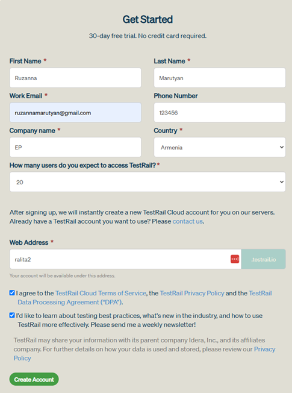
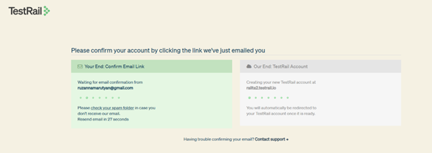
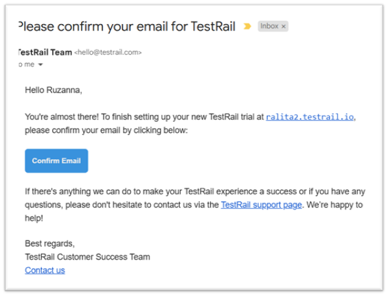
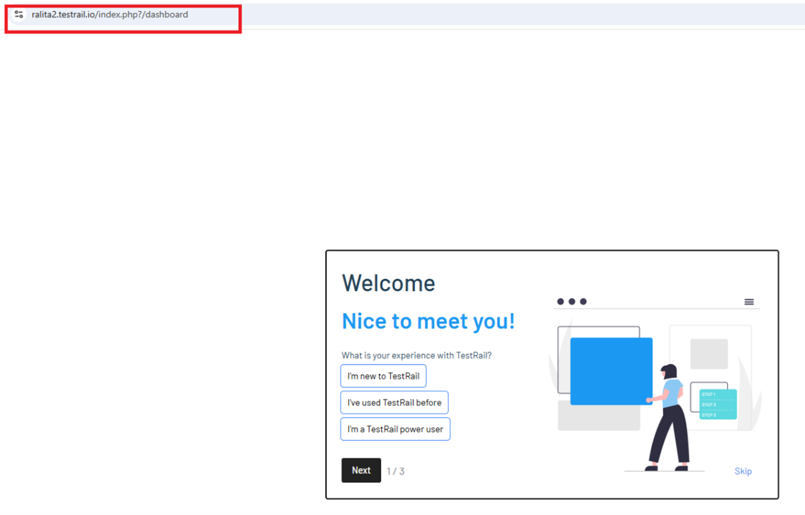
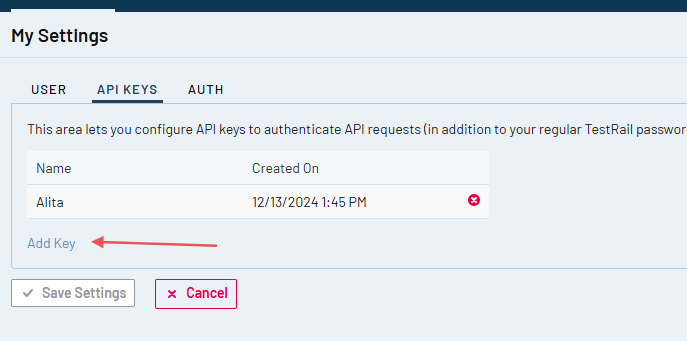

# ELITEA Toolkit Guide: TestRail Integration

## Introduction

### Purpose of this Guide

This guide is your definitive resource for integrating and utilizing the **TestRail toolkit** within ELITEA. It provides a comprehensive, step-by-step walkthrough, from generating a TestRail API key to configuring the toolkit in ELITEA and effectively using it within your Agents. By following this guide, you will unlock the power of automated test management, streamlined testing workflows, and enhanced team collaboration, all directly within the ELITEA platform. This integration empowers you to leverage AI-driven automation to optimize your software testing lifecycle using the combined strengths of ELITEA and TestRail.

### Brief Overview of TestRail

TestRail is a comprehensive, web-based test management tool that helps teams of all sizes efficiently organize, manage, and track their software testing efforts. It provides a centralized platform to streamline your testing process, offering features for:

*   **Test Case Management:** Create, organize, and manage test cases with rich text formatting, attachments, and custom fields. Structure test cases into projects, suites, and sections for easy navigation and maintenance.
*   **Test Execution & Tracking:** Plan and execute test runs and test plans, track test results in real-time, and assign tests to team members. Get a clear overview of testing progress and identify areas needing attention.
*   **Reporting & Metrics:** Generate insightful reports and metrics on test coverage, test results, and team performance. Use dashboards and charts to visualize testing progress and identify trends.
*   **Integration with Development Tools:** Seamlessly integrates with issue trackers like Jira and automation tools, making it a central hub for your testing ecosystem.
*   **Customization & Scalability:** Adapt TestRail to your specific testing processes with customizable workflows, fields, and templates. Scale TestRail as your team and projects grow.

Integrating TestRail with ELITEA brings these robust test management capabilities directly into your AI-powered workflows. Your ELITEA Agents can then interact with your TestRail instance to automate test-related tasks, enhance testing processes, and improve team collaboration through intelligent automation.

## Toolkit's Account Setup and Configuration in TestRail

!!! note "Integration with ELITEA"
    The credentials you create in this section will be used when creating your TestRail credential in ELITEA (Step 1 of the integration process).

### Account Setup

If you don't have a TestRail account yet, here's how to get started with a free trial:

1.  **Visit TestRail Website:** Open your web browser and navigate to [TestRail's official website](https://www.gurocksoftware.com/testrail/).
2.  **Start a Free Trial:** On the homepage, locate and click the **"Free Trial"** button.
3.  **Fill Out the Registration Form:** Provide your details in the registration form. This typically includes your name, company email address, company name, and other relevant information. **For professional use, it's highly recommended to use your company email.**
4.  **Submit the Form:** Click on the **"Start Free Trial"** or similar button to submit the form. TestRail will send a confirmation email to the email address you provided.

    

5.  **Verify Your Email:** Open the confirmation email from TestRail and click on the verification link provided within the email. This step is crucial to activate your TestRail trial account.

    

    

6.  **Access Your Account:** After email verification, you will be redirected to your new TestRail instance or prompted to log in. Follow any on-screen instructions to complete the setup and access your TestRail account.

### Token/API Key Generation: Creating an API Key in TestRail

To securely integrate TestRail with ELITEA, you need to generate an API key within TestRail. This API key will be used by ELITEA to authenticate and access your TestRail instance.

**Follow these steps to create an API Key:**

1.  **Log in to TestRail:** Access your TestRail account using your credentials.

    

2.  **Access My Settings:** Click on your profile name in the top right corner of the TestRail interface. From the dropdown menu, select **"My Settings"**.
3.  **Navigate to API Keys:** In the "My Settings" page, find and click on the **"API keys"** tab.
4.  **Add API Key:** Click the **"Add Key"** button to create a new API key.

    

5.  **Name the API Key:** In the "Name" field, enter a descriptive name for the API key, such as "ELITEA Integration Key". This will help you identify the purpose of this key later.
6.  **Generate API Key:** Click the **"Generate Key"** button. TestRail will generate a new API key and display it to you.
7.  **Securely Copy and Store Your API Key:** **Immediately copy the generated API key.** This is the only time it will be displayed in full. Store it securely in a password manager or, preferably, ELITEA's built-in Secrets feature for enhanced security within ELITEA. You will need this API key to configure the TestRail toolkit in ELITEA.

## System Integration with ELITEA

To integrate TestRail with ELITEA, you need to follow a three-step process: **Create Credentials → Create Toolkit → Use in Agents**. This workflow ensures secure authentication and proper configuration.

### Step 1: Create TestRail Credentials

Before creating a toolkit, you must first create TestRail credentials in ELITEA:

1. **Navigate to Credentials Menu:** Open the sidebar and select **[Credentials](../../menus/credentials.md)**.
2. **Create New Credential:** Click the **`+ Create`** button.
3. **Select TestRail:** Choose **TestRail** as the credential type.
4. **Configure Credential Details:**
     * **Display Name:** Enter a descriptive name (e.g., "TestRail - QA Environment")
     * **URL:** Enter the URL of your TestRail instance (e.g., `https://yourcompany.testrail.io/`)
     * **Email:** Enter the email address associated with your TestRail account
     * **Password:** Enter your TestRail API key (the one you generated in the previous section)
5. **Shared Credential:** Check the **Shared** checkbox if you want this credential to be accessible by all team members in the current project
6. **Save Credential:** Click **Save** to create the credential

!!! tip "Security Recommendation"
    It's highly recommended to use **[Secrets](../../menus/settings/secrets.md)** for API keys instead of entering them directly. Create a secret first, then reference it in your credential configuration.

### Step 2: Create TestRail Toolkit

Once your credentials are configured, create the TestRail toolkit:

1. **Navigate to Toolkits Menu:** Open the sidebar and select **[Toolkits](../../menus/toolkits.md)**.
2. **Create New Toolkit:** Click the **`+ Create`** button.
3. **Select TestRail:** Choose **TestRail** from the list of available toolkit types.
4. **Configure Credentials:** 
     * In the **Configuration** section, select your previously created TestRail credential from the **Credentials** dropdown
5. **Configure Advanced Options (Optional):**
     * **PgVector Configuration:** Select a PgVector connection for vector database integration (required for indexing features)
     * **Embedding Model:** Select an embedding model for text processing and semantic search capabilities (required for indexing features)
6. **Enable Desired Tools:** In the **"Tools"** section, select the checkboxes next to the specific TestRail tools you want to enable. **Enable only the tools your agents will actually use** to follow the principle of least privilege
7. **Save Toolkit:** Click **Save** to create the toolkit

#### Available Tools:

The TestRail toolkit provides the following tools for interacting with TestRail test cases and suites, organized by functional categories:

| **Tool Category** | **Tool Name** | **Description** | **Primary Use Case** |
|:-----------------:|---------------|-----------------|----------------------|
| **Test Case Access** | | | |
| | **Get case** | Retrieves information about a single test case from TestRail | Access detailed information about a specific test case by its ID |
| | **Get cases** | Extracts a list of test cases in specified format (json, csv, or markdown) | Get an overview of all test cases in a project or suite |
| | **Get cases by filter** | Extracts test cases from a specified project based on given case attributes | Find test cases matching specific criteria (priority, type, status, etc.) |
| **Test Case Management** | | | |
| | **Add case** | Adds a new test case into TestRail per defined parameters | Create new test cases programmatically with custom fields and properties |
| | **Add cases** | Adds new test cases into TestRail in bulk | Efficiently create multiple test cases at once |
| | **Update case** | Updates an existing test case (partial updates supported) | Modify test case details, fields, or properties |
| **Suite Management** | | | |
| | **Get suites** | Extracts a list of test suites for a given project from TestRail | Retrieve all test suites available in a project |
| **Indexing & Search** | | | |
| | **Index data** | Loads TestRail test case data to index for semantic search | Enable advanced search and discovery across test cases with AI-powered semantic search |
| | **Search index** | Performs searches across indexed content | Find specific test case content across indexed data |
| | **Stepback search index** | Performs advanced contextual searches with broader scope | Execute sophisticated searches with expanded context |
| | **Stepback summary index** | Creates comprehensive summaries of indexed content | Generate intelligent summaries of test case information |
| | **Remove index** | Removes previously created search indexes | Clean up and manage indexed content |
| | **List collections** | Lists available indexed collections | View and manage indexed data collections |

### Step 3: Use Toolkit in Agents, Pipelines, or Chat

Now you can add the configured TestRail toolkit to your agents, pipelines, or use it directly in chat:

**For Agents:**

1. **Navigate to Agents:** Open the sidebar and select **Agents**.
2. **Create or Edit Agent:** Either create a new agent or select an existing agent to edit.
3. **Add TestRail Toolkit:** 
     * In the **"Tools"** section of the agent configuration, click the **"+Toolkit"** icon
     * Select your TestRail toolkit from the dropdown menu
     * The toolkit will be added to your agent with the previously configured tools enabled

Your agent can now interact with TestRail using the configured toolkit.

**For Pipelines:**

1. **Navigate to Pipelines:** Open the sidebar and select **Pipelines**.
2. **Create or Edit Pipeline:** Either create a new pipeline or select an existing pipeline to edit.
3. **Add TestRail Toolkit:** 
     * In the **"Tools"** section of the pipeline configuration, click the **"+Toolkit"** icon
     * Select your TestRail toolkit from the dropdown menu

**For Chat:**

1. **Navigate to Chat:** Open the sidebar and select **Chat**.
2. **Add TestRail Toolkit:** 
     * In the chat Participants section, look for the **Toolkits** element
     * Click to add a toolkit and select your TestRail toolkit from the available options

## Instructions and Prompts for Using the TestRail Toolkit

To effectively instruct your ELITEA Agent to use the TestRail toolkit, you need to provide clear and precise instructions within the Agent's "Instructions" field. These instructions are crucial for guiding the Agent on *when* and *how* to utilize the available TestRail tools to achieve your desired automation goals.

### Instruction Creation for OpenAI Agents

When crafting instructions for the TestRail toolkit, especially for OpenAI-based Agents, clarity and precision are paramount. Break down complex tasks into a sequence of simple, actionable steps. Explicitly define all parameters required for each tool and guide the Agent on how to obtain or determine the values for these parameters. OpenAI Agents respond best to instructions that are:

*   **Direct and Action-Oriented:** Employ strong action verbs and clear commands to initiate actions. For example, "Use the 'get_case' tool...", "Create a test case named...", "Search for test cases containing...".

*   **Parameter-Centric:** Clearly enumerate each parameter required by the tool. For each parameter, specify:
    *   Its name (exactly as expected by the tool)
    *   Its expected data type (string, integer, JSON object, etc.)
    *   How the Agent should obtain the value – whether from user input, derived from previous steps in the conversation, retrieved from an external source, or a predefined static value

*   **Contextually Rich:** Provide sufficient context so the Agent understands the overarching objective and the specific scenario in which each TestRail tool should be applied within the broader workflow. Explain the desired outcome or goal for each tool invocation.

*   **Step-by-Step Structure:** Organize instructions into a numbered or bulleted list of steps for complex workflows. This helps the Agent follow a logical sequence of actions.

*   **Add Conversation Starters:** Include example conversation starters that users can use to trigger this functionality. For example, "Conversation Starters: 'Show me test case 123', 'Create a new login test', 'Find all high priority test cases'"

When instructing your Agent to use a TestRail toolkit tool, adhere to this structured pattern:

1. **State the Goal:** Begin by clearly stating the objective you want to achieve with this step. For example, "Goal: To retrieve details of test case with ID 123."

2. **Specify the Tool:** Clearly indicate the specific TestRail tool to be used for this step. For example, "Tool: Use the 'get_case' tool."

3. **Define Parameters:** Provide a detailed list of all parameters required by the selected tool. For each parameter:
   - **Parameter Name:** `<Parameter Name as defined in tool documentation>`
   - **Value or Source:** `<Specify the value or how to obtain the value. Examples: "user input", "from previous step", "hardcoded value '123'", "value of variable X">`

4. **Describe Expected Outcome (Optional but Recommended):** Briefly describe the expected result or outcome after the tool is successfully executed. For example, "Outcome: The Agent will display the full details of test case 123."

**Example Instructions:**

*   **Retrieve a Specific Test Case:**

```markdown
Goal: Retrieve detailed information about test case ID 2260.
Tool: Use the 'get_case' tool.
Parameters:
  - testcase_id: "2260" (from user input or conversation context)
Outcome: Display the complete details of test case 2260 including title, steps, expected results, and custom fields.
```

*   **Get All Test Cases in a Project:**

```markdown
Goal: Get a list of all test cases from project ID 1.
Tool: Use the 'get_cases' tool.
Parameters:
  - project_id: "1"
  - output_format: "json" (default)
  - keys: ["id", "title", "priority_id", "type_id"] (optional, specify which fields to include)
  - suite_id: (optional, only if project uses multiple suites)
Outcome: Display a formatted list of all test cases in project 1.
```

*   **Filter Test Cases by Criteria:**

```markdown
Goal: Find all high-priority functional test cases in project 1.
Tool: Use the 'get_cases_by_filter' tool.
Parameters:
  - project_id: "1"
  - json_case_arguments: '{"priority_id": 1, "type_id": 2}' (high priority and functional type - verify IDs in your TestRail instance)
  - output_format: "json"
  - keys: ["id", "title", "priority_id", "type_id"]
Outcome: Display filtered list of test cases matching the criteria.
```

*   **Create a New Test Case:**

```markdown
Goal: Create a new test case for login functionality testing.
Tool: Use the 'add_case' tool.
Parameters:
  - section_id: "5" (the section ID where the test case should be created)
  - title: "Verify successful login with valid credentials"
  - case_properties: {
      "template_id": 1,
      "priority_id": 2,
      "type_id": 1,
      "custom_preconds": "User must have valid account credentials",
      "custom_steps": "1. Navigate to login page\n2. Enter valid username\n3. Enter valid password\n4. Click Login button",
      "custom_expected": "User is successfully logged in and redirected to dashboard"
    }
Outcome: A new test case is created in TestRail with the specified details.
```

*   **Bulk Create Test Cases:**

```markdown
Goal: Create multiple test cases from a list of requirements.
Tool: Use the 'add_cases' tool.
Parameters:
  - add_test_cases_data: '[
      {
        "section_id": "5",
        "title": "Test Case 1",
        "case_properties": {"priority_id": 1, "custom_steps": "Step 1", "custom_expected": "Result 1"}
      },
      {
        "section_id": "5",
        "title": "Test Case 2",
        "case_properties": {"priority_id": 2, "custom_steps": "Step 2", "custom_expected": "Result 2"}
      }
    ]'
Outcome: Multiple test cases are created in TestRail in a single operation.
```

*   **Update an Existing Test Case:**

```markdown
Goal: Update the priority of test case 123 to High.
Tool: Use the 'update_case' tool.
Parameters:
  - case_id: "123"
  - case_properties: {"priority_id": 1}
Outcome: Test case 123 is updated with high priority.
```

*   **Get Test Suites:**

```markdown
Goal: List all test suites in project 1.
Tool: Use the 'get_suites' tool.
Parameters:
  - project_id: "1"
  - output_format: "json"
Outcome: Display a list of all test suites available in project 1.
```

*   **Index Test Case Data for Semantic Search:**

```markdown
Goal: Index all test cases from project 1, suite 2 to enable AI-powered semantic search.
Tool: Use the 'index_data' tool.
Parameters:
  - index_name: "qa_proj1" (max 7 characters)
  - project_id: "1"
  - suite_id: "2" (optional)
  - include_attachments: false (set to true if you want to index test case attachments)
  - chunking_tool: "json"
  - clean_index: false (set to true to clear existing index before reindexing)
Outcome: Test case data is indexed and available for semantic search queries.
Note: Requires PgVector configuration and embedding model to be set in the toolkit.
```

*   **Search Indexed Test Cases:**

```markdown
Goal: Search indexed test cases for content related to "authentication flow".
Tool: Use the 'search_index' tool.
Parameters:
  - query: "authentication flow"
  - index_name: "qa_proj1"
  - cut_off: 0.7 (relevance threshold)
  - search_top: 10 (number of results)
Outcome: Returns top 10 most relevant test cases related to authentication flow.
```

### Conversation Starters

Include these conversation starters in your Agent instructions to help users interact with the TestRail-integrated Agent:

**For Testing Connection:**
* "Get test case with ID 1"
* "Show me all test cases in project 1"

**For General Usage:**
* "Show me the details of test case 2260"
* "Create a new test case for user registration in section 5"
* "Find all high-priority test cases in project 2"
* "List all test suites in project 1"
* "Update test case 123 priority to critical"
* "Search for test cases about login functionality"

## Use Cases

The TestRail toolkit unlocks numerous automation possibilities for software testing workflows within ELITEA. Here are some key use cases:

*   **Automated Test Case Review:**
    *   **Scenario:** Quickly review details of specific test cases without opening TestRail interface
    *   **Tools Used:** `get_case`
    *   **Benefit:** Saves time and allows for faster decision-making during test reviews

*   **Test Coverage Analysis:**
    *   **Scenario:** Get comprehensive overview of test cases across projects and analyze coverage
    *   **Tools Used:** `get_cases`, `get_cases_by_filter`, `get_suites`
    *   **Benefit:** Provides insights into testing scope and identifies coverage gaps

*   **Automated Test Case Creation:**
    *   **Scenario:** Generate test cases automatically from requirements, user stories, or technical specifications
    *   **Tools Used:** `add_case`, `add_cases`
    *   **Benefit:** Reduces manual effort, ensures consistency, and accelerates test case development

*   **Test Case Maintenance:**
    *   **Scenario:** Bulk update test case properties based on project changes or process improvements
    *   **Tools Used:** `update_case`
    *   **Benefit:** Keeps test cases up-to-date efficiently across large test suites

*   **Priority-Based Test Selection:**
    *   **Scenario:** Identify and retrieve high-priority or failed test cases for focused testing efforts
    *   **Tools Used:** `get_cases_by_filter`
    *   **Benefit:** Enables targeted testing and efficient resource allocation

*   **Semantic Test Case Discovery:**
    *   **Scenario:** Use AI-powered semantic search to find relevant test cases based on natural language queries
    *   **Tools Used:** `index_data`, `search_index`, `stepback_search_index`
    *   **Benefit:** Improves test case discoverability and enables intelligent test recommendations

*   **Test Documentation Generation:**
    *   **Scenario:** Export test cases in various formats for documentation or reporting purposes
    *   **Tools Used:** `get_cases` with different output formats (json, csv, markdown)
    *   **Benefit:** Automates documentation creation and supports various reporting needs

## Troubleshooting and Support

### Troubleshooting

*   **Connection Issues:**
    *   **Problem:** Agent fails to connect to TestRail
    *   **Troubleshooting Steps:**
        1. Verify TestRail URL is correct (e.g., `https://yourcompany.testrail.io/`)
        2. Check that Email and API Key are accurate
        3. Regenerate API key in TestRail if needed
        4. Verify network connectivity between ELITEA and TestRail

*   **Authorization Errors:**
    *   **Problem:** "Permission Denied" or "Unauthorized" errors
    *   **Troubleshooting Steps:**
        1. Ensure API key is valid and not revoked
        2. Verify the TestRail account has necessary permissions (read, write, admin)
        3. Check project-level permissions in TestRail

*   **Invalid Project or Section IDs:**
    *   **Problem:** Cannot find specified project, suite, or section
    *   **Troubleshooting Steps:**
        1. Verify IDs by checking TestRail URLs (IDs are typically visible in the URL)
        2. Ensure the suite_id is provided for projects in multiple suite mode
        3. Confirm section exists within the specified project/suite

*   **Indexing Failures:**
    *   **Problem:** Index data tool fails or indexing takes too long
    *   **Troubleshooting Steps:**
        1. Verify PgVector configuration is correctly set up
        2. Ensure embedding model is selected
        3. Check that project has accessible test cases
        4. Try indexing smaller datasets first (use suite_id or section_id filters)

### FAQ

1.  **Q: Can I use my regular TestRail password instead of an API Key?**
    *   **A:** No, you must use a TestRail API Key for secure integration. Regular passwords are not supported.

2.  **Q: Where do I find Project IDs, Suite IDs, and Section IDs?**
    *   **A:** These IDs are typically visible in the URL when navigating in TestRail. For example, `/projects/overview/1` shows project ID 1. You can also use TestRail's API to query these IDs.

3.  **Q: What are the priority_id and type_id values for my TestRail instance?**
    *   **A:** These IDs vary by TestRail instance. Check your TestRail configuration or contact your TestRail administrator. Common values: Priority (1=High, 2=Medium, 3=Low), but verify for your instance.

4.  **Q: How do I know which template_id to use when creating test cases?**
    *   **A:** Template IDs depend on your TestRail configuration. Template 1 typically uses simple text steps (`custom_steps`), while template 2 uses separated steps (`custom_steps_separated`). Check your TestRail templates settings.

5.  **Q: Can I index test case attachments?**
    *   **A:** Yes, set `include_attachments: true` in the index_data tool parameters. Note that this requires additional processing time and storage.

6.  **Q: What's the difference between single suite and multiple suite modes?**
    *   **A:** TestRail projects can operate in single suite mode (all test cases in one suite) or multiple suite mode (test cases organized across multiple suites). For multiple suite projects, you must specify `suite_id` when retrieving or creating test cases.

### Support Contact

For issues, questions, or assistance with TestRail integration, contact the ELITEA Support Team:

**Email:** [SupportAlita@epam.com](mailto:SupportAlita@epam.com)

**When contacting support, please include:**
* ELITEA environment name
* Project name and workspace type (Private/Team)
* Detailed description of the issue
* Agent instructions (screenshot or text)
* Toolkit configuration (screenshot)
* Complete error messages
* Exact query or prompt used

## Useful Links

*   **[TestRail Website](https://www.gurocksoftware.com/testrail/)**: Main TestRail platform
*   **[TestRail API Documentation](https://www.gurocksoftware.com/testrail/docs/api/)**: Official API reference
*   **[ELITEA Secrets](../../menus/settings/secrets.md)**: Secure credential storage
*   **[ELITEA Credentials](../../menus/credentials.md)**: Credential management
*   **[ELITEA Toolkits](../../menus/toolkits.md)**: Toolkit configuration
*   **[ELITEA Agents](../../menus/agents.md)**: Agent creation and configuration
*   **[ELITEA Support](mailto:SupportAlita@epam.com)**: Direct support contact
