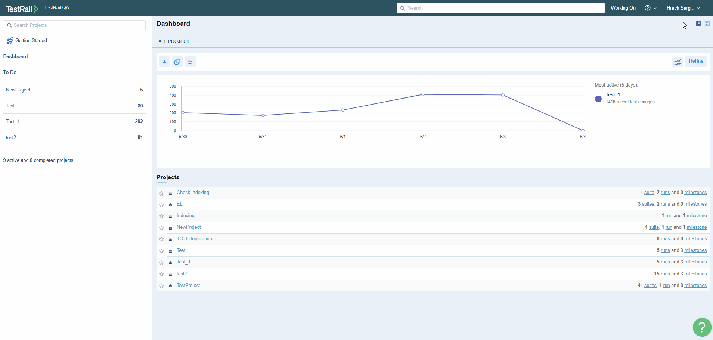
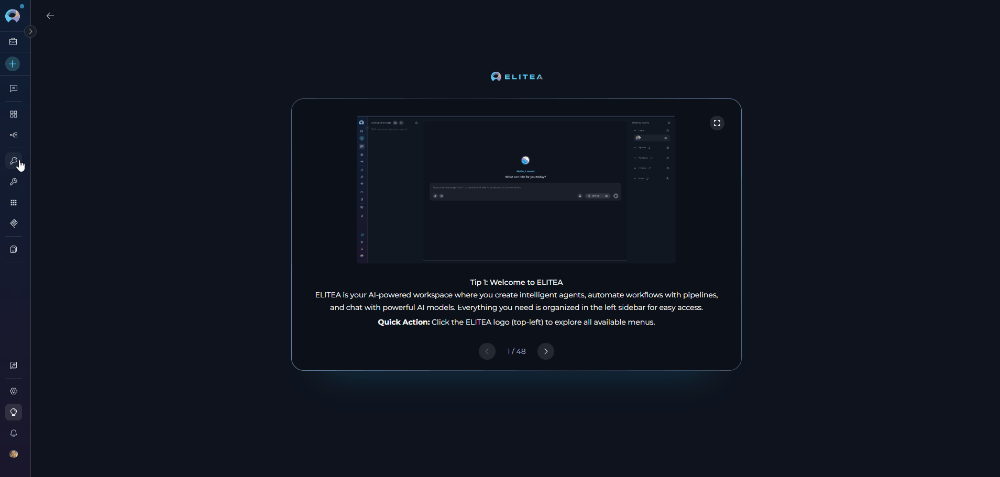
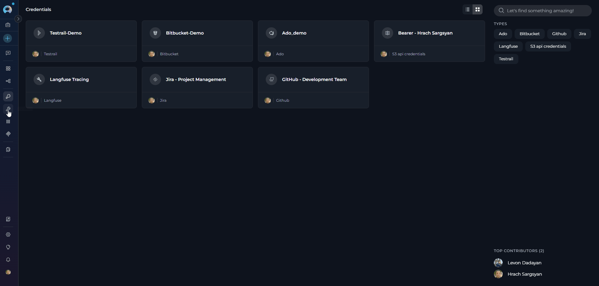
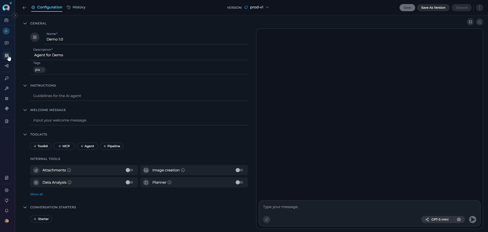
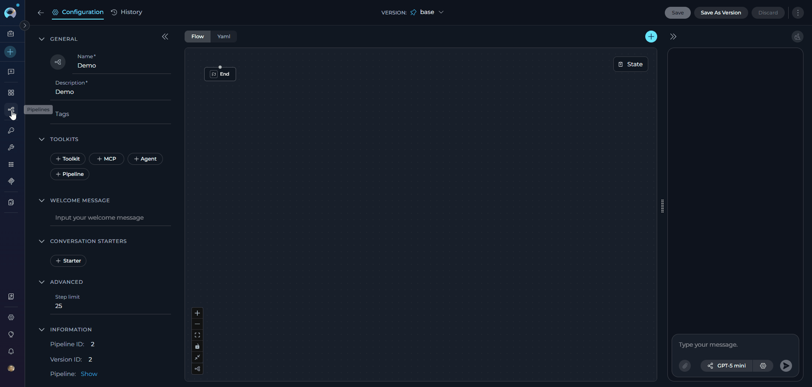
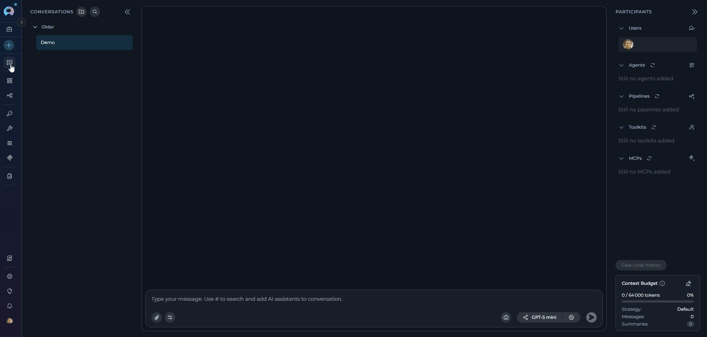

# TestRail Toolkit Integration Guide

---

## Introduction

This guide is your comprehensive resource for integrating and utilizing the **TestRail toolkit** within ELITEA. It provides detailed, step-by-step instructions, from setting up your TestRail API Key to configuring the toolkit in ELITEA and effectively using it within your Agents, Pipelines, and Chat conversations. By following this guide, you will unlock the power of automated test management, streamlined testing workflows, and enhanced team collaboration, all directly within the ELITEA platform.

**Brief Overview of TestRail**

TestRail, by Gurock Software (a subsidiary of Idera, Inc.), is a comprehensive web-based test management platform built to help teams of all sizes organize, manage, and track their software testing efforts. It provides a centralized ecosystem for professional teams working on quality assurance, offering features for:

*   **Comprehensive Test Case Management:** Create, organize, and manage test cases with rich text formatting, attachments, and custom fields. Structure test cases into projects, suites, and sections for easy navigation and maintenance.
*   **Test Execution & Tracking:** Plan and execute test runs and test plans, track test results in real-time, and assign tests to team members. Gain a clear overview of testing progress and identify areas needing attention.
*   **Robust Reporting & Metrics:** Generate insightful reports and metrics on test coverage, test results, and team performance. Use dashboards and charts to visualize testing progress and identify trends.
*   **Seamless Integrations:** Integrates with issue trackers like Jira, bug tracking systems, and automation frameworks, making it a central hub for your testing ecosystem.
*   **Customization & Scalability:** Adapt TestRail to your specific testing processes with customizable workflows, fields, templates, and custom fields. Scale TestRail as your team and projects grow.

Integrating TestRail with ELITEA brings these robust test management capabilities directly into your AI-driven workflows. Your ELITEA Agents, Pipelines, and Chat conversations can intelligently interact with your TestRail instance to automate test-related tasks, enhance testing processes, and improve team collaboration.

---

## Toolkit's Account Setup and Configuration

**Account Setup**

If you don't have a TestRail account yet, here's how to get started with a free trial:

1.  **Visit TestRail Website:** Open your web browser and navigate to [TestRail's official website](https://www.gurocksoftware.com/testrail/).
2.  **Start a Free Trial:** On the homepage, locate and click the **"Free Trial"** button.
3.  **Fill Out the Registration Form:** Provide your details in the registration form. This typically includes your name, company email address, company name, and other relevant information. **For professional use, it's highly recommended to use your company email.**
4.  **Submit the Form:** Click on the **"Start Free Trial"** or similar button to submit the form. TestRail will send a confirmation email to the email address you provided.

    {loading=lazy}

5.  **Verify Your Email:** Open the confirmation email from TestRail and click on the verification link provided within the email. This step is crucial to activate your TestRail trial account.
6.  **Access Your Account:** After email verification, you will be redirected to your new TestRail instance or prompted to log in. Follow any on-screen instructions to complete the setup and access your TestRail account.

### Generate an API Key

For secure integration with ELITEA, it is essential to use a TestRail **API Key**. This method is significantly more secure than using your primary TestRail account password directly and allows you to precisely control the permissions granted to ELITEA.

**Follow these steps to generate an API Key in TestRail:**

1.  **Log in to TestRail:** Access your TestRail account using your credentials.
2.  **Access My Settings:** Click on your profile name in the top right corner of the TestRail interface. From the dropdown menu, select **"My Settings"**.
3.  **Navigate to API Keys:** In the "My Settings" page, find and click on the **"API keys"** tab.
4.  **Add API Key:** Click the **"Add Key"** button to create a new API key.
5.  **Name the API Key:** In the "Name" field, enter a descriptive name for the API key, such as "ELITEA Integration Key". This will help you identify the purpose of this key later.
6.  **Generate API Key:** Click the **"Generate Key"** button. TestRail will generate a new API key and display it to you.
7.  **Securely Copy and Store Your API Key:** **Immediately copy the generated API key.** This is the only time it will be displayed in full. Store it securely in a password manager or, preferably, ELITEA's built-in **[Secrets](../../menus/settings/secrets.md)** feature for enhanced security within ELITEA. You will need this API key to configure the TestRail toolkit in ELITEA.

     {loading=lazy}

!!! warning "Important Security Practices"
    **Principle of Least Privilege:** Grant only the permissions absolutely essential for your ELITEA integration tasks.
    
    **Never Share API Keys:** Treat your API key like a password. Do not share it publicly or commit it to version control systems.
    
    **Regular Token Review and Rotation:** Regularly review generated API keys and rotate them periodically as a security best practice.

---

## System Integration with ELITEA

To integrate TestRail with ELITEA, you need to follow a three-step process: **Create Credentials → Create Toolkit → Use in Agents**. This workflow ensures secure authentication and proper configuration.

### Step 1: Create TestRail Credentials

Before creating a toolkit, you must first create TestRail credentials in ELITEA:

1. **Navigate to Credentials Menu:** Open the sidebar and select **[Credentials](../../menus/credentials.md)**.
2. **Create New Credential:** Click the **`+ Create`** button.
3. **Select TestRail:** Choose **TestRail** as the credential type.
4. **Configure Credential Details:**

    | **Field** | **Description** | **Example** |
    |-----------|----------------|-------------|
    | **Display Name** | Descriptive name for easy identification | `TestRail - QA Environment` |
    | **ID** | Unique identifier for the credential | Auto-generated |
    | **URL** | Your TestRail instance URL | `https://yourcompany.testrail.io/` |
    | **Email** | Email address for your TestRail account | `your.email@company.com` |
    | **Password** | Your TestRail API Key | `your-api-key` |

5. **Test Connection:** Click **Test Connection** to verify your credentials are valid and ELITEA can connect to TestRail
6. **Save Credential:** Click **Save** to create the credential

     {loading=lazy}

!!! tip "Security Recommendation"
    It's highly recommended to use **[Secrets](../../menus/settings/secrets.md)** for API Keys instead of entering them directly. Create a secret first, then reference it in your credential configuration.

### Step 2: Create TestRail Toolkit

Once your credentials are configured, create the TestRail toolkit:

1. **Navigate to Toolkits Menu:** Open the sidebar and select **[Toolkits](../../menus/toolkits.md)**.
2. **Create New Toolkit:** Click the **`+ Create`** button.
3. **Select TestRail:** Choose **TestRail** from the list of available toolkit types.
4. **Configure Toolkit Settings:**

    | **Field** | **Description** | **Example** |
    |-----------|----------------|-------------|
    | **Toolkit Name** | Descriptive name for your toolkit | `TestRail - QA Project` |
    | **Description** | Optional description for the toolkit | `TestRail toolkit for QA team` |
    | **TestRail Configuration** | Select your previously created TestRail credential | `TestRail - QA Environment` |
    | **PgVector Configuration** | (Optional) Select PgVector for indexing features | Your PgVector configuration |
    | **Embedding Model** | (Optional) Select embedding model for semantic search | `amazon.titan-embed-text-v2:0` |

5. **Enable Desired Tools:** In the **"Tools"** section, select the checkboxes next to the specific TestRail tools you want to enable. **Enable only the tools your agents will actually use**
       * **[Make Tools Available by MCP](../mcp/make-tools-available-by-mcp.md)** - (optional checkbox) Enable this option to make the selected tools accessible through external MCP clients
6. **Save Toolkit:** Click **Save** to create the toolkit
   
     {loading=lazy}

#### Available Tools:

The TestRail toolkit provides the following tools for interacting with TestRail test cases, suites, and attachments, organized by functional categories:

| **Tool Category** | **Tool Name** | **Description** | **Primary Use Case** |
|:-----------------:|---------------|-----------------|----------------------|
| **Test Case Access** | | | |
| | **Get case** | Retrieves complete information about a single test case from TestRail by its ID. Returns all case fields and custom properties | Access detailed information about a specific test case for review or analysis |
| | **Get cases** | Extracts a list of test cases in specified format (json, csv, or markdown) with customizable field selection (defaults to title and id) | Get an overview of all test cases in a project or suite for reporting |
| | **Get cases by filter** | Extracts test cases from a specified project based on given case attributes including priority, type, status, milestone, and custom fields | Find test cases matching specific criteria for targeted test execution or analysis |
| **Test Case Management** | | | |
| | **Add case** | Adds a new test case into TestRail with support for custom fields, templates (template 1 for simple steps, template 2 for separated steps), and all standard TestRail properties | Create new test cases programmatically with custom fields and properties |
| | **Add cases** | Adds multiple new test cases into TestRail in bulk using JSON array format. Each case can have different sections, titles, and properties | Efficiently create multiple test cases at once from automated test generation |
| | **Update case** | Updates an existing test case with partial updates supported. Allows modifying individual fields without affecting other properties | Modify test case details, fields, or properties based on changing requirements |
| | **Add file to case** | Uploads and attaches a file from an artifact to a TestRail test case. Supports various file types for test documentation | Add screenshots, test data files, or documentation to test cases |
| **Suite Management** | | | |
| | **Get suites** | Extracts a list of test suites for a given project from TestRail with suite metadata (id, name, description, baseline, completion status) in json, csv, or markdown format | Retrieve all test suites available in a project for suite-level reporting |
| **Indexing & Search** | | | |
| | **Index data** | Loads TestRail test case data into PgVector for semantic search. Requires PgVector configuration and embedding model. Supports optional attachment indexing and filtering by suite/section | Enable AI-powered semantic search across repository test cases for intelligent test discovery |
| | **List collections** | Lists all available indexed collections in the PgVector database to identify searchable test case datasets | View and manage indexed data collections to understand what test cases are searchable |
| | **Remove index** | Removes previously created search indexes from PgVector to free resources or refresh data | Clean up outdated indexes or prepare for re-indexing with updated test case content |
| | **Search index** | Performs semantic searches across indexed test case content using natural language queries | Find specific test cases, patterns, or scenarios using AI-powered search |
| | **Stepback search index** | Performs advanced contextual searches with broader scope, using step-back prompting to generate better search queries for complex test discovery | Execute sophisticated searches requiring broader context understanding and query refinement |
| | **Stepback summary index** | Performs advanced searches with summary generation, combining step-back prompting with content summarization for comprehensive test case discovery and overview | Execute complex searches that require both contextual understanding and summarized results |

#### Testing Toolkit Tools

After configuring your TestRail toolkit, you can test individual tools directly from the Toolkit detailed page using the **Test Settings** panel. This allows you to verify that your credentials are working correctly and validate tool functionality before adding the toolkit to your workflows.

**General Testing Steps:**

1. **Select LLM Model:** Choose a Large Language Model from the model dropdown in the Test Settings panel
2. **Configure Model Settings:** Adjust model parameters like Creativity, Max Completion Tokens, and other settings as needed
3. **Select a Tool:** Choose the specific TestRail tool you want to test from the available tools
4. **Provide Input:** Enter any required parameters or test queries for the selected tool
5. **Run the Test:** Execute the tool and wait for the response
6. **Review the Response:** Analyze the output to verify the tool is working correctly and returning expected results

!!! tip "Key benefits of testing toolkit tools:"
    * Verify that TestRail credentials and connection are configured correctly
    * Validate that tools function as expected with your TestRail instance
    * Test different parameter combinations and edge cases before production use
    * Familiarize yourself with tool capabilities and expected outputs
    
    > For detailed instructions on how to use the Test Settings panel, see **[How to Test Toolkit Tools](../../how-tos/credentials-toolkits/how-to-test-toolkit-tools.md)**.

---
### Step 3: Use TestRail Toolkit in Agents

Once your TestRail toolkit is created, you can use it in various ELITEA features:

#### **In Agents:**
1. **Navigate to Agents:** Open the sidebar and select **[Agents](../../menus/agents.md)**.
2. **Create or Edit Agent:** Click **`+ Create`** for a new agent or select an existing agent to edit.
3. **Add TestRail Toolkit:** 
     * In the **"Tools"** section of the agent configuration, click the **"+Toolkit"** icon
     * Select your TestRail toolkit from the dropdown menu
     * The toolkit will be added to your agent with the previously configured tools enabled

Your agent can now interact with TestRail using the configured toolkit and enabled tools.


{loading=lazy}


#### **In Pipelines:**

1. **Navigate to Pipelines:** Open the sidebar and select **[Pipelines](../../menus/pipelines.md)**.
2. **Create or Edit Pipeline:** Either create a new pipeline or select an existing pipeline to edit.
3. **Add TestRail Toolkit:** 
     * In the **"Tools"** section of the pipeline configuration, click the **"+Toolkit"** icon
     * Select your TestRail toolkit from the dropdown menu
     * The toolkit will be added to your pipeline with the previously configured tools enabled

{loading=lazy}


#### **In Chat:**

1. **Navigate to Chat:** Open the sidebar and select **[Chat](../../menus/chat.md)**.
2. **Start New Conversation:** Click **+Create** or open an existing conversation.
3. **Add Toolkit to Conversation:**
     * In the chat Participants section, look for the **Toolkits** element
     * Click to add a toolkit and select your TestRail toolkit from the available options
     * The toolkit will be added to your conversation with all previously configured tools enabled
4. **Use Toolkit in Chat:** You can now directly interact with your TestRail instance by asking questions or requesting actions that will trigger the TestRail toolkit tools.
    * **Example Chat Usage:**

{loading=lazy}     

## Instructions and Prompts for Using the TestRail Toolkit

To effectively instruct your ELITEA Agent to use the TestRail toolkit, you need to provide clear and precise instructions within the Agent's "Instructions" field. These instructions are crucial for guiding the Agent on *when* and *how* to utilize the available TestRail tools to achieve your desired automation goals.

### Instruction Creation for Agents

When crafting instructions for the TestRail toolkit, especially for OpenAI-based Agents, clarity and precision are paramount. Break down complex tasks into a sequence of simple, actionable steps. Explicitly define all parameters required for each tool and guide the Agent on how to obtain or determine the values for these parameters. Agents respond best to instructions that are:

*   **Direct and Action-Oriented:** Employ strong action verbs and clear commands to initiate actions. For example, "Use the 'get_case' tool...", "Create a test case named...", "Search for test cases containing...".

*   **Parameter-Centric:** Clearly enumerate each parameter required by the tool. For each parameter, specify:
    *   Its name (exactly as expected by the tool)
    *   Its expected data type (string, integer, JSON object, etc.)
    *   How the Agent should obtain the value – whether from user input, derived from previous steps in the conversation, retrieved from an external source, or a predefined static value

*   **Contextually Rich:** Provide sufficient context so the Agent understands the overarching objective and the specific scenario in which each TestRail tool should be applied within the broader workflow. Explain the desired outcome or goal for each tool invocation.

*   **Step-by-Step Structure:** Organize instructions into a numbered or bulleted list of steps for complex workflows. This helps the Agent follow a logical sequence of actions.

*   **Add Conversation Starters:** Include example conversation starters that users can use to trigger this functionality. For example, "Conversation Starters: 'Show me test case 123', 'Create a new login test', 'Find all high priority test cases'"

When instructing your Agent to use a TestRail toolkit tool, adhere to this structured pattern:

1. **State the Goal:** Begin by clearly stating the objective you want to achieve with this step. For example, "Goal: To retrieve details of test case with ID 123."

2. **Specify the Tool:** Clearly indicate the specific TestRail tool to be used for this step. For example, "Tool: Use the 'get_case' tool."

3. **Define Parameters:** Provide a detailed list of all parameters required by the selected tool. For each parameter:
   - **Parameter Name:** `<Parameter Name as defined in tool documentation>`
   - **Value or Source:** `<Specify the value or how to obtain the value. Examples: "user input", "from previous step", "hardcoded value '123'", "value of variable X">`

4. **Describe Expected Outcome (Optional but Recommended):** Briefly describe the expected result or outcome after the tool is successfully executed. For example, "Outcome: The Agent will display the full details of test case 123."

5. **Add Conversation Starters:** Include example conversation starters that users can use to trigger this functionality. For example, "Conversation Starters: 'Show me test case 123', 'Create a new login test', 'Find all high priority test cases'"

!!! example "Example Agent Instructions"

    **Agent Instructions for Creating a Test Case:**

    ```markdown
    1. Goal: Create a new test case in TestRail based on user requirements.
    2. Tool: Use the "add_case" tool.
    3. Parameters:
        - section_id: "Ask the user which section the test case should be added to, or use a default section ID from the configuration."
        - title: "Get the test case title from the user. Example: 'Verify login with valid credentials'"
        - case_properties: "Ask the user for test case details including priority, type, steps, and expected results. Format as JSON object."
    4. Outcome: A new test case will be created in TestRail with the specified details. Confirm the creation to the user with the test case ID.
    ```

### Chat Usage Examples by Tool Category

The following examples demonstrate how to interact with the TestRail toolkit in ELITEA Chat, organized by functional categories. Each example shows the user request and the expected agent behavior.

??? example "Test Case Access - Get Case"

    **Chat Example:**
    ```
    User: "Show me the details of test case 2260."

    Agent Response: [Agent uses get_case tool]

    📋 **Test Case #2260 Details**:

    - **Title**: Verify user login with valid credentials
    - **Section**: Authentication Tests
    - **Priority**: High
    - **Type**: Functional
    - **Status**: Active

    **Preconditions**:
    - User account exists in the system
    - User has valid username and password

    **Steps**:
    1. Navigate to the login page
    2. Enter valid username
    3. Enter valid password
    4. Click the Login button

    **Expected Result**:
    User is successfully authenticated and redirected to the dashboard

    This test case validates the core authentication functionality of the application.
    ```

??? example "Test Case Access - Get Cases by Filter"

    **Chat Example:**
    ```
    User: "Find all high-priority test cases in project 1 that are related to the login feature."

    Agent Response: [Agent uses get_cases_by_filter tool]

    🔍 **High-Priority Test Cases Found** (5 cases):

    1. **TC-101**: Verify login with valid credentials
       - **Priority**: High
       - **Type**: Functional
       - **Status**: Active

    2. **TC-102**: Verify login with invalid password
       - **Priority**: High
       - **Type**: Negative
       - **Status**: Active

    3. **TC-103**: Verify login session timeout
       - **Priority**: High
       - **Type**: Functional
       - **Status**: Active

    4. **TC-104**: Verify password reset functionality
       - **Priority**: High
       - **Type**: Functional
       - **Status**: Active

    5. **TC-105**: Verify multi-factor authentication
       - **Priority**: High
       - **Type**: Security
       - **Status**: Active

    These test cases cover critical authentication scenarios that should be prioritized in testing cycles.
    ```

??? example "Test Case Management - Add Case"

    **Chat Example:**
    ```
    User: "Create a new test case for verifying the password reset functionality in section 5."

    Agent Response: [Agent uses add_case tool]

    ✔️ **Test Case Created Successfully!**

    - **Test Case ID**: #2305
    - **Title**: Verify password reset functionality
    - **Section**: Authentication Tests (Section 5)
    - **Priority**: Medium
    - **Type**: Functional
    - **Status**: Active

    **Created with the following details**:
    - **Preconditions**: User has a registered account with verified email
    - **Steps**: 
      1. Click "Forgot Password" link on login page
      2. Enter registered email address
      3. Click "Send Reset Link" button
      4. Check email for password reset link
      5. Click the reset link
      6. Enter new password
      7. Confirm new password
      8. Submit the form
    - **Expected Result**: Password is successfully reset and user can login with the new password

    The test case is now available in TestRail and ready for execution.
    ```

??? example "Test Case Management - Update Case"

    **Chat Example:**
    ```
    User: "Update test case 123 to set its priority to Critical."

    Agent Response: [Agent uses update_case tool]

    ✔️ **Test Case Updated Successfully!**

    - **Test Case ID**: #123
    - **Updated Field**: Priority
    - **New Value**: Critical (Priority ID: 1)
    - **Previous Value**: High

    The test case priority has been elevated to Critical. This change will be reflected in all test runs and reports.
    ```

??? example "Suite Management - Get Suites"

    **Chat Example:**
    ```
    User: "Show me all test suites available in project 1."

    Agent Response: [Agent uses get_suites tool]

    📚 **Test Suites in Project 1** (4 suites):

    1. **Suite #1**: Authentication & Authorization
       - **Description**: Test cases for login, logout, password management, and user permissions
       - **Test Cases**: 45

    2. **Suite #2**: User Profile Management
       - **Description**: Test cases for user profile creation, editing, and deletion
       - **Test Cases**: 32

    3. **Suite #3**: Data Validation & Input
       - **Description**: Test cases for form validation and data input scenarios
       - **Test Cases**: 28

    4. **Suite #4**: Performance & Load Testing
       - **Description**: Test cases for system performance under various load conditions
       - **Test Cases**: 15

    **Total Test Cases**: 120

    These suites organize the test cases by functional area for better management and execution planning.
    ```

??? example "Indexing & Search - Search Index"

    **Chat Example:**
    ```
    User: "Search for test cases related to 'password authentication and security'."

    Agent Response: [Agent uses search_index tool]

    🔎 **Search Results for "password authentication and security"** (Top 5 matches):

    1. **TC-2260** (Relevance: 95%): Verify user login with valid credentials
       - Covers password-based authentication flow
       - Section: Authentication Tests

    2. **TC-2261** (Relevance: 92%): Verify password complexity requirements
       - Tests security policies for password creation
       - Section: Security Tests

    3. **TC-2262** (Relevance: 88%): Verify password reset functionality
       - Tests secure password recovery process
       - Section: Authentication Tests

    4. **TC-2263** (Relevance: 85%): Verify password encryption in database
       - Validates password security at storage level
       - Section: Security Tests

    5. **TC-2264** (Relevance: 82%): Verify account lockout after failed login attempts
       - Tests security mechanism against brute force attacks
       - Section: Security Tests

    These test cases cover various aspects of password authentication and security. Would you like details on any specific test case?
    ```

## Use Cases

The TestRail toolkit unlocks numerous automation possibilities for software testing workflows within ELITEA. Here are some key use cases:

??? tip "Automated Test Case Review"

    **Scenario:** Quickly review details of specific test cases without opening TestRail interface
    
    **Tools Used:** `get_case`
    
    **Benefit:** Saves time and allows for faster decision-making during test reviews
    
    **Example Workflow:**
    
    1. User requests test case details via Chat or Agent
    2. Agent uses `get_case` tool with case_id
    3. Complete test case information displayed instantly
    4. User can review steps, preconditions, and expected results without context switching

??? tip "Test Coverage Analysis"

    **Scenario:** Get comprehensive overview of test cases across projects and analyze coverage
    
    **Tools Used:** `get_cases`, `get_cases_by_filter`, `get_suites`
    
    **Benefit:** Provides insights into testing scope and identifies coverage gaps
    
    **Example Workflow:**
    
    1. Use `get_suites` to understand project organization
    2. Use `get_cases` to export all test cases in structured format
    3. Analyze distribution by priority, type, and sections
    4. Identify untested features or missing test scenarios
    5. Generate coverage reports in markdown, CSV, or JSON format

??? tip "Automated Test Case Creation"

    **Scenario:** Generate test cases automatically from requirements, user stories, or technical specifications
    
    **Tools Used:** `add_case`, `add_cases`
    
    **Benefit:** Reduces manual effort, ensures consistency, and accelerates test case development
    
    **Example Workflow:**
    
    1. Agent analyzes requirements document or user story
    2. Generates test case structure with steps and expected results
    3. Uses `add_case` for single test case or `add_cases` for bulk creation
    4. Automatically assigns appropriate priority, type, and custom fields
    5. Links test cases to requirements via refs field

??? tip "Test Case Maintenance"

    **Scenario:** Bulk update test case properties based on project changes or process improvements
    
    **Tools Used:** `update_case`
    
    **Benefit:** Keeps test cases up-to-date efficiently across large test suites
    
    **Example Workflow:**
    
    1. Identify test cases needing updates using `get_cases_by_filter`
    2. Agent iterates through filtered test cases
    3. Updates specific fields (priority, steps, custom fields) using `update_case`
    4. Maintains consistency across related test cases
    5. Tracks changes for audit and reporting purposes

??? tip "Priority-Based Test Selection"

    **Scenario:** Identify and retrieve high-priority or failed test cases for focused testing efforts
    
    **Tools Used:** `get_cases_by_filter`
    
    **Benefit:** Enables targeted testing and efficient resource allocation
    
    **Example Workflow:**
    
    1. Use `get_cases_by_filter` with priority_id filter (e.g., High priority)
    2. Optionally filter by milestone, type, or custom fields
    3. Export results in preferred format for test execution planning
    4. Assign high-priority cases to QA team members
    5. Focus testing efforts on critical functionality

??? tip "Semantic Test Case Discovery"

    **Scenario:** Use AI-powered semantic search to find relevant test cases based on natural language queries
    
    **Tools Used:** `index_data`, `search_index`, `stepback_search_index`
    
    **Benefit:** Improves test case discoverability and enables intelligent test recommendations
    
    **Example Workflow:**
    
    1. Index test case repository using `index_data` (one-time setup)
    2. User asks: "Find all test cases related to payment processing errors"
    3. Agent uses `search_index` with natural language query
    4. Semantic search returns relevant cases even without exact keyword matches
    5. Use `stepback_search_index` for complex queries requiring broader context
    6. Discover similar test cases, identify duplicates, or find coverage gaps

??? tip "Test Documentation Generation"

    **Scenario:** Export test cases in various formats for documentation or reporting purposes
    
    **Tools Used:** `get_cases` with different output formats (json, csv, markdown)
    
    **Benefit:** Automates documentation creation and supports various reporting needs
    
    **Example Workflow:**
    
    1. Use `get_cases` with `output_format="markdown"` for documentation
    2. Export to CSV for spreadsheet analysis or stakeholder reports
    3. Export to JSON for integration with other tools or systems
    4. Customize field selection using `keys` parameter
    5. Automate periodic documentation updates as part of CI/CD pipeline

??? tip "Test Case Attachment Management"

    **Scenario:** Automatically attach screenshots, test data, or documentation to test cases
    
    **Tools Used:** `add_file_to_case`
    
    **Benefit:** Enriches test cases with visual aids and supporting materials
    
    **Example Workflow:**
    
    1. Generate screenshots or test artifacts during test execution
    2. Upload files to ELITEA artifact storage
    3. Use `add_file_to_case` to attach artifacts to relevant test cases
    4. Include error logs, configuration files, or test data samples
    5. Maintain comprehensive test case documentation with visual references

---

## Troubleshooting

??? warning "Connection Issues"
    **Possible Error Messages:**
    
    - "Cannot connect to TestRail at [URL]: connection refused"
    - "Connection to TestRail at [URL] timed out"
    - "SSL certificate verification failed"
    - "TestRail API endpoint not found"
    
    **Solutions:**
    
    1. **Verify URL Format**
         - Ensure URL starts with `http://` or `https://`
         - Remove trailing slashes from the URL
         - TestRail Cloud: `https://yourcompany.testrail.io`
         - TestRail Server: `https://testrail.yourcompany.com`
    
    2. **Check Network Connectivity**
         - Verify your network allows connections to TestRail
         - Check firewall rules and proxy settings
         - Test connectivity using browser or curl
    
    3. **SSL Certificate Issues**
         - For self-signed certificates, configure certificate validation
         - Ensure SSL certificate is valid and not expired
    
    4. **API Endpoint Validation**
         - TestRail API uses endpoint: `/index.php?/api/v2/get_user_by_email`
         - Verify the API is enabled in your TestRail instance
         - Check with your TestRail administrator if API access is restricted

??? warning "Authentication Errors"
    **Possible Error Messages:**
    
    - "Authentication failed: invalid email or password" (HTTP 401)
    - "Access forbidden: check user permissions" (HTTP 403)
    - "Please, verify you API key/password"
    - "Bad request: check email format and URL" (HTTP 400)
    
    **Solutions:**
    
    1. **Verify Credentials**
         - Ensure email address matches your TestRail account
         - Verify API key is correctly copied (no extra spaces)
         - Check that API key hasn't been revoked or expired
         - API key should not be empty
    
    2. **API Key Permissions**
         - Verify the API key is active in TestRail (My Settings → API Keys)
         - Regenerate API key if needed
         - Some TestRail instances may have API key expiration policies
    
    3. **User Permissions Check**
         - Ensure your TestRail user has access to the projects
         - Check project-level permissions in TestRail
         - Verify user account is not locked or disabled
    
    4. **Email Format**
         - Use the exact email address registered in TestRail
         - Check for typos in email address
         - Email is case-sensitive in some TestRail configurations

??? warning "Project and Suite Access Issues"
    **Possible Error Messages:**
    
    - "Unable to extract test cases: [error]"
    - "No test cases found in the extracted data"
    - "Unable to extract test suites: [error]"
    - "Project not found or access denied"
    
    **Solutions:**
    
    1. **Project ID Verification**
         - Find project ID in TestRail URL: `/projects/overview/{project_id}`
         - Use numeric project ID, not project name
         - Verify project exists and is accessible to your user
    
    2. **Suite Mode Understanding**
         - **Single Suite Mode**: All test cases in one suite (no suite_id needed)
         - **Single Suite with Baseline**: Similar to single suite mode
         - **Multiple Suites Mode**: Must specify `suite_id` when accessing test cases
         - Check project mode in TestRail Project Settings
    
    3. **Section ID Issues**
         - Find section ID in TestRail URL: `/suites/view/{suite_id}&group_id={section_id}`
         - Sections are nested under suites
         - Use `get_suites` tool to discover available suites first
    
    4. **Access Rights**
         - Verify read access to projects and suites
         - Check if project is archived or inactive
         - Confirm user group has appropriate permissions

??? warning "Test Case Creation/Update Failures"
    **Possible Error Messages:**
    
    - "Unable to add new testcase [error]"
    - "Section not found"
    - "Invalid template_id"
    - "Custom field error: [field_name]"
    
    **Solutions:**
    
    1. **Section ID Validation**
         - Ensure section_id exists in the project/suite
         - Section IDs are numeric values
         - Use TestRail UI to find correct section ID
    
    2. **Template Selection**
         - **Template 1** (Simple Steps): Use `custom_steps` (string) and `custom_expected` (string)
         - **Template 2** (Separated Steps): Use `custom_steps_separated` (list of dictionaries)
         - Verify template is enabled in your TestRail project
         - Check available templates in Project Settings → Case Templates
    
    3. **Custom Fields Format**
         - Custom fields must be prefixed with `custom_`
         - Example: `custom_preconds`, `custom_automation_type`
         - Check field system names in TestRail Administration → Customizations
         - Ensure custom field types match expected values (int, string, list, etc.)
    
    4. **Case Properties**
         - `priority_id`, `type_id`, `template_id` are numeric
         - IDs vary by TestRail instance configuration
         - Use TestRail API or UI to determine valid IDs
         - Common priority IDs: 1=High, 2=Medium, 3=Low (but verify for your instance)
    
    5. **Write Permissions**
         - Verify user has write permissions to the project
         - Check if project or suite is locked
         - Some fields may be read-only based on project configuration

??? warning "Indexing and Search Issues"
    **Possible Error Messages:**
    
    - "PgVector configuration is required for indexing"
    - "Embedding model is required for indexing"
    - "Unable to extract test cases for indexing"
    - "No test cases found to index"
    
    **Solutions:**
    
    1. **PgVector Configuration**
         - Ensure PgVector is configured in toolkit settings
         - Verify PgVector database is accessible
         - Test PgVector connection independently
    
    2. **Embedding Model Selection**
         - Select an embedding model in toolkit configuration
         - Supported models: `amazon.titan-embed-text-v2:0`, `text-embedding-ada-002`
         - Verify embedding model is available in your ELITEA environment
    
    3. **Index Creation Prerequisites**
         - Project must have accessible test cases
         - Use `get_cases` to verify test cases are retrievable
         - For multiple suite mode, specify `suite_id` in index_data parameters
    
    4. **Search Query Formatting**
         - Use natural language queries for semantic search
         - Be specific in search queries for better results
         - Try broader queries if no results are found
    
    5. **Attachment Indexing**
         - Set `include_attachments: true` to index attachments
         - Note: Increases indexing time and storage requirements
         - Use `skip_attachment_extensions` to exclude specific file types
         - Supported: text files, PDFs, images (with OCR)

??? warning "Suite Mode and API Compatibility Issues"
    **Possible Error Messages:**
    
    - "Unable to extract test cases: [error]"
    - "No test cases found in the extracted data" (when cases exist)
    - TestRail API returns unexpected response structure
    - Suite-related operations fail inconsistently
    
    **Solutions:**
    
    1. **Identify Project Suite Mode**
         - Check Project Settings → Test Suite Mode in TestRail
         - Mode 1: Single Suite (no suite_id needed)
         - Mode 2: Single Suite + Baselines (suite_id optional)
         - Mode 3: Multiple Suites (suite_id required for most operations)
    
    2. **Suite ID Requirements by Mode**
         - **Single Suite (Mode 1)**: Omit `suite_id` parameter from `get_cases` calls
         - **Multiple Suites (Mode 3)**: Always provide `suite_id` parameter
         - **Not Sure?**: Use `get_suites` tool to check available suites
    
    3. **Automatic Suite Handling**
         - SDK automatically detects suite mode and handles accordingly
         - If `suite_id` not provided in Mode 3, SDK fetches all suites and aggregates
         - Can cause performance issues with large projects
    
    4. **TestRail API Version Compatibility**
         - SDK supports both old and new TestRail API response formats
         - Old format: Direct array `[case1, case2, ...]`
         - New format: Wrapped object `{"cases": [case1, case2, ...]}`
         - SDK handles both automatically
    
    5. **Section ID Hierarchies**
         - Sections are nested under suites in Multiple Suites mode
         - When creating cases, ensure section belongs to correct suite
         - Section IDs are unique across project, but suite context matters
         - Use TestRail UI to verify section-suite relationships

??? warning "Rate Limiting and Performance Issues"
    **Possible Error Messages:**
    
    - "HTTP 429: Too Many Requests"
    - Slow response times from TestRail API
    - Timeout errors during bulk operations
    - Indexing operations taking excessive time
    
    **Solutions:**
    
    1. **TestRail API Rate Limits**
         - TestRail Cloud has rate limiting (typically 180 requests/minute per user)
         - Bulk operations (`add_cases`, indexing) make multiple API calls
         - Implement delays between large batches of operations
         - Consider spreading operations across multiple sessions
    
    2. **Optimize Bulk Operations**
         - Use `add_cases` (bulk) instead of multiple `add_case` calls
         - Batch test cases in groups of 50-100 for balance
         - For 1000+ cases, split into multiple batches with delays
         - Monitor rate limit headers in responses
    
    3. **Indexing Performance**
         - **Small Projects** (<500 cases): Index entire project at once
         - **Medium Projects** (500-2000 cases): Index by suite
         - **Large Projects** (>2000 cases): Index by suite + section, schedule overnight
         - Exclude attachments initially for faster indexing
         - Use `skip_attachment_extensions` to reduce processing time
    
    4. **Network and Timeout Issues**
         - Increase timeout settings for slow networks or large responses
         - TestRail Cloud instances in different regions have varying latency
         - Self-hosted TestRail: Check server resources and network
         - Consider using `limit` parameter in `get_cases_by_filter` for pagination
    
    5. **Reduce API Call Volume**
         - Cache suite and section information locally
         - Use `get_cases` with filters instead of multiple `get_case` calls
         - Fetch test cases once and process locally when possible
         - Use `keys` parameter to limit returned fields
    
    **Performance Best Practices:**
    
    - **Pagination**: Use `limit` and `offset` for large result sets
    - **Filtering**: Apply filters server-side rather than fetching all cases
    - **Parallel Processing**: Avoid parallel calls to same TestRail instance
    - **Caching**: Store frequently accessed data (projects, suites, field definitions)
    - **Scheduling**: Run large operations (indexing, bulk updates) during off-peak hours
    
    **Monitoring:**
    
    - Track operation execution times
    - Log API response times
    - Monitor rate limit warnings
    - Set alerts for timeout errors

??? warning "Bulk Operations and Data Validation Issues"
    **Possible Error Messages:**
    
    - "Invalid parameter for json_case_arguments: [error]"
    - "json_case_arguments must be a JSON string or dictionary"
    - "Failed to decode JSON from document: [error]"
    - "Unable to add new testcase [error]" (multiple times)
    
    **Solutions:**
    
    1. **JSON String Format Validation**
         - Ensure `add_test_cases_data` is a valid JSON **string**, not an object
         - Properly escape quotes in JSON strings
         - Validate JSON syntax using online JSON validators
         - Check for trailing commas, missing quotes, or unmatched brackets
    
    2. **Array vs Single Value Parameters**
         - Parameters like `priority_id`, `type_id`, `milestone_id` in filters can accept arrays or comma-separated strings
         - Example: `"priority_id": [1, 2]` or `"priority_id": "1,2"`
         - Single values still need to be in correct format: `"priority_id": [1]`
    
    3. **Template and Steps Mismatch**
         - `template_id: 1` requires `custom_steps` (string) and `custom_expected` (string)
         - `template_id: 2` requires `custom_steps_separated` (array of objects)
         - Using wrong step format for template causes validation errors
         - Verify template configuration in TestRail Project Settings
    
    4. **Bulk Create Error Handling**
         - `add_cases` processes each case sequentially
         - One invalid case can fail the entire batch
         - Test with 1-2 cases first to validate structure
         - Check all section IDs are valid before bulk operations
    
    5. **Data Type Validation**
         - Numeric IDs must be integers, not strings (inside JSON structure)
         - Boolean fields require `true`/`false`, not "true"/"false"
         - Date fields must match TestRail instance format
         - Estimate fields must match pattern: "30s", "1m 45s", "2h 30m"

??? warning "File Attachment Issues"
    **Possible Error Messages:**
    
    - "Unable to attach file to test case"
    - "Artifact not found"
    - "File type not supported"
    
    **Solutions:**
    
    1. **Artifact Validation**
         - Verify artifact exists and is accessible
         - Check artifact path is correct
         - Ensure artifact is uploaded to ELITEA first
    
    2. **File Type Support**
         - TestRail supports various file types
         - Check TestRail file size limits
         - Some file types may be restricted by admin settings
    
    3. **Test Case ID**
         - Verify test case ID is correct
         - Ensure test case exists and is not deleted
         - User must have permission to modify the test case

### Support Contact

If you encounter issues not covered in this guide or need additional assistance with Testrail integration, please refer to **[Contact Support](../../support/contact-support.md)** for detailed information on how to reach the ELITEA Support Team. 

---

## FAQ

??? question "Q: Can I use my regular TestRail password instead of an API Key?"
    **A:** No, you must use a TestRail **API Key** for secure integration with ELITEA. Regular passwords are not supported.
    
    API Keys provide:
    
    - **Enhanced Security**: Can be revoked without changing your password
    - **Audit Trail**: Track API usage separately from UI access
    - **Granular Control**: Each integration can have its own key
    - **Best Practice**: Aligns with security standards for application integrations
    
    Generate your API Key in TestRail: **My Settings → API Keys → Add Key**

??? question "Q: Where do I find Project IDs, Suite IDs, and Section IDs?"
    **A:** These IDs are visible in TestRail URLs when navigating the interface:
    
    **Project ID:**

    - Navigate to project overview: `/projects/overview/{project_id}`
    - Example: `https://yourcompany.testrail.io/projects/overview/1` → Project ID is `1`
    
    **Suite ID:**

    - Navigate to a suite: `/suites/view/{suite_id}`
    - Example: `https://yourcompany.testrail.io/suites/view/5` → Suite ID is `5`
    - Use `get_suites` tool to list all suites in a project
    
    **Section ID:**

    - Navigate to a section: `/suites/view/{suite_id}&group_id={section_id}`
    - Visible in URL when viewing test cases in a section
    - Sections are hierarchical and nested under suites
    
    **Alternative Method:**

    - Use TestRail API directly: `/api/v2/get_projects`, `/api/v2/get_suites/{project_id}`
    - Use ELITEA tools: `get_suites` to discover suite IDs programmatically

??? question "Q: What are the priority_id and type_id values for my TestRail instance?"
    **A:** These IDs vary by TestRail instance configuration. **You must verify values for your specific instance.**
    
    **Common Default Values:**
    
    **Priority IDs** (may differ in your instance):

    - `1` = High
    - `2` = Medium
    - `3` = Low
    
    **Type IDs** (may differ in your instance):

    - `1` = Acceptance
    - `2` = Accessibility
    - `3` = Automated
    - `4` = Compatibility
    - `5` = Destructive
    - `6` = Functional
    - `7` = Other
    - `8` = Performance
    - `9` = Regression
    - `10` = Security
    - `11` = Smoke & Sanity
    - `12` = Usability
    
    **How to Find Your Values:**
    
    1. **TestRail Administration Panel**:
          - Navigate to **Administration → Customizations → Priorities**
          - Navigate to **Administration → Customizations → Case Types**
    
    2. **TestRail API**:
          - Use `/api/v2/get_priorities` endpoint
          - Use `/api/v2/get_case_types` endpoint
    
    3. **Contact TestRail Administrator**:
          - Your TestRail admin can provide the exact IDs for your instance
          - Custom priorities and types may have been configured

??? question "Q: How do I know which template_id to use when creating test cases?"
    **A:** Template selection depends on your TestRail project configuration and how you want to structure test steps.
    
    **Template 1 - Text Steps (Most Common):**

    - Uses simple text format for steps and expected results
    - Fields: `custom_steps` (string), `custom_expected` (string), `custom_preconds` (string, optional)
    - Best for: Simple, narrative-style test cases
    - **Tool Parameters:**
        - `section_id`: "5" (string)
        - `title`: "Verify user login with valid credentials"
        - `case_properties`: (dictionary below)
    - **case_properties Example:**
    ```json
    {
      "template_id": 1,
      "priority_id": 1,
      "type_id": 6,
      "custom_preconds": "User account exists and is active",
      "custom_steps": "1. Open login page\n2. Enter valid credentials\n3. Click Login button",
      "custom_expected": "User successfully logged in and redirected to dashboard"
    }
    ```
    
    **Template 2 - Separated Steps:**

    - Uses structured format with individual step objects
    - Field: `custom_steps_separated` (list of dictionaries)
    - Supports shared steps via `shared_step_id`
    - Best for: Detailed, step-by-step test cases with individual expected results
    - **Tool Parameters:**
        - `section_id`: "5" (string)
        - `title`: "Verify user login with step-by-step validation"
        - `case_properties`: (dictionary below)
    - **case_properties Example:**
    ```json
    {
      "template_id": 2,
      "priority_id": 1,
      "type_id": 6,
      "custom_preconds": "User account exists and is active",
      "custom_steps_separated": [
        {"content": "Open login page", "expected": "Login page displays with username and password fields"},
        {"content": "Enter valid username", "expected": "Username field populated correctly"},
        {"content": "Enter valid password", "expected": "Password field shows masked characters"},
        {"content": "Click Login button", "expected": "User authenticated and redirected to dashboard"},
        {"shared_step_id": 5}
      ]
    }
    ```
    
    **Note:** The `shared_step_id` field references a shared step already defined in TestRail, allowing reuse of common test steps.
    
    **How to Determine Available Templates:**
    
    1. **TestRail UI**: Project Settings → Case Templates
    2. **TestRail API**: Use `/api/v2/get_templates/{project_id}` endpoint
    3. **Default**: If unsure, use `template_id: 1` as it's most common
    4. **Custom Templates**: Your instance may have custom templates with different IDs

??? question "Q: Can I index test case attachments?"
    **A:** Yes, test case attachments can be indexed for semantic search.
    
    **How to Enable:**
    ```json
    {
      "project_id": "1",
      "include_attachments": true,
      "skip_attachment_extensions": [".png", ".jpg", ".gif"]
    }
    ```
    
    **Supported Attachment Types:**

    - **Text files**: .txt, .md, .log (fully indexed)
    - **Documents**: .pdf, .docx (content extracted and indexed)
    - **Images**: .png, .jpg, .gif (can be processed with OCR if configured)
    - **Unsupported**: Binary files, compressed archives
    
    **Considerations:**
    
    1. **Processing Time**: Attachment indexing significantly increases indexing duration
    2. **Storage**: Requires more vector database storage
    3. **Filtering**: Use `skip_attachment_extensions` to exclude unnecessary file types
    4. **Performance**: Start with smaller projects to test attachment indexing
    
    **Best Practices:**

    - Index attachments only if needed for search requirements
    - Exclude image files unless OCR is required
    - Monitor vector database storage usage
    - Consider indexing subsets (by suite or section) for large projects

??? question "Q: What's the difference between single suite and multiple suite modes?"
    **A:** TestRail projects can operate in different suite modes, affecting how test cases are organized and accessed.
    
    **Suite Modes:**
    
    | **Mode** | **Description** | **Suite ID Required?** | **Use Case** |
    |----------|----------------|----------------------|-------------|
    | **Single Suite** | All test cases in one default suite | No | Small projects, simple test organization |
    | **Single Suite + Baseline** | One suite with baseline support | No | Projects using baselines for versioning |
    | **Multiple Suites** | Test cases organized across multiple suites | Yes | Large projects, multiple product versions |
    
    **Single Suite Mode:**
    ```python
    # No suite_id needed
    get_cases(project_id="1")
    add_case(section_id="5", title="Test case")
    ```
    
    **Multiple Suites Mode:**
    ```python
    # suite_id required
    get_cases(project_id="1", suite_id="3")
    add_case(section_id="5", title="Test case")  # section must belong to suite 3
    ```
    
    **How to Determine Your Mode:**
    
    1. **TestRail UI**: Project Settings → Test Suite Mode
    2. **Visual Indicator**: Multiple suites mode shows suite selector in UI
    3. **Use get_suites**: Returns one suite for single mode, multiple for multiple mode
    
    **Key Differences:**
    
    - **Single Suite**: Simpler, all cases in one location, no suite management
    - **Multiple Suites**: Better organization, separate suites for versions/modules, requires suite_id parameter
    
    **Common Errors:**

    - "Unable to extract test cases" when suite_id is missing in multiple suites mode
    - Specify suite_id explicitly when working with multiple suites projects

??? question "Q: How do custom fields work in TestRail?"
    **A:** Custom fields allow you to add project-specific data to test cases beyond standard fields.
    
    **Custom Field Format:**

    - All custom fields are prefixed with `custom_`
    - Field name format: `custom_{system_name}`
    - Example: `custom_preconds`, `custom_automation_type`, `custom_testrail_bdd_scenario`
    
    **Supported Custom Field Types:**
    
    | **Field Type** | **Value Format** | **Example** |
    |---------------|------------------|-------------|
    | **Checkbox** | Boolean | `"custom_automated": true` |
    | **Date** | String (format configured in TestRail) | `"custom_test_date": "07/08/2023"` |
    | **Dropdown** | Integer (dropdown option ID) | `"custom_browser": 1` |
    | **Integer** | Integer | `"custom_execution_time": 300` |
    | **Milestone** | Integer (milestone ID) | `"custom_release": 5` |
    | **Multi-select** | List of integers | `"custom_platforms": [1, 2, 3]` |
    | **Steps** | List of dictionaries | See Template 2 example above |
    | **String** | String (max 250 chars) | `"custom_test_id": "TC-001"` |
    | **Text** | String (unlimited) | `"custom_description": "Long text..."` |
    | **URL** | String (valid URL) | `"custom_jira_link": "https://jira.com/browse/PROJ-123"` |
    | **User** | Integer (user ID) | `"custom_author": 10` |
    
    **How to Find Custom Field Names:**
    
    1. **TestRail Administration**:
         - Navigate to **Administration → Customizations → Case Fields**
         - Look for "System Name" column (e.g., `preconds` → use as `custom_preconds`)
    
    2. **TestRail API**:
         - Use `/api/v2/get_case_fields` endpoint
         - Returns all custom fields with system names and types
    
    3. **Example API Response**:
    ```json
    {
      "id": 1,
      "name": "Preconditions",
      "system_name": "preconds",
      "type_id": 4,  // Text type
      "label": "Preconditions"
    }
    ```
    Use as: `custom_preconds`
    
    **Common Custom Fields:**

    - `custom_preconds`: Preconditions
    - `custom_steps`: Test steps (template 1)
    - `custom_expected`: Expected result (template 1)
    - `custom_steps_separated`: Separated steps (template 2)
    - `custom_automation_type`: Automation type
    - `custom_testrail_bdd_scenario`: BDD scenario

??? question "Q: Why do I get 'Invalid parameter for json_case_arguments' error?"
    **A:** This error occurs when the `get_cases_by_filter` tool receives improperly formatted JSON.
    
    **Common Causes:**
    
    1. **Passing Object Instead of String:**
    
    ✘ **Incorrect:**
    ```json
    {
      "project_id": "1",
      "json_case_arguments": {
        "priority_id": [1, 2],
        "suite_id": 3
      }
    }
    ```
    
    ✔️ **Correct:**
    ```json
    {
      "project_id": "1",
      "json_case_arguments": "{\"priority_id\": [1, 2], \"suite_id\": 3}"
    }
    ```
    
    2. **Invalid JSON Syntax:**
    
    - Missing quotes around keys or string values
    - Trailing commas
    - Unescaped quotes in string
    
    3. **Incorrect Data Types:**
    
    - Using strings instead of integers for IDs
    - Using single values instead of arrays where required
    
    **Correct Examples:**
    
    **Filter by Priority (Multiple Values):**
    ```json
    {
      "project_id": "1",
      "json_case_arguments": "{\"priority_id\": [1, 2]}"
    }
    ```
    
    **Filter by Milestone and Type:**
    ```json
    {
      "project_id": "1",
      "json_case_arguments": "{\"milestone_id\": [5], \"type_id\": [6, 9]}"
    }
    ```
    
    **Filter by Created Date and Suite:**
    ```json
    {
      "project_id": "1",
      "json_case_arguments": "{\"suite_id\": 3, \"created_after\": 1672531200}"
    }
    ```
    
    **Filter by Title Keyword:**
    ```json
    {
      "project_id": "1",
      "json_case_arguments": "{\"filter\": \"login\", \"limit\": 50}"
    }
    ```
    
    **Supported Filter Parameters:**
    
    - `suite_id` (int): Suite ID
    - `section_id` (int): Section ID
    - `priority_id` (list or comma-separated string): Priority IDs
    - `type_id` (list or comma-separated string): Type IDs
    - `milestone_id` (list or comma-separated string): Milestone IDs
    - `created_by` (list or comma-separated string): Creator user IDs
    - `created_after` (int/datetime): Unix timestamp
    - `created_before` (int/datetime): Unix timestamp
    - `updated_by` (list or comma-separated string): Updater user IDs
    - `updated_after` (int/datetime): Unix timestamp
    - `updated_before` (int/datetime): Unix timestamp
    - `filter` (str): Title search string
    - `limit` (int): Max results (default: 250)
    - `offset` (int): Results offset for pagination
    - `template_id` (list or comma-separated string): Template IDs
    - `refs` (str): Reference ID
    
    **Pro Tip:**
    
    The SDK accepts `json_case_arguments` as either a string or dictionary internally, but when calling through an agent or API, always pass as a **properly escaped JSON string** to avoid parsing errors.

??? question "Q: Can I bulk create test cases from a spreadsheet or file?"
    **A:** Yes, use the `add_cases` tool to bulk create multiple test cases at once.
    
    **Input Format:**

    The `add_cases` tool accepts a **JSON string** (not a JSON object) containing an array of test case objects.
    
    **Tool Parameter:**
    - `add_test_cases_data`: String containing JSON array
    
    **JSON String Content:**
    ```json
    [
      {
        "section_id": "5",
        "title": "Verify user login with valid credentials",
        "case_properties": {
          "template_id": 1,
          "priority_id": 1,
          "type_id": 6,
          "custom_preconds": "User account exists and is active",
          "custom_steps": "1. Navigate to login page\n2. Enter valid username\n3. Enter valid password\n4. Click Login button",
          "custom_expected": "User successfully logged in and redirected to dashboard"
        }
      },
      {
        "section_id": "5",
        "title": "Verify user login with invalid password",
        "case_properties": {
          "template_id": 1,
          "priority_id": 1,
          "type_id": 6,
          "custom_preconds": "User account exists",
          "custom_steps": "1. Navigate to login page\n2. Enter valid username\n3. Enter invalid password\n4. Click Login button",
          "custom_expected": "Error message displays: 'Invalid credentials'"
        }
      },
      {
        "section_id": "5",
        "title": "Verify user logout functionality",
        "case_properties": {
          "template_id": 1,
          "priority_id": 2,
          "type_id": 6,
          "custom_preconds": "User is logged in",
          "custom_steps": "1. Click logout button\n2. Confirm logout action",
          "custom_expected": "User logged out and redirected to login page"
        }
      }
    ]
    ```
    
    **Important Notes:**
    
    - The entire JSON array must be passed as a **string** to the `add_test_cases_data` parameter
    - Each test case object requires: `section_id` (string), `title` (string), and `case_properties` (dict)
    - `case_properties` is optional and can be an empty dictionary `{}`
    - All section IDs must be valid for the target project
    
    **Workflow for Spreadsheet Import:**
    
    1. **Prepare Data**: Organize test cases in spreadsheet (CSV or Excel)
    2. **Convert to JSON**: Use ELITEA Agent to convert spreadsheet to JSON format
    3. **Validate Structure**: Ensure JSON matches required format
    4. **Bulk Create**: Use `add_cases` tool with the JSON array
    5. **Verify**: Check TestRail for created test cases
    
    **Benefits:**

    - Create hundreds of test cases in seconds
    - Maintain consistency across test cases
    - Automate test case generation from requirements
    - Reduce manual data entry errors
    
    **Example Agent Instruction:**
    ```markdown
    "Read the test cases from the CSV file, convert them to the required JSON format, and use the add_cases tool to bulk create them in TestRail project 1, section 5."
    ```

??? question "Q: How do I attach files to test cases?"
    **A:** Use the `add_file_to_case` tool to upload files from ELITEA artifact storage to TestRail test cases.
    
    **Tool Parameters:**
    
    - `case_id` (string): TestRail test case ID to attach file to
    - `filepath` (string): File path in artifact storage format: `/{bucket}/{filename}`
    - `filename` (string, optional): Custom filename for attachment (defaults to original filename)
    
    **Example:**
    ```json
    {
      "case_id": "2260",
      "filepath": "/__temp__/screenshot.png",
      "filename": "login-page-screenshot.png"
    }
    ```
    
    **Workflow:**
    
    1. **Upload to Artifact Storage**: Files must first be uploaded to ELITEA's artifact storage (typically `__temp__` bucket)
    2. **Get Artifact Path**: Obtain the artifact filepath in format `/{bucket}/{filename}`
    3. **Attach to Case**: Use `add_file_to_case` with the artifact path
    4. **Verify**: Check TestRail test case for attachment
    
    **Supported File Types:**
    
    - **Images**: .png, .jpg, .jpeg, .gif, .bmp
    - **Documents**: .pdf, .docx, .xlsx, .txt, .md
    - **Code Files**: .py, .java, .js, .json, .xml, .yaml
    - **Logs**: .log, .txt
    - **Archives**: .zip (check TestRail instance configuration)
    
    **Error Handling:**
    
    - "Failed to download artifact {filepath}": Artifact doesn't exist or path is incorrect
    - "Failed to attach file to test case {case_id}": TestRail API error (check permissions, file size limits)
    - Verify artifact exists before attempting attachment
    - Check TestRail instance file size limits (typically 256MB max)
    
    **Best Practices:**
    
    - Use descriptive filenames for better organization
    - Keep file sizes reasonable (<10MB when possible)
    - Attach screenshots for visual test steps
    - Attach test data files for data-driven tests
    - Clean up artifact storage after successful attachment

??? question "Q: How can I debug TestRail API errors?"
    **A:** Understanding and debugging TestRail API errors helps resolve integration issues quickly.
    
    **Common Error Patterns:**
    
    **1. StatusCodeError - HTTP Error Responses:**
    
    - `HTTP 400`: Bad request - Invalid parameters or malformed JSON
    - `HTTP 401`: Unauthorized - Invalid credentials or API key
    - `HTTP 403`: Forbidden - Insufficient permissions
    - `HTTP 404`: Not found - Invalid project_id, suite_id, or case_id
    - `HTTP 429`: Rate limit exceeded - Too many requests
    
    **2. ToolException - Toolkit-Level Errors:**
    
    - "Unable to add new testcase": Check section_id, template_id, required fields
    - "Unable to extract testcase": Invalid case_id or access denied
    - "Unable to extract test cases": Project/suite access or suite_id issues
    - "No test cases found": Empty project/suite or filter returned no results
    - "Invalid parameter for json_case_arguments": JSON parsing error
    
    **Debugging Steps:**
    
    1. **Verify Credentials:**
         - Test connection using TestRail UI with same credentials
         - Ensure API key hasn't expired or been revoked
         - Check email address matches TestRail account exactly
    
    2. **Check Resource IDs:**
         - Verify project_id exists: `/projects/overview/{project_id}`
         - Verify suite_id exists: use `get_suites` tool
         - Verify section_id belongs to correct project/suite
         - Check case_id format (numeric, not prefixed with 'C')
    
    3. **Validate Permissions:**
         - User has read access for get operations
         - User has write access for add/update operations
         - Project isn't archived or read-only
         - User is assigned to project
    
    4. **Test with Simple Cases:**
         - Start with minimal test: `get_case` with known case_id
         - Test `get_suites` to verify project access
         - Create test case with only required fields (title, section_id)
         - Gradually add complexity once basic operations work
    
    5. **Review Tool Responses:**
         - ToolException messages include specific error details
         - StatusCodeError provides HTTP status and TestRail error message
         - Read error messages carefully - they often indicate exact issue
    
    **Example Debugging Workflow:**
    
    ```markdown
    Problem: "Unable to add new testcase" error
    
    Step 1: Verify section exists
    - Use TestRail UI to navigate to section
    - Check section_id in URL
    - Confirm section belongs to correct project
    
    Step 2: Test with minimal case
    - Use add_case with only title and section_id
    - Omit all case_properties initially
    - If this works, add properties incrementally
    
    Step 3: Validate template and fields
    - Check Project Settings → Case Templates
    - Verify template_id exists
    - Ensure custom field names match (custom_ prefix)
    - Verify field types match expected values
    
    Step 4: Check permissions
    - Verify write access in Project Settings → Users
    - Confirm user can manually create cases in TestRail UI
    - Check for project-level restrictions
    ```
    
    **Getting Help:**
    
    - Include full error message in support requests
    - Provide anonymized example of parameters used
    - Share TestRail version and instance type (Cloud/Server)
    - Describe what worked previously if applicable

??? question "Q: What happens when test case indexing fails?"
    **A:** Indexing errors can occur due to various reasons. Understanding failure modes helps prevent data loss.
    
    **Common Indexing Failures:**
    
    1. **PgVector Connection Issues:**
         - Error: "PgVector configuration is required for indexing"
         - Cause: Missing or invalid PgVector configuration
         - Solution: Verify PgVector credentials and connection in toolkit settings
    
    2. **Embedding Model Errors:**
         - Error: "Embedding model is required for indexing"
         - Cause: No embedding model configured or model unavailable
         - Solution: Select valid embedding model in toolkit configuration
    
    3. **Test Case Extraction Failures:**
         - Error: "Unable to extract test cases for indexing"
         - Cause: Suite mode issues, permissions, or invalid project_id
         - Solution: Use `get_cases` to verify test case access before indexing
    
    4. **Attachment Processing Errors:**
         - Error: "Unable to parse attachment content"
         - Cause: Unsupported file type, corrupted file, or AI service issues
         - Result: Attachment skipped, but test case still indexed
         - Solution: Check attachment file types and exclude problematic extensions
    
    5. **Vector Storage Limits:**
         - Error: Database storage limits exceeded
         - Cause: Too many test cases or attachments indexed
         - Solution: Remove old indexes, filter by suite/section, or increase storage
    
    **Recovery Strategies:**
    
    **Partial Failure (Some cases indexed):**
    - Indexing continues despite individual case errors
    - Successfully indexed cases remain searchable
    - Review logs to identify failed cases
    - Re-run indexing for specific suites/sections
    
    **Complete Failure (Nothing indexed):**
    - Check PgVector connection first
    - Verify embedding model availability
    - Test with single suite before full project
    - Use `remove_index` to clean up partial data
    
    **Best Practices:**
    
    - **Test Small First**: Index single suite before entire project
    - **Exclude Attachments Initially**: Add `"include_attachments": false` until core cases indexed
    - **Monitor Progress**: Large projects can take significant time
    - **Handle Timeouts**: Break large projects into suite-by-suite indexing
    - **Verify Completion**: Use `search_index` to test indexed data
    
    **Incremental Indexing Strategy:**
    
    ```markdown
    1. Index test cases only (no attachments): Fast initial indexing
    2. Verify search works: Test with sample queries
    3. Index attachments separately: Add include_attachments flag
    4. Monitor storage usage: Check PgVector database size
    5. Schedule re-indexing: Periodic updates for new test cases
    ```
    
    **Index Management:**
    
    - Use `list_collections` to see existing indexes
    - Use `remove_index` to delete corrupted or outdated indexes
    - Create separate collections for different projects
    - Clean up indexes for archived projects

??? question "Q: How does semantic search work with TestRail test cases?"
    **A:** Semantic search uses AI embeddings to find test cases based on meaning, not just keywords.
    
    **How It Works:**
    
    1. **Indexing Phase**:
         - Test case content is converted to vector embeddings using an AI model
         - Embeddings capture semantic meaning of test cases
         - Stored in PgVector database for fast similarity search
    
    2. **Search Phase**:
         - Your query is converted to a vector embedding
         - Vector similarity search finds semantically related test cases
         - Results ranked by relevance score
    
    **Requirements:**

    - **PgVector Configuration**: Vector database for storing embeddings
    - **Embedding Model**: AI model for text-to-vector conversion (e.g., `amazon.titan-embed-text-v2:0`)
    - **Indexed Data**: Must run `index_data` tool first
    
    **Example Searches:**
    
    **Traditional Keyword Search** (Limited):

    - Query: "login test" → Only finds cases with exact words "login" and "test"
    
    **Semantic Search** (Powerful):

    - Query: "authentication validation" → Finds:
         - Login test cases
         - Password verification tests
         - Session management tests
         - SSO authentication tests
         - All semantically related authentication scenarios
    
    **Best Practices:**

    - Use natural language queries: "test cases for payment processing errors"
    - Be specific for better results: "mobile app login with biometric authentication"
    - Use `stepback_search_index` for complex queries requiring broader context
    - Reindex periodically to include new test cases
    
    **Use Cases:**

    - Find duplicate or similar test cases
    - Discover existing tests for a new feature
    - Identify gaps in test coverage
    - Generate test recommendations based on requirements

??? question "Q: What fields can I update in a test case?"
    **A:** The `update_case` tool supports partial updates of test cases. You can update any combination of the following fields:
    
    **Standard Fields:**
    
    - `title`: Test case title (string)
    - `section_id`: Move to different section (integer)
    - `template_id`: Change template layout (integer)
    - `type_id`: Change case type (integer)
    - `priority_id`: Change priority (integer)
    - `estimate`: Execution time estimate (string, e.g., "30s", "1m 45s")
    - `milestone_id`: Link to milestone (integer)
    - `refs`: Requirements/references (comma-separated string)
    
    **Custom Fields:**
    
    - All custom fields with `custom_` prefix
    - Examples: `custom_preconds`, `custom_steps`, `custom_expected`, `custom_steps_separated`
    
    **Update Examples:**
    
    **Example 1 - Update Priority and Title:**
    ```json
    {
      "case_id": "123",
      "case_properties": {
        "title": "Updated: Verify user login functionality",
        "priority_id": 1
      }
    }
    ```
    
    **Example 2 - Update Test Steps (Template 1):**
    ```json
    {
      "case_id": "123",
      "case_properties": {
        "custom_steps": "1. Navigate to login page\n2. Enter valid credentials\n3. Click Login\n4. Verify successful login",
        "custom_expected": "User is authenticated and redirected to dashboard with welcome message"
      }
    }
    ```
    
    **Example 3 - Update Separated Steps (Template 2):**
    ```json
    {
      "case_id": "123",
      "case_properties": {
        "template_id": 2,
        "custom_steps_separated": [
          {"content": "Open application", "expected": "Application launches successfully"},
          {"content": "Navigate to settings", "expected": "Settings page displays"},
          {"shared_step_id": 10}
        ]
      }
    }
    ```
    
    **Example 4 - Update Multiple Fields:**
    ```json
    {
      "case_id": "123",
      "case_properties": {
        "title": "Comprehensive login test",
        "priority_id": 1,
        "type_id": 6,
        "estimate": "2m 30s",
        "milestone_id": 5,
        "refs": "REQ-101, REQ-102",
        "custom_preconds": "User account active and email verified",
        "custom_automation_type": 1
      }
    }
    ```
    
    **Key Points:**
    
    - Partial updates supported - only include fields you want to change
    - Unspecified fields remain unchanged
    - When updating steps, include complete step content (not partial)
    - `section_id` requires TestRail 6.5.2 or later

??? question "Q: Can I update multiple test cases at once?"
    **A:** Currently, the `update_case` tool updates one test case at a time. For bulk updates, use an Agent to iterate:
    
    **Approach 1 - Sequential Updates:**
    ```markdown
    Agent Instruction:
    "For each test case ID in the list [123, 124, 125], update the priority_id to 1 (High) using the update_case tool."
    ```
    
    **Approach 2 - Filtered Updates:**
    ```markdown
    Agent Instruction:
    "1. Use get_cases_by_filter to find all test cases with priority_id=3 (Low) in project 1
     2. For each test case found, use update_case to set priority_id=2 (Medium)"
    ```
    
    **Best Practices:**

    - Start with a small batch to test the update logic
    - Verify one update before processing hundreds
    - Use get_cases_by_filter to target specific test cases
    - Consider TestRail's built-in bulk update features for very large updates (100+)
    
    **Future Enhancement:**

    - Bulk update functionality may be added to the toolkit in future versions
    - Contact ELITEA support if bulk update capability is critical for your workflow

---

## Resources

!!! reference "Useful ELITEA Resources"
    * **[How to Use Chat Functionality](../../how-tos/chat-conversations/how-to-use-chat-functionality.md)** — Learn interactive TestRail operations in Chat
    * **[Create and Edit Agents from Canvas](../../how-tos/chat-conversations/how-to-create-and-edit-agents-from-canvas.md)** — Quick agent creation for TestRail automation
    * **[Create and Edit Toolkits from Canvas](../../how-tos/chat-conversations/how-to-create-and-edit-toolkits-from-canvas.md)** — Streamline TestRail toolkit configuration
    * **[Create and Edit Pipelines from Canvas](../../how-tos/chat-conversations/how-to-create-and-edit-pipelines-from-canvas.md)** — Build automated TestRail workflows
    * **[Indexing Overview](../../how-tos/indexing/indexing-overview.md)** — Enable semantic search across TestRail test cases
    * **[Index TestRail Data](../../how-tos/indexing/index-testrail-data.md)** — Step-by-step guide for indexing TestRail test cases


!!! reference "External Resources"
    * **[TestRail Website](https://www.gurocksoftware.com/testrail/)** — Main TestRail platform and product information
    * **[TestRail API Documentation](https://www.gurocksoftware.com/testrail/docs/api/)** — Official API reference and endpoints
    * **[TestRail Support Portal](https://support.gurock.com/hc/en-us)** — TestRail knowledge base and support
    * **[TestRail API Client Library](https://github.com/gurock/testrail-api)** — Python library for TestRail API
    * **[ELITEA Support](mailto:SupportAlita@epam.com)** — Contact support team for assistance
