# Xray Cloud Toolkit Integration Guide

---

## Introduction

This guide is your comprehensive resource for integrating and utilizing the **Xray Cloud toolkit** within ELITEA. It provides detailed, step-by-step instructions, from setting up your Xray Cloud API Keys to configuring the toolkit in ELITEA and effectively using it within your Agents, Pipelines, and Chat conversations. By following this guide, you will unlock the power of automated test management, streamlined QA workflows, and enhanced team collaboration, all directly within the ELITEA platform.

**Brief Overview of Xray Cloud**

Xray Test Management for Jira Cloud is a leading test management app for Jira Cloud, developed by Xray. It provides comprehensive test management capabilities directly within your Jira Cloud environment, seamlessly integrating with Jira's issue tracking and project management features. Xray Cloud is widely used by QA teams for:

*   **Native Jira Integration for Test Management:** Xray Cloud is seamlessly integrated within Jira Cloud, providing a unified platform for test management and issue tracking, allowing QA teams to manage all testing activities directly within their existing Jira environment.
*   **Centralized Test Case Management within Jira:** Provides a centralized test management repository within Jira, allowing QA teams to create, organize, and manage test cases, test cycles, and test executions all within the familiar Jira interface.
*   **Efficient Test Execution and Tracking:** Enables efficient test execution and real-time tracking of test runs, allowing QA teams to monitor progress, identify bottlenecks, and ensure timely test completion.
*   **Requirements Traceability and Coverage Analysis:** Xray Cloud ensures traceability by linking test cases to Jira requirements and user stories, providing clear visibility into test coverage, requirement verification, and ensuring alignment between testing efforts and project goals.
*   **Detailed Reporting and Analytics:** Offers robust reporting and analytics features, allowing QA teams to generate detailed reports on testing progress, quality metrics, defect trends, and test coverage, offering valuable insights for data-driven decision-making and continuous improvement.

Integrating Xray Cloud with ELITEA brings these powerful test management capabilities directly into your AI-driven workflows. Your ELITEA Agents, Pipelines, and Chat conversations can intelligently interact with your Xray Cloud test assets to automate test management tasks, enhance QA processes, improve test coverage analysis, and leverage AI to optimize your entire software testing lifecycle within Jira and Xray Cloud.

---

## Toolkit's Account Setup and Configuration

**Account Setup and Xray Cloud Integration with Jira**

Xray Cloud is an app for Jira and requires an active Jira Cloud instance with the Xray Test Management app installed. To set up your Xray Cloud account and integrate it with Jira Cloud, follow these steps:

1.  **Access Jira Cloud Instance:** Log in to your Jira Cloud instance (e.g., `your-workspace.atlassian.net`) where you want to install and use Xray Cloud. You will need Jira administrator privileges to install apps.
2.  **Navigate to Jira Apps Marketplace:** In Jira Cloud, open the **Apps** menu in the left sidebar and select **"Explore more apps"**. This will take you to the Atlassian Marketplace.
3.  **Find Xray Test Management in Marketplace:** In the Atlassian Marketplace, use the search bar to search for **"Xray Test Management"** or simply **"Xray"**.
4.  **Select Xray App:** From the search results, choose **"Xray Test Management for Jira"** (or "Xray Test Management Cloud"). Click on the app listing to go to the app details page.

    {loading=lazy}


5.  **Start Free Trial or Install App:** On the Xray Test Management for Jira app details page, click on the **"Try it free"** button to start a free trial or **"Get app"** to install the app if you have a paid subscription.
6.  **Initiate Trial or Installation:** A modal window will appear. Click on **"Start trial"** to initiate the trial period or **"Get it now"** to proceed with the installation.
7.  **Verify Installation:** Upon successful addition, a pop-up message will confirm that Xray Test Management has been successfully added to your Jira Cloud instance. You should now see Xray-specific options within your Jira projects.

     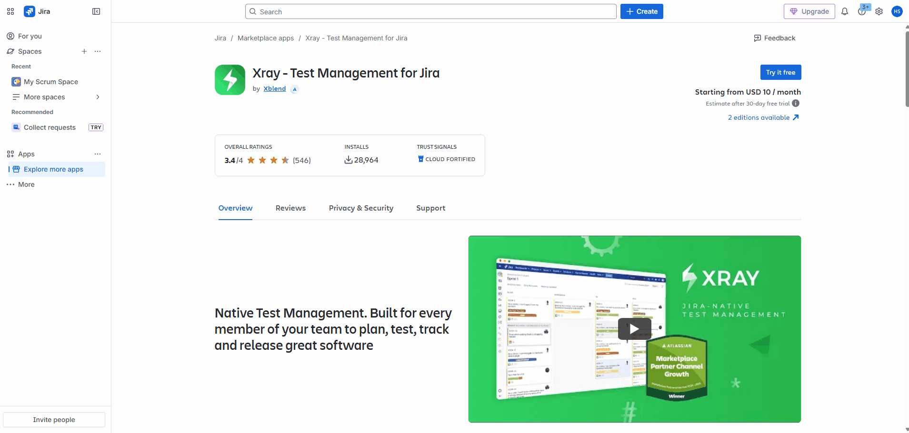{loading=lazy}


### Generate API Keys (Client ID and Client Secret)

For secure integration with ELITEA, it is essential to use Xray Cloud **API Keys**, specifically a **Client ID** and **Client Secret**, for authentication. This method is more secure than using your primary Jira account password directly and allows you to control access permissions for ELITEA.

**Follow these steps to generate Xray Cloud API Keys (Client ID and Client Secret):**

1.  **Log in to Jira Cloud:** Access your Jira Cloud instance (e.g., `your-workspace.atlassian.net`) where Xray Cloud is installed and log in with your Jira Cloud credentials (you need to be a Jira administrator or have appropriate permissions to manage Xray settings).
2.  **Access Xray Settings:** In Jira Cloud, navigate to the top navigation bar and click on **"Apps"**. From the dropdown menu, select **"Xray"**. Open the tree-dots menu (•••) and select **App settings**. This will open the App settings for Xray
3.  **Navigate to API Keys:** In the Xray menu on the left-hand sidebar click on **"API Keys"**. This will take you to the API Keys management page within Xray settings.

    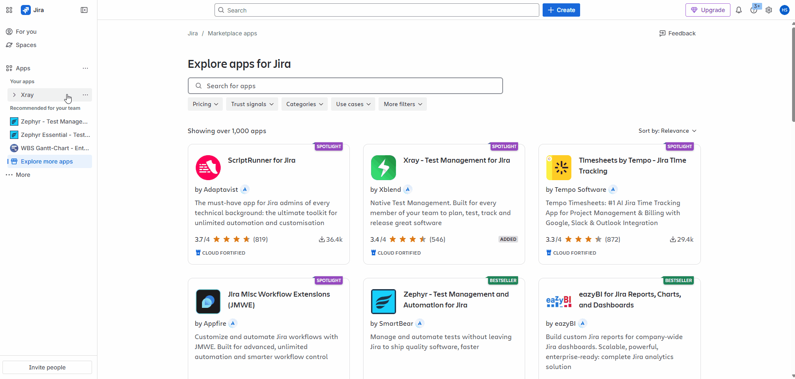{loading=lazy}

4.  **Generate API Key:** On the "API Keys" page, you will see a section to generate new API keys. In the search box provided, enter your Jira Cloud **Username** (typically your email address used for Jira login). Select your username from the search results.
5.  **Create API Key:** After selecting your username, click the **"Generate API Key"** button. This will generate a new Client ID and Client Secret pair for your user.

6.  **Securely Copy and Store Client ID and Client Secret:**  A pop-up window will appear displaying your newly generated **Client ID** and **Client Secret**. **Immediately copy both the Client ID and Client Secret**. 
**This is the only time you will see the full Client Secret value.** Store both the Client ID and Client Secret securely in a password manager or, preferably, ELITEA's built-in **[Secrets](../../menus/settings/secrets.md)** feature for enhanced security within ELITEA. You will need both the Client ID and Client Secret to configure the Xray Cloud toolkit in ELITEA.

    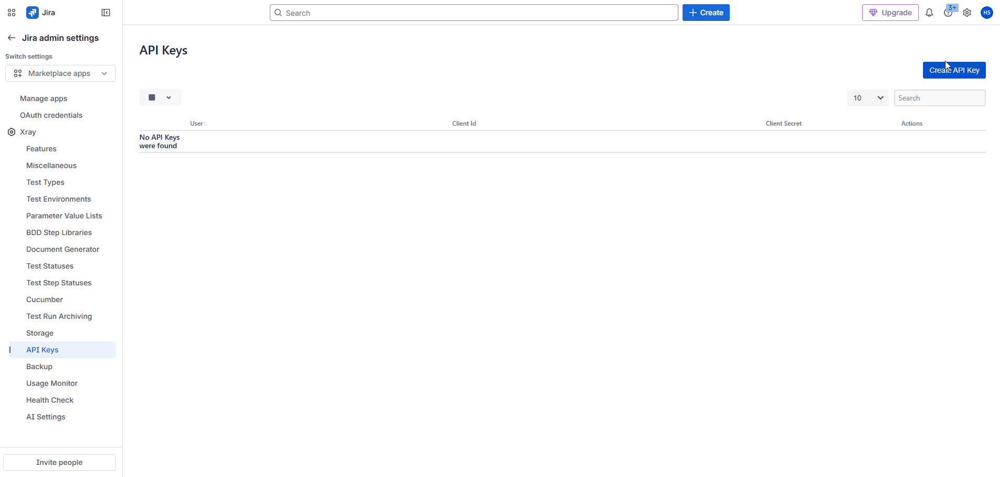{loading=lazy}


!!! warning "Important Security Practices"
    **Principle of Least Privilege:** Grant only the permissions absolutely essential for your ELITEA integration tasks.
    
    **Never Share API Keys:** Treat your Client ID and Client Secret like passwords. Do not share them publicly or commit them to version control systems.
    
    **Regular Token Review and Rotation:** Regularly review generated API keys and rotate them periodically as a security best practice.

### Xray Configuration in Jira

#### Configure Issue Types in Jira Project Settings for Xray

To fully utilize Xray's features, you need to configure specific Issue Types in your Jira project settings. This involves adding Issue Types for "Test", "Test Execution", "Test Set", and "Test Plan" and associating appropriate icons.

1.  **Download Issue Type Icons:** Before adding Issue Types, download the recommended icons for Xray Issue Types.
    *   **Access Icon Download Link:** Open your web browser and navigate to the following URL: [IssueTypeIcons](https://docs.getxray.app/display/XRAYCLOUD/Project+Settings%3A+Issue+Types+Mapping). This link provides a ZIP file containing PNG images for each Xray Issue Type.
    *   **Download Icons:** Download the ZIP file to your local computer and extract the image files. You will use these icons to visually identify Xray Issue Types in Jira.

    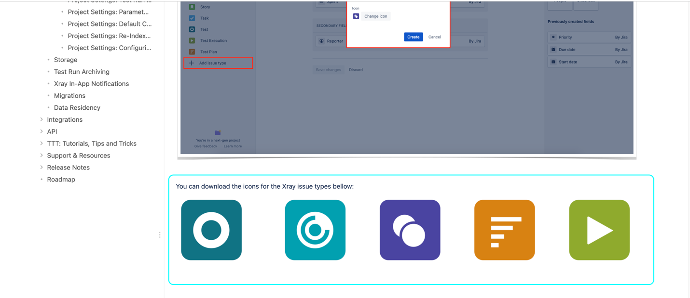{loading=lazy}

2.  **Navigate to Jira Project Settings:** In your Jira project, navigate to **"Project settings"** (usually located in the bottom left corner of the Jira project sidebar). Click on **"Project settings"**.

    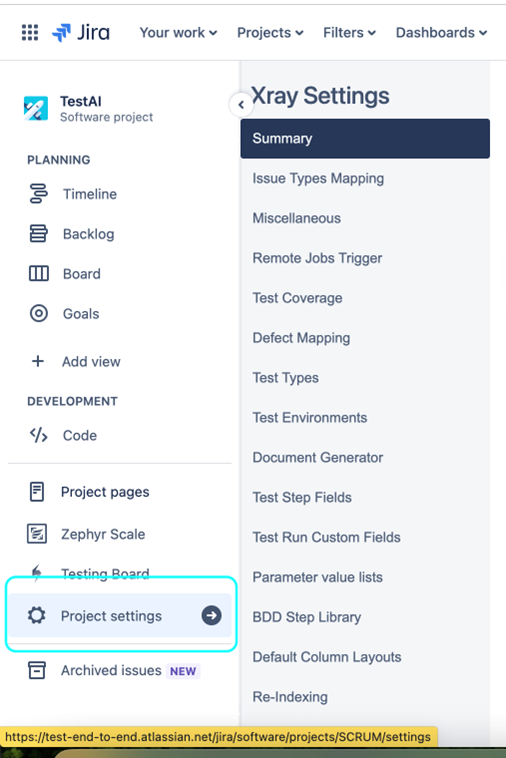{loading=lazy}

3.  **Access Issue Types:** In the Project settings menu, click on **"Issue types"**. This will take you to the Issue types configuration page for your Jira project.

    {loading=lazy}

4.  **Add Issue Type:** On the "Issue types" page, click on the **"Add issue type"** button, typically located at the top right corner.
5.  **Select Issue Type Creation Option:** In the "Add issue type" dropdown menu, click on **"Add issue type"** again to create a new issue type from scratch.

    {loading=lazy}

6.  **Configure "Test" Issue Type:** In the "Add new issue type" panel, configure the following for the "Test" Issue Type:
    *   **Name:** Enter **"Test"** as the name for the Issue Type.
    *   **Description:** Provide a brief description, such as "Use this issue type to create test cases for software testing."
    *   **Icon:** Click on the **"Change Icon"** button. In the "Upload icon" modal window, click **"Upload new icon"** and upload the `test.png` icon file that you downloaded in Step 3.1. Click **"Upload"** to set the icon.
    *   Click **"Add"** to create the "Test" Issue Type.

    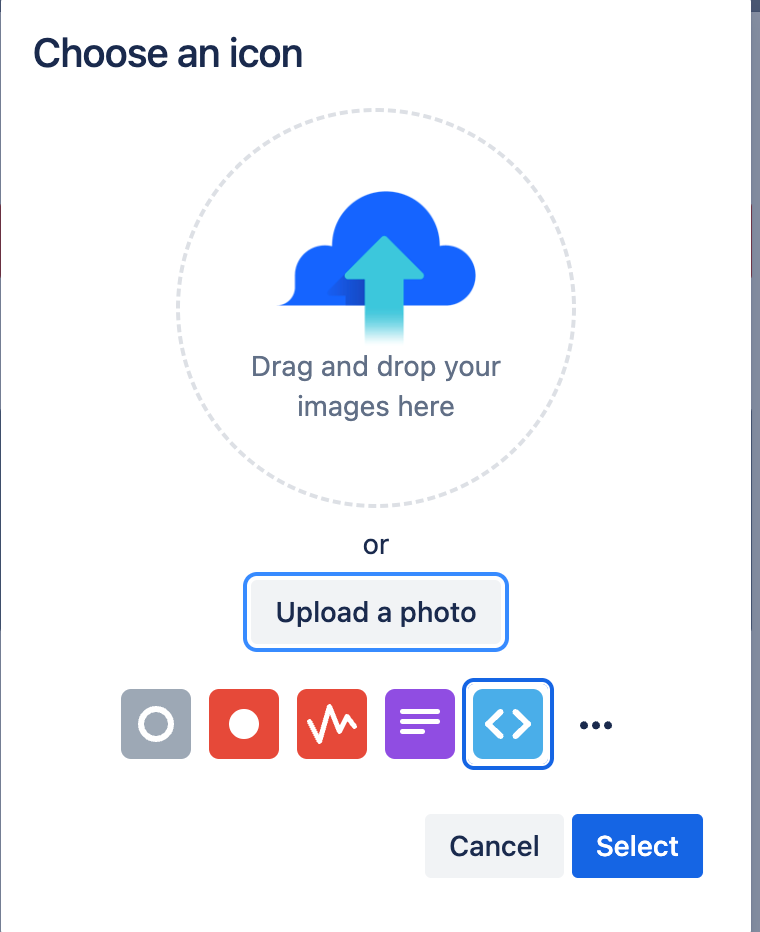{loading=lazy}

7.  **Repeat for "Test Execution", "Test Set", and "Test Plan" Issue Types:** Repeat steps 4-6 to add the following additional Issue Types, using the corresponding downloaded icons for each:
    *   **Issue Type Name:** **"Test Execution"**, Icon: `test-execution.png`
    *   **Issue Type Name:** **"Test Set"**, Icon: `test-set.png`
    *   **Issue Type Name:** **"Test Plan"**, Icon: `test-plan.png`

    Ensure you upload the appropriate icon (e.g., `test-execution.png` for "Test Execution", `test-set.png` for "Test Set", and `test-plan.png` for "Test Plan") for each Issue Type when creating them.

8.  **Verify Issue Types:** After adding all four Issue Types ("Test", "Test Execution", "Test Set", "Test Plan"), verify that they are listed on the "Issue types" page in your Jira Project Settings with their corresponding icons.

    
#### Configure Issue Type Mapping in Xray Settings

To finalize the Xray configuration, you need to map the newly created Jira Issue Types to their corresponding Xray Issue Types within the Xray settings for your project.

1.  **Navigate to Xray Settings - Issue Type Mapping:** In Jira, navigate to the top navigation bar and click on **"Apps"**. From the dropdown menu, select **"Xray"**. This will open the Xray main menu. In the Xray menu on the left-hand sidebar, click on **"Configure Project"**. Then, navigate to the **"Issue Types Mapping"** section within the Xray Settings page.

    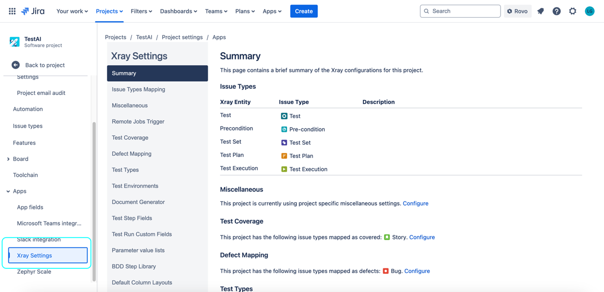{loading=lazy}    

2.  **Map Jira Issue Types to Xray Issue Types:** In the "Issue Types Mapping" section, use the dropdown lists to map the Jira Issue Types you created to the corresponding Xray Issue Types:
    *   **Test:** Select the **"Test"** Jira Issue Type you created from the dropdown list next to "Test".
    *   **Test Execution:** Select the **"Test Execution"** Jira Issue Type you created from the dropdown list next to "Test Execution".
    *   **Test Set:** Select the **"Test Set"** Jira Issue Type you created from the dropdown list next to "Test Set".
    *   **Test Plan:** Select the **"Test Plan"** Jira Issue Type you created from the dropdown list next to "Test Plan".

    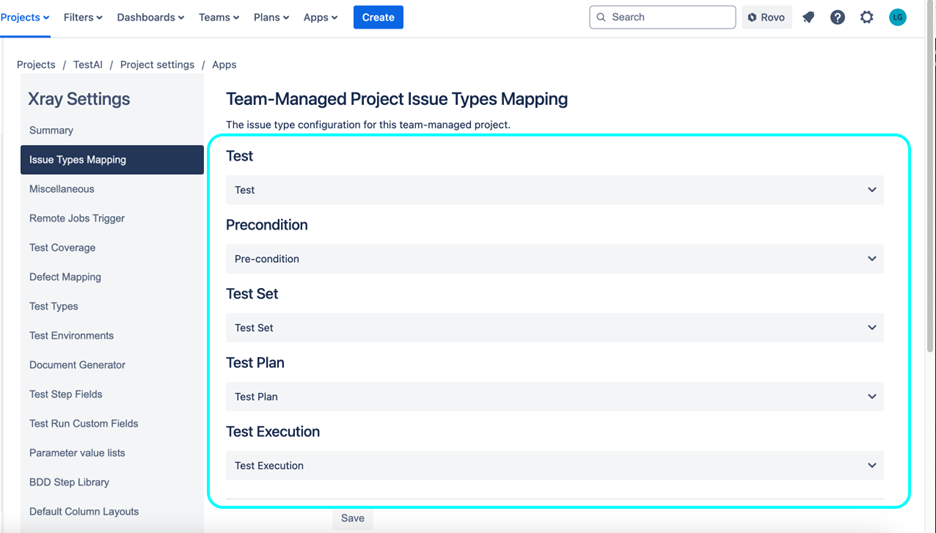{loading=lazy}

3.  **Save Configuration:** After mapping all the Issue Types, click the **"Save"** or **"Submit"** button (the button label may vary slightly depending on your Xray version) to save the Issue Type Mapping configuration.

After completing these configuration steps, your Xray tool will be successfully set up and integrated within your Jira project. You can now proceed to configure the ELITEA Xray Cloud toolkit and start automating your test management workflows.

---

## System Integration with ELITEA

To integrate Xray Cloud with ELITEA, you need to follow a three-step process: **Create Credentials → Create Toolkit → Use in Agents**. This workflow ensures secure authentication and proper configuration.

### Step 1: Create Xray Cloud Credentials

Before creating a toolkit, you must first create Xray Cloud credentials in ELITEA:

1. **Navigate to Credentials Menu:** Open the sidebar and select **[Credentials](../../menus/credentials.md)**.
2. **Create New Credential:** Click the **`+ Create`** button.
3. **Select Xray Cloud:** Choose **Xray** as the credential type.
4. **Configure Credential Details:**

    | **Field** | **Description** | **Example** |
    |-----------|----------------|-------------|
    | **Display Name** | Descriptive name for easy identification | `Xray Cloud - QA Project` |
    | **ID** | Unique identifier for the credential | Auto-generated |
    | **Base URL** | Your Xray Cloud API endpoint URL (see table below) | `https://xray.cloud.getxray.app/` |
    | **Client Secret** | Your Xray Cloud API Client Secret | `your-client-secret` |    
    | **Client ID** | Your Xray Cloud API Client ID | `your-client-id` |

5. **Test Connection:** Click **Test Connection** to verify your credentials are valid and ELITEA can connect to Xray Cloud
6. **Save Credential:** Click **Save** to create the credential

     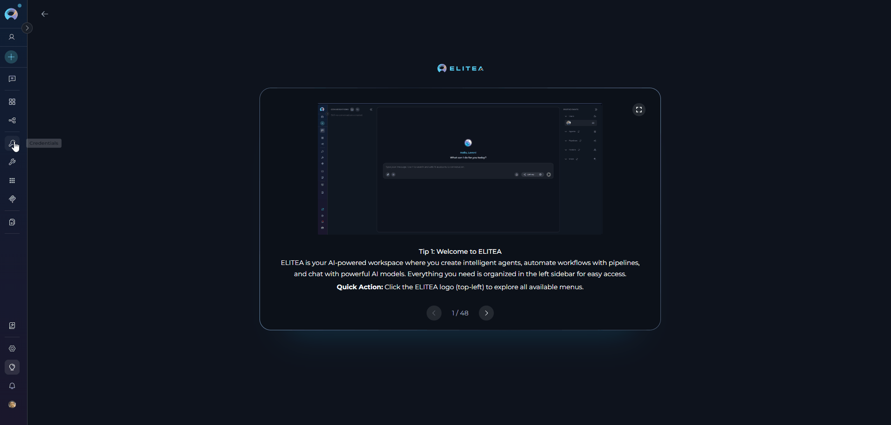

    **Xray Cloud API Endpoints by Region:**

    | Location   | Region Description                  | Endpoint                                 |
    |------------|-------------------------------------|------------------------------------------|
    | Global     | All Xray Cloud across regions       | `https://xray.cloud.getxray.app/`        |
    | USA        | USA region                          | `https://us.xray.cloud.getxray.app/`     |
    | EU         | Europe (Frankfurt) region           | `https://eu.xray.cloud.getxray.app/`     |
    | Australia  | Australia (Sydney) region           | `https://au.xray.cloud.getxray.app/`     |
     

!!! tip "Security Recommendation"
    It's highly recommended to use **[Secrets](../../menus/settings/secrets.md)** for Client ID and Client Secret instead of entering them directly. Create secrets first, then reference them in your credential configuration.

### Step 2: Create Xray Cloud Toolkit

Once your credentials are configured, create the Xray Cloud toolkit:

1. **Navigate to Toolkits Menu:** Open the sidebar and select **[Toolkits](../../menus/toolkits.md)**.
2. **Create New Toolkit:** Click the **`+ Create`** button.
3. **Select Xray Cloud:** Choose **Xray Cloud** from the list of available toolkit types.
4. **Configure Toolkit Settings:**

    | **Field** | **Description** | **Example** |
    |-----------|----------------|-------------|
    | **Toolkit Name** | Descriptive name for your toolkit | `Xray Cloud - QA Project` |
    | **Description** | Optional description for the toolkit | `Xray Cloud toolkit for QA team` |
    | **Xray Cloud Configuration** | Select your previously created Xray Cloud credential | `Xray Cloud - QA Project` |
    | **PgVector Configuration** | Select PgVector for indexing features | Your PgVector configuration |
    | **Embedding Model** | Select embedding model for semantic search | `amazon.titan-embed-text-v2:0` |
    | **Limit** | Limit| `100` |

5. **Enable Desired Tools:** In the **"Tools"** section, select the checkboxes next to the specific Xray Cloud tools you want to enable. **Enable only the tools your agents will actually use**
       * **[Make Tools Available by MCP](../mcp/make-tools-available-by-mcp.md)** - (optional checkbox) Enable this option to make the selected tools accessible through external MCP clients
6. **Save Toolkit:** Click **Save** to create the toolkit

    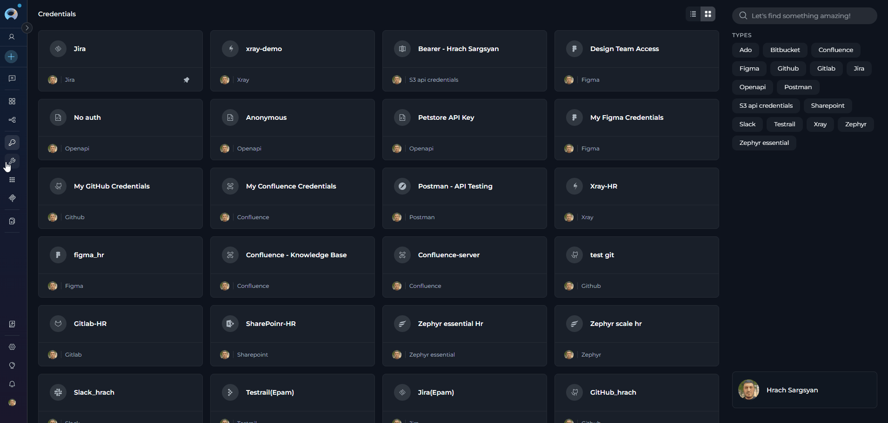{loading=lazy}
    

#### Available Tools:

The Xray Cloud toolkit provides the following tools for interacting with Xray Cloud, grouped by functional categories:

| **Tool Category** | **Tool Name** | **Description** | **Primary Use Case** |
|:-----------------:|---------------|-----------------|----------------------|
| **Test Management** | **Add attachment to test step** | Attach files to a specific test step within a test case | Add evidence or artifacts to test steps during test documentation or execution |
| | **Create test** | Create a single test case in Xray Cloud (summary, description, steps JSON) | Add or author a new test case from Agents or Pipelines |
| | **Create tests** | Create multiple test cases (bulk) or batch-create tests from structured input | Bulk onboarding of test cases from requirements or automation outputs |
| | **Get test step attachments** | Retrieve attachments associated with a specific test step | Download or review artifacts attached to test steps |
| | **Get tests** | Retrieve a list of tests (summaries and keys) for a project | Inventory, reporting, and test discovery |
| **Advanced Operations** | **Execute graphql** | Run a custom GraphQL query against Xray Cloud API | Advanced queries, custom reports, and data extraction not covered by basic tools |
| **Indexing & Search** | **Index data** | Index test-related content for semantic search and analysis (e.g., PgVector) | Build searchable indexes of test artifacts and metadata |
| | **List collections** | List available search/index collections | Admin view of indexed collections available for search or maintenance |
| | **Remove index** | Remove an existing index or collection | Cleanup deprecated or incorrect indexes |
| | **Search index** | Perform semantic or keyword searches against an index | Find relevant tests, steps, or artifacts via search queries |
| | **Stepback search index** | Run a stepback-style search (contextual reranking) against an index | Contextual retrieval for debugging, triage, and investigative queries |
| | **Stepback summary index** | Generate a summarized stepback report from index search results | Produce condensed summaries for long-running investigations or PR triage |

#### Testing Toolkit Tools

After configuring your Xray Cloud toolkit, you can test individual tools directly from the Toolkit detailed page using the **Test Settings** panel. This allows you to verify that your credentials are working correctly and validate tool functionality before adding the toolkit to your workflows.

**General Testing Steps:**

1. **Select LLM Model:** Choose a Large Language Model from the model dropdown in the Test Settings panel
2. **Configure Model Settings:** Adjust model parameters like Creativity, Max Completion Tokens, and other settings as needed
3. **Select a Tool:** Choose the specific Xray Cloud tool you want to test from the available tools
4. **Provide Input:** Enter any required parameters or test queries for the selected tool
5. **Run the Test:** Execute the tool and wait for the response
6. **Review the Response:** Analyze the output to verify the tool is working correctly and returning expected results

!!! tip "Key benefits of testing toolkit tools:"
    * Verify that Xray Cloud credentials and connection are configured correctly
    * Validate that tools function as expected with your Xray Cloud instance
    * Test different parameter combinations and edge cases before production use
    * Familiarize yourself with tool capabilities and expected outputs
    
    > For detailed instructions on how to use the Test Settings panel, see **[How to Test Toolkit Tools](../../how-tos/credentials-toolkits/how-to-test-toolkit-tools.md)**.

---
### Step 3: Use Xray Cloud Toolkit in Agents

Once your Xray Cloud toolkit is created, you can use it in various ELITEA features:

#### **In Agents:**
1. **Navigate to Agents:** Open the sidebar and select **[Agents](../../menus/agents.md)**.
2. **Create or Edit Agent:** Click **`+ Create`** for a new agent or select an existing agent to edit.
3. **Add Xray Cloud Toolkit:** 
     * In the **"TOOLKITS"** section of the agent configuration, click the **"+Toolkit"** icon
     * Select your Xray Cloud toolkit from the dropdown menu
     * The toolkit will be added to your agent with the previously configured tools enabled

     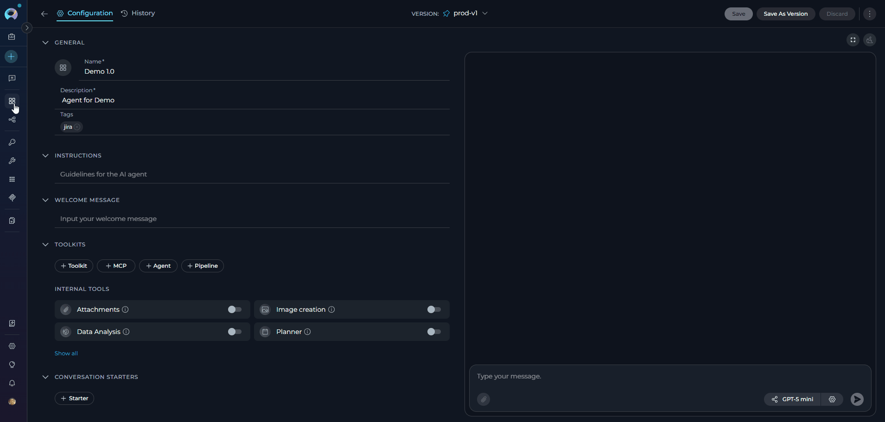
Your agent can now interact with Xray Cloud using the configured toolkit and enabled tools.

#### **In Pipelines:**

1. **Navigate to Pipelines:** Open the sidebar and select **[Pipelines](../../menus/pipelines.md)**.
2. **Create or Edit Pipeline:** Either create a new pipeline or select an existing pipeline to edit.
3. **Add Xray Cloud Toolkit:** 
     * In the **"TOOLKITS"** section of the pipeline configuration, click the **"+Toolkit"** icon
     * Select your Xray Cloud toolkit from the dropdown menu
     * The toolkit will be added to your pipeline with the previously configured tools enabled

     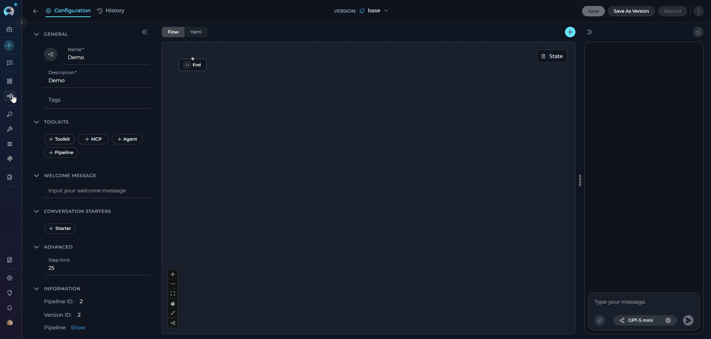

#### **In Chat:**

1. **Navigate to Chat:** Open the sidebar and select **[Chat](../../menus/chat.md)**.
2. **Start New Conversation:** Click **+Create** or open an existing conversation.
3. **Add Toolkit to Conversation:**
     * In the chat Participants section, look for the **Toolkits** element
     * Click to add a toolkit and select your Xray Cloud toolkit from the available options
     * The toolkit will be added to your conversation with all previously configured tools enabled
4. **Use Toolkit in Chat:** You can now directly interact with your Xray Cloud instance by asking questions or requesting actions that will trigger the Xray Cloud toolkit tools.

      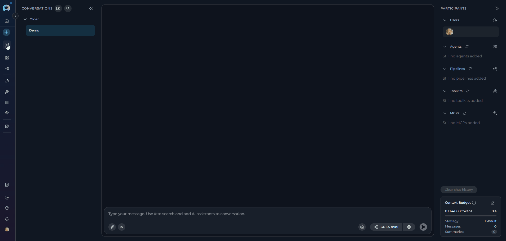

---

## Instructions and Prompts for Using the Xray Cloud Toolkit

To effectively instruct your ELITEA Agent to use the Xray Cloud toolkit, you need to provide clear and precise instructions within the Agent's "Instructions" field. These instructions are crucial for guiding the Agent on *when* and *how* to utilize the available Xray Cloud tools to achieve your desired automation goals.

### Instruction Creation for Agents

When crafting instructions for the Xray Cloud toolkit, especially for OpenAI-based Agents, clarity and precision are paramount. Break down complex tasks into a sequence of simple, actionable steps. Explicitly define all parameters required for each tool and guide the Agent on how to obtain or determine the values for these parameters. Agents respond best to instructions that are:

*   **Direct and Action-Oriented:** Employ strong action verbs and clear commands to initiate actions. For example, "Use the 'get_tests' tool...", "Create a test case named...", "Retrieve all tests from project...".

*   **Parameter-Centric:** Clearly enumerate each parameter required by the tool. For each parameter, specify:
    *   Its name (exactly as expected by the tool)
    *   Its expected data type (string, integer, JSON object, etc.)
    *   How the Agent should obtain the value – whether from user input, derived from previous steps in the conversation, retrieved from an external source, or a predefined static value

*   **Contextually Rich:** Provide sufficient context so the Agent understands the overarching objective and the specific scenario in which each Xray Cloud tool should be applied within the broader workflow. Explain the desired outcome or goal for each tool invocation.

*   **Step-by-Step Structure:** Organize instructions into a numbered or bulleted list of steps for complex workflows. This helps the Agent follow a logical sequence of actions.

*   **Add Conversation Starters:** Include example conversation starters that users can use to trigger this functionality. For example, "Conversation Starters: 'List all tests in project PA', 'Create a new login test', 'Get test case details'"

When instructing your Agent to use an Xray Cloud toolkit tool, adhere to this structured pattern:

1. **State the Goal:** Begin by clearly stating the objective you want to achieve with this step. For example, "Goal: To retrieve a list of all test cases in the Xray Cloud project."

2. **Specify the Tool:** Clearly indicate the specific Xray Cloud tool to be used for this step. For example, "Tool: Use the 'get_tests' tool."

3. **Define Parameters:** Provide a detailed list of all parameters required by the selected tool. For each parameter:
   - **Parameter Name:** `<Parameter Name as defined in tool documentation>`
   - **Value or Source:** `<Specify the value or how to obtain the value. Examples: "user input", "from previous step", "hardcoded value 'PA'", "value of variable X">`

4. **Describe Expected Outcome (Optional but Recommended):** Briefly describe the expected result or outcome after the tool is successfully executed. For example, "Outcome: The Agent will display a list of all test cases with their IDs and names."

5. **Add Conversation Starters:** Include example conversation starters that users can use to trigger this functionality.

!!! example "Example Agent Instructions"

    **Agent Instructions for Getting a List of Tests:**

    ```markdown
    1. Goal: Retrieve a list of all test cases in the Xray Cloud project.
    2. Tool: Use the "get_tests" tool.
    3. Parameters:
        - Project Key: "Ask the user for the Jira project key, or use a default value like 'PA'."
    4. Outcome: A list of all test cases in the specified project will be retrieved and displayed to the user.
    5. Conversation Starters: "Show me all tests in project PA", "List all test cases"
    ```

    **Agent Instructions for Creating a New Test Case:**

    ```markdown
    1. Goal: Create a new test case in Xray Cloud.
    2. Tool: Use the "create_test" tool.
    3. Parameters:
        - Project Key: "Ask the user for the Jira project key, or use a default value."
        - Test Issue Summary: "Ask the user for the test case title, or use 'Verify User Login Functionality' as an example."
        - Description: "Optional - Ask user for a description or provide a default like 'This test case verifies the user login functionality with valid credentials.'"
        - Test Steps (JSON Array): "Optional - Ask user for test steps or provide a default JSON array with steps."
    4. Outcome: A new test case will be created in Xray Cloud with the specified details.
    5. Conversation Starters: "Create a new test case", "Add a test for login functionality"
    ```

### Chat Usage Examples by Tool Category

The following examples demonstrate how to interact with the Xray Cloud toolkit in ELITEA Chat, organized by functional categories. Each example shows the user request and the expected agent behavior.

??? example "Test Management - Get Tests"

    **Chat Example:**
    ```
    User: "Show me all test cases in project PA"

    Agent Response: [Agent uses get_tests tool]

    📋 **Test Cases in Project PA** (15 total):

    1. **PA-T1**: Verify user login with valid credentials
       - **Priority**: High
       - **Status**: Active

    2. **PA-T2**: Verify user login with invalid password
       - **Priority**: High
       - **Status**: Active

    3. **PA-T3**: Verify password reset functionality
       - **Priority**: Medium
       - **Status**: Active

    4. **PA-T4**: Verify user registration with valid data
       - **Priority**: Medium
       - **Status**: Active

    5. **PA-T5**: Verify session timeout after inactivity
       - **Priority**: Low
       - **Status**: Active

    [... additional tests ...]

    These test cases cover various authentication and user management scenarios in the application.
    ```

??? example "Test Management - Create Test"

    **Chat Example:**
    ```
    User: "Create a new test case to verify the password change functionality"

    Agent Response: [Agent uses create_test tool]

    ✔️ **Test Case Created Successfully!**

    - **Test Case Key**: PA-T16
    - **Title**: Verify password change functionality
    - **Project**: PA
    - **Status**: Active

    **Test Case Details:**
    - **Preconditions**: User is logged in and has a verified email address
    - **Test Steps**:
      1. Navigate to user profile settings
      2. Click on "Change Password" option
      3. Enter current password
      4. Enter new password (meeting complexity requirements)
      5. Confirm new password
      6. Click "Save Changes" button
    
    - **Expected Result**: 
      - Password is successfully updated
      - User receives confirmation message
      - User can log in with new password

    The test case is now available in Xray Cloud and ready for execution.
    ```

??? example "Advanced Operations - Execute Custom GraphQL"

    **Chat Example:**
    ```
    User: "Use GraphQL to get detailed information about test execution PA-TE-100"

    Agent Response: [Agent uses execute_custom_graphql tool]

    🔍 **Test Execution Details (PA-TE-100)**:

    Retrieved via custom GraphQL query:

    **Execution Summary:**
    - **Test Execution Key**: PA-TE-100
    - **Test Plan**: Sprint 10 Regression
    - **Status**: IN PROGRESS
    - **Start Date**: 2024-01-15
    - **Assigned To**: QA Team Lead

    **Test Results:**
    - **Total Tests**: 45
    - **Passed**: 38 (84%)
    - **Failed**: 5 (11%)
    - **Executing**: 2 (5%)

    **Failed Tests:**
    1. PA-T23: Login timeout issue
    2. PA-T35: Payment gateway error
    3. PA-T42: Report generation bug
    4. PA-T51: Mobile UI responsiveness
    5. PA-T58: Email notification delay

    This detailed information was retrieved using a custom GraphQL query for advanced reporting needs.
    ```

---

## Use Cases

The Xray Cloud toolkit unlocks numerous automation possibilities for test management workflows within ELITEA. Here are some key use cases:

??? tip "Automated Test Case Retrieval"

    **Scenario:** QA teams need quick access to test case information without opening Xray Cloud interface
    
    **Tools Used:** `get_tests`
    
    **Benefit:** Saves time and allows for faster decision-making during test planning and execution
    
    **Example Workflow:**
    
    1. User requests test case list via Chat or Agent
    2. Agent uses `get_tests` tool with project key
    3. Complete test case list displayed instantly
    4. User can review test inventory without context switching

??? tip "Dynamic Test Case Creation from Requirements"

    **Scenario:** Automatically generate test cases from user stories or requirements when they are created in Jira
    
    **Tools Used:** `create_test`
    
    **Benefit:** Ensures test coverage from the outset of development and reduces manual test case authoring effort
    
    **Example Workflow:**
    
    1. New user story or requirement created in Jira
    2. Agent analyzes user story content and acceptance criteria
    3. Generates comprehensive test case structure with steps and expected results
    4. Uses `create_test` to create test case in Xray Cloud
    5. Automatically links test case to user story
    6. Notifies QA team of new test case creation

??? tip "AI-Powered Test Case Generation"

    **Scenario:** Generate test cases automatically based on application features, user stories, or acceptance criteria
    
    **Tools Used:** `create_test`
    
    **Benefit:** Accelerates test case creation, improves test coverage, and reduces manual effort
    
    **Example Workflow:**
    
    1. User provides feature description or user story details
    2. Agent analyzes requirements and identifies test scenarios
    3. Agent generates comprehensive test steps, preconditions, and expected results
    4. Uses `create_test` tool to create multiple test cases in Xray Cloud
    5. Organizes test cases by priority and test type

??? tip "Test Coverage Analysis and Reporting"

    **Scenario:** Analyze test coverage across projects and generate comprehensive reports
    
    **Tools Used:** `get_tests`, `execute_custom_graphql`
    
    **Benefit:** Provides visibility into testing efforts, identifies coverage gaps, and supports data-driven decisions
    
    **Example Workflow:**
    
    1. Agent retrieves all test cases from project using `get_tests`
    2. Uses `execute_custom_graphql` to gather detailed test execution data
    3. Analyzes test distribution across requirements and features
    4. Generates coverage report highlighting gaps
    5. Provides recommendations for improving test coverage

??? tip "Advanced Xray Data Extraction with GraphQL"

    **Scenario:** Extract complex test management data for custom reporting and analytics
    
    **Tools Used:** `execute_custom_graphql`
    
    **Benefit:** Enables advanced users to access any Xray Cloud data for specialized integrations and reporting needs
    
    **Example Workflow:**
    
    1. User defines specific data requirements not covered by standard tools
    2. Agent constructs appropriate GraphQL query
    3. Uses `execute_custom_graphql` to retrieve data
    4. Processes and formats results for user consumption
    5. Generates custom reports or dashboards

??? tip "Test Case Bulk Operations"

    **Scenario:** Perform bulk operations on multiple test cases simultaneously
    
    **Tools Used:** `get_tests`, `create_test`, `execute_custom_graphql`
    
    **Benefit:** Saves significant time when managing large test suites
    
    **Example Workflow:**
    
    1. User identifies need for bulk test case creation or updates
    2. Agent retrieves existing test cases using `get_tests`
    3. Analyzes patterns and requirements
    4. Creates multiple test cases in batch using `create_test`
    5. Verifies creation success and reports results

??? tip "Test Case Documentation Generation"

    **Scenario:** Automatically generate comprehensive test documentation from Xray Cloud test cases
    
    **Tools Used:** `get_tests`, `execute_custom_graphql`
    
    **Benefit:** Maintains up-to-date test documentation without manual effort
    
    **Example Workflow:**
    
    1. Agent retrieves all test cases from specified project
    2. Uses GraphQL to gather detailed test information
    3. Formats data into structured documentation
    4. Generates PDF or Markdown documentation
    5. Distributes to stakeholders or uploads to documentation repository

??? tip "Intelligent Test Planning Assistant"

    **Scenario:** Assist QA teams in creating comprehensive test plans based on project requirements
    
    **Tools Used:** `get_tests`, `create_test`, `execute_custom_graphql`
    
    **Benefit:** Improves test planning efficiency and ensures comprehensive coverage
    
    **Example Workflow:**
    
    1. User provides sprint or release requirements
    2. Agent analyzes requirements and existing test cases
    3. Identifies gaps in test coverage
    4. Recommends new test cases to create
    5. Creates missing test cases automatically
    6. Organizes test cases into logical test plans

??? tip "Regression Test Suite Management"

    **Scenario:** Automatically maintain and update regression test suites
    
    **Tools Used:** `get_tests`, `execute_custom_graphql`
    
    **Benefit:** Ensures regression suites remain relevant and comprehensive
    
    **Example Workflow:**
    
    1. Agent reviews all test cases in project
    2. Identifies test cases suitable for regression testing
    3. Analyzes test execution history using GraphQL
    4. Recommends tests to add or remove from regression suite
    5. Updates regression test sets accordingly

??? tip "Cross-Project Test Analysis"

    **Scenario:** Analyze and compare test management metrics across multiple Jira projects
    
    **Tools Used:** `get_tests`, `execute_custom_graphql`
    
    **Benefit:** Provides organizational visibility into testing efforts and quality metrics
    
    **Example Workflow:**
    
    1. Agent retrieves test data from multiple projects
    2. Uses GraphQL for detailed metrics collection
    3. Compares test coverage, execution rates, and quality metrics
    4. Identifies best practices and areas for improvement
    5. Generates executive summary report

---

## Troubleshooting

??? warning "Authentication Failures"

    **Problem:** Unable to authenticate with Xray Cloud API. Error messages like "Authentication failed", "Invalid credentials", "401 Unauthorized", or "Please, check your credentials"
    
    **Possible Causes:**
    
    - Incorrect Client ID or Client Secret
    - API keys expired or revoked
    - Wrong Base URL configured
    - Xray Cloud subscription inactive or expired
    - Network/firewall blocking the authentication endpoint
    
    **Solutions:**
    
    1. **Verify API Credentials:**
        - Go to ELITEA **Credentials** menu
        - Open your Xray Cloud credential
        - Click **Test Connection** to verify credentials
        - If test fails, regenerate API keys in Xray Cloud
        - Note: The toolkit authenticates via `POST {base_url}/api/v1/authenticate` using `client_id` and `client_secret` to obtain a JWT bearer token
    
    2. **Check Base URL:**
        - The default URL is `https://xray.cloud.getxray.app`
        - If your Xray Cloud instance uses a regional endpoint, configure it accordingly (e.g., `https://eu.xray.cloud.getxray.app`)
        - Ensure the URL does **not** include a trailing slash or path suffix — only the base domain
        - The toolkit appends `/api/v1/authenticate` and `/api/v2/graphql` automatically
    
    3. **Regenerate API Keys:**
        - Log in to Jira Cloud with Xray installed
        - Navigate to **Apps → Xray → Configure Project → API Keys**
        - Generate new API keys (Client ID + Client Secret)
        - Update credentials in ELITEA
        - Test connection again
    
    4. **Token Refresh Issues:**
        - The toolkit includes automatic token re-authentication if a `401 Unauthorized` is encountered during operations (e.g., attachment downloads)
        - If you see persistent authentication failures after initial success, the JWT token may have expired and re-auth failed — verify credentials are still valid
    
    5. **Verify Xray Subscription:**
        - Check that Xray Cloud subscription is active
        - Verify your Jira Cloud instance has Xray installed and licensed
        - Contact Xray support if subscription issues persist

??? warning "Tool Execution Failures"

    **Problem:** Xray Cloud toolkit tools fail to execute or return errors
    
    **Possible Causes:**
    
    - Missing required parameters
    - Invalid project keys, issue IDs, or step IDs
    - Insufficient Jira/Xray permissions
    - Malformed GraphQL mutations (for `create_test` and `execute_graphql`)
    - Network connectivity issues
    - Xray Cloud service disruptions
    
    **Solutions:**
    
    1. **Verify Required Parameters for Each Tool:**
        - `get_tests`: Requires `jql` (JQL query string)
        - `create_test`: Requires `graphql_mutation` (a complete GraphQL mutation string)
        - `create_tests`: Requires `graphql_mutations` (a list of GraphQL mutation strings)
        - `execute_graphql`: Requires `graphql` (any valid GraphQL query or mutation)
        - `add_attachment_to_test_step`: Requires `step_id` (UUID format, **not** a Jira issue key); plus either `filepath` (artifact path) or `filedata` (string content) — not both
        - `get_test_step_attachments`: Requires `issue_id` (Jira key like `PROJ-123` or numeric ID)
    
    2. **Check Permissions:**
        - Verify the user associated with API keys has appropriate Jira permissions
        - User needs **"Create Issues"** permission for test case creation
        - User needs **"Browse Projects"** permission to retrieve test data
        - Attachment operations require access to the test's project
        - Contact Jira administrator to verify permissions
    
    3. **Test Individual Tools:**
        - Use the **Test Settings** panel in toolkit configuration
        - Test each tool individually to identify specific issues
        - Start with `get_tests` using a simple JQL like `project = "YOUR_KEY"` to verify basic connectivity
        - Review error messages for specific guidance
    
    4. **Check Network Connectivity:**
        - Verify ELITEA can reach Xray Cloud endpoints (both `/api/v1/authenticate` and `/api/v2/graphql`)
        - Check for firewall or proxy restrictions
        - Test connection from ELITEA credentials page
    
    5. **Monitor Xray Cloud Status:**
        - Check Xray Cloud service status page
        - Verify no ongoing outages or maintenance
        - Retry operation after service restoration

??? warning "Project Key or Test Case Not Found"

    **Problem:** Error messages indicating project or test case doesn't exist, such as "Test not found with key: PROJ-123"
    
    **Possible Causes:**
    
    - Incorrect project key format
    - Project doesn't have Xray configured
    - Test case ID doesn't exist
    - User doesn't have access to the project
    - Using an issue key where a numeric ID is expected (or vice versa)
    
    **Solutions:**
    
    1. **Verify Project Key:**
        - Ensure project key is in correct format (e.g., `"PA"`, `"TEST"`, `"QA"`)
        - Project keys are case-sensitive
        - Verify project exists in Jira Cloud
    
    2. **Understand ID Formats:**
        - `get_test_step_attachments` accepts both Jira keys (`PROJ-123`) and numeric IDs (`12345`) — the toolkit auto-converts keys to numeric IDs internally
        - `add_attachment_to_test_step` requires `step_id` in **UUID format** (e.g., `a1b2c3d4-e5f6-7890-abcd-ef1234567890`), not a Jira issue key
        - Step IDs can be retrieved from the `steps` field in `get_tests` or `create_test` responses
    
    3. **Check Xray Configuration:**
        - Verify Xray is properly configured for the project
        - Ensure Issue Type Mapping is configured in Xray settings
        - Verify Test, Test Execution, Test Set, and Test Plan issue types exist
    
    4. **Verify Project Access:**
        - Confirm user associated with API keys has access to the project
        - Check project permissions in Jira
        - Ask Jira administrator to grant access if needed

??? warning "GraphQL Query Errors"

    **Problem:** Custom GraphQL queries or mutations fail, or return unexpected results
    
    **Possible Causes:**
    
    - Syntax errors in GraphQL query/mutation
    - Requesting non-existent fields
    - Incorrect variable types or missing required fields
    - Query complexity exceeds Xray limits
    - Insufficient permissions for requested data
    
    **Solutions:**
    
    1. **Validate GraphQL Syntax:**
        - Check for proper GraphQL query structure — all brackets, braces, and parentheses must be balanced
        - Verify field names match the Xray GraphQL schema
        - When using JQL inside GraphQL, escape double quotes properly (e.g., `"project = \\"CALC\\""`)
        - Example of a valid query:
        ```graphql
        query {
          getTests(jql: "project = \"CALC\"", limit: 10, start: 0) {
            total
            results {
              issueId
              jira(fields: ["key", "summary"])
              testType { name kind }
            }
          }
        }
        ```
    
    2. **Reference Xray GraphQL Documentation:**
        - Consult [Xray Cloud GraphQL API documentation](https://docs.getxray.app/display/XRAYCLOUD/GraphQL+API)
        - Key queries: `getTests`, `getTest`
        - Key mutations: `createTest`, `updateTestStep`
        - The `jira()` field accepts a `fields` parameter to specify which Jira fields to return (e.g., `jira(fields: ["key", "summary", "description"])`)
    
    3. **Debug Mutations for Test Creation:**
        - The `create_test` tool expects a complete GraphQL mutation as its `graphql_mutation` parameter
        - Manual test example:
        ```graphql
        mutation {
          createTest(
            testType: { name: "Manual" },
            steps: [
              { action: "Step action", data: "Test data", result: "Expected result" }
            ],
            jira: {
              fields: {
                summary: "Test Title",
                project: { key: "PROJ" }
              }
            }
          ) {
            test { issueId jira(fields: ["key"]) }
            warnings
          }
        }
        ```
        - Generic test example uses `unstructured` instead of `steps`
        - Cucumber test example uses `gherkin` instead of `steps`
    
    4. **Batch Creation with Aliases:**
        - Multiple tests can be created in a single mutation using GraphQL aliases:
        ```graphql
        mutation {
          test1: createTest(...) { ... }
          test2: createTest(...) { ... }
        }
        ```
        - Alternatively, use the `create_tests` tool with a list of separate mutations
    
    5. **Check Permissions:**
        - Verify user has permissions to access requested data
        - Some GraphQL queries require project-level permissions
        - Test with a simplified query requesting only basic fields first

??? warning "Test Case Creation Failures"

    **Problem:** Unable to create test cases in Xray Cloud
    
    **Possible Causes:**
    
    - Invalid GraphQL mutation syntax
    - Missing required Jira fields (`summary`, `project.key`)
    - Issue type not properly configured in the project
    - Unsupported test type name (case-sensitive)
    - User lacks "Create Issues" permission
    
    **Solutions:**
    
    1. **Verify Required Fields in GraphQL Mutation:**
        - `jira.fields.summary` is **mandatory**
        - `jira.fields.project.key` is **mandatory**
        - `testType.name` must be one of: `"Manual"`, `"Generic"`, or `"Cucumber"` (case-sensitive)
    
    2. **Choose Correct Test Definition Format:**
        - **Manual tests**: Use `steps` parameter (array of `{action, data, result}` objects)
        - **Generic tests**: Use `unstructured` parameter (plain text string)
        - **Cucumber tests**: Use `gherkin` parameter (BDD feature/scenario text)
        - Do not mix these — each test type uses its own definition format
    
    3. **Check the Response for Warnings:**
        - Successful `createTest` mutations return both `test` data and `warnings` array
        - Always request `warnings` in your mutation response to catch non-fatal issues
        - Example response structure: `{ test: { issueId, jira, ... }, warnings: [] }`
    
    4. **Verify Issue Type Configuration:**
        - Ensure "Test" issue type exists in the target project
        - Check Issue Type Mapping in Xray settings
        - Verify the test type names match Xray configuration exactly
    
    5. **Optional Fields for Test Creation:**
        - `description`: Can be added via `jira.fields.description`
        - `labels`: Can be added via `jira.fields.labels` (array of strings)
        - `folderPath`: Organizes tests in Xray Test Repository folders
        - `preconditionIssueIds`: Links preconditions to the test

??? warning "Attachment Operation Failures"

    **Problem:** Unable to add or retrieve attachments from test steps. Error messages like "Invalid step_id", "Failed to add attachment", or "Failed to get test step attachments"
    
    **Possible Causes:**
    
    - Using a Jira issue key instead of a step UUID for `step_id`
    - Step ID doesn't exist or belongs to a different test
    - Both `filepath` and `filedata` provided (mutually exclusive)
    - Neither `filepath` nor `filedata` provided
    - Missing `filename` when using `filedata`
    - Artifact storage file not found (when using `filepath`)
    - File too large for base64 encoding via GraphQL
    
    **Solutions:**
    
    1. **Use Correct Step ID Format:**
        - `step_id` must be a **UUID** (e.g., `a1b2c3d4-e5f6-7890-abcd-ef1234567890`), not a Jira issue key
        - The toolkit validates that `step_id` is at least 10 characters long
        - Retrieve step IDs using `get_tests` tool — each step in the response includes its `id` field
        - Example flow: First call `get_tests` with JQL → extract `steps[].id` from results → use that UUID with `add_attachment_to_test_step`
    
    2. **Choose One Attachment Source:**
        - Use `filepath` for files stored in ELITEA artifact storage (format: `/{bucket}/{filename}`)
        - Use `filedata` for inline string content (must also provide `filename`)
        - Cannot specify both `filepath` and `filedata` simultaneously
        - When using `filepath`, the original artifact filename is used unless you override with `filename`
    
    3. **For `get_test_step_attachments`:**
        - `issue_id` accepts both Jira keys (`PROJ-123`) and numeric IDs
        - Optional `step_id` parameter filters to a specific step's attachments
        - Returns attachment metadata: `id`, `filename`, `downloadLink`, `step_id`, `step_action`
    
    4. **Handle Large Files:**
        - Attachments are base64-encoded before upload via GraphQL
        - Very large files may cause timeouts or exceed API limits
        - Consider compressing files or splitting large datasets

??? warning "Agent Not Using Xray Toolkit"

    **Problem:** Agent doesn't invoke Xray Cloud toolkit tools even when instructed
    
    **Possible Causes:**
    
    - Toolkit not added to agent configuration
    - Tools not enabled in toolkit
    - Vague or unclear agent instructions
    - Agent prioritizing other tools
    - Tool descriptions too generic
    
    **Solutions:**
    
    1. **Verify Toolkit Configuration:**
        - Open agent configuration in ELITEA
        - Check that Xray Cloud toolkit is listed in "TOOLKITS" section
        - Verify desired tools are enabled (checkboxes selected)
        - Available tools: `get_tests`, `create_test`, `create_tests`, `execute_graphql`, `add_attachment_to_test_step`, `get_test_step_attachments`
    
    2. **Improve Agent Instructions:**
        - Use explicit tool names in instructions: "Use the `get_tests` tool with JQL query..."
        - Specify the exact GraphQL mutation format for test creation
        - Add conversation starters that map to specific tool invocations
        - Example: "When user asks to retrieve test cases, use the `get_tests` tool with the provided JQL query"
    
    3. **Test Toolkit Independently:**
        - Use toolkit Test Settings panel to verify tools work
        - Test in Chat with explicit tool requests
        - Ensure toolkit credentials are valid and connected
    
    4. **Check Tool Description Visibility:**
        - Each tool's description includes the toolkit name and Xray instance URL
        - This helps the agent disambiguate when multiple toolkits are configured
        - Description format: `Toolkit: {name}\n{tool_description}\nXray instance: {base_url}`
    
    5. **Check LLM Model Capabilities:**
        - Some models are better at tool/function calling than others
        - Try using a more capable model (e.g., GPT-4o)
        - Ensure model supports function calling

??? warning "Rate Limiting or Performance Issues"

    **Problem:** Slow responses or rate limit errors from Xray Cloud API
    
    **Possible Causes:**
    
    - Exceeding Xray Cloud API rate limits
    - Large result sets from `get_tests` with broad JQL queries
    - High volume of concurrent requests
    - Base64 encoding of large attachment files
    - Network latency to Xray Cloud endpoints
    
    **Solutions:**
    
    1. **Optimize JQL Queries:**
        - Use specific filters to reduce result set size
        - The toolkit paginates results using the configured `limit` (default: 100)
        - Add filters like `testType`, `labels`, `project` to narrow results
        - Example: `project = "PROJ" AND testType = "Manual" AND labels = "Smoke"` instead of just `project = "PROJ"`
    
    2. **Adjust Pagination Limit:**
        - The `limit` parameter (default: 100) controls page size for `get_tests`
        - Lower it for faster individual responses (e.g., 20-50)
        - Higher values reduce number of API calls but increase response size
    
    3. **Batch Operations Wisely:**
        - Use `create_tests` for multiple test creation instead of calling `create_test` repeatedly
        - Or use GraphQL aliases in a single `create_test` mutation to create multiple tests at once
        - This reduces the number of API round-trips
    
    4. **Manage Attachment Sizes:**
        - Attachments are base64-encoded (33% size increase) before upload
        - Consider compressing large files before attachment
        - Monitor file sizes in the success response messages
    
    5. **Contact Xray Support:**
        - If rate limits are consistently exceeded
        - Inquire about enterprise rate limit options
        - Discuss optimization strategies for your use case

??? warning "Indexing and Vector Store Issues"

    **Problem:** Xray test data indexing fails or produces incomplete results
    
    **Possible Causes:**
    
    - PgVector configuration not set up
    - Embedding model not configured
    - Either `jql` or `graphql` parameter missing (exactly one is required)
    - Both `jql` and `graphql` provided simultaneously
    - Attachment processing failures during indexing
    
    **Solutions:**
    
    1. **Configure Indexing Prerequisites:**
        - Set up PgVector configuration in toolkit settings
        - Configure an embedding model
        - Both are required for indexing operations
    
    2. **Provide Exactly One Data Source:**
        - Use either `jql` **or** `graphql` parameter — not both, and not neither
        - JQL example: `project = "CALC" AND testType = "Manual" AND labels in ("Smoke", "Critical")`
        - GraphQL example for custom data extraction:
        ```graphql
        query {
          getTests(jql: "project = \"CALC\"") {
            results {
              issueId
              jira(fields: ["key", "summary", "description"])
              testType { name }
              steps { action data result attachments { id filename downloadLink } }
            }
          }
        }
        ```
    
    3. **Handle Attachment Indexing:**
        - Set `include_attachments: true` to include attachment content
        - Use `skip_attachment_extensions` to exclude specific file types (e.g., `[".exe", ".zip", ".bin"]`)
        - Attachment download uses authenticated requests with auto-retry on 401 errors
    
    4. **Monitor Indexing Logs:**
        - Check logs for "Unable to get tests" or "Error processing test data" messages
        - Failed attachment processing is logged but doesn't stop overall indexing
        - Individual attachment failures are logged with specific error details

### Support Contact

If you encounter issues not covered in this guide or need additional assistance with Xray Cloud integration, please refer to **[Contact Support](../../support/contact-support.md)** for detailed information on how to reach the ELITEA Support Team.

---

## FAQ

??? question "What is Xray Cloud and how does it differ from Xray Data Center/Server?"

    **Xray Cloud** is the cloud-based version of Xray Test Management, designed specifically for Jira Cloud environments. It's hosted by Atlassian and integrates seamlessly with Jira Cloud.
    
    **Key Differences:**
    
    | Feature | Xray Cloud | Xray Data Center/Server |
    |---------|-----------|------------------------|
    | **Deployment** | Hosted by Atlassian (SaaS) | Self-hosted on your infrastructure |
    | **API** | GraphQL API at `/api/v2/graphql`, OAuth2 auth at `/api/v1/authenticate` | REST API with different endpoints |
    | **Authentication** | Client ID + Client Secret → JWT bearer token | Varies (PAT, basic auth, etc.) |
    | **Updates** | Automatic cloud updates | Manual update cycle |
    
    **ELITEA Integration:** The Xray Cloud toolkit in Alita SDK is specifically designed for Xray Cloud. It uses the GraphQL API exclusively. If you're using Xray Data Center or Server, you would need a different integration approach (contact ELITEA support for guidance).

??? question "What Xray Cloud API credentials do I need for ELITEA integration?"

    You need **Client Credentials** consisting of:
    
    - **Client ID:** A unique identifier for your API access
    - **Client Secret:** A secret key for authentication (stored securely as `SecretStr` in the SDK)
    - **Base URL:** Your Xray Cloud instance URL (default: `https://xray.cloud.getxray.app`)
    
    These are generated in Xray Cloud settings (**Apps → Xray → Configure Project → API Keys**).
    
    **How Authentication Works:**
    
    1. The toolkit sends `client_id` and `client_secret` to `{base_url}/api/v1/authenticate`
    2. Xray returns a JWT bearer token
    3. All subsequent GraphQL API calls use this token in the `Authorization: Bearer {token}` header
    4. If a token expires (401 error), the toolkit automatically re-authenticates
    
    **Why Client Credentials?**
    
    - More secure than using passwords
    - Can be rotated without changing your Jira password
    - Can be revoked if compromised
    - Use **[Secrets](../../menus/settings/secrets.md)** in ELITEA for secure storage

??? question "Can I use multiple Xray Cloud toolkits for different Jira projects?"

    **Yes!** You can create multiple Xray Cloud toolkits in ELITEA, each configured for different:
    
    - Jira instances (different `base_url` values)
    - Security contexts with different Client ID/Secret credentials
    - Different `limit` settings (pagination page size)
    - Different tool selections per use case
    
    **Best Practice:**
    
    - Create separate credentials and toolkits for different Jira instances
    - Use descriptive toolkit names (e.g., "Xray Cloud - QA Team", "Xray Cloud - Dev Team")
    - For the same Jira instance but different projects, you can reuse the same toolkit — specify project keys in JQL queries and GraphQL mutations
    - Each tool description includes the Xray instance URL for disambiguation: `"Xray instance: https://eu.xray.cloud.getxray.app"`

??? question "Which Xray Cloud tools should I enable in my toolkit?"

    Enable only the tools your agents will actually use. This improves agent decision-making and reduces complexity.
    
    **Recommended Configurations:**
    
    | Use Case | Recommended Tools |
    |----------|-------------------|
    | **Read-only test management** | `get_tests`, `get_test_step_attachments` |
    | **Basic test creation** | `get_tests`, `create_test` |
    | **Full test management** | `get_tests`, `create_test`, `create_tests`, `get_test_step_attachments`, `add_attachment_to_test_step` |
    | **Advanced/custom operations** | All 6 tools including `execute_graphql` |
    | **Bulk operations** | `create_tests`, `get_tests`, `execute_graphql` |
    
    **Tip:** Start with `get_tests` and `create_test`, then add tools as needs grow. The `execute_graphql` tool is the most powerful (can do anything the GraphQL API supports) but requires GraphQL knowledge.

??? question "How do I create test cases using the toolkit? What's the mutation format?"

    Test creation uses **raw GraphQL mutations** passed to the `create_test` tool. The toolkit does **not** use simplified JSON parameters — you provide the complete mutation string.
    
    **Manual Test (with steps):**
    ```graphql
    mutation {
      createTest(
        testType: { name: "Manual" },
        steps: [
          { action: "Open login page", data: "https://app.example.com/login", result: "Login page loads" },
          { action: "Enter credentials", data: "user: test@example.com", result: "Credentials accepted" },
          { action: "Click Login", result: "User logged in, redirected to dashboard" }
        ],
        jira: {
          fields: {
            summary: "Login Flow Test",
            project: { key: "PROJ" },
            description: "Validates login functionality",
            labels: ["Smoke", "Regression"]
          }
        }
      ) {
        test {
          issueId
          testType { name }
          steps { id action data result }
          jira(fields: ["key", "summary"])
        }
        warnings
      }
    }
    ```
    
    **Generic Test (with unstructured content):**
    ```graphql
    mutation {
      createTest(
        testType: { name: "Generic" },
        unstructured: "Perform exploratory testing on calculator. Focus on:\n1. Basic operations\n2. Edge cases\n3. Error handling",
        jira: {
          fields: {
            summary: "Exploratory Calculator Test",
            project: { key: "PROJ" }
          }
        }
      ) {
        test { issueId testType { name } unstructured jira(fields: ["key"]) }
        warnings
      }
    }
    ```
    
    **Cucumber/BDD Test (with Gherkin):**
    ```graphql
    mutation {
      createTest(
        testType: { name: "Cucumber" },
        gherkin: "Feature: Login\n  Scenario: Valid login\n    Given I am on the login page\n    When I enter valid credentials\n    Then I should be logged in",
        jira: {
          fields: {
            summary: "BDD Login Test",
            project: { key: "PROJ" }
          }
        }
      ) {
        test { issueId gherkin jira(fields: ["key"]) }
        warnings
      }
    }
    ```
    
    **Batch Creation (multiple tests at once):**
    
    Option 1 — Use `create_tests` tool with a list of mutations:
    ```
    graphql_mutations: ["mutation { createTest(...) { ... } }", "mutation { createTest(...) { ... } }"]
    ```
    
    Option 2 — Use `create_test` tool with GraphQL aliases in a single mutation:
    ```graphql
    mutation {
      loginTest: createTest(testType: { name: "Manual" }, ...) { test { issueId } }
      logoutTest: createTest(testType: { name: "Manual" }, ...) { test { issueId } }
    }
    ```

??? question "How do step IDs work for attachment operations?"

    **Step IDs are UUIDs**, not Jira issue keys. This is a common source of confusion.
    
    **How to get step IDs:**
    
    1. Call `get_tests` with a JQL query that matches your test
    2. In the response, each test's `steps` array contains objects with an `id` field
    3. That `id` is a UUID like `a1b2c3d4-e5f6-7890-abcd-ef1234567890`
    4. Use this UUID as the `step_id` parameter in `add_attachment_to_test_step`
    
    **Validation:** The toolkit validates that `step_id` is at least 10 characters. If you accidentally pass a Jira issue key (e.g., `PROJ-123`), you'll get an error: *"Invalid step_id 'PROJ-123'. Step ID must be a UUID... Use get_tests tool to retrieve step IDs."*
    
    **Issue ID vs Step ID:**
    
    | Parameter | Format | Example | Used By |
    |-----------|--------|---------|---------|
    | `issue_id` | Jira key or numeric ID | `PROJ-123` or `12345` | `get_test_step_attachments` |
    | `step_id` | UUID | `a1b2c3d4-e5f6-...` | `add_attachment_to_test_step` |

??? question "Can I retrieve test execution results using the Xray Cloud toolkit?"

    **Yes**, using the `execute_graphql` tool with appropriate GraphQL queries.
    
    **Example — Get Test Execution Results:**
    ```graphql
    query {
      getTestExecutions(jql: "project = \"PROJ\"", limit: 10) {
        results {
          issueId
          jira(fields: ["key", "summary", "status"])
          testRuns(limit: 50) {
            results {
              status { name }
              test { jira(fields: ["key"]) }
            }
          }
        }
      }
    }
    ```
    
    **Note:** Test execution queries require knowledge of the Xray GraphQL schema. Refer to the [Xray GraphQL API Documentation](https://docs.getxray.app/display/XRAYCLOUD/GraphQL+API) for available queries.
    
    **The `get_tests` tool** returns test definitions (steps, preconditions, type) but **not** execution results. For execution data, you must use `execute_graphql`.

??? question "What happens if my Xray Cloud API keys expire or are revoked?"

    **Symptoms:**
    
    - Authentication errors in ELITEA
    - Tool execution failures with "Authentication failed" messages
    - "401 Unauthorized" errors during operations
    - Note: The toolkit may partially mask your Client Secret in error messages (showing only last 4 characters)
    
    **Built-in Recovery:**
    
    The toolkit has automatic token refresh logic:
    
    - If a `401 Unauthorized` occurs during an operation (e.g., downloading attachments), the toolkit automatically attempts re-authentication
    - If re-authentication also fails, it means the underlying credentials are invalid
    
    **Manual Resolution Steps:**
    
    1. **Regenerate API Keys in Xray Cloud:**
        - Log in to Jira Cloud → Apps → Xray → Configure Project → API Keys
        - Generate new Client ID and Client Secret
    
    2. **Update Credentials in ELITEA:**
        - Go to ELITEA Credentials menu
        - Edit your Xray Cloud credential
        - Update Client ID and Client Secret
        - Test connection to verify
    
    3. **No Need to Modify Toolkits or Agents:**
        - Toolkits reference credentials, so updating credentials automatically fixes all toolkits using them

??? question "Does the toolkit support test data indexing for vector search?"

    **Yes!** The Xray Cloud toolkit inherits from `NonCodeIndexerToolkit`, enabling vector store indexing of test case data.
    
    **Requirements:**
    
    - PgVector configuration (database connection for vector storage)
    - Embedding model configuration
    - Both configured in toolkit settings
    
    **Indexing Capabilities:**
    
    - Index test cases by JQL query or custom GraphQL
    - Content hashing for change detection (only re-indexes modified tests)
    - Attachment content extraction and indexing
    - Metadata preservation (key, summary, test type, assignee, reporter, project)
    
    **Supported Test Content Types:**
    
    | Test Type | Indexed Content |
    |-----------|----------------|
    | Manual | Steps (action, data, result) as JSON |
    | Cucumber | Gherkin/BDD scenario text |
    | Generic | Unstructured text content |
    
    **Indexing Parameters:**
    
    - `jql` or `graphql`: Data source (exactly one required)
    - `include_attachments`: Whether to download and index attachment content
    - `skip_attachment_extensions`: File types to exclude (e.g., `[".exe", ".zip"]`)
    - `chunking_tool`: Chunking strategy (default: `json`)

??? question "How do I write effective agent instructions for Xray Cloud toolkit?"

    **Key considerations specific to the Xray toolkit:**
    
    1. **Test creation requires GraphQL mutations** — your instructions must guide the agent to construct valid mutations, not simplified JSON
    2. **Step IDs are UUIDs** — instruct the agent to first retrieve tests before attempting attachment operations
    3. **JQL syntax matters** — provide examples of valid JQL patterns in your instructions
    
    **Example Agent Instructions:**
    ```markdown
    ## Xray Cloud Test Management
    
    When the user asks to retrieve test cases:
    1. Use the `get_tests` tool with a JQL query
    2. Example JQL: project = "PROJ" AND testType = "Manual"
    3. Present test summaries, keys, and types
    
    When the user asks to create a test case:
    1. Gather: test summary, project key, test type (Manual/Generic/Cucumber)
    2. For Manual tests, collect step details (action, data, result)
    3. Construct a GraphQL mutation using createTest
    4. Use the `create_test` tool with the mutation
    5. Return the created test key from the response
    
    When the user asks to add an attachment to a test step:
    1. First use `get_tests` to find the test and retrieve step IDs (UUIDs)
    2. Ask user which step to attach to
    3. Use `add_attachment_to_test_step` with the step UUID
    
    For advanced queries, use `execute_graphql` with custom GraphQL.
    ```

??? question "Is my Xray Cloud data secure when using ELITEA?"

    **Yes, ELITEA implement multiple security measures:**
    
    **Credential Security:**
    
    - Client Secret is stored as `SecretStr` (Pydantic secure type) — never serialized in plain text
    - In error messages, the Client Secret is partially masked (only last 4 characters shown)
    - API credentials stored securely using encryption in ELITEA
    - JWT tokens are held in memory only, not persisted
    
    **Communication Security:**
    
    - All API calls use HTTPS
    - SSL verification is enabled by default (`verify_ssl: true`)
    - Authentication tokens transmitted via `Authorization: Bearer` headers
    
    **Access Control:**
    
    - Credentials isolated per user/organization
    - Jira project permissions enforced through API
    - API keys provide limited, controlled access scope
    
    **Best Practices:**
    
    - Use **[Secrets](../../menus/settings/secrets.md)** for Client ID and Client Secret
    - Rotate API keys regularly
    - Use principle of least privilege for Jira permissions
    - Revoke API keys immediately if compromised

??? question "What are the limitations of the Xray Cloud toolkit?"

    **Current Limitations:**
    
    1. **GraphQL-Only API:**
        - All operations use the Xray GraphQL API (`/api/v2/graphql`)
        - No REST API support for operations like bulk import/export
        - Test creation requires constructing valid GraphQL mutations (learning curve)
    
    2. **Xray Cloud Specific:**
        - Designed for Xray Cloud only — not compatible with Xray Data Center/Server
        - Requires active Xray Cloud subscription with API access
        - Authentication uses Xray-specific Client ID/Secret (not Jira API tokens)
    
    3. **Attachment Handling:**
        - Attachments are base64-encoded for upload via GraphQL — file size increases by ~33%
        - Step IDs (UUIDs) must be obtained first via a separate `get_tests` call
        - Large attachments may cause performance issues or timeouts
    
    4. **No Direct Test Execution Trigger:**
        - The toolkit can create and query tests but cannot trigger test execution runs directly
        - Test execution management requires custom GraphQL mutations via `execute_graphql`
    
    5. **Pagination:**
        - `get_tests` automatically paginates, but very large result sets (thousands of tests) may be slow
        - The `limit` parameter controls page size (default: 100)
    
    6. **Rate Limits:**
        - Subject to Xray Cloud API rate limits
        - High-volume operations may be throttled
    
    **Workarounds:**
    
    - Use `execute_graphql` for any operation not covered by dedicated tools
    - Use `create_tests` (list of mutations) or GraphQL aliases for batch operations
    - Filter JQL queries to reduce result set sizes
    - Contact ELITEA support for feature requests

??? question "How do I troubleshoot issues with the Xray Cloud toolkit?"

    **Systematic Troubleshooting Approach:**
    
    1. **Verify Credentials (Test Connection):**
        - Go to Credentials page → Open Xray credential → Click "Test Connection"
        - This tests `POST {base_url}/api/v2/authenticate` with your Client ID and Secret
        - Common errors: "Authentication failed: invalid client ID or secret", "Cannot connect to Xray", "Connection timed out"
    
    2. **Check Toolkit Configuration:**
        - Verify toolkit is added to agent/pipeline with correct toolkit name
        - Confirm required tools are enabled (checkboxes selected)
        - Check that `limit` is set appropriately (default: 100)
    
    3. **Test Tools Individually (Test Settings Panel):**
        - Start with `get_tests` using simple JQL: `project = "YOUR_KEY"`
        - Test `execute_graphql` with a minimal query
        - Test `create_test` with a simple Manual test mutation
        - Check attachment tools only after confirming basic tools work
    
    4. **Review Error Messages:**
        - `"Unable to get tests due to error"` → JQL syntax issue or permission problem
        - `"Unable to create new test due to error"` → GraphQL mutation syntax issue
        - `"Invalid step_id"` → Using Jira key instead of step UUID
        - `"Test not found with key"` → Wrong issue key or no access to project
        - `"Authentication failed"` → Credential issue
        - `"Failed to add attachment"` → Check step_id format and file parameters
    
    5. **Check Xray Configuration in Jira:**
        - Verify Xray is installed in Jira Cloud
        - Check Issue Type Mapping for Test types
        - Confirm project settings and permissions
    
    6. **Review Agent Instructions:**
        - Ensure instructions specify correct tool names
        - Verify parameter formats (especially GraphQL mutations)
        - Check for conflicting instructions

??? question "Can I integrate Xray Cloud toolkit with other ELITEA toolkits?"

    **Yes! Multi-toolkit integration is a powerful capability.**
    
    **Common Integration Patterns:**
    
    | Integration | Use Case |
    |------------|----------|
    | **Xray + Jira** | Link test cases to user stories, sync defects with failed tests |
    | **Xray + GitLab/GitHub** | Generate test cases from code changes or PR descriptions |
    | **Xray + Confluence** | Publish test reports to Confluence pages |
    | **Xray + Slack** | Send test creation/execution notifications |
    | **Xray + Artifact Storage** | Store/retrieve test attachments via `filepath` parameter |
    | **Xray + qTest/Zephyr** | Cross-platform test management or migration |
    
    **Artifact Integration Detail:**
    The `add_attachment_to_test_step` tool natively supports ELITEA artifact storage:
    ```
    filepath: /{bucket}/{filename}
    ```
    This enables workflows where one toolkit generates files (e.g., screenshots, logs) stored in artifacts, and the Xray toolkit attaches them to test steps.


---
    
!!! reference "Useful ELITEA Resources"
    * **[How to Use Chat Functionality](../../how-tos/chat-conversations/how-to-use-chat-functionality.md)** — Learn interactive Xray Cloud operations in Chat
    * **[Create and Edit Agents from Canvas](../../how-tos/chat-conversations/how-to-create-and-edit-agents-from-canvas.md)** — Quick agent creation for Xray Cloud automation
    * **[Create and Edit Toolkits from Canvas](../../how-tos/chat-conversations/how-to-create-and-edit-toolkits-from-canvas.md)** — Streamline Xray Cloud toolkit configuration
    * **[Create and Edit Pipelines from Canvas](../../how-tos/chat-conversations/how-to-create-and-edit-pipelines-from-canvas.md)** — Build automated Xray Cloud workflows
    * **[Indexing Overview](../../how-tos/indexing/indexing-overview.md)** — Enable semantic search across Xray Cloud repositories
    * **[Index Xray Cloud data](../../how-tos/indexing/index-xray-data.md)** — Instructions for Xray Cloud data 

!!! reference "External Resources"
    *   **[Xray Test Management for Jira Cloud Website](https://www.getxray.app/cloud/test-management-jira)**: Access the main Xray Cloud product website for product information and documentation.
    *   **[Xray Cloud Documentation](https://docs.getxray.app/display/XRAYCLOUD/Xray+Cloud+Documentation)**: Explore the official Xray Cloud documentation for detailed information on Xray Cloud features, functionalities, and API.
    *   **[Atlassian Jira Website](https://www.atlassian.com/software/jira)**: Access the main Jira product website for product information and documentation, as Xray Cloud is a Jira app.
    *   **[GraphQL API Reference](https://docs.getxray.app/display/XRAYCLOUD/GraphQL+API])**
    *   **[REST API Documentation](https://docs.getxray.app/display/XRAYCLOUD/REST+API)**
---