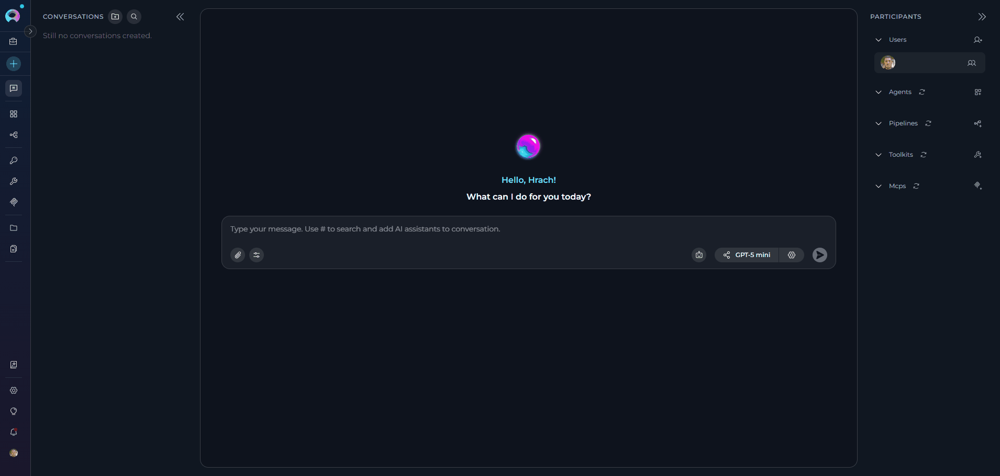
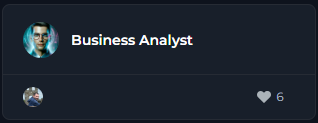
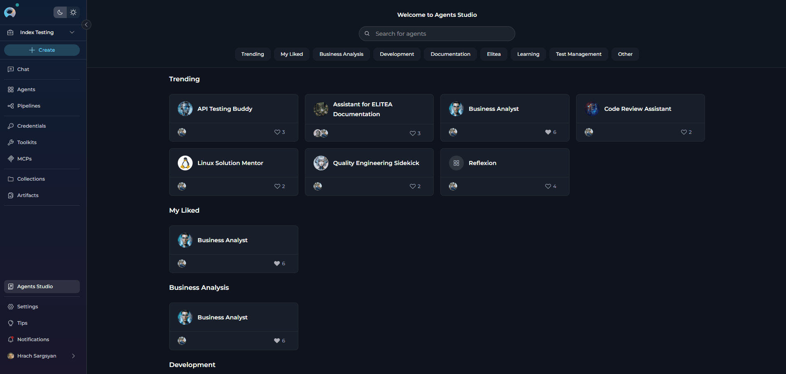
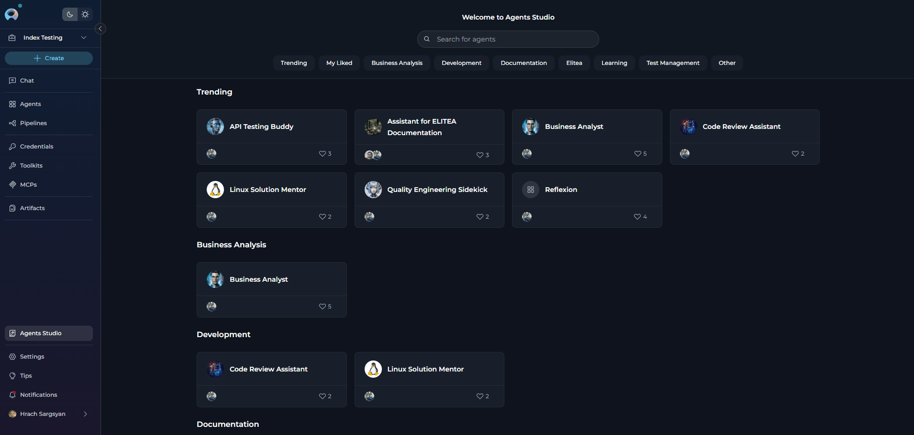
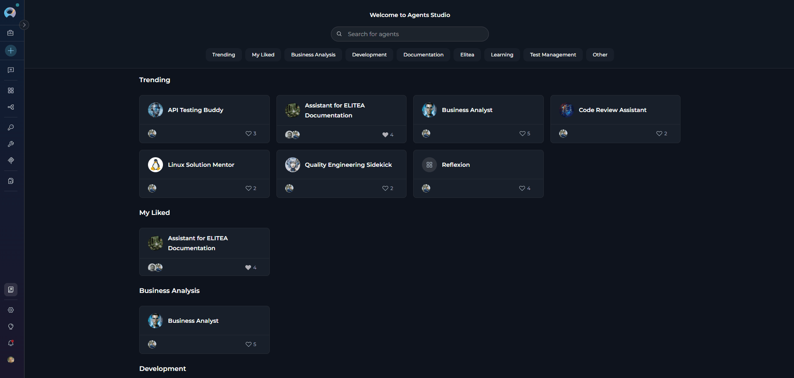

# Agents Studio

## Introduction

The **Agents Studio** is a dedicated shared library menu in ELITEA that provides centralized access to community-published agents. Similar to ChatGPT's GPTs marketplace, Agents Studio serves as a discovery hub where you can browse, search, and instantly use pre-built AI agents created by the ELITEA community.

**Key Benefits:**

* **Instant Access:** Browse and use published agents without creating them from scratch
* **Community-Driven:** Leverage expertise and creativity from the ELITEA community
* **Quality Assured:** All agents undergo moderation review before publication
* **Quick Discovery:** Find agents through search, categories, and trending sections
* **Seamless Integration:** Add agents directly to conversations with one click

!!! info "Important Note"
    Agents Studio is available across all projects and provides a centralized view of all published agents, regardless of which project you're currently viewing.

---

## Overview

### What is Agents Studio?

Agents Studio is a shared library menu that showcases all published agents from the ELITEA community. Each agent is a pre-configured AI assistant designed for specific tasks, complete with custom instructions, conversation starters, and optimized settings.

**Typical Use Cases:**

* **Quick Task Automation:** Find agents for common tasks like code review, documentation, or data analysis
* **Learning & Inspiration:** Explore how other users structure agents and configure instructions
* **Rapid Prototyping:** Start conversations with proven agents instead of building from scratch
* **Best Practices:** Leverage community expertise in specific domains
* **Workflow Enhancement:** Integrate specialized agents into your daily workflows

**How Agents Studio Differs from the Agents Menu**

| Feature | Agents Studio | Agents Menu |
|---------|--------------|-------------|
| **Purpose** | Discover and use community agents | Manage your personal agents |
| **Content** | Published agents from all users | Only your created agents |
| **Access Level** | Read-only with temporary modifications | Full edit capabilities |

---

## Accessing Agents Studio

The **Studio** menu icon is located in the main navigation sidebar.

**To Access:**

1. Open ELITEA and ensure you're logged in
2. Look for the **Studio** icon in the left sidebar navigation
3. Click the **Studio** icon to open the Agents Studio view

---

## Agent Card Display

Published agents are displayed as cards in a responsive grid layout, grouped by their assigned categories. Each card provides key information at a glance:

**Card Elements:**

* **Agent Name:** The agent's display name
* **Creator Avatar:** Profile image of the agent's creator
* **Like Count:** Number of likes the agent has received

**Available Actions:**

* **Click Card:** Opens the agent detail modal with full information
* **Like Agent:** Click the heart icon to like/unlike the agent

---

## Browsing and Searching Agents

At the top of the Agents Studio view, you'll find a **Search field** that allows real-time search across published agents.

**Search Capabilities:**

* **Agent Name:** Search by the agent's title
* **Description:** Find agents based on their description content
* **Real-time Results:** Search results update as you type

**How to Search:**

1. Click in the search field at the top of Studio view
2. Type keywords related to the agent you're looking for
3. Results filter automatically as you type
4. Clear the input field to reset the search

**Category Filters**

Below the search field, you'll find **Category filters** that help you browse agents by popularity and recency.

**Available Categories:**

| Category | Description |
|----------|-------------|
| **Trending** | Agents with the most likes from the community |
| **My Liked** | Agents you have personally liked |
| **Business Analysis** | Agents designed for business analysis tasks |
| **Development** | Agents focused on software development and coding |
| **Documentation** | Agents specialized in creating and managing documentation |
| **Elitea** | Platform-specific agents for ELITEA workflows |
| **Learning** | Educational and training-focused agents |
| **Test Management** | Agents for test planning, execution, and quality assurance |
| **Other** | Miscellaneous agents that don't fit specific categories |

**How to Use Categories:**

1. Click on a category button to filter agents
2. Multiple filters can be applied simultaneously
3. Active category is highlighted
4. Agent cards update automatically based on selected filters

---

## Viewing Agent Details

Clicking on any agent card opens a **pop-up modal** that displays comprehensive information about the agent.

**Modal Contents:**

* **Creator Information:** Details about who created the agent
* **Like Button:** Option to like/unlike the agent
* **Agent Title:** Full name of the agent
* **Description:** Detailed explanation of the agent's purpose and capabilities
* **Show Context Button:** Click to open a read-only modal displaying the agent's full instructions and configuration details. You can read and copy the instructions but cannot modify them
* **Conversation Starters:** Pre-defined prompts to help users get started
* **Welcome Message:** The greeting users see when starting a conversation
* **Start Conversation Button:** Primary action to begin using the agent

---

## Starting a Conversation with an Agent

**Start Conversation Flow**

You can start a conversation with an agent in two ways:

1. **Click "Start Conversation" Button:** Creates a new conversation and displays conversation starters
2. **Click a Conversation Starter:** Creates a new conversation and pre-fills the starter text in the chat input field

**What Happens:**

1. **Navigation to Chat:** You're automatically redirected to the Chat menu
2. **New Conversation Created:** A fresh conversation is created specifically for this agent
3. **Agent Added as Participant:** The agent is added to the Participants list
4. **Agent Activated:** The agent is set as the active participant
5. **Conversation Starters Displayed:** Pre-defined prompts appear to guide your interaction (or if you clicked a starter, it's pre-filled in the input field)
6. **Ready to Chat:** You can immediately start sending messages

Once the conversation is created, you can:

* **Use Conversation Starters:** Click any starter to send that prompt immediately
* **Type Custom Message:** Enter your own message in the input box
* **Modify Model Settings:** Adjust LLM model and model parameters (see Modification Restrictions below)

---

## Modification Restrictions

 **What You Can Modify**

When using a published agent in a conversation, you have **limited modification capabilities** to maintain the integrity of the published agent:

**Allowed Modifications (Conversation-Specific):**

* **LLM Model Selection:** Change which AI model the agent uses
* **Model Settings:** Adjust parameters like:
    * Temperature
    * Top-P
    * Top-K
    * Max Completion Tokens
* **Variable Values:** Provide or modify values for variables defined in the agent

**How to Modify:**

1. With the agent active in a conversation, click the **Settings** icon next to the agent name in the Participants section
2. In the Model Settings dialog, select a different model or adjust parameters
3. Click **Apply** to save your changes
4. Changes apply only to this conversation - they don't affect the published agent

**What You Cannot Modify**

The following agent properties are **read-only** to preserve the published agent's design and functionality:

**Read-Only Properties:**

* **Agent Name:** Cannot be renamed
* **Instructions:** Core behavior and task guidelines are locked
* **Welcome Message:** Cannot be edited
* **Conversation Starters:** Cannot add, remove, or modify starters
* **Toolkits:** Cannot remove ar add toolkits that are part of the published agent
* **Variable Definitions:** Cannot add or remove variables (but can modify their values)

!!! warning "Important"
    All modifications you make (LLM model, settings,Variable values) apply **only to your current conversation**. They do not affect the original published agent or how other users experience it. If you want to create your own version with full editing capabilities, you'll need to create a new agent in the Agents menu.

!!! tip "Alternative Methods"
    You can also add published agents directly from the Chat interface. See **[How to Use Public Agents from Chat](../how-tos/chat-conversations/use-public-items-from-chat.md)** for detailed instructions on using the # search or the Participants panel to add agents.

---

## Agent Capabilities and Limitations
 
When using published agents from Studio, keep these considerations in mind:

**Capabilities:**

* **Immediate Execution:** Published agents work instantly in conversations
* **Specialized Expertise:** Agents are designed for specific tasks and domains
* **Conversation Starters:** Pre-written prompts help you get started quickly
* **Optimized Settings:** Agents come with tested configurations
* **Community Support:** Popular agents have been used and validated by others

**Limitations:**

* **Read-Only Core Config:** Cannot modify instructions or core settings
* **Toolkit Dependencies:** Some agents may require specific toolkits to be configured
* **Model Restrictions:** Published agent may be optimized for specific models
* **No Versioning Access:** You see the published version, not version history
* **Creator Control:** Original creator controls updates to the published version

**Access Permissions:**

* **All Users:** Can browse, search, and use all published agents
* **No Publishing from Studio:** You cannot publish agents from Studio (use Agents menu)
* **Conversation Privacy:** Your conversations with published agents are private to you
* **Data Handling:** Published agents follow ELITEA's data privacy policies

**Security Considerations:**

* **Moderation Reviewed:** All published agents undergo moderator approval
* **No Sensitive Data:** Published agents should not contain credentials or sensitive information

---

## Troubleshooting

**Common Issues and Solutions**

### Agent Not Appearing in Studio

**Problem:** Expected agent doesn't show up in Agents Studio

**Possible Causes and Solutions:**

* **Not Yet Published:** Only agents that have been published and approved appear in Studio
    * **Solution:** Ask the creator if they've published the agent
* **Moderation Pending:** Agent may still be under review
    * **Solution:** Wait for moderator approval (creators receive notifications)
* **Rejected:** Agent may have been rejected during moderation
    * **Solution:** Only approved agents appear in Studio
* **Search/Filter Issue:** Agent may be filtered out by current search or category
    * **Solution:** Clear search and reset filters to view all agents

### Cannot Start Conversation with Agent

**Problem:** Clicking "Start Conversation" doesn't work or produces an error

**Possible Causes and Solutions:**

* **Connection Issue:** Network connectivity problem
    * **Solution:** Check internet connection and refresh the page
* **Session Expired:** Your login session may have timed out
    * **Solution:** Refresh the page and log in again if prompted
* **Browser Cache:** Cached data may be causing conflicts
    * **Solution:** Clear browser cache or try incognito/private browsing mode
* **Permissions Issue:** Rare case of insufficient permissions
    * **Solution:** Contact your administrator to verify Chat access permissions

### Agent Behavior Different from Expected

**Problem:** Published agent doesn't perform as described

**Possible Causes and Solutions:**

* **Missing Variable Values:** Agent may require variable inputs that weren't provided
    * **Solution:** Check if the agent uses variables and provide required values when prompted
* **Model Compatibility:** Selected model may not be optimal for the agent
    * **Solution:** Try different LLM models in Model Settings
* **Incomplete Information:** Agent may need more context to perform correctly
    * **Solution:** Provide more detailed input or use conversation starters as guidance
* **Version Issue:** Published version may be outdated
    * **Solution:** Check if creator has published a newer version or contact creator

### Search Not Finding Agents

**Problem:** Search returns no results even when agents exist

**Possible Causes and Solutions:**

* **Spelling:** Search term may be misspelled
    * **Solution:** Try alternative spellings or broader keywords.Search by description keywords or browse categories
* **Special Characters:** Special characters may interfere with search
    * **Solution:** Remove special characters and use simple keywords

---

## Best Practices

**Finding the Right Agent**

Effective Discovery Strategies:

1. **Start with Trending:** Browse trending agents to find proven, popular solutions
2. **Use Specific Keywords:** Search with task-specific terms (e.g., "code review," "documentation")
3. **Check Descriptions:** Read full descriptions to understand capabilities and limitations
4. **Review Conversation Starters:** Starters often reveal the agent's core functionality
5. **Test Multiple Agents:** Try different agents for the same task to compare approaches

**Using Agents Effectively**

Maximize Agent Value

1. **Use Conversation Starters:** Start with provided prompts to understand agent capabilities
2. **Provide Context:** Give agents sufficient context in your messages
3. **Configure Required Toolkits:** Set up necessary credentials for toolkit-dependent agents
4. **Adjust Model Settings:** Experiment with different models if results aren't optimal
5. **Read Welcome Messages:** Welcome messages often contain important usage instructions

**Building on Published Agents**

Learning from Studio Agents

1. **Study Instructions:** Learn how successful agents structure their behavior guidelines
2. **Analyze Conversation Starters:** See how effective prompts are crafted
3. **Create Your Own:** Use insights to build custom agents in the Agents menu
4. **Share Back:** Once you've created valuable agents, consider publishing them

---

!!! info "Related Documentation"
    For more information on related features and workflows, refer to these guides:

    * **[Agents Menu](agents.md)** - Create and manage your personal agents
    * **[Chat Menu](chat.md)** - Complete guide to chat interface and conversations
    * **[How to Use Public Agents from Chat](../how-tos/chat-conversations/use-public-items-from-chat.md)** - Detailed guide on using published agents in conversations
    * **[How to Create and Edit Agents from Canvas](../how-tos/chat-conversations/how-to-create-and-edit-agents-from-canvas.md)** - Visual agent creation guide
    * **[Agent Versioning](../how-tos/agents-pipelines/entity-versioning.md)** - Understanding agent versions and publishing

---
