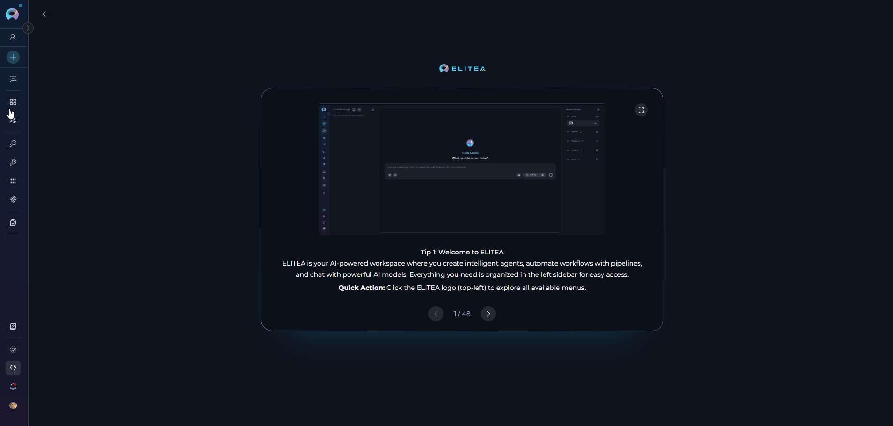
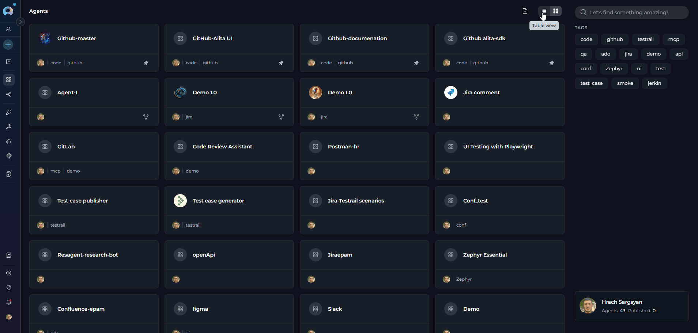
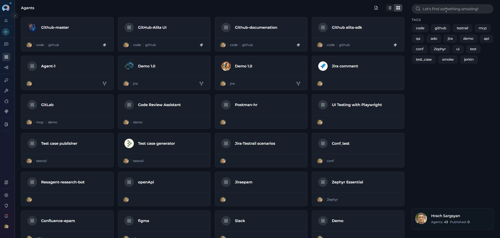
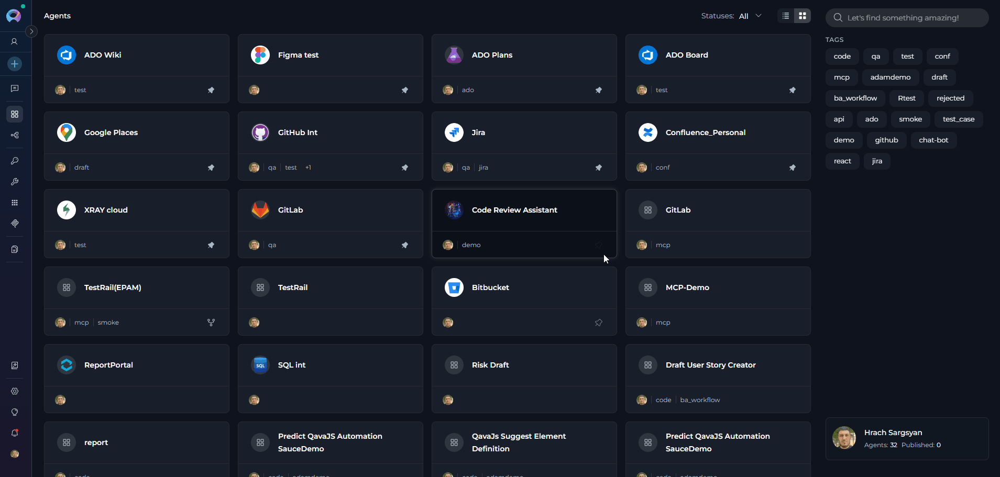
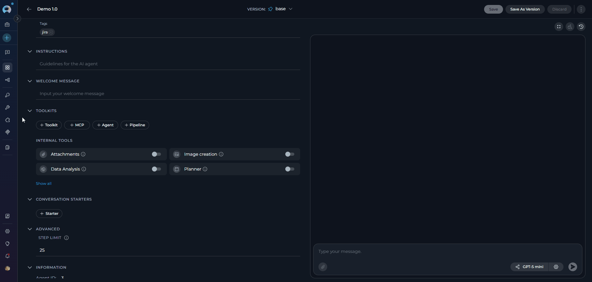
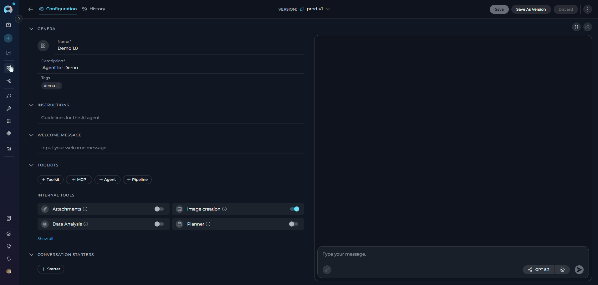
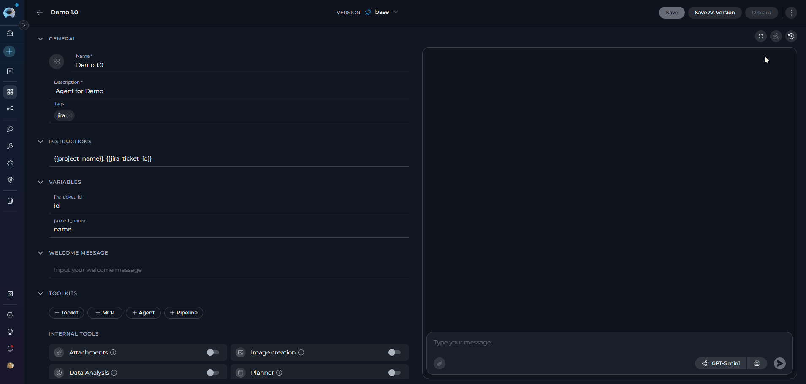

# Agents

## Overview

**What are ELITEA Agents?**

ELITEA Agents are customizable AI-powered virtual assistants that automate tasks and streamline workflows within the ELITEA platform. Each agent is purpose-built to handle specific tasks or workflows based on custom instructions, integrated toolkits, and AI model capabilities you configure. Agents can interact with external services, make intelligent decisions, and perform complex actions—from creating Jira tickets and managing GitHub repositories to analyzing data and generating documentation.

{: loading=lazy }

**Why Use Agents?**

Unlike open-ended AI conversations, agents provide a structured and efficient approach to task automation:

* **Task Automation**: Automate repetitive and complex multi-step workflows without constant human intervention
* **Increased Productivity**: Reduce manual effort by delegating routine tasks to intelligent agents
* **Consistency**: Ensure standardized processes and outputs across your team
* **Integration**: Seamlessly connect multiple tools and services to create powerful automated workflows
* **Scalability**: Deploy agents across different domains and scale operations as your needs grow

**How Agents Work**

Creating an agent involves three key components:

1. **Instructions**: Define the agent's behavior, goals, and decision-making logic through custom instructions
2. **Toolkits & Integrations**: Connect external services (GitHub, Jira, Slack, etc.) and internal tools (Python Sandbox, Data Analysis, Planner) to extend capabilities
3. **AI Model Configuration**: Select and configure the appropriate language model (GPT-4o, GPT-5.1, etc.) with optimal settings for your use case

Once configured, the agent leverages advanced natural language processing to interpret instructions, interact with connected tools, and autonomously execute tasks while adapting to changing conditions.

**Key Capabilities**

* **Autonomous Operation**: Independently executes tasks and makes decisions based on predefined instructions and goals
* **Proactive Problem-Solving**: Determines optimal next steps to achieve objectives, even without explicit guidance
* **Multi-Service Integration**: Combines external toolkits (project management, version control, testing tools) with internal capabilities
* **Flexible Customization**: Tailor instructions, tools, and model settings to match specific requirements and workflows
* **Version Management**: Create, manage, and publish different versions of agents for various use cases
* **Context Awareness**: Maintain conversation context and manage token budgets for efficient, focused interactions

By leveraging ELITEA Agents, you can unlock AI-driven automation that transforms task execution, increases efficiency, and enables your team to focus on strategic and creative work.

## Navigating the Agents Menu

The Agents menu is accessible from the main platform navigation. Upon entering the Agents section, you'll see a dashboard listing all created agents for your project.

  {: loading=lazy }

### Agents Dashboard

The Agents dashboard provides multiple ways to view and manage your agents:

**View Options**

* **Card View** - Visual cards displaying agent name, description, and key information. Ideal for browsing and quick identification.
* **Table View** - Organized list format with columns for detailed agent information. Better for managing large numbers of agents.

Switch between views using the view toggle button in the top-right corner of the dashboard.

**Search and Filter**

* **Search Bar** - Quickly find agents by typing the agent name or related keywords
* **Filter by Status** - Filter agents by their status to organize and view agents based on their current state:
    * **All** - Shows all agents regardless of status
    * **Drafts** - Agents that are still being developed and not yet published
    * **Published** - Agents that have been published and are available for use
    * **Moderation** - Agents that are under review by moderators
    * **Approval** - Agents awaiting final approval before publication
    * **Rejected** - Agents that were rejected during moderation
* **Filter by Tags** - Filter agents by their assigned tags to find agents in specific categories or with particular characteristics. Select one or multiple tags to narrow down the list.

**Pinning Agents**

Pin frequently used agents to keep them at the top of your list for quick access:

1. Locate the agent you want to pin
2. Click the pin icon (📌) on the agent card or in the table row
3. Pinned agents will appear at the top of the list, separated from unpinned ones
4. Click the pin icon again to unpin the agent

{loading=lazy}

---

## Creating an Agent

To set up a new agent:

1. Click the **+ Create** button located at the top of the main sidebar.
2. In the **General** section, fill out the required fields:
      - **Name**: Enter a unique name for your agent(e.g., "Test Case Generator", "Code Review Assistant", "Documentation Writer")
      - **Description**: Provide a clear description of the agent's purpose(e.g., "Generates comprehensive test cases from user stories and acceptance criteria", "Reviews code for best practices and suggests improvements")
      - **Tags** (optional): Add tags by typing a tag name or selecting from pre-existing tags
3. In the **Instructions** section, provide detailed guidelines for the AI agent that specify how it should behave and what tasks it should perform.
4. Optionally, add and configure **Welcome Message** and **Conversation Starter**. 
5. In the **Advanced** section (optional):
         - **Step Limit**: Set the maximum number of tool execution steps the agent can perform in a single turn (range: 0-999, default: 25). This parameter controls how many iterations the agent can execute before stopping, preventing infinite loops and managing resource usage. A higher step limit allows more complex multi-step workflows, while a lower limit ensures faster execution for simpler tasks.
6. Click **Save**.

After clicking **Save**, the agent configuration page will open, where you can:

* **Add Toolkits**: Integrate external services and APIs to extend your agent's capabilities
* **Add Agents, MCPs, and Pipelines**: Include other agents, Model Context Protocol servers, or pipelines to enhance functionality
* **Select AI Model**: Choose the appropriate language model (e.g., GPT-4o, GPT-5.1) for your agent
* **Configure Model Settings**: Adjust parameters such as reasoning level, creativity, and token limits to optimize performance
* **Enable Internal Tools**: Toggle Python Sandbox, Data Analysis or Planner tools as needed

Your newly created agent will subsequently appear on the **Agents** page for your project.

{: loading=lazy }

!!! tip "Adding a Custom Image"
    When configuring Agents, you can further personalize their profiles by adding a custom image along with the **Name** and **Description**. This feature allows you to create a unique, visually distinct identity for each Agent, making them easier to recognize and manage.

    To add an image:

    1. Click the **Pen Icon** next to the image placeholder. Clicking this icon will open the image upload interface.
    2. Click the **Upload a Custom Image** icon to upload a custom image from your local system to personalize the Agent's profile.
    3. **Use Default Images** from a set of default images provided by the platform.

    {: loading=lazy }

### How to select and configure Toolkits

Toolkits are integrations with external or ELITEA's internal services that enhance your agent's capabilities by allowing it to interact with various resources and perform specific tasks. In addition to toolkits, you can also add other Agents, MCPs (Model Context Protocol servers), and Pipelines to extend your agent's functionality. You can add these resources to your agent during the creation process or edit them later.

**Adding Resources to Your Agent**:

1. In the agent creation or editing interface, navigate to the toolkits section
2. Click the **+Toolkit** button to browse available resources
3. You can add the following types of resources:
      - **[Toolkits](toolkits.md)**: Select an existing toolkit from the list or click **"+ Create New"** to create a new toolkit
      - **Agents**: Add nested agents to enable your agent to delegate tasks or collaborate with specialized agents
      - **[MCPs](mcps.md)**: Integrate Model Context Protocol servers to provide additional context and capabilities. You can select an existing MCP from the list or click "+ Create New" to create a new MCP
      - **[Pipelines](pipelines.md)**: Include pipelines to orchestrate complex multi-step workflows

> **Note:** Your changes are saved automatically when you add or remove resources.

{: loading=lazy }

### INTERNAL TOOLS

ELITEA provides built-in internal tools that extend your agent's capabilities without requiring external integrations. These tools enable your agents to perform specialized tasks directly within the platform.

**Available Internal Tools**:

* **[Python Sandbox](../how-tos/chat-conversations/python-sandbox-internal-tool.md)**: Enables secure Python code execution using Pyodide. Your agent can execute Python code, perform calculations, analyze data, and use compatible Python packages like numpy, pandas, and matplotlib.

* **[Data Analysis](../how-tos/chat-conversations/data-analysis-internal-tool.md)**: Enables comprehensive data analysis capabilities using pandas and natural language queries. Your agent can process CSV files, Excel spreadsheets, perform statistical analysis, and generate visualizations.

* **[Planner](../how-tos/chat-conversations/planner-internal-tool.md)**: Provides structured planning and task breakdown capabilities, helping your agent organize complex workflows into manageable steps.

**How to Enable Internal Tools**:

1. In the **TOOLKITS** section, scroll to the bottom to find the internal tools
2. Each tool has its own toggle switch - enable the ones you want to use:
   - Python Sandbox toggle
   - Data Analysis toggle
   - Planner toggle

{: loading=lazy }

### How to Create Instructions

The **Instructions** section is the core component where you define how your agent should behave and what tasks it should perform. This field serves as the foundational knowledge base that guides the AI model in understanding and processing your specific requests.

**How to Input Instructions**

* **Identify Key Information**: Before entering data into the Instructions field, identify the essential details or instructions that the model needs to know to fulfill your request effectively. This could include the topic, specific terms, relevant background information, or the scope of the task.
* **Enter the Details**: In the Instructions field, clearly and concisely input the identified information. Ensure that the information is directly relevant to the task to maintain the agent's focus and efficiency.
* **Using toolkits**: For enhancing agent's capabilities, you can integrate toolkits and provide instructions how to use them and in which order. The name of toolkit can be denoted by "", (e.g. "Access_JIRA" toolkit).

{: loading=lazy }

### WELCOME MESSAGE

The **Welcome Message** feature allows you to provide additional context and instructions that appear when users interact with your agent in the chat interface. This message helps set expectations and guide users on how to best utilize the agent.

**How to Add the Welcome Message**:

1. **Access the Welcome Message Section**: In the agent creation or Configuration interface, navigate to the Welcome Message section.
2. **Add the Welcome Message**: Type the welcome message text in the input field.
3. **Save the Configuration**: After entering the desired text, ensure to save the changes to the agent. This action makes the configured welcome message available to users in the **Chat** section.

**Using the Welcome Message**:

When users go to the **Chat** section of the agent, they will see the configured **Welcome Message**. It provides helpful context and instructions to guide their interaction with the agent.

{: loading=lazy }

!!! example "Examples of Welcome Message"
    * "Use this agent for generating manual test cases"
    * "Don't forget to double-check the generated test cases"
    * "I can help you analyze code, write documentation, and review pull requests"

### CONVERSATION STARTERS

The **Conversation Starter** feature enables you to configure predefined prompts that help users quickly initiate specific types of interactions with your agent. These starters appear as clickable buttons in the chat interface, making it easy for users to get started.

**How to Add a Conversation Starter**:

1. **Access the Configuration Panel**: Navigate to the **Conversation Starter** section in the agent creation or editing interface.
2. **Add a Conversation Starter**: Click the `+` icon to open the text input field where you can type the text you wish to use as a conversation starter.
3. **Save the Configuration**: After entering the desired text, ensure to save the changes to the agent. This action makes the configured conversation starter available for use.

**Using a Conversation Starter**:

**Initiate a Conversation**: Go to the **Chat** section of the agent. Here, you will find the saved conversation starters displayed as clickable options. Click on the desired starter to automatically populate the chat input and execute the agent.

{: loading=lazy }

!!! example "Examples of Conversation Starters"
    * "Generate test cases for provided Acceptance Criteria."
    * "Generate automatic test cases for selected [Test_Case_ID]."
    * "Review this code and suggest improvements."
    * "Help me write documentation for this feature."

By setting up conversation starters, you streamline the process of initiating specific tasks or queries, making your interactions with the agent more efficient and standardized.

## How to Execute Agent

To execute the agent and get the output:

1. **Configure the Agent**: Ensure your agent is properly configured with clear instructions and any necessary toolkits.
2. **Navigate to Chat**: Access the agent's chat interface by clicking on the agent from your agents list.

### Selecting and Configuring the AI Model

Before executing your agent, you need to select an appropriate AI model and optionally adjust its settings:

1. **Select the AI Model**: In the chat interface, choose the appropriate AI model (e.g., gpt-4o, gpt-5.1, etc.) from the model selection dropdown.
2. **Adjust Model Settings** (Optional): Click the **Model Settings** icon (⚙️) next to the model selector to fine-tune the response generation. The settings vary depending on the selected model:

    **For Reasoning Models** (e.g., GPT-5.1):
    
    * **Reasoning** - Controls the depth of logical thinking and problem-solving with three levels:
        * **Low**: Fast, surface-level reasoning with concise answers and minimal steps
        * **Medium**: Balanced reasoning with clear explanations and moderate multi-step thinking (default)
        * **High**: Deep, thorough reasoning with detailed step-by-step analysis (may be slower)
    
    **For Standard Models** (e.g., GPT-4o):
    
    * **Creativity** - Controls response randomness and creativity. Lower values produce more focused and deterministic outputs, while higher values generate more diverse and creative responses with five levels (1-5):
        * **1**: Highly focused and deterministic outputs
        * **2**: Mostly focused with slight variation
        * **3**: Balanced between focus and creativity (default)
        * **4**: More varied and creative responses
        * **5**: Maximum creativity and diversity
    
    **Max Completion Tokens** Limits the maximum length of AI responses measured in tokens (roughly 4 characters per token).(All Models):
    
    * **Auto** (default): System automatically sets the token limit to 4096 tokens
    * **Custom**: Manually set a specific token limit for responses
        * When Custom is selected, you can enter a specific number of maximum tokens
        * The interface shows remaining tokens available after your specified limit
        * Setting too high a value will show an error if it exceeds the model's maximum output tokens

    {: loading=lazy }   

### Managing Context Budget

When the `context_manager` secret is enabled at the project level, the **Context Budget** widget appears above the chat interface to help you manage conversation token usage effectively.

!!! info "Learn More About Context Management"
    For detailed information about context management configuration and best practices, see the **[Context Management Guide](../how-tos/chat-conversations/context-management.md)**.

**What is Context Management?**

Context Management provides intelligent control over conversation token usage through automated message pruning and summarization. It helps maintain conversation continuity while staying within model token limits by automatically managing message history, generating summaries of older conversations, and preserving important messages.

**Accessing the Context Budget Widget**

1. Ensure the `context_manager` secret is set to `true` in your project settings (Settings → Secrets)
2. Send the first message to initiate the agent conversation
3. The **Context Budget** widget appears above the chat panel after the first message
4. Monitor real-time token usage and management status
5. Click on the widget to expand and view detailed metrics

**Widget Views**

* **Collapsed View**: Shows essential token usage status with a color-coded indicator (Green: normal, Orange: high usage)
* **Compact View**: Displays pruning strategy, message count, and summaries count
* **Expanded View**: Provides comprehensive configuration options including:
  - Context Strategy & Token Management (pruning strategy, max tokens, preserve recent messages)
  - Summarization settings (enable/disable, summary parameters)
  - System Messages management

**Key Features**

* **Real-time tracking**: Monitor token consumption as your agent processes requests
* **Automatic pruning**: System removes older messages when context limit is reached
* **Summarization**: Generate summaries of conversation history to preserve context
* **Message preservation**: Configure how many recent messages to always keep

{: loading=lazy }

### Starting and Interacting with Your Agent

**Start Interaction**: Begin your conversation by either:
   - Clicking on a **Conversation Starter** (if configured) to use a predefined prompt
   - Typing your question or command directly into the chat input field
   - Using simple commands like "Go", "Start Generating", "Execute", or "Run it" followed by clicking the **Send** button

**Additional Interaction Features:**

* **Full Screen Mode**: Increase the size of the output window for better visibility and focus. This mode can be activated to expand the output interface to the full screen.
* **Continue the Dialogue**: To keep the conversation going, simply type your next question or command in the chat box and click the **Send** icon.
* **Copy the Output**: Click the **Copy to Clipboard** icon to copy the generated text for use elsewhere.
* **Regenerate Response**: If the output isn't satisfactory, click the **Regenerate** icon to prompt the Gen AI to produce a new response.
* **Delete Output**: To remove the current output from the chat, click the **Delete** icon.
* **clear the Chat**: For a fresh start or to clear sensitive data, click the **Clean** icon to erase the chat history.
* **Like or Dislike the Output**: 
      * Click the **Like** icon if the output meets your expectations.
      * Click the **Dislike** icon if the output is unsatisfactory. Upon disliking, you will have the option to leave a comment explaining why the output did not meet your expectations. This feedback helps improve the system's performance and relevance.

{: loading=lazy }

## Managing Agent Versions: Save, Create Versions, Publish and Manage

To optimally manage your agent, understanding how to save and create versions is crucial. Follow these guidelines to efficiently save your agent, create versions, and manage them.

**How to Save an Agent:**

* To save your work on an agent for the first time, simply click the **Save** button. This action creates what's known as the "**latest**" version of your agent.
* You can continue to modify your agent and save the changes to the "**latest**" version at any time by clicking the **Save** button again. If you wish to discard any changes made, you have the option to click the **Discard** button before saving.

**Remember**: The "**latest**" version represents the initial version you create. You can keep updating this version with your changes by saving them, without the need to create additional versions for your agent.

### How to Create New Versions:

For instances where you need to create and manage different iterations of your agent:

1. **Initiate a New Version**: Start by clicking the **Save As Version** button.
2. **Name Your Version**: When saving your work, provide a version name that clearly identifies the iteration or changes made. Click **Save** to confirm your entry. 

**Best Practices for Version Naming**:

* **Length**: Keep the version name concise, not exceeding 48 characters. This ensures readability and compatibility across various systems.
* **Characters**: Avoid using special characters such as spaces (" "), underscores ("_"), and others that might cause parsing or recognition issues in certain environments.
* **Clarity**: Choose names that clearly and succinctly describe the version's purpose or the changes it introduces, facilitating easier tracking and management of different versions.

Upon creating a new version of the agent, several options become available to you:

* **Delete**: Remove this version of the agent if it’s no longer needed.
* **Execute**: Run this specific version of the agent to see how it performs.
* **Navigate Versions**: Use the **Version** dropdown list to switch between and select different versions of the agent. This allows for easy comparison and management of various iterations.

{: loading=lazy }

### Publishing an Agent Version

The **Publish** functionality allows you to make a specific version of your agent available for public use after moderator approval. This ensures that only reviewed and approved versions are accessible to users.

**How to Publish an Agent Version:**

1. Navigate to the top menu and click the **Publish** button. A dialog box will appear prompting you to confirm the publishing process.
2. **Provide a Version Name**. Enter a meaningful name for the version you want to publish. This helps in identifying the version during the review process.
3. **Submit for Approval**:
   * Once you click **Publish**, the version will be sent to a moderator for review.
   * The moderator will evaluate the agent version and either approve or reject the request.

{: loading=lazy }

**What Happens After Publishing:**

* **If Approved**:
  * The agent version will be made publicly available for use.
  * Users will be able to access and execute the published version in Agent studio

* **If Rejected**:
  * The moderator may provide feedback on why the version was not approved.
  * You can make the necessary changes and resubmit the version for approval.

## Viewing Agent History

The **History** tab provides a complete audit trail of all past executions of your agent. This feature allows you to:

- **Review past conversations**: View complete chat histories from previous agent runs
- **Track performance**: Monitor execution duration across different versions
- **Debug issues**: Replay conversations to identify where problems occurred
- **Compare versions**: See how different agent versions performed with the same inputs
- **Audit trail**: Maintain records of all agent interactions for compliance purposes

The History tab displays runs in a two-panel layout with a list of all executions on the left (showing date, version, and duration) and the complete conversation replay on the right when you select a run.

{: loading=lazy }

!!! info "Learn More About Agent History"
    For detailed instructions on using the History tab, please refer to the **[Agents and Pipelines History Guide](../how-tos/agents-pipelines/agents-pipelines-history.md)**.

---

## Best Practices

??? tip "Write Clear Instructions"
    Provide specific, actionable instructions that clearly define your agent's behavior and goals. Use examples and step-by-step guidance.

??? tip "Test Your Agent Thoroughly"
    Test your agent with various inputs before deploying it. Use conversation starters to verify expected behavior.

??? tip "Use Version Management"
    Create named versions for significant changes. This allows you to roll back if needed and compare different iterations.

??? tip "Monitor Agent Performance"
    Regularly review agent history to identify issues, track performance, and understand how users interact with your agent.

??? tip "Keep Toolkits Updated"
    Ensure connected toolkits have valid credentials and up-to-date configurations. Test toolkit integrations regularly.

??? tip "Enable Context Management"
    For long conversations, enable context management to optimize token usage and maintain conversation quality.

---

## Troubleshooting

??? warning "Agent Not Responding or Slow"
    Check your AI model selection and settings. High reasoning levels or large token limits may slow responses. Verify toolkit connections are working.

??? warning "Unexpected or Incorrect Outputs"
    Review agent instructions for clarity. Ensure toolkits are properly configured. Check conversation history to understand context issues.

??? warning "Toolkit Integration Failures"
    Verify credentials are valid and not expired. Test the toolkit independently using the Test Settings panel. Check network connectivity and permissions.

??? warning "Cannot Publish Agent"
    Ensure you have publishing permissions. Check that all required fields are completed. Review moderation guidelines if submission was rejected.

??? warning "Version Not Available"
    Verify the version was saved successfully. Check permissions if trying to access another user's version. Refresh the page and try again.

??? warning "Agent Not Appearing in List"
    Clear search filters and check status filters. Verify you're in the correct project. Refresh the agents dashboard.

For further assistance, contact your platform administrator.

### Support Contact

If you encounter issues not covered in this guide or need additional assistance with Agent management, please refer to **[Contact Support](../support/contact-support.md)** for detailed information on how to reach the ELITEA Support Team.

---

!!! info "Additional Resources"
    For more detailed information on related topics, please refer to the following documentation:
    
    * **[Credentials](credentials.md)** - Learn how to create and manage credentials for toolkit integrations
    * **[Glossary](../home/glossary.md)** - Definitions of key terms and concepts used in the ELITEA platform    
    * **[How to Create and Edit Agents from Canvas](../how-tos/chat-conversations/how-to-create-and-edit-agents-from-canvas.md)** - Create and configure agents directly from chat interface
    * **[How to Create and Edit Toolkits from Canvas](../how-tos/chat-conversations/how-to-create-and-edit-toolkits-from-canvas.md)** - Set up toolkit integrations from conversations
    * **[How to Create and Edit Pipelines from Canvas](../how-tos/chat-conversations/how-to-create-and-edit-pipelines-from-canvas.md)** - Design multi-step workflows from chat
    * **[How to Create and Edit MCPs from Canvas](../how-tos/chat-conversations/how-to-create-and-edit-mcps-from-canvas.md)** - Configure Model Context Protocol servers from chat

